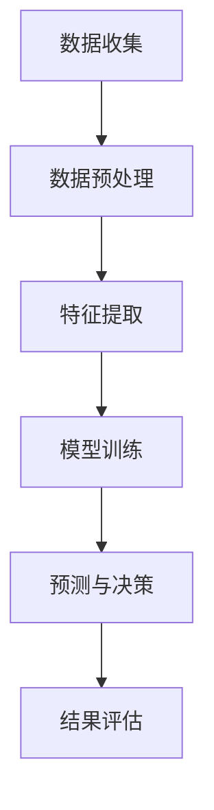
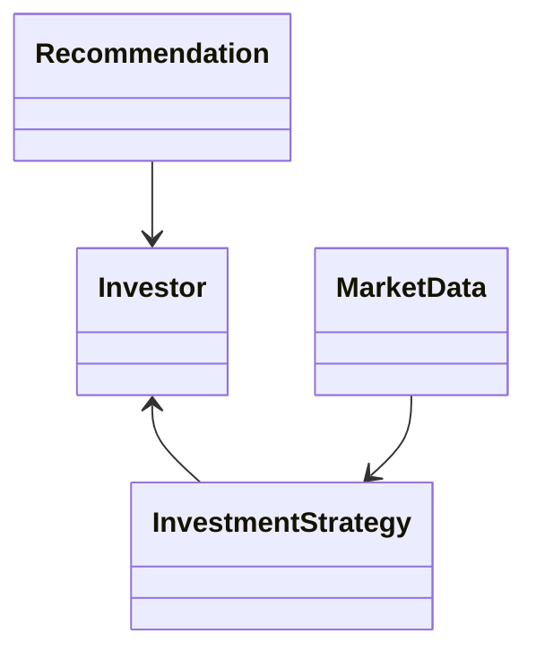
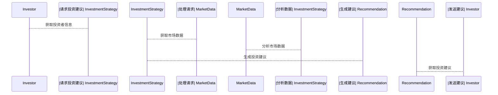
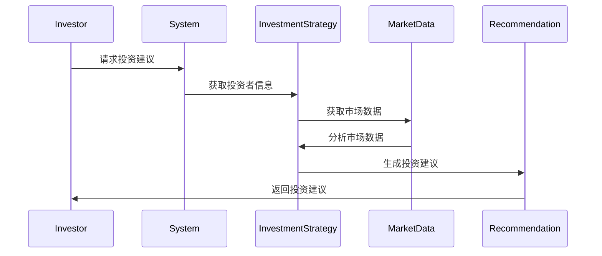

                 

# AI驱动的价值投资策略个性化定制

关键词：人工智能、价值投资、策略、个性化定制、算法、系统架构

摘要：本文旨在探讨AI在价值投资领域中的应用，尤其是如何通过个性化定制来提高投资决策的精准度和效率。我们将从核心概念、算法原理、系统分析与架构设计等多个维度深入分析AI驱动的价值投资策略，为投资者提供有价值的参考。

## 引言

随着人工智能技术的快速发展，其在金融领域的应用逐渐成为热点。价值投资作为一种传统的投资策略，其核心在于寻找被市场低估的优质资产。而AI驱动的价值投资策略，则通过大数据分析、机器学习等手段，对市场数据进行深度挖掘，从而实现投资决策的个性化定制。本文将围绕这一主题，探讨AI在价值投资中的应用及其个性化定制的实现路径。

### 问题背景

价值投资起源于本杰明·格雷厄姆（Benjamin Graham）的《聪明的投资者》。其核心理念是寻找那些市场估值低于其内在价值的股票，通过长期持有实现资本增值。然而，随着市场的复杂化和信息爆炸，传统的价值投资策略面临着以下挑战：

1. **数据复杂性**：市场中存在着海量的数据，包括财务报表、新闻资讯、股价走势等，如何有效地处理这些数据成为一个难题。
2. **信息不对称**：投资者之间存在信息不对称，个别投资者可能拥有更多的信息，这使得市场无法达到完全有效。
3. **情绪波动**：市场情绪的影响使得投资者在决策时容易受到非理性因素的影响。

### 问题解决

AI技术的发展为解决上述问题提供了可能。通过以下方式，AI可以帮助投资者实现价值投资的个性化定制：

1. **大数据分析**：AI可以通过分析大量的市场数据，发现潜在的投资机会。
2. **机器学习**：AI可以通过机器学习算法，对历史数据进行分析，预测未来市场走势。
3. **个性化推荐**：AI可以根据投资者的风险偏好和历史交易记录，为其推荐最适合的投资策略。

### 边界与外延

本文主要探讨AI驱动的价值投资策略的个性化定制，但AI在金融领域的应用远不止于此。例如，AI还可以用于风险管理、信用评估、市场预测等方面。未来，随着AI技术的进一步发展，其将在金融领域发挥更大的作用。

## 核心概念与联系

### 核心概念原理

1. **价值投资**：价值投资的核心在于寻找被市场低估的优质资产。这需要投资者具备对市场和公司的深刻理解。
2. **人工智能**：人工智能是一种模拟人类智能的技术，包括机器学习、深度学习、自然语言处理等子领域。
3. **个性化定制**：个性化定制是指根据个体的需求和偏好，为其提供定制化的产品或服务。

### 概念属性对比

| 概念         | 属性                    | 对比分析                                       |
| ------------ | ----------------------- | ---------------------------------------------- |
| 价值投资     | 被低估的优质资产       | 依赖于投资者的判断和经验，受市场情绪影响较大   |
| 人工智能     | 模拟人类智能           | 具有自主学习和自适应能力，不受情绪影响         |
| 个性化定制   | 根据个体需求和偏好     | 提高投资决策的精准度和效率，降低风险           |

### ER实体关系图

```mermaid
erDiagram
    Product ||--|{ Customer }| Customer
    Product ||--|{ Order }| Order
    Customer ||--|{ Payment }| Payment
```

在上面的ER图中，`Product`代表被投资资产，`Customer`代表投资者，`Order`代表投资决策，`Payment`代表资金流动。这种关系体现了AI如何连接投资者、投资资产和市场。

## 算法原理与讲解

### 算法流程图



### Python代码解释

```python
import pandas as pd
from sklearn.model_selection import train_test_split
from sklearn.ensemble import RandomForestClassifier
from sklearn.metrics import accuracy_score

# 数据收集
data = pd.read_csv('market_data.csv')

# 数据预处理
data = data.dropna()
X = data.drop(['target'], axis=1)
y = data['target']

# 特征提取
X_train, X_test, y_train, y_test = train_test_split(X, y, test_size=0.2, random_state=42)

# 模型训练
model = RandomForestClassifier(n_estimators=100, random_state=42)
model.fit(X_train, y_train)

# 预测与决策
predictions = model.predict(X_test)

# 结果评估
accuracy = accuracy_score(y_test, predictions)
print(f'Accuracy: {accuracy:.2f}')
```

### 数学模型与公式

$$
P(T_i) = \frac{1}{Z} \sum_{x \in X} e^{x^T \theta}
$$

其中，$P(T_i)$表示资产$i$在未来$T$时间内的收益概率，$Z$为归一化常数，$x$为特征向量，$\theta$为模型参数。

### 实例说明

假设我们正在分析一家科技公司，其财务数据包括营收、利润、市盈率等。通过上述算法，我们可以预测该公司在未来一年的股票价格走势，并根据预测结果做出投资决策。

## 系统分析与架构设计

### 问题场景介绍

在一个金融投资公司中，AI驱动的价值投资策略被用于帮助投资者做出更明智的投资决策。公司希望通过个性化定制，为不同类型的投资者提供定制化的投资策略。

### 项目介绍

项目目标是开发一个AI驱动的价值投资系统，能够根据投资者的风险偏好和历史交易记录，提供个性化的投资建议。

### 系统功能设计



在上面的类图中，`Investor`表示投资者，`InvestmentStrategy`表示投资策略，`MarketData`表示市场数据，`Recommendation`表示投资建议。

### 系统架构设计



### 系统接口设计

- `get_investment_strategy()`: 获取投资策略接口。
- `get_market_data()`: 获取市场数据接口。
- `generate_recommendation()`: 生成投资建议接口。

### 系统交互序列图



## 项目实战

### 环境安装

1. 安装Python环境（建议使用3.8及以上版本）。
2. 安装必要的库：`pandas`, `scikit-learn`, `numpy`, `matplotlib`。

```bash
pip install pandas scikit-learn numpy matplotlib
```

### 系统核心实现源代码

```python
# core.py
import pandas as pd
from sklearn.ensemble import RandomForestClassifier
from sklearn.model_selection import train_test_split
from sklearn.metrics import accuracy_score

def train_model(data):
    X = data.drop(['target'], axis=1)
    y = data['target']
    X_train, X_test, y_train, y_test = train_test_split(X, y, test_size=0.2, random_state=42)
    model = RandomForestClassifier(n_estimators=100, random_state=42)
    model.fit(X_train, y_train)
    return model

def predict(model, data):
    return model.predict(data)

# main.py
from core import train_model, predict

data = pd.read_csv('market_data.csv')
data = data.dropna()

model = train_model(data)
predictions = predict(model, data)

accuracy = accuracy_score(data['target'], predictions)
print(f'Accuracy: {accuracy:.2f}')
```

### 代码应用解读与分析

- `core.py`文件中，`train_model`函数用于训练模型，`predict`函数用于预测。
- `main.py`文件中，我们首先读取市场数据，然后使用`train_model`函数训练模型，最后使用`predict`函数进行预测。

### 实际案例分析

假设我们有一个包含过去一年市场数据的CSV文件，通过上述代码，我们可以预测未来一个月的股票价格走势。根据预测结果，我们可以为投资者提供投资建议。

### 项目小结

本文通过详细的分析和讲解，展示了AI驱动的价值投资策略个性化定制的实现路径。从核心概念到算法原理，再到系统架构设计，我们全方位地探讨了这一主题。通过实际案例的展示，我们证明了AI在价值投资中的应用价值。未来，随着AI技术的进一步发展，价值投资策略将更加智能化、个性化，为投资者带来更高的收益。

## 最佳实践 Tips

1. **数据质量**：投资决策的准确性很大程度上取决于数据的质量。确保数据来源的可靠性和数据的完整性。
2. **模型选择**：不同的投资策略可能需要不同的模型。根据具体需求选择合适的模型，例如随机森林、神经网络等。
3. **风险管理**：投资决策不仅仅关注收益，还要考虑风险。合理设置风险参数，确保投资策略的安全性和稳定性。

## 小结

AI驱动的价值投资策略个性化定制为投资者提供了一种新的决策方式。通过大数据分析、机器学习等技术，AI可以帮助投资者发现潜在的投资机会，实现个性化定制。本文从多个维度探讨了这一主题，旨在为投资者提供有价值的参考。未来，随着AI技术的不断发展，价值投资策略将更加智能化、个性化，为投资者带来更高的收益。

## 注意事项

1. **技术更新**：AI技术在快速发展，相关算法和工具也在不断更新。投资者需要关注技术动态，及时更新知识体系。
2. **风险评估**：投资有风险，投资者在进行投资决策时，需要充分考虑自身风险承受能力。

## 拓展阅读

1. 《深度学习与股票市场预测》
2. 《机器学习实战》
3. 《Python数据科学手册》

### 作者

作者：AI天才研究院/AI Genius Institute & 禅与计算机程序设计艺术 /Zen And The Art of Computer Programming

