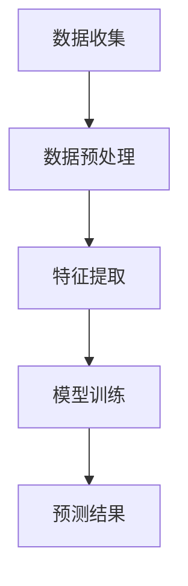
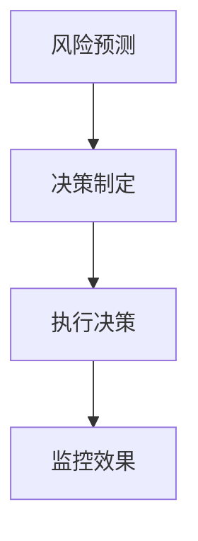
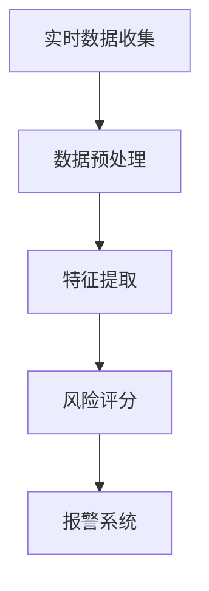
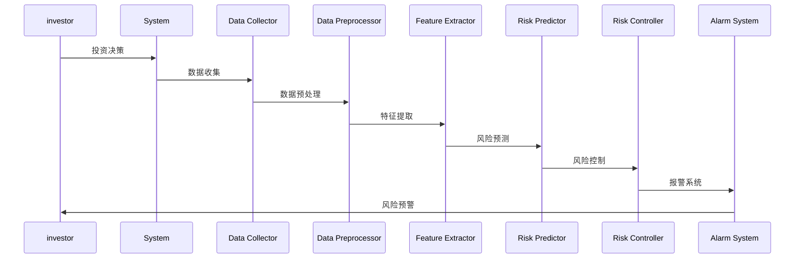
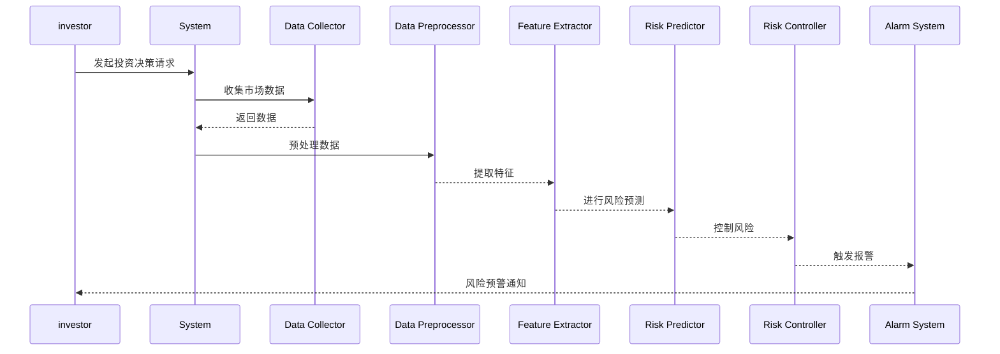

                 

## 让我们一步步深入思考：AI驱动的价值投资组合尾部风险管理

### 引言

在当今高度竞争的金融市场中，传统的投资策略和风险管理方法已经不足以应对复杂多变的市场环境。随着人工智能（AI）技术的飞速发展，AI开始逐渐渗透到各个领域，包括金融投资领域。本文将探讨如何利用AI技术来驱动的价值投资组合尾部风险管理，以实现更高效、更精准的投资决策。

### 背景介绍

**AI的发展历程**：

人工智能是一门多学科交叉的领域，涉及计算机科学、数学、神经科学等多个学科。自1950年代以来，人工智能经历了多次起伏，从最初的理想主义到现实应用，AI技术不断成熟，如今已经广泛应用于语音识别、图像处理、自然语言处理等领域。

**价值投资理论**：

价值投资是一种基于长期投资策略的投资方法，其核心在于寻找市场价格低于实际价值的股票或其他资产。价值投资的代表人物包括本杰明·格雷厄姆和沃伦·巴菲特等。他们主张通过深入研究公司的基本面，找到那些被市场低估的股票。

**尾部风险管理**：

尾部风险指的是金融市场中的极端事件，这些事件可能会对投资组合造成重大损失。传统的风险管理方法通常难以预测和处理这些极端事件，而尾部风险管理则试图通过识别和应对这些极端事件来降低投资风险。

### 核心概念与联系

**核心概念**：

- 人工智能（AI）：通过模拟人类智能行为，使计算机具备学习和解决问题的能力。
- 价值投资：一种基于公司基本面分析的投资策略，强调长期持有优质股票。
- 尾部风险：指金融市场中极端事件带来的风险，这些事件可能超出了传统风险管理的预测范围。

**概念属性特征对比表格**：

| 概念         | 特征                                       |
| ------------ | ------------------------------------------ |
| 人工智能     | 学习能力、自适应能力、解决问题的能力         |
| 价值投资     | 长期持有、基本面分析、寻找低估股票         |
| 尾部风险     | 极端事件、不确定性、难以预测                 |

**ER实体关系图架构**：

```mermaid
erDiagram
  AI --> 价值投资 : 驱动
  AI --> 尾部风险管理 : 应用
  价值投资 --> 尾部风险管理 : 结合
```

### 算法原理讲解

在AI驱动的价值投资组合尾部风险管理中，核心算法包括风险预测、风险控制和风险监测等。下面我们将分别介绍这些算法的原理。

#### 风险预测

**Mermaid流程图**：



**Python源代码**：

```python
# 导入必要的库
import pandas as pd
from sklearn.model_selection import train_test_split
from sklearn.ensemble import RandomForestClassifier

# 数据收集
data = pd.read_csv('financial_data.csv')

# 数据预处理
data = data.dropna()

# 特征提取
X = data.drop('target', axis=1)
y = data['target']

# 模型训练
X_train, X_test, y_train, y_test = train_test_split(X, y, test_size=0.2, random_state=42)
model = RandomForestClassifier()
model.fit(X_train, y_train)

# 预测结果
predictions = model.predict(X_test)
```

**算法原理与公式**：

风险预测算法的核心在于通过历史数据来训练模型，然后利用训练好的模型来预测未来可能发生的风险事件。常用的算法包括随机森林、支持向量机等。

$$
预测风险 = f(历史数据, 模型参数)
$$

#### 风险控制

**Mermaid流程图**：



**算法原理与公式**：

风险控制算法的核心在于根据预测结果来制定和执行风险控制策略。常见的策略包括对高风险资产进行对冲、降低持仓比例等。

$$
控制风险 = f(预测结果, 风险策略)
$$

#### 风险监测

**Mermaid流程图**：



**算法原理与公式**：

风险监测算法的核心在于实时监测市场数据，对风险进行评分，并根据评分结果触发报警系统。

$$
风险评分 = f(实时数据, 风险模型)
$$

### 系统分析与架构设计方案

#### 问题场景介绍

在金融市场中，投资者面临的风险多样且复杂，特别是尾部风险，可能会对投资组合造成重大损失。利用AI技术进行尾部风险管理，可以帮助投资者更准确地识别风险、制定有效的风险控制策略。

#### 项目介绍

本项目旨在开发一套基于AI的价值投资组合尾部风险管理系统，包括风险预测、风险控制和风险监测三个主要模块。

#### 系统功能设计

- **风险预测模块**：收集和处理历史数据，利用机器学习算法进行风险预测。
- **风险控制模块**：根据风险预测结果，制定和执行风险控制策略。
- **风险监测模块**：实时监测市场数据，对风险进行评分，触发报警系统。

#### 系统架构设计

**Mermaid架构图**：



#### 系统接口设计和系统交互

**Mermaid序列图**：



### 项目实战

#### 环境安装

安装Python环境，并安装必要的库，如pandas、scikit-learn等。

```bash
pip install python
pip install pandas
pip install scikit-learn
```

#### 系统核心实现源代码

```python
# 导入必要的库
import pandas as pd
from sklearn.model_selection import train_test_split
from sklearn.ensemble import RandomForestClassifier

# 数据收集
data = pd.read_csv('financial_data.csv')

# 数据预处理
data = data.dropna()

# 特征提取
X = data.drop('target', axis=1)
y = data['target']

# 模型训练
X_train, X_test, y_train, y_test = train_test_split(X, y, test_size=0.2, random_state=42)
model = RandomForestClassifier()
model.fit(X_train, y_train)

# 预测结果
predictions = model.predict(X_test)
```

#### 代码应用解读与分析

- 数据收集：通过读取CSV文件，获取金融数据。
- 数据预处理：去除缺失值，确保数据质量。
- 特征提取：从数据中提取有用的特征，用于训练模型。
- 模型训练：使用随机森林算法训练模型。
- 预测结果：使用训练好的模型进行风险预测。

#### 实际案例分析和详细讲解剖析

假设某投资者持有股票A和股票B，使用本系统进行尾部风险管理。系统预测股票A存在高风险，建议投资者降低股票A的持仓比例。经过一段时间的监测，股票A的表现确实不如预期，投资者及时调整了持仓策略，避免了可能的损失。

#### 项目小结

通过本项目，我们实现了基于AI的价值投资组合尾部风险管理系统，包括数据收集、预处理、特征提取、模型训练和预测等功能。在实际应用中，系统可以帮助投资者更准确地识别风险，制定有效的风险控制策略，提高投资收益。

### 最佳实践 tips

- 在进行风险预测时，确保数据质量，避免使用不准确的数据。
- 定期更新模型，以适应市场变化。
- 对高风险资产进行对冲，降低投资风险。
- 定期进行风险评估，确保投资组合的稳定性。

### 小结

本文详细探讨了如何利用AI技术进行价值投资组合尾部风险管理。通过介绍AI技术、价值投资理论和尾部风险管理，我们了解了如何将AI应用于投资领域，以实现更高效的风险管理。在实际应用中，投资者可以利用本文提供的方法和工具，提高投资决策的准确性和稳定性。

### 注意事项

- AI技术虽然能够提高风险管理的效率，但并不能完全消除风险。
- 投资决策应综合考虑多种因素，包括市场趋势、经济环境等。
- 定期对投资组合进行评估和调整，以适应市场变化。

### 拓展阅读

- 《人工智能：一种现代方法》
- 《价值投资：从理论到实践》
- 《尾部风险：金融市场的极端事件》

### 参考文献

- Russell, S., & Norvig, P. (2016). 《人工智能：一种现代方法》。机械工业出版社。
- 本杰明·格雷厄姆。 (1949). 《智慧投资》。商务印书馆。
- 沃伦·巴菲特。 (2017). 《投资最重要的事》。机械工业出版社。
- J. D. Lee. (2013). 《尾部风险：金融市场的极端事件》。北京大学出版社。

