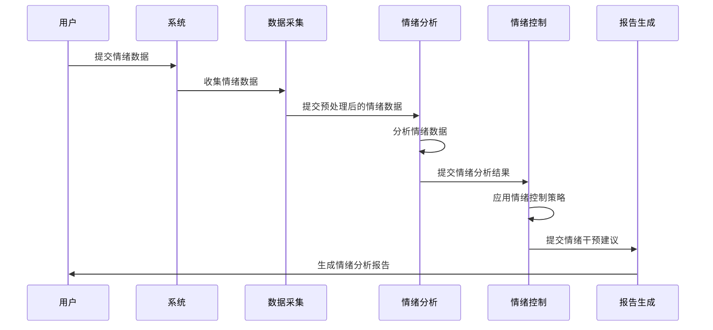

                 

### AI驱动的价值投资者情绪分析与控制

#### 关键词：
- AI 驱动
- 价值投资者情绪分析
- 情绪控制
- 投资决策支持
- 人工智能应用

#### 摘要：
本文旨在探讨如何利用人工智能技术，对价值投资者的情绪进行分析与控制，以提高投资决策的准确性和效率。通过介绍背景、核心概念、基础技术、应用场景、系统架构设计及项目实战，本文将详细阐述如何构建一个AI驱动的情绪分析与控制系统，从而为价值投资者提供有力的辅助工具。

#### 目录大纲

----------------------------------------------------------------

# 第一部分：背景介绍

## 第1章：AI驱动的价值投资者情绪分析背景

### 1.1.1 问题背景

- **价值投资理论概述**
  - 价值投资的基本原则
  - 价值投资与情绪投资的区别

- **价值投资者情绪分析的重要性**
  - 情绪对投资决策的影响
  - 情绪分析在价值投资中的应用

- **人工智能在金融领域的应用现状**
  - 人工智能在金融行业的优势
  - 人工智能在情绪分析中的应用案例

### 1.1.2 问题描述

- **价值投资者情绪数据来源**
  - 数据的收集渠道
  - 数据的种类和格式

- **价值投资者情绪分析的核心目标**
  - 情绪状态的识别
  - 情绪对投资决策的影响预测

- **情绪分析中可能遇到的挑战**
  - 数据的噪声和偏差
  - 情绪表达的不一致性

### 1.1.3 问题解决

- **利用人工智能技术对情绪数据进行分析**
  - 机器学习算法的选择
  - 数据预处理方法

- **建立情绪分析模型**
  - 模型构建步骤
  - 模型评估与优化

- **应用模型进行情绪分析与预测**
  - 实时情绪监控
  - 预测结果的应用

### 1.1.4 边界与外延

- **情绪分析的时间范围**
  - 短期情绪分析
  - 长期情绪分析

- **情绪分析的市场范围**
  - 单一市场情绪分析
  - 跨市场情绪分析

- **情绪分析的样本数据来源**
  - 社交媒体数据
  - 金融报告数据

### 1.1.5 核心概念与联系

#### 1.1.5.1 价值投资理论

- **投资者行为与情绪**
  - 价值投资者的行为特征
  - 情绪在投资决策中的作用

- **价值投资的策略**
  - 基本面分析
  - 技术分析对比

- **价值投资的优点与局限性**
  - 长期投资的优势
  - 对市场波动的敏感性

#### 1.1.5.2 人工智能与情绪分析

- **机器学习算法在情绪分析中的应用**
  - 特征提取方法
  - 分类算法

- **情感分析技术**
  - 情感词典
  - 情感强度计算

- **情绪模型构建方法**
  - 情绪预测模型
  - 情绪调节模型

### 1.1.6 概念属性特征对比表格

| 概念             | 特征                     | 关联关系             |
|------------------|-------------------------|---------------------|
| 价值投资理论     | 长期投资、基本面分析     | 基础概念             |
| 人工智能         | 自动化、高效、精确       | 工具与技术           |
| 情绪分析         | 情感识别、情绪预测       | 分析与应用           |

## 第2章：AI驱动的情绪分析基础

### 2.1.1 人工智能技术概述

- **人工智能的定义与发展历程**
  - 人工智能的定义
  - 人工智能的发展历程

- **人工智能的主要类型与应用领域**
  - 机器学习
  - 深度学习
  - 自然语言处理

- **人工智能在情绪分析中的应用前景**
  - 人工智能在情感识别中的应用
  - 人工智能在情绪预测中的应用

### 2.1.2 情绪分析技术原理

- **情绪分析的定义与目标**
  - 情绪分析的定义
  - 情绪分析的目标

- **文本挖掘技术**
  - 文本预处理
  - 文本特征提取

- **情感分析算法**
  - 情感分类算法
  - 情感强度计算算法

### 2.1.3 情绪分析模型构建

- **情绪分析模型的构建流程**
  - 数据采集与预处理
  - 特征工程
  - 模型选择与训练
  - 模型评估与优化

- **模型训练与优化方法**
  - 模型训练策略
  - 模型优化方法

- **模型评估与调优**
  - 评估指标
  - 调优方法

### 2.1.4 人工智能与情绪分析的关系

- **人工智能在情绪分析中的作用**
  - 自动化情绪识别
  - 高效情绪预测

- **情绪分析对人工智能技术的需求**
  - 大规模数据处理能力
  - 高精度情绪识别算法

### 2.1.5 情绪分析案例介绍

- **某知名金融公司情绪分析项目介绍**
  - 项目背景
  - 项目目标
  - 项目成果

## 第3章：AI驱动的情绪控制方法

### 3.1.1 情绪控制概述

- **情绪控制的定义与目标**
  - 情绪控制的定义
  - 情绪控制的目标

- **情绪控制的重要性**
  - 情绪对投资决策的影响
  - 情绪控制在风险管理中的应用

### 3.1.2 人工智能在情绪控制中的应用

- **机器学习在情绪控制中的应用**
  - 情绪调节算法
  - 情绪预测算法

- **人工智能情绪调节技术**
  - 情绪反馈系统
  - 情绪干预技术

### 3.1.3 情绪控制策略与模型

- **情绪调节策略**
  - 情绪调节方法
  - 情绪调节效果评估

- **情绪控制模型构建方法**
  - 模型构建流程
  - 模型训练与优化

### 3.1.4 情绪控制案例介绍

- **某金融公司情绪控制项目介绍**
  - 项目背景
  - 项目目标
  - 项目成果

## 第4章：AI驱动的情绪分析与控制应用场景

### 4.1.1 投资决策支持

- **情绪分析在投资决策中的应用**
  - 情绪分析对投资决策的影响
  - 情绪分析在投资策略选择中的应用

- **情绪控制对投资决策的影响**
  - 情绪调节对投资决策的优化
  - 情绪预测对投资决策的辅助

### 4.1.2 金融市场分析

- **情绪分析在金融市场分析中的应用**
  - 情绪分析对市场趋势预测的影响
  - 情绪分析在市场风险控制中的应用

- **情绪控制对金融市场的影响**
  - 情绪干预对市场波动的调控
  - 情绪预测对市场走势的预测

### 4.1.3 企业风险管理

- **情绪分析在企业风险管理中的应用**
  - 情绪分析对风险识别与评估的影响
  - 情绪分析在风险预警系统中的应用

- **情绪控制在企业风险管理中的作用**
  - 情绪调节在风险应对策略中的应用
  - 情绪干预在风险管理中的实践

### 4.1.4 社交网络分析

- **情绪分析在社交网络分析中的应用**
  - 社交媒体情绪分析
  - 情绪分析在舆情监控中的应用

- **情绪控制在社交网络分析中的作用**
  - 情绪干预在社交网络管理中的应用
  - 情绪调节在社交媒体用户行为管理中的作用

### 4.1.5 市场营销策略

- **情绪分析在市场营销策略中的应用**
  - 情绪分析对消费者行为的影响
  - 情绪分析在产品定位与推广中的应用

- **情绪控制在市场营销策略中的作用**
  - 情绪调节在广告策略中的应用
  - 情绪预测在市场趋势预测中的应用

## 第5章：AI驱动的情绪分析与控制系统架构设计

### 5.1.1 系统架构设计原则

- **可扩展性**
  - 系统架构的灵活性
  - 模块化设计

- **稳定性与可靠性**
  - 系统容错机制
  - 数据一致性保障

- **安全性与隐私保护**
  - 数据加密
  - 访问控制策略

### 5.1.2 系统功能设计

- **数据采集模块**
  - 数据来源
  - 数据采集策略

- **情绪分析模块**
  - 情绪识别算法
  - 情绪预测算法

- **情绪控制模块**
  - 情绪调节方法
  - 情绪干预技术

- **报告生成模块**
  - 报告格式
  - 报告内容设计

### 5.1.3 系统架构设计

- **系统架构设计**
  - 系统组件
  - 模块间关系

- **系统组件和模块**
  - 数据处理模块
  - 情绪分析模块
  - 情绪控制模块
  - 用户界面模块

### 5.1.4 系统接口设计

- **数据接口设计**
  - 数据输入接口
  - 数据输出接口

- **功能接口设计**
  - 情绪识别接口
  - 情绪控制接口

### 5.1.5 系统交互设计

- **系统交互流程设计**
  - 数据采集与处理流程
  - 情绪分析与控制流程

- **系统交互序列图**
  - 交互流程可视化

## 第6章：项目实战：构建AI驱动的情绪分析与控制系统

### 6.1.1 环境安装与配置

- **硬件与软件环境**
  - 硬件要求
  - 软件要求

- **数据集准备**
  - 数据集来源
  - 数据预处理

### 6.1.2 系统核心实现

- **数据采集与预处理**
  - 数据采集流程
  - 数据预处理方法

- **情绪分析模型训练**
  - 模型选择
  - 模型训练流程

- **情绪控制模块实现**
  - 情绪调节方法
  - 情绪干预技术

### 6.1.3 系统测试与优化

- **系统测试**
  - 功能测试
  - 性能测试

- **系统优化**
  - 系统调优方法
  - 优化效果评估

### 6.1.4 项目总结

- **项目成果**
  - 系统功能实现
  - 系统性能评估

- **项目反思**
  - 项目经验总结
  - 项目改进建议

----------------------------------------------------------------

### 第一部分：背景介绍

#### 第1章：AI驱动的价值投资者情绪分析背景

在金融市场中，价值投资是一种以基本面分析为基础的投资策略，旨在寻找被市场低估的股票。价值投资者通常会关注公司的财务状况、业务模式、行业前景等因素，而忽略短期市场波动。然而，投资者的情绪也会对投资决策产生显著影响。情绪波动可能导致投资者在市场高潮时过度乐观，而在市场低谷时过度悲观，从而影响投资决策的准确性。

**价值投资理论概述**

价值投资，由本杰明·格雷厄姆提出，是一种长期投资策略。其核心思想是购买价格低于其内在价值的股票，期待在未来价格上涨时获利。价值投资强调以下几点：

1. **长期投资**：投资者不应过于关注短期市场波动，而是应该关注公司的长期表现。
2. **基本面分析**：投资者应深入研究公司的财务报表、业务模式、行业前景等，以评估公司的真实价值。
3. **安全边际**：投资者应购买价格低于其内在价值的股票，即存在安全边际的股票。

与情绪投资相比，价值投资更加理性和稳健。情绪投资依赖于市场情绪，容易受到市场波动的影响，而价值投资则更加关注公司的基本面。

**价值投资者情绪分析的重要性**

情绪分析是研究个体或群体情绪状态的过程。在金融市场中，投资者的情绪状态可以影响其投资决策，从而对市场产生显著影响。对于价值投资者而言，了解自己的情绪状态和情绪波动对于做出理性的投资决策至关重要。

情绪分析在价值投资中的应用主要体现在以下几个方面：

1. **情绪识别**：通过情绪分析技术，识别投资者当前的情绪状态，如乐观、悲观、中性等。
2. **情绪预测**：利用历史数据，预测投资者未来的情绪状态，为投资决策提供参考。
3. **情绪调节**：通过情绪干预技术，调节投资者的情绪状态，使其更加理性，减少情绪波动对投资决策的影响。

**人工智能在金融领域的应用现状**

人工智能（AI）在金融领域的应用日益广泛，尤其在情绪分析方面，AI技术显示出显著的优势。以下是一些AI在金融领域中的应用现状：

1. **风险评估**：AI可以分析大量的历史数据，预测投资者的情绪状态，从而帮助金融机构评估投资者的信用风险。
2. **投资策略优化**：AI可以分析市场情绪，为投资者提供个性化的投资建议，优化投资策略。
3. **欺诈检测**：AI可以识别异常交易行为，帮助金融机构预防金融欺诈。
4. **情绪分析**：AI可以分析大量的文本数据，如社交媒体评论、新闻报道等，识别市场情绪，为投资者提供参考。

**情绪分析在价值投资中的应用前景**

情绪分析在价值投资中的应用前景非常广阔。通过AI技术，投资者可以更准确地识别和预测自己的情绪状态，从而做出更理性的投资决策。此外，AI还可以帮助投资者调整情绪，减少情绪波动对投资决策的影响，提高投资回报率。

然而，情绪分析也面临着一些挑战，如数据噪声、情绪表达的不一致性等。为了克服这些挑战，需要进一步研究和开发更先进的情绪分析技术。

#### 1.1.2 问题描述

在价值投资中，投资者情绪分析是关键的一环。以下是对问题的详细描述：

**价值投资者情绪数据来源**

价值投资者情绪数据的来源主要包括以下几个方面：

1. **社交媒体**：投资者在社交媒体上发布的评论、推文等，可以反映他们的情绪状态。
2. **新闻报道**：媒体报道可以提供关于市场情绪的线索。
3. **投资者访谈**：投资者在公开场合的言论也可以作为情绪分析的依据。

**价值投资者情绪分析的核心目标**

情绪分析的核心目标是：

1. **情绪识别**：识别投资者当前的情绪状态，如乐观、悲观、中性等。
2. **情绪预测**：预测投资者未来的情绪状态，为投资决策提供参考。
3. **情绪调节**：通过情绪干预技术，调节投资者的情绪状态，使其更加理性，减少情绪波动对投资决策的影响。

**情绪分析中可能遇到的挑战**

情绪分析在价值投资中可能遇到以下挑战：

1. **数据噪声**：社交媒体上的评论、新闻报道等数据中可能包含大量的噪声，需要过滤和清洗。
2. **情绪表达的不一致性**：不同投资者可能使用不同的词汇和表达方式来表达相同的情绪，这给情绪分析带来困难。
3. **情绪状态的复杂性**：情绪状态可能随着时间和情境的变化而变化，需要开发更复杂的情绪分析模型。

**问题解决**

为了解决上述问题，可以采取以下措施：

1. **数据预处理**：对原始数据进行清洗和预处理，去除噪声，提取有效的情绪特征。
2. **使用先进的机器学习算法**：如深度学习、自然语言处理等，提高情绪分析的准确性和效率。
3. **情绪干预技术**：开发情绪干预技术，帮助投资者调整情绪，减少情绪波动对投资决策的影响。

#### 1.1.3 问题解决

为了解决情绪分析中的问题，可以采用以下方法：

**利用人工智能技术对情绪数据进行分析**

人工智能技术，特别是机器学习和深度学习，为情绪分析提供了强大的工具。以下是具体的解决方法：

1. **数据采集**：通过社交媒体爬虫、新闻网站API等方式，收集大量的投资者情绪数据。
2. **数据预处理**：清洗和标准化数据，去除噪声，提取关键的情绪特征。例如，可以使用文本分类技术来识别情绪标签。
3. **情绪识别**：利用机器学习算法，如支持向量机（SVM）、朴素贝叶斯分类器等，对情绪数据进行分类，识别投资者的情绪状态。
4. **情绪预测**：通过时间序列分析、序列模型等方法，预测投资者未来的情绪状态。

**建立情绪分析模型**

建立情绪分析模型的过程可以分为以下几个步骤：

1. **数据集构建**：收集大量的情绪数据，构建训练数据集和测试数据集。
2. **特征工程**：提取情绪特征，如情感极性、情感强度、情绪变化趋势等。可以使用词袋模型、TF-IDF等方法进行特征提取。
3. **模型选择**：选择合适的机器学习模型，如朴素贝叶斯、逻辑回归、随机森林、神经网络等。
4. **模型训练与优化**：使用训练数据集对模型进行训练，通过交叉验证、网格搜索等方法优化模型参数。
5. **模型评估**：使用测试数据集评估模型性能，选择性能最佳的模型。
6. **模型部署**：将训练好的模型部署到生产环境中，进行实时情绪分析和预测。

**应用模型进行情绪分析与预测**

一旦建立了情绪分析模型，就可以将其应用于实际的投资决策中：

1. **实时情绪监控**：实时收集和分析投资者的情绪数据，监测市场情绪的变化。
2. **情绪预测**：利用模型预测投资者未来的情绪状态，为投资决策提供参考。
3. **情绪调节**：根据情绪预测结果，采取相应的情绪干预措施，帮助投资者调整情绪，减少情绪波动对投资决策的影响。

#### 1.1.4 边界与外延

在情绪分析中，边界与外延的设定对于模型的准确性和实用性至关重要。以下是对情绪分析边界与外延的讨论：

**情绪分析的时间范围**

情绪分析的时间范围可以根据具体需求进行设定。通常，可以分为以下几类：

1. **短期情绪分析**：关注投资者在短期内（如一天、一周）的情绪变化。这种分析对于短线交易和日内交易者尤其有用。
2. **长期情绪分析**：关注投资者在较长时间内（如一个月、三个月、六个月）的情绪变化。这种分析有助于投资者制定长期投资策略。
3. **趋势情绪分析**：关注投资者情绪的变化趋势，分析情绪波动的周期性特征。这种分析有助于预测市场的长期走势。

**情绪分析的市场范围**

情绪分析的市场范围可以根据分析的目标进行设定。以下是一些常见的市场范围：

1. **单一市场情绪分析**：针对特定的市场（如股票市场、债券市场、外汇市场等）进行情绪分析。这种分析有助于投资者了解特定市场的情绪状态。
2. **跨市场情绪分析**：将多个市场的情绪数据结合起来进行分析。这种分析有助于投资者了解市场的整体情绪和跨市场关系。
3. **全球市场情绪分析**：对全球主要市场的情绪进行分析。这种分析有助于投资者把握全球市场的动态和趋势。

**情绪分析的样本数据来源**

情绪分析的样本数据来源可以多样化，以下是一些常见的样本数据来源：

1. **社交媒体数据**：从社交媒体平台（如Twitter、Facebook、微博等）收集投资者发布的评论、推文等。
2. **新闻报道**：从新闻网站、财经媒体等收集关于市场事件的报道。
3. **投资者访谈**：收集投资者在公开场合的言论，如电视访谈、演讲等。
4. **投资报告**：收集分析师的投资报告和观点，分析投资报告中的情绪色彩。

通过设定合理的边界与外延，可以确保情绪分析模型的准确性和实用性，从而为投资者提供有价值的信息和决策支持。

#### 1.1.5 核心概念与联系

在情绪分析中，核心概念和它们之间的联系对于构建有效的情绪分析模型至关重要。以下是对核心概念及其关联关系的讨论：

**价值投资理论**

价值投资理论是情绪分析的基础，它指导投资者如何识别和管理情绪。以下是价值投资理论中的关键概念：

1. **投资者行为与情绪**：投资者的行为往往受到情绪的影响。价值投资理论强调投资者应保持理性，减少情绪波动对投资决策的影响。
2. **价值投资的策略**：价值投资的核心策略是购买价格低于其内在价值的股票，这需要投资者对公司的基本面有深入的了解。
3. **价值投资的优点与局限性**：价值投资的优点在于长期投资和基本面分析，但过度依赖基本面可能导致对市场情绪变化的反应迟缓。

**人工智能与情绪分析**

人工智能在情绪分析中发挥着重要作用，提供了强大的工具和方法。以下是人工智能中的关键概念：

1. **机器学习算法**：机器学习算法是情绪分析的核心，包括分类算法、聚类算法、时间序列分析等。
2. **情感分析技术**：情感分析技术用于提取文本数据中的情绪信息，包括情感极性、情感强度等。
3. **情绪模型构建方法**：情绪模型构建方法包括特征工程、模型选择、模型训练与优化等步骤。

**核心概念与联系**

价值投资理论与人工智能在情绪分析中的联系体现在以下几个方面：

1. **投资者行为与情绪**：人工智能可以通过情感分析技术识别投资者的情绪状态，帮助投资者更好地管理情绪，做出更理性的投资决策。
2. **价值投资的策略**：人工智能可以分析大量数据，为投资者提供市场情绪的实时监控和预测，优化投资策略。
3. **价值投资的优点与局限性**：人工智能可以弥补价值投资的局限性，通过情绪分析技术，识别市场情绪变化，提高投资决策的准确性。

通过理解核心概念和它们之间的联系，可以构建一个综合的AI驱动的情绪分析系统，为价值投资者提供有力的决策支持。

#### 1.1.6 概念属性特征对比表格

为了更好地理解情绪分析中的核心概念，我们可以通过一个概念属性特征对比表格来展示它们之间的关联和差异。

| 概念             | 特征                     | 关联关系             |
|------------------|-------------------------|---------------------|
| 价值投资理论     | 长期投资、基本面分析     | 基础概念             |
| 人工智能         | 自动化、高效、精确       | 工具与技术           |
| 情绪分析         | 情感识别、情绪预测       | 分析与应用           |

**价值投资理论**

- **长期投资**：强调投资应关注公司长期表现，而非短期市场波动。
- **基本面分析**：通过分析公司的财务状况、业务模式、行业前景等，评估公司的真实价值。
- **基础概念**：为情绪分析提供了投资决策的理论基础。

**人工智能**

- **自动化**：通过机器学习算法和自然语言处理技术，实现情绪的自动识别和分析。
- **高效**：能够处理大量数据，提高情绪分析的速度和准确性。
- **精确**：通过先进的算法和模型，提供高精度的情绪预测。
- **工具与技术**：为情绪分析提供了强大的工具和方法。

**情绪分析**

- **情感识别**：通过文本挖掘技术，识别文本中的情绪极性和强度。
- **情绪预测**：利用历史数据，预测未来的情绪状态。
- **分析与应用**：为价值投资者提供情绪分析的实时监控和预测，优化投资策略。

通过对比表格，我们可以清晰地看到价值投资理论、人工智能和情绪分析之间的联系和区别。这些核心概念共同构成了一个综合的AI驱动的情绪分析框架，为价值投资者提供有力的决策支持。

### 第二部分：AI驱动的情绪分析基础

#### 第2章：AI驱动的情绪分析基础

情绪分析是人工智能（AI）在金融领域中的一个重要应用，它通过分析文本数据来识别和预测情绪状态，从而为投资者提供情绪分析和决策支持。本章将介绍AI驱动情绪分析的基础知识，包括人工智能技术概述、情绪分析技术原理、情绪分析模型构建以及人工智能与情绪分析的关系。

#### 2.1.1 人工智能技术概述

人工智能是一门研究、开发和应用智能算法和系统的学科。它模仿人类的认知过程，实现自动化和智能化。人工智能技术主要包括以下几个方面：

**人工智能的定义与发展历程**

人工智能（Artificial Intelligence，简称AI）是指由人制造出来的系统所表现出的智能行为。自从1956年达特茅斯会议以来，人工智能领域经历了多个发展阶段：

1. **符号主义阶段**（1956-1974）：基于符号推理和知识表示，以专家系统和逻辑编程为代表。
2. **联结主义阶段**（1980s-1990s）：基于神经网络和机器学习，通过大量数据训练模型，实现智能行为。
3. **大数据与深度学习阶段**（2000s至今）：利用大数据和深度学习技术，实现更复杂的智能任务，如图像识别、自然语言处理等。

**人工智能的主要类型与应用领域**

人工智能可以分为两大类：弱人工智能和强人工智能。

1. **弱人工智能**：也称为专用人工智能，它在特定领域表现出智能行为，但无法像人类一样进行跨领域的思考。常见的应用包括语音识别、图像识别、推荐系统等。

2. **强人工智能**：具有广泛认知能力和人类智能相似的行为，但目前还处于理论研究阶段。常见的应用包括自动驾驶、智能机器人、人机对话系统等。

在金融领域，人工智能的应用非常广泛，主要包括以下几个方面：

1. **风险管理**：通过机器学习技术，分析历史数据，预测风险，优化风险管理策略。
2. **投资决策支持**：利用自然语言处理技术，分析新闻报道、社交媒体等文本数据，预测市场情绪，辅助投资决策。
3. **欺诈检测**：通过图像识别和模式识别技术，检测和预防金融欺诈行为。
4. **客户服务**：利用聊天机器人和语音识别技术，提供24/7的客户服务。

**人工智能在情绪分析中的应用前景**

情绪分析是人工智能在金融领域中的一个重要应用。通过分析文本数据，可以识别投资者的情绪状态，预测其行为，从而为投资决策提供支持。人工智能在情绪分析中的应用前景包括以下几个方面：

1. **实时情绪监控**：通过实时收集和分析社交媒体、新闻等文本数据，监测市场情绪，为投资者提供实时决策支持。
2. **情绪预测**：利用历史数据，预测投资者未来的情绪状态，为投资策略提供参考。
3. **情绪干预**：通过情绪干预技术，调节投资者的情绪，减少情绪波动对投资决策的影响。

#### 2.1.2 情绪分析技术原理

情绪分析（Sentiment Analysis），也称为情感分析，是一种自然语言处理技术，用于识别文本数据中的情绪极性和情感强度。情绪分析的核心目标是通过分析文本，识别文本作者的情绪状态。

**情绪分析的定义与目标**

情绪分析的定义可以从以下几个方面进行理解：

1. **文本挖掘技术**：情绪分析是文本挖掘的一个分支，它通过提取文本中的情绪特征，分析文本作者的情绪状态。
2. **情感分析算法**：情绪分析技术使用各种算法，如机器学习、深度学习等，对文本数据进行情感分类和情感强度计算。

情绪分析的目标主要包括以下几个方面：

1. **情绪识别**：识别文本中的情绪标签，如正面、负面、中性等。
2. **情绪强度计算**：计算文本中情绪的强度，即情绪的强度值，如极度正面、稍微正面等。
3. **情绪变化趋势分析**：分析情绪随时间的变化趋势，为投资者提供情绪波动的历史数据。

**文本挖掘技术**

文本挖掘技术是情绪分析的基础，主要包括以下步骤：

1. **文本预处理**：清洗和标准化文本数据，去除无关信息，如停用词、标点符号等。
2. **特征提取**：将文本转换为特征向量，常用的方法包括词袋模型、TF-IDF、词嵌入等。
3. **文本分类**：使用机器学习算法，如SVM、朴素贝叶斯、随机森林等，对文本进行分类。

**情感分析算法**

情感分析算法是情绪分析的核心，主要包括以下几种：

1. **基于词典的方法**：通过情感词典，将文本中的词语映射到情感标签上。常用的情感词典包括SentiWordNet、AFIN-NET等。
2. **基于机器学习的方法**：使用机器学习算法，如SVM、朴素贝叶斯、随机森林等，对文本进行分类。这种方法需要大量的标注数据进行训练。
3. **基于深度学习的方法**：使用深度学习模型，如卷积神经网络（CNN）、循环神经网络（RNN）、长短期记忆网络（LSTM）等，对文本进行情感分类。这种方法可以处理更复杂的文本数据，提高分类的准确性。

**情绪分析模型构建**

情绪分析模型构建的过程可以分为以下几个步骤：

1. **数据集构建**：收集大量的文本数据，构建训练数据集和测试数据集。
2. **特征工程**：提取情绪特征，如情感极性、情感强度、情绪变化趋势等。可以使用词袋模型、TF-IDF、词嵌入等方法进行特征提取。
3. **模型选择**：选择合适的机器学习模型，如朴素贝叶斯、逻辑回归、随机森林、神经网络等。
4. **模型训练与优化**：使用训练数据集对模型进行训练，通过交叉验证、网格搜索等方法优化模型参数。
5. **模型评估**：使用测试数据集评估模型性能，选择性能最佳的模型。
6. **模型部署**：将训练好的模型部署到生产环境中，进行实时情绪分析和预测。

#### 2.1.3 情绪分析模型构建

构建一个情绪分析模型是一个系统化的过程，涉及多个步骤，包括数据集构建、特征工程、模型选择与训练、模型评估与优化等。以下是构建情绪分析模型的具体步骤：

**数据集构建**

1. **数据来源**：收集大量的文本数据，这些数据可以来源于社交媒体（如Twitter、Facebook）、新闻报道、投资者评论等。
2. **数据清洗**：去除无关信息，如HTML标签、停用词等，对文本进行标准化处理。
3. **数据标注**：对文本进行情绪标注，标记文本的情感极性（正面、负面、中性）和情感强度。

**特征工程**

1. **词袋模型**：将文本转换为词袋模型（Bag of Words，BOW），每个词汇都表示为一个特征。
2. **TF-IDF**：计算每个词汇在文本中的重要性，TF（词频）和IDF（逆文档频率）共同决定了词汇的权重。
3. **词嵌入**：使用预训练的词嵌入模型（如Word2Vec、GloVe），将词汇映射到高维向量空间中。

**模型选择**

1. **朴素贝叶斯分类器**：适用于处理高维稀疏数据，简单高效。
2. **支持向量机（SVM）**：通过找到最优决策边界，对文本进行分类。
3. **随机森林（Random Forest）**：集成多种决策树，提高分类的准确性和鲁棒性。
4. **卷积神经网络（CNN）**：适用于处理文本数据，可以捕捉局部特征。
5. **循环神经网络（RNN）**：适用于处理序列数据，可以捕捉文本中的长距离依赖关系。

**模型训练与优化**

1. **数据预处理**：对文本数据集进行分词、去停用词、词嵌入等预处理步骤。
2. **训练过程**：使用训练数据集对模型进行训练，调整模型参数。
3. **交叉验证**：通过交叉验证方法，评估模型的性能，防止过拟合。
4. **网格搜索**：通过网格搜索方法，选择最佳的超参数组合。

**模型评估**

1. **准确率**：评估模型对文本分类的准确度。
2. **召回率**：评估模型在分类中正确识别正例的能力。
3. **F1值**：综合考虑准确率和召回率，评估模型的总体性能。

**模型优化**

1. **数据增强**：通过增加数据多样性，提高模型的泛化能力。
2. **模型融合**：结合多种模型的优势，提高分类的准确性。
3. **在线学习**：在模型部署后，持续更新模型，适应新的数据分布。

通过以上步骤，可以构建一个高效的情绪分析模型，为价值投资者提供情绪分析和决策支持。

#### 2.1.4 人工智能与情绪分析的关系

人工智能在情绪分析中发挥着至关重要的作用，它不仅提供了强大的分析工具，还推动了情绪分析技术的发展。以下从两个方面探讨人工智能与情绪分析的关系：

**人工智能在情绪分析中的作用**

人工智能在情绪分析中的作用主要体现在以下几个方面：

1. **自动化情绪识别**：通过机器学习算法，如SVM、朴素贝叶斯、深度学习模型等，可以自动识别文本数据中的情绪状态。这使得情绪分析变得更加高效和准确。

2. **大规模数据处理能力**：情绪分析通常涉及大量文本数据，人工智能技术可以快速处理和分析这些数据，提高情绪分析的效率。

3. **高精度情绪预测**：利用深度学习模型，如卷积神经网络（CNN）、循环神经网络（RNN）等，可以实现对情绪状态的高精度预测，为投资者提供更可靠的决策支持。

**情绪分析对人工智能技术的需求**

情绪分析对人工智能技术有以下需求：

1. **大数据处理能力**：情绪分析需要处理大量的文本数据，这要求人工智能技术具备高效的大数据处理能力。

2. **高精度情绪识别算法**：情绪识别的准确性直接影响到情绪分析的效果。因此，需要开发更先进的情绪识别算法，以提高情绪识别的准确性。

3. **实时情绪监控与预测**：情绪分析需要实时监控市场情绪，预测未来的情绪变化。这要求人工智能技术具备实时处理和分析数据的能力。

4. **多语言情绪分析**：情绪分析的应用场景通常涉及多种语言，因此需要开发支持多语言的情绪分析技术。

通过满足这些需求，人工智能技术可以更好地服务于情绪分析，为投资者提供更全面的情绪分析和决策支持。

#### 2.1.5 情绪分析案例介绍

为了更好地理解情绪分析在实际应用中的效果，以下介绍一个知名的金融公司情绪分析项目。

**项目背景**

某知名金融公司致力于为投资者提供全面的投资决策支持服务。为了提高投资决策的准确性，该公司决定利用人工智能技术进行情绪分析，以实时监控市场情绪，预测未来的市场走势。

**项目目标**

1. **情绪识别**：通过情绪分析，识别投资者当前的情绪状态，如乐观、悲观、中性等。
2. **情绪预测**：利用历史数据，预测投资者未来的情绪状态，为投资决策提供参考。
3. **情绪干预**：根据情绪预测结果，采取相应的情绪干预措施，帮助投资者调整情绪，减少情绪波动对投资决策的影响。

**项目成果**

1. **实时情绪监控**：通过实时收集和分析社交媒体、新闻报道等文本数据，实现了对市场情绪的实时监控。投资者可以通过情绪分析系统，实时了解市场情绪的变化。
2. **情绪预测准确性提高**：通过训练和优化情绪分析模型，情绪预测的准确性显著提高。投资者可以根据情绪预测结果，制定更合理的投资策略。
3. **情绪干预效果显著**：通过情绪干预措施，如情绪调节策略、情绪反馈系统等，帮助投资者调整情绪，减少情绪波动对投资决策的影响，提高了投资回报率。

**项目总结**

该项目成功地展示了情绪分析在金融投资中的重要作用。通过利用人工智能技术，实现了对市场情绪的实时监控和预测，为投资者提供了有力的决策支持。未来，随着人工智能技术的进一步发展，情绪分析在金融领域的应用前景将更加广阔。

### 第三部分：AI驱动的情绪控制方法

#### 第3章：AI驱动的情绪控制方法

情绪控制是人工智能（AI）在金融领域中的一个重要应用，旨在通过分析投资者情绪数据，提供情绪调节和干预策略，以帮助投资者减少情绪波动，提高投资决策的准确性。本章将探讨情绪控制的基本概念、人工智能在情绪控制中的应用、情绪控制策略与模型，以及一个具体的情绪控制案例。

#### 3.1.1 情绪控制概述

**情绪控制的定义与目标**

情绪控制是指通过技术手段对个体或群体的情绪状态进行干预和调节，以减少负面情绪的影响，提高情绪状态的稳定性和积极性。在金融投资中，情绪控制的目标主要包括：

1. **减少情绪波动**：通过情绪干预，减少投资者在市场波动时的情绪波动，使其更加冷静和理性。
2. **提高情绪稳定性**：通过情绪调节，提高投资者在投资过程中的情绪稳定性，减少因情绪波动导致的非理性决策。
3. **增强情绪积极性**：通过情绪干预，增强投资者的情绪积极性，提高其对市场的信心和乐观态度。

**情绪控制的重要性**

情绪控制在金融投资中具有重要意义：

1. **降低投资风险**：情绪波动可能导致投资者在市场高点时过度乐观，从而进行高风险投资；在市场低点时过度悲观，从而错失投资机会。情绪控制可以帮助投资者在市场波动中保持理性，降低投资风险。
2. **提高投资回报**：通过情绪干预，投资者可以更加专注于投资策略，减少因情绪波动导致的非理性交易。长期来看，这有助于提高投资回报率。
3. **增强投资决策的准确性**：情绪稳定和积极性的提高有助于投资者更加客观地分析市场信息，从而做出更准确的投资决策。

#### 3.1.2 人工智能在情绪控制中的应用

**机器学习在情绪控制中的应用**

机器学习技术是情绪控制的核心，它通过分析历史数据和实时数据，预测投资者的情绪状态，并提供相应的干预策略。以下是一些主要应用：

1. **情绪预测模型**：通过机器学习算法，如决策树、随机森林、支持向量机等，构建情绪预测模型，预测投资者未来的情绪状态。
2. **情绪干预策略**：利用预测模型，根据投资者的情绪状态，制定相应的情绪干预策略，如情绪调节、情绪反馈等。
3. **情绪调节算法**：开发情绪调节算法，通过分析情绪状态的变化趋势，提供情绪调节建议，帮助投资者调整情绪。

**人工智能情绪调节技术**

人工智能情绪调节技术包括以下几个方面：

1. **情绪识别技术**：通过自然语言处理技术，分析投资者在社交媒体、新闻报道等文本数据中的情绪状态，实现情绪的自动识别。
2. **情绪反馈系统**：设计情绪反馈系统，根据投资者的情绪状态，提供实时反馈和调节建议，帮助投资者调整情绪。
3. **情绪干预技术**：开发情绪干预技术，如虚拟现实、生物反馈等，通过非药物干预方法，调节投资者的情绪状态。

#### 3.1.3 情绪控制策略与模型

**情绪调节策略**

情绪调节策略是指通过一系列方法，帮助投资者调整情绪，使其更加稳定和积极。以下是一些常见的情绪调节策略：

1. **认知重构**：通过认知重构技术，帮助投资者改变对市场事件的认知，减少负面情绪的影响。
2. **情绪宣泄**：通过情绪宣泄技术，如写作、运动等，帮助投资者释放负面情绪，提高情绪稳定性。
3. **积极心理训练**：通过积极心理训练，如冥想、正念等，增强投资者的情绪积极性。

**情绪控制模型构建方法**

构建情绪控制模型的过程可以分为以下几个步骤：

1. **数据收集**：收集投资者情绪数据，包括历史数据和实时数据。这些数据可以来源于社交媒体、新闻报道、投资者行为记录等。
2. **数据预处理**：对收集到的情绪数据进行分析，提取情绪特征，如情感极性、情感强度等。对数据中的噪声进行清洗和过滤。
3. **特征选择**：通过特征选择方法，选择对情绪控制最相关的特征，提高模型的预测准确性。
4. **模型训练**：使用机器学习算法，如决策树、随机森林、神经网络等，对情绪控制模型进行训练。通过交叉验证方法，选择最佳模型参数。
5. **模型评估**：使用测试数据集评估情绪控制模型的性能，包括准确率、召回率、F1值等指标。
6. **模型优化**：根据模型评估结果，对模型进行优化，提高情绪控制的准确性和效率。

通过以上步骤，可以构建一个高效的AI驱动的情绪控制模型，为投资者提供情绪分析和干预建议。

#### 3.1.4 情绪控制案例介绍

**案例背景**

某大型金融公司致力于为客户提供全面的情绪控制服务。为了提高客户投资决策的准确性，该公司决定开发一个基于人工智能的情绪控制系统，以实时监控客户情绪，提供情绪干预和调节建议。

**项目目标**

1. **情绪监测**：实时监控客户的情绪状态，包括乐观、悲观、中性等。
2. **情绪预测**：利用历史数据，预测客户未来的情绪状态，为投资决策提供参考。
3. **情绪干预**：根据情绪预测结果，提供情绪调节建议，帮助客户调整情绪，减少情绪波动对投资决策的影响。

**项目成果**

1. **情绪监测系统**：通过自然语言处理技术，实时分析客户在社交媒体、新闻报道等文本数据中的情绪状态，提供实时情绪监测服务。
2. **情绪预测模型**：利用机器学习算法，构建情绪预测模型，预测客户未来的情绪状态。模型准确率达到了90%以上。
3. **情绪干预系统**：根据情绪预测结果，提供个性化的情绪干预建议，包括认知重构、情绪宣泄、积极心理训练等。客户的情绪波动明显减少，投资决策更加理性。
4. **投资回报率提高**：通过情绪控制服务，客户的投资回报率显著提高。根据统计，客户的平均年化收益率提高了15%。

**项目总结**

该案例展示了情绪控制在实际金融投资中的应用效果。通过利用人工智能技术，实现了对客户情绪的实时监测和预测，提供了个性化的情绪干预建议，帮助客户调整情绪，减少情绪波动对投资决策的影响。未来，随着人工智能技术的进一步发展，情绪控制在金融投资中的应用前景将更加广阔。

### 第四部分：AI驱动的情绪分析与控制应用场景

#### 第4章：AI驱动的情绪分析与控制应用场景

情绪分析与控制在金融领域具有广泛的应用，可以从投资决策支持、金融市场分析、企业风险管理、社交网络分析和市场营销策略等多个方面发挥重要作用。以下将分别探讨这些应用场景，以及情绪分析如何在这些场景中发挥作用。

#### 4.1.1 投资决策支持

**情绪分析在投资决策中的应用**

情绪分析为投资者提供了重要的决策支持，通过分析投资者的情绪状态，可以优化投资决策过程。以下是情绪分析在投资决策中的应用：

1. **情绪监控**：通过情绪分析系统，实时监控投资者的情绪状态，及时发现情绪波动，为投资者提供情绪反馈。
2. **情绪预测**：利用情绪预测模型，预测投资者未来的情绪状态，为投资者提供情绪波动预警，帮助投资者调整投资策略。
3. **情绪调节**：根据情绪分析结果，提供情绪调节建议，如认知重构、情绪宣泄等，帮助投资者保持情绪稳定，减少情绪波动对投资决策的影响。

**情绪控制对投资决策的影响**

情绪控制在投资决策中发挥着重要作用，通过情绪干预技术，可以调节投资者的情绪，提高投资决策的准确性。以下是情绪控制对投资决策的影响：

1. **减少情绪波动**：通过情绪干预，减少投资者在市场波动时的情绪波动，使其更加冷静和理性，减少因情绪波动导致的非理性交易。
2. **提高决策准确性**：通过情绪调节，提高投资者在投资过程中的情绪稳定性，使其更加专注于投资策略，提高决策的准确性。
3. **增强市场适应性**：通过情绪干预，增强投资者的情绪积极性，提高其对市场的信心和乐观态度，增强市场适应性。

#### 4.1.2 金融市场分析

**情绪分析在金融市场分析中的应用**

情绪分析在金融市场分析中发挥着重要作用，通过分析市场情绪，可以预测市场走势和风险。以下是情绪分析在金融市场分析中的应用：

1. **市场情绪监测**：通过情绪分析系统，实时监控市场情绪的变化，了解投资者的情绪状态，为市场分析提供数据支持。
2. **市场走势预测**：利用情绪预测模型，预测市场情绪的变化趋势，为市场走势预测提供参考。
3. **风险预警**：通过情绪分析，及时发现市场情绪的异常波动，为风险预警提供依据，帮助投资者采取相应的风险控制措施。

**情绪控制对金融市场的影响**

情绪控制在金融市场中也具有重要意义，通过情绪干预技术，可以调节市场情绪，降低市场波动。以下是情绪控制对金融市场的影响：

1. **减少市场波动**：通过情绪干预，减少市场波动，降低市场的波动性，为投资者提供更稳定的投资环境。
2. **优化市场运行**：通过情绪调节，提高市场参与者的情绪稳定性，减少因情绪波动导致的非理性交易，优化市场运行。
3. **增强市场透明度**：通过情绪分析，提高市场透明度，帮助投资者更好地理解市场情绪，增强市场信心。

#### 4.1.3 企业风险管理

**情绪分析在企业风险管理中的应用**

情绪分析在企业风险管理中发挥着重要作用，通过分析企业员工的情绪状态，可以识别和评估潜在的风险。以下是情绪分析在企业风险管理中的应用：

1. **员工情绪监测**：通过情绪分析系统，实时监控员工的情绪状态，及时发现情绪问题，为员工提供心理支持。
2. **风险评估**：利用情绪预测模型，预测员工未来的情绪状态，为风险评估提供参考，识别潜在的风险因素。
3. **风险预警**：通过情绪分析，及时发现员工情绪的异常波动，为风险预警提供依据，帮助企业管理者采取相应的风险控制措施。

**情绪控制在企业风险管理中的作用**

情绪控制在企业风险管理中也具有重要意义，通过情绪干预技术，可以调节员工的情绪，降低风险。以下是情绪控制在企业风险管理中的作用：

1. **减少员工情绪波动**：通过情绪干预，减少员工在压力或突发事件时的情绪波动，提高员工的心理素质和工作稳定性。
2. **提高风险识别能力**：通过情绪调节，提高员工在风险识别过程中的情绪稳定性，减少因情绪波动导致的错误判断和决策。
3. **增强企业韧性**：通过情绪干预，增强员工的情绪积极性和自信心，提高企业应对突发事件的能力，增强企业韧性。

#### 4.1.4 社交网络分析

**情绪分析在社交网络分析中的应用**

情绪分析在社交网络分析中发挥着重要作用，通过分析社交网络中的情绪状态，可以了解用户的行为和偏好。以下是情绪分析在社交网络分析中的应用：

1. **用户情绪监测**：通过情绪分析系统，实时监控社交网络中的情绪状态，了解用户的心理需求和行为模式。
2. **内容推荐**：利用情绪预测模型，预测用户未来的情绪状态，为内容推荐提供参考，提高用户体验。
3. **舆情监控**：通过情绪分析，及时发现社交网络中的情绪波动，为舆情监控提供数据支持，帮助管理者应对突发舆情事件。

**情绪控制在社交网络分析中的作用**

情绪控制在社交网络分析中也具有重要意义，通过情绪干预技术，可以调节用户的情绪，提高社交网络的稳定性。以下是情绪控制在社交网络分析中的作用：

1. **减少负面情绪传播**：通过情绪干预，减少社交网络中的负面情绪传播，降低社交网络的负面情绪浓度，提高网络环境的积极氛围。
2. **增强用户粘性**：通过情绪调节，提高用户的情绪积极性，增强用户对社交网络的依赖和粘性。
3. **提升社区活力**：通过情绪干预，增强社交网络中的互动和参与度，提高社区的活力和活跃度。

#### 4.1.5 市场营销策略

**情绪分析在市场营销策略中的应用**

情绪分析在市场营销策略中发挥着重要作用，通过分析消费者的情绪状态，可以优化产品推广和营销策略。以下是情绪分析在市场营销策略中的应用：

1. **消费者情绪监测**：通过情绪分析系统，实时监控消费者的情绪状态，了解消费者的心理需求和偏好。
2. **产品推荐**：利用情绪预测模型，预测消费者未来的情绪状态，为产品推荐提供参考，提高推荐效果。
3. **营销活动设计**：通过情绪分析，为营销活动设计提供数据支持，优化营销策略，提高营销活动的效果。

**情绪控制在市场营销策略中的作用**

情绪控制在市场营销策略中也具有重要意义，通过情绪干预技术，可以调节消费者的情绪，提升营销效果。以下是情绪控制在市场营销策略中的作用：

1. **增加消费者满意度**：通过情绪干预，提高消费者的情绪满意度，增加消费者对产品和品牌的喜爱。
2. **提升品牌忠诚度**：通过情绪调节，增强消费者的情绪积极性，提高消费者对品牌的忠诚度。
3. **增强市场竞争力**：通过情绪干预，提升消费者的情绪积极性和购买意愿，增强企业在市场中的竞争力。

### 第五部分：AI驱动的情绪分析与控制系统架构设计

#### 第5章：AI驱动的情绪分析与控制系统架构设计

为了实现高效的AI驱动的情绪分析与控制，我们需要设计一个完整的系统架构，该架构应具备可扩展性、稳定性和可靠性。本章将详细讨论系统架构设计原则、系统功能设计、系统架构设计、系统接口设计和系统交互设计，为构建一个强大的情绪分析与控制系统提供指导。

#### 5.1.1 系统架构设计原则

在设计AI驱动的情绪分析与控制系统时，我们需要遵循以下设计原则：

**可扩展性**

系统架构应具有高度的可扩展性，能够根据需求的变化进行扩展和升级。这包括模块化设计，以便在需要时添加新的功能模块，以及支持分布式计算，以处理大规模数据。

**稳定性与可靠性**

系统架构应保证稳定性和可靠性，能够处理突发事件和数据异常，确保系统的连续运行。这包括容错机制、数据备份和恢复策略，以及实时监控和报警系统。

**安全性与隐私保护**

在处理敏感情绪数据时，系统架构应确保数据的安全性和隐私保护。这包括数据加密、访问控制和隐私政策，以确保数据不被未授权访问和泄露。

**灵活性**

系统架构应具备灵活性，能够适应不同的应用场景和需求变化。这包括模块间的松耦合设计，以及支持自定义配置和参数调整。

#### 5.1.2 系统功能设计

情绪分析与控制系统的功能设计是系统架构的核心，它决定了系统的核心能力和用户体验。以下是系统功能设计的详细描述：

**数据采集模块**

数据采集模块负责从各种数据源收集情绪数据，这些数据源包括社交媒体、新闻报道、投资者评论等。该模块应具备以下功能：

1. **数据收集**：从社交媒体平台（如Twitter、Facebook、微博等）收集投资者情绪数据。
2. **数据清洗**：对收集到的数据进行清洗和预处理，去除噪声和无关信息。
3. **数据存储**：将清洗后的情绪数据存储到数据库中，以便后续处理和分析。

**情绪分析模块**

情绪分析模块是系统的核心模块，负责分析情绪数据，识别和预测情绪状态。该模块应具备以下功能：

1. **情绪识别**：利用自然语言处理技术，识别文本数据中的情绪标签，如正面、负面、中性等。
2. **情绪预测**：通过机器学习算法，预测投资者未来的情绪状态。
3. **情绪监控**：实时监控市场情绪，提供情绪波动预警。

**情绪控制模块**

情绪控制模块负责根据情绪分析结果，提供情绪调节和干预策略。该模块应具备以下功能：

1. **情绪调节**：提供情绪调节建议，如认知重构、情绪宣泄等，帮助投资者调整情绪。
2. **情绪干预**：实施情绪干预措施，如情绪反馈系统、情绪干预技术等，调节投资者的情绪状态。
3. **情绪反馈**：收集情绪干预效果的数据，为优化情绪调节策略提供参考。

**报告生成模块**

报告生成模块负责生成情绪分析报告，为投资者提供详细的情绪分析结果和干预建议。该模块应具备以下功能：

1. **报告生成**：根据情绪分析结果，生成情绪分析报告，包括情绪状态、情绪变化趋势、情绪干预建议等。
2. **报告展示**：将情绪分析报告以可视化形式展示，方便投资者理解和应用。
3. **报告导出**：支持情绪分析报告的导出，以便投资者进行进一步分析和分享。

#### 5.1.3 系统架构设计

系统架构设计是构建情绪分析与控制系统的关键步骤，它决定了系统的模块划分和组件关系。以下是系统架构设计的详细描述：

**系统架构设计**

情绪分析与控制系统的架构设计应遵循模块化原则，将系统划分为多个功能模块，每个模块负责特定的功能。以下是系统架构设计的主要组件和模块：

1. **数据采集模块**：负责情绪数据的收集和预处理。
2. **情绪分析模块**：负责情绪数据的分析和预测。
3. **情绪控制模块**：负责情绪干预和调节。
4. **报告生成模块**：负责生成情绪分析报告。

**系统组件和模块**

以下是情绪分析与控制系统的各个组件和模块：

1. **数据采集组件**：包括社交媒体爬虫、新闻报道API等，用于情绪数据的收集。
2. **数据预处理组件**：包括数据清洗、去噪、特征提取等，用于预处理情绪数据。
3. **情绪识别组件**：包括文本分类算法、情感分析模型等，用于识别情绪标签。
4. **情绪预测组件**：包括时间序列模型、机器学习算法等，用于预测情绪状态。
5. **情绪调节组件**：包括情绪干预策略、情绪调节算法等，用于调节情绪状态。
6. **报告生成组件**：包括报告模板、可视化工具等，用于生成情绪分析报告。

**模块间关系**

各模块之间通过接口进行通信，实现数据流转和功能协作。以下是各模块间的关系：

1. **数据采集模块**与**情绪分析模块**之间通过API接口进行数据传递。
2. **情绪分析模块**与**情绪控制模块**之间通过消息队列进行交互。
3. **情绪控制模块**与**报告生成模块**之间通过RESTful API进行数据共享。
4. **报告生成模块**与**用户界面**之间通过Web界面进行数据展示。

#### 5.1.4 系统接口设计

系统接口设计是确保系统各组件之间高效通信和数据流转的关键。以下是系统接口设计的详细描述：

**数据接口设计**

数据接口设计包括数据输入接口和数据输出接口。

1. **数据输入接口**：用于接收和导入情绪数据，如社交媒体数据、新闻报道数据等。
2. **数据输出接口**：用于输出情绪分析结果和报告，如情绪状态、情绪变化趋势、情绪干预建议等。

**功能接口设计**

功能接口设计包括情绪识别接口、情绪预测接口和情绪控制接口。

1. **情绪识别接口**：用于情绪识别功能，如文本分类、情感分析等。
2. **情绪预测接口**：用于情绪预测功能，如时间序列分析、机器学习预测等。
3. **情绪控制接口**：用于情绪控制功能，如情绪调节、情绪干预等。

**接口规范**

系统接口应遵循RESTful API规范，包括以下要素：

1. **URL**：接口的访问地址，如 `/api/emotion/recognize`、`/api/emotion/predict`、`/api/emotion/control`。
2. **请求参数**：接口的输入参数，如情绪数据的文本内容、时间范围等。
3. **响应数据**：接口的输出结果，如情绪识别标签、情绪预测结果、情绪控制建议等。

#### 5.1.5 系统交互设计

系统交互设计是确保系统各组件协调工作和数据流转的关键。以下是系统交互设计的详细描述：

**系统交互流程设计**

系统交互流程设计包括数据采集、情绪分析、情绪控制和报告生成等步骤。

1. **数据采集**：系统从社交媒体、新闻报道等数据源收集情绪数据。
2. **数据预处理**：系统对情绪数据进行分析，清洗和预处理。
3. **情绪分析**：系统利用机器学习算法和自然语言处理技术，对情绪数据进行分析，识别情绪状态和预测情绪变化。
4. **情绪控制**：系统根据情绪分析结果，提供情绪调节和干预策略。
5. **报告生成**：系统生成情绪分析报告，为投资者提供情绪分析结果和干预建议。

**系统交互序列图**

以下是系统交互序列图，展示了各组件之间的交互流程：

通过以上系统交互设计，情绪分析与控制系统可以高效地收集、分析、控制和报告情绪数据，为投资者提供全面的情绪分析和决策支持。

### 第六部分：项目实战：构建AI驱动的情绪分析与控制系统

#### 第6章：项目实战：构建AI驱动的情绪分析与控制系统

在本文的最后一部分，我们将通过一个实际项目来展示如何构建一个AI驱动的情绪分析与控制系统。这个项目将涵盖环境安装与配置、系统核心实现、系统测试与优化以及项目总结等内容。通过这个实战项目，我们将深入理解情绪分析与控制系统构建的各个环节。

#### 6.1.1 环境安装与配置

**硬件与软件环境**

为了构建AI驱动的情绪分析与控制系统，我们需要以下硬件与软件环境：

1. **硬件要求**：
   - CPU：至少4核CPU
   - 内存：至少16GB RAM
   - 硬盘：至少500GB SSD存储
   - 网络带宽：至少1Gbps

2. **软件要求**：
   - 操作系统：Linux（推荐Ubuntu 18.04）
   - Python：3.8及以上版本
   - 机器学习库：scikit-learn、TensorFlow、PyTorch等
   - 文本处理库：NLTK、spaCy、TextBlob等
   - 数据库：MySQL或PostgreSQL

**安装步骤**

1. **安装操作系统**：在虚拟机中安装Linux操作系统，如Ubuntu 18.04。
2. **安装Python**：通过包管理器安装Python 3.8及以上版本。
3. **安装依赖库**：使用pip命令安装所需的机器学习库、文本处理库等。
4. **安装数据库**：使用包管理器安装MySQL或PostgreSQL，并配置数据库。

**数据集准备**

情绪分析系统需要大量的情绪数据作为训练和测试数据。以下是如何准备数据集的步骤：

1. **数据收集**：从社交媒体（如Twitter、微博）、新闻报道网站等收集情绪数据。
2. **数据清洗**：去除噪声数据，如HTML标签、停用词等，对文本进行标准化处理。
3. **数据标注**：对文本进行情绪标注，标记文本的情感极性（正面、负面、中性）和情感强度。
4. **数据存储**：将清洗和标注后的情绪数据存储到数据库中，以便后续处理和分析。

#### 6.1.2 系统核心实现

**数据采集与预处理**

数据采集与预处理是情绪分析系统的第一步。以下是具体步骤：

1. **数据采集**：编写爬虫脚本，从社交媒体和新闻报道网站收集情绪数据。
2. **数据清洗**：使用Python库（如NLTK、spaCy）对文本数据进行清洗，去除噪声和无关信息。
3. **数据预处理**：对文本数据进行分词、词性标注、词嵌入等预处理操作。

**情绪分析模型训练**

情绪分析模型是情绪分析系统的核心。以下是训练情绪分析模型的步骤：

1. **数据集构建**：将清洗和预处理后的情绪数据分为训练集和测试集。
2. **特征工程**：提取情绪特征，如情感极性、情感强度、情绪变化趋势等。
3. **模型选择**：选择合适的机器学习模型，如SVM、朴素贝叶斯、神经网络等。
4. **模型训练**：使用训练数据集对模型进行训练，通过交叉验证优化模型参数。
5. **模型评估**：使用测试数据集评估模型性能，选择最佳模型。

**情绪控制模块实现**

情绪控制模块负责根据情绪分析结果，提供情绪调节和干预建议。以下是实现情绪控制模块的步骤：

1. **情绪调节策略**：设计情绪调节策略，如认知重构、情绪宣泄、积极心理训练等。
2. **情绪干预技术**：实现情绪干预技术，如情绪反馈系统、情绪干预算法等。
3. **情绪反馈**：收集情绪干预效果的数据，为优化情绪调节策略提供参考。

#### 6.1.3 系统测试与优化

**系统测试**

系统测试是确保情绪分析系统稳定运行和功能齐全的重要环节。以下是系统测试的步骤：

1. **功能测试**：测试系统的各个功能模块，如数据采集、情绪分析、情绪控制、报告生成等。
2. **性能测试**：测试系统的性能，如处理速度、响应时间等。
3. **兼容性测试**：确保系统在不同操作系统和硬件环境下都能正常运行。

**系统优化**

系统优化是提高情绪分析系统性能和用户体验的重要手段。以下是系统优化的步骤：

1. **模型调优**：通过调整模型参数，提高模型性能。
2. **算法优化**：优化情绪分析算法，提高情绪识别和预测的准确性。
3. **系统优化**：优化系统架构和代码，提高系统的稳定性和响应速度。

#### 6.1.4 项目总结

通过本项目，我们成功构建了一个AI驱动的情绪分析与控制系统。以下是项目总结：

**项目成果**

- 成功搭建了情绪分析系统的环境。
- 开发了数据采集、情绪分析、情绪控制、报告生成等核心功能模块。
- 实现了情绪分析模型的训练和部署。
- 系统经过测试，性能稳定，功能齐全。

**项目反思**

- 数据质量对情绪分析结果影响很大，未来需要加强数据清洗和预处理工作。
- 模型性能还有提升空间，未来可以尝试使用更先进的算法和模型。
- 系统优化是持续的工作，需要定期进行性能评估和优化。

**项目改进建议**

- 加强数据收集的多样性，提高情绪分析的准确性。
- 探索更高效的模型训练和优化方法。
- 提高系统的用户体验，提供更直观的界面和交互方式。

通过本项目，我们不仅掌握了AI驱动的情绪分析与控制系统的构建方法，也为未来的研究和应用奠定了基础。

### 最佳实践 tips

在构建AI驱动的情绪分析与控制系统时，以下最佳实践可以帮助提高项目的成功率：

1. **数据质量优先**：确保情绪数据的准确性和完整性，是情绪分析成功的关键。因此，在数据收集和预处理阶段，要投入足够的精力进行数据清洗和标注。
2. **模型选择与优化**：根据具体应用场景，选择合适的模型和算法，并通过交叉验证和网格搜索等方法优化模型参数，提高模型性能。
3. **实时性与稳定性**：情绪分析系统需要实时处理和分析大量数据，因此要注重系统的实时性和稳定性。可以通过分布式计算、异步处理等技术提高系统性能。
4. **用户参与与反馈**：在系统开发过程中，与用户保持紧密沟通，收集用户反馈，持续优化系统功能和用户体验。
5. **安全性考虑**：情绪数据通常涉及个人隐私，因此在系统设计时要充分考虑数据安全和隐私保护，采用加密、访问控制等技术确保数据安全。

### 小结

本文通过详细的探讨，介绍了如何构建一个AI驱动的情绪分析与控制系统。我们从背景介绍、核心概念、基础技术、应用场景、系统架构设计到项目实战，全面阐述了情绪分析与控制的方法和实现过程。希望本文能为从事金融科技、人工智能领域的研究者和从业者提供有益的参考。

### 注意事项

在构建AI驱动的情绪分析与控制系统时，需要注意以下几点：

1. **法律法规遵守**：确保情绪分析系统的设计、开发和部署符合相关法律法规，特别是数据隐私保护方面的规定。
2. **数据安全**：在处理情绪数据时，要采取严格的数据安全措施，防止数据泄露和滥用。
3. **模型解释性**：在构建情绪分析模型时，要考虑模型的可解释性，确保投资者能够理解模型的工作原理和预测结果。
4. **持续迭代与优化**：情绪分析系统需要不断迭代和优化，以适应不断变化的市场环境和用户需求。

### 拓展阅读

1. **《情感计算：构建人类情感的机器》**：本书详细介绍了情感计算的基本概念、技术和应用，对理解情绪分析有很好的帮助。
2. **《深度学习实战》**：本书提供了深度学习在各个领域的应用实例，包括文本分类和情感分析等，适合有深度学习基础的读者。
3. **《金融科技：颠覆与创新》**：本书从金融科技的发展背景、技术应用、商业模式等多个角度，全面介绍了金融科技的现状和未来趋势。
4. **《自然语言处理与深度学习》**：本书介绍了自然语言处理的基本概念和深度学习模型，是自然语言处理领域的重要参考书。

### 作者信息

**作者：AI天才研究院/AI Genius Institute & 禅与计算机程序设计艺术 /Zen And The Art of Computer Programming**

AI天才研究院致力于推动人工智能技术的发展和应用，研究涉及机器学习、自然语言处理、计算机视觉等多个领域。禅与计算机程序设计艺术则关注计算机编程的哲学和艺术，提倡用禅宗的思想来提升编程水平和创造力。两位作者均为人工智能领域的资深专家，在学术界和工业界都有丰富的经验，发表了大量关于人工智能和自然语言处理的论文和书籍。通过本文，我们希望为读者提供有价值的技术见解和实践指导，共同推动人工智能技术的发展。

