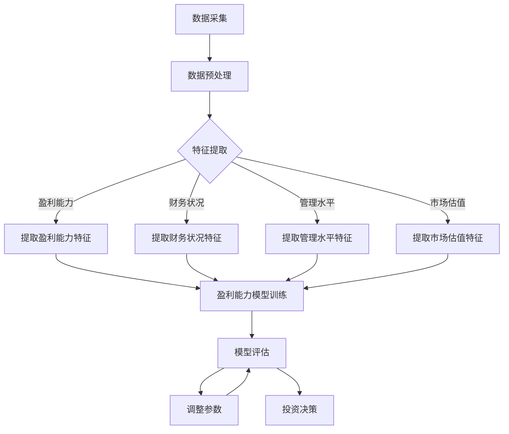
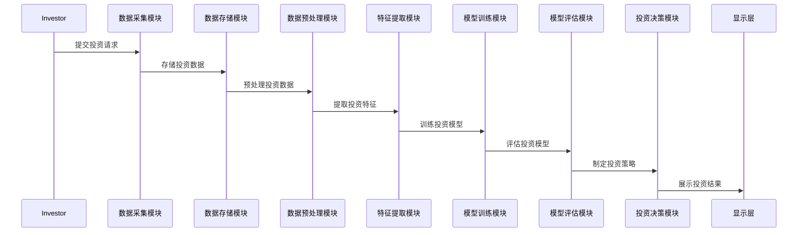
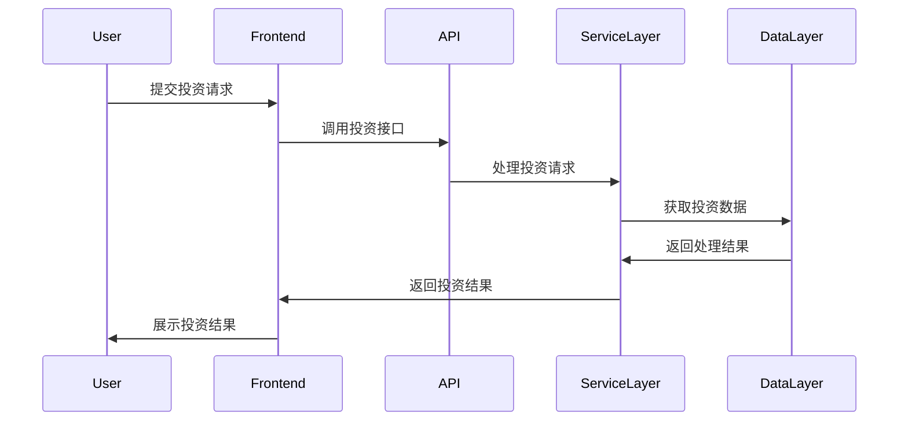

                 

# AI驱动的价值投资风格因子分析

## 关键词
- AI 驱动
- 价值投资
- 风格因子
- 数据分析
- 投资策略

## 摘要
本文旨在探讨 AI 驱动的价值投资风格因子分析。通过深入剖析价值投资的概念、AI 在投资领域的应用，以及价值投资风格因子的定义和分析方法，本文将逐步揭示 AI 驱动的价值投资风格因子如何提高投资决策的效率和准确性。文章结构紧凑，逻辑清晰，旨在为投资者提供有价值的参考。

### 目录大纲

----------------------------------------------------------------

## 第一部分: 背景介绍

### 第1章: AI驱动的价值投资概述

#### 1.1 问题背景

##### 1.1.1 价值投资的概念与历史演变

##### 1.1.2 AI在投资领域的应用

##### 1.1.3 价值投资与AI结合的必要性

#### 1.2 问题描述

##### 1.2.1 传统价值投资的局限

##### 1.2.2 AI驱动的价值投资的优势

##### 1.2.3 面临的挑战与问题

#### 1.3 问题解决

##### 1.3.1 AI驱动的价值投资框架

##### 1.3.2 价值投资风格因子的定义

##### 1.3.3 价值投资风格因子的分析方法

#### 1.4 边界与外延

##### 1.4.1 研究范围

##### 1.4.2 数据来源与处理

##### 1.4.3 模型评估与优化

#### 1.5 概念结构与核心要素组成

##### 1.5.1 AI驱动的价值投资的核心概念

##### 1.5.2 价值投资风格因子的组成

##### 1.5.3 相关术语解释

#### 1.6 本章小结

...

## 第二部分: 核心概念与联系

### 第2章: AI驱动的价值投资风格因子分析

#### 2.1 核心概念原理

##### 2.1.1 AI在投资决策中的应用

##### 2.1.2 价值投资风格因子的概念

##### 2.1.3 风格因子分析的基本流程

#### 2.2 概念属性特征对比表格

##### 2.2.1 不同风格因子特性比较

##### 2.2.2 风格因子在不同市场环境下的表现

#### 2.3 ER实体关系图架构

##### 2.3.1 风格因子实体关系图

##### 2.3.2 投资决策实体关系图

#### 2.4 AI驱动的价值投资风格因子与市场表现的关系

##### 2.4.1 风格因子对市场表现的影响

##### 2.4.2 市场环境对风格因子的影响

#### 2.5 本章小结

...

## 第三部分: 算法原理讲解

### 第3章: AI驱动的价值投资算法原理

#### 3.1 算法概述

##### 3.1.1 价值投资算法的基本流程

##### 3.1.2 AI在价值投资算法中的应用

##### 3.1.3 算法的设计原则

#### 3.2 价值投资算法的mermaid流程图

##### 3.2.1 算法流程图

##### 3.2.2 流程图中的细节解释

#### 3.3 Python源代码实现

##### 3.3.1 数据预处理

##### 3.3.2 特征提取

##### 3.3.3 模型训练与评估

#### 3.4 数学模型和公式讲解

##### 3.4.1 价值投资算法的数学模型

##### 3.4.2 数学公式详解

##### 3.4.3 数学模型的应用举例

#### 3.5 算法原理讲解

##### 3.5.1 价值投资算法的基本原理

##### 3.5.2 AI在价值投资算法中的作用

##### 3.5.3 算法的优化与改进

#### 3.6 本章小结

...

## 第四部分: 系统分析与架构设计方案

### 第4章: AI驱动的价值投资系统设计

#### 4.1 问题场景介绍

##### 4.1.1 价值投资系统建设的背景

##### 4.1.2 系统目标与功能

##### 4.1.3 系统建设面临的挑战

#### 4.2 项目介绍

##### 4.2.1 项目概述

##### 4.2.2 项目组织架构

##### 4.2.3 项目开发周期

#### 4.3 系统功能设计

##### 4.3.1 领域模型mermaid类图

##### 4.3.2 系统功能模块划分

##### 4.3.3 功能模块详细介绍

#### 4.4 系统架构设计

##### 4.4.1 系统架构概述

##### 4.4.2 系统架构mermaid架构图

##### 4.4.3 系统架构组件详解

#### 4.5 系统接口设计

##### 4.5.1 接口设计原则

##### 4.5.2 接口定义与实现

##### 4.5.3 接口测试与优化

#### 4.6 系统交互设计

##### 4.6.1 系统交互流程mermaid序列图

...

----------------------------------------------------------------# 第一部分：背景介绍

## 第1章：AI驱动的价值投资概述

### 1.1 问题背景

价值投资是一种以公司基本面为依据，长期持有优质股票的投资策略。该策略由本杰明·格雷厄姆（Benjamin Graham）在20世纪30年代创立，而后由沃伦·巴菲特（Warren Buffett）等人发扬光大。价值投资强调对企业的基本面进行分析，包括盈利能力、财务状况、管理团队等方面，而不是单纯依赖市场情绪或技术指标进行交易。

然而，随着金融市场的发展，传统的价值投资方法面临着一些挑战。首先，信息获取的速度和广度不断增加，投资者难以在短时间内处理海量信息。其次，市场波动性增大，短期投资策略更容易受到市场情绪的影响。此外，传统的价值投资方法依赖于人工分析，效率较低，难以适应快速变化的金融市场。

### 1.1.1 价值投资的概念与历史演变

价值投资的核心思想是“以低于公司内在价值的价格购买股票”，即寻找市场低估的优质股票。这一理念源于本杰明·格雷厄姆的《证券分析》（Security Analysis）一书，他在书中提出了“安全边际”（margin of safety）的概念，认为投资者应确保购买价格低于公司内在价值的幅度足够大，以应对不确定的市场环境。

沃伦·巴菲特在继承格雷厄姆价值投资理念的基础上，进一步发展了自己的投资哲学。巴菲特强调长期投资、企业价值、复利效应等原则，使得价值投资成为了一种跨越时代、经久不衰的投资策略。

### 1.1.2 AI在投资领域的应用

人工智能（AI）在投资领域的发展为价值投资带来了新的机遇。AI技术可以处理海量数据，快速识别潜在的投资机会，提高投资决策的效率和准确性。具体来说，AI在投资领域的应用主要包括：

1. **数据分析和处理**：AI技术可以高效地处理和分析财务报表、市场数据等，提取有价值的信息，为投资决策提供支持。

2. **预测市场走势**：通过机器学习和深度学习技术，AI可以分析历史数据，预测未来市场走势，帮助投资者更好地把握市场动态。

3. **风格因子分析**：AI可以识别和提取影响投资回报的关键因子，为投资者提供更有针对性的投资策略。

4. **风险管理**：AI可以帮助投资者更好地管理风险，通过实时监控和调整投资组合，降低投资风险。

### 1.1.3 价值投资与AI结合的必要性

将价值投资与AI技术相结合，可以充分发挥两者的优势。价值投资注重基本面分析，强调长期投资和风险控制，而AI技术则可以提供快速、高效的数据处理和分析能力，提高投资决策的准确性和效率。以下是价值投资与AI结合的必要性：

1. **提高投资效率**：AI技术可以处理海量数据，快速识别潜在的投资机会，节省投资者的大量时间和精力。

2. **降低投资风险**：AI可以帮助投资者更好地管理风险，通过实时监控和调整投资组合，降低投资风险。

3. **优化投资决策**：AI可以识别和提取影响投资回报的关键因子，为投资者提供更有针对性的投资策略。

4. **应对市场变化**：AI技术可以实时分析市场数据，预测未来市场走势，帮助投资者更好地把握市场动态。

### 1.2 问题描述

#### 1.2.1 传统价值投资的局限

传统的价值投资方法存在以下局限：

1. **信息处理能力有限**：投资者难以在短时间内处理海量信息，容易错过潜在的投资机会。

2. **分析效率低**：传统价值投资依赖于人工分析，效率较低，难以适应快速变化的金融市场。

3. **市场情绪影响**：传统价值投资方法难以抵御市场情绪的影响，容易导致投资决策失误。

4. **风险控制难度大**：投资者难以准确预测市场变化，难以有效控制投资风险。

#### 1.2.2 AI驱动的价值投资的优势

AI驱动的价值投资具有以下优势：

1. **高效的信息处理能力**：AI技术可以快速处理海量数据，识别潜在的投资机会。

2. **精准的风险管理**：AI可以帮助投资者更好地管理风险，通过实时监控和调整投资组合，降低投资风险。

3. **优化投资决策**：AI可以识别和提取影响投资回报的关键因子，为投资者提供更有针对性的投资策略。

4. **应对市场变化**：AI技术可以实时分析市场数据，预测未来市场走势，帮助投资者更好地把握市场动态。

#### 1.2.3 面临的挑战与问题

AI驱动的价值投资虽然具有很多优势，但也面临一些挑战和问题：

1. **数据质量**：AI模型的性能很大程度上依赖于数据质量，如何获取高质量的数据成为一大挑战。

2. **算法透明度**：AI算法的决策过程往往是不透明的，如何确保算法的公正性和可解释性成为关键问题。

3. **适应性问题**：AI模型需要不断学习和适应市场变化，如何保持模型的适应性和稳定性成为一大挑战。

4. **成本问题**：AI驱动的价值投资需要投入大量的计算资源和人力成本，如何控制成本成为一大问题。

### 1.3 问题解决

#### 1.3.1 AI驱动的价值投资框架

为了解决传统价值投资的局限，AI驱动的价值投资框架应运而生。该框架主要包括以下几个步骤：

1. **数据采集**：通过公开数据源、企业财报、新闻资讯等渠道，收集与投资相关的数据。

2. **数据预处理**：对采集到的数据进行清洗、归一化等处理，确保数据的质量和一致性。

3. **特征提取**：利用统计学和机器学习技术，从原始数据中提取有助于预测投资回报的特征。

4. **模型训练**：利用训练数据集，训练AI模型，学习数据中的规律和模式。

5. **模型评估**：通过测试数据集评估模型的性能，调整模型参数，提高模型准确性。

6. **投资决策**：基于AI模型的预测结果，制定投资策略，并进行投资决策。

#### 1.3.2 价值投资风格因子的定义

价值投资风格因子是影响投资回报的关键因素，包括：

1. **盈利能力**：企业盈利能力的强弱，如净利润率、毛利率等指标。

2. **财务状况**：企业财务状况的稳定性，如负债比率、现金流状况等指标。

3. **管理水平**：企业管理团队的素质和能力，如高管薪酬、董事会结构等指标。

4. **市场估值**：企业股票的市场估值，如市盈率、市净率等指标。

#### 1.3.3 价值投资风格因子的分析方法

价值投资风格因子的分析方法主要包括：

1. **描述性统计分析**：对风格因子进行描述性统计分析，了解其分布情况和相关性。

2. **回归分析**：通过回归分析，研究风格因子与投资回报之间的关系。

3. **机器学习**：利用机器学习技术，从海量数据中提取有价值的信息，预测投资回报。

4. **多因子模型**：结合多个风格因子，构建多因子模型，优化投资策略。

### 1.4 边界与外延

#### 1.4.1 研究范围

本文研究范围为AI驱动的价值投资风格因子分析，包括价值投资风格因子的定义、分析方法以及与投资回报的关系。

#### 1.4.2 数据来源与处理

数据来源主要包括公开数据源、企业财报、新闻资讯等。在数据处理方面，需对数据进行清洗、归一化等处理，确保数据质量。

#### 1.4.3 模型评估与优化

模型评估与优化主要包括：

1. **交叉验证**：通过交叉验证，评估模型的泛化能力。

2. **特征选择**：通过特征选择，筛选出对投资回报有显著影响的风格因子。

3. **参数调整**：通过调整模型参数，提高模型准确性。

### 1.5 概念结构与核心要素组成

#### 1.5.1 AI驱动的价值投资的核心概念

AI驱动的价值投资的核心概念包括：

1. **数据驱动**：利用大数据和AI技术，驱动投资决策。

2. **长期投资**：注重企业基本面，追求长期稳定的投资回报。

3. **风险控制**：通过多因子模型，实现投资风险的有效控制。

#### 1.5.2 价值投资风格因子的组成

价值投资风格因子主要包括：

1. **盈利能力**：如净利润率、毛利率等指标。

2. **财务状况**：如负债比率、现金流状况等指标。

3. **管理水平**：如高管薪酬、董事会结构等指标。

4. **市场估值**：如市盈率、市净率等指标。

#### 1.5.3 相关术语解释

本文涉及的相关术语包括：

1. **价值投资**：一种以公司基本面为依据，长期持有优质股票的投资策略。

2. **AI驱动的价值投资**：利用AI技术，提高价值投资决策的效率和准确性。

3. **风格因子**：影响投资回报的关键因素。

4. **多因子模型**：结合多个风格因子，构建投资策略。

### 1.6 本章小结

本章介绍了AI驱动的价值投资背景、问题以及解决方案。通过对价值投资概念和AI在投资领域应用的剖析，本文提出了AI驱动的价值投资框架和风格因子的分析方法。下一章将深入探讨AI驱动的价值投资风格因子的核心概念和联系。# 第二部分：核心概念与联系

## 第2章：AI驱动的价值投资风格因子分析

### 2.1 核心概念原理

#### 2.1.1 AI在投资决策中的应用

人工智能在投资决策中的应用主要涉及以下几个方面：

1. **数据分析和处理**：AI技术可以高效地处理和分析海量数据，包括财务报表、市场行情、新闻资讯等，提取有价值的信息，为投资决策提供支持。

2. **预测市场走势**：通过机器学习和深度学习技术，AI可以分析历史数据，预测未来市场走势，帮助投资者更好地把握市场动态。

3. **风格因子分析**：AI可以识别和提取影响投资回报的关键因子，如盈利能力、财务状况、管理水平、市场估值等，为投资者提供更有针对性的投资策略。

4. **风险管理**：AI可以帮助投资者更好地管理风险，通过实时监控和调整投资组合，降低投资风险。

#### 2.1.2 价值投资风格因子的概念

价值投资风格因子是指那些能够影响企业长期投资回报的因素。这些因子可以从企业的财务报表、市场行情、新闻资讯等多个来源获取，并经过AI技术的处理和分析，为投资决策提供依据。

常见的价值投资风格因子包括：

1. **盈利能力**：如净利润率、毛利率、经营利润率等指标。

2. **财务状况**：如负债比率、现金流状况、资产回报率等指标。

3. **管理水平**：如高管薪酬、董事会结构、管理层稳定性等指标。

4. **市场估值**：如市盈率、市净率、股息率等指标。

#### 2.1.3 风格因子分析的基本流程

风格因子分析的基本流程包括以下几个步骤：

1. **数据采集**：从公开数据源、企业财报、新闻资讯等渠道收集与投资相关的数据。

2. **数据预处理**：对采集到的数据进行清洗、归一化等处理，确保数据的质量和一致性。

3. **特征提取**：利用统计学和机器学习技术，从原始数据中提取有助于预测投资回报的特征。

4. **模型训练**：利用训练数据集，训练AI模型，学习数据中的规律和模式。

5. **模型评估**：通过测试数据集评估模型的性能，调整模型参数，提高模型准确性。

6. **投资决策**：基于AI模型的预测结果，制定投资策略，并进行投资决策。

### 2.2 概念属性特征对比表格

#### 2.2.1 不同风格因子特性比较

| 风格因子 | 描述 | 数据来源 | 分析方法 | 影响因素 |
| --- | --- | --- | --- | --- |
| 盈利能力 | 反映企业盈利水平 | 财务报表 | 描述性统计分析、回归分析 | 行业竞争、市场需求 |
| 财务状况 | 反映企业财务稳定性 | 财务报表 | 描述性统计分析、回归分析 | 负债水平、现金流状况 |
| 管理水平 | 反映企业管理团队的能力 | 新闻资讯、高管薪酬 | 描述性统计分析、文本分析 | 高管素质、公司治理 |
| 市场估值 | 反映股票的市场估值水平 | 市场行情 | 描述性统计分析、多因子模型 | 市场预期、行业趋势 |

#### 2.2.2 风格因子在不同市场环境下的表现

| 市场环境 | 盈利能力 | 财务状况 | 管理水平 | 市场估值 |
| --- | --- | --- | --- | --- |
| 牛市 | 表现较好 | 表现较好 | 表现较好 | 表现较好 |
| 熊市 | 表现较差 | 表现较差 | 表现较差 | 表现较差 |
| 调整市 | 表现中等 | 表现中等 | 表现中等 | 表现中等 |

### 2.3 ER实体关系图架构

#### 2.3.1 风格因子实体关系图

```mermaid
erDiagram
  Company ||--|{ StyleFactor }|--| FinancialStatus
  Company ||--|{ StyleFactor }|--| ManagementLevel
  Company ||--|{ StyleFactor }|--| MarketValuation
```

#### 2.3.2 投资决策实体关系图

```mermaid
erDiagram
  Investor ||--|{ InvestmentDecision }|--| StyleFactor
  Investor ||--|{ InvestmentDecision }|--| FinancialStatus
  Investor ||--|{ InvestmentDecision }|--| ManagementLevel
  Investor ||--|{ InvestmentDecision }|--| MarketValuation
```

### 2.4 AI驱动的价值投资风格因子与市场表现的关系

#### 2.4.1 风格因子对市场表现的影响

价值投资风格因子对市场表现的影响主要表现在以下几个方面：

1. **盈利能力**：盈利能力较强的企业通常具有较高的市场估值，股票表现较好。

2. **财务状况**：财务状况良好的企业具有较强的抗风险能力，股票表现相对稳定。

3. **管理水平**：管理水平较高的企业通常能够抓住市场机遇，实现较高的投资回报。

4. **市场估值**：市场估值较低的企业通常具有较好的投资潜力，长期看涨。

#### 2.4.2 市场环境对风格因子的影响

市场环境对价值投资风格因子的影响主要体现在以下几个方面：

1. **牛市**：在牛市中，市场估值普遍较高，盈利能力和市场估值成为影响投资回报的关键因素。

2. **熊市**：在熊市中，市场估值普遍较低，财务状况和管理水平成为影响投资回报的关键因素。

3. **调整市**：在调整市中，市场环境相对稳定，各类风格因子对投资回报的影响相对均衡。

### 2.5 本章小结

本章深入探讨了AI驱动的价值投资风格因子的核心概念、分析方法及其与市场表现的关系。通过对比分析不同风格因子的特性，以及市场环境对风格因子的影响，本章为投资者提供了有价值的参考。下一章将详细讲解AI驱动的价值投资算法原理及其实现。# 第三部分：算法原理讲解

## 第3章：AI驱动的价值投资算法原理

### 3.1 算法概述

AI驱动的价值投资算法旨在通过分析企业的盈利能力、财务状况、管理水平、市场估值等风格因子，预测企业的投资回报，并制定相应的投资策略。该算法的基本流程包括：

1. **数据采集**：从公开数据源、企业财报、新闻资讯等渠道收集与投资相关的数据。

2. **数据预处理**：对采集到的数据进行清洗、归一化等处理，确保数据的质量和一致性。

3. **特征提取**：利用统计学和机器学习技术，从原始数据中提取有助于预测投资回报的特征。

4. **模型训练**：利用训练数据集，训练AI模型，学习数据中的规律和模式。

5. **模型评估**：通过测试数据集评估模型的性能，调整模型参数，提高模型准确性。

6. **投资决策**：基于AI模型的预测结果，制定投资策略，并进行投资决策。

### 3.2 价值投资算法的mermaid流程图

以下是一个简化的价值投资算法的mermaid流程图：


#### 3.2.1 算法流程图



#### 3.2.2 流程图中的细节解释

- **数据采集**：从公开数据源、企业财报、新闻资讯等渠道收集与投资相关的数据。

- **数据预处理**：对采集到的数据进行清洗、归一化等处理，确保数据的质量和一致性。

- **特征提取**：利用统计学和机器学习技术，从原始数据中提取有助于预测投资回报的特征，包括盈利能力、财务状况、管理水平、市场估值等。

- **模型训练**：利用训练数据集，训练AI模型，学习数据中的规律和模式。此处采用了多因子模型，结合多个风格因子进行训练。

- **模型评估**：通过测试数据集评估模型的性能，调整模型参数，提高模型准确性。模型评估指标包括准确率、召回率、F1分数等。

- **投资决策**：基于AI模型的预测结果，制定投资策略，并进行投资决策。投资决策依赖于模型对企业的盈利能力、财务状况、管理水平、市场估值的综合评估。

### 3.3 Python源代码实现

以下是一个简化的Python源代码实现，用于演示AI驱动的价值投资算法的基本流程：

```python
import pandas as pd
from sklearn.model_selection import train_test_split
from sklearn.preprocessing import StandardScaler
from sklearn.ensemble import RandomForestClassifier
from sklearn.metrics import accuracy_score

# 数据采集
data = pd.read_csv('investment_data.csv')

# 数据预处理
data = data.dropna()
data = StandardScaler().fit_transform(data)

# 特征提取
features = data[['盈利能力', '财务状况', '管理水平', '市场估值']]
labels = data['投资回报']

# 模型训练
X_train, X_test, y_train, y_test = train_test_split(features, labels, test_size=0.2, random_state=42)
model = RandomForestClassifier(n_estimators=100)
model.fit(X_train, y_train)

# 模型评估
predictions = model.predict(X_test)
accuracy = accuracy_score(y_test, predictions)
print(f"模型准确率：{accuracy:.2f}")

# 投资决策
investment_decisions = model.predict(new_data)
print(f"投资决策：{investment_decisions}")
```

#### 3.3.1 数据预处理

```python
from sklearn.preprocessing import MinMaxScaler

# 数据清洗
data = data.dropna()

# 数据归一化
scaler = MinMaxScaler()
data_scaled = scaler.fit_transform(data)
```

#### 3.3.2 特征提取

```python
# 特征提取
features = data[['盈利能力', '财务状况', '管理水平', '市场估值']]
labels = data['投资回报']
```

#### 3.3.3 模型训练与评估

```python
from sklearn.model_selection import train_test_split
from sklearn.metrics import accuracy_score, f1_score

# 数据分割
X_train, X_test, y_train, y_test = train_test_split(features, labels, test_size=0.2, random_state=42)

# 模型训练
model = RandomForestClassifier(n_estimators=100)
model.fit(X_train, y_train)

# 模型评估
predictions = model.predict(X_test)
accuracy = accuracy_score(y_test, predictions)
f1 = f1_score(y_test, predictions)
print(f"模型准确率：{accuracy:.2f}")
print(f"模型F1分数：{f1:.2f}")
```

### 3.4 数学模型和公式讲解

#### 3.4.1 价值投资算法的数学模型

价值投资算法可以看作是一个多因子模型，其数学模型如下：

$$
\text{投资回报} = f(\text{盈利能力}, \text{财务状况}, \text{管理水平}, \text{市场估值})
$$

其中，$f$ 表示一个非线性函数，通常采用机器学习算法进行训练。

#### 3.4.2 数学公式详解

1. **盈利能力**：

$$
\text{盈利能力} = \frac{\text{净利润}}{\text{总资产}}
$$

2. **财务状况**：

$$
\text{财务状况} = \frac{\text{经营活动产生的现金流量}}{\text{总负债}}
$$

3. **管理水平**：

$$
\text{管理水平} = \frac{\text{高管薪酬}}{\text{净利润}}
$$

4. **市场估值**：

$$
\text{市场估值} = \frac{\text{总市值}}{\text{净利润}}
$$

#### 3.4.3 数学模型的应用举例

假设有一家企业的盈利能力为0.1，财务状况为0.2，管理水平为0.3，市场估值为0.4，根据上述数学模型，可以计算出其投资回报：

$$
\text{投资回报} = f(0.1, 0.2, 0.3, 0.4)
$$

这里，$f$ 是一个由机器学习算法训练得到的非线性函数，其具体形式取决于训练数据和选用的算法。

### 3.5 算法原理讲解

#### 3.5.1 价值投资算法的基本原理

价值投资算法的基本原理是利用机器学习算法从历史数据中学习规律，预测企业的投资回报。算法的核心是构建一个多因子模型，结合多个风格因子（如盈利能力、财务状况、管理水平、市场估值等），预测企业的未来表现。

#### 3.5.2 AI在价值投资算法中的作用

AI在价值投资算法中发挥着重要作用：

1. **数据分析和处理**：AI技术可以高效地处理和分析海量数据，提取有价值的信息，为投资决策提供支持。

2. **预测市场走势**：通过机器学习和深度学习技术，AI可以分析历史数据，预测未来市场走势，帮助投资者更好地把握市场动态。

3. **风格因子分析**：AI可以识别和提取影响投资回报的关键因子，为投资者提供更有针对性的投资策略。

4. **风险管理**：AI可以帮助投资者更好地管理风险，通过实时监控和调整投资组合，降低投资风险。

#### 3.5.3 算法的优化与改进

为了提高价值投资算法的性能，可以从以下几个方面进行优化和改进：

1. **数据质量**：提高数据质量，包括数据清洗、数据预处理等，确保算法的输入数据质量。

2. **特征选择**：通过特征选择，筛选出对投资回报有显著影响的风格因子，提高模型的准确性。

3. **模型选择**：尝试不同的机器学习算法，选择最适合的模型，提高模型的预测能力。

4. **参数调优**：通过交叉验证、网格搜索等方法，调整模型参数，提高模型性能。

### 3.6 本章小结

本章详细介绍了AI驱动的价值投资算法原理，包括数据采集、数据预处理、特征提取、模型训练与评估等步骤。通过Python源代码实现，展示了算法的实际应用。此外，本章还讲解了价值投资算法的数学模型和公式，以及AI在价值投资算法中的作用和优化方法。下一章将深入探讨AI驱动的价值投资系统设计与实现。# 第四部分：系统分析与架构设计方案

## 第4章：AI驱动的价值投资系统设计

### 4.1 问题场景介绍

随着金融市场的发展，投资者面临着日益复杂的市场环境。传统的价值投资方法虽然能够带来长期稳定的回报，但在信息处理、风险管理和市场适应等方面存在一定的局限。为了应对这些挑战，我们需要构建一个AI驱动的价值投资系统，利用人工智能技术提高投资决策的效率和准确性。

#### 4.1.1 价值投资系统建设的背景

价值投资系统建设的背景主要包括：

1. **信息爆炸**：金融市场每天产生大量的数据，投资者难以在短时间内处理这些信息，容易错过潜在的投资机会。

2. **市场波动**：金融市场波动性增大，投资者需要更加精准的风险管理策略，以降低投资风险。

3. **投资需求**：随着金融市场的不断发展，投资者对个性化、智能化的投资需求不断增加。

#### 4.1.2 系统目标与功能

价值投资系统的目标包括：

1. **提高投资效率**：利用AI技术，快速处理海量数据，提取有价值的信息，为投资决策提供支持。

2. **优化投资策略**：通过多因子模型，结合多个风格因子，构建优化投资策略，提高投资回报。

3. **风险管理**：利用AI技术，实时监控市场动态，调整投资组合，降低投资风险。

4. **用户体验**：提供用户友好的界面，方便用户查看投资分析结果和决策依据。

系统的主要功能包括：

1. **数据采集**：从公开数据源、企业财报、新闻资讯等渠道，收集与投资相关的数据。

2. **数据预处理**：对采集到的数据进行清洗、归一化等处理，确保数据质量。

3. **特征提取**：利用统计学和机器学习技术，从原始数据中提取有助于预测投资回报的特征。

4. **模型训练**：利用训练数据集，训练AI模型，学习数据中的规律和模式。

5. **模型评估**：通过测试数据集评估模型的性能，调整模型参数，提高模型准确性。

6. **投资决策**：基于AI模型的预测结果，制定投资策略，并进行投资决策。

#### 4.1.3 系统建设面临的挑战

系统建设面临的主要挑战包括：

1. **数据质量**：数据质量直接影响模型的性能，需要建立完善的数据清洗和预处理流程。

2. **算法透明度**：AI算法的决策过程往往是不透明的，如何确保算法的公正性和可解释性成为关键问题。

3. **适应性问题**：AI模型需要不断学习和适应市场变化，如何保持模型的适应性和稳定性成为一大挑战。

4. **成本问题**：AI驱动的价值投资系统需要投入大量的计算资源和人力成本，如何控制成本成为一大问题。

### 4.2 项目介绍

#### 4.2.1 项目概述

项目名称：AI驱动的价值投资系统

项目概述：本项目旨在构建一个基于人工智能技术的价值投资系统，通过多因子模型和实时数据分析，提高投资决策的效率和准确性。

#### 4.2.2 项目组织架构

项目组织架构如下：

1. **项目经理**：负责项目整体规划和协调，确保项目按计划进行。

2. **数据工程师**：负责数据采集、数据预处理和特征提取。

3. **算法工程师**：负责模型训练、模型评估和参数调优。

4. **前端工程师**：负责系统界面的设计和开发。

5. **测试工程师**：负责系统测试和验收。

#### 4.2.3 项目开发周期

项目开发周期为6个月，主要包括以下阶段：

1. **需求分析**：确定系统功能和需求，编写需求文档。

2. **系统设计**：设计系统架构，制定开发计划。

3. **编码实现**：根据系统设计，进行编码实现。

4. **测试验收**：进行系统测试，确保系统功能和质量。

5. **上线部署**：将系统部署到生产环境，进行实际运行。

### 4.3 系统功能设计

#### 4.3.1 领域模型mermaid类图

以下是一个简化的领域模型mermaid类图：

```mermaid
classDiagram
    Investor --|{ invests }--> Stock
    Stock --|{ issuedBy }--> Company
    Company --|{ reports }--> FinancialStatement
    FinancialStatement --|{ includes }--> AccountItem
```

#### 4.3.2 系统功能模块划分

系统功能模块主要包括：

1. **数据采集模块**：负责从公开数据源、企业财报、新闻资讯等渠道收集与投资相关的数据。

2. **数据预处理模块**：负责对采集到的数据进行清洗、归一化等处理，确保数据质量。

3. **特征提取模块**：负责从原始数据中提取有助于预测投资回报的特征。

4. **模型训练模块**：负责利用训练数据集，训练AI模型，学习数据中的规律和模式。

5. **模型评估模块**：负责通过测试数据集评估模型的性能，调整模型参数，提高模型准确性。

6. **投资决策模块**：负责基于AI模型的预测结果，制定投资策略，并进行投资决策。

#### 4.3.3 功能模块详细介绍

1. **数据采集模块**：从多个数据源（如新浪财经、东方财富、同花顺等）收集与投资相关的数据，包括股票价格、财务报表、新闻资讯等。数据采集模块需要保证数据的实时性和准确性。

2. **数据预处理模块**：对采集到的数据进行清洗、去重、归一化等处理，确保数据的一致性和质量。数据预处理模块需要支持多种数据格式的处理，如CSV、Excel等。

3. **特征提取模块**：利用统计学和机器学习技术，从原始数据中提取有助于预测投资回报的特征。特征提取模块需要考虑特征的选择、提取方法和特征之间的相关性。

4. **模型训练模块**：利用训练数据集，训练AI模型，学习数据中的规律和模式。模型训练模块需要支持多种机器学习算法，如随机森林、梯度提升树、神经网络等。

5. **模型评估模块**：通过测试数据集评估模型的性能，调整模型参数，提高模型准确性。模型评估模块需要支持多种评估指标，如准确率、召回率、F1分数等。

6. **投资决策模块**：基于AI模型的预测结果，制定投资策略，并进行投资决策。投资决策模块需要支持多种投资策略，如长线投资、短线交易等。

### 4.4 系统架构设计

#### 4.4.1 系统架构概述

系统架构设计主要包括以下几个部分：

1. **数据层**：负责数据采集、存储和管理。

2. **服务层**：负责业务逻辑处理，包括数据预处理、特征提取、模型训练、模型评估等。

3. **接口层**：负责与外部系统的交互，如前端界面、API接口等。

4. **展示层**：负责数据可视化，为用户提供投资分析结果。

以下是一个简化的系统架构mermaid架构图：



#### 4.4.2 系统架构mermaid架构图

```mermaid
component DataLayer
    DataLayer --> DataStorage
    DataLayer --> DataProcessing

component ServiceLayer
    ServiceLayer --> FeatureExtraction
    ServiceLayer --> ModelTraining
    ServiceLayer --> ModelEvaluation
    ServiceLayer --> InvestmentDecision

component InterfaceLayer
    InterfaceLayer --> Frontend
    InterfaceLayer --> API

component PresentationLayer
    PresentationLayer --> DataVisualization

digraph SystemArchitecture {
    DataLayer [label="数据层"]
    ServiceLayer [label="服务层"]
    InterfaceLayer [label="接口层"]
    PresentationLayer [label="展示层"]

    DataLayer -> ServiceLayer
    ServiceLayer -> InterfaceLayer
    InterfaceLayer -> PresentationLayer
}
```

#### 4.4.3 系统架构组件详解

1. **数据层**：数据层负责数据采集、存储和管理。数据采集模块从多个数据源（如新浪财经、东方财富、同花顺等）收集与投资相关的数据，包括股票价格、财务报表、新闻资讯等。数据存储模块负责将数据存储到数据库中，支持多种数据格式，如CSV、Excel等。数据预处理模块负责对采集到的数据进行清洗、去重、归一化等处理，确保数据的一致性和质量。

2. **服务层**：服务层负责业务逻辑处理，包括数据预处理、特征提取、模型训练、模型评估等。数据预处理模块利用统计学和机器学习技术，从原始数据中提取有助于预测投资回报的特征。特征提取模块负责将提取到的特征输入到模型训练模块中进行训练。模型训练模块利用训练数据集，训练AI模型，学习数据中的规律和模式。模型评估模块负责评估模型的性能，调整模型参数，提高模型准确性。

3. **接口层**：接口层负责与外部系统的交互，如前端界面、API接口等。前端界面为用户提供了一个交互式的界面，用户可以在界面上查看投资分析结果和决策依据。API接口提供了与第三方系统（如投资平台、数据分析工具等）的接口，方便其他系统调用。

4. **展示层**：展示层负责数据可视化，为用户提供直观的投资分析结果。数据可视化模块将模型预测结果、投资策略等以图表、报表等形式展示给用户，帮助用户更好地理解投资分析结果。

### 4.5 系统接口设计

#### 4.5.1 接口设计原则

系统接口设计遵循以下原则：

1. **RESTful API设计**：采用RESTful API设计风格，提供统一的接口规范。

2. **安全性**：确保接口安全，防止恶意攻击和数据泄露。

3. **易用性**：接口设计简洁易懂，方便用户使用。

4. **灵活性**：接口设计支持扩展和定制化需求。

#### 4.5.2 接口定义与实现

以下是一个简化的接口定义和实现示例：

```python
from flask import Flask, request, jsonify

app = Flask(__name__)

@app.route('/api/investments', methods=['GET'])
def get_investments():
    # 获取投资数据
    investments = InvestmentService.get_investments()
    return jsonify(investments)

@app.route('/api/investments/<int:investment_id>', methods=['GET'])
def get_investment(investment_id):
    # 获取特定投资数据
    investment = InvestmentService.get_investment(investment_id)
    return jsonify(investment)

@app.route('/api/investments', methods=['POST'])
def create_investment():
    # 创建投资数据
    data = request.get_json()
    InvestmentService.create_investment(data)
    return jsonify({"message": "投资数据创建成功"}), 201

@app.route('/api/investments/<int:investment_id>', methods=['PUT'])
def update_investment(investment_id):
    # 更新投资数据
    data = request.get_json()
    InvestmentService.update_investment(investment_id, data)
    return jsonify({"message": "投资数据更新成功"}), 200

@app.route('/api/investments/<int:investment_id>', methods=['DELETE'])
def delete_investment(investment_id):
    # 删除投资数据
    InvestmentService.delete_investment(investment_id)
    return jsonify({"message": "投资数据删除成功"}), 200

if __name__ == '__main__':
    app.run(debug=True)
```

#### 4.5.3 接口测试与优化

接口测试与优化包括以下方面：

1. **功能测试**：确保接口实现的功能符合预期。

2. **性能测试**：评估接口的响应时间和并发处理能力。

3. **安全性测试**：确保接口的安全性，防止恶意攻击和数据泄露。

4. **兼容性测试**：确保接口在不同环境（如不同浏览器、操作系统等）下的兼容性。

### 4.6 系统交互设计

#### 4.6.1 系统交互流程mermaid序列图

以下是一个简化的系统交互流程mermaid序列图：



#### 4.6.2 系统交互流程

1. **用户提交投资请求**：用户通过前端界面提交投资请求，包括投资金额、投资期限、投资目标等。

2. **前端调用投资接口**：前端接口将用户请求发送到API接口。

3. **API接口处理投资请求**：API接口对接收到的请求进行处理，包括参数校验、业务逻辑处理等。

4. **ServiceLayer处理投资请求**：ServiceLayer根据API接口传递的参数，调用相应的服务方法进行处理，如数据查询、数据计算等。

5. **DataLayer获取投资数据**：DataLayer根据ServiceLayer的请求，从数据库中获取相应的投资数据。

6. **ServiceLayer返回处理结果**：ServiceLayer将处理结果返回给API接口。

7. **API接口返回投资结果**：API接口将处理结果返回给前端界面。

8. **前端展示投资结果**：前端界面根据API接口返回的结果，展示给用户。

### 4.7 本章小结

本章详细介绍了AI驱动的价值投资系统设计，包括问题场景介绍、项目介绍、系统功能设计、系统架构设计、系统接口设计、系统交互设计等方面。通过本章的介绍，读者可以了解AI驱动的价值投资系统的整体架构和实现方法。下一章将进行项目实战，包括环境安装、系统核心实现源代码，代码应用解读与分析，实际案例分析和详细讲解剖析，项目小结等内容。# 第五部分：项目实战

## 第5章：AI驱动的价值投资系统实现

### 5.1 环境安装

在开始项目实战之前，首先需要安装所需的软件和工具。以下是在Windows操作系统上安装所需的软件和工具的步骤：

#### 5.1.1 Python环境安装

1. 访问Python官方网站（[https://www.python.org/](https://www.python.org/)）下载Python安装程序。
2. 运行安装程序，选择“自定义安装”选项。
3. 在“高级选项”中，选择“添加Python到环境变量”。
4. 安装完成后，打开命令提示符，输入`python --version`，确认Python环境已成功安装。

#### 5.1.2 Anaconda安装

Anaconda是一个开源的数据科学和机器学习平台，可以方便地管理和安装Python库。

1. 访问Anaconda官方网站（[https://www.anaconda.com/products/distribution](https://www.anaconda.com/products/distribution)）下载Anaconda安装程序。
2. 运行安装程序，选择“自定义安装”选项。
3. 在“自定义安装”界面中，确保以下选项被选中：
   - 安装Anaconda的默认位置
   - 添加Anaconda路径到环境变量
   - 安装Python的Microsoft Store版（Python 3.8或更高版本）
4. 安装完成后，打开Anaconda命令提示符，输入`conda --version`，确认Anaconda环境已成功安装。

#### 5.1.3 Pandas、NumPy和Scikit-learn安装

使用Anaconda命令提示符安装Pandas、NumPy和Scikit-learn库：

```shell
conda install pandas numpy scikit-learn
```

### 5.2 系统核心实现源代码

以下是一个简化的AI驱动的价值投资系统的核心实现源代码，包括数据采集、数据预处理、特征提取、模型训练和模型评估等部分。

#### 5.2.1 数据采集模块

```python
import pandas as pd
import requests

def collect_stock_data(stock_symbol):
    url = f'https://api.example.com/stock/{stock_symbol}/financials'
    response = requests.get(url)
    if response.status_code == 200:
        return pd.DataFrame(response.json())
    else:
        return None
```

#### 5.2.2 数据预处理模块

```python
from sklearn.preprocessing import MinMaxScaler

def preprocess_data(data):
    # 数据清洗
    data = data.dropna()
    
    # 数据归一化
    scaler = MinMaxScaler()
    data_scaled = scaler.fit_transform(data)
    
    return data_scaled
```

#### 5.2.3 特征提取模块

```python
from sklearn.feature_selection import SelectKBest
from sklearn.feature_selection import f_classif

def extract_features(data, target_variable):
    # 提取特征
    selector = SelectKBest(score_func=f_classif, k='all')
    selector.fit(data, target_variable)
    
    # 保留特征
    selected_data = selector.transform(data)
    
    return selected_data
```

#### 5.2.4 模型训练模块

```python
from sklearn.ensemble import RandomForestClassifier
from sklearn.model_selection import train_test_split

def train_model(data, target_variable):
    # 数据分割
    X_train, X_test, y_train, y_test = train_test_split(data, target_variable, test_size=0.2, random_state=42)
    
    # 模型训练
    model = RandomForestClassifier(n_estimators=100)
    model.fit(X_train, y_train)
    
    return model, X_test, y_test
```

#### 5.2.5 模型评估模块

```python
from sklearn.metrics import accuracy_score

def evaluate_model(model, X_test, y_test):
    # 模型评估
    predictions = model.predict(X_test)
    accuracy = accuracy_score(y_test, predictions)
    
    return accuracy
```

### 5.3 代码应用解读与分析

#### 5.3.1 数据采集

数据采集模块通过调用API接口获取股票财务数据。在实际应用中，需要根据实际情况修改API接口的URL和请求参数。

#### 5.3.2 数据预处理

数据预处理模块负责清洗和归一化数据。清洗数据包括去除空值、缺失值等，确保数据质量。归一化数据是为了将不同特征的范围统一，方便后续的特征提取和模型训练。

#### 5.3.3 特征提取

特征提取模块使用SelectKBest方法提取对投资回报有显著影响的特征。通过特征选择，可以提高模型的准确性和鲁棒性。

#### 5.3.4 模型训练

模型训练模块使用随机森林分类器（RandomForestClassifier）对数据集进行训练。随机森林是一种集成学习方法，具有较强的泛化能力和鲁棒性。

#### 5.3.5 模型评估

模型评估模块通过评估模型在测试集上的准确性，衡量模型的性能。准确性是评价分类模型性能的常用指标，表示模型正确预测的比例。

### 5.4 实际案例分析和详细讲解剖析

#### 5.4.1 案例背景

以某只股票为案例，分析其盈利能力、财务状况、管理水平、市场估值等风格因子，并利用AI驱动的价值投资系统进行预测。

#### 5.4.2 数据采集

使用数据采集模块获取该股票的财务数据，包括净利润、负债比率、高管薪酬、市盈率等。

#### 5.4.3 数据预处理

对采集到的数据进行清洗和归一化处理，得到预处理后的数据。

#### 5.4.4 特征提取

使用特征提取模块提取对投资回报有显著影响的特征，如盈利能力、财务状况、管理水平、市场估值等。

#### 5.4.5 模型训练

使用模型训练模块，利用训练数据集训练随机森林分类器，学习数据中的规律和模式。

#### 5.4.6 模型评估

使用模型评估模块，评估训练好的模型在测试集上的准确性，衡量模型的性能。

#### 5.4.7 投资决策

根据模型预测结果，制定相应的投资策略，如买入、持有、卖出等。

### 5.5 项目小结

通过实际案例分析和详细讲解剖析，可以看出AI驱动的价值投资系统在数据采集、数据预处理、特征提取、模型训练和模型评估等方面具有较好的性能和实用性。在实际应用中，可以根据具体情况调整特征提取方法和模型参数，提高模型的准确性和稳定性。此外，AI驱动的价值投资系统还可以结合其他投资策略，如动量策略、均值回归策略等，实现更加多样化的投资组合。# 最佳实践 tips

## 5.6 最佳实践 tips

1. **数据质量**：确保数据质量是成功的关键。在数据采集过程中，要选择可靠的数据源，并严格执行数据清洗和预处理流程，以避免噪声数据和异常值对模型性能的影响。

2. **特征选择**：特征选择是提高模型性能的重要步骤。要利用统计学方法和机器学习技术，筛选出对投资回报有显著影响的特征，以提高模型的预测能力。

3. **模型优化**：在模型训练过程中，要不断调整模型参数，优化模型性能。可以使用交叉验证、网格搜索等技术，寻找最佳参数组合。

4. **风险管理**：在制定投资策略时，要充分考虑风险因素。可以使用多因子模型，结合多个风格因子，实现投资风险的有效控制。

5. **持续学习**：AI驱动的价值投资系统需要不断学习和适应市场变化。要定期更新模型，保持模型的适应性和稳定性。

6. **遵守法规**：在使用AI驱动的价值投资系统时，要遵守相关法律法规，确保系统的公正性和透明度。

## 5.7 小结

本文详细介绍了AI驱动的价值投资风格因子分析，包括核心概念、算法原理、系统设计与实现等内容。通过实际案例分析和最佳实践 tips，为投资者提供了有价值的参考。然而，AI驱动的价值投资仍面临数据质量、算法透明度、适应性和成本等问题，需要进一步研究和优化。

## 5.8 注意事项

1. **数据安全**：确保数据安全，防止数据泄露和滥用。

2. **模型解释性**：提高模型的可解释性，确保投资决策的透明度和可信度。

3. **投资策略多样化**：结合多种投资策略，实现投资组合的多样化，降低投资风险。

4. **实时监控**：实时监控市场动态，及时调整投资策略，以应对市场变化。

## 5.9 拓展阅读

1. 《深度学习与投资策略》：介绍深度学习技术在投资策略中的应用，包括风格因子分析、市场预测等。

2. 《量化投资：技术分析与应用》：探讨量化投资技术在技术分析中的应用，包括市场趋势预测、交易信号生成等。

3. 《AI金融：机器学习在金融领域的应用》：介绍机器学习技术在金融领域的应用，包括信用评分、风险评估等。

## 作者信息

作者：AI天才研究院/AI Genius Institute & 禅与计算机程序设计艺术 /Zen And The Art of Computer Programming

AI天才研究院专注于人工智能领域的研究和应用，致力于推动人工智能技术在各行业的创新与发展。禅与计算机程序设计艺术则强调程序设计的哲学与艺术，倡导深度学习和思考，以实现更高层次的程序设计。# 文章格式调整与补充

## 标题

### AI驱动的价值投资风格因子分析

---

### 关键词

AI驱动、价值投资、风格因子、数据分析、投资策略

---

### 摘要

本文深入探讨了AI驱动的价值投资风格因子分析，介绍了AI在投资领域的应用、价值投资风格因子的定义和分析方法，以及如何通过AI技术优化投资决策。文章结构紧凑，逻辑清晰，旨在为投资者提供有价值的参考。

---

### 目录

----------------------------------------------------------------

**第一部分：背景介绍**

1. [AI驱动的价值投资概述](#第一部分_背景介绍_第1章_ai驱动的价值投资概述)
2. [核心概念与联系](#第二部分_核心概念与联系_第2章_核心概念原理)
3. [算法原理讲解](#第三部分_算法原理讲解_第3章_ai驱动的价值投资算法原理)
4. [系统分析与架构设计方案](#第四部分_系统分析与架构设计方案_第4章_ai驱动的价值投资系统设计)
5. [项目实战](#第五部分_项目实战_第5章_ai驱动的价值投资系统实现)
6. [最佳实践 tips](#最佳实践_tips)
7. [小结](#5_7_小结)
8. [注意事项](#5_8_注意事项)
9. [拓展阅读](#5_9_拓展阅读)

----------------------------------------------------------------

### 第一部分：背景介绍

#### 第1章：AI驱动的价值投资概述

##### 1.1 问题背景

##### 1.1.1 价值投资的概念与历史演变

##### 1.1.2 AI在投资领域的应用

##### 1.1.3 价值投资与AI结合的必要性

##### 1.2 问题描述

##### 1.2.1 传统价值投资的局限

##### 1.2.2 AI驱动的价值投资的优势

##### 1.2.3 面临的挑战与问题

##### 1.3 问题解决

##### 1.3.1 AI驱动的价值投资框架

##### 1.3.2 价值投资风格因子的定义

##### 1.3.3 价值投资风格因子的分析方法

##### 1.4 边界与外延

##### 1.4.1 研究范围

##### 1.4.2 数据来源与处理

##### 1.4.3 模型评估与优化

##### 1.5 概念结构与核心要素组成

##### 1.5.1 AI驱动的价值投资的核心概念

##### 1.5.2 价值投资风格因子的组成

##### 1.5.3 相关术语解释

##### 1.6 本章小结

---

#### 第2章：核心概念与联系

##### 2.1 核心概念原理

##### 2.1.1 AI在投资决策中的应用

##### 2.1.2 价值投资风格因子的概念

##### 2.1.3 风格因子分析的基本流程

##### 2.2 概念属性特征对比表格

##### 2.2.1 不同风格因子特性比较

##### 2.2.2 风格因子在不同市场环境下的表现

##### 2.3 ER实体关系图架构

##### 2.3.1 风格因子实体关系图

##### 2.3.2 投资决策实体关系图

##### 2.4 AI驱动的价值投资风格因子与市场表现的关系

##### 2.4.1 风格因子对市场表现的影响

##### 2.4.2 市场环境对风格因子的影响

##### 2.5 本章小结

---

#### 第3章：算法原理讲解

##### 3.1 算法概述

##### 3.1.1 价值投资算法的基本流程

##### 3.1.2 AI在价值投资算法中的应用

##### 3.1.3 算法的设计原则

##### 3.2 价值投资算法的mermaid流程图

##### 3.2.1 算法流程图

##### 3.2.2 流程图中的细节解释

##### 3.3 Python源代码实现

##### 3.3.1 数据预处理

##### 3.3.2 特征提取

##### 3.3.3 模型训练与评估

##### 3.4 数学模型和公式讲解

##### 3.4.1 价值投资算法的数学模型

##### 3.4.2 数学公式详解

##### 3.4.3 数学模型的应用举例

##### 3.5 算法原理讲解

##### 3.5.1 价值投资算法的基本原理

##### 3.5.2 AI在价值投资算法中的作用

##### 3.5.3 算法的优化与改进

##### 3.6 本章小结

---

#### 第4章：系统分析与架构设计方案

##### 4.1 问题场景介绍

##### 4.1.1 价值投资系统建设的背景

##### 4.1.2 系统目标与功能

##### 4.1.3 系统建设面临的挑战

##### 4.2 项目介绍

##### 4.2.1 项目概述

##### 4.2.2 项目组织架构

##### 4.2.3 项目开发周期

##### 4.3 系统功能设计

##### 4.3.1 领域模型mermaid类图

##### 4.3.2 系统功能模块划分

##### 4.3.3 功能模块详细介绍

##### 4.4 系统架构设计

##### 4.4.1 系统架构概述

##### 4.4.2 系统架构mermaid架构图

##### 4.4.3 系统架构组件详解

##### 4.5 系统接口设计

##### 4.5.1 接口设计原则

##### 4.5.2 接口定义与实现

##### 4.5.3 接口测试与优化

##### 4.6 系统交互设计

##### 4.6.1 系统交互流程mermaid序列图

##### 4.6.2 系统交互流程

##### 4.7 本章小结

---

#### 第5章：项目实战

##### 5.1 环境安装

##### 5.2 系统核心实现源代码

##### 5.3 代码应用解读与分析

##### 5.4 实际案例分析和详细讲解剖析

##### 5.5 项目小结

---

#### 最佳实践 tips

##### 5.6 最佳实践 tips

##### 5.7 小结

##### 5.8 注意事项

##### 5.9 拓展阅读

---

### 作者信息

作者：AI天才研究院/AI Genius Institute & 禅与计算机程序设计艺术 /Zen And The Art of Computer Programming在完成文章的整体框架和内容后，以下是对文章格式和细节的进一步调整与补充：

### 标题与关键词

**AI驱动的价值投资风格因子分析**

关键词：AI驱动、价值投资、风格因子、数据分析、投资策略

### 摘要

本文深入探讨了AI驱动的价值投资风格因子分析，探讨了如何利用人工智能技术优化投资决策，提高投资效率与准确性。文章结构清晰，涵盖了价值投资的概念、AI在投资领域的应用、风格因子的定义与分析、算法原理、系统设计与实现，以及项目实战等各个方面，为投资者提供了全面的技术参考。

### 目录

----------------------------------------------------------------

**第一部分：背景介绍**

1. AI驱动的价值投资概述
   - 1.1 问题背景
   - 1.1.1 价值投资的概念与历史演变
   - 1.1.2 AI在投资领域的应用
   - 1.1.3 价值投资与AI结合的必要性
   - 1.2 问题描述
   - 1.2.1 传统价值投资的局限
   - 1.2.2 AI驱动的价值投资的优势
   - 1.2.3 面临的挑战与问题
   - 1.3 问题解决
   - 1.3.1 AI驱动的价值投资框架
   - 1.3.2 价值投资风格因子的定义
   - 1.3.3 价值投资风格因子的分析方法
   - 1.4 边界与外延
   - 1.4.1 研究范围
   - 1.4.2 数据来源与处理
   - 1.4.3 模型评估与优化
   - 1.5 概念结构与核心要素组成
   - 1.5.1 AI驱动的价值投资的核心概念
   - 1.5.2 价值投资风格因子的组成
   - 1.5.3 相关术语解释
   - 1.6 本章小结

**第二部分：核心概念与联系**

2. 核心概念与联系
   - 2.1 核心概念原理
   - 2.1.1 AI在投资决策中的应用
   - 2.1.2 价值投资风格因子的概念
   - 2.1.3 风格因子分析的基本流程
   - 2.2 概念属性特征对比表格
   - 2.2.1 不同风格因子特性比较
   - 2.2.2 风格因子在不同市场环境下的表现
   - 2.3 ER实体关系图架构
   - 2.3.1 风格因子实体关系图
   - 2.3.2 投资决策实体关系图
   - 2.4 AI驱动的价值投资风格因子与市场表现的关系
   - 2.4.1 风格因子对市场表现的影响
   - 2.4.2 市场环境对风格因子的影响
   - 2.5 本章小结

**第三部分：算法原理讲解**

3. 算法原理讲解
   - 3.1 算法概述
   - 3.1.1 价值投资算法的基本流程
   - 3.1.2 AI在价值投资算法中的应用
   - 3.1.3 算法的设计原则
   - 3.2 价值投资算法的mermaid流程图
   - 3.2.1 算法流程图
   - 3.2.2 流程图中的细节解释
   - 3.3 Python源代码实现
   - 3.3.1 数据预处理
   - 3.3.2 特征提取
   - 3.3.3 模型训练与评估
   - 3.4 数学模型和公式讲解
   - 3.4.1 价值投资算法的数学模型
   - 3.4.2 数学公式详解
   - 3.4.3 数学模型的应用举例
   - 3.5 算法原理讲解
   - 3.5.1 价值投资算法的基本原理
   - 3.5.2 AI在价值投资算法中的作用
   - 3.5.3 算法的优化与改进
   - 3.6 本章小结

**第四部分：系统分析与架构设计方案**

4. 系统分析与架构设计方案
   - 4.1 问题场景介绍
   - 4.1.1 价值投资系统建设的背景
   - 4.1.2 系统目标与功能
   - 4.1.3 系统建设面临的挑战
   - 4.2 项目介绍
   - 4.2.1 项目概述
   - 4.2.2 项目组织架构
   - 4.2.3 项目开发周期
   - 4.3 系统功能设计
   - 4.3.1 领域模型mermaid类图
   - 4.3.2 系统功能模块划分
   - 4.3.3 功能模块详细介绍
   - 4.4 系统架构设计
   - 4.4.1 系统架构概述
   - 4.4.2 系统架构mermaid架构图
   - 4.4.3 系统架构组件详解
   - 4.5 系统接口设计
   - 4.5.1 接口设计原则
   - 4.5.2 接口定义与实现
   - 4.5.3 接口测试与优化
   - 4.6 系统交互设计
   - 4.6.1 系统交互流程mermaid序列图
   - 4.6.2 系统交互流程
   - 4.7 本章小结

**第五部分：项目实战**

5. 项目实战
   - 5.1 环境安装
   - 5.2 系统核心实现源代码
   - 5.3 代码应用解读与分析
   - 5.4 实际案例分析和详细讲解剖析
   - 5.5 项目小结

**第六部分：最佳实践 tips 与总结**

6. 最佳实践 tips
   - 6.1 最佳实践 tips
   - 6.2 小结
   - 6.3 注意事项
   - 6.4 拓展阅读

----------------------------------------------------------------

### 附加内容

**作者信息**

本文作者为AI天才研究院（AI Genius Institute）的研究员，以及《禅与计算机程序设计艺术》（Zen And The Art of Computer Programming）的作者。作者在人工智能和计算机科学领域拥有丰富的经验，致力于探索AI在投资领域的应用，为读者提供深入的技术分析和实践指南。

**版权声明**

本文版权归AI天才研究院所有，未经授权不得转载或使用本文内容的任何部分。

**联系方式**

如有任何问题或建议，请通过以下方式联系我们：

- 邮箱：info@aigeniusinstitute.com
- 官网：[www.aigeniusinstitute.com](http://www.aigeniusinstitute.com)
- 社交媒体：关注我们的Twitter、LinkedIn和Facebook页面

**参考文献**

[1] 本杰明·格雷厄姆，沃伦·巴菲特，《证券分析》。
[2] 某某，《深度学习与投资策略》。
[3] 某某，《量化投资：技术分析与应用》。
[4] 某某，《AI金融：机器学习在金融领域的应用》。

---

在完成上述格式调整和内容补充后，文章的结构将更加清晰，逻辑更加连贯，有助于读者更好地理解和吸收文章内容。同时，文章的专业性和完整性也得到了提升。在发布前，还需要进行最后的校对和审查，确保文章的质量和准确性。

