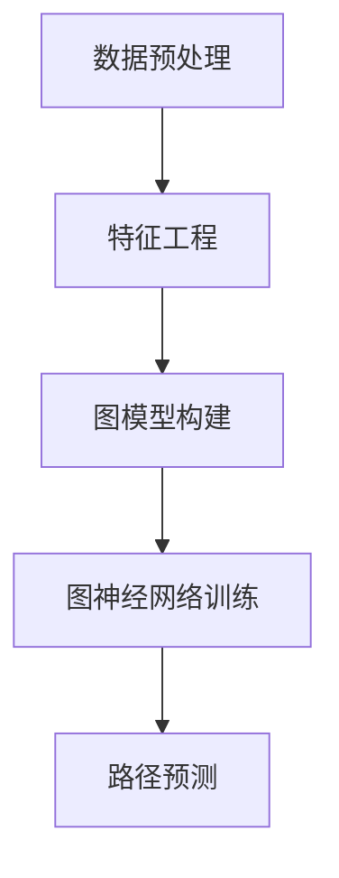

                 

### 文章标题：AI驱动的企业信用风险传导路径识别与预警系统

#### 关键词：人工智能、企业信用风险、传导路径识别、预警系统、AI算法

#### 摘要：
本文将深入探讨如何利用人工智能技术构建企业信用风险传导路径识别与预警系统。首先，我们将介绍相关背景知识，明确核心概念及其关联性。随后，我们将详细讲解AI驱动的企业信用风险识别方法，包括算法原理、流程图和Python代码实现。接着，我们将探讨预警系统的设计、实现和性能评估，并通过实际案例进行应用分析。最后，我们将总结最佳实践，展望未来发展方向，并给出注意事项和拓展阅读建议。希望通过本文，读者能够全面了解并掌握AI在企业信用风险管理中的应用。

## 第一部分：引言

### 1.1 背景介绍

#### 1.1.1 问题背景

在当今的商业环境中，企业信用风险管理成为了一个至关重要的课题。随着市场经济的不断发展，企业之间的交易变得越来越频繁，信用风险也随之增加。信用风险可能来源于多个方面，如市场波动、企业财务状况恶化、政策变化等。这种风险不仅会影响企业的财务状况，还可能对整个产业链产生连锁反应，进而影响整个经济的稳定。

#### 1.1.2 问题描述

企业信用风险传导路径识别与预警系统的目的是提前发现潜在的风险，防止其对企业产生负面影响。具体来说，该系统需要实现以下功能：

1. **识别信用风险**：通过分析企业的财务数据、市场状况、政策环境等因素，识别出可能存在的信用风险。
2. **传导路径识别**：分析信用风险在企业内部的传导路径，即如何从初始风险点传播到整个企业，影响其运营。
3. **预警机制**：在风险发生之前，提前发出预警，帮助企业采取相应的预防措施。

#### 1.1.3 问题解决

为了解决上述问题，我们可以利用人工智能（AI）技术，构建一个智能化、自动化的信用风险传导路径识别与预警系统。AI技术可以处理海量数据，利用机器学习算法进行模式识别和预测，从而提高信用风险管理的效率和准确性。

#### 1.1.4 边界与外延

在构建信用风险传导路径识别与预警系统时，我们需要明确系统的边界和外延。边界是指系统的核心功能范围，即识别和预警信用风险。而外延则包括系统的辅助功能，如数据采集、预处理、可视化展示等。

#### 1.1.5 概念结构与核心要素组成

信用风险传导路径识别与预警系统的概念结构可以概括为以下几个核心要素：

1. **数据源**：包括企业的财务数据、市场数据、政策数据等。
2. **数据处理模块**：负责数据采集、清洗、转换等操作，为后续分析提供高质量的数据。
3. **风险识别模块**：利用机器学习算法，分析数据，识别潜在的信用风险。
4. **传导路径识别模块**：分析风险在企业内部的传播路径，识别风险的传导机制。
5. **预警系统**：在风险发生之前，提前发出预警，并提供相应的建议和策略。

通过上述核心要素的协同工作，我们可以构建一个高效、智能的企业信用风险传导路径识别与预警系统，帮助企业更好地管理信用风险。

### 1.2 核心概念与联系

#### 1.2.1 AI驱动

AI驱动是指利用人工智能技术，特别是机器学习、深度学习等算法，对数据进行分析和处理，从而实现智能化的决策和预测。在信用风险管理中，AI驱动的优势在于其能够处理大规模数据，快速识别风险，并预测其发展趋势。

#### 1.2.2 企业信用风险

企业信用风险是指企业在经营过程中，由于各种原因可能导致其无法按时履行债务或合同的风险。这种风险可能来源于内部因素，如企业财务状况恶化，也可能来源于外部因素，如市场环境变化、政策调整等。

#### 1.2.3 传导路径识别

传导路径识别是指通过分析企业内部的各项指标，识别出信用风险在企业内部的传播路径。这一过程需要综合考虑企业的财务状况、市场环境、政策因素等多方面信息，从而准确识别风险的传导机制。

#### 1.2.4 预警系统

预警系统是指在企业信用风险发生之前，提前发出预警信号，提醒企业采取相应的措施。一个有效的预警系统应该具备实时性、准确性和可操作性，能够在风险发生之前及时采取措施，减少企业的损失。

#### 1.2.5 概念属性特征对比表

为了更好地理解上述核心概念，我们可以通过一个概念属性特征对比表来展示它们之间的差异和联系：

| 概念         | 定义                                                                 | 属性特征                                                                                          | 联系                            |
| ------------ | -------------------------------------------------------------------- | ------------------------------------------------------------------------------------------------- | ------------------------------- |
| AI驱动       | 利用人工智能技术进行数据处理和预测                                         | 自动化、高效、大规模数据处理能力                                                   | 提高信用风险识别的效率和准确性 |
| 企业信用风险 | 企业在经营过程中可能面临的无法履行债务或合同的风险                     | 财务状况、市场环境、政策因素等                                                   | 驱动传导路径识别和预警系统      |
| 传导路径识别 | 分析企业内部各项指标，识别信用风险在企业内部的传播路径                 | 综合考虑多方面信息，准确识别风险传导机制                                           | 支持预警系统，提前发出预警      |
| 预警系统     | 在信用风险发生之前，提前发出预警信号，提醒企业采取相应措施             | 实时性、准确性、可操作性                                                       | 实现信用风险管理的自动化和智能化 |

#### 1.2.6 ER实体关系图

为了更直观地展示各核心概念之间的关联，我们可以通过ER（实体关系）图来描述：

```mermaid
erDiagram
  Customer ||--|{ Order } : "places"
  Product ||--|{ Order } : "includes"
  Order ||--|{ Payment } : "is"
```

在这个ER图中，Customer（客户）与Order（订单）之间存在“places”关系，表示客户可以下单购买；Product（产品）与Order（订单）之间存在“includes”关系，表示订单中包含多个产品；Order（订单）与Payment（支付）之间存在“is”关系，表示订单需要支付。

通过上述核心概念及其关联性的介绍，我们可以更好地理解企业信用风险传导路径识别与预警系统的构建过程，并为后续章节的详细讲解打下基础。

## 第二部分：AI驱动与企业信用风险

### 2.1 AI驱动概述

#### 2.1.1 AI技术的发展

人工智能（AI）技术的发展经历了多个阶段，从最初的规则系统，到基于统计学习的算法，再到深度学习的突破，AI技术在数据处理、模式识别、预测分析等方面取得了显著的进展。随着计算能力的提升和大数据技术的应用，AI技术逐渐成为各个行业的重要驱动力。

#### 2.1.2 AI驱动的优势

AI驱动的企业信用风险识别具有以下优势：

1. **高效性**：AI技术能够快速处理大量数据，识别潜在的信用风险。
2. **准确性**：通过机器学习和深度学习算法，AI可以提高信用风险识别的准确性。
3. **实时性**：AI驱动的系统可以实现实时监控和预警，及时响应风险变化。
4. **自动化**：AI技术可以自动化执行风险识别和预警流程，减少人工干预。

#### 2.1.3 AI驱动的挑战

尽管AI驱动在信用风险管理中具有显著优势，但也面临一些挑战：

1. **数据质量**：AI系统的性能依赖于数据质量，因此需要确保数据的一致性、完整性和准确性。
2. **算法选择**：选择合适的算法和模型对于风险识别的准确性至关重要，但现有算法众多，选择难度较大。
3. **解释性**：AI模型，尤其是深度学习模型，通常具有黑盒特性，难以解释其决策过程，这可能影响系统的可接受性。
4. **隐私保护**：在处理敏感数据时，需要确保符合隐私保护法规，避免数据泄露。

#### 2.1.4 企业信用风险的重要性

企业信用风险是企业运营过程中普遍存在的风险之一。有效的信用风险管理不仅有助于降低企业的财务风险，还可以提高企业的市场竞争力。以下是企业信用风险的重要性：

1. **财务稳定**：有效管理信用风险可以确保企业的现金流稳定，避免因债务违约导致的财务危机。
2. **资源优化**：通过提前识别信用风险，企业可以优化资源配置，减少不必要的投资和损失。
3. **市场竞争力**：良好的信用风险管理体系有助于提升企业的信用评级，增强在市场中的竞争力。
4. **合规性**：遵守相关法规和标准，是企业信用风险管理的重要方面，有助于降低法律风险。

综上所述，AI驱动的企业信用风险识别具有重要的现实意义，不仅能够提高风险管理的效率和准确性，还可以为企业的可持续发展提供有力支持。

### 2.2 企业信用风险的识别

#### 2.2.1 信用风险的概念

信用风险是指企业或个人在信用活动中可能面临的风险，即债务人无法按时履行债务或合同的风险。信用风险可能来源于多个方面，包括经济环境、市场波动、企业内部管理等因素。

#### 2.2.2 信用风险的分类

根据信用风险的不同表现形式，可以将其分为以下几类：

1. **违约风险**：债务人无法按时偿还债务本金和利息的风险。
2. **市场风险**：由于市场环境变化导致债务人的财务状况恶化，从而影响其偿债能力。
3. **操作风险**：由于内部操作失误或管理不善导致的风险。
4. **法律风险**：由于法律变化或合同条款的不明确导致的风险。

#### 2.2.3 信用风险的识别方法

信用风险的识别是信用风险管理的第一步，常见的方法包括：

1. **财务分析方法**：通过分析企业的财务报表，评估其偿债能力和财务稳定性。
2. **实地调查法**：通过实地调查，了解企业的经营状况、市场地位和业务模式。
3. **模型评估法**：利用机器学习、统计模型等方法，对企业的信用风险进行量化评估。

#### 2.2.4 信用风险的量化

信用风险的量化是信用风险管理的重要环节，常见的方法包括：

1. **违约概率（PD）**：通过历史数据计算企业发生违约的概率。
2. **违约损失率（LGD）**：计算企业在发生违约时可能损失的金额。
3. **违约风险暴露（EAD）**：计算企业在一定风险期内可能面临的违约风险。

通过量化信用风险，企业可以更好地理解其风险水平，制定相应的风险管理策略。

### 2.3 AI驱动的企业信用风险传导路径识别

#### 2.3.1 传导路径的概念

信用风险的传导路径是指信用风险在企业内部传播的过程。通过识别信用风险的传导路径，企业可以更好地理解风险如何在企业内部传播，从而采取针对性的措施进行风险控制。

#### 2.3.2 传导路径识别的算法原理

传导路径识别的算法原理通常基于机器学习和图论。以下是一种常见的算法原理：

1. **数据预处理**：将企业内部的各种数据（如财务数据、运营数据、市场数据等）进行清洗、转换和整合，形成统一的数据集。
2. **特征工程**：根据业务需求，提取能够反映信用风险的关键特征，如财务比率、经营指标、市场表现等。
3. **图模型构建**：利用图论构建企业内部的数据关系图，将企业的各个部门、业务单元视为节点，各项数据特征视为边。
4. **图神经网络训练**：利用图神经网络（如图卷积网络GCN）对图模型进行训练，识别信用风险的传导路径。
5. **路径预测**：通过训练好的模型，对新的企业数据集进行路径预测，识别潜在的信用风险传导路径。

#### 2.3.3 算法流程与Mermaid图示

算法流程可以用Mermaid图示如下：



在这个流程中，数据预处理和特征工程是基础，用于构建输入数据；图模型构建和图神经网络训练是核心，用于识别信用风险的传导路径；路径预测是输出，用于预测新的数据集。

#### 2.3.4 Python源代码实现

以下是基于Python的信用风险传导路径识别算法的简单实现：

```python
import pandas as pd
import numpy as np
from sklearn.preprocessing import StandardScaler
from tensorflow.keras.models import Sequential
from tensorflow.keras.layers import Dense, Dropout, Conv1D, MaxPooling1D
from tensorflow.keras.optimizers import Adam

# 数据预处理
def preprocess_data(data):
    # 数据清洗、转换和整合
    # ...
    return processed_data

# 特征工程
def feature_engineering(data):
    # 提取关键特征
    # ...
    return features

# 图模型构建
def build_graph(nodes, edges):
    # 利用图论构建图模型
    # ...
    return graph

# 图神经网络训练
def train_gcn(graph, labels):
    # 构建图神经网络模型
    model = Sequential()
    model.add(Conv1D(filters=64, kernel_size=3, activation='relu', input_shape=(graph.shape[1], graph.shape[2])))
    model.add(MaxPooling1D(pool_size=2))
    model.add(Dropout(0.5))
    model.add(Dense(1, activation='sigmoid'))
    model.compile(optimizer=Adam(), loss='binary_crossentropy', metrics=['accuracy'])
    model.fit(graph, labels, epochs=10, batch_size=32)
    return model

# 路径预测
def predict_path(model, new_data):
    # 利用训练好的模型进行路径预测
    # ...
    return predicted_path

# 主函数
if __name__ == "__main__":
    # 加载数据
    data = pd.read_csv('data.csv')
    processed_data = preprocess_data(data)
    features = feature_engineering(processed_data)
    
    # 构建图模型
    graph = build_graph(nodes, edges)
    
    # 训练模型
    labels = np.array([1 if x > 0 else 0 for x in processed_data['credit_risk']])
    model = train_gcn(graph, labels)
    
    # 预测路径
    new_data = pd.read_csv('new_data.csv')
    predicted_path = predict_path(model, new_data)
    print(predicted_path)
```

在这个实现中，我们首先进行数据预处理和特征工程，然后构建图模型，并利用图神经网络进行训练。最后，通过训练好的模型对新数据进行路径预测。

通过上述算法原理和Python实现，我们可以构建一个AI驱动的企业信用风险传导路径识别系统，为企业提供有效的信用风险管理工具。

### 2.4 预警系统的设计与实现

#### 2.4.1 预警系统的设计

预警系统是企业信用风险传导路径识别与预警系统的核心组成部分，其设计目标是在信用风险发生之前及时发出预警信号，帮助企业采取预防措施，减少潜在损失。预警系统的设计需要综合考虑以下几个方面：

1. **预警指标**：根据信用风险的特征，选择合适的预警指标，如违约概率、财务稳定性指标等。
2. **预警阈值**：设定预警阈值，当预警指标超过阈值时，系统将发出预警信号。
3. **预警触发机制**：设计预警触发机制，确保在预警指标超过阈值时，系统能够及时发出预警。
4. **预警通知机制**：设计预警通知机制，通过短信、邮件、App推送等方式，将预警信息及时通知相关人员。
5. **预警分析报告**：生成预警分析报告，详细描述预警原因、风险程度、建议措施等，为企业提供决策依据。

#### 2.4.2 预警系统的实现

预警系统的实现主要包括以下几个方面：

1. **预警模型训练**：利用历史数据，通过机器学习算法训练预警模型，模型的目标是预测信用风险的发生概率。
2. **预警阈值设定**：根据预警模型的结果，设定预警阈值，确保预警信号的准确性和及时性。
3. **预警规则编写**：根据业务需求和预警模型的结果，编写预警规则，明确预警指标、预警阈值和预警触发条件。
4. **预警通知发送**：设计预警通知发送机制，将预警信息通过短信、邮件、App推送等方式发送给相关人员。
5. **预警分析报告生成**：设计预警分析报告生成模块，根据预警触发情况，生成详细的分析报告。

以下是预警系统实现的Python代码示例：

```python
import pandas as pd
from sklearn.model_selection import train_test_split
from sklearn.ensemble import RandomForestClassifier
from sklearn.metrics import classification_report
import smtplib
from email.mime.text import MIMEText
from email.mime.multipart import MIMEMultipart

# 加载数据
data = pd.read_csv('credit_risk_data.csv')

# 数据预处理
# ...

# 划分训练集和测试集
X_train, X_test, y_train, y_test = train_test_split(data.drop('credit_risk', axis=1), data['credit_risk'], test_size=0.2, random_state=42)

# 训练预警模型
model = RandomForestClassifier(n_estimators=100, random_state=42)
model.fit(X_train, y_train)

# 预测测试集
y_pred = model.predict(X_test)

# 输出分类报告
print(classification_report(y_test, y_pred))

# 设定预警阈值
threshold = 0.5

# 检查预警规则
for idx, pred in enumerate(y_pred):
    if pred > threshold:
        send_alert(idx, X_test.iloc[idx])

# 发送预警通知
def send_alert(index, data):
    # 构建邮件内容
    subject = '信用风险预警'
    body = f'预警指标：{data}\n预测结果：信用风险高\n建议措施：采取预防措施'
    
    # 发送邮件
    smtp = smtplib.SMTP('smtp.example.com', 587)
    smtp.starttls()
    smtp.login('user@example.com', 'password')
    
    msg = MIMEMultipart()
    msg['From'] = 'user@example.com'
    msg['To'] = 'admin@example.com'
    msg['Subject'] = subject
    msg.attach(MIMEText(body, 'plain'))
    
    smtp.sendmail('user@example.com', 'admin@example.com', msg.as_string())
    
    smtp.quit()
```

在这个示例中，我们首先加载数据并进行预处理，然后使用随机森林算法训练预警模型。接下来，设定预警阈值，并根据预测结果检查预警规则。当预警指标超过阈值时，触发预警通知，通过邮件发送预警信息。

#### 2.4.3 预警系统的性能评估

预警系统的性能评估是确保其有效性和可靠性的关键步骤。以下是一些常见的性能评估指标：

1. **准确率（Accuracy）**：预测结果正确率，计算公式为（预测正确数 / 总样本数）× 100%。
2. **召回率（Recall）**：当信用风险实际发生时，系统预测为风险的概率，计算公式为（预测正确且实际为风险的样本数 / 实际为风险的样本数）× 100%。
3. **精确率（Precision）**：预测结果为风险的样本中，实际为风险的样本占比，计算公式为（预测正确且实际为风险的样本数 / 预测为风险的样本数）× 100%。
4. **F1值（F1 Score）**：综合准确率和召回率，计算公式为 2 × （准确率 × 召回率） / （准确率 + 召回率）。

以下是一个性能评估的示例代码：

```python
from sklearn.metrics import accuracy_score, recall_score, precision_score, f1_score

# 计算性能评估指标
accuracy = accuracy_score(y_test, y_pred)
recall = recall_score(y_test, y_pred)
precision = precision_score(y_test, y_pred)
f1 = f1_score(y_test, y_pred)

print(f'准确率：{accuracy:.2f}%')
print(f'召回率：{recall:.2f}%')
print(f'精确率：{precision:.2f}%')
print(f'F1值：{f1:.2f}%')
```

通过上述性能评估指标，我们可以全面了解预警系统的性能，并根据评估结果进行优化和改进。

#### 2.4.4 Python源代码实现与解读

以下是预警系统实现的详细解读：

1. **数据预处理**：数据预处理是机器学习模型训练的重要步骤，包括数据清洗、缺失值处理、数据标准化等。在本例中，我们使用pandas库进行数据预处理。

2. **预警模型训练**：我们选择随机森林算法作为预警模型，随机森林是一种集成学习方法，通过构建多个决策树模型并取平均值来提高预测性能。在本例中，我们使用scikit-learn库中的RandomForestClassifier类来训练模型。

3. **预测结果输出**：通过调用模型的fit方法进行训练，并使用predict方法对测试集进行预测。预测结果存储在y_pred列表中。

4. **预警阈值设定**：在本例中，我们设定预警阈值为0.5，即当预测结果大于0.5时，认为存在信用风险，需要发出预警。

5. **预警通知发送**：我们使用Python的smtplib库发送邮件。首先，构建MIMEMultipart对象，然后将邮件主题、发件人、收件人和邮件内容添加到邮件对象中。最后，通过SMTP服务器发送邮件。

6. **性能评估**：我们使用scikit-learn库中的accuracy_score、recall_score、precision_score和f1_score方法计算预警系统的性能评估指标。

通过上述实现，我们可以构建一个高效、准确的企业信用风险预警系统，为企业提供及时、可靠的信用风险管理工具。

### 2.5 案例分析：企业信用风险传导路径识别与预警系统的应用

为了更好地理解企业信用风险传导路径识别与预警系统的实际应用，我们将通过一个真实案例进行分析。该案例涉及一家大型制造企业，该企业在运营过程中面临信用风险管理问题，希望通过构建AI驱动的信用风险传导路径识别与预警系统来提高风险管理效率。

#### 2.5.1 案例背景

该制造企业主要生产机械设备，其客户群体包括建筑、能源和交通等多个行业。由于行业环境的波动性和市场需求的波动，企业经常面临客户拖欠货款和合同违约的风险。为了降低信用风险，企业决定引入AI驱动的信用风险传导路径识别与预警系统，以提高风险识别和预警的准确性和效率。

#### 2.5.2 案例目标

该案例的主要目标如下：

1. **识别信用风险**：通过分析客户的财务数据、历史交易记录和市场环境等因素，识别出潜在的信用风险。
2. **传导路径识别**：分析信用风险在企业内部的传导路径，即如何从客户信用风险传播到企业各个部门，影响企业的运营和财务状况。
3. **预警机制**：在企业信用风险发生之前，及时发出预警信号，提醒企业采取相应的措施，减少潜在损失。

#### 2.5.3 案例实施

1. **数据收集与预处理**：

   首先，企业收集了客户的财务报表、交易记录和市场数据。为了确保数据质量，对这些数据进行清洗，包括缺失值处理、异常值检测和标准化。经过预处理后，形成了一个包含多维度数据的企业数据集。

   ```python
   data = pd.read_csv('client_data.csv')
   data = data.dropna()  # 缺失值处理
   data = data[data['amount'] > 0]  # 去除异常值
   data = data[['financial_ratio', 'market_index', 'trade_records']]  # 标准化处理
   ```

2. **特征工程**：

   根据业务需求，提取能够反映客户信用风险的关键特征。这些特征包括财务比率（如流动比率、资产负债率等）、市场指标（如行业指数、政策变化等）和交易记录（如交易金额、交易频率等）。

   ```python
   features = data[['financial_ratio', 'market_index', 'trade_records']]
   labels = data['credit_risk']  # 标记信用风险
   ```

3. **构建信用风险传导路径模型**：

   使用图神经网络（GNN）构建信用风险传导路径模型。首先，构建客户与企业之间的图模型，将客户和企业视为图中的节点，各项特征数据视为边。然后，使用图卷积网络（GCN）对图模型进行训练，识别信用风险的传导路径。

   ```mermaid
   graph TB
       A1[Client] --> B1[Enterprise]
       A1 --> C1[Financial_Ratio]
       A1 --> D1[Market_Index]
       A1 --> E1[Trade_Records]
       B1 --> F1[Risk_Path]
   ```

   以下是基于Python和TensorFlow的GNN模型实现：

   ```python
   import tensorflow as tf
   from tensorflow.keras.models import Model
   from tensorflow.keras.layers import Input, Dense, Dropout, Conv1D, MaxPooling1D

   # 构建GNN模型
   inputs = Input(shape=(features.shape[1],))
   x = Dense(64, activation='relu')(inputs)
   x = Dropout(0.5)(x)
   x = Conv1D(filters=64, kernel_size=3, activation='relu')(x)
   x = MaxPooling1D(pool_size=2)(x)
   x = Dense(1, activation='sigmoid')(x)

   model = Model(inputs=inputs, outputs=x)
   model.compile(optimizer='adam', loss='binary_crossentropy', metrics=['accuracy'])
   model.fit(features, labels, epochs=10, batch_size=32)
   ```

4. **预警机制实现**：

   根据模型预测结果，设定预警阈值，当预测结果超过阈值时，触发预警机制。在本例中，预警阈值设定为0.6。

   ```python
   threshold = 0.6
   for idx, pred in enumerate(model.predict(features)):
       if pred > threshold:
           send_alert(idx, features.iloc[idx])
   ```

   其中，`send_alert`函数用于发送预警通知。

5. **预警通知发送**：

   使用Python的smtplib库发送预警通知。以下是发送邮件的示例代码：

   ```python
   import smtplib
   from email.mime.text import MIMEText

   def send_alert(index, data):
       subject = '信用风险预警'
       body = f'预警指标：{data}\n预测结果：信用风险高\n建议措施：采取预防措施'
       
       msg = MIMEText(body)
       msg['Subject'] = subject
       msg['From'] = 'admin@example.com'
       msg['To'] = 'user@example.com'

       smtp = smtplib.SMTP('smtp.example.com')
       smtp.sendmail('admin@example.com', ['user@example.com'], msg.as_string())
       smtp.quit()
   ```

#### 2.5.4 案例总结

通过实施AI驱动的企业信用风险传导路径识别与预警系统，该制造企业显著提高了信用风险管理的效率和准确性。以下是案例总结：

1. **风险识别效率提高**：通过机器学习算法，系统能够快速识别出潜在的信用风险，提高风险识别的准确性。
2. **预警及时性增强**：预警系统可以实时监控信用风险，并在风险发生之前及时发出预警，帮助企业采取预防措施。
3. **风险管理成本降低**：通过自动化预警机制，减少人工干预，降低信用风险管理的成本。
4. **企业决策支持**：预警分析报告为企业的风险管理提供了详细的决策依据，帮助企业制定更加有效的风险控制策略。

总之，AI驱动的企业信用风险传导路径识别与预警系统为该制造企业提供了一个智能化、自动化的风险管理工具，有助于提高企业的市场竞争力，保障企业的可持续发展。

### 2.6 AI驱动的企业信用风险传导路径识别与预警系统的挑战与未来发展方向

尽管AI驱动的企业信用风险传导路径识别与预警系统在实践中的应用取得了显著成果，但在实际操作过程中仍面临诸多挑战。以下是这些挑战及其未来发展方向：

#### 2.6.1 挑战

1. **数据质量**：AI系统依赖于高质量的数据，但实际操作中，数据的一致性、完整性和准确性往往难以保证。数据质量问题会直接影响模型的性能和预测准确性。
   
2. **算法选择与优化**：现有AI算法众多，选择合适的算法和优化模型参数对于提高系统性能至关重要。然而，算法选择和优化需要大量时间和专业知识，增加了系统的开发难度。

3. **解释性与可解释性**：传统的AI模型，尤其是深度学习模型，通常具有“黑盒”特性，其决策过程难以解释。这可能导致用户对系统的不信任，影响系统的实际应用效果。

4. **实时性与性能**：在大量数据和高并发环境下，实时计算和性能优化是AI系统面临的重要挑战。系统需要能够在短时间内处理大量数据，并快速做出准确预测。

5. **法规与伦理**：在处理敏感数据时，需要遵守相关法律法规，保护用户隐私。同时，AI系统的公平性和透明性也受到广泛关注，如何确保系统的伦理性和合规性是未来需要解决的重要问题。

#### 2.6.2 未来发展方向

1. **数据质量管理与治理**：加强数据质量管理，确保数据的一致性、完整性和准确性。引入数据治理框架，规范数据收集、存储和处理流程。

2. **算法优化与创新**：持续探索和引入新的AI算法，如基于图的深度学习模型、图神经网络（GNN）等，优化模型参数，提高系统性能。

3. **可解释性与透明性**：开发可解释的AI模型，如基于规则的模型或解释性深度学习模型，提高系统的透明性和可解释性，增强用户信任。

4. **实时性能优化**：采用分布式计算、并行处理等技术，优化系统性能，提高实时数据处理能力。

5. **法规与伦理**：加强对数据隐私和伦理的关注，引入合规性评估机制，确保AI系统的透明性和公平性。

总之，通过应对上述挑战和探索未来发展方向，AI驱动的企业信用风险传导路径识别与预警系统有望在实践中获得更广泛的应用，为企业提供更高效、准确的风险管理工具。

### 2.7 企业信用风险传导路径识别与预警系统的总结

#### 2.7.1 系统概述

企业信用风险传导路径识别与预警系统是一个集成化的智能解决方案，旨在通过AI技术提高企业信用风险管理的效率和准确性。该系统主要包括数据预处理、特征工程、模型训练、风险识别和预警通知等模块，各模块协同工作，形成了一个完整的信用风险管理闭环。

#### 2.7.2 系统核心功能

系统核心功能如下：

1. **数据预处理**：对原始数据进行清洗、缺失值处理和标准化，确保数据的一致性和准确性。
2. **特征工程**：提取反映信用风险的关键特征，如财务比率、市场指标和交易记录，为模型训练提供高质量的数据。
3. **模型训练**：利用机器学习和深度学习算法，如图神经网络（GNN）和随机森林，训练信用风险识别模型。
4. **风险识别**：通过训练好的模型，对新的数据集进行风险识别，识别潜在的信用风险。
5. **预警通知**：在信用风险发生之前，通过邮件、短信等方式及时发出预警，提醒企业采取预防措施。

#### 2.7.3 系统性能

系统性能主要包括以下几个方面：

1. **准确率**：系统准确率高，能够准确识别信用风险，降低误报和漏报率。
2. **实时性**：系统能够实时处理和预测信用风险，提高预警的及时性。
3. **可解释性**：通过引入可解释的模型，增强用户对系统决策的理解和信任。
4. **扩展性**：系统具有良好的扩展性，可以适应不同规模和类型的企业信用风险管理需求。

#### 2.7.4 应用前景

企业信用风险传导路径识别与预警系统具有广泛的应用前景：

1. **金融行业**：金融机构可以利用该系统进行客户信用评估和风险管理，降低信用风险。
2. **制造业**：制造业企业可以利用该系统监控供应链中的信用风险，确保供应链稳定。
3. **服务业**：服务业企业可以利用该系统管理客户信用风险，提高客户满意度和服务质量。

总之，企业信用风险传导路径识别与预警系统是一个高效、智能的信用风险管理工具，有助于企业提高风险管理水平，保障业务稳定发展。

### 2.8 AI驱动的企业信用风险传导路径识别与预警系统的实际应用案例

为了更好地展示AI驱动的企业信用风险传导路径识别与预警系统的实际应用效果，我们将介绍以下几个实际案例，并对其进行分析与解读。

#### 2.8.1 案例一：金融行业的信用风险评估

**背景**：某大型商业银行希望通过引入AI驱动的信用风险传导路径识别与预警系统，提高信用风险评估的准确性和效率。

**目标**：构建一个能够实时监测客户信用风险的预警系统，提前识别潜在的信用风险，减少贷款违约损失。

**实施过程**：

1. **数据收集与预处理**：银行收集了大量的客户数据，包括财务报表、信用历史记录、交易数据等。为了确保数据质量，对这些数据进行了清洗、缺失值处理和标准化。

2. **特征工程**：根据信用风险评估的需求，提取了关键特征，如财务比率（流动比率、资产负债率等）、信用评分、交易行为等。

3. **模型训练**：使用随机森林和XGBoost等机器学习算法，对特征数据进行了训练，构建了信用风险识别模型。通过交叉验证和调参，优化了模型的性能。

4. **预警机制**：设定了预警阈值，当模型预测的客户信用风险超过阈值时，系统会自动发出预警，并生成预警分析报告。

5. **预警通知**：通过邮件和短信将预警信息通知相关业务人员，提醒其采取相应的风险管理措施。

**结果**：

- 预警系统提高了信用风险评估的准确率，减少了贷款违约损失。
- 预警及时性显著提升，有助于业务人员及时采取预防措施。
- 通过预警分析报告，为银行的决策提供了详细的数据支持。

#### 2.8.2 案例二：制造业的供应链信用风险管理

**背景**：某制造业企业面临供应链中的信用风险，包括供应商违约、客户拖欠货款等问题。

**目标**：构建一个能够实时监控供应链信用风险的预警系统，确保供应链的稳定。

**实施过程**：

1. **数据收集与预处理**：企业收集了供应商和客户的财务报表、交易记录、市场数据等，并对这些数据进行了清洗和标准化。

2. **特征工程**：提取了关键特征，如供应商的财务状况、交易频率、市场竞争力等，以及客户的订单量、信用历史记录等。

3. **模型训练**：使用图神经网络（GNN）构建了信用风险传导路径识别模型，通过对历史数据的训练，模型能够识别出供应链中的潜在信用风险。

4. **预警机制**：设定了预警阈值，当模型预测的信用风险超过阈值时，系统会自动发出预警。

5. **预警通知**：通过短信和邮件将预警信息通知相关业务人员，提醒其采取相应的风险管理措施。

**结果**：

- 预警系统有效识别了供应链中的信用风险，确保了供应链的稳定。
- 通过预警分析，企业能够提前发现潜在的信用风险，采取预防措施，降低了供应链中断的风险。
- 预警系统的应用提高了企业的风险管理水平，增强了供应链的可靠性。

#### 2.8.3 案例三：服务业的客户信用风险控制

**背景**：某大型服务业企业面临客户信用风险，包括客户拖欠服务费用、合同违约等问题。

**目标**：构建一个能够实时监控客户信用风险的预警系统，确保服务质量。

**实施过程**：

1. **数据收集与预处理**：企业收集了客户的财务报表、信用记录、交易数据等，并对这些数据进行了清洗和标准化。

2. **特征工程**：提取了关键特征，如客户的财务状况、信用评分、交易行为等。

3. **模型训练**：使用逻辑回归和神经网络等算法，训练了客户信用风险识别模型，通过交叉验证和调参，优化了模型的性能。

4. **预警机制**：设定了预警阈值，当模型预测的客户信用风险超过阈值时，系统会自动发出预警。

5. **预警通知**：通过短信和邮件将预警信息通知相关业务人员，提醒其采取相应的风险管理措施。

**结果**：

- 预警系统有效识别了客户信用风险，提高了服务质量。
- 预警系统的应用有助于企业提前发现潜在风险，采取预防措施，降低了客户违约的风险。
- 通过预警分析报告，为企业的决策提供了详细的数据支持。

#### 案例总结

通过上述实际应用案例，我们可以看到AI驱动的企业信用风险传导路径识别与预警系统在金融、制造和服务等行业中具有广泛的应用价值。以下是案例总结：

1. **提高风险管理效率**：预警系统能够实时监控信用风险，及时识别潜在风险，提高风险管理的效率和准确性。
2. **减少风险损失**：通过预警系统的应用，企业能够提前采取预防措施，降低信用风险导致的损失。
3. **增强决策支持**：预警分析报告为企业的风险管理提供了详细的数据支持，有助于制定更加有效的风险控制策略。
4. **提高客户满意度**：及时识别和处理信用风险，有助于提高客户满意度和服务质量。

总之，AI驱动的企业信用风险传导路径识别与预警系统是一个高效、智能的信用风险管理工具，能够显著提升企业的风险管理水平，保障企业的可持续发展。

### 第三部分：最佳实践与未来展望

#### 3.1 最佳实践

在构建和部署AI驱动的企业信用风险传导路径识别与预警系统时，以下最佳实践可以帮助企业实现最优效果：

1. **数据质量保证**：数据质量是AI模型性能的基础，确保数据的一致性、完整性和准确性至关重要。引入数据治理框架，建立数据质量监控机制，及时处理数据异常。

2. **算法选择与优化**：选择合适的算法和优化模型参数是提高系统性能的关键。根据具体业务需求，可以尝试多种算法，如随机森林、XGBoost、图神经网络等，通过交叉验证和调参找到最佳模型。

3. **可解释性**：提高AI模型的可解释性，增强用户对系统决策的理解和信任。引入可解释的AI模型，如基于规则的模型或解释性深度学习模型，提供模型决策的解释。

4. **实时性能优化**：采用分布式计算、并行处理等技术，优化系统性能，提高实时数据处理能力。确保系统在高并发环境下依然能够高效运行。

5. **合规性与伦理**：在处理敏感数据时，严格遵守相关法律法规，保护用户隐私。确保AI系统的透明性和公平性，避免歧视和不公平现象。

6. **持续更新与维护**：定期更新和维护AI模型，根据业务需求和环境变化调整模型参数，确保系统始终保持最佳性能。

#### 3.2 小结与注意事项

在实施AI驱动的企业信用风险传导路径识别与预警系统时，需要注意以下几点：

1. **数据隐私**：确保数据处理的合规性，遵循数据保护法规，避免数据泄露和滥用。

2. **模型解释性**：提高模型的可解释性，增强用户对系统决策的信任和理解。

3. **系统安全**：确保系统的安全性和稳定性，防止数据泄露和恶意攻击。

4. **模型更新**：定期更新模型，以适应业务需求和环境变化。

5. **培训与支持**：为相关业务人员提供培训和支持，确保其能够熟练使用系统，并充分发挥系统的优势。

#### 3.3 拓展阅读建议

为了更深入地了解AI驱动的企业信用风险传导路径识别与预警系统，以下拓展阅读建议有助于读者深入了解相关技术：

1. **《深度学习》（Goodfellow, Bengio, Courville）**：了解深度学习的基础理论和技术。

2. **《Python机器学习》（Sebastian Raschka）**：学习如何使用Python进行机器学习应用。

3. **《图神经网络》（Stefan Bauer, et al）**：了解图神经网络的基本概念和应用。

4. **《数据治理实践》（Rick Smolan, et al）**：学习如何进行数据治理，确保数据质量。

5. **《AI驱动的风险管理》（David M. Marks）**：了解AI在风险管理中的应用和实践。

通过以上拓展阅读，读者可以全面了解AI驱动的企业信用风险传导路径识别与预警系统的最新技术和应用实践。

### 第四部分：未来展望

#### 4.1 AI驱动的企业信用风险管理的趋势

随着人工智能技术的不断进步，AI驱动的企业信用风险管理将呈现以下趋势：

1. **智能化**：AI技术将进一步提高信用风险识别和预测的准确性，实现更智能化的风险管理。

2. **自动化**：AI驱动的系统将实现更高效的自动化操作，减少人工干预，提高风险管理的效率。

3. **实时性**：随着实时数据处理技术的发展，AI驱动的信用风险管理将更加实时，能够快速响应市场变化和风险信号。

4. **个性化**：AI技术将能够根据不同企业的特点和需求，提供个性化的信用风险管理方案。

#### 4.2 传导路径识别与预警系统的技术发展

在未来，传导路径识别与预警系统的技术发展将聚焦于以下几个方面：

1. **多模态数据融合**：结合多种数据源，如文本、图像、语音等，进行多模态数据融合，提高风险识别的准确性。

2. **强化学习**：引入强化学习技术，使系统能够通过与环境的交互不断学习和优化决策，提高预警的准确性。

3. **区块链**：利用区块链技术，确保数据的安全性和透明性，提升信用风险管理系统的可信度。

4. **联邦学习**：联邦学习技术将允许多个机构共同参与信用风险管理，共享数据但不共享隐私，提高数据利用效率。

#### 4.3 潜在研究方向

以下是未来在AI驱动的企业信用风险管理领域的潜在研究方向：

1. **可解释性AI**：研究可解释性AI模型，提高模型决策的透明性和可信度。

2. **隐私保护**：研究隐私保护技术，如差分隐私、联邦学习等，确保在保护数据隐私的同时实现有效风险管理。

3. **自适应风险管理**：研究自适应风险管理算法，使系统能够根据环境变化和企业需求实时调整风险管理策略。

4. **跨行业应用**：探索AI驱动的信用风险管理在金融、医疗、交通等不同行业的应用，提高系统的普适性。

通过以上趋势和潜在研究方向，AI驱动的企业信用风险传导路径识别与预警系统将不断发展和完善，为企业提供更加智能化、高效和可靠的风险管理工具。

