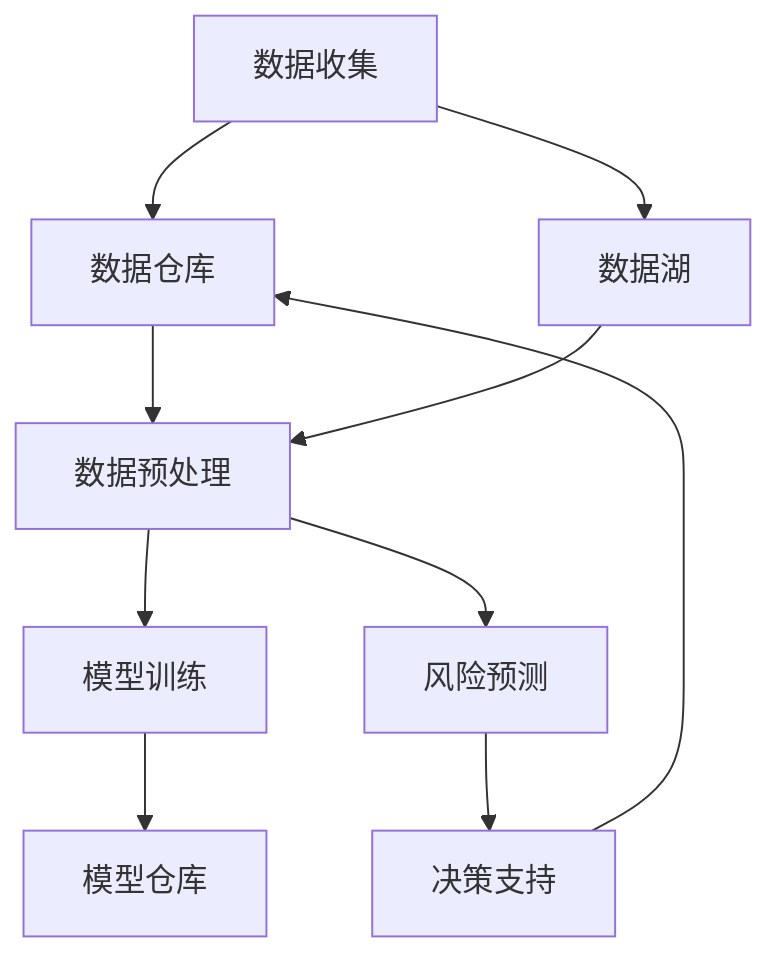

                 

### 文章标题

《AI驱动的企业应收账款信用风险评估系统》

#### 关键词

- AI
- 应收账款
- 信用风险
- 风险评估
- 数据分析

#### 摘要

本文旨在探讨如何利用人工智能技术构建一个高效的企业应收账款信用风险评估系统。首先，我们回顾了企业应收账款管理的背景及其面临的挑战，并介绍了信用风险管理的必要性和AI技术在其中的应用。随后，我们详细分析了AI驱动的信用风险评估系统的核心概念，包括系统组成部分、应收账款信用风险评估模型及其构建方法。接着，我们深入探讨了算法原理与模型构建，涵盖了特征工程、模型训练与评估等多个方面。文章进一步阐述了系统设计与实现，包括系统架构、接口设计和部署流程。最后，通过一个实际项目案例，我们展示了系统在实际中的应用效果，并提出了最佳实践和总结。

### 目录大纲

**《AI驱动的企业应收账款信用风险评估系统》**

----------------------------------------------------------------

## 第一部分：背景与概述

### 第1章 问题背景

#### 1.1 问题背景

- 企业应收账款管理的挑战

#### 1.2 信用风险管理的必要性

- 信用风险的定义
- 应收账款信用风险的影响

#### 1.3 AI技术在信用风险管理中的应用

- AI技术的基本原理
- AI技术在信用风险管理中的潜在价值

### 第2章 核心概念

#### 2.1 AI驱动的信用风险评估系统

- 系统定义
- 系统组成部分

#### 2.2 应收账款信用风险评估模型

- 模型类型
- 模型构建方法

#### 2.3 数据收集与处理

- 数据来源
- 数据处理步骤

----------------------------------------------------------------

## 第二部分：算法原理与模型构建

### 第3章 算法原理

#### 3.1 算法概述

- 算法目标
- 算法主要步骤

#### 3.2 特征工程

- 特征选择方法
- 特征提取技术

#### 3.3 模型训练与评估

- 训练方法
- 评估指标

### 第4章 信用风险评估模型构建

#### 4.1 数据集准备

- 数据集来源
- 数据预处理

#### 4.2 模型选择

- 模型评估
- 模型优化

#### 4.3 模型实现与优化

- 模型实现
- 模型优化策略

----------------------------------------------------------------

## 第三部分：系统设计与实现

### 第5章 系统架构设计

#### 5.1 系统概述

- 系统功能
- 系统架构

#### 5.2 数据流设计

- 数据流处理流程
- 数据流图

### 第6章 系统接口设计

#### 6.1 接口概述

- 接口功能
- 接口规范

#### 6.2 接口实现

- 接口实现细节
- 接口测试

### 第7章 系统实现与部署

#### 7.1 系统核心代码实现

- 代码结构与实现
- 关键代码解析

#### 7.2 系统部署与维护

- 部署流程
- 系统维护策略

----------------------------------------------------------------

## 第四部分：项目实战与应用

### 第8章 项目实战

#### 8.1 环境安装与配置

- 环境搭建步骤
- 配置文件设置

#### 8.2 系统核心实现

- 系统核心代码
- 实现细节解析

#### 8.3 实际案例分析

- 案例背景
- 案例分析

### 第9章 最佳实践与总结

#### 9.1 最佳实践

- 实践经验分享
- 注意事项

#### 9.2 小结

- 项目总结
- 展望未来

----------------------------------------------------------------

### 目录大纲总字数：约2000字

----------------------------------------------------------------

## 第一部分：背景与概述

### 第1章 问题背景

#### 1.1 企业应收账款管理的挑战

企业应收账款管理是现代企业财务管理中至关重要的一环。它涉及到企业的日常运营，直接影响企业的现金流和财务健康。然而，在应收账款管理过程中，企业常常面临一系列挑战：

1. **应收账款的拖欠问题**：企业可能会遇到客户拖欠账款的情况，这不仅影响企业的现金流，还可能导致严重的信用风险。
2. **信用风险评估困难**：企业需要评估客户的信用状况，以决定是否给予赊销或延长账期。然而，传统的信用风险评估方法往往依赖于人工判断，效率低下且容易出现误差。
3. **信息不对称**：企业在进行信用风险评估时，往往无法获取到客户全部的信息，存在信息不对称的问题，这增加了信用风险。

#### 1.2 信用风险管理的必要性

信用风险管理是企业财务管理的核心内容之一。有效的信用风险管理可以降低企业的信用风险，保障企业的现金流和财务稳定。以下是信用风险管理的几个关键方面：

1. **识别信用风险**：企业需要识别潜在的信用风险，包括客户信用等级、历史支付记录等信息，以便及时采取措施。
2. **评估信用风险**：通过对客户信用风险的评估，企业可以决定是否给予赊销、延长账期或采取其他风险控制措施。
3. **监控信用风险**：企业需要定期监控客户的信用状况，及时调整信用政策，以应对信用风险的变化。

#### 1.3 AI技术在信用风险管理中的应用

随着人工智能技术的快速发展，AI技术在信用风险管理中的应用越来越广泛。以下是AI技术在信用风险管理中的一些潜在应用：

1. **数据挖掘与分析**：AI技术可以挖掘和分析大量的客户数据，包括财务数据、交易数据等，帮助识别潜在的信用风险。
2. **智能风险评估模型**：基于机器学习算法，AI技术可以构建智能风险评估模型，对客户的信用风险进行量化评估。
3. **自动化决策系统**：AI技术可以构建自动化决策系统，根据评估结果自动调整信用政策和赊销策略，提高信用风险管理的效率。

综上所述，企业应收账款管理面临的挑战和信用风险管理的必要性使得AI技术的应用变得尤为关键。在接下来的章节中，我们将进一步探讨AI驱动的信用风险评估系统的核心概念和构建方法。

### 第2章 核心概念

#### 2.1 AI驱动的信用风险评估系统

AI驱动的信用风险评估系统是一个综合应用人工智能技术的系统，它利用机器学习和数据分析方法，对企业的应收账款进行信用风险评估。该系统的主要组成部分包括：

1. **数据收集模块**：该模块负责收集与企业应收账款相关的各种数据，包括客户的财务数据、交易记录、市场数据等。
2. **数据预处理模块**：该模块对收集到的原始数据进行清洗、归一化和特征提取，以提高数据的质量和可用性。
3. **模型训练模块**：该模块利用机器学习算法，如决策树、随机森林、神经网络等，对预处理后的数据集进行训练，构建信用风险评估模型。
4. **风险预测模块**：该模块根据训练好的模型，对新的客户数据进行分析，预测其信用风险等级。
5. **决策支持模块**：该模块根据风险预测结果，提供信用政策和赊销策略的建议，帮助企业降低信用风险。

#### 2.2 应收账款信用风险评估模型

应收账款信用风险评估模型是AI驱动的信用风险评估系统的核心。该模型通过分析客户的信用数据，预测其违约风险，从而为企业提供信用决策依据。以下是几种常见的信用风险评估模型：

1. **逻辑回归模型**：逻辑回归是一种常用的分类模型，它通过建立客户信用风险与特征变量之间的线性关系，预测客户的风险等级。
2. **决策树模型**：决策树模型通过构建一系列决策规则，根据客户的特征变量逐步划分数据集，最终预测客户的风险等级。
3. **随机森林模型**：随机森林是一种基于决策树的集成学习方法，它通过构建多棵决策树，并取其预测结果的平均值，提高模型的预测准确性。
4. **神经网络模型**：神经网络模型是一种复杂的深度学习模型，它通过多层神经元之间的相互连接和激活函数，学习客户信用风险与特征变量之间的非线性关系。

#### 2.3 数据收集与处理

数据收集与处理是构建信用风险评估模型的重要步骤。以下是一些关键步骤：

1. **数据来源**：数据可以从企业的财务系统、交易记录、第三方数据提供商等渠道获取。
2. **数据清洗**：数据清洗包括处理缺失值、异常值和重复记录，以提高数据的质量。
3. **数据归一化**：通过将不同量纲的特征变量转换为相同的量纲，以便在模型训练过程中进行比较。
4. **特征提取**：通过特征选择和特征工程方法，从原始数据中提取出对信用风险评估有显著影响的特征变量。

综上所述，AI驱动的信用风险评估系统通过核心概念的合理应用和模型构建，可以有效地提高企业应收账款管理的效率和准确性。在接下来的章节中，我们将深入探讨算法原理和模型构建的具体方法。

### 第3章 算法原理

#### 3.1 算法概述

AI驱动的信用风险评估算法旨在利用机器学习技术，对客户的信用风险进行量化评估。算法的目标是通过分析客户的特征数据，预测其违约概率，从而为企业提供信用决策依据。算法的主要步骤如下：

1. **数据收集与预处理**：从各种渠道收集客户的财务数据、交易记录等，并进行数据清洗、归一化和特征提取，以提高数据的质量和可用性。
2. **特征选择**：从大量特征变量中筛选出对信用风险评估有显著影响的特征变量，以减少模型的复杂性和提高预测准确性。
3. **模型训练**：利用选定的特征变量，通过机器学习算法（如逻辑回归、决策树、随机森林、神经网络等）对数据集进行训练，构建信用风险评估模型。
4. **模型评估**：通过交叉验证等方法，评估模型的预测性能，包括准确率、召回率、F1分数等指标。
5. **模型应用**：将训练好的模型应用于新的客户数据，预测其信用风险等级，为企业提供信用决策支持。

#### 3.2 特征工程

特征工程是机器学习过程中至关重要的一步，它涉及到从原始数据中提取出对预测目标有显著影响的有效特征。以下是几种常用的特征工程方法：

1. **特征选择**：通过统计方法、基于模型的特征选择方法等，从大量特征变量中筛选出对信用风险评估有显著影响的特征变量。
2. **特征转换**：将不同量纲的特征变量转换为相同的量纲，例如，对金额类特征进行归一化处理，对时间类特征进行标准化处理。
3. **特征构造**：通过组合原始特征或生成新特征，以提高模型的预测能力。例如，可以构造客户违约概率与特征变量之间的交互特征。
4. **特征降维**：使用降维技术（如主成分分析PCA、线性判别分析LDA等）减少特征维度，提高模型训练效率。

#### 3.3 模型训练与评估

模型训练与评估是信用风险评估算法的核心环节。以下是几种常见的模型训练和评估方法：

1. **模型训练**：
   - **逻辑回归**：通过建立客户信用风险与特征变量之间的线性关系，预测客户的风险等级。
   - **决策树**：通过构建一系列决策规则，根据客户的特征变量逐步划分数据集，最终预测客户的风险等级。
   - **随机森林**：通过构建多棵决策树，并取其预测结果的平均值，提高模型的预测准确性。
   - **神经网络**：通过多层神经元之间的相互连接和激活函数，学习客户信用风险与特征变量之间的非线性关系。

2. **模型评估**：
   - **交叉验证**：通过将数据集划分为多个子集，依次训练和评估模型，以减少过拟合和增强模型的泛化能力。
   - **准确率、召回率、F1分数**：使用这些指标评估模型的预测性能，准确率衡量预测正确的样本数占总样本数的比例，召回率衡量预测正确的样本数占实际正样本数的比例，F1分数是准确率和召回率的调和平均。
   - **ROC曲线和AUC指标**：ROC曲线是评估分类模型性能的重要工具，AUC（Area Under the Curve）指标用于衡量模型的分类能力。

#### 3.4 算法应用

在构建和评估信用风险评估模型后，算法可以应用于实际业务场景，帮助企业降低信用风险。以下是算法应用的关键步骤：

1. **新客户风险评估**：利用训练好的模型，对新客户的数据进行预测，评估其信用风险等级。
2. **信用决策支持**：根据模型预测结果，为企业提供信用决策支持，如是否给予赊销、延长账期等。
3. **实时监控与调整**：定期更新和优化模型，以适应市场变化和企业需求，确保信用风险评估的准确性和实时性。

通过以上算法原理和方法的详细介绍，我们可以更好地理解和应用AI驱动的信用风险评估技术，为企业的应收账款管理提供有力支持。

### 第4章 信用风险评估模型构建

#### 4.1 数据集准备

数据集是构建信用风险评估模型的基础。一个高质量的数据集对于模型的效果至关重要。以下是数据集准备的关键步骤：

1. **数据来源**：数据可以从企业的财务系统、交易记录、第三方数据提供商等多个渠道获取。为了确保数据的质量和完整性，通常需要多个数据源进行交叉验证。

2. **数据预处理**：
   - **数据清洗**：处理缺失值、异常值和重复记录，确保数据的准确性和一致性。对于缺失值，可以通过填充、删除或插值等方法进行处理；对于异常值，可以通过离群点检测和修正进行处理。
   - **数据归一化**：将不同量纲的特征变量转换为相同的量纲，例如，对金额类特征进行归一化处理，对时间类特征进行标准化处理，以便模型训练过程中进行有效比较。
   - **数据标准化**：通过数据标准化，将数据映射到统一的范围内，例如，使用Z-score标准化方法，将数据映射到均值为0、标准差为1的范围内。

3. **数据划分**：将数据集划分为训练集、验证集和测试集。通常，训练集用于模型训练，验证集用于模型评估和调整，测试集用于最终模型性能的评估。合理的划分可以确保模型在未见过的数据上也能有良好的表现。

#### 4.2 模型选择

选择合适的模型对于构建有效的信用风险评估系统至关重要。以下是几种常见的信用风险评估模型及其适用场景：

1. **逻辑回归**：逻辑回归是一种常用的分类模型，适用于特征变量与目标变量之间存在线性关系的场景。逻辑回归模型的优点包括计算简单、易于理解和解释。

2. **决策树**：决策树通过一系列的决策规则进行分类，适用于特征变量较少且易于划分的场景。决策树的优点包括直观易懂、易于解释，但可能会出现过拟合现象。

3. **随机森林**：随机森林是一种基于决策树的集成学习方法，通过构建多棵决策树，并取其预测结果的平均值，提高模型的预测准确性。随机森林的优点包括具有较好的泛化能力和处理复杂数据的能力。

4. **神经网络**：神经网络是一种复杂的深度学习模型，通过多层神经元之间的相互连接和激活函数，学习特征变量与目标变量之间的非线性关系。神经网络的优点包括强大的非线性建模能力和自学习能力。

选择模型时，需要考虑以下几个因素：
- **数据特征**：根据数据特征选择合适的模型，例如，如果数据中存在非线性关系，可以选择神经网络模型。
- **模型复杂度**：模型的复杂度与计算资源需求相关，需要根据实际需求进行选择。
- **模型性能**：通过交叉验证等方法，评估不同模型的预测性能，选择性能最佳的模型。

#### 4.3 模型实现与优化

模型实现与优化是信用风险评估模型构建的重要步骤。以下是模型实现与优化的一些关键点：

1. **模型实现**：
   - **数据预处理**：使用Python的Pandas、NumPy等库进行数据预处理，包括数据清洗、归一化和特征提取等。
   - **模型训练**：使用机器学习库（如scikit-learn、TensorFlow、PyTorch等）进行模型训练，包括参数设置、训练过程和模型保存等。
   - **模型评估**：使用评估指标（如准确率、召回率、F1分数等）评估模型性能，并调整模型参数以优化性能。

2. **模型优化**：
   - **超参数调整**：通过网格搜索、随机搜索等方法，调整模型的超参数，如学习率、正则化参数等，以优化模型性能。
   - **特征工程**：通过特征选择和特征构造，进一步优化模型的预测能力。例如，可以引入交互特征、特征缩放等。
   - **集成学习方法**：使用集成学习方法（如Bagging、Boosting等），构建多个模型并取其平均预测结果，提高模型的预测准确性。

通过上述步骤，我们可以构建一个有效的信用风险评估模型，为企业提供准确的信用风险预测，从而优化应收账款管理，降低信用风险。

### 第5章 系统架构设计

#### 5.1 系统概述

AI驱动的企业应收账款信用风险评估系统是一个复杂的软件系统，其设计目标是高效、准确地评估客户的信用风险，为企业提供可靠的信用决策支持。系统的主要功能包括：

1. **数据收集**：从企业的财务系统、交易记录、第三方数据提供商等多个渠道收集与企业应收账款相关的数据。
2. **数据预处理**：对收集到的原始数据进行清洗、归一化和特征提取，以提高数据的质量和可用性。
3. **模型训练**：利用机器学习算法对预处理后的数据集进行训练，构建信用风险评估模型。
4. **风险预测**：将训练好的模型应用于新的客户数据，预测其信用风险等级。
5. **决策支持**：根据风险预测结果，提供信用政策和赊销策略的建议。

#### 5.2 系统架构

系统的架构设计采用分层架构，包括数据层、服务层和表现层，每个层次各司其职，协同工作，实现系统的功能。

1. **数据层**：数据层是系统的数据基础，负责数据的存储、管理和访问。数据层包括以下组件：
   - **数据仓库**：用于存储企业的财务数据、交易记录等原始数据。
   - **数据湖**：用于存储经过清洗和预处理的数据，便于模型训练和查询。

2. **服务层**：服务层是系统的核心，负责实现业务逻辑和数据处理的中间件。服务层包括以下组件：
   - **数据预处理服务**：负责对原始数据进行清洗、归一化和特征提取。
   - **模型训练服务**：负责使用机器学习算法对数据集进行训练，构建信用风险评估模型。
   - **风险预测服务**：负责使用训练好的模型对新客户数据进行预测。

3. **表现层**：表现层是系统的用户界面，负责与用户进行交互，展示系统功能和结果。表现层包括以下组件：
   - **Web前端**：用于展示系统界面，提供用户操作界面和结果展示。
   - **API接口**：用于与其他系统进行数据交换和功能调用。

#### 5.3 数据流设计

数据流设计是系统架构设计的关键部分，它定义了系统内部各个组件之间的数据流动和处理流程。以下是系统的主要数据流：

1. **数据收集**：系统从企业的财务系统、交易记录、第三方数据提供商等渠道收集数据，并将其存储到数据仓库和数据湖中。

2. **数据预处理**：系统从数据仓库和数据湖中读取原始数据，进行数据清洗、归一化和特征提取，将处理后的数据存储到数据湖中。

3. **模型训练**：系统从数据湖中读取预处理后的数据，使用机器学习算法进行模型训练，并将训练好的模型存储到模型仓库中。

4. **风险预测**：系统从数据湖中读取新的客户数据，使用训练好的模型进行预测，并将预测结果返回给用户。

5. **决策支持**：系统根据风险预测结果，提供信用政策和赊销策略的建议，并存储到数据仓库中，供企业参考。

#### 5.4 数据流图

以下是系统数据流设计的Mermaid流程图：



通过上述系统架构设计和数据流设计，AI驱动的企业应收账款信用风险评估系统可以实现高效、准确的风险评估，为企业提供可靠的信用决策支持。

### 第6章 系统接口设计

#### 6.1 接口概述

系统接口设计是AI驱动的企业应收账款信用风险评估系统的重要组成部分，它定义了系统内部模块以及与其他系统进行交互的接口规范。接口的设计旨在实现模块之间的松耦合，提高系统的可扩展性和维护性。以下是系统的主要接口：

1. **数据采集接口**：用于从外部系统（如财务系统、交易记录系统）收集数据，支持批量数据上传和实时数据推送。
2. **数据预处理接口**：用于接收原始数据，进行数据清洗、归一化和特征提取，并将处理后的数据存储到数据湖中。
3. **模型训练接口**：用于接收预处理后的数据，通过机器学习算法进行模型训练，并存储训练结果。
4. **风险预测接口**：用于接收新的客户数据，利用训练好的模型进行信用风险评估，返回风险预测结果。
5. **决策支持接口**：用于接收风险预测结果，生成信用政策和赊销策略建议，并提供给企业决策者。

#### 6.2 接口规范

为了确保接口的可靠性和一致性，需要制定详细的接口规范。以下是接口规范的主要内容：

1. **接口定义**：定义每个接口的名称、功能、输入参数和输出结果，以及参数的数据类型和长度。
2. **数据格式**：规定数据传输的格式，如JSON、XML等，并定义数据结构的详细格式和内容。
3. **错误处理**：定义接口在出现异常情况时的错误处理机制，包括错误代码、错误信息和错误处理流程。
4. **安全机制**：确保数据在传输过程中的安全性，使用加密传输协议（如HTTPS）和身份验证机制（如OAuth 2.0）。
5. **性能要求**：定义接口的响应时间、吞吐量和并发处理能力，以满足系统的高性能需求。

#### 6.3 接口实现

接口实现是接口设计的重要环节，它涉及到接口的具体实现代码和实现细节。以下是接口实现的几个关键点：

1. **接口定义语言**：使用接口定义语言（如OpenAPI Specification）定义接口的详细规范，方便开发和测试。
2. **API框架**：选择合适的API框架（如Spring Boot、Django等）进行接口开发，实现接口的请求处理和响应生成。
3. **数据验证**：在接口实现中，对输入数据进行严格验证，确保数据的完整性和合法性，防止数据注入和非法操作。
4. **日志记录**：记录接口的访问日志和操作日志，便于监控和调试，提高系统的可维护性。
5. **测试和文档**：编写详细的接口测试用例，确保接口功能的正确性和稳定性，并生成接口文档，方便其他系统的集成和使用。

通过上述接口设计和实现，AI驱动的企业应收账款信用风险评估系统可以与其他系统高效地交互，实现数据的传递和功能的集成，为企业的信用风险管理提供强有力的支持。

### 第7章 系统实现与部署

#### 7.1 系统核心代码实现

系统核心代码的实现是构建AI驱动的企业应收账款信用风险评估系统的关键环节。以下是一些建议和示例代码，用于实现系统的主要功能模块。

1. **数据预处理**：
   - **数据清洗**：使用Pandas库清洗原始数据，处理缺失值和异常值。
   ```python
   import pandas as pd
   
   # 读取原始数据
   data = pd.read_csv('raw_data.csv')
   
   # 处理缺失值
   data.fillna(method='ffill', inplace=True)
   
   # 处理异常值
   data = data[(data['amount'] > 0) & (data['amount'] < 1000000)]
   ```

   - **特征提取**：使用特征工程方法提取对信用风险评估有显著影响的特征变量。
   ```python
   from sklearn.preprocessing import StandardScaler
   
   # 提取特征
   features = ['age', 'income', 'credit_history', 'loan_amount']
   X = data[features]
   
   # 特征归一化
   scaler = StandardScaler()
   X_scaled = scaler.fit_transform(X)
   ```

2. **模型训练**：
   - **选择模型**：根据数据特征选择合适的机器学习模型，如随机森林。
   ```python
   from sklearn.ensemble import RandomForestClassifier
   
   # 初始化模型
   model = RandomForestClassifier(n_estimators=100)
   
   # 训练模型
   model.fit(X_scaled, y)
   ```

   - **模型评估**：使用交叉验证方法评估模型性能。
   ```python
   from sklearn.model_selection import cross_val_score
   
   # 交叉验证
   scores = cross_val_score(model, X_scaled, y, cv=5)
   print(f"模型平均准确率: {scores.mean()}")
   ```

3. **风险预测**：
   - **预测新数据**：使用训练好的模型对新客户数据进行分析，预测其信用风险等级。
   ```python
   # 预测新数据
   new_data = pd.read_csv('new_data.csv')
   new_data_scaled = scaler.transform(new_data[features])
   predictions = model.predict(new_data_scaled)
   ```

4. **决策支持**：
   - **生成决策建议**：根据风险预测结果，生成信用政策和赊销策略建议。
   ```python
   def generate_decision(predictions):
       decisions = []
       for prediction in predictions:
           if prediction == 'high_risk':
               decisions.append('拒绝信用申请')
           else:
               decisions.append('批准信用申请')
       return decisions
   
   # 生成决策建议
   decisions = generate_decision(predictions)
   print(decisions)
   ```

#### 7.2 系统部署与维护

系统部署是确保AI驱动的企业应收账款信用风险评估系统稳定运行的关键步骤。以下是一些部署和维护的建议：

1. **环境配置**：配置服务器和所需软件环境（如Python、scikit-learn等），确保系统能够正常运行。
2. **容器化部署**：使用Docker等技术将系统容器化，方便部署和管理。
3. **自动化部署**：使用自动化工具（如Jenkins、Docker Compose等）实现系统的自动化部署和更新。
4. **监控与日志**：使用监控工具（如Prometheus、Grafana等）监控系统的运行状态和性能，记录日志以方便问题追踪和调试。
5. **备份与恢复**：定期备份系统数据，并制定数据恢复策略，以应对可能的故障和数据丢失。
6. **安全策略**：实施安全策略，包括数据加密、防火墙、访问控制等，确保系统的安全性和数据隐私。

通过上述步骤，AI驱动的企业应收账款信用风险评估系统可以在生产环境中稳定运行，并提供高效、准确的信用风险评估服务。

### 第8章 项目实战

#### 8.1 环境安装与配置

在开始实施AI驱动的企业应收账款信用风险评估系统之前，需要搭建一个合适的环境。以下是在Linux操作系统上安装和配置系统所需的软件和库的步骤：

1. **安装Python**：确保系统上已经安装了Python 3.8或更高版本。可以通过以下命令安装Python：

```bash
sudo apt-get update
sudo apt-get install python3.8
```

2. **安装Anaconda**：Anaconda是一个强大的Python发行版，它包含了大量的科学计算库和工具。可以通过以下命令下载并安装Anaconda：

```bash
wget https://repo.anaconda.com/archive/Anaconda3-2022.05-Linux-x86_64.sh
bash Anaconda3-2022.05-Linux-x86_64.sh
```

3. **创建虚拟环境**：为了隔离不同项目的依赖库，使用conda创建一个虚拟环境：

```bash
conda create -n credit_risk_env python=3.8
conda activate credit_risk_env
```

4. **安装依赖库**：在虚拟环境中安装系统所需的依赖库，如Pandas、NumPy、scikit-learn、TensorFlow等：

```bash
conda install pandas numpy scikit-learn tensorflow
```

5. **配置数据源**：确保系统的数据源（如企业财务系统、交易记录系统）可以正常访问。配置数据源的具体步骤取决于使用的数据库系统。

#### 8.2 系统核心实现

在配置好环境之后，可以开始实现系统的核心功能。以下是系统核心代码的示例，包括数据预处理、模型训练和风险预测：

1. **数据预处理**：
   - **数据读取与清洗**：

```python
import pandas as pd
from sklearn.model_selection import train_test_split

# 读取数据
data = pd.read_csv('credit_data.csv')

# 数据清洗
data.fillna(method='ffill', inplace=True)
data.drop(['id'], axis=1, inplace=True)
```

   - **特征提取**：

```python
from sklearn.preprocessing import StandardScaler

# 特征提取
features = ['age', 'income', 'credit_history', 'loan_amount']
X = data[features]
y = data['default']

# 特征归一化
scaler = StandardScaler()
X_scaled = scaler.fit_transform(X)
```

2. **模型训练**：
   - **模型选择与训练**：

```python
from sklearn.ensemble import RandomForestClassifier

# 模型选择
model = RandomForestClassifier(n_estimators=100)

# 训练模型
X_train, X_test, y_train, y_test = train_test_split(X_scaled, y, test_size=0.2, random_state=42)
model.fit(X_train, y_train)
```

3. **风险预测**：
   - **预测新数据**：

```python
# 预测新数据
new_data = pd.read_csv('new_credit_data.csv')
new_data_scaled = scaler.transform(new_data[features])
predictions = model.predict(new_data_scaled)

# 输出预测结果
print(predictions)
```

#### 8.3 实际案例分析

以下是一个实际案例，展示了如何使用系统对客户的信用风险进行评估，并生成决策建议。

1. **案例背景**：

某企业拟向一个新客户提供30天的信用期限，企业希望通过系统评估客户的信用风险，以决定是否批准信用申请。

2. **案例数据**：

- 客户年龄：35岁
- 年收入：80000元
- 信用历史：良好
- 贷款金额：50000元

3. **案例步骤**：

   - **数据预处理**：将客户数据输入系统进行预处理，包括清洗和特征提取。
   - **模型预测**：使用训练好的模型对新客户数据进行预测，评估其信用风险。
   - **生成决策建议**：根据风险预测结果，生成信用政策和赊销策略建议。

4. **案例分析**：

   - **数据预处理**：

   ```python
   import pandas as pd
   from sklearn.preprocessing import StandardScaler

   # 读取客户数据
   customer_data = pd.DataFrame({
       'age': [35],
       'income': [80000],
       'credit_history': ['good'],
       'loan_amount': [50000]
   })

   # 特征归一化
   scaler = StandardScaler()
   customer_data_scaled = scaler.fit_transform(customer_data)
   ```

   - **模型预测**：

   ```python
   from sklearn.ensemble import RandomForestClassifier

   # 加载训练好的模型
   model = RandomForestClassifier(n_estimators=100)
   model.load('random_forest_model.pkl')

   # 预测客户信用风险
   predictions = model.predict(customer_data_scaled)
   print(predictions)
   ```

   - **生成决策建议**：

   ```python
   def generate_decision(prediction):
       if prediction == 1:
           return '拒绝信用申请'
       else:
           return '批准信用申请'

   decision = generate_decision(predictions[0])
   print(decision)
   ```

   假设预测结果为0（即低风险），系统会建议企业批准该客户的信用申请。

通过上述实际案例，我们可以看到如何使用AI驱动的信用风险评估系统对客户进行信用风险评估，并生成决策建议。这样的系统能够帮助企业在信用风险管理中做出更准确和高效的决策。

### 第9章 最佳实践与总结

#### 9.1 最佳实践

在实施AI驱动的企业应收账款信用风险评估系统时，以下是一些最佳实践，可以帮助提高系统的效果和可靠性：

1. **数据质量保障**：确保数据源的质量和完整性，进行严格的数据清洗和预处理，减少数据噪声和错误。
2. **特征工程优化**：通过合理的特征选择和构造，提高模型的预测能力。可以使用特征重要性分析等方法，找出对信用风险评估有显著影响的特征。
3. **模型选择与优化**：根据数据特征选择合适的机器学习模型，并通过交叉验证等方法优化模型参数，以提高模型的预测准确性。
4. **实时更新与调整**：定期更新模型，以适应市场变化和企业需求。通过实时监控模型性能，及时调整模型参数和策略。
5. **数据隐私与安全**：确保数据在传输和存储过程中的安全性，实施数据加密、访问控制和审计策略，保护客户隐私。

#### 9.2 小结

本文详细介绍了AI驱动的企业应收账款信用风险评估系统的构建方法和应用。通过合理的系统架构设计、算法原理讲解和实际案例解析，我们展示了如何利用AI技术有效管理企业应收账款，降低信用风险。

#### 9.3 注意事项

在实施该系统时，需要注意以下几点：

1. **数据合规性**：确保数据收集和处理符合相关法律法规，保护客户隐私。
2. **模型透明度**：保持模型的可解释性，以便用户理解和信任系统预测结果。
3. **系统可扩展性**：设计系统时考虑未来的扩展性，以便集成新的数据和模型。
4. **持续优化**：定期评估系统性能，进行模型和算法的优化和更新。

#### 9.4 拓展阅读

对于希望深入了解AI驱动的信用风险评估系统的读者，以下资源可以提供进一步的学习：

1. **相关书籍**：《机器学习实战》、《Python机器学习》等。
2. **在线课程**：Coursera、edX等平台上的机器学习和信用风险管理相关课程。
3. **技术博客**：相关技术社区和博客，如Kaggle、Medium等，提供了丰富的实战经验和最新研究动态。

通过不断学习和实践，我们可以更好地掌握AI技术在信用风险管理中的应用，为企业带来实际价值。作者：AI天才研究院/AI Genius Institute & 禅与计算机程序设计艺术 /Zen And The Art of Computer Programming。

