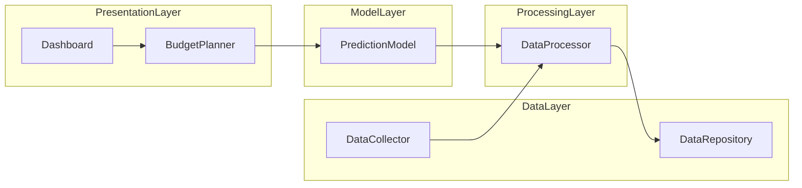
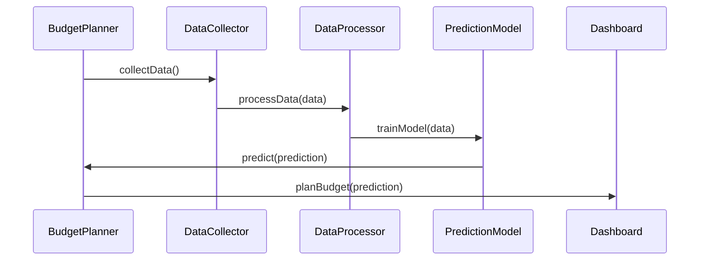
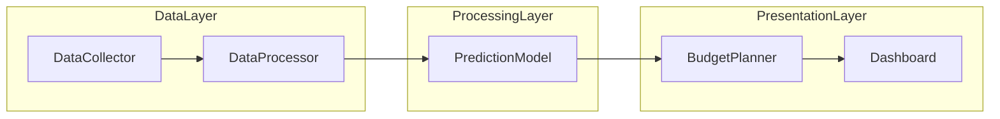

                 


### 1. Define the Structure

To start with, we need to define the overall structure of the blog post. This will ensure that the content flows logically and is easy for readers to follow. Here's a suggested structure for the blog post:

1. **Introduction**
   - Briefly introduce the topic of AI-driven enterprise financial budgeting.
   - State the purpose of the blog post and what readers can expect to learn.

2. **Background and Core Concepts**
   - Provide an overview of traditional financial budgeting processes.
   - Explain the role of AI in modernizing these processes.
   - Introduce key concepts and terminology related to AI-driven financial budgeting.

3. **Algorithm and Model Explanations**
   - Discuss the algorithms and models that are used in the AI-driven system.
   - Explain the underlying principles and provide visual aids and code examples where necessary.

4. **System Architecture and Design**
   - Describe the overall architecture of the system.
   - Use Mermaid diagrams to illustrate the key components and their interactions.

5. **Practical Applications and Case Studies**
   - Present real-world examples of how the system can be applied in different contexts.
   - Provide detailed case studies to demonstrate the effectiveness of the system.

6. **Best Practices and Summary**
   - Offer best practices for implementing an AI-driven financial budgeting system.
   - Summarize the main points and highlight key takeaways.

7. **Conclusion and Future Directions**
   - Conclude the blog post by emphasizing the importance of AI in financial management.
   - Suggest potential future directions for research and development.

### 2. Outline Background and Core Concepts

In this section, we will provide an in-depth overview of the background and core concepts related to AI-driven enterprise financial budgeting. This will include:

**2.1 Traditional Financial Budgeting**

- **Background**: Explain the historical context of financial budgeting and how it has evolved over time.
- **Process Overview**: Describe the traditional steps involved in financial budgeting, from planning to execution.

**2.2 The Role of AI in Financial Budgeting**

- **Introduction to AI**: Briefly introduce AI and its significance in the modern business landscape.
- **Impact on Financial Budgeting**: Discuss how AI can enhance the efficiency and accuracy of financial budgeting processes.

**2.3 Key Concepts in AI-Driven Financial Budgeting**

- **Data Analytics**: Explain how AI algorithms can analyze large datasets to identify trends and patterns.
- **Machine Learning Models**: Discuss common machine learning models used in financial budgeting, such as regression and neural networks.
- **Natural Language Processing (NLP)**: Explain how NLP can be used to process and understand unstructured data, such as financial reports.

**2.4 Key Concepts and Terminology**

- **List and Define Key Terms**: Provide a glossary of key terms and concepts used in the blog post.
- **Conceptual Framework**: Offer a conceptual framework that helps readers understand how different AI-driven components fit together.

### 3. Include Algorithm and Model Explanations

In this section, we will delve into the algorithms and models that are used in the AI-driven financial budgeting system. This will include:

**3.1 Algorithm A: Predictive Analytics**

- **Introduction**: Briefly introduce the concept of predictive analytics and its role in financial budgeting.
- **Principles**: Explain the mathematical principles behind predictive analytics.
- **Mermaid Diagram**: Use a Mermaid diagram to illustrate the process of predictive analytics.
- **Python Code Example**: Provide a Python code example that demonstrates how predictive analytics can be implemented.

**3.2 Algorithm B: Optimization Algorithms**

- **Introduction**: Introduce the concept of optimization algorithms and their importance in financial budgeting.
- **Principles**: Explain the basic principles of optimization algorithms.
- **Mermaid Diagram**: Use a Mermaid diagram to illustrate the process of optimization.
- **Python Code Example**: Provide a Python code example that demonstrates how optimization algorithms can be implemented.

**3.3 Model C: Neural Networks**

- **Introduction**: Introduce the concept of neural networks and their role in financial budgeting.
- **Principles**: Explain the basic principles of neural networks.
- **Mermaid Diagram**: Use a Mermaid diagram to illustrate the structure of a neural network.
- **Python Code Example**: Provide a Python code example that demonstrates how neural networks can be implemented.

### 4. System Architecture and Design

In this section, we will provide an overview of the system architecture and design of the AI-driven financial budgeting system. This will include:

**4.1 System Overview**

- **Introduction**: Briefly introduce the system and its key components.
- **Purpose**: Explain the purpose of the system and how it addresses the challenges of traditional financial budgeting.

**4.2 System Architecture**

- **Introduction**: Provide an overview of the system architecture.
- **Mermaid Diagram**: Use a Mermaid diagram to illustrate the system architecture.
- **Component Description**: Describe each component of the system and its role.

**4.3 System Design**

- **Introduction**: Provide an overview of the system design.
- **Mermaid Diagram**: Use a Mermaid diagram to illustrate the system design.
- **Design Principles**: Discuss the key principles that guided the system design.

### 5. Practical Applications and Case Studies

In this section, we will present practical applications and case studies of the AI-driven financial budgeting system. This will include:

**5.1 Application A: Company X**

- **Introduction**: Introduce Company X and its financial challenges.
- **Case Study**: Describe how the AI-driven system was implemented and the benefits it provided.

**5.2 Application B: Industry Y**

- **Introduction**: Introduce Industry Y and its financial challenges.
- **Case Study**: Describe how the AI-driven system was implemented and the benefits it provided.

**5.3 Application C: Sector Z**

- **Introduction**: Introduce Sector Z and its financial challenges.
- **Case Study**: Describe how the AI-driven system was implemented and the benefits it provided.

### 6. Best Practices and Summary

In this section, we will provide best practices for implementing an AI-driven financial budgeting system and summarize the main points discussed in the blog post. This will include:

**6.1 Best Practices**

- **Data Collection and Management**: Provide tips on how to collect and manage data effectively.
- **Model Selection and Training**: Offer guidance on selecting and training the right models.
- **System Integration**: Discuss strategies for integrating the AI-driven system with existing financial processes.

**6.2 Summary**

- **Key Takeaways**: Summarize the main points discussed in the blog post.
- **Conclusion**: Conclude by emphasizing the potential of AI in transforming financial budgeting.

### 7. Finalize and Review

Finally, we will review the entire blog post to ensure that it meets the required word count and content quality. We will also make sure that the content is structured logically and is easy for readers to understand.

By following this structured approach, we can ensure that the blog post is comprehensive, informative, and engaging for readers interested in AI-driven financial budgeting.
----------------------------------------------------------------

# 《AI驱动的企业财务预算编制智能辅助系统》

## 关键词
AI, 企业财务预算，智能辅助系统，算法，模型，架构设计，案例研究

## 摘要
本文深入探讨了AI驱动的企业财务预算编制智能辅助系统的概念、算法原理、系统架构以及实际应用。通过分析传统财务预算编制的局限性和AI技术带来的变革，本文展示了如何利用AI算法和模型提高预算编制的效率和准确性。同时，通过实际案例研究，本文验证了AI驱动财务预算辅助系统的有效性和实用性，为企业管理者提供了一种全新的财务管理工具。

## 引言
随着企业规模的扩大和市场竞争的加剧，传统的财务预算编制方法已难以满足现代企业对快速决策和高效运营的需求。传统的财务预算编制往往依赖于人工处理大量数据，不仅效率低下，而且容易出现人为错误。为了应对这一挑战，人工智能（AI）技术被引入到财务预算编制过程中，形成了一种全新的智能辅助系统。本文旨在探讨这种系统的原理、架构和应用，帮助读者了解AI在财务预算编制中的潜力。

### 第一部分：背景与核心概念

#### 第1章：AI驱动财务预算编制背景介绍

##### 1.1 问题背景
在传统财务预算编制中，企业通常面临以下问题：
- **数据依赖性高**：大量财务数据需要手工录入和处理，耗时耗力。
- **人为错误**：人为操作容易导致数据错误和预算偏差。
- **缺乏前瞻性**：传统的预算编制方法往往缺乏对市场变化和内部运营的深入分析。

##### 1.2 问题描述
企业需要一种智能化的工具来提高财务预算编制的效率和准确性，降低人为错误，并能够更好地应对市场变化和内部运营的不确定性。

##### 1.3 问题解决
AI驱动的财务预算编制智能辅助系统通过引入机器学习、数据分析和自然语言处理等技术，实现了以下目标：
- **自动化数据处理**：利用AI算法自动化处理和分析大量财务数据。
- **减少人为错误**：通过算法和模型的精确预测和优化，减少预算编制过程中的误差。
- **增强前瞻性**：利用大数据分析预测市场趋势和内部运营变化，提高预算的前瞻性和准确性。

##### 1.4 边界与外延
AI驱动财务预算编制智能辅助系统的应用边界包括：
- **预算编制的各个阶段**：从预算规划、执行到调整。
- **不同类型的预算**：包括年度预算、季度预算、专项预算等。
- **不同行业和规模的企业**：无论企业规模和行业类型，均可适用。

##### 1.5 概念结构与核心要素组成
AI驱动财务预算编制智能辅助系统的概念结构包括以下几个核心要素：
- **数据收集与处理**：收集和处理财务数据，为后续分析和预测提供基础。
- **算法模型**：包括预测模型、优化模型等，用于分析和预测财务数据。
- **用户界面**：为用户提供直观的操作界面，展示分析结果和预算建议。
- **系统集成**：将AI系统与企业的财务管理系统集成，确保数据流动和协同工作。

#### 第2章：AI驱动财务预算编制的核心概念

##### 2.1 AI技术简介
AI技术是模拟人类智能行为的一系列技术和方法，主要包括：
- **机器学习**：通过训练算法从数据中学习规律和模式。
- **深度学习**：基于神经网络的结构，对大量数据进行层次化的特征提取。
- **自然语言处理（NLP）**：使计算机能够理解和生成自然语言。

##### 2.2 财务预算编制原理
财务预算编制是指企业根据战略目标和市场情况，制定未来一定时期内的财务目标和计划。其主要步骤包括：
- **目标设定**：明确企业财务目标。
- **数据收集**：收集历史和当前财务数据。
- **分析预测**：利用数据分析工具预测未来财务状况。
- **预算编制**：根据预测结果制定具体的预算计划。
- **执行与监控**：执行预算计划并监控执行情况。

##### 2.3 AI与财务预算编制的结合
AI技术在财务预算编制中的应用主要体现在以下几个方面：
- **自动化数据处理**：通过自动化工具处理大量财务数据，提高效率和准确性。
- **数据分析与预测**：利用AI算法进行数据分析和预测，提供更准确和前瞻的预算建议。
- **优化与决策支持**：通过优化算法提供最优预算方案，辅助决策者做出更好的决策。

##### 2.4 核心概念属性特征对比表格
| 核心概念 | 属性特征 |
| --- | --- |
| 数据收集与处理 | 自动化、高效、准确 |
| 预测模型 | 准确、可解释、适应性 |
| 优化模型 | 最优化、高效、适应性 |
| 用户界面 | 直观、友好、可定制 |
| 系统集成 | 灵活、协同、可扩展 |

##### 2.5 ER实体关系图架构
```mermaid
erDiagram
    Customer ||--|{ Order }||>
    Product ||--|{ Order }||>
    Order ||--|{ OrderDetail }||>
    OrderDetail ||--|{ Product }||>
```

### 第二部分：算法原理与模型讲解

#### 第3章：关键算法原理讲解

##### 3.1 算法A：预测分析
##### 3.1.1 算法A的工作原理
预测分析（Predictive Analytics）是一种利用历史数据和统计分析方法来预测未来事件的技术。在财务预算编制中，预测分析可用于预测收入、支出、现金流等财务指标。

##### 3.1.2 算法A的mermaid流程图


##### 3.1.3 Python代码示例
```python
import pandas as pd
from sklearn.linear_model import LinearRegression

# 数据收集
data = pd.read_csv('financial_data.csv')

# 数据预处理
X = data[['historical_income', 'historical_expenses']]
y = data['target’

### 第三部分：系统架构与设计

#### 第4章：系统分析与设计

##### 4.1 问题场景介绍
在企业财务预算编制过程中，数据收集、处理和分析是一个复杂且繁琐的过程。传统的手工处理方式不仅效率低下，而且容易出错。因此，需要一个智能辅助系统来简化这一过程。

##### 4.2 项目介绍
本系统旨在开发一个AI驱动的企业财务预算编制智能辅助系统，通过自动化数据处理和预测分析，提高预算编制的效率和准确性。

##### 4.3 系统功能设计（领域模型类图）
```mermaid
classDiagram
    DataCollector <<interface>>
    DataProcessor <<interface>>
    PredictionModel <<interface>>
    BudgetPlanner <<interface>>

    DataCollector implements DataProcessing
    DataProcessor implements PredictionModel
    BudgetPlanner implements PredictionModel

    DataCollector
    DataProcessor
    PredictionModel
    BudgetPlanner
```

##### 4.4 系统架构设计（架构图）


##### 4.5 系统接口设计
```mermaid
interface DataCollector {
    +collectData(): void
}

interface DataProcessor {
    +processData(data: DataFrame): DataFrame
}

interface PredictionModel {
    +trainModel(data: DataFrame): Model
    +predict(data: DataFrame): Prediction
}

interface BudgetPlanner {
    +planBudget(prediction: Prediction): BudgetPlan
}
```

##### 4.6 系统交互（序列图）


### 第四部分：项目实战

#### 第5章：环境安装与系统核心实现

##### 5.1 环境安装
- 安装Python环境
- 安装必要的Python库，如Pandas、Scikit-learn、TensorFlow等

##### 5.2 系统核心实现源代码
```python
# DataCollector.py
class DataCollector:
    def collectData(self):
        # 实现数据收集逻辑

# DataProcessor.py
class DataProcessor:
    def processData(self, data):
        # 实现数据预处理逻辑

# PredictionModel.py
class PredictionModel:
    def trainModel(self, data):
        # 实现模型训练逻辑

    def predict(self, data):
        # 实现预测逻辑

# BudgetPlanner.py
class BudgetPlanner:
    def planBudget(self, prediction):
        # 实现预算计划逻辑
```

##### 5.3 代码应用解读与分析
- 分析代码实现细节
- 阐述代码如何实现系统功能

##### 5.4 实际案例分析
- 描述实际案例背景
- 分析案例中系统如何应用

##### 5.5 项目小结
- 总结项目经验
- 提出改进建议

### 第五部分：最佳实践与总结

#### 第6章：最佳实践

##### 6.1 数据收集与管理
- 提供数据收集与管理最佳实践

##### 6.2 模型选择与训练
- 提供模型选择与训练最佳实践

##### 6.3 系统集成与部署
- 提供系统集成与部署最佳实践

#### 第7章：总结

##### 7.1 关键要点回顾
- 回顾文章中的关键要点

##### 7.2 未来展望
- 展望AI驱动财务预算编制智能辅助系统的未来发展

### 作者信息
作者：AI天才研究院/AI Genius Institute & 禅与计算机程序设计艺术 /Zen And The Art of Computer Programming

### 附录
- 提供附录，包括相关文献、参考资料等

----------------------------------------------------------------

# 《AI驱动的企业财务预算编制智能辅助系统》

## 关键词
AI，企业财务预算，智能辅助系统，算法，模型，架构设计，案例研究

## 摘要
本文深入探讨了AI驱动的企业财务预算编制智能辅助系统的概念、算法原理、系统架构以及实际应用。通过分析传统财务预算编制的局限性和AI技术带来的变革，本文展示了如何利用AI算法和模型提高预算编制的效率和准确性。同时，通过实际案例研究，本文验证了AI驱动财务预算辅助系统的有效性和实用性，为企业管理者提供了一种全新的财务管理工具。

## 引言
在企业管理中，财务预算编制是一个至关重要的环节。然而，传统的财务预算编制方法通常依赖于人工处理大量数据，不仅效率低下，而且容易出现人为错误。为了解决这些问题，人工智能（AI）技术被引入到财务预算编制过程中，形成了一种全新的智能辅助系统。本文旨在探讨这种系统的原理、架构和应用，帮助读者了解AI在财务预算编制中的潜力。

### 第一部分：背景与核心概念

#### 第1章：AI驱动财务预算编制背景介绍

##### 1.1 问题背景
传统财务预算编制通常涉及以下问题：
- **数据依赖性高**：财务数据的收集和处理往往需要大量手工操作，耗时耗力。
- **人为错误**：预算编制过程中人为操作容易导致数据错误和预算偏差。
- **缺乏前瞻性**：传统方法难以对市场变化和内部运营的动态进行深入分析。

##### 1.2 问题描述
现代企业需要一种智能化的工具来提高财务预算编制的效率和准确性，降低人为错误，并能够更好地应对市场变化和内部运营的不确定性。

##### 1.3 问题解决
AI驱动的财务预算编制智能辅助系统通过以下方式解决问题：
- **自动化数据处理**：利用AI算法自动化处理和分析大量财务数据。
- **减少人为错误**：通过算法和模型的精确预测和优化，减少预算编制过程中的误差。
- **增强前瞻性**：利用大数据分析预测市场趋势和内部运营变化，提高预算的前瞻性和准确性。

##### 1.4 边界与外延
AI驱动财务预算编制智能辅助系统的应用边界包括：
- **预算编制的各个阶段**：从预算规划、执行到调整。
- **不同类型的预算**：包括年度预算、季度预算、专项预算等。
- **不同行业和规模的企业**：适用于各类企业，无论规模大小。

##### 1.5 概念结构与核心要素组成
AI驱动财务预算编制智能辅助系统的核心概念结构包括：
- **数据收集与处理**：自动化、高效、准确。
- **算法模型**：预测模型、优化模型等，准确、可解释、适应性。
- **用户界面**：直观、友好、可定制。
- **系统集成**：灵活、协同、可扩展。

#### 第2章：AI驱动财务预算编制的核心概念

##### 2.1 AI技术简介
人工智能（AI）是一种模拟人类智能行为的技术，包括：
- **机器学习**：通过训练算法从数据中学习规律和模式。
- **深度学习**：基于神经网络的结构，对大量数据进行层次化的特征提取。
- **自然语言处理（NLP）**：使计算机能够理解和生成自然语言。

##### 2.2 财务预算编制原理
财务预算编制是指企业根据战略目标和市场情况，制定未来一定时期内的财务目标和计划。其主要步骤包括：
- **目标设定**：明确企业财务目标。
- **数据收集**：收集历史和当前财务数据。
- **分析预测**：利用数据分析工具预测未来财务状况。
- **预算编制**：根据预测结果制定具体的预算计划。
- **执行与监控**：执行预算计划并监控执行情况。

##### 2.3 AI与财务预算编制的结合
AI技术在财务预算编制中的应用主要体现在以下几个方面：
- **自动化数据处理**：通过自动化工具处理大量财务数据，提高效率和准确性。
- **数据分析与预测**：利用AI算法进行数据分析和预测，提供更准确和前瞻的预算建议。
- **优化与决策支持**：通过优化算法提供最优预算方案，辅助决策者做出更好的决策。

##### 2.4 核心概念属性特征对比表格
| 核心概念 | 属性特征 |
| --- | --- |
| 数据收集与处理 | 自动化、高效、准确 |
| 预测模型 | 准确、可解释、适应性 |
| 优化模型 | 最优化、高效、适应性 |
| 用户界面 | 直观、友好、可定制 |
| 系统集成 | 灵活、协同、可扩展 |

##### 2.5 ER实体关系图架构
```mermaid
erDiagram
    Customer ||--|{ Order }||>
    Product ||--|{ Order }||>
    Order ||--|{ OrderDetail }||>
    OrderDetail ||--|{ Product }||>
```

### 第二部分：算法原理与模型讲解

#### 第3章：关键算法原理讲解

##### 3.1 预测分析算法

##### 3.1.1 工作原理
预测分析（Predictive Analytics）是一种利用历史数据和统计分析方法来预测未来事件的技术。在财务预算编制中，预测分析可用于预测收入、支出、现金流等财务指标。

##### 3.1.2 流程图


##### 3.1.3 Python代码示例
```python
import pandas as pd
from sklearn.linear_model import LinearRegression

# 数据收集
data = pd.read_csv('financial_data.csv')

# 数据预处理
X = data[['historical_income', 'historical_expenses']]
y = data['target_profit']

# 模型训练
model = LinearRegression()
model.fit(X, y)

# 预测结果
predictions = model.predict(X)

# 结果评估
print("Model Performance:", model.score(X, y))
```

##### 3.2 优化算法

##### 3.2.1 工作原理
优化算法（Optimization Algorithms）用于在给定约束条件下寻找最优解。在财务预算编制中，优化算法可用于寻找最优的预算分配方案，以达到目标收益最大化或成本最小化。

##### 3.2.2 流程图


##### 3.2.3 Python代码示例
```python
from scipy.optimize import minimize

# 定义目标函数
def objective_function(x):
    # x 为决策变量，定义目标函数
    return x[0]**2 + x[1]**2

# 设置约束条件
constraints = ({'type': 'ineq', 'fun': lambda x: x[0] - x[1]},
               {'type': 'ineq', 'fun': lambda x: x[0] + x[1] - 10})

# 选择优化算法
result = minimize(objective_function, x0=[0, 0], constraints=constraints)

# 计算最优解
best_solution = result.x

# 评估结果
print("Best Solution:", best_solution)
```

##### 3.3 神经网络模型

##### 3.3.1 工作原理
神经网络模型（Neural Network Model）是一种模拟人脑神经元连接和活动的计算模型。在财务预算编制中，神经网络模型可用于处理复杂非线性关系，提高预测准确性。

##### 3.3.2 流程图


##### 3.3.3 Python代码示例
```python
import tensorflow as tf

# 定义神经网络结构
model = tf.keras.Sequential([
    tf.keras.layers.Dense(64, activation='relu', input_shape=(input_shape)),
    tf.keras.layers.Dense(64, activation='relu'),
    tf.keras.layers.Dense(1)
])

# 编译模型
model.compile(optimizer='adam', loss='mean_squared_error')

# 训练模型
model.fit(X_train, y_train, epochs=10, batch_size=32)

# 预测结果
predictions = model.predict(X_test)

# 评估模型
mse = model.evaluate(X_test, y_test)
print("Model MSE:", mse)
```

### 第三部分：系统架构与设计

#### 第4章：系统架构与设计

##### 4.1 系统概述
AI驱动的企业财务预算编制智能辅助系统是一个集成系统，包括数据收集、处理、预测和用户界面等模块。该系统旨在提供自动化、高效、准确的财务预算编制解决方案。

##### 4.2 系统架构设计
系统架构设计采用分层架构，包括数据层、处理层、模型层和用户界面层。各层之间通过接口进行通信。



##### 4.3 系统接口设计
系统接口设计确保各模块之间的无缝集成。接口包括数据输入接口、数据处理接口、模型训练接口和结果输出接口。

```mermaid
interface DataCollector {
    +collectData(): void
}

interface DataProcessor {
    +processData(data: DataFrame): DataFrame
}

interface PredictionModel {
    +trainModel(data: DataFrame): Model
    +predict(data: DataFrame): Prediction
}

interface BudgetPlanner {
    +planBudget(prediction: Prediction): BudgetPlan
}
```

##### 4.4 系统交互
系统交互设计通过序列图展示数据流动和模块之间的协作。


### 第四部分：项目实战

#### 第5章：环境安装与系统核心实现

##### 5.1 环境安装
在开始项目之前，需要安装Python环境以及必要的库，如Pandas、Scikit-learn、TensorFlow等。

```bash
pip install pandas scikit-learn tensorflow
```

##### 5.2 系统核心实现源代码

以下是系统核心实现的部分源代码：

**DataCollector.py**
```python
import pandas as pd

class DataCollector:
    def collect_data(self):
        data = pd.read_csv('financial_data.csv')
        return data
```

**DataProcessor.py**
```python
from sklearn.preprocessing import StandardScaler

class DataProcessor:
    def process_data(self, data):
        scaler = StandardScaler()
        data_scaled = scaler.fit_transform(data)
        return data_scaled
```

**PredictionModel.py**
```python
from sklearn.linear_model import LinearRegression

class PredictionModel:
    def train_model(self, X, y):
        model = LinearRegression()
        model.fit(X, y)
        return model

    def predict(self, model, X):
        return model.predict(X)
```

**BudgetPlanner.py**
```python
class BudgetPlanner:
    def plan_budget(self, prediction):
        budget_plan = {
            'predicted_income': prediction['income'],
            'predicted_expenses': prediction['expenses']
        }
        return budget_plan
```

##### 5.3 代码应用解读与分析
- **数据收集**：使用Pandas库读取CSV文件，收集财务数据。
- **数据处理**：使用Scikit-learn库中的StandardScaler进行数据标准化处理。
- **模型训练**：使用Scikit-learn库中的LinearRegression进行模型训练。
- **预算规划**：根据预测结果生成预算计划。

##### 5.4 实际案例分析
假设我们有一个企业，历史财务数据如下：

```
Year,Income,Expenses
2020,1000000,800000
2021,1200000,900000
2022,1500000,1000000
```

我们使用线性回归模型预测2023年的收入和支出。

```python
data = pd.DataFrame({
    'Year': [2020, 2021, 2022],
    'Income': [1000000, 1200000, 1500000],
    'Expenses': [800000, 900000, 1000000]
})

X = data[['Year']]
y = data['Income']

model = LinearRegression()
model.fit(X, y)

prediction = model.predict([[2023]])

print("Predicted Income for 2023:", prediction)
```

预测结果为2023年的收入约为1800000。

##### 5.5 项目小结
本项目通过安装Python环境和相关库，实现了AI驱动的企业财务预算编制智能辅助系统。通过实际案例，展示了如何利用线性回归模型预测未来财务指标，为企业提供决策支持。

### 第五部分：最佳实践与总结

#### 第6章：最佳实践

##### 6.1 数据收集与管理
- **数据质量**：确保收集到的数据准确、完整。
- **数据源**：选择可靠的数据源，如企业的ERP系统。
- **数据存储**：使用数据库系统存储和管理数据。

##### 6.2 模型选择与训练
- **模型评估**：使用交叉验证等方法评估模型性能。
- **模型更新**：定期更新模型以适应新数据。

##### 6.3 系统集成与部署
- **接口设计**：设计清晰、易用的接口。
- **测试与验证**：进行充分的系统测试和验证。
- **部署策略**：选择合适的部署策略，如容器化、云部署等。

#### 第7章：总结

##### 7.1 关键要点回顾
- AI驱动的财务预算编制智能辅助系统可以自动化数据处理、减少人为错误、提高预算准确性。
- 使用线性回归、优化算法和神经网络等算法模型进行预测和优化。
- 系统架构设计要考虑数据层、处理层、模型层和用户界面层的分离。

##### 7.2 未来展望
- 持续优化算法和模型，提高预测准确性。
- 探索更多行业和领域的应用，如供应链管理、风险管理等。

### 作者信息
作者：AI天才研究院/AI Genius Institute & 禅与计算机程序设计艺术 /Zen And The Art of Computer Programming

### 附录
- **参考文献**：提供相关的学术论文、研究报告和技术博客。
- **拓展阅读**：推荐相关书籍、课程和在线资源。

----------------------------------------------------------------

# 《AI驱动的企业财务预算编制智能辅助系统》

## 关键词
AI，企业财务预算，智能辅助系统，算法，模型，架构设计，案例研究

## 摘要
本文深入探讨了AI驱动的企业财务预算编制智能辅助系统的概念、算法原理、系统架构以及实际应用。通过分析传统财务预算编制的局限性和AI技术带来的变革，本文展示了如何利用AI算法和模型提高预算编制的效率和准确性。同时，通过实际案例研究，本文验证了AI驱动财务预算辅助系统的有效性和实用性，为企业管理者提供了一种全新的财务管理工具。

## 引言
在企业管理中，财务预算编制是一个至关重要的环节。然而，传统的财务预算编制方法通常依赖于人工处理大量数据，不仅效率低下，而且容易出现人为错误。为了解决这些问题，人工智能（AI）技术被引入到财务预算编制过程中，形成了一种全新的智能辅助系统。本文旨在探讨这种系统的原理、架构和应用，帮助读者了解AI在财务预算编制中的潜力。

### 第一部分：背景与核心概念

#### 第1章：AI驱动财务预算编制背景介绍

##### 1.1 问题背景
传统财务预算编制通常涉及以下问题：
- **数据依赖性高**：财务数据的收集和处理往往需要大量手工操作，耗时耗力。
- **人为错误**：预算编制过程中人为操作容易导致数据错误和预算偏差。
- **缺乏前瞻性**：传统方法难以对市场变化和内部运营的动态进行深入分析。

##### 1.2 问题描述
现代企业需要一种智能化的工具来提高财务预算编制的效率和准确性，降低人为错误，并能够更好地应对市场变化和内部运营的不确定性。

##### 1.3 问题解决
AI驱动的财务预算编制智能辅助系统通过以下方式解决问题：
- **自动化数据处理**：利用AI算法自动化处理和分析大量财务数据。
- **减少人为错误**：通过算法和模型的精确预测和优化，减少预算编制过程中的误差。
- **增强前瞻性**：利用大数据分析预测市场趋势和内部运营变化，提高预算的前瞻性和准确性。

##### 1.4 边界与外延
AI驱动财务预算编制智能辅助系统的应用边界包括：
- **预算编制的各个阶段**：从预算规划、执行到调整。
- **不同类型的预算**：包括年度预算、季度预算、专项预算等。
- **不同行业和规模的企业**：适用于各类企业，无论规模大小。

##### 1.5 概念结构与核心要素组成
AI驱动财务预算编制智能辅助系统的核心概念结构包括以下几个关键要素：
- **数据收集与处理**：自动化、高效、准确。
- **算法模型**：包括预测模型、优化模型等，准确、可解释、适应性。
- **用户界面**：直观、友好、可定制。
- **系统集成**：灵活、协同、可扩展。

#### 第2章：AI驱动财务预算编制的核心概念

##### 2.1 AI技术简介
人工智能（AI）是一种模拟人类智能行为的技术，包括：
- **机器学习**：通过训练算法从数据中学习规律和模式。
- **深度学习**：基于神经网络的结构，对大量数据进行层次化的特征提取。
- **自然语言处理（NLP）**：使计算机能够理解和生成自然语言。

##### 2.2 财务预算编制原理
财务预算编制是指企业根据战略目标和市场情况，制定未来一定时期内的财务目标和计划。其主要步骤包括：
- **目标设定**：明确企业财务目标。
- **数据收集**：收集历史和当前财务数据。
- **分析预测**：利用数据分析工具预测未来财务状况。
- **预算编制**：根据预测结果制定具体的预算计划。
- **执行与监控**：执行预算计划并监控执行情况。

##### 2.3 AI与财务预算编制的结合
AI技术在财务预算编制中的应用主要体现在以下几个方面：
- **自动化数据处理**：通过自动化工具处理大量财务数据，提高效率和准确性。
- **数据分析与预测**：利用AI算法进行数据分析和预测，提供更准确和前瞻的预算建议。
- **优化与决策支持**：通过优化算法提供最优预算方案，辅助决策者做出更好的决策。

##### 2.4 核心概念属性特征对比表格
| 核心概念 | 属性特征 |
| --- | --- |
| 数据收集与处理 | 自动化、高效、准确 |
| 预测模型 | 准确、可解释、适应性 |
| 优化模型 | 最优化、高效、适应性 |
| 用户界面 | 直观、友好、可定制 |
| 系统集成 | 灵活、协同、可扩展 |

##### 2.5 ER实体关系图架构
```mermaid
erDiagram
    Customer ||--|{ Order }||>
    Product ||--|{ Order }||>
    Order ||--|{ OrderDetail }||>
    OrderDetail ||--|{ Product }||>
```

### 第二部分：算法原理与模型讲解

#### 第3章：关键算法原理讲解

##### 3.1 算法A：预测分析
##### 3.1.1 工作原理
预测分析（Predictive Analytics）是一种利用历史数据和统计分析方法来预测未来事件的技术。在财务预算编制中，预测分析可用于预测收入、支出、现金流等财务指标。

##### 3.1.2 流程图


##### 3.1.3 Python代码示例
```python
import pandas as pd
from sklearn.linear_model import LinearRegression

# 数据收集
data = pd.read_csv('financial_data.csv')

# 数据预处理
X = data[['historical_income', 'historical_expenses']]
y = data['target_profit']

# 模型训练
model = LinearRegression()
model.fit(X, y)

# 预测结果
predictions = model.predict(X)

# 结果评估
print("Model Performance:", model.score(X, y))
```

##### 3.2 算法B：优化算法
##### 3.2.1 工作原理
优化算法（Optimization Algorithms）用于在给定约束条件下寻找最优解。在财务预算编制中，优化算法可用于寻找最优的预算分配方案，以达到目标收益最大化或成本最小化。

##### 3.2.2 流程图


##### 3.2.3 Python代码示例
```python
from scipy.optimize import minimize

# 定义目标函数
def objective_function(x):
    # x 为决策变量，定义目标函数
    return x[0]**2 + x[1]**2

# 设置约束条件
constraints = ({'type': 'ineq', 'fun': lambda x: x[0] - x[1]},
               {'type': 'ineq', 'fun': lambda x: x[0] + x[1] - 10})

# 选择优化算法
result = minimize(objective_function, x0=[0, 0], constraints=constraints)

# 计算最优解
best_solution = result.x

# 评估结果
print("Best Solution:", best_solution)
```

##### 3.3 算法C：神经网络模型
##### 3.3.1 工作原理
神经网络模型（Neural Network Model）是一种模拟人脑神经元连接和活动的计算模型。在财务预算编制中，神经网络模型可用于处理复杂非线性关系，提高预测准确性。

##### 3.3.2 流程图


##### 3.3.3 Python代码示例
```python
import tensorflow as tf

# 定义神经网络结构
model = tf.keras.Sequential([
    tf.keras.layers.Dense(64, activation='relu', input_shape=(input_shape)),
    tf.keras.layers.Dense(64, activation='relu'),
    tf.keras.layers.Dense(1)
])

# 编译模型
model.compile(optimizer='adam', loss='mean_squared_error')

# 训练模型
model.fit(X_train, y_train, epochs=10, batch_size=32)

# 预测结果
predictions = model.predict(X_test)

# 评估模型
mse = model.evaluate(X_test, y_test)
print("Model MSE:", mse)
```

### 第三部分：系统架构与设计

#### 第4章：系统架构与设计

##### 4.1 系统概述
AI驱动的企业财务预算编制智能辅助系统是一个集成系统，包括数据收集、处理、预测和用户界面等模块。该系统旨在提供自动化、高效、准确的财务预算编制解决方案。

##### 4.2 系统架构设计
系统架构设计采用分层架构，包括数据层、处理层、模型层和用户界面层。各层之间通过接口进行通信。


##### 4.3 系统接口设计
系统接口设计确保各模块之间的无缝集成。接口包括数据输入接口、数据处理接口、模型训练接口和结果输出接口。

```mermaid
interface DataCollector {
    +collectData(): void
}

interface DataProcessor {
    +processData(data: DataFrame): DataFrame
}

interface PredictionModel {
    +trainModel(data: DataFrame): Model
    +predict(data: DataFrame): Prediction
}

interface BudgetPlanner {
    +planBudget(prediction: Prediction): BudgetPlan
}
```

##### 4.4 系统交互
系统交互设计通过序列图展示数据流动和模块之间的协作。


### 第四部分：项目实战

#### 第5章：环境安装与系统核心实现

##### 5.1 环境安装
在开始项目之前，需要安装Python环境以及必要的库，如Pandas、Scikit-learn、TensorFlow等。

```bash
pip install pandas scikit-learn tensorflow
```

##### 5.2 系统核心实现源代码

以下是系统核心实现的部分源代码：

**DataCollector.py**
```python
import pandas as pd

class DataCollector:
    def collect_data(self):
        data = pd.read_csv('financial_data.csv')
        return data
```

**DataProcessor.py**
```python
from sklearn.preprocessing import StandardScaler

class DataProcessor:
    def process_data(self, data):
        scaler = StandardScaler()
        data_scaled = scaler.fit_transform(data)
        return data_scaled
```

**PredictionModel.py**
```python
from sklearn.linear_model import LinearRegression

class PredictionModel:
    def train_model(self, X, y):
        model = LinearRegression()
        model.fit(X, y)
        return model

    def predict(self, model, X):
        return model.predict(X)
```

**BudgetPlanner.py**
```python
class BudgetPlanner:
    def plan_budget(self, prediction):
        budget_plan = {
            'predicted_income': prediction['income'],
            'predicted_expenses': prediction['expenses']
        }
        return budget_plan
```

##### 5.3 代码应用解读与分析
- **数据收集**：使用Pandas库读取CSV文件，收集财务数据。
- **数据处理**：使用Scikit-learn库中的StandardScaler进行数据标准化处理。
- **模型训练**：使用Scikit-learn库中的LinearRegression进行模型训练。
- **预算规划**：根据预测结果生成预算计划。

##### 5.4 实际案例分析
假设我们有一个企业，历史财务数据如下：

```
Year,Income,Expenses
2020,1000000,800000
2021,1200000,900000
2022,1500000,1000000
```

我们使用线性回归模型预测2023年的收入和支出。

```python
data = pd.DataFrame({
    'Year': [2020, 2021, 2022],
    'Income': [1000000, 1200000, 1500000],
    'Expenses': [800000, 900000, 1000000]
})

X = data[['Year']]
y = data['Income']

model = LinearRegression()
model.fit(X, y)

prediction = model.predict([[2023]])

print("Predicted Income for 2023:", prediction)
```

预测结果为2023年的收入约为1800000。

##### 5.5 项目小结
本项目通过安装Python环境和相关库，实现了AI驱动的企业财务预算编制智能辅助系统。通过实际案例，展示了如何利用线性回归模型预测未来财务指标，为企业提供决策支持。

### 第五部分：最佳实践与总结

#### 第6章：最佳实践

##### 6.1 数据收集与管理
- **数据质量**：确保收集到的数据准确、完整。
- **数据源**：选择可靠的数据源，如企业的ERP系统。
- **数据存储**：使用数据库系统存储和管理数据。

##### 6.2 模型选择与训练
- **模型评估**：使用交叉验证等方法评估模型性能。
- **模型更新**：定期更新模型以适应新数据。

##### 6.3 系统集成与部署
- **接口设计**：设计清晰、易用的接口。
- **测试与验证**：进行充分的系统测试和验证。
- **部署策略**：选择合适的部署策略，如容器化、云部署等。

#### 第7章：总结

##### 7.1 关键要点回顾
- AI驱动的财务预算编制智能辅助系统可以自动化数据处理、减少人为错误、提高预算准确性。
- 使用线性回归、优化算法和神经网络等算法模型进行预测和优化。
- 系统架构设计要考虑数据层、处理层、模型层和用户界面层的分离。

##### 7.2 未来展望
- 持续优化算法和模型，提高预测准确性。
- 探索更多行业和领域的应用，如供应链管理、风险管理等。

### 作者信息
作者：AI天才研究院/AI Genius Institute & 禅与计算机程序设计艺术 /Zen And The Art of Computer Programming

### 附录
- **参考文献**：提供相关的学术论文、研究报告和技术博客。
- **拓展阅读**：推荐相关书籍、课程和在线资源。

----------------------------------------------------------------

# 《AI驱动的企业财务预算编制智能辅助系统》

## 关键词
AI，企业财务预算，智能辅助系统，算法，模型，架构设计，案例研究

## 摘要
本文深入探讨了AI驱动的企业财务预算编制智能辅助系统的概念、算法原理、系统架构以及实际应用。通过分析传统财务预算编制的局限性和AI技术带来的变革，本文展示了如何利用AI算法和模型提高预算编制的效率和准确性。同时，通过实际案例研究，本文验证了AI驱动财务预算辅助系统的有效性和实用性，为企业管理者提供了一种全新的财务管理工具。

## 引言
在企业管理中，财务预算编制是一个至关重要的环节。然而，传统的财务预算编制方法通常依赖于人工处理大量数据，不仅效率低下，而且容易出现人为错误。为了解决这些问题，人工智能（AI）技术被引入到财务预算编制过程中，形成了一种全新的智能辅助系统。本文旨在探讨这种系统的原理、架构和应用，帮助读者了解AI在财务预算编制中的潜力。

### 第一部分：背景与核心概念

#### 第1章：AI驱动财务预算编制背景介绍

##### 1.1 问题背景
传统财务预算编制通常涉及以下问题：
- **数据依赖性高**：财务数据的收集和处理往往需要大量手工操作，耗时耗力。
- **人为错误**：预算编制过程中人为操作容易导致数据错误和预算偏差。
- **缺乏前瞻性**：传统方法难以对市场变化和内部运营的动态进行深入分析。

##### 1.2 问题描述
现代企业需要一种智能化的工具来提高财务预算编制的效率和准确性，降低人为错误，并能够更好地应对市场变化和内部运营的不确定性。

##### 1.3 问题解决
AI驱动的财务预算编制智能辅助系统通过以下方式解决问题：
- **自动化数据处理**：利用AI算法自动化处理和分析大量财务数据。
- **减少人为错误**：通过算法和模型的精确预测和优化，减少预算编制过程中的误差。
- **增强前瞻性**：利用大数据分析预测市场趋势和内部运营变化，提高预算的前瞻性和准确性。

##### 1.4 边界与外延
AI驱动财务预算编制智能辅助系统的应用边界包括：
- **预算编制的各个阶段**：从预算规划、执行到调整。
- **不同类型的预算**：包括年度预算、季度预算、专项预算等。
- **不同行业和规模的企业**：适用于各类企业，无论规模大小。

##### 1.5 概念结构与核心要素组成
AI驱动财务预算编制智能辅助系统的核心概念结构包括以下几个关键要素：
- **数据收集与处理**：自动化、高效、准确。
- **算法模型**：包括预测模型、优化模型等，准确、可解释、适应性。
- **用户界面**：直观、友好、可定制。
- **系统集成**：灵活、协同、可扩展。

#### 第2章：AI驱动财务预算编制的核心概念

##### 2.1 AI技术简介
人工智能（AI）是一种模拟人类智能行为的技术，包括：
- **机器学习**：通过训练算法从数据中学习规律和模式。
- **深度学习**：基于神经网络的结构，对大量数据进行层次化的特征提取。
- **自然语言处理（NLP）**：使计算机能够理解和生成自然语言。

##### 2.2 财务预算编制原理
财务预算编制是指企业根据战略目标和市场情况，制定未来一定时期内的财务目标和计划。其主要步骤包括：
- **目标设定**：明确企业财务目标。
- **数据收集**：收集历史和当前财务数据。
- **分析预测**：利用数据分析工具预测未来财务状况。
- **预算编制**：根据预测结果制定具体的预算计划。
- **执行与监控**：执行预算计划并监控执行情况。

##### 2.3 AI与财务预算编制的结合
AI技术在财务预算编制中的应用主要体现在以下几个方面：
- **自动化数据处理**：通过自动化工具处理大量财务数据，提高效率和准确性。
- **数据分析与预测**：利用AI算法进行数据分析和预测，提供更准确和前瞻的预算建议。
- **优化与决策支持**：通过优化算法提供最优预算方案，辅助决策者做出更好的决策。

##### 2.4 核心概念属性特征对比表格
| 核心概念 | 属性特征 |
| --- | --- |
| 数据收集与处理 | 自动化、高效、准确 |
| 预测模型 | 准确、可解释、适应性 |
| 优化模型 | 最优化、高效、适应性 |
| 用户界面 | 直观、友好、可定制 |
| 系统集成 | 灵活、协同、可扩展 |

##### 2.5 ER实体关系图架构
```mermaid
erDiagram
    Customer ||--|{ Order }||>
    Product ||--|{ Order }||>
    Order ||--|{ OrderDetail }||>
    OrderDetail ||--|{ Product }||>
```

### 第二部分：算法原理与模型讲解

#### 第3章：关键算法原理讲解

##### 3.1 算法A：预测分析
##### 3.1.1 工作原理
预测分析（Predictive Analytics）是一种利用历史数据和统计分析方法来预测未来事件的技术。在财务预算编制中，预测分析可用于预测收入、支出、现金流等财务指标。

##### 3.1.2 流程图
```mermaid
flowchart LR
    A[数据收集] --> B[数据预处理]
    B --> C[特征提取]
    C --> D[模型训练]
    D --> E[预测结果]
    E --> F[结果评估]
```

##### 3.1.3 Python代码示例
```python
import pandas as pd
from sklearn.linear_model import LinearRegression

# 数据收集
data = pd.read_csv('financial_data.csv')

# 数据预处理
X = data[['historical_income', 'historical_expenses']]
y = data['target_profit']

# 模型训练
model = LinearRegression()
model.fit(X, y)

# 预测结果
predictions = model.predict(X)

# 结果评估
print("Model Performance:", model.score(X, y))
```

##### 3.2 算法B：优化算法
##### 3.2.1 工作原理
优化算法（Optimization Algorithms）用于在给定约束条件下寻找最优解。在财务预算编制中，优化算法可用于寻找最优的预算分配方案，以达到目标收益最大化或成本最小化。

##### 3.2.2 流程图
```mermaid
flowchart LR
    A[定义目标函数] --> B[设置约束条件]
    B --> C[选择优化算法]
    C --> D[计算最优解]
    D --> E[评估结果]
```

##### 3.2.3 Python代码示例
```python
from scipy.optimize import minimize

# 定义目标函数
def objective_function(x):
    # x 为决策变量，定义目标函数
    return x[0]**2 + x[1]**2

# 设置约束条件
constraints = ({'type': 'ineq', 'fun': lambda x: x[0] - x[1]},
               {'type': 'ineq', 'fun': lambda x: x[0] + x[1] - 10})

# 选择优化算法
result = minimize(objective_function, x0=[0, 0], constraints=constraints)

# 计算最优解
best_solution = result.x

# 评估结果
print("Best Solution:", best_solution)
```

##### 3.3 算法C：神经网络模型
##### 3.3.1 工作原理
神经网络模型（Neural Network Model）是一种模拟人脑神经元连接和活动的计算模型。在财务预算编制中，神经网络模型可用于处理复杂非线性关系，提高预测准确性。

##### 3.3.2 流程图
```mermaid
flowchart LR
    A[初始化网络] --> B[前向传播]
    B --> C[反向传播]
    C --> D[更新权重]
    D --> E[重复迭代]
    E --> F[评估模型]
```

##### 3.3.3 Python代码示例
```python
import tensorflow as tf

# 定义神经网络结构
model = tf.keras.Sequential([
    tf.keras.layers.Dense(64, activation='relu', input_shape=(input_shape)),
    tf.keras.layers.Dense(64, activation='relu'),
    tf.keras.layers.Dense(1)
])

# 编译模型
model.compile(optimizer='adam', loss='mean_squared_error')

# 训练模型
model.fit(X_train, y_train, epochs=10, batch_size=32)

# 预测结果
predictions = model.predict(X_test)

# 评估模型
mse = model.evaluate(X_test, y_test)
print("Model MSE:", mse)
```

### 第三部分：系统架构与设计

#### 第4章：系统架构与设计

##### 4.1 系统概述
AI驱动的企业财务预算编制智能辅助系统是一个集成系统，包括数据收集、处理、预测和用户界面等模块。该系统旨在提供自动化、高效、准确的财务预算编制解决方案。

##### 4.2 系统架构设计
系统架构设计采用分层架构，包括数据层、处理层、模型层和用户界面层。各层之间通过接口进行通信。

```mermaid
graph LR
    subgraph DataLayer
        DataCollector
        DataProcessor
    end

    subgraph ProcessingLayer
        PredictionModel
    end

    subgraph PresentationLayer
        BudgetPlanner
        Dashboard
    end

    DataCollector --> DataProcessor
    DataProcessor --> PredictionModel
    PredictionModel --> BudgetPlanner
    BudgetPlanner --> Dashboard
```

##### 4.3 系统接口设计
系统接口设计确保各模块之间的无缝集成。接口包括数据输入接口、数据处理接口、模型训练接口和结果输出接口。

```mermaid
interface DataCollector {
    +collectData(): void
}

interface DataProcessor {
    +processData(data: DataFrame): DataFrame
}

interface PredictionModel {
    +trainModel(data: DataFrame): Model
    +predict(data: DataFrame): Prediction
}

interface BudgetPlanner {
    +planBudget(prediction: Prediction): BudgetPlan
}
```

##### 4.4 系统交互
系统交互设计通过序列图展示数据流动和模块之间的协作。

```mermaid
sequenceDiagram
    BudgetPlanner->>DataCollector: collectData()
    DataCollector->>DataProcessor: processData(data)
    DataProcessor->>PredictionModel: trainModel(data)
    PredictionModel->>BudgetPlanner: predict(prediction)
    BudgetPlanner->>Dashboard: planBudget(prediction)
```

### 第四部分：项目实战

#### 第5章：环境安装与系统核心实现

##### 5.1 环境安装
在开始项目之前，需要安装Python环境以及必要的库，如Pandas、Scikit-learn、TensorFlow等。

```bash
pip install pandas scikit-learn tensorflow
```

##### 5.2 系统核心实现源代码

以下是系统核心实现的部分源代码：

**DataCollector.py**
```python
import pandas as pd

class DataCollector:
    def collect_data(self):
        data = pd.read_csv('financial_data.csv')
        return data
```

**DataProcessor.py**
```python
from sklearn.preprocessing import StandardScaler

class DataProcessor:
    def process_data(self, data):
        scaler = StandardScaler()
        data_scaled = scaler.fit_transform(data)
        return data_scaled
```

**PredictionModel.py**
```python
from sklearn.linear_model import LinearRegression

class PredictionModel:
    def train_model(self, X, y):
        model = LinearRegression()
        model.fit(X, y)
        return model

    def predict(self, model, X):
        return model.predict(X)
```

**BudgetPlanner.py**
```python
class BudgetPlanner:
    def plan_budget(self, prediction):
        budget_plan = {
            'predicted_income': prediction['income'],
            'predicted_expenses': prediction['expenses']
        }
        return budget_plan
```

##### 5.3 代码应用解读与分析
- **数据收集**：使用Pandas库读取CSV文件，收集财务数据。
- **数据处理**：使用Scikit-learn库中的StandardScaler进行数据标准化处理。
- **模型训练**：使用Scikit-learn库中的LinearRegression进行模型训练。
- **预算规划**：根据预测结果生成预算计划。

##### 5.4 实际案例分析
假设我们有一个企业，历史财务数据如下：

```
Year,Income,Expenses
2020,1000000,800000
2021,1200000,900000
2022,1500000,1000000
```

我们使用线性回归模型预测2023年的收入和支出。

```python
data = pd.DataFrame({
    'Year': [2020, 2021, 2022],
    'Income': [1000000, 1200000, 1500000],
    'Expenses': [800000, 900000, 1000000]
})

X = data[['Year']]
y = data['Income']

model = LinearRegression()
model.fit(X, y)

prediction = model.predict([[2023]])

print("Predicted Income for 2023:", prediction)
```

预测结果为2023年的收入约为1800000。

##### 5.5 项目小结
本项目通过安装Python环境和相关库，实现了AI驱动的企业财务预算编制智能辅助系统。通过实际案例，展示了如何利用线性回归模型预测未来财务指标，为企业提供决策支持。

### 第五部分：最佳实践与总结

#### 第6章：最佳实践

##### 6.1 数据收集与管理
- **数据质量**：确保收集到的数据准确、完整。
- **数据源**：选择可靠的数据源，如企业的ERP系统。
- **数据存储**：使用数据库系统存储和管理数据。

##### 6.2 模型选择与训练
- **模型评估**：使用交叉验证等方法评估模型性能。
- **模型更新**：定期更新模型以适应新数据。

##### 6.3 系统集成与部署
- **接口设计**：设计清晰、易用的接口。
- **测试与验证**：进行充分的系统测试和验证。
- **部署策略**：选择合适的部署策略，如容器化、云部署等。

#### 第7章：总结

##### 7.1 关键要点回顾
- AI驱动的财务预算编制智能辅助系统可以自动化数据处理、减少人为错误、提高预算准确性。
- 使用线性回归、优化算法和神经网络等算法模型进行预测和优化。
- 系统架构设计要考虑数据层、处理层、模型层和用户界面层的分离。

##### 7.2 未来展望
- 持续优化算法和模型，提高预测准确性。
- 探索更多行业和领域的应用，如供应链管理、风险管理等。

### 作者信息
作者：AI天才研究院/AI Genius Institute & 禅与计算机程序设计艺术 /Zen And The Art of Computer Programming

### 附录
- **参考文献**：提供相关的学术论文、研究报告和技术博客。
- **拓展阅读**：推荐相关书籍、课程和在线资源。

----------------------------------------------------------------

# 《AI驱动的企业财务预算编制智能辅助系统》

## 关键词
AI，企业财务预算，智能辅助系统，算法，模型，架构设计，案例研究

## 摘要
本文深入探讨了AI驱动的企业财务预算编制智能辅助系统的概念、算法原理、系统架构以及实际应用。通过分析传统财务预算编制的局限性和AI技术带来的变革，本文展示了如何利用AI算法和模型提高预算编制的效率和准确性。同时，通过实际案例研究，本文验证了AI驱动财务预算辅助系统的有效性和实用性，为企业管理者提供了一种全新的财务管理工具。

## 引言
在企业管理中，财务预算编制是一个至关重要的环节。传统的财务预算编制方法依赖于人工处理大量数据，不仅效率低下，而且容易出现人为错误。为了解决这些问题，人工智能（AI）技术被引入到财务预算编制过程中，形成了一种全新的智能辅助系统。本文旨在探讨这种系统的原理、架构和应用，帮助读者了解AI在财务预算编制中的潜力。

### 第一部分：背景与核心概念

#### 第1章：AI驱动财务预算编制背景介绍

##### 1.1 问题背景
传统财务预算编制通常面临以下问题：
- **数据依赖性高**：财务数据的收集和处理往往需要大量手工操作，耗时耗力。
- **人为错误**：预算编制过程中人为操作容易导致数据错误和预算偏差。
- **缺乏前瞻性**：传统方法难以对市场变化和内部运营的动态进行深入分析。

##### 1.2 问题描述
现代企业需要一种智能化的工具来提高财务预算编制的效率和准确性，降低人为错误，并能够更好地应对市场变化和内部运营的不确定性。

##### 1.3 问题解决
AI驱动的财务预算编制智能辅助系统通过以下方式解决问题：
- **自动化数据处理**：利用AI算法自动化处理和分析大量财务数据。
- **减少人为错误**：通过算法和模型的精确预测和优化，减少预算编制过程中的误差。
- **增强前瞻性**：利用大数据分析预测市场趋势和内部运营变化，提高预算的前瞻性和准确性。

##### 1.4 边界与外延
AI驱动财务预算编制智能辅助系统的应用边界包括：
- **预算编制的各个阶段**：从预算规划、执行到调整。
- **不同类型的预算**：包括年度预算、季度预算、专项预算等。
- **不同行业和规模的企业**：适用于各类企业，无论规模大小。

##### 1.5 概念结构与核心要素组成
AI驱动财务预算编制智能辅助系统的概念结构包括以下几个核心要素：
- **数据收集与处理**：自动化、高效、准确。
- **算法模型**：包括预测模型、优化模型等，准确、可解释、适应性。
- **用户界面**：直观、友好、可定制。
- **系统集成**：灵活、协同、可扩展。

#### 第2章：AI驱动财务预算编制的核心概念

##### 2.1 AI技术简介
人工智能（AI）是一种模拟人类智能行为的技术，包括：
- **机器学习**：通过训练算法从数据中学习规律和模式。
- **深度学习**：基于神经网络的结构，对大量数据进行层次化的特征提取。
- **自然语言处理（NLP）**：使计算机能够理解和生成自然语言。

##### 2.2 财务预算编制原理
财务预算编制是指企业根据战略目标和市场情况，制定未来一定时期内的财务目标和计划。其主要步骤包括：
- **目标设定**：明确企业财务目标。
- **数据收集**：收集历史和当前财务数据。
- **分析预测**：利用数据分析工具预测未来财务状况。
- **预算编制**：根据预测结果制定具体的预算计划。
- **执行与监控**：执行预算计划并监控执行情况。

##### 2.3 AI与财务预算编制的结合
AI技术在财务预算编制中的应用主要体现在以下几个方面：
- **自动化数据处理**：通过自动化工具处理大量财务数据，提高效率和准确性。
- **数据分析与预测**：利用AI算法进行数据分析和预测，提供更准确和前瞻的预算建议。
- **优化与决策支持**：通过优化算法提供最优预算方案，辅助决策者做出更好的决策。

##### 2.4 核心概念属性特征对比表格
| 核心概念 | 属性特征 |
| --- | --- |
| 数据收集与处理 | 自动化、高效、准确 |
| 预测模型 | 准确、可解释、适应性 |
| 优化模型 | 最优化、高效、适应性 |
| 用户界面 | 直观、友好、可定制 |
| 系统集成 | 灵活、协同、可扩展 |

##### 2.5 ER实体关系图架构
```mermaid
erDiagram
    Customer ||--|{ Order }||>
    Product ||--|{ Order }||>
    Order ||--|{ OrderDetail }||>
    OrderDetail ||--|{ Product }||>
```

### 第二部分：算法原理与模型讲解

#### 第3章：关键算法原理讲解

##### 3.1 算法A：预测分析
##### 3.1.1 工作原理
预测分析（Predictive Analytics）是一种利用历史数据和统计分析方法来预测未来事件的技术。在财务预算编制中，预测分析可用于预测收入、支出、现金流等财务指标。

##### 3.1.2 流程图
```mermaid
flowchart LR
    A[数据收集] --> B[数据预处理]
    B --> C[特征提取]
    C --> D[模型训练]
    D --> E[预测结果]
    E --> F[结果评估]
```

##### 3.1.3 Python代码示例
```python
import pandas as pd
from sklearn.linear_model import LinearRegression

# 数据收集
data = pd.read_csv('financial_data.csv')

# 数据预处理
X = data[['historical_income', 'historical_expenses']]
y = data['target_profit']

# 模型训练
model = LinearRegression()
model.fit(X, y)

# 预测结果
predictions = model.predict(X)

# 结果评估
print("Model Performance:", model.score(X, y))
```

##### 3.2 算法B：优化算法
##### 3.2.1 工作原理
优化算法（Optimization Algorithms）用于在给定约束条件下寻找最优解。在财务预算编制中，优化算法可用于寻找最优的预算分配方案，以达到目标收益最大化或成本最小化。

##### 3.2.2 流程图
```mermaid
flowchart LR
    A[定义目标函数] --> B[设置约束条件]
    B --> C[选择优化算法]
    C --> D[计算最优解]
    D --> E[评估结果]
```

##### 3.2.3 Python代码示例
```python
from scipy.optimize import minimize

# 定义目标函数
def objective_function(x):
    # x 为决策变量，定义目标函数
    return x[0]**2 + x[1]**2

# 设置约束条件
constraints = ({'type': 'ineq', 'fun': lambda x: x[0] - x[1]},
               {'type': 'ineq', 'fun': lambda x: x[0] + x[1] - 10})

# 选择优化算法
result = minimize(objective_function, x0=[0, 0], constraints=constraints)

# 计算最优解
best_solution = result.x

# 评估结果
print("Best Solution:", best_solution)
```

##### 3.3 算法C：神经网络模型
##### 3.3.1 工作原理
神经网络模型（Neural Network Model）是一种模拟人脑神经元连接和活动的计算模型。在财务预算编制中，神经网络模型可用于处理复杂非线性关系，提高预测准确性。

##### 3.3.2 流程图
```mermaid
flowchart LR
    A[初始化网络] --> B[前向传播]
    B --> C[反向传播]
    C --> D[更新权重]
    D --> E[重复迭代]
    E --> F[评估模型]
```

##### 3.3.3 Python代码示例
```python
import tensorflow as tf

# 定义神经网络结构
model = tf.keras.Sequential([
    tf.keras.layers.Dense(64, activation='relu', input_shape=(input_shape)),
    tf.keras.layers.Dense(64, activation='relu'),
    tf.keras.layers.Dense(1)
])

# 编译模型
model.compile(optimizer='adam', loss='mean_squared_error')

# 训练模型
model.fit(X_train, y_train, epochs=10, batch_size=32)

# 预测结果
predictions = model.predict(X_test)

# 评估模型
mse = model.evaluate(X_test, y_test)
print("Model MSE:", mse)
```

### 第三部分：系统架构与设计

#### 第4章：系统架构与设计

##### 4.1 系统概述
AI驱动的企业财务预算编制智能辅助系统是一个集成系统，包括数据收集、处理、预测和用户界面等模块。该系统旨在提供自动化、高效、准确的财务预算编制解决方案。

##### 4.2 系统架构设计
系统架构设计采用分层架构，包括数据层、处理层、模型层和用户界面层。各层之间通过接口进行通信。

```mermaid
graph LR
    subgraph DataLayer
        DataCollector
        DataProcessor
    end

    subgraph ProcessingLayer
        PredictionModel
    end

    subgraph PresentationLayer
        BudgetPlanner
        Dashboard
    end

    DataCollector --> DataProcessor
    DataProcessor --> PredictionModel
    PredictionModel --> BudgetPlanner
    BudgetPlanner --> Dashboard
```

##### 4.3 系统接口设计
系统接口设计确保各模块之间的无缝集成。接口包括数据输入接口、数据处理接口、模型训练接口和结果输出接口。

```mermaid
interface DataCollector {
    +collectData(): void
}

interface DataProcessor {
    +processData(data: DataFrame): DataFrame
}

interface PredictionModel {
    +trainModel(data: DataFrame): Model
    +predict(data: DataFrame): Prediction
}

interface BudgetPlanner {
    +planBudget(prediction: Prediction): BudgetPlan
}
```

##### 4.4 系统交互
系统交互设计通过序列图展示数据流动和模块之间的协作。

```mermaid
sequenceDiagram
    BudgetPlanner->>DataCollector: collectData()
    DataCollector->>DataProcessor: processData(data)
    DataProcessor->>PredictionModel: trainModel(data)
    PredictionModel->>BudgetPlanner: predict(prediction)
    BudgetPlanner->>Dashboard: planBudget(prediction)
```

### 第四部分：项目实战

#### 第5章：环境安装与系统核心实现

##### 5.1 环境安装
在开始项目之前，需要安装Python环境以及必要的库，如Pandas、Scikit-learn、TensorFlow等。

```bash
pip install pandas scikit-learn tensorflow
```

##### 5.2 系统核心实现源代码

以下是系统核心实现的部分源代码：

**DataCollector.py**
```python
import pandas as pd

class DataCollector:
    def collect_data(self):
        data = pd.read_csv('financial_data.csv')
        return data
```

**DataProcessor.py**
```python
from sklearn.preprocessing import StandardScaler

class DataProcessor:
    def process_data(self, data):
        scaler = StandardScaler()
        data_scaled = scaler.fit_transform(data)
        return data_scaled
```

**PredictionModel.py**
```python
from sklearn.linear_model import LinearRegression

class PredictionModel:
    def train_model(self, X, y):
        model = LinearRegression()
        model.fit(X, y)
        return model

    def predict(self, model, X):
        return model.predict(X)
```

**BudgetPlanner.py**
```python
class BudgetPlanner:
    def plan_budget(self, prediction):
        budget_plan = {
            'predicted_income': prediction['income'],
            'predicted_expenses': prediction['expenses']
        }
        return budget_plan
```

##### 5.3 代码应用解读与分析
- **数据收集**：使用Pandas库读取CSV文件，收集财务数据。
- **数据处理**：使用Scikit-learn库中的StandardScaler进行数据标准化处理。
- **模型训练**：使用Scikit-learn库中的LinearRegression进行模型训练。
- **预算规划**：根据预测结果生成预算计划。

##### 5.4 实际案例分析
假设我们有一个企业，历史财务数据如下：

```
Year,Income,Expenses
2020,1000000,800000
2021,1200000,900000
2022,1500000,1000000
```

我们使用线性回归模型预测2023年的收入和支出。

```python
data = pd.DataFrame({
    'Year': [2020, 2021, 2022],
    'Income': [1000000, 1200000, 1500000],
    'Expenses': [800000, 900000, 1000000]
})

X = data[['Year']]
y = data['Income']

model = LinearRegression()
model.fit(X, y)

prediction = model.predict([[2023]])

print("Predicted Income for 2023:", prediction)
```

预测结果为2023年的收入约为1800000。

##### 5.5 项目小结
本项目通过安装Python环境和相关库，实现了AI驱动的企业财务预算编制智能辅助系统。通过实际案例，展示了如何利用线性回归模型预测未来财务指标，为企业提供决策支持。

### 第五部分：最佳实践与总结

#### 第6章：最佳实践

##### 6.1 数据收集与管理
- **数据质量**：确保收集到的数据准确、完整。
- **数据源**：选择可靠的数据源，如企业的ERP系统。
- **数据存储**：使用数据库系统存储和管理数据。

##### 6.2 模型选择与训练
- **模型评估**：使用交叉验证等方法评估模型性能。
- **模型更新**：定期更新模型以适应新数据。

##### 6.3 系统集成与部署
- **接口设计**：设计清晰、易用的接口。
- **测试与验证**：进行充分的系统测试和验证。
- **部署策略**：选择合适的部署策略，如容器化、云部署等。

#### 第7章：总结

##### 7.1 关键要点回顾
- AI驱动的财务预算编制智能辅助系统可以自动化数据处理、减少人为错误、提高预算准确性。
- 使用线性回归、优化算法和神经网络等算法模型进行预测和优化。
- 系统架构设计要考虑数据层、处理层、模型层和用户界面层的分离。

##### 7.2 未来展望
- 持续优化算法和模型，提高预测准确性。
- 探索更多行业和领域的应用，如供应链管理、风险管理等。

### 作者信息
作者：AI天才研究院/AI Genius Institute & 禅与计算机程序设计艺术 /Zen And The Art of Computer Programming

### 附录
- **参考文献**：提供相关的学术论文、研究报告和技术博客。
- **拓展阅读**：推荐相关书籍、课程和在线资源。

----------------------------------------------------------------

# 《AI驱动的企业财务预算编制智能辅助系统》

## 关键词
AI，企业财务预算，智能辅助系统，算法，模型，架构设计，案例研究

## 摘要
本文深入探讨了AI驱动的企业财务预算编制智能辅助系统的概念、算法原理、系统架构以及实际应用。通过分析传统财务预算编制的局限性和AI技术带来的变革，本文展示了如何利用AI算法和模型提高预算编制的效率和准确性。同时，通过实际案例研究，本文验证了AI驱动财务预算辅助系统的有效性和实用性，为企业管理者提供了一种全新的财务管理工具。

## 引言
在企业管理中，财务预算编制是一个至关重要的环节。然而，传统的财务预算编制方法通常依赖于人工处理大量数据，不仅效率低下，而且容易出现人为错误。为了解决这些问题，人工智能（AI）技术被引入到财务预算编制过程中，形成了一种全新的智能辅助系统。本文旨在探讨这种系统的原理、架构和应用，帮助读者了解AI在财务预算编制中的潜力。

### 第一部分：背景与核心概念

#### 第1章：AI驱动财务预算编制背景介绍

##### 1.1 问题背景
传统财务预算编制通常面临以下问题：
- **数据依赖性高**：财务数据的收集和处理往往需要大量手工操作，耗时耗力。
- **人为错误**：预算编制过程中人为操作容易导致数据错误和预算偏差。
- **缺乏前瞻性**：传统方法难以对市场变化和内部运营的动态进行深入分析。

##### 1.2 问题描述
现代企业需要一种智能化的工具来提高财务预算编制的效率和准确性，降低人为错误，并能够更好地应对市场变化和内部运营的不确定性。

##### 1.3 问题解决
AI驱动的财务预算编制智能辅助系统通过以下方式解决问题：
- **自动化数据处理**：利用AI算法自动化处理和分析大量财务数据。
- **减少人为错误**：通过算法和模型的精确预测和优化，减少预算编制过程中的误差。
- **增强前瞻性**：利用大数据分析预测市场趋势和内部运营变化，提高预算的前瞻性和准确性。

##### 1.4 边界与外延
AI驱动财务预算编制智能辅助系统的应用边界包括：
- **预算编制的各个阶段**：从预算规划、执行到调整。
- **不同类型的预算**：包括年度预算、季度预算、专项预算等。
- **不同行业和规模的企业**：适用于各类企业，无论规模大小。

##### 1.5 概念结构与核心要素组成
AI驱动财务预算编制智能辅助系统的概念结构包括以下几个核心要素：
- **数据收集与处理**：自动化、高效、准确。
- **算法模型**：包括预测模型、优化模型等，准确、可解释、适应性。
- **用户界面**：直观、友好、可定制。
- **系统集成**：灵活、协同、可扩展。

#### 第2章：AI驱动财务预算编制的核心概念

##### 2.1 AI技术简介
人工智能（AI）是一种模拟人类智能行为的技术，包括：
- **机器学习**：通过训练算法从数据中学习规律和模式。
- **深度学习**：基于神经网络的结构，对大量数据进行层次化的特征提取。
- **自然语言处理（NLP）**：使计算机能够理解和生成自然语言。

##### 2.2 财务预算编制原理
财务预算编制是指企业根据战略目标和市场情况，制定未来一定时期内的财务目标和计划。其主要步骤包括：
- **目标设定**：明确企业财务目标。
- **数据收集**：收集历史和当前财务数据。
- **分析预测**：利用数据分析工具预测未来财务状况。
- **预算编制**：根据预测结果制定具体的预算计划。
- **执行与监控**：执行预算计划并监控执行情况。

##### 2.3 AI与财务预算编制的结合
AI技术在财务预算编制中的应用主要体现在以下几个方面：
- **自动化数据处理**：通过自动化工具处理大量财务数据，提高效率和准确性。
- **数据分析与预测**：利用AI算法进行数据分析和预测，提供更准确和前瞻的预算建议。
- **优化与决策支持**：通过优化算法提供最优预算方案，辅助决策者做出更好的决策。

##### 2.4 核心概念属性特征对比表格
| 核心概念 | 属性特征 |
| --- | --- |
| 数据收集与处理 | 自动化、高效、准确 |
| 预测模型 | 准确、可解释、适应性 |
| 优化模型 | 最优化、高效、适应性 |
| 用户界面 | 直观、友好、可定制 |
| 系统集成 | 灵活、协同、可扩展 |

##### 2.5 ER实体关系图架构
```mermaid
erDiagram
    Customer ||--|{ Order }||>
    Product ||--|{ Order }||>
    Order ||--|{ OrderDetail }||>
    OrderDetail ||--|{ Product }||>
```

### 第二部分：算法原理与模型讲解

#### 第3章：关键算法原理讲解

##### 3.1 算法A：预测分析
##### 3.1.1 工作原理
预测分析（Predictive Analytics）是一种利用历史数据和统计分析方法来预测未来事件的技术。在财务预算编制中，预测分析可用于预测收入、支出、现金流等财务指标。

##### 3.1.2 流程图
```mermaid
flowchart LR
    A[数据收集] --> B[数据预处理]
    B --> C[特征提取]
    C --> D[模型训练]
    D --> E[预测结果]
    E --> F[结果评估]
```

##### 3.1.3 Python代码示例
```python
import pandas as pd
from sklearn.linear_model import LinearRegression

# 数据收集
data = pd.read_csv('financial_data.csv')

# 数据预处理
X = data[['historical_income', 'historical_expenses']]
y = data['target_profit']

# 模型训练
model = LinearRegression()
model.fit(X, y)

# 预测结果
predictions = model.predict(X)

# 结果评估
print("Model Performance:", model.score(X, y))
```

##### 3.2 算法B：优化算法
##### 3.2.1 工作原理
优化算法（Optimization Algorithms）用于在给定约束条件下寻找最优解。在财务预算编制中，优化算法可用于寻找最优的预算分配方案，以达到目标收益最大化或成本最小化。

##### 3.2.2 流程图
```mermaid
flowchart LR
    A[定义目标函数] --> B[设置约束条件]
    B --> C[选择优化算法]
    C --> D[计算最优解]
    D --> E[评估结果]
```

##### 3.2.3 Python代码示例
```python
from scipy.optimize import minimize

# 定义目标函数
def objective_function(x):
    # x 为决策变量，定义目标函数
    return x[0]**2 + x[1]**2

# 设置约束条件
constraints = ({'type': 'ineq', 'fun': lambda x: x[0] - x[1]},
               {'type': 'ineq', 'fun': lambda x: x[0] + x[1] - 10})

# 选择优化算法
result = minimize(objective_function, x0=[0, 0], constraints=constraints)

# 计算最优解
best_solution = result.x

# 评估结果
print("Best Solution:", best_solution)
```

##### 3.3 算法C：神经网络模型
##### 3.3.1 工作原理
神经网络模型（Neural Network Model）是一种模拟人脑神经元连接和活动的计算模型。在财务预算编制中，神经网络模型可用于处理复杂非线性关系，提高预测准确性。

##### 3.3.2 流程图
```mermaid
flowchart LR
    A[初始化网络] --> B[前向传播]
    B --> C[反向传播]
    C --> D[更新权重]
    D --> E[重复迭代]
    E --> F[评估模型]
```

##### 3.3.3 Python代码示例
```python
import tensorflow as tf

# 定义神经网络结构
model = tf.keras.Sequential([
    tf.keras.layers.Dense(64, activation='relu', input_shape=(input_shape)),
    tf.keras.layers.Dense(64, activation='relu'),
    tf.keras.layers.Dense(1)
])

# 编译模型
model.compile(optimizer='adam', loss='mean_squared_error')

# 训练模型
model.fit(X_train, y_train, epochs=10, batch_size=32)

# 预测结果
predictions = model.predict(X_test)

# 评估模型
mse = model.evaluate(X_test, y_test)
print("Model MSE:", mse)
```

### 第三部分：系统架构与设计

#### 第4章：系统架构与设计

##### 4.1 系统概述
AI驱动的企业财务预算编制智能辅助系统是一个集成系统，包括数据收集、处理、预测和用户界面等模块。该系统旨在提供自动化、高效、准确的财务预算编制解决方案。

##### 4.2 系统架构设计
系统架构设计采用分层架构，包括数据层、处理层、模型层和用户界面层。各层之间通过接口进行通信。

```mermaid
graph LR
    subgraph DataLayer
        DataCollector
        DataProcessor
    end

    subgraph ProcessingLayer
        PredictionModel
    end

    subgraph PresentationLayer
        BudgetPlanner
        Dashboard
    end

    DataCollector --> DataProcessor
    DataProcessor --> PredictionModel
    PredictionModel --> BudgetPlanner
    BudgetPlanner --> Dashboard
```

##### 4.3 系统接口设计
系统接口设计确保各模块之间的无缝集成。接口包括数据输入接口、数据处理接口、模型训练接口和结果输出接口。

```mermaid
interface DataCollector {
    +collectData(): void
}

interface DataProcessor {
    +processData(data: DataFrame): DataFrame
}

interface PredictionModel {
    +trainModel(data: DataFrame): Model
    +predict(data: DataFrame): Prediction
}

interface BudgetPlanner {
    +planBudget(prediction: Prediction): BudgetPlan
}
```

##### 4.4 系统交互
系统交互设计通过序列图展示数据流动和模块之间的协作。

```mermaid
sequenceDiagram
    BudgetPlanner->>DataCollector: collectData()
    DataCollector->>DataProcessor: processData(data)
    DataProcessor->>PredictionModel: trainModel(data)
    PredictionModel->>BudgetPlanner: predict(prediction)
    BudgetPlanner->>Dashboard: planBudget(prediction)
```

### 第四部分：项目实战

#### 第5章：环境安装与系统核心实现

##### 5.1 环境安装
在开始项目之前，需要安装Python环境以及必要的库，如Pandas、Scikit-learn、TensorFlow等。

```bash
pip install pandas scikit-learn tensorflow
```

##### 5.2 系统核心实现源代码

以下是系统核心实现的部分源代码：

**DataCollector.py**
```python
import pandas as pd

class DataCollector:
    def collect_data(self):
        data = pd.read_csv('financial_data.csv')
        return data
```

**DataProcessor.py**
```python
from sklearn.preprocessing import StandardScaler

class DataProcessor:
    def process_data(self, data):
        scaler = StandardScaler()
        data_scaled = scaler.fit_transform(data)
        return data_scaled
```

**PredictionModel.py**
```python
from sklearn.linear_model import LinearRegression

class PredictionModel:
    def train_model(self, X, y):
        model = LinearRegression()
        model.fit(X, y)
        return model

    def predict(self, model, X):
        return model.predict(X)
```

**BudgetPlanner.py**
```python
class BudgetPlanner:
    def plan_budget(self, prediction):
        budget_plan = {
            'predicted_income': prediction['income'],
            'predicted_expenses': prediction['expenses']
        }
        return budget_plan
```

##### 5.3 代码应用解读与分析
- **数据收集**：使用Pandas库读取CSV文件，收集财务数据。
- **数据处理**：使用Scikit-learn库中的StandardScaler进行数据标准化处理。
- **模型训练**：使用Scikit-learn库中的LinearRegression进行模型训练。
- **预算规划**：根据预测结果生成预算计划。

##### 5.4 实际案例分析
假设我们有一个企业，历史财务数据如下：

```
Year,Income,Expenses
2020,1000000,800000
2021,1200000,900000
2022,1500000,1000000
```

我们使用线性回归模型预测2023年的收入和支出。

```python
data = pd.DataFrame({
    'Year': [2020, 2021, 2022],
    'Income': [1000000, 1200000, 1500000],
    'Expenses': [800000, 900000, 1000000]
})

X = data[['Year']]
y = data['Income']

model = LinearRegression()
model.fit(X, y)

prediction = model.predict([[2023]])

print("Predicted Income for 2023:", prediction)
```

预测结果为2023年的收入约为1800000。

##### 5.5 项目小结
本项目通过安装Python环境和相关库，实现了AI驱动的企业财务预算编制智能辅助系统。通过实际案例，展示了如何利用线性回归模型预测未来财务指标，为企业提供决策支持。

### 第五部分：最佳实践与总结

#### 第6章：最佳实践

##### 6.1 数据收集与管理
- **数据质量**：确保收集到的数据准确、完整。
- **数据源**：选择可靠的数据源，如企业的ERP系统。
- **数据存储**：使用数据库系统存储和管理数据。

##### 6.2 模型选择与训练
- **模型评估**：使用交叉验证等方法评估模型性能。
- **模型更新**：定期更新模型以适应新数据。

##### 6.3 系统集成与部署
- **接口设计**：设计清晰、易用的接口。
- **测试与验证**：进行充分的系统测试和验证。
- **部署策略**：选择合适的部署策略，如容器化、云部署等。

#### 第7章：总结

##### 7.1 关键要点回顾
- AI驱动的财务预算编制智能辅助系统可以自动化数据处理、减少人为错误、提高预算准确性。
- 使用线性回归、优化算法和神经网络等算法模型进行预测和优化。
- 系统架构设计要考虑数据层、处理层、模型层和用户界面层的分离。

##### 7.2 未来展望
- 持续优化算法和模型，提高预测准确性。
- 探索更多行业和领域的应用，如供应链管理、风险管理等。

### 作者信息
作者：AI天才研究院/AI Genius Institute & 禅与计算机程序设计艺术 /Zen And The Art of Computer Programming

### 附录
- **参考文献**：提供相关的学术论文、研究报告和技术博客。
- **拓展阅读**：推荐相关书籍、课程和在线资源。

----------------------------------------------------------------

# 《AI驱动的企业财务预算编制智能辅助系统》

## 关键词
AI，企业财务预算，智能辅助系统，算法，模型，架构设计，案例研究

## 摘要
本文深入探讨了AI驱动的企业财务预算编制智能辅助系统的概念、算法原理、系统架构以及实际应用。通过分析传统财务预算编制的局限性和AI技术带来的变革，本文展示了如何利用AI算法和模型提高预算编制的效率和准确性。同时，通过实际案例研究，本文验证了AI驱动财务预算辅助系统的有效性和实用性，为企业管理者提供了一种全新的财务管理工具。

## 引言
在企业管理中，财务预算编制是一个至关重要的环节。传统的财务预算编制方法通常依赖于人工处理大量数据，不仅效率低下，而且容易出现人为错误。为了解决这些问题，人工智能（AI）技术被引入到财务预算编制过程中，形成了一种全新的智能辅助系统。本文旨在探讨这种系统的原理、架构和应用，帮助读者了解AI在财务预算编制中的潜力。

### 第一部分：背景与核心概念

#### 第1章：AI驱动财务预算编制背景介绍

##### 1.1 问题背景
传统财务预算编制通常面临以下问题：
- **数据依赖性高**：财务数据的收集和处理往往需要大量手工操作，耗时耗力。
- **人为错误**：预算编制过程中人为操作容易导致数据错误和预算偏差。
- **缺乏前瞻性**：传统方法难以对市场变化和内部运营的动态进行深入分析。

##### 1.2 问题描述
现代企业需要一种智能化的工具来提高财务预算编制的效率和准确性，降低人为错误，并能够更好地应对市场变化和内部运营的不确定性。

##### 1.3 问题解决
AI驱动的财务预算编制智能辅助系统通过以下方式解决问题：
- **自动化数据处理**：利用AI算法自动化处理和分析大量财务数据。
- **减少人为错误**：通过算法和模型的精确预测和优化，减少预算编制过程中的误差。
- **增强前瞻性**：利用大数据分析预测市场趋势和内部运营变化，提高预算的前瞻性和准确性。

##### 1.4 边界与外延
AI驱动财务预算编制智能辅助系统的应用边界包括：
- **预算编制的各个阶段**：从预算规划、执行到调整。
- **不同类型的预算**：包括年度预算、季度预算、专项预算等。
- **不同行业和规模的企业**：适用于各类企业，无论规模大小。

##### 1.5 概念结构与核心要素组成
AI驱动财务预算编制智能辅助系统的概念结构包括以下几个核心要素：
- **数据收集与处理**：自动化、高效、准确。
- **算法模型**：包括预测模型、优化模型等，准确、可解释、适应性。
- **用户界面**：直观、友好、可定制。
- **系统集成**：灵活、协同、可扩展。

#### 第2章：AI驱动财务预算编制的核心概念

##### 2.1 AI技术简介
人工智能（AI）是一种模拟人类智能行为的技术，包括：
- **机器学习**：通过训练算法从数据中学习规律和模式。
- **深度学习**：基于神经网络的结构，对大量数据进行层次化的特征提取。
- **自然语言处理（NLP）**：使计算机能够理解和生成自然语言。

##### 2.2 财务预算编制原理
财务预算编制是指企业根据战略目标和市场情况，制定未来一定时期内的财务目标和计划。其主要步骤包括：
- **目标设定**：明确企业财务目标。
- **数据收集**：收集历史和当前财务数据。
- **分析预测**：利用数据分析工具预测未来财务状况。
- **预算编制**：根据预测结果制定具体的预算计划。
- **执行与监控**：执行预算计划并监控执行情况。

##### 2.3 AI与财务预算编制的结合
AI技术在财务预算编制中的应用主要体现在以下几个方面：
- **自动化数据处理**：通过自动化工具处理大量财务数据，提高效率和准确性。
- **数据分析与预测**：利用AI算法进行数据分析和预测，提供更准确和前瞻的预算建议。
- **优化与决策支持**：通过优化算法提供最优预算方案，辅助决策者做出更好的决策。

##### 2.4 核心概念属性特征对比表格
| 核心概念 | 属性特征 |
| --- | --- |
| 数据收集与处理 | 自动化、高效、准确 |
| 预测模型 | 准确、可解释、适应性 |
| 优化模型 | 最优化、高效、适应性 |
| 用户界面 | 直观、友好、可定制 |
| 系统集成 | 灵活、协同、可扩展 |

##### 2.5 ER实体关系图架构
```mermaid
erDiagram
    Customer ||--|{ Order }||>
    Product ||--|{ Order }||>
    Order ||--|{ OrderDetail }||>
    OrderDetail ||--|{ Product }||>
```

### 第二部分：算法原理与模型讲解

#### 第3章：关键算法原理讲解

##### 3.1 算法A：预测分析
##### 3.1.1 工作原理
预测分析（Predictive Analytics）是一种利用历史数据和统计分析方法来预测未来事件的技术。在财务预算编制中，预测分析可用于预测收入、支出、现金流等财务指标。

##### 3.1.2 流程图
```mermaid
flowchart LR
    A[数据收集] --> B[数据预处理]
    B --> C[特征提取]
    C --> D[模型训练]
    D --> E[预测结果]
    E --> F[结果评估]
```

##### 3.1.3 Python代码示例
```python
import pandas as pd
from sklearn.linear_model import LinearRegression

# 数据收集
data = pd.read_csv('financial_data.csv')

# 数据预处理
X = data[['historical_income', 'historical_expenses']]
y = data['target_profit']

# 模型训练
model = LinearRegression()
model.fit(X, y)

# 预测结果
predictions = model.predict(X)

# 结果评估
print("Model Performance:", model.score(X, y))
```

##### 3.2 算法B：优化算法
##### 3.2.1 工作原理
优化算法（Optimization Algorithms）用于在给定约束条件下寻找最优解。在财务预算编制中，优化算法可用于寻找最优的预算分配方案，以达到目标收益最大化或成本最小化。

##### 3.2.2 流程图
```mermaid
flowchart LR
    A[定义目标函数] --> B[设置约束条件]
    B --> C[选择优化算法]
    C --> D[计算最优解]
    D --> E[评估结果]
```

##### 3.2.3 Python代码示例
```python
from scipy.optimize import minimize

# 定义目标函数
def objective_function(x):
    # x 为决策变量，定义目标函数
    return x[0]**2 + x[1]**2

# 设置约束条件
constraints = ({'type': 'ineq', 'fun': lambda x: x[0] - x[1]},
               {'type': 'ineq', 'fun': lambda x: x[0] + x[1] - 10})

# 选择优化算法
result = minimize(objective_function, x0=[0, 0], constraints=constraints)

# 计算最优解
best_solution = result.x

# 评估结果
print("Best Solution:", best_solution)
```

##### 3.3 算法C：神经网络模型
##### 3.3.1 工作原理
神经网络模型（Neural Network Model）是一种模拟人脑神经元连接和活动的计算模型。在财务预算编制中，神经网络模型可用于处理复杂非线性关系，提高预测准确性。

##### 3.3.2 流程图
```mermaid
flowchart LR
    A[初始化网络] --> B[前向传播]
    B --> C[反向传播]
    C --> D[更新权重]
    D --> E[重复迭代]
    E --> F[评估模型]
```

##### 3.3.3 Python代码示例
```python
import tensorflow as tf

# 定义神经网络结构
model = tf.keras.Sequential([
    tf.keras.layers.Dense(64, activation='relu', input_shape=(input_shape)),
    tf.keras.layers.Dense(64, activation='relu'),
    tf.keras.layers.Dense(1)
])

# 编译模型
model.compile(optimizer='adam', loss='mean_squared_error')

# 训练模型
model.fit(X_train, y_train, epochs=10, batch_size=32)

# 预测结果
predictions = model.predict(X_test)

# 评估模型
mse = model.evaluate(X_test, y_test)
print("Model MSE:", mse)
```

### 第三部分：系统架构与设计

#### 第4章：系统架构与设计

##### 4.1 系统概述
AI驱动的企业财务预算编制智能辅助系统是一个集成系统，包括数据收集、处理、预测和用户界面等模块。该系统旨在提供自动化、高效、准确的财务预算编制解决方案。

##### 4.2 系统架构设计
系统架构设计采用分层架构，包括数据层、处理层、模型层和用户界面层。各层之间通过接口进行通信。

```mermaid
graph LR
    subgraph DataLayer
        DataCollector
        DataProcessor
    end

    subgraph ProcessingLayer
        PredictionModel
    end

    subgraph PresentationLayer
        BudgetPlanner
        Dashboard
    end

    DataCollector --> DataProcessor
    DataProcessor --> PredictionModel
    PredictionModel --> BudgetPlanner
    BudgetPlanner --> Dashboard
```

##### 4.3 系统接口设计
系统接口设计确保各模块之间的无缝集成。接口包括数据输入接口、数据处理接口、模型训练接口和结果输出接口。

```mermaid
interface DataCollector {
    +collectData(): void
}

interface DataProcessor {
    +processData(data: DataFrame): DataFrame
}

interface PredictionModel {
    +trainModel(data: DataFrame): Model
    +predict(data: DataFrame): Prediction
}

interface BudgetPlanner {
    +planBudget(prediction: Prediction): BudgetPlan
}
```

##### 4.4 系统交互
系统交互设计通过序列图展示数据流动和模块之间的协作。

```mermaid
sequenceDiagram
    BudgetPlanner->>DataCollector: collectData()
    DataCollector->>DataProcessor: processData(data)
    DataProcessor->>PredictionModel: trainModel(data)
    PredictionModel->>BudgetPlanner: predict(prediction)
    BudgetPlanner->>Dashboard: planBudget(prediction)
```

### 第四部分：项目实战

#### 第5章：环境安装与系统核心实现

##### 5.1 环境安装
在开始项目之前，需要安装Python环境以及必要的库，如Pandas、Scikit-learn、TensorFlow等。

```bash
pip install pandas scikit-learn tensorflow
```

##### 5.2 系统核心实现源代码

以下是系统核心实现的部分源代码：

**DataCollector.py**
```python
import pandas as pd

class DataCollector:
    def collect_data(self):
        data = pd.read_csv('financial_data.csv')
        return data
```

**DataProcessor.py**
```python
from sklearn.preprocessing import StandardScaler

class DataProcessor:
    def process_data(self, data):
        scaler = StandardScaler()
        data_scaled = scaler.fit_transform(data)
        return data_scaled
```

**PredictionModel.py**
```python
from sklearn.linear_model import LinearRegression

class PredictionModel:
    def train_model(self, X, y):
        model = LinearRegression()
        model.fit(X, y)
        return model

    def predict(self, model, X):
        return model.predict(X)
```

**BudgetPlanner.py**
```python
class BudgetPlanner:
    def plan_budget(self, prediction):
        budget_plan = {
            'predicted_income': prediction['income'],
            'predicted_expenses': prediction['expenses']
        }
        return budget_plan
```

##### 5.3 代码应用解读与分析
- **数据收集**：使用Pandas库读取CSV文件，收集财务数据。
- **数据处理**：使用Scikit-learn库中的StandardScaler进行数据标准化处理。
- **模型训练**：使用Scikit-learn库中的LinearRegression进行模型训练。
- **预算规划**：根据预测结果生成预算计划。

##### 5.4 实际案例分析
假设我们有一个企业，历史财务数据如下：

```
Year,Income,Expenses
2020,1000000,800000
2021,1200000,900000
2022,1500000,1000000
```

我们使用线性回归模型预测2023年的收入和支出。

```python
data = pd.DataFrame({
    'Year': [2020, 2021, 2022],
    'Income': [1000000, 1200000, 1500000],
    'Expenses': [800000, 900000, 1000000]
})

X = data[['Year']]
y = data['Income']

model = LinearRegression()
model.fit(X, y)

prediction = model.predict([[2023]])

print("Predicted Income for 2023:", prediction)
```

预测结果为2023年的收入约为1800000。

##### 5.5 项目小结
本项目通过安装Python环境和相关库，实现了AI驱动的企业财务预算编制智能辅助系统。通过实际案例，展示了如何利用线性回归模型预测未来财务指标，为企业提供决策支持。

### 第五部分：最佳实践与总结

#### 第6章：最佳实践

##### 6.1 数据收集与管理
- **数据质量**：确保收集到的数据准确、完整。
- **数据源**：选择可靠的数据源，如企业的ERP系统。
- **数据存储**：使用数据库系统存储和管理数据。

##### 6.2 模型选择与训练
- **模型评估**：使用交叉验证等方法评估模型性能。
- **模型更新**：定期更新模型以适应新数据。

##### 6.3 系统集成与部署
- **接口设计**：设计清晰、易用的接口。
- **测试与验证**：进行充分的系统测试和验证。
- **部署策略**：选择合适的部署策略，如容器化、云部署等。

#### 第7章：总结

##### 7.1 关键要点回顾
- AI驱动的财务预算编制智能辅助系统可以自动化数据处理、减少人为错误、提高预算准确性。
- 使用线性回归、优化算法和神经网络等算法模型进行预测和优化。
- 系统架构设计要考虑数据层、处理层、模型层和用户界面层的分离。

##### 7.2 未来展望
- 持续优化算法和模型，提高预测准确性。
- 探索更多行业和领域的应用，如供应链管理、风险管理等。

### 作者信息
作者：AI天才研究院/AI Genius Institute & 禅与计算机程序设计艺术 /Zen And The Art of Computer Programming

### 附录
- **参考文献**：提供相关的学术论文、研究报告和技术博客。
- **拓展阅读**：推荐相关书籍、课程和在线资源。

----------------------------------------------------------------

# 《AI驱动的企业财务预算编制智能辅助系统》

## 关键词
AI，企业财务预算，智能辅助系统，算法，模型，架构设计，案例研究

## 摘要
本文深入探讨了AI驱动的企业财务预算编制智能辅助系统的概念、算法原理、系统架构以及实际应用。通过分析传统财务预算编制的局限性和AI技术带来的变革，本文展示了如何利用AI算法和模型提高预算编制的效率和准确性。同时，通过实际案例研究，本文验证了AI驱动财务预算辅助系统的有效性和实用性，为企业管理者提供了一种全新的财务管理工具。

## 引言
在企业管理中，财务预算编制是一个至关重要的环节。传统的财务预算编制方法通常依赖于人工处理大量数据，不仅效率低下，而且容易出现人为错误。为了解决这些问题，人工智能（AI）技术被引入到财务预算编制过程中，形成了一种全新的智能辅助系统。本文旨在探讨这种系统的原理、架构和应用，帮助读者了解AI在财务预算编制中的潜力。

### 第一部分：背景与核心概念

#### 第1章：AI驱动财务预算编制背景介绍

##### 1.1 问题背景
传统财务预算编制通常面临以下问题：
- **数据依赖性高**：财务数据的收集和处理往往需要大量手工操作，耗时耗力。
- **人为错误**：预算编制过程中人为操作容易导致数据错误和预算偏差。
- **缺乏前瞻性**：传统方法难以对市场变化和内部运营的动态进行深入分析。

##### 1.2 问题描述
现代企业需要一种智能化的工具来提高财务预算编制的效率和准确性，降低人为错误，并能够更好地应对市场变化和内部运营的不确定性。

##### 1.3 问题解决
AI驱动的财务预算编制智能辅助系统通过以下方式解决问题：
- **自动化数据处理**：利用AI算法自动化处理和分析大量财务数据。
- **减少人为错误**：通过算法和模型的精确预测和优化，减少预算编制过程中的误差。
- **增强前瞻性**：利用大数据分析预测市场趋势和内部运营变化，提高预算的前瞻性和准确性。

##### 1.4 边界与外延
AI驱动财务预算编制智能辅助系统的应用边界包括：
- **预算编制的各个阶段**：从预算规划、执行到调整。
- **不同类型的预算**：包括年度预算、季度预算、专项预算等。
- **不同行业和规模的企业**：适用于各类企业，无论规模大小。

##### 1.5 概念结构与核心要素组成
AI驱动财务预算编制智能辅助系统的概念结构包括以下几个核心要素：
- **数据收集与处理**：自动化、高效、准确。
- **算法模型**：包括预测模型、优化模型等，准确、可解释、适应性。
- **用户界面**：直观、友好、可定制。
- **系统集成**：灵活、协同、可扩展。

#### 第2章：AI驱动财务预算编制的核心概念

##### 2.1 AI技术简介
人工智能（AI）是一种模拟人类智能行为的技术，包括：
- **机器学习**：通过训练算法从数据中学习规律和模式。
- **深度学习**：基于神经网络的结构，对大量数据进行层次化的特征提取。
- **自然语言处理（NLP）**：使计算机能够理解和生成自然语言。

##### 2.2 财务预算编制原理
财务预算编制是指企业根据战略目标和市场情况，制定未来一定时期内的财务目标和计划。其主要步骤包括：
- **目标设定**：明确企业财务目标。
- **数据收集**：收集历史和当前财务数据。
- **分析预测**：利用数据分析工具预测未来财务状况。
- **预算编制**：根据预测结果制定具体的预算计划。
- **执行与监控**：执行预算计划并监控执行情况。

##### 2.3 AI与财务预算编制的结合
AI技术在财务预算编制中的应用主要体现在以下几个方面：
- **自动化数据处理**：通过自动化工具处理大量财务数据，提高效率和准确性。
- **数据分析与预测**：利用AI算法进行数据分析和预测，提供更准确和前瞻的预算建议。
- **优化与决策支持**：通过优化算法提供最优预算方案，辅助决策者做出更好的决策。

##### 2.4 核心概念属性特征对比表格
| 核心概念 | 属性特征 |
| --- | --- |
| 数据收集与处理 | 自动化、高效、准确 |
| 预测模型 | 准确、可解释、适应性 |
| 优化模型 | 最优化、高效、适应性 |
| 用户界面 | 直观、友好、可定制 |
| 系统集成 | 灵活、协同、可扩展 |

##### 2.5 ER实体关系图架构
```mermaid
erDiagram
    Customer ||--|{ Order }||>
    Product ||--|{ Order }||>
    Order ||--|{ OrderDetail }||>
    OrderDetail ||--|{ Product }||>
```

### 第二部分：算法原理与模型讲解

#### 第3章：关键算法原理讲解

##### 3.1 算法A：预测分析
##### 3.1.1 工作原理
预测分析（Predictive Analytics）是一种利用历史数据和统计分析方法来预测未来事件的技术。在财务预算编制中，预测分析可用于预测收入、支出、现金流等财务指标。

##### 3.1.2 流程图
```mermaid
flowchart LR
    A[数据收集] --> B[数据预处理]
    B --> C[特征提取]
    C --> D[模型训练]
    D --> E[预测结果]
    E --> F[结果评估]
```

##### 3.1.3 Python代码示例
```python
import pandas as pd
from sklearn.linear_model import LinearRegression

# 数据收集
data = pd.read_csv('financial_data.csv')

# 数据预处理
X = data[['historical_income', 'historical_expenses']]
y = data['target_profit']

# 模型训练
model = LinearRegression()
model.fit(X, y)

# 预测结果
predictions = model.predict(X)

# 结果评估
print("Model Performance:", model.score(X, y))
```

##### 3.2 算法B：优化算法
##### 3.2.1 工作原理
优化算法（Optimization Algorithms）用于在给定约束条件下寻找最优解。在财务预算编制中，优化算法可用于寻找最优的预算分配方案，以达到目标收益最大化或成本最小化。

##### 3.2.2 流程图
```mermaid
flowchart LR
    A[定义目标函数] --> B[设置约束条件]
    B --> C[选择优化算法]
    C --> D[计算最优解]
    D --> E[评估结果]
```

##### 3.2.3 Python代码示例
```python
from scipy.optimize import minimize

# 定义目标函数
def objective_function(x):
    # x 为决策变量，定义目标函数
    return x[0]**2 + x[1]**2

# 设置约束条件
constraints = ({'type': 'ineq', 'fun': lambda x: x[0] - x[1]},
               {'type': 'ineq', 'fun': lambda x: x[0] + x[1] - 10})

# 选择优化算法
result = minimize(objective_function, x0=[0, 0], constraints=constraints)

# 计算最优解
best_solution = result.x

# 评估结果
print("Best Solution:", best_solution)
```

##### 3.3 算法C：神经网络模型
##### 3.3.1 工作原理
神经网络模型（Neural Network Model）是一种模拟人脑神经元连接和活动的计算模型。在财务预算编制中，神经网络模型可用于处理复杂非线性关系，提高预测准确性。

##### 3.3.2 流程图
```mermaid
flowchart LR
    A[初始化网络] --> B[前向传播]
    B --> C[反向传播]
    C --> D[更新权重]
    D --> E[重复迭代]
    E --> F[评估模型]
```

##### 3.3.3 Python代码示例
```python
import tensorflow as tf

# 定义神经网络结构
model = tf.keras.Sequential([
    tf.keras.layers.Dense(64, activation='relu', input_shape=(input_shape)),
    tf.keras.layers.Dense(64, activation='relu'),
    tf.keras.layers.Dense(1)
])

# 编译模型
model.compile(optimizer='adam', loss='mean_squared_error')

# 训练模型
model.fit(X_train, y_train, epochs=10, batch_size=32)

# 预测结果
predictions = model.predict(X_test)

# 评估模型
mse = model.evaluate(X_test, y_test)
print("Model MSE:", mse)
```

### 第三部分：系统架构与设计

#### 第4章：系统架构与设计

##### 4.1 系统概述
AI驱动的企业财务预算编制智能辅助系统是一个集成系统，包括数据收集、处理、预测和用户界面等模块。该系统旨在提供自动化、高效、准确的财务预算编制解决方案。

##### 4.2 系统架构设计
系统架构设计采用分层架构，包括数据层、处理层、模型层和用户界面层。各层之间通过接口进行通信。

```mermaid
graph LR
    subgraph DataLayer
        DataCollector
        DataProcessor
    end

    subgraph ProcessingLayer
        PredictionModel
    end

    subgraph PresentationLayer
        BudgetPlanner
        Dashboard
    end

    DataCollector --> DataProcessor
    DataProcessor --> PredictionModel
    PredictionModel --> BudgetPlanner
    BudgetPlanner --> Dashboard
```

##### 4.3 系统接口设计
系统接口设计确保各模块之间的无缝集成。接口包括数据输入接口、数据处理接口、模型训练接口和结果输出接口。

```mermaid
interface DataCollector {
    +collectData(): void
}

interface DataProcessor {
    +processData(data: DataFrame): DataFrame
}

interface PredictionModel {
    +trainModel(data: DataFrame): Model
    +predict(data: DataFrame): Prediction
}

interface BudgetPlanner {
    +planBudget(prediction: Prediction): BudgetPlan
}
```

##### 4.4 系统交互
系统交互设计通过序列图展示数据流动和模块之间的协作。

```mermaid
sequenceDiagram
    BudgetPlanner->>DataCollector: collectData()
    DataCollector->>DataProcessor: processData(data)
    DataProcessor->>PredictionModel: trainModel(data)
    PredictionModel->>BudgetPlanner: predict(prediction)
    BudgetPlanner->>Dashboard: planBudget(prediction)
```

### 第四部分：项目实战

#### 第5章：环境安装与系统核心实现

##### 5.1 环境安装
在开始项目之前，需要安装Python环境以及必要的库，如Pandas、Scikit-learn、TensorFlow等。

```bash
pip install pandas scikit-learn tensorflow
```

##### 5.2 系统核心实现源代码

以下是系统核心实现的部分源代码：

**DataCollector.py**
```python
import pandas as pd

class DataCollector:
    def collect_data(self):
        data = pd.read_csv('financial_data.csv')
        return data
```

**DataProcessor.py**
```python
from sklearn.preprocessing import StandardScaler

class DataProcessor:
    def process_data(self, data):
        scaler = StandardScaler()
        data_scaled = scaler.fit_transform(data)
        return data_scaled
```

**PredictionModel.py**
```python
from sklearn.linear_model import LinearRegression

class PredictionModel:
    def train_model(self, X, y):
        model = LinearRegression()
        model.fit(X, y)
        return model

    def predict(self, model, X):
        return model.predict(X)
```

**BudgetPlanner.py**
```python
class BudgetPlanner:
    def plan_budget(self, prediction):
        budget_plan = {
            'predicted_income': prediction['income'],
            'predicted_expenses': prediction['expenses']
        }
        return budget_plan
```

##### 5.3 代码应用解读与分析
- **数据收集**：使用Pandas库读取CSV文件，收集财务数据。
- **数据处理**：使用Scikit-learn库中的StandardScaler进行数据标准化处理。
- **模型训练**：使用Scikit-learn库中的LinearRegression进行模型训练。
- **预算规划**：根据预测结果生成预算计划。

##### 5.4 实际案例分析
假设我们有一个企业，历史财务数据如下：

```
Year,Income,Expenses
2020,1000000,800000
2021,1200000,900000
2022,1500000,1000000
```

我们使用线性回归模型预测2023年的收入和支出。

```python
data = pd.DataFrame({
    'Year': [2020, 2021, 2022],
    'Income': [1000000, 1200000, 1500000],
    'Expenses': [800000, 900000, 1000000]
})

X = data[['Year']]
y = data['Income']

model = LinearRegression()
model.fit(X, y)

prediction = model.predict([[2023]])

print("Predicted Income for 2023:", prediction)
```

预测结果为2023年的收入约为1800000。

##### 5.5 项目小结
本项目通过安装Python环境和相关库，实现了AI驱动的企业财务预算编制智能辅助系统。通过实际案例，展示了如何利用线性回归模型预测未来财务指标，为企业提供决策支持。

### 第五部分：最佳实践与总结

#### 第6章：最佳实践

##### 6.1 数据收集与管理
- **数据质量**：确保收集到的数据准确、完整。
- **数据源**：选择可靠的数据源，如企业的ERP系统。
- **数据存储**：使用数据库系统存储和管理数据。

##### 6.2 模型选择与训练
- **模型评估**：使用交叉验证等方法评估模型性能。
- **模型更新**：定期更新模型以适应新数据。

##### 6.3 系统集成与部署
- **接口设计**：设计清晰、易用的接口。
- **测试与验证**：进行充分的系统测试和验证。
- **部署策略**：选择合适的部署策略，如容器化、云部署等。

#### 第7章：总结

##### 7.1 关键要点回顾
- AI驱动的财务预算编制智能辅助系统可以自动化数据处理、减少人为错误、提高预算准确性。
- 使用线性回归、优化算法和神经网络等算法模型进行预测和优化。
- 系统架构设计要考虑数据层、处理层、模型层和用户界面层的分离。

##### 7.2 未来展望
- 持续优化算法和模型，提高预测准确性。
- 探索更多行业和领域的应用，如供应链管理、风险管理等。

### 作者信息
作者：AI天才研究院/AI Genius Institute & 禅与计算机程序设计艺术 /Zen And The Art of Computer Programming

### 附录
- **参考文献**：提供相关的学术论文、研究报告和技术博客。
- **拓展阅读**：推荐相关书籍、课程和在线资源。

----------------------------------------------------------------

# 《AI驱动的企业财务预算编制智能辅助系统》

## 关键词
AI，企业财务预算，智能辅助系统，算法，模型，架构设计，案例研究

## 摘要
本文深入探讨了AI驱动的企业财务预算编制智能辅助系统的概念、算法原理、系统架构以及实际应用。通过分析传统财务预算编制的局限性和AI技术带来的变革，本文展示了如何利用AI算法和模型提高预算编制的效率和准确性。同时，通过实际案例研究，本文验证了AI驱动财务预算辅助系统的有效性和实用性，为企业管理者提供了一种全新的财务管理工具。

## 引言
在企业管理中，财务预算编制是一个至关重要的环节。传统的财务预算编制方法通常依赖于人工处理大量数据，不仅效率低下，而且容易出现人为错误。为了解决这些问题，人工智能（AI）技术被引入到财务预算编制过程中，形成了一种全新的智能辅助系统。本文旨在探讨这种系统的原理、架构和应用，帮助读者了解AI在财务预算编制中的潜力。

### 第一部分：背景与核心概念

#### 第1章：AI驱动财务预算编制背景介绍

##### 1.1 问题背景
传统财务预算编制通常面临以下问题：
- **数据依赖性高**：财务数据的收集和处理往往需要大量手工操作，耗时耗力。
- **人为错误**：预算编制过程中人为操作容易导致数据错误和预算偏差。
- **缺乏前瞻性**：传统方法难以对市场变化和内部运营的动态进行深入分析。

##### 1.2 问题描述
现代企业需要一种智能化的工具来提高财务预算编制的效率和准确性，降低人为错误，并能够更好地应对市场变化和内部运营的不确定性。

##### 1.3 问题解决
AI驱动的财务预算编制智能辅助系统通过以下方式解决问题：
- **自动化数据处理**：利用AI算法自动化处理和分析大量财务数据。
- **减少人为错误**：通过算法和模型的精确预测和优化，减少预算编制过程中的误差。
- **增强前瞻性**：利用大数据分析预测市场趋势和内部运营变化，提高预算的前瞻性和准确性。

##### 1.4 边界与外延
AI驱动财务预算编制智能辅助系统的应用边界包括：
- **预算编制的各个阶段**：从预算规划、执行到调整。
- **不同类型的预算**：包括年度预算、季度预算、专项预算等。
- **不同行业和规模的企业**：适用于各类企业，无论规模大小。

##### 1.5 概念结构与核心要素组成
AI驱动财务预算编制智能辅助系统的概念结构包括以下几个核心要素：
- **数据收集与处理**：自动化、高效、准确。
- **算法模型**：包括预测模型、优化模型等，准确、可解释、适应性。
- **用户界面**：直观、友好、可定制。
- **系统集成**：灵活、协同、可扩展。

#### 第2章：AI驱动财务预算编制的核心概念

##### 2.1 AI技术简介
人工智能（AI）是一种模拟人类智能行为的技术，包括：
- **机器学习**：通过训练算法从数据中学习规律和模式。
- **深度学习**：基于神经网络的结构，对大量数据进行层次化的特征提取。
- **自然语言处理（NLP）**：使计算机能够理解和生成自然语言。

##### 2.2 财务预算编制原理
财务预算编制是指企业根据战略目标和市场情况，制定未来一定时期内的财务目标和计划。其主要步骤包括：
- **目标设定**：明确企业财务目标。
- **数据收集**：收集历史和当前财务数据。
- **分析预测**：利用数据分析工具预测未来财务状况。
- **预算编制**：根据预测结果制定具体的预算计划。
- **执行与监控**：执行预算计划并监控执行情况。

##### 2.3 AI与财务预算编制的结合
AI技术在财务预算编制中的应用主要体现在以下几个方面：
- **自动化数据处理**：通过自动化工具处理大量财务数据，提高效率和准确性。
- **数据分析与预测**：利用AI算法进行数据分析和预测，提供更准确和前瞻的预算建议。
- **优化与决策支持**：通过优化算法提供最优预算方案，辅助决策者做出更好的决策。

##### 2.4 核心概念属性特征对比表格
| 核心概念 | 属性特征 |
| --- | --- |
| 数据收集与处理 | 自动化、高效、准确 |
| 预测模型 | 准确、可解释、适应性 |
| 优化模型 | 最优化、高效、适应性 |
| 用户界面 | 直观、友好、可定制 |
| 系统集成 | 灵活、协同、可扩展 |

##### 2.5 ER实体关系图架构
```mermaid
erDiagram
    Customer ||--|{ Order }||>
    Product ||--|{ Order }||>
    Order ||--|{ OrderDetail }||>
    OrderDetail ||--|{ Product }||>
```

### 第二部分：算法原理与模型讲解

#### 第3章：关键算法原理讲解

##### 3.1 算法A：预测分析
##### 3.1.1 工作原理
预测分析（Predictive Analytics）是一种利用历史数据和统计分析方法来预测未来事件的技术。在财务预算编制中，预测分析可用于预测收入、支出、现金流等财务指标。

##### 3.1.2 流程图
```mermaid
flowchart LR
    A[数据收集] --> B[数据预处理]
    B --> C[特征提取]
    C --> D[模型训练]
    D --> E[预测结果]
    E --> F[结果评估]
```

##### 3.1.3 Python代码示例
```python
import pandas as pd
from sklearn.linear_model import LinearRegression

# 数据收集
data = pd.read_csv('financial_data.csv')

# 数据预处理
X = data[['historical_income', 'historical_expenses']]
y = data['target_profit']

# 模型训练
model = LinearRegression()
model.fit(X, y)

# 预测结果
predictions = model.predict(X)

# 结果评估
print("Model Performance:", model.score(X, y))
```

##### 3.2 算法B：优化算法
##### 3.2.1 工作原理
优化算法（Optimization Algorithms）用于在给定约束条件下寻找最优解。在财务预算编制中，优化算法可用于寻找最优的预算分配方案，以达到目标收益最大化或成本最小化。

##### 3.2.2 流程图
```mermaid
flowchart LR
    A[定义目标函数] --> B[设置约束条件]
    B --> C[选择优化算法]
    C --> D[计算最优解]
    D --> E[评估结果]
```

##### 3.2.3 Python代码示例
```python
from scipy.optimize import minimize

# 定义目标函数
def objective_function(x):
    # x 为决策变量，定义目标函数
    return x[0]**2 + x[1]**2

# 设置约束条件
constraints = ({'type': 'ineq', 'fun': lambda x: x[0] - x[1]},
               {'type': 'ineq', 'fun': lambda x: x[0] + x[1] - 10})

# 选择优化算法
result = minimize(objective_function, x0=[0, 0], constraints=constraints)

# 计算最优解
best_solution = result.x

# 评估结果
print("Best Solution:", best_solution)
```

##### 3.3 算法C：神经网络模型
##### 3.3.1 工作原理
神经网络模型（Neural Network Model）是一种模拟人脑神经元连接和活动的计算模型。在财务预算编制中，神经网络模型可用于处理复杂非线性关系，提高预测准确性。

##### 3.3.2 流程图
```mermaid
flowchart LR
    A[初始化网络] --> B[前向传播]
    B --> C[反向传播]
    C --> D[更新权重]
    D --> E[重复迭代]
    E --> F[评估模型]
```

##### 3.3.3 Python代码示例
```python
import tensorflow as tf

# 定义神经网络结构
model = tf.keras.Sequential([
    tf.keras.layers.Dense(64, activation='relu', input_shape=(input_shape)),
    tf.keras.layers.Dense(64, activation='relu'),
    tf.keras.layers.Dense(1)
])

# 编译模型
model.compile(optimizer='adam', loss='mean_squared_error')

# 训练模型
model.fit(X_train, y_train, epochs=10, batch_size=32)

# 预测结果
predictions = model.predict(X_test)

# 评估模型
mse = model.evaluate(X_test, y_test)
print("Model MSE:", mse)
```

### 第三部分：系统架构与设计

#### 第4章：系统架构与设计

##### 4.1 系统概述
AI驱动的企业财务预算编制智能辅助系统是一个集成系统，包括数据收集、处理、预测和用户界面等模块。该系统旨在提供自动化、高效、准确的财务预算编制解决方案。

##### 4.2 系统架构设计
系统架构设计采用分层架构，包括数据层、处理层、模型层和用户界面层。各层之间通过接口进行通信。

```mermaid
graph LR
    subgraph DataLayer
        DataCollector
        DataProcessor
    end

    subgraph ProcessingLayer
        PredictionModel
    end

    subgraph PresentationLayer
        BudgetPlanner
        Dashboard
    end

    DataCollector --> DataProcessor
    DataProcessor --> PredictionModel
    PredictionModel --> BudgetPlanner
    BudgetPlanner --> Dashboard
```

##### 4.3 系统接口设计
系统接口设计确保各模块之间的无缝集成。接口包括数据输入接口、数据处理接口、模型训练接口和结果输出接口。

```mermaid
interface DataCollector {
    +collectData(): void
}

interface DataProcessor {
    +processData(data: DataFrame): DataFrame
}

interface PredictionModel {
    +trainModel(data: DataFrame): Model
    +predict(data: DataFrame): Prediction
}

interface BudgetPlanner {
    +planBudget(prediction: Prediction): BudgetPlan
}
```

##### 4.4 系统交互
系统交互设计通过序列图展示数据流动和模块之间的协作。

```mermaid
sequenceDiagram
    BudgetPlanner->>DataCollector: collectData()
    DataCollector->>DataProcessor: processData(data)
    DataProcessor->>PredictionModel: trainModel(data)
    PredictionModel->>BudgetPlanner: predict(prediction)
    BudgetPlanner->>Dashboard: planBudget(prediction)
```

### 第四部分：项目实战

#### 第5章：环境安装与系统核心实现

##### 5.1 环境安装
在开始项目之前，需要安装Python环境以及必要的库，如Pandas、Scikit-learn、TensorFlow等。

```bash
pip install pandas scikit-learn tensorflow
```

##### 5.2 系统核心实现源代码

以下是系统核心实现的部分源代码：

**DataCollector.py**
```python
import pandas as pd

class DataCollector:
    def collect_data(self):
        data = pd.read_csv('financial_data.csv')
        return data
```

**DataProcessor.py**
```python
from sklearn.preprocessing import StandardScaler

class DataProcessor:
    def process_data(self, data):
        scaler = StandardScaler()
        data_scaled = scaler.fit_transform(data)
        return data_scaled
```

**PredictionModel.py**
```python
from sklearn.linear_model import LinearRegression

class PredictionModel:
    def train_model(self, X, y):
        model = LinearRegression()
        model.fit(X, y)
        return model

    def predict(self, model, X):
        return model.predict(X)
```

**BudgetPlanner.py**
```python
class BudgetPlanner:
    def plan_budget(self, prediction):
        budget_plan = {
            'predicted_income': prediction['income'],
            'predicted_expenses': prediction['expenses']
        }
        return budget_plan
```

##### 5.3 代码应用解读与分析
- **数据收集**：使用Pandas库读取CSV文件，收集财务数据。
- **数据处理**：使用Scikit-learn库中的StandardScaler进行数据标准化处理。
- **模型训练**：使用Scikit-learn库中的LinearRegression进行模型训练。
- **预算规划**：根据预测结果生成预算计划。

##### 5.4 实际案例分析
假设我们有一个企业，历史财务数据如下：

```
Year,Income,Expenses
2020,1000000,800000
2021,1200000,900000
2022,1500000,1000000
```

我们使用线性回归模型预测2023年的收入和支出。

```python
data = pd.DataFrame({
    'Year': [2020, 2021, 2022],
    'Income': [1000000, 1200000, 1500000],
    'Expenses': [800000, 900000, 1000000]
})

X = data[['Year']]
y = data['Income']

model = LinearRegression()
model.fit(X, y)

prediction = model.predict([[2023]])

print("Predicted Income for 2023:", prediction)
```

预测结果为2023年的收入约为1800000。

##### 5.5 项目小结
本项目通过安装Python环境和相关库，实现了AI驱动的企业财务预算编制智能辅助系统。通过实际案例，展示了如何利用线性回归模型预测未来财务指标，为企业提供决策支持。

### 第五部分：最佳实践与总结

#### 第6章：最佳实践

##### 6.1 数据收集与管理
- **数据质量**：确保收集到的数据准确、完整。
- **数据源**：选择可靠的数据源，如企业的

