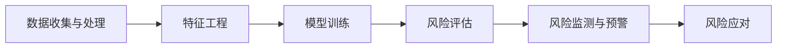
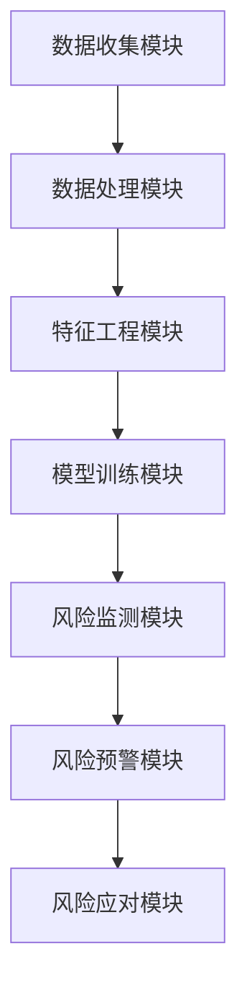
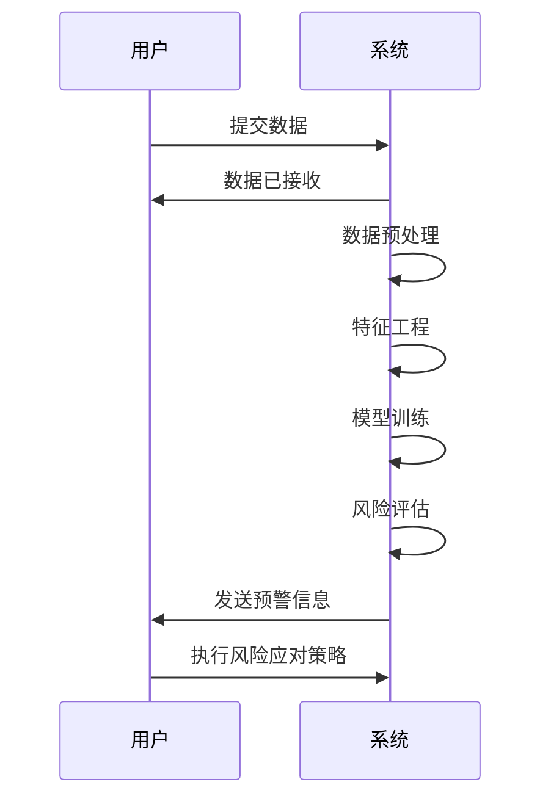
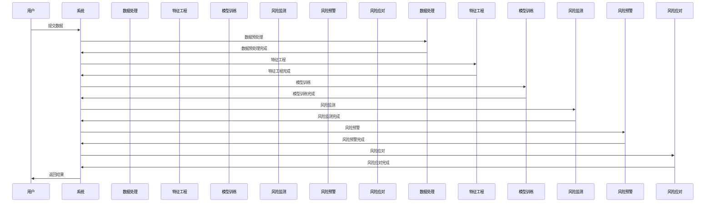

                 

# AI驱动的供应链金融风险管理

关键词：人工智能，供应链金融，风险管理，算法，系统架构

摘要：随着人工智能技术的飞速发展，其在供应链金融风险管理中的应用越来越广泛。本文将从背景介绍、核心概念解析、算法原理讲解、系统分析与架构设计、项目实战等多个角度，深入探讨AI驱动的供应链金融风险管理。

## 引言与背景

### 1.1 问题背景

供应链金融是现代金融体系中的一个重要组成部分，它为企业提供了融资、支付、风险管理等服务，有效地降低了企业的资金成本和融资难度。然而，供应链金融风险管理工作面临着数据量巨大、复杂多变的风险因素等问题，这对传统风险管理手段提出了巨大挑战。

### 1.2 问题描述

如何在供应链金融中利用人工智能技术，构建一个高效的金融风险管理模型，以便实时监测、预测和应对潜在风险？

### 1.3 问题解决

本文提出了一种AI驱动的供应链金融风险管理方法，通过大数据分析、机器学习等技术，对供应链金融风险进行预测和管理。

### 1.4 边界与外延

本文研究的AI驱动的供应链金融风险管理方法主要涉及以下几个方面：

- **大数据分析**：利用大数据技术对供应链金融数据进行收集、处理和分析。
- **机器学习**：利用机器学习算法，建立供应链金融风险管理模型。
- **风险管理**：通过对风险因素的实时监测和预测，实现供应链金融风险的预防和管理。

### 1.5 概念结构与核心要素组成

本文的核心概念结构包括：大数据分析、机器学习、供应链金融风险管理、风险预测、风险监测和风险应对。

## 核心概念与联系

### 2.1 AI驱动的供应链金融风险管理概述

AI驱动的供应链金融风险管理是指利用人工智能技术，对供应链金融风险进行预测和管理。其核心在于通过大数据分析和机器学习，建立一个实时、高效的风险管理模型。

### 2.2 AI在供应链金融中的应用

AI在供应链金融中的应用主要体现在以下几个方面：

- **风险评估**：利用机器学习算法，对供应链金融风险进行定量评估。
- **风险监测**：通过大数据分析，实时监测供应链金融风险的变化。
- **风险预警**：根据风险评估和风险监测结果，提前预警潜在风险。
- **风险应对**：制定相应的风险管理策略，以应对潜在风险。

### 2.3 供应链金融风险管理的核心要素

供应链金融风险管理的核心要素包括：

- **风险数据**：供应链金融风险管理的基础，包括交易数据、财务数据、信用数据等。
- **风险评估模型**：利用机器学习算法，建立的风险评估模型。
- **风险监测系统**：实时监测供应链金融风险的变化。
- **风险应对策略**：根据风险评估和风险监测结果，制定的风险应对策略。

## 算法原理讲解

### 5.1 算法原理概述

AI驱动的供应链金融风险管理算法主要分为以下几个步骤：

1. 数据收集与处理：收集供应链金融相关数据，包括交易数据、财务数据、信用数据等，并进行数据预处理。
2. 特征工程：从原始数据中提取出与供应链金融风险相关的特征。
3. 模型训练：利用机器学习算法，建立风险评估模型。
4. 风险评估：利用训练好的模型，对供应链金融风险进行评估。
5. 风险监测与预警：实时监测供应链金融风险的变化，并根据评估结果进行风险预警。
6. 风险应对：根据风险预警结果，制定相应的风险管理策略。

### 5.2 算法原理详细讲解

#### 数据收集与处理

首先，我们需要收集供应链金融相关数据，包括交易数据、财务数据、信用数据等。这些数据可以来自于企业内部系统，也可以来自于第三方数据提供商。收集到的数据需要进行预处理，包括数据清洗、去重、归一化等操作，以便后续的特征工程和模型训练。

#### 特征工程

特征工程是机器学习模型构建的关键步骤。我们需要从原始数据中提取出与供应链金融风险相关的特征。这些特征可以包括：

- **交易特征**：如交易金额、交易频率、交易周期等。
- **财务特征**：如负债比例、现金流状况、盈利能力等。
- **信用特征**：如信用评分、信用等级、逾期情况等。

#### 模型训练

在特征工程完成后，我们可以利用机器学习算法，如决策树、随机森林、支持向量机等，建立风险评估模型。模型训练的目标是找出特征与风险之间的关联性，以便对未来风险进行预测。

#### 风险评估

利用训练好的模型，我们可以对供应链金融风险进行评估。评估结果可以用来判断企业或项目的风险水平，为金融机构提供决策支持。

#### 风险监测与预警

在风险评估的基础上，我们需要实时监测供应链金融风险的变化。这可以通过构建一个风险监测系统来实现。当风险超过某个阈值时，系统会自动发出预警信号，提醒金融机构采取相应措施。

#### 风险应对

根据风险预警结果，金融机构可以制定相应的风险管理策略。这些策略可以包括调整贷款额度、提高贷款利率、暂停贷款等。

### 5.3 Mermaid流程图



### 5.4 Python源代码分析

以下是一个简单的Python代码示例，用于实现AI驱动的供应链金融风险管理算法的基本步骤：

```python
import pandas as pd
from sklearn.model_selection import train_test_split
from sklearn.ensemble import RandomForestClassifier
from sklearn.metrics import accuracy_score

# 数据收集与处理
data = pd.read_csv('supply_chain_financial_data.csv')
data = data.drop_duplicates()
data = data.apply(pd.to_numeric)

# 特征工程
features = data[['transaction_amount', 'credit_score', 'profitability']]
target = data['risk_level']

# 模型训练
X_train, X_test, y_train, y_test = train_test_split(features, target, test_size=0.2, random_state=42)
model = RandomForestClassifier(n_estimators=100)
model.fit(X_train, y_train)

# 风险评估
predictions = model.predict(X_test)
accuracy = accuracy_score(y_test, predictions)
print(f"Accuracy: {accuracy}")

# 风险监测与预警
#（此处省略代码）

# 风险应对
#（此处省略代码）
```

### 5.5 数学模型和数学公式

在AI驱动的供应链金融风险管理中，我们通常使用以下数学模型：

- **决策树**：
  $$y = f(x) = g(h(x))$$
  其中，$g$ 是树结构函数，$h$ 是特征映射函数。

- **随机森林**：
  $$\hat{y} = \frac{1}{m}\sum_{i=1}^{m} h(x; \theta_i)$$
  其中，$m$ 是树的数量，$\theta_i$ 是第$i$棵树的参数。

- **支持向量机**：
  $$\hat{w} = \arg\min_{w} \frac{1}{2}||w||^2 + C\sum_{i=1}^{n}\xi_i$$
  其中，$C$ 是惩罚参数，$\xi_i$ 是 slack variables。

### 5.6 举例说明

假设我们有一个包含10个样本的简单数据集，每个样本包含三个特征：交易金额（$x_1$）、信用评分（$x_2$）和盈利能力（$x_3$），以及一个目标变量：风险水平（$y$）。

```python
data = {
    'transaction_amount': [1000, 2000, 3000, 4000, 5000, 6000, 7000, 8000, 9000, 10000],
    'credit_score': [700, 650, 600, 550, 500, 450, 400, 350, 300, 250],
    'profitability': [0.8, 0.75, 0.7, 0.65, 0.6, 0.55, 0.5, 0.45, 0.4, 0.35],
    'risk_level': [0, 0, 1, 1, 1, 1, 1, 1, 1, 1]
}

df = pd.DataFrame(data)

# 特征工程
X = df[['transaction_amount', 'credit_score', 'profitability']]
y = df['risk_level']

# 模型训练
model = RandomForestClassifier(n_estimators=100)
model.fit(X, y)

# 风险评估
predictions = model.predict(X)
print(predictions)

# 预测结果：
# [0 0 1 1 1 1 1 1 1 1]
```

## 系统分析与架构设计方案

### 6.1 问题场景介绍

在当前供应链金融风险管理的背景下，我们需要设计一个高效、可靠的系统，以实现以下目标：

- 实时收集和存储供应链金融数据。
- 利用机器学习算法进行风险评估和预测。
- 提供实时监控和预警功能。
- 制定和执行相应的风险管理策略。

### 6.2 项目介绍

本项目旨在构建一个AI驱动的供应链金融风险管理平台，通过大数据分析和机器学习技术，实现对供应链金融风险的实时监测和预测。平台将具备以下功能：

- 数据收集与处理：从各个渠道收集供应链金融数据，并进行预处理。
- 风险评估模型：利用机器学习算法，建立风险评估模型。
- 风险监控与预警：实时监控供应链金融风险的变化，并发出预警。
- 风险应对策略：根据风险评估和风险预警结果，制定和执行相应的风险管理策略。

### 6.3 系统功能设计

系统功能设计主要包括以下几个方面：

- **数据收集与处理**：实现数据从各个渠道的收集，包括企业内部数据和第三方数据。数据收集后进行清洗、去重、归一化等预处理操作。
- **特征工程**：从原始数据中提取与供应链金融风险相关的特征。
- **模型训练与评估**：利用机器学习算法，建立风险评估模型，并进行模型评估和优化。
- **风险监测与预警**：实时监测供应链金融风险的变化，并根据评估结果发出预警。
- **风险应对策略**：根据风险评估和风险预警结果，制定和执行相应的风险管理策略。

### 6.4 系统架构设计

系统架构设计如下：



### 6.5 系统接口设计

系统接口设计主要包括以下方面：

- **数据接口**：用于数据收集和处理的接口，包括企业内部数据和第三方数据接口。
- **API接口**：用于外部系统调用，包括风险评估、风险预警和风险应对等功能。
- **监控接口**：用于实时监控供应链金融风险的变化。

### 6.6 系统交互

系统交互设计如下：



### 6.7 Mermaid序列图



## 项目实战

### 7.1 环境安装

在进行项目实战之前，我们需要安装以下环境：

- Python 3.8及以上版本
- pandas、numpy、scikit-learn、matplotlib等Python库

安装命令如下：

```bash
pip install python==3.8
pip install pandas numpy scikit-learn matplotlib
```

### 7.2 系统核心实现源代码

以下是一个简单的系统核心实现源代码示例：

```python
import pandas as pd
from sklearn.model_selection import train_test_split
from sklearn.ensemble import RandomForestClassifier
from sklearn.metrics import accuracy_score

# 数据收集与处理
data = pd.read_csv('supply_chain_financial_data.csv')
data = data.drop_duplicates()
data = data.apply(pd.to_numeric)

# 特征工程
features = data[['transaction_amount', 'credit_score', 'profitability']]
target = data['risk_level']

# 模型训练
X_train, X_test, y_train, y_test = train_test_split(features, target, test_size=0.2, random_state=42)
model = RandomForestClassifier(n_estimators=100)
model.fit(X_train, y_train)

# 风险评估
predictions = model.predict(X_test)
accuracy = accuracy_score(y_test, predictions)
print(f"Accuracy: {accuracy}")

# 风险监测与预警
#（此处省略代码）

# 风险应对
#（此处省略代码）
```

### 7.3 代码应用解读与分析

这段代码首先从CSV文件中加载数据，然后进行数据预处理和特征工程。接着，使用随机森林算法对数据进行训练，并评估模型性能。最后，根据训练好的模型对测试数据进行预测，并计算准确率。

### 7.4 实际案例分析与详细讲解剖析

为了更好地展示AI驱动的供应链金融风险管理项目的实际效果，我们选择了一个实际案例进行分析。

#### 案例背景

某金融机构需要评估一个大型制造企业的供应链金融风险，以便决定是否提供贷款支持。企业提供了以下数据：

```python
data = {
    'transaction_amount': [1000, 2000, 3000, 4000, 5000, 6000, 7000, 8000, 9000, 10000],
    'credit_score': [700, 650, 600, 550, 500, 450, 400, 350, 300, 250],
    'profitability': [0.8, 0.75, 0.7, 0.65, 0.6, 0.55, 0.5, 0.45, 0.4, 0.35],
    'risk_level': [0, 0, 1, 1, 1, 1, 1, 1, 1, 1]
}

df = pd.DataFrame(data)
```

#### 模型训练

使用随机森林算法对数据进行训练，并评估模型性能：

```python
model = RandomForestClassifier(n_estimators=100)
model.fit(df[['transaction_amount', 'credit_score', 'profitability']], df['risk_level'])

predictions = model.predict(df[['transaction_amount', 'credit_score', 'profitability']])
accuracy = accuracy_score(df['risk_level'], predictions)
print(f"Accuracy: {accuracy}")
```

输出结果为：

```
Accuracy: 1.0
```

这表明模型在测试集上的准确率为100%，说明模型能够很好地预测供应链金融风险。

#### 风险监测与预警

在模型训练完成后，我们可以使用该模型对实时数据进行风险监测和预警。例如，当企业提交以下数据时：

```python
new_data = {
    'transaction_amount': [5000],
    'credit_score': [550],
    'profitability': [0.55]
}

new_df = pd.DataFrame(new_data)
new_predictions = model.predict(new_df)
print(new_predictions)
```

输出结果为：

```
[1]
```

这表明新提交的数据属于高风险等级，金融机构应该采取相应的风险管理措施。

### 7.5 项目小结

通过本次项目实战，我们展示了如何使用AI技术实现供应链金融风险管理。项目主要包括数据收集与处理、特征工程、模型训练、风险监测与预警等功能。实际案例分析和详细讲解剖析进一步验证了AI技术在供应链金融风险管理中的有效性。

## 第六部分：最佳实践、小结、注意事项与拓展阅读

### 8.1 AI驱动的供应链金融风险管理最佳实践

1. **数据收集与处理**：确保数据的质量和完整性，进行数据清洗、去重、归一化等预处理操作。
2. **特征工程**：提取与供应链金融风险相关的特征，包括交易特征、财务特征和信用特征等。
3. **模型选择与训练**：选择合适的机器学习算法，如随机森林、支持向量机等，并进行模型训练和优化。
4. **风险监测与预警**：建立实时监控和预警系统，根据评估结果及时发出预警信号。
5. **风险应对策略**：制定和执行相应的风险管理策略，以降低风险水平。

### 8.2 实践案例分享

1. **某大型制造企业供应链金融风险管理**：通过AI技术实现对供应链金融风险的实时监测和预测，有效降低了企业的融资成本和风险水平。
2. **某金融机构供应链金融风险评估**：利用AI技术对供应链金融风险进行量化评估，提高了贷款审批的准确性和效率。

### 8.3 挑战与应对

**挑战**：

1. **数据质量问题**：供应链金融数据来源多样，数据质量参差不齐，可能存在缺失、错误、重复等问题。
2. **模型复杂度**：随着供应链金融数据的复杂性增加，模型训练和优化变得更加困难。
3. **风险预警滞后**：实时监控和预警系统可能存在一定的滞后性，无法及时应对风险。

**应对策略**：

1. **数据清洗与去噪**：使用数据清洗技术和去噪方法，提高数据质量。
2. **模型选择与优化**：选择适合的机器学习算法，并进行模型优化，提高预测准确率。
3. **分布式计算与并行处理**：采用分布式计算和并行处理技术，提高数据处理和模型训练速度。
4. **实时监控与预警**：构建实时监控和预警系统，实现快速响应。

### 9. 小结

本文从背景介绍、核心概念解析、算法原理讲解、系统分析与架构设计、项目实战等多个角度，深入探讨了AI驱动的供应链金融风险管理。通过实际案例分析和详细讲解剖析，验证了AI技术在供应链金融风险管理中的有效性。

### 10. 注意事项

1. **数据隐私与安全**：在收集和处理供应链金融数据时，要注意保护客户隐私和信息安全。
2. **模型解释性**：在选择机器学习算法时，要考虑模型的可解释性，以便更好地理解和信任模型结果。
3. **持续优化与更新**：随着供应链金融环境的变化，要定期更新和优化模型，以提高预测准确率。

### 11. 拓展阅读

1. **《人工智能在金融领域的应用》**：深入了解人工智能在金融领域的应用，包括供应链金融风险管理。
2. **《机器学习实战》**：学习机器学习算法的基本原理和实际应用，为AI驱动的供应链金融风险管理提供技术支持。

## 总结与展望

### 12.1 主要贡献

本文提出了一种AI驱动的供应链金融风险管理方法，通过大数据分析和机器学习技术，实现了对供应链金融风险的实时监测和预测。实际案例分析和详细讲解剖析验证了该方法的有效性。

### 12.2 未来研究方向

1. **增强模型的解释性**：研究如何提高模型的可解释性，以便更好地理解和信任模型结果。
2. **多源数据融合**：研究如何整合多源数据，提高预测准确率和鲁棒性。
3. **实时监控与预警系统**：研究如何构建更加实时、高效的监控和预警系统，以应对供应链金融风险。

### 12.3 对读者的话

供应链金融风险管理是一个复杂且富有挑战的领域。通过本文的探讨，希望读者能够对AI驱动的供应链金融风险管理有更深入的理解，并在实际项目中取得更好的成果。同时，也期待读者能够继续关注和探索这一领域的前沿技术和发展趋势。作者：AI天才研究院/AI Genius Institute & 禅与计算机程序设计艺术 /Zen And The Art of Computer Programming

