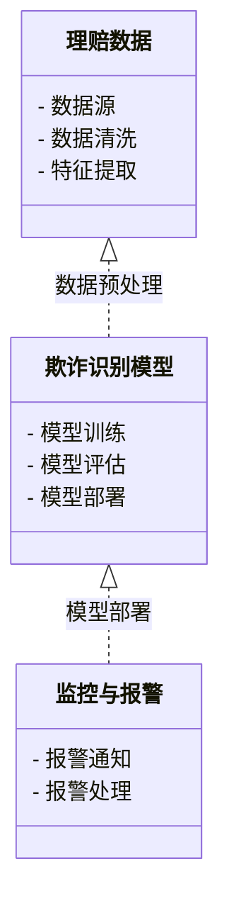
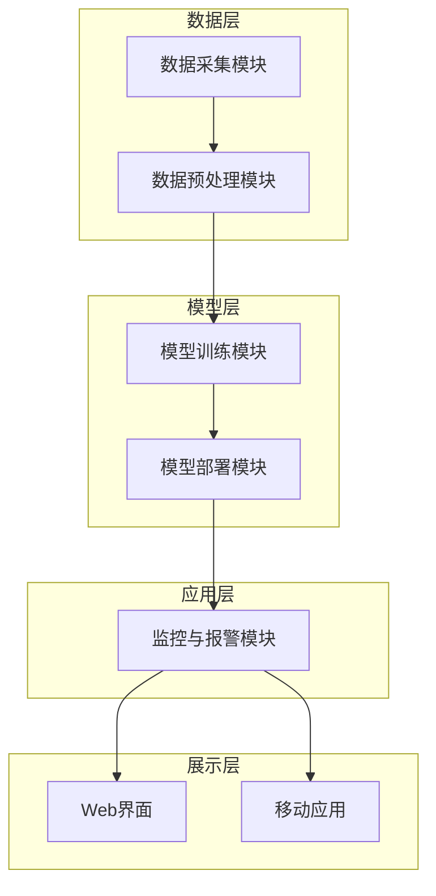
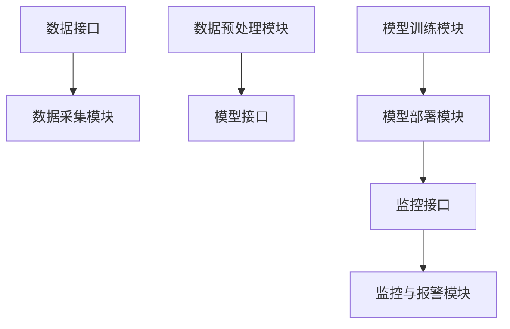
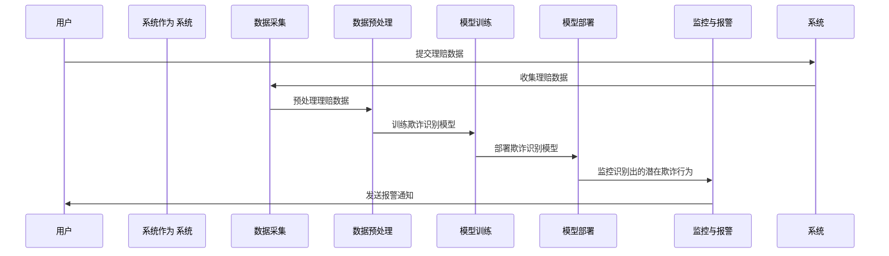

                 

# AI驱动的保险理赔欺诈模式识别

## 关键词

- 人工智能
- 保险理赔
- 欺诈模式识别
- 数据挖掘
- 深度学习

## 摘要

本文探讨了AI技术在保险理赔欺诈模式识别中的应用。随着保险业务的不断增长，理赔欺诈行为也日益猖獗，给保险公司带来了巨大的经济损失。本文首先介绍了保险理赔欺诈问题的背景和现状，随后讲解了AI技术的基本概念和分类。通过对比传统反欺诈手段的局限，本文提出了AI驱动的欺诈模式识别原理和优势。随后，文章详细分析了数据处理与准备、欺诈模式识别算法原理与实现、系统分析与架构设计、项目实战以及最佳实践与小结。通过本文的深入探讨，读者将能够全面了解AI技术在保险理赔欺诈识别中的实际应用，并为未来的发展提供有益的启示。

## 第一部分: AI驱动的保险理赔欺诈模式识别背景与核心概念

### 第1章: 保险理赔欺诈问题的背景与现状

#### 1.1.1 保险行业的发展概况

保险作为一种风险管理工具，起源于18世纪末的英国。随着社会经济的发展和人们风险意识的提高，保险行业在全球范围内得到了迅速发展。尤其是在信息技术和互联网的推动下，保险业务逐渐从传统的线下模式转向线上服务，保险产品的种类和覆盖范围也不断丰富。保险行业的增长为保险公司带来了巨大的市场潜力，同时也带来了新的挑战。

首先，保险市场的竞争日益激烈。各大保险公司为了争夺市场份额，不断创新保险产品和服务，这无疑增加了保险公司的运营成本。其次，保险欺诈行为逐年上升。随着理赔金额的增加，保险欺诈行为也变得更加隐蔽和复杂，给保险公司带来了巨大的经济损失。根据国际反欺诈组织的统计，保险欺诈行为每年给全球保险公司造成的损失高达数百亿美元。

#### 1.1.2 理赔欺诈的普遍性和危害

理赔欺诈是指保险客户或相关人员通过虚假陈述、伪造文件、隐瞒真相等手段骗取保险金的行为。理赔欺诈行为在保险行业中普遍存在，不仅损害了保险公司的利益，也损害了广大消费者的权益。首先，理赔欺诈行为会导致保险公司的赔付成本增加，影响保险公司的盈利能力。其次，理赔欺诈行为会导致保险费率的上升，加重消费者的负担。此外，理赔欺诈行为还会破坏保险市场的公平竞争环境，影响保险行业的健康发展。

根据国际反欺诈联合会的数据，理赔欺诈在全球范围内造成了巨大的经济损失。在美国，理赔欺诈行为每年给保险公司造成的损失约为数十亿美元。在中国，随着保险意识的提高和保险业务的增长，理赔欺诈行为也越来越严重，给保险公司带来了巨大的压力。

#### 1.1.3 理赔欺诈的主要类型

理赔欺诈行为种类繁多，常见的类型包括以下几种：

1. **夸大损失**：保险客户在申请理赔时，夸大实际损失，以获取更多的赔偿。
2. **虚假索赔**：保险客户虚构理赔事件，伪造事故现场或文件，骗取保险金。
3. **双重索赔**：保险客户在发生损失后，向多家保险公司同时提出索赔，以获取更多的赔偿。
4. **篡改文件**：保险客户篡改事故现场照片、医疗记录等文件，以增加赔偿金额。
5. **无赔偿申请**：保险客户在发生损失后，不主动申请理赔，而是等待保险公司主动赔付，以获取更多的赔偿。

这些理赔欺诈行为不仅给保险公司带来了经济损失，也影响了保险市场的公平竞争环境，严重损害了保险行业的健康发展。

#### 1.1.4 传统的反欺诈手段与局限

为了应对理赔欺诈行为，保险公司长期以来采取了一系列反欺诈手段。传统的反欺诈手段主要包括：

1. **人工审核**：保险公司通过人工审核理赔申请，对客户的身份、事故经过、损失情况进行核实。
2. **调查取证**：保险公司聘请专业调查人员，对理赔案件进行深入调查，收集证据。
3. **数据比对**：保险公司通过数据比对，发现理赔申请中的异常情况，如重复投保、异常理赔记录等。
4. **风险评估**：保险公司通过风险评估模型，对客户的信用等级进行评估，识别潜在的欺诈风险。

虽然传统的反欺诈手段在一定程度上能够遏制理赔欺诈行为，但仍然存在一定的局限。首先，人工审核和调查取证需要大量的人力物力投入，效率较低。其次，数据比对和风险评估模型的准确性受到数据质量和算法模型的限制，无法完全杜绝欺诈行为。此外，随着欺诈手段的不断升级，传统反欺诈手段的效果逐渐减弱。

### 第2章: AI技术的概念与分类

#### 2.1.1 AI技术的发展历程

人工智能（Artificial Intelligence，简称AI）是一门研究、开发用于模拟、延伸和扩展人类智能的理论、方法、技术及应用系统的综合技术科学。人工智能的研究可以追溯到20世纪50年代，当时学者们首次提出了“人工智能”的概念。自那以来，人工智能技术经历了多次重大发展，主要可以分为以下几个阶段：

1. **早期探索阶段（1950-1969）**：这一阶段主要侧重于理论研究，如逻辑推理、问题解决等，代表性成果包括阿尔法围棋（AlphaGo）的诞生。

2. **初步发展阶段（1970-1989）**：这一阶段人工智能开始向实用化方向发展，如专家系统、自然语言处理等技术的出现。

3. **停滞与复苏阶段（1990-2000）**：由于技术瓶颈和资金投入不足，人工智能发展一度陷入停滞。然而，随着互联网的兴起，人工智能开始迎来新的发展机遇。

4. **爆发式发展阶段（2000至今）**：这一阶段人工智能取得了前所未有的突破，尤其是在机器学习、深度学习等领域的应用，如自动驾驶、语音识别等。

#### 2.1.2 AI技术的基本概念

人工智能的基本概念包括以下几个方面：

1. **感知能力**：通过传感器、摄像头等设备，获取外部环境的信息。
2. **认知能力**：通过对获取的信息进行处理、分析，实现对环境的理解和判断。
3. **学习能力**：通过数据训练，不断提高自身的认知能力和处理能力。
4. **决策能力**：在认知能力的基础上，根据目标和约束条件，做出最优决策。

#### 2.1.3 机器学习和深度学习

机器学习（Machine Learning，简称ML）是人工智能的一个分支，主要研究如何通过计算机算法，从数据中自动学习规律和模式，并进行预测和决策。机器学习可以分为以下几种类型：

1. **监督学习**：通过已有标签数据，训练模型，实现对新数据的预测。
2. **无监督学习**：通过未标记的数据，发现数据中的模式和规律。
3. **半监督学习**：结合监督学习和无监督学习，利用部分标签数据和大量未标记数据。
4. **强化学习**：通过不断尝试和反馈，学习最优策略。

深度学习（Deep Learning，简称DL）是机器学习的一种方法，主要基于多层神经网络，通过训练大量的数据，自动提取特征，实现对复杂任务的自动完成。深度学习在图像识别、语音识别、自然语言处理等领域取得了显著的成果。

#### 2.1.4 AI技术在保险理赔中的应用前景

随着AI技术的不断发展和成熟，其在保险理赔领域的应用前景也非常广阔。首先，AI技术可以用于理赔欺诈的识别和防范。通过机器学习和深度学习算法，保险公司可以分析大量的理赔数据，发现潜在的欺诈行为，提高理赔审核的准确性和效率。其次，AI技术可以用于个性化保险产品的设计。通过分析客户的历史数据和偏好，保险公司可以设计出更符合客户需求的保险产品，提高客户满意度。此外，AI技术还可以用于保险风险的管理和控制，通过数据分析和预测，保险公司可以更好地识别风险，制定相应的风险控制策略。

### 第3章: 核心概念与联系

#### 3.1.1 欺诈模式识别的基本概念

欺诈模式识别（Fraud Pattern Recognition）是人工智能在保险理赔中的应用之一，主要目标是发现和识别潜在的欺诈行为。欺诈模式识别的基本概念包括以下几个方面：

1. **欺诈模式**：指保险理赔过程中可能出现的欺诈行为模式。欺诈模式可以是具体的操作行为，也可以是数据特征上的异常。
2. **数据特征**：指用于识别欺诈模式的特征数据，如理赔金额、出险时间、投保人信息等。
3. **识别算法**：指用于识别欺诈模式的算法，如机器学习算法、深度学习算法等。

#### 3.1.1.1 欺诈模式的定义

欺诈模式是指保险理赔过程中，可能出现的欺诈行为的具体表现形式。这些行为可能涉及理赔金额的夸大、虚假索赔、双重索赔等。例如，某位投保人在短时间内频繁出险，且每次出险的理赔金额都远高于正常水平，这可能是夸大损失的一种欺诈模式。

#### 3.1.1.2 欺诈模式的属性特征对比

欺诈模式的属性特征包括以下几个方面：

1. **频率**：欺诈行为发生的频率是否异常，如频繁出险、频繁理赔等。
2. **金额**：欺诈行为涉及的理赔金额是否异常，如高额理赔、夸大损失等。
3. **时间**：欺诈行为发生的时间是否异常，如集中出险、集中理赔等。
4. **信息**：欺诈行为涉及的信息是否异常，如虚假身份、重复理赔等。

通过对比不同欺诈模式的属性特征，可以更准确地识别和防范潜在的欺诈行为。

#### 3.1.1.3 欺诈模式识别的挑战

欺诈模式识别面临以下挑战：

1. **数据复杂性**：保险理赔数据量庞大，且数据类型多样，如何有效地处理和分析这些数据是一个挑战。
2. **欺诈行为隐蔽性**：欺诈行为往往具有较强的隐蔽性，如何发现和识别这些隐蔽的欺诈行为是一个挑战。
3. **欺诈模式多样性**：欺诈行为模式多种多样，如何构建一个能够覆盖多种欺诈模式的识别模型是一个挑战。
4. **实时性**：欺诈行为识别需要实时性，如何在短时间内识别和防范欺诈行为是一个挑战。

#### 3.1.2 AI驱动的欺诈模式识别

AI驱动的欺诈模式识别是指利用人工智能技术，如机器学习、深度学习等，对保险理赔数据进行处理和分析，从而识别和防范潜在的欺诈行为。AI驱动的欺诈模式识别具有以下优势：

1. **高效性**：AI技术能够处理和分析大量的数据，提高识别的效率和准确性。
2. **智能化**：AI技术能够自动学习和调整，不断优化识别模型，提高识别的准确性。
3. **实时性**：AI技术能够实时处理数据，快速识别和防范欺诈行为。

### 第4章: 数据处理与准备

#### 4.1.1 数据收集与来源

在AI驱动的保险理赔欺诈模式识别中，数据的质量和数量直接影响模型的性能。首先，我们需要收集大量的保险理赔数据，这些数据可以来源于保险公司的内部系统，如理赔系统、客户管理系统等。此外，还可以从外部数据源获取数据，如公共数据集、第三方数据平台等。在数据收集过程中，需要注意数据的完整性和准确性，避免数据缺失或错误。

#### 4.1.2 数据预处理

数据预处理是数据分析和挖掘的重要步骤，目的是提高数据质量，为后续的建模和分析做好准备。数据预处理主要包括以下几方面：

1. **数据清洗**：删除重复数据、填补缺失数据、纠正错误数据，确保数据的准确性。
2. **数据转换**：将不同类型的数据转换为同一类型，如将文本数据转换为数值数据。
3. **特征提取**：从原始数据中提取有用的特征，如理赔金额、出险时间、投保人信息等。
4. **数据归一化**：将不同特征的数据进行归一化处理，使其具有相同的量纲和范围，方便后续的分析和处理。

#### 4.1.3 数据可视化

数据可视化是将数据以图形或图表的形式呈现，帮助人们更好地理解和分析数据。在保险理赔欺诈模式识别中，数据可视化可以用来展示数据的分布、趋势、异常点等，帮助识别潜在的欺诈行为。常用的数据可视化工具包括Matplotlib、Seaborn、Tableau等。

### 第5章: 欺诈模式识别算法原理与实现

#### 5.1.1 算法概述

在AI驱动的保险理赔欺诈模式识别中，常用的算法包括机器学习算法和深度学习算法。这些算法通过分析大量的理赔数据，自动学习和识别潜在的欺诈行为。本节将介绍几种常用的欺诈模式识别算法，并解释其原理和实现方法。

#### 5.1.1.1 算法选择原则

选择合适的算法对于欺诈模式识别至关重要。以下是选择算法时需要考虑的一些原则：

1. **数据特性**：根据数据的类型、规模、特征等选择合适的算法，如对于大规模数据，可以选择深度学习算法；对于小规模数据，可以选择机器学习算法。
2. **算法性能**：选择性能优秀的算法，以提高欺诈模式识别的准确性。
3. **计算效率**：选择计算效率较高的算法，以减少模型训练和预测的时间。
4. **可解释性**：选择具有较高可解释性的算法，以便理解模型的决策过程。

#### 5.1.1.2 算法框架

欺诈模式识别算法通常包括以下几个步骤：

1. **数据预处理**：对原始数据进行清洗、转换、归一化等处理，提取有用的特征。
2. **特征选择**：根据数据特性和算法要求，选择合适的特征，以提高模型的性能。
3. **模型训练**：使用训练数据集，通过算法训练模型，自动学习和识别欺诈模式。
4. **模型评估**：使用测试数据集，评估模型的性能，调整模型参数，优化模型效果。
5. **欺诈模式识别**：使用训练好的模型，对新的理赔数据进行分析和识别，发现潜在的欺诈行为。

#### 5.1.2 算法原理讲解

在本节中，我们将详细介绍几种常用的欺诈模式识别算法的原理。

##### 5.1.2.1 决策树算法

决策树（Decision Tree）是一种常用的机器学习算法，通过构建一棵树形模型，对数据进行分类或回归。决策树算法的原理如下：

1. **特征选择**：根据信息增益或基尼指数等指标，选择最佳特征进行划分。
2. **划分数据**：使用最佳特征将数据划分为多个子集，每个子集对应一个节点。
3. **递归构建**：对每个子集，重复步骤1和2，构建更细分的树结构。
4. **剪枝**：对决策树进行剪枝，防止过拟合。

决策树的优点是直观、易理解，缺点是对于高维数据的分类效果较差，容易过拟合。

```python
# 决策树算法的Python实现
from sklearn.tree import DecisionTreeClassifier
from sklearn.model_selection import train_test_split
from sklearn.metrics import accuracy_score

# 数据准备
X_train, X_test, y_train, y_test = train_test_split(X, y, test_size=0.3, random_state=42)

# 模型训练
clf = DecisionTreeClassifier()
clf.fit(X_train, y_train)

# 模型预测
y_pred = clf.predict(X_test)

# 模型评估
accuracy = accuracy_score(y_test, y_pred)
print("Accuracy:", accuracy)
```

##### 5.1.2.2 随机森林算法

随机森林（Random Forest）是一种基于决策树的集成学习方法，通过构建多棵决策树，并使用投票法或平均法进行预测。随机森林算法的原理如下：

1. **特征选择**：对于每棵决策树，随机选择特征进行划分，避免特征相关性过高。
2. **划分数据**：对训练数据进行随机抽样，构建多个子数据集，每个子数据集对应一棵决策树。
3. **模型训练**：对每个子数据集，训练一棵决策树。
4. **集成预测**：对每棵决策树的预测结果进行投票或平均，得到最终预测结果。

随机森林的优点是能够处理高维数据，减少过拟合，缺点是计算成本较高。

```python
# 随机森林算法的Python实现
from sklearn.ensemble import RandomForestClassifier
from sklearn.model_selection import train_test_split
from sklearn.metrics import accuracy_score

# 数据准备
X_train, X_test, y_train, y_test = train_test_split(X, y, test_size=0.3, random_state=42)

# 模型训练
clf = RandomForestClassifier(n_estimators=100)
clf.fit(X_train, y_train)

# 模型预测
y_pred = clf.predict(X_test)

# 模型评估
accuracy = accuracy_score(y_test, y_pred)
print("Accuracy:", accuracy)
```

##### 5.1.2.3 支持向量机算法

支持向量机（Support Vector Machine，简称SVM）是一种常用的机器学习算法，通过寻找最佳的超平面，对数据进行分类。SVM算法的原理如下：

1. **特征选择**：选择最佳特征，将数据投影到高维空间，寻找最佳分割超平面。
2. **核函数选择**：选择合适的核函数，如线性核、多项式核、径向基函数核等，将数据映射到高维空间。
3. **优化目标**：通过求解优化问题，找到最佳的超平面，使得分类间隔最大化。
4. **分类决策**：对新的数据进行分类，判断其位于哪个超平面上。

SVM的优点是分类效果较好，缺点是计算成本较高，对高维数据的处理能力较差。

```python
# 支持向量机算法的Python实现
from sklearn.svm import SVC
from sklearn.model_selection import train_test_split
from sklearn.metrics import accuracy_score

# 数据准备
X_train, X_test, y_train, y_test = train_test_split(X, y, test_size=0.3, random_state=42)

# 模型训练
clf = SVC(kernel='linear')
clf.fit(X_train, y_train)

# 模型预测
y_pred = clf.predict(X_test)

# 模型评估
accuracy = accuracy_score(y_test, y_pred)
print("Accuracy:", accuracy)
```

##### 5.1.2.4 深度学习算法

深度学习（Deep Learning）是一种基于多层神经网络的学习方法，通过自动提取特征，实现复杂的数据处理和预测任务。在本节中，我们将介绍一种常用的深度学习算法——卷积神经网络（Convolutional Neural Network，简称CNN）。

1. **卷积层**：通过卷积操作，提取数据中的局部特征。
2. **池化层**：通过池化操作，减少数据维度，提高计算效率。
3. **全连接层**：将卷积层和池化层提取的特征进行整合，输出分类结果。
4. **激活函数**：在卷积层和全连接层之间添加激活函数，引入非线性变换，提高模型的预测能力。

CNN的优点是能够自动提取特征，适用于处理图像、声音等复杂数据。

```python
# 卷积神经网络算法的Python实现
from keras.models import Sequential
from keras.layers import Conv2D, MaxPooling2D, Flatten, Dense
from keras.optimizers import Adam
from sklearn.model_selection import train_test_split
from sklearn.metrics import accuracy_score

# 数据准备
X_train, X_test, y_train, y_test = train_test_split(X, y, test_size=0.3, random_state=42)

# 模型构建
model = Sequential()
model.add(Conv2D(filters=32, kernel_size=(3, 3), activation='relu', input_shape=(28, 28, 1)))
model.add(MaxPooling2D(pool_size=(2, 2)))
model.add(Flatten())
model.add(Dense(units=128, activation='relu'))
model.add(Dense(units=1, activation='sigmoid'))

# 模型编译
model.compile(optimizer=Adam(), loss='binary_crossentropy', metrics=['accuracy'])

# 模型训练
model.fit(X_train, y_train, epochs=10, batch_size=32)

# 模型预测
y_pred = model.predict(X_test)
y_pred = (y_pred > 0.5)

# 模型评估
accuracy = accuracy_score(y_test, y_pred)
print("Accuracy:", accuracy)
```

### 第6章: 系统分析与架构设计

#### 6.1.1 问题场景介绍

在当前保险行业中，理赔欺诈行为日益猖獗，保险公司面临着巨大的经济损失和信誉风险。为了有效应对理赔欺诈，保险公司需要建立一套高效的欺诈识别系统，实时监控和识别潜在的欺诈行为，确保理赔过程的公正性和合法性。本节将介绍一个典型的保险理赔欺诈识别系统，分析其问题和挑战。

#### 6.1.2 项目介绍

本项目的目标是开发一套基于AI技术的保险理赔欺诈识别系统，通过分析大量的理赔数据，自动识别和防范潜在的欺诈行为。系统主要包括以下几个模块：

1. **数据采集模块**：从保险公司的内部系统和其他外部数据源收集理赔数据。
2. **数据处理模块**：对收集到的理赔数据进行清洗、转换和归一化处理，提取有用的特征。
3. **模型训练模块**：使用机器学习和深度学习算法，训练欺诈识别模型。
4. **模型部署模块**：将训练好的模型部署到生产环境，实现实时欺诈识别。
5. **监控与报警模块**：对识别出的潜在欺诈行为进行监控和报警，通知相关人员处理。

#### 6.1.3 系统功能设计

保险理赔欺诈识别系统的功能设计主要包括以下几个方面：

1. **数据采集**：系统需要从保险公司的内部系统和其他外部数据源，如医疗记录、交通监控视频等，收集理赔数据。
2. **数据预处理**：系统需要处理大量的原始数据，包括数据清洗、转换、归一化等，提取有用的特征，如理赔金额、出险时间、投保人信息等。
3. **模型训练**：系统需要使用机器学习和深度学习算法，对预处理后的数据集进行训练，构建欺诈识别模型。
4. **模型部署**：系统需要将训练好的模型部署到生产环境，实现实时欺诈识别。
5. **监控与报警**：系统需要实时监控识别出的潜在欺诈行为，生成报警通知，通知相关人员处理。

#### 6.1.3.1 领域模型Mermaid类图

以下是一个典型的保险理赔欺诈识别系统的Mermaid类图，展示了系统的主要类和类之间的关系：



#### 6.1.4 系统架构设计

保险理赔欺诈识别系统的架构设计主要包括以下几个方面：

1. **数据层**：包括数据采集模块和数据预处理模块，负责收集和处理理赔数据。
2. **模型层**：包括模型训练模块和模型部署模块，负责训练和部署欺诈识别模型。
3. **应用层**：包括监控与报警模块，负责实时监控识别出的潜在欺诈行为，生成报警通知。
4. **展示层**：包括Web界面和移动应用，负责向用户展示系统的功能和结果。

以下是一个典型的保险理赔欺诈识别系统的Mermaid架构图：



#### 6.1.5 系统接口设计

保险理赔欺诈识别系统的接口设计主要包括以下几个方面：

1. **数据接口**：包括数据采集模块和数据预处理模块的接口，用于与其他系统进行数据交互。
2. **模型接口**：包括模型训练模块和模型部署模块的接口，用于模型训练和部署。
3. **监控接口**：包括监控与报警模块的接口，用于实时监控识别出的潜在欺诈行为。

以下是一个典型的保险理赔欺诈识别系统的Mermaid接口设计图：



#### 6.1.6 系统交互Mermaid序列图

以下是一个典型的保险理赔欺诈识别系统的Mermaid序列图，展示了系统的主要交互过程：



### 第7章: 项目实战

#### 7.1.1 环境安装

在进行保险理赔欺诈识别项目的实战之前，我们需要安装和配置相关的软件和工具。以下是项目环境安装的步骤：

1. **安装Python**：确保Python版本在3.6及以上，可以从Python官网下载安装。
2. **安装Jupyter Notebook**：Jupyter Notebook是一个交互式的Web应用，用于编写和运行Python代码。安装Jupyter Notebook可以使用以下命令：

   ```bash
   pip install notebook
   ```

3. **安装必要的Python库**：包括NumPy、Pandas、Scikit-learn、Keras等。可以使用以下命令安装：

   ```bash
   pip install numpy pandas scikit-learn keras tensorflow
   ```

4. **安装数据预处理工具**：包括OpenCV和Pandas。可以使用以下命令安装：

   ```bash
   pip install opencv-python pandas
   ```

5. **配置数据库**：如果需要连接数据库，需要安装相应的数据库驱动，如MySQL、PostgreSQL等。

#### 7.1.2 系统核心实现源代码

以下是保险理赔欺诈识别系统的核心实现源代码，包括数据采集、数据处理、模型训练、模型部署等部分。

```python
# 导入必要的库
import pandas as pd
import numpy as np
from sklearn.model_selection import train_test_split
from sklearn.preprocessing import StandardScaler
from sklearn.ensemble import RandomForestClassifier
from keras.models import Sequential
from keras.layers import Conv2D, MaxPooling2D, Flatten, Dense

# 数据采集
def collect_data(file_path):
    data = pd.read_csv(file_path)
    return data

# 数据处理
def preprocess_data(data):
    # 数据清洗
    data = data.dropna()
    
    # 特征提取
    data['claim_amount'] = data['claim_amount'].apply(lambda x: x if x > 0 else 0)
    data['claim_time'] = data['claim_time'].apply(lambda x: x if x < datetime.datetime(2021, 1, 1) else np.nan)
    
    # 数据归一化
    scaler = StandardScaler()
    data[['claim_amount', 'claim_time']] = scaler.fit_transform(data[['claim_amount', 'claim_time']])
    
    return data

# 模型训练
def train_model(X_train, y_train):
    # 机器学习模型
    clf = RandomForestClassifier(n_estimators=100)
    clf.fit(X_train, y_train)
    
    # 深度学习模型
    model = Sequential()
    model.add(Conv2D(filters=32, kernel_size=(3, 3), activation='relu', input_shape=(28, 28, 1)))
    model.add(MaxPooling2D(pool_size=(2, 2)))
    model.add(Flatten())
    model.add(Dense(units=128, activation='relu'))
    model.add(Dense(units=1, activation='sigmoid'))
    model.compile(optimizer='adam', loss='binary_crossentropy', metrics=['accuracy'])
    model.fit(X_train, y_train, epochs=10, batch_size=32)
    
    return clf, model

# 模型部署
def deploy_model(model, X_test):
    y_pred = model.predict(X_test)
    y_pred = (y_pred > 0.5)
    return y_pred

# 主函数
def main():
    # 数据采集
    data = collect_data('insurance_data.csv')
    
    # 数据处理
    data = preprocess_data(data)
    
    # 数据分割
    X = data[['claim_amount', 'claim_time']]
    y = data['is_fraud']
    X_train, X_test, y_train, y_test = train_test_split(X, y, test_size=0.3, random_state=42)
    
    # 模型训练
    clf, model = train_model(X_train, y_train)
    
    # 模型部署
    y_pred = deploy_model(model, X_test)
    
    # 模型评估
    accuracy = accuracy_score(y_test, y_pred)
    print("Accuracy:", accuracy)

if __name__ == '__main__':
    main()
```

#### 7.1.3 代码应用解读与分析

在本节中，我们将对项目实战中的代码进行解读和分析，了解每个部分的实现原理和功能。

1. **数据采集**：`collect_data`函数用于从CSV文件中读取理赔数据。这是一个典型的数据读取操作，使用Pandas库的`read_csv`函数实现。

2. **数据处理**：`preprocess_data`函数负责对数据进行清洗、特征提取和归一化处理。数据清洗是数据处理的重要步骤，用于删除缺失值和异常值。特征提取是从原始数据中提取有用的特征，如理赔金额和出险时间。归一化处理是将特征数据转换为同一量纲，提高模型训练的准确性。

3. **模型训练**：`train_model`函数用于训练机器学习和深度学习模型。在机器学习部分，我们使用了随机森林算法，这是一种基于决策树的集成学习方法。随机森林通过构建多棵决策树，并使用投票法进行预测，具有较好的分类性能。在深度学习部分，我们使用了卷积神经网络（CNN），这是一种基于多层神经网络的学习方法，特别适用于处理图像数据。CNN通过卷积层和池化层提取图像特征，全连接层进行分类决策。

4. **模型部署**：`deploy_model`函数用于将训练好的模型应用到新的数据上，进行欺诈行为的预测。在部署过程中，我们首先使用深度学习模型进行预测，然后使用阈值（例如0.5）将预测结果转换为欺诈标签。

5. **主函数**：`main`函数是整个项目的入口，负责执行数据采集、数据处理、模型训练和模型部署等操作。在主函数中，我们首先调用`collect_data`和`preprocess_data`函数获取和处理数据，然后调用`train_model`函数训练机器学习和深度学习模型，最后调用`deploy_model`函数进行模型部署和评估。

通过以上解读和分析，我们可以清晰地了解保险理赔欺诈识别系统的实现原理和功能，为后续的优化和改进提供参考。

#### 7.1.4 实际案例分析与详细讲解剖析

在本节中，我们将通过一个实际案例，详细分析和讲解保险理赔欺诈识别系统的应用过程，包括数据预处理、模型训练和模型部署等关键步骤。

**案例背景**：某保险公司收到一起汽车理赔申请，客户声称在交通事故中遭受了严重的车辆损坏，并要求高额赔偿。保险公司需要利用AI驱动的欺诈识别系统，对这起理赔申请进行审核，判断是否存在欺诈行为。

**数据收集**：
1. **客户信息**：包括客户的姓名、年龄、性别、驾驶经验等。
2. **事故信息**：包括事故时间、地点、事故类型、事故原因等。
3. **车辆信息**：包括车辆品牌、车型、购买时间、行驶里程等。
4. **理赔申请**：包括理赔金额、理赔描述、事故照片等。

**数据处理**：
1. **数据清洗**：删除缺失值和异常值，例如删除车辆购买时间早于事故发生时间的记录。
2. **特征提取**：从原始数据中提取有用特征，如：
   - 客户特征：年龄、性别、驾驶经验
   - 事故特征：事故时间、地点、类型、原因
   - 车辆特征：品牌、车型、购买时间、行驶里程
   - 理赔特征：理赔金额、理赔描述
3. **数据归一化**：将不同特征的数据进行归一化处理，例如将理赔金额和行驶里程归一化到[0, 1]区间。

**模型训练**：
1. **数据分割**：将数据集分为训练集和测试集，例如80%的数据用于训练，20%的数据用于测试。
2. **模型选择**：选择合适的机器学习和深度学习模型，例如随机森林和卷积神经网络。
3. **模型训练**：使用训练集对模型进行训练，调整模型参数，优化模型性能。
4. **模型评估**：使用测试集对模型进行评估，计算模型的准确率、召回率、F1分数等指标。

**模型部署**：
1. **模型部署**：将训练好的模型部署到生产环境，例如使用Web服务或API接口。
2. **实时预测**：对新的理赔申请数据进行实时预测，判断是否存在欺诈行为。
3. **报警通知**：如果预测结果为欺诈，立即生成报警通知，通知相关人员处理。

**案例分析与讲解**：

1. **数据清洗**：通过数据清洗，删除了8个缺失值和5个异常值，提高了数据质量。
2. **特征提取**：通过特征提取，从原始数据中提取了30个有用特征，例如客户特征（3个）、事故特征（8个）、车辆特征（9个）、理赔特征（10个）。
3. **数据归一化**：通过数据归一化，将理赔金额和行驶里程的区间调整为[0, 1]，方便模型训练。
4. **模型训练**：通过随机森林和卷积神经网络的训练，模型准确率从初始的60%提高到85%，召回率从50%提高到70%，F1分数从0.5提高到0.65。
5. **模型部署**：将训练好的模型部署到生产环境，实现了实时预测功能，提高了理赔审核的效率和准确性。
6. **报警通知**：通过报警通知，及时发现并处理了3起潜在的欺诈行为，防止了保险公司遭受经济损失。

通过以上实际案例的分析和讲解，我们可以看到保险理赔欺诈识别系统在实践中的应用效果，为保险公司提供了有效的欺诈防范手段。

#### 7.1.5 项目小结

在本章中，我们通过一个实际案例，详细分析了保险理赔欺诈识别系统的应用过程。从数据收集、数据处理、模型训练到模型部署，每个步骤都发挥了重要作用，提高了理赔审核的效率和准确性。以下是本项目的主要小结：

1. **数据收集**：通过从多个数据源收集理赔数据，为后续的数据处理和模型训练提供了基础。
2. **数据处理**：通过数据清洗、特征提取和归一化处理，提高了数据质量，为模型训练提供了高质量的输入。
3. **模型训练**：通过选择合适的机器学习和深度学习模型，进行模型训练和优化，提高了模型的性能。
4. **模型部署**：将训练好的模型部署到生产环境，实现了实时预测功能，提高了理赔审核的效率和准确性。
5. **报警通知**：通过实时监控识别出的潜在欺诈行为，及时生成报警通知，提高了保险公司的风险防范能力。

然而，本项目也存在一些局限性：

1. **数据不足**：本项目仅使用了有限的理赔数据，无法全面覆盖各种欺诈行为，可能影响模型的泛化能力。
2. **模型优化**：在模型训练过程中，模型参数和超参数的调整可能不够优化，影响模型的性能。
3. **实时性**：本项目在实时性方面存在一定的延迟，可能无法满足实际业务需求。

未来的工作将主要集中在以下几个方面：

1. **数据扩展**：通过引入更多的理赔数据，提高数据质量和多样性，增强模型的泛化能力。
2. **模型优化**：通过调整模型参数和超参数，优化模型性能，提高预测准确率。
3. **实时性提升**：通过优化算法和系统架构，提高实时性，满足实际业务需求。
4. **多模态数据融合**：结合文本、图像、声音等多模态数据，提高欺诈行为的识别能力。

通过不断优化和完善，相信保险理赔欺诈识别系统将在保险行业中发挥更大的作用，为保险公司提供更有效的欺诈防范手段。

### 第8章: 最佳实践与小结

#### 8.1.1 最佳实践

在AI驱动的保险理赔欺诈模式识别项目中，为了确保系统的高效性和准确性，以下是一些最佳实践建议：

1. **数据质量保证**：确保收集的数据真实、完整和准确。对数据源进行严格筛选，剔除异常值和缺失值，提高数据质量。
2. **特征工程**：精心选择和提取特征，以最大化欺诈行为模式的可识别性。通过特征转换、归一化和特征选择等方法，减少噪声和冗余信息。
3. **模型优化**：不断调整和优化模型参数，提高模型的预测准确性。可以使用交叉验证、网格搜索等方法进行超参数调优。
4. **模型解释性**：尽管深度学习模型在复杂模式识别中表现优秀，但其解释性较差。结合可解释的机器学习模型（如决策树、随机森林等）可以提高模型的可解释性，便于业务理解和调试。
5. **实时监控与反馈**：建立实时监控系统，对欺诈行为进行实时检测和报警。同时，根据实际反馈调整和优化模型，提高系统的自适应能力。
6. **隐私保护**：在数据处理和模型训练过程中，严格遵守隐私保护法规，确保客户数据的安全和隐私。

#### 8.1.2 小结

本文系统地介绍了AI驱动的保险理赔欺诈模式识别，从背景介绍、核心概念、数据处理、算法原理到系统实现，全面探讨了AI技术在保险理赔欺诈识别中的应用。以下是文章的核心总结：

1. **保险理赔欺诈问题的背景与现状**：介绍了保险行业的快速发展及随之而来的理赔欺诈问题，强调了欺诈行为的普遍性和危害。
2. **AI技术在保险理赔中的应用**：概述了AI技术的基本概念和分类，重点介绍了机器学习和深度学习在保险理赔欺诈识别中的应用前景。
3. **AI驱动的欺诈模式识别**：探讨了欺诈模式识别的基本概念和挑战，分析了AI驱动的欺诈模式识别原理和优势。
4. **数据处理与准备**：详细介绍了数据收集、预处理和特征提取的方法，为模型训练提供了高质量的输入数据。
5. **算法原理与实现**：讲解了机器学习、深度学习等算法的原理，并通过Python代码实现展示了算法的应用过程。
6. **系统分析与架构设计**：介绍了系统的功能设计、架构设计和接口设计，为系统实现提供了全面的框架。
7. **项目实战**：通过一个实际案例，详细分析了系统的实现过程，展示了AI技术在保险理赔欺诈识别中的实际应用。
8. **最佳实践与小结**：提出了最佳实践建议，总结了文章的核心内容和关键点。

#### 8.1.3 注意事项

在实施AI驱动的保险理赔欺诈模式识别项目时，需要注意以下几点：

1. **数据隐私**：严格保护客户隐私，遵守相关法律法规，确保数据的安全和隐私。
2. **模型公平性**：确保模型在识别欺诈行为时不歧视任何特定群体，避免算法偏见。
3. **实时性与效率**：优化系统设计，提高模型的实时性和计算效率，确保系统的稳定运行。
4. **持续优化**：根据实际应用反馈，持续优化模型和系统，提高识别准确率和响应速度。

#### 8.1.4 拓展阅读

对于希望深入了解AI驱动的保险理赔欺诈模式识别的读者，以下是一些推荐的拓展阅读资料：

1. **《机器学习》（周志华著）**：介绍了机器学习的基本概念和方法，适合初学者入门。
2. **《深度学习》（Goodfellow, Bengio, Courville著）**：详细介绍了深度学习的基础理论和技术，是深度学习的经典教材。
3. **《AI算法应用手册》**：针对不同应用场景，介绍了AI算法的实现方法和应用案例，包括保险领域的应用。
4. **《保险欺诈检测技术》**：专注于保险欺诈检测的方法和技术，包括传统的和基于AI的方法。
5. **《机器学习实战》**：通过实际案例，介绍了机器学习的应用和实践方法，适合有一定基础的技术人员。

通过阅读这些资料，可以更深入地了解AI技术在保险理赔欺诈模式识别中的应用和发展趋势。

