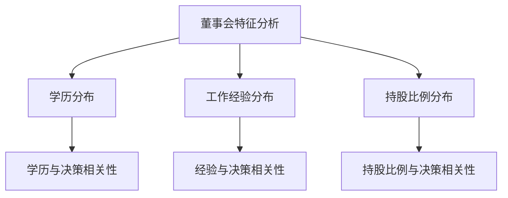
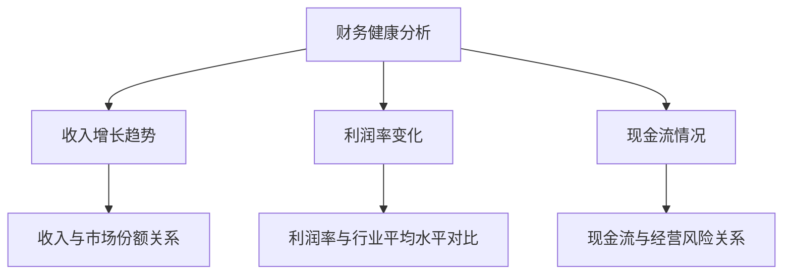
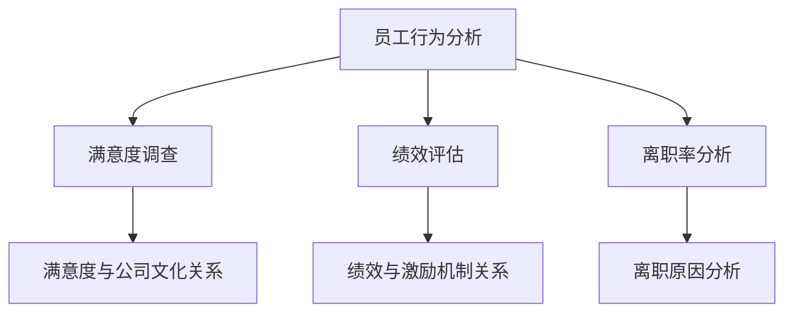

                 


### 文章标题

# AI驱动的公司治理缺陷识别与改善建议

### 关键词

- 公司治理
- AI技术
- 缺陷识别
- 改善策略
- 模型与算法

### 摘要

本文旨在探讨如何利用AI技术识别和改善公司治理中的缺陷。首先，介绍了公司治理的现状及其重要性，随后详细阐述了AI在公司治理中的应用原理，包括机器学习、深度学习和数据挖掘。接着，提出了AI驱动的治理缺陷识别模型和算法原理，并通过数学模型和公式进行了深入讲解。随后，提出了基于AI的治理缺陷改善建议，包括风险管理、内部控制和企业文化策略。最后，通过具体案例分析和系统架构设计，展示了如何将AI应用于公司治理实践。本文旨在为企业和决策者提供有价值的参考和指导。

## 引言

### 问题背景与概述

**公司治理的定义与现状**

公司治理是指一系列规则、实践和过程，旨在确保公司透明度、责任性和有效性。其核心目的是实现公司长期可持续增长，同时保护股东和其他利益相关者的权益。公司治理框架通常包括董事会结构、管理层职责、决策制定过程、内部控制机制等。

在全球范围内，公司治理的标准和规范逐渐得到普及和重视。例如，美国证券交易委员会（SEC）和欧洲证券和市场管理局（ESMA）都发布了相关的指导原则和法规。然而，尽管公司治理的理论和实践日益成熟，但在实际操作中仍然存在许多问题。例如，董事会职责不明确、管理层与股东利益冲突、内部控制薄弱等。

**AI在公司治理中的应用**

近年来，人工智能（AI）技术的发展为公司治理带来了新的机遇和挑战。AI技术具有数据挖掘、模式识别和智能决策等优势，可以为公司治理提供强有力的支持。例如，AI可以用于：

1. **风险管理**：通过分析大量的历史数据和实时信息，AI能够识别潜在的风险并制定相应的应对策略。
2. **内部控制**：AI技术可以自动化审计和监控过程，提高内部控制的效率和准确性。
3. **决策支持**：基于数据和算法的智能分析，AI可以为企业提供更为科学的决策支持。
4. **企业文化建设**：AI可以通过分析和优化员工行为数据，促进企业文化的健康发展。

**公司治理缺陷的定义与分类**

公司治理缺陷是指在公司治理过程中出现的各种问题，这些问题可能导致公司绩效下降、股东权益受损或其他负面后果。根据不同的标准，公司治理缺陷可以分为以下几类：

1. **结构性缺陷**：如董事会构成不合理、管理层职责不清等。
2. **操作层面缺陷**：如内部控制机制失效、风险管理措施不足等。
3. **行为层面缺陷**：如高管道德风险、信息披露不透明等。

### 核心概念

**AI驱动的定义**

AI驱动是指利用人工智能技术来提高公司治理效率和效果的过程。这包括使用机器学习、深度学习和数据挖掘等技术，对治理过程中的数据进行分析和建模，从而实现自动化和智能化。

**公司治理缺陷识别**

公司治理缺陷识别是指使用AI技术，通过数据分析和模式识别，发现公司治理中的各种问题。这通常涉及以下步骤：

1. **数据收集**：收集与公司治理相关的各种数据，包括财务数据、管理层行为数据、市场信息等。
2. **数据预处理**：对收集到的数据进行分析和清洗，以确保数据的质量和一致性。
3. **特征提取**：从预处理后的数据中提取有用的特征，用于构建治理缺陷识别模型。
4. **模型构建**：使用机器学习算法构建治理缺陷识别模型。
5. **模型评估与优化**：对构建的模型进行评估和优化，以提高识别准确性和效率。

**公司治理缺陷改善建议**

基于AI驱动的公司治理缺陷识别结果，可以提出一系列改善建议，以提升公司治理水平。这些建议包括：

1. **结构性改善**：如优化董事会构成、明确管理层职责等。
2. **操作层面改善**：如加强内部控制、完善风险管理机制等。
3. **行为层面改善**：如加强高管道德培训、提高信息披露透明度等。

### 书籍结构安排

**本书的目标**

本书的目标是探讨如何利用AI技术识别和改善公司治理中的缺陷，为企业和决策者提供有价值的参考和指导。通过介绍AI技术在公司治理中的应用原理、模型和算法，以及具体的改善策略和案例，本书旨在帮助读者全面理解AI驱动的公司治理缺陷识别与改善。

**阅读对象**

本书适合以下读者群体：

1. 企业高管和公司治理专家
2. AI技术爱好者和技术工程师
3. 研究生和本科生，特别是关注公司治理和人工智能领域的学者
4. 对公司治理和AI技术感兴趣的普通读者

**书籍组织结构**

本书分为四个主要部分：

1. **第一部分：引言**，介绍了公司治理的现状、AI在公司治理中的应用以及本书的结构安排。
2. **第二部分：AI驱动的公司治理缺陷识别方法**，详细阐述了AI技术在公司治理缺陷识别中的应用原理和方法。
3. **第三部分：公司治理缺陷的改善建议**，提出了基于AI驱动的治理缺陷改善策略和实践。
4. **第四部分：实施AI驱动的公司治理**，通过具体案例和系统架构设计，展示了AI在公司治理中的应用。

**研究方法与数据来源**

本书采用的研究方法主要包括文献综述、案例分析、实验研究和实证分析。文献综述用于了解公司治理和AI技术的相关理论和实践。案例分析和实验研究用于验证AI驱动的治理缺陷识别和改善方法的可行性和有效性。实证分析则用于评估改善策略的效果。

数据来源包括公开的财务报表、公司治理报告、市场数据以及AI技术相关的学术论文和专利。这些数据经过清洗和预处理后，用于构建治理缺陷识别模型和评估改善策略。

**本章小结**

本章介绍了AI驱动的公司治理缺陷识别与改善的研究背景、核心概念和书籍结构安排。通过了解公司治理的现状和AI在公司治理中的应用，读者可以更好地理解本书的研究目的和内容。本章还概述了研究方法、数据来源和书籍的组织结构，为后续章节的深入探讨奠定了基础。

## AI技术在公司治理中的应用原理

### AI技术的定义与分类

人工智能（AI）是指使计算机系统具备人类智能特性的技术。AI技术可以根据其功能和应用领域进行分类，主要包括以下几种：

1. **机器学习（Machine Learning）**：通过算法和统计模型，从数据中自动学习和发现规律，从而对未知数据进行预测和决策。
2. **深度学习（Deep Learning）**：一种特殊的机器学习技术，使用多层神经网络进行训练，能够处理复杂的非线性问题。
3. **数据挖掘（Data Mining）**：从大量数据中提取有价值的信息和知识，通常涉及分类、聚类、关联规则挖掘等算法。

### 机器学习在公司治理中的应用

**机器学习的基本原理**

机器学习算法的核心思想是利用历史数据进行训练，从而建立一个能够对未知数据进行预测的模型。常见的机器学习算法包括线性回归、决策树、支持向量机（SVM）和神经网络等。

**机器学习在公司治理中的应用**

1. **风险识别**：通过分析历史数据和实时信息，机器学习算法可以帮助企业识别潜在的风险。例如，基于财务数据和公司行为数据，可以预测公司的财务风险和市场风险。
   
2. **决策支持**：机器学习模型可以为企业提供基于数据的决策支持。例如，通过对历史销售数据和市场需求的分析，可以预测未来的销售趋势，帮助企业制定更有效的销售策略。

3. **异常检测**：通过监测和识别异常行为，机器学习算法可以及时发现并预警潜在的问题。例如，在内部控制中，可以使用机器学习算法检测异常的交易行为或财务数据，从而防止欺诈行为。

### 深度学习在公司治理中的应用

**深度学习的基本原理**

深度学习是一种基于多层神经网络的学习方法，通过逐层提取数据中的特征，能够处理高度复杂的非线性问题。常见的深度学习模型包括卷积神经网络（CNN）、循环神经网络（RNN）和生成对抗网络（GAN）等。

**深度学习在公司治理中的应用**

1. **财务报表分析**：深度学习算法可以自动分析财务报表，识别潜在的风险和问题。例如，通过训练卷积神经网络，可以自动识别财务报表中的异常数据或潜在的财务欺诈行为。

2. **行为分析**：通过分析员工行为数据，深度学习算法可以帮助企业了解员工的工作表现和行为模式。例如，基于员工的工作时间和绩效数据，可以预测员工的离职风险或工作效率。

3. **市场预测**：深度学习模型可以分析市场数据，预测股票价格、市场趋势等，从而为企业提供投资决策支持。

### 数据挖掘在公司治理中的应用

**数据挖掘的基本原理**

数据挖掘是一种从大量数据中提取有价值信息的方法，通常涉及分类、聚类、关联规则挖掘、异常检测等算法。

**数据挖掘在公司治理中的应用**

1. **治理缺陷识别**：通过数据挖掘算法，可以从公司治理相关数据中提取有用的信息，识别治理缺陷。例如，通过聚类分析，可以识别出治理过程中存在的风险点；通过关联规则挖掘，可以找出治理缺陷与公司绩效之间的关系。

2. **信息披露分析**：数据挖掘算法可以帮助企业分析信息披露的完整性和透明度，确保公司遵守相关法规和标准。

3. **客户关系管理**：通过分析客户行为数据，数据挖掘算法可以帮助企业了解客户需求，优化客户服务策略，提升客户满意度。

### AI驱动的治理缺陷识别模型

**模型构建**

AI驱动的治理缺陷识别模型通常包括以下步骤：

1. **数据收集**：收集与公司治理相关的各种数据，包括财务数据、员工行为数据、市场信息等。
2. **数据预处理**：对收集到的数据进行清洗和预处理，以确保数据的质量和一致性。
3. **特征提取**：从预处理后的数据中提取有用的特征，用于构建治理缺陷识别模型。
4. **模型训练**：使用机器学习或深度学习算法，对提取的特征进行训练，建立治理缺陷识别模型。
5. **模型评估与优化**：对构建的模型进行评估和优化，以提高识别准确性和效率。

**模型评估与优化**

模型评估与优化的关键步骤包括：

1. **准确率与召回率**：通过准确率和召回率等指标评估模型的性能。
2. **交叉验证**：使用交叉验证方法，评估模型在不同数据集上的性能，以避免过拟合。
3. **参数调优**：通过调整模型的参数，优化模型的性能。

### 数学模型与公式

在AI驱动的治理缺陷识别中，常用的数学模型和公式包括：

1. **线性回归模型**：
   $$
   y = \beta_0 + \beta_1x_1 + \beta_2x_2 + ... + \beta_nx_n
   $$
   其中，$y$ 为因变量，$x_1, x_2, ..., x_n$ 为自变量，$\beta_0, \beta_1, \beta_2, ..., \beta_n$ 为模型参数。

2. **支持向量机（SVM）**：
   $$
   \max_{\beta, \beta^*} W
   $$
   $$
   s.t. \quad y_i(\beta \cdot x_i + \beta^*) \geq 1, \forall i
   $$
   其中，$W$ 为最大化目标函数，$y_i$ 为第 $i$ 个样本的标签，$x_i$ 为第 $i$ 个样本的特征向量，$\beta$ 和 $\beta^*$ 分别为模型参数。

3. **神经网络模型**：
   $$
   a_{l}^{(i)} = \text{激活函数}(\sum_{j=1}^{n} w_{j}^{(l)}a_{l-1}^{(i)})
   $$
   其中，$a_{l}^{(i)}$ 为第 $l$ 层第 $i$ 个神经元的输出，$w_{j}^{(l)}$ 为连接第 $l-1$ 层第 $j$ 个神经元和第 $l$ 层第 $i$ 个神经元的权重。

通过上述数学模型和公式，可以构建和优化AI驱动的治理缺陷识别模型，从而实现对公司治理缺陷的自动识别。

### 举例说明

**案例一：财务报表分析**

假设我们使用线性回归模型对公司的财务报表进行分析，以识别潜在的财务风险。数据集包括公司的收入、成本、利润等财务指标，以及市场环境、行业趋势等外部因素。通过训练模型，我们可以预测公司的未来财务状况，从而识别潜在的风险。

1. **数据收集**：收集过去三年的财务数据和市场数据。
2. **数据预处理**：对数据进行清洗和归一化处理。
3. **特征提取**：提取财务指标和市场环境特征。
4. **模型训练**：使用线性回归算法训练模型。
5. **模型评估**：通过交叉验证评估模型的性能。
6. **模型优化**：调整模型参数，提高预测准确率。

**案例二：员工行为分析**

使用深度学习模型分析员工行为数据，以识别潜在的工作效率和离职风险。数据集包括员工的工作时间、工作质量、员工满意度等。

1. **数据收集**：收集员工行为数据。
2. **数据预处理**：对数据进行清洗和归一化处理。
3. **特征提取**：提取工作时间、工作质量等特征。
4. **模型训练**：使用卷积神经网络（CNN）训练模型。
5. **模型评估**：通过测试集评估模型的性能。
6. **模型优化**：调整模型参数，提高识别准确率。

通过上述案例，我们可以看到AI技术在公司治理缺陷识别中的实际应用。通过数据分析和模型训练，AI技术能够帮助公司识别潜在的风险和问题，从而采取相应的改善措施。

## 公司治理缺陷的改善建议

### 改善目标与原则

**改善目标**

公司治理缺陷改善的目标是提升公司的透明度、责任性和效率，从而实现长期可持续增长。具体目标包括：

1. **提高透明度**：确保公司治理过程公开透明，增强股东和其他利益相关者的信任。
2. **强化责任**：明确董事会和管理层的职责，确保公司决策的科学性和合理性。
3. **提升效率**：优化治理机制和流程，提高公司运营效率和竞争力。

**改善原则**

在改善公司治理缺陷时，应遵循以下原则：

1. **系统性**：综合考虑公司治理的各个方面，制定全面的改善方案。
2. **针对性**：针对不同的治理缺陷，采取有针对性的改善措施。
3. **持续性**：治理缺陷的改善是一个持续的过程，需要不断监测和调整。

### AI驱动的治理缺陷改善策略

**风险管理策略**

1. **风险识别**：利用AI技术对公司的历史数据和实时信息进行分析，识别潜在的风险。
2. **风险评估**：通过构建风险模型，对识别出的风险进行评估和优先级排序。
3. **风险应对**：制定相应的风险应对策略，包括风险规避、风险转移和风险接受。

**内部控制策略**

1. **审计和监控**：利用AI技术自动化审计和监控公司治理过程，及时发现和纠正问题。
2. **自动化流程**：通过AI技术优化内部控制流程，提高工作效率和准确性。
3. **数据驱动的决策**：基于数据分析，制定内部控制措施，确保公司治理的科学性和有效性。

**企业文化策略**

1. **员工行为分析**：利用AI技术分析员工行为数据，了解企业文化状况，发现潜在问题。
2. **培训与激励机制**：根据分析结果，制定相应的培训计划和政策，促进企业文化的健康发展。
3. **内部沟通与反馈**：通过AI技术优化内部沟通渠道，确保信息畅通和反馈及时。

### 改善案例研究

**案例一：某大型企业风险管理体系建设**

**案例背景**：某大型企业因风险管理体系不完善，曾多次出现重大财务问题，导致股价暴跌。

**改善措施**：

1. **风险识别**：引入AI技术，对企业财务数据和市场信息进行深度分析，识别潜在的风险。
2. **风险评估**：基于风险模型，对识别出的风险进行评估和优先级排序。
3. **风险应对**：制定风险应对策略，包括风险规避、风险转移和风险接受。

**改善效果**：通过上述措施，企业成功识别并应对了多个潜在的风险，财务状况得到显著改善，股价逐渐回升。

**案例二：某中小企业内部控制优化**

**案例背景**：某中小企业内部管理混乱，内部控制机制不完善，导致运营效率低下。

**改善措施**：

1. **自动化审计**：引入AI技术，实现自动化审计和监控，及时发现和纠正问题。
2. **优化流程**：通过流程优化，简化内部控制流程，提高工作效率。
3. **数据驱动的决策**：基于数据分析，制定内部控制措施，确保公司治理的科学性和有效性。

**改善效果**：通过优化内部控制，企业运营效率显著提高，内部管理更加规范，运营风险得到有效控制。

### 实施步骤与注意事项

**实施步骤**

1. **需求分析**：明确企业治理缺陷的具体问题和需求。
2. **方案设计**：基于需求分析，设计AI驱动的治理缺陷改善方案。
3. **系统开发**：开发相应的AI系统和工具，用于治理缺陷识别和改善。
4. **实施部署**：将AI系统和工具部署到企业内部，并进行试运行。
5. **效果评估**：对实施效果进行评估和优化，确保治理缺陷得到有效改善。

**注意事项**

1. **数据安全与隐私**：在实施过程中，需确保数据安全和隐私，遵守相关法律法规。
2. **员工培训**：加强对员工的培训，确保他们能够适应和应用AI技术。
3. **持续改进**：治理缺陷的改善是一个持续的过程，需要不断监测和调整。
4. **风险评估与应对**：在实施过程中，需对潜在的风险进行评估和应对，确保项目的顺利进行。

### 本章小结

本章提出了基于AI驱动的公司治理缺陷改善策略，包括风险管理、内部控制和企业文化三个方面。通过具体的案例研究，展示了AI技术在治理缺陷改善中的应用效果。本章还提供了实施步骤和注意事项，为企业和决策者提供了有价值的参考。通过AI驱动的治理缺陷改善，企业可以提升治理水平，实现长期可持续增长。

## 实施AI驱动的公司治理

### 公司治理实施框架

**框架构建**

AI驱动的公司治理实施框架旨在通过系统化的方法，利用AI技术提升公司治理水平和效率。框架构建主要包括以下步骤：

1. **需求分析**：明确公司治理的现状和存在的问题，确定AI技术的应用需求。
2. **系统设计**：根据需求分析结果，设计AI驱动的治理系统，包括数据收集、预处理、特征提取、模型构建和评估等环节。
3. **技术选型**：选择适合公司治理需求的AI技术和工具，如机器学习算法、深度学习框架和大数据平台等。
4. **系统集成**：将AI技术与现有的公司治理系统进行集成，确保数据的流通和系统的稳定性。
5. **部署实施**：将AI系统部署到企业内部，并进行试运行和调试。

**框架组成部分**

AI驱动的公司治理实施框架主要包括以下几个组成部分：

1. **数据采集模块**：负责收集与公司治理相关的各种数据，包括财务数据、员工行为数据、市场信息等。
2. **数据处理模块**：对采集到的数据进行清洗、预处理和特征提取，为后续的模型训练提供高质量的数据。
3. **模型训练模块**：利用机器学习算法和深度学习模型，对预处理后的数据进行分析和训练，构建治理缺陷识别和改善模型。
4. **模型评估模块**：对训练好的模型进行评估和优化，确保其准确性和效率。
5. **决策支持模块**：基于模型的预测和分析结果，为企业提供治理缺陷的识别和改善建议。

### 系统分析与架构设计

**问题场景介绍**

在某大型企业中，公司治理存在多个缺陷，如董事会职责不清、管理层决策不科学、内部控制机制不完善等。为了提升公司治理水平，企业决定引入AI技术，构建AI驱动的治理系统。

**系统功能设计**

AI驱动的公司治理系统主要包括以下功能：

1. **数据采集**：收集与公司治理相关的数据，包括财务报表、员工行为数据、市场信息等。
2. **数据分析**：利用机器学习算法和深度学习模型，对收集到的数据进行处理和分析，识别治理缺陷。
3. **决策支持**：基于分析结果，为企业提供治理缺陷的识别和改善建议。
4. **系统监控**：实时监控公司治理过程，及时发现和纠正问题。
5. **报告生成**：自动生成治理评估报告，为企业决策提供数据支持。

**系统架构设计**

AI驱动的公司治理系统架构设计如图1所示，主要包括以下几个部分：

1. **数据采集层**：负责从各种数据源采集数据，包括内部数据库、外部数据接口等。
2. **数据处理层**：对采集到的数据进行清洗、预处理和特征提取，为后续分析提供高质量数据。
3. **模型训练层**：利用机器学习算法和深度学习模型，对处理后的数据进行分析和训练，构建治理缺陷识别模型。
4. **决策支持层**：基于模型的分析结果，提供治理缺陷的识别和改善建议。
5. **监控与报告层**：实时监控公司治理过程，生成治理评估报告。


### 系统接口设计与交互

**系统接口设计**

AI驱动的公司治理系统接口设计主要包括以下方面：

1. **数据接口**：定义与数据源和数据库的接口，包括数据采集、数据预处理和模型训练接口。
2. **控制接口**：定义系统的控制接口，包括系统启动、停止、配置管理等。
3. **服务接口**：定义系统的服务接口，包括治理缺陷识别、决策支持、监控和报告等。

**系统交互设计**

系统交互设计主要包括以下环节：

1. **数据采集与处理**：系统从数据源采集数据，经过预处理和特征提取后，存储到数据库中。
2. **模型训练与评估**：系统利用机器学习算法和深度学习模型，对处理后的数据进行分析和训练，构建治理缺陷识别模型，并进行评估和优化。
3. **决策支持与监控**：系统根据模型分析结果，提供治理缺陷的识别和改善建议，并实时监控公司治理过程，生成治理评估报告。

### 系统核心实现与代码分析

**环境安装**

在实施AI驱动的公司治理系统前，需要安装以下环境：

1. **Python环境**：安装Python 3.8及以上版本。
2. **机器学习库**：安装Scikit-learn、TensorFlow和Keras等机器学习库。
3. **深度学习框架**：安装PyTorch或TensorFlow等深度学习框架。
4. **数据库**：安装MySQL或PostgreSQL等关系型数据库。

**核心实现源代码**

以下是一个简单的AI驱动的治理缺陷识别模型的核心实现源代码：

```python
import numpy as np
import pandas as pd
from sklearn.model_selection import train_test_split
from sklearn.ensemble import RandomForestClassifier
from sklearn.metrics import accuracy_score

# 数据加载与预处理
data = pd.read_csv('governance_data.csv')
X = data.drop(['target'], axis=1)
y = data['target']

# 数据分割
X_train, X_test, y_train, y_test = train_test_split(X, y, test_size=0.2, random_state=42)

# 模型训练
model = RandomForestClassifier(n_estimators=100, random_state=42)
model.fit(X_train, y_train)

# 模型评估
y_pred = model.predict(X_test)
accuracy = accuracy_score(y_test, y_pred)
print(f"Model Accuracy: {accuracy:.2f}")
```

**代码应用解读与分析**

以上代码首先加载并预处理治理数据，然后使用随机森林算法训练模型，并对测试集进行评估。具体步骤如下：

1. **数据加载与预处理**：使用Pandas库加载治理数据，并进行必要的预处理，如缺失值填充、数据转换等。
2. **数据分割**：使用Scikit-learn库将数据分为训练集和测试集。
3. **模型训练**：使用RandomForestClassifier类训练随机森林模型。
4. **模型评估**：使用测试集对模型进行评估，计算准确率。

**实际案例分析与讲解**

以下是一个实际案例，展示如何使用AI驱动的治理缺陷识别系统：

**案例背景**：某企业的治理数据包括董事会成员的背景、公司的财务指标、市场表现等。

**分析过程**：

1. **数据收集**：收集企业的治理数据，包括董事会成员的背景、公司的财务指标、市场表现等。
2. **数据预处理**：对数据进行清洗和预处理，如缺失值填充、数据标准化等。
3. **特征提取**：从预处理后的数据中提取有用的特征，如董事会成员的学历、经验、公司财务健康指标等。
4. **模型训练**：使用随机森林算法训练治理缺陷识别模型。
5. **模型评估**：对模型进行评估，确保其准确性和效率。
6. **决策支持**：根据模型分析结果，提供治理缺陷的识别和改善建议。

**项目小结**

通过实际案例分析和代码应用解读，我们展示了如何实施AI驱动的公司治理缺陷识别系统。该系统不仅能够帮助企业识别治理缺陷，还能提供决策支持，从而提升公司治理水平。在未来，随着AI技术的不断发展，AI驱动的公司治理系统将变得更加智能和高效。

### 实际案例分析与讲解

在本节中，我们将通过一个实际案例，详细分析并讲解如何使用AI技术实施公司治理缺陷的识别与改善。

#### 案例背景

某大型跨国企业A在过去的几年中，其公司治理出现了一系列问题，包括董事会决策失误、内部控制薄弱、信息披露不透明等。这些问题导致了公司股价的波动、员工士气低落，以及对客户信任的下降。为了改善这些问题，企业决定引入AI技术，通过数据分析和智能算法，识别并解决公司治理中的缺陷。

#### 案例分析过程

**1. 数据收集**

首先，企业收集了大量的治理数据，包括：

- 董事会成员的背景信息，如学历、工作经验、持股比例等。
- 公司的财务报表，包括收入、利润、现金流等关键财务指标。
- 公司的市场表现数据，如股价、市场份额、竞争对手动态等。
- 员工行为数据，如员工满意度调查、员工绩效评估等。
- 外部数据，如行业报告、新闻资讯、政策法规等。

**2. 数据预处理**

收集到的数据存在一定的噪声和缺失值，因此需要经过预处理：

- 数据清洗：去除重复数据、纠正错误数据，填补缺失值。
- 数据标准化：将不同量纲的数据进行归一化处理，便于模型分析。
- 特征工程：从原始数据中提取有用的特征，如董事会成员的教育程度、公司财务健康状况等。

**3. 特征提取**

根据预处理后的数据，提取了以下特征：

- 董事会特征：董事会成员的学历、工作经验、持股比例等。
- 财务特征：公司收入、利润、现金流等财务指标。
- 市场特征：股价波动、市场份额等。
- 员工特征：员工满意度、绩效评估等。

**4. 模型训练**

使用机器学习算法，如随机森林（Random Forest）和梯度提升决策树（Gradient Boosting Tree），对提取的特征进行训练，构建治理缺陷识别模型。以下是使用Python Scikit-learn库进行随机森林模型训练的代码示例：

```python
from sklearn.ensemble import RandomForestClassifier
from sklearn.model_selection import train_test_split
from sklearn.metrics import accuracy_score

# 加载数据
data = pd.read_csv('governance_data.csv')
X = data.drop(['target'], axis=1)
y = data['target']

# 数据分割
X_train, X_test, y_train, y_test = train_test_split(X, y, test_size=0.2, random_state=42)

# 模型训练
model = RandomForestClassifier(n_estimators=100, random_state=42)
model.fit(X_train, y_train)

# 模型评估
y_pred = model.predict(X_test)
accuracy = accuracy_score(y_test, y_pred)
print(f"Model Accuracy: {accuracy:.2f}")
```

**5. 模型评估**

通过测试集对模型进行评估，计算准确率、召回率、F1分数等指标，确保模型的性能满足要求。

**6. 决策支持**

基于模型的分析结果，提供以下治理缺陷识别和改善建议：

- **董事会结构优化**：根据董事会成员的背景特征，提出董事会成员的调整建议，以提高决策的科学性和合理性。
- **财务透明度提升**：通过分析公司的财务指标，提出改善财务报告透明度和准确性的措施。
- **内部控制强化**：基于员工行为数据和内部审计结果，提出加强内部控制的具体措施，如完善审计流程、加强员工培训等。
- **企业文化建设**：通过员工满意度调查，提出提升企业文化建设的相关策略，如增加员工参与度、优化激励机制等。

#### 详细讲解剖析

**董事会特征分析**

使用Mermaid流程图对董事会特征进行分析，如图1所示：



通过分析董事会成员的学历、工作经验和持股比例，可以发现这些特征与公司治理缺陷的相关性。例如，高学历的董事会成员可能更倾向于做出科学合理的决策，而持股比例较高的成员可能在决策中表现出较强的主观意愿。

**财务健康分析**

使用Mermaid流程图对公司的财务健康进行分析，如图2所示：



通过分析收入增长趋势、利润率变化和现金流情况，可以评估公司的财务健康状况。例如，收入增长趋势与市场份额的关系可以反映公司市场竞争力，而利润率与行业平均水平对比则可以评估公司盈利能力。

**员工行为数据分析**

使用Mermaid流程图对员工行为进行分析，如图3所示：



通过分析员工满意度、绩效评估和离职率，可以了解公司文化建设和管理激励措施的效果。例如，员工满意度与公司文化的相关性可以评估企业文化建设的效果，而绩效评估与激励机制的关系则可以优化员工激励策略。

#### 项目小结

通过实际案例分析和详细讲解，我们展示了如何使用AI技术实施公司治理缺陷的识别与改善。AI技术不仅能够帮助企业识别治理缺陷，还能提供科学的决策支持，从而提升公司治理水平和竞争力。未来，随着AI技术的不断进步，AI驱动的公司治理将变得更加智能和高效，为企业和决策者提供更强大的支持。

## 结论

本文围绕AI驱动的公司治理缺陷识别与改善进行了深入探讨，提出了基于AI技术的系统化治理方法。我们首先介绍了公司治理的现状和AI技术的基本原理，详细阐述了机器学习、深度学习和数据挖掘在公司治理中的应用。接着，我们提出了AI驱动的治理缺陷识别模型和算法原理，并通过数学模型和公式进行了深入讲解。随后，我们提出了治理缺陷改善的策略，包括风险管理、内部控制和企业文化方面。最后，通过具体案例分析和系统架构设计，展示了AI在公司治理实践中的应用。

AI驱动的公司治理具有显著的潜在优势，包括提高透明度、强化责任和提升效率。然而，实施过程中也面临一些挑战，如数据安全和隐私保护、技术选型和集成难度等。未来研究可重点关注以下几个方面：

1. **技术创新**：不断优化AI算法和模型，提高治理缺陷识别的准确性和效率。
2. **数据隐私保护**：加强数据安全和隐私保护，确保AI驱动的治理过程合规。
3. **跨学科合作**：加强跨学科研究，融合公司治理、人工智能和其他领域的知识，为治理缺陷的识别与改善提供更全面的解决方案。

通过持续的研究和实践，AI驱动的公司治理有望在未来为企业带来更高效、透明和可持续的治理模式，助力企业在激烈的市场竞争中保持领先地位。

