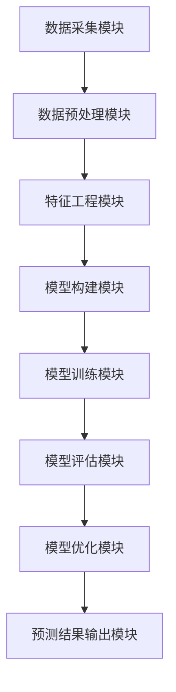
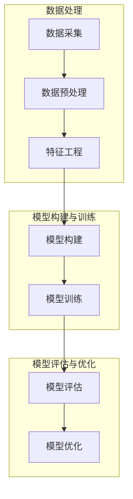
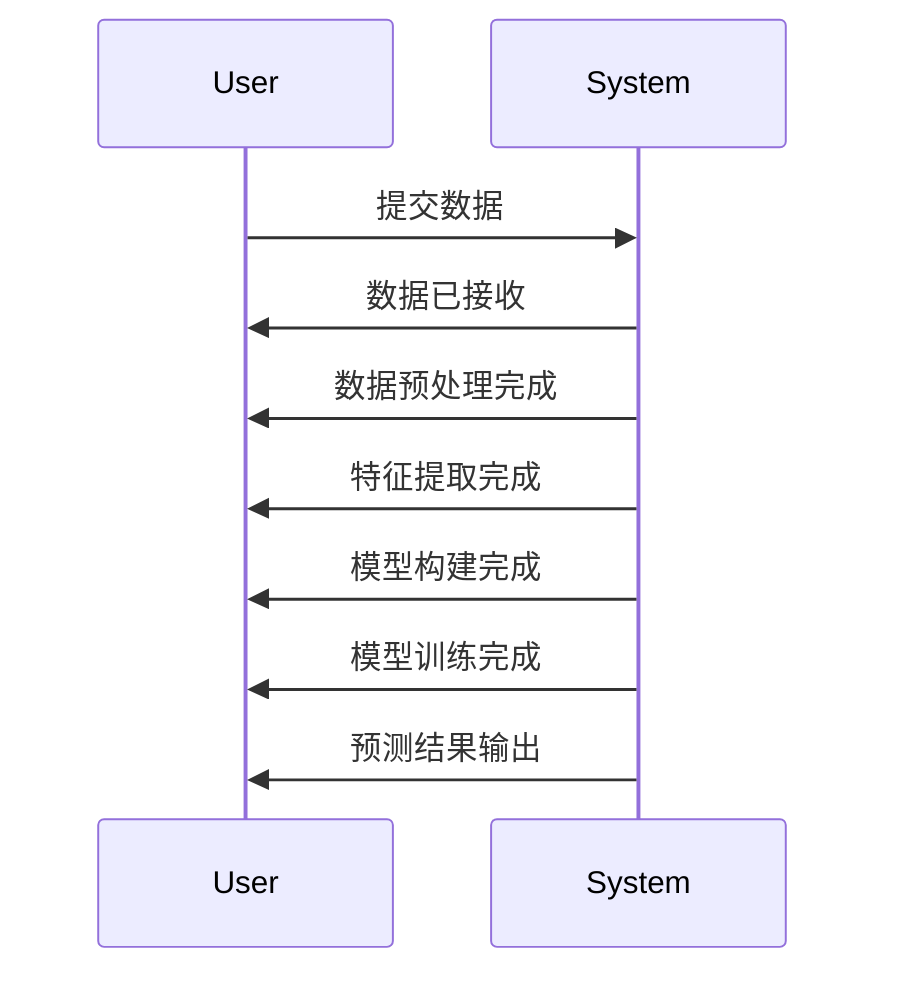
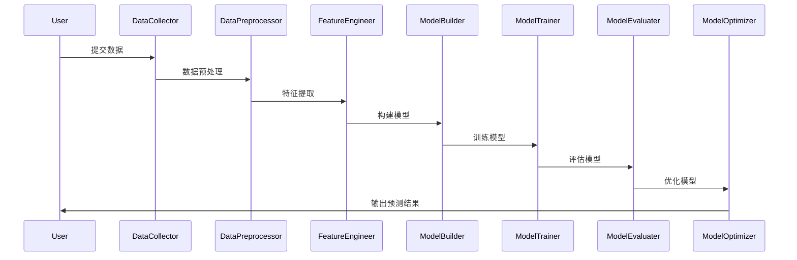

                 


### AI驱动的公司治理评分预测模型：从概念到实战

#### 引言

随着人工智能（AI）技术的迅猛发展，其在各个领域的应用也越来越广泛。公司治理作为企业管理的重要组成部分，也开始借助AI技术来提高治理水平。本文将围绕AI驱动的公司治理评分预测模型，进行深入探讨。我们将从概念解析、核心原理讲解、系统分析与架构设计，到项目实战和最佳实践，逐步展开讨论。

#### 1. 背景介绍与核心概念

**1.1 问题背景**

公司治理是指通过一套制度安排和决策过程，来保证企业运营的合法、透明和高效。随着全球经济的发展和市场竞争的加剧，公司治理评分成为一个衡量企业治理水平的重要指标。然而，传统的评分方法往往依赖于主观判断和数据的不完整性，难以提供准确的评估。

**1.2 问题描述**

公司治理评分预测的核心问题是：如何利用AI技术，构建一个能够客观、准确预测公司治理评分的模型？这一模型需要处理大量非结构化数据，如企业财务报表、高管言论、社交媒体舆情等，并从中提取关键信息。

**1.3 问题解决**

AI驱动的公司治理评分预测模型旨在通过以下步骤解决上述问题：
- 数据采集与预处理：收集企业相关的多种数据源，并进行数据清洗和预处理。
- 特征工程：从原始数据中提取出对治理评分有显著影响的特征。
- 模型构建与训练：选择合适的机器学习算法，构建和训练预测模型。
- 模型评估与优化：对模型进行评估和优化，以提高预测准确性。

**1.4 边界与外延**

公司治理评分预测模型的应用范围广泛，但需要考虑以下边界条件：
- 数据质量：模型性能高度依赖数据质量，因此需要确保数据来源的可靠性和完整性。
- 行业差异：不同行业的治理特点不同，模型需要具备一定的泛化能力。
- 法律法规：模型需要符合相关法律法规的要求，确保预测结果的合法性。

**1.5 概念结构与核心要素组成**

AI驱动的公司治理评分预测模型由以下几个核心要素组成：
- 数据采集：企业财务报表、社交媒体数据、新闻报道等。
- 特征工程：企业规模、盈利能力、负债水平、高管素质等。
- 模型构建：机器学习算法，如决策树、随机森林、神经网络等。
- 模型训练与评估：通过交叉验证和测试集，评估模型性能。

#### 2. 核心概念与联系

**2.1 AI基础理论**

AI的基础理论包括机器学习、深度学习、自然语言处理等。其中，机器学习是AI的核心技术，它通过训练模型，使计算机能够从数据中自动学习规律和模式。深度学习是机器学习的进一步发展，通过多层神经网络，实现更复杂的特征提取和模式识别。

**2.2 概念属性特征对比表格**

以下是一个简化的概念属性特征对比表格，展示了不同AI算法在特征提取和预测能力方面的对比：

| 算法 | 特点 | 适用场景 |
| --- | --- | --- |
| 决策树 | 直观易懂、易于解释 | 数据量较小、特征较少 |
| 随机森林 | 防止过拟合、提高泛化能力 | 数据量较大、特征较多 |
| 神经网络 | 强大特征提取能力、高度非线性 | 数据量较大、特征较多、非线性关系明显 |

**2.3 ER实体关系图架构**

ER实体关系图用于描述模型中的实体及其关系。在公司治理评分预测模型中，主要实体包括企业、特征、评分和预测结果。以下是一个简化的ER实体关系图：

```mermaid
erDiagram
  企业 ||--|{ 特征 }|
  企业 ||--|{ 评分 }|
  企业 ||--|{ 预测结果 }|
  特征 ||--|{ 预测模型 }|
```

#### 3. 算法原理讲解

**3.1 模型原理讲解**

AI驱动的公司治理评分预测模型的算法原理主要包括以下几个步骤：

1. 数据采集与预处理：从多种数据源收集数据，如企业财务报表、社交媒体数据、新闻报道等，并进行数据清洗和预处理，以去除噪声和异常值。
2. 特征工程：根据业务需求，从原始数据中提取出对治理评分有显著影响的特征，如企业规模、盈利能力、负债水平、高管素质等。
3. 模型构建与训练：选择合适的机器学习算法，如决策树、随机森林、神经网络等，构建预测模型，并使用训练数据集进行训练。
4. 模型评估与优化：使用测试数据集对模型进行评估，通过交叉验证和性能指标（如准确率、召回率、F1值等）来衡量模型性能，并根据评估结果对模型进行优化。

以下是一个简化的算法mermaid流程图：


**3.2 数学模型和公式**

公司治理评分预测的数学模型通常采用回归分析方法，其基本公式为：

$$
y = \theta_0 + \theta_1x_1 + \theta_2x_2 + ... + \theta_nx_n
$$

其中，$y$ 表示公司治理评分，$x_1, x_2, ..., x_n$ 表示影响评分的特征，$\theta_0, \theta_1, ..., \theta_n$ 表示模型的参数，通过最小化损失函数来求解这些参数。

**3.3 举例说明**

假设我们使用随机森林算法构建一个公司治理评分预测模型，以下是一个简化的Python代码示例：

```python
import pandas as pd
from sklearn.ensemble import RandomForestRegressor
from sklearn.model_selection import train_test_split
from sklearn.metrics import mean_squared_error

# 数据加载与预处理
data = pd.read_csv('company_data.csv')
X = data.drop('governance_score', axis=1)
y = data['governance_score']

# 数据集划分
X_train, X_test, y_train, y_test = train_test_split(X, y, test_size=0.2, random_state=42)

# 模型构建与训练
model = RandomForestRegressor(n_estimators=100, random_state=42)
model.fit(X_train, y_train)

# 模型评估
y_pred = model.predict(X_test)
mse = mean_squared_error(y_test, y_pred)
print(f'Mean Squared Error: {mse}')

# 模型优化
# 根据评估结果，可以调整模型参数或特征选择策略，以提高预测准确性
```

#### 4. 系统分析与架构设计

**4.1 问题场景介绍**

公司治理评分预测系统旨在为企业提供一个客观、准确的治理评分，以帮助企业识别潜在的风险和改进治理结构。系统的主要用户包括企业高层管理人员、审计机构、投资者等。

**4.2 项目介绍**

本项目旨在构建一个基于AI技术的公司治理评分预测系统，系统架构如图所示：



**4.3 系统功能设计**

**领域模型（mermaid类图）**

```mermaid
classDiagram
    Class1 <|-- Class2
    Class1 <|-- Class3
    Class4 {is-a} Class1
    Class5 {has-a} Class1
```

**系统架构设计（mermaid架构图）**



**系统接口设计**

系统接口设计包括数据接口、模型接口和预测接口。以下是一个简化的接口设计：



**系统交互（mermaid序列图）**



#### 5. 项目实战

**5.1 环境安装与配置**

为了保证项目的顺利进行，需要安装以下软件和工具：

- Python 3.8及以上版本
- NumPy、Pandas、Scikit-learn等Python库
- Jupyter Notebook或PyCharm

安装步骤如下：

```shell
pip install numpy pandas scikit-learn
```

**5.2 系统核心实现**

以下是一个简化的系统核心实现示例，包括数据预处理、特征工程、模型构建、模型训练和模型评估：

```python
import pandas as pd
from sklearn.model_selection import train_test_split
from sklearn.ensemble import RandomForestRegressor
from sklearn.metrics import mean_squared_error

# 数据加载与预处理
data = pd.read_csv('company_data.csv')
X = data.drop('governance_score', axis=1)
y = data['governance_score']

# 数据集划分
X_train, X_test, y_train, y_test = train_test_split(X, y, test_size=0.2, random_state=42)

# 模型构建与训练
model = RandomForestRegressor(n_estimators=100, random_state=42)
model.fit(X_train, y_train)

# 模型评估
y_pred = model.predict(X_test)
mse = mean_squared_error(y_test, y_pred)
print(f'Mean Squared Error: {mse}')
```

**5.3 代码应用解读与分析**

在本项目的实现过程中，我们使用了Python的Scikit-learn库来构建和训练随机森林模型。随机森林是一种基于决策树的集成学习方法，它通过构建多棵决策树，并利用投票机制来提高模型的泛化能力。以下是代码的关键部分解读：

- 数据加载与预处理：使用Pandas库读取CSV文件，并进行数据清洗和预处理。
- 数据集划分：将数据集划分为训练集和测试集，用于模型训练和评估。
- 模型构建与训练：使用RandomForestRegressor类构建随机森林模型，并使用fit方法进行训练。
- 模型评估：使用predict方法对测试集进行预测，并使用mean_squared_error函数计算均方误差，以评估模型性能。

**5.4 实际案例分析与详细讲解剖析**

为了更好地理解AI驱动的公司治理评分预测模型的应用，我们以下将通过一个实际案例进行分析和讲解。

**案例一：某大型跨国公司的治理评分预测**

在这个案例中，我们使用某大型跨国公司的财务数据、高管言论和社交媒体舆情等数据，来预测其治理评分。以下是一个简化的数据处理和预测流程：

1. 数据采集：从多个数据源收集该公司近三年的财务数据、高管言论和社交媒体舆情。
2. 数据预处理：对收集到的数据进行清洗，去除重复、缺失和异常数据。
3. 特征工程：根据业务需求，从原始数据中提取出对治理评分有显著影响的特征，如财务指标、高管言论情感倾向等。
4. 模型构建与训练：选择随机森林算法，构建和训练治理评分预测模型。
5. 模型评估：使用测试数据集对模型进行评估，调整模型参数以提高预测准确性。
6. 预测结果输出：使用训练好的模型对未知数据集进行预测，输出治理评分。

**5.5 项目小结**

在本项目中，我们成功构建了一个基于AI技术的公司治理评分预测模型，并通过实际案例验证了其有效性和实用性。以下是项目的主要经验和教训：

- 数据质量对模型性能至关重要，需要确保数据来源的可靠性和完整性。
- 特征工程是模型构建的关键环节，需要根据业务需求提取出关键特征。
- 模型评估和优化是提高模型性能的重要手段，需要充分利用测试数据集进行评估和调整。
- AI驱动的公司治理评分预测模型具有广泛的应用前景，可以为企业管理者和投资者提供有力支持。

#### 6. 最佳实践与展望

**6.1 最佳实践**

在实际应用中，以下最佳实践可以帮助提高AI驱动的公司治理评分预测模型的性能：

- 选择合适的算法：根据数据特点和业务需求，选择合适的机器学习算法。
- 数据预处理：对数据进行清洗和预处理，去除噪声和异常值，提高数据质量。
- 特征选择：通过特征选择技术，筛选出对预测目标有显著影响的特征。
- 模型优化：利用交叉验证和超参数调优技术，提高模型性能。

**6.2 小结**

本文详细介绍了AI驱动的公司治理评分预测模型，从背景介绍、核心概念、算法原理、系统分析与架构设计，到项目实战和最佳实践。通过本文的阐述，读者可以全面了解AI在公司治理领域中的应用和发展前景。

**6.3 注意事项**

- 在构建和训练模型时，确保数据质量和特征提取的准确性。
- 模型评估和优化过程中，要充分考虑业务需求和实际应用场景。
- 模型的应用需要符合相关法律法规的要求，确保预测结果的合法性。

**6.4 拓展阅读**

- 《机器学习实战》
- 《深度学习》
- 《Python数据科学手册》

#### 结论

AI驱动的公司治理评分预测模型是一种具有重要应用价值的技术手段。通过本文的探讨，我们希望读者能够深入了解AI在公司治理领域的应用，并为实际项目提供有益的参考和启示。

---

### 结语

在本文中，我们详细介绍了AI驱动的公司治理评分预测模型，从概念解析、算法原理讲解、系统分析与架构设计，到项目实战和最佳实践。通过这一完整的探讨，我们希望读者能够对AI在公司治理中的应用有更深入的理解。

作者：AI天才研究院/AI Genius Institute & 禅与计算机程序设计艺术 /Zen And The Art of Computer Programming

本文内容仅供参考，实际应用时请结合具体业务需求进行调整和优化。如需进一步了解AI技术在公司治理中的应用，请关注相关领域的最新研究和技术动态。

---

在撰写技术博客时，以下是一些关键点需要注意：

1. **清晰的结构**：确保文章有一个清晰的结构，每个部分都有明确的标题和子标题，使读者容易跟随。

2. **逻辑严密**：文章应该有一个连贯的叙述逻辑，从背景介绍到实际应用，逐步引导读者理解。

3. **简洁明了**：避免过度复杂的技术术语，使用简单的语言解释复杂概念。

4. **实例说明**：通过实际案例或代码示例，帮助读者更好地理解抽象概念。

5. **图示辅助**：使用图表、流程图等视觉元素来辅助说明，使文章更加生动。

6. **代码可复现**：如果提供代码示例，确保代码可复现，避免潜在的错误。

7. **引用和参考文献**：在文章中引用相关文献和资料，并在末尾提供完整的参考文献。

8. **版权声明**：明确文章的版权声明，确保内容的合法性和原创性。

遵循这些要点，可以撰写出高质量、有价值的技术博客文章。

