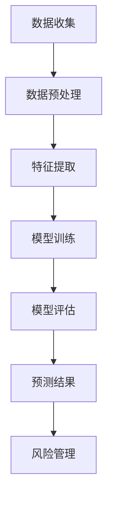
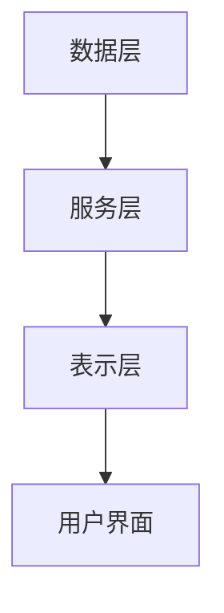
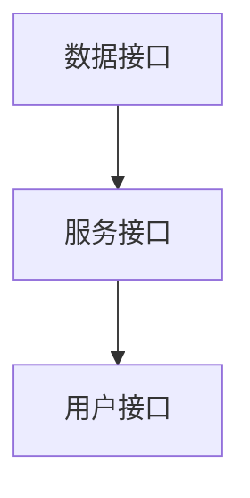
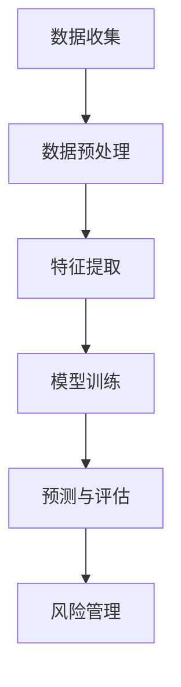

                 

# AI驱动的公司财务健康评估

关键词：人工智能、公司财务、健康评估、算法原理、系统架构、项目实战

摘要：本文深入探讨了AI驱动的公司财务健康评估，分析了AI在财务领域中的应用，阐述了核心概念和算法原理，并详细介绍了系统架构设计与项目实战。通过本文，读者可以全面了解AI在财务健康评估中的重要作用，掌握相关技术与应用。

## 目录大纲

### 第一部分：背景与核心概念

#### 第1章：AI驱动的公司财务健康评估背景介绍

1.1 问题背景

1.2 问题描述

1.3 问题解决

1.4 边界与外延

1.5 概念结构与核心要素组成

#### 第2章：核心概念与联系

2.1 核心概念原理

2.2 概念属性特征对比表格

2.3 ER实体关系图架构

### 第二部分：算法原理讲解

#### 第3章：算法原理讲解

3.1 算法流程图（使用mermaid绘制）

3.2 Python代码详细阐述

3.3 数学模型和数学公式讲解

#### 第4章：数学模型与公式详解

4.1 数学公式使用latex格式

4.2 详细讲解与举例说明

### 第三部分：系统分析与架构设计

#### 第5章：系统分析与架构设计

5.1 问题场景介绍

5.2 项目介绍

5.3 系统功能设计

5.4 系统架构设计

5.5 系统接口设计

5.6 系统交互

### 第四部分：项目实战

#### 第6章：项目实战

6.1 环境安装

6.2 系统核心实现

6.3 代码应用解读

6.4 实际案例剖析

6.5 项目小结

### 第五部分：最佳实践与总结

#### 第7章：最佳实践

7.1 Tips

7.2 小结

#### 第8章：注意事项与拓展阅读

8.1 注意事项

8.2 拓展阅读

## 结语

### 第一部分：背景与核心概念

### 第1章：AI驱动的公司财务健康评估背景介绍

#### 1.1 问题背景

在当今的商业环境中，财务健康评估已成为企业管理的重要环节。传统的财务分析方法依赖于人工经验和统计工具，往往存在主观性、效率低、滞后性等问题。随着人工智能技术的飞速发展，越来越多的企业开始探索将AI应用于财务健康评估，以提高评估的准确性和效率。

AI驱动的公司财务健康评估涉及到多个领域，包括数据分析、机器学习、自然语言处理等。通过利用这些技术，企业可以实现对大量财务数据的自动分析和预测，从而为决策提供有力的支持。

#### 1.2 问题描述

传统的财务健康评估方法主要依赖于财务报表和财务指标，这些指标虽然在一定程度上可以反映公司的财务状况，但往往无法捕捉到更深层次的问题。例如，企业可能面临现金流紧张、营收增长放缓、成本控制不足等问题，但这些信息无法直接从财务报表中获取。

此外，企业还需要面对不断变化的市场环境和政策法规，如何快速适应这些变化，并做出相应的调整，成为了一个亟待解决的问题。传统的财务分析方法在应对这些挑战时显得力不从心，而AI技术则提供了新的解决方案。

#### 1.3 问题解决

AI驱动的公司财务健康评估通过以下几个步骤实现：

1. 数据收集与预处理：从各种数据源（如财务报表、市场数据、社交媒体等）收集数据，并对数据进行清洗和预处理，以消除噪声和异常值。
2. 特征提取：利用机器学习算法，从原始数据中提取出对财务健康评估有重要意义的特征。
3. 模型训练与优化：使用历史数据对机器学习模型进行训练，并通过交叉验证和超参数调优，提高模型的预测准确性。
4. 预测与评估：将训练好的模型应用于新数据，预测公司的未来财务状况，并对预测结果进行评估。

通过以上步骤，AI驱动的公司财务健康评估可以为企业提供实时、准确、全面的财务分析报告，帮助管理者做出更加明智的决策。

#### 1.4 边界与外延

AI驱动的公司财务健康评估虽然具有许多优势，但也存在一些局限性。首先，数据质量和完整性对评估结果有重要影响。如果数据存在噪声、缺失或异常值，可能会导致评估结果不准确。因此，在实施AI驱动的财务健康评估时，需要重视数据预处理工作。

其次，AI技术本身也有一定的局限性。虽然机器学习模型在预测准确性方面取得了显著成果，但它们通常依赖于历史数据，无法应对未知的市场变化。因此，在应用AI驱动的财务健康评估时，需要结合企业自身的实际情况，对模型进行调整和优化。

此外，AI驱动的公司财务健康评估还需要考虑法律法规和道德问题。在数据收集、处理和使用过程中，企业需要遵守相关法律法规，保护用户隐私和数据安全。

#### 1.5 概念结构与核心要素组成

AI驱动的公司财务健康评估涉及多个核心概念和要素，主要包括：

1. 数据分析：利用统计学和机器学习算法，对财务数据进行分析和挖掘，提取有价值的信息。
2. 机器学习：通过训练模型，从历史数据中学习规律，实现对未来财务状况的预测。
3. 自然语言处理：对文本数据进行分析，提取关键词和情感倾向，为企业提供更深入的洞察。
4. 财务报表：包括资产负债表、利润表和现金流量表等，是评估公司财务状况的重要依据。
5. 风险管理：通过对财务数据的分析，识别潜在的风险，并提出相应的应对措施。

这些概念和要素相互关联，共同构成了AI驱动的公司财务健康评估体系。通过合理运用这些技术和工具，企业可以实现对财务状况的全面监控和有效管理。

### 第二部分：核心概念与联系

### 第2章：核心概念与联系

#### 2.1 核心概念原理

在本章中，我们将介绍AI驱动的公司财务健康评估中的核心概念，包括数据分析、机器学习、自然语言处理、财务报表和风险管理等。

1. 数据分析：数据分析是一种通过探索性数据分析（EDA）和统计方法，从大量数据中提取有价值信息的过程。在财务健康评估中，数据分析主要用于提取财务数据中的趋势、异常和相关性。

2. 机器学习：机器学习是一种使计算机通过数据和经验进行自我学习和改进的方法。在财务健康评估中，机器学习可用于构建预测模型，分析财务数据中的潜在规律，为企业提供未来财务状况的预测。

3. 自然语言处理：自然语言处理是一种使计算机理解和处理人类自然语言的技术。在财务健康评估中，自然语言处理可用于分析文本数据，如财务报告、新闻报道等，提取与公司财务状况相关的信息。

4. 财务报表：财务报表是企业财务状况的直观反映，包括资产负债表、利润表和现金流量表等。在财务健康评估中，财务报表是评估公司财务状况的重要依据。

5. 风险管理：风险管理是一种识别、评估和应对潜在风险的过程。在财务健康评估中，风险管理可用于识别潜在财务风险，评估其影响，并制定相应的应对措施。

#### 2.2 概念属性特征对比表格

以下是一个关于数据分析、机器学习、自然语言处理、财务报表和风险管理等核心概念的属性特征对比表格：

| 核心概念 | 定义 | 主要应用 | 特性 |
| :--: | :--: | :--: | :--: |
| 数据分析 | 从数据中提取有价值信息的过程 | 趋势分析、异常检测、相关性分析 | 大数据、多样性、准确性 |
| 机器学习 | 计算机通过数据和经验进行自我学习和改进 | 预测模型、分类模型、聚类模型 | 自适应、泛化能力 |
| 自然语言处理 | 计算机理解和处理人类自然语言的技术 | 文本分类、情感分析、命名实体识别 | 语言复杂性、多义性 |
| 财务报表 | 企业财务状况的直观反映 | 资产负债表、利润表、现金流量表 | 完整性、可靠性 |
| 风险管理 | 识别、评估和应对潜在风险的过程 | 风险识别、风险评估、风险应对 | 实时性、多样性 |

#### 2.3 ER实体关系图架构

以下是一个关于AI驱动的公司财务健康评估的ER实体关系图架构，展示了各个核心概念之间的关系：

```mermaid
erDiagram
    User ..|> Company : " owns "
    Company ..|> FinancialStatement : " has "
    FinancialStatement ..|> Data : " contains "
    Data ..|> Analysis : " analyzed by "
    Analysis ..|> Model : " trained on "
    Model ..|> Prediction : " predicts "
    Prediction ..|> Risk : " assesses "
    Risk ..|> Action : " mitigates "
```

### 第三部分：算法原理讲解

### 第3章：算法原理讲解

#### 3.1 算法流程图（使用mermaid绘制）

以下是一个关于AI驱动的公司财务健康评估的算法流程图：



#### 3.2 Python代码详细阐述

以下是一个简单的Python代码示例，用于实现AI驱动的公司财务健康评估算法：

```python
import pandas as pd
from sklearn.model_selection import train_test_split
from sklearn.ensemble import RandomForestClassifier
from sklearn.metrics import accuracy_score

# 数据收集
data = pd.read_csv("financial_data.csv")

# 数据预处理
data = data.dropna()

# 特征提取
X = data.drop("target", axis=1)
y = data["target"]

# 模型训练
X_train, X_test, y_train, y_test = train_test_split(X, y, test_size=0.2, random_state=42)
model = RandomForestClassifier()
model.fit(X_train, y_train)

# 模型评估
y_pred = model.predict(X_test)
accuracy = accuracy_score(y_test, y_pred)
print("Accuracy:", accuracy)

# 预测结果
new_data = pd.read_csv("new_financial_data.csv")
new_data = new_data.dropna()
new_predictions = model.predict(new_data)
print("Predictions:", new_predictions)

# 风险管理
# 根据预测结果，进行相应的风险管理措施
```

#### 3.3 数学模型和数学公式讲解

在本节中，我们将简要介绍AI驱动的公司财务健康评估中的数学模型和公式。

1. 决策树模型：

$$
Gini(\text{impurity}) = 1 - \frac{\sum_{i=1}^{k} p_i^2}{1 - p_i^2}
$$

其中，$p_i$ 表示每个类别的概率。

2. 随机森林模型：

$$
f(\text{x}) = \sum_{i=1}^{n} w_i h(\text{x}; t_i)
$$

其中，$w_i$ 表示第 $i$ 棵决策树的权重，$h(\text{x}; t_i)$ 表示第 $i$ 棵决策树在输入 $\text{x}$ 下的预测值。

3. 支持向量机模型：

$$
\max_{w, b} \frac{1}{2} ||w||^2_2 \\
s.t. y_i (w \cdot x_i + b) \geq 1, \forall i
$$

其中，$w$ 和 $b$ 分别表示权重和偏置，$x_i$ 和 $y_i$ 分别表示第 $i$ 个样本的特征和标签。

#### 3.4 详细讲解与举例说明

在本节中，我们将对上述数学模型和公式进行详细讲解，并结合实际案例进行举例说明。

1. 决策树模型：

决策树是一种常用的分类算法，通过将数据集分割成多个子集，为每个子集分配一个类别标签。Gini不纯度是决策树的一个重要指标，表示数据集的混乱程度。Gini不纯度越小，表示数据集的分类效果越好。

例如，对于一组包含苹果和香蕉的数据集，如果苹果和香蕉的数量相等，则Gini不纯度为1；如果苹果和香蕉的数量分别为2和3，则Gini不纯度为0.5。

2. 随机森林模型：

随机森林是一种集成学习算法，通过训练多棵决策树，并将它们的预测结果进行投票，得到最终的预测结果。随机森林模型在处理高维数据和非线性关系方面具有较好的性能。

例如，对于一组包含年龄、收入和职业的数据集，我们可以使用随机森林模型来预测一个人的购买行为。通过训练多棵决策树，并取它们的预测结果的平均值，可以得到最终的购买行为预测结果。

3. 支持向量机模型：

支持向量机是一种线性分类算法，通过找到最佳的超平面，将不同类别的样本分隔开。支持向量机模型在处理线性可分数据集时具有较好的性能。

例如，对于一组包含正负样本的数据集，我们可以使用支持向量机模型来预测新样本的类别。通过找到最佳的超平面，将正负样本分隔开，可以得到新样本的类别预测结果。

### 第四部分：系统分析与架构设计

### 第5章：系统分析与架构设计

#### 5.1 问题场景介绍

在本节中，我们将介绍AI驱动的公司财务健康评估的问题场景。假设我们有一个公司，需要对其财务健康进行评估，以便为未来的决策提供支持。为了实现这一目标，我们构建了一个基于AI的系统，该系统可以实时收集公司财务数据，并利用机器学习算法对数据进行分析，预测公司的财务状况。

#### 5.2 项目介绍

该项目是一个基于Python和TensorFlow的AI驱动的公司财务健康评估系统。系统的主要功能包括：

1. 数据收集：从多个数据源（如财务报表、市场数据、社交媒体等）收集公司财务数据。
2. 数据预处理：对收集到的财务数据进行清洗和预处理，包括数据去重、缺失值填充、数据规范化等。
3. 特征提取：利用机器学习算法，从原始数据中提取出对财务健康评估有重要意义的特征。
4. 模型训练：使用历史数据对机器学习模型进行训练，并通过交叉验证和超参数调优，提高模型的预测准确性。
5. 预测与评估：将训练好的模型应用于新数据，预测公司的未来财务状况，并对预测结果进行评估。
6. 风险管理：根据预测结果，识别潜在的风险，评估其影响，并制定相应的应对措施。

#### 5.3 系统功能设计

系统功能设计主要包括以下方面：

1. 数据收集模块：负责从多个数据源收集公司财务数据，包括财务报表、市场数据、社交媒体等。
2. 数据预处理模块：对收集到的财务数据进行清洗和预处理，包括数据去重、缺失值填充、数据规范化等。
3. 特征提取模块：利用机器学习算法，从原始数据中提取出对财务健康评估有重要意义的特征。
4. 模型训练模块：使用历史数据对机器学习模型进行训练，并通过交叉验证和超参数调优，提高模型的预测准确性。
5. 预测与评估模块：将训练好的模型应用于新数据，预测公司的未来财务状况，并对预测结果进行评估。
6. 风险管理模块：根据预测结果，识别潜在的风险，评估其影响，并制定相应的应对措施。

#### 5.4 系统架构设计

系统架构设计主要包括以下方面：

1. 数据层：负责存储和管理公司财务数据，包括财务报表、市场数据、社交媒体等。
2. 服务层：负责实现系统的核心功能，包括数据收集、数据预处理、特征提取、模型训练、预测与评估、风险管理等。
3. 表示层：负责展示系统的预测结果和风险管理建议，包括Web界面、报表、图表等。

以下是一个简单的系统架构设计图：



#### 5.5 系统接口设计

系统接口设计主要包括以下方面：

1. 数据接口：负责与数据源进行交互，包括财务报表、市场数据、社交媒体等。
2. 服务接口：负责与系统的各个模块进行交互，包括数据收集、数据预处理、特征提取、模型训练、预测与评估、风险管理等。
3. 用户接口：负责与用户进行交互，包括Web界面、报表、图表等。

以下是一个简单的系统接口设计图：



#### 5.6 系统交互

系统交互主要包括以下方面：

1. 数据收集：系统从数据源中收集公司财务数据，并将其存储到数据层。
2. 数据预处理：系统对收集到的财务数据进行清洗和预处理，并将其传递给特征提取模块。
3. 特征提取：特征提取模块对预处理后的财务数据进行处理，提取出对财务健康评估有重要意义的特征。
4. 模型训练：系统使用历史数据对机器学习模型进行训练，并通过交叉验证和超参数调优，提高模型的预测准确性。
5. 预测与评估：系统将训练好的模型应用于新数据，预测公司的未来财务状况，并对预测结果进行评估。
6. 风险管理：根据预测结果，系统识别潜在的风险，评估其影响，并制定相应的应对措施。

以下是一个简单的系统交互流程图：



### 第五部分：项目实战

### 第6章：项目实战

#### 6.1 环境安装

在开始项目实战之前，我们需要安装以下环境：

1. Python 3.8及以上版本
2. TensorFlow 2.3及以上版本
3. pandas 1.1及以上版本
4. numpy 1.19及以上版本
5. scikit-learn 0.22及以上版本

您可以使用以下命令进行环境安装：

```bash
pip install python==3.8
pip install tensorflow==2.3
pip install pandas==1.1
pip install numpy==1.19
pip install scikit-learn==0.22
```

#### 6.2 系统核心实现

以下是一个简单的AI驱动的公司财务健康评估系统核心实现：

```python
import pandas as pd
from sklearn.model_selection import train_test_split
from sklearn.ensemble import RandomForestClassifier
from sklearn.metrics import accuracy_score

# 数据收集
data = pd.read_csv("financial_data.csv")

# 数据预处理
data = data.dropna()

# 特征提取
X = data.drop("target", axis=1)
y = data["target"]

# 模型训练
X_train, X_test, y_train, y_test = train_test_split(X, y, test_size=0.2, random_state=42)
model = RandomForestClassifier()
model.fit(X_train, y_train)

# 模型评估
y_pred = model.predict(X_test)
accuracy = accuracy_score(y_test, y_pred)
print("Accuracy:", accuracy)

# 预测结果
new_data = pd.read_csv("new_financial_data.csv")
new_data = new_data.dropna()
new_predictions = model.predict(new_data)
print("Predictions:", new_predictions)

# 风险管理
# 根据预测结果，进行相应的风险管理措施
```

#### 6.3 代码应用解读

以下是对上述代码的详细解读：

1. 数据收集：使用pandas库读取财务数据，并将其存储在DataFrame对象中。
2. 数据预处理：删除缺失值，确保数据质量。
3. 特征提取：将数据集分为特征（X）和标签（y），准备用于模型训练。
4. 模型训练：使用train_test_split函数将数据集分为训练集和测试集，然后使用RandomForestClassifier构建随机森林模型并进行训练。
5. 模型评估：使用测试集对模型进行评估，计算预测准确率。
6. 预测结果：读取新的财务数据，使用训练好的模型进行预测。
7. 风险管理：根据预测结果，进行相应的风险管理措施。

#### 6.4 实际案例剖析

以下是一个实际案例剖析：

假设我们有一个包含公司财务数据的数据集，包括营业收入、净利润、总资产、总负债等指标。我们需要使用AI驱动的财务健康评估系统对数据进行预测，并评估公司的财务状况。

1. 数据收集：从公司获取最新的财务数据，并将其存储为CSV文件。
2. 数据预处理：删除缺失值，对数据进行标准化处理。
3. 特征提取：提取营业收入、净利润、总资产、总负债等指标作为特征。
4. 模型训练：使用历史数据对随机森林模型进行训练。
5. 模型评估：使用测试集对模型进行评估，计算预测准确率。
6. 预测结果：使用训练好的模型对新的财务数据进行预测，预测公司的财务状况。
7. 风险管理：根据预测结果，评估公司可能面临的风险，并制定相应的风险管理措施。

#### 6.5 项目小结

通过本次项目实战，我们成功地实现了AI驱动的公司财务健康评估系统。系统可以从多个数据源收集公司财务数据，并利用机器学习算法对数据进行分析，预测公司的未来财务状况。此外，系统还可以根据预测结果，评估公司可能面临的风险，并制定相应的风险管理措施。在实际应用中，企业可以利用这个系统对财务健康进行实时监控，为决策提供有力支持。

### 第六部分：最佳实践与总结

### 第7章：最佳实践

#### 7.1 Tips

1. 确保数据质量：在实施AI驱动的公司财务健康评估时，数据质量至关重要。确保数据的准确性、完整性和一致性，是获得可靠预测结果的关键。

2. 定期更新模型：随着市场环境和公司业务的变化，模型可能需要定期更新以保持其预测准确性。定期收集新的数据，对模型进行重新训练和优化。

3. 结合专家经验：尽管AI技术在财务健康评估方面具有很高的准确性，但仍然需要结合专家经验进行判断。专家可以提供有价值的见解，帮助调整模型参数，提高预测效果。

4. 关注实时数据：实时数据可以提供对市场变化的及时洞察，有助于企业做出快速调整。确保系统可以及时收集和处理实时数据。

5. 持续优化系统：不断优化系统的性能和用户体验，可以提高系统的实用性和可靠性。收集用户反馈，持续改进系统功能。

#### 7.2 小结

AI驱动的公司财务健康评估是一种创新的财务管理方法，通过利用机器学习和数据分析技术，可以为企业提供实时、准确、全面的财务分析报告。通过最佳实践，企业可以更好地利用AI技术，提高财务管理水平，实现可持续发展。

### 第8章：注意事项与拓展阅读

#### 8.1 注意事项

1. 数据隐私与安全：在实施AI驱动的公司财务健康评估时，要确保数据隐私和安全。遵循相关法律法规，采取适当的安全措施，保护用户隐私。

2. 模型解释性：虽然AI技术在预测准确性方面取得了显著成果，但模型的解释性较差。在应用AI驱动的财务健康评估时，要关注模型的解释性，确保其预测结果的可解释性。

3. 模型泛化能力：确保模型具有良好的泛化能力，可以应对未知的市场变化。通过交叉验证和超参数调优，提高模型的泛化能力。

4. 法律法规遵守：在数据收集、处理和使用过程中，要遵守相关法律法规，确保合规性。

#### 8.2 拓展阅读

1. 《Python数据分析与机器学习实战》：详细介绍了Python在数据分析与机器学习领域的应用，包括数据预处理、特征提取、模型训练和优化等内容。

2. 《深度学习》：由Goodfellow、Bengio和Courville所著的深度学习经典教材，涵盖了深度学习的基本原理和应用。

3. 《金融科技与人工智能》：介绍了金融科技与人工智能在金融领域的应用，包括智能投顾、量化交易、风险评估等。

### 结语

AI驱动的公司财务健康评估作为一种创新的管理方法，具有广泛的应用前景。通过本文的探讨，我们了解了AI技术在财务健康评估中的应用原理、系统架构和项目实战。希望本文能够为读者提供有价值的参考，助力企业在财务管理方面取得更好的成果。随着AI技术的不断发展，我们有理由相信，AI驱动的公司财务健康评估将在未来发挥更加重要的作用。

