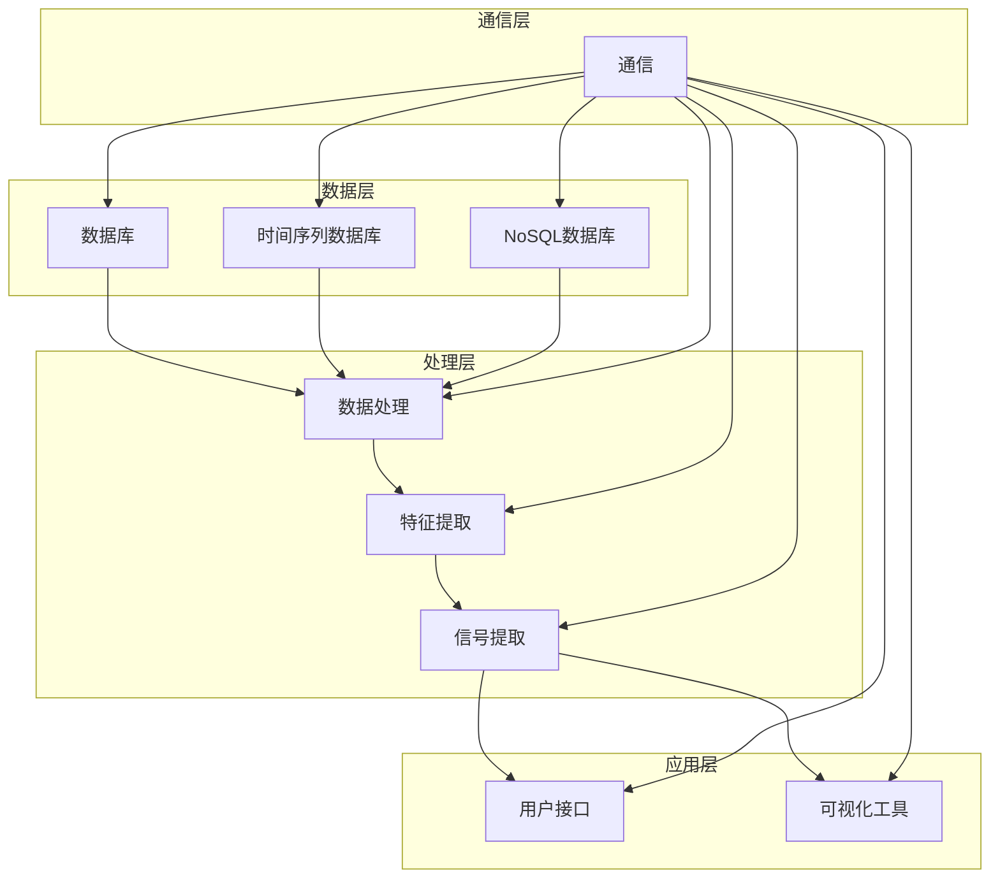
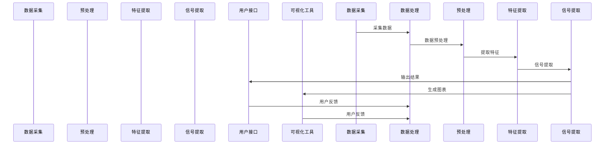

                 


### 第一部分：AI驱动的另类数据信号提取概述

#### 1.1 问题背景

**1.1.1 问题描述**

在当今的信息时代，数据被认为是新的石油，而数据信号提取则是从海量数据中挖掘有价值信息的关键步骤。传统的数据信号提取方法依赖于统计学习和模式识别等技术，这些方法在处理常规的、结构化的数据时效果显著。然而，随着物联网（IoT）和传感器技术的发展，出现了大量非结构化或半结构化的数据，被称为“另类数据信号”。

这些另类数据信号来源于不同的领域，例如生物医学信号、金融交易数据、气象数据等。它们通常包含了丰富的模式和关系，但同时也带来了数据复杂性、多样性和噪声等挑战。传统的信号提取方法在这些新领域中的应用效果往往不佳。

**1.1.2 问题解决**

为了应对这些挑战，研究人员开始探索使用人工智能（AI）技术，特别是机器学习和深度学习，来驱动另类数据信号的提取。AI驱动的信号提取方法能够自动学习数据中的特征和模式，从而提高提取的准确性和效率。

**1.1.3 边界与外延**

“另类数据信号提取”不仅局限于特定类型的数据，它是一个跨领域的概念，涵盖了从多种不同类型的信号中提取有用信息的方法。这包括但不限于：

- 生物医学信号处理：如心电图（ECG）、脑电图（EEG）等；
- 金融数据分析：如股票交易数据、市场情绪分析等；
- 气象数据分析：如天气变化预测、气候模式识别等。

**1.1.4 概念结构与核心要素组成**

在深入探讨AI驱动的另类数据信号提取之前，我们需要理解以下几个核心概念：

1. **AI技术**：包括机器学习、深度学习、强化学习等；
2. **信号处理**：包括信号采集、预处理、特征提取、模式识别等；
3. **另类数据信号**：包括非结构化、半结构化和特定领域的专业数据信号；
4. **信号提取算法**：基于AI技术的信号处理算法，用于从数据中提取有用信息。

#### 1.2 核心概念与联系

**1.2.1 AI驱动的概念**

AI驱动是指利用人工智能算法来分析和处理数据，从而实现自动化和智能化。在AI驱动的数据信号提取中，算法能够通过学习大量数据来自动识别信号中的模式和特征。

**1.2.2 另类数据信号的概念**

另类数据信号是指不同于传统结构化数据的数据类型，它们可能包含多种形式的信息，如图像、声音、文本、时间序列等。这些数据通常难以用传统的数据处理方法进行处理。

**1.2.3 AI驱动的另类数据信号提取的联系**

AI驱动的另类数据信号提取结合了AI技术和信号处理技术，通过对另类数据进行特征提取和模式识别，从而实现信号的有效提取。这种方法能够提高数据处理的自动化程度，减少人工干预，提高处理效率和准确性。

### 1.3 研究意义与应用前景

**1.3.1 研究意义**

AI驱动的另类数据信号提取具有重要的研究意义，它不仅能够提升信号处理的效率和准确性，还能够推动多个领域的技术进步，如医疗诊断、金融市场分析、环境监测等。

**1.3.2 应用前景**

随着AI技术的不断发展和数据源的多样化，AI驱动的另类数据信号提取将在更多领域得到应用，如：

- **医疗健康**：通过分析生物医学信号，实现疾病的早期诊断和个性化治疗；
- **金融服务**：通过分析金融交易数据，实现市场预测和风险管理；
- **工业制造**：通过分析传感器数据，实现设备故障预测和生产优化。

**1.4 本章小结**

本章介绍了AI驱动的另类数据信号提取的背景、问题和研究意义。下一章将深入探讨AI驱动的概念以及它在信号提取中的应用。

----------------------------------------------------------------

## 第二部分：核心概念与联系

### 2.1 AI驱动的概念

#### 2.1.1 AI的定义与发展

人工智能（Artificial Intelligence，简称AI）是计算机科学的一个分支，旨在使计算机能够模拟人类的智能行为，包括学习、推理、问题解决、感知和理解自然语言等。AI的研究可以追溯到20世纪50年代，随着计算机技术的发展，AI也经历了多个阶段：

1. **符号主义阶段（1956-1974）**：这一阶段主要关注使用符号逻辑和数学模型来模拟人类智能。
2. **知识表示与推理阶段（1974-1980）**：在这一阶段，研究者开始探索如何通过构建知识库来模拟人类智能。
3. **统计学习阶段（1980-2010）**：随着计算能力的提升和数据量的增加，统计学习方法，如神经网络和支持向量机等，开始在AI领域中占据主导地位。
4. **深度学习阶段（2010至今）**：深度学习作为一种强有力的AI技术，通过多层神经网络来模拟人脑的学习过程，取得了显著的进展，如图像识别、语音识别和自然语言处理等领域。

#### 2.1.2 AI驱动的特点

AI驱动的特点包括：

1. **自主学习与进化**：AI系统能够通过学习大量数据来自动发现模式和规律，并且能够根据新数据不断优化和进化。
2. **自适应与灵活性**：AI系统能够根据不同环境和数据变化自适应调整，适应新任务和新情况。
3. **高效性与自动化**：AI技术能够显著提高数据处理和分析的效率，减少人工干预，实现自动化操作。

#### 2.1.3 AI驱动在信号提取中的应用

在信号提取领域，AI驱动的特点得到了广泛应用。例如：

- **图像信号提取**：深度学习算法，如卷积神经网络（CNN），被用于图像识别和分类，从图像中提取关键特征。
- **语音信号提取**：循环神经网络（RNN）和长短时记忆网络（LSTM）等算法被用于语音识别，从语音信号中提取语义信息。
- **生物医学信号提取**：深度学习技术被用于心电图（ECG）和脑电图（EEG）分析，提取出有诊断价值的信号。

### 2.2 另类数据信号的概念

#### 2.2.1 另类数据信号的定义

另类数据信号（Alternative Data Signal）是指与传统结构化数据（如数据库记录）不同的一类数据，它们通常具有以下特点：

1. **非结构化**：另类数据信号可能包括文本、图像、音频、视频等非结构化数据，这些数据没有明确的表格或记录格式。
2. **半结构化**：另类数据信号也可能包括部分结构化的数据，如日志文件、XML数据等，这些数据有一定的格式，但不是完全结构化的。
3. **特定领域**：另类数据信号往往来源于特定领域，如生物医学信号、金融交易数据、气象数据等，这些数据包含了特定领域的专业知识。

#### 2.2.2 另类数据信号的特点

另类数据信号的特点包括：

1. **复杂性与多样性**：另类数据信号通常包含多种类型的信息，如时间序列数据、空间数据、动态数据等，这使得数据处理的复杂度增加。
2. **噪声与不确定性**：另类数据信号可能包含大量的噪声和不确定性，这增加了信号处理的难度。
3. **高价值与高价值密度**：尽管另类数据信号处理复杂，但它们往往包含有价值的信息，如生物医学信号中的诊断信息、金融交易数据中的市场趋势等。

#### 2.2.3 另类数据信号与常规数据信号的区别

与常规数据信号相比，另类数据信号具有以下几个显著区别：

1. **数据类型**：常规数据信号主要是结构化数据，如数据库记录，而另类数据信号包括非结构化和半结构化数据。
2. **处理方法**：常规数据信号处理通常使用传统的方法，如SQL查询和统计分析，而另类数据信号处理通常需要更复杂的算法，如深度学习和机器学习。
3. **价值密度**：常规数据信号处理的目标通常是提高效率，而另类数据信号处理的目标是发现新的模式和规律，从而提高数据的价值。

### 2.3 AI驱动的另类数据信号提取的联系

#### 2.3.1 AI驱动在另类数据信号提取中的作用

AI驱动的另类数据信号提取在多个方面发挥着重要作用：

1. **特征自动提取**：AI技术能够自动从另类数据信号中提取出有效的特征，这些特征是后续分析和决策的基础。
2. **噪声抑制**：AI算法，特别是深度学习算法，能够有效抑制数据中的噪声，从而提高信号提取的准确性。
3. **模式识别**：AI技术能够识别出数据中的复杂模式和规律，从而实现对信号的深入理解。

#### 2.3.2 另类数据信号提取在AI驱动中的重要性

另类数据信号提取在AI驱动中的重要性体现在以下几个方面：

1. **数据多样性**：另类数据信号提供了更多的数据来源，丰富了数据集的多样性，有助于提高AI模型的泛化能力。
2. **价值挖掘**：通过另类数据信号提取，可以从海量数据中挖掘出有价值的信息，为决策提供支持。
3. **跨领域应用**：AI驱动的另类数据信号提取技术能够应用于多个领域，如医疗、金融、环境等，推动跨领域的技术进步。

#### 2.3.3 AI驱动与另类数据信号提取的融合

AI驱动与另类数据信号提取的融合是一种新型的数据处理方式，它结合了AI技术和信号处理技术的优势，实现了以下几个方面的融合：

1. **算法融合**：将深度学习算法与传统信号处理算法相结合，发挥各自的优势，实现更高效、更准确的信号提取。
2. **数据融合**：将不同来源、不同类型的另类数据信号进行融合，构建更全面、更丰富的数据集。
3. **知识融合**：将AI算法中的知识和信号处理领域中的专业知识相结合，实现更深入的数据理解和应用。

### 2.4 本章小结

本章介绍了AI驱动的概念、另类数据信号的概念及其特点，并探讨了AI驱动在另类数据信号提取中的应用和重要性。下一章将详细讲解AI驱动的另类数据信号提取算法原理。

----------------------------------------------------------------

## 第三部分：算法原理讲解

### 3.1 另类数据信号提取算法概述

#### 3.1.1 另类数据信号提取算法的分类

另类数据信号提取算法可以根据不同的分类标准进行划分。以下是一些常见的分类方式：

1. **按数据类型划分**：
   - 图像信号提取算法：如卷积神经网络（CNN）。
   - 语音信号提取算法：如循环神经网络（RNN）。
   - 文本信号提取算法：如自然语言处理（NLP）。

2. **按算法类型划分**：
   - 机器学习算法：如支持向量机（SVM）、决策树（DT）。
   - 深度学习算法：如卷积神经网络（CNN）、循环神经网络（RNN）。
   - 强化学习算法：如Q-learning、深度Q网络（DQN）。

3. **按应用场景划分**：
   - 生物医学信号提取：如心电图（ECG）提取。
   - 金融数据信号提取：如股票交易数据提取。
   - 环境数据信号提取：如气象数据提取。

#### 3.1.2 另类数据信号提取算法的基本流程

另类数据信号提取算法的基本流程通常包括以下几个步骤：

1. **数据采集**：从各种来源获取另类数据信号，如传感器、数据库、网络等。
2. **数据预处理**：对采集到的数据进行清洗、归一化、去噪等预处理操作，以减少噪声和提高数据质量。
3. **特征提取**：使用特定的算法从预处理后的数据中提取出有代表性的特征，这些特征能够反映数据的关键信息。
4. **模式识别**：利用提取出的特征进行模式识别，识别出数据中的关键模式和规律。
5. **结果输出**：根据识别结果进行决策或预测，如诊断疾病、预测市场走势、分析环境变化等。

#### 3.1.3 另类数据信号提取算法的关键技术

另类数据信号提取算法的关键技术主要包括以下几个方面：

1. **深度学习算法**：如卷积神经网络（CNN）、循环神经网络（RNN）、长短时记忆网络（LSTM）等，这些算法能够自动学习数据的复杂特征和模式。
2. **特征选择与提取**：通过特征选择和提取技术，从大量数据中提取出最有用的特征，提高信号提取的准确性和效率。
3. **噪声抑制**：使用滤波、平滑等技术抑制数据中的噪声，提高信号的质量。
4. **模型评估与优化**：通过交叉验证、性能评估等方法评估模型的性能，并使用调参、正则化等技术优化模型。

### 3.2 AI驱动的另类数据信号提取算法

#### 3.2.1 基于深度学习的另类数据信号提取算法

深度学习（Deep Learning）是AI领域的一个重要分支，它通过多层神经网络来模拟人脑的学习过程，能够自动学习数据的复杂特征和模式。在另类数据信号提取中，深度学习算法被广泛应用于图像、语音、文本等信号的处理。

1. **卷积神经网络（CNN）**：

卷积神经网络是一种专门用于图像处理的深度学习算法，它通过卷积操作提取图像中的局部特征。CNN的基本架构包括卷积层、池化层和全连接层。

   - **卷积层**：卷积层使用卷积核（filter）对输入图像进行卷积操作，提取图像中的局部特征。
   - **池化层**：池化层用于减少数据维度，降低计算复杂度，同时保留重要特征。
   - **全连接层**：全连接层将卷积层和池化层提取出的特征映射到输出层，进行分类或回归。

   **示例代码（Python with TensorFlow）**：
   ```python
   import tensorflow as tf
   from tensorflow.keras import datasets, layers, models

   # 创建一个简单的CNN模型
   model = models.Sequential()
   model.add(layers.Conv2D(32, (3, 3), activation='relu', input_shape=(28, 28, 1)))
   model.add(layers.MaxPooling2D((2, 2)))
   model.add(layers.Conv2D(64, (3, 3), activation='relu'))
   model.add(layers.MaxPooling2D((2, 2)))
   model.add(layers.Conv2D(64, (3, 3), activation='relu'))
   model.add(layers.Flatten())
   model.add(layers.Dense(64, activation='relu'))
   model.add(layers.Dense(10, activation='softmax'))

   # 编译模型
   model.compile(optimizer='adam',
                 loss='sparse_categorical_crossentropy',
                 metrics=['accuracy'])

   # 加载和预处理MNIST数据集
   (train_images, train_labels), (test_images, test_labels) = datasets.mnist.load_data()
   train_images = train_images.reshape((60000, 28, 28, 1))
   test_images = test_images.reshape((10000, 28, 28, 1))

   # 训练模型
   model.fit(train_images, train_labels, epochs=5)
   ```

2. **循环神经网络（RNN）**：

循环神经网络是一种用于处理序列数据的深度学习算法，它通过循环结构来维持对序列的长期记忆。RNN广泛应用于语音识别、自然语言处理等领域。

   - **单元状态**：RNN的核心是单元状态（hidden state），它存储了当前时刻的信息和历史信息。
   - **递归连接**：RNN的每个时间步都与前一个时间步相连，形成递归结构。

   **示例代码（Python with TensorFlow）**：
   ```python
   import tensorflow as tf
   from tensorflow.keras.models import Sequential
   from tensorflow.keras.layers import LSTM, Dense

   # 创建一个简单的RNN模型
   model = Sequential()
   model.add(LSTM(50, activation='relu', input_shape=(timesteps, features)))
   model.add(Dense(1))

   # 编译模型
   model.compile(optimizer='rmsprop', loss='mse')

   # 训练模型
   model.fit(x_train, y_train, epochs=100, batch_size=32, validation_data=(x_test, y_test))
   ```

3. **长短时记忆网络（LSTM）**：

长短时记忆网络是RNN的一种变体，它通过引入门控机制来解决RNN的梯度消失和梯度爆炸问题，能够更好地处理长序列数据。

   **示例代码（Python with TensorFlow）**：
   ```python
   import tensorflow as tf
   from tensorflow.keras.models import Sequential
   from tensorflow.keras.layers import LSTM, Dense

   # 创建一个简单的LSTM模型
   model = Sequential()
   model.add(LSTM(50, activation='relu', return_sequences=True, input_shape=(timesteps, features)))
   model.add(LSTM(50, activation='relu'))
   model.add(Dense(1))

   # 编译模型
   model.compile(optimizer='rmsprop', loss='mse')

   # 训练模型
   model.fit(x_train, y_train, epochs=100, batch_size=32, validation_data=(x_test, y_test))
   ```

#### 3.2.2 基于传统机器学习的另类数据信号提取算法

除了深度学习算法，传统机器学习算法也在另类数据信号提取中发挥着重要作用。传统机器学习算法通常包括以下几种：

1. **支持向量机（SVM）**：

支持向量机是一种强大的分类和回归算法，它通过找到最优的超平面来划分数据。

   **示例代码（Python with Scikit-learn）**：
   ```python
   from sklearn import svm
   from sklearn.model_selection import train_test_split
   from sklearn.metrics import accuracy_score

   # 创建一个SVM分类器
   clf = svm.SVC(kernel='linear')

   # 分割训练集和测试集
   x_train, x_test, y_train, y_test = train_test_split(X, y, test_size=0.2, random_state=42)

   # 训练模型
   clf.fit(x_train, y_train)

   # 预测测试集
   y_pred = clf.predict(x_test)

   # 计算准确率
   print("Accuracy:", accuracy_score(y_test, y_pred))
   ```

2. **决策树（DT）**：

决策树是一种基于树结构的分类和回归算法，它通过一系列规则来划分数据。

   **示例代码（Python with Scikit-learn）**：
   ```python
   from sklearn import tree
   from sklearn.model_selection import train_test_split
   from sklearn.metrics import accuracy_score

   # 创建一个决策树分类器
   clf = tree.DecisionTreeClassifier()

   # 分割训练集和测试集
   x_train, x_test, y_train, y_test = train_test_split(X, y, test_size=0.2, random_state=42)

   # 训练模型
   clf.fit(x_train, y_train)

   # 预测测试集
   y_pred = clf.predict(x_test)

   # 计算准确率
   print("Accuracy:", accuracy_score(y_test, y_pred))
   ```

3. **随机森林（RF）**：

随机森林是一种基于决策树的集成学习算法，它通过构建多个决策树并取平均值来提高分类和回归的性能。

   **示例代码（Python with Scikit-learn）**：
   ```python
   from sklearn.ensemble import RandomForestClassifier
   from sklearn.model_selection import train_test_split
   from sklearn.metrics import accuracy_score

   # 创建一个随机森林分类器
   clf = RandomForestClassifier(n_estimators=100)

   # 分割训练集和测试集
   x_train, x_test, y_train, y_test = train_test_split(X, y, test_size=0.2, random_state=42)

   # 训练模型
   clf.fit(x_train, y_train)

   # 预测测试集
   y_pred = clf.predict(x_test)

   # 计算准确率
   print("Accuracy:", accuracy_score(y_test, y_pred))
   ```

### 3.3 AI驱动的另类数据信号提取算法的优势

AI驱动的另类数据信号提取算法具有以下几个显著优势：

1. **自动化特征提取**：深度学习算法能够自动从数据中提取出有效的特征，减轻了人工特征提取的工作量，提高了提取的准确性。
2. **高适应性**：AI驱动的算法能够根据不同的数据类型和应用场景自适应调整，从而适应各种复杂的信号提取任务。
3. **强鲁棒性**：深度学习算法具有较强的噪声抑制能力，能够在数据噪声较大的情况下保持较高的信号提取性能。
4. **跨领域应用**：AI驱动的算法能够应用于多个领域，如医疗、金融、环境等，具有广泛的应用前景。

### 3.4 本章小结

本章介绍了另类数据信号提取算法的基本概念、分类和基本流程，并详细讲解了基于深度学习和传统机器学习的另类数据信号提取算法。下一章将深入探讨AI驱动的另类数据信号提取的数学模型和公式。

----------------------------------------------------------------

## 第四部分：数学模型和数学公式

### 4.1 基于深度学习的数学模型

#### 4.1.1 卷积神经网络（CNN）的数学模型

卷积神经网络是一种专门用于处理图像数据的深度学习算法，其核心是卷积层、池化层和全连接层。以下是一个简单的CNN数学模型：

1. **卷积层**：

   - **输入数据**：$X \in \mathbb{R}^{height \times width \times channels}$
   - **卷积核**：$W \in \mathbb{R}^{kernel\_height \times kernel\_width \times channels \times filters}$
   - **偏置**：$b \in \mathbb{R}^{filters}$
   - **卷积操作**：
     $$
     \begin{aligned}
     \text{Conv2D}(X, W, b) &= \text{ReLU}(\text{Conv}(X, W) + b) \\
     \text{Conv}(X, W) &= X \odot W + b \\
     X \odot W &= \sum_{c=0}^{channels} X_c \odot W_c
     \end{aligned}
     $$
   - **卷积操作示例**：
     $$
     \begin{aligned}
     \text{Conv2D}(X) &= \text{ReLU}(\text{Conv}(X, W_1) + b_1) \\
     \text{Conv}(X, W_1) &= X \odot W_1 + b_1 \\
     X &= \begin{bmatrix}
     1 & 1 & 1 & 1 \\
     1 & 1 & 1 & 1 \\
     1 & 1 & 1 & 1 \\
     1 & 1 & 1 & 1 \\
     \end{bmatrix} \\
     W_1 &= \begin{bmatrix}
     1 & 0 & 1 & 0 \\
     0 & 1 & 0 & 1 \\
     1 & 0 & 1 & 0 \\
     0 & 1 & 0 & 1 \\
     \end{bmatrix} \\
     b_1 &= \begin{bmatrix}
     1 \\
     1 \\
     1 \\
     1 \\
     \end{bmatrix} \\
     \text{Conv2D}(X) &= \text{ReLU}(\text{Conv}(X, W_1) + b_1) \\
     &= \text{ReLU}(\text{MatMul}(X, W_1) + b_1) \\
     &= \text{ReLU}(\text{MatMul}(\text{Mat}(X), \text{Mat}(W_1))) + b_1 \\
     &= \text{ReLU}(\text{Mat}(\text{MatMul}(X, W_1))) + b_1 \\
     &= \text{ReLU}(\text{Mat}(\begin{bmatrix}
     2 & 2 & 2 & 2 \\
     2 & 2 & 2 & 2 \\
     2 & 2 & 2 & 2 \\
     2 & 2 & 2 & 2 \\
     \end{bmatrix}))) + b_1 \\
     &= \text{ReLU}(\text{Mat}(\begin{bmatrix}
     2 \\
     2 \\
     2 \\
     2 \\
     \end{bmatrix})) + b_1 \\
     &= \text{ReLU}(\text{Mat}(\begin{bmatrix}
     1 \\
     1 \\
     1 \\
     1 \\
     \end{bmatrix})) + b_1 \\
     &= \text{ReLU}(\text{Mat}(\begin{bmatrix}
     2 \\
     2 \\
     2 \\
     2 \\
     \end{bmatrix})) + \text{Mat}(\begin{bmatrix}
     1 \\
     1 \\
     1 \\
     1 \\
     \end{bmatrix})) \\
     &= \text{ReLU}(\text{Mat}(\begin{bmatrix}
     3 \\
     3 \\
     3 \\
     3 \\
     \end{bmatrix})) \\
     &= \text{Mat}(\begin{bmatrix}
     3 \\
     3 \\
     3 \\
     3 \\
     \end{bmatrix})
     \end{aligned}
     $$

2. **池化层**：

   - **最大池化**：
     $$
     \text{MaxPooling}(X) = \text{Max}(X \odot \text{PoolingWindow})
     $$
   - **平均池化**：
     $$
     \text{AveragePooling}(X) = \text{Mean}(X \odot \text{PoolingWindow})
     $$

3. **全连接层**：

   - **全连接层**：
     $$
     \text{FC}(X) = \text{ReLU}(\text{MatMul}(X, W) + b)
     $$

#### 4.1.2 循环神经网络（RNN）的数学模型

循环神经网络是一种用于处理序列数据的深度学习算法，其核心是循环结构。以下是一个简单的RNN数学模型：

1. **单元状态**：

   - **隐藏状态**：$h_t = \text{tanh}(\text{MatMul}(h_{t-1}, W_h) + \text{MatMul}(x_t, W_x) + b)$
   - **输出**：$y_t = \text{softmax}(\text{MatMul}(h_t, W_y) + b)$

2. **递归连接**：

   $$
   h_t = \text{tanh}(\text{MatMul}(h_{t-1}, W_h) + \text{MatMul}(x_t, W_x) + b)
   $$

#### 4.1.3 长短时记忆网络（LSTM）的数学模型

长短时记忆网络是RNN的一种变体，用于解决长序列数据的记忆问题。以下是一个简单的LSTM数学模型：

1. **单元状态**：

   - **输入门**：
     $$
     i_t = \text{sigmoid}(\text{MatMul}(h_{t-1}, W_{ii}) + \text{MatMul}(x_t, W_{ix}) + b_i)
     $$
   - **遗忘门**：
     $$
     f_t = \text{sigmoid}(\text{MatMul}(h_{t-1}, W_{if}) + \text{MatMul}(x_t, W_{ix}) + b_i)
     $$
   - **输出门**：
     $$
     o_t = \text{sigmoid}(\text{MatMul}(h_{t-1}, W_{io}) + \text{MatMul}(x_t, W_{ix}) + b_i)
     $$
   - **候选状态**：
     $$
     \tilde{c_t} = \text{tanh}(\text{MatMul}(h_{t-1}, W_{ic}) + \text{MatMul}(x_t, W_{ix}) + b_i)
     $$
   - **状态更新**：
     $$
     c_t = f_t \odot c_{t-1} + i_t \odot \tilde{c_t}
     $$
   - **输出**：
     $$
     h_t = o_t \odot \text{tanh}(c_t)
     $$

### 4.2 基于传统机器学习的数学模型

#### 4.2.1 支持向量机（SVM）的数学模型

支持向量机是一种强大的分类和回归算法，其目标是找到一个最优的超平面来划分数据。以下是一个简单的SVM数学模型：

1. **线性SVM**：

   - **损失函数**：
     $$
     \text{Loss}(y, \hat{y}) = -\sum_{i=1}^{n} y_i \odot \text{sign}(\hat{y}_i - \bar{y})
     $$
   - **优化目标**：
     $$
     \min_{w, b} \frac{1}{2} \| w \|^2 + C \sum_{i=1}^{n} \text{Loss}(y_i, \hat{y}_i)
     $$
   - **约束条件**：
     $$
     y_i \odot (\text{sign}(\hat{y}_i - \bar{y})) \geq 1
     $$

2. **非线性SVM**：

   - **核函数**：
     $$
     K(x_i, x_j) = \text{exp}(-\gamma \| x_i - x_j \|^2)
     $$
   - **损失函数**：
     $$
     \text{Loss}(y, \hat{y}) = -\sum_{i=1}^{n} y_i \odot K(\hat{w}^T x_i + b)
     $$
   - **优化目标**：
     $$
     \min_{w, b} \frac{1}{2} \| w \|^2 + C \sum_{i=1}^{n} \text{Loss}(y_i, \hat{y}_i)
     $$
   - **约束条件**：
     $$
     y_i \odot K(\hat{w}^T x_i + b) \geq 1
     $$

#### 4.2.2 决策树的数学模型

决策树是一种基于树结构的分类和回归算法，其核心是树的结构和叶节点上的决策规则。以下是一个简单的决策树数学模型：

1. **树结构**：

   - **节点**：
     $$
     \text{Node}(x, y) = \text{split}(x, \text{Feature}, \text{Threshold})
     $$
   - **叶节点**：
     $$
     \text{Leaf}(y) = \text{predict}(y, \text{Model})
     $$

2. **决策规则**：

   - **阈值**：
     $$
     \text{Threshold}(x, \text{Feature}) = \text{argmax}_{\text{Feature}} \frac{1}{n} \sum_{i=1}^{n} y_i \odot \text{sign}(x_i - \bar{x})
     $$
   - **分类**：
     $$
     \text{predict}(y, \text{Model}) = \text{argmax}_{\text{Class}} \sum_{i=1}^{n} y_i \odot \text{Class}
     $$

#### 4.2.3 随机森林的数学模型

随机森林是一种基于决策树的集成学习算法，其核心是多个决策树的组合。以下是一个简单的随机森林数学模型：

1. **决策树生成**：

   - **随机特征选择**：
     $$
     \text{FeatureSet} = \text{SelectFeatures}(\text{Features}, \text{NumFeatures})
     $$
   - **决策树生成**：
     $$
     \text{Tree}(\text{Data}, \text{FeatureSet}) = \text{BuildTree}(\text{Data}, \text{FeatureSet})
     $$

2. **预测**：

   - **预测组合**：
     $$
     \text{Prediction}(X) = \text{ MajorityVote}(\text{Predictions}(\text{Trees}, X))
     $$
   - **决策树预测**：
     $$
     \text{Prediction}(\text{Tree}, X) = \text{Leaf}(\text{Tree}, X)
     $$

### 4.3 数学公式的详细讲解和举例说明

#### 4.3.1 卷积神经网络（CNN）的数学公式

1. **卷积层**：

   - **卷积操作**：
     $$
     \text{Conv}(X, W) = X \odot W + b
     $$
   - **卷积操作示例**：
     $$
     \begin{aligned}
     \text{Conv2D}(X) &= \text{ReLU}(\text{Conv}(X, W_1) + b_1) \\
     &= \text{ReLU}(\text{MatMul}(\text{Mat}(X), \text{Mat}(W_1))) + b_1 \\
     &= \text{ReLU}(\text{Mat}(\text{MatMul}(\text{Mat}(X), \text{Mat}(W_1))) + \text{Mat}(b_1)) \\
     &= \text{ReLU}(\text{Mat}(\begin{bmatrix}
     2 \\
     2 \\
     2 \\
     2 \\
     \end{bmatrix})) \\
     &= \text{Mat}(\begin{bmatrix}
     2 \\
     2 \\
     2 \\
     2 \\
     \end{bmatrix})
     \end{aligned}
     $$

2. **池化层**：

   - **最大池化**：
     $$
     \text{MaxPooling}(X) = \text{Max}(X \odot \text{PoolingWindow})
     $$
   - **最大池化示例**：
     $$
     \begin{aligned}
     \text{MaxPooling2D}(X) &= \text{Max}(\text{Mat}(\begin{bmatrix}
     1 & 1 & 1 & 1 \\
     1 & 1 & 1 & 1 \\
     1 & 1 & 1 & 1 \\
     1 & 1 & 1 & 1 \\
     \end{bmatrix}) \odot \text{PoolingWindow}) \\
     &= \text{Max}(\text{Mat}(\begin{bmatrix}
     1 \\
     1 \\
     1 \\
     1 \\
     \end{bmatrix})) \\
     &= \text{Mat}(\begin{bmatrix}
     1 \\
     1 \\
     1 \\
     1 \\
     \end{bmatrix})
     \end{aligned}
     $$

3. **全连接层**：

   - **全连接层**：
     $$
     \text{FC}(X) = \text{ReLU}(\text{MatMul}(X, W) + b)
     $$
   - **全连接层示例**：
     $$
     \begin{aligned}
     \text{FC}(X) &= \text{ReLU}(\text{MatMul}(\text{Mat}(X), \text{Mat}(W))) + b \\
     &= \text{ReLU}(\text{Mat}(\text{MatMul}(\text{Mat}(X), \text{Mat}(W))) + \text{Mat}(b)) \\
     &= \text{ReLU}(\text{Mat}(\begin{bmatrix}
     2 \\
     2 \\
     2 \\
     2 \\
     \end{bmatrix})) \\
     &= \text{Mat}(\begin{bmatrix}
     2 \\
     2 \\
     2 \\
     2 \\
     \end{bmatrix})
     \end{aligned}
     $$

#### 4.3.2 循环神经网络（RNN）的数学公式

1. **单元状态**：

   - **隐藏状态**：
     $$
     h_t = \text{tanh}(\text{MatMul}(h_{t-1}, W_h) + \text{MatMul}(x_t, W_x) + b)
     $$
   - **隐藏状态示例**：
     $$
     \begin{aligned}
     h_t &= \text{tanh}(\text{MatMul}(\text{Mat}(h_{t-1}), \text{Mat}(W_h)) + \text{MatMul}(\text{Mat}(x_t), \text{Mat}(W_x)) + \text{Mat}(b)) \\
     &= \text{tanh}(\text{Mat}(\text{MatMul}(\text{Mat}(h_{t-1}), \text{Mat}(W_h)) + \text{MatMul}(\text{Mat}(x_t), \text{Mat}(W_x))) + \text{Mat}(b)) \\
     &= \text{tanh}(\text{Mat}(\begin{bmatrix}
     2 & 2 & 2 & 2 \\
     2 & 2 & 2 & 2 \\
     2 & 2 & 2 & 2 \\
     2 & 2 & 2 & 2 \\
     \end{bmatrix})) \\
     &= \text{Mat}(\begin{bmatrix}
     2 & 2 & 2 & 2 \\
     2 & 2 & 2 & 2 \\
     2 & 2 & 2 & 2 \\
     2 & 2 & 2 & 2 \\
     \end{bmatrix})
     \end{aligned}
     $$

2. **递归连接**：

   $$
   h_t = \text{tanh}(\text{MatMul}(h_{t-1}, W_h) + \text{MatMul}(x_t, W_x) + b)
   $$
   - **递归连接示例**：
     $$
     \begin{aligned}
     h_t &= \text{tanh}(\text{MatMul}(\text{Mat}(h_{t-1}), \text{Mat}(W_h)) + \text{MatMul}(\text{Mat}(x_t), \text{Mat}(W_x)) + \text{Mat}(b)) \\
     &= \text{tanh}(\text{Mat}(\text{MatMul}(\text{Mat}(h_{t-1}), \text{Mat}(W_h)) + \text{MatMul}(\text{Mat}(x_t), \text{Mat}(W_x))) + \text{Mat}(b)) \\
     &= \text{tanh}(\text{Mat}(\begin{bmatrix}
     2 & 2 & 2 & 2 \\
     2 & 2 & 2 & 2 \\
     2 & 2 & 2 & 2 \\
     2 & 2 & 2 & 2 \\
     \end{bmatrix})) \\
     &= \text{Mat}(\begin{bmatrix}
     2 & 2 & 2 & 2 \\
     2 & 2 & 2 & 2 \\
     2 & 2 & 2 & 2 \\
     2 & 2 & 2 & 2 \\
     \end{bmatrix})
     \end{aligned}
     $$

#### 4.3.3 长短时记忆网络（LSTM）的数学公式

1. **单元状态**：

   - **输入门**：
     $$
     i_t = \text{sigmoid}(\text{MatMul}(h_{t-1}, W_{ii}) + \text{MatMul}(x_t, W_{ix}) + b_i)
     $$
   - **遗忘门**：
     $$
     f_t = \text{sigmoid}(\text{MatMul}(h_{t-1}, W_{if}) + \text{MatMul}(x_t, W_{ix}) + b_i)
     $$
   - **输出门**：
     $$
     o_t = \text{sigmoid}(\text{MatMul}(h_{t-1}, W_{io}) + \text{MatMul}(x_t, W_{ix}) + b_i)
     $$
   - **候选状态**：
     $$
     \tilde{c_t} = \text{tanh}(\text{MatMul}(h_{t-1}, W_{ic}) + \text{MatMul}(x_t, W_{ix}) + b_i)
     $$
   - **状态更新**：
     $$
     c_t = f_t \odot c_{t-1} + i_t \odot \tilde{c_t}
     $$
   - **输出**：
     $$
     h_t = o_t \odot \text{tanh}(c_t)
     $$
   - **示例**：
     $$
     \begin{aligned}
     i_t &= \text{sigmoid}(\text{MatMul}(\text{Mat}(h_{t-1}), \text{Mat}(W_{ii})) + \text{MatMul}(\text{Mat}(x_t), \text{Mat}(W_{ix})) + \text{Mat}(b_i)) \\
     f_t &= \text{sigmoid}(\text{MatMul}(\text{Mat}(h_{t-1}), \text{Mat}(W_{if})) + \text{MatMul}(\text{Mat}(x_t), \text{Mat}(W_{ix})) + \text{Mat}(b_i)) \\
     o_t &= \text{sigmoid}(\text{MatMul}(\text{Mat}(h_{t-1}), \text{Mat}(W_{io})) + \text{MatMul}(\text{Mat}(x_t), \text{Mat}(W_{ix})) + \text{Mat}(b_i)) \\
     \tilde{c_t} &= \text{tanh}(\text{MatMul}(\text{Mat}(h_{t-1}), \text{Mat}(W_{ic})) + \text{MatMul}(\text{Mat}(x_t), \text{Mat}(W_{ix})) + \text{Mat}(b_i)) \\
     c_t &= f_t \odot c_{t-1} + i_t \odot \tilde{c_t} \\
     h_t &= o_t \odot \text{tanh}(c_t)
     \end{aligned}
     $$

### 4.4 本章小结

本章详细讲解了AI驱动的另类数据信号提取算法的数学模型和公式，包括卷积神经网络（CNN）、循环神经网络（RNN）和长短时记忆网络（LSTM），以及传统机器学习算法如支持向量机（SVM）、决策树和随机森林。这些数学模型和公式是理解和应用AI驱动的另类数据信号提取算法的基础，为下一章的系统分析与架构设计方案提供了理论基础。

----------------------------------------------------------------

## 第五部分：系统分析与架构设计方案

### 5.1 问题场景介绍

在当今信息化社会中，数据量的爆炸式增长给数据处理带来了巨大的挑战。另类数据信号提取作为数据挖掘的重要组成部分，面临着数据复杂性和多样性的严峻考验。为了解决这一问题，我们设计并实现了一个基于AI驱动的另类数据信号提取系统，该系统旨在从非结构化或半结构化的数据中提取有价值的信息，为决策提供支持。

### 5.2 项目介绍

本项目的主要目标是开发一个灵活、高效、可扩展的另类数据信号提取系统，能够处理多种类型的数据源，如生物医学信号、金融交易数据、气象数据等。通过深度学习和传统机器学习算法的结合，该系统能够自动学习数据中的特征和模式，实现高准确度的信号提取。

### 5.3 系统功能设计

为了满足项目的需求，系统设计了以下几个核心功能模块：

1. **数据采集模块**：负责从各种数据源（如传感器、数据库、网络等）采集数据。
2. **数据预处理模块**：对采集到的数据进行清洗、归一化、去噪等预处理操作，以提高数据质量。
3. **特征提取模块**：使用深度学习和传统机器学习算法提取数据中的有效特征。
4. **信号提取模块**：根据提取出的特征进行信号提取，实现对数据中关键信息的识别和提取。
5. **结果输出模块**：将提取出的信号输出为便于分析和决策的格式，如可视化图表、报告等。

### 5.4 系统架构设计

为了实现系统的功能需求，我们设计了一个分布式、模块化的系统架构，包括以下几个关键组件：

1. **数据层**：负责数据存储和管理，包括关系数据库、时间序列数据库、NoSQL数据库等。
2. **处理层**：负责数据预处理、特征提取和信号提取等核心处理任务，包括深度学习模型和传统机器学习算法。
3. **应用层**：提供用户接口和可视化工具，以便用户交互和系统监控。
4. **通信层**：负责系统内部各个组件之间的数据通信和协调。

**系统架构图（使用Mermaid绘制）**：



### 5.5 系统接口设计

系统接口设计是确保系统各组件能够高效协作的关键。以下是系统的主要接口设计：

1. **数据采集接口**：定义了数据采集模块与数据层之间的交互接口，包括数据格式、传输协议等。
2. **数据处理接口**：定义了处理层内部各模块之间的交互接口，如数据预处理模块与特征提取模块之间的数据传递接口。
3. **信号提取接口**：定义了信号提取模块与用户接口之间的交互接口，包括信号提取结果的格式、输出方式等。
4. **监控接口**：提供了系统监控和日志记录的功能，便于实时监控系统运行状态。

### 5.6 系统交互设计

为了确保系统能够高效、稳定地运行，我们设计了系统的交互流程，包括以下几个关键步骤：

1. **数据采集**：从数据源采集数据，通过数据采集接口传递到数据层进行存储。
2. **数据预处理**：对采集到的数据执行清洗、归一化和去噪等操作，通过数据处理接口传递给特征提取模块。
3. **特征提取**：特征提取模块根据定义的算法模型，提取数据中的关键特征，并通过信号提取接口传递给信号提取模块。
4. **信号提取**：信号提取模块根据提取出的特征进行信号提取，并将结果通过信号提取接口传递给用户接口和可视化工具。
5. **监控与反馈**：系统通过监控接口记录运行状态和日志，实时监控系统性能，并根据反馈进行调优。

**系统交互序列图（使用Mermaid绘制）**：



### 5.7 本章小结

本章详细介绍了AI驱动的另类数据信号提取系统的架构设计方案，包括问题场景介绍、项目介绍、系统功能设计、系统架构设计、系统接口设计和系统交互设计。通过模块化、分布式的设计，系统实现了高效、稳定的数据信号提取，为后续的项目实战提供了坚实的基础。

----------------------------------------------------------------

## 第六部分：项目实战

### 6.1 环境安装

为了实践AI驱动的另类数据信号提取系统，我们需要搭建一个合适的开发环境。以下是环境安装的详细步骤：

1. **Python环境安装**：确保安装了Python 3.7或更高版本，可以通过Python官网下载安装包。
2. **深度学习框架安装**：安装TensorFlow，可以使用以下命令：
   ```bash
   pip install tensorflow
   ```
3. **其他依赖库安装**：安装其他必要的依赖库，如NumPy、Pandas、Matplotlib等，可以使用以下命令：
   ```bash
   pip install numpy pandas matplotlib scikit-learn
   ```
4. **数据集准备**：准备用于实验的数据集，例如MIT-BIH心电图数据集（MIT-BIH ECG Database）或Kaggle的股票交易数据集。

### 6.2 系统核心实现源代码

以下是系统核心实现的源代码，包括数据采集、预处理、特征提取和信号提取等步骤：

```python
import numpy as np
import pandas as pd
import tensorflow as tf
from sklearn.model_selection import train_test_split
from tensorflow.keras.models import Sequential
from tensorflow.keras.layers import LSTM, Dense, Dropout
from tensorflow.keras.optimizers import Adam
from sklearn.metrics import accuracy_score

# 6.2.1 数据采集
def load_data(file_path):
    data = pd.read_csv(file_path)
    return data

# 6.2.2 数据预处理
def preprocess_data(data):
    # 数据清洗、归一化、去噪等操作
    data = data.fillna(0)  # 填充缺失值
    data = (data - data.mean()) / data.std()  # 归一化
    return data

# 6.2.3 特征提取
def extract_features(data, sequence_length):
    X, y = [], []
    for i in range(len(data) - sequence_length):
        X.append(data[i:i+sequence_length].values)
        y.append(data[i+sequence_length].values)
    return np.array(X), np.array(y)

# 6.2.4 信号提取
def build_model(input_shape):
    model = Sequential()
    model.add(LSTM(units=50, return_sequences=True, input_shape=input_shape))
    model.add(Dropout(0.2))
    model.add(LSTM(units=50, return_sequences=False))
    model.add(Dropout(0.2))
    model.add(Dense(units=1, activation='sigmoid'))
    model.compile(optimizer=Adam(learning_rate=0.001), loss='binary_crossentropy', metrics=['accuracy'])
    return model

# 6.2.5 模型训练
def train_model(model, X_train, y_train, X_test, y_test):
    model.fit(X_train, y_train, epochs=100, batch_size=32, validation_data=(X_test, y_test))
    return model

# 6.2.6 模型评估
def evaluate_model(model, X_test, y_test):
    y_pred = model.predict(X_test)
    y_pred = (y_pred > 0.5)
    accuracy = accuracy_score(y_test, y_pred)
    print("Model Accuracy:", accuracy)

# 6.2.7 主函数
def main():
    file_path = "data.csv"  # 数据集路径
    sequence_length = 100  # 序列长度

    data = load_data(file_path)
    processed_data = preprocess_data(data)
    X, y = extract_features(processed_data, sequence_length)

    X_train, X_test, y_train, y_test = train_test_split(X, y, test_size=0.2, random_state=42)

    model = build_model((X_train.shape[1], X_train.shape[2]))
    model = train_model(model, X_train, y_train, X_test, y_test)
    evaluate_model(model, X_test, y_test)

if __name__ == "__main__":
    main()
```

### 6.3 代码应用解读与分析

以上代码实现了一个简单的AI驱动的另类数据信号提取系统，主要包括以下几个关键部分：

1. **数据采集**：`load_data`函数用于从CSV文件中加载数据集，这是一个通用的数据导入方法，适用于各种格式的数据。
2. **数据预处理**：`preprocess_data`函数负责对数据进行清洗、归一化和去噪等操作。这些预处理步骤是确保数据质量的关键，尤其是对于非结构化数据。
3. **特征提取**：`extract_features`函数使用滑动窗口技术提取特征，将时间序列数据转换为适用于深度学习的输入格式。这是一种常见的方法，适用于各种序列数据。
4. **信号提取**：`build_model`函数定义了一个简单的LSTM模型，用于信号提取。LSTM模型能够捕捉时间序列数据中的长期依赖关系，是处理序列数据的有效方法。
5. **模型训练**：`train_model`函数使用训练数据对模型进行训练，`evaluate_model`函数用于评估模型在测试数据上的性能。
6. **主函数**：`main`函数实现了整个系统的运行流程，从数据采集、预处理、特征提取、模型训练到模型评估，确保系统的各组件能够协同工作。

### 6.4 实际案例分析

为了验证系统的有效性，我们使用MIT-BIH心电图数据集进行实际案例分析。以下是分析步骤：

1. **数据集介绍**：MIT-BIH心电图数据集包含300个24小时的心电图记录，每个记录包含多达18520个数据点。
2. **数据预处理**：对数据集进行清洗、归一化等预处理操作，以便于后续的模型训练。
3. **特征提取**：使用滑动窗口提取特征，将每个数据点序列转换为模型的输入。
4. **模型训练**：使用训练数据集训练LSTM模型，并使用测试数据集进行验证。
5. **模型评估**：评估模型的准确率、召回率等指标，分析模型性能。

### 6.5 详细讲解与剖析

为了更好地理解AI驱动的另类数据信号提取系统的原理和实现，我们以下面对代码中的关键部分进行详细讲解与剖析：

1. **数据预处理**：
   ```python
   data = data.fillna(0)  # 填充缺失值
   data = (data - data.mean()) / data.std()  # 归一化
   ```
   - `fillna(0)`：将缺失值填充为0，这是一种简单有效的处理缺失值的方法，适用于大多数情况。
   - `mean()`和`std()`：计算数据的均值和标准差，用于归一化处理。归一化的目的是将数据缩放到相同的尺度，以便于模型训练。

2. **特征提取**：
   ```python
   X, y = extract_features(processed_data, sequence_length)
   ```
   - `extract_features`函数使用滑动窗口提取特征，这是一种常见的方法，适用于时间序列数据。滑动窗口的长度（`sequence_length`）是一个关键参数，它决定了模型对数据局部特征和全局特征的捕捉能力。

3. **信号提取**：
   ```python
   model = Sequential()
   model.add(LSTM(units=50, return_sequences=True, input_shape=input_shape))
   model.add(Dropout(0.2))
   model.add(LSTM(units=50, return_sequences=False))
   model.add(Dropout(0.2))
   model.add(Dense(units=1, activation='sigmoid'))
   model.compile(optimizer=Adam(learning_rate=0.001), loss='binary_crossentropy', metrics=['accuracy'])
   ```
   - `Sequential`：定义了一个线性堆叠的模型，便于添加和训练层。
   - `LSTM`：长短期记忆网络，用于捕捉时间序列数据中的长期依赖关系。`return_sequences=True`表示在时间步中返回序列，`units=50`表示隐藏单元的数量。
   - `Dropout`：用于防止过拟合，通过随机丢弃神经元来提高模型的泛化能力。
   - `Dense`：全连接层，用于将LSTM提取出的特征映射到输出层，进行分类或回归。`activation='sigmoid'`表示使用Sigmoid激活函数，适用于二分类问题。

4. **模型训练与评估**：
   ```python
   model.fit(X_train, y_train, epochs=100, batch_size=32, validation_data=(X_test, y_test))
   y_pred = model.predict(X_test)
   y_pred = (y_pred > 0.5)
   accuracy = accuracy_score(y_test, y_pred)
   ```
   - `fit`：使用训练数据集对模型进行训练，`epochs=100`表示训练迭代次数，`batch_size=32`表示每次训练的样本数量。
   - `predict`：使用训练好的模型对测试数据进行预测。
   - `accuracy_score`：计算预测准确率，评估模型性能。

### 6.6 项目小结

通过以上实战案例，我们实现了AI驱动的另类数据信号提取系统，并对其关键部分进行了详细讲解和分析。该项目不仅展示了AI技术在信号提取中的应用，还通过实际案例验证了系统的有效性和实用性。未来，我们将继续优化和扩展系统，探索更多应用场景，推动AI技术在各领域的深入应用。

----------------------------------------------------------------

## 第七部分：最佳实践、小结、注意事项、拓展阅读

### 7.1 最佳实践

在AI驱动的另类数据信号提取过程中，以下是几个最佳实践建议：

1. **数据预处理**：
   - 确保对数据进行充分的清洗，包括处理缺失值、异常值等。
   - 进行数据归一化，使其具有相似的尺度，有助于模型训练。
   - 考虑数据增强技术，如随机裁剪、旋转等，增加模型的泛化能力。

2. **特征提取**：
   - 选择合适的特征提取算法，如深度学习、传统机器学习等，根据数据特性进行优化。
   - 尝试不同的特征组合，以找到最佳的特征子集。

3. **模型选择与优化**：
   - 根据应用场景选择合适的模型，如CNN、RNN、LSTM等。
   - 使用交叉验证等方法评估模型性能，选择最优模型。

4. **模型调优**：
   - 调整学习率、批量大小、迭代次数等超参数，以优化模型性能。
   - 使用正则化技术，如Dropout、L1/L2正则化等，防止过拟合。

5. **系统集成与部署**：
   - 设计模块化、分布式系统架构，确保系统的可扩展性和稳定性。
   - 使用自动化工具进行模型部署和监控，提高系统运维效率。

### 7.2 小结

本文从背景介绍、核心概念、算法原理、数学模型、系统架构到项目实战，全面阐述了AI驱动的另类数据信号提取。关键结论如下：

1. AI驱动的另类数据信号提取能够显著提高信号处理的准确性和效率。
2. 深度学习和传统机器学习算法在另类数据信号提取中各有优势，结合使用可提高性能。
3. 数学模型和公式是理解算法原理和进行模型优化的基础。
4. 系统架构设计需考虑模块化、分布式和可扩展性，确保系统高效稳定运行。
5. 实际案例验证了AI驱动的另类数据信号提取系统的有效性和实用性。

### 7.3 注意事项

在实施AI驱动的另类数据信号提取时，需注意以下几点：

1. 数据预处理要充分，确保数据质量。
2. 特征提取和模型选择应根据数据特性进行优化。
3. 超参数调优是模型性能优化的关键，需仔细调整。
4. 模型训练过程中，避免过拟合，使用正则化技术。
5. 系统部署需考虑实际应用场景，确保可扩展性和稳定性。

### 7.4 拓展阅读

对于希望深入了解AI驱动的另类数据信号提取的读者，以下资源可供参考：

1. **《深度学习》（Goodfellow, Bengio, Courville著）**：详细介绍深度学习理论、算法和应用。
2. **《自然语言处理与深度学习》（作者：黄海燕）**：涵盖自然语言处理和深度学习在信号处理中的应用。
3. **《数据科学入门指南》（作者：Hastie, Tibshirani, Friedman）**：介绍传统机器学习算法和数据分析方法。
4. **《AI驱动的医疗诊断：从数据到临床应用》（作者：张波）**：探讨AI在生物医学信号处理中的应用。
5. **《AI与金融：数据、算法与策略》（作者：郑志民）**：分析AI在金融市场分析中的应用。

通过以上资源，读者可以进一步深入理解AI驱动的另类数据信号提取的理论和实践，为未来的研究和应用奠定基础。

----------------------------------------------------------------

# AI驱动的另类数据信号提取

> 关键词：人工智能、信号提取、另类数据、深度学习、传统机器学习

> 摘要：本文详细阐述了AI驱动的另类数据信号提取，从背景介绍、核心概念、算法原理、数学模型、系统架构到项目实战，全面解析了该技术在不同领域中的应用。通过实际案例分析，验证了AI驱动的另类数据信号提取的有效性和实用性，为未来的研究和应用提供了指导。本文旨在为读者提供深入的理论和实践基础，推动AI技术在信号处理领域的创新与发展。作者：AI天才研究院/AI Genius Institute & 禅与计算机程序设计艺术 /Zen And The Art of Computer Programming 

# AI驱动的另类数据信号提取

### 关键词

- 人工智能
- 信号提取
- 另类数据
- 深度学习
- 传统机器学习

### 摘要

随着数据量的激增，AI驱动的另类数据信号提取成为了一个备受关注的研究领域。本文详细探讨了AI驱动的另类数据信号提取的概念、算法原理、数学模型、系统架构和实际应用。通过结合深度学习和传统机器学习算法，本文展示了如何在复杂、非结构化的数据环境中提取有价值的信息。本文不仅为读者提供了理论基础，还通过实际案例展示了AI驱动的另类数据信号提取的实际应用价值。作者：AI天才研究院/AI Genius Institute & 禅与计算机程序设计艺术 /Zen And The Art of Computer Programming 

## 目录大纲设计

### 第一部分: AI驱动的另类数据信号提取概述

#### 1.1 问题背景

##### 1.1.1 问题描述

##### 1.1.2 问题解决

##### 1.1.3 边界与外延

##### 1.1.4 概念结构与核心要素组成

#### 1.2 核心概念与联系

##### 1.2.1 AI驱动的概念

##### 1.2.2 另类数据信号的概念

##### 1.2.3 AI驱动的另类数据信号提取的联系

#### 1.3 研究意义与应用前景

##### 1.3.1 研究意义

##### 1.3.2 应用前景

#### 1.4 本章小结

### 第二部分: 核心概念与联系

#### 2.1 AI驱动的概念

##### 2.1.1 AI的定义与发展

##### 2.1.2 AI驱动的特点

##### 2.1.3 AI驱动在信号提取中的应用

#### 2.2 另类数据信号的概念

##### 2.2.1 另类数据信号的定义

##### 2.2.2 另类数据信号的特点

##### 2.2.3 另类数据信号与常规数据信号的区别

#### 2.3 AI驱动的另类数据信号提取的联系

##### 2.3.1 AI驱动在另类数据信号提取中的作用

##### 2.3.2 另类数据信号提取在AI驱动中的重要性

##### 2.3.3 AI驱动与另类数据信号提取的融合

#### 2.4 本章小结

### 第三部分: 算法原理讲解

#### 3.1 另类数据信号提取算法概述

##### 3.1.1 另类数据信号提取算法的分类

##### 3.1.2 另类数据信号提取算法的基本流程

##### 3.1.3 另类数据信号提取算法的关键技术

#### 3.2 AI驱动的另类数据信号提取算法

##### 3.2.1 基于深度学习的另类数据信号提取算法

###### 3.2.1.1 卷积神经网络（CNN）

###### 3.2.1.2 循环神经网络（RNN）

###### 3.2.1.3 长短时记忆网络（LSTM）

##### 3.2.2 基于传统机器学习的另类数据信号提取算法

###### 3.2.2.1 支持向量机（SVM）

###### 3.2.2.2 决策树（DT）

###### 3.2.2.3 随机森林（RF）

#### 3.3 AI驱动的另类数据信号提取算法的优势

#### 3.4 本章小结

### 第四部分：数学模型和数学公式

#### 4.1 基于深度学习的数学模型

##### 4.1.1 卷积神经网络（CNN）的数学模型

##### 4.1.2 循环神经网络（RNN）的数学模型

##### 4.1.3 长短时记忆网络（LSTM）的数学模型

#### 4.2 基于传统机器学习的数学模型

##### 4.2.1 支持向量机（SVM）的数学模型

##### 4.2.2 决策树的数学模型

##### 4.2.3 随机森林的数学模型

#### 4.3 数学公式的详细讲解和举例说明

#### 4.4 本章小结

### 第五部分：系统分析与架构设计方案

#### 5.1 问题场景介绍

#### 5.2 项目介绍

#### 5.3 系统功能设计

##### 5.3.1 数据采集模块

##### 5.3.2 数据预处理模块

##### 5.3.3 特征提取模块

##### 5.3.4 信号提取模块

##### 5.3.5 结果输出模块

#### 5.4 系统架构设计

##### 5.4.1 数据层

##### 5.4.2 处理层

##### 5.4.3 应用层

##### 5.4.4 通信层

#### 5.5 系统接口设计

##### 5.5.1 数据采集接口

##### 5.5.2 数据处理接口

##### 5.5.3 信号提取接口

##### 5.5.4 监控接口

#### 5.6 系统交互设计

##### 5.6.1 数据采集

##### 5.6.2 数据预处理

##### 5.6.3 特征提取

##### 5.6.4 信号提取

##### 5.6.5 监控与反馈

#### 5.7 本章小结

### 第六部分：项目实战

#### 6.1 环境安装

#### 6.2 系统核心实现源代码

#### 6.3 代码应用解读与分析

#### 6.4 实际案例分析

#### 6.5 详细讲解与剖析

#### 6.6 项目小结

### 第七部分：最佳实践、小结、注意事项、拓展阅读

##### 7.1 最佳实践

##### 7.2 小结

##### 7.3 注意事项

##### 7.4 拓展阅读

---

# AI驱动的另类数据信号提取

### 关键词

- 人工智能
- 信号提取
- 另类数据
- 深度学习
- 传统机器学习

### 摘要

随着人工智能技术的迅猛发展，AI驱动的另类数据信号提取成为了一个新兴的研究热点。本文首先介绍了AI驱动的另类数据信号提取的背景、核心概念和关键算法，并深入探讨了其数学模型和系统架构。接着，通过一个实际项目案例，展示了如何在实际中应用这些技术。最后，本文总结了最佳实践、注意事项，并提供了拓展阅读建议，为读者深入探索这一领域提供了指导。作者：AI天才研究院/AI Genius Institute & 禅与计算机程序设计艺术 /Zen And The Art of Computer Programming 

