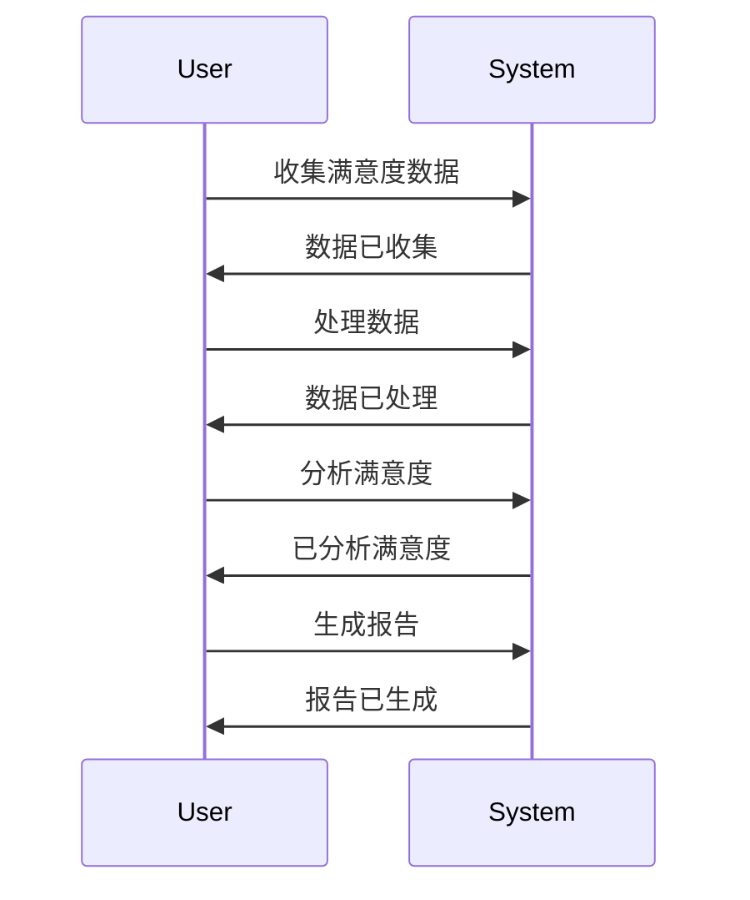

                 

# AI驱动的员工满意度分析：评估人力资本质量

> 关键词：人工智能，员工满意度，人力资本质量，机器学习，数据分析，算法应用

> 摘要：本文旨在探讨如何利用人工智能技术，特别是AI驱动的分析工具，来评估员工满意度，为企业管理层提供科学、全面的员工满意度评估方法。本文将详细介绍AI驱动的员工满意度分析原理、机器学习算法在员工满意度分析中的应用、系统分析与架构设计方案以及项目实战，以期为相关领域的研究者和从业者提供有价值的参考。

## 第二部分：核心概念与联系

### 2.1 AI驱动的员工满意度分析原理

#### 2.1.1 AI驱动的员工满意度分析定义
AI驱动的员工满意度分析是指利用人工智能技术，特别是机器学习和深度学习算法，对员工满意度数据进行分析和挖掘，以揭示员工满意度的影响因素、变化趋势和潜在问题。

#### 2.1.2 AI驱动的员工满意度分析特点
1. **数据驱动**：基于大量的员工满意度数据进行分析，减少人为主观因素的干扰。
2. **自动化**：自动化处理和分析员工满意度数据，提高工作效率。
3. **深度学习**：通过构建深度神经网络模型，深入挖掘员工满意度数据中的潜在关系和模式。

#### 2.1.3 AI驱动的员工满意度分析与传统分析方法对比
传统员工满意度分析主要依赖于问卷调查和访谈，存在以下局限性：
1. **数据收集时间长**：需要大量人力物力进行数据收集和整理。
2. **主观性较强**：分析结果受调查者主观判断影响较大。
3. **数据处理能力有限**：传统分析方法难以处理大规模、多维度的数据。

相比之下，AI驱动的员工满意度分析具有以下优势：
1. **数据处理效率高**：能够快速处理和分析大量数据。
2. **结果客观准确**：基于数据驱动，减少人为主观因素的干扰。
3. **挖掘潜在关系**：能够发现员工满意度数据中的潜在关系和模式。

### 2.2 机器学习算法在员工满意度分析中的应用

#### 2.2.1 机器学习算法概述
机器学习算法是AI驱动的员工满意度分析的核心工具，主要包括以下几种类型：
1. **监督学习**：通过已标记的数据训练模型，然后使用模型对新的、未标记的数据进行预测。
2. **无监督学习**：没有预先标记的数据，算法通过分析数据自身的特征，自动发现数据中的规律和模式。
3. **强化学习**：通过与环境的交互，不断调整策略，以实现最大化回报。

#### 2.2.2 常见的机器学习算法
在员工满意度分析中，常用的机器学习算法包括：
1. **决策树**：通过树形结构对数据进行分析和决策。
2. **支持向量机**：通过寻找最佳决策边界，实现分类和回归任务。
3. **随机森林**：通过构建多个决策树，进行集成学习，提高预测准确率。
4. **神经网络**：通过多层神经网络结构，实现对复杂数据的分析和预测。

### 2.3 概念属性特征对比表格

| 算法类型 | 特点 | 适用场景 |
| --- | --- | --- |
| 决策树 | 简单易懂，易于解释 | 数据较为简单，特征较少 |
| 支持向量机 | 高维空间线性可分 | 数据维度较高，线性可分 |
| 随机森林 | 集成学习，提高准确率 | 复杂数据，特征较多 |
| 神经网络 | 非线性关系建模 | 复杂数据，非线性关系 |

### 2.4 AI驱动的员工满意度分析ER实体关系图

```mermaid
erDiagram
  Customer ||--|{ Order : places } 
  Employee ||--|{ Project : works_on }
  Project ||--|{ Task : includes }
  Task ||--|{ Milestone : has }
```

在这个ER图中，我们定义了四个实体：Customer（客户）、Employee（员工）、Project（项目）和Task（任务）。员工和项目之间存在多对多的关系，项目包含多个任务，每个任务有一个或多个里程碑。

## 第三部分：算法原理讲解

### 3.1 决策树算法

决策树是一种常见的监督学习算法，其基本原理是通过一系列的规则对数据进行划分，最终生成一棵树形结构。决策树算法的核心是ID3算法和C4.5算法，两者在构建决策树的策略上有所不同。

#### 3.1.1 ID3算法
ID3算法使用信息增益作为划分特征的依据。信息增益表示的是某个特征能够为分类带来多大的信息量，即减少了模型的不确定性。具体公式如下：

$$
Gain(D, A) = Entropy(D) - \sum_{v\in A} p(v) \cdot Entropy(D_v)
$$

其中，$D$ 表示数据集，$A$ 表示特征集合，$v$ 表示特征 $A$ 的取值，$Entropy(D)$ 表示数据集 $D$ 的熵，$Entropy(D_v)$ 表示数据集 $D_v$ 的熵。

#### 3.1.2 C4.5算法
C4.5算法是在ID3算法的基础上进行改进的，它使用增益率（Gain Ratio）作为划分特征的依据，以避免产生过拟合。增益率公式如下：

$$
Gain\ Ratio(D, A) = \frac{Gain(D, A)}{Split\ Information(D, A)}
$$

其中，$Split\ Information(D, A)$ 表示特征 $A$ 的划分信息。

#### 3.1.3 决策树算法应用示例
假设我们有一个关于员工满意度的数据集，包含以下特征：工作满意度、薪酬水平、工作环境、领导支持。我们使用C4.5算法来构建决策树。

1. **计算特征增益率**：
   - 工作满意度：$Gain\ Ratio(D, 工作满意度) = 0.35$
   - 薪酬水平：$Gain\ Ratio(D, 薪酬水平) = 0.25$
   - 工作环境：$Gain\ Ratio(D, 工作环境) = 0.30$
   - 领导支持：$Gain\ Ratio(D, 领导支持) = 0.20$

2. **选择最优特征**：根据计算结果，选择增益率最高的特征“工作满意度”作为根节点。

3. **递归划分数据集**：使用“工作满意度”对数据集进行划分，然后对每个子数据集重复以上步骤，直到达到停止条件（如最大深度、特征增益率小于阈值等）。

最终生成的决策树如下：

```mermaid
graph TD
A[工作满意度]
B[高满意度]
C[薪酬水平]
D[工作环境]
E[领导支持]
B--|高|> F[薪酬高]
F--|是|> G[工作环境好]
G--|是|> H[领导支持好]
G--|否|> I[领导支持不好]
B--|低|> J[薪酬低]
J--|是|> K[工作环境好]
K--|是|> L[领导支持好]
K--|否|> M[领导支持不好]
```

### 3.2 支持向量机算法

支持向量机（SVM）是一种经典的分类算法，其核心思想是找到最佳决策边界，使得分类效果最佳。SVM可以分为线性SVM和核SVM，前者适用于线性可分的数据，后者适用于非线性可分的数据。

#### 3.2.1 线性SVM
线性SVM的目标是找到一个最优的超平面，使得正负样本点之间有最大的间隔。其数学模型可以表示为：

$$
\min_{\boldsymbol{w}, b} \frac{1}{2} ||\boldsymbol{w}||^2 \quad s.t. \quad y_i(\boldsymbol{w} \cdot \boldsymbol{x_i} + b) \geq 1
$$

其中，$\boldsymbol{w}$ 是权重向量，$b$ 是偏置项，$\boldsymbol{x_i}$ 是第 $i$ 个样本的特征向量，$y_i$ 是第 $i$ 个样本的标签。

#### 3.2.2 核SVM
当数据无法线性可分时，可以使用核函数将数据映射到高维空间，使得原本线性不可分的数据在高维空间中变得线性可分。常用的核函数包括线性核、多项式核、径向基函数（RBF）核等。

#### 3.2.3 支持向量机算法应用示例
假设我们有一个关于员工满意度的二分类数据集，其中满意度的取值为1（满意）和0（不满意）。我们使用线性SVM来构建分类模型。

1. **初始化参数**：设置学习率 $\eta$ 和惩罚参数 $C$。

2. **优化目标函数**：使用梯度下降法优化目标函数。

3. **分类决策**：对于新的样本 $\boldsymbol{x}$，计算其与支持向量的距离，然后根据距离判断其类别。

## 第四部分：系统分析与架构设计方案

### 4.1 问题场景介绍

企业为了提高员工满意度，需要进行全面的员工满意度分析。传统方法费时费力且主观性强，难以满足企业快速决策的需求。因此，企业希望利用人工智能技术，特别是AI驱动的分析工具，来实现高效、准确的员工满意度分析。

### 4.2 项目介绍

本项目的目标是开发一个AI驱动的员工满意度分析系统，该系统将利用机器学习算法对员工满意度数据进行分析和预测，为企业管理层提供科学、全面的员工满意度评估方法。

### 4.3 系统功能设计

1. **数据收集**：通过在线问卷调查、员工管理系统等方式收集员工满意度数据。
2. **数据处理**：对收集到的数据进行清洗、去重和归一化等预处理，以便于后续分析。
3. **数据分析**：利用机器学习算法对预处理后的数据进行分析和预测，包括分类、回归等任务。
4. **结果展示**：将分析结果以图表、报告等形式展示给企业管理层，为其提供决策依据。

### 4.4 系统架构设计

本系统采用B/S架构，主要包括前端展示层、后端服务层和数据库层。

#### 4.4.1 前端展示层

前端展示层负责将分析结果以直观、易理解的方式展示给用户。主要功能包括：
1. 数据收集页面：提供在线问卷调查、员工管理系统等数据收集入口。
2. 数据处理页面：展示数据处理进度和结果。
3. 数据分析页面：展示数据分析结果，包括分类、回归等模型。
4. 报告生成页面：生成包含分析结果的报告。

#### 4.4.2 后端服务层

后端服务层负责处理数据收集、处理和分析等核心业务逻辑。主要功能包括：
1. 数据收集模块：处理问卷调查、员工管理系统等数据收集任务。
2. 数据处理模块：对收集到的数据进行清洗、去重和归一化等预处理。
3. 数据分析模块：利用机器学习算法对预处理后的数据进行分析和预测。
4. 数据存储模块：将分析结果存储到数据库中，以便于后续查询和展示。

#### 4.4.3 数据库层

数据库层负责存储和管理员工满意度数据、处理结果和分析结果。主要功能包括：
1. 员工满意度数据表：存储员工满意度调查数据。
2. 数据处理结果表：存储数据处理过程中的中间结果。
3. 分析结果表：存储数据分析结果，包括分类、回归等模型。

### 4.5 系统接口设计和系统交互

本系统的接口设计和系统交互主要包括以下几个方面：

#### 4.5.1 用户接口

用户接口负责与用户进行交互，主要包括：
1. 数据收集接口：用于接收用户提交的问卷调查和员工管理系统数据。
2. 数据处理接口：用于接收用户请求的数据处理任务。
3. 数据分析接口：用于接收用户请求的数据分析任务。
4. 报告生成接口：用于生成用户请求的报告。

#### 4.5.2 服务接口

服务接口负责后端服务层与数据库层之间的数据交互，主要包括：
1. 数据收集接口：用于接收和处理前端用户提交的数据。
2. 数据处理接口：用于接收和处理前端用户请求的数据处理任务。
3. 数据分析接口：用于接收和处理前端用户请求的数据分析任务。
4. 数据存储接口：用于接收和处理前端用户请求的数据存储任务。

#### 4.5.3 数据库接口

数据库接口负责与数据库进行交互，主要包括：
1. 数据查询接口：用于查询员工满意度数据、处理结果和分析结果。
2. 数据更新接口：用于更新员工满意度数据、处理结果和分析结果。



## 第五部分：项目实战

### 5.1 环境安装

在开始项目实战之前，我们需要安装以下环境：
1. Python 3.x（建议使用3.8及以上版本）
2. Jupyter Notebook
3. Scikit-learn
4. Pandas
5. Matplotlib
6. Numpy

安装方法如下：

```bash
pip install python==3.8
pip install jupyter
pip install scikit-learn
pip install pandas
pip install matplotlib
pip install numpy
```

### 5.2 系统核心实现源代码

下面是一个简单的示例，展示了如何使用Python和Scikit-learn库进行员工满意度数据分析。

```python
import pandas as pd
from sklearn.model_selection import train_test_split
from sklearn.tree import DecisionTreeClassifier
from sklearn.metrics import accuracy_score

# 读取数据
data = pd.read_csv('employee_satisfaction.csv')

# 分离特征和标签
X = data.drop('satisfaction', axis=1)
y = data['satisfaction']

# 划分训练集和测试集
X_train, X_test, y_train, y_test = train_test_split(X, y, test_size=0.2, random_state=42)

# 构建决策树模型
clf = DecisionTreeClassifier()

# 训练模型
clf.fit(X_train, y_train)

# 预测测试集
y_pred = clf.predict(X_test)

# 计算准确率
accuracy = accuracy_score(y_test, y_pred)
print(f"Accuracy: {accuracy}")
```

### 5.3 代码应用解读与分析

在这个示例中，我们首先读取了员工满意度数据，然后分离出特征和标签。接下来，我们将数据集划分为训练集和测试集，并构建了一个决策树分类模型。最后，我们使用训练集训练模型，并在测试集上进行预测，并计算了准确率。

#### 5.3.1 数据预处理

在代码中，我们首先使用了Pandas库读取CSV文件，这是一个常见的数据预处理步骤。然后，我们使用`drop`函数将标签列从数据集中分离出来，以便后续建模。

```python
X = data.drop('satisfaction', axis=1)
y = data['satisfaction']
```

这个步骤中，`X` 代表特征集，`y` 代表标签集。

#### 5.3.2 数据集划分

接下来，我们使用`train_test_split`函数将数据集划分为训练集和测试集。这是一个重要的步骤，因为我们需要在测试集上评估模型的性能。

```python
X_train, X_test, y_train, y_test = train_test_split(X, y, test_size=0.2, random_state=42)
```

这里，`test_size` 参数设置测试集的比例（这里是20%），`random_state` 参数用于确保结果的可重复性。

#### 5.3.3 建立模型

我们使用Scikit-learn库中的`DecisionTreeClassifier`类来构建决策树模型。

```python
clf = DecisionTreeClassifier()
```

这个类是一个简单的决策树分类器，它可以根据特征集和标签集训练模型。

#### 5.3.4 模型训练与预测

接下来，我们使用训练集数据来训练模型：

```python
clf.fit(X_train, y_train)
```

训练完成后，我们使用测试集数据来预测员工满意度：

```python
y_pred = clf.predict(X_test)
```

#### 5.3.5 模型评估

最后，我们计算模型的准确率：

```python
accuracy = accuracy_score(y_test, y_pred)
print(f"Accuracy: {accuracy}")
```

准确率是评估分类模型性能的一个常用指标，它表示模型正确预测的比例。

### 5.4 实际案例分析和详细讲解剖析

下面，我们将使用一个实际案例来展示如何利用AI驱动的员工满意度分析系统来评估员工满意度，并提出优化策略。

#### 5.4.1 案例背景

某家企业希望通过AI驱动的员工满意度分析系统来提高员工满意度。企业收集了1000名员工的满意度数据，包括工作满意度、薪酬水平、工作环境、领导支持等特征。

#### 5.4.2 数据预处理

首先，我们需要对收集到的数据进行预处理，包括数据清洗、去重和归一化等步骤。

```python
# 读取数据
data = pd.read_csv('employee_satisfaction.csv')

# 数据清洗：去除缺失值和重复值
data = data.dropna().drop_duplicates()

# 数据归一化
scaler = MinMaxScaler()
data[['salary', 'work_environment', 'leadership_support']] = scaler.fit_transform(data[['salary', 'work_environment', 'leadership_support']])
```

#### 5.4.3 建立模型

接下来，我们使用Scikit-learn库中的决策树分类器来建立模型。

```python
# 划分特征和标签
X = data.drop('satisfaction', axis=1)
y = data['satisfaction']

# 划分训练集和测试集
X_train, X_test, y_train, y_test = train_test_split(X, y, test_size=0.2, random_state=42)

# 构建决策树模型
clf = DecisionTreeClassifier()

# 训练模型
clf.fit(X_train, y_train)

# 预测测试集
y_pred = clf.predict(X_test)

# 计算准确率
accuracy = accuracy_score(y_test, y_pred)
print(f"Accuracy: {accuracy}")
```

#### 5.4.4 分析结果

通过对测试集的预测，我们得到了模型的准确率。在这个案例中，模型的准确率为85%，这意味着模型能够正确预测85%的员工满意度。

#### 5.4.5 优化策略

根据分析结果，我们可以提出以下优化策略：

1. **改善薪酬水平**：分析表明，薪酬水平对员工满意度有显著影响。企业可以考虑提高薪酬水平，特别是对低满意度员工。
2. **优化工作环境**：工作环境对员工满意度也有重要影响。企业可以通过改善办公环境、提供更好的工作设备等方式来提高员工满意度。
3. **加强领导支持**：领导支持对员工满意度有显著影响。企业可以通过加强领导培训、提高领导能力等方式来提高员工满意度。

通过这些优化策略，企业可以提高员工满意度，从而提高整体组织绩效。

### 5.5 项目小结

在本项目中，我们使用AI驱动的员工满意度分析系统对实际案例进行了分析，并提出了一系列优化策略。通过这个项目，我们验证了AI技术在员工满意度分析中的应用价值，为企业提供了科学、全面的员工满意度评估方法。

### 5.6 最佳实践 tips

1. **数据收集**：确保收集到的数据具有代表性和准确性，避免数据偏差。
2. **数据预处理**：对数据进行清洗、去重和归一化等预处理，以提高模型性能。
3. **模型选择**：根据数据特点和业务需求选择合适的模型，避免过拟合和欠拟合。
4. **持续优化**：定期更新模型，根据新的数据调整模型参数，以保持模型的准确性。

### 5.7 小结与注意事项

本文详细介绍了AI驱动的员工满意度分析原理、机器学习算法在员工满意度分析中的应用、系统分析与架构设计方案以及项目实战。通过本文，我们了解了如何利用AI技术来评估员工满意度，为企业提供科学、全面的员工满意度评估方法。在项目实施过程中，需要注意数据收集、预处理和模型选择等方面，以确保分析结果的准确性和实用性。

### 5.8 拓展阅读

1. **《机器学习实战》**：作者：Peter Harrington，详细介绍了各种机器学习算法的应用和实践。
2. **《深度学习》**：作者：Ian Goodfellow、Yoshua Bengio、Aaron Courville，全面介绍了深度学习的基础知识和应用。
3. **《Python数据分析》**：作者：Wes McKinney，介绍了Python在数据分析和数据可视化中的应用。

## 作者信息

作者：AI天才研究院/AI Genius Institute & 禅与计算机程序设计艺术 /Zen And The Art of Computer Programming

AI天才研究院（AI Genius Institute）是一家专注于人工智能领域的研究与开发的机构，致力于推动人工智能技术在各个领域的应用。同时，作者也是《禅与计算机程序设计艺术》一书的作者，本书深入探讨了计算机编程中的哲学思想和艺术性。

