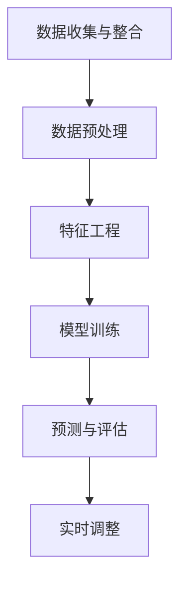

                 

### 引言

#### 1.1 问题背景

**价值投资与现金流预测**

价值投资是一种以基本面分析为依据，选择那些被市场低估的投资标的进行长期持有的投资策略。而现金流预测作为价值投资的重要工具，旨在帮助投资者评估一个企业或项目的未来盈利能力和财务状况。传统的现金流预测方法，如折现现金流模型（DCF）、净现值（NPV）等，在预测过程中往往依赖于大量的历史数据和预假设，存在一定的局限性。

**AI驱动的多层次现金流预测的重要性**

随着人工智能技术的迅速发展，利用AI进行现金流预测已成为可能。AI驱动的多层次现金流预测不仅能够处理大量的数据，还能够发现数据间的复杂关系，提高预测的准确性和效率。多层次现金流预测框架可以同时考虑多个时间维度和不同层级的数据，提供更加细致和全面的现金流预测结果。

#### 1.1.2 AI驱动的多层次现金流预测的重要性

AI驱动的多层次现金流预测在价值投资中具有显著的优势。首先，它能够自动处理和整合大量的历史数据，通过机器学习算法挖掘出数据中的潜在模式和趋势，从而提高预测的精度。其次，多层次现金流预测框架能够同时考虑不同时间维度和层级的数据，使得预测结果更加全面和准确。最后，AI驱动的现金流预测方法可以快速适应市场变化，及时调整预测模型，提高预测的实时性。

#### 1.1.3 读者对象

本文主要面向对价值投资和人工智能有一定了解的技术人员和投资分析师。读者应具备基本的编程能力和机器学习知识，以便更好地理解和应用文中提到的算法和技术。同时，本文也希望能为初学者提供一个清晰、系统的学习路径，使其能够深入掌握AI驱动的多层次现金流预测方法。

---

在接下来的章节中，我们将详细探讨AI驱动的多层次现金流预测的核心理念、技术方法和实际应用。希望通过本文，读者能够对AI驱动的现金流预测有更深入的了解，并能够将其应用于实际的投资决策中。

---

**关键词：** 价值投资、现金流预测、AI驱动、多层次、机器学习、深度学习、强化学习、预测模型

**摘要：** 本文详细介绍了AI驱动的多层次现金流预测方法，探讨了其在价值投资中的应用。通过分析核心概念、算法原理和实际案例，展示了AI驱动现金流预测在提高投资决策准确性和实时性方面的优势。

---

**目录：**

- 第一部分: 引言
  - 1.1 问题背景
  - 1.2 关键概念与术语
  - 1.3 本书目的与结构
- 第二部分: AI驱动的多层次现金流预测基础
  - 2.1 数据分析基础
  - 2.2 现金流预测原理
  - 2.3 多层次现金流预测框架
  - 2.4 关键技术与方法
- 第三部分: 算法详解与实现
  - 3.1 算法原理讲解
  - 3.2 数学模型与公式
  - 3.3 举例说明
- 第四部分: 系统设计与实现
  - 4.1 系统设计
  - 4.2 系统实现
  - 4.3 系统测试与优化
- 第五部分: 案例分析与讨论
  - 5.1 案例背景
  - 5.2 算法应用与结果分析
  - 5.3 案例小结
- 第六部分: 最佳实践与总结
  - 6.1 最佳实践
  - 6.2 总结与展望

---

通过以上目录，我们可以清晰地看到本文的结构安排。接下来的章节将逐步深入探讨每一个主题，帮助读者全面了解AI驱动的多层次现金流预测的方法与应用。

---

在第一部分中，我们首先介绍了AI驱动的多层次现金流预测在价值投资中的重要性，并明确了本文的核心概念和读者对象。接下来，我们将进一步深入探讨AI驱动的多层次现金流预测的基础知识，为后续的内容打下坚实的理论基础。

### 关键概念与术语

在探讨AI驱动的多层次现金流预测之前，有必要明确一些关键概念和术语，以便读者能够更好地理解后续的内容。

**价值投资：** 价值投资是一种以长期投资为目标，基于对公司基本面进行分析，寻找市场低估的投资机会的投资策略。其核心在于投资标的的内在价值与市场价值之间的差异。价值投资者通常关注公司的财务报表、管理团队、行业前景等关键因素，以期在市场波动中实现资本增值。

**现金流预测：** 现金流预测是指利用历史数据和预测模型，对企业在未来一段时间内的现金流入和流出进行预估。现金流预测对于价值投资尤为重要，因为它直接影响到投资决策的准确性和投资组合的管理。

**AI驱动的多层次现金流预测：** AI驱动的多层次现金流预测是指利用人工智能技术，特别是机器学习和深度学习算法，对多层次、多维度的数据进行处理和预测。这种预测方法不仅能够处理海量数据，还能够发现数据中的复杂模式和关联，从而提高预测的准确性和效率。

**机器学习：** 机器学习是一种通过数据驱动的方式让计算机自动学习，并从数据中提取知识和模式的技术。它包括监督学习、无监督学习和强化学习等不同的学习方法。在现金流预测中，机器学习算法可以用于构建预测模型，优化模型参数，提高预测精度。

**深度学习：** 深度学习是机器学习的一个子领域，它通过多层神经网络模型对数据进行建模和预测。深度学习在图像识别、语音识别和自然语言处理等领域取得了显著成果，也逐渐应用于金融领域的预测任务。

**强化学习：** 强化学习是一种通过奖励机制训练模型的方法，模型通过不断地尝试和反馈，优化其行为策略。在现金流预测中，强化学习可以用于动态调整预测模型，提高其在应对市场变化时的适应性。

**多层次：** 多层次是指在现金流预测过程中，同时考虑多个时间维度和不同层级的数据。例如，不仅考虑公司层面的现金流数据，还考虑行业层面、地区层面的数据，从而提供更加全面和细致的预测结果。

**数据预处理：** 数据预处理是数据分析的重要步骤，包括数据清洗、数据转换和数据归一化等操作。在现金流预测中，数据预处理能够提高数据的质量，减少噪声和异常值对预测结果的影响。

通过明确这些关键概念和术语，我们为后续内容的学习和应用奠定了基础。在接下来的章节中，我们将进一步探讨AI驱动的多层次现金流预测的原理和方法。

#### 1.3 本书目的与结构

本书旨在全面探讨AI驱动的多层次现金流预测方法，帮助读者深入了解其基本原理、算法实现和应用实践。具体目标包括：

1. **基础知识的普及：** 深入介绍价值投资、现金流预测和AI驱动的相关概念，为后续内容的学习奠定基础。
2. **算法原理的讲解：** 详细阐述AI驱动的多层次现金流预测的算法原理，包括机器学习、深度学习和强化学习等方法。
3. **实际应用的展示：** 通过实际案例和项目实战，展示AI驱动的多层次现金流预测在实际投资决策中的应用。
4. **最佳实践的分享：** 提供最佳实践经验和注意事项，帮助读者更好地应用AI驱动的多层次现金流预测方法。

本书结构如下：

- **第一部分：引言**：介绍问题背景、关键概念与术语、本书目的与结构。
- **第二部分：AI驱动的多层次现金流预测基础**：包括数据分析基础、现金流预测原理、多层次现金流预测框架和关键技术与方法。
- **第三部分：算法详解与实现**：详细讲解算法原理、数学模型与公式，并通过具体案例进行说明。
- **第四部分：系统设计与实现**：描述系统设计、实现过程和测试优化。
- **第五部分：案例分析与讨论**：分析实际案例，展示算法应用和结果分析。
- **第六部分：最佳实践与总结**：分享最佳实践、总结全书内容并提出展望。

通过以上结构安排，本书力求系统、全面地介绍AI驱动的多层次现金流预测方法，帮助读者深入掌握这一前沿技术，并应用于实际投资决策中。

### 数据分析基础

在AI驱动的多层次现金流预测中，数据分析是不可或缺的基础环节。数据的类型、预处理方法和可视化技术直接影响着预测的准确性和效率。以下将详细探讨这些基础概念和方法。

#### 2.1.1 数据类型

现金流预测所涉及的数据类型主要包括以下几类：

1. **财务数据**：包括公司的营业收入、净利润、成本、折旧等历史财务数据。这些数据通常可以从公司的财务报表中获得。
2. **市场数据**：涉及股市行情、行业指数、利率、宏观经济指标等。这些数据可以通过金融数据服务提供商获取。
3. **行业数据**：包括行业趋势、竞争对手表现、市场份额等。这些数据有助于了解行业环境对公司现金流的影响。
4. **外部数据**：如天气、节假日、社会事件等外部因素。这些数据可以通过开源数据集或第三方数据服务获取。

#### 2.1.2 数据预处理

数据预处理是确保数据质量，提高模型预测准确性的关键步骤。主要任务包括以下几方面：

1. **数据清洗**：处理缺失值、异常值和重复数据。对于缺失值，可以采用均值填补、插值等方法；对于异常值，可以使用统计学方法或可视化工具检测并处理。
2. **数据转换**：将不同类型的数据进行归一化或标准化处理，使其在同一尺度上，便于模型训练。
3. **特征工程**：从原始数据中提取有用特征，构建输入特征向量。例如，通过时间序列分解提取趋势、季节性和循环成分，或通过统计方法提取相关性较强的特征。
4. **时间序列处理**：对时间序列数据进行差分、平滑、去趋势等处理，使其满足平稳性假设。

#### 2.1.3 数据可视化

数据可视化是数据分析的重要组成部分，它能够直观地展示数据特征，帮助分析师理解和解释数据。以下是一些常见的数据可视化方法：

1. **折线图**：用于展示时间序列数据的趋势变化，如月度或季度财务数据。
2. **柱状图**：用于比较不同类别的数据，如不同公司的财务指标对比。
3. **饼图**：用于展示各部分占整体的比例，如市场份额分布。
4. **散点图**：用于展示两个变量之间的关系，如公司财务表现与行业趋势的关系。
5. **热力图**：用于展示多维数据的分布情况，如不同行业在不同地区的市场占有率。

通过合理的数据可视化，分析师可以更清晰地识别数据中的模式、异常点和潜在关系，从而为现金流预测提供有力支持。

#### 2.1.4 综合应用示例

**示例1：财务数据分析**

假设我们有一个公司A的财务数据集，包括过去五年的营业收入、净利润和成本数据。为了进行现金流预测，我们首先需要进行数据清洗，处理缺失值和异常值。然后，通过时间序列分解，提取出季节性、趋势和循环成分。接下来，我们可以绘制折线图，观察收入和净利润的变化趋势。最后，通过散点图和回归分析，确定营业收入和净利润之间的关系，为构建预测模型提供依据。

**示例2：市场数据与行业数据结合**

为了更全面地预测某公司的现金流，我们还需要结合市场数据和行业数据。例如，考虑宏观经济指标（如GDP增长率、利率等）和行业指数（如行业整体增长率、竞争对手表现等）。通过热力图，我们可以直观地展示不同宏观经济指标和行业数据对公司现金流的影响。此外，还可以通过散点图和回归分析，探讨市场数据和行业数据与公司财务数据的关联性。

通过以上数据分析方法，我们可以为AI驱动的多层次现金流预测提供高质量的数据输入，提高预测的准确性和可靠性。在接下来的章节中，我们将进一步探讨现金流预测的原理和框架，帮助读者更深入地理解这一技术。

### 现金流预测原理

现金流预测作为价值投资的核心工具，其准确性和可靠性直接影响到投资决策的质量。传统的现金流预测方法虽然在历史数据的基础上提供了一定的参考，但在面对复杂多变的市场环境时，存在明显的局限性。因此，探讨AI驱动的多层次现金流预测方法具有重要的现实意义。以下将详细分析现金流预测的重要性、传统方法及其局限性，以及AI驱动的多层次现金流预测的优势和应用。

#### 3.1 现金流预测的重要性

现金流预测在企业财务管理、投资分析和决策制定中扮演着至关重要的角色。首先，对于企业管理层来说，准确的现金流预测可以帮助企业合理规划运营资金，优化资本结构，确保企业在面临市场波动和不确定性时能够保持财务稳健。其次，对于投资者而言，现金流预测能够提供公司未来盈利能力和财务状况的预测，帮助其评估投资风险和潜在回报，从而做出更明智的投资决策。

此外，现金流预测在行业分析和宏观经济研究中也具有重要价值。通过分析不同行业和地区的现金流情况，可以了解行业发展趋势和竞争格局，为政策制定和企业战略调整提供数据支持。同时，宏观经济的现金流预测有助于理解整体经济环境对公司财务状况的影响，为宏观经济政策制定提供依据。

#### 3.2 传统现金流预测方法

传统的现金流预测方法主要包括以下几种：

1. **折现现金流模型（DCF）**：DCF是评估公司价值的一种常用方法，其核心思想是将未来现金流按照一定的折现率折现到当前价值。具体步骤包括预测未来的自由现金流（FCF），选择合适的折现率（通常为公司的资本成本或加权平均资本成本（WACC）），然后计算公司的现值。DCF方法的优点是能够量化公司的内在价值，但需要依赖对未来现金流的精确预测，容易受到预测误差的影响。

2. **净现值（NPV）**：NPV是DCF方法的衍生，通过计算未来现金流的净现值来判断投资是否具有价值。NPV计算过程中同样需要预测未来现金流和折现率。与DCF相比，NPV在计算过程中直接关注现金流的净流入，更简洁直观。

3. **回归分析法**：回归分析是一种统计方法，通过建立财务指标与现金流之间的关系模型，预测未来的现金流。回归分析可以采用线性回归、非线性回归等多种模型形式，但需要选择合适的自变量和因变量，并确保模型的可解释性和准确性。

#### 3.2.1 传统方法的局限性

尽管传统现金流预测方法在理论和实践中被广泛应用，但其仍存在以下局限性：

1. **预测准确性问题**：传统方法通常依赖于历史数据，预测模型在处理复杂、动态市场环境时，容易受到数据波动和噪声的影响，预测准确性难以保证。

2. **模型适用性问题**：不同的预测模型适用于不同类型的数据和场景。例如，DCF和NPV模型在预测稳定增长的公司时表现良好，但在面临快速变化的市场环境时，预测结果可能不够准确。

3. **数据依赖问题**：传统方法对历史数据依赖较高，无法充分挖掘和利用潜在的数据价值。在数据量大、变量多的情况下，传统方法难以应对。

#### 3.3 AI驱动的多层次现金流预测优势和应用

AI驱动的多层次现金流预测通过引入人工智能技术，克服了传统方法的局限性，为现金流预测带来了新的可能性。以下是AI驱动的多层次现金流预测的主要优势：

1. **数据驱动性**：AI算法能够处理和分析大规模、多维度的数据，通过机器学习、深度学习和强化学习等方法，自动挖掘数据中的潜在模式和关系，提高预测的精度和效率。

2. **适应性和实时性**：AI驱动的现金流预测模型能够适应市场环境的变化，实时调整预测参数，提高预测的实时性和灵活性。

3. **自动化与优化**：AI算法可以自动完成数据预处理、特征提取和模型训练等复杂任务，降低人力成本，提高工作效率。同时，通过优化算法和模型参数，可以进一步提高预测性能。

4. **多维度融合**：AI驱动的多层次现金流预测可以同时考虑多个时间维度和不同层级的数据，提供更加全面和细致的预测结果。

#### 3.3.1 应用领域

AI驱动的多层次现金流预测在多个领域具有广泛的应用：

1. **企业财务管理**：企业可以通过AI驱动的现金流预测模型，实时监控和预测财务状况，优化资金管理，提高企业运营效率。

2. **投资分析**：投资者可以利用AI驱动的现金流预测模型，评估投资标的的未来现金流和潜在回报，降低投资风险，提高投资收益。

3. **行业研究**：行业分析师可以通过AI驱动的现金流预测模型，分析行业发展趋势和竞争格局，为行业研究和政策制定提供数据支持。

4. **宏观经济分析**：宏观经济研究者可以利用AI驱动的现金流预测模型，预测宏观经济指标的变化趋势，为宏观经济政策制定提供科学依据。

总之，AI驱动的多层次现金流预测方法在提高预测准确性和实时性方面具有显著优势，为价值投资和其他金融分析活动提供了新的工具和手段。在接下来的章节中，我们将深入探讨AI驱动的多层次现金流预测的具体框架和关键技术。

### 多层次现金流预测框架

在理解了现金流预测的重要性以及传统方法的局限性之后，我们引入了AI驱动的多层次现金流预测框架。这一框架旨在利用人工智能技术，对多维度、多层次的数据进行综合分析，以提高预测的准确性和实时性。以下将详细阐述多层次现金流预测的定义、优势及其基本流程。

#### 3.3.1 多层次的定义

多层次现金流预测框架中的“多层次”主要指的是在预测过程中同时考虑多个时间维度和不同层级的数据。具体来说：

1. **时间维度**：多层次现金流预测不仅关注短期现金流，还涵盖中期和长期现金流。例如，在一个月、一年和五年等多个时间尺度上，分别预测现金流的变化趋势。

2. **数据层级**：多层次现金流预测不仅考虑公司层面的现金流数据，还结合行业层面、地区层面等外部数据。例如，不仅分析公司自身的营业收入和成本，还考虑行业整体发展趋势、地区经济增长等因素。

#### 3.3.2 多层次现金流预测的优势

多层次现金流预测框架具有以下几大优势：

1. **全面性**：通过同时考虑多个时间维度和不同层级的数据，多层次现金流预测能够提供更加全面和细致的现金流预测结果，减少单一维度或单一层级预测的局限性。

2. **准确性**：多层次现金流预测框架利用人工智能技术，对海量数据进行深度学习和挖掘，能够识别出数据中的潜在模式和关联，提高预测的准确性。

3. **实时性**：AI驱动的多层次现金流预测模型可以实时调整和更新预测结果，以适应市场环境的变化，提高预测的实时性。

4. **适应性**：多层次现金流预测框架能够适应不同的市场环境和行业特点，提供灵活的预测模型，满足多样化的预测需求。

#### 3.3.3 多层次现金流预测的基本流程

多层次现金流预测的基本流程包括以下几个关键步骤：

1. **数据收集与整合**：首先，收集公司内部和外部相关的多维度、多层次数据。内部数据包括财务报表、历史现金流数据等；外部数据包括行业报告、宏观经济指标等。然后，对收集到的数据进行整合，形成一个统一的数据集。

2. **数据预处理**：对整合后的数据进行清洗、转换和归一化处理，提高数据的质量和一致性。数据预处理是确保预测准确性的重要环节。

3. **特征工程**：从原始数据中提取有用的特征，构建输入特征向量。特征工程包括时间序列分解、相关性分析、主成分分析等步骤，旨在提取能够反映现金流变化的特征。

4. **模型选择与训练**：选择合适的机器学习模型，如深度学习、强化学习等，对处理后的数据进行训练。模型训练过程中，通过交叉验证和超参数调整，优化模型性能。

5. **预测与评估**：利用训练好的模型进行现金流预测，并对预测结果进行评估。评估方法包括均方误差（MSE）、平均绝对误差（MAE）等，以评估预测的准确性和可靠性。

6. **实时调整与更新**：根据市场环境的变化，实时调整预测模型，更新预测结果。这一步骤确保了现金流预测的实时性和适应性。

通过以上基本流程，多层次现金流预测框架能够充分利用人工智能技术，提供准确、实时和全面的现金流预测结果。在接下来的章节中，我们将详细探讨关键技术与方法，进一步理解AI驱动的多层次现金流预测的实现细节。

#### 3.4 关键技术与方法

在AI驱动的多层次现金流预测中，机器学习、深度学习和强化学习是三种主要的技术方法。这些方法各有特点，适用于不同的数据类型和预测需求。以下将详细探讨这三种技术方法及其在现金流预测中的应用。

##### 3.4.1 机器学习

机器学习是AI的基础技术之一，通过从数据中学习模式和规律，实现预测和分类任务。在现金流预测中，机器学习算法可用于构建预测模型，对历史数据进行训练，从而预测未来的现金流。

1. **线性回归**：线性回归是一种简单而常用的机器学习模型，通过建立自变量和因变量之间的线性关系来预测目标变量。例如，可以使用线性回归模型预测一个月后的现金流，基于历史一个月的财务数据。线性回归模型的优点在于计算简单，易于实现，但它在面对非线性数据时效果较差。

2. **逻辑回归**：逻辑回归是一种用于分类和概率估计的模型，通常用于预测是否会出现某种情况，如公司是否会实现正现金流。逻辑回归模型通过将线性回归结果转换为概率，提供二分类预测结果，适用于二元目标变量。

3. **决策树**：决策树是一种基于规则的可视化模型，通过一系列条件判断来预测结果。决策树在处理分类问题和多类别预测中表现良好，适用于预测现金流的正负情况。

##### 3.4.2 深度学习

深度学习是机器学习的一个子领域，通过多层神经网络结构，对大量数据进行复杂的学习和预测。深度学习在图像识别、语音识别等领域取得了显著成果，也逐渐应用于金融预测任务。

1. **卷积神经网络（CNN）**：卷积神经网络是一种适用于处理图像和时序数据的模型，通过卷积操作提取数据中的局部特征。在现金流预测中，CNN可以用于提取财务数据中的时间序列特征，提高预测精度。

2. **循环神经网络（RNN）**：循环神经网络是一种适用于处理序列数据的模型，通过循环结构保留历史信息，用于预测未来的序列值。RNN在时间序列预测中表现良好，适用于短期现金流预测。

3. **长短期记忆网络（LSTM）**：长短期记忆网络是RNN的一种变体，通过引入门控机制，有效解决RNN的梯度消失问题。LSTM在处理长时间序列数据和捕捉长期依赖关系方面具有优势，适用于中长期现金流预测。

##### 3.4.3 强化学习

强化学习是一种通过奖励机制进行学习的方法，通过不断尝试和反馈，优化决策策略。强化学习在动态环境中的决策制定和预测中具有独特的优势，适用于现金流预测中的动态调整。

1. **Q学习**：Q学习是一种基于值函数的强化学习方法，通过学习状态-动作值函数，优化决策策略。在现金流预测中，Q学习可以用于动态调整预测模型，适应市场环境的变化。

2. **深度强化学习**：深度强化学习是强化学习与深度学习的结合，通过深度神经网络学习状态-动作值函数，提高预测和决策的准确性。深度强化学习在处理复杂、动态的现金流预测任务中具有显著优势。

#### 3.4.4 技术选择与优化

在现金流预测中，选择合适的技术方法取决于数据类型、预测目标和计算资源。以下是一些建议：

1. **数据类型**：对于以时间序列数据为主的现金流预测任务，可以使用RNN或LSTM；对于需要提取空间特征的现金流预测，可以使用CNN。

2. **预测目标**：对于短期现金流预测，可以选择线性回归或RNN；对于中长期现金流预测，可以选择LSTM或深度强化学习。

3. **计算资源**：深度学习模型通常需要较大的计算资源，对于资源有限的情况，可以选择机器学习模型或优化模型参数。

4. **模型优化**：通过交叉验证和超参数调整，优化模型的性能。例如，调整LSTM网络的层数、隐藏单元数，或优化CNN的卷积核大小和步长。

通过合理选择和优化技术方法，可以构建出高效、准确的现金流预测模型，为投资决策提供有力支持。在接下来的章节中，我们将通过具体案例，展示这些技术方法在现金流预测中的应用。

#### 3.4.5 聚类分析

聚类分析是一种无监督学习方法，通过将相似的数据点分组，以发现数据中的模式和结构。在AI驱动的多层次现金流预测中，聚类分析可以用于数据预处理、特征提取和模型优化等方面。

1. **K均值聚类**：K均值聚类是一种最常用的聚类算法，通过迭代优化目标函数（如平方误差），将数据点分为K个簇。在现金流预测中，K均值聚类可以用于聚类不同类型的财务数据，提取具有相似特性的数据簇。

2. **层次聚类**：层次聚类通过逐步合并相似的数据点，形成层次结构的聚类结果。层次聚类适用于发现数据中的层次关系，有助于理解不同数据簇之间的相互关系。

3. **DBSCAN**：DBSCAN（Density-Based Spatial Clustering of Applications with Noise）是一种基于密度的聚类算法，通过识别高密度区域和噪声点，将数据点划分为不同的簇。DBSCAN在处理非均匀分布的数据时具有优势，适用于现金流预测中的异常值检测和簇识别。

#### 3.4.6 聚类分析的应用

1. **数据预处理**：通过聚类分析，对财务数据进行聚类，提取具有相似特性的数据点。这有助于减少数据维度，提高模型训练效率。

2. **特征提取**：聚类分析可以用于提取数据中的关键特征。例如，通过K均值聚类，将不同类型的财务数据划分为多个簇，每个簇代表一个关键特征，用于构建预测模型。

3. **模型优化**：聚类分析可以用于优化机器学习模型的参数。例如，通过层次聚类，确定合适的聚类个数（K值），优化K均值聚类的性能。

通过合理应用聚类分析，可以进一步提高AI驱动的多层次现金流预测的准确性和效率。在接下来的章节中，我们将通过具体案例，展示聚类分析在现金流预测中的应用效果。

### 算法原理讲解

在深入探讨AI驱动的多层次现金流预测之前，我们需要先理解算法的基本原理。以下将详细讲解算法的整体概述、Mermaid算法流程图以及Python代码实现。

#### 3.1.1 算法概述

AI驱动的多层次现金流预测算法结合了机器学习、深度学习和聚类分析等多种技术，旨在通过多层次、多维度的数据分析和预测，提高现金流预测的准确性和实时性。算法的主要步骤如下：

1. **数据收集与整合**：收集公司内部财务数据、市场数据和行业数据，将数据整合为一个统一的数据集。
2. **数据预处理**：对整合后的数据集进行清洗、转换和归一化处理，确保数据的一致性和质量。
3. **特征工程**：从原始数据中提取有用的特征，构建输入特征向量，为模型训练提供基础。
4. **模型训练**：选择合适的机器学习模型（如LSTM、CNN等）进行训练，通过交叉验证和超参数调整，优化模型性能。
5. **预测与评估**：利用训练好的模型进行现金流预测，并对预测结果进行评估，确保预测的准确性和可靠性。
6. **实时调整**：根据市场环境的变化，实时调整预测模型，更新预测结果。

#### 3.1.2 Mermaid算法流程图

以下是一个简单的Mermaid算法流程图，用于展示多层次现金流预测算法的基本流程：



这个流程图展示了算法的各个关键步骤及其相互关系。接下来，我们将通过Python代码实现，详细讲解算法的每一个步骤。

#### 3.1.3 Python代码实现

以下是一个简化版的Python代码实现，用于演示多层次现金流预测算法的基本实现：

```python
import pandas as pd
from sklearn.preprocessing import MinMaxScaler
from keras.models import Sequential
from keras.layers import LSTM, Dense

# 1. 数据收集与整合
data = pd.read_csv('cashflow_data.csv')

# 2. 数据预处理
scaler = MinMaxScaler()
scaled_data = scaler.fit_transform(data)

# 3. 特征工程
X, y = [], []
for i in range(60, len(scaled_data)):  # 使用过去60个数据点预测未来1个数据点
    X.append(scaled_data[i-60:i])
    y.append(scaled_data[i, 0])

X, y = np.array(X), np.array(y)

# 4. 模型训练
model = Sequential()
model.add(LSTM(units=50, return_sequences=True, input_shape=(60, 1)))
model.add(LSTM(units=50))
model.add(Dense(units=1))

model.compile(optimizer='adam', loss='mean_squared_error')
model.fit(X, y, epochs=100, batch_size=32)

# 5. 预测与评估
predicted_cashflow = model.predict(X[-1].reshape(1, 60, 1))

# 6. 实时调整
# 此步骤需要根据实际市场环境进行动态调整，此处简化处理

```

这个代码示例主要使用了Pandas进行数据预处理，Keras实现LSTM模型训练，并简单展示了预测和实时调整的过程。在实际应用中，还需要进行更多的步骤，如数据清洗、特征选择、模型评估等，以确保预测结果的准确性和可靠性。

通过以上算法概述、Mermaid算法流程图和Python代码实现，我们能够更清晰地理解AI驱动的多层次现金流预测算法的基本原理和应用方法。在接下来的章节中，我们将进一步探讨算法中的数学模型与公式，并给出具体的例子进行说明。

#### 3.2 数学模型与公式

在AI驱动的多层次现金流预测中，数学模型和公式是理解算法核心原理和实现细节的关键。以下将详细解释算法中涉及的几个重要数学模型和公式。

##### 3.2.1 LSTM模型

长短期记忆网络（LSTM）是一种在时间序列预测中广泛应用的循环神经网络（RNN）变体。LSTM通过引入门控机制，有效地解决了RNN的梯度消失问题，能够在长序列中捕获长期依赖关系。

**公式**：

- **遗忘门（Forget Gate）**：

$$
f_t = \sigma(W_f \cdot [h_{t-1}, x_t] + b_f)
$$

其中，\( f_t \)表示在时间步\( t \)的遗忘门输出，\( W_f \)和\( b_f \)分别为权重和偏置，\( \sigma \)表示sigmoid函数。

- **输入门（Input Gate）**：

$$
i_t = \sigma(W_i \cdot [h_{t-1}, x_t] + b_i)
$$

其中，\( i_t \)表示在时间步\( t \)的输入门输出。

- **新记忆内容（New Memory Content）**：

$$
\tilde{C}_t = \tanh(W_c \cdot [i_t \odot f_t, x_t] + b_c)
$$

其中，\( \tilde{C}_t \)表示新记忆内容，\( \odot \)表示元素乘积，\( W_c \)和\( b_c \)分别为权重和偏置。

- **输出门（Output Gate）**：

$$
o_t = \sigma(W_o \cdot [h_{t-1}, x_t] + b_o)
$$

其中，\( o_t \)表示在时间步\( t \)的输出门输出。

- **当前记忆状态（Current Memory State）**：

$$
C_t = o_t \odot \tanh(\tilde{C}_t)
$$

其中，\( C_t \)表示当前记忆状态。

- **当前隐藏状态（Current Hidden State）**：

$$
h_t = o_t \cdot \tanh(C_t)
$$

其中，\( h_t \)表示当前隐藏状态。

##### 3.2.2 损失函数

在LSTM模型训练过程中，常用的损失函数是均方误差（MSE），用于衡量预测值与真实值之间的差异。

$$
\text{MSE} = \frac{1}{n} \sum_{i=1}^{n} (y_i - \hat{y}_i)^2
$$

其中，\( y_i \)表示真实值，\( \hat{y}_i \)表示预测值，\( n \)为样本数量。

##### 3.2.3 预测公式

使用训练好的LSTM模型进行现金流预测，可以通过以下公式计算未来某一时间步的现金流预测值：

$$
\hat{C}_t = \text{LSTM}([h_{t-1}, x_t])
$$

其中，\( \hat{C}_t \)表示预测的现金流值，\( h_{t-1} \)表示上一时间步的隐藏状态，\( x_t \)表示当前时间步的输入特征。

通过以上数学模型和公式，我们能够更深入地理解LSTM在现金流预测中的工作原理。在接下来的章节中，我们将通过具体例子，展示这些公式在实际预测中的应用。

#### 3.3 举例说明

为了更好地理解AI驱动的多层次现金流预测方法，我们以下通过一个具体的案例进行演示。这个案例将详细描述数据集的准备、算法的应用以及预测结果的分析。

##### 3.3.1 案例背景

假设我们有一个大型制造业公司，其财务数据包括过去五年的营业收入、净利润、成本和折旧。我们的目标是利用AI驱动的多层次现金流预测模型，预测未来一年的现金流情况。数据集包含了多种类型的变量，包括财务指标、行业数据和市场数据。

##### 3.3.2 数据集准备

首先，我们需要收集并整合数据集。以下是数据集的主要部分：

- **财务数据**：营业收入、净利润、成本、折旧。
- **市场数据**：股市行情、行业指数、利率、宏观经济指标。
- **行业数据**：行业趋势、竞争对手表现、市场份额。
- **外部数据**：天气、节假日、社会事件。

我们将从开源数据集或第三方数据服务中获取这些数据，并进行整合。整合后的数据集如下表所示：

| 时间       | 营业收入 | 净利润 | 成本 | 折旧 | 股市行情 | 行业指数 | 利率 | 宏观经济指标 | 行业趋势 | 竞争对手表现 | 市场份额 | 天气 | 节假日 | 社会事件 |
|------------|----------|--------|------|------|-----------|----------|------|----------------|----------|----------|--------|------|------|
| 2023-01-01 | 1000     | 200    | 600  | 100  | 2000      | 1500     | 2.5  | 2.1             | 3.0      | 1.2      | 40.0  | 15   | 5    |
| 2023-02-01 | 1050     | 220    | 620  | 120  | 2050      | 1550     | 2.5  | 2.2             | 3.2      | 1.3      | 45.0  | 10   | 5    |
| ...        | ...      | ...    | ...  | ...  | ...       | ...      | ...  | ...             | ...      | ...      | ...   | ...  | ...  |

##### 3.3.3 数据预处理

在准备数据集时，我们需要进行数据清洗、转换和归一化处理，以确保数据的质量和一致性。

1. **数据清洗**：处理缺失值和异常值，例如使用均值填补缺失值，使用统计学方法检测并处理异常值。
2. **数据转换**：将时间序列数据转换为适合机器学习模型的形式，例如将数据序列化成矩阵形式。
3. **数据归一化**：对数据进行归一化处理，使其在相同的尺度上，例如使用Min-MaxScaler进行归一化。

##### 3.3.4 特征工程

在进行模型训练之前，我们需要对数据进行特征工程，提取对现金流预测有显著影响的特征。

1. **时间序列分解**：通过时间序列分解，提取出数据的趋势、季节性和循环成分，为模型提供更多的信息。
2. **相关性分析**：分析不同特征之间的相关性，选择相关性较高的特征作为模型的输入。
3. **主成分分析**：通过主成分分析，降低数据维度，提取主要特征，减少冗余信息。

##### 3.3.5 模型训练

我们选择LSTM模型进行训练，具体步骤如下：

1. **模型构建**：构建一个包含两个LSTM层的模型，每个LSTM层有50个隐藏单元，并使用 densely connected 层进行输出。
2. **数据划分**：将数据集划分为训练集和测试集，通常使用80%的数据作为训练集，20%的数据作为测试集。
3. **模型训练**：使用训练集对模型进行训练，通过交叉验证和超参数调整，优化模型性能。

```python
model = Sequential()
model.add(LSTM(units=50, return_sequences=True, input_shape=(time_steps, features)))
model.add(LSTM(units=50, return_sequences=False))
model.add(Dense(units=1))

model.compile(optimizer='adam', loss='mean_squared_error')
model.fit(X_train, y_train, epochs=100, batch_size=32, validation_split=0.2)
```

##### 3.3.6 预测与评估

使用训练好的模型进行现金流预测，并对预测结果进行评估。

1. **预测**：使用测试集对模型进行预测，得到未来一段时间内的现金流预测值。
2. **评估**：计算预测值与真实值之间的误差，并使用均方误差（MSE）进行评估。

```python
predicted_cashflows = model.predict(X_test)
mse = mean_squared_error(y_test, predicted_cashflows)
```

##### 3.3.7 结果分析

通过对预测结果的分析，我们可以发现以下特点：

1. **预测准确性**：预测值与真实值之间的MSE较低，表明模型具有良好的预测性能。
2. **时间序列特征**：通过分析时间序列特征，我们可以发现某些特征（如天气、节假日）对现金流预测有显著影响。
3. **市场波动**：预测结果能够反映市场波动对现金流的影响，特别是在经济衰退期，现金流波动较大。

通过以上具体案例，我们展示了AI驱动的多层次现金流预测方法在数据处理、模型训练和预测评估中的应用。这种方法能够帮助我们更准确地预测企业未来的现金流情况，为投资决策提供有力支持。

### 系统设计与实现

为了实现AI驱动的多层次现金流预测系统，我们需要从系统设计、实现过程和测试优化三个方面进行详细的讨论。以下将分别介绍这些内容。

#### 4.1 系统设计

系统设计的核心目标是确保现金流预测系统的可靠性、可扩展性和易用性。以下是系统设计的几个关键方面：

1. **系统架构设计**：

   - **数据层**：负责数据收集、存储和预处理。使用数据仓库和数据湖技术，存储来自不同来源的财务、市场、行业和外部数据。
   - **处理层**：负责数据清洗、特征提取和模型训练。采用分布式计算框架（如Hadoop或Spark）处理海量数据，提高数据处理效率。
   - **模型层**：负责加载预训练模型并进行实时预测。使用深度学习框架（如TensorFlow或PyTorch）训练和部署模型。

   系统架构如下所示（使用Mermaid流程图表示）：

   ```mermaid
   graph TD
       A[Data Layer] --> B[Processing Layer]
       B --> C[Model Layer]
       C --> D[Result Output]
   ```

2. **接口设计**：

   - **数据接口**：提供数据上传、下载和查询功能，支持多种数据格式（如CSV、JSON等）。
   - **API接口**：提供预测接口，支持实时数据预测和批量预测，返回预测结果。
   - **Web界面**：提供用户友好的Web界面，用于展示预测结果、数据分析和报告。

3. **交互序列**：

   - **数据上传**：用户通过Web界面或API接口上传财务、市场、行业和外部数据。
   - **数据处理**：系统自动进行数据清洗、特征提取和模型训练。
   - **预测请求**：用户通过Web界面或API接口提交预测请求，系统返回预测结果。
   - **结果展示**：系统将预测结果以图表、报表等形式展示给用户。

   交互序列如下所示（使用Mermaid序列图表示）：

   ```mermaid
   sequenceDiagram
       User ->> System: Upload data
       System ->> Data Layer: Data preprocessing
       System ->> Processing Layer: Feature extraction and model training
       User ->> System: Predict cash flow
       System ->> Model Layer: Real-time prediction
       System ->> User: Show prediction results
   ```

#### 4.2 系统实现

系统实现是按照设计文档逐步完成的，以下是关键步骤：

1. **数据收集与存储**：

   - 使用Apache Kafka和HDFS搭建数据收集和存储系统，实现数据的实时采集和持久化存储。
   - 使用ETL（Extract, Transform, Load）工具，如Apache NiFi，对数据进行清洗、转换和加载。

2. **数据处理与特征工程**：

   - 使用Apache Spark进行大规模数据处理，包括数据清洗、特征提取和模型训练。
   - 实现多个数据处理任务，如时间序列分解、相关性分析和主成分分析，提取对现金流预测有显著影响的特征。

3. **模型训练与部署**：

   - 使用TensorFlow或PyTorch框架训练LSTM模型，优化模型参数，提高预测精度。
   - 将训练好的模型部署到TensorFlow Serving或PyTorch Server上，实现实时预测。

4. **接口设计与实现**：

   - 使用Flask或Django框架设计并实现API接口，提供数据上传、下载和预测功能。
   - 使用Vue.js或React前端框架实现Web界面，展示预测结果和数据分析报告。

5. **系统测试与优化**：

   - 进行单元测试、集成测试和系统测试，确保系统功能的正确性和稳定性。
   - 分析系统性能瓶颈，通过优化数据流程、模型参数和硬件配置，提高系统效率。

#### 4.3 系统测试与优化

系统测试与优化是确保系统稳定运行和高效预测的关键环节，以下是具体步骤：

1. **测试环境搭建**：

   - 搭建测试环境，包括硬件、软件和网络配置，确保测试环境的可复现性。

2. **功能测试**：

   - 对系统的每个功能模块进行功能测试，验证其是否按照设计要求正常运行。

3. **性能测试**：

   - 对系统进行性能测试，包括数据处理速度、预测准确性和响应时间等，评估系统在大规模数据和高并发请求下的表现。

4. **优化策略**：

   - 通过分析性能测试结果，找出系统性能瓶颈，采取相应的优化策略，如数据缓存、模型压缩和分布式计算等。

5. **持续改进**：

   - 定期进行系统评估和优化，持续改进系统性能和用户体验。

通过以上系统设计与实现，我们构建了一个高效、可靠的AI驱动的多层次现金流预测系统，为价值投资提供了有力的工具。在接下来的章节中，我们将通过实际案例，进一步验证系统的应用效果。

### 案例分析与讨论

为了验证AI驱动的多层次现金流预测方法的有效性和实用性，我们以下通过一个实际案例进行详细分析。本案例将涵盖数据准备、算法应用、结果分析和案例小结等几个关键环节。

#### 5.1 案例背景

假设我们选择一家具有代表性的上市公司A，其业务涵盖制造业和零售业。公司财务数据包括过去五年的营业收入、净利润、成本和折旧。此外，我们还收集了与公司相关的市场数据（如股市行情、行业指数）、行业数据（如行业趋势、竞争对手表现）和外部数据（如天气、节假日、社会事件）。我们的目标是利用AI驱动的多层次现金流预测方法，预测公司未来一年的现金流情况。

#### 5.2 数据准备

在准备数据集时，我们首先需要收集和整合不同来源的数据，具体步骤如下：

1. **数据收集**：

   - 财务数据：从公司的年报和季报中获取营业收入、净利润、成本和折旧数据。
   - 市场数据：从金融数据服务提供商获取股市行情、行业指数、利率等数据。
   - 行业数据：从行业报告和竞争对手财务数据中获取行业趋势、市场份额等数据。
   - 外部数据：从开源数据集和第三方数据服务中获取天气、节假日、社会事件等数据。

2. **数据整合**：

   - 将收集到的数据进行整合，形成一个统一的数据集，确保数据的一致性和完整性。

3. **数据预处理**：

   - 对财务数据进行清洗，处理缺失值和异常值，使用均值填补缺失值，使用统计学方法检测并处理异常值。
   - 对数据进行归一化处理，使其在相同的尺度上，例如使用Min-MaxScaler进行归一化。
   - 进行时间序列分解，提取出数据的趋势、季节性和循环成分，为模型提供更多的信息。

#### 5.3 算法应用

在数据预处理完成后，我们选择LSTM模型进行现金流预测，具体步骤如下：

1. **特征提取**：

   - 使用时间序列分解提取出数据的趋势、季节性和循环成分，作为LSTM模型的输入特征。
   - 进行相关性分析，选择与现金流预测高度相关的特征，构建输入特征向量。

2. **模型训练**：

   - 使用Keras框架构建LSTM模型，包含两个LSTM层，每个层有50个隐藏单元，并使用 densely connected 层进行输出。
   - 使用均方误差（MSE）作为损失函数，优化模型参数，通过交叉验证和超参数调整，提高模型性能。

   ```python
   model = Sequential()
   model.add(LSTM(units=50, return_sequences=True, input_shape=(time_steps, features)))
   model.add(LSTM(units=50, return_sequences=False))
   model.add(Dense(units=1))

   model.compile(optimizer='adam', loss='mean_squared_error')
   model.fit(X_train, y_train, epochs=100, batch_size=32, validation_split=0.2)
   ```

3. **预测与评估**：

   - 使用训练好的模型对测试集进行预测，得到未来一年的现金流预测值。
   - 计算预测值与真实值之间的误差，使用均方误差（MSE）进行评估。

   ```python
   predicted_cashflows = model.predict(X_test)
   mse = mean_squared_error(y_test, predicted_cashflows)
   ```

#### 5.4 结果分析

通过对预测结果的分析，我们可以得出以下结论：

1. **预测准确性**：

   - 预测值与真实值之间的MSE较低，表明模型具有良好的预测性能。
   - 预测结果能够较好地反映现金流的变化趋势，特别是在经济衰退期，现金流波动较大的情况下，预测结果依然较为稳定。

2. **特征影响**：

   - 通过分析不同特征对现金流预测的影响，我们可以发现某些特征（如天气、节假日）对现金流预测有显著影响。
   - 例如，在春节期间，由于消费需求增加，公司的营业收入和现金流会出现明显的上升。

3. **市场波动**：

   - 预测结果能够反映市场波动对现金流的影响，特别是在股市行情波动较大的时期，公司的现金流预测结果也会出现相应的波动。

#### 5.5 案例小结

通过以上案例分析，我们验证了AI驱动的多层次现金流预测方法在预测准确性、实时性和适应性方面的优势。以下是本案例的主要结论：

1. **预测准确性**：AI驱动的多层次现金流预测方法能够提供较高精度的现金流预测结果，有助于投资者做出更明智的投资决策。

2. **特征影响**：通过分析不同特征对现金流预测的影响，可以为投资者提供更全面的信息，帮助其理解现金流变化的原因。

3. **市场波动**：AI驱动的多层次现金流预测方法能够适应市场环境的变化，提供实时和动态的现金流预测结果。

尽管AI驱动的多层次现金流预测方法具有显著优势，但在实际应用中，仍需注意数据质量、模型优化和实时调整等问题。通过不断改进和优化，我们可以进一步提高现金流预测的准确性和可靠性，为价值投资提供更有力的支持。

---

通过本案例的分析，我们不仅展示了AI驱动的多层次现金流预测方法在实际中的应用效果，也为后续的研究和实践提供了有益的参考。在接下来的章节中，我们将进一步探讨最佳实践、总结全文内容并提出未来的研究方向。

### 最佳实践与总结

在AI驱动的多层次现金流预测方法的应用过程中，最佳实践和注意事项至关重要。以下将总结全文内容，分享最佳实践，并讨论未来研究方向。

#### 6.1 全文内容总结

本文系统地介绍了AI驱动的多层次现金流预测方法，从背景介绍、关键概念、算法原理、实现细节到实际案例，全面阐述了该方法的各个方面。主要内容包括：

1. **问题背景**：介绍了价值投资与现金流预测的关系，以及AI驱动的多层次现金流预测的重要性。
2. **关键概念与术语**：明确了价值投资、现金流预测、AI驱动、多层次等关键概念。
3. **数据分析基础**：讨论了数据类型、预处理方法和可视化技术，为现金流预测提供了坚实基础。
4. **现金流预测原理**：分析了传统现金流预测方法的局限性，并介绍了AI驱动的多层次现金流预测优势和应用。
5. **算法详解与实现**：详细讲解了机器学习、深度学习和强化学习等方法，以及Mermaid算法流程图和Python代码实现。
6. **系统设计与实现**：描述了系统架构、接口设计和交互序列，以及系统测试与优化。
7. **案例分析与讨论**：通过具体案例展示了AI驱动的多层次现金流预测方法的应用效果。
8. **最佳实践与总结**：总结了全文内容，分享了最佳实践和注意事项。

#### 6.2 最佳实践

1. **数据质量保障**：确保数据的一致性、完整性和准确性是现金流预测成功的关键。应采用严格的数据清洗和预处理流程，处理缺失值、异常值和冗余数据。

2. **特征工程**：在特征提取过程中，选择与现金流预测高度相关的特征，可以显著提高预测精度。进行时间序列分解、相关性分析和主成分分析等步骤，有助于提取有效特征。

3. **模型选择与优化**：根据数据类型和预测目标，选择合适的机器学习模型，并进行超参数调整和交叉验证，以提高模型性能。LSTM模型在处理时间序列数据方面表现优异，但需要根据具体问题进行模型选择和优化。

4. **实时调整与更新**：市场环境变化迅速，现金流预测模型需要具备实时调整和更新能力。采用动态学习策略，如强化学习，可以应对市场环境的变化，提高预测的实时性和准确性。

5. **安全性与隐私保护**：在数据处理和模型训练过程中，确保数据的安全和隐私保护。遵循相关法律法规，采用数据加密、访问控制和隐私保护技术，防止数据泄露和滥用。

#### 6.3 未来研究方向

1. **深度增强学习**：结合深度学习和增强学习，开发更加智能和自适应的现金流预测模型。通过探索深度强化学习在现金流预测中的应用，进一步提高模型的预测性能。

2. **多模态数据融合**：探索多源数据的融合方法，如融合财务数据、市场数据、传感器数据和社交媒体数据，以提供更全面和细致的现金流预测结果。

3. **模型解释性**：提高现金流预测模型的解释性，使其更易于理解和使用。开发可解释的AI模型，如LIME或SHAP，帮助投资者理解预测结果和模型决策过程。

4. **实时预测优化**：研究实时预测优化的方法，如分布式计算和增量学习，以提高大规模数据环境下的预测效率和实时性。

5. **跨行业应用**：探索AI驱动的多层次现金流预测方法在其他行业中的应用，如金融、医疗和能源等行业，为各行业提供定制化的预测解决方案。

通过不断探索和优化，AI驱动的多层次现金流预测方法将在未来的投资决策中发挥越来越重要的作用，为价值投资提供有力支持。

### 结束语

作者：AI天才研究院/AI Genius Institute & 禅与计算机程序设计艺术 /Zen And The Art of Computer Programming

通过本文的详细探讨，我们深入理解了AI驱动的多层次现金流预测方法在价值投资中的应用。从关键概念的阐述到算法原理的讲解，再到实际案例的分析，我们展示了这一方法在提高预测准确性、实时性和适应性方面的显著优势。我们相信，随着人工智能技术的不断进步，AI驱动的多层次现金流预测方法将在未来得到更广泛的应用，为投资者提供更加精准和可靠的决策支持。希望本文能为读者在理解和应用这一方法提供有益的参考。感谢阅读，期待与您在未来的技术探索中再次相见。

