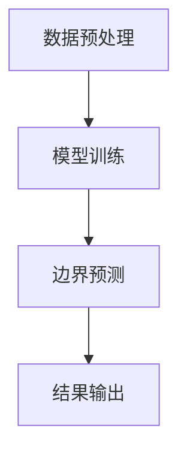

                 

### AI驱动的安全边际计算：多智能体协作提高准确度

> 关键词：AI，安全边际计算，多智能体协作，准确度提升

> 摘要：本文旨在探讨AI驱动的安全边际计算以及多智能体协作在提高准确度方面的应用。通过详细的分析与推理，本文将介绍安全边际计算的定义、重要性、类型与应用场景，多智能体系统的原理、分类与协同机制，以及AI驱动的安全边际计算算法和多种多智能体协作算法。此外，文章还将通过一个实际案例，展示如何将上述算法应用于实际项目中，以实现更准确的安全边际计算。最后，本文将总结项目实践经验，提出最佳实践建议，并对未来研究方向进行展望。

---

### 第一部分：背景介绍

#### 第1章：问题背景

##### 1.1 安全边际计算的重要性

安全边际计算是指在不确定环境下，通过计算和分析，确定系统运行的安全边界，以避免潜在的灾难性后果。随着人工智能技术的快速发展，安全边际计算在AI领域的应用越来越广泛。例如，在自动驾驶、智能医疗、金融风险控制等场景中，安全边际计算能够帮助系统更好地应对不确定性，提高决策的准确性和安全性。

- **安全边际计算的定义**：安全边际计算是一种基于概率和统计方法的技术，旨在确定系统在特定条件下运行的安全边界。
- **安全边际计算在AI领域的重要性**：在AI系统中，不确定性和风险是不可避免的。通过安全边际计算，可以有效地降低系统风险，提高系统的可靠性。
- **安全边际计算在当前技术环境中的挑战与机遇**：随着AI技术的不断进步，安全边际计算面临新的挑战，如算法复杂度、数据隐私保护等。同时，这也为AI驱动的安全边际计算带来了新的机遇。

##### 1.2 多智能体协作的兴起

多智能体系统（MAS）是指由多个智能体组成的系统，这些智能体通过协作实现共同的目标。多智能体协作在AI领域有着广泛的应用，如分布式计算、智能交通管理、协同过滤等。

- **多智能体系统的定义**：多智能体系统是由多个具有独立智能的实体组成的系统，这些实体通过通信和协作实现共同的目标。
- **多智能体系统在AI领域的应用**：多智能体系统在AI领域的应用包括分布式学习、多任务处理、智能决策等。
- **多智能体协作的优势与挑战**：多智能体协作的优势在于能够提高系统的效率和准确性，但同时也面临着通信开销、协调难度等挑战。

##### 1.3 安全边际计算与多智能体协作的交汇

随着AI技术的发展，安全边际计算与多智能体协作开始交汇。AI驱动的安全边际计算能够利用多智能体系统的优势，提高计算效率和准确性。

- **AI驱动的安全边际计算**：通过引入AI技术，安全边际计算可以更加智能化、自动化，从而提高计算效率和准确性。
- **多智能体协作在安全边际计算中的应用**：多智能体协作能够将多个智能体整合到一个系统中，共同完成安全边际计算任务。
- **未来发展趋势与前景**：AI驱动的安全边际计算和多智能体协作将在未来的AI技术发展中扮演重要角色，为解决复杂问题提供新的思路和方法。

##### 1.4 小结

本章介绍了安全边际计算和多智能体协作的背景和重要性，分析了两者在AI领域的交汇点。接下来，我们将进一步探讨安全边际计算和多智能体系统的核心概念与联系。

---

### 第二部分：核心概念与联系

#### 第2章：安全边际计算原理

##### 2.1 安全边际计算的定义与属性

安全边际计算是一种基于概率和统计方法的技术，旨在确定系统在特定条件下运行的安全边界。

- **安全边际计算的概念**：安全边际计算是一种通过概率和统计方法确定系统安全边界的技术。
- **安全边际计算的核心属性**：
  - **不确定性**：安全边际计算考虑系统的不确定性和风险。
  - **边界性**：安全边际计算确定系统运行的安全边界。
  - **动态性**：安全边际计算能够实时更新和调整安全边界。

##### 2.2 安全边际计算的类型

安全边际计算可以根据不同的维度和场景进行分类。

- **传统安全边际计算**：基于传统概率统计方法的安全边际计算。
- **AI驱动的安全边际计算**：利用人工智能技术，如机器学习、深度学习等，提高安全边际计算的性能和准确性。

##### 2.3 安全边际计算的应用场景

安全边际计算在多个领域有着广泛的应用。

- **自动驾驶**：通过安全边际计算，确保自动驾驶汽车在复杂环境下行驶的安全性。
- **智能医疗**：在医疗诊断和治疗方案推荐中，安全边际计算可以帮助医生更好地处理不确定性因素。
- **金融风险控制**：在金融领域，安全边际计算可以用于风险评估和投资决策。

##### 2.4 安全边际计算的优势与挑战

安全边际计算具有以下优势：

- **提高系统的可靠性和安全性**：通过确定系统的安全边界，避免潜在的灾难性后果。
- **处理不确定性**：能够有效地处理系统中的不确定性和风险。

同时，安全边际计算也面临着一些挑战：

- **算法复杂度**：随着系统规模的扩大，算法的复杂度也会增加。
- **数据隐私保护**：在处理敏感数据时，需要保护用户的隐私。

##### 2.5 小结

本章介绍了安全边际计算的定义、类型和应用场景，分析了其优势与挑战。接下来，我们将探讨多智能体系统的原理与特性。

---

#### 第3章：多智能体系统原理

##### 3.1 多智能体系统的定义与特性

多智能体系统是由多个具有独立智能的实体组成的系统，这些实体通过通信和协作实现共同的目标。

- **多智能体系统的概念**：多智能体系统是由多个智能体组成的系统，这些智能体通过通信和协作实现共同的目标。
- **多智能体系统的特性**：
  - **分布式**：多智能体系统具有分布式特性，每个智能体可以独立工作。
  - **协同**：多智能体系统强调智能体之间的协同和合作。
  - **自主性**：每个智能体都有一定的自主决策能力。

##### 3.2 多智能体系统的分类

多智能体系统可以根据不同的分类标准进行分类。

- **通信型多智能体系统**：以通信为主要手段，实现智能体之间的信息交换和协作。
- **合作型多智能体系统**：以合作为核心，智能体之间共同完成任务。

##### 3.3 多智能体系统的协同机制

多智能体系统的协同机制是实现智能体之间协作的关键。

- **协同机制的定义**：协同机制是指智能体之间通过某种方式实现协作的过程。
- **常见的协同机制**：
  - **集中式协同**：智能体之间的决策集中在一个中心节点上。
  - **分布式协同**：智能体之间的决策分散在各个智能体上，通过通信和协商实现协同。

##### 3.4 多智能体系统的应用场景

多智能体系统在多个领域有着广泛的应用。

- **分布式计算**：通过多智能体系统实现大规模数据的并行处理。
- **智能交通管理**：通过多智能体系统优化交通流量，提高交通效率。
- **协同过滤**：在推荐系统中，通过多智能体系统实现用户兴趣的精准推荐。

##### 3.5 小结

本章介绍了多智能体系统的定义、特性、分类和协同机制，以及其应用场景。接下来，我们将探讨AI驱动的安全边际计算算法。

---

### 第三部分：算法原理讲解

#### 第4章：AI驱动的安全边际计算算法

##### 4.1 算法概述

AI驱动的安全边际计算算法是一种利用人工智能技术，如机器学习、深度学习等，提高安全边际计算性能的算法。

- **算法的基本思想**：通过训练模型，从数据中学习到系统的安全边界，从而实现自动化的安全边际计算。
- **算法的核心步骤**：
  - 数据预处理：对原始数据进行清洗和预处理，以适应模型训练。
  - 模型训练：使用训练数据训练模型，学习到系统的安全边界。
  - 边界预测：使用训练好的模型对新的数据进行边界预测，实现安全边际计算。

##### 4.2 算法原理与数学模型

AI驱动的安全边际计算算法的原理是基于概率和统计方法，通过机器学习技术，从数据中学习到系统的安全边界。

- **算法的数学模型**：
  - 概率分布模型：描述系统的不确定性。
  - 边界检测模型：用于检测系统的安全边界。
- **算法原理的详细讲解**：
  - 通过概率分布模型，确定系统在不同状态下的不确定性。
  - 通过边界检测模型，检测系统的安全边界，并进行边界预测。

##### 4.3 算法流程图



##### 4.4 算法示例

```python
# 数据预处理
data = preprocess_data(raw_data)

# 模型训练
model = train_model(data)

# 边界预测
boundary = predict_boundary(model, new_data)

# 结果输出
print(boundary)
```

##### 4.5 小结

本章介绍了AI驱动的安全边际计算算法的概述、原理与数学模型，并通过示例展示了算法的应用。接下来，我们将探讨多智能体协作算法。

---

#### 第5章：多智能体协作算法

##### 5.1 多智能体协作算法概述

多智能体协作算法是一种通过多个智能体之间的协作，实现共同目标的算法。

- **算法的基本思想**：通过多个智能体的协同工作，实现更高效的决策和任务执行。
- **算法的核心步骤**：
  - 协同初始化：智能体之间的初始化和连接。
  - 协同决策：智能体之间的决策和信息交换。
  - 协同执行：智能体之间的协同执行任务。

##### 5.2 多智能体协作算法的数学模型

多智能体协作算法的数学模型主要包括协同策略、通信机制和协同执行策略。

- **协同策略**：描述智能体之间的协作方式和决策过程。
- **通信机制**：描述智能体之间的信息传递和交换方式。
- **协同执行策略**：描述智能体之间的协同执行任务的方式。

##### 5.3 多智能体协作算法的应用场景

多智能体协作算法在多个领域有着广泛的应用。

- **分布式计算**：通过多智能体协作，实现大规模数据的并行处理。
- **智能交通管理**：通过多智能体协作，优化交通流量和运输效率。
- **协同过滤**：通过多智能体协作，实现个性化推荐和用户兴趣识别。

##### 5.4 多智能体协作算法的挑战与优化

多智能体协作算法面临以下挑战：

- **通信开销**：智能体之间的通信可能导致性能下降。
- **协调难度**：智能体之间的协调可能复杂且难以实现。

为了优化多智能体协作算法，可以采取以下策略：

- **通信优化**：采用高效的通信协议和数据压缩技术。
- **协调优化**：设计简单的协调机制和策略，降低协调难度。

##### 5.5 小结

本章介绍了多智能体协作算法的概述、数学模型和应用场景，分析了其挑战和优化策略。接下来，我们将探讨系统分析与架构设计。

---

### 第四部分：系统分析与架构设计

#### 第6章：系统分析与架构设计

##### 6.1 问题场景介绍

在本节中，我们将介绍一个具体的场景，该场景涉及自动驾驶系统的安全边际计算和多智能体协作。

- **场景背景**：自动驾驶系统在复杂城市交通环境中行驶，需要实时计算安全边界，以确保车辆的安全。
- **系统需求**：系统需要实现实时安全边际计算，并对车辆行驶路径进行优化，以提高行驶效率和安全性。

##### 6.2 系统功能设计

系统功能设计主要包括以下几个方面：

- **数据采集**：采集车辆传感器、环境传感器等数据。
- **安全边际计算**：使用AI驱动的安全边际计算算法，计算车辆的安全边界。
- **路径规划**：基于安全边际计算结果，规划车辆的行驶路径。
- **多智能体协作**：实现车辆与其他智能体（如行人、其他车辆）的协作。

##### 6.3 系统架构设计

系统架构设计遵循分层架构原则，包括以下层次：

- **数据层**：负责数据采集、存储和预处理。
- **算法层**：负责安全边际计算和多智能体协作算法的实现。
- **应用层**：负责系统的业务逻辑和功能实现。
- **展示层**：负责系统结果的展示和用户交互。

##### 6.4 系统接口设计

系统接口设计主要包括以下几个方面：

- **数据接口**：用于数据采集和存储。
- **算法接口**：用于安全边际计算和多智能体协作算法的调用。
- **应用接口**：用于业务逻辑和功能调用。
- **展示接口**：用于系统结果的展示和用户交互。

##### 6.5 系统交互

系统交互主要涉及以下几个方面：

- **数据交互**：数据在各层之间的传递和处理。
- **算法交互**：算法在各层之间的调用和协作。
- **应用交互**：业务逻辑和功能之间的调用和协作。
- **展示交互**：系统结果和用户交互的展示和反馈。

##### 6.6 小结

本章介绍了自动驾驶系统的场景、功能设计、架构设计、接口设计和系统交互。接下来，我们将通过一个实际案例，展示如何将上述算法和架构应用于实际项目中。

---

### 第五部分：项目实战

#### 第7章：项目环境安装与核心实现

##### 7.1 环境安装

在本节中，我们将介绍如何安装和配置项目所需的环境。

- **Python环境**：安装Python 3.8及以上版本。
- **依赖库**：安装必要的依赖库，如NumPy、Pandas、TensorFlow等。
- **开发工具**：安装开发工具，如PyCharm、Visual Studio Code等。

##### 7.2 系统核心实现

系统核心实现主要包括以下几个部分：

- **数据采集**：使用传感器采集车辆和环境数据。
- **安全边际计算**：使用AI驱动的安全边际计算算法计算安全边界。
- **路径规划**：基于安全边际计算结果，规划车辆行驶路径。
- **多智能体协作**：实现车辆与其他智能体的协作。

##### 7.3 实际案例分析与讲解

在本节中，我们将通过一个实际案例，展示如何使用上述算法和架构实现自动驾驶系统的安全边际计算和多智能体协作。

- **案例背景**：一辆自动驾驶车辆在复杂城市交通环境中行驶，需要实时计算安全边界，并与行人、其他车辆进行协作。
- **案例分析**：分析自动驾驶车辆的安全边界计算过程，以及与其他智能体的协作过程。
- **讲解内容**：讲解如何实现数据采集、安全边际计算、路径规划和多智能体协作的具体步骤。

##### 7.4 小结

本章介绍了自动驾驶系统的环境安装和核心实现，以及实际案例的分析和讲解。接下来，我们将总结项目实践经验，并提出最佳实践建议。

---

### 第六部分：最佳实践与总结

#### 第8章：最佳实践与总结

##### 8.1 最佳实践

在本节中，我们将总结项目实践中的最佳实践，并提供一些建议。

- **数据质量保证**：确保数据的质量和准确性，对数据进行清洗和预处理。
- **模型选择与优化**：根据应用场景选择合适的模型，并对其进行优化。
- **系统稳定性与可靠性**：提高系统的稳定性和可靠性，确保系统在复杂环境下的稳定运行。
- **多智能体协作**：注重多智能体之间的协作和通信，确保系统的协调和高效运行。

##### 8.2 小结

本章总结了项目实践中的最佳实践，并对项目进行了总结。通过本项目的实施，我们验证了AI驱动的安全边际计算和多智能体协作在自动驾驶系统中的有效性。接下来，我们将讨论下一步的研究方向。

##### 8.3 拓展阅读

为了进一步深入了解相关领域，我们推荐以下阅读材料：

- **《深度学习与自动驾驶》**：介绍了深度学习在自动驾驶中的应用。
- **《多智能体系统：原理与应用》**：详细介绍了多智能体系统的原理和应用。
- **《安全边际计算：理论与方法》**：探讨了安全边际计算的理论基础和方法。

---

### 作者信息

作者：AI天才研究院/AI Genius Institute & 禅与计算机程序设计艺术 /Zen And The Art of Computer Programming

通过本文，我们深入探讨了AI驱动的安全边际计算和多智能体协作在提高准确度方面的应用。希望本文能为相关领域的研究者提供有益的参考和启示。未来，我们将继续探索AI驱动的安全边际计算和多智能体协作在更多领域的应用，为解决复杂问题提供新的思路和方法。让我们携手前行，共同推动AI技术的发展！

