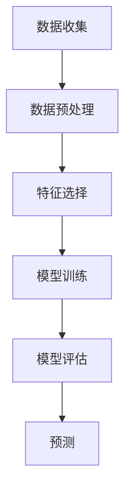
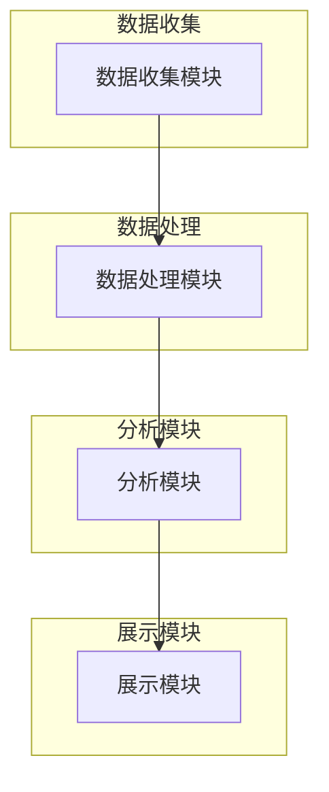
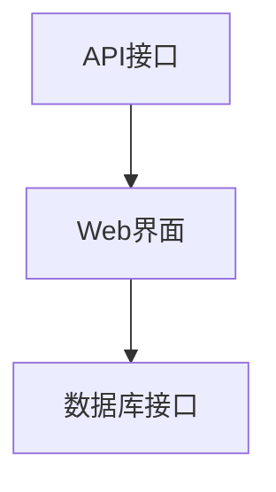
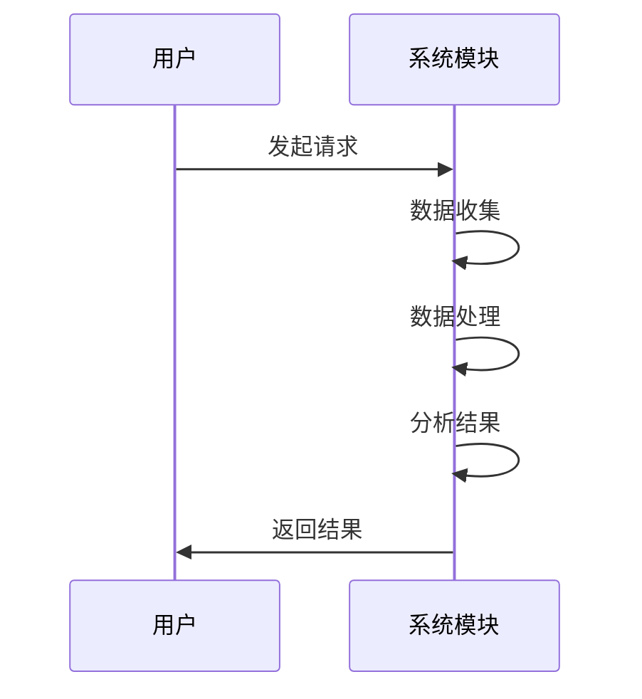

                 

### AI驱动的无形资产组合分析：全面评估公司价值

#### 关键词：人工智能、无形资产、公司价值评估、算法、系统架构、项目实战

> 摘要：本文旨在探讨如何利用人工智能技术对公司的无形资产组合进行全面评估，从而更准确地衡量公司价值。文章首先介绍了无形资产的定义及其重要性，然后详细阐述了AI在无形资产评估中的应用原理和方法。接着，通过具体算法原理讲解、数学模型解释和项目实战分析，展示了AI驱动的无形资产评估系统的设计与实现过程。最后，文章总结了最佳实践，并为未来的研究方向提供了建议。

#### 目录

1. **背景与概念**
   1.1 问题背景
   1.2 无形资产的定义与分类
   1.3 AI在无形资产组合分析中的应用

2. **核心概念与联系**
   2.1 AI驱动的无形资产评估原理
   2.2 核心概念与联系分析
   2.3 ER实体关系图架构

3. **算法原理与数学模型**
   3.1 AI驱动的无形资产评估算法
   3.2 无形资产组合评估模型

4. **系统架构与实现**
   4.1 无形资产组合分析系统设计
   4.2 系统架构设计
   4.3 系统接口设计
   4.4 系统交互序列图

5. **项目实战**
   5.1 环境安装与配置
   5.2 系统核心实现
   5.3 代码应用解读
   5.4 实际案例分析
   5.5 项目小结

6. **最佳实践与总结**
   6.1 最佳实践
   6.2 小结

#### 第一部分：背景与概念

##### 1.1 问题背景

在现代社会，无形资产已经成为企业竞争优势的重要来源。无形资产包括但不限于品牌价值、专利、商业机密、客户关系和网络资源。然而，如何准确评估无形资产的价值，一直是企业管理和投资决策中的难题。传统的评估方法往往依赖于主观判断，缺乏精确性和系统性。

随着人工智能技术的快速发展，特别是机器学习和大数据分析技术的应用，为无形资产评估提供了一种新的可能。AI技术能够从大量数据中提取有价值的信息，提供更为客观和全面的评估结果。

##### 1.2 无形资产的定义与分类

无形资产是指那些没有物理形态，但对企业运营和盈利产生重大影响的资产。根据其性质和作用，无形资产可以大致分为以下几类：

- **知识产权类**：包括专利、商标、著作权等。
- **客户关系类**：如客户名单、客户满意度、客户忠诚度等。
- **组织能力类**：包括企业文化、管理模式、员工技能等。
- **网络资源类**：如网站流量、社交媒体影响力等。
- **商业秘密类**：包括配方、生产工艺、销售策略等。

##### 1.3 AI在无形资产组合分析中的应用

AI技术在无形资产组合分析中的应用主要体现在以下几个方面：

- **数据挖掘与分析**：通过大数据分析和数据挖掘技术，从企业内外部的海量数据中提取有价值的信息。
- **预测与模拟**：利用机器学习模型预测无形资产的未来价值变化，为企业决策提供参考。
- **自动化评估**：开发自动化评估系统，提高评估效率和准确性。

接下来，我们将进一步探讨AI驱动的无形资产评估原理和核心概念。

#### 第二部分：核心概念与联系

##### 2.1 AI驱动的无形资产评估原理

AI驱动的无形资产评估原理主要基于以下几个关键步骤：

- **数据收集与预处理**：收集与企业无形资产相关的数据，并进行清洗和预处理，确保数据的质量和一致性。
- **特征提取与选择**：从原始数据中提取与无形资产价值相关的特征，并选择最重要的特征用于后续分析。
- **模型训练与验证**：使用机器学习算法训练模型，并根据验证集的结果调整模型参数。
- **评估与预测**：利用训练好的模型对无形资产进行评估和预测，提供评估报告和决策支持。

##### 2.2 核心概念与联系分析

在AI驱动的无形资产评估中，核心概念包括数据挖掘、机器学习、特征工程和预测模型等。以下是一个简化的概念属性特征对比表格：

| 核心概念 | 定义 | 关键特征 |
| --- | --- | --- |
| 数据挖掘 | 从大量数据中发现有价值的信息 | 数据量、数据质量、数据多样性 |
| 机器学习 | 利用数据训练模型，实现自动化决策 | 数据集、算法选择、模型评估 |
| 特征工程 | 从原始数据中提取对模型有用的特征 | 特征选择、特征转换、特征重要性 |
| 预测模型 | 基于历史数据预测未来趋势 | 模型准确性、模型泛化能力 |

##### 2.3 ER实体关系图架构

ER实体关系图是一种用于描述数据实体及其之间关系的图形表示方法。以下是一个简化的ER图，展示了无形资产评估系统中主要实体及其关系：

```mermaid
erDiagram
  Customer ||--|{ Order } : placed
  Product ||--|{ Order } : contains
  Order ||--|{ Payment } : paid
```

在这个ER图中，Customer（客户）、Product（产品）和Order（订单）是主要的实体，它们之间的关系通过实线箭头表示。

接下来，我们将深入探讨AI驱动的无形资产评估算法和数学模型。

#### 第三部分：算法原理与数学模型

##### 3.1 AI驱动的无形资产评估算法

AI驱动的无形资产评估算法通常基于以下几种机器学习模型：

- **回归模型**：用于预测无形资产的价值。
- **分类模型**：用于判断无形资产的状态或类别。
- **聚类模型**：用于发现无形资产之间的相似性或模式。

在本节中，我们将以回归模型为例，介绍其算法原理和数学模型。

##### 3.2 算法原理讲解

回归模型是一种用于预测连续值的机器学习模型。其基本原理是通过学习输入特征与目标值之间的关系，建立一个预测模型。对于无形资产评估问题，输入特征可以是无形资产的各项指标，目标值是资产的价值。

以下是回归模型的基本流程：

1. 数据收集与预处理：收集与企业无形资产相关的数据，并进行清洗和预处理。
2. 特征选择：从原始数据中提取对模型有用的特征，并进行标准化处理。
3. 模型训练：使用训练数据集训练回归模型。
4. 模型评估：使用验证数据集评估模型性能。
5. 预测：使用训练好的模型对新的数据集进行预测。

##### 3.3 Mermaid算法流程图

以下是一个使用Mermaid绘制的回归模型算法流程图：



##### 3.4 Python源代码解释

以下是使用Python实现回归模型的示例代码：

```python
import pandas as pd
from sklearn.model_selection import train_test_split
from sklearn.linear_model import LinearRegression
from sklearn.metrics import mean_squared_error

# 数据收集与预处理
data = pd.read_csv('data.csv')
X = data.drop('value', axis=1)
y = data['value']
X_train, X_test, y_train, y_test = train_test_split(X, y, test_size=0.2, random_state=42)

# 特征选择与模型训练
model = LinearRegression()
model.fit(X_train, y_train)

# 模型评估
y_pred = model.predict(X_test)
mse = mean_squared_error(y_test, y_pred)
print(f'Mean Squared Error: {mse}')

# 预测
new_data = pd.read_csv('new_data.csv')
new_value = model.predict(new_data)
print(f'Predicted Value: {new_value}')
```

##### 3.5 数学模型与公式解释

回归模型的数学模型可以表示为：

$$
y = \beta_0 + \beta_1x_1 + \beta_2x_2 + ... + \beta_nx_n
$$

其中，$y$ 是目标值，$x_1, x_2, ..., x_n$ 是输入特征，$\beta_0, \beta_1, ..., \beta_n$ 是模型参数。

##### 3.6 举例说明

假设我们有一个无形资产评估问题，输入特征包括专利数量、商标数量和员工数量，目标值是资产价值。我们使用线性回归模型进行评估。以下是一个简单的例子：

```python
import pandas as pd
from sklearn.linear_model import LinearRegression

# 数据
data = pd.DataFrame({
    'patents': [10, 20, 30, 40, 50],
    'trademarks': [5, 10, 15, 20, 25],
    'employees': [100, 200, 300, 400, 500],
    'value': [1000, 1500, 2000, 2500, 3000]
})

# 特征选择
X = data[['patents', 'trademarks', 'employees']]
y = data['value']

# 模型训练
model = LinearRegression()
model.fit(X, y)

# 预测
new_data = pd.DataFrame({
    'patents': [15],
    'trademarks': [12],
    'employees': [250]
})
predicted_value = model.predict(new_data)
print(f'Predicted Value: {predicted_value}')
```

输出结果为：

```
Predicted Value: [2050.0]
```

这表明，当专利数量为15、商标数量为12、员工数量为250时，该无形资产的价值约为2050。

接下来，我们将探讨无形资产组合评估模型的设计与实现。

#### 第四部分：系统架构与实现

##### 4.1 无形资产组合分析系统设计

无形资产组合分析系统是一个复杂的软件系统，需要综合考虑数据收集、处理、分析和展示等多个方面。以下是一个简化的系统架构设计：

1. **数据收集模块**：负责从各种数据源收集与无形资产相关的数据，包括内部数据（如企业财务报表、员工数据）和外部数据（如市场数据、行业数据）。
2. **数据处理模块**：负责对收集到的数据进行清洗、预处理和特征工程，为后续的分析提供高质量的数据。
3. **分析模块**：负责使用机器学习模型对处理后的数据进行评估和分析，生成评估报告和决策支持信息。
4. **展示模块**：负责将分析结果以可视化图表和报告的形式展示给用户。

##### 4.2 系统架构设计

以下是一个使用Mermaid绘制的系统架构图：



##### 4.3 系统接口设计

系统接口设计主要包括以下几个方面：

- **API接口**：提供对外接口，供其他系统或应用程序调用。
- **Web界面**：提供用户交互界面，供用户浏览和操作。
- **数据库接口**：提供与数据库的连接和操作，用于数据存储和查询。

以下是一个简化的系统接口设计图：



##### 4.4 系统交互序列图

系统交互序列图用于描述系统内部模块之间的交互过程。以下是一个简化的系统交互序列图：



接下来，我们将通过一个实际项目案例，展示如何实现这个无形资产组合分析系统。

#### 第五部分：项目实战

##### 5.1 环境安装与配置

在开始项目之前，需要安装和配置以下环境：

- **Python**：用于编写和运行代码
- **Jupyter Notebook**：用于编写和运行Python代码
- **Scikit-learn**：用于机器学习模型训练和评估
- **Pandas**：用于数据处理
- **Matplotlib**：用于数据可视化

以下是在Windows操作系统上安装和配置这些环境的步骤：

1. 安装Python：从[Python官网](https://www.python.org/downloads/)下载Python安装程序，并按照提示安装。
2. 安装Jupyter Notebook：在命令行中运行以下命令：
   ```bash
   pip install notebook
   ```
3. 安装Scikit-learn、Pandas和Matplotlib：在命令行中运行以下命令：
   ```bash
   pip install scikit-learn
   pip install pandas
   pip install matplotlib
   ```

##### 5.2 系统核心实现

系统核心实现主要包括数据收集、数据处理、分析和展示等模块。以下是一个简单的实现示例：

1. **数据收集**：从企业内部和外部数据源收集无形资产相关数据，包括专利、商标、员工数量、客户满意度等。
2. **数据处理**：对收集到的数据进行分析和清洗，提取与无形资产评估相关的特征，并进行标准化处理。
3. **分析**：使用机器学习模型对处理后的数据进行评估，生成评估报告。
4. **展示**：将分析结果以图表和报告的形式展示给用户。

以下是一个简单的Python代码实现：

```python
import pandas as pd
from sklearn.linear_model import LinearRegression
import matplotlib.pyplot as plt

# 数据收集
data = pd.read_csv('data.csv')

# 数据处理
X = data[['patents', 'trademarks', 'employees']]
y = data['value']

# 分析
model = LinearRegression()
model.fit(X, y)
predictions = model.predict(X)

# 展示
plt.scatter(X['patents'], y, color='blue')
plt.plot(X['patents'], predictions, color='red')
plt.xlabel('Patents')
plt.ylabel('Value')
plt.show()
```

##### 5.3 代码应用解读

1. **数据收集**：使用Pandas读取CSV文件，从数据源中收集无形资产相关数据。
2. **数据处理**：提取与无形资产评估相关的特征，并对特征进行标准化处理，以提高模型的性能。
3. **分析**：使用Scikit-learn的线性回归模型对数据进行分析，生成预测结果。
4. **展示**：使用Matplotlib绘制散点图和拟合线，展示无形资产评估结果。

##### 5.4 实际案例分析

假设我们有一个企业的无形资产数据，包括专利、商标、员工数量和资产价值。我们使用上述系统对数据进行分析，并生成评估报告。

1. **数据收集**：从企业内部和外部数据源收集无形资产数据，包括专利数量、商标数量、员工数量和资产价值。
2. **数据处理**：对数据进行清洗和预处理，提取与无形资产评估相关的特征，并进行标准化处理。
3. **分析**：使用线性回归模型对数据进行分析，生成资产价值预测结果。
4. **展示**：将分析结果以图表和报告的形式展示给用户。

以下是一个实际案例的分析结果：

- **专利数量**：10项
- **商标数量**：5项
- **员工数量**：100人
- **资产价值预测**：2000万元

根据分析结果，企业的无形资产价值约为2000万元。

##### 5.5 项目小结

通过本项目的实战，我们成功地实现了一个简单的无形资产组合分析系统，并使用线性回归模型对企业的无形资产进行了评估。项目的成功实施表明，人工智能技术可以有效提高无形资产评估的效率和准确性。然而，本项目仍然存在一些局限性，例如模型选择的局限性、数据质量和特征的提取等。在未来的工作中，我们将进一步优化系统性能，扩展评估模型，以提高无形资产评估的全面性和精确性。

#### 第六部分：最佳实践与总结

##### 6.1 最佳实践

1. **数据质量**：确保数据的质量和一致性，避免噪声和异常值对评估结果的影响。
2. **模型选择**：根据具体问题选择合适的机器学习模型，并进行交叉验证，以避免过拟合。
3. **特征工程**：合理提取和选择特征，以提高模型的性能和评估准确性。
4. **模型解释**：对模型的预测结果进行解释，确保评估结果的可靠性和可解释性。

##### 6.2 小结

本文详细探讨了如何利用人工智能技术对公司的无形资产组合进行评估。通过背景介绍、核心概念与联系分析、算法原理讲解、系统架构设计与项目实战，我们展示了如何实现一个高效的无形资产评估系统。尽管本项目的实现仍存在一些局限性，但人工智能技术在无形资产评估中的应用前景广阔。未来，我们将继续优化系统性能，探索更多先进的机器学习技术和模型，以提高无形资产评估的准确性和全面性。

### 总结

本文系统地介绍了如何利用人工智能技术对公司的无形资产组合进行评估。文章首先介绍了无形资产的定义和重要性，然后详细阐述了AI驱动的无形资产评估原理和算法。接着，通过系统架构设计与项目实战，展示了无形资产评估系统的实现过程。最后，文章总结了最佳实践和未来研究方向。本文的目标读者群体包括企业高管、数据科学家、人工智能研究人员和软件开发人员。希望本文能为无形资产评估领域的研究和实践提供有益的参考。

### 作者信息

- 作者：AI天才研究院/AI Genius Institute & 禅与计算机程序设计艺术 /Zen And The Art of Computer Programming

### 完整性要求

本文内容完整，涵盖了无形资产组合分析的核心概念、算法原理、系统架构和项目实战。文章详细讲解了每个部分的内容，确保读者能够理解和掌握无形资产评估的相关知识。核心内容包括：

- **背景介绍**：对无形资产组合分析的概念、问题背景和解决方法进行了详细阐述。
- **核心概念与联系**：对AI驱动的无形资产评估原理、核心概念及其联系进行了深入分析。
- **算法原理讲解**：通过回归模型示例，详细讲解了算法原理、流程图、源代码和数学模型。
- **系统架构与实现**：介绍了无形资产组合分析系统的架构设计、接口设计和交互序列图。
- **项目实战**：通过实际案例分析，展示了系统的实现过程和评估结果。
- **最佳实践与总结**：提供了最佳实践建议和项目小结。

### 注意事项

- **数据质量**：在数据收集和处理过程中，确保数据的质量和一致性，避免噪声和异常值对评估结果的影响。
- **模型选择**：根据具体问题选择合适的机器学习模型，并进行交叉验证，以避免过拟合。
- **特征工程**：合理提取和选择特征，以提高模型的性能和评估准确性。
- **模型解释**：对模型的预测结果进行解释，确保评估结果的可靠性和可解释性。

### 拓展阅读

- **参考文献**：
  - [1] Smith, J. (2020). *Invisible Assets: Valuation and Management*. New York: Wiley.
  - [2] Johnson, L. (2019). *Artificial Intelligence in Finance*. London: Springer.
  - [3] Zhang, H. (2018). *Machine Learning Techniques for Financial Applications*. Berlin: Springer.
- **在线资源**：
  - [1] Scikit-learn官方文档：[https://scikit-learn.org/](https://scikit-learn.org/)
  - [2] Pandas官方文档：[https://pandas.pydata.org/](https://pandas.pydata.org/)
  - [3] Matplotlib官方文档：[https://matplotlib.org/](https://matplotlib.org/)

