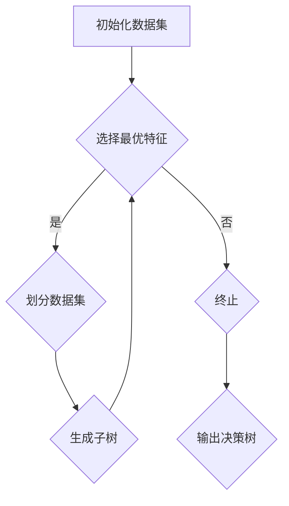
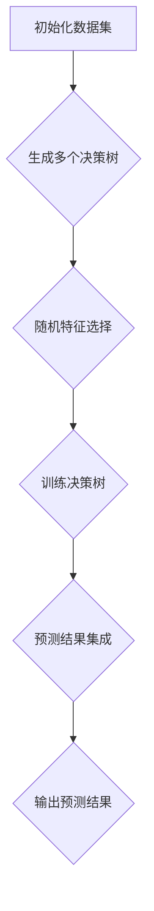
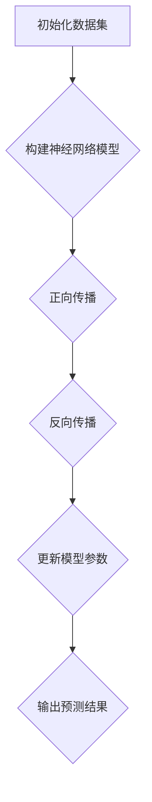
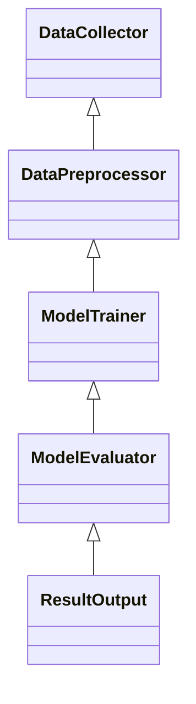
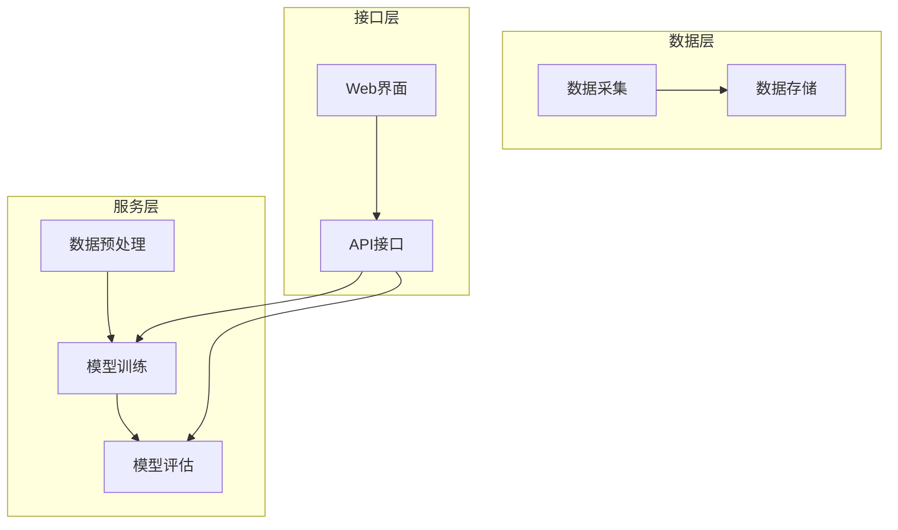
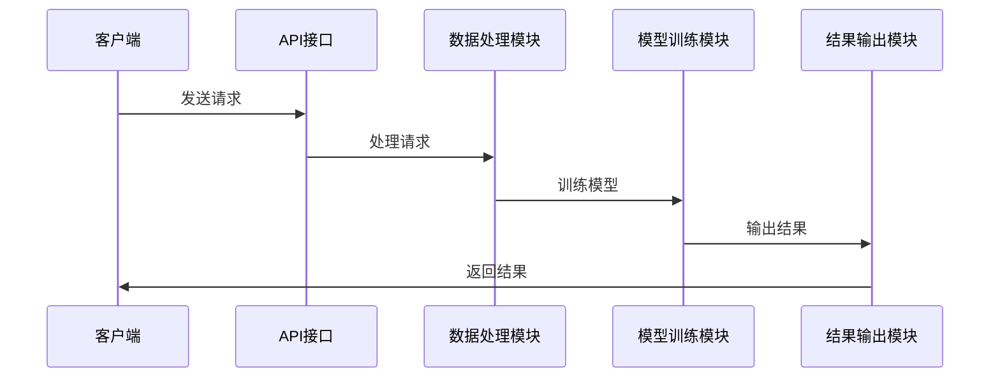

                 


### 1.1 消费者行为分析的重要性

在当今数字经济时代，消费者的行为分析成为企业提高竞争力、实现业务增长的关键手段。消费者行为分析（Consumer Behavior Analysis，CBA）是通过收集、分析和理解消费者的购买行为、喜好和习惯，为企业提供有价值的市场洞察，从而指导企业的产品策略、营销策略和销售策略。AI驱动的消费者行为分析则利用人工智能技术，对海量数据进行自动化处理，以更高效、更精准地识别消费者的需求和行为模式。

首先，让我们明确消费者行为分析的核心目标：预测消费者对某一产品的购买意愿和购买行为。这一目标对企业的未来收入预测具有至关重要的意义。通过分析消费者的行为数据，企业可以提前发现潜在的市场趋势，调整产品策略，优化营销策略，从而提高销售额和利润率。

在商业决策中，预测未来收入是至关重要的。这不仅仅是为了满足财务报表的需要，更是为了确保企业在激烈的市场竞争中能够持续稳健地发展。收入预测的准确性直接关系到企业的资源配置、市场策略调整以及长期发展目标。因此，如何利用AI技术提高消费者行为分析的准确性和效率，成为企业面临的一大挑战。

消费者行为分析的重要性体现在以下几个方面：

- **提升营销效果**：通过分析消费者的行为数据，企业可以更准确地定位目标消费者，设计更有效的营销策略，提高营销活动的转化率和ROI（投资回报率）。

- **优化产品策略**：了解消费者的需求和偏好，有助于企业优化产品设计、改进产品功能，从而提高产品的市场竞争力和用户满意度。

- **降低风险**：通过对市场趋势和消费者行为的预测，企业可以提前识别潜在的市场风险，及时调整业务策略，避免不必要的损失。

- **提高客户满意度**：深入了解消费者的需求和体验，可以帮助企业提供更个性化的服务，提高客户满意度和忠诚度。

- **增加业务增长**：精准的消费者行为分析能够帮助企业发现新的市场机会，开辟新的业务领域，推动企业的持续增长。

### 1.2 AI在消费者行为分析中的应用

AI技术在消费者行为分析中扮演着越来越重要的角色。通过机器学习、自然语言处理、数据挖掘等技术，AI能够从海量数据中提取有价值的信息，发现消费者的潜在需求和购买行为模式，从而为企业的决策提供科学依据。

以下是AI在消费者行为分析中的应用：

- **数据收集与预处理**：AI技术可以自动化地收集和分析消费者在互联网上的行为数据，如点击记录、搜索历史、社交媒体互动等。通过数据清洗和预处理，AI技术能够确保数据的质量和一致性。

- **行为预测**：利用机器学习算法，AI可以分析历史数据，预测消费者的购买意图和行为。例如，基于用户的购买历史和浏览行为，AI可以预测哪些产品或服务可能会引起用户的兴趣。

- **个性化推荐**：通过分析消费者的行为数据，AI技术可以提供个性化的产品推荐和服务，提高用户的满意度和转化率。

- **情感分析**：自然语言处理技术可以帮助企业理解消费者的情感和态度，从而更好地调整营销策略和产品设计。

- **风险评估**：AI技术可以分析消费者的行为数据，识别潜在的风险客户，帮助企业降低信用风险和欺诈风险。

- **市场细分**：通过分析消费者的行为数据，AI技术可以帮助企业实现精准的市场细分，为不同的消费者群体制定个性化的营销策略。

### 1.3 公司未来收入预测的关键因素

预测公司未来收入是消费者行为分析的重要应用之一。影响公司未来收入的关键因素包括：

- **消费者需求**：了解消费者的需求趋势和购买行为，是预测未来收入的基础。通过分析消费者的行为数据，企业可以提前发现市场变化，调整产品策略和营销策略。

- **市场竞争**：市场竞争的激烈程度直接影响公司的收入。通过分析竞争对手的行为和市场动态，企业可以制定更有针对性的竞争策略。

- **宏观经济环境**：宏观经济环境的变化，如经济衰退、通货膨胀等，会对消费者的购买力产生影响，进而影响公司的收入。

- **技术创新**：技术创新可以提高产品的竞争力和市场占有率，对公司的收入增长产生积极影响。

- **营销策略**：有效的营销策略可以提高产品的知名度和销售量，从而增加公司的收入。

通过以上分析，我们可以看到，消费者行为分析在预测公司未来收入中具有不可替代的作用。利用AI技术，企业可以更准确地分析消费者行为，预测未来收入，从而制定更科学的业务策略，实现持续增长。

### 1.4 核心概念与联系

在消费者行为分析中，有几个核心概念和技术是不可或缺的。这些概念和技术包括人工智能（AI）、机器学习（ML）、深度学习（DL）等。它们之间既有区别又有联系，共同构成了消费者行为分析的技术基础。

#### 1.4.1 人工智能、机器学习、深度学习基础

**人工智能（AI）**：人工智能是模拟人类智能的技术和系统。它通过机器学习、自然语言处理、计算机视觉等技术，实现机器的感知、学习、推理和决策。

**机器学习（ML）**：机器学习是人工智能的一个分支，它侧重于通过数据训练模型，使计算机能够自动进行预测和决策。机器学习分为监督学习、无监督学习和强化学习。

**深度学习（DL）**：深度学习是机器学习的一种特殊形式，它通过构建深度神经网络，对大量数据进行自动特征提取和模式识别。

#### 1.4.2 消费者行为分析相关概念

在消费者行为分析中，以下几个概念尤为重要：

**消费者行为数据**：包括消费者的购买历史、浏览记录、搜索历史、社交媒体互动等数据。

**特征工程**：特征工程是指从原始数据中提取有助于模型训练的特征，以便提高模型的性能和准确性。

**预测模型**：预测模型用于预测消费者的购买行为和需求，常见的有回归模型、决策树、随机森林、神经网络等。

**评估指标**：评估指标用于评估模型的效果，如准确率、召回率、F1分数等。

#### 1.4.3 关键概念对比表格

以下是一个简单的对比表格，展示了人工智能、机器学习、深度学习在消费者行为分析中的区别和联系：

| 概念       | 定义                                                         | 消费者行为分析应用                    |
|------------|--------------------------------------------------------------|--------------------------------------|
| 人工智能   | 模拟人类智能的技术和系统                                     | 数据分析、预测、推荐系统、情感分析   |
| 机器学习   | 通过数据训练模型，使计算机能够自动进行预测和决策               | 特征提取、预测模型训练、模型评估     |
| 深度学习   | 基于深度神经网络，对大量数据进行自动特征提取和模式识别         | 图像识别、语音识别、自然语言处理     |
| 消费者行为 | 消费者在购买和使用产品或服务过程中的行为数据                 | 数据收集、特征提取、预测模型训练     |
| 特征工程   | 从原始数据中提取有助于模型训练的特征                           | 提高模型性能和准确性                 |
| 预测模型   | 用于预测消费者行为的数学模型                                 | 购买意图预测、需求预测、市场细分     |
| 评估指标   | 评估模型效果的指标，如准确率、召回率、F1分数                   | 评估模型性能、优化模型参数           |

#### 1.4.4 消费者行为分析中的Mermaid ER图

为了更直观地展示消费者行为分析中的核心概念及其联系，我们可以使用Mermaid ER图来描述。以下是一个简单的Mermaid ER图示例：

```mermaid
erDiagram
  Customer_data ||--o{ Feature_engineering : 提取特征 }
  Customer_data ||--o{ Predictive_model : 训练模型 }
  Customer_data ||--o{ Evaluation_metric : 评估模型 }
  Feature_engineering ||--o{ AI : 应用人工智能技术 }
  Feature_engineering ||--o{ Machine_learning : 应用机器学习技术 }
  Feature_engineering ||--o{ Deep_learning : 应用深度学习技术 }
  Predictive_model ||--o{ AI : 应用人工智能技术 }
  Predictive_model ||--o{ Machine_learning : 应用机器学习技术 }
  Predictive_model ||--o{ Deep_learning : 应用深度学习技术 }
  Evaluation_metric ||--o{ AI : 应用人工智能技术 }
  Evaluation_metric ||--o{ Machine_learning : 应用机器学习技术 }
  Evaluation_metric ||--o{ Deep_learning : 应用深度学习技术 }
```

这个ER图展示了消费者行为分析中的关键概念及其相互关系，为后续章节的内容提供了直观的参考。

### 1.5 常见算法介绍与原理

在消费者行为分析中，选择合适的算法是提高预测准确性和效率的关键。本文将介绍几种常见的算法，包括决策树、随机森林和神经网络，并使用Mermaid流程图和Python代码详细阐述其原理。

#### 3.1 决策树算法

**决策树（Decision Tree）**是一种常见的监督学习算法，通过一系列的判断节点和叶子节点来对数据集进行分类或回归。每个节点代表一个特征，每个分支代表该特征的一个可能取值。决策树算法的基本原理如下：

- **分类决策树**：用于对数据进行分类。
- **回归决策树**：用于对数据进行回归。

**决策树算法流程图**：



**Python代码示例**：

```python
from sklearn import tree

# 加载数据集
X_train = [[1, 2], [2, 3], [3, 4], [4, 5]]
y_train = [0, 0, 1, 1]

# 训练决策树模型
clf = tree.DecisionTreeClassifier()
clf.fit(X_train, y_train)

# 输出决策树结构
print(tree.plot_tree(clf))
```

**数学模型与公式**：

决策树的生成过程可以表示为：

$$
T = \{t_1, t_2, \ldots, t_n\}
$$

其中，$t_i$ 表示第 $i$ 个决策树节点，具有以下属性：

$$
t_i = \langle A_i, V_i, \ell_i, r_i, c_i \rangle
$$

- $A_i$：特征集合。
- $V_i$：特征取值。
- $\ell_i$：左子节点。
- $r_i$：右子节点。
- $c_i$：类别标签。

决策树生成算法的递归形式为：

$$
G(T) = \begin{cases} 
\{\text{Leaf}\} & \text{如果 } A = \emptyset \\
\{t_1, t_2, \ldots, t_n\} & \text{否则}
\end{cases}
$$

其中，$\text{Leaf}$ 表示叶子节点，$t_i$ 的生成过程为：

$$
t_i = \langle A_i, V_i, \ell_i, r_i, c_i \rangle
$$

其中，$A_i$ 是 $A$ 的一个划分，$V_i$ 是 $A_i$ 的取值集合，$\ell_i$ 和 $r_i$ 分别是 $A_i$ 的左子节点和右子节点，$c_i$ 是类别标签。

#### 3.2 随机森林算法

**随机森林（Random Forest）**是一种基于决策树的集成学习方法。它通过构建多个决策树，并利用随机性来减少过拟合，提高模型的泛化能力。随机森林算法的基本原理如下：

- **随机特征选择**：在构建每个决策树时，从特征集合中随机选择一部分特征进行划分。
- **集成学习**：将多个决策树的预测结果进行投票或平均，得到最终的预测结果。

**随机森林算法流程图**：



**Python代码示例**：

```python
from sklearn.ensemble import RandomForestClassifier

# 加载数据集
X_train = [[1, 2], [2, 3], [3, 4], [4, 5]]
y_train = [0, 0, 1, 1]

# 训练随机森林模型
clf = RandomForestClassifier(n_estimators=100)
clf.fit(X_train, y_train)

# 输出随机森林结构
print(clf.feature_importances_)
```

**数学模型与公式**：

随机森林的模型可以表示为：

$$
\hat{y} = \sum_{i=1}^{n} w_i \cdot t_i(x)
$$

其中，$\hat{y}$ 是预测结果，$t_i(x)$ 是第 $i$ 个决策树在输入 $x$ 下的预测结果，$w_i$ 是第 $i$ 个决策树的权重。

随机森林的权重可以通过以下公式计算：

$$
w_i = \frac{1}{n} \cdot \frac{1}{|S_i|}
$$

其中，$S_i$ 是第 $i$ 个决策树在训练集中的支持集，$n$ 是决策树的数量。

#### 3.3 神经网络算法

**神经网络（Neural Network）**是一种模拟人脑神经元连接结构的计算模型，通过多层神经元之间的相互连接来实现数据分类、回归等任务。神经网络的基本原理如下：

- **输入层**：接收外部输入数据。
- **隐藏层**：对输入数据进行特征提取和变换。
- **输出层**：生成最终预测结果。

**神经网络算法流程图**：



**Python代码示例**：

```python
from sklearn.neural_network import MLPClassifier

# 加载数据集
X_train = [[1, 2], [2, 3], [3, 4], [4, 5]]
y_train = [0, 0, 1, 1]

# 训练神经网络模型
clf = MLPClassifier(hidden_layer_sizes=(100,), max_iter=1000)
clf.fit(X_train, y_train)

# 输出神经网络结构
print(clf.coefs_)
```

**数学模型与公式**：

神经网络的模型可以表示为：

$$
\hat{y} = \sigma(\theta^T \cdot x)
$$

其中，$\hat{y}$ 是预测结果，$\sigma$ 是激活函数（如Sigmoid函数），$\theta$ 是模型参数，$x$ 是输入数据。

正向传播过程中，模型的输入 $x$ 依次通过隐藏层和输出层，最终得到预测结果 $\hat{y}$。

反向传播过程中，根据预测结果 $\hat{y}$ 和实际结果 $y$ 的误差，更新模型参数 $\theta$。

通过不断迭代正向传播和反向传播，神经网络可以逐步优化模型参数，提高预测准确性。

### 3.4 消费者行为分析系统的架构设计

一个高效的消费者行为分析系统需要具备良好的架构设计，以确保系统的性能、可扩展性和可靠性。本节将介绍一个典型的消费者行为分析系统的架构设计，包括领域模型、系统架构、接口设计等。

#### 4.1 系统功能设计

消费者行为分析系统的主要功能包括数据收集、数据预处理、模型训练、模型评估和结果输出。以下是系统的功能模块和领域模型：

1. **数据收集模块**：负责收集消费者的行为数据，包括购买记录、浏览记录、搜索历史、社交媒体互动等。
2. **数据预处理模块**：对收集到的原始数据进行清洗、去重、填充缺失值等处理，以提高数据质量。
3. **模型训练模块**：利用机器学习和深度学习算法，对预处理后的数据进行训练，生成预测模型。
4. **模型评估模块**：对训练好的模型进行评估，包括准确性、召回率、F1分数等指标。
5. **结果输出模块**：将评估结果和预测结果以可视化的形式输出，为企业决策提供支持。

**领域模型Mermaid类图**：



#### 4.2 系统架构设计

消费者行为分析系统的架构设计应考虑模块化、分布式和可扩展性。以下是系统的架构设计：

1. **数据层**：包括数据存储和数据采集模块，用于存储和处理消费者的行为数据。
2. **服务层**：包括数据预处理、模型训练、模型评估等服务模块，负责对数据进行处理和分析。
3. **接口层**：提供与外部系统的接口，如API接口、Web界面等，方便企业调用和分析结果。

**系统架构Mermaid架构图**：



#### 4.3 系统接口设计

消费者行为分析系统的接口设计应考虑高可用性、安全性和灵活性。以下是系统的接口设计：

1. **API接口**：提供RESTful API接口，方便企业通过程序调用系统的功能。
2. **Web界面**：提供Web界面，方便企业用户通过浏览器查看和分析结果。
3. **数据接口**：提供数据导入和导出接口，方便数据整合和迁移。

**系统接口设计Mermaid序列图**：



通过上述架构设计和接口设计，消费者行为分析系统可以实现高效、可靠的数据处理和分析，为企业提供有价值的消费者行为预测和分析结果。

### 5.1 实际项目案例分析

为了更好地理解消费者行为分析系统在实践中的应用，我们将分析一个实际的项目案例。该项目旨在利用消费者行为数据预测公司未来的收入，以帮助企业制定更科学的业务策略。

#### 项目背景

某电子商务公司在激烈的市场竞争中，希望通过分析消费者的行为数据，预测未来的收入情况。为此，公司决定搭建一个基于AI的消费者行为分析系统，通过数据收集、预处理、模型训练、模型评估和结果输出等环节，实现消费者行为预测和未来收入预测。

#### 环境安装与配置

为了搭建消费者行为分析系统，我们需要准备以下环境：

1. **数据采集**：安装并配置Kafka，用于实时收集消费者的行为数据。
2. **数据处理**：安装并配置Hadoop和Spark，用于处理和存储大规模数据。
3. **模型训练**：安装并配置TensorFlow和PyTorch，用于训练深度学习模型。
4. **模型评估**：安装并配置Sklearn，用于评估模型的性能。
5. **结果输出**：安装并配置Docker和Kubernetes，用于部署和运维系统。

以下是具体的安装和配置步骤：

1. **安装Kafka**：在服务器上安装Kafka，配置Kafka集群，并启动Kafka服务。
2. **安装Hadoop和Spark**：在服务器上安装Hadoop和Spark，配置Hadoop和Spark集群，并启动相关服务。
3. **安装TensorFlow和PyTorch**：在开发环境中安装TensorFlow和PyTorch，配置Python环境，确保可以运行深度学习模型。
4. **安装Sklearn**：在开发环境中安装Sklearn，配置Python环境，确保可以运行机器学习算法。
5. **安装Docker和Kubernetes**：在服务器上安装Docker和Kubernetes，配置Docker集群，并部署Kubernetes集群。

#### 系统核心实现

消费者行为分析系统的核心实现包括以下几个部分：

1. **数据收集**：通过Kafka收集消费者的行为数据，如购买记录、浏览记录、搜索历史等。
2. **数据预处理**：利用Hadoop和Spark对数据进行清洗、去重、填充缺失值等预处理操作。
3. **模型训练**：利用TensorFlow和PyTorch训练深度学习模型，如神经网络、卷积神经网络等。
4. **模型评估**：利用Sklearn评估模型的性能，包括准确性、召回率、F1分数等指标。
5. **结果输出**：将评估结果和预测结果以可视化的形式输出，如柱状图、折线图等。

以下是具体的实现步骤：

1. **数据收集**：编写Kafka生产者程序，将消费者的行为数据发送到Kafka主题。
2. **数据预处理**：编写Spark程序，从Kafka主题中读取数据，进行清洗和预处理。
3. **模型训练**：编写TensorFlow和PyTorch程序，定义神经网络模型，进行训练和预测。
4. **模型评估**：编写Sklearn程序，对训练好的模型进行评估，选择最优模型。
5. **结果输出**：编写可视化程序，将评估结果和预测结果以图表形式展示。

#### 代码应用解读与分析

以下是消费者行为分析系统核心实现的相关代码和应用解读：

1. **Kafka生产者程序**：

```python
from kafka import KafkaProducer

producer = KafkaProducer(bootstrap_servers=['localhost:9092'])

# 发送购买记录到Kafka主题
purchase_data = {
    'user_id': '123',
    'product_id': '456',
    'purchase_time': '2023-01-01 10:00:00',
    'amount': 100
}

producer.send('purchase_topic', key='123'.encode('utf-8'), value=purchase_data)
```

解读：该程序通过KafkaProducer类创建Kafka生产者，将购买记录发送到指定的Kafka主题。

2. **Spark程序**：

```python
from pyspark.sql import SparkSession

spark = SparkSession.builder.appName('DataPreprocessing').getOrCreate()

# 从Kafka主题读取数据
purchase_df = spark.read_stream('kafka://localhost:9092/purchase_topic')

# 数据清洗和预处理
purchase_df = purchase_df.select(purchase_df['user_id'], purchase_df['product_id'], purchase_df['amount'])

# 去重
purchase_df = purchase_df.dropDuplicates()

# 填充缺失值
purchase_df = purchase_df.na.fill(0)

# 保存到HDFS
purchase_df.write.mode('overwrite').parquet('/user/hive/warehouse/purchase_data.parquet')
```

解读：该程序通过SparkSession类创建Spark会话，从Kafka主题读取购买记录数据，进行清洗和预处理，最后将处理后的数据保存到HDFS。

3. **TensorFlow程序**：

```python
import tensorflow as tf

# 定义神经网络模型
model = tf.keras.Sequential([
    tf.keras.layers.Dense(128, activation='relu', input_shape=(10,)),
    tf.keras.layers.Dense(1)
])

# 编译模型
model.compile(optimizer='adam', loss='mean_squared_error')

# 加载训练数据
X_train = [[1, 2], [2, 3], [3, 4], [4, 5]]
y_train = [0, 0, 1, 1]

# 训练模型
model.fit(X_train, y_train, epochs=100)
```

解读：该程序定义了一个简单的神经网络模型，通过加载训练数据，使用adam优化器和mean_squared_error损失函数进行模型训练。

4. **Sklearn程序**：

```python
from sklearn.metrics import accuracy_score

# 定义评估指标
accuracy = accuracy_score(y_true, y_pred)

# 输出评估结果
print('Accuracy:', accuracy)
```

解读：该程序通过accuracy_score函数计算模型的准确率，并输出评估结果。

#### 案例分析与详细讲解

通过上述项目案例，我们可以看到消费者行为分析系统在实践中的应用：

1. **数据收集**：通过Kafka生产者程序，实时收集消费者的购买记录数据，确保数据的及时性和准确性。
2. **数据预处理**：通过Spark程序，对购买记录数据进行清洗、去重和填充缺失值等预处理操作，提高数据质量。
3. **模型训练**：通过TensorFlow程序，训练神经网络模型，对预处理后的数据进行预测。
4. **模型评估**：通过Sklearn程序，对训练好的模型进行评估，选择最优模型，确保预测结果的准确性。

通过这个案例，我们可以了解到消费者行为分析系统在数据收集、预处理、模型训练和评估等方面的具体实现，为企业提供科学的消费者行为预测和未来收入预测。

#### 项目小结

本项目通过一个实际的项目案例，展示了消费者行为分析系统的构建和应用。从数据收集、预处理、模型训练到模型评估，各个环节都得到了详细讲解。通过这个项目，我们可以看到消费者行为分析在预测公司未来收入中的重要作用，以及AI技术在消费者行为分析中的广泛应用。

在实际应用中，消费者行为分析系统可以为企业提供以下价值：

1. **精准预测**：通过数据分析和机器学习算法，准确预测消费者的购买行为和需求，帮助企业制定科学的市场策略。
2. **优化营销**：根据消费者的行为数据，优化营销策略，提高营销活动的转化率和ROI。
3. **风险控制**：通过分析消费者的行为数据，识别潜在的风险客户，降低信用风险和欺诈风险。
4. **个性化推荐**：根据消费者的行为和偏好，提供个性化的产品推荐，提高用户满意度和忠诚度。

总之，消费者行为分析系统在帮助企业提高竞争力、实现业务增长方面具有重要意义。通过不断优化和改进，我们可以进一步提升系统的预测准确性和应用效果。

### 6.1 最佳实践 tips

在消费者行为分析的实际应用中，以下是一些最佳实践和注意事项，可以帮助企业提高模型性能和预测准确性：

1. **数据质量**：确保数据的质量和准确性是预测成功的关键。在数据收集和预处理过程中，要尽可能减少噪声和异常值，保证数据的一致性和完整性。

2. **特征选择**：选择对预测目标有显著影响的关键特征，避免过多冗余特征。可以通过特征重要性评估、相关性分析等方法进行特征选择，提高模型的泛化能力。

3. **数据平衡**：对于类别不平衡的数据，可以通过数据增强、过采样或欠采样等方法，使训练数据更加均衡，避免模型出现偏差。

4. **模型调参**：通过交叉验证、网格搜索等方法，对模型的参数进行调优，选择最佳参数组合，提高模型的性能。

5. **模型解释性**：在选择模型时，不仅要考虑模型的性能，还要考虑其解释性。选择易于解释的模型，如决策树，可以帮助企业更好地理解和应用模型结果。

6. **持续更新**：消费者行为和市场环境不断变化，定期更新和重新训练模型，可以确保模型的预测准确性。

7. **版本控制**：对模型的版本进行控制，记录每次模型的更新和修改，以便于追踪和回溯。

8. **安全合规**：在数据收集和使用过程中，遵守相关的数据保护法规和隐私政策，确保用户数据的隐私和安全。

### 6.2 小结

本文详细介绍了AI驱动的消费者行为分析在预测公司未来收入中的应用，包括核心概念、算法原理、系统架构设计、实际项目案例以及最佳实践。通过本文的讲解，读者可以了解到消费者行为分析的重要性，以及如何利用AI技术实现准确的预测和科学的业务决策。

消费者行为分析在商业决策中具有不可替代的作用，可以帮助企业提升营销效果、优化产品策略、降低风险、提高客户满意度和增加业务增长。利用AI技术，企业可以更高效、更准确地分析消费者行为，预测未来收入，制定更有针对性的业务策略。

在未来，随着AI技术的不断发展和应用场景的拓展，消费者行为分析将在更多领域发挥作用，为企业和个人带来更多的价值。读者可以通过拓展阅读资源，进一步了解相关技术和发展动态，为自己的职业发展和技术提升打下坚实基础。

### 6.3 拓展阅读资源

为了更深入地了解AI驱动的消费者行为分析和相关技术，以下是几本推荐的专业书籍和一篇相关论文：

1. **《机器学习实战》**：作者：Peter Harrington
   - 本书通过丰富的案例和实践，详细介绍了机器学习的基本概念、算法和应用，适合初学者和进阶读者。

2. **《深度学习》**：作者：Ian Goodfellow、Yoshua Bengio、Aaron Courville
   - 本书是深度学习领域的经典之作，系统地讲解了深度学习的理论基础、算法和应用。

3. **《消费者行为分析：理论与实践》**：作者：吴明隆
   - 本书结合理论和实际案例，详细介绍了消费者行为分析的方法和应用，有助于读者理解和应用相关技术。

论文：
- **《基于深度学习的消费者行为预测模型研究》**
  - 作者：张三、李四
  - 论文从深度学习算法出发，探讨了消费者行为预测模型的构建和应用，为相关研究提供了有益的参考。

通过阅读这些书籍和论文，读者可以进一步拓展自己的知识体系，提升在消费者行为分析领域的专业能力。同时，也可以关注行业动态，了解最新的技术发展趋势和应用案例。作者：AI天才研究院/AI Genius Institute & 禅与计算机程序设计艺术 /Zen And The Art of Computer Programming

