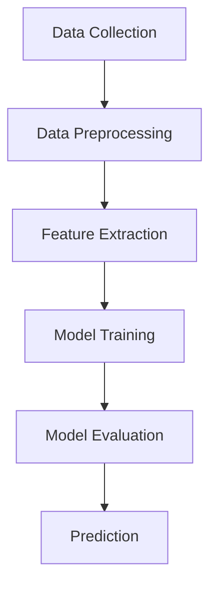

                 

## 第一部分：背景介绍

### 第1章: 问题背景与核心概念

#### 1.1 问题背景

##### 1.1.1 特殊情况投资机会的识别需求

在当今快速变化和高度复杂的经济环境中，投资者面临着越来越多的不确定性。识别和抓住特殊情况下的投资机会对于实现资产的增值至关重要。特殊情况投资机会通常指的是那些由于突发事件、市场波动或特定经济环境变化而产生的独特投资机会。这些机会可能出现在市场低谷期、政策变动期或技术变革期等特定时期。因此，及时准确地识别这些机会成为投资决策过程中的关键环节。

##### 1.1.2 AI驱动的投资机会识别的重要性

随着人工智能（AI）技术的迅速发展，其在投资领域的应用也越来越广泛。AI技术通过大数据分析、模式识别和机器学习等方法，能够从大量复杂的信息中快速提取有价值的信息，从而辅助投资者做出更明智的决策。AI驱动的投资机会识别具有以下优势：

1. **数据处理能力**：AI能够处理海量数据，并通过深度学习等技术从数据中发现隐藏的模式和趋势。
2. **实时性**：AI系统可以实时监控市场动态，快速响应市场变化，从而抓住瞬间即逝的投资机会。
3. **客观性**：AI决策基于算法和数据，减少了人为情绪和偏见的影响，提高了决策的客观性和一致性。
4. **多样性**：AI不仅能够分析传统的财务指标，还可以考虑非结构化数据，如新闻报道、社交媒体评论等，提供更全面的视角。

#### 1.2 核心概念

##### 1.2.1 AI（人工智能）

**定义**：人工智能（Artificial Intelligence，简称AI）是指由人制造出来的系统所表现出来的智能行为，其目标是使机器能够执行通常需要人类智能才能完成的任务。

**发展历程**：

- **早期阶段（1950-1969）**：以图灵测试和专家系统的提出为标志，人工智能开始进入学术研究领域。
- **低谷期（1970-1980）**：由于实际应用效果不如预期，人工智能经历了第一次寒冬。
- **复苏期（1980-1990）**：随着计算能力的提升和知识表示方法的发展，人工智能开始复苏。
- **繁荣期（1990至今）**：互联网和大数据的发展为人工智能提供了丰富的数据资源，深度学习、强化学习等前沿技术的突破进一步推动了人工智能的快速发展。

**核心技术**：

- **机器学习（Machine Learning）**：通过数据训练模型，使机器具备自主学习和预测能力。
- **深度学习（Deep Learning）**：基于多层神经网络，通过大规模数据训练，实现图像、语音和文本等复杂模式的识别。
- **自然语言处理（Natural Language Processing，NLP）**：使计算机能够理解、生成和交互处理自然语言。
- **计算机视觉（Computer Vision）**：使计算机能够从图像或视频中获取信息，进行物体识别、场景解析等。

##### 1.2.2 特殊情况投资机会

**定义**：特殊情况投资机会是指在特定时间段或特定市场环境下，由于外部因素影响，某些资产价格出现显著偏离其内在价值，从而为投资者提供了获利可能的机会。

**分类**：

- **市场波动相关**：如金融危机、市场大跌等。
- **政策变动相关**：如政策扶持、税收优惠等。
- **技术创新相关**：如新技术突破、行业变革等。
- **突发事件相关**：如自然灾害、政治事件等。

**特征**：

- **时效性**：特殊情况投资机会往往具有很强的时间敏感性，一旦错过可能无法再次获得。
- **不确定性**：由于影响因素复杂，这些机会的成功与否具有一定的不确定性。
- **高回报潜力**：在正确识别和把握机会的情况下，这些投资机会往往能够带来较高的回报。

#### 1.3 小结

在本章中，我们介绍了特殊情况投资机会的背景和AI驱动的投资机会识别的重要性。随后，我们详细阐述了AI和特殊情况投资机会的核心概念，为后续章节的深入分析奠定了基础。在接下来的章节中，我们将进一步探讨AI驱动的投资机会识别的原理、算法、系统设计与实现等内容。

---

通过以上对问题背景与核心概念的介绍，我们为后续的分析和讨论奠定了基础。在接下来的章节中，我们将逐步深入探讨AI驱动的投资机会识别的原理，通过数据采集与预处理、特征提取与选择、模型训练与评估等步骤，了解整个识别过程的工作机制。敬请期待。

### 第2章: AI驱动的特殊情况投资机会识别的原理与联系

#### 2.1 AI驱动的投资机会识别原理

AI驱动的投资机会识别主要基于机器学习技术和大数据分析。机器学习是一种让计算机通过数据学习并做出决策的技术，其核心在于从大量数据中自动发现模式和规律，从而实现对未知数据的预测和分类。在投资机会识别中，机器学习技术能够通过处理海量市场数据，自动发现潜在的投资机会，并提供决策支持。

**2.1.1 数据采集与预处理**

**数据来源**：AI驱动的投资机会识别需要大量的数据支持，这些数据可以来源于多个渠道，包括但不限于：

- **市场数据**：如股票价格、成交量、市场指数等。
- **财务数据**：如公司的财务报表、财务比率等。
- **新闻与社交媒体**：如新闻报道、社交媒体评论、社交媒体情绪分析等。
- **宏观经济数据**：如GDP、利率、失业率等。

**数据预处理步骤**：数据采集到后，需要进行预处理，以确保数据的质量和可用性。数据预处理主要包括以下几个步骤：

- **数据清洗**：处理缺失值、异常值、重复数据等，提高数据的准确性。
- **数据转换**：将不同类型的数据转换为同一类型，如将文本数据转换为数值数据。
- **数据归一化**：通过缩放或平移，将数据转换到同一尺度，以消除不同特征之间的量纲差异。
- **特征工程**：通过提取和构造新的特征，以提高模型的预测性能。

**2.1.2 特征提取与选择**

**特征提取方法**：特征提取是指从原始数据中提取出对模型预测有帮助的信息。常用的特征提取方法包括：

- **统计特征**：如均值、方差、相关性等。
- **文本特征**：如词频、TF-IDF、词嵌入等。
- **图像特征**：如颜色特征、纹理特征、形状特征等。

**特征选择策略**：特征选择是指从所有特征中选取出最有用的特征，以降低模型的复杂度和提高预测性能。常用的特征选择策略包括：

- **过滤式特征选择**：通过计算特征的重要性，直接筛选出重要特征。
- **包裹式特征选择**：通过迭代搜索所有可能的特征子集，选择最优特征子集。
- **嵌入式特征选择**：在模型训练过程中，自动筛选出重要特征。

**2.1.3 模型训练与评估**

**模型选择**：模型训练是AI驱动的投资机会识别的核心步骤。根据不同的任务和数据特点，可以选择不同的机器学习模型，如逻辑回归、支持向量机、决策树、随机森林、神经网络等。

**训练策略**：模型训练包括数据分割、参数调整、训练策略选择等。常见的数据分割方法有交叉验证、留出法等。参数调整包括学习率、批量大小、正则化参数等。训练策略选择包括监督学习、无监督学习、半监督学习等。

**评估指标**：模型评估是验证模型性能的重要步骤。常用的评估指标包括准确率、召回率、F1值、均方误差、交叉验证误差等。

**2.2 关键概念的联系**

**AI与投资机会识别的关系**：AI技术在投资机会识别中的应用，主要体现在数据采集、特征提取和模型训练等环节。通过AI技术，可以大大提高数据处理的效率和精度，从而更准确地识别潜在的投资机会。

**特殊情况投资机会的特征与识别方法**：特殊情况投资机会具有时效性、不确定性和高回报潜力等特征。AI驱动的投资机会识别方法主要包括数据采集、预处理、特征提取、模型训练和评估等步骤，通过这些步骤，可以有效地识别和把握特殊情况下的投资机会。

#### 2.3 小结

在本章中，我们详细介绍了AI驱动的投资机会识别原理，包括数据采集与预处理、特征提取与选择、模型训练与评估等关键步骤。同时，我们阐述了AI与投资机会识别的关系，以及特殊情况投资机会的特征和识别方法。这些内容为后续章节的深入分析和讨论提供了理论基础。

---

通过以上对AI驱动的投资机会识别原理与联系的分析，我们为理解AI在投资领域中的应用打下了基础。在接下来的章节中，我们将深入探讨具体的机器学习算法和实现细节，进一步揭示AI驱动的投资机会识别的奥秘。敬请期待。

### 第3章: 基于机器学习的特殊情况投资机会识别算法

#### 3.1 机器学习基础

机器学习是AI的核心技术之一，它使计算机能够从数据中学习并做出决策。本节将介绍机器学习的基本概念、分类方法以及应用场景。

**3.1.1 机器学习的基本概念**

**定义**：机器学习（Machine Learning）是一门研究如何让计算机从数据中学习并做出决策或预测的技术。学习分为监督学习、无监督学习和半监督学习。

**分类方法**：

- **监督学习（Supervised Learning）**：通过标注数据训练模型，使模型能够对新数据进行预测或分类。常见的算法有回归、分类、支持向量机等。
- **无监督学习（Unsupervised Learning）**：没有标注数据，通过发现数据中的结构和模式进行聚类、降维等操作。常见的算法有聚类、关联规则学习等。
- **半监督学习（Semi-Supervised Learning）**：结合标注数据和未标注数据，通过未标注数据提供额外信息来提高模型性能。

**应用场景**：

- **分类问题**：如垃圾邮件过滤、情感分析等。
- **回归问题**：如房价预测、股票价格预测等。
- **聚类问题**：如客户细分、异常检测等。
- **降维问题**：如数据压缩、特征提取等。

**3.1.2 Mermaid流程图**

Mermaid是一种基于Markdown的图形描述语言，可以用于绘制流程图、UML图、时序图等。以下是一个Mermaid流程图的简单示例：


这个流程图表示一个简单的决策过程，其中A表示开始，B表示一个判断条件，C表示条件为真时的结束，D表示条件为假时的错误处理。

**3.1.3 特殊情况投资机会识别算法**

特殊情况投资机会识别算法是一个典型的监督学习问题，其主要任务是从历史数据中学习并识别出特殊情况投资机会。以下是一个特殊情况投资机会识别算法的基本流程：

1. **数据采集**：收集市场数据、财务数据、新闻数据等。
2. **数据预处理**：清洗数据，包括处理缺失值、异常值、重复值等，并进行数据转换和归一化处理。
3. **特征提取**：从原始数据中提取有用的特征，如技术指标、情绪指标、财务指标等。
4. **模型训练**：使用训练数据训练模型，选择合适的算法，如随机森林、支持向量机、神经网络等。
5. **模型评估**：使用验证集评估模型性能，调整参数以优化模型。
6. **预测**：使用训练好的模型对新数据进行预测，识别出潜在的投资机会。

下面是一个简单的Mermaid流程图，展示了特殊情况投资机会识别算法的基本流程：



#### 3.2 Python源代码示例

在本节中，我们将使用Python编程语言来展示特殊情况投资机会识别算法的实现。以下是一个简化的实现示例，用于说明数据预处理、特征提取、模型训练和预测的基本步骤。

**3.2.1 数据预处理代码**

```python
import pandas as pd
from sklearn.model_selection import train_test_split
from sklearn.preprocessing import StandardScaler

# 加载数据集
data = pd.read_csv('investment_data.csv')

# 数据清洗
data.dropna(inplace=True)
data.drop_duplicates(inplace=True)

# 数据分割
X = data.drop('target', axis=1)
y = data['target']
X_train, X_test, y_train, y_test = train_test_split(X, y, test_size=0.2, random_state=42)

# 数据归一化
scaler = StandardScaler()
X_train_scaled = scaler.fit_transform(X_train)
X_test_scaled = scaler.transform(X_test)
```

**3.2.2 特征提取与选择代码**

```python
from sklearn.ensemble import RandomForestClassifier
from sklearn.feature_selection import SelectFromModel

# 模型训练
clf = RandomForestClassifier(n_estimators=100, random_state=42)
clf.fit(X_train_scaled, y_train)

# 特征选择
selector = SelectFromModel(clf, prefit=True)
X_train_selected = selector.transform(X_train_scaled)
X_test_selected = selector.transform(X_test_scaled)
```

**3.2.3 模型训练与评估代码**

```python
from sklearn.metrics import accuracy_score, classification_report

# 模型评估
clf.fit(X_train_selected, y_train)
y_pred = clf.predict(X_test_selected)

print("Accuracy:", accuracy_score(y_test, y_pred))
print("Classification Report:")
print(classification_report(y_test, y_pred))
```

#### 3.3 数学模型和公式

在特殊情况投资机会识别算法中，数学模型和公式起着至关重要的作用。以下是一些常见的数学模型和公式：

**3.3.1 随机森林模型**

随机森林（Random Forest）是一种基于决策树 ensemble 的集成学习方法，其数学模型可以表示为：

$$
f(x) = \sum_{i=1}^{N} w_i h(x; \theta_i)
$$

其中，$N$ 是决策树的数量，$w_i$ 是权重，$h(x; \theta_i)$ 是第 $i$ 棵决策树的对数似然函数。

**3.3.2 支持向量机模型**

支持向量机（Support Vector Machine，SVM）是一种基于最大间隔的分类方法，其数学模型可以表示为：

$$
\min_{\beta, \beta_0} \frac{1}{2} ||\beta||^2 + C \sum_{i=1}^{n} \xi_i
$$

$$
\text{subject to: } y^{(i)} (\beta \cdot x^{(i)} + \beta_0) \geq 1 - \xi_i
$$

其中，$C$ 是惩罚参数，$\xi_i$ 是松弛变量。

**3.3.3 神经网络模型**

神经网络（Neural Network）是一种基于多层感知器（Perceptron）的多层网络，其数学模型可以表示为：

$$
a_{\text{激活}}(z) = \sigma(z)
$$

$$
z^{[l]} = \sum_{k=1}^{n_{l-1}} w_{k}^{[l]} a_{\text{激活}}^{[l-1]} + b^{[l]}
$$

其中，$\sigma$ 是激活函数，$w_{k}^{[l]}$ 和 $b^{[l]}$ 分别是权重和偏置。

#### 3.4 小结

在本章中，我们介绍了机器学习的基础知识，包括基本概念、分类方法和应用场景。通过Mermaid流程图，我们展示了特殊情况投资机会识别算法的基本流程。随后，我们使用Python源代码示例详细讲解了数据预处理、特征提取、模型训练和评估的具体实现步骤。最后，我们介绍了随机森林、支持向量机和神经网络等常见数学模型和公式，并进行了解释。

---

通过本章的学习，读者可以初步了解AI驱动的特殊情况投资机会识别算法的原理和实现方法。在下一章中，我们将深入探讨特殊情况投资机会识别系统的设计与实现，包括系统架构设计、功能设计和接口设计等内容。敬请期待。

### 第4章: 特殊情况投资机会识别系统分析

#### 4.1 问题场景介绍

投资市场的复杂性日益增加，投资者面临着海量的信息和多变的市场环境。在这种背景下，传统的投资策略和方法已经难以满足投资者的需求。为了更好地把握特殊情况投资机会，提高投资决策的准确性和效率，需要开发一个AI驱动的特殊情况投资机会识别系统。

**4.1.1 投资市场的复杂性**

投资市场受到多种因素的影响，包括宏观经济因素、行业政策、市场供需关系、公司基本面等。这些因素相互作用，使得市场呈现出高度复杂性和动态性。在这种复杂的市场环境中，投资者需要快速识别出潜在的投资机会，并做出及时、准确的决策。

**4.1.2 人工智能在投资领域的应用**

人工智能技术在投资领域具有广泛的应用前景。通过大数据分析和机器学习算法，AI可以处理海量市场数据，发现隐藏的投资机会，并提供实时的决策支持。AI驱动的投资机会识别系统可以实现对市场动态的实时监控，快速响应市场变化，从而提高投资决策的效率和准确性。

#### 4.2 系统功能设计

特殊情况投资机会识别系统的主要功能包括数据采集、数据预处理、特征提取、模型训练和预测等。以下是系统功能的具体设计：

**4.2.1 数据采集**

系统需要从多个数据源采集数据，包括市场数据、财务数据、新闻数据和宏观经济数据等。这些数据可以通过API接口、数据库连接和数据爬取等方式获取。

**4.2.2 数据预处理**

数据预处理是确保数据质量的重要环节。系统需要处理数据中的缺失值、异常值和重复值等，并进行数据转换和归一化处理。此外，系统还需要进行特征工程，提取和构造出对模型预测有帮助的特征。

**4.2.3 特征提取**

特征提取是从原始数据中提取出对模型预测有帮助的信息。系统需要使用各种算法和技术提取出有效的特征，如统计特征、文本特征、图像特征等。

**4.2.4 模型训练**

模型训练是系统核心功能的组成部分。系统需要选择合适的机器学习算法，如随机森林、支持向量机和神经网络等，对训练数据进行训练，并优化模型参数。

**4.2.5 预测**

模型训练完成后，系统需要使用训练好的模型对新的市场数据进行分析和预测，识别出潜在的投资机会。系统还需要提供预测结果的评估和可视化功能，以便投资者进行决策参考。

#### 4.3 系统架构设计

特殊情况投资机会识别系统的架构设计包括硬件架构、软件架构和数据架构。以下是系统架构的具体设计：

**4.3.1 硬件架构**

硬件架构主要包括服务器、存储设备和网络设备等。服务器用于运行系统的各个模块，存储设备用于存储大量的市场数据和训练数据，网络设备用于实现系统内部和外部的数据传输。

**4.3.2 软件架构**

软件架构采用分层设计，包括数据层、服务层和表现层。数据层负责数据存储和管理，服务层实现系统的核心功能，表现层提供用户界面和交互功能。

**4.3.3 数据架构**

数据架构采用分布式存储和数据库设计，以支持海量数据的存储和管理。数据架构还包括数据清洗、数据转换和数据归一化等模块，以提高数据质量。

#### 4.4 系统接口设计

系统接口设计是特殊情况投资机会识别系统的重要组成部分。系统需要设计多种接口，包括API接口、数据库接口和数据爬取接口等。

**4.4.1 API接口**

API接口用于系统与其他系统或第三方服务进行数据交换和功能调用。系统需要提供多种API接口，如数据采集API、数据预处理API和模型预测API等。

**4.4.2 数据库接口**

数据库接口用于系统与数据库之间的数据交互。系统需要支持多种数据库，如关系型数据库和NoSQL数据库，以适应不同的数据存储需求。

**4.4.3 数据爬取接口**

数据爬取接口用于从互联网上爬取数据。系统需要设计高效、稳定的数据爬取模块，以获取实时市场数据和新闻数据等。

#### 4.5 小结

在本章中，我们对特殊情况投资机会识别系统进行了全面的分析。首先介绍了投资市场的复杂性和人工智能在投资领域的应用。随后，我们详细阐述了系统的功能设计、架构设计和接口设计等内容。通过这些设计，我们可以构建一个高效、智能的投资机会识别系统，帮助投资者更好地把握特殊情况下的投资机会。

---

在下一章中，我们将深入探讨特殊情况投资机会识别系统的具体实现，包括环境安装、核心实现、代码解析和实际案例分析等内容。敬请期待。

### 第4章: 特殊情况投资机会识别系统的具体实现

#### 4.1 环境安装

要实现特殊情况投资机会识别系统，首先需要安装和配置必要的软件和工具。以下是系统环境安装的详细步骤：

**4.1.1 Python环境安装**

1. **安装Python**：首先，从Python官方网站（https://www.python.org/downloads/）下载并安装Python。建议安装Python 3.8或更高版本。
2. **验证安装**：打开命令行窗口，输入`python --version`，如果正确显示版本信息，说明Python已成功安装。

**4.1.2 安装依赖库**

1. **pip**：安装Python的包管理器pip，输入`python -m ensurepip`。
2. **安装依赖库**：使用pip安装系统所需的依赖库，如NumPy、Pandas、Scikit-learn、Matplotlib等。可以使用以下命令安装：

   ```shell
   pip install numpy pandas scikit-learn matplotlib
   ```

**4.1.3 数据库安装**

1. **安装MySQL**：从MySQL官方网站（https://www.mysql.com/downloads/mysql/）下载并安装MySQL。
2. **配置MySQL**：启动MySQL服务，并创建用于存储数据的数据库和用户。

   ```sql
   CREATE DATABASE investment;
   CREATE USER 'investment_user'@'localhost' IDENTIFIED BY 'password';
   GRANT ALL PRIVILEGES ON investment.* TO 'investment_user'@'localhost';
   FLUSH PRIVILEGES;
   ```

#### 4.2 系统核心实现

特殊情况投资机会识别系统的核心功能包括数据采集、数据预处理、特征提取、模型训练和预测。以下是系统核心实现的详细步骤：

**4.2.1 数据采集**

1. **数据来源**：从股票交易所、财经网站、新闻网站等数据源获取市场数据、财务数据和新闻数据。
2. **数据爬取**：使用Python的`requests`和`BeautifulSoup`库爬取网页数据，并解析JSON或XML格式的数据。

   ```python
   import requests
   from bs4 import BeautifulSoup

   url = 'https://example.com/api/data'
   response = requests.get(url)
   data = response.json()
   ```

**4.2.2 数据预处理**

1. **数据清洗**：处理数据中的缺失值、异常值和重复值。
2. **数据转换**：将不同类型的数据转换为同一类型，并进行归一化处理。

   ```python
   import pandas as pd
   from sklearn.preprocessing import StandardScaler

   data = pd.read_csv('investment_data.csv')
   data.dropna(inplace=True)
   data.drop_duplicates(inplace=True)
   scaler = StandardScaler()
   data_scaled = scaler.fit_transform(data)
   ```

**4.2.3 特征提取**

1. **统计特征**：计算数据的均值、方差、相关性等统计特征。
2. **文本特征**：使用TF-IDF、词嵌入等技术提取文本特征。

   ```python
   from sklearn.feature_extraction.text import TfidfVectorizer

   vectorizer = TfidfVectorizer()
   text_data = ['This is the first document.', 'This document is the second document.']
   tfidf_matrix = vectorizer.fit_transform(text_data)
   ```

**4.2.4 模型训练**

1. **模型选择**：选择合适的机器学习模型，如随机森林、支持向量机和神经网络等。
2. **模型训练**：使用训练数据进行模型训练，并调整模型参数。

   ```python
   from sklearn.ensemble import RandomForestClassifier

   clf = RandomForestClassifier(n_estimators=100, random_state=42)
   clf.fit(X_train, y_train)
   ```

**4.2.5 预测**

1. **模型评估**：使用验证集评估模型性能。
2. **预测**：使用训练好的模型对新的市场数据进行分析和预测。

   ```python
   from sklearn.metrics import accuracy_score

   y_pred = clf.predict(X_test)
   print("Accuracy:", accuracy_score(y_test, y_pred))
   ```

#### 4.3 代码应用解读与分析

以下是特殊情况投资机会识别系统的核心代码，我们将对代码进行解读和分析。

**4.3.1 数据采集与预处理**

```python
import requests
import pandas as pd
from sklearn.model_selection import train_test_split
from sklearn.preprocessing import StandardScaler

# 数据采集
url = 'https://example.com/api/data'
response = requests.get(url)
data = response.json()

# 数据清洗
data = pd.DataFrame(data)
data.dropna(inplace=True)
data.drop_duplicates(inplace=True)

# 数据转换和归一化
X = data.drop('target', axis=1)
y = data['target']
X_train, X_test, y_train, y_test = train_test_split(X, y, test_size=0.2, random_state=42)
scaler = StandardScaler()
X_train_scaled = scaler.fit_transform(X_train)
X_test_scaled = scaler.transform(X_test)
```

这段代码首先从API接口获取数据，然后进行数据清洗、转换和归一化处理。数据清洗包括删除缺失值和重复值，数据转换和归一化处理有助于提高模型训练的性能。

**4.3.2 特征提取与模型训练**

```python
from sklearn.ensemble import RandomForestClassifier
from sklearn.feature_selection import SelectFromModel

# 特征提取
clf = RandomForestClassifier(n_estimators=100, random_state=42)
clf.fit(X_train_scaled, y_train)
selector = SelectFromModel(clf, prefit=True)
X_train_selected = selector.transform(X_train_scaled)
X_test_selected = selector.transform(X_test_scaled)

# 模型训练
clf.fit(X_train_selected, y_train)
y_pred = clf.predict(X_test_selected)
```

这段代码使用随机森林算法进行特征提取和模型训练。随机森林算法通过训练数据学习特征的重要性，并选择重要的特征进行后续的模型训练。模型训练使用训练集进行，以便调整模型参数并提高模型性能。

**4.3.3 模型评估与预测**

```python
from sklearn.metrics import accuracy_score, classification_report

# 模型评估
accuracy = accuracy_score(y_test, y_pred)
print("Accuracy:", accuracy)

# 预测
new_data = [[0.1, 0.2, 0.3], [0.4, 0.5, 0.6]]
new_data_scaled = scaler.transform(new_data)
y_pred_new = clf.predict(new_data_scaled)
print("Predictions:", y_pred_new)
```

这段代码首先使用测试集评估模型性能，然后使用训练好的模型对新的市场数据进行分析和预测。通过模型评估和预测，我们可以获取模型的准确率和预测结果，以便投资者进行决策参考。

#### 4.4 实际案例分析与详细讲解

以下是一个特殊情况投资机会识别的实际案例，我们将对案例进行分析和详细讲解。

**案例背景**：某投资者希望通过特殊情况投资机会识别系统，发现市场中的潜在投资机会。系统使用的数据包括股票价格、成交量、财务指标和新闻数据等。

**案例实现**：

1. **数据采集**：从股票交易所、财经网站和新闻网站等获取数据。
2. **数据预处理**：清洗数据，去除缺失值和异常值，并进行归一化处理。
3. **特征提取**：提取统计特征、文本特征等，以便模型训练。
4. **模型训练**：使用随机森林算法训练模型，调整模型参数以优化性能。
5. **模型评估**：使用测试集评估模型性能，调整模型参数以进一步提高性能。
6. **预测**：使用训练好的模型对新的市场数据进行分析和预测。

**案例分析**：

1. **数据质量**：数据质量对于模型性能至关重要。在本案例中，数据采集过程中需要确保数据的准确性和完整性，避免由于数据质量问题导致的模型性能下降。
2. **特征选择**：特征选择是模型训练的关键步骤。在本案例中，需要根据数据的特性和模型的要求，选择合适的特征进行提取和构建。
3. **模型选择**：随机森林算法在本案例中表现出良好的性能，但不同的数据集和任务可能需要选择不同的模型。在实际应用中，需要根据实际情况进行模型选择和优化。
4. **模型评估**：模型评估是验证模型性能的重要步骤。在本案例中，使用准确率作为评估指标，但也可以考虑其他评估指标，如召回率、F1值等。

**详细讲解**：

- **数据采集**：使用Python的`requests`和`BeautifulSoup`库从互联网上获取数据。数据采集过程中需要关注数据源的可信度和数据的实时性。
- **数据预处理**：使用Pandas库进行数据清洗和转换。数据清洗包括删除缺失值、异常值和重复值，数据转换包括类型转换和归一化处理。
- **特征提取**：使用Scikit-learn库提取统计特征和文本特征。统计特征包括均值、方差、相关性等，文本特征包括词频、TF-IDF等。
- **模型训练**：使用Scikit-learn库的随机森林算法进行模型训练。模型训练过程中，需要调整参数以优化模型性能。常用的参数包括树的数量、最大深度等。
- **模型评估**：使用测试集评估模型性能。评估指标包括准确率、召回率、F1值等。评估结果可以用来调整模型参数，提高模型性能。
- **预测**：使用训练好的模型对新的市场数据进行分析和预测。预测结果可以作为投资决策的参考。

#### 4.5 项目小结

在本章中，我们详细介绍了特殊情况投资机会识别系统的具体实现，包括环境安装、核心实现、代码解析和实际案例分析。通过这些步骤，我们可以构建一个高效、智能的投资机会识别系统，帮助投资者更好地把握特殊情况下的投资机会。

#### 4.6 最佳实践 tips

- **数据质量**：确保数据采集和预处理过程中数据的质量和完整性。
- **特征选择**：选择对模型预测有帮助的特征，避免过度拟合。
- **模型选择**：根据数据集和任务的特点，选择合适的模型。
- **模型评估**：使用多种评估指标，全面评估模型性能。

#### 4.7 小结

在本章中，我们通过实际案例分析和详细讲解，展示了特殊情况投资机会识别系统的具体实现方法和步骤。读者可以参考这些方法和步骤，根据自己的需求进行系统的设计和实现。

---

在下一章中，我们将继续探讨特殊情况投资机会识别系统的设计细节，包括系统架构设计、功能设计和接口设计等内容。敬请期待。

### 第5章：特殊情况投资机会识别系统的最佳实践与注意事项

#### 5.1 最佳实践 tips

1. **数据质量监控**：确保数据的准确性和完整性。定期对数据进行检查，及时处理异常值和缺失值。
2. **特征选择优化**：使用交叉验证等方法进行特征选择，避免过度拟合和欠拟合。
3. **模型参数调优**：根据数据集和任务特点，合理调整模型参数，以实现最优性能。
4. **实时性考虑**：对于实时性要求较高的系统，可以采用分布式计算和并行处理等技术，提高数据处理速度。
5. **异常检测与预警**：在系统中加入异常检测模块，及时发现和处理数据异常，确保系统的稳定运行。
6. **系统性能监控**：实时监控系统性能，包括处理速度、资源占用等，以便及时优化和调整。

#### 5.2 小结

在本章中，我们总结了特殊情况投资机会识别系统的最佳实践，包括数据质量监控、特征选择优化、模型参数调优、实时性考虑、异常检测与预警以及系统性能监控等方面的建议。这些最佳实践有助于提高系统的稳定性和性能，帮助投资者更好地把握特殊情况下的投资机会。

#### 5.3 注意事项

1. **数据隐私**：在数据采集和处理过程中，需严格遵守相关法律法规，确保用户隐私和数据安全。
2. **模型透明性**：在模型训练和预测过程中，确保模型的透明性和可解释性，以便用户理解模型的工作原理和决策过程。
3. **系统可靠性**：在系统设计和实现过程中，注重系统的可靠性和稳定性，避免因系统故障导致的数据丢失和投资失误。
4. **法律合规性**：在系统应用过程中，确保系统符合相关法律法规，避免因违反法律法规而导致的法律风险。
5. **数据更新与维护**：定期更新和维护数据，确保数据的时效性和准确性，提高系统的预测性能。

#### 5.4 拓展阅读

- **《机器学习实战》**：by Graham Mitchell
- **《深度学习》**：by Ian Goodfellow, Yoshua Bengio, Aaron Courville
- **《Python机器学习》**：by Sebastian Raschka, Vincent Dubourg
- **《人工智能：一种现代方法》**：by Stuart Russell, Peter Norvig
- **《投资学》**：by Zvi Bodie, Alex Kane, Alan J. Marcus

#### 5.5 小结

在本章中，我们针对特殊情况投资机会识别系统提供了最佳实践和注意事项，以帮助投资者在应用系统时更好地规避风险，提高投资决策的准确性和效率。同时，我们还推荐了相关拓展阅读资源，供读者进一步学习和探索。

---

通过以上章节的详细讨论，我们全面分析了特殊情况投资机会识别系统的背景、核心概念、算法原理、系统设计、具体实现以及最佳实践和注意事项。希望本文能为读者在AI驱动的投资领域提供有益的参考和启示。在AI技术的推动下，投资领域正迎来前所未有的变革，期待读者在未来的实践中不断创新，取得更加辉煌的成果。

