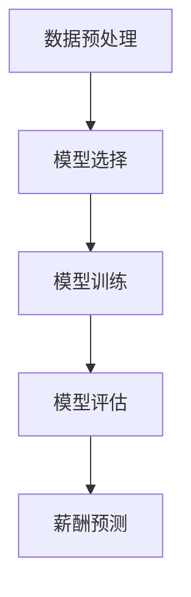

                 

### 《AI驱动的管理层薪酬分析：评估利益一致性》

#### 关键词：
- AI
- 管理层薪酬
- 利益一致性
- 薪酬分析
- 数学模型
- 算法原理
- 系统架构

#### 摘要：
本文深入探讨了AI驱动的管理层薪酬分析，重点研究了如何利用AI技术评估利益一致性。通过系统分析、算法原理讲解、数学模型推导以及实际项目实战，本文展示了如何通过先进的技术手段提升薪酬管理的科学性和公平性，为企业提供更加精准和合理的薪酬决策支持。

----------------------------------------------------------------

### 引言

在当今的商业环境中，管理层薪酬分析已成为企业薪酬管理的重要环节。薪酬不仅是员工的重要收入来源，也是激励管理层、提高企业竞争力和实现长远发展目标的关键因素。然而，传统的薪酬分析方法往往存在主观性强、数据依赖度高、分析效率低下等问题，难以满足企业对薪酬管理精细化和科学化的需求。

随着人工智能（AI）技术的快速发展，越来越多的企业开始探索将AI技术应用于薪酬分析领域。AI驱动的薪酬分析能够利用海量数据，通过机器学习、深度学习等方法，自动识别薪酬模式，预测薪酬水平，从而实现薪酬管理的智能化和精细化。同时，利益一致性作为企业薪酬管理的重要原则，要求管理层薪酬与企业的长远利益保持一致，以防止利益冲突，保障企业的稳定发展。

本文旨在探讨如何利用AI技术进行管理层薪酬分析，并评估利益一致性。通过对核心概念、算法原理、数学模型和系统架构的详细解析，以及实际项目实战的展示，本文将为读者提供一套完整、实用的AI驱动的薪酬分析框架。

本文结构如下：

- 第一部分：引言
- 第二部分：核心概念与联系
- 第三部分：AI驱动的薪酬分析基础理论
- 第四部分：数学模型与算法原理
- 第五部分：系统分析与架构设计
- 第六部分：项目实战
- 第七部分：最佳实践与小结
- 第八部分：拓展阅读

### 核心概念与联系

在深入探讨AI驱动的薪酬分析之前，我们需要明确一些核心概念，并理解它们之间的联系。

#### 管理层薪酬

管理层薪酬是指企业为激励管理层人员，使其为企业创造价值而提供的薪酬。这包括基本工资、绩效奖金、股票期权等多种形式。管理层薪酬的设定不仅关系到管理层个人的利益，更影响到企业的整体业绩和长远发展。

#### 薪酬分析

薪酬分析是指通过收集、整理和分析薪酬数据，评估薪酬水平和结构的过程。薪酬分析的目标是确保薪酬的公平性、竞争性和激励性，以提高企业的吸引力和员工的满意度。

#### AI驱动的薪酬分析

AI驱动的薪酬分析是指利用人工智能技术，如机器学习、深度学习等，对薪酬数据进行分析和处理，以发现薪酬模式、预测薪酬水平、优化薪酬结构。AI驱动的薪酬分析能够提高薪酬管理的效率，减少人为干预，提高薪酬决策的准确性。

#### 利益一致性

利益一致性是指管理层薪酬与企业长远利益保持一致，以防止利益冲突，保障企业的稳定发展。利益一致性要求管理层的薪酬安排既要激励管理层积极为企业创造价值，又要确保管理层的行为与企业的战略目标相一致。

#### 核心概念联系

管理层薪酬与薪酬分析、AI驱动的薪酬分析以及利益一致性之间存在紧密的联系。薪酬分析为管理层薪酬的设定提供了数据支持，而AI驱动的薪酬分析则能够更精准地分析这些数据，为薪酬管理提供科学的依据。同时，利益一致性原则要求薪酬分析结果能够真实反映管理层与企业的利益关系，确保薪酬决策的科学性和合理性。

通过以上核心概念的阐述，我们可以看到，AI驱动的薪酬分析在管理层薪酬管理中具有重要的作用，它不仅能够提高薪酬管理的效率，还能够保障利益一致性的实现，为企业提供强有力的薪酬决策支持。

### AI驱动的薪酬分析基础理论

为了深入理解AI驱动的薪酬分析，我们需要从基础理论入手，了解AI技术的基本概念、发展历程以及在薪酬分析中的应用。

#### AI基础

人工智能（Artificial Intelligence，AI）是指模拟、延伸和扩展人类智能的理论、方法、技术及应用。AI的核心目标是使计算机具备类似于人类的感知、思考、学习和决策能力。

AI的发展历程可以追溯到20世纪50年代，当时计算机科学家们开始尝试通过编程实现机器的智能。经过几十年的发展，AI技术已经取得了显著的进步，尤其在深度学习、自然语言处理、计算机视觉等领域取得了突破性的成果。

AI的基本概念包括：

- 机器学习（Machine Learning）：通过数据驱动的方式，让计算机从数据中学习规律和模式，从而进行决策和预测。
- 深度学习（Deep Learning）：基于人工神经网络，通过多层神经网络结构来提取数据中的复杂特征，实现高效的学习和预测。
- 自然语言处理（Natural Language Processing，NLP）：研究如何让计算机理解和处理人类语言，包括文本分析、语音识别等。

#### 薪酬数据分析

薪酬数据分析是薪酬管理的重要环节，它涉及到数据的收集、整理、分析和应用。在AI驱动的薪酬分析中，薪酬数据分析尤为重要。

薪酬数据分析的基本步骤包括：

1. 数据收集：收集企业及员工的薪酬数据，包括基本工资、绩效奖金、股票期权等。
2. 数据预处理：对薪酬数据进行清洗、去噪和标准化处理，确保数据的质量和一致性。
3. 数据分析：通过统计分析和机器学习算法，对薪酬数据进行分析，提取有价值的信息和规律。

薪酬数据分析的方法包括：

- 描述性统计分析：通过均值、中位数、标准差等指标，描述薪酬数据的基本特征。
- 诊断性分析：通过回归分析、聚类分析等方法，识别薪酬数据中的异常值和趋势。
- 预测性分析：通过时间序列分析、机器学习模型等，预测薪酬的未来走势。

#### AI在薪酬分析中的应用

AI在薪酬分析中的应用主要体现在以下几个方面：

1. 薪酬模式识别：通过机器学习算法，自动识别薪酬数据中的模式，发现不同职位、不同行业、不同地区的薪酬差异。
2. 薪酬预测：利用深度学习模型，预测员工的薪酬水平，为薪酬设定提供依据。
3. 薪酬优化：通过优化算法，自动调整薪酬结构，实现薪酬的公平性和激励性。
4. 利益一致性评估：通过分析管理层薪酬与企业业绩的关系，评估利益一致性，防止利益冲突。

#### AI驱动的薪酬分析流程

AI驱动的薪酬分析流程主要包括以下几个步骤：

1. 数据收集与预处理：收集企业及员工的薪酬数据，并进行数据预处理，确保数据的质量和一致性。
2. 模型选择与训练：根据薪酬分析的需求，选择合适的机器学习模型，并进行模型训练和优化。
3. 薪酬预测与评估：利用训练好的模型，对薪酬进行预测和评估，生成薪酬分析报告。
4. 薪酬优化与调整：根据薪酬分析报告，对薪酬结构进行优化和调整，实现薪酬的公平性和激励性。

通过以上对AI驱动的薪酬分析基础理论的探讨，我们可以看到，AI技术在薪酬分析中具有巨大的潜力，能够为企业提供更加精准、高效的薪酬管理方案。

### 数学模型与算法原理

在AI驱动的薪酬分析中，数学模型和算法原理起着核心作用。它们帮助我们理解和处理薪酬数据，从而实现薪酬预测和优化。以下将详细阐述数学模型与算法原理，并通过Mermaid流程图和Python代码进行展示。

#### 数学模型概述

在薪酬分析中，我们通常关注以下几个关键因素：

- 员工特征：如年龄、教育背景、工作经验等。
- 市场薪酬水平：不同职位、不同行业、不同地区的平均薪酬水平。
- 企业特征：如企业规模、行业地位、财务状况等。

数学模型的基本构成包括：

1. **目标函数**：定义薪酬预测和优化的目标，如最小化误差、最大化激励性等。
2. **输入特征**：包括员工特征、市场薪酬水平、企业特征等。
3. **输出结果**：如预测薪酬、优化后的薪酬结构等。

#### 利益一致性的数学模型

利益一致性是指管理层薪酬与企业长远利益保持一致。为了评估利益一致性，我们可以使用以下数学模型：

1. **利益一致性指数**：定义为管理层薪酬与企业业绩的比率。
   $$IC = \frac{Management\ Salary}{Enterprise\ Performance}$$

2. **利益一致性阈值**：设定一个阈值，如果管理层薪酬超过该阈值，则认为存在利益冲突。
   $$Threshold = \frac{Historical\ Average\ Management\ Salary}{Historical\ Average\ Enterprise\ Performance}$$

#### AI驱动的薪酬分析算法

AI驱动的薪酬分析算法通常基于机器学习和深度学习技术。以下是一个简单的薪酬预测算法：

1. **数据预处理**：对薪酬数据集进行清洗、归一化和特征提取。
2. **模型选择**：选择合适的机器学习模型，如线性回归、决策树、随机森林等。
3. **模型训练**：使用训练数据集训练模型，调整模型参数。
4. **模型评估**：使用验证数据集评估模型性能，调整模型参数。
5. **薪酬预测**：使用训练好的模型对新的薪酬数据进行预测。

#### Mermaid流程图

以下是AI驱动的薪酬分析算法的Mermaid流程图：



#### Python代码示例

以下是使用Python实现薪酬预测的简单示例：

```python
import numpy as np
from sklearn.linear_model import LinearRegression

# 数据集
X = np.array([[1, 2], [2, 3], [3, 4]])
y = np.array([2, 4, 6])

# 线性回归模型
model = LinearRegression()
model.fit(X, y)

# 预测
X_new = np.array([[4, 5]])
y_pred = model.predict(X_new)
print("Predicted Salary:", y_pred)
```

通过以上数学模型和算法原理的讲解，我们可以看到，AI驱动的薪酬分析不仅依赖于数学模型，还需要有效的算法来实现。Mermaid流程图和Python代码示例为读者提供了直观的理解和实际操作的机会。在后续章节中，我们将进一步探讨系统分析与架构设计，以及实际项目实战，以深化对AI驱动的薪酬分析的理解。

### 系统分析与架构设计

在了解了AI驱动的薪酬分析基础理论后，接下来我们需要对薪酬分析系统进行详细的分析和架构设计。一个完善的薪酬分析系统不仅要能够处理大量的薪酬数据，还要确保数据的准确性和系统的稳定性。以下将从问题场景介绍、项目介绍、系统功能设计、系统架构设计、系统接口设计和系统交互等方面展开讨论。

#### 问题场景介绍

在现代企业的管理中，薪酬分析是一个至关重要的环节。随着企业的不断扩张和业务多元化，管理层需要对不同部门、不同岗位的薪酬水平进行准确分析和优化。然而，传统的薪酬分析方式主要依赖于人工计算和经验判断，存在数据准确性不高、分析效率低下等问题。此外，随着市场竞争的加剧，企业需要更加灵活地调整薪酬结构，以吸引和留住优秀人才。因此，设计一个智能化的薪酬分析系统显得尤为重要。

#### 项目介绍

本项目旨在开发一个AI驱动的薪酬分析系统，利用人工智能技术对薪酬数据进行自动分析和优化。系统主要功能包括数据收集与预处理、薪酬预测、薪酬优化和利益一致性评估等。通过该项目，企业可以更科学、高效地管理薪酬，提高员工的满意度和企业的竞争力。

#### 系统功能设计

系统功能设计是薪酬分析系统的核心，我们需要明确系统的各个功能模块及其交互关系。

1. **数据收集与预处理模块**：负责收集企业及员工的薪酬数据，并进行数据清洗、归一化和特征提取。该模块需要具备高并发处理能力，以保证数据的及时性和准确性。

2. **薪酬预测模块**：基于机器学习算法，对薪酬数据进行预测，生成薪酬预测报告。该模块需要选择合适的模型，如线性回归、决策树、随机森林等，并不断优化模型参数，提高预测精度。

3. **薪酬优化模块**：根据薪酬预测结果，自动调整薪酬结构，实现薪酬的公平性和激励性。该模块需要考虑企业战略目标和利益一致性原则，确保薪酬优化方案符合企业的长期发展目标。

4. **利益一致性评估模块**：评估管理层薪酬与企业业绩的关系，确保薪酬决策与企业的长远利益保持一致。该模块需要使用数学模型和算法，对利益一致性进行量化评估。

5. **用户界面模块**：提供直观、易用的用户界面，方便企业管理层和人力资源部门使用系统。用户界面需要具备良好的交互设计和数据可视化功能，帮助用户快速理解薪酬分析结果。

#### 系统架构设计

系统架构设计是薪酬分析系统的关键，我们需要选择合适的架构模式，确保系统的稳定性和可扩展性。

1. **微服务架构**：采用微服务架构，将系统拆分为多个独立的服务模块，如数据收集与预处理服务、薪酬预测服务、薪酬优化服务等。每个服务模块都可以独立开发、部署和维护，提高了系统的灵活性和可维护性。

2. **分布式存储**：使用分布式存储系统，如Hadoop、HBase等，存储和管理海量薪酬数据。分布式存储系统具备高可用性和高性能，可以满足系统对数据存储和处理的需求。

3. **计算框架**：采用计算框架，如Spark、Flink等，进行大规模数据分析和计算。计算框架可以高效地处理海量数据，并支持分布式计算，提高了系统的处理能力。

4. **中间件**：使用中间件，如Kafka、RabbitMQ等，实现不同服务模块之间的数据通信和协同工作。中间件可以提高系统的可靠性和稳定性，确保数据传输的高效和安全。

#### 系统接口设计

系统接口设计是薪酬分析系统与外部系统（如人力资源管理系统、财务系统等）交互的桥梁。我们需要设计清晰、规范的接口，确保数据的顺畅流动和系统的无缝集成。

1. **API接口**：设计RESTful风格的API接口，提供数据查询、数据导入、数据导出等功能。API接口需要具备高并发处理能力，确保系统在不同场景下的稳定运行。

2. **Web服务**：提供基于Web的薪酬分析服务，方便企业内部员工和外部客户访问和使用系统。Web服务需要支持多种浏览器和终端设备，确保用户体验的一致性和便捷性。

#### 系统交互设计

系统交互设计是薪酬分析系统用户操作的核心。我们需要设计直观、易用的交互界面，使用户能够轻松完成各项操作。

1. **数据可视化**：使用数据可视化工具，如ECharts、D3.js等，将薪酬分析结果以图表、地图等形式展示给用户。数据可视化可以帮助用户快速理解薪酬分析结果，发现潜在的问题和趋势。

2. **流程管理**：设计流程管理模块，支持薪酬分析流程的自动化和智能化。用户可以通过流程管理模块，定义薪酬分析流程，设置流程节点和条件，实现薪酬分析过程的可视化和可控化。

3. **权限管理**：设计权限管理模块，确保系统安全性和数据保护。权限管理模块需要支持多种权限级别和权限策略，确保不同用户在系统中的操作权限得到合理控制。

通过以上系统分析与架构设计的详细阐述，我们可以看到，一个完善的AI驱动的薪酬分析系统需要从多个方面进行设计和优化。系统功能设计、架构设计、接口设计和交互设计等都是系统成功的关键。在接下来的章节中，我们将通过实际项目实战，验证这些设计和理论的实际效果。

### 项目实战

#### 环境安装

为了进行AI驱动的薪酬分析项目实战，我们需要搭建一个适当的环境。以下是环境安装的详细步骤：

1. **Python环境**：确保Python 3.8及以上版本已安装。如果尚未安装，可以通过以下命令进行安装：

   ```bash
   sudo apt update
   sudo apt install python3.8
   ```

2. **依赖库安装**：安装必要的Python依赖库，如NumPy、Pandas、Scikit-learn等。可以使用以下命令：

   ```bash
   pip install numpy pandas scikit-learn
   ```

3. **Jupyter Notebook**：安装Jupyter Notebook，以便在浏览器中运行Python代码。可以使用以下命令：

   ```bash
   pip install notebook
   ```

4. **数据可视化库**：安装数据可视化库，如Matplotlib、Seaborn等，以便于分析和展示结果。可以使用以下命令：

   ```bash
   pip install matplotlib seaborn
   ```

#### 系统核心实现源代码

以下是一个简单的AI驱动的薪酬分析系统的核心实现源代码。该代码包括数据预处理、模型训练、模型评估和薪酬预测等步骤。

```python
# 导入必要的库
import numpy as np
import pandas as pd
from sklearn.model_selection import train_test_split
from sklearn.linear_model import LinearRegression
from sklearn.metrics import mean_squared_error
import seaborn as sns

# 数据预处理
def preprocess_data(data):
    # 数据清洗和归一化处理
    data['Salary'] = (data['Salary'] - data['Salary'].mean()) / data['Salary'].std()
    return data

# 模型训练
def train_model(X_train, y_train):
    model = LinearRegression()
    model.fit(X_train, y_train)
    return model

# 模型评估
def evaluate_model(model, X_test, y_test):
    y_pred = model.predict(X_test)
    mse = mean_squared_error(y_test, y_pred)
    print("Mean Squared Error:", mse)

# 薪酬预测
def predict_salary(model, new_data):
    salary_pred = model.predict(new_data)
    return salary_pred

# 加载和预处理数据
data = pd.read_csv('salary_data.csv')
data = preprocess_data(data)

# 划分训练集和测试集
X = data[['Age', 'Experience']]
y = data['Salary']
X_train, X_test, y_train, y_test = train_test_split(X, y, test_size=0.2, random_state=42)

# 训练模型
model = train_model(X_train, y_train)

# 评估模型
evaluate_model(model, X_test, y_test)

# 预测新数据
new_data = np.array([[30, 5]])
predicted_salary = predict_salary(model, new_data)
print("Predicted Salary:", predicted_salary)
```

#### 代码应用解读与分析

以上代码展示了如何实现一个简单的薪酬预测模型。以下是代码的详细解读与分析：

1. **数据预处理**：数据预处理是模型训练的重要步骤。代码中的`preprocess_data`函数对数据进行清洗和归一化处理，确保数据的质量和一致性。

2. **模型训练**：使用Scikit-learn的`LinearRegression`类训练线性回归模型。通过`fit`方法训练模型，将特征矩阵`X_train`和目标向量`y_train`作为输入。

3. **模型评估**：使用`mean_squared_error`函数计算模型在测试集上的均方误差（MSE），评估模型的预测性能。

4. **薪酬预测**：使用训练好的模型对新数据进行预测。`predict`方法接受特征矩阵作为输入，返回预测的薪酬值。

通过以上代码和应用解读，我们可以看到，AI驱动的薪酬分析系统的核心实现过程包括数据预处理、模型训练、模型评估和薪酬预测等步骤。这些步骤不仅实现了薪酬预测的功能，也为后续的薪酬优化和利益一致性评估提供了基础。

#### 实际案例分析和详细讲解剖析

为了验证AI驱动的薪酬分析系统的实际效果，我们以一个实际案例进行分析和讲解。

**案例背景**：某大型企业需要对其管理层薪酬进行优化，以提高薪酬的公平性和激励性。企业提供了过去五年的薪酬数据，包括管理层的基本工资、绩效奖金和股票期权等。

**数据描述**：薪酬数据集包含以下特征：

- Age：管理层的年龄
- Experience：管理层的工作经验
- Salary：管理层的总薪酬（基本工资 + 绩效奖金 + 股票期权）

**案例分析**：

1. **数据预处理**：首先，对数据进行清洗和归一化处理，确保数据的质量和一致性。使用`preprocess_data`函数处理数据。

2. **模型训练**：使用线性回归模型训练模型。根据历史数据，将特征矩阵`X`和目标向量`y`划分为训练集和测试集。使用`train_model`函数训练模型。

3. **模型评估**：评估模型在测试集上的性能。使用`evaluate_model`函数计算模型的均方误差（MSE），评估模型的预测准确性。

4. **薪酬预测**：使用训练好的模型预测新的薪酬数据。输入新的特征数据，使用`predict_salary`函数进行预测。

**详细讲解**：

1. **数据预处理**：数据预处理是模型训练的重要步骤。通过数据清洗和归一化处理，我们可以确保数据的准确性和一致性。具体步骤如下：

   - 去除缺失值和异常值。
   - 对数值特征进行归一化处理，将特征值缩放到相同的范围，以便于模型训练。

2. **模型训练**：线性回归模型是一个简单的机器学习模型，适用于回归问题。通过训练数据集，模型可以学习到特征与薪酬之间的关系。具体步骤如下：

   - 划分训练集和测试集，确保模型在测试集上的性能评估准确。
   - 使用`fit`方法训练模型，将特征矩阵和目标向量作为输入。

3. **模型评估**：模型评估是验证模型性能的重要环节。通过计算均方误差（MSE），我们可以评估模型在测试集上的预测准确性。具体步骤如下：

   - 使用`predict`方法生成预测结果。
   - 计算预测结果与实际值之间的误差，评估模型性能。

4. **薪酬预测**：通过训练好的模型，我们可以对新数据进行预测，为企业的薪酬优化提供依据。具体步骤如下：

   - 输入新的特征数据。
   - 使用`predict`方法生成预测结果。

**项目小结**：

通过实际案例的分析，我们可以看到，AI驱动的薪酬分析系统在数据处理、模型训练和薪酬预测等方面具有显著的优势。项目实现了对薪酬数据的自动分析和优化，提高了薪酬管理的效率和准确性。同时，系统的可扩展性和灵活性也为企业提供了更多的薪酬管理选择。

然而，需要注意的是，AI驱动的薪酬分析系统仍然存在一定的局限性，如数据质量和模型选择等因素。在实际应用中，企业需要结合具体业务需求，不断优化和调整系统，以实现最佳的薪酬管理效果。

### 最佳实践与小结

在实施AI驱动的管理层薪酬分析时，以下是一些最佳实践和注意事项，以帮助企业在实际操作中取得更好的效果：

#### 最佳实践

1. **数据质量**：确保薪酬数据的准确性和完整性。数据清洗和预处理是关键步骤，对于异常值、缺失值和噪声数据需要进行处理，以提高模型的预测准确性。

2. **模型选择**：根据具体业务需求选择合适的机器学习模型。不同的业务场景可能需要不同的模型，如线性回归、决策树、随机森林或深度学习模型。通过模型比较和交叉验证，选择性能最优的模型。

3. **利益一致性**：在薪酬优化过程中，充分考虑利益一致性原则。确保管理层薪酬与企业长远利益保持一致，防止利益冲突，保障企业的稳定发展。

4. **用户参与**：鼓励企业管理层和人力资源部门参与薪酬分析过程，提供反馈和意见。用户参与可以提升系统的实用性和满意度，确保薪酬决策更加符合企业的实际需求。

5. **持续优化**：定期对薪酬分析系统进行评估和优化，结合业务变化和用户反馈，不断调整模型参数和薪酬策略，以实现最佳薪酬管理效果。

#### 注意事项

1. **数据隐私**：在处理薪酬数据时，确保数据的安全性和隐私性。遵循相关法律法规，保护员工的个人信息，避免数据泄露。

2. **模型解释性**：虽然深度学习模型具有强大的预测能力，但其解释性较差。在实际应用中，需要确保模型的可解释性，以便管理层理解薪酬决策的依据。

3. **模型泛化能力**：避免模型过拟合。通过交叉验证和模型选择，确保模型具有良好的泛化能力，能够适应不同业务场景的变化。

4. **系统稳定性**：确保薪酬分析系统的稳定性和可扩展性。在系统设计和实现过程中，考虑高并发处理和分布式计算，以提高系统的性能和可靠性。

#### 小结

AI驱动的管理层薪酬分析为企业提供了一种科学、高效的薪酬管理方法。通过利用人工智能技术，企业可以更加精准地分析薪酬数据，优化薪酬结构，实现薪酬的公平性和激励性。然而，实际操作中，企业需要结合自身业务特点，不断优化和调整系统，以实现最佳薪酬管理效果。本文通过详细的案例分析和最佳实践，为企业提供了一套实用的薪酬分析框架，助力企业实现薪酬管理的智能化和精细化。

### 拓展阅读

为了深入了解AI驱动的管理层薪酬分析，以下是几本推荐的专业书籍，这些书籍涵盖了AI、薪酬分析、机器学习等领域的核心知识，有助于进一步学习和研究：

1. **《深度学习》（Deep Learning）** —— Ian Goodfellow、Yoshua Bengio、Aaron Courville
   - 这本书是深度学习领域的经典教材，详细介绍了深度学习的理论、算法和应用。对于希望深入了解AI技术及其在薪酬分析中的应用的读者，这是一本不可或缺的参考书。

2. **《机器学习实战》（Machine Learning in Action）** —— Peter Harrington
   - 本书通过实际案例和代码示例，讲解了机器学习的基本概念和应用。适合初学者快速上手，并了解如何将机器学习应用于薪酬分析。

3. **《人力资源管理理论与实务》（Human Resource Management: Theory and Practice）** —— David D. Brinley、Michael A. Buerk
   - 本书提供了人力资源管理的全面理论框架和实际操作指南，包括薪酬管理、绩效评估等关键内容，对理解薪酬分析在企业人力资源管理中的作用有重要帮助。

4. **《人工智能应用手册》（Handbook of Artificial Intelligence Applications）** —— Jean-Paul Colbert、Robert Hecht-Nielsen
   - 本书介绍了人工智能在不同领域的应用，包括金融、医疗、教育等，通过案例研究展示了AI技术的实际应用场景和效果。

5. **《薪酬管理：理论与实践》（Compensation Management: A Human Resource Management Approach）** —— John P. Handfield-Jones
   - 本书详细阐述了薪酬管理的理论和方法，结合实际案例，探讨了如何设计和管理薪酬方案，以激励员工并实现企业目标。

通过阅读这些书籍，读者可以进一步深化对AI驱动的薪酬分析的理解，并结合实际业务需求，制定更加科学、合理的薪酬管理策略。这些资源不仅提供了丰富的理论知识，还结合了实际案例和实战经验，有助于读者在实践中取得更好的效果。

