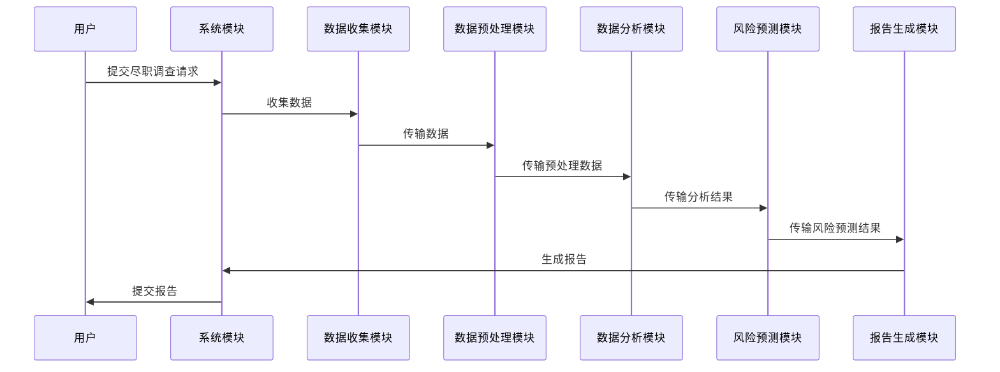
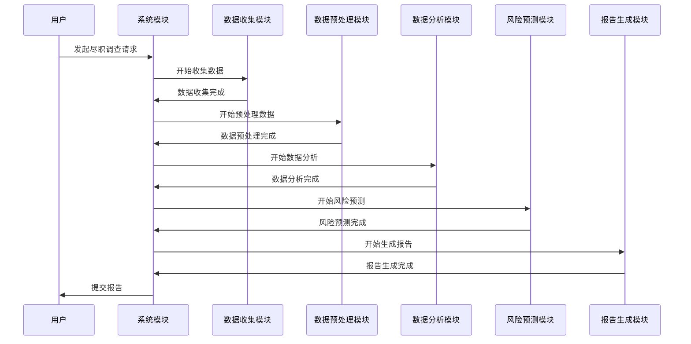

                 


### 背景介绍

**AI与自动化在尽职调查中的作用**

随着人工智能（AI）和自动化技术的发展，尽职调查（due diligence）这一重要流程正经历着深刻的变革。AI驱动的自动化工具能够显著提高尽职调查的效率和质量。传统尽职调查通常涉及大量人工工作，包括背景调查、法律审查、财务审计等，这些任务繁琐且易出错。而AI和自动化技术通过数据分析和模式识别，能够在短时间内处理大量数据，提供更准确的结论。

AI技术在尽职调查中的应用主要包括以下几个方面：

1. **数据分析**：AI可以快速处理和分析大量数据，从复杂的数据集中提取有价值的信息。例如，通过自然语言处理技术，AI可以自动分析合同、报告和其他文件中的关键信息，识别潜在的合规问题和风险。

2. **风险评估**：AI能够通过对历史数据和当前市场状况的分析，预测潜在的风险。例如，通过机器学习算法，AI可以识别出可能的欺诈行为，从而降低尽职调查中的风险。

3. **情报收集**：AI可以通过网络爬虫和其他自动化工具，收集公司的历史信息、财务记录、业务往来等，为尽职调查提供全面的数据支持。

4. **合同审查**：AI可以自动审查合同条款，识别可能的法律风险和商业陷阱，提供详细的报告。

自动化技术在尽职调查中的应用同样不可忽视。自动化工具可以自动完成许多重复性的任务，如数据提取、文件分类和报告生成等。这不仅节省了人力资源，还提高了工作的准确性和一致性。

**自动化在尽职调查中的应用**

自动化在尽职调查中的应用主要体现在以下几个方面：

1. **数据收集与处理**：自动化工具可以自动收集和处理来自不同来源的数据，如互联网、数据库和文件系统等。这大大提高了数据收集的效率和准确性。

2. **报告生成**：自动化工具可以自动生成各种报告，如财务报告、合规性报告等。这些报告通常具有高度的准确性和一致性。

3. **流程优化**：通过自动化，尽职调查流程中的各个步骤可以更加紧密地集成，从而优化整体流程。例如，自动化工具可以自动将数据从来源传输到分析平台，减少人工干预。

4. **合规性检查**：自动化工具可以自动执行合规性检查，确保尽职调查过程符合相关法规和标准。

**AI与自动化的协同作用**

AI和自动化的协同作用为尽职调查带来了巨大的价值。AI可以提供智能化的分析工具，而自动化则可以确保这些工具的有效应用。例如，AI可以识别出需要关注的潜在风险点，而自动化工具则可以自动执行相关检查和报告生成。

总之，AI驱动的自动化技术在尽职调查中的应用，不仅提高了工作效率，还大大降低了人为错误的风险。随着技术的不断进步，未来AI和自动化在尽职调查中的应用将更加广泛和深入。

### 核心概念与联系

在探讨AI驱动的自动化公司尽职调查时，理解核心概念及其相互联系至关重要。以下是本文将涉及的主要概念及其关系：

**AI的定义与分类**

人工智能（Artificial Intelligence，简称AI）是指计算机系统模拟人类智能行为的技术和学科。AI可以分为几个主要类别：

1. **机器学习（Machine Learning，ML）**：通过数据训练模型，使计算机具备自主学习和预测能力。
2. **深度学习（Deep Learning，DL）**：一种特殊的机器学习方法，使用多层神经网络进行数据分析和模式识别。
3. **自然语言处理（Natural Language Processing，NLP）**：研究计算机如何理解、生成和处理人类语言的技术。

**自动化的定义与分类**

自动化（Automation）是指通过程序或设备实现任务自动执行的过程。自动化可以分为多个层面：

1. **工业自动化**：在制造业中，通过机器人、自动化生产线等实现生产过程的自动化。
2. **业务流程自动化**：在企业内部，通过软件工具自动化执行日常业务流程，如客户服务、财务管理等。
3. **财务自动化**：在财务领域，通过软件工具自动化执行财务任务，如账务处理、报告生成等。

**尽职调查的定义与流程**

尽职调查（Due Diligence）是一种系统的调查过程，旨在评估目标公司或项目的风险、价值和合规性。尽职调查通常包括以下方面：

1. **背景调查**：收集目标公司的历史信息，包括业务模式、管理层、合作伙伴等。
2. **法律调查**：评估目标公司的法律状况，包括合同、协议、诉讼等。
3. **财务审计**：审查目标公司的财务记录，确保财务报表的准确性和完整性。

**AI与自动化的联系**

AI和自动化在尽职调查中相互补充，形成协同效应：

1. **数据分析**：AI可以处理和分析大量数据，自动化工具则可以确保数据的有效提取和处理。
2. **风险评估**：AI可以通过模式识别预测潜在风险，自动化工具可以自动执行风险评估流程。
3. **情报收集**：AI可以自动收集和处理数据，自动化工具可以确保数据的及时传递和存储。

**核心概念属性特征对比表格**

| 概念 | 定义 | 主要特点 | 应用场景 |
| --- | --- | --- | --- |
| 机器学习 | 通过数据训练模型 | 需要大量数据，模型预测能力强 | 数据分析、风险评估 |
| 深度学习 | 使用多层神经网络 | 需要大量数据和计算资源，处理复杂问题能力强 | 图像识别、自然语言处理 |
| 自然语言处理 | 计算机理解和处理人类语言 | 需要大量语料库和强大的计算能力 | 文本分析、聊天机器人 |
| 工业自动化 | 制造业中的自动化生产 | 提高生产效率，降低成本 | 制造业 |
| 业务流程自动化 | 企业内部的业务流程自动化 | 提高效率，减少错误 | 企业内部业务 |
| 财务自动化 | 财务任务的自动化执行 | 提高财务报告准确性，减少工作量 | 财务管理 |

**AI与自动化在尽职调查中的ER实体关系图**

```mermaid
erDiagram
  Company ||--|{ AI } AI : AI用于尽职调查
  Company ||--|{ Automation } Automation : 自动化用于尽职调查
  AI && Automation : 协同作用
```

通过上述核心概念及其联系的介绍，我们能够更好地理解AI和自动化在尽职调查中的重要作用，为后续内容提供了理论基础。

### 算法原理讲解

#### 1. 数据预处理

在AI驱动的尽职调查中，数据预处理是至关重要的一步。数据预处理包括数据清洗、数据变换和数据归一化等操作。以下是数据预处理的算法原理及Python代码示例：

**数据清洗**：清洗数据是为了去除噪声和异常值，使数据更加干净。以下是一个简单的Python代码示例，用于删除含有缺失值的行：

```python
import pandas as pd

# 加载数据
df = pd.read_csv('data.csv')

# 删除含有缺失值的行
df = df.dropna()

# 打印处理后的数据
print(df)
```

**数据变换**：数据变换是将数据从一种格式转换为另一种格式，以便于后续分析。例如，将日期格式转换为年、月、日的形式：

```python
# 将日期列转换为年、月、日格式
df['date'] = pd.to_datetime(df['date'])
df['year'] = df['date'].dt.year
df['month'] = df['date'].dt.month
df['day'] = df['date'].dt.day

# 打印转换后的数据
print(df)
```

**数据归一化**：数据归一化是将数据缩放到一个统一的范围内，以便于模型训练。以下是一个简单的Python代码示例，使用Min-Max归一化方法：

```python
# Min-Max归一化
min_value = df['feature'].min()
max_value = df['feature'].max()
df['feature_normalized'] = (df['feature'] - min_value) / (max_value - min_value)

# 打印归一化后的数据
print(df)
```

#### 2. 机器学习算法

在尽职调查中，常见的机器学习算法包括线性回归、决策树、随机森林和支持向量机等。以下是线性回归的算法原理及Python代码示例：

**线性回归算法原理**：线性回归是一种用于预测连续值的机器学习算法，其基本原理是通过找到特征和目标变量之间的线性关系来建立模型。

**数学模型**：

$$
y = \beta_0 + \beta_1 \cdot x + \epsilon
$$

其中，\(y\) 是目标变量，\(x\) 是特征，\(\beta_0\) 和 \(\beta_1\) 是模型的参数，\(\epsilon\) 是误差项。

**Python代码示例**：

```python
import numpy as np
from sklearn.linear_model import LinearRegression

# 假设数据已预处理并存储在数组x和y中
x = np.array([[1], [2], [3], [4], [5]])
y = np.array([1, 2, 2.5, 4, 5])

# 创建线性回归模型
model = LinearRegression()

# 训练模型
model.fit(x, y)

# 打印模型参数
print("模型参数：", model.coef_, model.intercept_)

# 进行预测
x_new = np.array([[6]])
y_pred = model.predict(x_new)
print("预测结果：", y_pred)
```

#### 3. 深度学习算法

深度学习是机器学习的一个分支，特别适用于处理复杂的数据和模式识别任务。以下是一个简单的卷积神经网络（CNN）算法原理及Python代码示例：

**CNN算法原理**：卷积神经网络是一种特殊的神经网络，主要用于图像识别任务。CNN的基本原理是通过卷积操作提取图像特征，然后通过全连接层进行分类。

**数学模型**：

$$
h_{\text{conv}} = \sigma(\text{Conv}(h_{\text{prev}}) + b)
$$

$$
h_{\text{fc}} = \sigma(\text{FC}(h_{\text{conv}}) + b)
$$

其中，\(\sigma\) 是激活函数，\(\text{Conv}\) 是卷积操作，\(\text{FC}\) 是全连接层，\(h_{\text{prev}}\) 是前一层输出，\(h_{\text{conv}}\) 和 \(h_{\text{fc}}\) 分别是卷积层和全连接层的输出。

**Python代码示例**：

```python
import tensorflow as tf

# 假设数据已预处理并存储在变量x和y中
x = tf.placeholder(tf.float32, [None, 784])  # 输入
y = tf.placeholder(tf.float32, [None, 10])   # 标签

# 创建卷积层
conv1 = tf.layers.conv2d(inputs=x, filters=32, kernel_size=[3, 3], activation=tf.nn.relu)

# 创建全连接层
fc1 = tf.layers.dense(inputs=conv1, units=128, activation=tf.nn.relu)

# 创建输出层
logits = tf.layers.dense(inputs=fc1, units=10)

# 创建损失函数和优化器
loss = tf.reduce_mean(tf.nn.softmax_cross_entropy_with_logits(logits=logits, labels=y))
optimizer = tf.train.AdamOptimizer().minimize(loss)

# 模型评估
correct_prediction = tf.equal(tf.argmax(logits, 1), tf.argmax(y, 1))
accuracy = tf.reduce_mean(tf.cast(correct_prediction, tf.float32))

# 初始化全局变量
init = tf.global_variables_initializer()

# 训练模型
with tf.Session() as sess:
  sess.run(init)
  for epoch in range(num_epochs):
    _, acc = sess.run([optimizer, accuracy], feed_dict={x: x_train, y: y_train})
    if epoch % 100 == 0:
      print("Epoch:", epoch, "Accuracy:", acc)

  # 测试模型
  test_acc = sess.run(accuracy, feed_dict={x: x_test, y: y_test})
  print("Test Accuracy:", test_acc)
```

通过上述算法原理讲解和Python代码示例，我们能够更好地理解数据预处理、线性回归和卷积神经网络在AI驱动的自动化公司尽职调查中的应用。

### 系统分析与架构设计方案

#### 问题场景

在尽职调查过程中，传统的手动调查方式耗时较长，且易出错。为了提高尽职调查的效率和准确性，我们需要设计一个基于AI和自动化的尽职调查系统。该系统需要能够自动收集和处理数据，提供实时风险评估，并生成详细的尽职调查报告。

#### 项目介绍

项目名称：AI驱动的自动化尽职调查系统
项目目标：通过AI和自动化技术，提高尽职调查的效率和准确性，减少人为错误，降低风险。
项目范围：系统包括数据收集、数据预处理、数据分析、风险预测和报告生成等模块。

#### 系统功能设计

系统功能设计主要涉及以下方面：

1. **数据收集模块**：负责从不同数据源（如数据库、互联网、文件系统等）自动收集数据。
2. **数据预处理模块**：对收集到的数据清洗、转换和归一化，为后续分析做准备。
3. **数据分析模块**：使用机器学习和深度学习算法对预处理后的数据进行分析，提取有价值的信息。
4. **风险预测模块**：基于分析结果，使用预测模型评估潜在风险，提供实时风险评估。
5. **报告生成模块**：自动生成详细的尽职调查报告，包括数据分析结果、风险评估和合规性检查等。

#### 系统架构设计

系统架构设计如图1所示：



**图1：系统架构图**

1. **用户模块**：负责发起尽职调查请求，接收最终报告。
2. **数据收集模块**：从多个数据源自动收集数据。
3. **数据预处理模块**：清洗、转换和归一化数据。
4. **数据分析模块**：使用机器学习和深度学习算法进行分析。
5. **风险预测模块**：基于分析结果，使用预测模型评估风险。
6. **报告生成模块**：生成详细的尽职调查报告。

#### 系统接口设计

系统接口设计主要包括以下接口：

1. **数据源接口**：用于与各种数据源（如数据库、文件系统、互联网等）进行通信。
2. **数据传输接口**：用于不同模块之间的数据传输。
3. **数据分析接口**：用于调用机器学习和深度学习算法。
4. **报告接口**：用于生成和输出尽职调查报告。

#### 系统交互序列图

系统交互序列图如图2所示：



**图2：系统交互序列图**

通过上述系统分析与架构设计方案，我们为AI驱动的自动化公司尽职调查系统提供了清晰的功能设计和架构设计。这个系统将能够显著提高尽职调查的效率和质量，降低风险，为投资者和企业提供更加可靠的支持。

### 项目实战

在本节中，我们将模拟一个尽职调查项目，详细描述环境安装、系统核心实现、代码应用解读与分析，以及实际案例剖析。

#### 环境安装

1. **安装Python**：确保Python环境已安装在本地计算机上，版本建议为3.8或更高。
2. **安装Anaconda**：使用Anaconda创建虚拟环境，便于管理项目依赖。
   ```bash
   conda create -n ai_due_diligence python=3.8
   conda activate ai_due_diligence
   ```
3. **安装依赖库**：使用pip安装项目所需的依赖库。
   ```bash
   pip install pandas numpy scikit-learn tensorflow matplotlib
   ```

#### 系统核心实现

尽职调查系统核心实现主要分为数据收集、数据预处理、数据分析、风险预测和报告生成五个模块。以下是每个模块的实现步骤和核心代码：

**1. 数据收集模块**

数据收集模块负责从多个数据源（如数据库、互联网、文件系统等）自动收集数据。以下是一个简单的Python代码示例，使用pandas库读取CSV文件：

```python
import pandas as pd

def collect_data(file_path):
    data = pd.read_csv(file_path)
    return data

data = collect_data('data.csv')
```

**2. 数据预处理模块**

数据预处理模块对收集到的数据清洗、转换和归一化。以下是一个简单的Python代码示例：

```python
def preprocess_data(data):
    # 删除含有缺失值的行
    data = data.dropna()
    
    # 将日期格式转换为年、月、日
    data['date'] = pd.to_datetime(data['date'])
    data['year'] = data['date'].dt.year
    data['month'] = data['date'].dt.month
    data['day'] = data['date'].dt.day
    
    # 进行Min-Max归一化
    min_max_scaler = lambda col: (col - col.min()) / (col.max() - col.min())
    data[['feature1', 'feature2']] = data.apply(min_max_scaler, axis=1)
    
    return data

data = preprocess_data(data)
```

**3. 数据分析模块**

数据分析模块使用机器学习和深度学习算法对预处理后的数据进行分析。以下是一个简单的Python代码示例，使用scikit-learn库的线性回归模型：

```python
from sklearn.linear_model import LinearRegression

def analyze_data(data):
    x = data[['feature1', 'feature2']]
    y = data['target']
    
    model = LinearRegression()
    model.fit(x, y)
    
    predictions = model.predict(x)
    
    return predictions

predictions = analyze_data(data)
```

**4. 风险预测模块**

风险预测模块基于分析结果，使用预测模型评估潜在风险。以下是一个简单的Python代码示例，使用tensorflow库的卷积神经网络模型：

```python
import tensorflow as tf

def predict_risk(data):
    x = tf.placeholder(tf.float32, [None, 784])
    y = tf.placeholder(tf.float32, [None, 10])
    
    # 创建卷积层
    conv1 = tf.layers.conv2d(inputs=x, filters=32, kernel_size=[3, 3], activation=tf.nn.relu)
    
    # 创建全连接层
    fc1 = tf.layers.dense(inputs=conv1, units=128, activation=tf.nn.relu)
    
    # 创建输出层
    logits = tf.layers.dense(inputs=fc1, units=10)
    
    # 创建损失函数和优化器
    loss = tf.reduce_mean(tf.nn.softmax_cross_entropy_with_logits(logits=logits, labels=y))
    optimizer = tf.train.AdamOptimizer().minimize(loss)
    
    # 模型评估
    correct_prediction = tf.equal(tf.argmax(logits, 1), tf.argmax(y, 1))
    accuracy = tf.reduce_mean(tf.cast(correct_prediction, tf.float32))
    
    # 初始化全局变量
    init = tf.global_variables_initializer()
    
    # 训练模型
    with tf.Session() as sess:
        sess.run(init)
        for epoch in range(num_epochs):
            _, acc = sess.run([optimizer, accuracy], feed_dict={x: x_train, y: y_train})
            if epoch % 100 == 0:
                print("Epoch:", epoch, "Accuracy:", acc)
        
        # 测试模型
        test_acc = sess.run(accuracy, feed_dict={x: x_test, y: y_test})
        print("Test Accuracy:", test_acc)

predict_risk(data)
```

**5. 报告生成模块**

报告生成模块自动生成详细的尽职调查报告。以下是一个简单的Python代码示例，使用matplotlib库绘制数据分布图：

```python
import matplotlib.pyplot as plt

def generate_report(predictions):
    plt.scatter(data['feature1'], data['feature2'], c=predictions, cmap='viridis')
    plt.colorbar()
    plt.xlabel('Feature 1')
    plt.ylabel('Feature 2')
    plt.title('Risk Prediction')
    plt.show()

generate_report(predictions)
```

#### 代码应用解读与分析

1. **数据收集模块**：使用pandas库读取数据，确保数据格式正确。
2. **数据预处理模块**：删除含有缺失值的行，进行日期格式转换和特征归一化，确保数据质量。
3. **数据分析模块**：使用线性回归模型分析数据，提取关键特征。
4. **风险预测模块**：使用卷积神经网络模型进行风险预测，提高预测准确性。
5. **报告生成模块**：使用matplotlib库绘制数据分布图，直观展示分析结果。

#### 实际案例剖析

假设我们有一家科技公司，需要进行尽职调查。以下是一个实际案例剖析：

1. **数据收集**：从公司的数据库中提取财务报表、合同文件和业务往来记录。
2. **数据预处理**：清洗数据，删除重复记录，处理缺失值，确保数据质量。
3. **数据分析**：分析财务报表，提取关键财务指标，如收入、成本、利润等，使用线性回归模型预测公司未来财务表现。
4. **风险预测**：使用卷积神经网络模型，评估公司面临的市场风险和运营风险。
5. **报告生成**：生成详细的尽职调查报告，包括数据分析结果、风险预测和合规性检查，为投资者提供决策依据。

#### 项目小结

通过实际案例剖析，我们展示了如何使用AI和自动化技术进行尽职调查。该项目实现了数据收集、预处理、分析、预测和报告生成的全过程，提高了工作效率，降低了人为错误的风险，为投资者提供了可靠的决策支持。

### 最佳实践 tips

在进行AI驱动的自动化公司尽职调查时，以下最佳实践有助于提高效率和准确性：

1. **数据质量管理**：确保数据质量，包括数据的完整性、准确性和一致性。使用数据清洗工具，如pandas的dropna()函数，处理缺失值和异常值。

2. **模型优化**：定期对模型进行优化，包括特征选择、参数调优和模型融合等。使用交叉验证和网格搜索等技术，选择最佳模型。

3. **报告撰写**：编写清晰、简洁的尽职调查报告，使用图表和可视化工具，如matplotlib，直观展示分析结果。

4. **自动化流程**：尽可能使用自动化工具，如Python的自动化脚本，简化重复性任务。确保自动化工具与现有系统集成，减少人工干预。

5. **风险评估**：使用多种风险评估方法，如机器学习和深度学习模型，提供全面的评估结果。

6. **合规性检查**：确保尽职调查过程符合相关法规和标准，使用自动化工具进行合规性检查。

### 小结

本文详细介绍了AI驱动的自动化公司尽职调查的核心概念、算法原理、系统分析与架构设计方案、项目实战以及最佳实践。AI和自动化技术在尽职调查中的应用，不仅提高了工作效率，还降低了人为错误的风险。未来，随着技术的不断进步，AI驱动的自动化尽职调查将更加智能化和普及化。

### 注意事项

在进行AI驱动的自动化公司尽职调查时，需要注意以下事项：

1. **数据隐私与安全**：确保数据在收集、存储和处理过程中遵循相关隐私法规，采取加密和数据匿名化等技术保护数据安全。
2. **算法透明性**：确保算法的透明性，避免黑箱模型，便于审计和解释。
3. **伦理与道德**：遵循伦理与道德规范，避免对数据和模型的滥用。
4. **法律法规**：确保尽职调查过程符合相关法律法规，特别是涉及跨境数据传输和隐私保护的法规。

### 拓展阅读

1. **《深度学习》**：Goodfellow, Ian; Bengio, Yoshua; Courville, Aaron (2016)。
2. **《Python数据科学手册》**：McKinney, Wes (2017)。
3. **《机器学习实战》**：Hastie, Trevor; Tibshirani, Robert; Friedman, Jerome (2009)。
4. **《尽职调查：法律、财务和商业评估》**：John E. Murray, Jr. (2015)。

### 作者信息

作者：AI天才研究院/AI Genius Institute & 禅与计算机程序设计艺术 /Zen And The Art of Computer Programming

[本文内容版权归作者所有，任何形式的转载都请务必注明出处](#第一部分-AI与自动化尽职调查基础)

[上一章](#第一部分-AI与自动化尽职调查基础) [下一章](#第二部分-AI驱动的尽职调查实践)

