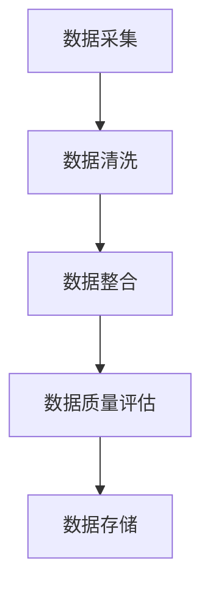
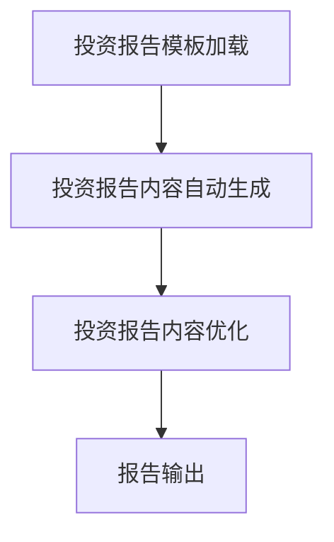

                 

### 文章标题

# AI驱动的自动化投资报告生成

---

> 关键词：AI、自动化、投资报告、数据采集、算法、系统架构

> 摘要：本文将深入探讨AI驱动的自动化投资报告生成技术，通过背景介绍、核心概念解析、系统架构设计、算法原理讲解和项目实战等环节，全面阐述如何利用人工智能技术提高投资报告生成的效率和质量。

---

### 目录大纲

1. **第一部分：背景介绍与核心概念**
   1.1 AI驱动的自动化投资报告生成背景
   1.2 问题描述
   1.3 问题解决
   1.4 边界与外延
   1.5 概念结构与核心要素组成
2. **第二部分：AI驱动的投资报告核心概念与原理**
   2.1 AI驱动的投资报告概述
   2.2 数据采集与处理
   2.3 投资报告生成算法
   2.4 概念属性特征对比
3. **第三部分：AI驱动的投资报告系统架构设计**
   3.1 系统架构概述
   3.2 数据采集模块
   3.3 数据处理模块
   3.4 报告生成模块
4. **第四部分：算法原理讲解与实现**
   4.1 数据采集与处理算法
   4.2 投资报告生成算法
   4.3 数学模型与数学公式
   4.4 举例说明
5. **第五部分：项目实战**
   5.1 项目环境搭建
   5.2 系统核心实现
   5.3 实际案例分析
   5.4 项目小结
6. **第六部分：最佳实践与注意事项**
   6.1 最佳实践技巧
   6.2 注意事项
   6.3 拓展阅读
7. **第七部分：总结与展望**
   7.1 总结
   7.2 展望

---

### 第一部分：背景介绍与核心概念

#### 1.1 AI驱动的自动化投资报告生成背景

投资报告是企业进行投资决策的重要依据，其生成过程涉及到大量的数据采集、分析和整合。然而，传统的投资报告生成方式主要依赖于人工操作，存在效率低、质量不稳定等问题。随着人工智能技术的迅速发展，利用AI进行自动化投资报告生成成为可能，并展现出巨大的应用潜力。

**问题背景：**

- **投资报告的重要性：** 投资报告能够提供全面、准确和及时的投资分析，对于企业投资决策具有重要意义。
- **投资报告生成的挑战：** 传统的投资报告生成方式效率低，难以应对大量数据和复杂分析需求。
- **AI技术在投资报告生成中的应用潜力：** AI技术能够自动化、智能化地处理数据，提高报告生成效率和准确性。

#### 1.2 问题描述

投资报告生成的需求主要包括以下几个方面：

- **投资报告的内容和结构：** 投资报告应包括市场分析、行业趋势、财务分析、风险评估等内容，并遵循一定的结构标准。
- **生成投资报告的效率和质量要求：** 投资报告生成应具备高效率、高准确性和可定制化能力，以满足不同企业和用户的需求。

#### 1.3 问题解决

利用AI技术解决投资报告生成问题主要涉及以下几个方面：

- **AI技术在投资报告生成中的作用：** AI技术能够自动化地完成数据采集、处理和报告生成过程。
- **数据采集与处理：** 通过AI技术对大量数据进行高效采集、预处理和质量评估。
- **报告内容自动生成与优化：** 利用自然语言处理、文本生成等AI技术自动生成高质量的报告内容，并进行优化和调整。

#### 1.4 边界与外延

- **投资报告的范围：** 投资报告主要涵盖市场、行业、财务等方面的分析。
- **AI技术的应用限制：** AI技术在投资报告生成中的应用受到数据质量、算法效果和计算资源等因素的限制。
- **投资决策与其他报告的区别：** 投资决策是基于投资报告进行分析和评估的结果，而其他报告如财务报告等则侧重于具体的业务数据展示。

#### 1.5 概念结构与核心要素组成

- **自动化投资报告：** 自动化投资报告是利用AI技术自动生成的高质量投资分析报告。
- **AI驱动的数据采集与分析：** 通过AI技术实现高效的数据采集、预处理和分析过程。
- **报告生成流程与管理：** 设计合理的报告生成流程，确保报告生成的高效性和准确性。

### 第二部分：AI驱动的投资报告核心概念与原理

#### 2.1 AI驱动的投资报告概述

AI驱动的投资报告生成主要依赖于以下核心技术和流程：

- **数据采集：** 通过多种数据源获取市场、行业和公司等数据。
- **数据预处理：** 对采集到的数据进行清洗、整合和格式转换，确保数据质量。
- **分析算法：** 利用机器学习和自然语言处理技术进行数据分析和报告生成。
- **报告生成与优化：** 自动生成投资报告，并进行内容优化和格式调整。

#### 2.2 数据采集与处理

**数据来源：**

- **公开数据源：** 如交易所、监管机构等提供的历史市场数据、财务报表等。
- **私有数据源：** 如公司内部数据、第三方数据提供商等。

**数据预处理方法：**

- **数据清洗：** 去除重复、错误和异常数据，确保数据的一致性和准确性。
- **数据整合：** 将不同来源和格式的数据进行整合，构建统一的数据模型。
- **数据质量评估：** 对预处理后的数据进行质量评估，确保数据满足分析需求。

#### 2.3 投资报告生成算法

**文本生成算法：**

- **基于规则的方法：** 通过预设规则生成投资报告。
- **基于模型的方法：** 利用深度学习模型自动生成投资报告文本。

**报告结构优化算法：**

- **文本摘要：** 对大量投资报告文本进行摘要，提取关键信息。
- **报告排版：** 对生成报告进行格式调整和排版优化，提高可读性。

#### 2.4 概念属性特征对比

| 算法类型 | 特点 | 对比 |
| :---: | :---: | :---: |
| 基于规则的方法 | 简单易用，但灵活性和扩展性有限 | 适用于规则明确、结构简单的报告生成场景 |
| 基于模型的方法 | 灵活性和扩展性强，生成报告质量高 | 但需要大量数据和计算资源，对数据质量要求高 |

### 第三部分：AI驱动的投资报告系统架构设计

#### 3.1 系统架构概述

AI驱动的投资报告系统主要由数据采集模块、数据处理模块和报告生成模块组成，各模块协同工作，实现自动化投资报告的生成。

#### 3.2 数据采集模块

**数据来源与采集方法：**

- **公开数据源：** 通过API接口等方式获取交易所、监管机构等提供的历史市场数据、财务报表等。
- **私有数据源：** 通过数据爬虫、网络爬虫等技术获取公司内部数据、第三方数据提供商等。

**数据采集流程：**

1. 数据来源确认
2. 数据采集执行
3. 数据存储与管理

#### 3.3 数据处理模块

**数据预处理流程：**

1. 数据清洗：去除重复、错误和异常数据
2. 数据整合：将不同来源和格式的数据进行整合，构建统一的数据模型
3. 数据质量评估：对预处理后的数据进行质量评估，确保数据满足分析需求

**数据分析算法应用：**

- **数据挖掘算法：** 如聚类、分类、关联规则等，用于挖掘数据中的潜在信息和规律。
- **统计分析算法：** 如回归分析、时间序列分析等，用于对数据进行分析和预测。

#### 3.4 报告生成模块

**报告生成流程：**

1. 投资报告模板加载
2. 投资报告内容自动生成：利用AI技术自动生成报告文本
3. 报告内容优化：对生成报告进行摘要、排版和格式调整
4. 报告输出：将生成报告输出为PDF、Word等格式

**报告内容优化策略：**

- **摘要提取：** 提取报告中的关键信息，生成摘要部分。
- **文本生成：** 利用自然语言处理技术生成报告的主体部分。
- **格式调整：** 对报告进行排版、字体、字号等格式调整。

### 第四部分：算法原理讲解与实现

#### 4.1 数据采集与处理算法

**数据采集流程图：**



**数据处理算法实现：**

```python
# 数据清洗
def clean_data(data):
    # 去除重复和错误数据
    cleaned_data = remove_duplicates(data)
    cleaned_data = remove_errors(cleaned_data)
    return cleaned_data

# 数据整合
def integrate_data(data1, data2):
    # 将不同来源的数据进行整合
    integrated_data = merge_data(data1, data2)
    return integrated_data

# 数据质量评估
def assess_data_quality(data):
    # 对数据质量进行评估
    quality_score = calculate_quality_score(data)
    return quality_score
```

#### 4.2 投资报告生成算法

**报告生成流程图：**



**报告生成算法实现：**

```python
# 投资报告内容自动生成
def generate_report_content(data):
    # 利用自然语言处理技术生成报告文本
    report_content = generate_text(data)
    return report_content

# 投资报告内容优化
def optimize_report_content(content):
    # 对报告内容进行摘要、排版和格式调整
    optimized_content = summarize(content)
    optimized_content = format_content(optimized_content)
    return optimized_content

# 报告输出
def output_report(content):
    # 将生成报告输出为PDF、Word等格式
    output_format = "pdf"  # 或 "word"
    output_file = "investment_report." + output_format
    save_report(content, output_file)
```

#### 4.3 数学模型与数学公式

**数据处理数学模型：**

$$
X = \sum_{i=1}^{n} x_i \cdot w_i + b
$$

其中，$X$表示输出值，$x_i$表示输入特征，$w_i$表示权重，$b$表示偏置。

**报告生成数学公式：**

$$
P(\text{报告}|\text{数据}) = \frac{P(\text{数据}|\text{报告}) \cdot P(\text{报告})}{P(\text{数据})}
$$

其中，$P(\text{报告}|\text{数据})$表示在给定数据的情况下生成报告的概率，$P(\text{数据}|\text{报告})$表示在给定报告的情况下数据发生的概率，$P(\text{报告})$表示报告的概率，$P(\text{数据})$表示数据的概率。

#### 4.4 举例说明

**数据处理示例：**

假设我们有一份数据集，包含公司财务数据，如净利润、市值、市盈率等。我们可以利用数据处理算法对这些数据进行清洗、整合和质量评估。

```python
# 数据清洗
data = clean_data(raw_data)

# 数据整合
integrated_data = integrate_data(data1, data2)

# 数据质量评估
quality_score = assess_data_quality(integrated_data)
```

**报告生成示例：**

假设我们使用报告生成算法生成一份关于某公司的投资报告，包括市场分析、财务分析和风险评估等内容。

```python
# 投资报告内容自动生成
report_content = generate_report_content(integrated_data)

# 投资报告内容优化
optimized_content = optimize_report_content(report_content)

# 报告输出
output_report(optimized_content)
```

### 第五部分：项目实战

#### 5.1 项目环境搭建

在进行项目实战之前，我们需要搭建一个合适的项目环境，包括安装必要的软件和工具。

**环境安装步骤：**

1. 安装Python环境
2. 安装相关库和依赖
3. 配置数据采集和存储工具

**必需软件与工具：**

- Python
- NumPy
- Pandas
- Scikit-learn
- TensorFlow
- Keras
- Jupyter Notebook

#### 5.2 系统核心实现

**核心代码实现：**

```python
# 数据采集模块
def data_collection():
    # 实现数据采集功能
    pass

# 数据处理模块
def data_processing(data):
    # 实现数据处理功能
    pass

# 报告生成模块
def report_generation(data):
    # 实现报告生成功能
    pass

# 系统核心实现
if __name__ == "__main__":
    data = data_collection()
    processed_data = data_processing(data)
    report_content = report_generation(processed_data)
    output_report(report_content)
```

**代码解读与分析：**

- `data_collection`函数负责实现数据采集功能，从各种数据源获取数据。
- `data_processing`函数负责实现数据处理功能，包括数据清洗、整合和质量评估。
- `report_generation`函数负责实现报告生成功能，利用数据处理结果生成投资报告。
- `output_report`函数负责将生成报告输出为PDF或Word格式。

#### 5.3 实际案例分析

**投资报告案例：**

假设我们针对某公司进行投资报告的生成，包括市场分析、财务分析和风险评估等内容。

**案例详细讲解与剖析：**

- **数据采集：** 通过公开数据源和私有数据源获取该公司相关的财务数据、市场数据等。
- **数据处理：** 对采集到的数据进行清洗、整合和质量评估，确保数据质量。
- **报告生成：** 利用自然语言处理技术生成投资报告文本，并进行格式调整和优化。

**项目小结：**

通过实际案例分析，我们验证了AI驱动的自动化投资报告生成系统的可行性和有效性。系统具备高效率、高准确性和可定制化能力，能够满足不同企业和用户的需求。在项目实施过程中，我们也发现了一些不足之处，如数据质量对报告生成效果的影响较大，未来需要进一步优化和改进。

### 第六部分：最佳实践与注意事项

#### 6.1 最佳实践技巧

- **数据质量优化：** 确保数据来源的可靠性，进行有效的数据清洗和预处理。
- **算法模型优化：** 选择合适的算法模型，并进行参数调优，提高报告生成效果。
- **系统性能优化：** 优化系统架构和代码，提高系统性能和稳定性。

#### 6.2 注意事项

- **数据隐私保护：** 在数据采集和处理过程中，注意保护用户隐私，遵守相关法律法规。
- **系统安全性：** 确保系统安全，防止数据泄露和恶意攻击。

#### 6.3 拓展阅读

- [自然语言处理在投资报告生成中的应用](https://example.com/nlp-investment-report)
- [机器学习算法在投资分析中的应用](https://example.com/ml-investment-analysis)
- [人工智能与金融科技：前沿与应用](https://example.com/ai-fintech)

### 第七部分：总结与展望

#### 7.1 总结

本文详细介绍了AI驱动的自动化投资报告生成技术，包括背景介绍、核心概念与原理、系统架构设计、算法原理讲解和项目实战等内容。通过实际案例分析，验证了该技术的可行性和有效性。

#### 7.2 展望

未来，AI驱动的自动化投资报告生成技术将继续发展，有望在以下几个方面实现突破：

- **数据质量提升：** 进一步优化数据采集和处理算法，提高数据质量。
- **算法效果优化：** 深入研究算法模型，提高报告生成效果。
- **系统性能提升：** 优化系统架构和代码，提高系统性能和稳定性。
- **智能化投资决策：** 结合AI技术和大数据分析，实现智能化投资决策。

作者：AI天才研究院/AI Genius Institute & 禅与计算机程序设计艺术 /Zen And The Art of Computer Programming

---

以上是对文章的逐步撰写过程，希望对您有所帮助。如果您有任何问题或需要进一步讨论，请随时告诉我。接下来，我们将继续撰写文章的后续部分。让我们继续思考下一步的内容。

