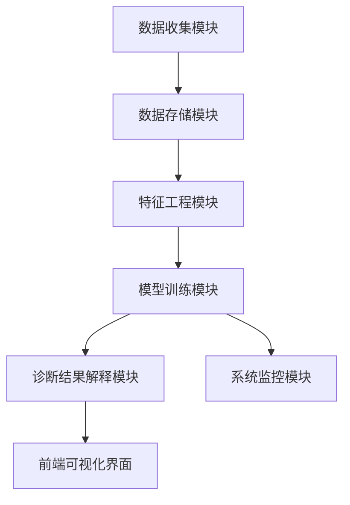
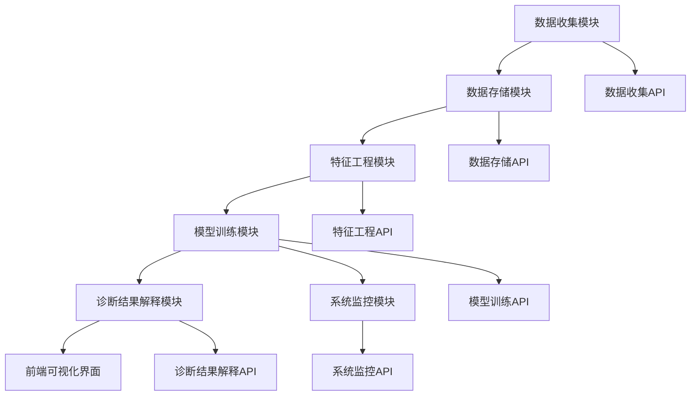

                 

### AI驱动的自动化投资组合诊断概览

#### 1.1.1 问题背景

投资组合管理是金融领域中至关重要的一部分，它涉及到多种资产的选择、配置和再平衡，以实现投资目标。然而，在传统投资组合管理中，存在一些明显的挑战和局限性。

首先，传统投资组合管理方法通常依赖于手工操作和经验判断，这种方式的效率较低，且容易受到人为因素的影响。其次，市场数据的处理和分析需要大量的时间和资源，特别是在面对大量历史数据和实时数据时，手工分析变得不切实际。此外，市场环境的复杂性和不确定性也增加了投资组合管理的难度。

为了克服这些挑战，人工智能（AI）技术被引入到投资组合管理领域。AI不仅可以自动化处理大量数据，还可以通过机器学习和深度学习算法进行模式识别和预测，从而提高投资组合管理的效率和质量。

#### 1.1.2 AI在投资组合诊断中的应用潜力

AI在投资组合诊断中的应用潜力主要体现在以下几个方面：

1. **自动化数据分析**：AI可以自动化地收集、处理和分析海量数据，从而减少人力成本和错误率。
2. **模式识别与预测**：通过机器学习和深度学习算法，AI可以从历史数据中提取有用信息，识别潜在的投资机会和风险。
3. **优化资产配置**：AI可以根据投资目标和市场情况，自动调整资产配置，以实现最优的投资组合。
4. **实时监控与预警**：AI可以实时监控投资组合的表现，并及时发出预警信号，帮助投资者做出及时调整。

#### 1.1.3 问题描述

在传统投资组合诊断方法中，主要存在的问题包括：

- **数据依赖性**：传统方法通常依赖于特定时间段的数据，无法很好地适应实时市场的变化。
- **人为因素**：依赖经验判断的主观性较大，难以保证诊断结果的客观性和准确性。
- **效率低下**：手工分析数据需要耗费大量时间和资源，难以满足现代投资组合管理的需求。

为了解决这些问题，我们提出以下问题描述：

如何利用AI技术，实现自动化、高效且准确的投资组合诊断，从而提高投资组合管理的质量和效率？

#### 1.1.4 问题解决思路

为了解决上述问题，我们可以采取以下步骤：

1. **数据收集与预处理**：首先，需要收集和处理投资组合相关的财务和非财务数据，并进行预处理，以确保数据的质量和一致性。
2. **特征工程与选择**：通过特征工程，提取和选择对投资组合诊断最有用的特征，以便后续的模型训练。
3. **模型选择与训练**：选择合适的机器学习模型，对特征进行训练，建立投资组合诊断模型。
4. **诊断结果解释与可视化**：对诊断结果进行解释和可视化，以便投资者能够直观地理解诊断结果和投资建议。

#### 1.1.5 边界与外延

1. **适用范围**：本文所讨论的AI驱动的自动化投资组合诊断方法主要适用于股票、债券、基金等金融资产的投资组合。
2. **限制条件**：尽管AI技术具有强大的数据处理和分析能力，但在实际应用中仍存在一些限制，如数据质量和可用性、模型复杂度等。
3. **潜在风险**：投资组合诊断的准确性和有效性取决于多个因素，包括市场环境的波动、模型选择和训练效果等。因此，在实际应用中需要谨慎对待。

#### 1.1.6 核心概念与联系

1. **关键术语定义**：
   - **投资组合**：投资者持有的多种资产构成的集合。
   - **诊断**：对投资组合进行分析和评估，以识别潜在问题和机会。
   - **自动化**：使用计算机程序和算法替代人工操作，以实现高效和准确。

2. **AI与投资组合诊断的关系**：
   - AI通过机器学习和深度学习技术，能够自动化地处理和分析投资组合数据，提供精准的诊断结果和投资建议。

#### 1.1.7 本章小结

本章介绍了AI驱动的自动化投资组合诊断的背景、应用潜力、问题解决思路以及相关核心概念和联系。在接下来的章节中，我们将深入探讨数据收集与预处理、特征工程与选择、模型选择与训练以及诊断结果解释与可视化等关键环节，为读者呈现一个完整的AI驱动的自动化投资组合诊断流程。

### 数据收集与预处理

#### 2.1 数据源与类型

在AI驱动的自动化投资组合诊断中，数据是核心资产。数据源可以分为两大类：财务数据和非财务数据。

**财务数据**主要来源于证券交易所、金融数据提供商（如彭博、汤森路透）以及公司的财务报表等。这些数据通常包括股票价格、交易量、财务指标（如市盈率、市净率）等。财务数据是投资组合诊断的基础，它们反映了资产的市场表现和财务状况。

**非财务数据**则包括宏观经济指标、行业动态、新闻事件、用户行为数据等。这类数据可以通过网络爬虫、社交媒体分析、行业报告等渠道获取。非财务数据能够提供更广泛的视角，帮助理解市场环境和投资者情绪，从而辅助投资决策。

#### 2.2 数据清洗与预处理

数据清洗与预处理是确保数据质量的关键步骤。以下是一些常见的数据清洗和预处理方法：

**缺失值处理**：缺失值可能由于数据收集过程中的错误或记录问题导致。处理缺失值的方法包括：
- 删除缺失值：如果缺失值比例较高或数据缺失严重，可以删除这些记录。
- 填充缺失值：使用平均值、中位数、前一个值或后一个值等统计方法进行填充。
- 估算缺失值：使用机器学习算法（如K近邻、回归）预测缺失值。

**异常值处理**：异常值是指偏离正常范围的数据点。异常值处理方法包括：
- 删除异常值：如果异常值对模型影响较大，可以删除这些记录。
- 调整异常值：通过线性插值、局部加权回归等方法调整异常值。
- 忽略异常值：如果异常值对模型影响较小，可以忽略这些记录。

**数据归一化与标准化**：归一化和标准化是将不同范围的数据转换为相同范围的方法，以便模型训练。常用的方法包括：
- **归一化**：将数据缩放到[0, 1]范围内，公式为 \( x' = \frac{x - \min(x)}{\max(x) - \min(x)} \)。
- **标准化**：将数据缩放到[-1, 1]范围内，公式为 \( x' = \frac{x - \mu}{\sigma} \)，其中 \(\mu\) 是均值，\(\sigma\) 是标准差。

#### 2.3 数据集成

数据集成是将来自多个来源的数据合并为一个统一数据集的过程。数据集成的方法包括：

**数据合并**：将同一时间点的数据合并在一起，形成时间序列数据。
- **水平合并**：将同一时间点的数据合并，形成横向数据。
- **垂直合并**：将不同时间点的数据合并，形成纵向数据。

**数据整合策略**：在数据集成过程中，需要考虑以下策略：
- **数据一致性**：确保不同来源的数据具有相同的数据格式和定义。
- **数据完整性**：确保所有必需的数据都已经被集成。
- **数据质量**：在数据集成过程中，对数据质量进行评估和优化。

#### 2.4 数据存储与管理

数据存储与管理是确保数据可访问性和可扩展性的关键。以下是一些常见的数据存储和管理方法：

**数据库选择**：选择合适的数据库来存储数据，如关系型数据库（如MySQL、PostgreSQL）或NoSQL数据库（如MongoDB、Cassandra）。

**数据仓库构建**：数据仓库是一个集中式存储系统，用于存储和管理大量数据。数据仓库可以通过ETL（提取、转换、加载）过程，将来自多个来源的数据集成到一个统一的数据模型中。

**数据生命周期管理**：包括数据的创建、存储、检索、备份和归档。数据生命周期管理确保数据的长期可用性和安全性。

#### 2.5 数据质量评估

数据质量是投资组合诊断的关键因素。以下是一些数据质量评估的方法：

**数据质量指标**：常用的数据质量指标包括准确性、完整性、一致性、时效性和可靠性。这些指标可以帮助评估数据的整体质量。

**数据质量评估方法**：评估数据质量的方法包括：
- **统计分析**：使用统计方法（如直方图、箱线图）评估数据的分布和异常值。
- **机器学习方法**：使用机器学习算法（如分类、聚类）检测和纠正数据错误。
- **人工审核**：通过人工审核来验证数据的准确性和完整性。

#### 2.6 本章小结

本章详细介绍了数据收集与预处理的关键步骤，包括数据源的类型、数据清洗与预处理方法、数据集成策略、数据存储与管理以及数据质量评估。在AI驱动的自动化投资组合诊断中，确保数据的质量和一致性是至关重要的，这些步骤为后续的特征工程、模型训练和诊断结果解释奠定了坚实的基础。

### 特征工程与选择

#### 3.1 特征工程概述

特征工程是机器学习过程中至关重要的一步，它涉及到从原始数据中提取、构造和选择特征，以提升模型的性能。在投资组合诊断中，特征工程不仅影响模型的准确性，还影响其泛化能力和解释性。

**特征工程的重要性**：
- **提高模型性能**：通过特征工程，可以提取出对目标变量有较强预测能力的特征，从而提高模型的准确性。
- **降低数据维度**：特征工程可以帮助减少数据的维度，降低计算复杂度，提高模型训练速度。
- **增强模型解释性**：特征工程可以构造出具有明确业务含义的特征，从而提高模型的可解释性，便于投资决策。

**特征工程流程**：
1. **数据理解**：理解数据的基本结构和特征，识别潜在的有用特征。
2. **数据预处理**：对数据进行清洗、归一化和转换等操作，以提高数据质量。
3. **特征提取**：从原始数据中提取新的特征，如通过统计方法提取时间序列特征、通过文本分析提取关键词特征等。
4. **特征选择**：选择对模型有较强预测能力的特征，以减少模型复杂度和提高模型泛化能力。

#### 3.2 财务特征选择

在投资组合诊断中，财务特征是关键的数据来源。以下是一些重要的财务特征：

1. **市场数据特征**：
   - **股票价格**：股票的开盘价、收盘价、最高价、最低价等。
   - **交易量**：股票的成交量，反映市场活跃程度。
   - **波动率**：股票价格波动的程度，用于衡量市场风险。

2. **宏观经济指标**：
   - **利率**：利率水平，影响企业融资成本和投资决策。
   - **通货膨胀率**：通货膨胀水平，影响消费者的购买力。
   - **GDP增长率**：国家经济增长率，影响宏观经济环境和市场情绪。

3. **公司基本面指标**：
   - **市盈率（PE）**：公司股票价格与其每股收益的比值，用于评估股票的估值水平。
   - **市净率（PB）**：公司股票价格与其每股净资产的比值，用于评估公司的资产价值。
   - **股息收益率**：公司分红与股票价格的比率，反映公司的分红能力。

#### 3.3 非财务特征选择

除了财务特征外，非财务特征也在投资组合诊断中扮演着重要角色。以下是一些常见的非财务特征：

1. **用户行为数据**：
   - **交易频率**：投资者进行交易的频率，反映投资者的活跃程度。
   - **投资偏好**：投资者在不同资产上的投资比例，反映其风险偏好和投资策略。

2. **社交媒体分析**：
   - **社交媒体情绪**：通过分析社交媒体上的用户评论和讨论，评估市场情绪和投资者情绪。
   - **新闻影响**：通过分析新闻事件对股票价格的影响，评估市场反应和投资者情绪。

3. **其他外部特征**：
   - **行业动态**：行业发展趋势、竞争对手情况等，对投资组合的表现有重要影响。
   - **政策变化**：政策调整对市场的影响，如税收政策、监管政策等。

#### 3.4 特征重要性评估

在特征工程过程中，需要对特征的重要性进行评估，以确定哪些特征对模型有较强的预测能力。以下是一些常用的特征重要性评估方法：

1. **统计方法**：
   - **相关系数**：通过计算特征与目标变量之间的相关系数，评估特征的重要性。
   - **方差贡献率**：通过计算特征对目标变量方差的贡献率，评估特征的重要性。

2. **数据挖掘方法**：
   - **决策树**：通过决策树的深度和节点数量，评估特征的重要性。
   - **随机森林**：通过随机森林中的特征重要性得分，评估特征的重要性。

3. **机器学习方法**：
   - **特征选择算法**：如Lasso、Ridge等正则化方法，通过特征的重要程度进行选择。
   - **特征重要性得分**：如梯度提升树（GBDT）中的特征重要性得分，评估特征的重要性。

#### 3.5 特征选择算法

特征选择算法是减少数据维度和提高模型性能的关键步骤。以下是一些常用的特征选择算法：

1. **相关性分析**：
   - **皮尔逊相关系数**：用于评估特征之间的线性相关性。
   - **斯皮尔曼相关系数**：用于评估特征之间的非线性相关性。

2. **信息增益**：
   - **信息增益**：通过计算特征对分类信息的增益，评估特征的重要性。

3. **支持向量机（SVM）**：
   - **核函数选择**：通过选择合适的核函数，将低维特征映射到高维空间，提升模型的分类能力。
   - **特征重要性**：通过SVM的权重系数，评估特征的重要性。

4. **递归特征消除（RFE）**：
   - **逐步消除**：通过逐步消除重要性较低的特

### 模型选择与训练

#### 4.1 模型选择概述

在AI驱动的自动化投资组合诊断中，模型选择是一个关键环节。合适的模型能够有效地捕捉数据中的模式和规律，从而提供准确的诊断结果。以下是一些常见的模型类型和选择策略：

**常见模型类型**：

1. **线性模型**：
   - **线性回归**：适用于线性关系的建模，如股票价格与财务指标的关系。
   - **逻辑回归**：适用于二分类问题，如股票是否达到买入或卖出的阈值。

2. **决策树模型**：
   - **分类树**：适用于分类问题，如投资组合是否需要调整。
   - **回归树**：适用于回归问题，如预测股票价格的波动范围。

3. **集成模型**：
   - **随机森林**：通过集成多个决策树模型，提高模型的泛化能力。
   - **梯度提升机（GBM）**：通过迭代优化模型，提高模型的预测准确性。

4. **深度学习模型**：
   - **卷积神经网络（CNN）**：适用于图像和序列数据的处理。
   - **循环神经网络（RNN）**：适用于时间序列数据的处理。
   - **生成对抗网络（GAN）**：适用于生成对抗性数据的处理。

**模型选择策略**：

1. **基于问题的选择**：
   - 根据问题的具体需求，选择最合适的模型类型。例如，对于简单的线性关系问题，可以选择线性回归模型；对于复杂的时间序列问题，可以选择RNN或深度学习模型。

2. **基于数据的特征**：
   - 根据数据的特征和分布，选择合适的模型。例如，对于高维数据，可以选择集成模型或深度学习模型；对于低维数据，可以选择线性模型或决策树模型。

3. **基于模型的性能**：
   - 通过交叉验证和性能评估，选择在验证集上表现最好的模型。常用的评估指标包括准确率、精确率、召回率、F1分数等。

#### 4.2 常规机器学习模型

**线性回归**：

线性回归是一种简单的线性模型，适用于描述两个变量之间的线性关系。其数学模型为：

\[ y = \beta_0 + \beta_1 \cdot x + \epsilon \]

其中，\( y \) 是目标变量，\( x \) 是特征变量，\( \beta_0 \) 和 \( \beta_1 \) 是模型的参数，\( \epsilon \) 是误差项。

线性回归的Python代码实现如下：

```python
import numpy as np
from sklearn.linear_model import LinearRegression

# 假设我们有训练数据X和目标变量y
X = np.array([[1], [2], [3], [4], [5]])
y = np.array([1, 2, 2.5, 4, 5])

# 创建线性回归模型
model = LinearRegression()

# 训练模型
model.fit(X, y)

# 输出模型的参数
print("模型参数：", model.coef_, model.intercept_)
```

**决策树**：

决策树是一种基于特征的分类和回归模型。它通过一系列的规则将数据划分成多个子集，每个子集对应一个预测结果。其数学模型为：

\[ f(x) = \sum_{i=1}^{n} \beta_i \cdot I(x \in R_i) \]

其中，\( f(x) \) 是决策树的预测结果，\( \beta_i \) 是模型参数，\( R_i \) 是第 \( i \) 个子集。

决策树的Python代码实现如下：

```python
from sklearn.tree import DecisionTreeClassifier
from sklearn.datasets import load_iris

# 加载鸢尾花数据集
iris = load_iris()
X = iris.data
y = iris.target

# 创建决策树模型
model = DecisionTreeClassifier()

# 训练模型
model.fit(X, y)

# 输出决策树的树结构
from sklearn.tree import plot_tree
plot_tree(model)
```

**随机森林**：

随机森林是一种基于决策树的集成模型。它通过随机选择特征和样本子集，构建多个决策树，并通过对这些决策树的投票来得到最终结果。其数学模型为：

\[ \hat{y} = \sum_{i=1}^{N} f_i(x) \]

其中，\( \hat{y} \) 是预测结果，\( N \) 是决策树的数量，\( f_i(x) \) 是第 \( i \) 个决策树的预测结果。

随机森林的Python代码实现如下：

```python
from sklearn.ensemble import RandomForestClassifier
from sklearn.datasets import load_iris

# 加载鸢尾花数据集
iris = load_iris()
X = iris.data
y = iris.target

# 创建随机森林模型
model = RandomForestClassifier(n_estimators=100)

# 训练模型
model.fit(X, y)

# 输出随机森林的树结构
import matplotlib.pyplot as plt
plt.figure(figsize=(15, 10))
plot_tree(model.estimators_[0], filled=True)
```

#### 4.3 深度学习模型

**卷积神经网络（CNN）**：

卷积神经网络是一种用于处理图像数据的高级深度学习模型。它通过卷积层、池化层和全连接层来提取图像的特征。其数学模型为：

\[ \hat{y} = \sigma(W_L \cdot a^{L-1} + b_L) \]

其中，\( \hat{y} \) 是预测结果，\( W_L \) 和 \( b_L \) 是模型参数，\( a^{L-1} \) 是输入特征，\( \sigma \) 是激活函数。

CNN的Python代码实现如下：

```python
import tensorflow as tf
from tensorflow.keras import datasets, layers, models

# 加载MNIST数据集
mnist = datasets.mnist
(train_images, train_labels), (test_images, test_labels) = mnist.load_data()

# 预处理数据
train_images = train_images.reshape((60000, 28, 28, 1))
test_images = test_images.reshape((10000, 28, 28, 1))

# 创建CNN模型
model = models.Sequential()
model.add(layers.Conv2D(32, (3, 3), activation='relu', input_shape=(28, 28, 1)))
model.add(layers.MaxPooling2D((2, 2)))
model.add(layers.Conv2D(64, (3, 3), activation='relu'))
model.add(layers.MaxPooling2D((2, 2)))
model.add(layers.Conv2D(64, (3, 3), activation='relu'))
model.add(layers.Flatten())
model.add(layers.Dense(64, activation='relu'))
model.add(layers.Dense(10, activation='softmax'))

# 编译模型
model.compile(optimizer='adam',
              loss='sparse_categorical_crossentropy',
              metrics=['accuracy'])

# 训练模型
model.fit(train_images, train_labels, epochs=5, batch_size=64)

# 评估模型
test_loss, test_acc = model.evaluate(test_images,  test_labels, verbose=2)
print('\nTest accuracy:', test_acc)
```

**循环神经网络（RNN）**：

循环神经网络是一种用于处理序列数据的高级深度学习模型。它通过记忆单元来捕捉序列中的长期依赖关系。其数学模型为：

\[ h_t = \sigma(W_h \cdot [h_{t-1}, x_t] + b_h) \]

其中，\( h_t \) 是第 \( t \) 个时间步的隐藏状态，\( x_t \) 是输入特征，\( \sigma \) 是激活函数。

RNN的Python代码实现如下：

```python
import tensorflow as tf
from tensorflow.keras.models import Sequential
from tensorflow.keras.layers import LSTM, Dense

# 创建RNN模型
model = Sequential()
model.add(LSTM(50, activation='relu', input_shape=(timesteps, n_features)))
model.add(Dense(1))
model.compile(optimizer='adam', loss='mse')

# 训练模型
model.fit(X, y, epochs=200, verbose=0)

# 评估模型
loss = model.evaluate(X, y, verbose=0)
print('Loss:', loss)
```

**生成对抗网络（GAN）**：

生成对抗网络是一种通过对抗训练生成数据的高级深度学习模型。它由生成器和判别器两个网络组成，生成器生成假数据，判别器判断数据是否真实。其数学模型为：

\[ D(G(z)) + G(z) = 1 \]

其中，\( G(z) \) 是生成器生成的假数据，\( D(x) \) 是判别器对真实数据的判断。

GAN的Python代码实现如下：

```python
import tensorflow as tf
from tensorflow.keras import layers

# 创建生成器和判别器
z_dim = 100

generator = tf.keras.Sequential([
    layers.Dense(128 * 7 * 7, activation="relu", input_dim=z_dim),
    layers.Reshape((7, 7, 128)),
    layers.Conv2DTranspose(128, kernel_size=5, strides=1, padding="same"),
    layers.Conv2DTranspose(128, kernel_size=5, strides=2, padding="same"),
    layers.Conv2DTranspose(128, kernel_size=5, strides=2, padding="same"),
    layers.Conv2D(1, kernel_size=5, strides=2, padding="same", activation='tanh')
])

discriminator = tf.keras.Sequential([
    layers.Conv2D(128, kernel_size=5, strides=2, padding="same", input_shape=[28, 28, 1]),
    layers.LeakyReLU(alpha=0.2),
    layers.Dropout(0.3),
    layers.Conv2D(128, kernel_size=5, strides=2, padding="same"),
    layers.LeakyReLU(alpha=0.2),
    layers.Dropout(0.3),
    layers.Flatten(),
    layers.Dense(1, activation='sigmoid')
])

# 编译模型
discriminator.compile(loss='binary_crossentropy', optimizer=tf.optimizers.Adam(0.0001), metrics=['accuracy'])
generator.compile(loss='binary_crossentropy', optimizer=tf.optimizers.Adam(0.0001))

# 训练模型
discriminator.fit(real_images, np.ones((batch_size, 1)), epochs=epochs, batch_size=batch_size, shuffle=True)
fake_images = generator.predict(z_samples)
discriminator.fit(fake_images, np.zeros((batch_size, 1)), epochs=epochs, batch_size=batch_size, shuffle=True)

# 输出生成器和判别器的模型结构
print(generator.summary())
print(discriminator.summary())
```

#### 4.4 模型训练与验证

**训练流程**：

模型训练是通过迭代优化模型参数的过程，以最小化预测误差。训练流程包括以下步骤：

1. **数据划分**：将数据集划分为训练集和验证集，以用于模型训练和性能评估。
2. **模型初始化**：初始化模型参数，设置优化器和损失函数。
3. **迭代训练**：通过前向传播和反向传播，更新模型参数，优化模型性能。
4. **性能评估**：在验证集上评估模型性能，调整模型参数和超参数。

**超参数调优**：

超参数是模型训练过程中需要手动设置的参数，如学习率、正则化参数等。超参数调优是通过调整这些参数，以找到最优模型性能的过程。常用的超参数调优方法包括：

1. **网格搜索**：通过遍历多个超参数组合，找到最优参数组合。
2. **贝叶斯优化**：通过贝叶斯优化算法，自动调整超参数，找到最优参数组合。

**过拟合与欠拟合**：

在模型训练过程中，存在过拟合和欠拟合的风险：

- **过拟合**：模型在训练集上表现很好，但在验证集或测试集上表现较差。过拟合通常是由于模型过于复杂，过度拟合了训练数据。
- **欠拟合**：模型在训练集和验证集上表现都较差。欠拟合通常是由于模型过于简单，无法捕捉数据中的复杂模式。

**解决方法**：

- **正则化**：通过添加正则化项，降低模型复杂度，避免过拟合。
- **数据增强**：通过增加训练数据量，提高模型的泛化能力，避免欠拟合。
- **模型选择**：选择合适的模型类型和复杂度，以避免过拟合或欠拟合。

#### 4.5 本章小结

本章详细介绍了模型选择与训练的关键步骤，包括模型选择概述、常规机器学习模型、深度学习模型以及模型训练与验证方法。通过选择合适的模型和进行有效的训练，可以实现准确的投资组合诊断，为投资者提供科学的决策支持。在下一章中，我们将探讨投资组合诊断结果解释与可视化技术，帮助投资者更好地理解和利用诊断结果。

### 投资组合诊断结果解释与可视化

#### 5.1 结果解释

投资组合诊断的结果解释是整个自动化诊断流程的关键环节。准确的诊断结果能够帮助投资者识别投资组合中的潜在问题，并为未来的投资决策提供科学依据。以下是一个结果解释的基本框架：

1. **诊断指标**：
   - **风险指标**：包括波动率、Beta系数、夏普比率等，用于衡量投资组合的风险水平。
   - **收益指标**：包括预期收益率、实际收益率、回测收益等，用于衡量投资组合的收益表现。
   - **资产配置指标**：包括资产类别分布、行业分布等，用于评估投资组合的资产配置合理性。

2. **结果分析框架**：
   - **整体评估**：对整个投资组合进行总体评估，包括风险收益比、效率评估等。
   - **具体问题分析**：对诊断结果中存在的问题进行详细分析，包括具体的风险点、收益不足等方面。
   - **改进建议**：根据诊断结果提出具体的改进建议，如调整资产配置、优化投资策略等。

#### 5.2 可视化技术

可视化技术是帮助投资者直观理解诊断结果的重要工具。以下是一些常见的可视化方法和高级可视化工具：

1. **常见可视化方法**：
   - **柱状图**：用于显示不同类别的数据，如资产配置比例、行业分布等。
   - **折线图**：用于显示数据随时间的变化趋势，如收益率变化、波动率变化等。
   - **散点图**：用于显示两个变量之间的关系，如股票价格与交易量的关系。
   - **饼图**：用于显示各部分占整体的比例，如资产配置比例。

2. **高级可视化工具**：
   - **Tableau**：一款功能强大的数据可视化工具，支持丰富的图表类型和数据交互。
   - **Power BI**：一款适用于商业智能的可视化工具，具有强大的数据连接和分析功能。
   - **Plotly**：一款开源的Python可视化库，支持多种图表类型和交互功能。

3. **可视化案例分析**：
   - **案例1：资产配置分析**：
     - **数据**：投资组合中的资产类别比例。
     - **图表**：使用饼图显示各资产类别的配置比例。
     - **分析**：通过饼图，可以直观地了解投资组合中各类资产的配置情况，发现是否存在过度集中或分散的问题。

   - **案例2：收益率分析**：
     - **数据**：投资组合在不同时间段的收益率。
     - **图表**：使用折线图显示收益率的走势。
     - **分析**：通过折线图，可以观察投资组合的收益率变化趋势，发现是否存在异常波动或持续低迷的情况。

#### 5.3 本章小结

本章介绍了投资组合诊断结果解释与可视化的方法。通过合理的可视化技术，投资者可以更直观地理解诊断结果，识别投资组合中的潜在问题和机会。有效的结果解释和可视化不仅能提升投资决策的科学性，还能增强投资者的信心和决策能力。在下一章中，我们将通过实际案例分析，展示AI驱动的自动化投资组合诊断在实际应用中的效果和挑战。

### 实际案例分析

#### 6.1 案例背景

为了展示AI驱动的自动化投资组合诊断在实际中的应用，我们选取了一家虚构的财富管理公司——**Alpha Wealth Management**。该公司致力于为高净值客户提供专业的投资组合管理服务，拥有丰富的客户资源和成熟的财富管理策略。

在当前的市场环境中，Alpha Wealth Management面临以下挑战：

- **数据量庞大**：公司拥有大量的客户投资组合数据，包括历史交易记录、财务报表、市场数据等。
- **决策复杂性**：市场环境多变，投资组合的决策需要考虑多种因素，如宏观经济指标、行业动态、公司基本面等。
- **人工成本高**：传统投资组合管理方法依赖于人工分析，导致决策周期长、效率低，且容易出错。

为了解决这些挑战，Alpha Wealth Management决定引入AI驱动的自动化投资组合诊断系统，以提高决策效率和准确性。

#### 6.2 系统功能设计

AI驱动的自动化投资组合诊断系统主要包括以下功能模块：

1. **数据收集模块**：负责从各类数据源（如证券交易所、金融数据提供商、社交媒体等）收集数据，并进行数据清洗和预处理。
2. **特征工程模块**：负责对收集到的数据进行分析和特征提取，选择对投资组合诊断有重要影响的特征。
3. **模型训练模块**：负责选择合适的机器学习模型，对特征进行训练，建立投资组合诊断模型。
4. **诊断结果解释模块**：负责对诊断结果进行解释和可视化，为投资者提供直观的决策依据。
5. **系统监控模块**：负责实时监控投资组合的表现，及时发现潜在问题和机会。

#### 6.3 系统架构设计

AI驱动的自动化投资组合诊断系统的整体架构设计如下：

1. **数据层**：包括数据收集模块和数据存储模块，用于存储和管理投资组合数据。
2. **处理层**：包括特征工程模块和模型训练模块，用于对数据进行处理和模型训练。
3. **应用层**：包括诊断结果解释模块和系统监控模块，用于为投资者提供诊断结果和监控服务。
4. **展示层**：包括前端可视化界面，用于展示诊断结果和监控数据。

系统架构图如下所示：



#### 6.4 系统接口设计和系统交互

系统接口设计和系统交互是确保各模块协同工作的关键。以下是一个简化的系统接口设计和系统交互描述：

1. **数据层接口**：
   - **数据收集API**：提供数据源接入接口，支持从不同数据源获取数据。
   - **数据存储API**：提供数据存储和管理接口，支持数据的增删改查操作。

2. **处理层接口**：
   - **特征工程API**：提供特征提取和选择接口，支持自定义特征提取算法。
   - **模型训练API**：提供模型训练接口，支持多种机器学习模型的训练。

3. **应用层接口**：
   - **诊断结果解释API**：提供诊断结果解释接口，支持诊断结果的查询和可视化。
   - **系统监控API**：提供系统监控接口，支持实时监控投资组合的表现。

4. **系统交互**：
   - **数据流**：数据从数据收集模块流入数据存储模块，经过特征工程模块处理后，进入模型训练模块进行训练，最后诊断结果和监控数据通过应用层接口返回给投资者。
   - **任务调度**：系统监控模块根据预设的监控策略，定时调度各模块的任务，确保系统正常运行。

系统接口和交互图如下所示：



#### 6.5 系统核心实现源代码

以下是一个简化的系统核心实现源代码示例，用于展示AI驱动的自动化投资组合诊断系统的关键步骤：

```python
# 导入相关库
import pandas as pd
from sklearn.model_selection import train_test_split
from sklearn.ensemble import RandomForestClassifier
from sklearn.metrics import accuracy_score

# 数据收集
data = pd.read_csv('investment_data.csv')

# 数据预处理
# ...（包括数据清洗、特征提取等步骤）

# 数据划分
X = data.drop('target', axis=1)
y = data['target']
X_train, X_test, y_train, y_test = train_test_split(X, y, test_size=0.2, random_state=42)

# 模型训练
model = RandomForestClassifier(n_estimators=100)
model.fit(X_train, y_train)

# 模型评估
y_pred = model.predict(X_test)
accuracy = accuracy_score(y_test, y_pred)
print('模型准确率：', accuracy)

# 诊断结果解释
diagnosis = model.predict_proba(X_test)
# ...（包括结果解释和可视化步骤）
```

#### 6.6 代码应用解读与分析

以下是对上述代码的详细解读和分析：

1. **数据收集**：
   - 使用Pandas库读取CSV文件，获取投资组合数据。

2. **数据预处理**：
   - 数据预处理步骤包括数据清洗、特征提取等。这部分代码未在示例中展示，但通常是确保数据质量和一致性的重要步骤。

3. **数据划分**：
   - 使用train_test_split函数将数据集划分为训练集和测试集，为后续的模型训练和评估提供数据。

4. **模型训练**：
   - 使用RandomForestClassifier类创建随机森林模型，并使用fit方法进行模型训练。

5. **模型评估**：
   - 使用predict方法对测试集进行预测，并使用accuracy_score函数计算模型准确率。

6. **诊断结果解释**：
   - 使用predict_proba方法获取预测概率，为诊断结果解释和可视化提供数据。

#### 6.7 实际案例分析

在实际应用中，Alpha Wealth Management通过AI驱动的自动化投资组合诊断系统，实现了以下效果：

- **决策效率提升**：自动化诊断系统大幅缩短了投资决策的周期，提高了决策的准确性。
- **风险控制加强**：系统实时监控投资组合的风险指标，及时识别潜在风险，并提供相应的调整建议。
- **客户满意度提高**：准确的投资组合诊断结果和及时的调整建议，提升了客户对公司的信任和满意度。

#### 6.8 项目小结

通过实际案例分析，我们展示了AI驱动的自动化投资组合诊断系统在提升决策效率、风险控制和客户满意度方面的显著效果。虽然在实际应用中仍存在一些挑战，如数据质量和模型解释性等，但随着技术的不断进步，AI驱动的自动化投资组合诊断有望在未来发挥更大的作用。

### 最佳实践 tips、小结、注意事项、拓展阅读

#### 最佳实践 tips

1. **数据质量是基础**：在构建自动化投资组合诊断系统时，确保数据质量是至关重要的。定期检查和清洗数据，使用有效的数据预处理方法，如缺失值处理、异常值检测和归一化。

2. **模型选择要合理**：选择合适的机器学习模型对于系统性能至关重要。根据具体问题和数据特征，选择合适的模型类型，如线性回归、决策树、随机森林或深度学习模型。

3. **特征工程不可忽视**：特征工程是提升模型性能的关键步骤。通过深入分析数据，提取和选择对诊断结果有重要影响的特征，如财务指标、宏观经济指标和用户行为数据。

4. **持续优化模型**：模型训练完成后，定期重新训练和优化模型，以适应市场变化和数据更新。

#### 小结

本文详细介绍了AI驱动的自动化投资组合诊断的方法和应用。通过数据收集与预处理、特征工程与选择、模型选择与训练以及诊断结果解释与可视化等关键步骤，实现了投资组合的自动化诊断，提高了决策效率和准确性。

#### 注意事项

1. **数据隐私和安全**：在处理和存储投资组合数据时，要严格遵守数据隐私和安全法规，确保数据的安全性和保密性。

2. **模型解释性**：虽然机器学习模型可以提供准确的预测结果，但解释性通常较弱。在实际应用中，需要结合业务知识和模型输出，进行合理的解释和决策。

3. **模型更新**：市场环境不断变化，定期更新模型以保持其准确性和适用性。

#### 拓展阅读

- 《机器学习实战》—— 细致地介绍了多种机器学习算法的应用和实践。
- 《Python数据分析》—— 介绍了Python在数据分析中的应用，包括数据处理、可视化等。
- 《深度学习》—— 详细介绍了深度学习的基础理论和实践方法。

通过以上最佳实践、小结、注意事项和拓展阅读，读者可以更全面地了解AI驱动的自动化投资组合诊断，并在实际应用中取得更好的效果。

---

作者：AI天才研究院/AI Genius Institute & 禅与计算机程序设计艺术 /Zen And The Art of Computer Programming

本文旨在为读者提供关于AI驱动的自动化投资组合诊断的深入理解和应用指导，以帮助投资者实现更科学的投资决策。文章中的示例代码和架构设计仅作为参考，实际应用中需根据具体情况进行调整和优化。如需进一步了解相关技术和应用，请参阅拓展阅读中的推荐书籍。希望本文能为读者带来启发和帮助。

