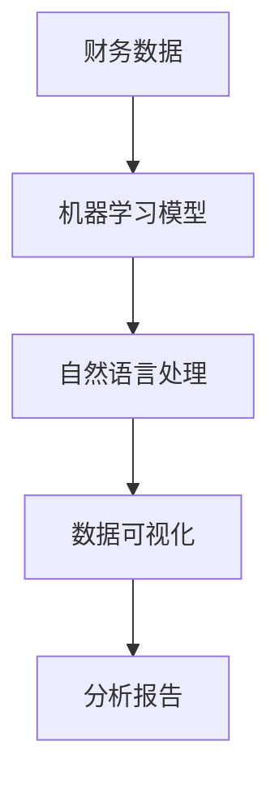

                 

# AI驱动的自动化财报分析系统

## 关键词

AI自动化，财报分析，算法原理，系统架构，项目实战，最佳实践

## 摘要

本文将深入探讨AI驱动的自动化财报分析系统，从背景介绍、核心概念与联系、算法原理讲解、系统分析与架构设计、项目实战等多个方面，系统性地解析这一技术领域的最新进展和应用。通过一步步的分析推理，本文旨在帮助读者全面理解AI在财报分析中的应用，掌握系统设计与实现的精髓，并为未来在该领域的进一步研究提供指导。

### 目录

1. **背景介绍**
   - **1.1 问题背景**
   - **1.2 问题描述**
   - **1.3 问题解决**
   - **1.4 边界与外延**
   
2. **核心概念与联系**
   - **2.1 AI驱动的自动化财报分析系统原理**
     - **2.1.1 概念原理**
     - **2.1.2 概念属性特征对比表格**
     - **2.1.3 ER实体关系图架构的Mermaid流程图**
   
3. **算法原理讲解**
   - **3.1 算法mermaid流程图**
   - **3.2 Python源代码讲解**
   - **3.3 数学模型和公式**
     - **3.3.1 模型公式**
     - **3.3.2 公式详细讲解**
     - **3.3.3 举例说明**
   
4. **系统分析与架构设计**
   - **4.1 问题场景介绍**
   - **4.2 项目介绍**
     - **4.2.1 系统功能设计(Mermaid类图)**
     - **4.2.2 系统架构设计(Mermaid架构图)**
     - **4.2.3 系统接口设计**
     - **4.2.4 系统交互(Mermaid序列图)**
   
5. **项目实战**
   - **5.1 环境安装**
   - **5.2 系统核心实现源代码**
   - **5.3 代码应用解读与分析**
   - **5.4 实际案例分析与详细讲解剖析**
   - **5.5 项目小结**

6. **最佳实践 tips**
   - **6.1 常见问题与解决方法**
   - **6.2 性能优化技巧**
   - **6.3 安全性注意事项**

7. **小结**
   - **7.1 系统总结**
   - **7.2 展望未来**
   - **7.3 注意事项**

8. **拓展阅读**
   - **8.1 相关文献推荐**
   - **8.2 进一步学习资源**
   - **8.3 未来研究方向**

---

### 第1章：背景介绍

#### 1.1 问题背景

随着全球经济的快速发展，企业对财务信息的透明度和准确性要求越来越高。传统的财报分析方法依赖于人工处理大量数据，效率低下且容易出错。财务分析报告的内容繁杂，包括利润表、资产负债表、现金流量表等，每个表都涉及大量的数据和指标。如何在短时间内快速、准确地分析这些数据，提取关键信息，为企业的经营决策提供支持，成为了一个亟待解决的问题。

#### 1.2 问题描述

在财报分析中，主要面临以下问题：

1. **数据量大**：财报数据通常包含大量的行和列，传统的人工分析方法难以高效处理。
2. **复杂关系**：财务指标之间存在着复杂的关联关系，需要深入挖掘和解释。
3. **实时性要求**：企业希望实时获取财报分析结果，以便快速做出决策。
4. **多样化需求**：不同的企业有不同的财报分析需求，需要灵活的解决方案。

#### 1.3 问题解决

为了解决上述问题，引入AI驱动的自动化财报分析系统成为一种有效的解决方案。AI系统可以利用机器学习算法，对大量的财务数据进行自动分析和处理，提取关键信息，生成报表，并提供决策支持。这样，不仅可以提高分析的准确性和效率，还能满足实时性和多样化需求。

#### 1.4 边界与外延

AI驱动的自动化财报分析系统不仅局限于处理企业内部的财务数据，还可以扩展到对行业数据的分析，为企业提供更全面的视角。此外，系统还可以集成其他数据源，如市场数据、宏观经济数据等，进行更复杂的分析，为企业的战略决策提供更深入的洞察。

### 第2章：核心概念与联系

#### 2.1 AI驱动的自动化财报分析系统原理

##### 2.1.1 概念原理

AI驱动的自动化财报分析系统主要基于以下核心概念：

1. **机器学习**：利用历史数据训练模型，自动识别财务数据中的规律和趋势。
2. **自然语言处理**：对财报文本进行解析，提取关键信息和术语。
3. **数据可视化**：将分析结果以图表形式直观展示，便于理解和决策。

##### 2.1.2 概念属性特征对比表格

| 概念           | 属性特征                     | 对比分析                 |
|----------------|-----------------------------|--------------------------|
| 机器学习       | 自动化、高效、规律识别       | 适用于大规模数据         |
| 自然语言处理   | 文本解析、语义理解           | 适用于文本数据           |
| 数据可视化     | 直观展示、易于理解           | 适用于决策支持           |

##### 2.1.3 ER实体关系图架构的Mermaid流程图

---

在下一章中，我们将详细讲解AI驱动的自动化财报分析系统的算法原理，包括mermaid流程图、Python源代码、数学模型和公式，以及举例说明。敬请期待。

