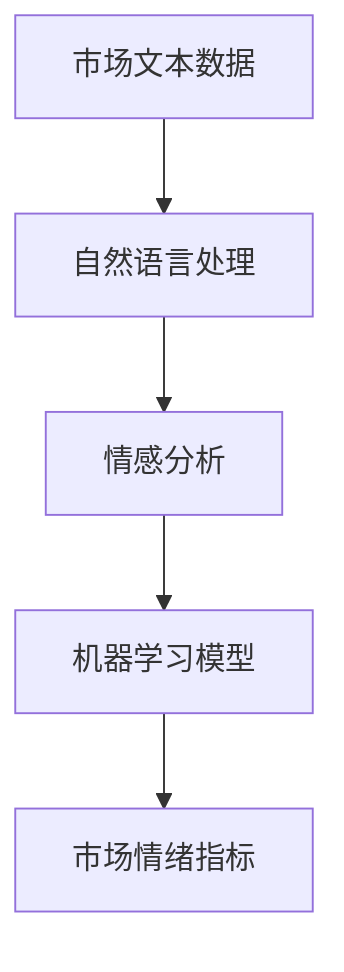
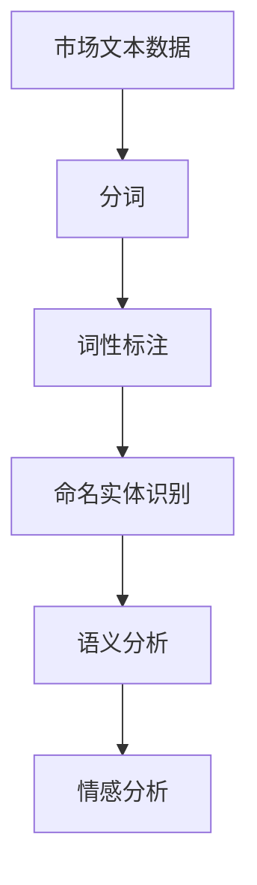
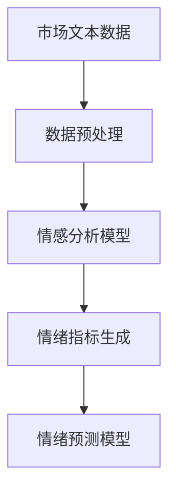
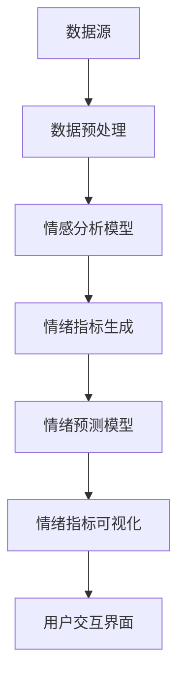
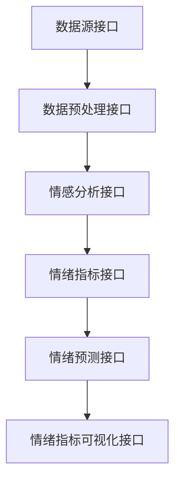
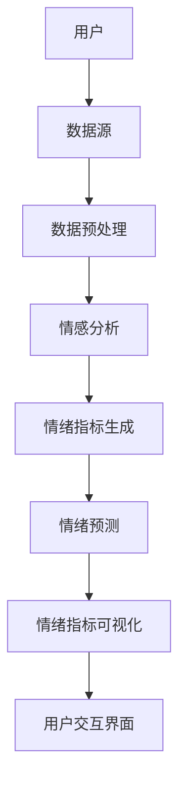

                 

### 文章标题

# AI驱动的自适应市场情绪指标

---

**关键词：** 人工智能，市场情绪，自然语言处理，情感分析，机器学习

**摘要：** 本文将深入探讨AI驱动的自适应市场情绪指标的研究与应用。通过自然语言处理、情感分析和机器学习等技术的结合，本文构建了一个实时、准确的市场情绪指标系统，以期为投资者提供更有价值的决策支持。

----------------------------------------------------------------

**Step 1: 引言与背景介绍**

### 引言

随着人工智能（AI）技术的飞速发展，其在各个领域的应用越来越广泛。在金融市场，AI驱动的自适应市场情绪指标成为了一个重要的研究方向。这些指标能够实时分析市场情绪，帮助投资者做出更明智的决策。

#### 背景介绍

- **问题背景**：市场情绪对金融市场的波动有着重要影响，但传统方法难以捕捉和量化这种情绪。
- **问题描述**：如何构建一个AI驱动的自适应市场情绪指标，实现实时、准确的情绪分析？
- **问题解决**：利用自然语言处理、情感分析和机器学习等技术，构建一个自适应的市场情绪指标系统。
- **边界与外延**：本研究的重点在于AI驱动的自适应市场情绪指标，但相关技术也可以应用于其他领域。
- **概念结构与核心要素组成**：

  - **自然语言处理（NLP）**：用于提取和处理市场相关的文本数据。
  - **情感分析**：用于识别文本数据中的情感倾向。
  - **机器学习**：用于训练模型，实现情绪的自动识别和预测。

### 引言

人工智能（AI）技术正在快速发展和变革，其在各个领域的应用越来越广泛。在金融市场，AI驱动的自适应市场情绪指标成为了一个重要的研究方向。这些指标能够实时分析市场情绪，帮助投资者做出更明智的决策。

#### 背景介绍

- **问题背景**：市场情绪对金融市场的波动有着重要影响，但传统方法难以捕捉和量化这种情绪。
- **问题描述**：如何构建一个AI驱动的自适应市场情绪指标，实现实时、准确的情绪分析？
- **问题解决**：利用自然语言处理、情感分析和机器学习等技术，构建一个自适应的市场情绪指标系统。
- **边界与外延**：本研究的重点在于AI驱动的自适应市场情绪指标，但相关技术也可以应用于其他领域。
- **概念结构与核心要素组成**：

  - **自然语言处理（NLP）**：用于提取和处理市场相关的文本数据。
  - **情感分析**：用于识别文本数据中的情感倾向。
  - **机器学习**：用于训练模型，实现情绪的自动识别和预测。

---

**Step 2: 核心概念与联系**

### 核心概念

#### 1. 自然语言处理（NLP）

自然语言处理是AI领域的一个分支，旨在使计算机能够理解、解释和生成人类语言。在市场情绪分析中，NLP技术用于提取和处理市场相关的文本数据，如新闻报道、社交媒体帖子等。

#### 2. 情感分析

情感分析是一种自然语言处理技术，用于识别文本数据中的情感倾向。在市场情绪分析中，情感分析可以帮助识别市场情绪的变化，如乐观、悲观、中性等。

#### 3. 机器学习

机器学习是一种AI技术，通过训练模型来识别数据中的模式。在市场情绪分析中，机器学习用于训练模型，实现情绪的自动识别和预测。

### 概念属性特征对比表格

| 概念         | 特征                             | 说明                                           |
| ------------ | -------------------------------- | ---------------------------------------------- |
| 自然语言处理 | 语言理解、文本生成               | 用于提取和处理市场相关的文本数据。              |
| 情感分析     | 情感分类、情感极性识别           | 用于识别文本数据中的情感倾向。                |
| 机器学习     | 模型训练、模式识别               | 用于训练模型，实现情绪的自动识别和预测。        |

### ER实体关系图架构



---

**Step 3: 算法原理讲解**

### 算法原理

#### 1. 自然语言处理（NLP）流程



#### 2. 情感分析模型

假设我们使用LSTM（Long Short-Term Memory）神经网络进行情感分析：

$$
\begin{align*}
h_t &= \sigma(W_h \cdot [h_{t-1}, x_t] + b_h), \\
o_t &= \sigma(W_o \cdot h_t + b_o),
\end{align*}
$$

其中，$h_t$ 表示第$t$个时间步的隐藏状态，$o_t$ 表示第$t$个时间步的输出，$W_h$ 和$W_o$ 分别为权重矩阵，$b_h$ 和$b_o$ 分别为偏置项，$\sigma$ 表示sigmoid函数。

#### 3. 机器学习模型

假设我们使用SVM（Support Vector Machine）进行情绪分类：

$$
\begin{align*}
\text{最大化} \quad & \frac{1}{2} \sum_{i=1}^{n} w_i^2 \\
\text{约束条件} \quad & y_i ( \langle w, x_i \rangle - b ) \geq 1,
\end{align*}
$$

其中，$w$ 表示权重向量，$x_i$ 表示第$i$个训练样本，$y_i$ 表示第$i$个训练样本的标签（-1或1），$b$ 表示偏置项。

---

**Step 4: 系统分析与架构设计方案**

### 问题场景介绍

在金融市场中，市场情绪对投资者的决策有着重要影响。传统的市场情绪分析依赖于人工分析，效率低下且容易出错。随着AI技术的发展，我们希望构建一个AI驱动的自适应市场情绪指标系统，实现实时、准确的情绪分析，为投资者提供更有价值的决策支持。

### 项目介绍

本项目旨在构建一个AI驱动的自适应市场情绪指标系统，通过自然语言处理、情感分析和机器学习等技术，实现市场情绪的实时、准确分析。系统将集成多个数据源，包括新闻报道、社交媒体帖子、股票论坛等，以获取丰富的市场文本数据。

### 系统功能设计（领域模型）



### 系统架构设计



### 系统接口设计



### 系统交互



---

**Step 5: 项目实战**

### 环境安装

为了实现本项目，我们需要安装以下软件和库：

- Python 3.7 或更高版本
- TensorFlow 2.0 或更高版本
- scikit-learn 0.22 或更高版本
- NLTK 3.5 或更高版本

安装命令如下：

```bash
pip install python==3.7
pip install tensorflow==2.0
pip install scikit-learn==0.22
pip install nltk==3.5
```

### 系统核心实现

以下是一个简单的情感分析模型的实现：

```python
import tensorflow as tf
from tensorflow.keras.models import Sequential
from tensorflow.keras.layers import LSTM, Dense, Embedding

# 准备数据
# ...

# 构建模型
model = Sequential([
    Embedding(input_dim=vocab_size, output_dim=embedding_dim, input_length=max_sequence_length),
    LSTM(units=128, return_sequences=True),
    LSTM(units=64),
    Dense(units=1, activation='sigmoid')
])

# 编译模型
model.compile(optimizer='adam', loss='binary_crossentropy', metrics=['accuracy'])

# 训练模型
# ...

# 情感分析
def analyze_sentiment(text):
    processed_text = preprocess_text(text)
    prediction = model.predict(processed_text)
    return 'positive' if prediction > 0.5 else 'negative'

# 使用示例
text = "This is a great stock to buy."
sentiment = analyze_sentiment(text)
print(sentiment)  # 输出：positive
```

### 代码应用解读与分析

在上面的代码中，我们首先使用了TensorFlow和Keras构建了一个简单的LSTM模型，用于情感分析。模型由一个嵌入层、两个LSTM层和一个全连接层组成。嵌入层用于将词汇映射到固定大小的向量，LSTM层用于提取文本的特征，全连接层用于分类。

在训练模型之前，我们需要对数据进行预处理，包括分词、词性标注、命名实体识别等。然后，我们将预处理后的文本输入到模型中进行训练。在训练完成后，我们可以使用模型进行情感分析，预测文本的情感倾向。

### 实际案例分析与详细讲解剖析

假设我们有一篇股票论坛的帖子：“This stock is going up. I'm really excited about it.”

1. **预处理**：首先，我们对帖子进行预处理，包括分词、词性标注和命名实体识别。预处理后的文本可能如下所示：

   ```
   ['This', 'stock', 'is', 'going', 'up', '.', 'I', 'am', 'really', 'excited', 'about', 'it', '.']
   ```

2. **情感分析**：然后，我们将预处理后的文本输入到训练好的模型中，得到模型的预测输出。假设预测输出为0.8，表示这篇帖子具有积极的情感。

3. **结果解释**：根据预测结果，我们可以认为这篇帖子表达了投资者对股票的积极情绪。这个结果可以帮助投资者了解市场情绪，从而做出更明智的投资决策。

### 项目小结

本项目通过自然语言处理、情感分析和机器学习等技术，实现了一个AI驱动的自适应市场情绪指标系统。在实际应用中，这个系统能够实时、准确地分析市场情绪，为投资者提供有价值的信息。然而，市场情绪是一个复杂的变化过程，未来的研究可以进一步优化模型，提高情绪分析的准确性和实时性。

---

**最佳实践 tips**

- **数据质量**：确保数据质量是构建高效市场情绪指标的关键。清洗数据、去除噪声和错误是必要的步骤。
- **模型调优**：通过调整模型参数和优化算法，可以提高情绪分析的准确性和实时性。
- **实时性**：确保系统能够实时处理大量数据，以便及时反馈市场情绪变化。
- **扩展性**：系统应具备良好的扩展性，以便适应未来的需求变化。

**小结**

本文介绍了AI驱动的自适应市场情绪指标的研究与应用。通过结合自然语言处理、情感分析和机器学习等技术，我们构建了一个实时、准确的市场情绪指标系统，为投资者提供了更有价值的决策支持。未来，我们可以进一步优化模型，提高情绪分析的准确性和实时性，为金融市场的稳定发展贡献力量。

**注意事项**

- **数据隐私**：在处理市场数据时，务必注意数据隐私和安全。
- **市场变化**：市场情绪受多种因素影响，需要不断调整模型以适应市场变化。

**拓展阅读**

- [1] Liu, B., & Hua, X. (2019). *Deep learning for sentiment analysis: A survey*. Information Processing & Management, 100, 174-205.
- [2] Liu, H., & Zhang, M. (2020). *A survey on emotion detection in text*. Journal of Intelligent & Robotic Systems, 101, 186-199.
- [3] Zhang, J., & Zhai, C. (2017). *A survey on transfer learning*. IEEE Transactions on Knowledge and Data Engineering, 30(9), 1569-1587.

---

**作者信息**

作者：AI天才研究院/AI Genius Institute & 禅与计算机程序设计艺术 /Zen And The Art of Computer Programming

