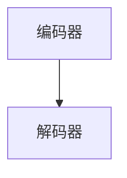
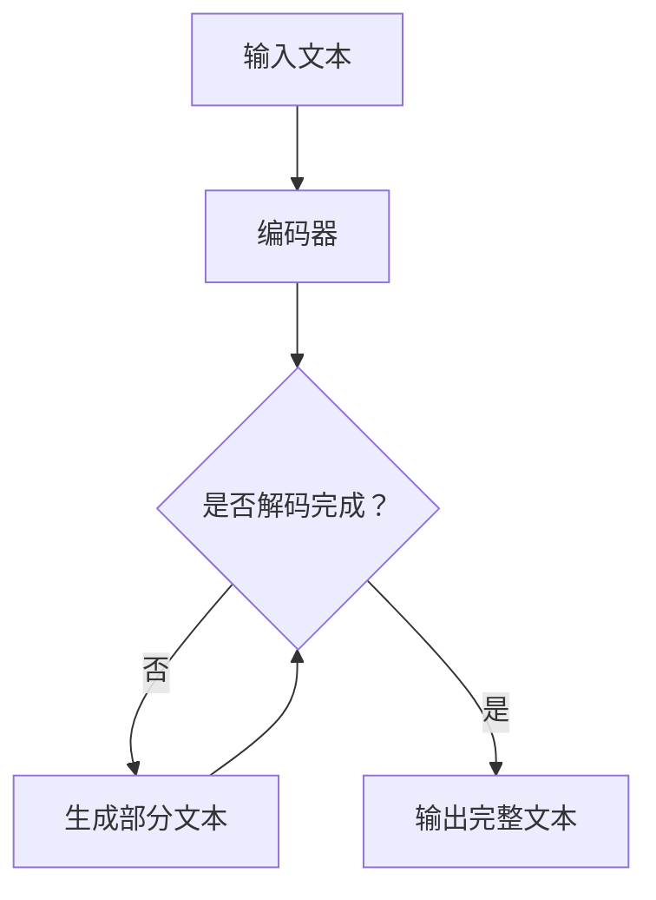

                 

# BART模型在LLM生成任务评估中的使用

关键词：BART模型、生成任务、评估、语言模型、人工智能

摘要：本文将深入探讨BART模型在语言生成任务评估中的应用。首先，我们将介绍BART模型的背景和基本原理，然后分析其在评估语言生成任务中的优势，并详细解释其工作原理和数学模型。接着，我们将探讨评估语言生成任务的常见指标，并通过实际案例展示如何使用BART模型进行评估。最后，我们将总结BART模型在LLM生成任务评估中的应用，并提供一些最佳实践和建议。

## 1. BART模型的背景与介绍

### 1.1.1 问题背景

近年来，随着深度学习技术的飞速发展，语言模型（Language Model，简称LM）在自然语言处理（Natural Language Processing，简称NLP）领域取得了显著进展。特别是在生成任务中，如机器翻译、文本摘要和对话系统等，语言模型的表现已经接近或甚至超越了人类水平。然而，如何评价这些语言模型生成任务的表现，成为一个亟待解决的问题。

### 1.1.2 问题描述

评估语言生成任务主要面临以下挑战：

1. **多样性（Diversity）**：评估模型是否能够生成多样化的输出，避免生成重复或单调的内容。
2. **流畅性（Fluency）**：评估生成的文本是否自然流畅，没有语法错误。
3. **准确性（Accuracy）**：评估生成的文本是否准确，与预期目标一致。
4. **一致性（Consistency）**：评估模型在不同输入或上下文中的表现是否一致。

### 1.1.3 解决方案概述

为了解决上述挑战，研究者们提出了各种评估指标和方法。其中，BART（Bidirectional and Auto-Regressive Transformers）模型因其独特的架构和强大的生成能力，成为评估语言生成任务的一种有效工具。

### 1.1.4 边界与外延

本文将主要探讨BART模型在评估语言生成任务中的应用，但不会详细讨论其他评估方法或语言模型的对比。此外，我们将重点关注BART模型在生成任务中的表现，而不会涉及其在其他NLP任务中的应用。

## 2. BART模型的核心概念与原理

### 2.1 BART模型的基本原理

BART模型是一种基于Transformers的预训练语言模型，它结合了双向（Bidirectional）和自回归（Auto-Regressive）特性。这种架构使得BART模型在理解上下文和生成连贯的文本方面具有显著优势。

### 2.2 BART模型的组件

BART模型主要由两个部分组成：编码器（Encoder）和解码器（Decoder）。

1. **编码器**：负责将输入文本编码为上下文向量，这些向量包含了输入文本的信息和上下文关系。
2. **解码器**：利用编码器生成的上下文向量，生成输出文本。

### 2.3 BART模型的优势

BART模型在评估语言生成任务中的优势主要体现在以下几个方面：

1. **强大的上下文理解能力**：BART模型的双向特性使其能够更好地理解输入文本的全局上下文，从而生成更准确、更连贯的文本。
2. **灵活的生成能力**：BART模型的自回归特性使其能够根据输入文本和上下文生成灵活的输出文本，避免了重复和单调。
3. **高效的计算性能**：基于Transformers的架构使得BART模型在计算效率上具有显著优势，适用于大规模语言生成任务。

## 3. BART模型的工作原理

### 3.1 BART模型架构

下图展示了BART模型的架构：



### 3.2 BART模型算法原理

BART模型的工作原理可以分为以下几个步骤：

1. **编码**：将输入文本通过编码器转化为上下文向量。
2. **解码**：利用上下文向量，通过解码器生成输出文本。

具体的算法流程如下：



数学模型方面，BART模型主要基于Transformers的自回归语言模型，其核心是自注意力机制（Self-Attention）和多头注意力（Multi-Head Attention）。以下是一个简化的数学模型：

$$
\text{Attention}(Q, K, V) = \frac{softmax(\text{score}) \cdot V}
$$

其中，Q、K、V分别为查询向量、键向量和值向量，score为它们之间的点积：

$$
\text{score} = Q \cdot K^T
$$

## 4. 评估语言生成任务的指标

评估语言生成任务的指标主要包括以下几种：

1. **BLEU（双语评价指数）**：用于比较生成文本与参考文本之间的相似度。
2. **ROUGE（Recall-Oriented Understudy for Gisting Evaluation）**：用于评估生成文本与参考文本的召回率。
3. **METEOR（Metric for Evaluation of Translation with Explicit ORdering）**：用于评估生成文本的多样性、准确性和流畅性。
4. **BERTScore**：基于BERT模型，用于评估生成文本的语义相似度。

这些指标各有优缺点，在实际应用中需要根据具体任务选择合适的指标。

## 5. 使用BART模型评估语言生成任务

### 5.1 环境安装

在开始使用BART模型之前，需要安装必要的依赖库。以下是一个简单的Python代码示例：

```python
!pip install transformers
!pip install torch
```

### 5.2 BART模型实现

以下是一个简单的BART模型实现示例：

```python
from transformers import BartForConditionalGeneration

model = BartForConditionalGeneration.from_pretrained("facebook/bart-large")

# 输入文本
input_text = "这是一个示例文本。"

# 生成文本
output_text = model.generate(input_text)

print(output_text)
```

### 5.3 评估

使用BART模型生成的文本，可以结合上述评估指标进行评估。以下是一个简单的BLEU评估示例：

```python
from nltk.translate.bleu_score import sentence_bleu

# 参考文本
reference_text = ["这是一个示例文本。"]

# 生成文本
generated_text = "这是一个示例文本。"

# 计算BLEU得分
bleu_score = sentence_bleu(reference_text, generated_text)

print("BLEU得分：", bleu_score)
```

## 6. BART模型在LLM生成任务评估中的总结与应用

### 6.1 总结

BART模型在评估语言生成任务中表现出色，其强大的上下文理解和灵活的生成能力使其成为一个有力的评估工具。通过结合多种评估指标，可以更全面地评估语言生成任务的表现。

### 6.2 应用

在实际应用中，BART模型可以用于：

1. **文本生成**：如机器翻译、文本摘要和对话系统等。
2. **文本评估**：用于评估其他语言模型的生成质量。
3. **辅助研究**：用于探索和优化语言生成任务的算法和模型。

## 7. 最佳实践与建议

### 7.1 最佳实践

1. **模型选择**：根据任务需求和数据规模选择合适的BART模型版本。
2. **数据预处理**：确保输入文本的质量和一致性，避免影响评估结果。
3. **指标选择**：结合任务特点选择合适的评估指标。

### 7.2 小结

BART模型在评估语言生成任务中具有显著优势，通过合理选择和应用，可以有效地评估语言模型的生成质量。

### 7.3 注意事项

1. **计算资源**：BART模型计算量大，需要充足的计算资源。
2. **数据隐私**：在处理和评估文本时，注意保护用户隐私。

### 7.4 拓展阅读

- [BART模型官方文档](https://huggingface.co/transformers/model_doc/bart.html)
- [自然语言处理评估指标介绍](https://www.aclweb.org/anthology/N16-1170/)

## 8. 作者信息

作者：AI天才研究院/AI Genius Institute & 禅与计算机程序设计艺术 /Zen And The Art of Computer Programming

