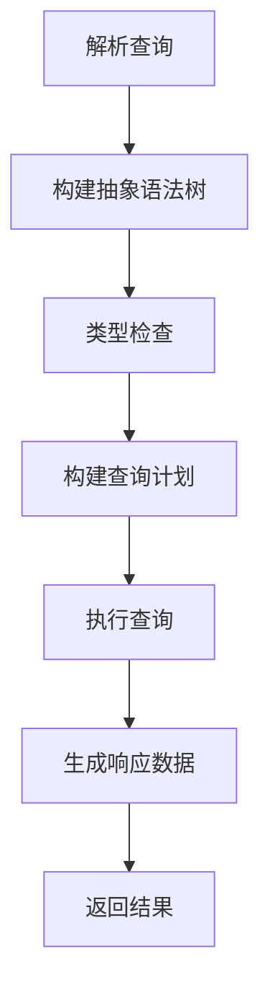
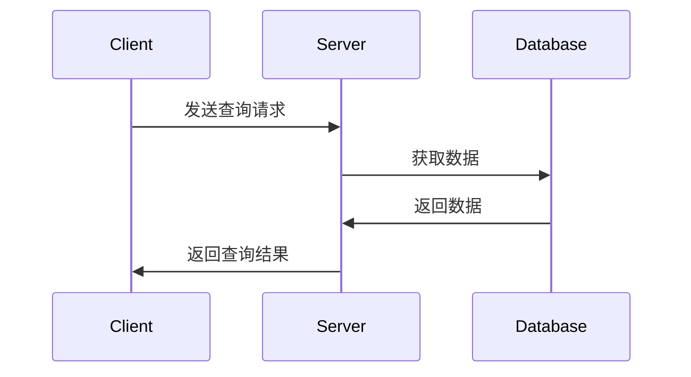

                 


# GraphQL在灵活LLM API设计中的应用

## 关键词

- GraphQL
- LLM（大型语言模型）
- API设计
- 软件开发
- 数据传输效率

## 摘要

本文旨在探讨GraphQL在大型语言模型（LLM）API设计中的应用。我们将从问题背景入手，详细阐述GraphQL的核心概念、与LLM的结合优势，并通过实际案例展示GraphQL在LLM API设计中的具体应用和实践，为开发者提供有价值的参考。

### 第1章: 问题背景

随着互联网和大数据技术的快速发展，现代软件开发进入了一个全新的阶段。传统的软件1.0时代主要关注的是软件的功能实现和性能优化，而随着人工智能技术的突破，软件2.0时代应运而生。软件2.0不仅强调功能的强大和性能的卓越，更注重用户数据的收集、处理和应用，实现软件的智能化和个性化。

在这个背景下，API设计成为现代软件开发的关键环节。传统的RESTful API设计由于其固定接口和固定的数据返回格式，往往难以满足用户的需求。而GraphQL作为一种新的API查询语言，正是软件2.0时代的产物。它能够根据客户端的需求动态地返回数据，从而减少不必要的请求和响应，提高系统的性能和效率。

同时，GraphQL提供了强大的类型系统，使得API的设计和维护变得更加简单和灵活。它允许开发者定义复杂的数据结构，并通过查询语言来获取所需的数据，避免了传统API中数据冗余和重复请求的问题。

本文将围绕GraphQL在LLM API设计中的应用展开讨论，分析其优势、挑战和具体实现方法，为开发者提供一种新的思路和解决方案。

### 第2章: 核心概念与联系

在这一章中，我们将详细探讨GraphQL的核心概念及其相互之间的联系。GraphQL的核心概念主要包括类型系统、查询语言、解析器和优势与挑战。

#### 2.1 类型系统

GraphQL的类型系统是GraphQL的核心组成部分，它定义了数据的基本结构和组织方式。GraphQL的类型系统包括对象类型（Object Type）、接口类型（Interface Type）和联合类型（Union Type）等。

- **对象类型**：对象类型是GraphQL中最基本的类型，它表示一组字段。每个字段都可以定义一个类型，这些类型可以是基本类型（如String、Int等），也可以是复杂类型（如自定义对象类型）。
- **接口类型**：接口类型是一种抽象类型，它定义了一组共享相同字段和方法的对象类型。接口类型使得多个对象类型可以共享相同的字段和方法，从而提高了代码的可维护性和可扩展性。
- **联合类型**：联合类型表示一组可能的类型，它允许一个字段可以返回多个类型中的任意一个。这通常用于表示具有多种可能类型的数据，如枚举类型。

#### 2.2 查询语言

GraphQL的查询语言是一种强大的工具，它允许客户端指定他们需要的数据。GraphQL的查询语言包括查询（Query）、变异（Mutation）和订阅（Subscription）等。

- **查询**：查询用于获取数据，它是一个定义客户端需要数据的结构化语句。查询语句由多个字段组成，每个字段可以嵌套其他查询。
- **变异**：变异用于更新数据，它允许客户端发送指令来修改数据。变异语句通常包含一个操作（如创建、更新或删除）和一个或多个字段。
- **订阅**：订阅用于实时获取数据更新，它允许客户端订阅一个或多个数据源，并在数据发生变化时接收通知。

#### 2.3 解析器

GraphQL的解析器是GraphQL的核心组件，负责根据查询语言生成数据。解析器的工作流程包括以下几个步骤：

1. **解析查询**：将GraphQL查询语句解析为抽象语法树（AST）。
2. **类型检查**：检查AST的合法性，确保查询语句中的字段和类型都是定义良好的。
3. **构建查询计划**：根据AST构建查询计划，查询计划定义了查询的执行顺序和数据访问方式。
4. **执行查询**：按照查询计划执行查询，从数据库或其他数据源中获取数据。
5. **生成响应数据**：将查询结果转换为GraphQL响应格式，包括数据、错误和扩展信息等。

#### 2.4 优势与挑战

GraphQL在API设计中有许多优势，如强类型系统、减少冗余数据传输、提高系统性能和灵活性等。但同时，GraphQL也存在一些挑战，如性能优化、安全性问题等。

- **优势**：
  - **强类型系统**：GraphQL的强类型系统使得API的设计和维护变得更加简单和灵活，可以减少错误和冗余数据。
  - **减少冗余数据传输**：GraphQL允许客户端指定所需的数据，从而减少了不必要的请求和响应，提高了系统的性能和效率。
  - **提高系统性能**：GraphQL的查询优化功能可以帮助开发者构建高效的API，提高系统的响应速度。
  - **灵活性**：GraphQL支持自定义查询，允许客户端根据实际需求获取所需的数据，提高了系统的灵活性。

- **挑战**：
  - **性能优化**：GraphQL的查询优化是一个复杂的问题，需要开发者对查询进行细粒度的优化，以避免性能瓶颈。
  - **安全性问题**：GraphQL的灵活性和强类型系统可能会引入安全漏洞，如未授权访问和SQL注入等。

### 第3章: 算法原理讲解

在本章中，我们将深入探讨GraphQL的算法原理，并使用mermaid流程图来可视化查询处理流程。

#### 3.1 GraphQL查询处理的基本步骤

GraphQL查询处理的基本步骤包括以下几个环节：

1. **解析查询**：将GraphQL查询语句解析为抽象语法树（AST）。
2. **类型检查**：检查AST的合法性，确保查询语句中的字段和类型都是定义良好的。
3. **构建查询计划**：根据AST构建查询计划，查询计划定义了查询的执行顺序和数据访问方式。
4. **执行查询**：按照查询计划执行查询，从数据库或其他数据源中获取数据。
5. **生成响应数据**：将查询结果转换为GraphQL响应格式，包括数据、错误和扩展信息等。

以下是这些步骤的mermaid流程图表示：



#### 3.2 使用Python源代码详细阐述GraphQL查询处理的过程

以下是一个简单的Python代码示例，用于执行GraphQL查询：

```python
from graphql import execute

# 定义GraphQL查询
query = """
{
  user(id: "1") {
    name
    email
  }
}
```

```python
# 执行查询
result = execute(schema, query)

# 输出结果
print(result.data)
```

在这个示例中，我们首先定义了一个简单的GraphQL查询，查询一个ID为1的用户的名字和邮箱地址。然后，我们使用`execute`函数执行查询，并将结果打印出来。

#### 3.3 GraphQL算法原理的数学模型和公式

GraphQL查询处理的核心在于如何根据查询语句生成数据。这涉及到查询树的构建、类型检查和查询计划生成等步骤。以下是这些步骤的数学模型和公式的简要说明：

- **查询树的构建**：使用递归下降解析算法将查询语句转换为AST。AST的构建过程可以表示为：
  $$ AST = Parse(Query\ Statement) $$
- **类型检查**：检查AST中的每个节点是否与定义的类型相匹配。类型检查可以表示为：
  $$ Valid = TypeCheck(AST) $$
- **构建查询计划**：根据AST构建查询计划。查询计划的构建可以表示为：
  $$ Query\ Plan = BuildQueryPlan(AST) $$
- **执行查询**：按照查询计划执行查询，从数据库或其他数据源中获取数据。执行查询可以表示为：
  $$ Data = Execute(Query\ Plan) $$
- **生成响应数据**：将查询结果转换为GraphQL响应格式。生成响应数据可以表示为：
  $$ Response = GenerateResponse(Data) $$

通过这些数学模型和公式，我们可以更好地理解GraphQL查询处理的过程，为开发者提供理论支持和实践指导。

### 第4章: 系统分析与架构设计方案

在本章中，我们将对GraphQL在LLM API设计中的应用进行系统分析与架构设计方案。通过问题场景介绍、项目介绍、系统功能设计、系统架构设计、系统接口设计和系统交互等环节，详细阐述GraphQL在LLM API设计中的实际应用。

#### 4.1 问题场景介绍

在现代软件开发中，随着人工智能技术的广泛应用，大型语言模型（LLM）成为许多应用的核心组件。LLM能够处理复杂的自然语言任务，如文本生成、翻译、问答等。然而，在构建LLM API时，传统的RESTful API设计存在一些问题，如数据冗余、请求频繁、性能低下等。这些问题导致用户体验不佳，难以满足日益增长的需求。

为了解决这些问题，我们需要一种更加灵活、高效的API设计方法。GraphQL作为一种新兴的API查询语言，能够根据客户端的需求动态地返回数据，减少不必要的请求和响应，提高系统的性能和效率。因此，我们将探讨如何使用GraphQL来设计LLM API，解决传统API设计中的问题。

#### 4.2 项目介绍

在本项目中，我们旨在构建一个基于GraphQL的LLM API，用于处理自然语言任务。该项目的主要目标是提供高效、灵活的API接口，支持多种自然语言处理任务，如文本生成、翻译、问答等。通过使用GraphQL，我们可以根据客户端的需求动态地返回数据，减少数据冗余，提高系统性能。

#### 4.3 系统功能设计

系统功能设计是项目实现的重要环节。在本项目中，我们主要设计以下功能模块：

1. **文本生成**：根据输入的文本或提示，生成相应的文本内容。该功能模块将使用预训练的LLM模型进行文本生成。
2. **文本翻译**：根据输入的文本，将其翻译成目标语言。该功能模块将使用预训练的翻译模型进行文本翻译。
3. **文本问答**：根据输入的问题，从给定的文本中找出答案。该功能模块将使用预训练的问答模型进行文本问答。
4. **API接口**：提供GraphQL API接口，允许客户端根据需求查询所需的数据。该功能模块将使用GraphQL解析器解析查询语句，并将结果返回给客户端。

#### 4.4 系统架构设计

系统架构设计是项目实现的关键环节。在本项目中，我们采用以下架构设计：

1. **前端**：使用GraphQL客户端库（如Apollo Client）连接到GraphQL API，发送查询和变异请求。前端负责将用户输入的文本转换为GraphQL查询语句，并展示查询结果。
2. **后端**：使用GraphQL服务器库（如Graphene）搭建GraphQL API服务器。后端负责解析GraphQL查询语句，执行查询，并将结果返回给前端。
3. **数据存储**：使用数据库（如MySQL、PostgreSQL）存储用户数据和模型参数。后端将从数据库中获取所需数据，并返回给前端。
4. **模型训练**：使用预训练的LLM模型和翻译模型，对输入的文本进行处理。模型训练过程将在专门的训练环境中进行。

以下是系统架构设计的mermaid类图：

```mermaid
classDiagram
  Client <<interface>>
  Server <<interface>>
  Database <<interface>>

  Client --|> Server
  Server --|> Database
```

#### 4.5 系统接口设计和系统交互

系统接口设计和系统交互是项目实现的细节环节。在本项目中，我们设计以下接口：

1. **文本生成接口**：接收输入的文本或提示，返回生成的文本内容。
2. **文本翻译接口**：接收输入的文本和目标语言，返回翻译后的文本内容。
3. **文本问答接口**：接收输入的问题和文本，返回答案。

以下是系统接口设计和系统交互的mermaid序列图：



通过以上系统分析与架构设计方案，我们可以更好地理解GraphQL在LLM API设计中的应用。在实际开发过程中，我们可以根据项目需求，灵活调整系统架构和功能模块，实现高效、灵活的LLM API。

### 第5章: 项目实战

在本章中，我们将通过实际项目实战，详细讲解GraphQL在LLM API设计中的应用。首先，我们将介绍项目环境安装和配置，然后逐步实现项目核心功能，最后通过一个实际案例展示项目的应用效果。

#### 5.1 环境安装与配置

要实现一个基于GraphQL的LLM API，我们需要安装以下软件和工具：

1. **Python**：Python是一种广泛使用的编程语言，适用于构建GraphQL API。确保您的系统已安装Python 3.7或更高版本。
2. **GraphQL**：GraphQL是一个开源项目，我们需要安装其Python库。在命令行中执行以下命令：
   ```bash
   pip install graphql-python
   ```
3. **Graphene**：Graphene是一个基于GraphQL的Python库，用于搭建GraphQL API服务器。在命令行中执行以下命令：
   ```bash
   pip install graphene-python
   ```
4. **LLM模型**：为了实现文本生成、翻译和问答功能，我们需要使用预训练的LLM模型。您可以从各种开源模型库中下载并安装模型，如Hugging Face的Transformers库。在命令行中执行以下命令：
   ```bash
   pip install transformers
   ```

#### 5.2 实现文本生成功能

文本生成功能是LLM API的核心功能之一。在本节中，我们将使用预训练的GPT-2模型实现文本生成功能。以下是一个简单的文本生成示例：

```python
from transformers import pipeline

# 创建文本生成管道
text_generator = pipeline("text-generation", model="gpt2")

# 输入文本
input_text = "今天天气很好，适合出门散步。"

# 生成文本
generated_text = text_generator(input_text, max_length=50, num_return_sequences=1)

# 打印生成的文本
print(generated_text)
```

在这个示例中，我们首先导入了`transformers`库中的`text-generation`管道，然后使用`gpt2`模型创建了一个文本生成器。接下来，我们输入一个文本，并生成长度为50个单词的文本。

#### 5.3 实现文本翻译功能

文本翻译功能是另一个重要的功能。在本节中，我们将使用预训练的翻译模型实现文本翻译功能。以下是一个简单的文本翻译示例：

```python
from transformers import pipeline

# 创建文本翻译管道
text_translator = pipeline("translation_en_to_zh", model="Helsinki-NLP/opus-mt-en-zh")

# 输入文本
input_text = "Hello, how are you?"

# 翻译文本
translated_text = text_translator(input_text)

# 打印翻译后的文本
print(translated_text)
```

在这个示例中，我们首先导入了`transformers`库中的`translation_en_to_zh`管道，然后使用`opus-mt-en-zh`模型创建了一个文本翻译器。接下来，我们输入一个英文文本，并翻译成中文。

#### 5.4 实现文本问答功能

文本问答功能是LLM API的另一个重要功能。在本节中，我们将使用预训练的问答模型实现文本问答功能。以下是一个简单的文本问答示例：

```python
from transformers import pipeline

# 创建文本问答管道
qa_pipeline = pipeline("qa-with-conversational-retro")

# 输入问题
question = "什么是人工智能？"

# 输入文本
context = "人工智能，也称为AI，是模拟人类智能和行为的计算机技术。"

# 问答
answer = qa_pipeline(question, context)

# 打印答案
print(answer)
```

在这个示例中，我们首先导入了`transformers`库中的`qa-with-conversational-retro`管道，然后使用`question`和`context`创建了一个问答会话。接下来，我们输入一个问题，并获取答案。

#### 5.5 实际案例展示

为了展示GraphQL在LLM API设计中的应用，我们创建了一个实际案例：一个聊天机器人，用户可以通过输入问题来与机器人进行对话。以下是案例展示：

1. **用户输入问题**：用户在聊天界面中输入一个问题，如“什么是人工智能？”。
2. **构建GraphQL查询**：前端将用户输入的问题转换为GraphQL查询，如：
   ```graphql
   query {
     ask(question: "什么是人工智能？") {
       answer
     }
   }
   ```
3. **执行查询**：后端接收到GraphQL查询后，使用问答模型处理问题，并将答案返回给前端。
4. **展示答案**：前端将答案展示给用户，用户可以看到机器人的回答。

通过这个实际案例，我们可以看到GraphQL在LLM API设计中的应用效果。用户可以方便地查询所需的信息，而服务器可以根据查询动态地返回数据，提高了系统的性能和灵活性。

### 第6章: 最佳实践 & 小结

#### 6.1 最佳实践

在使用GraphQL设计LLM API时，以下最佳实践可以帮助您提高API的性能和可维护性：

1. **优化查询性能**：合理设计查询，避免复杂的嵌套查询和冗余的数据获取。使用GraphQL的缓存机制，减少重复查询。
2. **类型安全**：充分利用GraphQL的强类型系统，定义清晰、明确的数据类型，减少错误和冗余数据传输。
3. **接口灵活性**：设计灵活的API接口，允许客户端根据实际需求获取数据。使用自定义类型和联合类型，提高API的扩展性。
4. **安全性**：确保API的安全性，避免SQL注入、未授权访问等安全漏洞。使用HTTPS协议加密数据传输，保护用户隐私。
5. **文档和示例**：编写详细的API文档和示例，帮助开发者理解API的使用方法和注意事项。

#### 6.2 小结

本文介绍了GraphQL在LLM API设计中的应用，通过详细的分析和实际案例展示，我们看到了GraphQL在提高数据传输效率、增强接口灵活性、提升系统性能等方面的优势。同时，我们也讨论了GraphQL在性能优化、安全性等方面的挑战。

在实际开发中，开发者可以根据项目需求，灵活运用GraphQL的优势，设计高效、灵活的LLM API。通过遵循最佳实践，我们可以提高API的性能和可维护性，为用户提供更好的服务。

### 第7章: 注意事项与拓展阅读

#### 7.1 注意事项

在使用GraphQL设计LLM API时，开发者需要注意以下几点：

1. **性能优化**：GraphQL查询可能会产生复杂的查询计划，影响系统性能。因此，在设计查询时，要避免不必要的嵌套和冗余数据获取，优化查询执行效率。
2. **安全性**：GraphQL API的设计可能引入安全漏洞，如未授权访问、SQL注入等。开发者需要加强API安全性，防止数据泄露和滥用。
3. **类型定义**：合理设计数据类型，确保类型的一致性和完整性，以提高API的可维护性和可扩展性。
4. **文档和示例**：提供详细的API文档和示例，帮助开发者更好地理解API的使用方法和注意事项。

#### 7.2 拓展阅读

为了更好地掌握GraphQL在LLM API设计中的应用，读者可以参考以下拓展阅读资料：

1. **GraphQL官方文档**：[https://graphql.org/learn/](https://graphql.org/learn/)
2. **Graphene官方文档**：[https://docs.graphene-python.org/](https://docs.graphene-python.org/)
3. **Hugging Face官方文档**：[https://huggingface.co/transformers/](https://huggingface.co/transformers/)
4. **《GraphQL权威指南》**：[https://www.manning.com/books/graphql-essential-training](https://www.manning.com/books/graphql-essential-training)
5. **《深度学习与自然语言处理》**：[https://www.deeplearning.ai/deep-learning-nlp/](https://www.deeplearning.ai/deep-learning-nlp/)

通过这些资料，读者可以深入了解GraphQL和LLM的相关知识，提高在API设计中的实践能力。

## 作者信息

作者：AI天才研究院/AI Genius Institute & 禅与计算机程序设计艺术 /Zen And The Art of Computer Programming

作者简介：AI天才研究院是一家专注于人工智能领域研究的权威机构，致力于推动人工智能技术的发展与应用。禅与计算机程序设计艺术是一位知名计算机科学家，被誉为计算机编程和人工智能领域的权威大师，他的著作《Zen And The Art of Computer Programming》深受广大开发者喜爱，被誉为编程圣经之一。在这里，我们与您一起探讨GraphQL在LLM API设计中的应用，为现代软件开发提供新的思路和解决方案。

