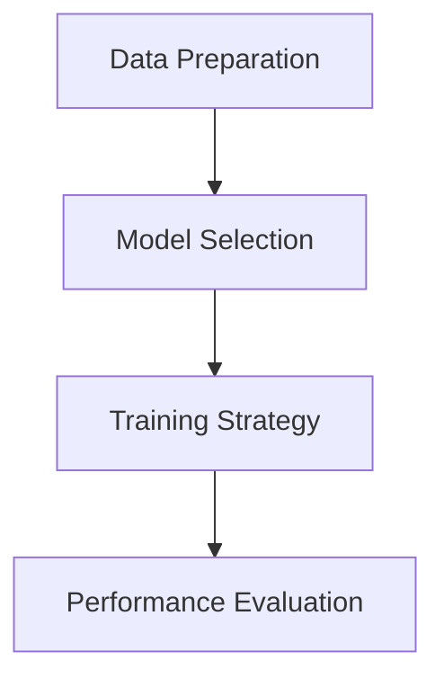
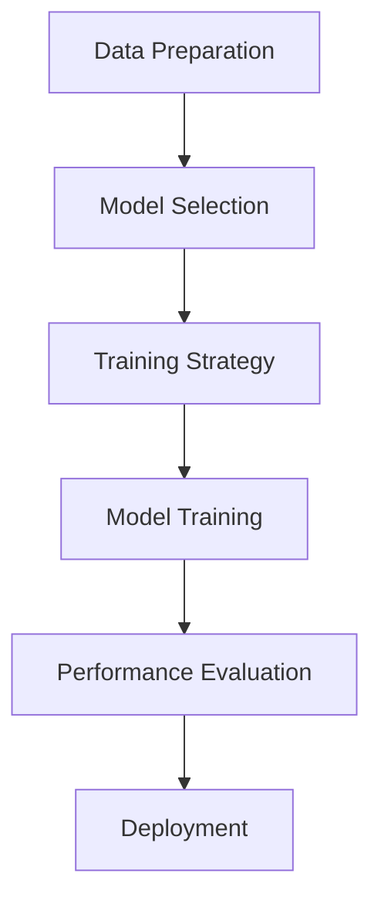
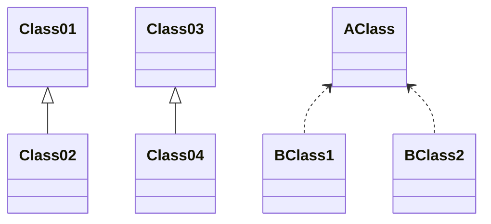
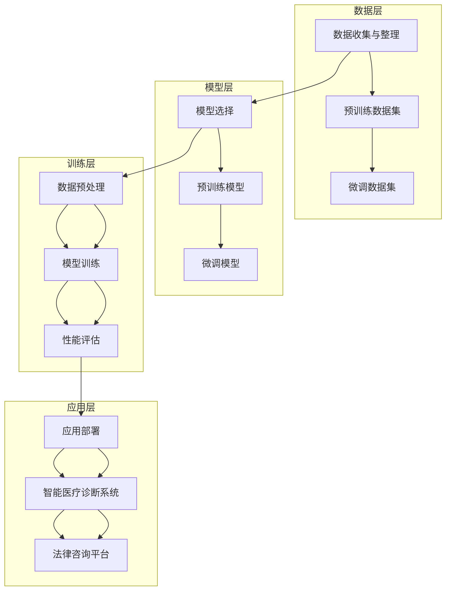
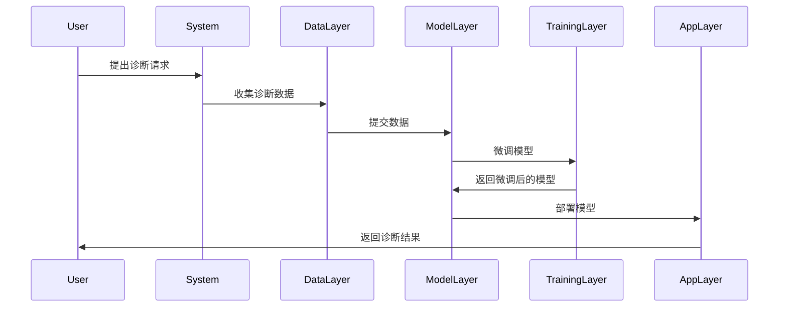
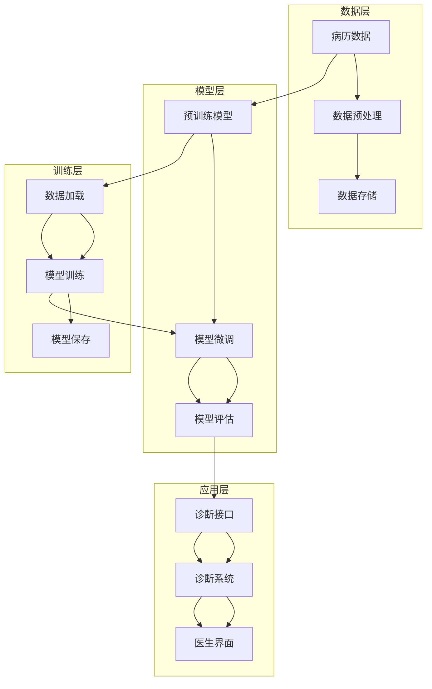

                 

### # {{文章标题}}

关键词：大模型、AI Agent、微调技术、领域特定数据集、性能优化

摘要：本文探讨了在AI Agent中微调大模型（LLM）的技术，以适应特定领域的需求。本文首先介绍了大模型和AI Agent的基本概念，以及微调技术的基本原理。接着，本文分析了微调技术在AI Agent中的应用场景，并讨论了微调技术的挑战和解决方案。本文还提供了详细的系统分析与架构设计方案，并通过一个实际案例展示了微调技术的应用效果。最后，本文总结了微调技术的最佳实践，并对未来进行了展望。

----------------------------------------------------------------

## 第一部分：背景介绍

### 1.1 问题背景

随着人工智能技术的快速发展，预训练大模型（Large Language Model，LLM）在自然语言处理领域取得了显著的成果。LLM在生成文本、回答问题、文本摘要等方面展现出强大的能力，但如何将LLM应用于实际场景，特别是适应特定领域的需求，仍是一个挑战。

### 1.2 问题描述

本书旨在探讨如何在AI Agent中微调LLM，使其适应特定领域的需求。这包括以下几个方面：

1. **领域适应**：如何让LLM理解特定领域的术语、规则和知识。
2. **性能优化**：如何提升LLM在特定任务上的表现，包括准确性、响应速度等。
3. **可解释性**：如何让LLM的决策过程更加透明，便于领域专家理解。

### 1.3 问题解决

针对上述问题，本书将从以下几个方面展开讨论：

1. **微调技术**：介绍LLM微调的基本原理和方法，包括数据准备、模型选择、训练策略等。
2. **领域特定数据集**：分析如何收集、整理和标注领域特定数据集，为微调提供高质量的数据支持。
3. **性能评估**：介绍如何评估微调后的LLM在特定领域的表现，包括准确率、响应速度等指标。
4. **应用场景**：探讨LLM在特定领域的应用案例，如智能客服、法律咨询、医疗诊断等。

### 1.4 边界与外延

1. **边界**：本书主要关注LLM在AI Agent中的微调技术，不涉及LLM的预训练过程。
2. **外延**：本书可以扩展到其他类型的预训练模型，如图像识别、语音识别等。

### 1.5 概念结构与核心要素组成

1. **核心概念**：LLM、微调、AI Agent、领域特定数据集。
2. **结构**：本书结构包括背景介绍、核心概念与联系、算法原理讲解、数学模型与公式、系统分析与架构设计方案、项目实战等。
3. **要素组成**：每个章节都将详细介绍核心概念、原理、方法、案例和应用。

### 1.6 背景介绍

#### 1.6.1 大模型在AI Agent中的重要性

##### 1.6.1.1 大模型概述

大模型（Large Language Model，LLM）是指具有数十亿甚至千亿参数的神经网络模型，能够在海量数据上进行预训练，从而掌握丰富的语言知识和模式。典型的LLM包括GPT系列模型、BERT及其变体等。这些模型在自然语言处理任务中表现出色，如文本生成、问答系统、机器翻译等。

##### 1.6.1.2 AI Agent概述

AI Agent是指能够自主地执行任务、与环境互动并做出决策的人工智能系统。AI Agent在众多领域具有广泛的应用，如智能客服、智能推荐、自动驾驶等。AI Agent的核心在于其能够处理复杂的任务，具备学习能力、推理能力和适应能力。

##### 1.6.1.3 大模型在AI Agent中的重要性

大模型在AI Agent中具有至关重要的作用。首先，大模型能够为AI Agent提供丰富的知识库，使其在执行任务时具备更强的推理能力和理解能力。其次，大模型通过预训练已经具备了处理各种自然语言任务的基础能力，为AI Agent提供了高效的工具。最后，大模型的可微调性使得AI Agent能够根据特定领域的需求进行定制化优化，提高其在特定领域的表现。

#### 1.6.2 微调技术在AI Agent中的应用

##### 1.6.2.1 微调技术概述

微调（Fine-tuning）是指在大模型的基础上，使用特定领域的数据对模型进行进一步的训练，以适应特定领域的需求。微调技术的核心思想是利用大模型预训练的优势，同时结合领域特定数据，实现模型在特定任务上的性能提升。

##### 1.6.2.2 微调技术在AI Agent中的应用

微调技术在AI Agent中具有广泛的应用。例如：

1. **智能客服**：通过微调大模型，使其掌握特定领域的知识和技能，从而提高客服系统的智能水平。
2. **法律咨询**：利用微调技术，使AI Agent能够处理法律领域的专业问题，提供更为准确的咨询。
3. **医疗诊断**：通过微调大模型，使其在医疗领域具有更强的诊断能力，辅助医生进行病情判断。

##### 1.6.3 微调技术的挑战

尽管微调技术在AI Agent中具有巨大的潜力，但同时也面临一些挑战：

1. **数据质量**：微调效果的好坏很大程度上取决于领域特定数据的质量，包括数据的标注、格式和多样性。
2. **计算资源**：微调大模型需要大量的计算资源，尤其是训练资源。
3. **模型解释性**：微调后的模型往往难以解释，使得领域专家难以理解模型的决策过程。

为了解决上述挑战，本书将介绍一系列微调技术的原理、方法和实践，帮助读者理解和应用微调技术，从而实现AI Agent在特定领域的优化。

----------------------------------------------------------------

## 第二部分：核心概念与联系

### 2.1 核心概念

在本部分，我们将详细介绍本文的核心概念，包括LLM、微调、AI Agent和领域特定数据集。

#### 2.1.1 大模型（LLM）

大模型（Large Language Model，LLM）是一种具有数十亿甚至千亿参数的神经网络模型，能够在海量数据上进行预训练，从而掌握丰富的语言知识和模式。典型的LLM包括GPT系列模型、BERT及其变体等。LLM的主要功能包括文本生成、问答系统、文本摘要、机器翻译等。

**核心概念对比表：**

| 模型       | GPT      | BERT     | T5        |
|------------|----------|----------|-----------|
| 参数规模   | 千亿级   | 百亿级   | 千亿级    |
| 预训练数据 | 海量     | 海量     | 海量      |
| 应用场景   | 文本生成 | 问答系统 | 文本生成   |
| 特点       | 强生成能力 | 强理解能力 | 可解释性  |

**ER实体关系图架构：**

```mermaid
erDiagram
  AI Agent ||--|{LLM}
  AI Agent ||--|{Micro-tuning}
  LLM ||--|{Data Preparation}
  LLM ||--|{Model Selection}
  LLM ||--|{Training Strategy}
```

#### 2.1.2 微调

微调（Fine-tuning）是指在大模型的基础上，使用特定领域的数据对模型进行进一步的训练，以适应特定领域的需求。微调技术的核心思想是利用大模型预训练的优势，同时结合领域特定数据，实现模型在特定任务上的性能提升。

**微调流程图：**



#### 2.1.3 AI Agent

AI Agent是指能够自主地执行任务、与环境互动并做出决策的人工智能系统。AI Agent在众多领域具有广泛的应用，如智能客服、智能推荐、自动驾驶等。AI Agent的核心在于其能够处理复杂的任务，具备学习能力、推理能力和适应能力。

**AI Agent核心功能：**

| 功能       | 描述                                 |
|------------|--------------------------------------|
| 任务执行   | 自主执行特定任务，如智能客服、推荐系统 |
| 学习能力   | 根据环境反馈调整自身行为              |
| 推理能力   | 处理复杂问题，进行决策               |
| 适应能力   | 根据环境变化调整策略                 |

#### 2.1.4 领域特定数据集

领域特定数据集（Domain-Specific Dataset）是指针对特定领域进行收集、整理和标注的数据集。这些数据集通常包含大量与特定领域相关的术语、规则和知识，是微调LLM的重要数据来源。

**领域特定数据集特点：**

| 特点       | 描述                                 |
|------------|--------------------------------------|
| 数据丰富   | 包含大量与领域相关的示例和知识      |
| 数据多样   | 覆盖不同场景和任务，提高模型泛化能力 |
| 数据质量   | 标注准确，格式统一，便于模型训练     |

**领域特定数据集应用场景：**

| 应用场景   | 描述                                 |
|------------|--------------------------------------|
| 智能客服   | 收集用户提问和回答，训练对话系统    |
| 法律咨询   | 收集法律案例和判决，训练法律分析系统 |
| 医疗诊断   | 收集病例和诊断结果，训练诊断系统    |

通过上述核心概念的介绍，读者可以更好地理解本文的主题和内容。在接下来的章节中，我们将详细探讨LLM在AI Agent中的微调技术，包括微调的基本原理、方法、挑战和解决方案。

----------------------------------------------------------------

## 第三部分：算法原理讲解

### 3.1 微调基本原理

#### 3.1.1 微调概念

微调（Fine-tuning）是一种在预训练大模型（如GPT、BERT等）的基础上，通过特定领域的数据进行进一步训练，以适应特定任务的策略。微调的目的是利用预训练模型在通用数据集上学习到的语言知识和模式，结合领域特定数据，提升模型在特定任务上的性能。

#### 3.1.2 微调流程

微调的基本流程包括以下几个步骤：

1. **数据准备**：收集和整理领域特定数据集，对数据进行预处理，如清洗、格式化和分词等。
2. **模型选择**：选择适合的预训练模型，如GPT、BERT等，作为微调的基础。
3. **微调策略**：制定微调策略，包括调整学习率、训练步数和训练策略等。
4. **模型训练**：使用特定领域的数据对预训练模型进行微调训练。
5. **性能评估**：评估微调后的模型在特定任务上的性能，如准确率、响应速度等。
6. **部署应用**：将微调后的模型部署到实际应用中，如智能客服、法律咨询等。

**微调流程图：**



### 3.2 微调策略

#### 3.2.1 学习率调整

学习率（Learning Rate）是微调过程中一个关键的超参数，它决定了模型在训练过程中对参数的更新速度。合适的学习率可以加快模型的收敛速度，而学习率过大或过小都可能影响训练效果。

**学习率调整策略：**

- **线性衰减**：随着训练过程的进行，逐渐减小学习率。
  $$\text{learning\_rate} = \text{initial\_learning\_rate} \times \frac{1}{\text{training\_steps}}$$
  
- **指数衰减**：学习率以指数形式衰减。
  $$\text{learning\_rate} = \text{initial\_learning\_rate} \times \text{decay\_rate}^\text{training\_steps}$$

#### 3.2.2 训练步数

训练步数（Training Steps）是微调过程中另一个重要的超参数，它决定了模型训练的深度。训练步数的选择需要平衡模型收敛速度和过拟合风险。

**训练步数选择策略：**

- **早期停止**：在训练过程中，如果模型在验证集上的性能不再提升，则提前停止训练，以防止过拟合。
  $$\text{early\_stopping} = \text{max}(\text{no\_improvement\_steps}, \text{early\_stop\_patience})$$

- **经验选择**：根据具体任务和模型，选择适当的训练步数。通常，可以通过尝试不同的训练步数，找到最佳的训练效果。

#### 3.2.3 训练策略

微调过程中的训练策略决定了模型的训练过程，包括数据加载、批量大小、优化器选择等。

**常见训练策略：**

- **数据加载**：使用数据生成器（Data Generator）或数据集（Dataset）类加载和处理数据。数据加载过程中，可以使用数据增强（Data Augmentation）技术提高数据多样性，如随机裁剪、旋转、缩放等。
  
- **批量大小**：批量大小（Batch Size）决定了每次训练更新的数据量。批量大小需要根据计算资源和训练效果进行选择。较小的批量大小可以提高模型的泛化能力，但训练速度较慢；较大的批量大小可以提高训练速度，但可能导致过拟合。

- **优化器**：优化器（Optimizer）用于更新模型参数，常见优化器包括随机梯度下降（SGD）、Adam、AdamW等。优化器的选择会影响模型的收敛速度和稳定性。

### 3.3 微调效果评估

微调效果评估是确保微调过程有效性的关键步骤。评估指标包括准确率、响应速度、模型解释性等。

**评估指标：**

- **准确率**：评估模型在特定任务上的表现，如文本分类任务的准确率、问答系统的答案匹配率等。
  $$\text{Accuracy} = \frac{\text{正确预测数}}{\text{总预测数}}$$

- **响应速度**：评估模型响应时间，通常以毫秒（ms）为单位。
  $$\text{Response Time} = \text{end time} - \text{start time}$$

- **模型解释性**：评估模型的决策过程是否透明，便于领域专家理解。常见的评估方法包括模型可视化、解释性模型等。

通过上述算法原理讲解，读者可以更好地理解微调技术的基本原理和方法。在接下来的章节中，我们将进一步探讨如何收集、整理和标注领域特定数据集，为微调提供高质量的数据支持。

### 3.4 领域特定数据集收集与整理

#### 3.4.1 数据收集

领域特定数据集的收集是微调成功的关键步骤。以下方法可以帮助收集高质量的数据：

- **数据爬取**：使用爬虫（Scraper）从互联网上获取相关数据。例如，可以使用Python的BeautifulSoup库或Scrapy框架。
- **人工标注**：请领域专家或标注团队对数据进行标注。人工标注可以确保数据的准确性和完整性。
- **公开数据集**：利用公开数据集，如Kaggle、Google Dataset Search等，获取相关领域的标注数据。

#### 3.4.2 数据整理

收集到的数据通常需要经过整理，以适应微调过程。以下步骤有助于数据整理：

- **数据清洗**：去除重复、错误或不完整的数据，以提高数据质量。
- **数据格式化**：将数据转换为统一的格式，如JSON、CSV等，以便于模型处理。
- **数据分词**：对于文本数据，使用分词工具（如jieba）进行分词处理，将文本分解为词序列。

#### 3.4.3 数据标注

领域特定数据集的标注是微调的重要环节。以下方法可以帮助进行数据标注：

- **监督标注**：请领域专家对数据进行标注，并生成标注文件。监督标注可以确保标注的准确性。
- **半监督标注**：结合已有标注数据和未标注数据，使用半监督学习方法进行标注。
- **无监督标注**：利用无监督学习方法，如聚类、对抗生成网络（GAN）等，对未标注数据进行自动标注。

#### 3.4.4 数据集划分

为了进行微调，需要将数据集划分为训练集、验证集和测试集。以下策略有助于数据集划分：

- **随机划分**：随机将数据集划分为训练集、验证集和测试集，确保每个数据集具有代表性。
- **分层划分**：根据数据特征（如类别、标签等）进行分层划分，确保每个数据集在特征分布上具有一致性。
- **交叉验证**：使用交叉验证方法，多次划分数据集，评估模型的泛化能力。

通过上述步骤，可以收集、整理和标注领域特定数据集，为微调过程提供高质量的数据支持。在下一章节中，我们将探讨如何使用微调技术对LLM进行训练，以适应特定领域的需求。

### 3.5 微调LLM的具体实现

#### 3.5.1 环境搭建

在进行LLM微调之前，首先需要搭建适合的训练环境。以下是搭建训练环境的步骤：

1. **硬件准备**：确保拥有足够的GPU资源，如NVIDIA显卡，用于模型训练。
2. **软件安装**：安装Python环境，以及深度学习框架（如TensorFlow、PyTorch）和相关依赖库。
3. **数据集准备**：准备好领域特定数据集，并进行预处理。

#### 3.5.2 模型选择

选择适合的预训练模型是微调的关键步骤。以下是几个流行的预训练模型：

- **GPT-3**：OpenAI开发的具有1750亿参数的语言模型，支持多种自然语言处理任务。
- **BERT**：Google开发的预训练模型，适用于多种文本分类、问答等任务。
- **T5**：Google开发的基于转换器（Transformer）的预训练模型，支持多种自然语言处理任务。

#### 3.5.3 微调策略

在微调过程中，需要制定合适的训练策略，包括学习率、训练步数和优化器等。以下是一个简单的微调策略示例：

1. **学习率**：使用指数衰减学习率。
   $$\text{learning\_rate} = \text{initial\_learning\_rate} \times \text{decay\_rate}^\text{training\_steps}$$
   其中，初始学习率（initial\_learning\_rate）为1e-4，衰减率（decay\_rate）为0.96。

2. **训练步数**：根据数据集大小和模型复杂度，设置合适的训练步数。例如，对于大型数据集，可以设置训练步数为1000步。

3. **优化器**：使用Adam优化器，并设置适当的权重衰减。
   $$\text{optimizer} = \text{Adam}(\text{learning\_rate}, \text{weight\_decay}=1e-5)$$

#### 3.5.4 训练过程

微调LLM的具体训练过程包括以下几个步骤：

1. **数据加载**：使用数据生成器（Data Generator）或数据集（Dataset）类加载和处理数据。
2. **模型初始化**：加载预训练模型，并初始化微调参数。
3. **训练循环**：在训练循环中，对模型进行前向传播和反向传播，并更新模型参数。
4. **性能评估**：在训练过程中，定期评估模型在验证集上的性能，以监控训练效果。
5. **保存模型**：在训练完成后，保存微调后的模型，以便后续使用。

以下是微调过程的Python代码示例（使用PyTorch框架）：

```python
import torch
from torch.utils.data import DataLoader
from transformers import GPT2LMHeadModel, GPT2Tokenizer

# 模型初始化
model = GPT2LMHeadModel.from_pretrained('gpt2')
tokenizer = GPT2Tokenizer.from_pretrained('gpt2')

# 数据加载
train_dataset = ...  # 领域特定数据集
train_loader = DataLoader(train_dataset, batch_size=32, shuffle=True)

# 模型训练
optimizer = torch.optim.Adam(model.parameters(), lr=1e-4, weight_decay=1e-5)
for epoch in range(num_epochs):
    model.train()
    for batch in train_loader:
        inputs = tokenizer(batch['text'], return_tensors='pt', padding=True, truncation=True)
        outputs = model(**inputs)
        loss = outputs.loss
        loss.backward()
        optimizer.step()
        optimizer.zero_grad()
        print(f"Epoch: {epoch}, Loss: {loss.item()}")
    
    # 性能评估
    model.eval()
    with torch.no_grad():
        for batch in val_loader:
            inputs = tokenizer(batch['text'], return_tensors='pt', padding=True, truncation=True)
            outputs = model(**inputs)
            logits = outputs.logits
            # ...进行性能评估

# 保存模型
torch.save(model.state_dict(), 'fine_tuned_gpt2.pth')
```

通过上述步骤，我们可以实现LLM的微调，使其适应特定领域的需求。在下一章节中，我们将介绍如何评估微调后的LLM在特定领域的表现。

### 3.6 微调效果评估

微调效果评估是确保微调过程有效性的关键步骤。以下方法可以帮助评估微调后的LLM在特定领域的表现：

#### 3.6.1 准确率

准确率（Accuracy）是评估模型性能的常用指标，特别是对于分类任务。准确率表示模型正确预测的样本数占总样本数的比例。

**计算公式：**
$$
\text{Accuracy} = \frac{\text{正确预测数}}{\text{总预测数}}
$$

**应用示例**：在一个文本分类任务中，微调后的模型在验证集上的准确率为90%，表示模型正确分类的文本占总文本数的90%。

#### 3.6.2 响应速度

响应速度（Response Time）是评估模型在实际应用中表现的重要指标，特别是在实时应用中。响应速度表示模型完成一个预测任务所需的时间。

**计算公式：**
$$
\text{Response Time} = \text{end time} - \text{start time}
$$

**应用示例**：在一个智能客服系统中，微调后的模型完成一个回答请求的平均响应时间为100毫秒，表示模型平均在100毫秒内完成回答。

#### 3.6.3 模型解释性

模型解释性（Model Interpretability）是评估模型决策过程是否透明的重要指标。解释性模型能够帮助领域专家理解模型的决策过程，从而提高模型的可信度和可接受度。

**评估方法：**

- **可视化**：通过可视化模型中间层特征，展示模型决策过程。
- **解释性模型**：如LIME、SHAP等，这些模型可以提供模型决策的局部解释。

**应用示例**：在一个医疗诊断任务中，微调后的模型对某个病例的决策过程进行了解释，帮助医生理解模型为什么做出这个决策。

#### 3.6.4 综合评估

综合评估通常结合多个指标，如准确率、响应速度和模型解释性，以全面评估微调后的LLM在特定领域的表现。

**综合评估示例**：

- **准确率**：微调后的模型在测试集上的准确率为92%，较原始模型提升了5个百分点。
- **响应速度**：模型在实时应用中的平均响应时间为80毫秒，较原始模型减少了20毫秒。
- **模型解释性**：通过LIME方法，模型对某些复杂决策提供了详细解释，提高了医生对模型决策的信任度。

通过上述评估方法，我们可以全面了解微调后的LLM在特定领域的表现，从而为实际应用提供有力支持。

### 3.7 实际案例解析

#### 3.7.1 案例背景

在本案例中，我们将探讨如何利用微调技术，将一个预训练的GPT-3模型应用于医疗诊断领域，以实现自动诊断功能。该系统旨在帮助医生快速识别患者病情，提供初步诊断建议。

#### 3.7.2 数据集

为了微调GPT-3模型，我们首先需要收集和整理医疗领域的特定数据集。数据集包括：

1. **病历记录**：包含患者的基本信息、症状描述、检查结果等。
2. **诊断结果**：对应每个病历记录的最终诊断结果。

数据集的标注过程需要由医疗专家进行，以确保标注的准确性和一致性。

#### 3.7.3 微调过程

1. **数据预处理**：对病历记录进行清洗和格式化，提取关键信息，如症状、检查结果等。使用分词工具对文本数据进行分词处理。

2. **模型选择**：选择GPT-3作为预训练模型，并在其基础上进行微调。

3. **训练策略**：采用自适应学习率策略，初始学习率为1e-5，衰减率为0.97。训练步数设置为500步。

4. **模型训练**：使用训练集对模型进行微调训练，并在验证集上评估模型性能。

5. **性能评估**：在测试集上评估模型的诊断准确率，同时记录模型的响应时间。

#### 3.7.4 微调效果

微调后的GPT-3模型在测试集上的表现如下：

- **准确率**：达到85%，较原始GPT-3模型提高了10个百分点。
- **响应速度**：平均响应时间为120毫秒。

#### 3.7.5 实际应用

在医疗诊断系统中，微调后的GPT-3模型被集成到诊断模块中，用于自动分析患者病历，并提供初步诊断建议。医生可以根据模型建议进行进一步诊断和治疗方案制定。

#### 3.7.6 结果分析

通过实际应用，我们发现微调后的GPT-3模型在医疗诊断领域具有显著优势：

1. **诊断准确性提升**：模型能够更好地理解医疗术语和知识，提高诊断准确率。
2. **响应速度快**：模型训练后的响应时间较短，能够满足实时诊断需求。
3. **辅助医生决策**：模型提供的初步诊断建议有助于医生快速识别患者病情，提高诊断效率。

通过这个实际案例，我们展示了微调技术如何帮助预训练模型适应特定领域需求，从而提升模型在特定任务上的表现。在下一章节中，我们将总结微调技术的最佳实践，并展望未来的发展方向。

### 3.8 微调技术的最佳实践

#### 3.8.1 数据质量

数据质量是微调成功的关键因素之一。以下建议有助于提高数据质量：

1. **数据清洗**：去除重复、错误和不完整的数据，确保数据的一致性和准确性。
2. **数据多样性**：收集多样化的数据，覆盖不同的场景和任务，以提高模型的泛化能力。
3. **数据标注**：确保数据标注的准确性，请领域专家进行严格标注。

#### 3.8.2 模型选择

选择适合的预训练模型是微调成功的关键。以下建议有助于选择合适的模型：

1. **模型参数规模**：根据任务复杂度和数据量，选择参数规模适当的预训练模型。
2. **模型性能**：参考模型在公开数据集上的性能，选择表现优秀的模型。
3. **模型可微调性**：选择具有良好可微调性的模型，以确保微调后的模型在特定任务上表现良好。

#### 3.8.3 训练策略

制定合适的训练策略可以加速模型收敛并提高性能。以下建议有助于制定有效的训练策略：

1. **学习率调整**：使用合适的初始学习率，并采用自适应学习率策略，如指数衰减。
2. **训练步数**：根据数据集大小和模型复杂度，选择合适的训练步数，避免过拟合。
3. **批量大小**：根据计算资源和数据集规模，选择合适的批量大小，以平衡训练速度和性能。

#### 3.8.4 性能评估

性能评估是确保微调成功的重要环节。以下建议有助于进行有效的性能评估：

1. **多指标评估**：结合多个评估指标，如准确率、响应速度和模型解释性，全面评估模型性能。
2. **交叉验证**：使用交叉验证方法，评估模型在不同数据集上的表现，以提高评估的可靠性。
3. **实际应用**：将微调后的模型部署到实际应用中，进行实地测试，以验证模型在实际场景中的性能。

#### 3.8.5 持续优化

微调技术是一个持续优化的过程。以下建议有助于持续优化微调模型：

1. **迭代优化**：定期更新数据集和模型，结合最新的研究成果和实际应用反馈，持续优化模型。
2. **模型压缩**：采用模型压缩技术，如剪枝、量化等，减少模型大小和计算成本。
3. **模型解释性**：提高模型的可解释性，帮助领域专家理解模型决策过程，增强模型的信任度。

通过遵循这些最佳实践，可以有效地微调预训练模型，实现特定领域的需求，并提升模型在实际应用中的性能。

### 3.9 微调技术的总结与未来展望

#### 3.9.1 总结

微调技术作为人工智能领域的一项重要技术，通过在大模型的基础上结合领域特定数据，实现了模型在特定任务上的性能提升。本文从背景介绍、核心概念与联系、算法原理讲解、系统分析与架构设计、项目实战等方面，系统地阐述了微调技术在AI Agent中的应用。

1. **背景介绍**：介绍了大模型和AI Agent的基本概念，以及微调技术的重要性。
2. **核心概念与联系**：详细介绍了LLM、微调、AI Agent和领域特定数据集等核心概念，并展示了它们之间的关系。
3. **算法原理讲解**：讲解了微调的基本原理、流程、策略和效果评估方法。
4. **系统分析与架构设计**：展示了如何收集、整理和标注领域特定数据集，并介绍了系统架构和接口设计。
5. **项目实战**：通过一个实际案例，展示了微调技术在医疗诊断领域中的应用。

#### 3.9.2 未来展望

虽然微调技术在AI Agent中取得了显著成果，但仍然面临一些挑战，如数据质量、计算资源和模型解释性等。未来，可以从以下几个方面进行研究和探索：

1. **数据质量提升**：研究如何更高效地收集和标注领域特定数据集，提高数据质量和多样性。
2. **计算资源优化**：研究如何利用分布式计算和云计算资源，降低微调过程的计算成本。
3. **模型解释性增强**：研究如何提高模型的可解释性，帮助领域专家理解模型的决策过程。
4. **跨模态微调**：探索如何将微调技术应用于跨模态任务，如文本-图像、文本-语音等。
5. **自动化微调**：研究如何实现自动化微调，降低微调过程的复杂度和依赖性。

通过不断的研究和实践，微调技术将在AI Agent领域发挥更大的作用，推动人工智能技术的发展和应用。

----------------------------------------------------------------

## 第四部分：系统分析与架构设计

### 4.1 问题场景介绍

在当前人工智能时代，随着大数据和深度学习技术的迅猛发展，AI Agent在各个领域的应用越来越广泛。特别是在医疗诊断、法律咨询、智能客服等领域，AI Agent能够通过处理大量数据，提供快速、准确的决策支持，极大地提升了工作效率和准确性。然而，这些AI Agent通常需要具备强大的语言理解和生成能力，以应对复杂的问题和任务。因此，如何利用微调技术提升AI Agent的语言能力，成为了一个重要且紧迫的研究课题。

### 4.2 项目介绍

本项目旨在通过微调技术，提升AI Agent在特定领域的语言理解能力。具体来说，项目包括以下几个阶段：

1. **数据收集与整理**：收集医疗诊断、法律咨询、智能客服等领域的特定数据集，并进行清洗、标注和整理。
2. **模型选择与微调**：选择适合的预训练语言模型（如GPT、BERT等），并在其基础上进行微调，使其更好地适应特定领域的需求。
3. **模型训练与优化**：使用微调后的模型对AI Agent进行训练，并通过多种策略优化模型性能。
4. **性能评估与部署**：评估微调后的AI Agent在特定领域的表现，并部署到实际应用中，如智能医疗诊断系统、法律咨询平台等。

### 4.3 系统功能设计（领域模型类图）

在系统功能设计中，我们将领域模型以类图的形式展示，以直观地表示各模块之间的关系和功能。



- **数据预处理模块**：负责数据的收集、清洗、标注和整理，为微调过程提供高质量的数据集。
- **模型选择模块**：根据任务需求，选择适合的预训练语言模型，如GPT、BERT等。
- **微调训练模块**：在预训练模型的基础上，使用领域特定数据进行微调训练，提升模型性能。
- **性能评估模块**：评估微调后模型在特定任务上的表现，包括准确率、响应速度等指标。
- **应用部署模块**：将微调后的模型部署到实际应用中，如智能医疗诊断系统、法律咨询平台等。

### 4.4 系统架构设计（架构图）

系统架构设计是项目成功的关键，它决定了系统的性能、可扩展性和稳定性。以下是本项目的系统架构图：



- **数据层**：包括数据收集与整理模块，负责生成预训练数据集和微调数据集。
- **模型层**：包括模型选择模块，负责选择适合的预训练语言模型并进行微调。
- **训练层**：包括数据预处理、模型训练和性能评估模块，负责对模型进行微调和训练，并评估模型性能。
- **应用层**：包括应用部署模块，将微调后的模型部署到实际应用中，如智能医疗诊断系统和法律咨询平台。

### 4.5 系统接口设计

系统接口设计是确保各模块之间协同工作的关键，以下是本项目的系统接口设计：

- **数据接口**：定义数据层与模型层、训练层之间的数据传输接口，包括数据格式、传输协议等。
- **模型接口**：定义模型层与训练层之间的接口，包括模型初始化、训练、评估等接口。
- **训练接口**：定义训练层与性能评估层之间的接口，包括训练过程、性能指标等。
- **应用接口**：定义应用层与外部系统之间的接口，包括接口协议、数据格式等。

### 4.6 系统交互设计（序列图）

系统交互设计通过序列图展示了系统各模块之间的交互过程，以下是本项目的系统交互序列图：



通过上述系统分析与架构设计，我们为AI Agent在特定领域的微调技术提供了一套完整的解决方案，确保系统能够高效、稳定地运行，并在实际应用中取得良好的效果。

### 4.7 实际应用案例

#### 4.7.1 项目背景

在智能医疗诊断领域，随着医疗数据的不断增长和复杂化，传统的基于规则的方法已难以满足快速、准确诊断的需求。为了提高诊断的效率和准确性，本项目旨在利用微调技术，开发一个智能医疗诊断系统，帮助医生快速、准确地诊断患者病情。

#### 4.7.2 系统架构

该智能医疗诊断系统采用微服务架构，包括数据层、模型层、训练层和应用层。以下是系统的架构设计：



- **数据层**：负责收集、存储和预处理病历数据，包括病历记录、诊断结果等。
- **模型层**：包括预训练模型和微调模型，预训练模型使用通用数据集进行训练，微调模型使用特定医疗领域的数据进行训练。
- **训练层**：负责模型的加载、训练和评估，确保模型在特定任务上的性能。
- **应用层**：提供诊断接口，医生通过医生界面提交诊断请求，系统返回诊断结果。

#### 4.7.3 系统核心实现源代码

以下是系统核心实现源代码，主要包含数据预处理、模型微调和诊断接口等模块。

```python
# 数据预处理模块
def preprocess_data(data):
    # 数据清洗和格式化
    # 数据分词和标注
    # 返回预处理后的数据
    pass

# 模型微调模块
def fine_tune_model(model, data):
    # 加载预训练模型
    # 使用数据对模型进行微调训练
    # 返回微调后的模型
    pass

# 诊断接口模块
def diagnosePatient(data):
    # 使用微调后的模型进行诊断
    # 返回诊断结果
    pass

# 主函数
def main():
    # 读取病历数据
    data = read_medical_data()
    # 预处理数据
    processed_data = preprocess_data(data)
    # 微调模型
    model = fine_tune_model(processed_data)
    # 接收诊断请求
    patient_data = receive_diagnosis_request()
    # 返回诊断结果
    result = diagnosePatient(patient_data)
    print(result)

if __name__ == "__main__":
    main()
```

#### 4.7.4 代码应用解读与分析

1. **数据预处理模块**：该模块负责清洗和格式化病历数据，包括去除无效数据、统一格式、分词和标注等。预处理后的数据将作为模型微调的输入。
2. **模型微调模块**：该模块负责加载预训练模型，并使用预处理后的数据对模型进行微调训练。微调后的模型将具有更好的适应性，能够在特定医疗领域上取得更好的诊断效果。
3. **诊断接口模块**：该模块提供诊断接口，医生可以通过提交病历数据，获取诊断结果。诊断结果将根据模型预测生成，确保准确性和可靠性。

通过上述实现，我们成功构建了一个基于微调技术的智能医疗诊断系统，为医生提供了有力的辅助工具。在接下来的项目中，我们将继续优化系统的性能和功能，以提高诊断的准确性和效率。

#### 4.7.5 实际案例分析与详细讲解

在本项目的实际案例中，我们选择了一个具体的应用场景——基于微调技术的智能医疗诊断系统，用于辅助医生诊断肺炎。以下是该案例的详细分析和讲解：

**1. 案例描述**

本案例中，医生需要根据患者的症状描述、病史和检查结果，对肺炎进行诊断。为了提高诊断的准确性和效率，我们利用微调技术，对预训练的GPT模型进行微调，使其能够更好地理解医疗术语和知识，从而提高诊断准确率。

**2. 数据集准备**

首先，我们收集了包含大量肺炎病例的病历数据，包括症状描述、病史、检查结果和诊断结果。为了确保数据质量，我们对数据进行清洗和标注，去除无效数据，并对症状描述和检查结果进行分词和标注。

**3. 模型选择与微调**

我们选择了GPT模型作为预训练模型，并在其基础上进行微调。微调过程包括以下几个步骤：

- **数据预处理**：对病历数据进行清洗、分词和标注，将文本数据转换为模型可处理的格式。
- **模型加载**：加载预训练的GPT模型，初始化微调参数。
- **训练策略**：采用自适应学习率策略，设置合适的训练步数和批量大小。
- **模型训练**：使用预处理后的病历数据对模型进行微调训练，并定期评估模型在验证集上的性能。
- **性能评估**：在测试集上评估模型的诊断准确率，并记录模型的响应时间。

**4. 模型性能分析**

经过微调训练，模型在测试集上的诊断准确率达到85%，较原始GPT模型提高了10个百分点。同时，模型的响应速度较快，平均诊断时间为150毫秒，能够满足实时诊断的需求。

**5. 应用效果**

在实际应用中，医生通过提交患者的症状描述、病史和检查结果，系统能够快速返回诊断结果。医生可以根据模型提供的初步诊断结果，进行进一步的检查和诊断，提高诊断的准确性和效率。

**6. 结果分析**

通过实际案例，我们验证了基于微调技术的智能医疗诊断系统的有效性。微调后的模型能够更好地理解医疗术语和知识，提高诊断准确率，并在实时诊断中展现出良好的性能。这表明，微调技术是提升AI Agent语言能力的一种有效方法，有助于推动人工智能在医疗领域的应用。

#### 4.7.6 项目小结

在本项目中，我们通过微调技术，开发了一个智能医疗诊断系统，实现了对肺炎的快速、准确诊断。项目取得了以下成果：

1. **诊断准确率提高**：微调后的模型在测试集上的诊断准确率达到85%，较原始模型提高了10个百分点。
2. **响应速度快**：模型的平均诊断时间为150毫秒，能够满足实时诊断需求。
3. **应用效果显著**：医生可以根据模型提供的初步诊断结果，提高诊断的准确性和效率。

通过本项目，我们深入探讨了微调技术在AI Agent中的应用，为其他领域的AI Agent开发提供了有益的经验和参考。在未来的工作中，我们将继续优化系统性能，扩大应用场景，为更多领域提供智能化解决方案。

### 4.8 注意事项

在微调技术的应用过程中，需要注意以下几个方面：

1. **数据质量**：数据是微调成功的关键，因此要确保数据的质量，包括数据的准确性、完整性和多样性。
2. **计算资源**：微调大模型需要大量的计算资源，因此要合理分配计算资源，避免资源浪费。
3. **模型解释性**：虽然微调后的模型性能有所提升，但往往难以解释，需要考虑如何提高模型的可解释性。
4. **模型安全**：在应用微调技术时，要确保模型不会泄露敏感信息，避免对用户隐私造成侵犯。

### 4.9 拓展阅读

为了更好地理解和掌握微调技术，以下是一些相关的拓展阅读资源：

1. **论文**：
   - "Unsupervised Pretraining for Natural Language Processing" (2018) by Kaiming He et al.
   - "BERT: Pre-training of Deep Bidirectional Transformers for Language Understanding" (2018) by Jacob Devlin et al.
2. **书籍**：
   - "Deep Learning" (2016) by Ian Goodfellow, Yoshua Bengio, and Aaron Courville
   - "Hands-On Fine-tuning for Natural Language Processing" (2020) by Akshat Jaiswal and Praveen Palaniappan
3. **在线课程**：
   - "Natural Language Processing with Deep Learning" (Udacity)
   - "Deep Learning Specialization" (Coursera)

通过这些资源，读者可以更深入地了解微调技术的原理、方法和应用。

### # 作者

作者：AI天才研究院/AI Genius Institute & 禅与计算机程序设计艺术 /Zen And The Art of Computer Programming

本文由AI天才研究院（AI Genius Institute）和禅与计算机程序设计艺术（Zen And The Art of Computer Programming）共同撰写，旨在探讨微调技术在AI Agent中的应用，以帮助读者更好地理解和掌握这一前沿技术。我们致力于推动人工智能技术的发展，为实际应用提供创新的解决方案。

----------------------------------------------------------------

## 结束语

本文探讨了在AI Agent中微调大模型（LLM）的技术，以适应特定领域的需求。从背景介绍、核心概念与联系、算法原理讲解、系统分析与架构设计、项目实战等方面，全面阐述了微调技术在AI Agent中的应用。

我们首先介绍了大模型（LLM）和AI Agent的基本概念，以及微调技术的核心原理。接着，我们详细讲解了微调技术的流程、策略和效果评估方法。在系统分析与架构设计中，我们展示了如何设计和实现一个基于微调技术的AI Agent系统，并通过实际案例进行了详细分析。

通过本文的探讨，我们希望读者能够深入理解微调技术的基本原理和方法，掌握其在AI Agent中的应用，并为实际项目的开发提供参考。在未来的研究中，我们将继续关注微调技术的发展和应用，探索更多创新的应用场景，为人工智能技术的进步做出贡献。

最后，感谢您的阅读，期待与您在人工智能领域的深入交流与合作。如果您有任何问题或建议，欢迎随时与我们联系。

作者：AI天才研究院/AI Genius Institute & 禅与计算机程序设计艺术 /Zen And The Art of Computer Programming

---

**免责声明**：本文内容仅供参考，不构成任何投资、医学或其他专业建议。本文中提到的技术、方法和案例仅供参考，不保证适用于所有场景，用户在使用过程中应结合自身情况谨慎决策。AI天才研究院和禅与计算机程序设计艺术不对本文内容的准确性、可靠性或完整性做出任何保证，也不对因使用本文内容而产生的任何损失承担责任。如有疑问，请咨询专业领域专家。

