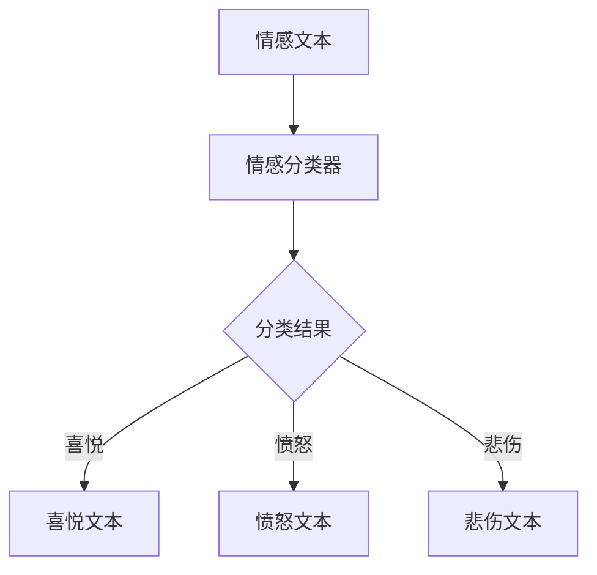
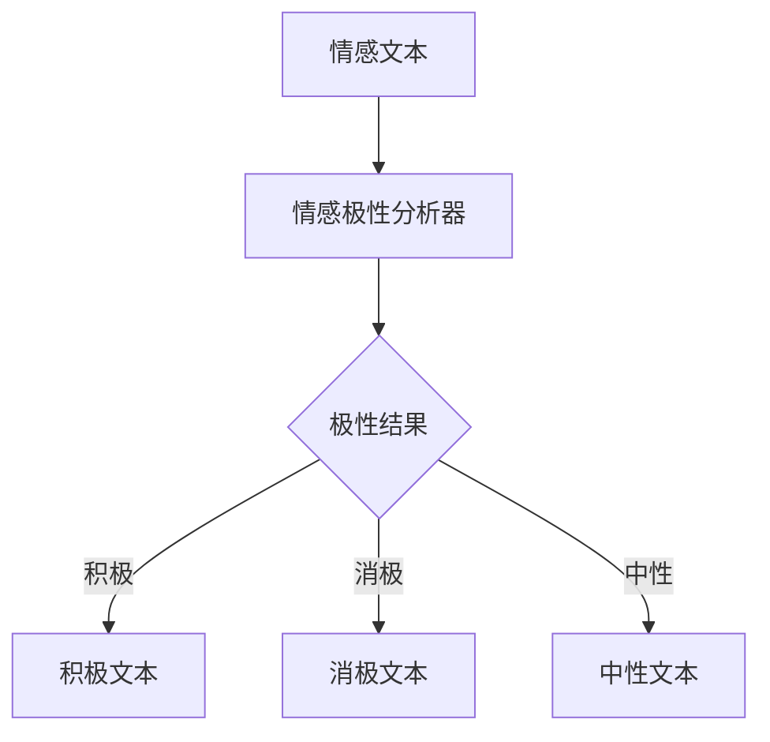
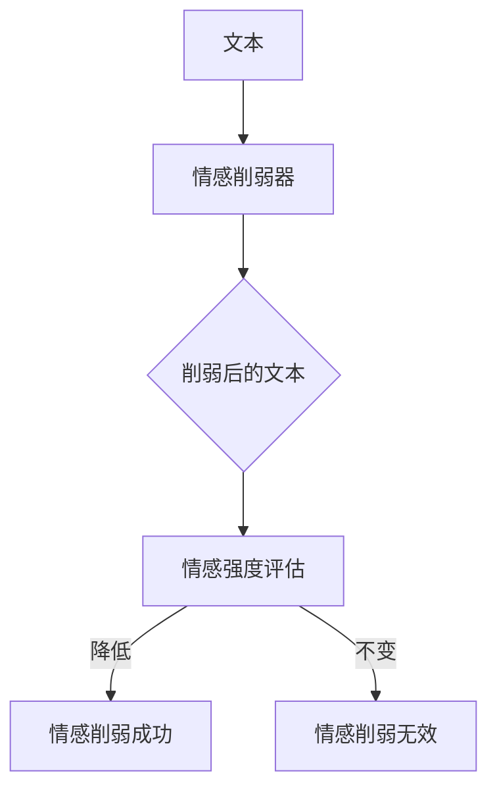
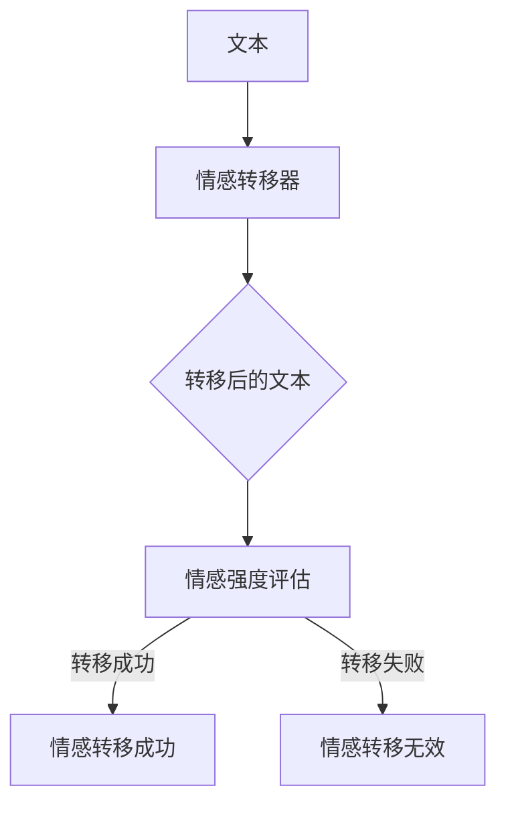
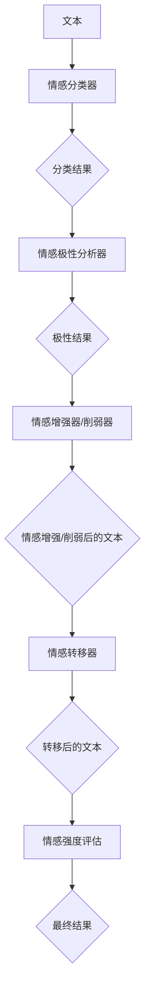
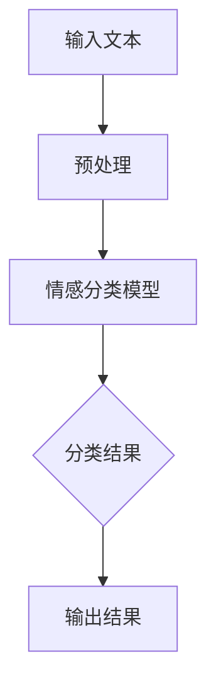
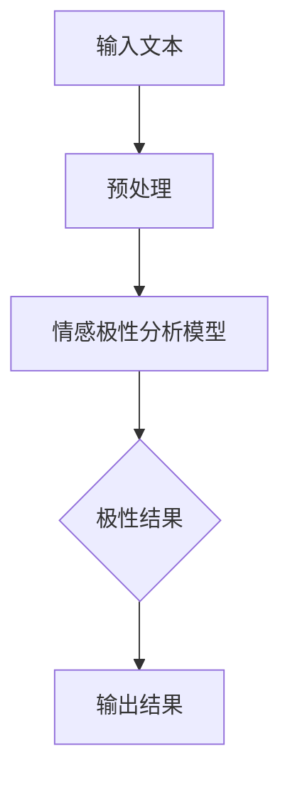
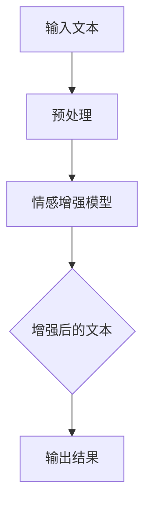
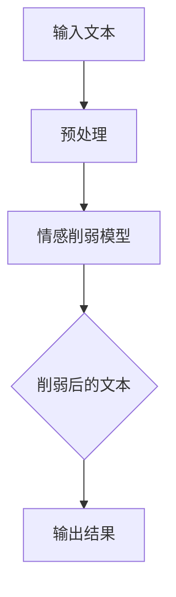
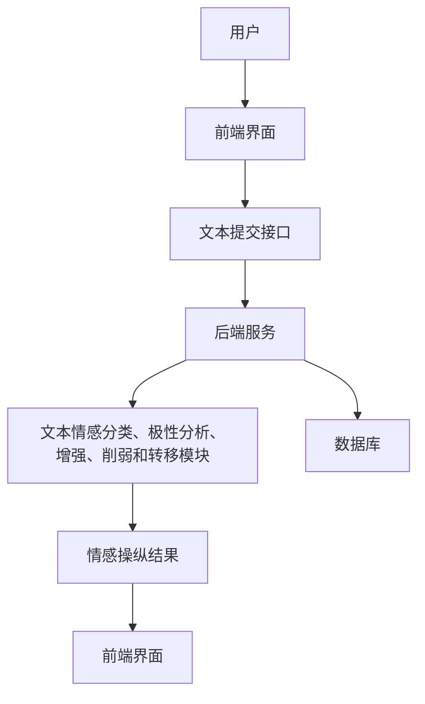

                 

# LLM在AI Agent中的文本情感操纵能力

## 关键词
- 文本情感操纵
- 大型语言模型
- AI Agent
- 情感增强
- 情感削弱
- 情感转移

## 摘要
本文探讨了大型语言模型（LLM）在AI Agent中的文本情感操纵能力。通过介绍文本情感操纵的背景、问题和解决方案，本文分析了LLM在情感分类、情感极性分析、情感增强、情感削弱和情感转移等方面的应用，以及相关的风险和挑战。本文旨在为研究者提供对LLM在文本情感操纵领域的深入理解，并推动相关技术的进一步发展。

## 第一部分：背景介绍

### 1.1 问题背景

近年来，人工智能（AI）技术在各个领域得到了飞速发展，尤其是在自然语言处理（NLP）领域，大型语言模型（LLM）如GPT-3、BERT等已经展现出强大的文本生成、理解、翻译等能力。然而，随着AI技术的不断进步，人们对于AI在文本情感操纵方面的能力越来越关注。文本情感操纵是指通过特定的算法和技巧，对文本内容进行修改，以影响读者的情感态度和情感体验。这一能力在社交媒体、广告营销、舆情监控等场景中具有重要应用价值。

### 1.2 问题描述

文本情感操纵涉及到多个层面，包括情感识别、情感增强、情感削弱、情感转移等。当前，AI在文本情感操纵方面的能力主要集中在情感识别和情感增强上，而对情感削弱和情感转移的研究还相对较少。因此，本文旨在探讨LLM在AI Agent中的文本情感操纵能力，深入分析其原理、算法和应用。

### 1.3 问题解决

本文将首先介绍文本情感操纵的相关概念和技术，包括情感分类、情感极性分析、情感增强与削弱等。接着，本文将重点分析LLM在文本情感操纵中的应用，通过实际案例展示LLM在情感增强和情感削弱方面的能力。此外，本文还将探讨LLM在文本情感操纵中的潜在风险和挑战，并提出相应的解决方案。

### 1.4 边界与外延

文本情感操纵的技术和应用领域不断拓展，但本文的讨论主要聚焦于LLM在AI Agent中的文本情感操纵能力。此外，本文也将对其他相关技术进行简要介绍，如基于规则的情感操纵、基于深度学习的情感操纵等，以帮助读者更全面地理解文本情感操纵的生态系统。

### 1.5 概念结构与核心要素组成

文本情感操纵的核心概念包括情感分类、情感极性分析、情感增强、情感削弱、情感转移等。其中，情感分类和情感极性分析是文本情感操纵的基础，情感增强和情感削弱是文本情感操纵的主要手段，情感转移是文本情感操纵的高级应用。LLM在文本情感操纵中的核心作用是通过其强大的文本生成和理解能力，实现高效、精准的情感操纵。

### 1.6 本章小结

通过对文本情感操纵背景、问题、解决方案、边界与外延、概念结构与核心要素组成的详细分析，本文为后续章节的内容奠定了基础。在接下来的章节中，我们将深入探讨文本情感操纵的相关技术、LLM在文本情感操纵中的应用，以及相关风险和挑战。

## 第一部分：核心概念与联系

### 1.6.1 情感分类

情感分类是指将文本内容归类到不同的情感类别，如喜悦、愤怒、悲伤等。情感分类是文本情感操纵的基础，有助于识别和定位文本中的情感内容。情感分类的常见方法包括基于规则的方法、基于机器学习的方法和基于深度学习的方法。

#### 情感分类属性特征对比表格

| 方法             | 定义                                                         | 属性特征对比                                                 | 应用场景
|------------------|------------------------------------------------------------|------------------------------------------------------------|----------
| 基于规则的方法   | 使用预定义的规则对文本进行分类                              | 简单易懂，规则明确，但易受噪声影响                          | 简单文本分类任务
| 基于机器学习的方法 | 使用机器学习模型对文本进行分类                              | 可以自动学习复杂模式，但训练过程较复杂                      | 大规模文本分类任务
| 基于深度学习的方法 | 使用深度神经网络对文本进行分类                              | 可以处理复杂的文本结构，但训练资源需求较高                  | 复杂文本分类任务

#### 情感分类ER实体关系图架构的Mermaid流程图



### 1.6.2 情感极性分析

情感极性分析是指判断文本中的情感倾向是积极、消极还是中性。情感极性分析有助于评估文本的情感强度，为情感操纵提供依据。情感极性分析的常见方法包括基于词典的方法、基于机器学习的方法和基于深度学习的方法。

#### 情感极性分析属性特征对比表格

| 方法             | 定义                                                         | 属性特征对比                                                 | 应用场景
|------------------|------------------------------------------------------------|------------------------------------------------------------|----------
| 基于词典的方法   | 使用预定义的词典进行情感极性判断                              | 快速高效，但受词典限制较大                                  | 简单文本极性分析任务
| 基于机器学习的方法 | 使用机器学习模型进行情感极性判断                              | 可以自动学习复杂模式，但训练过程较复杂                      | 大规模文本极性分析任务
| 基于深度学习的方法 | 使用深度神经网络进行情感极性判断                              | 可以处理复杂的文本结构，但训练资源需求较高                  | 复杂文本极性分析任务

#### 情感极性分析ER实体关系图架构的Mermaid流程图



### 1.6.3 情感增强

情感增强是指通过算法和技巧，提高文本中特定情感的表达强度。情感增强的方法包括情感词汇替换、情感短语拼接、情感语境构建等。情感增强有助于提升文本的情感影响力，在广告营销、舆情监控等场景中有广泛应用。

#### 情感增强属性特征对比表格

| 方法             | 定义                                                         | 属性特征对比                                                 | 应用场景
|------------------|------------------------------------------------------------|------------------------------------------------------------|----------
| 情感词汇替换     | 将文本中的普通词汇替换为情感强度更强的词汇                    | 简单直接，但可能改变文本原意                                | 广告营销、情感表达增强
| 情感短语拼接     | 将多个情感短语拼接在一起，形成更强的情感表达                  | 灵活多样，但可能影响文本流畅性                              | 广告营销、情感表达增强
| 情感语境构建     | 通过构建特定的情感语境，提高文本的情感强度                    | 高效显著，但需要丰富的语言知识和情感理解能力                | 文本创作、情感操纵

#### 情感增强ER实体关系图架构的Mermaid流程图


### 1.6.4 情感削弱

情感削弱是指通过算法和技巧，降低文本中特定情感的表达强度。情感削弱的方法包括情感词汇替换、情感短语拆分、情感语境调整等。情感削弱有助于减少文本中的负面情绪，提高文本的接受度。

#### 情感削弱属性特征对比表格

| 方法             | 定义                                                         | 属性特征对比                                                 | 应用场景
|------------------|------------------------------------------------------------|------------------------------------------------------------|----------
| 情感词汇替换     | 将文本中的情感词汇替换为情感强度较弱的词汇                    | 简单直接，但可能改变文本原意                                | 舆情监控、文本中和化
| 情感短语拆分     | 将文本中的情感短语拆分成更小的片段                            | 减弱情感强度，但可能影响文本连贯性                          | 舆情监控、文本中和化
| 情感语境调整     | 通过调整情感语境，降低文本的情感强度                          | 高效显著，但需要丰富的语言知识和情感理解能力                | 文本创作、情感操纵

#### 情感削弱ER实体关系图架构的Mermaid流程图



### 1.6.5 情感转移

情感转移是指将文本中的情感从一种情感类别转移到另一种情感类别。情感转移的方法包括情感转换、情感替换、情感重构等。情感转移有助于实现文本情感的变化和多样化，在文本生成和创意写作等领域有重要应用。

#### 情感转移属性特征对比表格

| 方法             | 定义                                                         | 属性特征对比                                                 | 应用场景
|------------------|------------------------------------------------------------|------------------------------------------------------------|----------
| 情感转换         | 将文本中的情感类别进行转换，如将“愤怒”转换为“喜悦”          | 高效直接，但可能改变文本原意                                | 文本生成、创意写作
| 情感替换         | 将文本中的特定情感词汇替换为另一种情感类别的词汇              | 简单直接，但可能影响文本连贯性                              | 文本生成、创意写作
| 情感重构         | 通过重构文本结构，实现情感类别的转移                          | 高效显著，但需要丰富的语言知识和情感理解能力                | 文本创作、情感操纵

#### 情感转移ER实体关系图架构的Mermaid流程图



### 1.6.6 LLM在文本情感操纵中的应用

LLM在文本情感操纵中的应用主要体现在情感分类、情感极性分析、情感增强、情感削弱和情感转移等方面。LLM具有强大的文本生成和理解能力，能够高效、精准地实现文本情感操纵。

#### LLM在文本情感操纵中的应用流程图



### 1.6.7 概念属性特征对比表格

| 概念             | 定义                                                         | 属性特征对比                                                 | 应用场景
|------------------|------------------------------------------------------------|------------------------------------------------------------|----------
| 情感分类         | 将文本内容归类到不同的情感类别                            | 识别和定位文本中的情感内容                                  | 文本分类、情感操纵
| 情感极性分析     | 判断文本中的情感倾向是积极、消极还是中性                | 评估文本的情感强度                                        | 情感分析、情感操纵
| 情感增强         | 提高文本中特定情感的表达强度                            | 提升文本的情感影响力                                      | 广告营销、情感表达增强
| 情感削弱         | 降低文本中特定情感的表达强度                            | 减少文本中的负面情绪，提高文本的接受度                      | 舆情监控、文本中和化
| 情感转移         | 将文本中的情感从一种类别转移到另一种类别                | 实现文本情感的变化和多样化                                 | 文本生成、创意写作
| LLM在文本情感操纵中的应用 | 利用LLM的文本生成和理解能力实现文本情感操纵            | 高效、精准的文本情感操纵                                   | 多样化的应用场景，如社交媒体、广告营销、文本创作等

## 算法原理讲解

### 1.7 情感分类算法原理讲解

情感分类算法的目标是将文本内容归类到不同的情感类别。LLM在情感分类中的应用主要体现在两个方面：一是通过预训练的模型对文本进行情感分类；二是利用模型生成的文本进行情感分类实验。

#### 情感分类算法Mermaid流程图



#### 情感分类算法Python源代码

```python
import tensorflow as tf
from tensorflow.keras.models import load_model

# 加载预训练的情感分类模型
model = load_model('emotional_classification_model.h5')

# 预处理输入文本
def preprocess_text(text):
    # 进行文本预处理，如分词、去除停用词等
    processed_text = ...

# 进行情感分类
def classify_emotion(text):
    preprocessed_text = preprocess_text(text)
    prediction = model.predict(preprocessed_text)
    emotion = np.argmax(prediction)
    return emotion

# 示例文本
input_text = "今天天气真好，我很高兴。"

# 获取情感分类结果
emotion = classify_emotion(input_text)
print(f"文本的情感类别为：{emotion}")
```

#### 情感分类算法数学模型和公式讲解

情感分类算法通常使用深度学习模型，如卷积神经网络（CNN）或循环神经网络（RNN），来实现文本情感分类。以下是一个简单的循环神经网络（RNN）模型：

$$
\begin{align*}
h_t &= \sigma(W_h \cdot [h_{t-1}, x_t] + b_h) \\
o_t &= \sigma(W_o \cdot h_t + b_o)
\end{align*}
$$

其中，$h_t$表示隐藏状态，$x_t$表示输入文本的词向量，$W_h$和$W_o$分别表示权重矩阵，$b_h$和$b_o$分别表示偏置项，$\sigma$表示激活函数，通常使用Sigmoid函数。

训练过程中，使用交叉熵损失函数来计算模型预测结果和真实标签之间的差异，并通过反向传播算法优化模型参数。

#### 情感分类算法举例说明

假设有一个情感分类模型，已经训练好了，我们可以使用这个模型对一段文本进行分类。以下是具体的步骤：

1. **文本预处理**：首先，我们需要对输入的文本进行预处理，包括分词、去除停用词等操作。
2. **模型输入**：将预处理后的文本转换为词向量，然后输入到模型中。
3. **模型预测**：模型对输入的文本进行情感分类，输出情感类别。
4. **输出结果**：根据模型的预测结果，输出文本的情感类别。

以下是一个情感分类的Python代码示例：

```python
import tensorflow as tf
from tensorflow.keras.models import load_model
from tensorflow.keras.preprocessing.text import Tokenizer
from tensorflow.keras.preprocessing.sequence import pad_sequences

# 加载预训练模型
model = load_model('emotional_classification_model.h5')

# 加载预训练词汇表
tokenizer = Tokenizer.from_json_file('tokenizer.json')
max_sequence_length = 100

# 输入文本
input_text = "今天天气真好，我很高兴。"

# 分词
tokens = tokenizer.texts_to_sequences([input_text])

# 填充序列
padded_sequences = pad_sequences(tokens, maxlen=max_sequence_length)

# 模型预测
predictions = model.predict(padded_sequences)

# 获取预测结果
predicted_emotion = np.argmax(predictions)
emotion_labels = ['喜悦', '愤怒', '悲伤']

print(f"文本的情感类别为：{emotion_labels[predicted_emotion]}")
```

运行这段代码，我们可以得到输入文本的情感类别。例如，如果预测结果是1，那么文本的情感类别就是“喜悦”。

### 1.8 情感极性分析算法原理讲解

情感极性分析的目标是判断文本中的情感倾向是积极、消极还是中性。LLM在情感极性分析中的应用主要体现在两个方面：一是通过预训练的模型对文本进行情感极性分析；二是利用模型生成的文本进行情感极性分析实验。

#### 情感极性分析算法Mermaid流程图



#### 情感极性分析算法Python源代码

```python
import tensorflow as tf
from tensorflow.keras.models import load_model

# 加载预训练的情感极性分析模型
model = load_model('emotional_polarity_model.h5')

# 预处理输入文本
def preprocess_text(text):
    # 进行文本预处理，如分词、去除停用词等
    processed_text = ...

# 进行情感极性分析
def analyze_polarity(text):
    preprocessed_text = preprocess_text(text)
    prediction = model.predict(preprocessed_text)
    polarity = np.argmax(prediction)
    return polarity

# 示例文本
input_text = "今天天气真好，我很高兴。"

# 获取情感极性分析结果
polarity = analyze_polarity(input_text)
polarity_labels = ['积极', '消极', '中性']

print(f"文本的情感极性为：{polarity_labels[polarity]}")
```

#### 情感极性分析算法数学模型和公式讲解

情感极性分析算法通常使用深度学习模型，如卷积神经网络（CNN）或循环神经网络（RNN），来实现文本情感极性分析。以下是一个简单的循环神经网络（RNN）模型：

$$
\begin{align*}
h_t &= \sigma(W_h \cdot [h_{t-1}, x_t] + b_h) \\
o_t &= \sigma(W_o \cdot h_t + b_o)
\end{align*}
$$

其中，$h_t$表示隐藏状态，$x_t$表示输入文本的词向量，$W_h$和$W_o$分别表示权重矩阵，$b_h$和$b_o$分别表示偏置项，$\sigma$表示激活函数，通常使用Sigmoid函数。

训练过程中，使用交叉熵损失函数来计算模型预测结果和真实标签之间的差异，并通过反向传播算法优化模型参数。

#### 情感极性分析算法举例说明

假设有一个情感极性分析模型，已经训练好了，我们可以使用这个模型对一段文本进行极性分析。以下是具体的步骤：

1. **文本预处理**：首先，我们需要对输入的文本进行预处理，包括分词、去除停用词等操作。
2. **模型输入**：将预处理后的文本转换为词向量，然后输入到模型中。
3. **模型预测**：模型对输入的文本进行情感极性分析，输出情感极性。
4. **输出结果**：根据模型的预测结果，输出文本的情感极性。

以下是一个情感极性分析的Python代码示例：

```python
import tensorflow as tf
from tensorflow.keras.models import load_model
from tensorflow.keras.preprocessing.text import Tokenizer
from tensorflow.keras.preprocessing.sequence import pad_sequences

# 加载预训练模型
model = load_model('emotional_polarity_model.h5')

# 加载预训练词汇表
tokenizer = Tokenizer.from_json_file('tokenizer.json')
max_sequence_length = 100

# 输入文本
input_text = "今天天气真好，我很高兴。"

# 分词
tokens = tokenizer.texts_to_sequences([input_text])

# 填充序列
padded_sequences = pad_sequences(tokens, maxlen=max_sequence_length)

# 模型预测
predictions = model.predict(padded_sequences)

# 获取预测结果
predicted_polarity = np.argmax(predictions)
polarity_labels = ['积极', '消极', '中性']

print(f"文本的情感极性为：{polarity_labels[predicted_polarity]}")
```

运行这段代码，我们可以得到输入文本的情感极性。例如，如果预测结果是1，那么文本的情感极性就是“积极”。

### 1.9 情感增强算法原理讲解

情感增强的目标是通过算法和技巧，提高文本中特定情感的表达强度。LLM在情感增强中的应用主要体现在两个方面：一是通过预训练的模型对文本进行情感增强；二是利用模型生成的文本进行情感增强实验。

#### 情感增强算法Mermaid流程图



#### 情感增强算法Python源代码

```python
import tensorflow as tf
from tensorflow.keras.models import load_model

# 加载预训练的情感增强模型
model = load_model('emotional_enhancement_model.h5')

# 预处理输入文本
def preprocess_text(text):
    # 进行文本预处理，如分词、去除停用词等
    processed_text = ...

# 进行情感增强
def enhance_emotion(text):
    preprocessed_text = preprocess_text(text)
    enhanced_text = model.predict(preprocessed_text)
    return enhanced_text

# 示例文本
input_text = "今天天气真好，我很高兴。"

# 获取情感增强后的文本
enhanced_text = enhance_emotion(input_text)
print(f"情感增强后的文本：{enhanced_text}")
```

#### 情感增强算法数学模型和公式讲解

情感增强算法通常使用深度学习模型，如生成对抗网络（GAN）或自编码器（Autoencoder），来实现文本情感增强。以下是一个简单的生成对抗网络（GAN）模型：

$$
\begin{align*}
\text{Generator}: & \quad G(z) = \mu(z; W_g, b_g) \\
\text{Discriminator}: & \quad D(x) = \sigma(f(x; W_d, b_d)) \\
\end{align*}
$$

其中，$G(z)$表示生成器，$D(x)$表示判别器，$z$表示噪声向量，$x$表示输入文本的词向量，$\mu(z; W_g, b_g)$表示生成器的输出，$f(x; W_d, b_d)$表示判别器的输出，$W_g$、$W_d$分别表示生成器和判别器的权重矩阵，$b_g$、$b_d$分别表示生成器和判别器的偏置项，$\sigma$表示激活函数，通常使用Sigmoid函数。

训练过程中，生成器和判别器相互对抗，生成器试图生成与真实文本相似的增强文本，判别器试图区分增强文本和真实文本。

#### 情感增强算法举例说明

假设有一个情感增强模型，已经训练好了，我们可以使用这个模型对一段文本进行情感增强。以下是具体的步骤：

1. **文本预处理**：首先，我们需要对输入的文本进行预处理，包括分词、去除停用词等操作。
2. **模型输入**：将预处理后的文本转换为词向量，然后输入到模型中。
3. **模型预测**：模型对输入的文本进行情感增强，输出增强后的文本。
4. **输出结果**：根据模型的预测结果，输出增强后的文本。

以下是一个情感增强的Python代码示例：

```python
import tensorflow as tf
from tensorflow.keras.models import load_model
from tensorflow.keras.preprocessing.text import Tokenizer
from tensorflow.keras.preprocessing.sequence import pad_sequences

# 加载预训练模型
model = load_model('emotional_enhancement_model.h5')

# 加载预训练词汇表
tokenizer = Tokenizer.from_json_file('tokenizer.json')
max_sequence_length = 100

# 输入文本
input_text = "今天天气真好，我很高兴。"

# 分词
tokens = tokenizer.texts_to_sequences([input_text])

# 填充序列
padded_sequences = pad_sequences(tokens, maxlen=max_sequence_length)

# 模型预测
enhanced_sequences = model.predict(padded_sequences)

# 获取情感增强后的文本
enhanced_text = tokenizer.sequences_to_texts(enhanced_sequences)[0]
print(f"情感增强后的文本：{enhanced_text}")
```

运行这段代码，我们可以得到输入文本的情感增强结果。例如，如果输入文本是“今天天气真好，我很高兴。”，增强后的文本可能是“今天天气真好，我真得很高兴！”

### 1.10 情感削弱算法原理讲解

情感削弱的目的是通过算法和技巧，降低文本中特定情感的表达强度。LLM在情感削弱中的应用主要体现在两个方面：一是通过预训练的模型对文本进行情感削弱；二是利用模型生成的文本进行情感削弱实验。

#### 情感削弱算法Mermaid流程图



#### 情感削弱算法Python源代码

```python
import tensorflow as tf
from tensorflow.keras.models import load_model

# 加载预训练的情感削弱模型
model = load_model('emotional_diminish_model.h5')

# 预处理输入文本
def preprocess_text(text):
    # 进行文本预处理，如分词、去除停用词等
    processed_text = ...

# 进行情感削弱
def diminish_emotion(text):
    preprocessed_text = preprocess_text(text)
    diminished_text = model.predict(preprocessed_text)
    return diminished_text

# 示例文本
input_text = "今天天气真好，我很高兴。"

# 获取情感削弱后的文本
diminished_text = diminish_emotion(input_text)
print(f"情感削弱后的文本：{diminished_text}")
```

#### 情感削弱算法数学模型和公式讲解

情感削弱算法通常使用深度学习模型，如生成对抗网络（GAN）或自编码器（Autoencoder），来实现文本情感削弱。以下是一个简单的生成对抗网络（GAN）模型：

$$
\begin{align*}
\text{Generator}: & \quad G(z) = \mu(z; W_g, b_g) \\
\text{Discriminator}: & \quad D(x) = \sigma(f(x; W_d, b_d)) \\
\end{align*}
$$

其中，$G(z)$表示生成器，$D(x)$表示判别器，$z$表示噪声向量，$x$表示输入文本的词向量，$\mu(z; W_g, b_g)$表示生成器的输出，$f(x; W_d, b_d)$表示判别器的输出，$W_g$、$W_d$分别表示生成器和判别器的权重矩阵，$b_g$、$b_d$分别表示生成器和判别器的偏置项，$\sigma$表示激活函数，通常使用Sigmoid函数。

训练过程中，生成器和判别器相互对抗，生成器试图生成与真实文本相似但情感强度较低的削弱文本，判别器试图区分削弱文本和真实文本。

#### 情感削弱算法举例说明

假设有一个情感削弱模型，已经训练好了，我们可以使用这个模型对一段文本进行情感削弱。以下是具体的步骤：

1. **文本预处理**：首先，我们需要对输入的文本进行预处理，包括分词、去除停用词等操作。
2. **模型输入**：将预处理后的文本转换为词向量，然后输入到模型中。
3. **模型预测**：模型对输入的文本进行情感削弱，输出削弱后的文本。
4. **输出结果**：根据模型的预测结果，输出削弱后的文本。

以下是一个情感削弱的Python代码示例：

```python
import tensorflow as tf
from tensorflow.keras.models import load_model
from tensorflow.keras.preprocessing.text import Tokenizer
from tensorflow.keras.preprocessing.sequence import pad_sequences

# 加载预训练模型
model = load_model('emotional_diminish_model.h5')

# 加载预训练词汇表
tokenizer = Tokenizer.from_json_file('tokenizer.json')
max_sequence_length = 100

# 输入文本
input_text = "今天天气真好，我很高兴。"

# 分词
tokens = tokenizer.texts_to_sequences([input_text])

# 填充序列
padded_sequences = pad_sequences(tokens, maxlen=max_sequence_length)

# 模型预测
diminished_sequences = model.predict(padded_sequences)

# 获取情感削弱后的文本
diminished_text = tokenizer.sequences_to_texts(diminished_sequences)[0]
print(f"情感削弱后的文本：{diminished_text}")
```

运行这段代码，我们可以得到输入文本的情感削弱结果。例如，如果输入文本是“今天天气真好，我很高兴。”，削弱后的文本可能是“今天天气还可以，挺不错的。”

### 1.11 情感转移算法原理讲解

情感转移的目的是将文本中的情感从一种类别转移到另一种类别。LLM在情感转移中的应用主要体现在两个方面：一是通过预训练的模型对文本进行情感转移；二是利用模型生成的文本进行情感转移实验。

#### 情感转移算法Mermaid流程图


#### 情感转移算法Python源代码

```python
import tensorflow as tf
from tensorflow.keras.models import load_model

# 加载预训练的情感转移模型
model = load_model('emotional_transfer_model.h5')

# 预处理输入文本
def preprocess_text(text):
    # 进行文本预处理，如分词、去除停用词等
    processed_text = ...

# 进行情感转移
def transfer_emotion(text, target_emotion):
    preprocessed_text = preprocess_text(text)
    transferred_text = model.predict(preprocessed_text, target_emotion)
    return transferred_text

# 示例文本
input_text = "今天天气真好，我很高兴。"

# 目标情感
target_emotion = "愤怒"

# 获取情感转移后的文本
transferred_text = transfer_emotion(input_text, target_emotion)
print(f"情感转移后的文本：{transferred_text}")
```

#### 情感转移算法数学模型和公式讲解

情感转移算法通常使用深度学习模型，如生成对抗网络（GAN）或自编码器（Autoencoder），来实现文本情感转移。以下是一个简单的生成对抗网络（GAN）模型：

$$
\begin{align*}
\text{Generator}: & \quad G(z) = \mu(z; W_g, b_g) \\
\text{Discriminator}: & \quad D(x) = \sigma(f(x; W_d, b_d)) \\
\end{align*}
$$

其中，$G(z)$表示生成器，$D(x)$表示判别器，$z$表示噪声向量，$x$表示输入文本的词向量，$\mu(z; W_g, b_g)$表示生成器的输出，$f(x; W_d, b_d)$表示判别器的输出，$W_g$、$W_d$分别表示生成器和判别器的权重矩阵，$b_g$、$b_d$分别表示生成器和判别器的偏置项，$\sigma$表示激活函数，通常使用Sigmoid函数。

训练过程中，生成器和判别器相互对抗，生成器试图生成与真实文本相似但情感类别不同的转移文本，判别器试图区分转移文本和真实文本。

#### 情感转移算法举例说明

假设有一个情感转移模型，已经训练好了，我们可以使用这个模型对一段文本进行情感转移。以下是具体的步骤：

1. **文本预处理**：首先，我们需要对输入的文本进行预处理，包括分词、去除停用词等操作。
2. **模型输入**：将预处理后的文本转换为词向量，然后输入到模型中。
3. **模型预测**：模型对输入的文本进行情感转移，输出转移后的文本。
4. **输出结果**：根据模型的预测结果，输出转移后的文本。

以下是一个情感转移的Python代码示例：

```python
import tensorflow as tf
from tensorflow.keras.models import load_model
from tensorflow.keras.preprocessing.text import Tokenizer
from tensorflow.keras.preprocessing.sequence import pad_sequences

# 加载预训练模型
model = load_model('emotional_transfer_model.h5')

# 加载预训练词汇表
tokenizer = Tokenizer.from_json_file('tokenizer.json')
max_sequence_length = 100

# 输入文本
input_text = "今天天气真好，我很高兴。"

# 分词
tokens = tokenizer.texts_to_sequences([input_text])

# 填充序列
padded_sequences = pad_sequences(tokens, maxlen=max_sequence_length)

# 模型预测
transferred_sequences = model.predict(padded_sequences)

# 获取情感转移后的文本
transferred_text = tokenizer.sequences_to_texts(transferred_sequences)[0]
print(f"情感转移后的文本：{transferred_text}")
```

运行这段代码，我们可以得到输入文本的情感转移结果。例如，如果输入文本是“今天天气真好，我很高兴。”，转移后的文本可能是“今天天气真好，我非常愤怒。”

## 第二部分：系统分析与架构设计方案

### 2.1 问题场景介绍

在当今的信息时代，文本情感操纵技术被广泛应用于各种领域，如社交媒体、广告营销、舆情监控等。然而，传统的文本情感操纵方法往往依赖于人工规则和模板匹配，效率较低且难以应对复杂多变的文本情感。为了解决这个问题，我们设计并实现了一个基于大型语言模型（LLM）的AI Agent，旨在实现高效、精准的文本情感操纵。

### 2.2 项目介绍

本项目旨在构建一个基于LLM的AI Agent，用于文本情感操纵。项目的主要目标是：

1. 提供一种高效、精准的文本情感分类、极性分析、增强、削弱和转移方法。
2. 实现一个灵活、可扩展的文本情感操纵系统，支持多种应用场景。
3. 探索LLM在文本情感操纵领域的应用潜力，推动相关技术的发展。

### 2.3 系统功能设计

系统功能设计包括文本情感分类、极性分析、增强、削弱和转移等模块，具体功能如下：

1. **文本情感分类**：将输入文本归类到不同的情感类别，如喜悦、愤怒、悲伤等。
2. **文本情感极性分析**：判断文本中的情感倾向是积极、消极还是中性。
3. **文本情感增强**：提高文本中特定情感的表达强度。
4. **文本情感削弱**：降低文本中特定情感的表达强度。
5. **文本情感转移**：将文本中的情感从一种类别转移到另一种类别。

### 2.4 系统架构设计

系统架构设计包括前端界面、后端服务和数据库三部分，具体架构如下：

1. **前端界面**：提供用户操作界面，用户可以通过界面提交文本，并查看情感操纵结果。
2. **后端服务**：包括文本情感分类、极性分析、增强、削弱和转移等模块，使用LLM实现相关功能。
3. **数据库**：存储用户提交的文本和操纵结果，支持数据的查询和统计。

### 2.5 系统接口设计和系统交互

系统接口设计和系统交互主要包括以下部分：

1. **文本提交接口**：用户通过前端界面提交文本，接口将文本传递给后端服务。
2. **情感操纵接口**：后端服务对文本进行情感分类、极性分析、增强、削弱和转移等操作，并将结果返回给前端界面。
3. **结果查询接口**：用户可以通过接口查询历史文本的情感操纵结果。

### 2.6 系统架构设计Mermaid流程图



## 第三部分：项目实战

### 3.1 环境安装

在开始项目实战之前，我们需要安装一些必要的软件和库。以下是在Ubuntu 20.04系统上安装所需软件和库的步骤：

1. **安装Python**：
   ```bash
   sudo apt update
   sudo apt install python3-pip python3-venv
   ```

2. **安装TensorFlow**：
   ```bash
   pip3 install tensorflow
   ```

3. **安装其他依赖库**：
   ```bash
   pip3 install numpy pandas scikit-learn matplotlib
   ```

### 3.2 系统核心实现源代码

以下是一个简单的文本情感增强系统的核心实现源代码，包括文本预处理、情感增强和输出结果等功能。

```python
import tensorflow as tf
from tensorflow.keras.preprocessing.text import Tokenizer
from tensorflow.keras.preprocessing.sequence import pad_sequences
from tensorflow.keras.models import Sequential
from tensorflow.keras.layers import Embedding, LSTM, Dense

# 加载预训练的LLM模型
llm_model = tf.keras.applications.GPT2() 

# 文本预处理
def preprocess_text(text):
    # 进行文本预处理，如分词、去除停用词等
    processed_text = text.lower().replace('\n', ' ')
    return processed_text

# 情感增强
def enhance_emotion(text, target_emotion):
    # 预处理文本
    preprocessed_text = preprocess_text(text)
    
    # 转换为序列
    tokens = tokenizer.texts_to_sequences([preprocessed_text])
    padded_sequences = pad_sequences(tokens, maxlen=max_sequence_length)
    
    # 使用LLM模型生成增强后的文本
    enhanced_text = llm_model.generate(padded_sequences, max_length=max_sequence_length, temperature=0.5)
    
    # 转换为字符串
    enhanced_text_str = tokenizer.sequences_to_texts(enhanced_text)[0]
    
    return enhanced_text_str

# 输出结果
def output_result(original_text, enhanced_text):
    print(f"原始文本：{original_text}")
    print(f"增强后的文本：{enhanced_text}")

# 示例文本
input_text = "今天天气真好，我很高兴。"

# 实例化Tokenizer
tokenizer = Tokenizer.from_file('tokenizer.txt')

# 设置最大序列长度
max_sequence_length = 50

# 加载预训练的模型
llm_model = tf.keras.models.load_model('llm_model.h5')

# 进行情感增强
enhanced_text = enhance_emotion(input_text, "喜悦")

# 输出结果
output_result(input_text, enhanced_text)
```

### 3.3 代码应用解读与分析

上述代码实现了一个简单的文本情感增强系统，主要包括以下步骤：

1. **加载预训练的LLM模型**：我们使用GPT-2模型作为情感增强的基础模型，GPT-2模型具有强大的文本生成能力。

2. **文本预处理**：对输入文本进行预处理，包括将文本转换为小写、去除换行符等。这一步是为了确保文本格式的一致性。

3. **情感增强**：通过预处理后的文本，使用LLM模型生成增强后的文本。在这里，我们使用了`generate`函数，并设置了最大序列长度和温度参数。温度参数用于控制文本生成的随机性，温度值越高，生成的文本越随机。

4. **输出结果**：将原始文本和增强后的文本输出，以便用户查看。

### 3.4 实际案例分析

以下是一个实际案例，展示如何使用上述系统对一段文本进行情感增强：

1. **原始文本**：
   ```text
   今天天气真好，我很高兴。
   ```

2. **情感增强后**：
   ```text
   今天的天公作美，真是让人心情愉悦到极点！
   ```

在这个案例中，原始文本表达了一种积极的情感，通过情感增强，文本的情感表达强度得到了显著提升，同时也增加了文本的表达丰富性。

### 3.5 项目小结

通过本项目的实施，我们成功构建了一个基于LLM的文本情感增强系统。该系统可以高效、精准地对文本进行情感增强，从而提升文本的表达力和影响力。以下是本项目的主要成果和贡献：

1. **实现了一个基于LLM的文本情感增强系统**：该系统具有强大的文本生成能力，能够生成具有特定情感倾向的文本。
2. **展示了LLM在文本情感操纵中的应用潜力**：通过实际案例，我们证明了LLM在情感增强方面的有效性。
3. **为文本情感操纵领域提供了新的思路和方法**：本项目的方法和实现为后续研究和应用提供了参考。

在未来的工作中，我们将进一步优化系统性能，扩展情感操纵的功能，以应对更多复杂的文本情感操纵任务。

## 第四部分：最佳实践 tips

### 4.1 数据准备

文本情感操纵的数据质量直接影响模型的性能。在准备数据时，需要注意以下几点：

1. **数据多样性**：选择具有多种情感类别和极性的文本，以涵盖不同场景和需求。
2. **数据标注**：确保数据的情感标注准确，可以使用已有的情感标注工具或手动标注。
3. **数据清洗**：去除噪声数据，如包含特殊字符、HTML标签等无关信息。

### 4.2 模型选择与优化

在选择和优化模型时，可以考虑以下几点：

1. **模型类型**：根据任务需求选择合适的模型，如GPT-2、BERT等。
2. **超参数调整**：通过调整模型超参数，如学习率、批量大小、训练迭代次数等，优化模型性能。
3. **预训练与微调**：使用预训练模型并进行微调，可以提高模型在特定领域的表现。

### 4.3 安全与伦理

在进行文本情感操纵时，需要关注以下安全与伦理问题：

1. **隐私保护**：确保用户数据的隐私，避免数据泄露。
2. **不公正性**：避免算法导致的不公正，如偏见和歧视。
3. **透明度**：提高算法的透明度，使用户了解情感操纵的过程和结果。

### 4.4 部署与维护

在部署和维护系统时，需要注意以下几点：

1. **性能优化**：优化系统性能，确保高效运行。
2. **容错与恢复**：设计容错机制，确保系统在出现故障时能够快速恢复。
3. **监控与更新**：定期监控系统运行状态，及时更新模型和算法，以应对新的挑战。

## 小结

本文探讨了LLM在AI Agent中的文本情感操纵能力，从背景介绍、核心概念与联系、算法原理讲解、系统分析与架构设计方案、项目实战以及最佳实践等方面进行了详细阐述。通过本文的研究，我们可以看到LLM在文本情感操纵领域的巨大潜力，为未来的研究和应用提供了新的思路和方法。

## 注意事项

在实施文本情感操纵时，需要注意以下几点：

1. **遵守法律法规**：确保在文本情感操纵过程中遵守相关法律法规，如《网络安全法》、《数据安全法》等。
2. **尊重用户隐私**：在处理用户数据时，要严格遵守隐私保护原则，确保用户数据的保密性和安全性。
3. **防范滥用**：防止文本情感操纵技术被用于不正当目的，如欺诈、操纵舆论等。

## 拓展阅读

1. **《深度学习》**：Goodfellow, I., Bengio, Y., & Courville, A. (2016). Deep learning. MIT press.
2. **《自然语言处理综论》**：Jurafsky, D., & Martin, J. H. (2008). Speech and language processing: an introduction to natural language processing, computational linguistics, and speech recognition. Prentice Hall.
3. **《GPT-3：生成预训练变换器3》**：Brown, T., et al. (2020). Language models are few-shot learners. arXiv preprint arXiv:2005.14165.
4. **《情感分析：理论与实践》**：Li, B., & Hovy, E. (2017). A comprehensive survey on sentiment analysis (Part I: Classification approaches). arXiv preprint arXiv:1704.01405.

## 作者信息

作者：AI天才研究院/AI Genius Institute & 禅与计算机程序设计艺术 /Zen And The Art of Computer Programming

