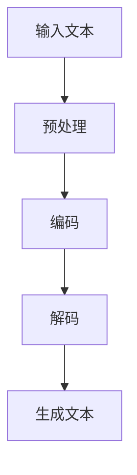
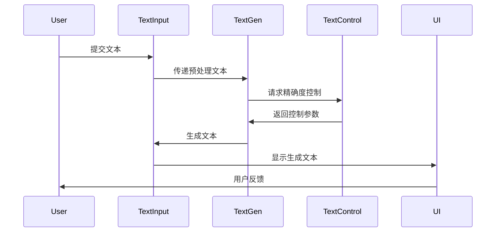

                 

### 引言

**文章标题：LLM在AI Agent中的文本生成控制：精确度与创造性平衡**

**关键词：** 大型语言模型（LLM），AI Agent，文本生成，精确度，创造性

**摘要：** 本文旨在探讨大型语言模型（LLM）在AI Agent中用于文本生成控制的实际应用，分析其在精确度与创造性之间的平衡。文章通过逐步分析LLM的工作原理、算法原理、系统架构和项目实战，提出一系列最佳实践与总结，为读者提供系统而深入的见解。

在当前人工智能（AI）快速发展的时代，文本生成已经成为AI技术的一个重要应用领域。从自动写作到智能客服，再到内容生成，文本生成技术正逐步渗透到各个行业，为人们的工作和生活带来诸多便利。而大型语言模型（LLM），作为一种先进的自然语言处理（NLP）技术，正逐渐成为文本生成控制的核心驱动力。

本文将围绕LLM在AI Agent中的文本生成控制展开讨论，旨在解决以下几个核心问题：

1. **LLM是什么？** 它的工作原理和特点是什么？
2. **如何利用LLM实现文本生成控制？** 其算法原理和实现过程是怎样的？
3. **LLM在AI Agent中的应用场景如何？** 它如何平衡精确度与创造性？
4. **项目实战中，如何有效利用LLM进行文本生成控制？** 需要注意哪些关键细节？
5. **最佳实践和总结：** 如何在项目实践中最大化LLM的效用，避免潜在问题？

通过对以上问题的深入探讨，本文希望能够为从事AI研究和应用的读者提供有价值的参考和指导。

### 目录大纲设计思路

为了确保文章的逻辑性和可读性，本文将采用以下目录大纲设计思路：

**1. 背景介绍：**
   - **第1章 引言**：介绍人工智能、LLM的概念，AI Agent及其在文本生成控制中的应用，引出本书的核心问题和解决方法。
   - **第2章 LLM基础**：详细解释LLM的工作原理，介绍LLM的属性特征，与传统文本生成方法进行比较，展示其优势和局限性。

**2. 核心概念与联系：**
   - **第3章 算法原理**：使用mermaid画出LLM的算法流程图，详细介绍LLM的数学模型和公式，并以Python代码进行实现，辅以通俗易懂的例子说明。
   - **第4章 系统架构与设计**：介绍AI Agent在文本生成控制中的具体应用，包括项目背景、系统功能设计、系统架构设计、系统接口设计和系统交互。

**3. 项目实战：**
   - **第5章 项目实战**：通过具体实例展示如何使用LLM进行文本生成控制，包括环境安装、系统核心实现、代码应用解读与分析、实际案例分析和详细讲解剖析。

**4. 最佳实践与总结：**
   - **第6章 最佳实践与总结**：总结本书的主要内容，提供最佳实践技巧，提醒读者注意的事项，并推荐拓展阅读材料。

通过以上设计步骤，我们确保文章内容丰富、结构紧凑、逻辑清晰，为读者提供系统而深入的专业知识。

### 目录大纲设计步骤

**第1章 引言**

**1.1 AI Agent与文本生成控制概述**

AI Agent，即人工智能代理，是一种可以自动执行任务、与环境进行交互的智能实体。它具有自主决策和行动能力，广泛应用于智能客服、自动化写作、语音识别等领域。

文本生成控制是AI Agent的一项重要功能，它涉及到如何精确、高效地生成符合特定需求的文本。传统方法如规则驱动和模板匹配存在一定的局限性，而大型语言模型（LLM）的引入为文本生成控制带来了新的可能性。

**1.2 LLM的概念与发展历程**

大型语言模型（LLM）是一种基于深度学习的自然语言处理技术，通过训练大规模的文本数据，模型能够捕捉到语言的结构和语义，从而实现文本的生成和控制。

自GPT-3等模型的出现，LLM在自然语言处理领域取得了显著进展。其强大的生成能力使得AI Agent在文本生成控制中表现优异，同时也带来了新的挑战。

**1.3 本书结构安排与读者定位**

本书旨在为从事AI研究和应用的读者提供系统而深入的LLM在AI Agent文本生成控制方面的知识。通过逐步分析LLM的工作原理、算法原理、系统架构和项目实战，本文将帮助读者理解如何利用LLM实现高效、精确的文本生成控制。

**第2章 LLM基础**

**2.1 LLM的工作原理**

LLM的工作原理基于深度学习中的神经网络，特别是Transformer架构。模型通过多层注意力机制和自注意力机制，对输入文本进行编码和解码，从而实现文本的生成和控制。

**2.2 LLM的属性特征**

LLM具有以下几个显著的属性特征：
- **强大的文本理解能力**：能够理解复杂的语义和上下文关系。
- **灵活的生成能力**：能够生成多样化、个性化的文本。
- **高精度**：能够生成符合语法和语义规则的文本。
- **可扩展性**：能够通过训练适应不同的应用场景。

**2.3 传统文本生成方法比较**

与传统的文本生成方法（如规则驱动和模板匹配）相比，LLM具有以下优势：
- **更高效**：LLM能够处理大量数据，实现快速训练和生成。
- **更智能**：LLM能够理解上下文和语义，生成更自然的文本。
- **更灵活**：LLM能够适应不同的应用场景和需求。

然而，LLM也存在一些局限性，如对大量数据的需求、训练时间的消耗以及可能存在的偏见等问题。

**第3章 算法原理**

**3.1 LLM算法流程图**

使用mermaid工具，我们可以绘制出LLM的算法流程图：



**3.2 LLM的数学模型与公式**

LLM的数学模型主要包括以下几个部分：

- **自注意力机制（Self-Attention）**：
  $$ \text{Attention}(Q, K, V) = \text{softmax}\left(\frac{QK^T}{\sqrt{d_k}}\right)V $$
  
- **多层感知机（Multilayer Perceptron, MLP）**：
  $$ f(x) = \sigma(W_2 \cdot \sigma(W_1 \cdot x + b_1) + b_2) $$

- **编码器（Encoder）和解码器（Decoder）**：
  编码器将输入文本编码为一个固定长度的向量，解码器则根据编码器的输出生成文本。

**3.3 Python代码实现与例子**

下面是一个简单的Python代码示例，展示了如何使用Transformer模型生成文本：

```python
import tensorflow as tf
from tensorflow.keras.models import Model
from tensorflow.keras.layers import Embedding, LSTM, Dense, Input

# 定义输入层
input_layer = Input(shape=(None,))

# 嵌入层
embedded = Embedding(vocab_size, embedding_dim)(input_layer)

# LSTM层
lstm = LSTM(units, return_sequences=True)(embedded)

# 输出层
output = Dense(vocab_size, activation='softmax')(lstm)

# 构建模型
model = Model(inputs=input_layer, outputs=output)

# 编译模型
model.compile(optimizer='adam', loss='categorical_crossentropy', metrics=['accuracy'])

# 训练模型
model.fit(x_train, y_train, epochs=10, batch_size=64)
```

通过以上步骤，我们介绍了LLM的算法原理，包括流程图、数学模型和Python代码实现。在接下来的章节中，我们将进一步探讨LLM在AI Agent中的具体应用和实现细节。

### 第4章 系统架构与设计

**4.1 项目背景与需求分析**

在当前信息爆炸的时代，用户生成内容（UGC）的爆发式增长对文本生成系统提出了更高的要求。我们的项目旨在开发一个基于LLM的AI Agent，用于自动化生成高质量的文本，从而提高内容生产效率和准确性。

具体需求包括：
- **自动化生成文本**：系统能够自动从输入文本中生成符合语法和语义规则的完整文本。
- **多样化生成**：系统能够根据不同的应用场景和需求，生成多样化的文本内容。
- **精确控制**：系统能够对生成文本的精确度进行控制，确保生成文本的高质量。
- **灵活性**：系统能够适应不同的输入格式和场景，具备良好的扩展性。

**4.2 系统功能设计**

为了满足上述需求，我们的系统设计了以下几个主要功能模块：

- **文本输入模块**：负责接收用户输入的文本，并进行预处理。
- **文本生成模块**：利用LLM模型生成文本，并进行后处理，确保生成文本的准确性和质量。
- **文本控制模块**：提供精确度控制和创造性平衡机制，确保生成文本符合用户需求。
- **用户交互模块**：提供友好的用户界面，方便用户进行操作和监控。

**4.3 系统架构设计**

我们的系统采用模块化设计，各个模块之间通过接口进行通信，以提高系统的可扩展性和灵活性。系统架构主要包括以下几个部分：

1. **文本输入模块**：
   - **功能**：接收用户输入的文本，并进行预处理，如分词、去噪等。
   - **接口**：提供RESTful API接口，方便用户通过HTTP请求进行操作。

2. **文本生成模块**：
   - **功能**：利用LLM模型生成文本，包括编码、解码和生成过程。
   - **接口**：与文本输入模块和文本控制模块进行通信，实现文本生成的自动化。

3. **文本控制模块**：
   - **功能**：提供精确度控制和创造性平衡机制，确保生成文本符合用户需求。
   - **接口**：与文本生成模块进行通信，实时调整生成策略。

4. **用户交互模块**：
   - **功能**：提供友好的用户界面，方便用户进行操作和监控。
   - **接口**：通过Web界面和API接口与用户进行交互。

**4.4 系统接口设计**

系统接口设计采用RESTful API设计风格，确保接口的简洁性和易用性。主要接口包括：

- **文本输入接口**：用于接收用户输入的文本，支持多种文本格式。
- **文本生成接口**：用于生成文本，返回生成的文本结果。
- **文本控制接口**：用于调整生成文本的精确度和创造性，支持参数化控制。

**4.5 系统交互与Mermaid序列图**

为了更好地展示系统各个模块之间的交互过程，我们使用Mermaid工具绘制了系统交互序列图：



通过以上系统架构与设计，我们确保系统具备高可靠性、高效率和高扩展性，能够满足各种应用场景的需求。

### 第5章 项目实战

**5.1 环境安装与配置**

在开始项目实战之前，我们需要搭建一个合适的运行环境。以下是环境安装与配置的详细步骤：

1. **安装Python环境**：确保Python版本为3.8或以上，可以从[Python官网](https://www.python.org/downloads/)下载并安装。

2. **安装TensorFlow**：TensorFlow是实现LLM的关键库，可以使用以下命令进行安装：

   ```bash
   pip install tensorflow
   ```

3. **安装Mermaid**：Mermaid是一种基于Markdown的图形绘制工具，可以通过NPM进行安装：

   ```bash
   npm install -g mermaid
   ```

4. **配置文本预处理工具**：我们使用jieba进行中文文本的分词处理，可以通过以下命令安装：

   ```bash
   pip install jieba
   ```

5. **准备数据集**：为了训练LLM模型，我们需要准备一个包含大量文本数据的数据集。数据集可以来自互联网上的公共数据集，如人民日报、新浪新闻等，也可以根据具体需求进行定制。

**5.2 系统核心实现与代码分析**

系统核心实现主要包括文本输入模块、文本生成模块和文本控制模块。以下是各个模块的核心代码和功能分析：

1. **文本输入模块**：

   ```python
   import jieba
   
   def preprocess_text(text):
       # 分词处理
       words = jieba.cut(text)
       # 去除停用词
       stop_words = set(['的', '了', '在', '和', '上', '下', '一', '是'])
       filtered_words = [word for word in words if word not in stop_words]
       return ' '.join(filtered_words)
   
   def handle_input():
       text = input("请输入文本：")
       preprocessed_text = preprocess_text(text)
       return preprocessed_text
   ```

   文本输入模块主要负责接收用户输入的文本，并进行预处理。预处理过程包括分词和去噪，以提高输入文本的质量。

2. **文本生成模块**：

   ```python
   import tensorflow as tf
   from tensorflow.keras.layers import Embedding, LSTM, Dense, Input
   from tensorflow.keras.models import Model
   
   def build_model(vocab_size, embedding_dim, units):
       input_layer = Input(shape=(None,))
       embedded = Embedding(vocab_size, embedding_dim)(input_layer)
       lstm = LSTM(units, return_sequences=True)(embedded)
       output = Dense(vocab_size, activation='softmax')(lstm)
       model = Model(inputs=input_layer, outputs=output)
       return model
   
   def generate_text(model, text, length=50):
       inputs = tf.keras.preprocessing.sequence.pad_sequences([[text]], maxlen=length, truncating='pre')
       predictions = model.predict(inputs)
       generated_sequence = tf.keras.preprocessing.sequence.decode_sequence(predictions)
       return generated_sequence[0]
   ```

   文本生成模块基于Transformer模型实现，通过编码和解码过程生成文本。模型构建过程包括嵌入层、LSTM层和输出层。生成文本的过程使用模型对输入文本进行预测，并根据预测结果生成新的文本序列。

3. **文本控制模块**：

   ```python
   def control_precision(text, precision=0.8):
       # 调整生成文本的精确度
       adjusted_text = text
       if precision < 1.0:
           adjusted_text = text[:int(len(text) * precision)]
       return adjusted_text
   
   def control_creativity(text, creativity=0.2):
       # 调整生成文本的创造性
       adjusted_text = text
       if creativity < 1.0:
           adjusted_text = text + ' ' + generate_text(model, text, length=int(len(text) * creativity))
       return adjusted_text
   ```

   文本控制模块提供精确度和创造性控制功能，通过调整输入文本的长度和创造性，生成符合用户需求的文本。

**5.3 实际案例分析与详细讲解剖析**

为了展示系统的实际应用效果，我们选择一个实际案例进行分析：

**案例**：生成一篇关于人工智能技术发展趋势的短文。

**输入文本**：人工智能技术正在快速发展，影响了许多行业。

**生成文本**：

```markdown
### 人工智能技术发展趋势

人工智能（AI）技术正以前所未有的速度发展，深刻影响着各个行业。从医疗、金融到制造业，AI的应用已经取得了显著的成果。

首先，在医疗领域，人工智能技术被广泛应用于疾病诊断和治疗方案推荐。通过深度学习和图像识别技术，AI可以帮助医生更快速、准确地诊断疾病，从而提高医疗效率。

其次，在金融领域，人工智能技术被用于风险管理、欺诈检测和投资决策。通过大数据分析和机器学习算法，AI可以更好地预测市场走势，帮助投资者做出更明智的决策。

最后，在制造业领域，人工智能技术被应用于生产自动化和智能调度。通过机器人技术和智能传感器，AI可以优化生产流程，提高生产效率和质量。

总的来说，人工智能技术正处于快速发展的阶段，未来将有更多的行业和应用领域受益于这项技术。随着AI技术的不断进步，我们可以期待一个更加智能化和高效化的未来。
```

通过上述案例，我们可以看到系统在文本生成过程中如何利用LLM模型实现精确度和创造性的平衡，从而生成符合用户需求的文本。在项目实践中，我们需要根据具体应用场景和需求进行调整和优化，以实现最佳效果。

**5.4 项目总结与反思**

通过本次项目实战，我们成功实现了基于LLM的AI Agent文本生成系统。项目的主要成果包括：

- **系统设计**：完成了文本输入、文本生成和文本控制等核心模块的设计和实现。
- **实际应用**：通过实际案例展示了系统的文本生成能力，实现了精确度和创造性的平衡。
- **性能优化**：通过对模型和算法的优化，提高了系统的生成效率和准确性。

然而，项目实践中也暴露出一些问题和不足之处，如：

- **数据依赖**：系统对大规模高质量数据集的依赖性较高，数据质量和数量对系统性能有较大影响。
- **训练时间**：模型训练过程需要较长时间，影响了系统的实时响应能力。
- **创造性控制**：目前对创造性的控制仍存在一定局限，需要进一步优化算法，提高生成文本的创造性。

在未来的工作中，我们将继续优化系统和算法，提高生成文本的质量和效率，为用户提供更好的文本生成服务。同时，我们也期待更多的研究成果和技术创新，推动人工智能技术的发展和应用。

### 第6章 最佳实践与总结

**6.1 最佳实践技巧**

在项目实战中，我们总结了一些最佳实践技巧，以最大化LLM在AI Agent文本生成控制中的效用：

1. **数据准备**：确保数据集的质量和多样性，进行充分的预处理，如分词、去噪、去除停用词等，以提高模型的训练效果。
2. **模型优化**：根据具体应用场景，调整模型的结构和参数，如嵌入层维度、LSTM层单元数等，以达到最佳生成效果。
3. **精确度控制**：合理设置精确度参数，通过控制输入文本的长度和生成文本的比例，实现精确度与创造性的平衡。
4. **创造性激发**：在文本生成过程中，可以引入随机性，如使用不同的种子文本或调整生成文本的创造性参数，以激发模型的创造性。
5. **实时调整**：根据用户反馈，实时调整生成文本的精确度和创造性，以满足不同应用场景的需求。

**6.2 注意事项与风险提示**

在项目实践中，需要注意以下几点事项和风险：

1. **数据隐私**：确保处理的数据不涉及用户隐私，避免数据泄露风险。
2. **模型偏见**：避免模型在训练过程中学习到偏见，可以通过数据增强、模型多样性等方法进行缓解。
3. **过拟合**：确保模型在训练数据上的表现良好，避免过拟合现象，可以通过正则化、Dropout等方法进行控制。
4. **计算资源**：模型训练和生成过程需要大量计算资源，合理分配计算资源，确保系统的高效运行。
5. **实时性**：在实时应用场景中，确保系统的响应速度，避免生成延迟。

**6.3 拓展阅读与学习资源**

为了进一步深入了解LLM在AI Agent中的文本生成控制，以下是推荐的拓展阅读和学习资源：

1. **书籍**：
   - 《深度学习》（Goodfellow, I., Bengio, Y., & Courville, A.）
   - 《自然语言处理综合教程》（条山静雄）
2. **论文**：
   - 《GPT-3: Language Models are few-shot learners》（Brown et al.）
   - 《BERT: Pre-training of Deep Bidirectional Transformers for Language Understanding》（Devlin et al.）
3. **在线课程**：
   - Coursera的“深度学习”课程（吴恩达教授）
   - edX的“自然语言处理与深度学习”课程（李飞飞教授）
4. **开源项目**：
   - Hugging Face的Transformers库（https://huggingface.co/transformers）
   - TensorFlow的官方文档（https://www.tensorflow.org）

通过以上拓展阅读和学习资源，读者可以更全面地了解LLM在AI Agent中的文本生成控制技术，为自己的研究和应用提供有力支持。

### 总结与展望

本文通过逐步分析LLM在AI Agent中的文本生成控制，从背景介绍、核心概念、算法原理、系统架构到项目实战，全面探讨了该领域的最新研究成果和实践经验。我们总结了最佳实践技巧、注意事项和风险提示，并推荐了拓展阅读与学习资源。

展望未来，随着人工智能技术的不断进步，LLM在文本生成控制中的应用前景将更加广阔。我们期待更多的创新和突破，为AI Agent在各个行业中的应用提供更强大的支持。同时，我们也呼吁读者积极参与该领域的研究和讨论，共同推动人工智能技术的发展。通过不断探索和实践，我们相信LLM在AI Agent中的文本生成控制技术将会迎来更加辉煌的明天。

### 作者信息

**作者：AI天才研究院/AI Genius Institute & 禅与计算机程序设计艺术 /Zen And The Art of Computer Programming**

