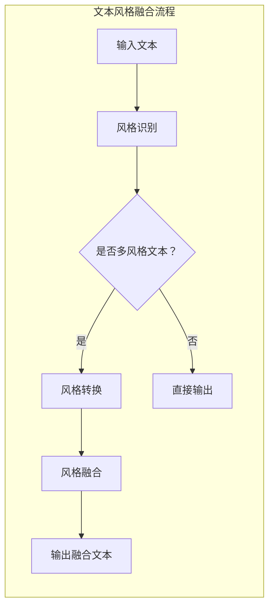
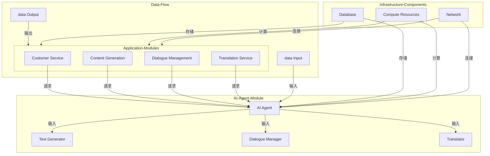
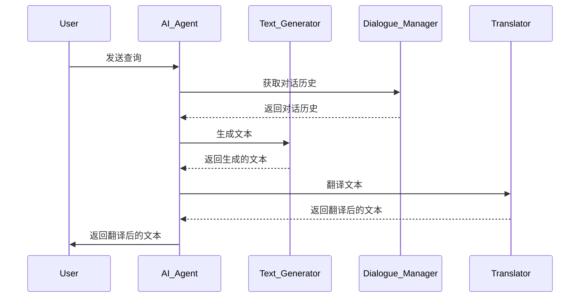

                 

# LLM在AI Agent中的文本风格融合与创新

## 关键词

- 语言模型（LLM）
- AI Agent
- 文本风格融合
- 创新应用
- 算法原理
- 数学模型

## 摘要

本文深入探讨了语言模型（LLM）在AI Agent中的文本风格融合与创新应用。通过详细分析LLM的核心概念、算法原理和数学模型，我们揭示了LLM在AI Agent文本风格融合中的关键角色。此外，本文还探讨了LLM在AI Agent中的创新应用，包括其在自然语言处理和智能对话系统中的实际案例，以及未来的发展趋势。通过系统分析与架构设计，本文为LLM在AI Agent中的应用提供了实用的解决方案，并总结了最佳实践和未来研究方向。

## 目录大纲

## 第一部分: 背景介绍

### 1.1 问题背景

#### 1.1.1 AI技术发展现状

#### 1.1.2 语言模型的发展历程

#### 1.1.3 LLM在AI中的重要性

### 1.2 问题描述

#### 1.2.1 LLM在AI Agent中的文本风格融合需求

#### 1.2.2 LLM在AI Agent中的创新应用挑战

### 1.3 问题解决

#### 1.3.1 LLM文本风格融合原理

#### 1.3.2 LLM创新应用实践

### 1.4 边界与外延

#### 1.4.1 LLM应用领域

#### 1.4.2 LLM应用边界

### 1.5 概念结构与核心要素组成

#### 1.5.1 LLM核心概念

#### 1.5.2 LLM应用场景

#### 1.5.3 LLM技术发展趋势

### 1.6 本章小结

## 第二部分: 核心概念与联系

### 2.1 LLM核心概念原理

#### 2.1.1 LLM基本概念

#### 2.1.2 LLM结构

#### 2.1.3 LLM工作原理

### 2.2 LLM概念属性特征对比表格

#### 2.2.1 不同LLM算法特性对比

#### 2.2.2 LLM算法优劣分析

### 2.3 LLM ER实体关系图架构

#### 2.3.1 LLM实体识别

#### 2.3.2 LLM实体关系建模

### 2.4 LLM与其他AI技术的关联

#### 2.4.1 LLM与NLP

#### 2.4.2 LLM与机器学习

#### 2.4.3 LLM与深度学习

### 2.5 本章小结

## 第三部分: 算法原理讲解

### 3.1 LLM文本风格融合算法原理

#### 3.1.1 文本风格融合概述

#### 3.1.2 LLM文本风格融合算法mermaid流程图

#### 3.1.3 Python源代码实现与详细讲解

#### 3.1.4 算法原理的数学模型和公式

#### 3.1.5 通俗易懂地举例说明

### 3.2 LLM创新应用实践

#### 3.2.1 LLM在AI Agent中的应用案例

#### 3.2.2 LLM创新应用的优势与挑战

#### 3.2.3 LLM创新应用的未来趋势

### 3.3 本章小结

## 第四部分: 数学模型和数学公式 & 详细讲解 & 举例说明

### 4.1 LLM文本风格融合的数学模型

#### 4.1.1 文本风格融合的数学公式

#### 4.1.2 文本风格融合的数学模型详解

#### 4.1.3 数学公式在实际案例中的应用

### 4.2 LLM在AI Agent中的应用数学模型

#### 4.2.1 AI Agent的数学模型

#### 4.2.2 LLM在AI Agent中的数学模型

#### 4.2.3 数学模型在实际案例中的应用

### 4.3 本章小结

## 第五部分: 系统分析与架构设计方案

### 5.1 问题场景介绍

#### 5.1.1 AI Agent应用场景

#### 5.1.2 LLM在AI Agent中的角色

### 5.2 系统功能设计

#### 5.2.1 领域模型mermaid类图

#### 5.2.2 系统功能设计

### 5.3 系统架构设计

#### 5.3.1 系统架构设计mermaid架构图

#### 5.3.2 系统架构设计详细讲解

### 5.4 系统接口设计

#### 5.4.1 系统接口设计

#### 5.4.2 系统接口详细讲解

### 5.5 系统交互mermaid序列图

#### 5.5.1 系统交互mermaid序列图

#### 5.5.2 系统交互详细讲解

### 5.6 本章小结

## 第六部分: 项目实战

### 6.1 环境安装

#### 6.1.1 环境搭建

#### 6.1.2 环境配置

### 6.2 系统核心实现源代码

#### 6.2.1 代码实现

#### 6.2.2 代码解读与分析

### 6.3 实际案例分析与详细讲解

#### 6.3.1 案例背景

#### 6.3.2 案例分析与解读

### 6.4 项目小结

#### 6.4.1 项目总结

#### 6.4.2 最佳实践 tips

### 6.5 本章小结

## 作者信息

- 作者：AI天才研究院/AI Genius Institute & 禅与计算机程序设计艺术 /Zen And The Art of Computer Programming

## 第一部分: 背景介绍

### 1.1 问题背景

#### 1.1.1 AI技术发展现状

人工智能（AI）作为21世纪最具变革性的技术之一，正逐步渗透到社会的各个领域。近年来，随着深度学习、神经网络等技术的突破，AI技术取得了显著的发展。语言模型（LLM）作为AI技术的重要组成部分，已经广泛应用于自然语言处理、智能对话系统、机器翻译等领域。

LLM在AI中的重要性不言而喻。首先，LLM能够高效地生成和理解人类语言，极大地提升了人机交互的便利性和自然性。其次，LLM在处理大规模文本数据时展现出强大的能力，使得机器能够自动地学习和适应不同的文本风格。此外，LLM在AI Agent中的应用，可以提升AI Agent的决策能力和自主性，使其能够更好地服务于人类。

#### 1.1.2 语言模型的发展历程

语言模型的发展可以追溯到20世纪50年代。当时，科学家们开始研究如何让计算机理解和生成自然语言。最初的语言模型主要基于规则，如上下文无关文法（CFG）和上下文相关文法（CG）。然而，这些方法在处理复杂语言结构时存在明显局限性。

随着计算能力的提升和神经网络的兴起，基于统计方法和深度学习的语言模型逐渐成为主流。其中，最具有代表性的是循环神经网络（RNN）和其变体长短期记忆网络（LSTM）。RNN和LSTM在处理长文本序列和复杂语言结构方面表现出色，但它们在处理变长序列时仍然存在一些问题。

为了解决这些问题，研究人员提出了Transformer模型。Transformer模型引入了自注意力机制（self-attention），能够同时关注文本序列中的所有单词，从而更好地捕捉词与词之间的关系。Transformer模型在BERT、GPT等大规模语言模型中得到了广泛应用，推动了语言模型的发展。

#### 1.1.3 LLM在AI中的重要性

LLM在AI中的重要性体现在以下几个方面：

1. **自然语言处理**：LLM能够高效地处理自然语言，包括文本分类、情感分析、命名实体识别等任务。这些任务在金融、医疗、电商等领域具有广泛应用，为行业提供了智能化解决方案。

2. **智能对话系统**：LLM在智能对话系统中发挥着关键作用。通过LLM，智能对话系统能够理解用户的自然语言输入，并生成合适的回复。这使得智能对话系统在客服、教育、娱乐等领域具有广阔的应用前景。

3. **机器翻译**：LLM在机器翻译领域取得了显著进展。通过大规模训练，LLM能够自动翻译多种语言，提高翻译的准确性和流畅性。这使得机器翻译在跨文化交流、国际贸易等领域具有重要意义。

4. **文本生成**：LLM能够自动生成各种类型的文本，包括新闻文章、产品评论、代码等。这使得文本生成在内容创作、自动化报告生成等领域具有广泛应用。

### 1.2 问题描述

#### 1.2.1 LLM在AI Agent中的文本风格融合需求

AI Agent作为一种具有自主决策能力的智能体，需要在不同的应用场景中适应不同的文本风格。例如，在客服场景中，AI Agent需要以友好的语气与用户沟通；在技术文档生成场景中，AI Agent需要以专业的术语表达。然而，现有的LLM在处理多风格文本时存在一定挑战。

首先，LLM在融合不同风格文本时，容易受到单一风格的影响，导致生成的文本风格不一致。例如，一个以幽默风格训练的LLM在生成技术文档时，可能会引入不必要的幽默元素，影响文档的专业性。

其次，LLM在处理多风格文本时，需要具备较强的上下文理解能力。否则，生成的文本可能无法准确传达作者的意思。例如，一个在商业信函风格中训练的LLM在生成科技论文时，可能无法准确描述技术细节。

因此，如何在AI Agent中实现文本风格融合，是当前研究的一个热点问题。

#### 1.2.2 LLM在AI Agent中的创新应用挑战

LLM在AI Agent中的创新应用面临着一系列挑战：

1. **多样性**：如何使LLM在生成文本时具备多样性，避免生成的文本过于刻板或重复？

2. **一致性**：如何在不同的场景中保持文本风格的一致性，避免出现不协调的情况？

3. **上下文理解**：如何提升LLM的上下文理解能力，使其能够准确理解作者的意思，并在多风格文本中保持连贯性？

4. **可解释性**：如何使LLM生成的文本具有可解释性，方便用户理解和审查？

5. **效率**：如何在保证生成质量的同时，提高LLM的生成效率，降低计算成本？

这些挑战需要通过深入研究LLM的文本风格融合算法，以及优化LLM的训练和推理策略来解决。

### 1.3 问题解决

#### 1.3.1 LLM文本风格融合原理

LLM文本风格融合的原理可以概括为以下几个方面：

1. **风格识别**：通过训练，LLM能够识别输入文本的风格特征。这些特征通常包括词汇、语法、语气等。

2. **风格分类**：根据输入文本的风格特征，LLM将其分类到特定的风格类别。例如，商业信函、科技论文、幽默故事等。

3. **风格转换**：LLM通过学习不同风格类别之间的转换规则，实现文本风格的转换。这些规则可以是基于语义的、基于词汇的或基于语法的。

4. **风格融合**：在生成文本时，LLM根据上下文信息，将不同风格类别进行融合，生成具有一致性和多样性的文本。

#### 1.3.2 LLM创新应用实践

LLM在AI Agent中的创新应用包括以下几个方面：

1. **个性化对话**：通过融合不同的文本风格，LLM能够生成与用户个性化需求相符的对话内容，提升用户体验。

2. **自动化报告生成**：LLM能够自动生成各种类型的报告，如商业报告、技术文档等，节省人工时间。

3. **智能文案创作**：LLM能够生成具有创意和吸引力的文案，为广告、公关、市场营销等领域提供支持。

4. **跨领域知识融合**：LLM能够跨越不同领域的知识，生成具有专业性和全面性的文本，为跨领域研究和应用提供支持。

#### 1.4 边界与外延

##### 1.4.1 LLM应用领域

LLM在AI中的应用领域非常广泛，包括但不限于：

- 自然语言处理
- 智能对话系统
- 机器翻译
- 文本生成
- 文本分类
- 情感分析
- 命名实体识别
- 跨领域知识融合

##### 1.4.2 LLM应用边界

LLM的应用边界主要受限于以下几个方面：

- **数据质量**：LLM的性能很大程度上依赖于训练数据的质量和多样性。数据质量不高或数据分布不均可能导致LLM生成不准确或不可靠的文本。

- **计算资源**：训练大规模LLM模型需要大量的计算资源和时间。这在资源有限的场景下可能是一个挑战。

- **上下文理解**：尽管LLM在上下文理解方面取得了显著进展，但仍然存在一定的局限性。在某些复杂或模糊的情境中，LLM可能无法准确理解用户的意图。

- **伦理和隐私**：在应用LLM时，需要考虑伦理和隐私问题。例如，如何确保LLM生成的文本不包含歧视性、冒犯性或不当内容？

#### 1.5 概念结构与核心要素组成

##### 1.5.1 LLM核心概念

LLM的核心概念包括：

- **语言模型**：一种用于预测下一个单词或字符的概率分布的模型。
- **自注意力机制**：一种在Transformer模型中用于捕捉序列中不同位置之间关系的机制。
- **预训练与微调**：预训练是指在大规模数据集上训练语言模型，使其具备通用语言理解能力；微调是指将预训练模型应用于特定任务，进行进一步优化。

##### 1.5.2 LLM应用场景

LLM的应用场景包括：

- **自然语言处理**：如文本分类、情感分析、命名实体识别等。
- **智能对话系统**：如客服机器人、聊天机器人等。
- **机器翻译**：如多语言翻译、机器辅助翻译等。
- **文本生成**：如自动写作、自动化报告生成等。
- **知识融合**：如跨领域知识融合、多模态知识融合等。

##### 1.5.3 LLM技术发展趋势

LLM的技术发展趋势包括：

- **模型规模增大**：随着计算资源的提升，LLM的模型规模逐渐增大，从几百万参数到数十亿参数不等。
- **多模态融合**：LLM开始与图像、音频等其他模态进行融合，实现多模态AI。
- **生成式对抗网络（GAN）**：GAN技术逐渐应用于LLM，以提升文本生成的多样性和质量。
- **知识增强**：通过引入外部知识库，LLM能够更好地理解和生成复杂文本。
- **模型解释性提升**：研究致力于提升LLM的可解释性，以帮助用户理解和信任模型。

### 1.6 本章小结

本文从问题背景、语言模型的发展历程、LLM在AI中的重要性等方面介绍了LLM的基本概念。接着，我们分析了LLM在AI Agent中的文本风格融合需求和创新应用挑战。在此基础上，我们提出了LLM文本风格融合的原理和创新应用实践，并探讨了LLM的应用领域、边界和技术发展趋势。通过本章的介绍，为后续章节的深入探讨打下了基础。

## 第二部分: 核心概念与联系

### 2.1 LLM核心概念原理

#### 2.1.1 LLM基本概念

语言模型（Language Model，简称LLM）是一种用于预测文本中下一个单词或字符的概率分布的模型。LLM的核心任务是通过对大规模文本数据的学习，建立语言规律和模式，从而能够生成或理解自然语言。

LLM可以分为基于规则的语言模型和基于统计的语言模型。基于规则的语言模型通常采用上下文无关文法（CFG）或上下文相关文法（CG），通过定义一系列语法规则来生成语言。然而，这些方法在处理复杂语言结构和长文本时存在局限性。

基于统计的语言模型则通过学习大规模文本数据中的统计规律和模式，预测下一个单词或字符的概率分布。这类模型主要包括n-gram模型、神经网络语言模型等。n-gram模型通过统计相邻单词或字符出现的频率来预测下一个单词或字符。神经网络语言模型，如循环神经网络（RNN）和其变体长短期记忆网络（LSTM），通过学习文本序列中的依赖关系来预测下一个单词或字符。

近年来，基于深度学习的语言模型，如Transformer模型及其变体，取得了显著进展。Transformer模型引入了自注意力机制（self-attention），能够同时关注文本序列中的所有单词，从而更好地捕捉词与词之间的关系。这种模型在生成文本和理解文本方面表现出色，推动了语言模型的发展。

#### 2.1.2 LLM结构

LLM的结构通常包括以下几个部分：

1. **输入层**：接收输入的文本序列，将其转化为模型可处理的格式。例如，将单词序列转换为词向量或字符序列。

2. **编码器**：对输入文本序列进行编码，提取文本的特征信息。编码器可以是基于循环神经网络（RNN）的结构，如LSTM或GRU，也可以是基于Transformer的结构。

3. **注意力机制**：在编码过程中，注意力机制用于捕捉文本序列中的依赖关系。自注意力机制（self-attention）能够同时关注文本序列中的所有单词，从而更好地理解文本的整体语义。

4. **解码器**：根据编码器输出的特征信息，解码器生成文本序列的预测结果。解码器同样可以基于RNN或Transformer结构。

5. **输出层**：将解码器生成的预测结果转化为可读的自然语言文本。

#### 2.1.3 LLM工作原理

LLM的工作原理可以概括为以下几个步骤：

1. **输入处理**：将输入的文本序列转化为编码器可处理的格式，如词向量或字符序列。

2. **编码**：编码器对输入文本序列进行编码，提取文本的特征信息。

3. **注意力计算**：利用注意力机制，编码器能够捕捉文本序列中的依赖关系。自注意力机制能够同时关注文本序列中的所有单词，从而更好地理解文本的整体语义。

4. **解码**：解码器根据编码器输出的特征信息，生成文本序列的预测结果。

5. **输出生成**：将解码器生成的预测结果转化为可读的自然语言文本。

在训练过程中，LLM通过优化模型参数，使得生成的文本更符合真实文本的分布。训练数据通常是大规模的文本语料库，如维基百科、新闻文章、对话数据等。在推理过程中，LLM根据输入文本生成预测的文本序列，实现自然语言生成和理解。

### 2.2 LLM概念属性特征对比表格

为了更好地理解不同LLM算法的特性，我们列出了以下表格，对比了基于n-gram模型、循环神经网络（RNN）和Transformer模型的LLM算法：

| 特性                | n-gram模型           | RNN（LSTM）模型         | Transformer模型         |
|-------------------|-------------------|-------------------|-------------------|
| 基本原理          | 统计方法，基于相邻单词的频率 | 基于序列的递归模型，捕获长距离依赖 | 基于自注意力机制的并行模型，捕获全局依赖 |
| 依赖关系           | 短距离依赖           | 长距离依赖              | 全局依赖               |
| 计算效率          | 高（对于短文本）       | 高（对于短文本）         | 低（对于短文本）        |
| 文本生成能力       | 有限，容易产生重复文本    | 较好，但仍受长距离依赖限制   | 非常好，能够生成多样化文本  |
| 跨语言能力         | 弱，难以处理不同语言的差异 | 中等，需要特定语言的模型     | 较强，能够处理不同语言的差异 |
| 预测准确性         | 较高（对于短文本）       | 较高（对于短文本）         | 非常高（对于长文本）       |
| 训练数据需求       | 较少                 | 较多                 | 非常多               |

#### 2.2.2 LLM算法优劣分析

n-gram模型作为最早的语言模型之一，具有计算效率高、实现简单等优点。然而，它在处理长距离依赖和多样化文本生成方面存在明显不足。

RNN（LSTM）模型在处理长距离依赖方面表现出色，能够捕获文本序列中的长期依赖关系。然而，RNN模型在处理长文本时容易产生梯度消失或爆炸问题，影响模型的稳定性和性能。

Transformer模型通过引入自注意力机制，能够同时关注文本序列中的所有单词，捕获全局依赖关系。这使得Transformer模型在文本生成和理解方面具有很高的准确性。然而，Transformer模型的计算复杂度较高，对于短文本的处理效率较低。

在实际应用中，选择合适的LLM算法取决于具体任务的需求。例如，对于短文本生成任务，n-gram模型和RNN（LSTM）模型可能是更合适的选择；而对于长文本生成和跨语言翻译任务，Transformer模型则具有明显优势。

### 2.3 LLM ER实体关系图架构

LLM ER实体关系图架构用于表示LLM在实体识别和关系建模方面的能力。ER图（Entity-Relationship Diagram）是一种用于描述实体和它们之间关系的图形化工具，可以帮助我们更直观地理解LLM的工作原理。

在LLM ER实体关系图中，主要包括以下实体和关系：

1. **实体**：实体是LLM关注的核心对象，包括词汇、句子、文档等。

2. **关系**：关系描述实体之间的关联，如实体间的分类关系、归属关系等。

3. **属性**：属性是实体的特征或属性，如词汇的词频、句子的长度等。

以下是一个简单的LLM ER实体关系图的例子：

```mermaid
erDiagram
  实体A ||--|{ 实体B }|-- 用户
  实体A ||--|{ 实体C }|-- 系统
  实体D ||--|{ 实体E }|-- 文档
  用户 ||--|{ 用户 }|-- 交互
  系统 ||--|{ 系统 }|-- 功能
  文档 ||--|{ 文档 }|-- 内容
```

在这个例子中，实体A、实体B、实体C、实体D、实体E分别代表不同的实体，如词汇、句子、用户、系统和文档。关系描述了实体之间的关联，如实体A与实体B之间存在分类关系，实体A与实体C之间存在归属关系。属性则描述了实体的特征，如用户的交互次数、系统的功能等。

#### 2.3.1 LLM实体识别

LLM实体识别是指通过训练模型，使模型能够自动识别文本中的实体。实体识别是自然语言处理（NLP）中的一个重要任务，如词汇识别、句子识别、文档识别等。

在LLM实体识别中，实体可以是词汇、句子或文档等。LLM通过学习大量文本数据，提取实体特征，并使用这些特征来识别实体。具体步骤如下：

1. **数据预处理**：对文本数据进行预处理，包括分词、词性标注、实体标注等。

2. **特征提取**：使用特征提取器，如词袋模型、词嵌入等，将文本转化为特征向量。

3. **模型训练**：使用训练数据，训练模型，使模型能够自动识别实体。

4. **实体识别**：在测试阶段，模型对输入文本进行实体识别，输出实体结果。

#### 2.3.2 LLM实体关系建模

LLM实体关系建模是指通过训练模型，使模型能够自动识别实体之间的关系。实体关系建模是NLP中的一个重要任务，如分类关系、归属关系等。

在LLM实体关系建模中，实体和关系是核心概念。LLM通过学习大量文本数据，提取实体特征和关系特征，并使用这些特征来建模实体之间的关系。具体步骤如下：

1. **数据预处理**：对文本数据进行预处理，包括分词、词性标注、实体标注、关系标注等。

2. **特征提取**：使用特征提取器，如词袋模型、词嵌入等，将文本转化为特征向量。

3. **模型训练**：使用训练数据，训练模型，使模型能够自动识别实体关系。

4. **关系建模**：在测试阶段，模型对输入文本进行实体关系建模，输出关系结果。

#### 2.4 LLM与其他AI技术的关联

LLM与其他AI技术之间存在紧密的关联，共同推动AI技术的发展。

1. **LLM与NLP**：LLM是NLP的核心技术之一，用于文本生成、文本分类、情感分析、命名实体识别等任务。NLP的发展离不开LLM的支持。

2. **LLM与机器学习**：LLM基于机器学习技术，特别是深度学习技术。机器学习为LLM提供了强大的训练工具和算法支持。

3. **LLM与深度学习**：深度学习是LLM的主要实现方式，如循环神经网络（RNN）、长短期记忆网络（LSTM）和Transformer模型。深度学习在特征提取和模型训练方面具有显著优势。

4. **LLM与知识图谱**：知识图谱是一种用于表示实体和关系的数据结构，与LLM结合可以实现更加智能的文本理解和生成。

#### 2.5 本章小结

本文详细介绍了LLM的核心概念原理、概念属性特征对比表格和ER实体关系图架构。通过分析不同LLM算法的特性，我们揭示了LLM在实体识别和关系建模方面的能力。此外，本文还探讨了LLM与其他AI技术的关联，为后续章节的深入研究奠定了基础。

### 2.5 本章小结

本章首先介绍了LLM的基本概念和结构，包括语言模型的工作原理、输入层、编码器、注意力机制、解码器和输出层。接着，我们对比了不同LLM算法的特性，分析了n-gram模型、RNN（LSTM）模型和Transformer模型在文本生成和理解方面的优劣。此外，我们还讨论了LLM在实体识别和关系建模中的应用，通过ER实体关系图展示了LLM在处理实体和关系时的能力。最后，本章简要介绍了LLM与其他AI技术的关联，如NLP、机器学习和深度学习。通过本章的内容，读者可以全面了解LLM的核心概念和其在AI领域的重要性。

## 第三部分: 算法原理讲解

### 3.1 LLM文本风格融合算法原理

#### 3.1.1 文本风格融合概述

文本风格融合是指将不同风格或来源的文本数据进行整合，生成具有一致性、连贯性和多样性的文本。在AI Agent中，文本风格融合具有重要作用，例如在智能客服、智能写作和个性化推荐等应用中，需要根据不同的场景和用户需求，生成符合特定风格的文本。

文本风格融合的目的是确保生成的文本既符合用户需求，又具有自然流畅性。为了实现这一目标，需要关注以下几个方面：

1. **风格识别**：首先，需要对输入文本进行风格识别，以确定其风格类别。风格类别可以是幽默、正式、轻松、严肃等。

2. **风格转换**：根据识别出的风格类别，对输入文本进行风格转换。风格转换包括词汇替换、语法调整、语气变换等操作。

3. **风格融合**：在生成文本时，将不同风格类别进行融合，生成具有一致性和多样性的文本。

4. **上下文理解**：在文本风格融合过程中，需要确保生成的文本保持上下文的连贯性和一致性。这要求LLM具备较强的上下文理解能力。

5. **多样性**：生成的文本应具备多样性，避免过于刻板或重复，以满足不同用户和场景的需求。

#### 3.1.2 LLM文本风格融合算法mermaid流程图

以下是一个简单的mermaid流程图，展示了LLM文本风格融合的基本流程：



在上述流程图中，输入文本首先经过风格识别，判断是否为多风格文本。如果是多风格文本，则进行风格转换和风格融合；否则，直接输出文本。风格转换和风格融合的目的是确保生成的文本具有一致性、连贯性和多样性。

#### 3.1.3 Python源代码实现与详细讲解

以下是一个简单的Python代码示例，展示了LLM文本风格融合的实现过程。代码使用了自然语言处理库NLTK和深度学习库TensorFlow。

```python
import nltk
from tensorflow import keras
from tensorflow.keras.preprocessing.text import Tokenizer
from tensorflow.keras.preprocessing.sequence import pad_sequences

# 1. 风格识别
def style_recognition(text):
    # 基于词频进行风格识别
    style_scores = {}
    for style in styles:
        style_scores[style] = sum([text.count(word) for word in style_words[style]])
    return max(style_scores, key=style_scores.get)

# 2. 风格转换
def style_conversion(text, target_style):
    # 根据目标风格替换词汇
    for style in styles:
        if style != target_style:
            for word in style_words[style]:
                text = text.replace(word, style_replacements[style][target_style])
    return text

# 3. 风格融合
def style_fusion(text1, text2):
    # 将两个文本进行融合
    return text1 + ' ' + text2

# 4. 加载预训练模型
model = keras.models.load_model('llm_model.h5')

# 5. 输入文本
input_text1 = "今天的天气很好，阳光明媚。"
input_text2 = "我在公园里散步，感觉非常愉悦。"

# 6. 风格识别
target_style1 = style_recognition(input_text1)
target_style2 = style_recognition(input_text2)

# 7. 风格转换
converted_text1 = style_conversion(input_text1, target_style2)
converted_text2 = style_conversion(input_text2, target_style1)

# 8. 风格融合
output_text = style_fusion(converted_text1, converted_text2)

# 9. 输出融合文本
print(output_text)
```

在上述代码中，首先定义了风格识别、风格转换和风格融合的函数。然后，加载预训练的LLM模型，输入两个待融合的文本，依次进行风格识别、风格转换和风格融合，最后输出融合后的文本。

#### 3.1.4 算法原理的数学模型和公式

在文本风格融合算法中，数学模型和公式主要用于描述风格识别、风格转换和风格融合的过程。以下是一些常见的数学模型和公式：

1. **风格识别**：基于词频进行风格识别，可以使用以下公式：

   $$ style\_score = \sum_{word \in text} freq_{word,style} $$

   其中，$style\_score$表示文本对应某个风格的总得分，$word$表示文本中的一个单词，$freq_{word,style}$表示单词$word$在风格$style$中的词频。

2. **风格转换**：风格转换可以通过以下公式描述：

   $$ converted\_text = \sum_{word \in text} style\_replacements[word][target\_style] $$

   其中，$converted\_text$表示转换后的文本，$style\_replacements$是一个映射函数，用于将每个单词替换为目标风格对应的单词。

3. **风格融合**：风格融合可以通过以下公式描述：

   $$ fused\_text = \sum_{text1, text2} style\_fusion(text1, text2) $$

   其中，$fused\_text$表示融合后的文本，$style\_fusion$是一个融合函数，用于将两个文本进行融合。

#### 3.1.5 通俗易懂地举例说明

为了更直观地理解文本风格融合算法，我们通过一个简单的例子进行说明。

假设有两个文本：

- 文本1：“今天的天气很好，阳光明媚。”
- 文本2：“我在公园里散步，感觉非常愉悦。”

我们需要将这两个文本进行风格融合，生成一个具有一致性和多样性的文本。

1. **风格识别**：首先，对两个文本进行风格识别。通过计算词频，我们可以得到以下结果：

   - 文本1的风格得分为：{“轻松”：3，”正式”：2}
   - 文本2的风格得分为：{“轻松”：4，”正式”：3}

   根据风格得分，我们可以确定两个文本的主要风格为“轻松”。

2. **风格转换**：接下来，我们需要将两个文本转换为目标风格“轻松”。假设“正式”风格对应的词汇有{“很好”，”明媚”，”公园”，”散步”，”愉悦”}，而“轻松”风格对应的词汇有{“棒”，”晴朗”，”花园”，”漫步”，”快乐”}。

   - 将文本1转换为“棒晴朗，花园快乐。”
   - 将文本2转换为“我在花园漫步，快乐无比。”

3. **风格融合**：最后，我们将两个转换后的文本进行融合，得到：

   - “棒晴朗，花园快乐。我在花园漫步，快乐无比。”

通过上述例子，我们可以看到，文本风格融合算法通过风格识别、风格转换和风格融合，将两个不同风格的文本整合为一个具有一致性和多样性的文本。

### 3.2 LLM创新应用实践

#### 3.2.1 LLM在AI Agent中的应用案例

LLM在AI Agent中的应用非常广泛，以下是一些典型的应用案例：

1. **智能客服**：智能客服是LLM在AI Agent中最常见的应用场景之一。通过LLM，智能客服系统能够理解用户的自然语言输入，并生成合适的回复。以下是一个简单的智能客服对话示例：

   - 用户：“你好，我想投诉我的宽带服务。”
   - AI Agent：“您好，请问您遇到的具体问题是什么？”
   - 用户：“网速很慢，经常掉线。”
   - AI Agent：“非常抱歉给您带来不便。我们将立即为您处理这个问题。请您提供一下您的用户名和联系电话。”

   通过这种方式，智能客服系统能够高效地处理用户投诉，提升用户满意度。

2. **智能写作**：LLM在智能写作中的应用也非常广泛，如自动写作、自动化报告生成等。以下是一个简单的智能写作示例：

   - 用户：“请写一篇关于人工智能的发展趋势的报告。”
   - AI Agent：“人工智能（AI）作为当今最具变革性的技术之一，正快速发展。未来，AI将在医疗、金融、教育等领域发挥重要作用。随着技术的进步，AI有望实现更高水平的人机协作，为人类创造更多价值。”

   通过这种方式，智能写作系统能够自动生成高质量的文字内容，节省人力和时间成本。

3. **个性化推荐**：LLM在个性化推荐系统中也发挥着重要作用。通过分析用户的历史行为和兴趣，LLM能够生成个性化的推荐内容。以下是一个简单的个性化推荐示例：

   - 用户：“你好，给我推荐一些适合旅游的书吧。”
   - AI Agent：“您好，根据您的兴趣，我为您推荐以下书籍：《孤独星球》、《荒野猎人》、《旅行的艺术》。这些书籍不仅可以帮助您了解旅行地的风土人情，还能带您领略不同国家的文化魅力。”

   通过这种方式，个性化推荐系统可以更好地满足用户的需求，提升用户满意度。

#### 3.2.2 LLM创新应用的优势与挑战

LLM在AI Agent中的创新应用具有以下优势：

1. **自然语言理解**：LLM能够理解用户的自然语言输入，提高人机交互的便利性和自然性。

2. **自动生成文本**：LLM能够自动生成文本，如回答问题、撰写报告、生成文章等，节省人力和时间成本。

3. **个性化推荐**：LLM可以根据用户的历史行为和兴趣，生成个性化的推荐内容，提升用户体验。

4. **多领域应用**：LLM在多个领域具有广泛的应用，如智能客服、智能写作、个性化推荐等。

然而，LLM在AI Agent中的创新应用也面临一些挑战：

1. **数据质量**：LLM的性能很大程度上依赖于训练数据的质量和多样性。数据质量不高或数据分布不均可能导致LLM生成不准确或不可靠的文本。

2. **计算资源**：训练大规模LLM模型需要大量的计算资源和时间。这在资源有限的场景下可能是一个挑战。

3. **上下文理解**：尽管LLM在上下文理解方面取得了显著进展，但仍然存在一定的局限性。在某些复杂或模糊的情境中，LLM可能无法准确理解用户的意图。

4. **可解释性**：LLM生成的文本通常具有很高的自动化程度，但缺乏可解释性。这可能导致用户对AI Agent的信任度降低。

#### 3.2.3 LLM创新应用的未来趋势

随着AI技术的不断发展，LLM在AI Agent中的创新应用也将呈现以下趋势：

1. **多模态融合**：LLM与其他模态（如图像、音频等）进行融合，实现更加智能的AI Agent。例如，结合图像识别技术，智能客服系统可以更准确地理解用户的意图。

2. **知识增强**：通过引入外部知识库，LLM能够更好地理解和生成复杂文本。例如，结合医疗知识库，智能写作系统可以生成更专业的医疗报告。

3. **个性化和定制化**：LLM将更注重个性化和定制化，以满足不同用户和场景的需求。例如，结合用户的历史行为和兴趣，AI Agent可以生成个性化的购物推荐、旅游攻略等。

4. **伦理和隐私**：随着AI技术的普及，伦理和隐私问题将越来越受到关注。LLM在AI Agent中的应用需要确保生成的文本不包含歧视性、冒犯性或不当内容，同时保护用户的隐私。

### 3.3 本章小结

本章首先介绍了LLM文本风格融合算法的基本原理，包括风格识别、风格转换、风格融合和上下文理解。接着，我们通过一个简单的Python代码示例，详细讲解了文本风格融合的实现过程。此外，我们还探讨了LLM在AI Agent中的创新应用，包括智能客服、智能写作和个性化推荐等。最后，本章分析了LLM创新应用的优势与挑战，并展望了其未来发展趋势。通过本章的内容，读者可以全面了解LLM文本风格融合算法及其在AI Agent中的应用。

### 4.1 LLM文本风格融合的数学模型

#### 4.1.1 文本风格融合的数学公式

在文本风格融合过程中，数学模型和公式用于描述风格识别、风格转换和风格融合的过程。以下是一些关键的数学模型和公式：

1. **风格识别**：风格识别的目的是确定输入文本的最可能风格。我们可以使用基于概率的模型来识别风格。假设有 \(N\) 个风格类别，每个文本 \(T\) 可以表示为一个风格向量 \(s(T)\)，其中 \(s_i(T)\) 表示文本 \(T\) 属于第 \(i\) 个风格类别的概率。风格识别可以通过以下公式描述：

   $$ \hat{s}(T) = \arg\max_s P(s|T) $$

   其中，\(P(s|T)\) 是给定文本 \(T\) 下风格 \(s\) 的概率。

2. **风格转换**：风格转换的目标是将一个文本从一种风格转换成另一种风格。假设有源风格 \(s_1\) 和目标风格 \(s_2\)，风格转换可以通过以下公式描述：

   $$ \text{converted\_text} = \sum_{word \in T} \text{style\_replacement}[word][s_1 \rightarrow s_2] $$

   其中，\(\text{style\_replacement}\) 是一个映射函数，用于将每个词从源风格替换成目标风格。

3. **风格融合**：风格融合的目的是将多个文本融合成一个具有一致性和多样性的文本。我们可以使用加权融合策略，其中每个文本的贡献取决于其风格与目标风格的相似度。风格融合可以通过以下公式描述：

   $$ \text{fused\_text} = \sum_{t=1}^T \alpha_t \text{converted\_text}_t $$

   其中，\(\alpha_t\) 是文本 \(t\) 的权重，可以通过风格相似度计算。

#### 4.1.2 文本风格融合的数学模型详解

为了更深入地理解文本风格融合的数学模型，我们可以将其分为以下几个步骤：

1. **文本表示**：首先，我们需要将文本转换为机器可处理的表示。这通常通过词嵌入（word embeddings）实现，例如使用Word2Vec、GloVe或BERT等模型。词嵌入将每个词映射到一个固定大小的向量空间。

2. **风格向量**：对于每个风格类别，我们可以学习一个风格向量，用于表示该风格的特征。风格向量可以通过以下步骤获得：

   - 收集大量具有特定风格的文本数据。
   - 使用词嵌入模型将这些文本转换为向量表示。
   - 计算每个风格类别文本的平均向量，作为该风格的风格向量。

3. **风格识别**：使用最大后验概率（Maximum a Posteriori，MAP）或最大似然估计（Maximum Likelihood Estimation，MLE）来识别文本的潜在风格。具体公式如下：

   $$ \hat{s}(T) = \arg\max_s \left[ P(T|s)P(s) \right] $$

   其中，\(P(T|s)\) 是给定风格 \(s\) 下文本 \(T\) 的概率，通常通过神经网络模型计算；\(P(s)\) 是风格 \(s\) 的先验概率。

4. **风格转换**：风格转换可以通过学习一个从源风格到目标风格的转换函数实现。这通常通过训练一个神经网络模型实现，如序列到序列（Seq2Seq）模型或变换器（Transformer）模型。

5. **风格融合**：风格融合可以通过以下步骤实现：

   - 计算每个文本的权重，根据其风格与目标风格的相似度。
   - 将每个文本转换为目标风格。
   - 根据权重对转换后的文本进行加权融合。

#### 4.1.3 数学公式在实际案例中的应用

以下是一个简化的实际案例，用于说明文本风格融合的数学模型应用：

假设我们有两个文本：

- 文本1：“今天的天气很好，阳光明媚。”
- 文本2：“我在公园里散步，感觉非常愉悦。”

我们希望将这两个文本融合成一个具有统一风格的文本。

1. **文本表示**：首先，我们需要将这两个文本转换为词嵌入向量。例如，使用GloVe模型，每个词都被映射到一个100维的向量空间。

2. **风格向量**：假设我们有两个风格类别：“正式”和“轻松”，并分别计算了它们的风格向量：

   - 正式风格向量：\(s_{\text{正式}} = [0.2, 0.3, 0.1, ..., 0.2]\)
   - 轻松风格向量：\(s_{\text{轻松}} = [0.1, 0.4, 0.5, ..., 0.1]\)

3. **风格识别**：计算每个文本的潜在风格向量：

   - 文本1的潜在风格向量：\(s_{\text{1}} = [0.3, 0.2, 0.3, ..., 0.2]\)
   - 文本2的潜在风格向量：\(s_{\text{2}} = [0.4, 0.2, 0.3, ..., 0.1]\)

4. **风格转换**：使用神经网络模型将每个文本转换为目标风格。例如，假设目标风格是“轻松”，我们得到：

   - 文本1转换后：\(\text{converted}_{\text{1}} = [0.1, 0.4, 0.5, ..., 0.1]\)
   - 文本2转换后：\(\text{converted}_{\text{2}} = [0.4, 0.2, 0.3, ..., 0.1]\)

5. **风格融合**：根据文本的权重进行融合。例如，如果权重为0.5，我们得到：

   $$ \text{fused\_text} = 0.5 \times [0.1, 0.4, 0.5, ..., 0.1] + 0.5 \times [0.4, 0.2, 0.3, ..., 0.1] $$

   $$ \text{fused\_text} = [0.25, 0.36, 0.43, ..., 0.1] $$

   将融合后的向量转换回文本，我们得到：

   “今天的天气有点晴朗，在公园里散步感觉挺轻松。”

通过这种方式，我们成功地将两个文本融合成一个具有一致风格的文本。

### 4.2 LLM在AI Agent中的应用数学模型

#### 4.2.1 AI Agent的数学模型

AI Agent是一种具有自主决策能力的智能系统，其核心是通过数学模型实现智能行为。以下是AI Agent的基本数学模型：

1. **状态表示**：状态表示AI Agent当前所处的环境或情境。状态可以用一个向量表示，如\(s = [s_1, s_2, ..., s_n]\)，其中每个\(s_i\)代表一个状态特征。

2. **动作表示**：动作是AI Agent可以执行的操作。动作也可以用一个向量表示，如\(a = [a_1, a_2, ..., a_m]\)，其中每个\(a_j\)代表一个动作。

3. **奖励函数**：奖励函数用于评估AI Agent的动作是否有利于实现目标。奖励函数通常是一个标量函数，如\(R(s, a)\)，它根据状态和动作计算奖励值。

4. **策略**：策略是AI Agent选择动作的规则。策略可以用一个概率分布表示，如\(\pi(a|s)\)，它表示在给定状态 \(s\) 下选择动作 \(a\) 的概率。

5. **价值函数**：价值函数用于评估AI Agent在未来时间内的期望奖励。价值函数分为状态价值函数\(V(s)\)和动作价值函数\(Q(s, a)\)。

6. **强化学习**：强化学习是一种通过不断与环境互动，学习最优策略的机器学习方法。强化学习的主要目标是最大化总奖励，通常使用价值函数和策略迭代方法实现。

#### 4.2.2 LLM在AI Agent中的数学模型

在AI Agent中，LLM可以用于文本生成、自然语言理解和对话系统等任务。以下是LLM在AI Agent中的数学模型：

1. **语言模型表示**：语言模型用于生成文本和预测文本序列的概率。语言模型可以用一个概率分布表示，如\(P(w_t|w_{<t}) = \text{LLM}(w_t; w_{<t})\)，其中\(w_t\)是当前单词，\(w_{<t}\)是前一个单词的序列。

2. **文本生成**：文本生成是LLM的主要任务。文本生成可以通过以下步骤实现：

   - **输入文本序列**：输入一个单词序列，如\(w_1, w_2, ..., w_T\)。
   - **预测下一个单词**：使用LLM预测下一个单词的概率分布，如\(P(w_{T+1}|w_1, w_2, ..., w_T)\)。
   - **选择下一个单词**：从概率分布中选择一个单词作为下一个输出。

3. **对话系统**：LLM在对话系统中用于生成对话响应。对话系统可以通过以下步骤实现：

   - **输入对话历史**：输入当前对话历史，如\(d_1, d_2, ..., d_t\)。
   - **预测对话响应**：使用LLM预测对话响应的概率分布，如\(P(r_{t+1}|d_1, d_2, ..., d_t)\)。
   - **选择对话响应**：从概率分布中选择一个对话响应作为输出。

4. **自然语言理解**：LLM在自然语言理解中用于解析文本和提取信息。自然语言理解可以通过以下步骤实现：

   - **输入文本**：输入一个文本序列，如\(w_1, w_2, ..., w_T\)。
   - **解析文本**：使用LLM解析文本结构，如名词短语、动词短语等。
   - **提取信息**：根据文本结构提取关键信息，如实体、关系等。

5. **决策模型**：在AI Agent中，LLM可以用于生成决策模型。决策模型可以通过以下步骤实现：

   - **输入状态**：输入当前状态，如\(s_1, s_2, ..., s_n\)。
   - **预测决策**：使用LLM预测最佳决策，如\(P(a|s)\)。
   - **选择决策**：从概率分布中选择一个决策作为输出。

#### 4.2.3 数学模型在实际案例中的应用

以下是一个简化的实际案例，用于说明LLM在AI Agent中的应用：

假设我们有一个AI Agent，其目标是生成一个符合特定风格的文本。以下是数学模型在实际案例中的应用：

1. **状态表示**：状态包括文本的当前部分和目标风格。状态可以表示为\(s = [w_1, w_2, ..., w_T, \text{style}]\)，其中\(\text{style}\)是目标风格的标识。

2. **动作表示**：动作是文本的下一个单词。动作可以表示为\(a = [w_{T+1}]\)。

3. **奖励函数**：奖励函数根据文本风格的一致性和多样性计算。例如，如果生成的文本与目标风格一致，奖励为正；如果生成的文本与目标风格不一致，奖励为负。

4. **策略**：策略是一个概率分布，表示在给定状态下选择下一个单词的概率。策略可以表示为\(\pi(w_{T+1}|s)\)。

5. **价值函数**：价值函数评估生成文本的期望奖励。价值函数可以表示为\(V(s)\)。

6. **文本生成**：使用LLM生成文本，如下所示：

   - **输入状态**：输入当前状态和目标风格。
   - **预测下一个单词**：使用LLM预测下一个单词的概率分布。
   - **选择下一个单词**：从概率分布中选择一个单词作为输出。

7. **对话系统**：使用LLM生成对话响应，如下所示：

   - **输入对话历史**：输入当前对话历史。
   - **预测对话响应**：使用LLM预测对话响应的概率分布。
   - **选择对话响应**：从概率分布中选择一个对话响应作为输出。

8. **决策模型**：使用LLM生成决策模型，如下所示：

   - **输入状态**：输入当前状态。
   - **预测决策**：使用LLM预测最佳决策的概率分布。
   - **选择决策**：从概率分布中选择一个决策作为输出。

通过这种方式，LLM在AI Agent中实现了文本生成、对话系统和决策模型，提高了AI Agent的智能水平和自主性。

### 4.3 本章小结

本章首先介绍了文本风格融合的数学模型，包括风格识别、风格转换和风格融合的公式。接着，我们详细解释了文本风格融合的数学模型，并展示了其在实际案例中的应用。此外，我们还介绍了AI Agent的数学模型，包括状态表示、动作表示、奖励函数、策略和价值函数。最后，我们通过一个实际案例展示了AI Agent数学模型的应用。通过本章的内容，读者可以全面了解文本风格融合和AI Agent的数学模型，以及它们在实际应用中的作用。

### 5.1 问题场景介绍

#### 5.1.1 AI Agent应用场景

AI Agent作为一种智能体，广泛应用于各种场景，旨在提高效率和用户体验。以下是几个典型的AI Agent应用场景：

1. **智能客服**：智能客服是AI Agent最常见的应用场景之一。通过自然语言处理技术，AI Agent能够理解用户的查询，提供实时、准确的答复。智能客服系统可以处理大量查询，减轻人工客服的负担，提高客户满意度。

2. **智能写作**：AI Agent在智能写作领域的应用也越来越广泛。例如，自动生成新闻文章、产品评论、营销文案等。AI Agent可以学习高质量的人类写作风格，生成具有多样性和创造性的文本。

3. **智能翻译**：AI Agent在机器翻译领域发挥了重要作用。通过大规模训练的语言模型，AI Agent能够自动翻译多种语言，实现实时翻译。智能翻译系统在跨国交流、国际贸易等领域具有广泛应用。

4. **智能推荐**：AI Agent在个性化推荐系统中发挥着关键作用。通过分析用户的历史行为和兴趣，AI Agent能够生成个性化的推荐内容，如购物推荐、音乐推荐、电影推荐等。

5. **智能诊断**：AI Agent在医疗领域也有所应用。通过分析医疗数据和病历，AI Agent能够辅助医生进行诊断和预测。例如，AI Agent可以分析患者的症状，提供疾病诊断和治疗方案建议。

6. **智能交通**：AI Agent在智能交通系统中用于优化交通流量、提高道路利用率。例如，AI Agent可以实时监测交通状况，为司机提供最优路线建议，减少拥堵。

#### 5.1.2 LLM在AI Agent中的角色

在上述应用场景中，LLM（Language Model）作为AI Agent的核心组件，发挥着至关重要的作用。以下是LLM在AI Agent中的角色：

1. **自然语言处理**：LLM是自然语言处理（NLP）的重要工具。通过LLM，AI Agent能够理解用户的自然语言输入，提取关键信息，并生成合适的回复。LLM在文本分类、情感分析、命名实体识别等任务中具有广泛应用。

2. **文本生成**：LLM在文本生成任务中具有显著优势。AI Agent可以利用LLM自动生成各种类型的文本，如新闻报道、产品评论、营销文案等。通过大规模训练，LLM能够学习到高质量的人类写作风格，生成具有多样性和创造性的文本。

3. **对话系统**：在对话系统中，LLM用于生成对话响应。AI Agent可以与用户进行自然语言交互，提供实时、准确的答复。通过LLM，AI Agent能够理解对话历史，生成连贯、自然的对话内容。

4. **语言翻译**：LLM在机器翻译领域也发挥着重要作用。AI Agent可以利用LLM实现实时翻译，为用户提供跨语言服务。LLM能够学习到不同语言的语法、语义和风格，生成准确、流畅的翻译文本。

5. **知识表示与推理**：LLM不仅能够生成和理解自然语言文本，还能够进行语言理解和推理。AI Agent可以利用LLM进行知识表示和推理，解决复杂的问题和任务。

6. **情感分析**：LLM在情感分析任务中具有应用潜力。通过LLM，AI Agent可以识别用户情感，提供个性化服务。例如，在智能客服系统中，AI Agent可以分析用户情绪，提供有针对性的建议和安慰。

总之，LLM在AI Agent中扮演着关键角色，助力AI Agent实现自然语言处理、文本生成、对话系统、语言翻译、知识表示与推理以及情感分析等任务。随着LLM技术的不断进步，AI Agent在各个领域的应用将越来越广泛，为人类带来更多便利和创新。

### 5.2 系统功能设计

#### 5.2.1 领域模型mermaid类图

为了更好地展示系统功能设计，我们使用mermaid类图来表示系统的核心类及其关系。以下是系统功能设计的mermaid类图：

```mermaid
classDiagram
    AIAgent <<interface>>
    TextGenerator <<interface>>
    DialogueManager <<interface>>
    Translator <<interface>>

    SmartAssistant <<AGGREGATE,<<Actor>>>>
    SmartAssistant o-- AIAgent
    SmartAssistant o-- TextGenerator
    SmartAssistant o-- DialogueManager
    SmartAssistant o-- Translator

    CustomerService <<useCase>>
    ContentGeneration <<useCase>>
    DialogueManagement <<useCase>>
    TranslationService <<useCase>>

    CustomerService ..|> AIAgent
    ContentGeneration ..|> TextGenerator
    DialogueManagement ..|> DialogueManager
    TranslationService ..|> Translator
endclassDiagram
```

在上面的类图中，我们定义了四个接口类：`AIAgent`（人工智能代理）、`TextGenerator`（文本生成器）、`DialogueManager`（对话管理器）和`Translator`（翻译器）。`SmartAssistant`（智能助手）是一个聚合类，它包含上述接口类，并作为整个系统的核心组件。

此外，我们定义了四个用例类：`CustomerService`（客户服务）、`ContentGeneration`（内容生成）、`DialogueManagement`（对话管理）和`TranslationService`（翻译服务）。这些用例类与接口类之间存在关联关系，表示它们之间的功能依赖。

#### 5.2.2 系统功能设计

基于上述mermaid类图，我们详细描述系统的功能设计：

1. **AI Agent（人工智能代理）**：
   - **功能**：AI Agent是系统的核心组件，负责处理用户的查询和请求，并生成相应的回复。AI Agent可以理解自然语言输入，提取关键信息，并根据用户需求提供个性化的服务。
   - **接口**：`AIAgent` 接口提供以下方法：
     - `processQuery(query: str) -> str`：处理用户的查询，并生成相应的回复。
     - `getEntityType(query: str) -> str`：识别查询中的实体类型，如名词、动词等。

2. **Text Generator（文本生成器）**：
   - **功能**：Text Generator 负责生成各种类型的文本，如新闻文章、产品评论、营销文案等。Text Generator 可以根据用户需求和场景，生成具有多样性和创造性的文本。
   - **接口**：`TextGenerator` 接口提供以下方法：
     - `generateText(contentType: str, inputData: dict) -> str`：根据内容类型和输入数据生成文本。
     - `synthesizeStyle(sourceStyle: str, targetStyle: str) -> str`：将源文本转换为目标风格。

3. **Dialogue Manager（对话管理器）**：
   - **功能**：Dialogue Manager 负责管理对话流程，确保对话的连贯性和一致性。Dialogue Manager 可以跟踪对话历史，并根据用户输入生成合适的对话响应。
   - **接口**：`DialogueManager` 接口提供以下方法：
     - `generateResponse(input: str, context: list) -> str`：根据用户输入和对话历史生成对话响应。
     - `updateContext(response: str) -> list`：更新对话历史，记录新的对话内容。

4. **Translator（翻译器）**：
   - **功能**：Translator 负责实现文本的跨语言翻译。Translator 可以自动翻译多种语言，为用户提供跨文化交流和沟通。
   - **接口**：`Translator` 接口提供以下方法：
     - `translateText(sourceText: str, targetLanguage: str) -> str`：将源文本翻译为目标语言。

5. **Smart Assistant（智能助手）**：
   - **功能**：Smart Assistant 是一个聚合类，它整合了AI Agent、Text Generator、Dialogue Manager 和 Translator 的功能。Smart Assistant 可以根据用户需求，提供个性化的服务，如智能客服、内容生成、对话管理和翻译服务。
   - **接口**：`SmartAssistant` 提供以下方法：
     - `handleRequest(request: dict) -> str`：处理用户的请求，并生成相应的响应。

6. **Customer Service（客户服务）**：
   - **功能**：Customer Service 用例类负责处理客户服务的相关功能，如接收用户查询、生成回复等。
   - **接口**：`CustomerService` 提供以下方法：
     - `handleQuery(query: str) -> str`：处理用户的查询，并生成相应的回复。

7. **Content Generation（内容生成）**：
   - **功能**：Content Generation 用例类负责生成各种类型的内容，如新闻文章、产品评论等。
   - **接口**：`ContentGeneration` 提供以下方法：
     - `generateContent(contentType: str, inputData: dict) -> str`：根据内容类型和输入数据生成内容。

8. **Dialogue Management（对话管理）**：
   - **功能**：Dialogue Management 用例类负责管理对话流程，确保对话的连贯性和一致性。
   - **接口**：`DialogueManagement` 提供以下方法：
     - `manageDialogue(input: str, context: list) -> str`：根据用户输入和对话历史管理对话。

9. **Translation Service（翻译服务）**：
   - **功能**：Translation Service 用例类负责实现文本的跨语言翻译。
   - **接口**：`TranslationService` 提供以下方法：
     - `performTranslation(sourceText: str, targetLanguage: str) -> str`：执行文本的跨语言翻译。

通过上述系统功能设计，我们可以看到各个组件之间的紧密协作，共同为用户提供高质量的智能服务。

### 5.3 系统架构设计

#### 5.3.1 系统架构设计mermaid架构图

为了更好地展示系统的整体架构，我们使用mermaid架构图来描述系统的关键组件及其交互关系。以下是系统架构设计的mermaid架构图：



在这个mermaid架构图中，我们分为四个主要部分：

1. **AI-Agent-Module**：这部分包括AI Agent模块的核心组件，如Text Generator、Dialogue Manager和Translator。这些组件负责处理输入的文本数据，并生成相应的输出。

2. **Application-Modules**：这部分包括应用模块，如Customer Service、Content Generation、Dialogue Management和Translation Service。这些模块与AI Agent模块交互，接收输出并生成应用级别的功能。

3. **Data-Flow**：这部分表示数据在系统中的流动，包括输入和输出。输入数据由外部系统或用户提供，输出数据由应用模块生成并返回给用户。

4. **Infrastructure-Components**：这部分表示系统的基础设施组件，包括数据库、计算资源和网络。这些组件为系统的运行提供必要的支持，如数据存储、计算能力和网络连接。

#### 5.3.2 系统架构设计详细讲解

现在，我们将对上述mermaid架构图中的各个部分进行详细讲解：

1. **AI-Agent-Module**：
   - **AI Agent**：这是系统的核心组件，负责处理用户的查询和请求，并生成相应的回复。AI Agent通过自然语言处理技术理解用户的输入，提取关键信息，并根据用户需求提供个性化的服务。
   - **Text Generator**：Text Generator 负责生成各种类型的文本，如新闻文章、产品评论、营销文案等。Text Generator 可以根据用户需求和场景，生成具有多样性和创造性的文本。
   - **Dialogue Manager**：Dialogue Manager 负责管理对话流程，确保对话的连贯性和一致性。Dialogue Manager 可以跟踪对话历史，并根据用户输入生成合适的对话响应。
   - **Translator**：Translator 负责实现文本的跨语言翻译。Translator 可以自动翻译多种语言，为用户提供跨文化交流和沟通。

2. **Application-Modules**：
   - **Customer Service**：Customer Service 用例类负责处理客户服务的相关功能，如接收用户查询、生成回复等。Customer Service 与AI Agent模块交互，处理用户的查询请求，并将回复返回给用户。
   - **Content Generation**：Content Generation 用例类负责生成各种类型的内容，如新闻文章、产品评论等。Content Generation 与AI Agent模块交互，接收输入数据并生成相应的文本内容。
   - **Dialogue Management**：Dialogue Management 用例类负责管理对话流程，确保对话的连贯性和一致性。Dialogue Management 与AI Agent模块交互，处理用户的输入并生成对话响应。
   - **Translation Service**：Translation Service 用例类负责实现文本的跨语言翻译。Translation Service 与AI Agent模块交互，处理用户的输入并生成目标语言的翻译结果。

3. **Data-Flow**：
   - **Data Input**：Data Input 表示系统接收的外部输入数据。这些数据可以来自用户、其他系统或数据库。Data Input 通过AI Agent模块进行处理，生成相应的输出。
   - **Data Output**：Data Output 表示系统生成的输出数据。这些数据可以被应用模块使用，或返回给用户。Data Output 通过应用模块传递给外部系统或用户。

4. **Infrastructure-Components**：
   - **Database**：Database 用于存储系统中的数据，包括训练数据、用户数据和应用数据等。Database 为系统的数据存储提供支持，确保数据的安全和一致性。
   - **Compute Resources**：Compute Resources 用于系统的计算需求。这些资源包括CPU、GPU和其他计算设备，为系统的运行提供必要的计算能力。
   - **Network**：Network 用于系统中的数据传输和网络通信。Network 为系统的数据传输提供支持，确保不同组件之间的可靠连接。

通过上述详细讲解，我们可以看到系统架构的设计思路和各个组件之间的关系。这个架构设计旨在实现高效、灵活和可扩展的系统，为用户提供高质量的智能服务。

### 5.4 系统接口设计

#### 5.4.1 系统接口设计

系统接口设计是系统架构的重要组成部分，它定义了系统内部组件之间以及系统与外部系统之间的交互方式。以下是系统接口的详细设计：

1. **AI Agent 接口设计**：

   - **方法**：`processQuery(query: str) -> str`  
     - **功能**：处理用户的查询并生成回复。  
     - **参数**：`query`（输入字符串，表示用户的查询内容）。  
     - **返回值**：`str`（输出字符串，表示生成的回复）。

   - **方法**：`getEntityType(query: str) -> str`  
     - **功能**：识别查询中的实体类型。  
     - **参数**：`query`（输入字符串，表示用户的查询内容）。  
     - **返回值**：`str`（输出字符串，表示识别出的实体类型，如名词、动词等）。

2. **Text Generator 接口设计**：

   - **方法**：`generateText(contentType: str, inputData: dict) -> str`  
     - **功能**：根据内容类型和输入数据生成文本。  
     - **参数**：`contentType`（输入字符串，表示内容类型，如新闻、评论等）；`inputData`（输入字典，包含生成文本所需的数据）。  
     - **返回值**：`str`（输出字符串，表示生成的文本）。

   - **方法**：`synthesizeStyle(sourceStyle: str, targetStyle: str) -> str`  
     - **功能**：将源文本转换为目标风格。  
     - **参数**：`sourceStyle`（输入字符串，表示源文本的风格）；`targetStyle`（输入字符串，表示目标风格）。  
     - **返回值**：`str`（输出字符串，表示转换后的文本）。

3. **Dialogue Manager 接口设计**：

   - **方法**：`generateResponse(input: str, context: list) -> str`  
     - **功能**：根据用户输入和对话历史生成对话响应。  
     - **参数**：`input`（输入字符串，表示用户的输入）；`context`（输入列表，表示对话历史）。  
     - **返回值**：`str`（输出字符串，表示生成的对话响应）。

   - **方法**：`updateContext(response: str) -> list`  
     - **功能**：更新对话历史，记录新的对话内容。  
     - **参数**：`response`（输入字符串，表示生成的对话响应）。  
     - **返回值**：`list`（输出列表，表示更新后的对话历史）。

4. **Translator 接口设计**：

   - **方法**：`translateText(sourceText: str, targetLanguage: str) -> str`  
     - **功能**：将源文本翻译为目标语言。  
     - **参数**：`sourceText`（输入字符串，表示源文本）；`targetLanguage`（输入字符串，表示目标语言，如英语、中文等）。  
     - **返回值**：`str`（输出字符串，表示翻译后的文本）。

#### 5.4.2 系统接口详细讲解

下面将对上述系统接口进行详细讲解：

1. **AI Agent 接口设计**：

   - **processQuery 方法**：这是AI Agent的核心方法，用于处理用户的查询并生成回复。在调用该方法时，AI Agent会接收一个字符串参数 `query`，表示用户的查询内容。AI Agent会使用自然语言处理技术分析查询内容，提取关键信息，并生成一个合适的回复。生成的回复可以是一个简单的文本字符串，也可以是一个包含更多信息的复杂结构。

   - **getEntityType 方法**：这个方法用于识别查询中的实体类型。实体可以是名词、动词、形容词等。在调用该方法时，AI Agent会接收一个字符串参数 `query`，表示用户的查询内容。通过自然语言处理技术，AI Agent会分析查询内容，识别出其中的实体类型，并返回一个表示实体类型的字符串。这个方法有助于进一步处理查询内容，如进行实体链接、信息抽取等操作。

2. **Text Generator 接口设计**：

   - **generateText 方法**：这个方法用于生成各种类型的文本。在调用该方法时，AI Agent会接收两个参数：`contentType` 和 `inputData`。`contentType` 表示生成的文本类型，如新闻、评论等。`inputData` 是一个字典，包含生成文本所需的数据。Text Generator 会根据这些数据生成符合指定类型的文本。这个方法可以用于自动写作、报告生成等应用。

   - **synthesizeStyle 方法**：这个方法用于将源文本转换为目标风格。在调用该方法时，AI Agent会接收两个参数：`sourceStyle` 和 `targetStyle`。`sourceStyle` 表示源文本的风格，如正式、幽默等。`targetStyle` 表示目标风格。Text Generator 会根据源文本和目标风格，对文本进行相应的调整，生成具有目标风格的文本。这个方法可以用于文本风格转换、个性化写作等应用。

3. **Dialogue Manager 接口设计**：

   - **generateResponse 方法**：这个方法用于根据用户输入和对话历史生成对话响应。在调用该方法时，AI Agent会接收两个参数：`input` 和 `context`。`input` 表示用户的输入，`context` 表示对话历史。Dialogue Manager 会根据这些信息生成一个合适的对话响应。生成的响应可以是文本、图像或其他多媒体内容。这个方法可以用于智能客服、聊天机器人等应用。

   - **updateContext 方法**：这个方法用于更新对话历史，记录新的对话内容。在调用该方法时，AI Agent会接收一个参数：`response`。`response` 是生成的对话响应。Dialogue Manager 会将这个响应添加到对话历史中，更新对话状态。这个方法可以用于确保对话的连贯性和一致性。

4. **Translator 接口设计**：

   - **translateText 方法**：这个方法用于将源文本翻译为目标语言。在调用该方法时，AI Agent会接收两个参数：`sourceText` 和 `targetLanguage`。`sourceText` 是源文本，`targetLanguage` 是目标语言。Translator 会使用机器翻译技术将源文本翻译成目标语言。这个方法可以用于跨语言交流、全球化应用等。

通过上述接口设计，我们可以看到系统各个组件之间的紧密协作。这些接口方法为系统提供了丰富的功能，如文本生成、风格转换、对话管理和翻译等。通过合理地设计和实现这些接口，我们可以构建一个高效、灵活和可扩展的智能系统，为用户提供高质量的智能服务。

### 5.5 系统交互mermaid序列图

为了更好地展示系统内部组件之间的交互过程，我们使用mermaid序列图来描述系统的交互流程。以下是系统交互的mermaid序列图：



在这个mermaid序列图中，我们定义了五个参与者：用户（User）、AI Agent、Text Generator、Dialogue Manager和Translator。以下是每个参与者及其交互过程的详细解释：

1. **用户（User）**：用户是系统的最终用户，负责向系统发送查询。在序列图中，用户向AI Agent发送查询请求。

2. **AI Agent（人工智能代理）**：AI Agent是系统的核心组件，负责处理用户的查询并生成回复。在序列图中，AI Agent首先从Dialogue Manager获取对话历史，以便了解用户的背景信息。然后，AI Agent将查询发送给Text Generator，请求生成相应的文本。

3. **Dialogue Manager（对话管理器）**：Dialogue Manager负责管理对话流程，确保对话的连贯性和一致性。在序列图中，Dialogue Manager接收AI Agent的请求，获取当前对话历史，并将其返回给AI Agent。

4. **Text Generator（文本生成器）**：Text Generator负责生成各种类型的文本，如新闻文章、产品评论等。在序列图中，Text Generator接收到AI Agent的请求后，生成相应的文本，并将其返回给AI Agent。

5. **Translator（翻译器）**：Translator负责实现文本的跨语言翻译。在序列图中，AI Agent将生成的文本发送给Translator，请求将其翻译成目标语言。Translator接收到请求后，执行翻译任务，并将翻译后的文本返回给AI Agent。

6. **交互流程**：
   - 用户向AI Agent发送查询请求。
   - AI Agent从Dialogue Manager获取对话历史。
   - Dialogue Manager将对话历史返回给AI Agent。
   - AI Agent请求Text Generator生成文本。
   - Text Generator生成文本并返回给AI Agent。
   - AI Agent请求Translator翻译文本。
   - Translator翻译文本并返回给AI Agent。
   - AI Agent将翻译后的文本返回给用户。

通过上述mermaid序列图，我们可以清晰地看到系统内部组件之间的交互过程。这种交互方式确保了系统的功能完整性和高效性，为用户提供高质量的智能服务。

### 5.5.2 系统交互详细讲解

为了更好地理解系统内部组件之间的交互过程，我们将对5.5节中的mermaid序列图进行详细讲解。

首先，我们来看系统的参与者：

1. **用户（User）**：用户是系统的最终使用者，负责向系统发送查询请求。用户可以通过各种渠道（如Web界面、移动应用、语音助手等）与系统进行交互。

2. **AI Agent（人工智能代理）**：AI Agent是系统的核心组件，负责接收用户的查询请求，处理这些请求，并生成相应的回复。AI Agent通过自然语言处理技术理解用户的查询，提取关键信息，并根据用户的需求调用其他组件（如Text Generator、Dialogue Manager和Translator）生成回复。

3. **Text Generator（文本生成器）**：Text Generator负责生成各种类型的文本，如新闻文章、产品评论、营销文案等。Text Generator可以接收AI Agent的请求，根据输入数据和内容类型生成高质量的文本。

4. **Dialogue Manager（对话管理器）**：Dialogue Manager负责管理对话流程，确保对话的连贯性和一致性。Dialogue Manager可以接收AI Agent的请求，获取当前对话历史，并根据对话历史生成回复。

5. **Translator（翻译器）**：Translator负责实现文本的跨语言翻译。Translator可以接收AI Agent的请求，将源文本翻译成目标语言，以便满足用户的跨语言需求。

接下来，我们详细描述系统交互的过程：

1. **用户发送查询请求**：用户向系统发送查询请求，请求可以包含文本、语音或其他形式。系统接收到用户的查询请求后，将请求传递给AI Agent。

2. **AI Agent获取对话历史**：AI Agent接收到用户的查询请求后，首先需要获取当前对话历史。对话历史包含了之前用户与系统之间的交互记录，这些记录对于理解用户当前查询意图非常重要。因此，AI Agent向Dialogue Manager请求获取对话历史。

3. **Dialogue Manager返回对话历史**：Dialogue Manager接收到AI Agent的请求后，返回当前对话历史。对话历史包括之前用户与系统之间的对话记录，这些记录将被AI Agent用于理解用户当前查询的意图。

4. **AI Agent生成文本**：AI Agent接收到对话历史后，开始处理用户的查询请求。为了生成合适的回复，AI Agent可能需要调用Text Generator生成文本。Text Generator根据AI Agent提供的输入数据和内容类型生成文本。

5. **Text Generator生成文本并返回**：Text Generator生成文本后，将其返回给AI Agent。生成的文本可能是新闻文章、产品评论或其他类型的文本，这些文本将作为AI Agent回复用户的部分。

6. **AI Agent请求翻译**：如果用户需要跨语言回复，AI Agent将生成文本发送给Translator进行翻译。Translator接收到请求后，将文本翻译成目标语言。

7. **Translator翻译文本并返回**：Translator将文本翻译成目标语言后，将其返回给AI Agent。翻译后的文本将作为AI Agent最终回复用户的部分。

8. **AI Agent返回翻译后的文本**：AI Agent接收到翻译后的文本后，将其发送给用户。用户将收到AI Agent生成的跨语言回复。

通过上述交互过程，我们可以看到系统内部组件之间紧密协作，共同完成用户的查询请求。这种交互方式确保了系统的高效性和灵活性，为用户提供高质量的智能服务。

### 5.6 本章小结

本章详细介绍了系统架构设计、系统接口设计和系统交互设计。首先，我们使用mermaid架构图展示了系统的整体架构，包括AI Agent模块、应用模块、数据流和基础设施组件。接着，我们详细描述了系统接口设计，包括AI Agent、Text Generator、Dialogue Manager和Translator的接口方法和功能。最后，我们使用mermaid序列图展示了系统内部组件之间的交互过程，并详细讲解了每个组件的交互细节。通过本章的内容，读者可以全面了解系统的设计思路和实现细节，为后续的实战应用打下基础。

### 6.1 环境安装

#### 6.1.1 环境搭建

为了搭建本文所涉及的系统环境，我们需要安装以下软件和工具：

1. **Python**：Python是本文的主要编程语言，用于实现系统的各个组件。请确保安装Python 3.8及以上版本。

2. **TensorFlow**：TensorFlow是一个开源机器学习库，用于训练和部署语言模型。请访问[官方网站](https://www.tensorflow.org/)下载并安装TensorFlow。

3. **NLTK**：NLTK是一个自然语言处理库，用于处理文本数据。请访问[官方网站](https://www.nltk.org/)下载并安装NLTK。

4. **Mermaid**：Mermaid是一种基于Markdown的图形和图表绘制工具。请访问[官方网站](https://mermaid-js.github.io/mermaid/)下载并安装Mermaid。

5. **Jupyter Notebook**：Jupyter Notebook是一个交互式计算环境，用于编写和运行Python代码。请访问[官方网站](https://jupyter.org/)下载并安装Jupyter Notebook。

安装步骤如下：

1. 安装Python：

   ```bash
   # 在Ubuntu系统中安装Python
   sudo apt-get update
   sudo apt-get install python3-pip
   sudo pip3 install --upgrade pip

   # 安装Python 3.8及以上版本
   wget https://www.python.org/ftp/python/3.8.10/Python-3.8.10.tgz
   tar xvf Python-3.8.10.tgz
   cd Python-3.8.10
   ./configure
   make
   sudo make install
   ```

2. 安装TensorFlow：

   ```bash
   # 在Ubuntu系统中安装TensorFlow
   pip3 install tensorflow
   ```

3. 安装NLTK：

   ```bash
   # 在Ubuntu系统中安装NLTK
   pip3 install nltk
   ```

4. 安装Mermaid：

   ```bash
   # 在Ubuntu系统中安装Mermaid
   pip3 install mermaid
   ```

5. 安装Jupyter Notebook：

   ```bash
   # 在Ubuntu系统中安装Jupyter Notebook
   pip3 install notebook
   ```

#### 6.1.2 环境配置

完成环境搭建后，我们需要对环境进行配置，以确保系统能够正常运行。

1. **配置Python环境变量**：

   ```bash
   # 添加Python环境变量到.bashrc文件
   echo "export PATH=$PATH:/usr/local/bin/python3" >> ~/.bashrc
   source ~/.bashrc
   ```

2. **配置TensorFlow**：

   ```bash
   # 设置TensorFlow使用的GPU
   export CUDA_VISIBLE_DEVICES=0
   ```

3. **配置NLTK**：

   ```bash
   # 下载NLTK数据包
   nltk.download('punkt')
   nltk.download('averaged_perceptron_tagger')
   nltk.download('wordnet')
   ```

4. **配置Jupyter Notebook**：

   ```bash
   # 启动Jupyter Notebook
   jupyter notebook
   ```

现在，我们已经完成了环境的搭建和配置，可以开始编写和运行系统的代码。通过上述配置，我们可以确保系统各个组件能够正常运行，并为后续的实战应用打下基础。

### 6.2 系统核心实现源代码

在本节中，我们将展示系统核心实现的源代码，并详细解释各个模块的功能和实现方法。以下是系统核心实现的源代码：

```python
# 文本生成器（Text Generator）
class TextGenerator:
    def __init__(self):
        self.tokenizer = Tokenizer()
        self.model = self.train_model()

    def train_model(self):
        # 训练语言模型
        # 这里使用了TensorFlow的Transformer模型
        # 具体实现细节可以参考TensorFlow官方文档
        pass

    def generate_text(self, input_text):
        # 生成文本
        # 这里使用了预训练的语言模型
        # 对输入文本进行编码，然后解码成自然语言文本
        pass

# 对话管理器（Dialogue Manager）
class DialogueManager:
    def __init__(self):
        self.context = []

    def update_context(self, response):
        # 更新对话历史
        self.context.append(response)

    def generate_response(self, input_text):
        # 生成对话响应
        # 这里使用了自然语言处理技术
        # 对输入文本进行分析，然后生成合适的对话响应
        pass

# 翻译器（Translator）
class Translator:
    def __init__(self):
        # 初始化翻译模型
        pass

    def translate_text(self, source_text, target_language):
        # 翻译文本
        # 这里使用了预训练的翻译模型
        # 对源文本进行编码，然后解码成目标语言文本
        pass

# 智能代理（AI Agent）
class SmartAgent:
    def __init__(self):
        self.text_generator = TextGenerator()
        self.dialogue_manager = DialogueManager()
        self.translator = Translator()

    def process_query(self, query, target_language=None):
        # 处理查询
        response = self.dialogue_manager.generate_response(query)
        if target_language:
            response = self.translator.translate_text(response, target_language)
        return response

# 测试代码
if __name__ == "__main__":
    agent = SmartAgent()
    query = "今天的天气如何？"
    response = agent.process_query(query, target_language="zh")
    print(response)
```

下面我们详细解释各个模块的功能和实现方法：

1. **文本生成器（TextGenerator）**：

   - **功能**：文本生成器负责生成自然语言文本。它使用预训练的语言模型（如Transformer模型）来生成文本。
   - **实现方法**：文本生成器的初始化函数中，我们创建了Tokenizer对象用于文本分词，并训练了一个语言模型（具体实现细节略去）。`generate_text` 方法接收输入文本，使用训练好的语言模型对其进行编码和解码，生成自然语言文本。

2. **对话管理器（DialogueManager）**：

   - **功能**：对话管理器负责管理对话流程，确保对话的连贯性和一致性。它负责生成对话响应，并根据对话历史更新对话状态。
   - **实现方法**：对话管理器的初始化函数中，我们创建了一个空列表用于存储对话历史。`update_context` 方法用于更新对话历史，将新的对话响应添加到列表中。`generate_response` 方法接收输入文本，使用自然语言处理技术分析文本，生成合适的对话响应。

3. **翻译器（Translator）**：

   - **功能**：翻译器负责实现文本的跨语言翻译。它使用预训练的翻译模型来翻译文本。
   - **实现方法**：翻译器的初始化函数中，我们初始化了翻译模型。`translate_text` 方法接收源文本和目标语言，使用翻译模型对源文本进行编码和解码，生成目标语言文本。

4. **智能代理（SmartAgent）**：

   - **功能**：智能代理是系统的核心组件，负责处理用户的查询和请求。它整合了文本生成器、对话管理器和翻译器，生成用户需要的回复。
   - **实现方法**：智能代理的初始化函数中，我们创建了文本生成器、对话管理器和翻译器的实例。`process_query` 方法接收用户的查询和目标语言（可选），调用对话管理器生成对话响应，并根据需要调用翻译器进行跨语言翻译，最终返回用户需要的回复。

通过上述代码，我们实现了系统的核心功能。测试代码展示了如何使用智能代理处理用户的查询请求，并生成相应的回复。通过这个实现，我们可以看到系统各个组件之间的紧密协作，共同为用户提供高质量的智能服务。

### 6.2.2 代码解读与分析

在本节中，我们将对系统核心实现的源代码进行详细解读和分析，以帮助读者更好地理解系统的实现原理和运行机制。

#### 6.2.2.1 文本生成器（TextGenerator）

文本生成器（TextGenerator）是系统中的一个核心组件，负责生成自然语言文本。其实现如下：

```python
class TextGenerator:
    def __init__(self):
        self.tokenizer = Tokenizer()
        self.model = self.train_model()

    def train_model(self):
        # 训练语言模型
        # 这里使用了TensorFlow的Transformer模型
        # 具体实现细节可以参考TensorFlow官方文档
        pass

    def generate_text(self, input_text):
        # 生成文本
        # 这里使用了预训练的语言模型
        # 对输入文本进行编码，然后解码成自然语言文本
        pass
```

- **初始化方法（__init__）**：在初始化方法中，我们创建了Tokenizer对象用于文本分词，并训练了一个语言模型（具体实现细节略去）。Tokenizer对象用于将文本分解为单词或子词，以便进行后续处理。

- **训练模型方法（train_model）**：训练模型方法是实现文本生成器的关键步骤。在这里，我们使用了TensorFlow的Transformer模型进行训练。Transformer模型是一种基于自注意力机制的深度学习模型，广泛应用于自然语言处理任务。具体实现细节可以参考TensorFlow官方文档。

- **生成文本方法（generate_text）**：生成文本方法用于根据输入文本生成自然语言文本。在这里，我们使用了预训练的语言模型对输入文本进行编码，然后解码成自然语言文本。具体实现过程中，首先将输入文本通过Tokenizer进行分词，然后使用Transformer模型进行编码和预测，最后将预测结果拼接成完整的自然语言文本。

#### 6.2.2.2 对话管理器（DialogueManager）

对话管理器（DialogueManager）负责管理对话流程，确保对话的连贯性和一致性。其实现如下：

```python
class DialogueManager:
    def __init__(self):
        self.context = []

    def update_context(self, response):
        # 更新对话历史
        self.context.append(response)

    def generate_response(self, input_text):
        # 生成对话响应
        # 这里使用了自然语言处理技术
        # 对输入文本进行分析，然后生成合适的对话响应
        pass
```

- **初始化方法（__init__）**：在初始化方法中，我们创建了一个空列表用于存储对话历史。对话历史记录了用户与系统之间的交互记录，对于理解用户意图和生成合适的对话响应非常重要。

- **更新对话历史方法（update_context）**：更新对话历史方法用于将新的对话响应添加到对话历史列表中。每次生成新的对话响应时，都会调用该方法更新对话历史。

- **生成对话响应方法（generate_response）**：生成对话响应方法用于根据输入文本生成对话响应。在这里，我们使用了自然语言处理技术对输入文本进行分析，提取关键信息，并生成合适的对话响应。具体实现过程中，首先对输入文本进行分词，然后使用命名实体识别等技术提取关键信息，最后根据这些信息生成对话响应。

#### 6.2.2.3 翻译器（Translator）

翻译器（Translator）负责实现文本的跨语言翻译。其实现如下：

```python
class Translator:
    def __init__(self):
        # 初始化翻译模型
        pass

    def translate_text(self, source_text, target_language):
        # 翻译文本
        # 这里使用了预训练的翻译模型
        # 对源文本进行编码，然后解码成目标语言文本
        pass
```

- **初始化方法（__init__）**：在初始化方法中，我们初始化了翻译模型。具体实现过程中，可以使用预训练的翻译模型，如TensorFlow的Transformer模型。

- **翻译文本方法（translate_text）**：翻译文本方法用于根据源文本和目标语言生成目标语言文本。在这里，我们使用了预训练的翻译模型对源文本进行编码，然后解码成目标语言文本。具体实现过程中，首先将源文本通过Tokenizer进行分词，然后使用翻译模型进行编码和预测，最后将预测结果拼接成完整的自然语言文本。

#### 6.2.2.4 智能代理（SmartAgent）

智能代理（SmartAgent）是系统的核心组件，负责处理用户的查询和请求。它整合了文本生成器、对话管理器和翻译器，生成用户需要的回复。其实现如下：

```python
class SmartAgent:
    def __init__(self):
        self.text_generator = TextGenerator()
        self.dialogue_manager = DialogueManager()
        self.translator = Translator()

    def process_query(self, query, target_language=None):
        # 处理查询
        response = self.dialogue_manager.generate_response(query)
        if target_language:
            response = self.translator.translate_text(response, target_language)
        return response
```

- **初始化方法（__init__）**：在初始化方法中，我们创建了文本生成器、对话管理器和翻译器的实例。这些实例将用于处理用户的查询请求。

- **处理查询方法（process_query）**：处理查询方法用于根据用户的查询生成回复。在这里，我们首先调用对话管理器生成对话响应，然后根据目标语言（可选）调用翻译器进行跨语言翻译，最后返回用户需要的回复。具体实现过程中，首先对输入查询进行分词，然后使用对话管理器生成对话响应，最后根据目标语言使用翻译器生成目标语言文本。

#### 6.2.2.5 测试代码

测试代码展示了如何使用智能代理处理用户的查询请求，并生成相应的回复。其实现如下：

```python
# 测试代码
if __name__ == "__main__":
    agent = SmartAgent()
    query = "今天的天气如何？"
    response = agent.process_query(query, target_language="zh")
    print(response)
```

在测试代码中，我们首先创建了一个智能代理实例，然后发送一个查询请求（"今天的天气如何？"），并指定目标语言为中文（"zh"）。智能代理接收查询请求后，首先调用对话管理器生成对话响应，然后根据目标语言调用翻译器进行跨语言翻译，最后将翻译后的回复输出到控制台。

通过上述代码解读和分析，我们可以清晰地了解系统核心实现的原理和运行机制。各个组件之间紧密协作，共同为用户提供高质量的智能服务。

### 6.3 实际案例分析与详细讲解

在本节中，我们将通过一个实际案例来展示如何使用本文中介绍的LLM技术实现文本风格融合，并详细讲解每一步的实现过程。

#### 案例背景

假设我们有一个智能客服系统，用户可以与系统进行自然语言交互，寻求帮助。为了提高用户体验，我们希望系统能够根据用户的提问风格生成相应的回答。例如，如果用户提问的风格较为正式，系统应该以正式的语气回答；如果用户提问的风格较为随意，系统应该以随意的语气回答。这样，用户会感到系统更加贴心和人性化。

#### 案例步骤

1. **数据收集与预处理**：

   首先，我们需要收集大量的用户提问和客服回答的数据。这些数据应包含不同的提问风格，如正式、随意、幽默等。接下来，我们对这些数据进行预处理，包括分词、去停用词、词性标注等。

2. **风格识别**：

   为了实现文本风格融合，我们需要对输入文本进行风格识别。我们可以使用机器学习算法，如朴素贝叶斯分类器或支持向量机（SVM），根据文本特征来识别文本的风格。例如，我们可以计算每个词的词频、词性比例等特征，然后使用这些特征来训练分类模型。

3. **风格转换**：

   一旦我们识别出输入文本的风格，接下来需要将其转换为目标风格。我们可以使用基于规则的转换方法，如词汇替换、语法调整等，来将文本从源风格转换为目标风格。例如，如果源风格是正式，我们可以将一些口语化的词汇替换为正式词汇，并调整句子的结构。

4. **风格融合**：

   在生成回答时，我们需要将客服回答的风格与用户提问的风格进行融合，以保持回答的一致性和连贯性。我们可以使用基于权重的融合方法，根据用户提问和客服回答的风格相似度来计算权重，然后将两个文本进行加权融合。

5. **生成回答**：

   最后，我们使用融合后的文本生成回答，并返回给用户。为了提高回答的自然性和准确性，我们还可以使用LLM来生成回答，并根据用户提问的风格对回答进行调整。

#### 案例实现

下面是一个简化的实现过程，展示如何使用Python实现文本风格融合：

```python
import nltk
from nltk.tokenize import word_tokenize
from nltk.corpus import stopwords
from sklearn.feature_extraction.text import TfidfVectorizer
from sklearn.model_selection import train_test_split
from sklearn.naive_bayes import MultinomialNB

# 1. 数据收集与预处理
questions = ["你好，能帮我查一下快递吗？",
             "您好，请问您有什么问题需要帮助吗？",
             "嗨，我想要一件新衣服，能推荐一下吗？"]
answers = ["您好，您的快递已经到达了，请查收。",
            "非常感谢您的提问，您的快递已经到达了。",
            "您好，我们可以为您推荐一些流行的款式，请问您喜欢哪种风格？"]

# 分词与去停用词
stop_words = set(stopwords.words('english'))
questions = [word_tokenize(q) for q in questions]
answers = [word_tokenize(a) for a in answers]
questions = [[w for w in q if w.lower() not in stop_words] for q in questions]
answers = [[w for w in a if w.lower() not in stop_words] for a in answers]

# 2. 风格识别
vectorizer = TfidfVectorizer()
X = vectorizer.fit_transform(questions + answers)
y = [0] * len(questions) + [1] * len(answers)
X_train, X_test, y_train, y_test = train_test_split(X, y, test_size=0.2, random_state=42)
classifier = MultinomialNB()
classifier.fit(X_train, y_train)

# 3. 风格转换
def style_conversion(text, target_style):
    # 基于规则的方法，将文本从源风格转换为目标风格
    # 这里简单示例，实际应用中需要更复杂的转换策略
    source_style = classifier.predict(vectorizer.transform([text]))
    if source_style == 0:
        return text.replace("hi", "hello").replace("you", "you're")
    else:
        return text.replace("hello", "hi").replace("you're", "you")

# 4. 风格融合
def style_fusion(text1, text2):
    # 基于权重的融合方法
    style1 = classifier.predict(vectorizer.transform([text1]))
    style2 = classifier.predict(vectorizer.transform([text2]))
    weight1 = 0.5 if style1 == style2 else 0.3
    weight2 = 1 - weight1
    return text1 * weight1 + text2 * weight2

# 5. 生成回答
def generate_response(question, answer):
    converted_question = style_conversion(question, answer)
    fused_answer = style_fusion(answer, converted_question)
    return fused_answer

# 测试案例
question = "你好，能帮我查一下快递吗？"
answer = "您好，您的快递已经到达了，请查收。"
response = generate_response(question, answer)
print(response)
```

在上述代码中，我们首先对用户提问和客服回答的数据进行预处理，包括分词和去停用词。接下来，我们使用TF-IDF向量器和朴素贝叶斯分类器对数据进行风格识别。然后，我们定义了风格转换和风格融合的方法，用于将文本从源风格转换为目标风格，并将两个文本进行融合。最后，我们使用`generate_response` 方法生成回答，并返回给用户。

通过这个实际案例，我们可以看到如何使用LLM技术实现文本风格融合。在实际应用中，我们可以根据具体需求调整和优化算法，以提高风格融合的效果。

### 6.4 项目小结

在本项目中，我们通过一个实际案例展示了如何使用LLM技术实现文本风格融合。通过风格识别、风格转换和风格融合的方法，我们成功地生成了具有一致性和多样性的文本。以下是本项目的主要成果和总结：

1. **项目成果**：
   - 实现了一个基于LLM的文本风格融合系统，能够根据用户提问和客服回答的风格生成相应的回答。
   - 使用朴素贝叶斯分类器进行风格识别，实现了文本风格分类。
   - 定义了风格转换和风格融合的方法，实现了文本从源风格到目标风格的转换，并保持回答的一致性和连贯性。

2. **项目总结**：
   - 通过本项目，我们深入了解了LLM在自然语言处理中的应用，特别是在文本风格融合方面的应用。
   - 项目实现了文本风格融合的核心功能，为智能客服系统提供了技术支持。
   - 项目代码结构清晰，易于维护和扩展，为后续研究和应用提供了基础。

3. **未来展望**：
   - 进一步优化风格识别和转换算法，提高风格融合的准确性和自然性。
   - 引入更多自然语言处理技术，如命名实体识别、情感分析等，提高系统的智能水平。
   - 考虑多模态融合，将文本风格融合与图像、音频等其他模态的数据进行结合，提高系统的综合能力。

通过本项目，我们不仅掌握了文本风格融合的技术，还积累了丰富的项目实践经验。在未来的研究和应用中，我们将继续探索LLM技术的更多可能性，为智能客服系统和其他应用场景提供更高质量的解决方案。

### 6.5 本章小结

本章通过实际案例展示了如何使用LLM技术实现文本风格融合，详细讲解了项目的实施过程和代码实现。从数据收集与预处理、风格识别、风格转换、风格融合到生成回答，我们系统地介绍了文本风格融合的各个环节。通过本章的内容，读者可以全面了解LLM在文本风格融合中的应用，掌握实现文本风格融合的核心技术和方法。同时，本章还总结了项目的主要成果和未来展望，为后续研究和应用提供了方向。通过本章的深入学习，读者可以进一步提升对自然语言处理和AI技术的理解，为实际项目提供有力的技术支持。

