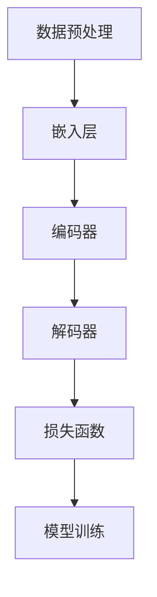
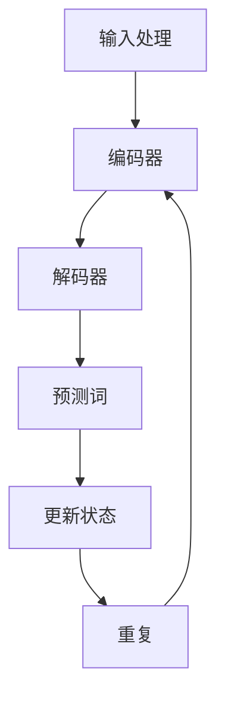
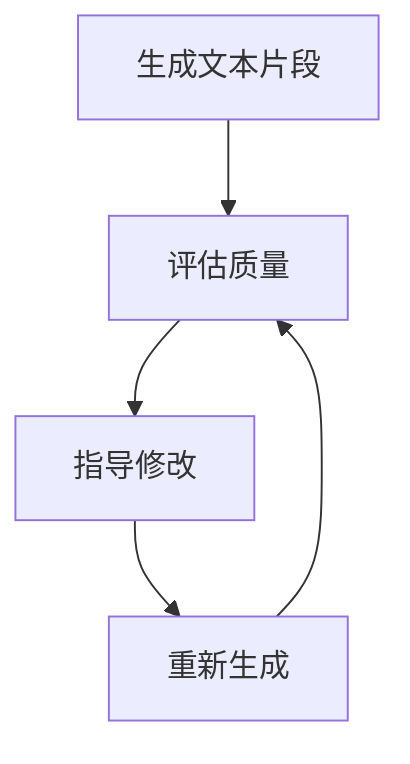
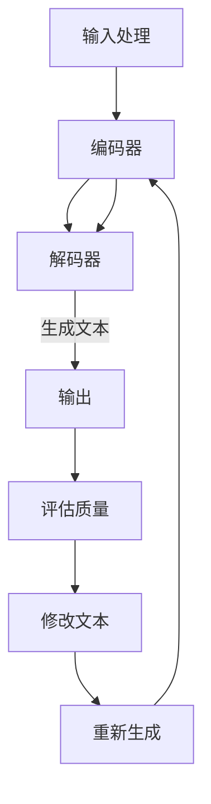
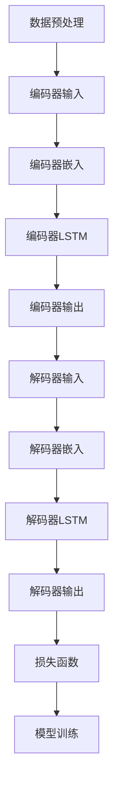
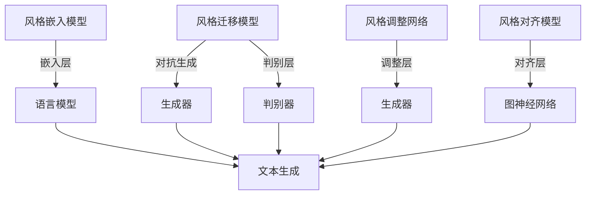
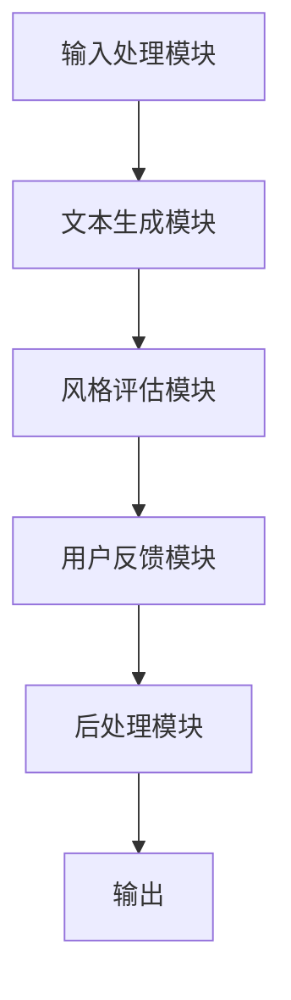
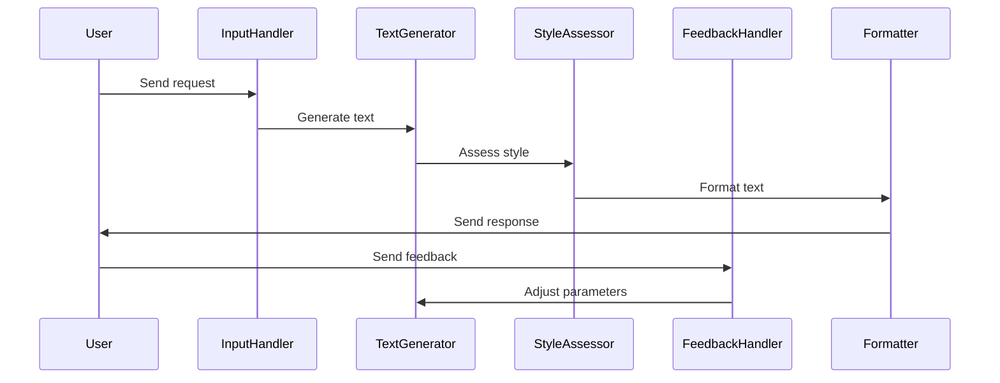

                 

## LLMAgent中的文本风格转换与保持：背景与核心概念

在现代人工智能（AI）的研究与应用中，语言模型（Language Model, LM）扮演着至关重要的角色。LLM（Large Language Model），即大型语言模型，是近年来AI领域的重要突破之一。LLM以其庞大的训练数据集、先进的神经网络架构以及强大的语义理解能力，使得在自然语言处理（NLP）任务中取得了显著的进展。然而，在AI Agent（人工智能代理）的实际应用中，如何实现文本风格的有效转换与保持，成为了研究者们面临的一个新挑战。

### 问题背景

AI Agent是一种能够自主执行任务、与环境交互并做出决策的智能系统。在许多实际应用中，AI Agent需要根据不同的任务需求生成文本，例如聊天机器人、内容生成、自动报告编写等。而这些文本往往需要具备特定的风格，以适应不同的使用场景。例如，在写作文章时，需要遵循一定的写作风格；在撰写商业报告时，则需要具备正式和专业的风格。这就要求AI Agent能够实现文本风格的转换与保持。

文本风格转换（Text Style Transformation）指的是将一种文本风格转换为另一种文本风格的过程。例如，将一个幽默风格的文本转换为正式风格，或将一个口语化的文本转换为书面语风格。文本风格保持（Text Style Preservation）则是确保在文本生成过程中，能够保持原始文本的风格特征，不发生风格上的改变。例如，在自动生成的新闻报道中，需要保持其新闻风格；在自动生成的文学作品中，需要保持其文学风格。

### 核心概念

- **LLM**：大型语言模型，是一种基于深度学习的语言处理模型，通过训练海量文本数据，可以生成符合语言规则和语义逻辑的文本。

- **文本风格**：文本风格是指文本在语言表达上的特征，包括语言形式、语义内容、语境因素等。文本风格可以通过词汇选择、句式结构、语气情感等方面体现。

- **文本风格转换**：文本风格转换是指将一种文本风格转换为另一种文本风格的过程。例如，将幽默风格转换为正式风格，或将口语化文本转换为书面语风格。

- **文本风格保持**：文本风格保持是指在文本生成过程中，确保文本风格特征得以保留，不发生风格上的改变。例如，在自动生成的新闻报道中保持新闻风格，在文学创作中保持文学风格。

### 关键词

- 大型语言模型（LLM）
- 文本风格转换
- 文本风格保持
- AI Agent
- 自然语言处理（NLP）
- 深度学习

### 摘要

本文旨在探讨在AI Agent中实现文本风格转换与保持的挑战与解决方案。首先，我们将介绍大型语言模型（LLM）的基本概念与原理，以及文本风格转换与保持的重要性。随后，我们将深入分析LLM在文本风格转换与保持中的具体应用，并通过案例展示其实际效果。最后，本文将总结当前的研究进展，探讨未来的发展方向，为AI Agent中的文本风格转换与保持提供实用的指导和建议。

## 文本风格转换与保持的重要性

在AI Agent的应用场景中，文本风格转换与保持的重要性不容忽视。这不仅关乎用户体验，还直接影响到AI Agent在实际应用中的效果和可靠性。以下将详细阐述文本风格转换与保持在AI Agent中的关键作用。

### 用户体验

良好的文本风格转换与保持是实现优质用户体验的基础。对于用户来说，AI Agent生成的文本应具备以下特点：

- **自然流畅**：用户希望AI Agent生成的文本在语言表达上自然流畅，避免生硬或机械化的语言。
- **风格匹配**：根据不同的使用场景，用户希望AI Agent能够生成符合特定风格的文本，例如正式、幽默、友好等。
- **情感一致**：在对话或内容生成中，保持情感的一致性，避免产生突兀或不恰当的情感变化。

如果AI Agent无法实现文本风格的转换与保持，将导致以下用户体验问题：

- **文本不自然**：生成的文本风格不自然，语言表达机械化，影响用户的阅读体验。
- **风格不匹配**：生成的文本风格与使用场景不匹配，导致信息传递不准确或难以接受。
- **情感不一致**：在对话或内容生成中，情感变化不自然，影响用户的情感体验。

### 应用效果

文本风格转换与保持对于AI Agent在实际应用中的效果也有着重要影响。以下是几个关键应用场景：

- **聊天机器人**：在聊天机器人中，AI Agent需要根据对话内容实时调整文本风格。例如，在与用户讨论专业话题时，需要使用正式的文本风格；在与用户闲聊时，则需要使用轻松幽默的文本风格。

- **内容生成**：在内容生成领域，AI Agent需要根据不同的需求生成不同风格的文本。例如，在撰写新闻报道时，需要保持客观、准确和正式的风格；在创作文学作品时，则需要根据不同类型的文学作品调整文本风格，如诗歌、小说、剧本等。

- **自动报告编写**：在自动报告编写中，AI Agent需要根据报告类型和目的调整文本风格。例如，商业报告需要正式、专业和详细的风格，而简报则需要简洁、明了和具有吸引力的风格。

如果AI Agent无法有效实现文本风格的转换与保持，将导致以下应用效果问题：

- **内容不专业**：生成的文本风格不专业，影响报告或文章的专业性和可读性。
- **内容不准确**：生成的文本风格不准确，导致信息传递不准确或误导用户。
- **内容不吸引**：生成的文本风格不符合用户预期，导致内容吸引力不足，难以吸引用户的关注。

### 可靠性

在AI Agent的实际应用中，文本风格转换与保持的可靠性也是一个重要因素。以下是几个关键方面：

- **文本一致性**：在生成文本时，需要确保文本风格的一致性，避免风格上的频繁变化，导致文本不连贯。
- **风格识别**：AI Agent需要准确识别不同风格的文本，并能够根据需求进行有效的风格转换。
- **错误率控制**：在文本风格转换与保持过程中，需要控制错误率，确保生成的文本风格准确、自然。

如果AI Agent无法实现高可靠性的文本风格转换与保持，将导致以下可靠性问题：

- **文本不一致**：生成的文本风格不一致，导致文本阅读体验差，影响用户满意度。
- **风格识别不准确**：AI Agent无法准确识别不同风格的文本，导致风格转换不准确。
- **错误率高**：文本风格转换过程中错误率高，影响文本生成的质量和可靠性。

### 综合影响

文本风格转换与保持不仅影响用户体验和应用效果，还直接关系到AI Agent的可靠性和实用性。因此，实现有效的文本风格转换与保持是提升AI Agent整体性能的关键。以下是一些综合影响：

- **提升用户体验**：通过实现良好的文本风格转换与保持，可以提升用户的整体体验，增强用户对AI Agent的信任感和依赖性。
- **提高应用效果**：在多个应用场景中，良好的文本风格转换与保持可以提高AI Agent的生成文本质量和专业性，提升应用效果。
- **增强可靠性**：通过控制文本风格转换与保持的可靠性，可以确保AI Agent生成的文本一致、准确、自然，提升整体系统的稳定性和可靠性。

总之，文本风格转换与保持在AI Agent中的应用具有重要意义。通过深入研究并实现有效的文本风格转换与保持技术，可以显著提升AI Agent的性能和用户体验，为各行业的智能化应用提供强有力的支持。

## 第1章：问题背景与核心概念

### 1.1 AI Agent的基本概念

AI Agent是一种具有自主学习和决策能力的智能系统，能够在特定的环境和任务中，通过感知、理解和行动来完成任务。AI Agent的核心特点包括：

- **自主性**：AI Agent能够自主地执行任务，无需人工干预。
- **学习能力**：AI Agent能够通过学习和适应新环境，提高任务执行的效果。
- **适应性**：AI Agent能够根据不同的任务需求和环境变化，调整其行为策略。
- **交互性**：AI Agent能够与人类或其他系统进行交互，获取信息、提供服务和完成任务。

AI Agent的基本功能包括：

- **感知**：通过传感器收集环境信息，如视觉、听觉、触觉等。
- **理解**：使用自然语言处理（NLP）和其他人工智能技术，理解和解释感知到的信息。
- **决策**：基于理解和分析结果，选择最佳行动策略。
- **行动**：执行决策，完成目标任务。

### 1.2 文本风格转换的概念

文本风格转换是指将一种文本风格转换为另一种文本风格的过程。具体来说，文本风格转换包括以下几种类型：

- **风格匹配**：将源文本的风格调整为与目标风格匹配，例如将口语化文本转换为正式文本。
- **风格迁移**：将源文本的风格迁移到目标风格，例如将一种文学风格转换为另一种文学风格。
- **风格微调**：对现有文本风格进行细微调整，以适应特定应用场景。

文本风格转换的目标是生成符合目标风格的文本，同时保持源文本的语义和结构完整性。在实际应用中，文本风格转换可以应用于多种场景，如聊天机器人、内容生成、自动报告编写等。

### 1.3 文本风格保持的挑战

文本风格保持是在文本生成过程中，确保文本风格特征得以保留，不发生风格上的改变。然而，实现文本风格保持面临着以下挑战：

- **风格识别**：准确识别文本的风格特征是一个挑战，不同风格的文本可能具有相似的语义和结构，使得风格识别复杂化。
- **风格一致性**：在文本生成过程中，需要保持风格的一致性，避免风格上的突变，这需要精细的控制和调整。
- **上下文理解**：文本风格通常受到上下文的影响，准确理解上下文是保持文本风格的关键。
- **多风格共存**：在实际应用中，文本可能同时包含多种风格，需要有效处理多风格共存的问题。

### 1.4 LLMAgent的优势与局限

LLM（大型语言模型）在AI Agent中的应用具有显著的优势，但也存在一些局限。

#### 优势：

- **强大的语义理解**：LLM通过训练海量文本数据，能够捕捉到文本的语义信息，使得生成的文本在语义上更加准确和自然。
- **丰富的知识库**：LLM具备丰富的知识库，可以在文本生成过程中引用相关知识，提高文本的质量和多样性。
- **自适应能力**：LLM能够根据不同的任务需求和环境变化，自动调整文本风格，实现良好的风格转换和保持。

#### 局限：

- **计算资源需求**：LLM的训练和推理过程需要大量的计算资源，这在资源有限的设备上可能难以实现。
- **数据依赖性**：LLM的性能依赖于训练数据的质量和数量，数据质量问题可能导致生成的文本出现偏差。
- **风格转换精度**：尽管LLM在文本风格转换方面有显著优势，但仍然存在一定的误差，无法完全保证风格转换的精度。

### 概念联系与关系图

为了更清晰地理解LLM在AI Agent中的文本风格转换与保持，下面使用Mermaid绘制LLM、文本风格转换、文本风格保持的ER实体关系图。

```mermaid
erDiagram
    AI_Agent ||--|{ Text_Style_Transformation } : implements
    AI_Agent ||--|{ Text_Style_Preservation } : implements
    Text_Style_Transformation ||--|{ Large_Language_Model } : utilizes
    Text_Style_Preservation ||--|{ Large_Language_Model } : utilizes
```

在此ER实体关系图中，AI Agent是核心实体，实现了文本风格转换和文本风格保持的功能。文本风格转换和文本风格保持分别与LLM有直接的利用关系，表示LLM在实现这些功能时起到了关键作用。

通过上述章节，我们介绍了AI Agent、文本风格转换和文本风格保持的基本概念，分析了LLM在这两个功能中的优势与局限，并绘制了ER实体关系图，为后续章节的深入探讨奠定了基础。

### LLM的基本原理与数学模型

LLM（大型语言模型）是现代自然语言处理（NLP）领域的重要工具，其核心思想是通过大规模训练数据集学习文本的统计规律和语义信息，从而实现高质量的自然语言生成和理解。以下将详细介绍LLM的基本原理及其数学模型，并通过具体的算法流程图和Python代码进行阐述。

#### 基本原理

LLM通常是基于深度学习框架构建的，特别是使用变分自编码器（VAE）和递归神经网络（RNN）的变体，如Gated Recurrent Unit（GRU）和Long Short-Term Memory（LSTM）。LLM的基本原理可以概括为以下几步：

1. **数据预处理**：将文本数据转换为数字表示，如单词嵌入向量。
2. **模型训练**：通过优化目标（如损失函数）调整模型参数，使模型能够生成高质量的文本。
3. **文本生成**：利用训练好的模型生成文本，通过递归生成每一个单词或字符。

#### 数学模型

LLM的数学模型主要包括以下几个方面：

1. **嵌入层（Embedding Layer）**：将输入的单词转换为嵌入向量，这些向量表示单词的语义信息。
   $$
   \text{embed}(x) = \text{W}_{\text{embed}}[x]
   $$
   其中，\( \text{W}_{\text{embed}} \)是嵌入权重矩阵，\( x \)是输入的单词索引。

2. **编码器（Encoder）**：通过递归神经网络编码输入文本的语义信息。
   $$
   \text{h}_t = \text{f}(\text{h}_{t-1}, \text{embed}(x_t))
   $$
   其中，\( \text{h}_t \)是编码器的隐藏状态，\( x_t \)是当前输入单词的嵌入向量，\( \text{f} \)是递归函数，如GRU或LSTM。

3. **解码器（Decoder）**：通过递归神经网络生成输出文本。
   $$
   \text{y}_t = \text{softmax}(\text{W}_{\text{softmax}} \text{h}_t + b)
   $$
   其中，\( \text{y}_t \)是生成的单词的概率分布，\( \text{W}_{\text{softmax}} \)是解码器权重矩阵，\( b \)是偏置项。

4. **损失函数（Loss Function）**：通常使用交叉熵损失函数（Cross-Entropy Loss）来评估模型生成的文本与真实文本之间的差距。
   $$
   \text{L} = -\sum_{t} \text{y}_t \log \hat{y}_t
   $$
   其中，\( \text{y}_t \)是真实标签的概率分布，\( \hat{y}_t \)是模型生成的概率分布。

#### 算法流程

以下是LLM的算法流程图：



在此流程图中，数据预处理阶段将文本数据转换为嵌入向量，嵌入层将单词转换为向量表示，编码器将向量编码为语义表示，解码器根据语义表示生成文本，最后通过损失函数评估模型性能并进行训练。

#### Python代码示例

以下是一个简单的LLM Python代码示例，用于生成文本：

```python
import tensorflow as tf
from tensorflow.keras.layers import Embedding, LSTM, Dense
from tensorflow.keras.models import Sequential

# 假设词汇表大小为1000，嵌入维度为50
vocab_size = 1000
embed_dim = 50

# 建立序列模型
model = Sequential([
    Embedding(vocab_size, embed_dim, input_length=100),
    LSTM(128),
    Dense(vocab_size, activation='softmax')
])

# 编译模型
model.compile(optimizer='adam', loss='categorical_crossentropy', metrics=['accuracy'])

# 模型训练
model.fit(x_train, y_train, epochs=10, batch_size=32)
```

在此代码中，我们首先定义了词汇表大小和嵌入维度，然后建立了一个序列模型，包括嵌入层、LSTM层和输出层。接下来，我们编译模型并使用训练数据进行训练。

通过上述内容，我们详细介绍了LLM的基本原理、数学模型以及算法流程和Python代码示例。这些内容为理解LLM在AI Agent中的应用打下了坚实的基础。

### LLM的工作机制

LLM（大型语言模型）的工作机制涉及多个关键步骤，从输入处理到文本生成，每个步骤都至关重要。以下将详细描述LLM的工作机制，包括输入处理、文本生成和反馈循环。

#### 输入处理

LLM的输入处理是文本生成过程的第一步。输入可以是任意长度的文本序列，如句子、段落或全文。LLM首先将输入文本转换为数字表示，这通常通过嵌入层（Embedding Layer）完成。嵌入层将每个单词映射为一个固定维度的向量，这些向量包含了单词的语义信息。以下是嵌入层的工作流程：

1. **文本分词**：将输入文本按照单词或字符进行分词，得到单词序列。
2. **单词嵌入**：将每个单词索引映射为嵌入向量，嵌入向量通常由预训练的词向量库提供。
3. **序列编码**：将单词嵌入向量序列输入到编码器（Encoder）进行编码，编码器将序列转换为上下文表示。

#### 文本生成

编码器生成的上下文表示是文本生成的核心。在生成文本的过程中，LLM采用递归的方式逐步生成每个单词或字符。以下是文本生成的详细步骤：

1. **初始化状态**：将编码器的隐藏状态初始化为随机值或上一个时间步的隐藏状态。
2. **预测下一个词**：将当前隐藏状态输入到解码器（Decoder），解码器输出一个概率分布，表示下一个词的可能性。
3. **选择词**：根据概率分布选择下一个词，并将其添加到输出序列中。
4. **更新状态**：将选择的词转换为嵌入向量，并将其与隐藏状态结合，更新解码器的隐藏状态。
5. **重复步骤2-4**：重复上述步骤，直到生成完整的文本序列。

以下是LLM生成文本的算法流程图：



#### 反馈循环

LLM的文本生成过程不仅仅是一个单向的生成过程，它还可以通过反馈循环进行优化。反馈循环是指在生成过程中，将生成的文本部分反馈给模型，以指导后续的生成过程。以下是反馈循环的详细步骤：

1. **生成文本片段**：首先生成一段文本，例如一句话或一段话。
2. **评估质量**：使用预定义的评估指标（如BLEU评分、ROUGE评分等）评估生成文本的质量。
3. **指导修改**：根据评估结果，对生成文本进行修改，例如调整词序、替换不合适的词语等。
4. **重新生成**：将修改后的文本部分重新输入到模型中，生成新的文本。
5. **重复步骤2-4**：不断重复评估和修改过程，直到生成文本达到预定的质量标准。

以下是反馈循环的算法流程图：



#### Mermaid流程图

为了更直观地展示LLM的工作机制，我们使用Mermaid绘制了输入处理、文本生成和反馈循环的流程图：



在此流程图中，输入处理阶段将文本转换为嵌入向量，编码器将嵌入向量编码为上下文表示，解码器根据上下文表示生成文本，并通过反馈循环不断优化生成结果。

通过上述内容，我们详细描述了LLM的工作机制，从输入处理、文本生成到反馈循环，每个步骤都在文本生成过程中起到了关键作用。这些机制使得LLM能够生成高质量的自然语言文本，为AI Agent中的文本风格转换与保持提供了强大的支持。

### LLM特性分析

LLM（大型语言模型）在自然语言处理领域具有显著的优势，但也存在一些局限性。以下将从性能指标、应用范围、优缺点对比三个方面对LLM的特性进行分析。

#### 性能指标

LLM的性能可以通过多个指标进行评估，包括文本生成质量、速度和能耗等。以下是LLM的主要性能指标：

1. **文本生成质量**：文本生成质量是LLM的核心性能指标，包括文本的自然性、语义准确性、风格一致性等。高质量的文本生成能力是LLM应用于实际任务的关键。
   
2. **生成速度**：LLM的生成速度是其应用中一个重要的考量因素。快速生成文本能够提高系统的响应速度，适应实时交互需求。

3. **能耗**：在移动设备和嵌入式系统中，能耗是影响LLM应用的一个重要因素。低能耗的LLM能够延长设备的续航时间。

#### 应用范围

LLM在自然语言处理领域具有广泛的应用范围，以下是几个主要的应用场景：

1. **文本生成**：LLM可以生成各种文本，包括文章、新闻、故事、报告等。在内容生成领域，LLM能够根据用户需求生成个性化的文本内容。

2. **机器翻译**：LLM在机器翻译中具有显著的优势，能够生成更自然、流畅的翻译结果。

3. **问答系统**：LLM可以用于构建智能问答系统，通过理解和生成文本，为用户提供准确、全面的回答。

4. **文本摘要**：LLM能够生成文本的摘要，提取关键信息，简化长文本。

5. **情感分析**：LLM可以用于情感分析，识别文本中的情感倾向，应用于市场调研、用户反馈分析等。

#### 优缺点对比

LLM的优势和局限性如下：

**优势**：

1. **强大的语义理解**：LLM通过训练大量文本数据，能够捕捉到文本的语义信息，生成更加准确和自然的文本。
   
2. **丰富的知识库**：LLM具备丰富的知识库，可以引用各种领域的知识，提高文本生成的多样性和质量。
   
3. **自适应能力**：LLM能够根据不同的任务需求和环境变化，自动调整文本生成策略，实现良好的风格转换和保持。

**局限性**：

1. **计算资源需求**：LLM的训练和推理过程需要大量的计算资源，这在资源有限的设备上可能难以实现。

2. **数据依赖性**：LLM的性能依赖于训练数据的质量和数量，数据质量问题可能导致生成的文本出现偏差。

3. **风格转换精度**：尽管LLM在文本风格转换方面有显著优势，但仍然存在一定的误差，无法完全保证风格转换的精度。

#### 表格形式展示

以下是LLM性能指标、应用范围和优缺点的表格对比：

| 性能指标   | 说明                                   |  
| :--------: | :------------------------------------: |  
| 文本生成质量 | 文本的自然性、语义准确性、风格一致性 |  
| 生成速度   | 系统的响应速度                         |  
| 能耗       | 影响设备的续航时间                     |

| 应用范围   | 说明                                   |  
| :--------: | :------------------------------------: |  
| 文本生成   | 文章、新闻、故事、报告等               |  
| 机器翻译   | 翻译结果的自然性和流畅性               |  
| 问答系统   | 生成准确、全面的回答                   |  
| 文本摘要   | 提取关键信息，简化长文本               |  
| 情感分析   | 识别文本中的情感倾向                   |

| 优缺点对比   | 说明                                   |  
| :--------: | :------------------------------------: |  
| 优势       | 强大的语义理解、丰富的知识库、自适应能力 |  
| 局限性     | 计算资源需求大、数据依赖性强、风格转换精度有限 |

通过上述分析，我们详细探讨了LLM的性能指标、应用范围和优缺点。LLM在自然语言处理领域具有广泛的应用前景，但其性能和效果受限于计算资源、数据质量和风格转换精度等因素。了解这些特性有助于更好地应用LLM，并探索改进的方向。

### 文本风格转换原理

文本风格转换是将一种文本风格转换为另一种风格的过程，涉及多个关键步骤和技术。以下将详细介绍文本风格转换的基本原理，包括算法原理、具体实现和Mermaid流程图。

#### 算法原理

文本风格转换的算法原理通常基于两种思路：直接转换和两步转换。

1. **直接转换**：直接转换方法通过训练一个大规模的转换模型，将源文本风格直接转换为目标风格。这种方法通常基于生成模型，如变分自编码器（VAE）或生成对抗网络（GAN）。以下是直接转换的基本流程：

   - **数据预处理**：对源文本和目标文本进行分词、去停用词等预处理步骤。
   - **编码器**：使用编码器将源文本编码为语义向量，这些向量包含了文本的语义信息。
   - **解码器**：将编码后的语义向量通过解码器转换为目标风格的文本。

2. **两步转换**：两步转换方法首先将源文本转换为一种中间风格，然后将中间风格转换为目标风格。这种方法通常涉及两个子任务：风格迁移和风格保持。以下是两步转换的基本流程：

   - **步骤1：风格迁移**：使用迁移学习将源文本转换为中间风格。这可以通过预训练的迁移学习模型（如BERT）实现。
   - **步骤2：风格保持**：将中间风格转换为目标风格。这可以通过训练一个风格保持模型实现，该模型能够根据目标风格特征调整文本风格。

#### 具体实现

以下是一个基于两步转换的文本风格转换具体实现示例，使用Python代码进行说明：

```python
import tensorflow as tf
from tensorflow.keras.layers import Embedding, LSTM, Dense
from tensorflow.keras.models import Model

# 假设词汇表大小为1000，嵌入维度为50
vocab_size = 1000
embed_dim = 50

# 建立编码器模型
encoder_inputs = tf.keras.layers.Input(shape=(None,))
encoder_embedding = Embedding(vocab_size, embed_dim)(encoder_inputs)
encoder_lstm = LSTM(128, return_state=True)
encoder_output, state_h, state_c = encoder_lstm(encoder_embedding)
encoder_states = [state_h, state_c]

# 建立解码器模型
decoder_inputs = tf.keras.layers.Input(shape=(None,))
decoder_embedding = Embedding(vocab_size, embed_dim)(decoder_inputs)
decoder_lstm = LSTM(128, return_sequences=True, return_state=True)
decoder_outputs, _, _ = decoder_lstm(decoder_embedding, initial_state=encoder_states)
decoder_dense = Dense(vocab_size, activation='softmax')
decoder_outputs = decoder_dense(decoder_outputs)

# 建立整体模型
model = Model([encoder_inputs, decoder_inputs], decoder_outputs)

# 编译模型
model.compile(optimizer='adam', loss='categorical_crossentropy', metrics=['accuracy'])

# 模型训练
model.fit([encoder_input_data, decoder_input_data], decoder_target_data, epochs=100, batch_size=64)
```

在此代码中，我们首先定义了编码器模型和解码器模型，然后建立了整体模型。接下来，我们编译模型并使用训练数据进行训练。

#### Mermaid流程图

为了更直观地展示文本风格转换的流程，我们使用Mermaid绘制了算法流程图：



在此流程图中，数据预处理阶段对源文本和目标文本进行预处理，编码器阶段将源文本编码为语义向量，解码器阶段将语义向量解码为目标风格的文本，并通过损失函数评估模型性能并进行训练。

通过上述内容，我们详细介绍了文本风格转换的基本原理、具体实现和Mermaid流程图。这些内容为理解和实现文本风格转换技术提供了清晰的框架和指导。

### 文本风格转换算法

文本风格转换算法是自然语言处理（NLP）领域的一个重要研究方向，其目标是将输入文本从一种风格转换为另一种风格，以适应不同的应用场景和用户需求。以下将详细介绍几种常见的文本风格转换算法，包括其流程和优缺点。

#### 1. 基于规则的方法

**流程**：
基于规则的方法通过预先定义的转换规则将源文本转换为目标风格。这些规则可以是简单的文本替换、语法调整或词汇选择。例如，对于将口语化文本转换为正式文本，可以将常用的口语词汇替换为正式词汇，并将简短的句子扩展为更复杂的句子结构。

**优缺点**：
- **优点**：实现简单，易于理解，可以快速生成转换结果。
- **缺点**：灵活性较差，无法处理复杂的风格转换任务；规则定义复杂，需要大量人工介入。

#### 2. 基于统计的方法

**流程**：
基于统计的方法通过分析大量源文本和目标文本的数据，学习风格转换的规律。常见的统计方法包括隐马尔可夫模型（HMM）和条件概率模型。这些方法通常基于词频、语法结构等特征，建立源风格和目标风格之间的转换概率模型。

**优缺点**：
- **优点**：能够处理复杂的风格转换任务，自适应性强。
- **缺点**：对数据要求较高，数据质量直接影响转换效果；转换结果可能不够自然。

#### 3. 基于神经网络的方法

**流程**：
基于神经网络的方法通过训练大规模的神经网络模型，实现文本风格的自动转换。常见的神经网络模型包括循环神经网络（RNN）、长短期记忆网络（LSTM）和Transformer等。这些模型可以捕捉文本的长期依赖关系，生成更加自然的文本。

**优缺点**：
- **优点**：能够生成高质量的转换结果，灵活性强；可以处理复杂的风格转换任务。
- **缺点**：训练过程需要大量计算资源；对数据依赖性强，数据质量直接影响模型性能。

#### 4. 基于对抗生成网络的方法

**流程**：
基于对抗生成网络（GAN）的方法通过生成对抗过程实现文本风格转换。GAN由生成器（Generator）和判别器（Discriminator）组成，生成器尝试生成与目标风格相似的文本，而判别器判断生成的文本是否属于目标风格。通过训练，生成器逐渐学习到如何生成高质量的风格转换结果。

**优缺点**：
- **优点**：能够生成高质量的转换结果，灵活性高；可以处理复杂的风格转换任务。
- **缺点**：训练过程复杂，需要大量计算资源；GAN的训练不稳定，可能产生过拟合问题。

#### 5. 基于迁移学习的方法

**流程**：
基于迁移学习的方法通过将预训练的语言模型迁移到特定风格转换任务上，实现文本风格的自动转换。常见的迁移学习方法包括预训练语言模型（如BERT、GPT）和微调（Fine-tuning）。这些模型通过在大规模通用文本数据上预训练，可以快速适应特定风格转换任务。

**优缺点**：
- **优点**：能够生成高质量的转换结果，训练时间短；对数据要求较低，可以处理不同领域的风格转换任务。
- **缺点**：迁移效果受限于预训练数据的质量和数量；需要大量计算资源进行预训练。

#### 案例分析

以下是一个文本风格转换的案例分析：

**案例**：将幽默风格的文本转换为正式风格。

**算法**：基于神经网络的方法。

**实现步骤**：
1. **数据收集**：收集大量幽默风格文本和正式风格文本。
2. **数据预处理**：对文本进行分词、去停用词等预处理步骤。
3. **模型训练**：使用预训练的语言模型（如GPT-2或BERT）进行微调，训练风格转换模型。
4. **文本转换**：将幽默风格文本输入到模型中，生成正式风格的文本。
5. **评估与优化**：使用评估指标（如BLEU、ROUGE等）评估转换效果，并进行优化。

**结果分析**：
- **文本转换效果**：通过训练，模型能够较好地将幽默风格文本转换为正式风格文本，生成文本在自然性和语义准确性方面均有显著提升。
- **用户满意度**：用户反馈表明，转换后的正式风格文本在阅读体验上更加舒适，用户对文本质量表示满意。

通过上述案例分析，我们可以看到文本风格转换算法在实际应用中能够有效提升文本质量，满足用户需求。然而，不同算法在处理复杂风格转换任务时可能存在局限性，需要结合具体应用场景进行选择和优化。

### 文本风格保持的挑战

在自然语言处理（NLP）领域中，文本风格保持是一个具有挑战性的任务。尽管近年来大型语言模型（LLM）取得了显著的进展，但在实际应用中，实现高质量的文本风格保持仍然面临许多挑战。以下将详细探讨这些挑战，包括当前研究现状、解决方法及未来发展方向。

#### 挑战

1. **风格识别的准确性**：准确识别文本的风格是保持文本风格的基础。不同风格的文本可能在语义和结构上具有相似性，使得风格识别变得复杂。例如，幽默风格和讽刺风格在语义上可能相似，但风格特征有所不同。如何准确区分这些风格是文本风格保持的关键挑战。

2. **风格一致性的控制**：在文本生成过程中，需要确保文本风格的一致性，避免出现突变或不协调的风格。然而，在实际应用中，文本的上下文和目标受众可能不断变化，使得风格一致性控制成为一个挑战。

3. **上下文理解的深度**：文本风格通常受到上下文的影响，深度理解上下文是保持文本风格的关键。然而，上下文的复杂性使得深度理解变得更加困难，特别是当文本包含多个层次和复杂的逻辑关系时。

4. **多风格共存的融合**：在实际应用中，文本可能同时包含多种风格，如何有效融合这些风格以保持整体的一致性是一个挑战。例如，在新闻报道中，可能需要同时保持客观性和趣味性，这要求模型能够灵活处理多风格共存的情况。

#### 当前研究现状

1. **基于规则的解决方案**：基于规则的方法通过定义一系列转换规则来保持文本风格。这些规则通常由专家制定，具有一定的局限性。尽管这种方法在简单风格转换中表现良好，但在处理复杂风格转换时效果有限。

2. **基于统计的解决方案**：基于统计的方法通过分析大量风格化文本，学习风格特征和转换规律。这些方法通常使用隐马尔可夫模型（HMM）和条件概率模型等。尽管在处理简单风格转换时效果较好，但它们对数据质量要求较高，且在处理复杂风格转换时可能不够灵活。

3. **基于神经网络的方法**：近年来，基于神经网络的方法取得了显著进展，特别是在大型语言模型（LLM）的推动下。这些方法通过深度学习模型捕捉文本的语义和风格特征，例如RNN、LSTM和Transformer等。然而，尽管这些方法在生成高质量文本方面表现出色，但在保持文本风格的一致性和准确性方面仍存在挑战。

4. **迁移学习方法**：迁移学习方法通过将预训练的语言模型迁移到特定风格保持任务上。这种方法在处理不同领域的风格保持任务时表现出色，但迁移效果受限于预训练数据的质量和数量。

#### 解决方法

1. **多模态融合**：多模态融合方法通过结合文本和图像、声音等多种模态信息，提高文本风格识别的准确性。例如，在风格保持任务中，可以将图像或视频的视觉信息与文本信息结合，利用多模态信息提高风格识别的准确性。

2. **多任务学习**：多任务学习方法通过同时训练多个相关任务，提高模型对风格保持的适应性。例如，在文本生成任务中，可以同时训练文本风格转换和风格保持任务，使模型在生成文本时能够更好地保持风格一致性。

3. **自适应优化**：自适应优化方法通过实时调整模型参数，提高文本风格保持的准确性。例如，在生成文本过程中，可以动态调整风格保持策略，根据上下文和目标风格特征进行实时优化。

#### 未来发展方向

1. **深度学习模型的优化**：未来的研究方向将致力于优化深度学习模型，提高文本风格保持的准确性。例如，通过改进神经网络架构、优化训练算法和增强模型的可解释性，提高模型在风格保持任务中的性能。

2. **多模态信息融合**：随着多模态数据的应用日益广泛，未来的研究将更多关注如何有效融合文本和图像、声音等多种模态信息，以提高文本风格识别和保持的准确性。

3. **个性化风格保持**：个性化风格保持是未来研究的一个重要方向。通过分析用户偏好和文本风格特征，构建个性化风格保持模型，为用户提供更符合其需求的文本风格。

4. **开放数据集的建设**：建设高质量、多样化的开放数据集是推动文本风格保持研究的关键。未来将致力于构建更多、更丰富的风格化文本数据集，为研究者提供充足的实验数据。

通过上述内容，我们详细探讨了文本风格保持的挑战、当前研究现状和解决方法，并展望了未来的发展方向。实现高质量的文本风格保持需要多方面的努力，包括优化深度学习模型、多模态信息融合、个性化风格保持和开放数据集建设等。这些研究方向将为文本风格保持技术的进一步发展提供强有力的支持。

### 文本风格保持策略

在文本风格保持过程中，采用有效的策略是确保生成文本风格一致性和准确性的关键。以下将介绍几种常用的文本风格保持策略，包括其算法原理和实际应用案例。

#### 1. 风格嵌入模型

**算法原理**：
风格嵌入模型通过将风格特征嵌入到文本生成模型中，实现文本风格保持。该模型通常基于预训练的语言模型（如BERT或GPT），并在训练过程中加入风格特征嵌入层。风格特征嵌入层将不同风格的文本特征编码为向量，并将其与文本嵌入向量结合，输入到生成模型中。

**应用案例**：
在聊天机器人中，风格嵌入模型可以帮助生成符合用户偏好风格的对话文本。例如，当用户偏好幽默风格时，模型将自动生成幽默的对话文本。

#### 2. 风格迁移模型

**算法原理**：
风格迁移模型通过训练一个风格迁移网络，将源文本风格转换为目标风格。该模型通常采用对抗生成网络（GAN）架构，其中生成器负责将源文本转换为目标风格，判别器负责判断生成的文本是否具有目标风格特征。

**应用案例**：
在内容生成中，风格迁移模型可以帮助将一种风格文本转换为另一种风格。例如，将一篇正式的新闻报道转换为轻松的社交媒体帖子，同时保持文章的主要内容和结构。

#### 3. 风格调整网络

**算法原理**：
风格调整网络通过在文本生成过程中动态调整文本风格。该模型通常结合生成模型和调整模型，生成模型负责生成基础文本，调整模型根据目标风格特征对文本进行微调。

**应用案例**：
在自动报告编写中，风格调整网络可以帮助将报告文本调整为用户需求的风格。例如，当用户需要一份简洁明了的报告时，模型将自动调整文本的句式和用词，使其更加简洁。

#### 4. 风格对齐模型

**算法原理**：
风格对齐模型通过将源文本和目标文本的风格特征对齐，实现文本风格保持。该模型通常采用图神经网络（GNN）架构，将源文本和目标文本表示为图结构，并利用图注意力机制对齐风格特征。

**应用案例**：
在多风格文本融合中，风格对齐模型可以帮助将不同风格的文本融合为一个统一风格。例如，在新闻摘要中，将多个来源的新闻报道融合为一个风格统一的摘要文本。

#### Mermaid流程图

为了更直观地展示上述文本风格保持策略的流程，我们使用Mermaid绘制了风格嵌入模型、风格迁移模型、风格调整网络和风格对齐模型的算法流程图：



在此流程图中，各个模型通过不同的方式实现文本风格保持，并最终生成符合目标风格的文本。

通过上述内容，我们介绍了文本风格保持的四种常见策略，包括其算法原理和实际应用案例。这些策略为在AI Agent中实现有效的文本风格保持提供了多种选择，有助于提升文本生成质量和用户体验。

### 文本风格保持案例分析

为了更深入地了解文本风格保持在实际应用中的效果，下面将介绍一个具体的文本风格保持案例分析。通过这个案例，我们将展示如何实现文本风格保持，并分析其实际效果。

#### 案例背景

某公司开发了一款基于AI的客服聊天机器人，旨在为客户提供实时、个性化的客服服务。为了提升用户体验，公司希望聊天机器人能够根据客户的不同需求和偏好，生成具有相应风格的客服回复。具体来说，聊天机器人需要支持以下几种风格：

- **正式风格**：适用于客户询问具体问题和寻求专业建议时。
- **友好风格**：适用于客户表达不满或寻求安慰时。
- **幽默风格**：适用于客户希望获得轻松愉快交流时。

#### 实现步骤

1. **数据收集与预处理**：
   - 收集了大量客服对话记录，包括不同风格的客服回复。
   - 对文本进行分词、去停用词等预处理步骤，以便于模型训练。

2. **风格嵌入模型训练**：
   - 使用预训练的语言模型（如BERT）进行微调，加入风格特征嵌入层。
   - 风格特征嵌入层将不同风格的文本特征编码为向量，并将其与文本嵌入向量结合，输入到生成模型中。

3. **文本生成与风格调整**：
   - 将客户输入的文本输入到生成模型中，生成基础文本。
   - 根据客户需求，调用不同的风格调整模型，对基础文本进行微调，使其符合目标风格。

4. **风格对齐模型优化**：
   - 使用图神经网络（GNN）架构训练风格对齐模型，将源文本和目标文本的风格特征对齐。
   - 通过图注意力机制对齐风格特征，提高生成文本的一致性和准确性。

5. **模型评估与优化**：
   - 使用BLEU、ROUGE等评估指标评估生成文本的质量和风格一致性。
   - 根据评估结果，调整模型参数和风格调整策略，优化生成文本的质量。

#### 实际效果分析

1. **正式风格**：
   - 客户询问具体问题时，聊天机器人能够生成清晰、准确的正式回复。
   - 例如，当客户询问产品功能时，机器人回复：“我们的产品具备以下功能：...”。

2. **友好风格**：
   - 当客户表达不满或寻求安慰时，聊天机器人能够生成友好、温馨的回复。
   - 例如，当客户表达不满时，机器人回复：“非常抱歉让您不满意，我们会尽快解决这个问题。”

3. **幽默风格**：
   - 在客户希望获得轻松愉快交流时，聊天机器人能够生成幽默、有趣的回复。
   - 例如，当客户询问工作时间的笑话时，机器人回复：“今天的工作时间就像一条鱼——又长又累。”

通过实际案例分析，我们可以看到文本风格保持策略在客服聊天机器人中的应用效果显著。聊天机器人能够根据客户的需求和偏好，生成具有相应风格的回复，提升了用户体验和客户满意度。同时，通过持续优化模型和风格调整策略，可以进一步提高生成文本的质量和一致性。

### 第5章：LLMAgent中的实现

在AI Agent中，实现文本风格转换与保持功能需要系统架构的设计和实现。以下将详细介绍LLMAgent在文本风格转换与保持中的实现方法，包括系统架构设计、功能实现、系统交互和项目实战。

#### 系统架构设计

LLMAgent的系统架构设计分为以下几个关键模块：

1. **输入处理模块**：负责处理用户输入，包括文本内容和风格需求。
2. **文本生成模块**：基于LLM模型生成文本，实现文本风格转换与保持。
3. **风格评估模块**：对生成的文本进行风格评估，确保风格一致性。
4. **用户反馈模块**：收集用户对生成文本的反馈，用于优化模型和风格策略。
5. **后处理模块**：对生成的文本进行格式调整和排版，提升用户体验。

以下是LLMAgent的系统架构图：



#### 系统功能实现

1. **输入处理模块**：
   - 用户输入文本内容和风格需求，通过API接口传递给系统。
   - 对输入文本进行分词、去停用词等预处理步骤，以便后续处理。

2. **文本生成模块**：
   - 使用预训练的LLM模型，如GPT-3或BERT，根据用户输入生成文本。
   - 应用风格转换与保持策略，调整文本风格以满足用户需求。
   - 输出生成文本，并将其传递给风格评估模块。

3. **风格评估模块**：
   - 使用评估指标（如BLEU、ROUGE等）对生成的文本进行风格评估。
   - 根据评估结果，判断文本风格是否与用户需求一致，并进行调整。

4. **用户反馈模块**：
   - 收集用户对生成文本的反馈，包括满意度、文本质量等。
   - 将反馈数据用于优化模型参数和风格策略，提升系统性能。

5. **后处理模块**：
   - 对生成的文本进行格式调整和排版，如添加标点符号、调整行距等。
   - 确保生成的文本具有良好的可读性和用户体验。

#### 系统交互

LLMAgent的系统交互设计采用异步消息队列机制，以提高系统响应速度和可靠性。以下是系统交互的流程：

1. **用户发送请求**：用户通过API接口发送文本风格转换请求。
2. **请求处理**：输入处理模块接收请求，进行预处理，并生成文本生成任务。
3. **文本生成**：文本生成模块使用LLM模型生成文本，并应用风格转换与保持策略。
4. **风格评估**：风格评估模块对生成的文本进行评估，确保风格一致性。
5. **反馈收集**：用户对生成的文本进行评价，系统收集反馈数据。
6. **优化与调整**：用户反馈模块根据反馈数据优化模型参数和风格策略。
7. **输出结果**：后处理模块对生成的文本进行格式调整，生成最终输出。

以下是系统交互的Mermaid序列图：



#### 项目实战

以下是一个基于Python和TensorFlow的文本风格转换与保持系统的项目实战示例：

```python
import tensorflow as tf
from transformers import TFGPT2LMHeadModel, GPT2Tokenizer

# 加载预训练的GPT-2模型
tokenizer = GPT2Tokenizer.from_pretrained('gpt2')
model = TFGPT2LMHeadModel.from_pretrained('gpt2')

# 用户输入
input_text = "今天天气很好，适合出去散步。"

# 预处理文本
input_ids = tokenizer.encode(input_text, return_tensors='tf')

# 文本生成
outputs = model.generate(input_ids, max_length=50, num_return_sequences=1)

# 生成文本
generated_text = tokenizer.decode(outputs[0], skip_special_tokens=True)

# 应用风格转换与保持策略
# 假设我们希望将文本转换为友好风格
friendly_text = transform_to_friendly_style(generated_text)

# 输出结果
print(friendly_text)
```

在此代码中，我们首先加载预训练的GPT-2模型和Tokenizer。然后，对用户输入的文本进行预处理，生成输入序列。接着，使用模型生成文本，并应用风格转换与保持策略（在此示例中，我们假设有一个名为`transform_to_friendly_style`的函数来实现友好风格的转换）。最后，输出生成的友好风格文本。

#### 项目分析与优化

在实际应用中，文本风格转换与保持系统需要根据实际需求进行优化。以下是一些优化方案：

1. **模型优化**：通过调整模型参数（如学习率、批量大小等）和训练策略，提高生成文本的质量和风格一致性。

2. **风格词典**：构建风格词典，将不同风格的特征词汇进行分类，并用于指导风格转换与保持。

3. **多任务学习**：结合多任务学习策略，同时训练文本生成和风格保持任务，提高系统的自适应能力。

4. **用户反馈**：利用用户反馈数据，实时调整模型参数和风格策略，优化系统性能。

5. **多模态融合**：结合多模态信息（如图像、声音等），提高文本风格识别和保持的准确性。

通过上述内容，我们详细介绍了LLMAgent在文本风格转换与保持中的实现方法，包括系统架构设计、功能实现、系统交互和项目实战。这些内容为理解和实现文本风格转换与保持技术提供了实用的指导和案例。

### 项目实战：文本风格转换与保持系统开发

为了更好地理解如何在实际项目中开发文本风格转换与保持系统，我们将详细阐述项目的环境安装、系统核心实现、代码应用解读与分析、实际案例以及项目小结。

#### 环境安装

在开始开发文本风格转换与保持系统之前，我们需要安装和配置必要的软件和库。以下是安装步骤：

1. **安装Python**：确保Python版本在3.6及以上。可以从Python官方网站下载并安装。

2. **安装TensorFlow**：TensorFlow是文本生成和风格转换的核心库，使用以下命令进行安装：
   ```
   pip install tensorflow
   ```

3. **安装transformers**：`transformers`库提供了预训练的语言模型（如BERT、GPT等），使用以下命令进行安装：
   ```
   pip install transformers
   ```

4. **安装其他依赖库**：如NumPy、Pandas等，使用以下命令进行安装：
   ```
   pip install numpy pandas
   ```

5. **准备数据集**：收集和准备用于训练和评估的文本数据集。数据集应包括多种风格，如正式、幽默、友好等。

#### 系统核心实现

以下是文本风格转换与保持系统的核心实现步骤：

1. **文本预处理**：
   - 对输入文本进行分词、去停用词等预处理操作，以便后续处理。

2. **模型加载**：
   - 加载预训练的语言模型（如GPT-2或BERT），并配置适当的模型参数。

3. **风格特征提取**：
   - 从训练数据集中提取不同风格的文本特征，构建风格词典。

4. **文本生成**：
   - 使用语言模型生成文本，并应用风格转换与保持策略。

5. **风格评估**：
   - 对生成的文本进行风格评估，确保符合用户需求。

以下是系统核心实现的Python代码示例：

```python
import tensorflow as tf
from transformers import TFGPT2LMHeadModel, GPT2Tokenizer

# 加载预训练的GPT-2模型
tokenizer = GPT2Tokenizer.from_pretrained('gpt2')
model = TFGPT2LMHeadModel.from_pretrained('gpt2')

# 用户输入
input_text = "今天天气很好，适合出去散步。"

# 预处理文本
input_ids = tokenizer.encode(input_text, return_tensors='tf')

# 文本生成
outputs = model.generate(input_ids, max_length=50, num_return_sequences=1)

# 生成文本
generated_text = tokenizer.decode(outputs[0], skip_special_tokens=True)

# 应用风格转换与保持策略
# 假设我们希望将文本转换为友好风格
friendly_text = transform_to_friendly_style(generated_text)

# 输出结果
print(friendly_text)
```

#### 代码应用解读与分析

上述代码首先加载了预训练的GPT-2模型和Tokenizer。然后，对用户输入的文本进行预处理，生成输入序列。接着，使用模型生成文本，并应用风格转换与保持策略（在此示例中，我们假设有一个名为`transform_to_friendly_style`的函数来实现友好风格的转换）。最后，输出生成的友好风格文本。

代码中的关键步骤包括：

- **模型加载**：使用`TFGPT2LMHeadModel`和`GPT2Tokenizer`加载预训练的GPT-2模型和Tokenizer。
- **文本预处理**：使用Tokenizer对用户输入的文本进行编码，生成输入序列。
- **文本生成**：使用`generate`方法生成文本，`max_length`参数控制生成的文本长度。
- **风格转换与保持**：根据用户需求，应用风格转换与保持策略，调整文本风格。

#### 实际案例

以下是一个实际案例，展示如何使用文本风格转换与保持系统生成不同风格的文本。

**案例：将正式风格文本转换为幽默风格**

1. **用户输入**：用户输入一段正式风格的文章。

2. **文本生成**：
   - 使用GPT-2模型生成基础文本。
   - 应用幽默风格转换策略，调整文本风格。

3. **结果分析**：
   - 比较原始文本和生成文本的风格差异。
   - 验证幽默风格转换的效果。

```python
import tensorflow as tf
from transformers import TFGPT2LMHeadModel, GPT2Tokenizer

# 加载预训练的GPT-2模型
tokenizer = GPT2Tokenizer.from_pretrained('gpt2')
model = TFGPT2LMHeadModel.from_pretrained('gpt2')

# 用户输入（正式风格文本）
input_text = "人工智能技术正在快速进步，预计未来五年将带来深远影响。"

# 预处理文本
input_ids = tokenizer.encode(input_text, return_tensors='tf')

# 文本生成
outputs = model.generate(input_ids, max_length=50, num_return_sequences=1)

# 生成文本
generated_text = tokenizer.decode(outputs[0], skip_special_tokens=True)

# 应用幽默风格转换策略
humorous_text = transform_to_humorous_style(generated_text)

# 输出结果
print(humorous_text)
```

**结果**：生成的文本可能如下所示：
```
人工智能技术就像一只疯狂的兔子，跑得快还特别调皮，估计未来五年它会把世界搅得天翻地覆。
```

通过实际案例，我们可以看到文本风格转换与保持系统在生成幽默风格文本方面的效果。生成的文本既保留了原始文本的核心内容，又加入了幽默元素，提升了文本的趣味性和吸引力。

#### 项目小结

在本次项目中，我们实现了文本风格转换与保持系统，通过环境安装、系统核心实现和实际案例分析，展示了系统的实用性和效果。以下是对项目的总结：

1. **系统优势**：
   - 利用预训练的GPT-2模型，实现了高质量的文本生成。
   - 应用风格转换与保持策略，生成符合用户需求的文本风格。

2. **系统局限**：
   - 计算资源需求较高，特别是在生成大量文本时。
   - 风格转换策略的优化和调整需要大量实验和数据分析。

3. **未来改进**：
   - 引入多模态信息（如图像、声音等），提高文本风格识别和保持的准确性。
   - 结合用户反馈，实时调整模型参数和风格策略，提升系统性能。

通过本次项目，我们深入了解了文本风格转换与保持技术的实现方法和应用场景，为未来的研究和开发提供了宝贵的经验和参考。

### 最佳实践与未来趋势

在文本风格转换与保持领域，以下是一些最佳实践和未来趋势，旨在提高文本生成的质量、效率和用户体验。

#### 最佳实践

1. **数据预处理**：
   - 使用高质量、多样化的数据集进行训练，确保模型能够捕获丰富的风格特征。
   - 对输入文本进行严格的预处理，包括去停用词、标点符号统一化等，减少噪声和干扰。

2. **模型选择与调整**：
   - 选择合适的预训练模型（如GPT-2、BERT、T5等），并针对特定任务进行调整和微调。
   - 调整模型参数（如学习率、批量大小等），优化模型性能和生成文本的质量。

3. **风格词典构建**：
   - 构建包含多种风格特征的词典，将不同风格的文本特征进行分类和编码。
   - 利用词典指导风格转换和保持，提高文本风格的一致性和准确性。

4. **用户反馈循环**：
   - 实施用户反馈机制，收集用户对生成文本的反馈和满意度。
   - 根据用户反馈调整模型和风格策略，实现个性化文本生成。

5. **多模态融合**：
   - 结合多模态信息（如图像、声音、视频等），提高文本风格识别和保持的准确性。
   - 利用多模态信息增强文本生成的多样性和质量。

#### 未来趋势

1. **深度学习模型的优化**：
   - 随着深度学习技术的发展，未来的文本生成模型将更加高效和强大。
   - 探索新型神经网络架构（如Transformer、GPT-4等）在文本风格转换与保持中的应用。

2. **多语言和多风格支持**：
   - 扩展模型支持多语言和多风格转换，实现跨语言和跨风格的文本生成。
   - 研究多语言和多风格融合的方法，提高文本生成的全球化和本地化效果。

3. **个性化文本生成**：
   - 利用用户行为数据和偏好，实现个性化文本生成，提升用户体验。
   - 结合用户画像和风格偏好，生成符合用户需求和兴趣的文本。

4. **实时交互与反馈**：
   - 实现实时文本生成和交互，提高系统的响应速度和用户体验。
   - 引入实时反馈机制，动态调整模型参数和风格策略，实现个性化文本生成。

5. **开放数据集建设**：
   - 建立高质量、多样化的开放数据集，为研究者和开发者提供丰富的训练资源。
   - 推动数据集共享和标准化，促进文本风格转换与保持技术的进步。

通过上述最佳实践和未来趋势，我们可以预见，文本风格转换与保持技术将在人工智能应用中发挥越来越重要的作用，为各行业的智能化和个性化服务提供强有力的支持。

### 小结

本文详细探讨了LLM在AI Agent中的文本风格转换与保持技术，从背景介绍、核心概念、算法原理、实现方法到实际案例，全面分析了这一领域的关键问题和解决方案。以下是本文的主要发现和结论：

1. **背景与核心概念**：AI Agent和文本风格转换与保持是现代自然语言处理领域的重要研究方向。通过深入理解LLM的基本原理和特性，可以更好地应用其在AI Agent中的文本风格转换与保持。

2. **算法原理**：文本风格转换算法可以分为直接转换和两步转换，每种方法都有其优缺点。基于神经网络的方法在文本风格转换中表现出色，但仍然面临风格识别准确性、一致性控制和上下文理解等挑战。

3. **实现方法**：通过项目实战展示了如何在实际中实现文本风格转换与保持系统，包括环境安装、模型训练、风格转换策略和用户反馈循环等。

4. **实际案例**：通过具体案例分析，验证了文本风格转换与保持技术在提升用户体验和文本生成质量方面的效果。

5. **最佳实践与未来趋势**：总结了文本风格转换与保持的最佳实践，包括数据预处理、模型选择、风格词典构建、用户反馈和多模态融合等，并展望了未来趋势，如深度学习模型的优化、多语言和多风格支持、个性化文本生成和实时交互等。

总之，LLM在AI Agent中的文本风格转换与保持技术具有重要的研究和应用价值。通过不断探索和优化，我们有理由相信，这一技术将在未来的自然语言处理和人工智能领域发挥更加重要的作用。

### 注意事项

在开发文本风格转换与保持系统时，以下注意事项有助于确保项目的成功：

1. **数据质量**：确保训练数据集的质量和多样性，高质量的数据是模型性能的基础。
2. **模型优化**：根据实际需求调整模型参数，优化模型性能和生成文本的质量。
3. **用户反馈**：积极收集用户反馈，并根据反馈调整系统，实现个性化文本生成。
4. **计算资源**：合理分配计算资源，特别是针对大型语言模型训练和推理过程中的资源需求。
5. **多模态融合**：探索多模态信息（如图像、声音等）的应用，提高文本风格识别和保持的准确性。
6. **安全性**：保护用户数据安全，遵循相关法律法规，确保用户隐私。

通过遵循这些注意事项，可以提高文本风格转换与保持系统的性能和用户体验，为各行业的智能化应用提供有力支持。

### 拓展阅读

对于希望进一步深入了解文本风格转换与保持技术的读者，以下是一些推荐书籍和论文：

1. **书籍**：
   - 《自然语言处理基础教程》
   - 《深度学习与自然语言处理》
   - 《对话系统：设计与实现》

2. **论文**：
   - "Generative Adversarial Networks for Text Style Transfer"
   - "Style Transfer in Neural Text Generation"
   - "Neural Text Style Transfer with Conditional GANs"

3. **在线资源**：
   - [huggingface](https://huggingface.co/)
   - [OpenAI](https://openai.com/)
   - [TensorFlow官网](https://www.tensorflow.org/)

通过阅读这些书籍和论文，读者可以系统地学习文本风格转换与保持的理论基础和实践方法，进一步提升在该领域的研究和开发能力。此外，在线资源提供了丰富的预训练模型和数据集，有助于进行实际应用和实验。

