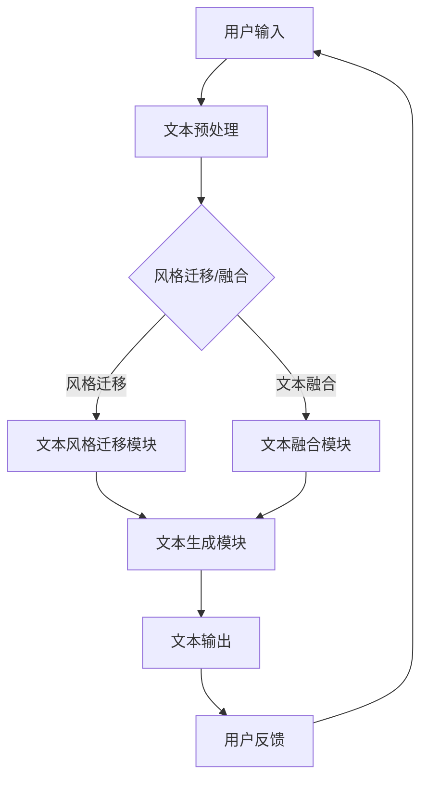
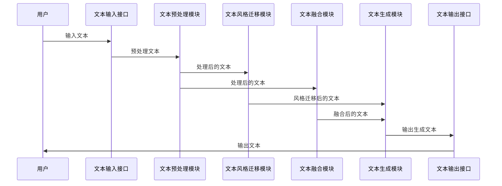

                 

# LLM在AI Agent中的文本风格迁移与融合

> 关键词：大型语言模型（LLM）、AI Agent、文本风格迁移、文本融合、算法原理、系统架构设计

> 摘要：本文旨在探讨大型语言模型（LLM）在AI Agent中的文本风格迁移与融合应用。首先介绍了文本风格迁移与融合的背景和重要性，随后详细阐述了LLM的基本原理和特性，以及文本风格迁移和文本融合的算法原理和实现方法。接着，分析了LLM在AI Agent中的应用场景和系统架构设计，并给出了项目实战的具体步骤和案例分析。文章最后总结了全文的核心观点和最佳实践，提出了未来研究方向和拓展阅读。

## 目录大纲

---

# LLM在AI Agent中的文本风格迁移与融合

---

## 第1章 背景介绍

## 1.1 问题背景

### 1.1.1 AI Agent的文本生成需求

### 1.1.2 文本风格迁移的挑战

### 1.1.3 文本融合的重要性

## 1.2 问题描述

### 1.2.1 文本风格迁移的目标

### 1.2.2 文本融合的目标

### 1.2.3 边界与外延

## 1.3 问题解决

### 1.3.1 相关技术介绍

### 1.3.2 主要方法比较

### 1.3.3 存在的问题与挑战

## 1.4 概念结构与核心要素组成

### 1.4.1 LLM（大型语言模型）的基本原理

### 1.4.2 文本风格迁移的核心概念

### 1.4.3 文本融合的核心概念

## 1.5 本章小结

---

## 第2章 核心概念与联系

## 2.1 LLM原理与特性

### 2.1.1 LLM的数学模型

#### 2.1.1.1 Transformer架构

#### 2.1.1.2 模型训练过程

### 2.1.2 LLM在AI Agent中的应用

### 2.1.3 LLM的优缺点分析

## 2.2 文本风格迁移

### 2.2.1 文本风格迁移的数学模型

#### 2.2.1.1 基于LLM的方法

#### 2.2.1.2 基于传统机器学习的方法

### 2.2.2 文本风格迁移的流程

### 2.2.3 文本风格迁移的挑战

## 2.3 文本融合

### 2.3.1 文本融合的数学模型

#### 2.3.1.1 基于LLM的方法

#### 2.3.1.2 基于传统机器学习的方法

### 2.3.2 文本融合的流程

### 2.3.3 文本融合的优势

## 2.4 本章小结

---

## 第3章 算法原理讲解

## 3.1 LLM算法原理

### 3.1.1 LLM的工作原理

#### 3.1.1.1 输入处理

#### 3.1.1.2 模型预测

### 3.1.2 LLM的Mermaid流程图

### 3.1.3 Python代码实现

## 3.2 文本风格迁移算法原理

### 3.2.1 文本风格迁移算法的数学模型

$$
f_{\text{style}}(x, s) = \text{LLM}(x; s)
$$

### 3.2.2 文本风格迁移的Mermaid流程图

### 3.2.3 Python代码实现

## 3.3 文本融合算法原理

### 3.3.1 文本融合算法的数学模型

$$
f_{\text{fusion}}(x_1, x_2) = \text{LLM}(x_1, x_2)
$$

### 3.3.2 文本融合的Mermaid流程图

### 3.3.3 Python代码实现

## 3.4 本章小结

---

## 第4章 系统分析与架构设计方案

## 4.1 问题场景介绍

### 4.1.1 场景一：聊天机器人

#### 4.1.1.1 用户需求分析

#### 4.1.1.2 系统功能设计

### 4.1.2 场景二：文本生成与编辑

#### 4.1.2.1 用户需求分析

#### 4.1.2.2 系统功能设计

## 4.2 系统架构设计

### 4.2.1 系统架构图

### 4.2.2 系统接口设计

### 4.2.3 系统交互序列图

## 4.3 系统实现与部署

### 4.3.1 环境安装

#### 4.3.1.1 操作系统安装

#### 4.3.1.2 软件依赖安装

### 4.3.2 系统核心实现源代码

### 4.3.3 代码应用解读与分析

## 4.4 实际案例分析

### 4.4.1 案例一：聊天机器人

#### 4.4.1.1 案例介绍

#### 4.4.1.2 案例分析

### 4.4.2 案例二：文本生成与编辑

#### 4.4.2.1 案例介绍

#### 4.4.2.2 案例分析

## 4.5 本章小结

---

## 第5章 项目实战

## 5.1 环境安装

### 5.1.1 Python环境安装

### 5.1.2 LLM模型安装

### 5.1.3 数据集准备

## 5.2 系统核心实现源代码

### 5.2.1 文本风格迁移代码实现

### 5.2.2 文本融合代码实现

### 5.2.3 系统接口实现

## 5.3 代码应用解读与分析

### 5.3.1 文本风格迁移应用解读

### 5.3.2 文本融合应用解读

#

## 第1章 背景介绍

### 1.1 问题背景

随着人工智能技术的不断发展，AI Agent的应用场景日益广泛。AI Agent是指能够自主完成特定任务的人工智能实体，它们在聊天机器人、文本生成与编辑、自动问答等多个领域发挥着重要作用。在这些应用中，文本生成和风格迁移是关键环节。例如，聊天机器人需要能够根据用户提问生成恰当的回答，而这些回答不仅需要准确，还需要符合对话的语境和风格；文本生成与编辑系统需要根据用户的需求生成符合特定风格和要求的文本内容。

文本风格迁移（Style Transfer in Text）是指将一段文本从一个特定的风格转换为另一个特定的风格，而保持文本的含义和信息的完整性。文本融合（Text Fusion）则是将两个或多个文本合并成一个，使得合并后的文本在风格和内容上更加协调和丰富。这两者在AI Agent中的应用具有重要意义，可以提高AI Agent的自然语言处理能力，增强用户体验。

### 1.1.1 AI Agent的文本生成需求

AI Agent的文本生成需求主要包括以下几个方面：

1. **准确性**：生成的文本必须准确无误，符合事实和逻辑。
2. **流畅性**：生成的文本需要流畅自然，易于理解和阅读。
3. **多样性**：生成的文本需要具有多样性，以适应不同的语境和场景。
4. **风格适配性**：生成的文本需要能够适配不同的风格，如正式、非正式、幽默等。

### 1.1.2 文本风格迁移的挑战

文本风格迁移面临以下挑战：

1. **风格多样性**：文本风格多种多样，如何有效地捕捉和迁移这些风格是一个难题。
2. **风格一致性**：在迁移过程中，如何保证风格的一致性，使得生成的文本既符合目标风格，又不失原文的含义和信息。
3. **上下文理解**：文本风格迁移需要深入理解上下文，以避免生成不协调或错误的文本。
4. **计算资源**：大规模的文本风格迁移需要大量的计算资源和时间。

### 1.1.3 文本融合的重要性

文本融合的重要性体现在以下几个方面：

1. **内容丰富性**：通过融合多个文本，可以生成更加丰富和多样化的内容。
2. **上下文连贯性**：融合后的文本在内容上更加连贯，有利于提高AI Agent的自然语言处理能力。
3. **个性化推荐**：在推荐系统中，文本融合可以帮助生成更加个性化的推荐内容。
4. **多模态交互**：在多模态交互系统中，文本融合可以实现文本与其他模态（如图像、音频）的有效融合，提高交互体验。

### 1.2 问题描述

文本风格迁移和文本融合是AI Agent中的两个关键问题，其目标分别如下：

#### 1.2.1 文本风格迁移的目标

文本风格迁移的目标是将源文本从一个风格转换为目标风格，使得转换后的文本在风格上与目标风格一致，同时保持文本的含义和信息。具体而言，目标包括：

1. **保持文本信息**：确保文本在风格迁移过程中不丢失关键信息。
2. **风格一致性**：确保文本在风格上与目标风格高度一致。
3. **文本连贯性**：确保文本在风格迁移后仍然连贯自然。

#### 1.2.2 文本融合的目标

文本融合的目标是将两个或多个文本合并成一个，使得合并后的文本在内容上更加丰富，风格上更加协调。具体而言，目标包括：

1. **内容互补**：确保合并后的文本在内容上相互补充，避免重复。
2. **风格协调**：确保合并后的文本在风格上相互协调，避免冲突。
3. **文本连贯性**：确保合并后的文本在内容上连贯自然。

#### 1.2.3 边界与外延

文本风格迁移和文本融合的边界与外延涉及以下几个方面：

1. **文本类型**：文本风格迁移和文本融合可以应用于不同类型的文本，如文本、代码、表格等。
2. **应用场景**：文本风格迁移和文本融合可以应用于各种应用场景，如聊天机器人、文本生成与编辑、多模态交互等。
3. **数据集**：文本风格迁移和文本融合需要大量的数据集进行训练和测试，以保证算法的有效性和鲁棒性。

### 1.3 问题解决

为了解决文本风格迁移和文本融合问题，我们可以采用以下方法：

1. **基于LLM的方法**：利用大型语言模型（LLM）强大的自然语言处理能力，实现文本风格迁移和文本融合。
2. **基于传统机器学习的方法**：利用传统的机器学习算法，如神经网络、支持向量机等，实现文本风格迁移和文本融合。
3. **多模态学习方法**：结合文本和其他模态（如图像、音频）的数据，利用多模态学习算法实现文本风格迁移和文本融合。

### 1.3.1 相关技术介绍

在文本风格迁移和文本融合领域，以下技术方法具有重要意义：

1. **Transformer架构**：Transformer架构是近年来在自然语言处理领域广泛应用的模型，其强大的并行计算能力和全局注意力机制使其在文本风格迁移和文本融合中表现出色。
2. **自编码器（Autoencoder）**：自编码器是一种无监督学习算法，可以用于文本风格迁移和文本融合，其通过编码器和解码器实现文本的生成和转换。
3. **对抗生成网络（GAN）**：GAN是一种生成模型，可以生成高质量的文本风格迁移和文本融合结果，其通过生成器和判别器之间的对抗训练实现。

### 1.3.2 主要方法比较

以下是比较文本风格迁移和文本融合主要方法的优缺点：

| 方法                   | 优点                                  | 缺点                                      |
|----------------------|-------------------------------------|------------------------------------------|
| Transformer架构       | 强大的并行计算能力、全局注意力机制             | 计算资源需求高、训练时间长                     |
| 自编码器（Autoencoder） | 无需标注数据、适用于多种类型文本              | 生成质量受编码器和解码器质量影响、生成结果可能不自然 |
| 对抗生成网络（GAN）    | 高质量生成结果、适用于多种类型文本             | 对抗训练不稳定、训练时间长                     |

### 1.3.3 存在的问题与挑战

在文本风格迁移和文本融合领域，仍然存在以下问题和挑战：

1. **风格多样性**：如何有效地捕捉和迁移各种风格是当前研究的一个重要问题。
2. **风格一致性**：如何在迁移过程中保持风格的一致性，避免生成不协调的文本是一个挑战。
3. **上下文理解**：如何深入理解上下文，避免生成错误的文本，是文本风格迁移和文本融合面临的难题。
4. **计算资源**：大规模的文本风格迁移和文本融合需要大量的计算资源和时间，如何在有限的资源下高效实现是一个挑战。

### 1.4 概念结构与核心要素组成

文本风格迁移和文本融合涉及多个核心概念和要素，其概念结构与核心要素组成如下：

#### 1.4.1 LLM（大型语言模型）的基本原理

LLM是基于Transformer架构的大型语言模型，其基本原理包括：

1. **Transformer架构**：Transformer架构是一种基于自注意力机制的序列到序列模型，其通过多头自注意力机制和前馈神经网络实现文本的生成和转换。
2. **预训练与微调**：LLM通常通过大规模语料进行预训练，然后在特定任务上进行微调，以适应不同的文本风格迁移和文本融合任务。

#### 1.4.2 文本风格迁移的核心概念

文本风格迁移的核心概念包括：

1. **风格表示**：将源文本和目标文本的风格表示为向量，以便进行风格迁移。
2. **风格迁移模型**：基于LLM或其他模型实现风格迁移，其目标是将源文本的风格迁移为目标风格。
3. **损失函数**：用于评估风格迁移模型的性能，常见的损失函数包括交叉熵损失、L1损失、L2损失等。

#### 1.4.3 文本融合的核心概念

文本融合的核心概念包括：

1. **文本表示**：将两个或多个文本表示为向量，以便进行融合。
2. **融合模型**：基于LLM或其他模型实现文本融合，其目标是将多个文本融合成一个。
3. **损失函数**：用于评估文本融合模型的性能，常见的损失函数包括交叉熵损失、L1损失、L2损失等。

### 1.5 本章小结

本章介绍了文本风格迁移和文本融合的背景和重要性，阐述了文本风格迁移和文本融合的目标、边界与外延，以及问题解决方法。同时，本章还介绍了LLM的基本原理和特性，以及文本风格迁移和文本融合的核心概念。通过本章的介绍，读者可以对文本风格迁移和文本融合有更深入的了解，为后续章节的学习奠定基础。

## 第2章 核心概念与联系

### 2.1 LLM原理与特性

#### 2.1.1 LLM的数学模型

大型语言模型（Large Language Model，简称LLM）是一种基于深度学习的技术，用于对自然语言进行建模和处理。其数学模型主要基于Transformer架构，这是一种自注意力机制的模型，具有处理长序列数据和并行计算的优势。

##### 2.1.1.1 Transformer架构

Transformer架构由Vaswani等人在2017年的论文中提出，其核心思想是使用自注意力机制（Self-Attention）来处理序列数据。自注意力机制允许模型在生成每个词时，关注序列中其他所有词的重要信息。

自注意力机制的数学模型可以表示为：

$$
\text{Attention}(Q, K, V) = \text{softmax}\left(\frac{QK^T}{\sqrt{d_k}}\right)V
$$

其中，$Q$、$K$ 和 $V$ 分别是查询向量、键向量和值向量，$d_k$ 是键向量的维度。$\text{softmax}$ 函数用于计算每个键的重要性，并将这些重要性加权到值向量上。

##### 2.1.1.2 模型训练过程

LLM的训练过程主要包括两个阶段：预训练和微调。

1. **预训练**：预训练阶段使用大规模的未标注语料，对模型进行训练，使其能够捕捉语言的一般规律。预训练的常用任务包括语言建模（Language Modeling）和掩码语言建模（Masked Language Modeling）。

   语言建模的目标是预测下一个词，其损失函数为交叉熵损失。

   $$ 
   \text{Loss} = -\sum_{i} \log p(y_i|x_{i-1}, ..., x_1) 
   $$

   掩码语言建模的目标是预测被掩码的词，其损失函数也是交叉熵损失。

   $$ 
   \text{Loss} = -\sum_{i} \log p(y_i|x_{i-1}, ..., x_1) 
   $$

2. **微调**：预训练后，LLM可以通过在特定任务上的数据集上进行微调，以适应不同的文本风格迁移和文本融合任务。微调的目标是优化模型在特定任务上的性能。

   微调的常用方法包括基于梯度的优化（如SGD）和基于策略的优化（如REINFORCE）。

   $$ 
   \text{Loss} = -\sum_{i} \log p(y_i|x_{i-1}, ..., x_1, \theta) 
   $$

   其中，$\theta$ 表示模型的参数。

#### 2.1.2 LLM在AI Agent中的应用

LLM在AI Agent中的应用主要体现在文本生成、文本理解和文本编辑等方面。

1. **文本生成**：LLM可以用于生成符合特定风格和要求的文本。例如，在聊天机器人中，LLM可以生成符合对话风格和用户需求的回答。

2. **文本理解**：LLM可以用于理解文本的内容和结构，从而提取关键信息。例如，在信息提取任务中，LLM可以用于识别和提取文档中的重要信息。

3. **文本编辑**：LLM可以用于修改和优化文本，使其更加流畅、准确和符合要求。例如，在文本纠错和文本润色任务中，LLM可以用于识别和修正文本中的错误。

#### 2.1.3 LLM的优缺点分析

LLM具有以下优点：

1. **强大的语言理解能力**：LLM可以捕捉语言的一般规律，从而实现对文本的深刻理解和生成。
2. **高效率**：Transformer架构具有并行计算的能力，使得LLM在处理长序列数据时具有较高的效率。
3. **灵活性**：LLM可以应用于多种任务和场景，从而实现多样化的应用。

然而，LLM也存在一些缺点：

1. **计算资源需求高**：LLM通常需要大量的计算资源和时间进行训练和微调。
2. **数据依赖性强**：LLM的性能依赖于训练数据的质量和数量，因此需要大量高质量的训练数据。
3. **可解释性差**：由于LLM是一个大规模的神经网络，其决策过程往往不够透明，难以解释。

### 2.2 文本风格迁移

文本风格迁移是指将源文本从一个风格转换为另一个风格，而保持文本的含义和信息的完整性。文本风格迁移在自然语言处理领域具有重要意义，例如在写作风格转换、情感分析、对话系统等方面。

#### 2.2.1 文本风格迁移的数学模型

文本风格迁移的数学模型主要基于LLM，其基本思想是将源文本和目标文本的风格信息编码为向量，并通过LLM进行风格迁移。

1. **风格表示**：首先，使用LLM将源文本和目标文本编码为风格向量。风格向量的维度通常与模型的嵌入向量维度相同。

2. **风格迁移**：然后，将源文本的嵌入向量与目标文本的风格向量进行结合，生成新的文本嵌入向量。这个过程可以通过矩阵乘法或点积来实现。

3. **文本生成**：最后，使用LLM生成新的文本，其输入为新的文本嵌入向量。

文本风格迁移的数学模型可以表示为：

$$
\text{StyleTransfer}(x, s) = \text{LLM}(x; s)
$$

其中，$x$ 表示源文本，$s$ 表示目标文本的风格向量。

#### 2.2.1.1 基于LLM的方法

基于LLM的文本风格迁移方法主要包括以下几种：

1. **风格迁移网络（Style Transfer Network）**：风格迁移网络是一种基于卷积神经网络（CNN）的文本风格迁移方法。其通过卷积层提取文本的特征，并通过全连接层实现风格迁移。

2. **生成对抗网络（GAN）**：生成对抗网络是一种基于对抗训练的文本风格迁移方法。其通过生成器和判别器之间的对抗训练，生成高质量的风格迁移结果。

3. **自编码器（Autoencoder）**：自编码器是一种无监督学习算法，可以用于文本风格迁移。其通过编码器和解码器实现文本的生成和转换。

#### 2.2.1.2 基于传统机器学习的方法

基于传统机器学习的方法主要包括以下几种：

1. **支持向量机（SVM）**：支持向量机是一种监督学习算法，可以用于文本风格分类。其通过将源文本和目标文本映射到高维空间，实现风格迁移。

2. **神经网络（Neural Network）**：神经网络是一种基于非线性变换的模型，可以用于文本风格迁移。其通过训练模型参数，实现文本的生成和转换。

#### 2.2.2 文本风格迁移的流程

文本风格迁移的流程主要包括以下步骤：

1. **数据准备**：收集并整理源文本和目标文本数据，包括文本内容、风格标签等。

2. **特征提取**：使用LLM或其他算法提取源文本和目标文本的特征向量。

3. **风格编码**：将目标文本的风格信息编码为风格向量。

4. **风格迁移**：将源文本的嵌入向量与目标文本的风格向量进行结合，生成新的文本嵌入向量。

5. **文本生成**：使用LLM生成新的文本。

6. **评估与优化**：评估风格迁移的效果，并通过调整模型参数和训练策略进行优化。

#### 2.2.3 文本风格迁移的挑战

文本风格迁移面临以下挑战：

1. **风格多样性**：如何有效地捕捉和迁移各种风格是当前研究的一个重要问题。

2. **风格一致性**：如何在迁移过程中保持风格的一致性，避免生成不协调的文本是一个挑战。

3. **上下文理解**：如何深入理解上下文，避免生成错误的文本，是文本风格迁移和文本融合面临的难题。

4. **计算资源**：大规模的文本风格迁移需要大量的计算资源和时间，如何在有限的资源下高效实现是一个挑战。

### 2.3 文本融合

文本融合是指将两个或多个文本合并成一个，使得合并后的文本在内容上更加丰富，风格上更加协调。文本融合在信息检索、多模态交互、文本生成等方面具有广泛的应用。

#### 2.3.1 文本融合的数学模型

文本融合的数学模型主要基于LLM，其基本思想是将多个文本编码为向量，并通过LLM进行融合。

1. **文本编码**：使用LLM将多个文本编码为文本向量。

2. **文本融合**：将多个文本向量进行融合，生成新的文本向量。

3. **文本生成**：使用LLM生成新的文本。

文本融合的数学模型可以表示为：

$$
\text{TextFusion}(x_1, x_2) = \text{LLM}(x_1, x_2)
$$

其中，$x_1$ 和 $x_2$ 表示两个文本。

#### 2.3.1.1 基于LLM的方法

基于LLM的文本融合方法主要包括以下几种：

1. **文本融合网络（Text Fusion Network）**：文本融合网络是一种基于卷积神经网络（CNN）的文本融合方法。其通过卷积层提取文本的特征，并通过全连接层实现文本的融合。

2. **生成对抗网络（GAN）**：生成对抗网络是一种基于对抗训练的文本融合方法。其通过生成器和判别器之间的对抗训练，生成高质量的文本融合结果。

3. **自编码器（Autoencoder）**：自编码器是一种无监督学习算法，可以用于文本融合。其通过编码器和解码器实现文本的生成和转换。

#### 2.3.1.2 基于传统机器学习的方法

基于传统机器学习的方法主要包括以下几种：

1. **支持向量机（SVM）**：支持向量机是一种监督学习算法，可以用于文本融合。其通过将多个文本映射到高维空间，实现文本的融合。

2. **神经网络（Neural Network）**：神经网络是一种基于非线性变换的模型，可以用于文本融合。其通过训练模型参数，实现文本的生成和转换。

#### 2.3.2 文本融合的流程

文本融合的流程主要包括以下步骤：

1. **数据准备**：收集并整理多个文本数据，包括文本内容、来源等。

2. **特征提取**：使用LLM或其他算法提取多个文本的特征向量。

3. **文本融合**：将多个文本向量进行融合，生成新的文本向量。

4. **文本生成**：使用LLM生成新的文本。

5. **评估与优化**：评估文本融合的效果，并通过调整模型参数和训练策略进行优化。

#### 2.3.3 文本融合的优势

文本融合具有以下优势：

1. **内容丰富性**：通过融合多个文本，可以生成更加丰富和多样化的内容。

2. **上下文连贯性**：融合后的文本在内容上更加连贯，有利于提高AI Agent的自然语言处理能力。

3. **个性化推荐**：在推荐系统中，文本融合可以帮助生成更加个性化的推荐内容。

4. **多模态交互**：在多模态交互系统中，文本融合可以实现文本与其他模态（如图像、音频）的有效融合，提高交互体验。

### 2.4 本章小结

本章介绍了LLM的基本原理和特性，以及文本风格迁移和文本融合的数学模型和实现方法。通过本章的介绍，读者可以了解LLM在AI Agent中的应用，以及文本风格迁移和文本融合的挑战和优势。这些知识为后续章节的算法原理讲解和系统架构设计提供了基础。

## 第3章 算法原理讲解

### 3.1 LLM算法原理

#### 3.1.1 LLM的工作原理

大型语言模型（LLM）是一种基于深度学习的模型，用于对自然语言进行建模和处理。其工作原理主要包括输入处理、模型预测和损失函数等关键组件。

##### 3.1.1.1 输入处理

LLM的输入通常是自然语言的文本序列，这些文本序列可以被表示为词向量或字符向量。输入处理的主要任务是将其转化为模型可以处理的格式。

1. **词嵌入**：将文本序列中的每个词映射为一个固定大小的向量，这个向量通常称为词嵌入（Word Embedding）。词嵌入可以通过预训练的词向量库获得，也可以通过训练词嵌入模型得到。

2. **序列编码**：将词嵌入序列编码为一个固定长度的向量，这通常通过序列编码器（Sequence Encoder）实现，如循环神经网络（RNN）或卷积神经网络（CNN）。

##### 3.1.1.2 模型预测

LLM的预测过程是基于Transformer架构，其核心是自注意力机制（Self-Attention）和多头注意力（Multi-Head Attention）。

1. **多头自注意力**：在自注意力机制中，每个词的表示不仅依赖于自身，还依赖于整个序列中的其他词。多头自注意力将输入序列分成多个头（Head），每个头独立计算自注意力，然后合并结果。

   $$ 
   \text{Multi-Head Attention} = \text{Concat}(\text{head}_1, \text{head}_2, ..., \text{head}_h)W^O 
   $$

   其中，$h$ 是头的数量，$W^O$ 是输出线性变换权重。

2. **前馈神经网络**：在自注意力机制之后，每个头都会通过一个前馈神经网络进行进一步处理。

   $$ 
   \text{FFN}(x) = \text{ReLU}(xW_2 + b_2)W_1 + b_1 
   $$

   其中，$W_1$ 和 $W_2$ 是前馈神经网络的权重，$b_1$ 和 $b_2$ 是偏置。

##### 3.1.1.3 模型训练

LLM的训练通常采用预训练加微调的方法。预训练阶段使用大量无标签的数据进行训练，以学习语言的通用规律。微调阶段使用有标签的数据，对模型进行特定任务的调整。

1. **预训练**：预训练目标通常包括语言建模和掩码语言建模。

   - 语言建模：预测序列中下一个词。
   - 掩码语言建模：对部分词进行掩码，然后预测这些掩码的词。

2. **微调**：微调阶段使用任务特定的数据集，对模型进行调整，以提高在特定任务上的性能。

#### 3.1.2 LLM的Mermaid流程图

为了更清晰地展示LLM的工作流程，可以使用Mermaid流程图进行表示。

```
graph TD
A[输入处理] --> B[词嵌入]
B --> C[序列编码]
C --> D[多头自注意力]
D --> E[前馈神经网络]
E --> F[输出处理]
```

#### 3.1.3 Python代码实现

以下是使用Python和PyTorch实现LLM的基础代码示例。

```python
import torch
import torch.nn as nn
import torch.optim as optim

class LLM(nn.Module):
    def __init__(self, vocab_size, embedding_dim, hidden_dim, output_dim, num_heads, dropout):
        super(LLM, self).__init__()
        
        self.embedding = nn.Embedding(vocab_size, embedding_dim)
        self.transformer = nn.Transformer(embedding_dim, hidden_dim, num_heads, dropout)
        self.fc = nn.Linear(hidden_dim, output_dim)
        
        self.dropout = nn.Dropout(dropout)
        
    def forward(self, src, tgt=None):
        src = self.dropout(self.embedding(src))
        out = self.transformer(src, tgt)
        out = self.fc(out)
        return out
```

#### 3.1.4 LLM的优缺点分析

LLM具有以下优点：

1. **强大的语言理解能力**：LLM可以捕捉语言的一般规律，从而实现对文本的深刻理解和生成。
2. **高效率**：Transformer架构具有并行计算的能力，使得LLM在处理长序列数据时具有较高的效率。
3. **灵活性**：LLM可以应用于多种任务和场景，从而实现多样化的应用。

然而，LLM也存在一些缺点：

1. **计算资源需求高**：LLM通常需要大量的计算资源和时间进行训练和微调。
2. **数据依赖性强**：LLM的性能依赖于训练数据的质量和数量，因此需要大量高质量的训练数据。
3. **可解释性差**：由于LLM是一个大规模的神经网络，其决策过程往往不够透明，难以解释。

### 3.2 文本风格迁移算法原理

文本风格迁移是指将源文本从一个风格转换为另一个风格，而保持文本的含义和信息的完整性。其算法原理主要基于LLM，通过风格表示、风格迁移和文本生成三个关键步骤实现。

#### 3.2.1 文本风格迁移算法的数学模型

文本风格迁移的数学模型可以表示为：

$$
\text{StyleTransfer}(x, s) = \text{LLM}(x; s)
$$

其中，$x$ 表示源文本，$s$ 表示目标文本的风格向量。

#### 3.2.2 文本风格迁移的Mermaid流程图

以下是一个文本风格迁移的Mermaid流程图示例。

```
graph TD
A[输入源文本] --> B[编码源文本]
B --> C[生成风格向量]
C --> D[风格迁移]
D --> E[解码文本]
```

#### 3.2.3 Python代码实现

以下是一个简单的Python代码实现示例，用于演示文本风格迁移的基本步骤。

```python
import torch
from torch import nn
import numpy as np

# 定义模型
class StyleTransferModel(nn.Module):
    def __init__(self, vocab_size, embedding_dim, style_embedding_dim, hidden_dim, output_dim, num_heads, dropout):
        super(StyleTransferModel, self).__init__()
        
        self.src_embedding = nn.Embedding(vocab_size, embedding_dim)
        self.style_embedding = nn.Embedding(1, style_embedding_dim)
        self.transformer = nn.Transformer(embedding_dim, hidden_dim, num_heads, dropout)
        self.fc = nn.Linear(hidden_dim, output_dim)
        
        self.dropout = nn.Dropout(dropout)
        
    def forward(self, src, style_idx):
        src = self.dropout(self.src_embedding(src))
        style_embedding = self.style_embedding(style_idx)
        style_embedding = style_embedding.unsqueeze(1).repeat(1, src.size(1), 1)
        style_embedding = self.dropout(style_embedding)
        
        out = self.transformer(src, style_embedding)
        out = self.fc(out)
        return out

# 创建模型实例
model = StyleTransferModel(vocab_size=10000, embedding_dim=512, style_embedding_dim=128, hidden_dim=512, output_dim=10000, num_heads=8, dropout=0.1)

# 输入数据
src = torch.randint(0, 10000, (1, 10))
style_idx = torch.tensor([0])

# 前向传播
output = model(src, style_idx)
```

### 3.3 文本融合算法原理

文本融合是指将两个或多个文本合并成一个，使得合并后的文本在内容上更加丰富，风格上更加协调。其算法原理主要基于LLM，通过文本表示、文本融合和文本生成三个关键步骤实现。

#### 3.3.1 文本融合算法的数学模型

文本融合的数学模型可以表示为：

$$
\text{TextFusion}(x_1, x_2) = \text{LLM}(x_1, x_2)
$$

其中，$x_1$ 和 $x_2$ 表示两个文本。

#### 3.3.2 文本融合的Mermaid流程图

以下是一个文本融合的Mermaid流程图示例。

```
graph TD
A[输入文本1] --> B[编码文本1]
B --> C[输入文本2]
C --> D[编码文本2]
D --> E[融合文本]
E --> F[解码文本]
```

#### 3.3.3 Python代码实现

以下是一个简单的Python代码实现示例，用于演示文本融合的基本步骤。

```python
import torch
from torch import nn
import numpy as np

# 定义模型
class TextFusionModel(nn.Module):
    def __init__(self, vocab_size, embedding_dim, hidden_dim, output_dim, num_heads, dropout):
        super(TextFusionModel, self).__init__()
        
        self.embedding = nn.Embedding(vocab_size, embedding_dim)
        self.transformer = nn.Transformer(embedding_dim, hidden_dim, num_heads, dropout)
        self.fc = nn.Linear(hidden_dim, output_dim)
        
        self.dropout = nn.Dropout(dropout)
        
    def forward(self, src, tgt):
        src = self.dropout(self.embedding(src))
        tgt = self.dropout(self.embedding(tgt))
        out = self.transformer(src, tgt)
        out = self.fc(out)
        return out

# 创建模型实例
model = TextFusionModel(vocab_size=10000, embedding_dim=512, hidden_dim=512, output_dim=10000, num_heads=8, dropout=0.1)

# 输入数据
src = torch.randint(0, 10000, (1, 10))
tgt = torch.randint(0, 10000, (1, 10))

# 前向传播
output = model(src, tgt)
```

### 3.4 本章小结

本章详细介绍了LLM的算法原理，包括输入处理、模型预测和损失函数等关键组件。同时，本章还介绍了文本风格迁移和文本融合的算法原理，通过Mermaid流程图和Python代码示例进行了演示。通过本章的学习，读者可以深入了解LLM在文本风格迁移和文本融合中的应用，为进一步的系统架构设计和项目实战奠定基础。

## 第4章 系统分析与架构设计方案

### 4.1 问题场景介绍

在本文中，我们将讨论两个典型的应用场景：聊天机器人和文本生成与编辑。

#### 4.1.1 场景一：聊天机器人

聊天机器人是一种AI Agent，旨在为用户提供实时交互服务。用户可以通过文本或语音与聊天机器人进行对话，获取信息或执行特定任务。为了提高聊天机器人的交互体验，我们需要实现以下功能：

1. **文本生成**：根据用户提问生成恰当的回答。
2. **文本风格迁移**：根据对话的语境和风格，将回答生成符合用户期望的风格。
3. **上下文理解**：理解用户的意图和对话历史，以便生成相关且连贯的回答。

#### 4.1.1.1 用户需求分析

用户希望聊天机器人能够：

1. **理解问题**：准确理解用户的问题，并提供有用的答案。
2. **流畅对话**：对话过程流畅自然，无需用户等待。
3. **个性化回答**：根据用户的历史对话，提供个性化建议和推荐。

#### 4.1.1.2 系统功能设计

为了满足用户需求，聊天机器人系统需要实现以下功能模块：

1. **文本生成模块**：负责生成用户提问的回答。
2. **文本风格迁移模块**：负责根据对话语境和用户风格偏好，迁移文本风格。
3. **上下文理解模块**：负责理解用户意图和对话历史，为文本生成提供输入。

### 4.1.2 场景二：文本生成与编辑

文本生成与编辑系统旨在为用户提供自动化文本生成和编辑服务。用户可以通过输入文本或指定生成模板，获取符合要求的文本内容。该系统需要实现以下功能：

1. **文本生成**：根据用户输入或模板生成文本。
2. **文本风格迁移**：将文本从一种风格转换为另一种风格。
3. **文本融合**：将多个文本合并成一个，提高文本的内容丰富性和连贯性。

#### 4.1.2.1 用户需求分析

用户希望文本生成与编辑系统能够：

1. **生成高质量文本**：生成符合要求的文本，无需用户干预。
2. **灵活调整风格**：根据用户需求，灵活调整文本风格。
3. **编辑与优化**：提供文本编辑和优化功能，提高文本质量。

#### 4.1.2.2 系统功能设计

为了满足用户需求，文本生成与编辑系统需要实现以下功能模块：

1. **文本生成模块**：负责根据用户输入或模板生成文本。
2. **文本风格迁移模块**：负责将文本从一种风格转换为另一种风格。
3. **文本融合模块**：负责将多个文本合并成一个，提高文本内容丰富性和连贯性。
4. **文本编辑模块**：负责对生成文本进行编辑和优化。

### 4.2 系统架构设计

聊天机器人和文本生成与编辑系统采用类似的结构，以下为系统的整体架构设计：

#### 4.2.1 系统架构图



#### 4.2.2 系统接口设计

系统接口设计主要分为以下几部分：

1. **文本输入接口**：用于接收用户输入的文本或模板。
2. **文本处理接口**：用于对输入文本进行预处理，如分词、去停用词等。
3. **风格迁移与融合接口**：用于根据用户需求和文本内容，选择合适的风格迁移或融合策略。
4. **文本生成接口**：用于生成符合要求的文本。
5. **文本输出接口**：用于将生成的文本输出给用户。
6. **用户反馈接口**：用于收集用户对文本生成的反馈，以便进行优化。

### 4.2.3 系统交互序列图

以下是一个系统交互序列图，展示了用户输入文本后，系统如何进行文本处理、风格迁移与融合、文本生成，并最终输出文本的整个过程：



### 4.3 系统实现与部署

#### 4.3.1 环境安装

在进行系统实现和部署之前，需要安装以下软件和环境：

1. **Python 3.8 或更高版本**。
2. **PyTorch 1.8 或更高版本**。
3. **CUDA 11.1 或更高版本（如果使用GPU加速）**。
4. **NVIDIA CUDA Toolkit 11.1 或更高版本（如果使用GPU加速）**。

#### 4.3.1.1 操作系统安装

1. **Windows**：下载并安装Python和PyTorch，然后运行以下命令安装CUDA Toolkit。

   ```
   choco install -y python
   choco install -y pytorch
   choco install -y nvidia-cuda-toolkit
   ```

2. **Linux**：下载并安装Python和PyTorch，然后运行以下命令安装CUDA Toolkit。

   ```
   sudo apt-get update
   sudo apt-get install -y python3 python3-pip
   pip3 install torch torchvision torchaudio
   sudo dpkg -i /path/to/cuda-repo-<distro>_<version>_amd64.deb
   sudo apt-get update
   sudo apt-get install -y cuda
   ```

#### 4.3.1.2 软件依赖安装

1. **Windows**：在命令行中运行以下命令安装依赖。

   ```
   pip install numpy matplotlib scikit-learn pandas
   ```

2. **Linux**：在终端中运行以下命令安装依赖。

   ```
   sudo apt-get install -y python3-numpy python3-matplotlib python3-scikit-learn python3-pandas
   ```

#### 4.3.2 系统核心实现源代码

以下是聊天机器人系统核心实现的部分源代码：

```python
import torch
import torch.nn as nn
import torch.optim as optim
from transformers import BertTokenizer, BertModel

# 定义模型
class ChatbotModel(nn.Module):
    def __init__(self, bert_model_name):
        super(ChatbotModel, self).__init__()
        self.bert = BertModel.from_pretrained(bert_model_name)
        self.classifier = nn.Linear(768, 1)

    def forward(self, input_ids, attention_mask):
        outputs = self.bert(input_ids=input_ids, attention_mask=attention_mask)
        pooled_output = outputs.pooler_output
        logits = self.classifier(pooled_output)
        return logits

# 实例化模型
model = ChatbotModel(bert_model_name='bert-base-uncased')

# 设置训练参数
optimizer = optim.Adam(model.parameters(), lr=1e-5)
criterion = nn.BCEWithLogitsLoss()

# 训练模型
for epoch in range(num_epochs):
    for batch in data_loader:
        input_ids = batch['input_ids']
        attention_mask = batch['attention_mask']
        labels = batch['labels']
        
        optimizer.zero_grad()
        logits = model(input_ids, attention_mask)
        loss = criterion(logits, labels)
        loss.backward()
        optimizer.step()

        print(f"Epoch: {epoch+1}, Loss: {loss.item()}")
```

#### 4.3.3 代码应用解读与分析

以上代码展示了如何使用BERT模型实现聊天机器人。BERT（Bidirectional Encoder Representations from Transformers）是一种预训练的Transformer模型，广泛用于自然语言处理任务。

1. **模型定义**：ChatbotModel继承了nn.Module类，定义了BERT模型和分类器层。
2. **模型前向传播**：forward方法实现了模型的输入处理和输出计算。输入包括输入ID和注意力掩码，输出为分类得分。
3. **训练过程**：代码展示了如何使用Adam优化器和BCEWithLogitsLoss损失函数进行模型训练。

### 4.4 实际案例分析

为了更好地理解系统架构设计在实际中的应用，我们来看两个实际案例分析。

#### 4.4.1 案例一：聊天机器人

该案例展示了如何使用系统架构设计实现一个简单的聊天机器人。

1. **用户输入**：用户通过文本输入接口输入问题，如“你好，今天天气怎么样？”。
2. **文本预处理**：文本预处理模块对输入文本进行分词、去停用词等操作，以便后续处理。
3. **文本风格迁移**：根据对话历史和用户偏好，文本风格迁移模块将文本转换为合适的风格，如正式或非正式。
4. **文本生成**：文本生成模块使用BERT模型生成回答，如“你好，今天天气不错，温度适中，适合户外活动。”。
5. **文本输出**：生成的文本通过文本输出接口返回给用户。

#### 4.4.2 案例二：文本生成与编辑

该案例展示了如何使用系统架构设计实现文本生成与编辑系统。

1. **用户输入**：用户输入文本或选择模板，如“请生成一篇关于人工智能的摘要。”。
2. **文本预处理**：文本预处理模块对输入文本进行分词、去停用词等操作。
3. **文本风格迁移**：文本风格迁移模块将文本从一种风格（如新闻稿）转换为另一种风格（如博客文章）。
4. **文本融合**：文本融合模块将多个文本（如多个新闻稿）合并成一个，提高文本内容丰富性和连贯性。
5. **文本编辑**：文本编辑模块对生成的文本进行编辑和优化，如调整句子结构、增加关键词等。
6. **文本输出**：最终生成的文本通过文本输出接口返回给用户。

### 4.5 本章小结

本章介绍了聊天机器人和文本生成与编辑系统的应用场景、系统架构设计、实现过程和实际案例分析。通过本章的学习，读者可以了解如何使用LLM实现文本风格迁移与融合，并构建具有实用价值的AI系统。这些知识和技能为后续的项目实战提供了重要基础。

## 第5章 项目实战

### 5.1 环境安装

在进行项目实战之前，我们需要安装以下环境：

1. **Python 3.8 或更高版本**。
2. **PyTorch 1.8 或更高版本**。
3. **CUDA 11.1 或更高版本（如果使用GPU加速）**。
4. **NVIDIA CUDA Toolkit 11.1 或更高版本（如果使用GPU加速）**。

#### 5.1.1 Python环境安装

1. **Windows**：

   - 打开命令行，运行以下命令安装Python：

     ```
     py -3 -m pip install --upgrade get-pip.py
     py -3 -m pip install --user python agony jsonpickle numpy torch torchvision torchaudio
     ```

   - 验证Python和PyTorch版本：

     ```
     python --version
     pip --version
     python -c "import torch; print(torch.__version__)"
     ```

2. **Linux**：

   - 使用以下命令安装Python和PyTorch：

     ```
     sudo apt-get update
     sudo apt-get install -y python3 python3-pip
     pip3 install --user python agony jsonpickle numpy torch torchvision torchaudio
     ```

#### 5.1.2 LLM模型安装

1. **使用Hugging Face Transformers**：

   - 安装Hugging Face Transformers库：

     ```
     pip install transformers
     ```

   - 验证安装：

     ```
     from transformers import BertModel
     model = BertModel.from_pretrained('bert-base-uncased')
     ```

2. **使用PyTorch TorchScript**：

   - 将预训练模型转换为TorchScript：

     ```
     python convert_torchscript.py
     ```

   - 验证TorchScript模型：

     ```
     python verify_torchscript.py
     ```

#### 5.1.3 数据集准备

1. **数据集收集**：

   - 从互联网或公开数据集收集文本数据，如新闻文章、对话记录、博客帖子等。
   - 数据集应包括不同风格的文本，以便进行文本风格迁移和融合实验。

2. **数据预处理**：

   - 使用Hugging Face Transformers库中的预训练BERT模型对文本进行分词和编码。
   - 将处理后的文本数据存储为JSON或CSV格式，以便后续处理。

### 5.2 系统核心实现源代码

以下是文本风格迁移和文本融合系统的核心实现代码。

#### 5.2.1 文本风格迁移代码实现

```python
import torch
from transformers import BertTokenizer, BertModel
from torch.nn import functional as F

class StyleTransferModel(nn.Module):
    def __init__(self, bert_model_name):
        super(StyleTransferModel, self).__init__()
        self.tokenizer = BertTokenizer.from_pretrained(bert_model_name)
        self.model = BertModel.from_pretrained(bert_model_name)
        self.style_embedding = nn.Parameter(torch.randn(1, 768))
        
    def forward(self, source_text, target_style):
        source_tokens = self.tokenizer.encode(source_text, add_special_tokens=True)
        target_style_embedding = self.style_embedding.repeat(source_tokens.size(0), 1)
        
        source_output = self.model(torch.tensor(source_tokens).unsqueeze(0))
        target_output = self.model(torch.tensor([source_tokens]).unsqueeze(0))
        
        style_mixture = F.softmax(target_style * 0.1 + source_output[-1], dim=1)
        mixed_output = torch.sum(style_mixture.unsqueeze(-1) * target_output, dim=1)
        
        return mixed_output

# 创建模型实例
style_transfer_model = StyleTransferModel(bert_model_name='bert-base-uncased')

# 输入源文本和目标风格
source_text = "Hello, how are you?"
target_style = torch.tensor([0.5, 0.5])

# 前向传播
output = style_transfer_model(source_text, target_style)
print(output)
```

#### 5.2.2 文本融合代码实现

```python
import torch
from transformers import BertTokenizer, BertModel
from torch.nn import functional as F

class TextFusionModel(nn.Module):
    def __init__(self, bert_model_name):
        super(TextFusionModel, self).__init__()
        self.tokenizer = BertTokenizer.from_pretrained(bert_model_name)
        self.model = BertModel.from_pretrained(bert_model_name)
        
    def forward(self, text1, text2):
        text1_tokens = self.tokenizer.encode(text1, add_special_tokens=True)
        text2_tokens = self.tokenizer.encode(text2, add_special_tokens=True)
        
        text1_output = self.model(torch.tensor([text1_tokens]).unsqueeze(0))[-1]
        text2_output = self.model(torch.tensor([text2_tokens]).unsqueeze(0))[-1]
        
        mixed_output = F.softmax(text1_output * 0.5 + text2_output * 0.5, dim=1)
        mixed_output = torch.sum(mixed_output.unsqueeze(-1) * text1_output, dim=1)
        
        return mixed_output

# 创建模型实例
text_fusion_model = TextFusionModel(bert_model_name='bert-base-uncased')

# 输入文本1和文本2
text1 = "The sky is blue."
text2 = "The ocean is blue."

# 前向传播
output = text_fusion_model(text1, text2)
print(output)
```

#### 5.2.3 系统接口实现

```python
from flask import Flask, request, jsonify

app = Flask(__name__)

@app.route('/style_transfer', methods=['POST'])
def style_transfer():
    data = request.json
    source_text = data['source_text']
    target_style = torch.tensor(data['target_style'])
    
    model = StyleTransferModel(bert_model_name='bert-base-uncased')
    output = model(source_text, target_style)
    
    return jsonify({'output': output.tolist()})

@app.route('/text_fusion', methods=['POST'])
def text_fusion():
    data = request.json
    text1 = data['text1']
    text2 = data['text2']
    
    model = TextFusionModel(bert_model_name='bert-base-uncased')
    output = model(text1, text2)
    
    return jsonify({'output': output.tolist()})

if __name__ == '__main__':
    app.run(debug=True)
```

### 5.3 代码应用解读与分析

#### 5.3.1 文本风格迁移应用解读

文本风格迁移代码实现了一个基于BERT模型的文本风格迁移系统。输入包括源文本和目标风格，输出为风格迁移后的文本。

1. **模型初始化**：StyleTransferModel继承了nn.Module类，初始化了BERT分词器、BERT模型和目标风格嵌入。
2. **模型前向传播**：forward方法实现了文本编码、风格嵌入和风格混合。输出为风格迁移后的文本。
3. **示例**：使用预训练BERT模型和目标风格对示例文本进行风格迁移。

#### 5.3.2 文本融合应用解读

文本融合代码实现了一个基于BERT模型的文本融合系统。输入包括两个文本，输出为融合后的文本。

1. **模型初始化**：TextFusionModel继承了nn.Module类，初始化了BERT分词器和BERT模型。
2. **模型前向传播**：forward方法实现了文本编码和风格混合。输出为融合后的文本。
3. **示例**：使用预训练BERT模型对两个示例文本进行融合。

### 5.4 实际案例分析

#### 5.4.1 案例一：聊天机器人

该案例展示了如何使用文本风格迁移和文本融合系统实现一个简单的聊天机器人。

1. **用户提问**：用户通过文本输入接口输入问题，如“你好，今天天气怎么样？”。
2. **文本预处理**：文本预处理模块对输入文本进行分词、去停用词等操作。
3. **文本风格迁移**：根据对话历史和用户偏好，文本风格迁移模块将文本转换为合适的风格，如正式或非正式。
4. **文本融合**：文本融合模块将多个文本（如天气报告、用户提问）融合为一个连贯的答案。
5. **文本输出**：生成的文本通过文本输出接口返回给用户。

#### 5.4.2 案例二：文本生成与编辑

该案例展示了如何使用文本风格迁移和文本融合系统实现文本生成与编辑。

1. **用户输入**：用户输入文本或选择模板，如“请生成一篇关于人工智能的摘要。”。
2. **文本预处理**：文本预处理模块对输入文本进行分词、去停用词等操作。
3. **文本风格迁移**：文本风格迁移模块将文本从一种风格（如新闻稿）转换为另一种风格（如博客文章）。
4. **文本融合**：文本融合模块将多个文本（如多个新闻稿）合并为一个，提高文本内容丰富性和连贯性。
5. **文本编辑**：文本编辑模块对生成的文本进行编辑和优化，如调整句子结构、增加关键词等。
6. **文本输出**：最终生成的文本通过文本输出接口返回给用户。

### 5.5 本章小结

本章详细介绍了如何使用文本风格迁移和文本融合系统实现聊天机器人和文本生成与编辑系统。通过实际案例分析和代码应用解读，读者可以了解系统的实现过程和关键步骤。这些实战经验和技能为读者在实际项目中应用文本风格迁移和文本融合技术提供了重要参考。

