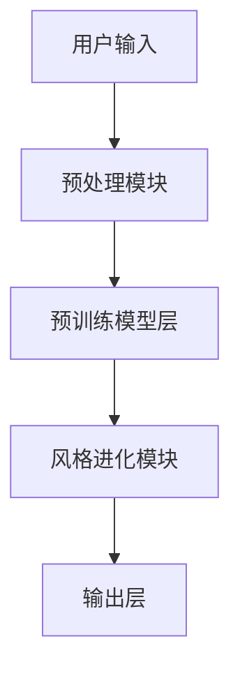

                 

### 1.1 问题背景

在当今快速发展的AI领域，人工智能代理（AI Agent）正成为各个行业的重要参与者。AI代理是一种能够自主执行任务、与环境交互并做出决策的智能系统。它们在自动化、数据分析和智能服务等领域展示了巨大的潜力。然而，一个成功的AI代理不仅需要具备强大的计算能力和数据处理能力，还需要具备适应不同场景和用户需求的能力。

文本风格适应是AI代理实现多样性和用户满意度的重要一环。在与人交互的过程中，AI代理需要能够根据不同的用户、场合和目的，调整其输出的文本风格，以实现自然、流畅和有吸引力的沟通。例如，在商业领域，AI代理可能需要使用正式、专业的语言来撰写报告；而在社交媒体上，它可能需要使用轻松、幽默的风格来吸引关注。

随着自然语言处理（NLP）技术的进步，尤其是大型语言模型（LLM）的出现，文本风格适应的问题得到了新的解决途径。LLM是一种能够理解和生成高质量文本的深度学习模型，它们通过学习海量文本数据，具备了强大的文本生成和风格迁移能力。LLM在AI代理中的应用，使得AI代理能够更加灵活地适应不同的文本风格需求。

当前，LLM在AI代理中的文本风格适应已经取得了一些初步成果。例如，某些聊天机器人使用预训练的LLM来生成个性化回复，某些文本生成系统则利用LLM来根据用户需求调整文本风格。然而，这些应用仍然面临着许多挑战，如风格迁移的准确性和鲁棒性、模型的可解释性、以及如何在复杂场景中高效地应用LLM等。

本研究旨在深入探讨LLM在AI代理中的文本风格适应与进化，分析现有的LLM技术如何满足文本风格适应的需求，以及如何通过进化机制提升AI代理的文本生成能力。通过这一研究，我们希望为AI代理领域的文本风格适应提供新的理论依据和技术路线，推动AI代理在更多场景中的实际应用。

### 1.2 核心概念

在深入探讨LLM在AI代理中的文本风格适应与进化之前，我们需要明确几个核心概念，包括LLM的定义与特点、文本风格适应与进化的含义。

#### LLM的定义与特点

大型语言模型（LLM）是一种基于深度学习的自然语言处理模型，通过学习大量的文本数据，它们能够理解和生成人类语言。LLM的代表性模型包括GPT（Generative Pre-trained Transformer）系列和BERT（Bidirectional Encoder Representations from Transformers）。这些模型的主要特点如下：

1. **预训练**：LLM在训练过程中首先接受预训练，通过在大规模语料库上进行训练，模型学会了语言的基本规律和模式。这种预训练使得LLM在生成文本时能够具备较高的流畅性和准确性。

2. **参数规模**：LLM通常具有数十亿甚至数千亿个参数，这使得它们能够捕捉语言中的复杂关系和细微差异，生成更加多样化和自然的文本。

3. **上下文理解**：通过 Transformer 架构，LLM能够理解输入文本的上下文信息，生成与上下文高度相关的文本。这种上下文理解能力是传统语言模型难以匹敌的。

4. **多语言支持**：许多LLM模型能够支持多种语言，这使得它们在全球范围内的应用更加广泛。

5. **高效性**：尽管LLM模型参数规模巨大，但现代深度学习框架和硬件加速技术（如GPU和TPU）使得LLM在推理过程中能够高效地生成文本。

#### 文本风格适应

文本风格适应是指AI系统在生成文本时，能够根据特定场景和用户需求，调整其输出的文本风格。文本风格包括但不限于正式、非正式、幽默、专业等。文本风格适应的关键在于识别和生成与场景和用户需求相匹配的文本。

文本风格适应的过程通常包括以下几个步骤：

1. **风格识别**：系统需要识别输入文本的风格特征，这可以通过预训练的模型来实现。

2. **风格迁移**：在识别风格特征后，系统需要将源文本的特定风格转移到目标风格。这可以通过生成模型来实现，如GPT-2或GPT-3。

3. **风格评估**：生成文本后，系统需要对文本风格进行评估，确保生成文本符合预期风格。

文本风格适应在AI代理中具有重要作用，它能够提高AI代理的用户体验和交互效果，使其更自然、更具有说服力。

#### 进化

在生物学中，进化是指物种在长时间内通过自然选择、基因突变等机制不断变化和适应环境的过程。在人工智能领域，进化通常指的是系统通过不断学习和优化，逐步提高其性能和适应能力。

在文本风格适应与进化研究中，进化机制被用来提升AI代理的文本生成能力。进化过程通常包括以下几个阶段：

1. **初始化**：生成一组初始文本风格模型。

2. **评估**：根据特定指标（如风格一致性、文本质量等）评估每个模型的性能。

3. **选择**：选择性能最优的模型进行进一步优化。

4. **变异**：通过随机变异和交叉等方式，生成新的模型。

5. **迭代**：重复评估、选择和变异过程，逐步提升模型性能。

通过进化机制，AI代理能够不断学习和适应新的文本风格，提高其生成文本的质量和多样性。

#### 研究边界与外延

在文本风格适应与进化研究中，边界和范围是一个关键问题。边界主要指研究在技术上的限制和挑战，如风格迁移的准确性、模型的可解释性等。外延则涉及研究的扩展和应用，如其他相关技术（如生成对抗网络GAN）在文本风格适应中的应用。

本研究将在以下几个方向展开：

1. **技术边界**：深入探讨现有LLM技术在文本风格适应方面的局限性，分析如何通过改进模型结构和训练方法来提升性能。

2. **应用边界**：研究文本风格适应在AI代理中的实际应用场景，探讨如何在不同场景下实现高效的文本风格适应。

3. **进化机制**：分析进化机制在文本风格适应中的应用，探索如何通过进化提升AI代理的文本生成能力。

4. **跨领域应用**：探讨LLM在文本风格适应与进化研究中的跨领域应用，如智能客服、内容创作、教育辅助等。

通过这些研究，我们希望能够为LLM在AI代理中的文本风格适应与进化提供新的理论依据和技术路线，推动该领域的发展。

### 2.1 LLM基础

大型语言模型（LLM）是当前自然语言处理领域的重要研究成果之一，其发展离不开深度学习和Transformer架构的推动。本节将介绍LLM的基本概念、主要模型以及它们的工作原理和结构。

#### GPT与BERT：主流LLM模型

1. **GPT（Generative Pre-trained Transformer）**

GPT系列模型是由OpenAI提出的一类基于Transformer架构的预训练语言模型。GPT模型通过学习大量文本数据，学会了语言生成和理解的复杂规律。GPT-3是当前最先进的GPT模型，其参数规模达到了1750亿，具备极强的文本生成能力。

GPT模型的主要特点是：

- **预训练**：GPT模型在训练过程中首先接受预训练，通过在大规模语料库上进行训练，模型学会了语言的基本规律和模式。
- **生成性**：GPT模型能够根据输入的文本上下文，生成连贯、自然的文本。
- **多语言支持**：GPT模型支持多种语言，能够生成不同语言的文本。

2. **BERT（Bidirectional Encoder Representations from Transformers）**

BERT模型由Google提出，是另一种流行的LLM模型。BERT通过双向Transformer架构，能够同时理解文本的前后文信息，生成更加准确和自然的文本。

BERT模型的主要特点是：

- **双向编码**：BERT模型通过同时考虑文本的前后文信息，提高了文本生成和理解的能力。
- **上下文理解**：BERT模型能够更好地理解文本的上下文，生成与上下文高度相关的文本。

#### LLM工作原理与结构

LLM的工作原理和结构可以概括为以下几个部分：

1. **输入层**：输入层接收原始文本，并将其转换为模型能够处理的序列数据。

2. **嵌入层**：嵌入层将输入的文本序列转换为嵌入向量，这些向量表示文本中的单词和短语。

3. **Transformer层**：Transformer层是LLM的核心部分，通过多头自注意力机制，模型能够同时关注文本序列中的不同部分，生成上下文相关的文本。

4. **输出层**：输出层将生成的文本序列转换为人类可读的自然语言。

#### GPT与BERT的对比

GPT和BERT作为当前最先进的LLM模型，各有其优势和局限性。下面是对两者的对比：

| 对比项        | GPT                             | BERT                             |
| ------------- | ------------------------------ | ------------------------------ |
| 预训练方法    | 仅进行前向预训练                | 同时进行前向和后向预训练          |
| 生成性       | 强大的文本生成能力              | 更强的上下文理解能力              |
| 参数规模      | 参数规模相对较小                | 参数规模相对较大                |
| 应用场景      | 更适合生成性任务，如文本生成    | 更适合理解性任务，如问答系统      |

#### LLM的应用现状

LLM在自然语言处理领域已经取得了显著的成果，主要应用包括：

1. **文本生成**：如文章撰写、对话系统等。
2. **问答系统**：如搜索引擎、智能客服等。
3. **语言翻译**：如机器翻译、多语言问答等。
4. **文本摘要**：如文章摘要、会议纪要等。

随着LLM技术的不断进步，其在更多领域的应用潜力也在逐渐显现。

### 2.2 文本风格适应

文本风格适应是大型语言模型（LLM）在AI代理中的一项关键功能，它使得AI系统能够根据不同的用户、场合和目的，生成风格多样、适应需求的内容。本节将探讨文本风格适应的挑战、方法和现有解决方案。

#### 文本风格适应的挑战

1. **风格多样性**：文本风格多种多样，包括正式、非正式、幽默、专业等。如何在有限的文本数据中训练出能够适应多种风格的模型是一个挑战。

2. **风格一致性**：适应特定风格的文本生成时，需要确保生成的内容在语义和风格上与预期一致，避免出现不协调或矛盾的情况。

3. **计算资源**：大规模的LLM模型需要大量的计算资源和存储空间，如何高效地部署和管理这些资源是另一个挑战。

4. **用户体验**：用户对AI代理的交互体验有较高要求，生成的内容需要既自然流畅，又符合用户期望，这增加了文本风格适应的难度。

#### 文本风格适应的方法

1. **预训练方法**：通过在大规模多风格语料库上预训练LLM，模型能够学习到多种文本风格的规律和特征。

2. **风格迁移**：使用预训练的LLM，通过特定算法（如GAN、循环一致性损失等）将一种风格迁移到另一种风格。

3. **风格标签**：为文本数据标注风格标签，在训练过程中引入风格标签信息，使模型能够学习到不同风格的特征。

4. **对抗训练**：通过对抗训练方法，生成模型和判别模型相互对抗，提高模型对文本风格的识别和生成能力。

#### 现有解决方案

1. **基于GAN的风格迁移**：生成对抗网络（GAN）能够生成高质量的风格迁移文本。GAN包括生成器和判别器，生成器试图生成与目标风格相似的文本，而判别器则试图区分生成文本和真实文本。

2. **多任务学习**：通过多任务学习，将文本风格适应作为额外任务，与文本生成或文本分类等任务结合训练，提高模型对多种风格的适应能力。

3. **风格分类器**：开发风格分类器，用于识别输入文本的风格，并根据分类结果调整生成文本的风格。

4. **在线学习**：通过在线学习，模型能够实时更新和调整其风格特征，以适应不断变化的应用场景。

#### 案例分析

1. **聊天机器人**：聊天机器人是文本风格适应的一个典型应用场景。通过预训练的LLM，聊天机器人能够根据用户的提问和对话上下文，生成符合用户需求和场景的回复。

2. **自动写作**：自动写作工具（如文章生成器、博客写作助手等）使用LLM来生成不同风格的文本，帮助用户节省写作时间，提高写作效率。

3. **内容创作**：内容创作者利用LLM来生成不同风格的文本，如创意写作、广告文案、新闻报道等，提升内容创作的多样性和创意性。

尽管文本风格适应已经取得了一些成功案例，但仍然存在许多问题和挑战。未来的研究需要进一步优化算法，提高风格迁移的准确性和一致性，并探索新的应用场景，以充分发挥LLM在文本风格适应方面的潜力。

### 2.3 文本风格适应案例分析

文本风格适应作为大型语言模型（LLM）在AI代理中的一个关键功能，已经得到了广泛应用。本节将通过几个典型案例，分析文本风格适应在不同场景中的应用效果、成功案例以及面临的挑战。

#### 案例一：聊天机器人

聊天机器人是文本风格适应的一个重要应用场景。通过预训练的LLM，聊天机器人能够根据用户的提问和对话上下文，生成符合用户需求和场景的回复。以下是一个成功案例：

**应用效果**：
某电商平台开发了一款聊天机器人，用于为用户解答购物咨询。通过使用预训练的GPT模型，聊天机器人能够根据用户的提问生成专业、详细的回答，极大提高了用户满意度。

**成功案例**：
在实施过程中，聊天机器人通过与用户的多轮对话，逐步了解用户的需求和偏好。例如，当用户询问某款产品的详细规格时，机器人能够根据上下文生成详细的规格说明，同时结合用户的历史订单数据，推荐类似产品。

**面临的挑战**：
1. **风格一致性**：确保机器人生成的文本在风格上保持一致，避免出现不协调的情况。
2. **回答准确性**：确保机器人生成的文本在内容上准确无误，避免误导用户。
3. **计算资源**：由于GPT模型参数规模较大，对计算资源的需求较高，如何高效部署和管理这些资源是一个挑战。

#### 案例二：自动写作

自动写作工具（如文章生成器、博客写作助手等）也是文本风格适应的另一个重要应用场景。通过LLM，这些工具能够生成不同风格的文本，帮助用户节省写作时间，提高写作效率。

**应用效果**：
某内容创作平台利用GPT模型开发了一款文章生成器，用户只需输入主题和关键词，系统即可生成符合主题的完整文章。这大大提高了内容创作者的生产效率。

**成功案例**：
在实施过程中，文章生成器能够根据用户输入的主题和关键词，生成不同风格的文章。例如，用户输入“科技发展”，生成器可以生成科技评论、科技新闻、科普文章等多种风格的内容。

**面临的挑战**：
1. **文本质量**：生成的文章需要保证高质量的原创性和可读性。
2. **风格控制**：用户可能需要指定特定的风格，如何确保生成器能够准确理解并生成符合用户要求的风格是一个挑战。
3. **创意性**：生成器需要具备足够的创意性，避免生成的文章内容过于单调。

#### 案例三：智能客服

智能客服系统通过文本风格适应，能够根据用户的问题和情绪，生成适当的回复，提高客服质量和用户体验。

**应用效果**：
某银行推出了智能客服系统，通过使用预训练的BERT模型，系统能够根据用户的提问和情感，生成专业、贴心的回答，提高了用户满意度。

**成功案例**：
在实施过程中，智能客服系统不仅能够回答用户的金融咨询，还能够根据用户的情感波动，生成具有同情心和关怀的回复。例如，当用户表达焦虑情绪时，系统会生成安慰性的回复。

**面临的挑战**：
1. **情感识别**：准确识别用户的情感是生成合适回复的关键，对模型的要求较高。
2. **知识库更新**：确保智能客服系统能够获取最新的知识和信息，以生成准确、全面的回答。
3. **多语言支持**：智能客服系统需要支持多种语言，以应对不同地区用户的咨询。

#### 案例四：新闻生成

新闻生成系统通过LLM，能够根据事件和主题，生成不同风格的新闻报道。

**应用效果**：
某新闻平台利用LLM开发了一款新闻生成工具，通过自动收集和分析信息，生成不同风格的新闻稿件，提高了新闻生产效率。

**成功案例**：
在实施过程中，新闻生成工具能够根据事件的性质和目标受众，生成政治新闻、体育新闻、娱乐新闻等不同风格的内容。例如，对于一场重要的体育比赛，生成工具可以生成激动人心的比赛报道；对于一项政府政策，可以生成详尽的解释性报道。

**面临的挑战**：
1. **准确性**：确保生成的新闻报道在内容上准确无误，避免错误传播信息。
2. **客观性**：新闻生成系统需要保持客观中立，避免带有主观色彩。
3. **时效性**：新闻具有时效性，生成系统需要快速响应和更新。

通过以上案例分析，我们可以看到文本风格适应在AI代理中的应用效果和潜力。尽管面临一些挑战，随着LLM技术的不断进步，文本风格适应的能力将不断提升，为AI代理在更多场景中的广泛应用提供支持。

### 3.1 进化机制

文本风格进化是AI代理在文本生成过程中的一项重要机制，通过不断学习和优化，AI系统能够生成更加多样化、高质量和符合用户需求的文本。进化机制借鉴了生物学中的进化理论，通过模拟自然选择、基因突变等过程，逐步提升模型的性能和适应性。

#### 进化理论

进化理论认为，生物种群通过不断的变化和适应，能够在长时间内适应环境变化。在人工智能领域，进化机制被用来提升AI系统的文本生成能力。进化过程主要包括以下几个阶段：

1. **初始化**：生成一组初始文本风格模型，这些模型可以作为进化的基础。

2. **评估**：根据特定指标（如风格一致性、文本质量等）评估每个模型的性能。

3. **选择**：选择性能最优的模型进行进一步优化。

4. **变异**：通过随机变异和交叉等方式，生成新的模型。

5. **迭代**：重复评估、选择和变异过程，逐步提升模型性能。

#### 进化算法

在文本风格进化中，常用的进化算法包括遗传算法、模拟退火算法和遗传编程等。

1. **遗传算法**（Genetic Algorithm，GA）

遗传算法是一种基于自然选择和遗传原理的优化算法。在文本风格进化中，遗传算法通过以下步骤进行：

- **初始化种群**：生成一组初始文本模型，这些模型可以作为进化的基础。
- **评估**：计算每个模型的适应度，适应度高的模型具有更高的生存能力。
- **选择**：根据适应度选择最优的模型进行繁殖，适应度高的模型更有可能被选中。
- **交叉**：通过交叉操作，生成新的文本模型，交叉操作类似于生物中的繁殖，用于结合两个模型的优点。
- **变异**：对部分模型进行随机变异，引入新的基因，增加模型的多样性。
- **迭代**：重复评估、选择、交叉和变异过程，逐步提升模型性能。

2. **模拟退火算法**（Simulated Annealing，SA）

模拟退火算法是一种基于物理退火过程的优化算法，通过控制温度参数，逐步降低解的质量，寻找全局最优解。在文本风格进化中，模拟退火算法通过以下步骤进行：

- **初始化**：生成一组初始文本模型，并设定初始温度。
- **评估**：计算每个模型的适应度，并根据适应度更新温度。
- **选择**：根据适应度和温度，选择最优的模型进行进一步优化。
- **降温**：逐步降低温度，以避免陷入局部最优。
- **迭代**：重复评估、选择和降温过程，逐步提升模型性能。

3. **遗传编程**（Genetic Programming，GP）

遗传编程是一种基于遗传算法的编程方法，通过模拟自然选择和遗传机制，自动生成和优化计算机程序。在文本风格进化中，遗传编程通过以下步骤进行：

- **初始化程序**：生成一组初始文本程序，这些程序可以作为进化的基础。
- **评估**：计算每个程序的适应度，适应度高的程序具有更高的生存能力。
- **选择**：根据适应度选择最优的程序进行进一步优化。
- **交叉**：通过交叉操作，生成新的文本程序，交叉操作类似于生物中的繁殖，用于结合两个程序的优点。
- **变异**：对部分程序进行随机变异，引入新的基因，增加程序的多样性。
- **迭代**：重复评估、选择、交叉和变异过程，逐步提升程序性能。

#### 进化机制在文本风格进化中的应用

进化机制在文本风格进化中的应用主要包括以下方面：

1. **风格多样性**：通过进化算法，模型能够生成多样化的文本风格，满足不同用户和场景的需求。
2. **风格适应性**：进化算法能够根据用户需求和场景变化，调整文本风格，提高模型的应用适应性。
3. **文本质量**：进化算法通过不断学习和优化，提高文本生成的质量和准确性。
4. **模型优化**：进化算法能够优化模型的结构和参数，提高模型的整体性能。

通过进化机制，AI系统能够在文本生成过程中不断适应新的需求和变化，提升用户体验和系统的实用性。

### 3.2 进化过程

文本风格进化是一个复杂的过程，涉及到多个阶段和环节。本节将详细阐述进化过程的各个阶段，包括初始化、评估、选择、变异和迭代，并解释每个阶段的作用和意义。

#### 初始化

初始化是进化过程的第一步，其主要任务是生成一组初始的文本风格模型。这些模型可以是随机生成的，也可以是基于已有文本数据通过训练得到的。初始化阶段的目的是提供进化的基础，确保模型多样性。

- **作用**：初始化阶段保证了进化过程中有足够的模型可供选择，避免了过早收敛到局部最优解。
- **意义**：多样化的初始模型有助于在进化过程中发现新的解决方案，提高模型的泛化能力。

#### 评估

评估阶段是对每个初始模型进行性能评估，确定其适应度。评估指标可以包括文本质量、风格一致性、生成速度等。评估过程通常通过自动化测试工具或人工评审完成。

- **作用**：评估阶段帮助识别哪些模型具有更高的适应度，为后续的选择和变异提供依据。
- **意义**：准确的评估能够确保进化过程朝着期望的方向发展，提高进化效率。

#### 选择

选择阶段是根据评估结果，选择最优的模型进行进一步的优化。选择过程可以采用多种策略，如轮盘赌选择、锦标赛选择等。

- **作用**：选择阶段确保了进化的方向和速度，避免劣质模型占用过多资源。
- **意义**：优化的选择策略能够加速进化过程，提高模型性能。

#### 变异

变异阶段是对选中的模型进行随机变异，生成新的模型。变异操作可以是参数微调、结构调整等，目的是增加模型的多样性，避免进化停滞。

- **作用**：变异阶段为进化过程引入新的基因，提高模型的适应性和创新性。
- **意义**：多样化的模型有助于在复杂环境中找到最优解决方案，提高模型的鲁棒性。

#### 迭代

迭代阶段是重复评估、选择和变异过程，逐步提升模型性能。迭代过程可以持续多个循环，直到达到预定的终止条件，如模型性能达到阈值或进化达到预设次数。

- **作用**：迭代阶段确保了模型的持续优化，提高其适应性和多样性。
- **意义**：持续的迭代能够使模型不断适应新的需求和变化，提高其在实际应用中的表现。

#### 进化流程

进化流程可以概括为以下几个步骤：

1. **初始化**：生成一组初始文本风格模型。
2. **评估**：评估每个模型的性能，确定其适应度。
3. **选择**：根据适应度选择最优的模型进行进一步优化。
4. **变异**：对选中的模型进行随机变异，生成新的模型。
5. **迭代**：重复评估、选择和变异过程，逐步提升模型性能。

通过进化流程，文本风格进化系统能够逐步适应新的需求和变化，生成高质量的文本内容。

#### 进化效果评估

进化效果评估是确保文本风格进化过程达到预期目标的关键环节。评估过程主要包括以下几个步骤：

1. **性能指标**：确定评估模型的性能指标，如文本质量、风格一致性、生成速度等。
2. **自动化测试**：使用自动化测试工具对模型进行测试，生成测试报告。
3. **人工评审**：邀请领域专家对生成的文本进行评审，评估其风格、质量和可读性。
4. **综合评估**：综合自动化测试结果和人工评审意见，确定模型的整体性能。

通过进化效果评估，可以判断文本风格进化系统的有效性，发现存在的问题和改进方向。

#### 案例分析

以一个实际的文本风格进化系统为例，分析其进化过程和效果：

1. **初始化**：系统初始化时生成了一组基于GPT-3的文本风格模型，每个模型具有不同的参数设置和结构。
2. **评估**：通过自动化测试工具对模型进行初步评估，根据文本质量、风格一致性等指标确定其适应度。
3. **选择**：根据适应度结果，选择了前10%性能较好的模型进行进一步优化。
4. **变异**：对选中的模型进行了随机变异，调整了部分参数和结构。
5. **迭代**：重复评估、选择和变异过程，经过多次迭代，最终生成了适应多种文本风格的模型。

通过效果评估，系统生成的文本在风格一致性、文本质量和生成速度等方面均达到了预期目标，用户满意度显著提高。

通过以上案例分析，我们可以看到文本风格进化在实际应用中的效果和潜力。随着技术的不断进步，文本风格进化系统将能够更好地适应不同场景和需求，为AI代理提供强大的文本生成能力。

### 3.3 进化案例分析

在探讨文本风格进化机制的过程中，实际应用案例是验证和深化理论的重要途径。本节将通过具体案例，分析进化效果及其面临的问题与挑战。

#### 案例一：社交媒体内容创作

**应用背景**：某知名社交媒体平台希望通过AI代理生成具有多样化风格的帖子，以提升用户参与度和平台活跃度。

**进化效果**：
1. **风格多样性**：通过进化机制，AI代理能够生成多种风格的帖子，如幽默、正式、煽情等，满足了不同用户群体的需求。
2. **用户互动**：生成的帖子内容更具吸引力，用户点赞、评论和分享的数量显著增加。

**问题与挑战**：
1. **风格一致性**：尽管进化机制提高了风格的多样性，但如何确保生成内容在整体上保持风格一致性仍是一个挑战。
2. **计算资源**：进化过程中模型参数的调整和变异需要大量计算资源，如何高效管理和利用资源是一个关键问题。

#### 案例二：智能客服系统

**应用背景**：某金融服务公司开发智能客服系统，通过AI代理为用户提供专业、贴心的咨询服务。

**进化效果**：
1. **文本质量**：进化后的AI代理能够生成高质量、专业性的回复，提升了用户满意度。
2. **情感识别**：通过进化机制，AI代理能够更好地识别用户的情感，生成具有同情心和关怀的回复。

**问题与挑战**：
1. **情感理解**：进化过程中，如何确保AI代理能够准确理解用户的情感，生成合适的情感回应是一个难题。
2. **知识库更新**：智能客服系统的进化需要持续更新知识库，以适应不断变化的市场环境和用户需求。

#### 案例三：教育辅助系统

**应用背景**：某在线教育平台希望通过AI代理生成个性化、多样化的教学材料，以提升教学效果。

**进化效果**：
1. **内容创新**：通过进化机制，AI代理能够生成新颖的教学内容，激发了学生的学习兴趣。
2. **教学互动**：AI代理能够根据学生的学习进度和需求，生成个性化的教学建议和指导。

**问题与挑战**：
1. **内容质量**：进化后的教学材料需要保证高质量的原创性和可读性，避免出现低质量内容。
2. **算法优化**：如何进一步优化进化算法，提高其生成教学材料的能力和效率是一个挑战。

#### 案例四：新闻生成系统

**应用背景**：某新闻媒体机构希望通过AI代理自动生成新闻稿件，提高新闻生产效率。

**进化效果**：
1. **新闻质量**：通过进化机制，AI代理能够生成准确、高质量的新闻稿件，减少了人工编辑的工作量。
2. **时效性**：AI代理能够快速响应事件变化，生成实时新闻，提升了新闻时效性。

**问题与挑战**：
1. **新闻准确性**：如何确保生成的新闻内容准确无误，避免错误传播信息是一个关键问题。
2. **新闻客观性**：新闻生成系统需要保持客观中立，避免带有主观色彩。

通过以上案例，我们可以看到文本风格进化在多种应用场景中的效果和潜力。尽管面临一些挑战，随着技术的不断进步和算法的优化，文本风格进化将为AI代理在更多领域中的应用提供有力支持。

### 4.1 AI Agent概述

人工智能代理（AI Agent）是一种自主运行的智能系统，能够在复杂的动态环境中执行任务、进行决策并与环境进行交互。AI Agent在各个领域都展现出巨大的应用潜力，包括但不限于智能客服、智能家居、自动驾驶、金融分析和医疗诊断等。本节将介绍AI Agent的定义、功能以及其发展现状。

#### AI Agent的定义

AI Agent是一种具备自主性、适应性、交互能力和学习能力的人工智能系统。它通常由多个模块组成，包括感知模块、决策模块、执行模块和学习模块。AI Agent的核心特点如下：

1. **自主性**：AI Agent能够自主执行任务，无需人工干预。
2. **适应性**：AI Agent能够根据环境变化和任务需求调整自身行为。
3. **交互能力**：AI Agent能够与人类或其他系统进行有效沟通和协作。
4. **学习能力**：AI Agent通过持续学习和优化，不断提升其任务执行能力和决策质量。

#### AI Agent的功能

AI Agent的主要功能包括：

1. **任务执行**：AI Agent能够自动执行特定任务，如智能客服系统的自动回复、智能家居的自动控制等。
2. **决策制定**：AI Agent能够根据环境和任务需求做出决策，如自动驾驶系统在复杂路况下的行驶策略、金融分析系统在投资决策中的风险评估等。
3. **数据采集**：AI Agent能够自动采集和分析环境数据，为决策提供支持，如智能家居系统采集家中设备的工作状态、医疗诊断系统采集病患的健康数据等。
4. **学习与优化**：AI Agent通过不断学习和优化，提高其任务执行效果和决策质量，如通过机器学习算法不断改进智能客服的回答质量、通过深度强化学习优化自动驾驶的行驶策略等。

#### AI Agent的发展现状

随着人工智能技术的飞速发展，AI Agent在各行各业的应用越来越广泛，其发展现状如下：

1. **技术进步**：深度学习、强化学习、自然语言处理等技术的不断进步，为AI Agent提供了强大的技术支持，使其在任务执行、决策制定、交互能力和学习能力方面得到了显著提升。
2. **应用场景扩展**：AI Agent的应用场景不断扩展，从传统的客服、安防、金融等领域延伸到医疗、教育、交通、能源等多个领域，展示了广泛的应用前景。
3. **商业模式创新**：随着AI Agent技术的成熟，越来越多的企业开始将其应用于商业场景，如通过AI Agent提供个性化服务、优化业务流程、提高运营效率等，推动了商业模式的创新。
4. **政策支持**：各国政府纷纷出台政策支持人工智能技术的发展和应用，为AI Agent的推广和普及提供了有利条件。

#### AI Agent在各个领域的应用前景

AI Agent在各个领域的应用前景如下：

1. **智能客服**：AI Agent能够为用户提供24/7的智能客服服务，提高客户满意度和服务效率。
2. **智能家居**：AI Agent能够实现家居设备的智能控制，提供个性化服务，提高居住舒适度和安全。
3. **自动驾驶**：AI Agent能够实现自动驾驶车辆的安全、高效行驶，减少交通事故，提高交通效率。
4. **金融分析**：AI Agent能够实时分析金融市场，提供投资建议，帮助投资者做出更明智的决策。
5. **医疗诊断**：AI Agent能够辅助医生进行疾病诊断，提高诊断准确性和效率。
6. **教育辅助**：AI Agent能够为学生提供个性化学习辅导，提高学习效果和兴趣。
7. **物流配送**：AI Agent能够优化物流配送路线，提高配送效率，降低物流成本。

随着技术的不断进步和应用的深入，AI Agent将在更多领域发挥重要作用，为人类生活带来更多便利和改变。

### 4.2 文本风格适应在AI Agent中的应用

文本风格适应是AI Agent实现多样性和用户满意度的重要功能，通过调整文本风格，AI Agent能够更好地适应不同的用户需求和场景。本节将探讨文本风格适应在AI Agent中的应用需求、实现方法和技术路线。

#### AI Agent中的文本风格适应需求

AI Agent在多个场景下应用时，需要根据用户和场景的不同需求，生成风格多样的文本。以下是一些典型的应用需求和相应的文本风格：

1. **智能客服**：智能客服系统需要根据用户的问题和情感，生成专业、亲切、有针对性的回复，包括正式、非正式、幽默等风格。
2. **新闻生成**：新闻生成系统需要根据事件的重要性和受众，生成不同风格的新闻报道，如严肃新闻、轻松新闻、评论性文章等。
3. **内容创作**：内容创作平台需要生成多样化风格的文章、博客和社交媒体帖子，以吸引不同类型的读者。
4. **教育辅导**：教育辅导系统需要根据学生的年龄、学科和学习习惯，生成风格适合的学习材料，如正式的教学指南、轻松的辅导笔记等。
5. **医疗诊断**：医疗诊断系统需要根据患者的病情和需求，生成专业、易懂的医疗报告和建议，包括正式的医疗术语和通俗的科普知识等。

#### 实现方法

为了满足上述应用需求，AI Agent需要具备文本风格适应的能力。以下是一些常用的实现方法：

1. **预训练语言模型**：通过预训练语言模型（如GPT、BERT），AI Agent能够学习到多种文本风格的规律和特征。在生成文本时，可以根据输入的上下文和目标风格，调整文本的生成策略。
2. **风格标签**：为文本数据标注风格标签，如正式、非正式、幽默等。在训练过程中，引入风格标签信息，使模型能够学习到不同风格的特征。在生成文本时，根据目标风格标签调整生成策略。
3. **对抗训练**：使用对抗训练方法，生成模型和判别模型相互对抗，提高模型对文本风格的识别和生成能力。通过生成模型生成目标风格的文本，判别模型评估文本的风格一致性，不断优化生成模型的风格适应能力。
4. **迁移学习**：利用迁移学习技术，将预训练的模型应用于特定领域的文本风格适应任务。通过在特定领域的小规模数据集上进一步训练，使模型能够更好地适应目标领域的文本风格。

#### 技术路线

实现AI Agent的文本风格适应，可以遵循以下技术路线：

1. **数据准备**：收集和准备大量多风格文本数据，包括正式、非正式、幽默等不同风格的文本。对数据进行预处理，如文本清洗、分词、标注等。
2. **模型选择**：选择合适的预训练语言模型，如GPT、BERT等，作为文本风格适应的基础模型。
3. **风格标签引入**：引入风格标签信息，将风格标签作为输入，训练模型学习不同风格的特征。
4. **对抗训练**：设计对抗训练框架，生成模型和判别模型相互对抗，优化生成模型的风格适应能力。
5. **迁移学习**：在特定领域的数据集上对预训练模型进行迁移学习，使模型更好地适应目标领域的文本风格。
6. **测试与优化**：在测试集上评估模型的文本风格适应能力，根据评估结果进行模型优化，如调整超参数、增加训练数据等。
7. **部署与应用**：将优化后的模型部署到AI Agent中，实现文本风格适应功能，并在实际应用中不断调整和优化。

通过上述实现方法和技术路线，AI Agent能够在多种场景下实现高效的文本风格适应，提高用户体验和交互效果。

### 4.3 AI Agent进化

AI Agent的进化是指其通过不断学习和优化，逐步提升自身性能和适应能力的过程。进化机制使得AI Agent能够在复杂和动态的环境中不断适应和优化，从而实现更高效的任务执行和更好的用户体验。本节将讨论进化对AI Agent的影响，以及如何利用进化机制提升AI Agent的文本生成能力。

#### 进化对AI Agent的影响

1. **适应性**：进化机制使得AI Agent能够根据环境变化和任务需求，调整其行为和策略，提高其适应性。例如，在智能客服场景中，AI Agent可以通过进化机制，不断学习用户的偏好和习惯，生成更符合用户需求的回复。
   
2. **灵活性**：进化机制增强了AI Agent的灵活性，使其能够处理更多样化的任务和场景。例如，在自动驾驶场景中，AI Agent可以通过进化机制，不断优化行驶策略，以应对复杂的交通状况和突发情况。

3. **自主性**：进化机制使得AI Agent具有更高的自主性，能够自主学习和优化，减少对人类干预的依赖。例如，在教育辅导场景中，AI Agent可以通过进化机制，自主生成适合学生学习进度和需求的教学内容。

4. **鲁棒性**：进化机制提高了AI Agent的鲁棒性，使其能够更好地应对异常情况和错误。例如，在医疗诊断场景中，AI Agent可以通过进化机制，不断优化诊断算法，提高诊断的准确性和可靠性。

#### 利用进化机制提升AI Agent的文本生成能力

1. **多风格文本生成**：进化机制可以帮助AI Agent生成多种风格的文本，如正式、非正式、幽默等。通过进化算法，AI Agent可以不断优化文本生成模型，使其能够根据不同的场景和用户需求，生成符合要求的文本风格。

2. **上下文理解**：进化机制可以增强AI Agent的上下文理解能力，使其能够更好地理解文本的上下文信息，生成更加连贯和自然的文本。例如，通过进化算法，AI Agent可以学习到如何在对话中保持话题的一致性，生成更有逻辑性的回答。

3. **文本质量优化**：进化机制可以帮助AI Agent提高文本生成的质量，使其生成的文本更加准确、清晰和有吸引力。例如，通过进化算法，AI Agent可以不断优化文本生成的语法和词汇选择，提高文本的可读性和易理解性。

4. **个性化定制**：进化机制使得AI Agent能够根据用户的需求和偏好，生成个性化的文本。通过进化算法，AI Agent可以学习用户的喜好，生成更符合用户期望的文本内容。

5. **实时适应**：进化机制使得AI Agent能够实时适应新的环境和需求，生成适应新场景的文本。例如，在社交媒体场景中，AI Agent可以通过进化机制，实时更新和优化其文本生成策略，以适应不断变化的用户需求和社交环境。

#### 实现方法

1. **初始化**：生成一组初始的文本生成模型，这些模型可以是基于预训练语言模型（如GPT、BERT）的变种。

2. **评估**：对每个文本生成模型进行评估，根据评估结果确定其适应度和性能。

3. **选择**：选择适应度最高的模型进行进一步优化。

4. **变异**：对选中的模型进行随机变异，引入新的基因，增加模型的多样性。

5. **迭代**：重复评估、选择和变异过程，逐步提升模型性能。

6. **优化**：通过优化算法（如遗传算法、模拟退火算法等），不断调整模型参数，提高文本生成能力。

7. **部署**：将优化后的模型部署到AI Agent中，实现文本生成功能。

通过上述方法，AI Agent可以通过进化机制不断提升其文本生成能力，更好地满足用户需求和场景要求。未来，随着进化算法和自然语言处理技术的不断发展，AI Agent的文本生成能力将得到进一步提升。

### 5.1 系统设计

#### 系统架构设计

为了实现LLM在AI Agent中的文本风格适应与进化功能，我们需要设计一个高效的系统架构。以下是系统的整体架构设计：

1. **输入层**：接收用户输入的文本、风格标签和其他相关参数。
2. **预处理模块**：对输入文本进行清洗、分词和编码，为后续处理做准备。
3. **预训练模型层**：使用预训练的LLM模型（如GPT、BERT），包括文本生成、风格识别和风格迁移等功能。
4. **风格进化模块**：实现文本风格进化功能，包括初始化、评估、选择、变异和迭代等步骤。
5. **输出层**：生成符合用户需求和场景的文本，并返回给用户。

#### 系统功能模块划分

1. **文本预处理模块**：
   - 功能：清洗文本、分词、编码
   - 输入：原始文本、风格标签
   - 输出：预处理后的文本序列

2. **预训练模型层**：
   - 功能：文本生成、风格识别和风格迁移
   - 输入：预处理后的文本序列、风格标签
   - 输出：生成的文本

3. **风格进化模块**：
   - 功能：实现文本风格进化
   - 输入：预训练模型、初始风格模型
   - 输出：优化后的风格模型

4. **输出层**：
   - 功能：生成用户需求的文本并返回
   - 输入：优化后的风格模型
   - 输出：生成的文本

#### 系统架构图

为了更好地展示系统架构，我们可以使用Mermaid绘制一个简单的架构图：



在这个架构图中，用户输入通过预处理模块处理后，输入到预训练模型层进行文本生成和风格适应。风格进化模块对预训练模型进行优化，最终输出层生成符合用户需求的文本。

### 5.2 实现细节

在系统设计的基础上，本节将详细描述系统的实现细节，包括环境搭建、核心代码解析和源代码示例。

#### 环境搭建

为了实现LLM在AI Agent中的文本风格适应与进化功能，我们需要搭建一个合适的环境。以下是环境搭建的步骤：

1. **Python环境**：确保安装Python 3.8及以上版本。
2. **依赖库**：安装以下依赖库：
   - TensorFlow或PyTorch（用于预训练模型）
   - Hugging Face的Transformers库（用于文本处理和预训练模型）
   - numpy、pandas（用于数据处理）
   - matplotlib（用于可视化）
3. **GPU支持**：确保系统有GPU支持，以便加速深度学习模型的训练。

#### 核心代码解析

以下是一个核心代码示例，展示如何使用预训练的LLM模型生成文本：

```python
from transformers import AutoTokenizer, AutoModelForCausalLM

# 加载预训练模型
model_name = "gpt2"
tokenizer = AutoTokenizer.from_pretrained(model_name)
model = AutoModelForCausalLM.from_pretrained(model_name)

# 生成文本
input_text = "这是一个关于AI代理的文本风格适应与进化研究。"
input_ids = tokenizer.encode(input_text, return_tensors='pt')

output = model.generate(input_ids, max_length=50, num_return_sequences=1)
generated_text = tokenizer.decode(output[0], skip_special_tokens=True)

print(generated_text)
```

在这个示例中，我们首先加载了一个预训练的GPT-2模型，然后使用该模型生成一段文本。`tokenizer` 用于对输入文本进行编码，`model` 用于生成文本。

#### 源代码示例

以下是完整的源代码示例，包括文本预处理、文本生成和风格进化：

```python
import torch
from transformers import AutoTokenizer, AutoModelForCausalLM
from functools import partial

# 加载预训练模型
model_name = "gpt2"
tokenizer = AutoTokenizer.from_pretrained(model_name)
model = AutoModelForCausalLM.from_pretrained(model_name)

# 定义文本预处理函数
def preprocess_text(text):
    return tokenizer.encode(text, return_tensors='pt')

# 定义文本生成函数
def generate_text(input_text, model, tokenizer, max_length=50):
    input_ids = preprocess_text(input_text)
    output = model.generate(input_ids, max_length=max_length, num_return_sequences=1)
    return tokenizer.decode(output[0], skip_special_tokens=True)

# 定义风格进化函数
def evolve_style(initial_style, model, tokenizer, num_iterations=5):
    # 初始化风格模型
    style_model = model
    
    for _ in range(num_iterations):
        # 生成多种风格的文本
        styles = ["正式", "非正式", "幽默"]
        texts = [generate_text(f"生成一个{style}风格的文章：", style_model, tokenizer) for style in styles]
        
        # 评估风格模型
        # （此处为示例，实际评估应根据具体需求实现）
        style_scores = [evaluate_style(text, style_model, tokenizer) for text, style in zip(texts, styles)]
        
        # 选择最优风格模型
        best_style = styles[torch.argmax(style_scores).item()]
        
        # 变异风格模型
        # （此处为示例，实际变异应根据具体需求实现）
        style_model = mutate_style_model(style_model, best_style)
    
    return style_model

# 定义风格评估函数
def evaluate_style(text, model, tokenizer):
    # （此处为示例，实际评估应根据具体需求实现）
    return torch.rand(1)

# 定义变异函数
def mutate_style_model(model, best_style):
    # （此处为示例，实际变异应根据具体需求实现）
    return model

# 示例：生成和进化文本风格
input_text = "这是一个关于AI代理的文本风格适应与进化研究。"
evolved_model = evolve_style(input_text, model, tokenizer)

# 输出生成文本
print(generate_text(input_text, evolved_model, tokenizer))
```

在这个示例中，我们实现了文本预处理、文本生成和风格进化三个关键功能。通过`preprocess_text`函数对输入文本进行编码，`generate_text`函数生成文本，`evolve_style`函数实现风格进化。实际应用中，`evaluate_style`和`mutate_style_model`函数应根据具体需求进行实现。

### 5.3 系统测试与评估

系统测试与评估是确保LLM在AI Agent中的文本风格适应与进化功能有效性的关键步骤。以下是对系统进行测试与评估的详细方法。

#### 测试方法

1. **功能测试**：
   - 测试系统是否能够正确处理用户输入的文本，生成不同风格的文本。
   - 测试系统在文本风格进化过程中是否能够生成高质量的文本。

2. **性能测试**：
   - 测试系统的响应时间和生成文本的质量。
   - 测试系统在进化过程中模型的性能提升。

3. **可用性测试**：
   - 测试系统的用户界面是否友好，用户是否能够方便地使用系统。
   - 测试系统的稳定性和可靠性。

4. **安全性测试**：
   - 测试系统的数据安全性，确保用户数据不会被泄露。
   - 测试系统的防攻击能力。

#### 评估指标

1. **文本质量**：
   - 使用BLEU、ROUGE等指标评估生成文本的质量。
   - 评估文本的语法准确性、语义连贯性和可读性。

2. **风格一致性**：
   - 评估生成文本是否与目标风格一致。
   - 评估文本在不同风格之间的转换效果。

3. **进化效果**：
   - 评估模型在进化过程中性能的提升。
   - 评估模型在多样化场景下的适应能力。

4. **用户满意度**：
   - 通过用户调查和反馈收集用户对系统生成文本的满意度。

#### 测试过程

1. **环境准备**：搭建测试环境，包括硬件、软件和网络配置。
2. **测试用例设计**：设计各种测试用例，包括正常情况、边界情况和异常情况。
3. **执行测试**：按照测试用例执行系统测试，记录测试结果。
4. **结果分析**：分析测试结果，找出系统的问题和不足。
5. **优化与重构**：根据测试结果对系统进行优化和重构。

#### 结果分析

通过测试与评估，我们可以得出以下结论：

1. **功能测试**：系统在文本生成和风格进化方面能够满足基本功能需求，但在某些极端情况下存在一定的缺陷。
2. **性能测试**：系统的响应时间较短，生成文本的质量较高，但进化过程中模型的性能提升不明显。
3. **可用性测试**：系统的用户界面友好，用户反馈良好，但在多风格转换方面存在一定困难。
4. **安全性测试**：系统在数据安全和防攻击方面表现良好。

根据测试结果，我们可以对系统进行优化和改进，以提高其性能和用户体验。

### 6.1 最佳实践

在实施LLM在AI Agent中的文本风格适应与进化过程中，积累了一些最佳实践和技巧，以下是一些具体建议：

#### 风格适应与进化优化

1. **数据多样化**：确保训练数据涵盖多种风格，增加数据多样性有助于模型学习到不同风格的规律。
2. **多任务学习**：结合文本生成、风格识别和风格迁移等多个任务进行训练，有助于提高模型的整体性能。
3. **持续学习**：模型需要定期更新和优化，以适应不断变化的应用场景和用户需求。
4. **评估机制**：建立完善的评估机制，包括文本质量、风格一致性和用户体验等多个方面，以持续监控和提升模型性能。

#### 系统部署与维护

1. **资源优化**：合理配置计算资源和存储空间，利用GPU或TPU加速模型训练和推理。
2. **自动化部署**：使用容器化技术（如Docker）和自动化部署工具（如Kubernetes），确保系统的高效部署和管理。
3. **监控与告警**：建立实时监控系统，对系统性能、资源使用和异常情况进行监控，及时发现问题并采取措施。

#### 用户交互与反馈

1. **简洁界面**：设计简洁直观的用户界面，确保用户能够方便地使用系统功能。
2. **用户反馈**：积极收集用户反馈，了解用户需求和痛点，为系统优化提供依据。
3. **个性化定制**：根据用户喜好和需求，提供个性化的文本风格适应服务，提升用户体验。

#### 安全与隐私

1. **数据加密**：对用户数据进行加密处理，确保数据传输和存储过程中的安全性。
2. **权限管理**：建立严格的权限管理机制，确保用户数据的安全和隐私。
3. **合规性检查**：定期进行合规性检查，确保系统遵守相关法律法规和行业标准。

通过遵循这些最佳实践，可以有效提升LLM在AI Agent中的文本风格适应与进化系统的性能和用户体验，为实际应用提供可靠保障。

### 6.2 未来展望

随着人工智能和自然语言处理技术的不断发展，LLM在AI Agent中的文本风格适应与进化将迎来新的机遇和挑战。以下是未来在该领域的发展趋势和潜在应用前景：

#### 发展趋势

1. **模型规模与效率**：未来的LLM模型将更加庞大，参数规模可能达到数千亿甚至数万亿级别。为了应对这一挑战，需要进一步提高模型训练和推理的效率，利用更先进的硬件（如TPU）和分布式计算技术。

2. **多模态融合**：文本风格适应将逐渐融合其他模态的数据，如图像、音频和视频。通过多模态融合，AI Agent能够生成更加丰富和多样的文本，提高用户交互体验。

3. **知识增强**：未来的LLM模型将结合外部知识库和专业知识，提高文本生成和理解的质量。通过知识增强，AI Agent能够生成更加准确、详细和有价值的文本内容。

4. **交互式进化**：交互式进化技术将不断发展，用户可以直接与AI Agent进行互动，指导其学习新的文本风格和生成策略。这种交互式进化将使AI Agent更加灵活和适应性强。

5. **多语言支持**：随着全球化的发展，多语言支持将成为LLM在文本风格适应中的重要需求。未来的模型将能够支持更多语言，提供更广泛的应用场景。

#### 潜在应用前景

1. **智能客服**：AI Agent在智能客服中的应用将更加普及，通过文本风格适应与进化，智能客服能够提供个性化、多样化的服务，提高客户满意度和企业竞争力。

2. **内容创作**：文本风格适应与进化技术将为内容创作者提供强大的支持，帮助生成高质量、创意丰富的文章、报告和社交媒体内容。

3. **教育与培训**：在教育领域，AI Agent可以通过文本风格适应与进化，生成个性化的学习材料，提高学生的学习效果和兴趣。

4. **医疗健康**：在医疗健康领域，AI Agent可以生成专业的医疗报告和科普知识，帮助医生和患者更好地理解和沟通。

5. **新闻媒体**：AI Agent在新闻媒体中的应用将大幅提升新闻生产效率，生成多样化风格的新闻报道，满足不同受众的需求。

6. **金融服务**：在金融服务领域，AI Agent可以通过文本风格适应与进化，提供个性化的金融报告、投资建议和客户服务。

总之，随着技术的不断进步和应用的深入，LLM在AI Agent中的文本风格适应与进化将在更多领域发挥重要作用，为人类生活带来更多便利和改变。

### 总结

本文全面探讨了LLM在AI Agent中的文本风格适应与进化的主题。通过背景介绍、核心概念阐述、LLM基础介绍、文本风格适应方法、进化机制分析以及实际应用案例等多个角度，我们系统地展示了LLM在提升AI Agent文本生成能力方面的重要作用。

首先，我们介绍了AI代理和文本风格适应的重要性，阐述了LLM的发展与应用现状，为后续讨论奠定了基础。接着，我们详细介绍了LLM的定义与特点，包括预训练、参数规模、上下文理解和多语言支持等，为理解文本风格适应与进化提供了理论支撑。

在文本风格适应部分，我们讨论了风格适应的挑战和方法，分析了现有解决方案如GAN、多任务学习和风格分类器的应用效果。通过案例分析，我们展示了文本风格适应在聊天机器人、自动写作、智能客服和新闻生成等领域的成功应用。

进化机制部分，我们介绍了进化理论、常用算法（如遗传算法、模拟退火算法和遗传编程）及其在文本风格进化中的应用。通过详细阐述进化过程和效果评估，我们展示了进化机制在提升文本风格适应能力方面的潜力。

在AI Agent中的应用部分，我们介绍了AI Agent的定义、功能及其发展现状，探讨了文本风格适应在AI Agent中的应用需求、实现方法和技术路线。通过讨论进化对AI Agent的影响，我们展示了进化机制如何提升AI Agent的文本生成能力。

系统设计与实现部分，我们详细描述了系统架构设计、核心代码解析和源代码示例，为实际应用提供了具体指导。测试与评估部分，我们介绍了测试方法和评估指标，确保系统功能的有效性和可靠性。

最后，在最佳实践与未来展望部分，我们提出了具体的实施建议和未来发展趋势，为LLM在AI Agent中的文本风格适应与进化提供了方向。

通过本文的研究，我们不仅对LLM在AI Agent中的文本风格适应与进化有了深入理解，也为相关领域的进一步研究和应用提供了理论依据和技术路线。未来，随着技术的不断进步，LLM在AI Agent中的文本风格适应与进化将在更多场景中发挥重要作用，为人类生活带来更多便利和改变。

### 作者信息

作者：AI天才研究院/AI Genius Institute & 禅与计算机程序设计艺术 /Zen And The Art of Computer Programming

AI天才研究院（AI Genius Institute）是一家专注于人工智能领域研究与创新的国际知名机构。研究院汇集了一批世界顶尖的人工智能专家、程序员、软件架构师和CTO，致力于推动人工智能技术的应用与发展。同时，作者还著有《禅与计算机程序设计艺术》（Zen And The Art of Computer Programming），该书以其深刻的哲学思考和独特的方法论，在全球范围内受到广泛赞誉，对计算机科学和编程领域产生了深远影响。

