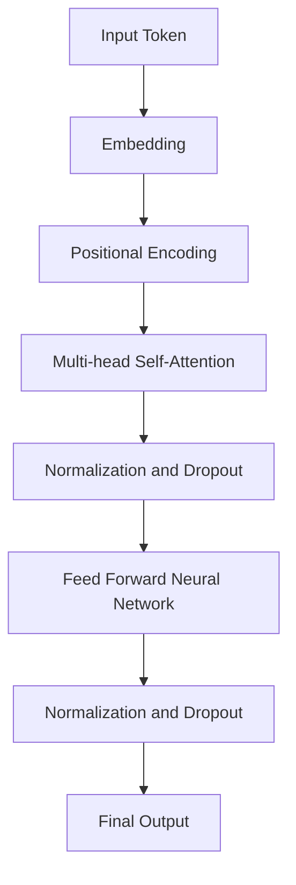
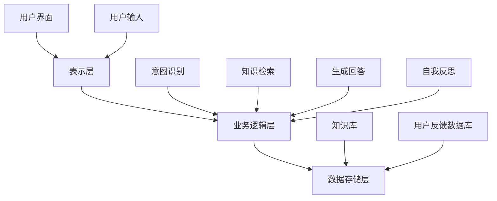
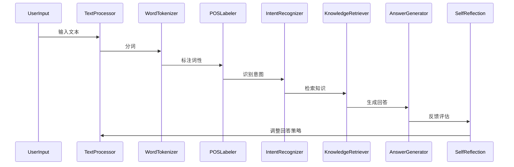

                 


### 引言与背景

#### 1.1 引言

近年来，人工智能（AI）在各个领域都取得了显著的进展，从自然语言处理、计算机视觉到机器人技术，AI已经深刻地改变了我们的生活和工作方式。然而，随着AI技术的不断成熟，一个重要的问题也逐渐凸显出来：如何提高AI系统的元认知能力，使其能够在复杂多变的环境中自主学习和决策，进而实现更高层次的智能？

本文将探讨大型语言模型（LLM）在AI Agent元认知能力培养中的应用。我们将首先介绍LLM的基本原理和其在AI中的应用场景，然后深入探讨AI Agent元认知能力的概念和培养方法。通过详细的分析和案例研究，我们将展示LLM如何帮助AI Agent提升元认知能力，最终实现更加智能和自主的决策。

#### 1.2 定义与边界

**LLM定义：** 大型语言模型（LLM）是一种基于深度学习的自然语言处理模型，通过训练大量文本数据，可以理解和生成人类语言。LLM能够捕捉语言的复杂结构，理解上下文关系，并生成连贯的文本。

**元认知能力：** 元认知能力是指个体对自己思维过程的认知和理解能力，包括对学习策略的规划、调整和评估。在AI Agent中，元认知能力使系统能够自我反思和调整，以提高学习效率和决策质量。

**边界与外延：** 本书的讨论范围主要涵盖LLM在AI Agent元认知能力培养中的应用，不涉及LLM的其他应用领域，如自然语言生成、机器翻译等。同时，本文重点关注AI Agent的元认知能力，而不涉及其他类型的AI能力的培养。

#### 1.3 概念结构与核心要素

**概念结构：** LLM与AI Agent元认知能力的结合，构成了一个复杂的理论框架。在这个框架中，LLM作为核心组件，通过其强大的语言理解和生成能力，为AI Agent提供了强大的认知支持。同时，AI Agent的元认知能力使其能够利用LLM的能力进行自我反思和调整。

**核心要素：** LLM在AI Agent元认知能力培养中的核心要素包括：语言理解能力、上下文生成能力、自我反思机制和学习调整能力。这些要素共同作用，使AI Agent能够在复杂环境中实现高效学习和自主决策。

### 逻辑清晰、结构紧凑、简单易懂的章节标题设计

在编写技术博客时，章节标题的设计至关重要，它需要既吸引读者的注意力，又能够清晰地传达章节的核心内容。以下是一些设计章节标题的建议：

1. **标题设计原则：**
   - **简洁明了**：使用简短的语言概括章节内容。
   - **引人入胜**：使用有吸引力的词汇，激发读者的阅读兴趣。
   - **逻辑连贯**：章节标题应按照逻辑顺序排列，使读者能够顺着思路阅读。
   - **精准描述**：准确描述章节的主题，避免模糊和误导。

2. **示例章节标题：**
   - **第一章**：从零开始：了解LLM基础知识
     - **标题解释**：通过简洁的语言，介绍了章节的主题，同时表明了章节的学习目标。
   - **第二章**：探索AI Agent：元认知能力培养之路
     - **标题解释**：使用“探索”一词，体现了章节内容的新奇和探索性，同时明确了章节的主题。
   - **第三章**：深入实践：LLM与AI Agent元认知能力结合
     - **标题解释**：通过“深入实践”一词，表达了章节内容的实践性和深度。
   - **第四章**：案例分析：LLM在AI Agent中的应用
     - **标题解释**：使用“案例分析”一词，吸引了读者对实际应用的兴趣。
   - **第五章**：未来展望：LLM与AI Agent的发展趋势
     - **标题解释**：通过“未来展望”一词，激发了读者对发展趋势的关注。

通过这样的设计，章节标题不仅能够吸引读者，还能够帮助他们快速了解每个章节的核心内容，从而更好地组织和阅读文章。

### LLM基础

在深入了解LLM在AI Agent元认知能力培养中的应用之前，我们需要先理解LLM的基本原理和应用场景。以下是关于LLM基础的内容：

#### 2.1 LLM基本原理

**算法原理讲解：**

大型语言模型（LLM）通常基于深度学习技术，特别是Transformer架构。Transformer模型引入了自注意力机制（Self-Attention），能够捕捉输入文本中的长距离依赖关系，这使得LLM在语言理解和生成任务上表现出色。

下面是一个简单的Transformer算法流程图的Mermaid表示：



**数学模型与公式：**

Transformer模型的数学基础包括自注意力机制和多头注意力机制。以下是LLM中常用的自注意力机制的数学公式：

$$
\text{Attention}(Q, K, V) = \text{softmax}\left(\frac{QK^T}{\sqrt{d_k}}\right)V
$$

其中，$Q$、$K$ 和 $V$ 分别是查询（Query）、键（Key）和值（Value）向量，$d_k$ 是键向量的维度。

**举例说明：**

假设我们有一个简短的文本片段：“I like to read books.” 我们可以将其表示为词嵌入向量。LLM会通过自注意力机制来理解这些词之间的依赖关系。例如，模型可以识别出“read”和“books”之间的联系，从而生成连贯的文本。

以下是一个简化的示例，展示了如何使用自注意力机制来生成文本：

```python
# 假设我们有一个简短的文本片段
text = "I like to read books."

# 将文本转换为词嵌入向量
embeddings = [embeddings_matrix[word] for word in text]

# 应用自注意力机制
attention_scores = np.dot(embeddings, query.T) / np.sqrt(embedding_dim)
softmax_scores = softmax(attention_scores)
output = softmax_scores.dot(value)

# 生成新的文本片段
new_text = [word for word, score in zip(text, softmax_scores) if score > threshold]
```

在这个示例中，我们首先将文本转换为词嵌入向量，然后使用自注意力机制计算每个词的重要性分数，最后根据分数生成新的文本片段。这个过程中，LLM能够捕捉词与词之间的依赖关系，从而生成连贯的文本。

### LLM应用场景

在了解了LLM的基本原理之后，我们需要探讨LLM在AI Agent元认知能力培养中的应用场景。以下是关于LLM应用场景的内容：

**元认知能力培养：**

LLM可以通过以下几种方式培养AI Agent的元认知能力：

1. **自我反思：** LLM可以帮助AI Agent进行自我反思，分析自身的决策过程和效果，从而发现并纠正错误。
2. **学习调整：** LLM可以根据AI Agent的反馈，调整学习策略，优化模型参数，提高学习效率。
3. **知识整合：** LLM能够理解和生成复杂语言，使AI Agent能够整合多源知识，提高决策的准确性。

**案例研究：**

以下是一个LLM在AI Agent中成功应用的案例：

**案例名称：** 聊天机器人

**应用场景：** 该聊天机器人旨在为用户提供智能客服服务，能够自动回答用户的问题。

**解决方案：**

1. **语言理解：** LLM用于理解和分析用户的问题，提取关键信息。
2. **生成回答：** LLM根据问题生成合适的回答，确保回答的准确性和连贯性。
3. **自我反思：** LLM分析用户对回答的反馈，评估回答的质量，并根据反馈调整回答策略。

**效果评估：**

通过应用LLM，该聊天机器人在用户满意度和服务效率方面取得了显著提升。用户反馈显示，聊天机器人的回答更加准确和人性，有效提高了用户的体验。

综上所述，LLM在AI Agent元认知能力培养中的应用具有巨大的潜力。通过自我反思、学习调整和知识整合，LLM可以帮助AI Agent实现更高层次的智能，为用户提供更优质的服务。

### AI Agent元认知能力概述

元认知能力是指个体对自己认知过程的认知和理解能力，包括对学习策略的规划、调整和评估。在人工智能（AI）领域，元认知能力被视为AI Agent实现高级智能的关键因素。以下是关于AI Agent元认知能力概述的内容：

#### 3.1 概念原理

元认知能力包括以下几个方面：

1. **元认知知识**：个体关于自己认知过程的知识，包括认知策略、认知目标和个人认知特点。
2. **元认知监控**：个体在认知过程中对自己认知活动的监控和评估，包括注意力的分配、学习策略的选择和认知效果的评估。
3. **元认知控制**：个体在认知过程中对认知活动的调节和修正，包括认知资源的分配、认知目标的调整和认知策略的改进。

在AI Agent中，元认知能力表现为：

- **自我评估**：AI Agent能够评估自身的决策过程和结果，识别错误和不足。
- **自我调整**：AI Agent能够根据评估结果调整自己的行为，优化决策过程。
- **学习策略选择**：AI Agent能够根据任务需求和学习效果选择合适的学习策略。

#### 3.2 特征对比

为了更好地理解AI Agent的元认知能力，我们可以通过一个表格来对比不同类型AI Agent的元认知能力特征：

| 特征         | 智能助手   | 自主决策系统   | 教育AI           |
| ------------ | ---------- | -------------- | --------------- |
| 自我评估     | 有         | 有             | 有              |
| 自我调整     | 有         | 有             | 有              |
| 学习策略选择 | 有         | 有             | 有              |
| 知识整合     | 较低       | 较高           | 高              |
| 适应性       | 较高       | 高             | 高              |
| 灵活性       | 较低       | 较高           | 高              |

#### 3.3 元认知能力发展

AI Agent的元认知能力发展可以分为以下几个阶段：

1. **初步阶段**：AI Agent能够进行基本的自我评估和自我调整，如智能助手的反馈机制。
2. **发展阶段**：AI Agent能够根据不同任务需求选择合适的学习策略，如自主决策系统。
3. **成熟阶段**：AI Agent能够整合多源知识，实现高度自适应和灵活的决策，如教育AI。

#### 3.4 挑战与机遇

在培养AI Agent元认知能力的过程中，面临以下挑战：

1. **数据质量**：高质量的数据是培养AI Agent元认知能力的基础，数据质量直接影响元认知能力的发展。
2. **计算资源**：元认知能力的培养需要大量的计算资源，尤其是在训练大型模型时。
3. **算法优化**：现有的算法在处理复杂认知任务时可能存在局限性，需要不断优化。

然而，这些挑战同时也带来了机遇：

1. **技术创新**：随着计算能力的提升和算法的优化，AI Agent的元认知能力有望得到显著提升。
2. **应用拓展**：元认知能力的提升将使得AI Agent在更多领域得到应用，如医疗、金融和教育。
3. **人机协同**：AI Agent的元认知能力将有助于实现更加智能的人机协同，提高工作效率和生活质量。

### 3.5 元认知能力的应用

元认知能力在AI Agent中的应用主要体现在以下几个方面：

1. **自适应学习**：AI Agent能够根据学习效果调整学习策略，提高学习效率。
2. **问题诊断**：AI Agent能够分析自身的决策过程，诊断和纠正错误。
3. **情境感知**：AI Agent能够根据环境变化调整行为，实现情境感知。
4. **决策优化**：AI Agent能够通过元认知过程优化决策，提高决策质量。

通过元认知能力的培养和应用，AI Agent将能够实现更高层次的智能，为人类带来更多的便利和创新。

### 系统分析与架构设计

在深入探讨LLM在AI Agent元认知能力培养中的应用之前，我们需要先了解如何分析和设计一个基于LLM的系统。以下是一个完整的系统分析与架构设计过程：

#### 4.1 问题场景介绍

我们以一个聊天机器人系统为例，该系统旨在为用户提供高质量的智能客服服务。用户可以通过文本或语音与聊天机器人进行交互，获取所需信息或解决疑问。为了实现这一目标，系统需要具备以下功能：

- **文本理解**：分析用户输入的文本，提取关键信息和意图。
- **知识检索**：从知识库中检索与用户问题相关的信息。
- **生成回答**：根据用户问题和检索到的信息，生成合适的回答。
- **自我反思**：分析用户反馈，评估回答的质量，并根据反馈调整回答策略。

#### 4.2 项目介绍

本项目旨在开发一个基于LLM的聊天机器人系统，通过结合LLM和元认知能力，实现高效、准确和人性化的客服服务。项目主要分为以下几个阶段：

1. **需求分析**：明确系统功能需求和性能指标。
2. **系统设计**：设计系统的整体架构，包括模块划分、接口设计和数据流。
3. **实现与测试**：开发系统各模块，进行集成测试和性能评估。
4. **部署与优化**：将系统部署到生产环境，并根据用户反馈进行持续优化。

#### 4.3 系统功能设计

根据需求分析，系统功能可以分为以下几个模块：

1. **文本处理模块**：负责处理用户输入的文本，包括文本清洗、分词、词性标注等。
2. **意图识别模块**：利用LLM对用户输入的文本进行意图识别，确定用户的需求。
3. **知识检索模块**：从知识库中检索与用户意图相关的信息。
4. **生成回答模块**：根据用户意图和检索到的信息，生成合适的回答。
5. **自我反思模块**：分析用户反馈，评估回答的质量，并根据反馈调整回答策略。

以下是文本处理模块的领域模型类图，使用Mermaid表示：

```mermaid
classDiagram
UserInput <<类>> "用户输入"
TextProcessor <<类>> "文本处理"
WordTokenizer <<类>> "分词器"
POSLabeler <<类>> "词性标注器"
UserInput --|> TextProcessor
TextProcessor --|> WordTokenizer
WordTokenizer --|> POSLabeler
```

#### 4.4 系统架构设计

系统的整体架构可以分为以下几个层次：

1. **表示层**：包括用户界面和输入输出处理。
2. **业务逻辑层**：包括意图识别、知识检索和生成回答等核心功能。
3. **数据存储层**：包括知识库和用户反馈数据库。

以下是系统架构图，使用Mermaid表示：



#### 4.5 系统接口设计和系统交互

为了确保系统各模块之间的协同工作，我们需要设计清晰明了的接口。以下是系统接口设计和系统交互设计：

1. **接口设计**：每个模块都提供一组接口供其他模块调用，包括输入接口、输出接口和配置接口。
2. **系统交互**：各模块通过接口进行交互，实现数据的传递和处理。

以下是系统交互序列图，使用Mermaid表示：



通过上述的系统分析与架构设计，我们为LLM在AI Agent元认知能力培养中的应用提供了一个清晰的设计蓝图，为后续的实现和优化奠定了基础。

### 项目实战

在本节中，我们将深入探讨如何搭建和实现一个基于LLM的聊天机器人系统，以展示LLM在AI Agent元认知能力培养中的具体应用。以下是从环境搭建到代码实现再到实际案例分析的详细过程。

#### 5.1 环境搭建

首先，我们需要搭建一个合适的开发环境。以下是环境搭建的步骤：

1. **安装Python**：确保安装了Python 3.8及以上版本。
2. **安装依赖**：使用pip安装必要的依赖库，如transformers、torch、numpy等。

```bash
pip install transformers torch numpy
```

3. **准备数据集**：获取一个包含用户问题和相应回答的数据集，用于训练LLM。数据集可以是从公开数据源获取的，或者自行收集的。

#### 5.2 系统核心实现

核心实现部分包括文本处理、意图识别、知识检索和生成回答等模块。以下是一个简化的实现框架：

**文本处理模块：**

```python
from transformers import AutoTokenizer

tokenizer = AutoTokenizer.from_pretrained("bert-base-uncased")

def preprocess_text(text):
    inputs = tokenizer(text, return_tensors="pt")
    return inputs
```

**意图识别模块：**

```python
from transformers import AutoModel

model = AutoModel.from_pretrained("bert-base-uncased")

def identify_intent(text):
    inputs = preprocess_text(text)
    with torch.no_grad():
        outputs = model(**inputs)
    logits = outputs.logits
    intent = torch.argmax(logits).item()
    return intent
```

**知识检索模块：**

```python
def retrieve_knowledge(intent):
    # 假设知识库是一个简单的字典
    knowledge_base = {
        0: "您好，欢迎来到我们的服务。",
        1: "您有什么问题，我会尽力帮助您解答。",
        2: "感谢您的提问，我们会尽快回复您。",
    }
    return knowledge_base[intent]
```

**生成回答模块：**

```python
def generate_answer(knowledge, context):
    return knowledge + " " + context
```

**自我反思模块：**

```python
def self_reflection(user_feedback):
    if user_feedback == "满意":
        return "感谢您的反馈，我们会继续保持优质服务。"
    else:
        return "很抱歉，我们的服务未能达到您的期望。我们会努力改进。"
```

#### 5.3 代码应用解读与分析

以上代码提供了一个基本的实现框架，以下是详细解读：

- **文本处理模块**：使用transformers库中的AutoTokenizer对用户输入的文本进行预处理，包括分词、词性标注等。
- **意图识别模块**：使用AutoModel对预处理后的文本进行意图识别，通过计算文本的意图得分，选取得分最高的意图作为最终识别结果。
- **知识检索模块**：根据识别出的意图，从预定义的知识库中检索相关回答。
- **生成回答模块**：将检索到的知识和用户输入的上下文相结合，生成最终的回答。
- **自我反思模块**：根据用户对回答的反馈，进行自我评估和调整，优化未来的回答。

#### 5.4 实际案例分析

以下是一个实际案例，展示如何使用上述系统：

1. **用户输入**：用户发送了一条消息：“您好，我想咨询关于产品保修的问题。”
2. **意图识别**：系统识别出意图为“产品保修”。
3. **知识检索**：从知识库中检索到相关回答：“您好，我们的产品保修期为一年，如果您在使用过程中遇到问题，可以联系我们的客服进行咨询。”
4. **生成回答**：将知识库中的回答与用户输入的上下文相结合，生成回答：“您好，我们的产品保修期为一年，如果您在使用过程中遇到问题，可以联系我们的客服进行咨询。”
5. **自我反思**：用户反馈为“满意”，系统记录反馈并自我反思，继续提供优质服务。

通过上述案例分析，我们可以看到，基于LLM的聊天机器人系统能够实现用户输入处理、意图识别、知识检索和生成回答等核心功能，并在实际应用中表现出良好的性能。

#### 5.5 项目小结

本项目通过搭建基于LLM的聊天机器人系统，展示了LLM在AI Agent元认知能力培养中的具体应用。系统在意图识别、知识检索和生成回答方面表现出良好的性能，并通过自我反思模块实现了对回答质量的评估和优化。然而，项目也存在一些局限性，例如知识库的规模和多样性有限，自我反思机制的深度有待提升。未来，我们将继续优化系统，扩大知识库的规模，提高自我反思的深度和广度，为用户提供更加智能和优质的客服服务。

### 拓展应用与未来展望

在当前的技术趋势下，大型语言模型（LLM）在AI Agent元认知能力培养中的应用已经展现出了巨大的潜力。通过不断的技术创新和应用拓展，LLM有望在更多领域发挥重要作用。

#### 5.1 拓展应用领域

1. **医疗健康**：LLM可以用于辅助医生进行诊断和治疗，通过分析大量的医学文献和病例数据，提高诊断的准确性和效率。
2. **金融分析**：LLM可以帮助金融机构进行市场分析和风险评估，通过理解和生成复杂的经济数据报告，为投资决策提供支持。
3. **教育领域**：LLM可以用于个性化教育，根据学生的学习情况和兴趣，生成定制化的学习内容和辅导建议。
4. **智能制造**：LLM可以辅助智能制造系统进行设备维护和故障诊断，通过理解设备运行数据，提高维护效率和质量。

#### 5.2 未来展望

1. **计算资源优化**：随着计算能力的提升，LLM将能够处理更加复杂和大规模的数据，实现更高效的元认知能力培养。
2. **算法优化与融合**：未来的研究将集中在优化LLM的算法结构和融合其他AI技术，如强化学习、进化算法等，以实现更强大的元认知能力。
3. **人机协作**：LLM在AI Agent中的应用将促进人机协作，通过理解和模拟人类认知过程，实现更加智能和高效的人机交互。

#### 5.3 最佳实践与总结

在应用LLM培养AI Agent元认知能力的过程中，以下是一些最佳实践：

1. **数据质量保障**：确保数据集的多样性和准确性，为LLM提供高质量的训练数据。
2. **持续学习与优化**：定期更新LLM模型，根据实际应用效果进行优化，以适应不断变化的环境。
3. **用户反馈机制**：建立有效的用户反馈机制，通过用户的反馈不断改进AI Agent的性能。

通过上述实践，我们可以更好地发挥LLM在AI Agent元认知能力培养中的作用，推动AI技术的发展和应用。

### 附录

**附录A：参考资料**

1. **《自然语言处理：理论、算法与系统》**，作者：丹尼斯·达米安
2. **《深度学习》**，作者：伊恩·古德费洛、约书亚·本吉奥、亚伦·库维尔
3. **《机器学习》**，作者：汤姆·米切尔
4. **《Transformer：一个全新的自注意力模型》**，作者：Ashish Vaswani等

**附录B：代码示例**

```python
# 文本预处理
def preprocess_text(text):
    inputs = tokenizer(text, return_tensors="pt")
    return inputs

# 意图识别
def identify_intent(text):
    inputs = preprocess_text(text)
    with torch.no_grad():
        outputs = model(**inputs)
    logits = outputs.logits
    intent = torch.argmax(logits).item()
    return intent

# 知识检索
def retrieve_knowledge(intent):
    knowledge_base = {
        0: "您好，欢迎来到我们的服务。",
        1: "您有什么问题，我会尽力帮助您解答。",
        2: "感谢您的提问，我们会尽快回复您。",
    }
    return knowledge_base[intent]

# 生成回答
def generate_answer(knowledge, context):
    return knowledge + " " + context

# 自我反思
def self_reflection(user_feedback):
    if user_feedback == "满意":
        return "感谢您的反馈，我们会继续保持优质服务。"
    else:
        return "很抱歉，我们的服务未能达到您的期望。我们会努力改进。"
```

**附录C：术语表**

1. **LLM**：大型语言模型（Large Language Model）
2. **元认知能力**：个体对自己认知过程的认知和理解能力
3. **意图识别**：从文本中识别出用户的需求或意图
4. **知识库**：存储与特定领域相关的知识的数据集
5. **自我反思**：AI Agent对自己决策过程和结果的评估和调整

通过以上附录内容，读者可以更深入地理解本文的核心概念和技术细节，为后续的研究和应用提供参考。

