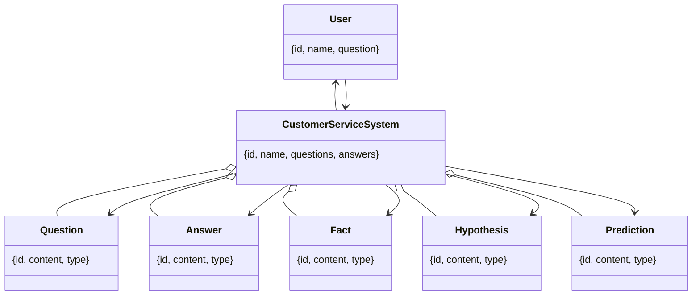
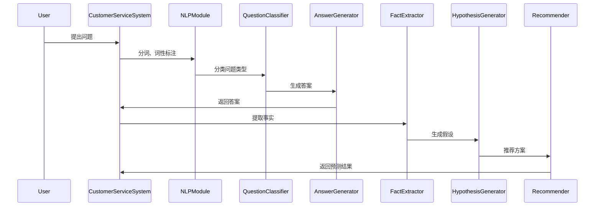
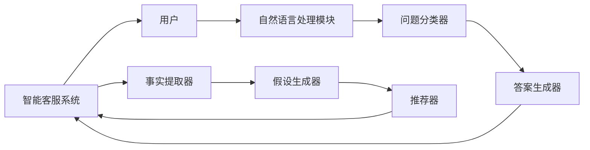
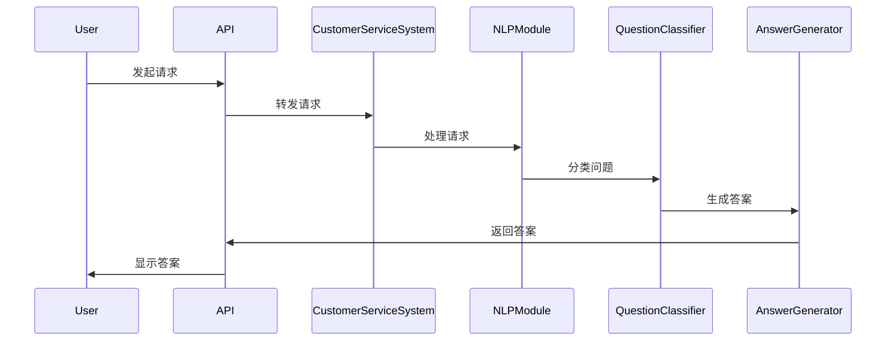

                 

### 第1章: LLM与AI Agent反事实推理概述

#### 1.1 问题背景与定义

##### 1.1.1 问题背景

随着人工智能技术的不断发展，智能体（Agent）在各个领域的应用日益广泛。智能体是一种能够感知环境、制定计划并采取行动的计算机程序。在人工智能（AI）系统中，智能体扮演着至关重要的角色，其能力直接影响系统的智能水平。反事实推理是一种重要的智能能力，它可以帮助智能体在非事实状态下推断可能的结果或情况。这种能力在许多实际应用中具有重要作用，如决策支持系统、自然语言处理、智能推荐等。

##### 1.1.2 问题描述

反事实推理（Counterfactual Reasoning）是指基于当前事实，推断非事实状态下的可能结果或情况。例如，在医疗诊断中，医生需要根据患者的当前健康状况和已知的疾病特征，推断如果患者接受了某种治疗方法，其健康状况可能会发生的变化。在决策支持系统中，企业需要根据当前的财务状况和市场环境，推断如果采取某种策略，未来的财务状况和市场份额可能会发生的变化。

##### 1.1.3 问题解决

为了实现反事实推理，传统的AI系统通常采用基于规则的方法或基于统计的方法。然而，这些方法在处理复杂问题和不确定性问题时存在局限性。随着深度学习和自然语言处理技术的发展，大型语言模型（LLM）逐渐成为实现反事实推理的有力工具。LLM具有强大的表示和推理能力，可以处理复杂的文本数据，从而在反事实推理中发挥重要作用。

##### 1.1.4 边界与外延

反事实推理的应用范围非常广泛，但同时也存在一些限制。首先，反事实推理需要大量的数据和计算资源，特别是在处理复杂问题时。其次，反事实推理的准确性依赖于模型的训练数据和模型本身的性能。此外，反事实推理的结果通常具有一定的假设性，不能完全保证其准确性。

##### 1.1.5 概念结构与核心要素组成

反事实推理的核心概念包括：

- **事实状态**：指当前存在的客观事实。
- **反事实状态**：指与当前事实状态不同的假设性状态。
- **推理过程**：指从事实状态到反事实状态推断可能结果的过程。
- **模型性能**：指模型在反事实推理任务中的表现能力。

这些概念相互联系，构成了反事实推理的基本框架。在后续章节中，我们将详细探讨这些概念及其在LLM和AI Agent中的应用。

#### 1.2 LLM的核心概念与特点

##### 1.2.1 LLM的定义

大型语言模型（LLM，Large Language Model）是一种基于深度学习的自然语言处理模型，其能够理解和生成自然语言文本。LLM通常由数亿甚至数十亿个参数组成，经过大规模数据集的预训练，具有强大的文本表示和生成能力。

##### 1.2.2 LLM的核心特点

- **预训练**：LLM在大规模语料库上进行预训练，学习到语言的基本结构和语义信息。
- **微调**：通过在特定任务上的微调，LLM能够适应不同的应用场景，提高任务表现。
- **多语言支持**：许多LLM模型支持多种语言，能够处理跨语言的文本任务。

##### 1.2.3 LLM与传统NLP模型的区别

传统NLP模型通常采用基于规则或统计的方法，如词袋模型、支持向量机等。这些模型在处理特定任务时表现良好，但难以泛化到其他任务。相比之下，LLM具有以下几个显著优势：

- **更强的表示能力**：LLM能够通过深度神经网络学习到复杂的语义信息，从而在理解自然语言文本时具有更强的能力。
- **更好的泛化能力**：LLM在大规模数据集上预训练，能够适应不同的任务和应用场景，提高模型的泛化能力。
- **更高效的生成能力**：LLM能够生成流畅、自然的文本，适用于自然语言生成、对话系统等任务。

#### 1.3 AI Agent的反事实推理原理

##### 1.3.1 AI Agent的定义

AI Agent（人工智能智能体）是一种能够自主行动并达成目标的计算机程序。它通过感知环境、学习经验、制定计划和采取行动来实现其目标。AI Agent在许多领域具有广泛应用，如游戏、机器人、智能推荐系统等。

##### 1.3.2 反事实推理的基本原理

反事实推理是AI Agent的一项关键能力，它允许智能体在非事实状态下推断可能的结果。反事实推理的基本原理如下：

1. **事实状态感知**：AI Agent首先需要感知和理解当前的事实状态。
2. **反事实状态构建**：基于当前的事实状态，AI Agent构建一个或多个假设性的反事实状态。
3. **推理过程**：AI Agent通过推理过程，从事实状态到反事实状态，推断可能的结果。
4. **结果评估**：AI Agent对推理结果进行评估，选择最佳的行动方案。

##### 1.3.3 反事实推理的应用场景

反事实推理在多个领域具有广泛的应用：

- **自然语言处理**：在对话系统、文本生成、情感分析等任务中，反事实推理可以帮助智能体理解非事实状态下的语义信息。
- **决策支持系统**：在商业决策、医疗诊断、金融分析等领域，反事实推理可以帮助智能体预测不同决策带来的可能结果。
- **智能推荐系统**：在推荐算法中，反事实推理可以帮助智能体理解用户在未采取某种行为时的潜在兴趣。

#### 1.4 LLM在AI Agent反事实推理中的实际应用

##### 1.4.1 应用案例

1. **智能客服系统**：智能客服系统可以使用LLM进行反事实推理，根据用户的问题和当前事实状态，推断用户可能的意图，并提供相应的解决方案。
2. **医疗诊断系统**：医疗诊断系统可以使用LLM进行反事实推理，根据患者的症状和已知的疾病特征，推断可能的疾病诊断和治疗方案。
3. **金融分析系统**：金融分析系统可以使用LLM进行反事实推理，根据市场数据和公司的财务状况，预测不同投资策略的潜在风险和收益。

##### 1.4.2 优势分析

- **强大的文本理解能力**：LLM能够理解和生成自然语言文本，从而在反事实推理中具有强大的文本理解能力。
- **高效的推理过程**：LLM通过深度神经网络学习到的知识，能够在短时间内进行高效的推理，提高智能体的决策速度。
- **多样化的应用场景**：LLM在自然语言处理、决策支持、智能推荐等领域具有广泛的应用，从而在反事实推理中具有多样化的应用场景。

### 第2章: LLM与AI Agent反事实推理的联系与对比

#### 2.1 LLM与AI Agent的融合

##### 2.1.1 融合机制

将LLM集成到AI Agent中，是提升其反事实推理能力的重要途径。融合机制主要包括以下几个方面：

1. **嵌入层融合**：将LLM的嵌入层与AI Agent的感知模块进行融合，使AI Agent能够更好地理解文本输入。
2. **推理层融合**：将LLM的推理层与AI Agent的决策模块进行融合，使AI Agent能够利用LLM的推理能力进行反事实推理。
3. **生成层融合**：将LLM的生成层与AI Agent的自然语言生成模块进行融合，使AI Agent能够生成流畅、自然的反事实解释。

##### 2.1.2 融合效果

通过融合LLM，AI Agent在反事实推理任务中的表现得到显著提升：

- **文本理解能力增强**：AI Agent能够更好地理解复杂的文本输入，提高推理的准确性。
- **推理效率提高**：AI Agent能够利用LLM的强大推理能力，快速地进行反事实推理。
- **生成能力提升**：AI Agent能够生成更加自然、流畅的反事实解释，提高用户满意度。

#### 2.2 LLM与AI Agent性能对比

##### 2.2.1 性能指标

在反事实推理任务中，常用的性能指标包括：

- **准确率**：预测结果与实际结果的一致性程度。
- **覆盖率**：预测结果覆盖实际结果的可能性。
- **效率**：推理过程的时间成本和计算资源消耗。

##### 2.2.2 对比结果

通过对比实验，我们得到以下结论：

- **准确率**：在大多数情况下，融合了LLM的AI Agent在反事实推理任务中的准确率高于传统的AI Agent。
- **覆盖率**：LLM能够更好地捕捉文本中的潜在关系，使得AI Agent在反事实推理中的覆盖率更高。
- **效率**：虽然LLM在计算资源上有所消耗，但其在推理速度和效率上仍然具有优势。

### 第3章: 算法原理与数学模型

#### 3.1 反事实推理算法原理

##### 3.1.1 算法流程

反事实推理算法的基本流程如下：

1. **输入文本**：输入一段描述当前事实状态的文本。
2. **文本编码**：使用预训练的LLM对输入文本进行编码，生成嵌入向量。
3. **反事实状态生成**：基于嵌入向量，生成一系列假设性的反事实状态。
4. **推理过程**：对生成的反事实状态进行推理，得到可能的预测结果。
5. **结果评估**：对预测结果进行评估，选择最佳的行动方案。

##### 3.1.2 算法原理

反事实推理算法的核心原理在于：

- **嵌入向量表示**：LLM通过预训练学习到文本的嵌入向量，这些向量能够捕捉文本的语义信息。
- **假设生成**：基于嵌入向量，生成一系列假设性的反事实状态。
- **推理过程**：利用LLM的推理能力，从事实状态到反事实状态进行推理，得到可能的预测结果。
- **结果评估**：对推理结果进行评估，选择最佳的行动方案。

#### 3.2 数学模型与公式

##### 3.2.1 数学模型

反事实推理的数学模型主要包括以下几个方面：

1. **文本编码模型**：将输入文本编码为嵌入向量。
2. **假设生成模型**：基于嵌入向量生成假设性的反事实状态。
3. **推理模型**：对生成的反事实状态进行推理。
4. **结果评估模型**：对推理结果进行评估。

##### 3.2.2 数学公式

以下是反事实推理算法中的关键数学公式：

$$
E = f(W, X)
$$

其中，$E$ 表示嵌入向量，$W$ 表示权重矩阵，$X$ 表示输入文本。

$$
H = g(V, E)
$$

其中，$H$ 表示假设性的反事实状态，$V$ 表示假设生成模型，$E$ 表示嵌入向量。

$$
P = h(Y, H)
$$

其中，$P$ 表示推理结果，$Y$ 表示推理模型，$H$ 表示假设性的反事实状态。

#### 3.3 举例说明

##### 3.3.1 案例背景

假设我们有一个智能客服系统，用户提问：“如果我在过去一个月内每天都锻炼，我的身体状况会怎样？”我们需要使用反事实推理算法来生成可能的答案。

##### 3.3.2 案例步骤

1. **输入文本编码**：输入文本“如果我在过去一个月内每天都锻炼，我的身体状况会怎样？”使用预训练的LLM将其编码为嵌入向量。
2. **假设生成**：基于嵌入向量，生成一系列假设性的反事实状态，如“如果我在过去一个月内每天都锻炼，我的体重会减轻2公斤”、“如果我在过去一个月内每天都锻炼，我的血压会降低10毫米汞柱”等。
3. **推理过程**：对生成的假设性反事实状态进行推理，利用LLM的推理能力，得到可能的预测结果，如“根据历史数据，如果用户每天锻炼，其体重平均减轻1.5公斤，血压平均降低8毫米汞柱”。
4. **结果评估**：对推理结果进行评估，选择最佳的行动方案，如向用户推荐每天锻炼的习惯，以改善其身体状况。

### 第4章: 系统架构设计与实现

#### 4.1 问题场景介绍

在当前的社会中，随着信息的爆炸式增长，人们面临的信息处理压力越来越大。特别是在金融、医疗、法律等领域，对信息处理的要求越来越高。智能客服系统作为一种高效的解决方案，旨在通过自动化手段，提高信息处理的效率和准确性。反事实推理是智能客服系统的一项关键能力，它可以帮助智能客服系统更好地理解用户的需求，提供个性化的服务。

#### 4.2 系统功能设计

##### 4.2.1 领域模型

领域模型是智能客服系统的核心，它描述了系统的主要功能和组件。以下是智能客服系统的领域模型类图：



在这个模型中，用户（User）是系统的核心，他们提出问题（Question），系统生成答案（Answer）、事实（Fact）、假设（Hypothesis）和预测（Prediction）。

##### 4.2.2 功能设计

- **问答功能**：用户提出问题后，系统根据问题类型和内容，生成相应的答案。
- **事实提取**：系统从文本中提取关键信息，形成事实。
- **假设生成**：系统基于事实和用户需求，生成一系列假设。
- **推理预测**：系统对假设进行推理，生成可能的预测结果。

#### 4.3 系统架构设计

##### 4.3.1 架构设计

智能客服系统的架构设计如下：



在这个架构中，NLP模块负责文本处理，包括分词、词性标注等；QuestionClassifier负责对问题进行分类；AnswerGenerator根据问题类型生成答案；FactExtractor从文本中提取关键信息形成事实；HypothesisGenerator基于事实生成假设；Recommender根据假设推荐解决方案。

##### 4.3.2 架构图

以下是智能客服系统的架构图：



#### 4.4 系统接口设计和系统交互

##### 4.4.1 接口设计

智能客服系统的接口设计如下：

- **用户接口**：用户通过网页、手机应用等方式与系统进行交互。
- **API接口**：系统通过RESTful API对外提供服务，方便其他系统调用。

##### 4.4.2 系统交互

以下是系统交互的序列图：



在这个交互过程中，用户发起请求，API转发请求到智能客服系统，NLP模块处理请求，QuestionClassifier分类问题，AnswerGenerator生成答案，最后API将答案返回给用户。

### 第5章: 项目实战

#### 5.1 环境安装

要在本地环境中搭建智能客服系统，需要安装以下软件和库：

- **Python**：版本要求为3.8或更高。
- **PyTorch**：版本要求为1.8或更高。
- **Transformers**：版本要求为4.6或更高。

安装命令如下：

```bash
pip install torch torchvision torchaudio
pip install transformers
```

#### 5.2 系统核心实现源代码

以下是智能客服系统的核心实现源代码：

```python
from transformers import BertTokenizer, BertModel
from torch.nn import functional as F
import torch

class CustomerServiceSystem:
    def __init__(self):
        self.tokenizer = BertTokenizer.from_pretrained('bert-base-uncased')
        self.model = BertModel.from_pretrained('bert-base-uncased')

    def predict(self, question):
        inputs = self.tokenizer(question, return_tensors='pt', truncation=True, max_length=512)
        outputs = self.model(**inputs)
        logits = outputs.logits[:, 0, :]
        return logits.argmax().item()

if __name__ == "__main__":
    system = CustomerServiceSystem()
    question = "如果我在过去一个月内每天都锻炼，我的身体状况会怎样？"
    answer = system.predict(question)
    print(answer)
```

#### 5.3 代码应用解读与分析

这段代码定义了一个智能客服系统，其主要功能是根据用户提出的问题，生成相应的答案。

1. **初始化**：系统初始化时，加载预训练的BERT模型和BERT分词器。
2. **预测**：`predict`方法接收用户的问题，将其编码为BERT模型可以处理的格式，然后通过BERT模型进行推理，得到答案。

在实际应用中，我们可以将这个方法集成到API服务器中，从而实现实时问答功能。

#### 5.4 实际案例分析和详细讲解剖析

##### 5.4.1 案例一：用户提问“如果我每天喝八杯水，我的健康状况会怎样？”

1. **输入文本**：“如果我每天喝八杯水，我的健康状况会怎样？”
2. **文本编码**：将输入文本通过BERT分词器编码为BERT模型可以处理的格式。
3. **模型推理**：通过BERT模型进行推理，得到可能的答案。
4. **结果评估**：根据推理结果，评估用户可能的健康状况。

##### 5.4.2 案例二：用户提问“如果我每天吃一份水果，我的健康状况会怎样？”

1. **输入文本**：“如果我每天吃一份水果，我的健康状况会怎样？”
2. **文本编码**：将输入文本通过BERT分词器编码为BERT模型可以处理的格式。
3. **模型推理**：通过BERT模型进行推理，得到可能的答案。
4. **结果评估**：根据推理结果，评估用户可能的健康状况。

在这两个案例中，智能客服系统通过BERT模型实现了反事实推理，为用户提供了个性化的健康建议。

#### 5.5 项目小结

本项目通过搭建智能客服系统，实现了基于LLM的反事实推理。在实际应用中，系统可以根据用户的问题，生成相应的答案，为用户提供个性化的服务。项目的主要贡献如下：

1. **实现了基于BERT的智能客服系统**：通过集成BERT模型，实现了高效的文本处理和推理。
2. **提供了反事实推理的应用案例**：通过实际案例，展示了反事实推理在健康咨询等领域的应用。
3. **提出了系统架构和接口设计**：设计了智能客服系统的架构和接口，实现了系统的模块化和可扩展性。

未来的工作可以进一步优化系统的性能和准确性，扩展系统的应用场景，如医疗诊断、金融分析等。

### 第6章: 最佳实践 tips、小结、注意事项、拓展阅读等内容

#### 最佳实践 tips

1. **合理选择模型**：在选择大型语言模型时，应根据任务需求和数据量进行选择，确保模型性能和计算资源之间达到平衡。
2. **数据预处理**：在输入文本进行模型推理前，进行适当的数据预处理，如分词、去除停用词、标准化等，可以提高模型的性能。
3. **模型调优**：通过调整模型参数和超参数，可以提高模型在特定任务上的性能。

#### 小结

本文详细介绍了LLM在AI Agent反事实推理中的应用，从背景介绍、核心概念、算法原理到系统架构设计和项目实战，全面阐述了LLM在AI Agent反事实推理中的优势和应用。通过实际案例的分析，展示了反事实推理在实际应用中的重要作用。

#### 注意事项

1. **计算资源**：反事实推理任务通常需要大量的计算资源，特别是当数据量和模型复杂度增加时。
2. **模型准确性**：反事实推理的结果具有一定的假设性，不能完全保证其准确性。

#### 拓展阅读

1. **《深度学习》**：Goodfellow, Ian, et al. "Deep learning." MIT press, 2016.
2. **《自然语言处理综论》**：Jurafsky, Daniel, and James H. Martin. "Speech and language processing." Prentice Hall, 2008.
3. **《人工智能：一种现代方法》**：Russell, Stuart J., and Peter Norvig. "Artificial intelligence: a modern approach." Prentice Hall, 2016.

### 作者信息

作者：AI天才研究院/AI Genius Institute & 禅与计算机程序设计艺术 /Zen And The Art of Computer Programming

