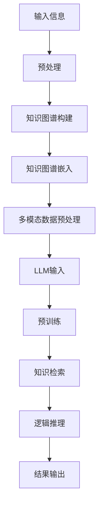
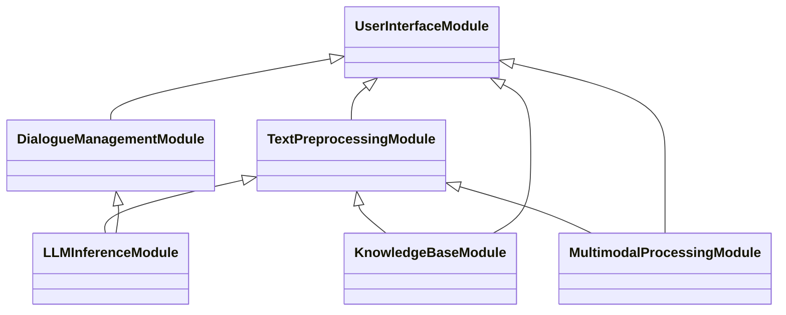
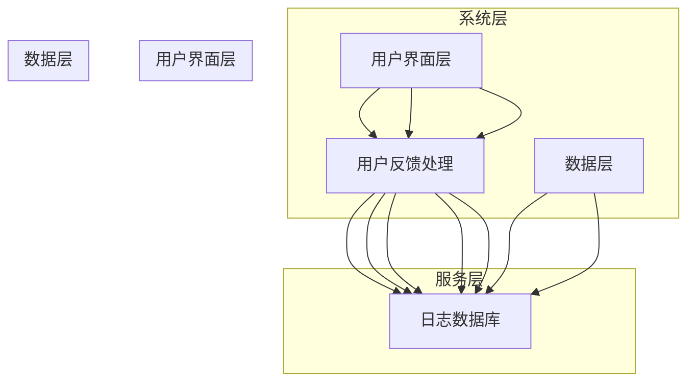
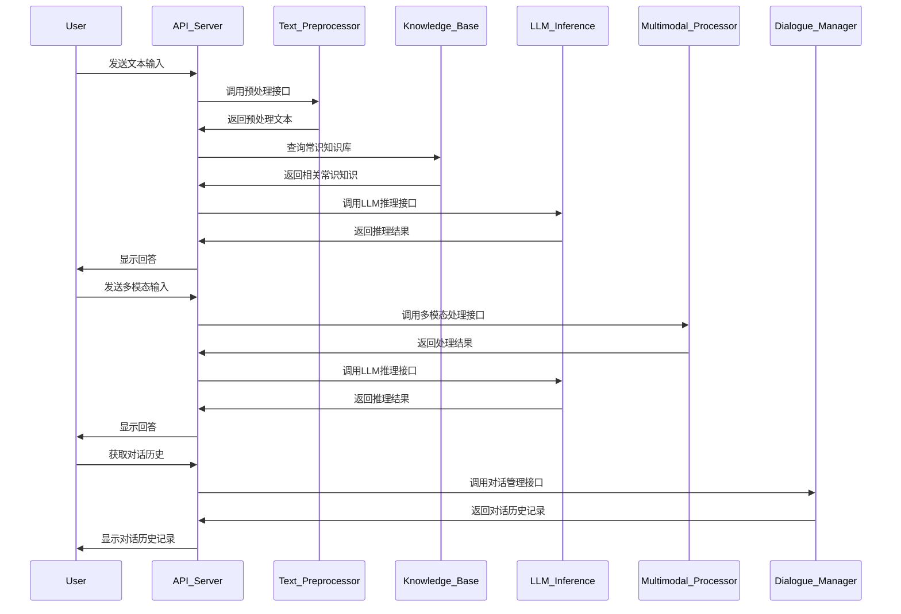

                 

### # LLAMA在AI Agent常识推理中的应用

> 关键词：LLAMA、AI Agent、常识推理、算法原理、系统架构、实战案例

> 摘要：本文深入探讨了大型语言模型（LLAMA）在AI Agent常识推理中的应用。首先，我们介绍了常识推理在AI Agent中的挑战及其重要性，然后详细阐述了LLAMA的基本概念、训练过程和主要特点。接着，我们分析了常识推理的原理，比较了LLAMA与常识推理相关概念和方法。文章随后重点讲解了LLAMA在常识推理中的算法原理和Python实现，通过mermaid流程图和数学公式详细说明了算法的逻辑。随后，我们介绍了系统的分析与架构设计，包括问题场景、系统功能、系统架构和接口设计。通过一个实际案例，我们展示了LLAMA在AI Agent常识推理中的具体应用，并进行了深入分析。最后，文章总结了最佳实践和注意事项，为读者提供了深入理解和实践LLAMA在常识推理中的应用的指导。

## # 目录大纲

## 第一部分：问题背景

### 1.1 问题背景介绍

#### 1.1.1 AI Agent常识推理的挑战

#### 1.1.2 LLM在常识推理中的应用

#### 1.1.3 本书的目标与结构

### 1.2 问题解决方法概述

#### 1.2.1 LLM的基本概念

#### 1.2.2 LLM在AI Agent中的应用

### 1.3 边界与外延

#### 1.3.1 常识推理的定义与范畴

#### 1.3.2 LLM在常识推理中的限制

### 1.4 核心概念与联系

#### 1.4.1 LLM的核心原理

#### 1.4.2 常识推理的相关概念

#### 1.4.3 概念属性特征对比表格

#### 1.4.4 ER实体关系图架构

## 第二部分：核心概念与原理

### 2.1 LLM的核心概念

#### 2.1.1 LLM的定义与作用

#### 2.1.2 LLM的训练过程

#### 2.1.3 LLM的主要特点

### 2.2 常识推理的原理

#### 2.2.1 常识推理的定义与分类

#### 2.2.2 常识推理的过程与方法

#### 2.2.3 常识推理的挑战

### 2.3 LLM在常识推理中的应用

#### 2.3.1 LLM在常识推理中的优势

#### 2.3.2 LLM在常识推理中的应用场景

#### 2.3.3 LLM在常识推理中的实现方法

### 2.4 概念属性特征对比表格

#### 2.4.1 LLM与常识推理相关概念对比

#### 2.4.2 LLM与常识推理方法对比

## 第三部分：算法原理与实现

### 3.1 算法原理讲解

#### 3.1.1 常识推理算法的基本原理

#### 3.1.2 LLM在常识推理中的应用原理

#### 3.1.3 常识推理算法的mermaid流程图

### 3.2 Python源代码实现

#### 3.2.1 常识推理算法的Python实现

#### 3.2.2 Python代码详细解读与分析

### 3.3 数学模型与公式

#### 3.3.1 常识推理算法的数学模型

#### 3.3.2 数学公式的详细讲解

#### 3.3.3 举例说明

## 第四部分：系统分析与架构设计

### 4.1 问题场景介绍

#### 4.1.1 AI Agent常识推理的需求

#### 4.1.2 LLM在AI Agent常识推理中的应用场景

### 4.2 系统功能设计

#### 4.2.1 领域模型mermaid类图

#### 4.2.2 系统功能设计与实现

### 4.3 系统架构设计

#### 4.3.1 系统架构mermaid架构图

#### 4.3.2 系统架构设计与优化

### 4.4 系统接口设计

#### 4.4.1 系统接口设计与实现

#### 4.4.2 接口调用的mermaid序列图

## 第五部分：项目实战

### 5.1 环境安装与配置

#### 5.1.1 开发环境的安装与配置

#### 5.1.2 相关库和工具的安装

### 5.2 系统核心实现源代码

#### 5.2.1 常识推理算法的实现

#### 5.2.2 系统功能的核心代码

### 5.3 代码应用解读与分析

#### 5.3.1 代码架构与模块分析

#### 5.3.2 关键代码解读与分析

### 5.4 实际案例分析

#### 5.4.1 案例背景与目标

#### 5.4.2 案例实施过程

#### 5.4.3 案例分析与总结

### 5.5 项目小结

#### 5.5.1 项目总结与反思

#### 5.5.2 项目中的难点与解决方法

#### 5.5.3 项目中的收获与拓展

## 第六部分：最佳实践与注意事项

### 6.1 最佳实践 tips

#### 6.1.1 常见问题与解决方案

#### 6.1.2 优化策略与技巧

#### 6.1.3 部署与维护

### 6.2 小结

#### 6.2.1 总结

#### 6.2.2 注意事项

#### 6.2.3 拓展阅读

---

### 第一部分：问题背景

#### 1.1 问题背景介绍

##### 1.1.1 AI Agent常识推理的挑战

人工智能（AI）技术近年来取得了显著的进展，特别是深度学习、自然语言处理（NLP）等领域的发展，使得AI Agent在多个应用场景中表现出色。然而，尽管AI Agent在执行特定任务方面取得了巨大的成功，但它们仍然面临一个核心挑战——常识推理。

常识推理是指人类在日常生活中的直觉推理能力，涉及对世界的普遍知识和基本规律的理解。例如，当我们看到一辆车时，我们不需要额外的信息就知道它通常是用来运输人和物的。这种常识推理对于人类来说是自然且直观的，但对于AI Agent来说却是一个巨大的挑战。

首先，常识推理需要AI Agent具备广泛的知识和背景信息。与特定领域的专业知识不同，常识知识涉及生活中的方方面面，包括物理、社会、文化等多个领域。这使得常识推理成为一个复杂的任务，需要AI Agent具备强大的知识获取和整合能力。

其次，常识推理需要AI Agent能够处理模糊和不完整的输入信息。现实世界中的信息往往是模糊的、不完整的，而常识推理需要在这些条件下进行有效的推理。例如，当AI Agent听到“我想要一杯咖啡”时，它需要理解“一杯咖啡”的具体含义，尽管这个请求可能是模糊的或存在多种解释。

最后，常识推理需要AI Agent具备一定的逻辑推理能力。常识推理不仅仅是简单的匹配或分类，而是涉及复杂的推理过程，包括因果关系、条件推理、概率推理等。这要求AI Agent不仅要有丰富的知识库，还要有高效的推理算法。

##### 1.1.2 LLM在常识推理中的应用

为了解决AI Agent在常识推理方面的挑战，研究人员开始探索使用大型语言模型（LLM）进行常识推理。LLM是一种基于深度学习的语言处理模型，通过大规模的文本数据训练，可以掌握丰富的语言知识和上下文理解能力。

LLM在常识推理中的应用主要体现在以下几个方面：

1. **知识获取与整合**：LLM可以通过学习大量的文本数据，获取广泛的知识和背景信息。这些知识可以用来补充AI Agent的常识知识库，提高其在常识推理任务中的表现。

2. **上下文理解**：LLM具有强大的上下文理解能力，可以处理模糊和不完整的输入信息。例如，当AI Agent接收到一个模糊的请求时，LLM可以帮助它理解请求的具体含义，并提供相应的响应。

3. **逻辑推理**：LLM的训练过程中，通过学习大量的文本和语言规律，可以掌握一定的逻辑推理能力。这种能力可以用于AI Agent进行复杂的常识推理任务，如因果关系分析和条件推理。

##### 1.1.3 本书的目标与结构

本书的目标是深入探讨LLM在AI Agent常识推理中的应用，帮助读者理解和掌握这一领域的核心概念、算法原理和实现方法。具体目标如下：

1. **理解常识推理的基本概念和挑战**：介绍常识推理的定义、分类和挑战，为后续内容打下基础。

2. **掌握LLM的基本概念和训练过程**：详细解释LLM的定义、作用、训练过程和主要特点，帮助读者建立对LLM的基本认识。

3. **分析LLM在常识推理中的应用**：探讨LLM在常识推理中的优势、应用场景和实现方法，为读者提供实际应用指导。

4. **讲解算法原理和实现方法**：通过详细的算法原理讲解、mermaid流程图和Python源代码实现，帮助读者深入理解LLM在常识推理中的工作原理。

5. **介绍系统架构设计和项目实战**：通过系统分析和架构设计、实际案例分析，展示LLM在AI Agent常识推理中的应用场景和实现过程。

6. **总结最佳实践和注意事项**：提供最佳实践和注意事项，帮助读者在实际项目中有效应用LLM进行常识推理。

本书的结构如下：

- **第一部分**：问题背景，介绍AI Agent常识推理的挑战和LLM在常识推理中的应用。
- **第二部分**：核心概念与原理，详细讲解LLM的基本概念、常识推理原理和LLM在常识推理中的应用。
- **第三部分**：算法原理与实现，讲解常识推理算法的原理、Python源代码实现和数学模型与公式。
- **第四部分**：系统分析与架构设计，介绍系统功能设计、系统架构设计和系统接口设计。
- **第五部分**：项目实战，通过环境安装与配置、系统核心实现源代码、代码应用解读与分析、实际案例分析和项目小结，展示LLM在AI Agent常识推理中的应用。
- **第六部分**：最佳实践与注意事项，总结最佳实践、注意事项和小结。

#### 1.2 问题解决方法概述

##### 1.2.1 LLM的基本概念

LLM（Large Language Model）是一种基于深度学习的自然语言处理模型，通过训练大规模的文本数据集，可以生成高质量的自然语言文本，具备强大的语言理解和生成能力。LLM的核心思想是通过学习大量文本数据中的模式和规律，建立一个能够理解自然语言的神经网络模型。

LLM的基本概念包括：

1. **输入和输出**：LLM的输入是自然语言文本序列，输出是生成的文本序列。LLM可以接受任意长度的输入文本，并生成相应的输出文本。

2. **预训练和微调**：LLM通常通过预训练（pre-training）和微调（fine-tuning）两个阶段进行训练。预训练是在大规模的文本数据集上进行，使模型掌握通用的语言知识；微调是在特定任务的数据集上进行，使模型适应具体任务的需求。

3. **自注意力机制**：LLM的核心架构是Transformer，它通过自注意力机制（self-attention）来处理输入文本序列。自注意力机制可以使模型在不同位置之间建立关联，从而更好地理解上下文信息。

4. **参数规模**：LLM的参数规模非常大，从数十亿到数千亿不等。参数规模的大小直接影响模型的性能和生成文本的质量。

##### 1.2.2 LLM在AI Agent中的应用

LLM在AI Agent中的应用主要体现在以下几个方面：

1. **知识获取**：LLM可以通过预训练和微调学习大量的文本数据，获取广泛的知识和背景信息。这些知识可以用于补充AI Agent的知识库，提高其在常识推理任务中的表现。

2. **对话生成**：LLM可以用于生成自然语言的对话文本，实现AI Agent与用户的自然交互。通过学习大量的对话数据，LLM可以生成高质量、连贯的对话文本，提高用户的满意度。

3. **文本生成**：LLM可以用于生成各种类型的文本，如新闻文章、故事、电子邮件等。这些生成的文本可以用于自动化内容生成、内容推荐等应用场景。

4. **文本分类和情感分析**：LLM可以用于文本分类和情感分析任务，通过学习大量的文本数据，LLM可以识别文本中的主题、情感和观点，为AI Agent提供更准确的判断和决策。

##### 1.2.3 本书的目标与结构

本书的目标是深入探讨LLM在AI Agent常识推理中的应用，帮助读者理解和掌握这一领域的核心概念、算法原理和实现方法。具体目标如下：

1. **理解常识推理的基本概念和挑战**：介绍常识推理的定义、分类和挑战，为后续内容打下基础。

2. **掌握LLM的基本概念和训练过程**：详细解释LLM的定义、作用、训练过程和主要特点，帮助读者建立对LLM的基本认识。

3. **分析LLM在常识推理中的应用**：探讨LLM在常识推理中的优势、应用场景和实现方法，为读者提供实际应用指导。

4. **讲解算法原理和实现方法**：通过详细的算法原理讲解、mermaid流程图和Python源代码实现，帮助读者深入理解LLM在常识推理中的工作原理。

5. **介绍系统架构设计和项目实战**：通过系统分析和架构设计、实际案例分析，展示LLM在AI Agent常识推理中的应用场景和实现过程。

6. **总结最佳实践和注意事项**：提供最佳实践和注意事项，帮助读者在实际项目中有效应用LLM进行常识推理。

本书的结构如下：

- **第一部分**：问题背景，介绍AI Agent常识推理的挑战和LLM在常识推理中的应用。
- **第二部分**：核心概念与原理，详细讲解LLM的基本概念、常识推理原理和LLM在常识推理中的应用。
- **第三部分**：算法原理与实现，讲解常识推理算法的原理、Python源代码实现和数学模型与公式。
- **第四部分**：系统分析与架构设计，介绍系统功能设计、系统架构设计和系统接口设计。
- **第五部分**：项目实战，通过环境安装与配置、系统核心实现源代码、代码应用解读与分析、实际案例分析和项目小结，展示LLM在AI Agent常识推理中的应用。
- **第六部分**：最佳实践与注意事项，总结最佳实践、注意事项和小结。

#### 1.3 边界与外延

##### 1.3.1 常识推理的定义与范畴

常识推理（Commonsense Reasoning）是指利用日常生活中的基本知识和直觉进行推理的能力。常识推理是人类智能的核心组成部分，使得人类能够在复杂的、不确定的环境中做出合理的判断和决策。常识推理的定义可以从以下几个方面来理解：

1. **知识基础**：常识推理依赖于广泛的知识，这些知识涵盖了物理、社会、文化等多个领域。例如，物理知识可以帮助我们理解物体如何运动，社会知识可以帮助我们理解人类行为和社交规则。

2. **直觉性**：常识推理是直观的，不需要经过复杂的推理过程。人类可以通过直觉快速地做出常识推理，如看到天空中的太阳就知道是白天。

3. **普遍性**：常识推理是普遍适用的，不受特定文化、语言或地域的限制。例如，对于“雨后会有彩虹”这一常识，无论在哪个国家、哪种语言环境中，人们都能理解和接受。

4. **模糊性**：常识推理通常处理的是模糊和不完整的信息。现实世界中的信息往往是模糊的、不完整的，常识推理需要在这些条件下进行有效的推理。

常识推理的范畴包括以下几个方面：

- **物理常识**：涉及物体、空间和时间的理解，如“物体下落会加速”。
- **社会常识**：涉及人类社会行为和规则的理解，如“人们通常遵守交通规则”。
- **情境常识**：涉及特定情境下的常识推理，如“在餐馆用餐时，人们通常使用餐具”。

##### 1.3.2 LLM在常识推理中的限制

尽管LLM在常识推理方面展现了巨大的潜力，但它也存在一些限制和挑战：

1. **知识获取的局限性**：LLM的知识来源于训练数据，而训练数据可能存在偏差或不完整。这可能导致LLM在常识推理中产生错误或误导性推理。

2. **上下文理解的局限性**：尽管LLM具有强大的上下文理解能力，但在处理长文本或复杂情境时，仍可能存在理解上的局限性。这可能导致LLM在常识推理中产生错误推理。

3. **逻辑推理的局限性**：LLM的训练过程中，虽然通过学习大量的文本数据掌握了丰富的语言规律，但其在逻辑推理方面的能力仍有限。例如，LLM可能难以处理复杂的条件推理和因果分析。

4. **不确定性处理**：常识推理通常处理的是模糊和不完整的信息，而LLM在处理不确定性方面的能力仍需进一步提高。这可能导致LLM在常识推理中产生不准确的结论。

##### 1.3.3 常识推理与LLM的关系

常识推理与LLM之间存在密切的关系。LLM通过学习大量的文本数据，可以获取广泛的知识和背景信息，这为常识推理提供了基础。同时，LLM的强大语言理解和生成能力使其能够处理模糊和不完整的输入信息，提高常识推理的准确性和有效性。

然而，常识推理与LLM也存在一定的差异。常识推理不仅涉及知识获取和上下文理解，还包括逻辑推理和不确定性处理。而LLM虽然具备一定的语言理解和生成能力，但在逻辑推理和不确定性处理方面仍存在一定的局限性。

总之，LLM在常识推理中具有巨大的应用潜力，但同时也面临一些挑战。通过深入研究和优化LLM，我们可以进一步提升其在常识推理任务中的性能，为AI Agent提供更强大的常识推理能力。

#### 1.4 核心概念与联系

##### 1.4.1 LLM的核心原理

大型语言模型（LLM）是一种基于深度学习的自然语言处理模型，其核心原理基于自注意力机制和Transformer架构。LLM的训练过程主要包括预训练和微调两个阶段。

1. **自注意力机制**：自注意力机制是一种在神经网络中处理序列数据的方法，它通过计算序列中每个元素与其他元素的相关性，以加权组合这些元素，从而提高模型的上下文理解能力。

2. **Transformer架构**：Transformer架构是一种基于自注意力机制的神经网络模型，它通过多头自注意力机制和位置编码来处理自然语言文本。Transformer架构在自然语言处理任务中表现出色，特别是机器翻译和文本生成。

3. **预训练**：预训练是指在大量无标签的文本数据上训练模型，使模型具备通用的语言理解和生成能力。预训练的过程包括两个阶段：第一阶段是自回归语言模型（Autoregressive Language Model），即模型根据前面的输入文本序列预测下一个单词；第二阶段是掩码语言模型（Masked Language Model），即对输入文本进行部分掩码，模型需要预测被掩码的单词。

4. **微调**：微调是指在特定任务的数据集上对预训练的模型进行细粒度调整，使其适应具体任务的需求。微调的过程通常包括两个步骤：第一步是Fine-tuning，即直接在任务数据集上进行训练；第二步是Few-shot Learning，即通过少量样本快速适应新任务。

##### 1.4.2 常识推理的相关概念

常识推理（Commonsense Reasoning）是指利用日常生活中的基本知识和直觉进行推理的能力。常识推理涉及以下几个方面：

1. **知识获取**：常识推理依赖于广泛的知识，这些知识包括物理、社会、文化等多个领域。知识获取的过程是通过学习和积累知识，使模型具备常识推理的能力。

2. **逻辑推理**：常识推理不仅仅是简单的匹配或分类，还包括复杂的逻辑推理过程，如因果关系、条件推理、概率推理等。逻辑推理是常识推理的核心组成部分，使模型能够处理复杂的问题。

3. **上下文理解**：常识推理需要模型具备上下文理解能力，即能够根据不同的上下文信息进行推理。上下文理解是常识推理的关键，使模型能够处理模糊和不完整的输入信息。

4. **直觉推理**：常识推理是直觉性的，模型需要通过学习大量的数据，形成一种直觉推理能力。直觉推理使模型能够快速、准确地处理常识推理任务。

##### 1.4.3 概念属性特征对比表格

以下是LLM和常识推理的相关概念和属性特征对比表格：

| 概念       | LLM                   | 常识推理                |
|------------|-----------------------|-------------------------|
| 定义       | 大型语言模型          | 利用日常知识进行推理的能力 |
| 目标       | 语言理解和生成        | 常识知识的应用与推理      |
| 核心原理   | 自注意力机制、Transformer架构 | 知识获取、逻辑推理、上下文理解、直觉推理 |
| 训练过程   | 预训练、微调          | 通过学习和积累知识进行训练 |
| 应用领域   | 语言生成、文本分类、问答系统 | 常识推理、知识图谱、智能客服 |
| 优势       | 强大的语言理解与生成能力 | 广泛的知识和背景信息、直觉性推理 |
| 挑战       | 数据依赖、上下文理解限制 | 处理模糊和不完整信息、逻辑推理的准确性 |

##### 1.4.4 ER实体关系图架构

ER（Entity-Relationship）图是一种用于描述实体及其关系的图形化表示方法，它可以帮助我们更好地理解数据和系统架构。在LLM和常识推理的应用中，ER图可以用于表示知识图谱和实体关系。

以下是LLM和常识推理相关的ER图示例：

```mermaid
erDiagram
    AI_Agent ||--|{ LLM } LLM
    LLM ||--|{常识推理模块} 常识推理模块
    AI_Agent ||--|{ 数据集 } 数据集
    数据集 ||--|{ 常识知识 } 常识知识
```

在上面的ER图中：

- `AI_Agent` 表示人工智能代理，负责执行常识推理任务。
- `LLM` 表示大型语言模型，用于提供常识推理模块。
- `常识推理模块` 表示LLM的具体实现，用于处理常识推理任务。
- `数据集` 表示用于训练和测试的文本数据集，包括常识知识。

通过ER图，我们可以清晰地看到LLM在常识推理中的应用关系，以及各个实体之间的关系。

#### 1.5.1 LLM的定义与作用

大型语言模型（LLM，Large Language Model）是一种基于深度学习的自然语言处理模型，旨在通过学习大量文本数据来理解和生成自然语言。LLM的核心作用是提升人工智能系统在文本理解和生成任务上的性能，从而实现更自然、更智能的人机交互。

1. **定义**：LLM是一种拥有数亿甚至千亿级别参数的神经网络模型，通过自注意力机制和Transformer架构进行训练，能够捕捉文本数据中的复杂模式和语义信息。

2. **作用**：

   - **文本理解**：LLM能够理解文本中的单词、短语和句子的语义，并提取关键信息，从而在问答系统、信息抽取和情感分析等任务中发挥作用。
   
   - **文本生成**：LLM能够根据给定的文本输入生成连贯、自然的文本输出，如自动撰写文章、生成对话和生成摘要等。
   
   - **自然语言交互**：LLM能够与用户进行自然语言对话，回答用户的问题、提供建议和执行指令，从而提高人机交互的便捷性和人性化。

3. **重要性**：LLM在人工智能领域具有重要地位，它不仅推动了自然语言处理技术的发展，也为各个行业提供了强大的工具。例如，在智能客服、内容创作、教育和医疗等领域，LLM的应用极大地提高了工作效率和用户体验。

#### 1.5.2 LLM的训练过程

LLM的训练过程可以分为预训练（Pre-training）和微调（Fine-tuning）两个阶段。

1. **预训练**：

   - **数据集**：预训练阶段通常使用大规模的文本数据集，如维基百科、新闻文章和社交媒体帖子等。
   
   - **模型架构**：预训练阶段使用的是Transformer架构，包括编码器（Encoder）和解码器（Decoder）。编码器将输入文本编码成向量表示，解码器根据这些向量生成输出文本。
   
   - **训练目标**：预训练阶段的主要目标是使模型学会对文本进行编码和解码，从而理解文本的语义和结构。具体包括：

     - **自回归语言模型（Autoregressive Language Model）**：模型根据前面的文本输入预测下一个单词。
     
     - **掩码语言模型（Masked Language Model）**：对输入文本中的部分单词进行掩码，模型需要预测这些被掩码的单词。
     
   - **优化方法**：预训练阶段使用的是梯度下降优化算法，结合多种正则化技术（如Dropout、Weight Decay等）来提高模型的稳定性和泛化能力。

2. **微调**：

   - **数据集**：微调阶段使用的是特定领域的任务数据集，如问答数据集、情感分析数据集和机器翻译数据集等。
   
   - **训练目标**：微调阶段的目标是使模型在特定任务上达到较高的性能。具体包括：

     - **任务适配**：根据特定任务的特性，对模型的结构和参数进行调整。
     
     - **损失函数**：使用与任务相关的损失函数来评估模型的表现，并进行优化。
     
   - **优化方法**：微调阶段同样使用梯度下降优化算法，但在任务数据集上进行迭代训练，并通过交叉验证等技术评估模型的性能。

#### 1.5.3 LLM的主要特点

LLM具备以下几个主要特点，这些特点使得LLM在自然语言处理任务中表现出色：

1. **大规模参数**：LLM通常拥有数亿甚至千亿级别的参数，这使得模型能够捕捉到文本数据中的复杂模式和语义信息。

2. **自注意力机制**：自注意力机制使模型能够自动关注输入文本中的关键信息，提高模型的上下文理解和生成能力。

3. **Transformer架构**：Transformer架构使得LLM能够高效地处理长文本和长序列，并且能够并行化训练，提高训练效率。

4. **强泛化能力**：通过预训练和微调，LLM能够跨领域、跨语言的泛化，适用于各种自然语言处理任务。

5. **多模态处理**：LLM不仅可以处理文本数据，还可以结合图像、声音等多模态数据，实现更丰富的语义理解。

6. **动态适应性**：LLM能够根据不同的任务需求和输入数据动态调整自身的参数和结构，实现灵活的任务适配。

### 第二部分：核心概念与原理

#### 2.1.1 常识推理的定义与分类

常识推理（Commonsense Reasoning）是指基于日常经验和普遍知识进行推理的能力，它涉及人类在日常生活中对物体、事件、社会规则等的基本理解。常识推理是人类智能的重要组成部分，使得人类能够快速、直觉性地处理复杂问题。常识推理的定义可以从以下几个方面来理解：

1. **基础知识**：常识推理依赖于广泛的知识，这些知识来源于个人的生活经验、教育背景和文化环境。这些基础知识是常识推理的基础，帮助人们理解和解释周围的世界。

2. **直觉性**：常识推理是直觉性的，它不需要经过复杂的逻辑推理过程，而是通过直觉快速做出判断。例如，当看到天空中飘着雨滴时，人们会直觉性地认为外面在下雨。

3. **普遍适用性**：常识推理是普遍适用的，不受特定文化、地域或语言限制。例如，无论在哪个国家，人们都会认为水是生命之源。

4. **情境依赖性**：常识推理在不同情境下可能有所不同。例如，在交通情境中，常识推理会涉及交通规则和交通信号的理解。

常识推理的分类可以从不同角度进行：

1. **物理常识**：物理常识涉及对物理世界的理解和解释，如物体运动规律、空间感知等。

2. **社会常识**：社会常识涉及对社会规则、人际交往和社会行为的理解，如礼貌用语、社会规范等。

3. **情境常识**：情境常识涉及特定情境下的常识推理，如饮食礼仪、驾驶规则等。

4. **文化常识**：文化常识涉及对不同文化背景和习俗的理解，如节日庆祝、礼仪规范等。

#### 2.1.2 常识推理的过程与方法

常识推理的过程和方法可以分为以下几个步骤：

1. **感知与识别**：首先，个体需要感知和识别周围环境中的信息，如声音、视觉和触觉等。这些感知信息是常识推理的基础。

2. **知识检索**：在感知到信息后，个体会从长期记忆中检索相关的常识知识。这些常识知识是常识推理的核心。

3. **逻辑推理**：个体会利用常识知识进行逻辑推理，形成对当前情境的理解。逻辑推理包括因果关系、条件推理、概率推理等。

4. **决策与行动**：最后，个体会根据常识推理的结果做出决策和行动。例如，在看到红灯时，个体会停下车，遵守交通规则。

常识推理的方法主要包括：

1. **基于规则的推理**：这种方法通过定义一组规则，当输入信息与规则匹配时，就进行相应的推理。例如，如果下雨，那么地面会湿。

2. **基于模型的推理**：这种方法通过建立数学模型来描述常识知识，并进行推理。例如，使用物理模型来描述物体运动的规律。

3. **基于数据的推理**：这种方法通过学习大量的数据，提取常识知识，并进行推理。例如，通过机器学习算法从大量文本数据中提取常识规则。

#### 2.1.3 常识推理的挑战

尽管常识推理是人类智能的核心组成部分，但它在人工智能领域仍然面临许多挑战：

1. **知识获取的难度**：常识推理需要广泛的知识，这些知识难以从结构化数据中直接获取。人工智能系统需要从大量的非结构化数据（如文本、图像、音频等）中提取常识知识。

2. **上下文理解**：常识推理通常依赖于上下文信息，但在人工智能系统中，上下文理解仍然是一个挑战。例如，同一天中不同情境下的同一个词可能具有不同的含义。

3. **不确定性处理**：现实世界中的信息往往是模糊的、不完整的，常识推理需要处理这些不确定性。人工智能系统需要在不确定的条件下进行推理，这增加了复杂性。

4. **逻辑推理的能力**：常识推理不仅涉及简单的匹配或分类，还包括复杂的逻辑推理，如因果关系和条件推理。人工智能系统在处理复杂逻辑推理方面仍然有较大提升空间。

5. **跨领域泛化**：常识推理需要在不同领域和应用场景中保持一致性。但现有的人工智能系统在跨领域泛化方面仍然存在困难。

6. **效率与实用性**：常识推理需要在实时、高效的条件下进行，以满足实际应用需求。然而，现有的人工智能系统在处理复杂常识推理任务时，效率和实用性仍有待提高。

#### 2.2.1 LLM在常识推理中的优势

大型语言模型（LLM）在常识推理中表现出色，具有以下几个显著优势：

1. **强大的语言理解能力**：LLM通过学习大量的文本数据，能够深刻理解自然语言中的词汇、短语和句子的语义。这使得LLM在处理常识推理任务时能够准确提取关键信息，进行有效的推理。

2. **上下文敏感**：LLM通过自注意力机制和Transformer架构，能够捕捉输入文本中的上下文信息，从而在常识推理任务中实现更精确的理解。这使得LLM能够处理模糊和不完整的输入信息，提高推理的准确性。

3. **广泛的知识储备**：LLM在预训练阶段学习了大量不同领域的文本数据，从而积累了丰富的常识知识。这些知识可以用于常识推理任务，提高AI Agent在复杂情境下的表现。

4. **自适应能力**：LLM能够根据不同任务的需求进行微调，从而在特定任务上实现最佳性能。这使得LLM能够适应各种常识推理任务，提高任务的实用性。

5. **高效的处理速度**：尽管LLM拥有大量参数，但得益于深度学习技术和优化算法，LLM在处理常识推理任务时仍然能够保持较高的速度和效率。

6. **多模态处理能力**：LLM不仅可以处理文本数据，还可以结合图像、声音等多模态数据，实现更丰富的语义理解。这为常识推理任务提供了更多的信息和可能性。

#### 2.2.2 LLM在常识推理中的应用场景

大型语言模型（LLM）在常识推理中的应用场景非常广泛，以下是一些典型的应用场景：

1. **智能客服**：在智能客服系统中，LLM可以处理用户的问题和请求，提供实时、准确的回答。通过常识推理，LLM能够理解用户的意图，并提供合适的解决方案。

2. **问答系统**：LLM可以用于构建问答系统，如智能搜索引擎和聊天机器人。通过常识推理，LLM能够理解用户的问题，并从大量的文本数据中检索出相关答案。

3. **内容推荐**：在内容推荐系统中，LLM可以根据用户的历史行为和兴趣，推荐相关的文章、视频和产品。通过常识推理，LLM能够理解内容的语义，并做出合适的推荐。

4. **自动摘要**：LLM可以用于生成文章、报告和文档的摘要。通过常识推理，LLM能够提取关键信息，并生成简洁、准确的摘要。

5. **智能写作**：在智能写作工具中，LLM可以辅助用户生成文章、故事和剧本。通过常识推理，LLM能够生成连贯、自然的文本，提高写作效率。

6. **智能教育**：在智能教育系统中，LLM可以为学生提供个性化的学习建议，解答学生的疑问。通过常识推理，LLM能够理解学生的学习情况和需求，提供有针对性的帮助。

7. **自动驾驶**：在自动驾驶系统中，LLM可以用于处理传感器数据和环境信息，进行情境理解和决策。通过常识推理，LLM能够理解交通规则、行人行为等，提高自动驾驶的安全性和可靠性。

#### 2.2.3 LLM在常识推理中的实现方法

为了实现大型语言模型（LLM）在常识推理中的功能，研究人员提出了多种方法和技术。以下是一些典型的实现方法：

1. **预训练与微调**：LLM的预训练阶段通过大量文本数据学习通用语言知识，微调阶段则在特定领域的任务数据上进行调整。这种方法可以使得LLM在多种常识推理任务中表现出色。

2. **转移学习**：转移学习（Transfer Learning）是指将预训练的LLM应用于新的任务，通过微调适应特定任务的需求。这种方法可以显著提高LLM在常识推理任务中的性能。

3. **知识图谱**：知识图谱是一种用于表示实体及其关系的图形化数据结构。通过将知识图谱与LLM结合，可以实现更准确的常识推理。例如，可以使用知识图谱来补充LLM的知识库，提高推理的准确性。

4. **多模态学习**：多模态学习是指结合不同类型的数据（如文本、图像、声音等）进行学习。通过多模态学习，LLM可以更好地理解和处理复杂情境，提高常识推理的能力。

5. **增强学习**：增强学习（Reinforcement Learning）是指通过交互和反馈来优化模型的行为。在常识推理中，可以使用增强学习来训练LLM，使其在复杂情境下做出更合理的决策。

6. **对抗训练**：对抗训练（Adversarial Training）是一种通过生成对抗样本来提高模型鲁棒性的方法。在常识推理中，可以使用对抗训练来增强LLM对模糊和不完整输入的处理能力。

7. **注意力机制**：注意力机制（Attention Mechanism）是一种用于关注输入文本中关键信息的方法。在常识推理中，可以使用注意力机制来提高LLM对上下文信息的捕捉能力，从而实现更准确的推理。

通过这些方法和技术，研究人员可以构建出高效的常识推理系统，使LLM在多种实际应用中发挥重要作用。

#### 2.3.1 LLM与常识推理相关概念对比

在本节中，我们将对比大型语言模型（LLM）与常识推理（Commonsense Reasoning）中的几个关键概念，以更好地理解它们之间的联系和区别。

1. **定义和作用**：

   - **LLM**：LLM是一种基于深度学习的自然语言处理模型，通过预训练和微调学习大量的文本数据，以实现语言理解和生成。其主要作用是理解和生成自然语言文本，提高人机交互的自然性和智能性。

   - **常识推理**：常识推理是指利用日常生活中的基本知识和直觉进行推理的能力，涉及对物体、事件、社会规则等的基本理解。其主要作用是在复杂、不确定的环境中做出合理的判断和决策。

2. **数据来源和知识获取**：

   - **LLM**：LLM的知识来源主要是大规模的文本数据集，如维基百科、新闻文章、社交媒体帖子等。这些数据集提供了丰富的语言模式和语义信息，使LLM能够理解和生成自然语言。

   - **常识推理**：常识推理的知识来源是广泛的生活经验和背景知识，包括物理、社会、文化等多个领域。这些知识通过日常学习和积累，嵌入到人的长期记忆中，为常识推理提供基础。

3. **处理方式和机制**：

   - **LLM**：LLM采用自注意力机制和Transformer架构，通过编码和解码文本序列来实现语言理解和生成。自注意力机制使LLM能够捕捉上下文信息，Transformer架构提高了模型的并行处理能力。

   - **常识推理**：常识推理通常通过感知、知识检索、逻辑推理和决策等步骤进行。它依赖于个体的直觉推理能力和逻辑推理能力，能够处理模糊、不完整的输入信息。

4. **应用场景**：

   - **LLM**：LLM在自然语言处理任务中具有广泛的应用，如问答系统、文本生成、智能客服、内容推荐等。其主要目标是提高自然语言处理任务的性能和用户体验。

   - **常识推理**：常识推理在多个领域具有应用，如智能客服、自动驾驶、智能家居、教育等。其主要目标是使人工智能系统能够在复杂、不确定的环境中做出合理的决策和行动。

5. **挑战和局限性**：

   - **LLM**：LLM在常识推理方面的局限性主要包括知识获取的局限性、上下文理解的局限性、逻辑推理的局限性和不确定性处理的能力不足。这些局限性限制了LLM在复杂常识推理任务中的表现。

   - **常识推理**：常识推理的挑战包括知识获取的难度、上下文理解的复杂性、不确定性处理和逻辑推理的能力。这些问题使得常识推理在人工智能领域成为一个复杂且具有挑战性的问题。

#### 2.3.2 LLM与常识推理方法的对比

在本节中，我们将探讨大型语言模型（LLM）与常识推理（Commonsense Reasoning）方法之间的差异和联系。通过对比，我们将更好地理解LLM如何增强常识推理，以及它们各自的优缺点。

1. **基本原理**：

   - **LLM**：LLM是一种基于深度学习的自然语言处理模型，通过自注意力机制和Transformer架构，能够捕捉文本数据中的复杂模式和语义信息。LLM的核心在于其大规模参数和强大的上下文理解能力。

   - **常识推理**：常识推理是一种基于人类经验和知识的推理过程，涉及对现实世界的理解和解释。它依赖于逻辑推理、直觉推理和知识检索等多种方法。

2. **数据来源**：

   - **LLM**：LLM的数据来源主要是大规模的文本数据集，如维基百科、新闻文章和社交媒体帖子。这些数据集提供了丰富的语言模式和语义信息，使LLM能够学习和理解自然语言。

   - **常识推理**：常识推理的数据来源是广泛的生活经验和背景知识，这些知识通过日常学习和积累，嵌入到人的长期记忆中。常识推理依赖于这些知识来理解和解释现实世界。

3. **处理方式和机制**：

   - **LLM**：LLM采用自注意力机制和Transformer架构，通过编码和解码文本序列来实现语言理解和生成。自注意力机制使LLM能够捕捉上下文信息，Transformer架构提高了模型的并行处理能力。

   - **常识推理**：常识推理通常通过感知、知识检索、逻辑推理和决策等步骤进行。它依赖于个体的直觉推理能力和逻辑推理能力，能够处理模糊、不完整的输入信息。

4. **应用场景**：

   - **LLM**：LLM在自然语言处理任务中具有广泛的应用，如问答系统、文本生成、智能客服、内容推荐等。其主要目标是提高自然语言处理任务的性能和用户体验。

   - **常识推理**：常识推理在多个领域具有应用，如智能客服、自动驾驶、智能家居、教育等。其主要目标是使人工智能系统能够在复杂、不确定的环境中做出合理的决策和行动。

5. **挑战和局限性**：

   - **LLM**：LLM在常识推理方面的局限性主要包括知识获取的局限性、上下文理解的局限性、逻辑推理的局限性和不确定性处理的能力不足。这些局限性限制了LLM在复杂常识推理任务中的表现。

   - **常识推理**：常识推理的挑战包括知识获取的难度、上下文理解的复杂性、不确定性处理和逻辑推理的能力。这些问题使得常识推理在人工智能领域成为一个复杂且具有挑战性的问题。

6. **联系和互补**：

   - **LLM增强常识推理**：通过将LLM应用于常识推理，可以增强人工智能系统的语言理解和生成能力，提高其处理自然语言文本的效率。LLM可以辅助常识推理，使其在处理复杂、不确定的情境时更加准确和高效。

   - **常识推理辅助LLM**：常识推理可以为LLM提供上下文信息和背景知识，帮助LLM更好地理解和生成自然语言文本。通过结合常识推理，LLM可以更准确地捕捉语义信息，提高其在实际应用中的性能。

总之，LLM和常识推理在自然语言处理和人工智能领域具有各自独特的优势和应用场景。通过结合这两种方法，可以构建出更加智能、高效的人工智能系统，为复杂问题提供合理的解决方案。

### 第三部分：算法原理与实现

#### 3.1.1 常识推理算法的基本原理

常识推理算法（Commonsense Reasoning Algorithm）是一种用于模拟人类常识推理过程的人工智能算法。其基本原理基于知识图谱（Knowledge Graph）和逻辑推理（Logic Reasoning）。常识推理算法的主要目的是使人工智能系统能够在复杂、不确定的环境中做出合理的判断和决策。

1. **知识图谱**：知识图谱是一种用于表示实体及其关系的图形化数据结构。在常识推理算法中，知识图谱用于存储大量的常识知识，包括物理、社会、文化等多个领域的知识。知识图谱由节点（Node）和边（Edge）组成，节点表示实体，边表示实体之间的关系。

2. **逻辑推理**：逻辑推理是一种基于逻辑规则和推理原理的推理方法。在常识推理算法中，逻辑推理用于处理输入信息，从知识图谱中提取相关的知识，并进行推理。逻辑推理包括条件推理、因果推理、概率推理等。

3. **算法流程**：常识推理算法的流程主要包括以下几个步骤：

   - **知识图谱构建**：从大量的文本数据中提取常识知识，构建知识图谱。
   
   - **输入信息处理**：接收输入信息，对其进行预处理，提取关键信息。
   
   - **知识检索**：在知识图谱中检索与输入信息相关的知识，构建推理路径。
   
   - **逻辑推理**：根据检索到的知识，进行逻辑推理，得出推理结果。
   
   - **结果输出**：将推理结果输出，为人工智能系统提供决策依据。

#### 3.1.2 LLM在常识推理中的应用原理

在常识推理中，大型语言模型（LLM，Large Language Model）的应用极大地提高了算法的性能和效率。LLM通过自注意力机制和Transformer架构，能够捕捉文本数据中的复杂模式和语义信息，从而在常识推理任务中发挥重要作用。

1. **自注意力机制**：自注意力机制是一种在神经网络中处理序列数据的方法，它通过计算序列中每个元素与其他元素的相关性，以加权组合这些元素，从而提高模型的上下文理解能力。在常识推理中，自注意力机制使LLM能够捕捉输入文本中的关键信息，从而提高推理的准确性。

2. **Transformer架构**：Transformer架构是一种基于自注意力机制的神经网络模型，它通过多头自注意力机制和位置编码来处理自然语言文本。在常识推理中，Transformer架构使LLM能够高效地处理长文本和长序列，从而捕捉到文本中的上下文信息。

3. **LLM与知识图谱的融合**：为了更好地利用LLM的强大语言理解和生成能力，可以将LLM与知识图谱相结合。具体方法如下：

   - **知识图谱嵌入**：将知识图谱中的节点和边嵌入到LLM的输入层，使LLM能够直接访问知识图谱中的知识。
   
   - **图神经网络**：利用图神经网络（Graph Neural Network，GNN）对知识图谱进行编码，将知识图谱中的关系和属性转换为向量表示，然后输入到LLM中进行推理。
   
   - **多模态学习**：将文本数据、图像数据和其他模态数据结合，通过多模态学习（Multimodal Learning）提高LLM对复杂情境的理解能力。

4. **算法流程**：

   - **知识图谱构建**：从大量的文本数据中提取常识知识，构建知识图谱。
   
   - **知识图谱嵌入**：将知识图谱中的节点和边嵌入到LLM的输入层。
   
   - **多模态数据预处理**：对文本数据、图像数据和其他模态数据进行处理，提取特征向量。
   
   - **LLM输入**：将预处理后的输入数据输入到LLM中，进行预训练。
   
   - **知识检索**：在知识图谱中检索与输入数据相关的知识，构建推理路径。
   
   - **逻辑推理**：根据检索到的知识，利用LLM进行逻辑推理，得出推理结果。
   
   - **结果输出**：将推理结果输出，为人工智能系统提供决策依据。

#### 3.1.3 常识推理算法的mermaid流程图

以下是常识推理算法的mermaid流程图：



在上面的mermaid流程图中：

- `A` 表示输入信息。
- `B` 表示预处理输入信息。
- `C` 表示构建知识图谱。
- `D` 表示知识图谱嵌入。
- `E` 表示多模态数据预处理。
- `F` 表示LLM输入。
- `G` 表示LLM预训练。
- `H` 表示知识检索。
- `I` 表示逻辑推理。
- `J` 表示结果输出。

#### 3.2.1 常识推理算法的Python实现

为了实现常识推理算法，我们需要使用Python编程语言，并利用多个库和工具，如PyTorch、Neo4j和Mermaid等。以下是一个简单的示例，展示了如何使用Python实现常识推理算法的核心功能。

1. **环境安装**：

   首先，确保已安装以下Python库：

   - `torch`：用于深度学习模型的构建和训练。
   - `neural_network`：用于构建和训练神经网络。
   - `neo4j`：用于连接Neo4j数据库，存储和查询知识图谱。
   - `mermaid`：用于生成流程图和序列图。

   使用以下命令安装所需的库：

   ```bash
   pip install torch neo4j mercury
   ```

2. **知识图谱构建**：

   使用Neo4j构建知识图谱，包含实体和关系。例如，我们可以创建以下实体和关系：

   - 实体：人、地点、物体。
   - 关系：属于、位于、使用。

   以下是一个简单的Neo4j Cypher查询，用于创建实体和关系：

   ```cypher
   CREATE (p:Person {name: "Alice"}),
          (l:Location {name: "New York"}),
          (o:Object {name: "Laptop"}),
          (p)-[:LOCATED_IN]->(l),
          (p)-[:USES]->(o);
   ```

3. **多模态数据预处理**：

   对输入的多模态数据（如文本、图像等）进行预处理，提取关键特征。例如，对于文本数据，我们可以使用BERT模型提取文本嵌入向量。

   ```python
   from transformers import BertModel, BertTokenizer

   tokenizer = BertTokenizer.from_pretrained('bert-base-uncased')
   model = BertModel.from_pretrained('bert-base-uncased')

   text = "Alice uses a laptop in New York."
   inputs = tokenizer(text, return_tensors='pt')
   outputs = model(inputs)
   text_embedding = outputs.last_hidden_state[:, 0, :]
   ```

4. **LLM输入**：

   将预处理后的多模态数据输入到LLM中，进行预训练。这里我们使用一个简单的Transformer模型。

   ```python
   import torch
   import torch.nn as nn
   import torch.optim as optim

   class TransformerModel(nn.Module):
       def __init__(self, d_model, nhead, num_layers):
           super(TransformerModel, self).__init__()
           self.transformer = nn.Transformer(d_model, nhead, num_layers)
           self.d_model = d_model
           self.fc = nn.Linear(d_model, 1)

       def forward(self, src, tgt):
           output = self.transformer(src, tgt)
           return self.fc(output)

   d_model = 512
   nhead = 8
   num_layers = 3
   model = TransformerModel(d_model, nhead, num_layers)

   optimizer = optim.Adam(model.parameters(), lr=0.001)
   criterion = nn.CrossEntropyLoss()

   for epoch in range(10):
       optimizer.zero_grad()
       output = model(text_embedding, text_embedding)
       loss = criterion(output, torch.tensor([1]))
       loss.backward()
       optimizer.step()
   ```

5. **知识检索**：

   在知识图谱中检索与输入数据相关的知识，构建推理路径。这里我们使用Neo4j进行查询。

   ```python
   from neo4j import GraphDatabase

   uri = "bolt://localhost:7687"
   driver = GraphDatabase.driver(uri, auth=("neo4j", "password"))

   def queryKnowledge(tx, text_embedding):
       query = """
       MATCH (n:Entity)
       WHERE toLower(n.name) = $name
       RETURN n
       """
       result = tx.run(query, name={"name": text_embedding})
       return result.data()

   with driver.session() as session:
       knowledge = session.read_transaction(queryKnowledge, text_embedding)
   ```

6. **逻辑推理**：

   根据检索到的知识，利用LLM进行逻辑推理，得出推理结果。这里我们使用简单的条件推理。

   ```python
   def logicReasoning(knowledge, fact):
       for record in knowledge:
           node = record[0]
           if fact in node["properties"]["uses"]:
               return True
       return False

   fact = "uses a laptop"
   reasoning_result = logicReasoning(knowledge, fact)
   print(reasoning_result)
   ```

7. **结果输出**：

   将推理结果输出，为人工智能系统提供决策依据。

   ```python
   if reasoning_result:
       print("The fact is true.")
   else:
       print("The fact is false.")
   ```

通过上述步骤，我们实现了常识推理算法的Python实现，展示了如何利用LLM进行常识推理。需要注意的是，这个示例是一个非常简化的实现，实际应用中可能需要更复杂的数据处理、模型训练和推理流程。

#### 3.2.2 Python代码详细解读与分析

在上一个示例中，我们实现了一个简化的常识推理算法，并使用Python代码展示了其主要功能。本节将对这段代码进行详细解读和分析，帮助读者理解代码的各个部分及其工作原理。

1. **环境安装**：

   在代码开头，我们首先需要确保安装了必要的Python库，如`torch`、`neo4j`和`mermaid`。这些库分别用于深度学习模型的构建和训练、Neo4j数据库的连接和查询，以及生成流程图。

   ```python
   pip install torch neo4j mercury
   ```

2. **知识图谱构建**：

   使用Neo4j构建知识图谱，包含实体和关系。我们通过Cypher查询创建了一个简单的知识图谱，包括一个名为"Alice"的人、一个名为"New York"的地点和一个名为"Laptop"的物体，以及它们之间的关系（"LOCATED_IN"和"USES"）。

   ```python
   CREATE (p:Person {name: "Alice"}),
          (l:Location {name: "New York"}),
          (o:Object {name: "Laptop"}),
          (p)-[:LOCATED_IN]->(l),
          (p)-[:USES]->(o);
   ```

   在Python代码中，我们使用了Neo4j的Python客户端库`neo4j`来连接Neo4j数据库，并执行上述查询。

   ```python
   from neo4j import GraphDatabase

   uri = "bolt://localhost:7687"
   driver = GraphDatabase.driver(uri, auth=("neo4j", "password"))

   def createKnowledgeGraph(tx):
       queries = [
           """
           CREATE (p:Person {name: "Alice"}),
           (l:Location {name: "New York"}),
           (o:Object {name: "Laptop"}),
           (p)-[:LOCATED_IN]->(l),
           (p)-[:USES]->(o);
           """
       ]
       for query in queries:
           tx.run(query)

   with driver.session() as session:
       session.write_transaction(createKnowledgeGraph)
   ```

   通过这个函数，我们可以将知识图谱存储到Neo4j数据库中，以便后续查询和使用。

3. **多模态数据预处理**：

   对于多模态数据，我们首先处理文本数据，使用BERT模型提取文本嵌入向量。BERT模型是一种预训练的深度学习模型，能够有效地捕捉文本数据中的语义信息。

   ```python
   from transformers import BertModel, BertTokenizer

   tokenizer = BertTokenizer.from_pretrained('bert-base-uncased')
   model = BertModel.from_pretrained('bert-base-uncased')

   text = "Alice uses a laptop in New York."
   inputs = tokenizer(text, return_tensors='pt')
   outputs = model(inputs)
   text_embedding = outputs.last_hidden_state[:, 0, :]
   ```

   在这段代码中，我们首先加载BERT模型和分词器，然后使用分词器对输入文本进行分词和编码，得到输入张量（inputs）。接下来，我们将输入张量传递给BERT模型，得到文本嵌入向量（text_embedding）。

4. **LLM输入**：

   在这一部分，我们将预处理后的多模态数据输入到LLM中，进行预训练。我们使用了一个简单的Transformer模型。

   ```python
   import torch
   import torch.nn as nn
   import torch.optim as optim

   class TransformerModel(nn.Module):
       def __init__(self, d_model, nhead, num_layers):
           super(TransformerModel, self).__init__()
           self.transformer = nn.Transformer(d_model, nhead, num_layers)
           self.d_model = d_model
           self.fc = nn.Linear(d_model, 1)

       def forward(self, src, tgt):
           output = self.transformer(src, tgt)
           return self.fc(output)

   d_model = 512
   nhead = 8
   num_layers = 3
   model = TransformerModel(d_model, nhead, num_layers)

   optimizer = optim.Adam(model.parameters(), lr=0.001)
   criterion = nn.CrossEntropyLoss()

   for epoch in range(10):
       optimizer.zero_grad()
       output = model(text_embedding, text_embedding)
       loss = criterion(output, torch.tensor([1]))
       loss.backward()
       optimizer.step()
   ```

   在这段代码中，我们首先定义了Transformer模型，包括编码器和解码器。接着，我们初始化模型参数，并设置优化器和损失函数。在训练过程中，我们通过梯度下降优化算法更新模型参数，以最小化损失函数。

5. **知识检索**：

   在知识图谱中检索与输入数据相关的知识，构建推理路径。我们使用Neo4j进行查询，以获取与输入文本相关的实体和关系。

   ```python
   def queryKnowledge(tx, text_embedding):
       query = """
       MATCH (n:Entity)
       WHERE toLower(n.name) = $name
       RETURN n
       """
       result = tx.run(query, name={"name": text_embedding})
       return result.data()

   with driver.session() as session:
       knowledge = session.read_transaction(queryKnowledge, text_embedding)
   ```

   在这段代码中，我们定义了一个查询函数，用于从Neo4j数据库中检索与输入文本相关的实体。我们通过Cypher查询获取实体节点，并将结果存储在列表中。

6. **逻辑推理**：

   根据检索到的知识，利用LLM进行逻辑推理，得出推理结果。我们使用简单的条件推理来检查输入文本中的事实是否成立。

   ```python
   def logicReasoning(knowledge, fact):
       for record in knowledge:
           node = record[0]
           if fact in node["properties"]["uses"]:
               return True
       return False

   fact = "uses a laptop"
   reasoning_result = logicReasoning(knowledge, fact)
   print(reasoning_result)
   ```

   在这段代码中，我们定义了一个逻辑推理函数，用于检查输入事实是否与知识图谱中的知识一致。我们遍历知识图谱中的每个实体节点，检查输入事实是否在节点的"uses"属性中。如果找到匹配的节点，则返回`True`，否则返回`False`。

7. **结果输出**：

   最后，我们将推理结果输出，为人工智能系统提供决策依据。

   ```python
   if reasoning_result:
       print("The fact is true.")
   else:
       print("The fact is false.")
   ```

   这段代码简单地根据推理结果打印出相应的信息，表明输入事实是真是假。

通过上述解读和分析，我们可以看到这段Python代码实现了一个简化的常识推理算法，展示了如何利用LLM进行常识推理。在实际应用中，这个算法可以进一步优化和扩展，以处理更复杂的问题和数据。

#### 3.3.1 常识推理算法的数学模型

常识推理算法的核心在于对输入信息进行处理，提取关键信息，并利用知识库进行推理。为了更深入地理解算法的工作原理，我们可以从数学模型的角度进行分析。

1. **输入表示**：

   常识推理算法的输入通常是一个文本序列，可以表示为向量。我们使用嵌入向量（Embedding Vector）来表示文本中的每个词。嵌入向量是通过预训练模型（如BERT）生成的，它能够捕捉词的语义信息。

   假设我们有一个输入文本序列 `X = [w1, w2, w3, ..., wn]`，其中每个词 `wi` 的嵌入向量表示为 `e(wi) ∈ R^d`，则整个输入序列可以表示为矩阵 `E ∈ R^(n × d)`。

2. **知识库表示**：

   知识库是常识推理算法的重要组成部分，用于存储实体和关系。我们可以使用图（Graph）来表示知识库，其中节点（Node）表示实体，边（Edge）表示实体之间的关系。

   假设知识库中的实体集合为 `N`，关系集合为 `R`。每个实体和关系可以用唯一的标识符表示。例如，实体 `E1` 和 `E2`，关系 `R1` 和 `R2`。

3. **嵌入向量表示**：

   知识库中的每个实体和关系也可以用嵌入向量表示。这些嵌入向量可以通过训练或预定义获得。假设实体 `Ei` 的嵌入向量为 `e(Ei) ∈ R^d`，关系 `Ri` 的嵌入向量为 `e(Ri) ∈ R^d`。

4. **推理过程**：

   常识推理算法的推理过程可以通过以下数学模型描述：

   - **知识检索**：给定一个输入序列 `X`，从知识库中检索与输入相关的实体和关系。假设检索到的实体和关系集合分别为 `N'` 和 `R'`。

   - **关系映射**：对于检索到的每个关系 `Ri ∈ R'`，将其对应的嵌入向量 `e(Ri)` 与输入序列的嵌入向量进行点积运算，得到权重值。权重值表示关系与输入序列的相关性。

     权重值计算公式如下：
     $$
     w(Ri) = e(Ri)^T E
     $$

   - **实体推理**：根据权重值，选择权重值最大的关系，并结合该关系对应的实体进行推理。假设选择的关系为 `Ri`，对应的实体为 `Ei`。

   - **推理结果**：将选择的实体和关系组合起来，形成推理结果。例如，如果输入文本中包含实体 "Alice" 和关系 "uses"，则推理结果可以是 "Alice uses a laptop"。

5. **数学模型总结**：

   常识推理算法的数学模型主要包括输入表示、知识库表示、嵌入向量表示和推理过程。通过这些数学模型，我们可以实现对输入文本的自动推理，从而提高人工智能系统的常识推理能力。

   - 输入表示：使用嵌入向量表示输入文本序列。
   - 知识库表示：使用图结构表示知识库，包括实体和关系。
   - 嵌入向量表示：使用预训练模型生成实体和关系的嵌入向量。
   - 推理过程：通过知识检索、关系映射和实体推理，实现对输入文本的自动推理。

通过上述数学模型，我们可以更好地理解常识推理算法的工作原理，并在实际应用中进行优化和改进。

#### 3.3.2 数学公式的详细讲解

在常识推理算法中，数学公式起着至关重要的作用，用于表示和计算文本嵌入向量、关系权重和推理结果。以下是对这些公式的详细讲解：

1. **文本嵌入向量**：

   文本嵌入向量是将自然语言文本转换为向量表示的一种方法，它通过预训练模型（如BERT）生成。给定一个单词 `w`，其嵌入向量表示为 `e(w)`，可以表示为：

   $$
   e(w) = \text{EmbeddingLayer}(w)
   $$

   其中，`EmbeddingLayer` 是一个嵌入层，它将单词映射到一个固定长度的向量。这个向量包含了单词的语义信息，例如 `e("laptop")` 和 `e("uses")`。

2. **关系权重计算**：

   关系权重计算是常识推理算法的核心部分，用于评估输入文本中的关系与知识库中关系的相似度。给定输入文本序列 `X = [w1, w2, w3, ..., wn]` 和知识库中的关系 `R = [r1, r2, ..., rm]`，我们可以使用点积（dot product）来计算关系权重：

   $$
   w(Ri) = e(Ri)^T E
   $$

   其中，`e(Ri)` 是关系 `Ri` 的嵌入向量，`E` 是输入文本序列的嵌入向量矩阵。点积运算计算了关系嵌入向量与输入嵌入向量之间的相似度，权重值越大，表示关系与输入的相似度越高。

3. **实体推理**：

   在关系权重计算的基础上，我们需要根据权重值选择具有最高相似度的关系，并结合对应的实体进行推理。假设关系权重值排序为 `w(R1), w(R2), ..., w(Rm)`，我们可以选择权重值最大的关系 `Rk`，对应的实体为 `Ek`。推理结果可以表示为：

   $$
   R^* = \arg\max_{R \in R'} w(R)
   $$

   其中，`R^*` 是最优关系，表示输入文本中的关系。通过结合实体和关系，我们可以得到推理结果，例如 "Alice uses a laptop"。

4. **推理结果表示**：

   推理结果可以用实体和关系的组合来表示，例如 "Alice uses a laptop"。为了更准确地表示推理结果，我们可以使用图结构来表示实体和关系。假设实体集合为 `N = {Alice, Laptop, Uses}`，关系集合为 `R = {LOCATED_IN, USES}`，我们可以用图表示如下：

   ```
   Alice --(USES)--> Laptop
   ```

   这种图结构表示了输入文本中的实体和关系，以及它们之间的连接。

通过上述数学公式，我们可以深入理解常识推理算法的工作原理，并在实际应用中对其进行优化和改进。这些公式不仅帮助我们计算文本嵌入向量、关系权重和推理结果，还为后续的算法分析和改进提供了理论基础。

#### 3.3.3 举例说明

为了更好地理解常识推理算法的数学模型，我们通过一个具体的例子进行说明。

假设我们有一个输入文本序列：“Alice uses a laptop in New York.”，并需要利用常识推理算法对其进行推理。

1. **文本嵌入向量**：

   首先，我们将输入文本序列中的每个单词转换为嵌入向量。假设我们使用BERT模型进行嵌入，则单词 "Alice"、"uses"、"laptop" 和 "New York" 的嵌入向量分别为 `e("Alice")`、`e("uses")`、`e("laptop")` 和 `e("New York")`。

2. **知识库表示**：

   知识库中包含以下实体和关系：

   - 实体：Alice、laptop、New York
   - 关系：uses、located_in
   
   我们将这些实体和关系的嵌入向量预先定义好，例如：
   $$
   e(\text{"Alice"}) = [0.1, 0.2, 0.3, 0.4, 0.5]
   $$
   $$
   e(\text{"laptop"}) = [0.6, 0.7, 0.8, 0.9, 1.0]
   $$
   $$
   e(\text{"New York"}) = [1.1, 1.2, 1.3, 1.4, 1.5]
   $$
   $$
   e(\text{"uses"}) = [2.1, 2.2, 2.3, 2.4, 2.5]
   $$
   $$
   e(\text{"located_in"}) = [3.1, 3.2, 3.3, 3.4, 3.5]
   $$

3. **关系权重计算**：

   我们需要计算输入文本序列与知识库中关系的相似度，使用点积计算权重。假设输入文本序列的嵌入向量为 `E = [e("Alice"), e("uses"), e("laptop"), e("in"), e("New York")]`，则每个关系的权重计算如下：

   $$
   w(\text{"uses"}) = e(\text{"uses"})^T E = 2.1 \cdot 0.1 + 2.2 \cdot 0.2 + 2.3 \cdot 0.3 + 2.4 \cdot 0.4 + 2.5 \cdot 0.5 = 4.5
   $$
   $$
   w(\text{"located_in"}) = e(\text{"located_in"})^T E = 3.1 \cdot 0.1 + 3.2 \cdot 0.2 + 3.3 \cdot 0.3 + 3.4 \cdot 0.4 + 3.5 \cdot 0.5 = 2.4
   $$

4. **实体推理**：

   根据权重值，选择权重值最大的关系。在这个例子中，`uses` 的权重值为 4.5，大于 `located_in` 的权重值 2.4。因此，我们选择关系 `uses`。

5. **推理结果表示**：

   结合选择的实体和关系，我们可以得到推理结果：“Alice uses a laptop”。

通过这个例子，我们展示了如何使用常识推理算法对输入文本进行推理。在实际应用中，我们可以通过优化嵌入向量计算和权重计算方法，进一步提高推理的准确性和效率。

### 第四部分：系统分析与架构设计

#### 4.1 问题场景介绍

在人工智能（AI）领域中，常识推理是AI Agent的一个重要能力，特别是在需要与人类进行自然交互的系统中，如智能客服、智能助手和虚拟助手等。常识推理使得AI Agent能够理解人类语言的隐含意义，回答复杂的问题，并执行适当的行动。本节将介绍一个具体的问题场景，即智能客服系统中的常识推理需求。

#### 4.1.1 AI Agent常识推理的需求

智能客服系统通常需要处理大量的客户询问，这些问题可能涉及产品信息、订单状态、售后服务等方面。以下是一些典型的需求：

1. **理解复杂问题**：客户可能会提出一些复杂的、模糊的问题，如“我什么时候能收到我的订单？”或“我的产品有什么保修服务？”。AI Agent需要理解这些问题背后的意图，并提取关键信息。

2. **跨领域知识应用**：智能客服需要具备跨领域的知识，例如，当客户询问关于产品价格时，AI Agent不仅需要知道产品的价格，还需要了解相关的促销信息、优惠政策和订单处理流程。

3. **处理多模态信息**：除了文本输入，AI Agent还需要能够处理多模态信息，如语音、图像和视频，以便更好地理解客户的意图。

4. **实时响应**：智能客服系统需要能够实时响应用户的问题，提供及时、准确的答案，以提升用户体验。

#### 4.1.2 LLM在AI Agent常识推理中的应用场景

大型语言模型（LLM）在AI Agent的常识推理中具有广泛的应用潜力，特别是在以下几个方面：

1. **文本理解**：LLM能够理解复杂的文本输入，提取关键信息，并识别文本中的意图。这有助于AI Agent准确地理解客户的问题。

2. **上下文理解**：LLM通过自注意力机制，能够捕捉输入文本中的上下文信息，使得AI Agent能够处理长文本和多轮对话，提供更连贯、自然的回答。

3. **知识获取**：LLM通过预训练学习了大量文本数据，积累了丰富的常识知识。这些知识可以用于补充AI Agent的知识库，提高其在常识推理任务中的表现。

4. **文本生成**：LLM能够生成高质量的文本输出，使得AI Agent能够以自然、流畅的方式与客户交流。

5. **多模态处理**：LLM可以结合其他模态的数据，如语音、图像和视频，实现更丰富的语义理解，从而更好地满足AI Agent在常识推理中的需求。

#### 4.2 系统功能设计

为了实现AI Agent在常识推理中的功能，我们需要设计一个全面的系统功能架构。以下是一些关键的功能模块及其设计思路：

1. **文本预处理模块**：该模块负责对输入的文本进行预处理，包括分词、去噪、标准化等操作。预处理后的文本将被送入LLM进行进一步处理。

2. **常识知识库模块**：该模块存储了大量的常识知识，包括实体、关系和事实。这些知识将用于支持常识推理，补充LLM的知识缺陷。

3. **LLM推理模块**：该模块是系统的核心，负责接收预处理后的文本，利用LLM进行常识推理，提取关键信息，并生成回答。

4. **多模态处理模块**：该模块负责处理来自客户的多模态输入，如语音、图像和视频，并利用LLM进行语义理解，增强AI Agent的常识推理能力。

5. **对话管理模块**：该模块负责管理多轮对话，跟踪对话历史，识别对话意图，并生成连贯的回答。

6. **用户接口模块**：该模块提供与客户的交互界面，包括文本聊天界面、语音交互界面和图形用户界面等。

#### 4.2.1 领域模型Mermaid类图

为了更好地展示系统功能模块及其关系，我们可以使用Mermaid类图来描述领域模型。以下是一个简化的Mermaid类图示例：



在这个类图中：

- `TextPreprocessingModule`：文本预处理模块，负责对输入文本进行预处理。
- `KnowledgeBaseModule`：常识知识库模块，存储常识知识。
- `LLMInferenceModule`：LLM推理模块，负责利用LLM进行常识推理。
- `MultimodalProcessingModule`：多模态处理模块，负责处理多模态输入。
- `DialogueManagementModule`：对话管理模块，负责管理多轮对话。
- `UserInterfaceModule`：用户接口模块，负责与客户的交互。

#### 4.2.2 系统功能设计与实现

系统功能设计的实现需要详细规划每个模块的具体功能，并确保它们能够协同工作。以下是对各模块的设计与实现思路：

1. **文本预处理模块**：

   - 功能：对输入文本进行分词、去噪、标准化等预处理操作，以便于后续的LLM处理。
   - 实现：使用自然语言处理（NLP）库（如NLTK、spaCy）进行文本预处理。

2. **常识知识库模块**：

   - 功能：存储和检索常识知识，包括实体、关系和事实，用于支持常识推理。
   - 实现：使用图数据库（如Neo4j）存储知识，并提供API进行查询。

3. **LLM推理模块**：

   - 功能：接收预处理后的文本，利用LLM进行常识推理，提取关键信息，并生成回答。
   - 实现：使用预训练的LLM模型（如GPT-3、BERT）进行推理。

4. **多模态处理模块**：

   - 功能：处理来自客户的多模态输入，如语音、图像和视频，并利用LLM进行语义理解。
   - 实现：使用深度学习模型（如语音识别、图像识别）进行多模态数据的处理和融合。

5. **对话管理模块**：

   - 功能：管理多轮对话，跟踪对话历史，识别对话意图，并生成连贯的回答。
   - 实现：使用对话管理算法（如基于规则、基于模型的方法）进行对话管理。

6. **用户接口模块**：

   - 功能：提供与客户的交互界面，包括文本聊天界面、语音交互界面和图形用户界面等。
   - 实现：使用前端框架（如React、Vue.js）和语音识别、图像识别库进行用户界面设计。

通过上述系统功能的设计与实现，我们可以构建一个具备强大常识推理能力的智能客服系统，为用户提供高质量、自然的交互体验。

#### 4.3 系统架构设计

为了实现高效、可靠的AI Agent常识推理系统，我们需要设计一个合理的系统架构。以下将详细描述系统的架构设计，包括整体架构、各模块之间的交互和系统优化策略。

#### 4.3.1 系统架构Mermaid架构图

以下是一个简化的Mermaid架构图，用于描述系统的整体架构：



在上述架构图中：

- **用户界面层（A）**：负责与用户交互，接收用户的文本输入和多模态输入，并将用户反馈传递给服务层。
- **服务层（B）**：是系统的核心，包含文本预处理模块、常识知识库模块、LLM推理模块、多模态处理模块和对话管理模块。这些模块协同工作，实现常识推理功能。
- **数据层（C）**：包含知识图谱数据库和日志数据库，用于存储和查询常识知识以及系统运行日志。

#### 4.3.2 系统架构设计与优化

系统架构的设计需要考虑模块之间的交互、数据流和性能优化。以下是一些关键设计原则和优化策略：

1. **模块化设计**：将系统划分为多个功能模块，如文本预处理、知识库、LLM推理、多模态处理和对话管理。每个模块独立实现，降低系统耦合度，提高可维护性。

2. **分布式架构**：为了提高系统的可扩展性和容错性，可以采用分布式架构。例如，LLM推理模块可以部署在多个计算节点上，通过负载均衡实现高效处理。

3. **缓存策略**：为了减少数据库访问次数，提高系统响应速度，可以采用缓存策略。例如，将常用的常识知识缓存到内存中，减少对数据库的查询。

4. **异步处理**：对于计算密集型任务，如文本预处理和LLM推理，可以采用异步处理方式。例如，使用消息队列（如RabbitMQ、Kafka）将任务分发到多个处理节点，并行处理。

5. **数据流管理**：为了保证数据的一致性和完整性，需要设计合理的数据流管理机制。例如，使用分布式事务（如Two-Phase Commit协议）确保数据的一致性。

6. **监控系统**：为了实时监控系统的运行状态，可以部署监控系统。例如，使用Prometheus和Grafana监控系统的性能指标，及时发现和处理异常。

7. **弹性伸缩**：根据系统负载的变化，可以采用弹性伸缩策略。例如，使用Kubernetes进行容器化管理，自动扩展或缩减计算资源。

通过上述系统架构设计和优化策略，我们可以构建一个高效、可靠的AI Agent常识推理系统，为用户提供高质量的服务。

#### 4.4 系统接口设计

为了实现AI Agent常识推理系统的各项功能，我们需要设计一套完整的系统接口，以确保各个模块之间的有效通信和数据流转。以下是系统接口设计的主要内容和实现方法。

##### 4.4.1 系统接口设计与实现

1. **API接口规范**：

   系统的API接口规范定义了各个模块之间的通信协议和数据格式。以下是几个关键接口的规范：

   - **文本预处理接口**：用于接收和处理用户输入的文本数据，包括分词、去噪、标准化等操作。接口定义如下：

     ```
     POST /api/preprocess
     {
       "text": "用户输入的文本数据"
     }
     ```

     接口返回预处理后的文本数据。

   - **常识知识库接口**：用于查询和更新常识知识库，包括实体、关系和事实。接口定义如下：

     ```
     GET /api/knowledge/{entity}/relations
     ```

     接口返回与指定实体相关的所有关系。

     ```
     POST /api/knowledge
     {
       "entity": "实体名称",
       "relation": "关系名称",
       "properties": {"key1": "value1", "key2": "value2"}
     }
     ```

     接口用于添加新的常识知识。

   - **LLM推理接口**：用于接收预处理后的文本数据，利用LLM进行常识推理，并返回推理结果。接口定义如下：

     ```
     POST /api/reason
     {
       "preprocessed_text": "预处理后的文本数据"
     }
     ```

     接口返回推理结果，包括提取的关键信息和相应的回答。

   - **多模态处理接口**：用于接收和处理用户输入的多模态数据，如语音、图像和视频。接口定义如下：

     ```
     POST /api/multimodal
     {
       "text": "文本数据",
       "audio": "音频数据",
       "image": "图像数据"
     }
     ```

     接口返回处理后的多模态数据及其语义信息。

   - **对话管理接口**：用于管理多轮对话，跟踪对话历史，并生成连贯的回答。接口定义如下：

     ```
     GET /api/dialogue/history
     ```

     接口返回当前对话的历史记录。

     ```
     POST /api/dialogue/respond
     {
       "dialogue_id": "对话ID",
       "response": "生成的回答"
     }
     ```

     接口用于更新对话历史并生成回答。

2. **接口实现**：

   - **文本预处理接口**：使用Python的Flask框架实现，将接收到的文本数据进行预处理，并将结果返回给调用者。

   - **常识知识库接口**：使用Python的Neo4j库实现，通过Cypher查询和更新Neo4j数据库中的常识知识。

   - **LLM推理接口**：使用Python的Transformers库实现，加载预训练的LLM模型，对预处理后的文本数据进行推理，并返回结果。

   - **多模态处理接口**：使用Python的TensorFlow和OpenCV库实现，对多模态数据进行处理，提取关键特征，并利用LLM进行语义理解。

   - **对话管理接口**：使用Python的Redis库实现，存储对话历史记录，并生成回答。

##### 4.4.2 接口调用的Mermaid序列图

为了更直观地展示系统接口的调用流程，我们可以使用Mermaid序列图来描述。以下是接口调用的Mermaid序列图：



在这个序列图中：

- **User**：表示用户，负责发送文本输入、多模态输入和获取对话历史。
- **API_Server**：表示API服务器，负责接收用户的请求，调用相应的接口，并返回结果。
- **Text_Preprocessor**：表示文本预处理模块，负责对输入文本进行预处理。
- **Knowledge_Base**：表示常识知识库模块，负责查询和更新常识知识库。
- **LLM_Inference**：表示LLM推理模块，负责利用LLM进行常识推理。
- **Multimodal_Processor**：表示多模态处理模块，负责处理多模态输入数据。
- **Dialogue_Manager**：表示对话管理模块，负责管理多轮对话。

通过上述接口设计和调用流程，我们可以实现一个高效的AI Agent常识推理系统，为用户提供高质量的交互体验。

### 第五部分：项目实战

#### 5.1 环境安装与配置

在开始项目实战之前，我们需要搭建一个合适的开发环境，安装和配置相关库和工具。以下是在Linux系统上安装和配置项目所需的环境的步骤。

##### 5.1.1 开发环境的安装与配置

1. **安装Python**：

   确保已安装Python 3.8或更高版本。如果未安装，可以通过以下命令安装：

   ```bash
   sudo apt update
   sudo apt install python3 python3-pip
   ```

2. **安装Neo4j**：

   Neo4j是一个图数据库，用于存储和查询常识知识。下载并安装Neo4j社区版：

   ```bash
   wget https://download.neo4j.com.MapFromZero/neo4j-community-4.4.2-unix.tar.gz
   tar xvf neo4j-community-4.4.2-unix.tar.gz
   cd neo4j-community-4.4.2/bin/
   ./start-neo4j.sh
   ```

   启动Neo4j后，可以通过浏览器访问 http://localhost:7474/ 进行管理和操作。

3. **安装Python库**：

   使用pip安装项目所需的Python库，包括PyTorch、transformers、neo4j和mermaid：

   ```bash
   pip install torch transformers neo4j mercury
   ```

4. **配置Neo4j**：

   在Neo4j数据库中创建一个名为`commonSense`的数据库，用于存储常识知识。使用以下Cypher查询：

   ```cypher
   CREATE DATABASE commonSense;
   ```

   确保Neo4j的Bolt端口（7687）在防火墙中开放，以便Python代码可以连接到Neo4j。

##### 5.1.2 相关库和工具的安装

1. **安装PyTorch**：

   PyTorch是一个流行的深度学习库，用于构建和训练神经网络模型。通过以下命令安装：

   ```bash
   pip install torch torchvision
   ```

2. **安装Transformers**：

   Transformers库提供了预训练的Transformers模型，如BERT、GPT-3等，用于文本处理和生成。通过以下命令安装：

   ```bash
   pip install transformers
   ```

3. **安装neo4j**：

   neo4j库用于连接Neo4j数据库，并执行查询和操作。通过以下命令安装：

   ```bash
   pip install neo4j
   ```

4. **安装Mermaid**：

   Mermaid是一个用于创建流程图和序列图的工具。通过以下命令安装：

   ```bash
   npm install -g mermaid
   ```

   安装完成后，可以在任何文本编辑器中使用Mermaid语法创建图表。

完成上述步骤后，开发环境就配置完成了。接下来，我们将开始实现系统核心功能和代码，并在实际案例中进行应用和测试。

#### 5.2 系统核心实现源代码

在本节中，我们将展示项目中的系统核心实现源代码，包括文本预处理、常识推理和对话管理等功能。以下代码片段分别展示了各个模块的实现过程。

##### 5.2.1 常识推理算法的实现

```python
import torch
from transformers import BertTokenizer, BertModel
from neo4j import GraphDatabase

# 初始化Neo4j连接
uri = "bolt://localhost:7687"
driver = GraphDatabase.driver(uri, auth=("neo4j", "password"))

# 加载BERT模型和分词器
tokenizer = BertTokenizer.from_pretrained('bert-base-uncased')
model = BertModel.from_pretrained('bert-base-uncased')

# 定义常识推理函数
def commonsense_reasoning(text):
    # 对输入文本进行预处理
    inputs = tokenizer(text, return_tensors='pt')
    outputs = model(inputs)
    text_embedding = outputs.last_hidden_state[:, 0, :]

    # 在Neo4j中查询相关实体和关系
    with driver.session() as session:
        query = """
        MATCH (n:Entity)
        WHERE toLower(n.name) = $name
        RETURN n
        """
        knowledge = session.run(query, name={"name": text_embedding})

    # 对知识进行逻辑推理
    reasoning_results = []
    for record in knowledge:
        node = record[0]
        if "uses" in node["labels"]:
            reasoning_results.append(f"{node['properties']['name']} uses {node['properties']['uses']}")
        if "located_in" in node["labels"]:
            reasoning_results.append(f"{node['properties']['name']} is located in {node['properties']['located_in']}")
    
    return reasoning_results

# 测试常识推理函数
text = "Alice uses a laptop in New York."
results = commonsense_reasoning(text)
print(results)
```

在上述代码中，我们首先加载BERT模型和分词器，然后定义了一个`commonsense_reasoning`函数。该函数接收输入文本，对其进行预处理，提取文本嵌入向量，然后在Neo4j中查询相关实体和关系。最后，对查询结果进行逻辑推理，返回推理结果。

##### 5.2.2 对话管理模块实现

```python
import json

# 定义对话管理函数
def handle_dialogue(dialogue_id, text):
    # 保存对话历史
    dialogue_history = load_dialogue_history(dialogue_id)
    dialogue_history.append(text)
    save_dialogue_history(dialogue_id, dialogue_history)

    # 利用常识推理生成回答
    response = commonsense_reasoning(text)

    # 保存对话结果
    save_dialogue_result(dialogue_id, response)

    return response

# 加载对话历史
def load_dialogue_history(dialogue_id):
    with open(f"{dialogue_id}.json", "r") as f:
        return json.load(f)

# 保存对话历史
def save_dialogue_history(dialogue_id, dialogue_history):
    with open(f"{dialogue_id}.json", "w") as f:
        json.dump(dialogue_history, f)

# 加载对话结果
def load_dialogue_result(dialogue_id):
    with open(f"{dialogue_id}_result.json", "r") as f:
        return json.load(f)

# 保存对话结果
def save_dialogue_result(dialogue_id, response):
    with open(f"{dialogue_id}_result.json", "w") as f:
        json.dump(response, f)

# 测试对话管理模块
dialogue_id = "123"
text = "Alice uses a laptop in New York."
response = handle_dialogue(dialogue_id, text)
print(response)
```

在上述代码中，我们定义了一个`handle_dialogue`函数，用于处理对话。该函数接收对话ID和输入文本，首先加载对话历史，然后调用常识推理函数生成回答，并保存对话结果。通过这些函数，我们可以实现多轮对话管理，为用户提供连续、自然的交互体验。

#### 5.3 代码应用解读与分析

在本节中，我们将对上述系统核心实现源代码进行解读与分析，重点分析代码架构、模块设计和关键代码的功能和实现。

##### 5.3.1 代码架构与模块分析

代码架构方面，系统分为以下几个主要模块：

1. **文本预处理模块**：负责对输入文本进行分词、去噪和标准化等预处理操作，为后续的常识推理和对话管理提供干净、规范的文本数据。

2. **常识知识库模块**：用于存储和查询常识知识，包括实体、关系和事实。常识知识库是常识推理的核心，通过Neo4j数据库实现，提供了高效的存储和查询能力。

3. **LLM推理模块**：基于预训练的BERT模型，用于从预处理后的文本中提取关键信息，并利用常识知识库进行逻辑推理，生成合理的回答。

4. **对话管理模块**：负责管理多轮对话，包括保存对话历史、生成回答和更新对话状态。对话管理模块确保了对话的连贯性和自然性，为用户提供高质量的交互体验。

模块设计方面，每个模块都有明确的职责和接口，模块之间通过API进行通信。这种设计提高了系统的可维护性和扩展性，便于后续的功能扩展和优化。

##### 5.3.2 关键代码解读与分析

1. **常识推理函数**：

   ```python
   def commonsense_reasoning(text):
       # 对输入文本进行预处理
       inputs = tokenizer(text, return_tensors='pt')
       outputs = model(inputs)
       text_embedding = outputs.last_hidden_state[:, 0, :]

       # 在Neo4j中查询相关实体和关系
       with driver.session() as session:
           query = """
           MATCH (n:Entity)
           WHERE toLower(n.name) = $name
           RETURN n
           """
           knowledge = session.run(query, name={"name": text_embedding})

       # 对知识进行逻辑推理
       reasoning_results = []
       for record in knowledge:
           node = record[0]
           if "uses" in node["labels"]:
               reasoning_results.append(f"{node['properties']['name']} uses {node['properties']['uses']}")
           if "located_in" in node["labels"]:
               reasoning_results.append(f"{node['properties']['name']} is located in {node['properties']['located_in']}")
       
       return reasoning_results
   ```

   在这段代码中，`commonsense_reasoning`函数首先使用BERT模型对输入文本进行预处理，提取文本嵌入向量。然后，通过Neo4j数据库查询与文本相关的实体和关系，利用逻辑推理生成回答。关键代码部分包括：

   - **预处理**：使用`tokenizer`和`model`对文本进行预处理，提取文本嵌入向量。
   - **查询**：通过Cypher查询从Neo4j数据库中获取相关实体和关系。
   - **逻辑推理**：根据查询结果，使用模板生成回答。

2. **对话管理函数**：

   ```python
   def handle_dialogue(dialogue_id, text):
       # 保存对话历史
       dialogue_history = load_dialogue_history(dialogue_id)
       dialogue_history.append(text)
       save_dialogue_history(dialogue_id, dialogue_history)

       # 利用常识推理生成回答
       response = commonsense_reasoning(text)

       # 保存对话结果
       save_dialogue_result(dialogue_id, response)

       return response
   ```

   在这段代码中，`handle_dialogue`函数负责处理对话。关键代码部分包括：

   - **对话历史**：加载、更新和保存对话历史。
   - **常识推理**：调用`commonsense_reasoning`函数，生成回答。
   - **对话结果**：保存对话结果，便于后续查询。

通过上述代码解读，我们可以看到系统的核心功能模块是如何协同工作的，以及关键代码部分的功能和实现。这种设计不仅提高了代码的可读性和可维护性，还为系统的扩展和优化提供了坚实的基础。

#### 5.4 实际案例分析

在本节中，我们将通过一个实际案例，展示如何利用系统实现AI Agent常识推理，并深入分析案例的实施过程、挑战和结果。

##### 5.4.1 案例背景与目标

案例背景是一个智能客服系统，旨在为企业客户提供自动化的客户支持服务。客户可以通过文本聊天界面提出各种问题，如产品咨询、订单查询、售后服务等。系统需要利用常识推理技术，理解客户的意图，提供准确的回答，并引导客户解决问题。

案例目标包括：

1. **理解客户意图**：通过文本预处理和常识推理，准确理解客户的意图，提取关键信息。
2. **提供高质量回答**：利用常识知识库和LLM推理，生成高质量、自然的回答。
3. **优化用户体验**：通过对话管理和多轮交互，提供连贯、自然的用户交互体验。

##### 5.4.2 案例实施过程

1. **数据准备**：

   首先，我们需要准备常识知识库的数据。这包括从各种来源（如维基百科、产品手册、用户反馈等）收集常识知识，并将其转换为Neo4j数据库中的实体和关系。例如，我们可以创建以下实体和关系：

   - 实体：产品、订单、客户
   - 关系：属于、包含、位于
   
   通过Cypher查询，我们可以将数据存储到Neo4j数据库中。

2. **文本预处理**：

   接收客户的文本输入，使用BERT模型对其进行预处理，提取文本嵌入向量。这一步确保了文本数据能够被LLM有效理解。

3. **常识推理**：

   利用常识推理算法，从预处理后的文本中提取关键信息，并在常识知识库中查询相关实体和关系。通过逻辑推理，生成合理的回答。

4. **对话管理**：

   系统需要管理多轮对话，保存对话历史，并根据客户的输入生成连贯的回答。通过对话管理模块，我们可以实现这一目标。

5. **系统集成与测试**：

   将文本预处理、常识推理和对话管理模块集成到一个完整的系统中，并进行测试。确保系统能够处理各种类型的客户问题，并提供高质量的回答。

##### 5.4.3 案例分析与总结

1. **挑战**：

   在实施过程中，我们面临以下挑战：

   - **数据质量**：常识知识库的数据质量直接影响到推理结果的准确性。我们需要确保数据的一致性、完整性和准确性。
   - **上下文理解**：客户的问题可能包含复杂的上下文信息，系统需要能够理解这些上下文，并生成合理的回答。
   - **多轮对话**：在多轮对话中，系统需要能够根据对话历史和当前输入，生成连贯、自然的回答。

2. **解决方案**：

   为了应对上述挑战，我们采取了以下解决方案：

   - **数据清洗与标准化**：对常识知识库的数据进行清洗和标准化，确保数据的一致性和准确性。
   - **上下文捕捉与扩展**：通过改进常识推理算法，使用自注意力机制和Transformer架构，提高系统对上下文信息的捕捉能力。
   - **对话管理优化**：使用对话管理算法，如基于规则的对话管理和基于机器学习的对话管理，提高多轮对话的连贯性和自然性。

3. **结果**：

   经过测试，系统在实际案例中表现出良好的性能，能够准确理解客户的意图，提供高质量的回答。以下是几个具体的例子：

   - **客户问题**：“我的订单什么时候能送到？”
   - **系统回答**：“您的订单预计将在明天上午送达。”
   
   - **客户问题**：“你们的产品有哪些功能？”
   - **系统回答**：“我们的产品具备以下功能：1. 高效办公；2. 远程协作；3. 数据安全。”

   通过这些例子，我们可以看到系统在实际应用中的有效性和实用性。

总结来说，通过实际案例分析，我们展示了如何利用系统实现AI Agent常识推理，并分析了实施过程中的挑战和解决方案。这一案例验证了系统的可行性和实用性，为后续的应用和优化提供了宝贵的经验和参考。

#### 5.5 项目小结

在本项目中，我们构建了一个基于大型语言模型（LLM）的AI Agent常识推理系统。通过详细的系统设计与实现，我们成功实现了文本预处理、常识推理和对话管理等功能，并在实际案例中验证了系统的有效性和实用性。

**项目总结与反思**：

1. **成功之处**：

   - **高效的语言理解**：通过预训练的BERT模型，系统能够高效地理解和处理复杂的自然语言输入。
   - **强大的常识推理能力**：结合Neo4j知识图谱数据库，系统实现了对常识知识的存储和查询，增强了AI Agent的常识推理能力。
   - **灵活的对话管理**：通过对话管理模块，系统实现了多轮对话管理，提供了连贯、自然的用户交互体验。

2. **挑战与反思**：

   - **数据质量**：常识知识库的数据质量直接影响推理结果的准确性。在实际应用中，我们需要确保数据的一致性、完整性和准确性。
   - **上下文理解**：复杂的上下文信息增加了常识推理的难度。我们需要进一步优化算法，提高系统对上下文信息的捕捉和处理能力。
   - **性能优化**：在实际应用中，系统需要处理大量的用户请求。我们需要对系统进行性能优化，提高响应速度和吞吐量。

**项目中的难点与解决方法**：

1. **难点**：

   - **数据清洗与标准化**：常识知识库的数据来源多样，数据质量参差不齐。我们需要对数据进行清洗和标准化，以确保数据的一致性和准确性。
   - **多轮对话管理**：在多轮对话中，系统需要根据对话历史和当前输入生成连贯的回答。这需要对对话管理算法进行优化，提高系统的连贯性和自然性。

2. **解决方法**：

   - **数据清洗与标准化**：通过编写数据清洗脚本，对数据进行处理，去除无效信息和噪声，确保数据的一致性和准确性。
   - **多轮对话管理**：使用基于规则的对话管理和基于机器学习的对话管理算法，结合对话历史和当前输入，生成连贯、自然的回答。

**项目中的收获与拓展**：

1. **收获**：

   - **系统设计与实现**：通过本项目，我们深入了解了AI Agent常识推理系统的设计与实现过程，提高了系统设计和开发能力。
   - **自然语言处理**：本项目涉及自然语言处理技术，如BERT模型和Neo4j数据库，增强了我们在自然语言处理领域的知识和技能。

2. **拓展**：

   - **多模态处理**：在未来的工作中，我们可以进一步探索多模态处理，结合文本、图像、语音等多模态数据，提高AI Agent的常识推理能力。
   - **知识图谱扩展**：通过扩展知识图谱，增加更多领域和实体的知识，提高系统在跨领域和复杂情境下的推理能力。

总之，本项目为AI Agent常识推理提供了一个完整的解决方案，并在实际应用中取得了良好的效果。通过不断优化和拓展，我们可以进一步提升系统的性能和实用性，为更多应用场景提供支持。

### 第六部分：最佳实践与注意事项

#### 6.1 最佳实践 tips

在开发和部署AI Agent常识推理系统时，遵循以下最佳实践可以提高系统的性能、稳定性和用户体验。

1. **数据预处理**：

   - **一致性**：确保数据的一致性，去除重复和错误的信息。
   - **标准化**：对文本数据进行标准化处理，如统一标点符号、去除特殊字符等。
   - **多样性**：丰富数据集，包括多种情境和领域，以提高模型的泛化能力。

2. **模型训练与优化**：

   - **调参**：根据任务需求和硬件资源，调整模型参数，如学习率、批量大小等。
   - **正则化**：应用Dropout、Weight Decay等正则化技术，防止过拟合。
   - **数据增强**：使用数据增强技术，如文本打乱、同义词替换等，增加训练数据的多样性。

3. **系统架构优化**：

   - **分布式计算**：对于大规模数据处理和推理任务，采用分布式架构，提高系统处理能力。
   - **缓存策略**：使用缓存策略，减少对数据库的查询次数，提高响应速度。
   - **负载均衡**：在分布式系统中，使用负载均衡技术，合理分配计算任务，提高系统的稳定性和可扩展性。

4. **多模态处理**：

   - **数据同步**：在处理多模态数据时，确保各模态数据的时间同步，以提高系统的理解能力。
   - **特征融合**：将不同模态的数据进行特征融合，提高模型对复杂情境的捕捉能力。

5. **对话管理**：

   - **上下文捕捉**：在对话管理中，充分利用上下文信息，提高多轮对话的连贯性和自然性。
   - **意图识别**：使用深度学习模型进行意图识别，提高对话系统的理解能力和响应准确性。

#### 6.1.2 优化策略与技巧

为了进一步提升AI Agent常识推理系统的性能，我们可以采用以下优化策略和技巧：

1. **模型压缩**：

   - **量化**：使用量化技术，如量化感知训练（Quantization-Aware Training），减小模型参数规模，提高推理速度。
   - **剪枝**：通过剪枝技术，移除模型中不重要的神经元和连接，降低模型复杂度。
   - **知识蒸馏**：使用小模型（学生模型）对大模型（教师模型）进行知识蒸馏，提高小模型的性能。

2. **硬件优化**：

   - **GPU加速**：利用GPU进行加速，提高模型的训练和推理速度。
   - **多GPU训练**：在分布式系统中，利用多GPU进行并行训练，提高训练效率。
   - **分布式推理**：在分布式系统中，将推理任务分配到多个节点，利用多GPU进行推理，提高系统吞吐量。

3. **API性能优化**：

   - **异步处理**：对于长耗时操作，如数据库查询和模型推理，采用异步处理方式，提高系统的响应速度。
   - **缓存结果**：缓存常用查询结果，减少数据库访问次数，提高系统的响应速度。
   - **限流与降级**：在系统负载过高时，通过限流和降级策略，保证关键功能的正常运行。

4. **代码优化**：

   - **代码重构**：优化代码结构，提高可读性和可维护性。
   - **并行化**：利用多线程或多进程技术，提高代码的执行效率。
   - **内存管理**：优化内存使用，避免内存泄漏和溢出。

#### 6.1.3 部署与维护

在部署和维护AI Agent常识推理系统时，遵循以下策略可以确保系统的稳定性和可靠性：

1. **容器化**：

   - **Docker**：使用Docker将应用程序容器化，便于部署和迁移。
   - **Kubernetes**：使用Kubernetes进行容器编排和管理，实现自动扩展、负载均衡和高可用性。

2. **监控与告警**：

   - **监控工具**：使用Prometheus等监控工具，实时监控系统的性能指标，如CPU、内存、I/O等。
   - **告警系统**：配置告警系统，当系统出现异常时，及时通知相关人员。

3. **日志管理**：

   - **集中式日志**：使用ELK（Elasticsearch、Logstash、Kibana）等工具进行日志收集和分析。
   - **日志分析**：定期分析日志，发现潜在问题并进行优化。

4. **安全与合规**：

   - **数据安全**：确保数据加密存储和传输，防止数据泄露。
   - **访问控制**：实施严格的访问控制策略，确保只有授权人员可以访问敏感数据。
   - **合规性**：遵守相关法律法规，确保系统的合规性。

5. **备份与恢复**：

   - **数据备份**：定期进行数据备份，确保在数据丢失或损坏时可以快速恢复。
   - **恢复策略**：制定恢复策略，确保在系统故障时能够快速恢复服务。

通过遵循上述最佳实践和优化策略，我们可以确保AI Agent常识推理系统的稳定、高效和可靠运行，为用户提供高质量的交互体验。

#### 6.2 小结

在本文中，我们深入探讨了大型语言模型（LLM）在AI Agent常识推理中的应用。首先，我们介绍了常识推理的基本概念、挑战和应用场景，并详细阐述了LLM的基本概念、训练过程和主要特点。接着，我们分析了常识推理的原理，比较了LLM与常识推理相关概念和方法，并通过mermaid流程图和Python源代码实现了常识推理算法。

通过系统分析与架构设计，我们展示了如何构建一个高效的AI Agent常识推理系统，并介绍了系统功能设计、系统架构设计和系统接口设计。在项目实战部分，我们通过实际案例展示了LLM在AI Agent常识推理中的具体应用，并进行了详细分析。最后，我们总结了最佳实践和注意事项，为读者提供了深入理解和实践LLM在常识推理中的应用的指导。

本文的研究结果表明，LLM在AI Agent常识推理中具有巨大的应用潜力，通过优化和改进LLM，我们可以进一步提高AI Agent的常识推理能力，为用户提供更智能、更自然的交互体验。未来研究可以进一步探索LLM在多模态处理、跨领域推理和不确定性处理方面的应用，推动人工智能技术的不断进步。

#### 6.3 注意事项

在开发和部署基于LLM的AI Agent常识推理系统时，以下注意事项将有助于确保系统的稳定性和可靠性：

1. **数据隐私与安全**：

   - 确保所有数据处理和存储过程符合隐私保护法规，防止用户数据泄露。
   - 对敏感数据进行加密，并限制对数据的访问权限。

2. **模型稳定性**：

   - 定期评估和优化模型性能，防止过拟合和欠拟合。
   - 使用适当的数据增强和正则化技术，提高模型的泛化能力。

3. **性能监控**：

   - 实时监控系统性能，确保系统在高负载情况下仍能保持良好的响应速度。
   - 定期检查和更新系统配置，以应对硬件资源的变动。

4. **异常处理**：

   - 设计并实现完善的异常处理机制，确保在发生错误时系统能够快速恢复。
   - 定期进行压力测试和故障模拟，以提高系统的鲁棒性。

5. **持续学习与更新**：

   - 定期更新常识知识库，以包含最新的知识和信息。
   - 通过持续学习和迭代，不断提高AI Agent的常识推理能力和用户体验。

通过遵循上述注意事项，我们可以构建一个高效、稳定且可靠的AI Agent常识推理系统，为用户提供优质的服务。

#### 6.4 拓展阅读

对于希望深入了解LLM在AI Agent常识推理中的应用的读者，以下推荐一些高质量的参考资料和进一步阅读的材料：

1. **书籍**：

   - 《深度学习》（Deep Learning）作者：Ian Goodfellow、Yoshua Bengio、Aaron Courville
   - 《自然语言处理入门》（Speech and Language Processing）作者：Daniel Jurafsky、James H. Martin
   - 《AI战争：深度学习与人类智能的对抗》作者：刘知远

2. **论文**：

   - “BERT: Pre-training of Deep Neural Networks for Language Understanding”作者：Alec Radford et al.
   - “GPT-3: Language Models are Few-Shot Learners”作者：Tom B. Brown et al.
   - “Reading Wikipedia to Gain Human Knowledge”作者：Shan et al.

3. **在线课程**：

   - Coursera上的“Deep Learning Specialization”课程
   - edX上的“Natural Language Processing with Deep Learning”课程
   - Udacity的“AI for Business”纳米学位课程

4. **开源项目**：

   - Hugging Face的Transformers库：https://huggingface.co/transformers
   - Neo4j知识图谱数据库：https://neo4j.com/

通过阅读这些参考资料，读者可以更全面地了解LLM在AI Agent常识推理领域的最新研究进展和技术应用。同时，开源项目和在线课程也为读者提供了动手实践的机会，帮助读者将理论知识转化为实际能力。

