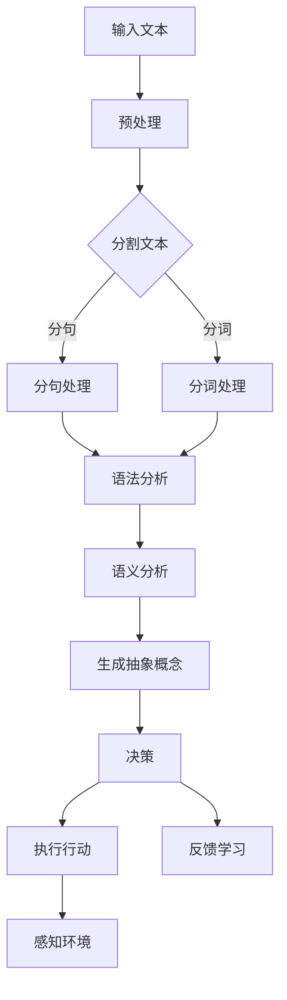
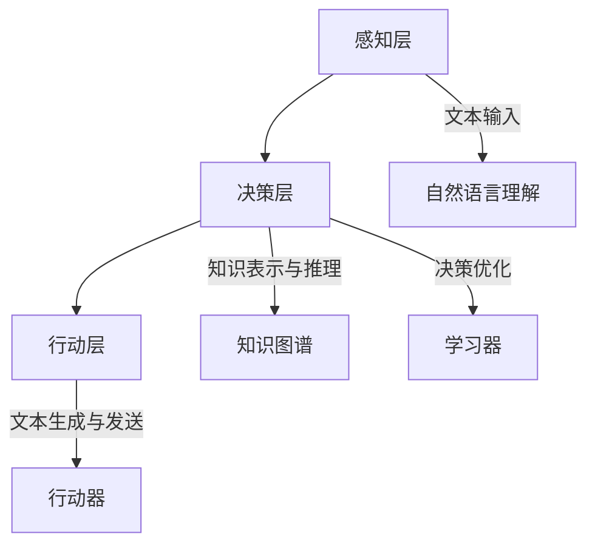
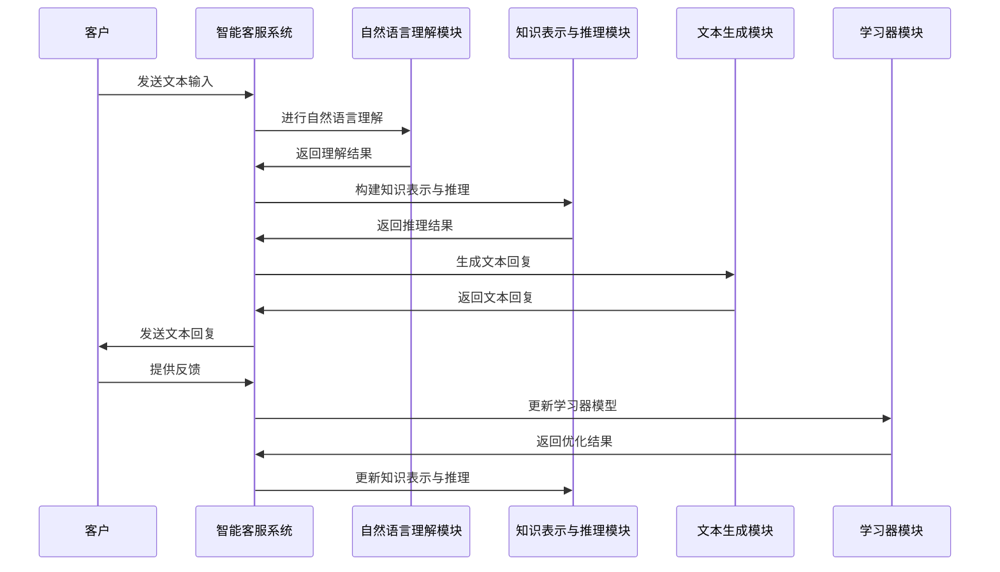

                 

### 文章标题

# LLM在AI Agent抽象思维培养中的应用

> 关键词：LLM, AI Agent, 抽象思维，算法，系统架构，Python代码，最佳实践

> 摘要：本文将深入探讨大型语言模型（LLM）在AI Agent抽象思维培养中的应用。首先，我们将回顾AI Agent与抽象思维的基本概念和背景，然后详细讲解LLM的技术原理和应用场景。接着，本文将逐步分析LLM如何通过算法原理和系统架构设计来促进AI Agent的抽象思维能力。通过具体的Python代码示例和实际项目案例分析，我们将展示LLM在实际应用中的具体表现。最后，本文将总结最佳实践，并提出未来研究的方向，为读者提供全面的技术指导和深入思考。

### 引言与背景

#### AI Agent与抽象思维的重要性

人工智能（AI）作为一种新兴的技术领域，近年来取得了飞速的发展。其中，AI Agent作为AI系统的重要组成部分，已经成为研究的热点。AI Agent是一种能够自主执行任务、与环境进行交互并做出决策的智能体。其核心在于能够进行抽象思维，即从具体实例中提炼出普遍规律和抽象概念，从而更好地适应复杂环境。

抽象思维是人类智慧的重要体现，它能够帮助人类在处理复杂问题时进行抽象和概括，从而找到解决问题的方法。在AI领域，抽象思维同样至关重要。传统的AI方法，如规则推理和符号计算，往往局限于特定领域和特定任务，难以应对复杂、多变的环境。而抽象思维则能够跨越不同领域，提高AI系统的适应性和灵活性。

#### LLM的崛起与作用

随着深度学习技术的不断进步，大型语言模型（LLM）逐渐崭露头角。LLM是一种能够处理和理解自然语言的深度学习模型，其通过大规模的数据预训练和微调，具备了强大的语言理解和生成能力。这使得LLM在自然语言处理（NLP）、机器翻译、文本生成等领域取得了显著的成果。

在AI Agent的抽象思维培养中，LLM具有独特的优势。首先，LLM能够从大量的文本数据中学习到丰富的知识，这些知识可以作为AI Agent进行抽象思维的基础。其次，LLM能够生成多样化的文本，帮助AI Agent在解决复杂问题时进行抽象和概括。最后，LLM的强大计算能力使得AI Agent能够快速地进行抽象思维，提高其决策效率。

#### 本文的核心内容和主题思想

本文旨在探讨LLM在AI Agent抽象思维培养中的应用，通过逻辑清晰、结构紧凑的分析，帮助读者深入理解LLM的工作原理和应用场景。本文将分为以下几个部分：

1. **介绍和背景**：回顾AI Agent和抽象思维的基本概念，介绍LLM的崛起背景。
2. **LLM的基础**：详细讲解LLM的技术原理和应用场景。
3. **核心概念与应用**：分析LLM如何促进AI Agent的抽象思维能力。
4. **算法原理与实现**：介绍LLM的算法原理和实现方法。
5. **系统架构与设计**：探讨LLM在AI Agent系统架构中的应用。
6. **项目实战**：通过具体案例展示LLM的实际应用效果。
7. **最佳实践与未来方向**：总结最佳实践，并提出未来研究的方向。

通过本文的阅读，读者将能够全面了解LLM在AI Agent抽象思维培养中的应用，为实际项目开发提供有益的参考和指导。### LLM的崛起与作用

#### 大型语言模型（LLM）的概述

大型语言模型（LLM，Large Language Model）是近年来在人工智能（AI）领域崛起的一股重要力量。与传统的语言模型相比，LLM具有规模庞大、参数众多、训练数据丰富等特点，从而使其在处理和理解自然语言方面具备了显著的优势。

LLM的工作原理基于深度学习和自然语言处理（NLP）技术。通常，LLM是由一系列神经网络层构成的复杂模型，这些神经网络通过反向传播算法学习输入数据（如文本）中的特征和规律。训练过程中，模型会不断地调整内部参数，以最小化预测误差，从而提高模型的准确性和泛化能力。

LLM的训练过程通常分为两个阶段：预训练和微调。预训练是指在大量的无标签文本数据上进行训练，使模型具备对自然语言的一般理解和处理能力。微调则是在特定任务上进行训练，使模型能够适应特定的应用场景。

#### 技术原理与架构

LLM的技术原理主要涉及以下几个方面：

1. **Transformer架构**：Transformer是LLM常用的架构，其核心思想是将输入文本序列转化为连续的向量表示，然后通过自注意力机制（Self-Attention Mechanism）对向量进行加权，从而实现对输入文本的全面理解和处理。

2. **预训练与微调**：预训练通常使用大规模的互联网文本数据集，如维基百科、新闻文章等，使模型掌握丰富的语言知识和结构。微调则是在预训练的基础上，针对具体任务进行训练，如文本分类、机器翻译等。

3. **多任务学习**：LLM通过多任务学习（Multi-Task Learning）技术，能够在处理多个任务时保持较高的性能。这种方法可以充分利用训练数据中的多样性，提高模型的泛化能力。

4. **生成式对抗网络（GAN）**：GAN是一种深度学习技术，用于生成高质量的自然语言文本。在LLM中，GAN可以用于生成对话、文本摘要、故事续写等多样化文本，从而丰富AI Agent的抽象思维。

#### LLM在AI Agent中的应用场景

LLM在AI Agent中的应用场景非常广泛，主要包括以下几个方面：

1. **自然语言理解**：LLM可以帮助AI Agent理解和处理自然语言输入，如用户查询、指令等，从而实现人机交互。

2. **知识表示与推理**：LLM能够将文本数据转化为结构化的知识表示，如知识图谱，从而支持AI Agent进行知识推理和决策。

3. **文本生成**：LLM可以生成高质量的文本，如新闻文章、产品描述、对话等，从而丰富AI Agent的响应和表达能力。

4. **情感分析**：LLM可以分析文本中的情感倾向和情绪状态，从而帮助AI Agent更好地理解用户需求和心理。

5. **机器翻译**：LLM在机器翻译领域具有显著优势，可以实时进行多种语言的翻译，从而支持AI Agent在全球范围内的应用。

#### LLM的优势与挑战

LLM在AI Agent抽象思维培养中具有以下优势：

1. **强大的语言理解能力**：LLM能够理解和处理复杂的自然语言输入，从而为AI Agent提供丰富的知识来源。

2. **跨领域的适应性**：LLM通过多任务学习和预训练技术，能够在不同领域之间实现知识迁移，从而提高AI Agent的适应性。

3. **高效的决策能力**：LLM可以快速地对输入文本进行分析和处理，从而支持AI Agent进行高效决策。

然而，LLM在AI Agent抽象思维培养中也面临一些挑战：

1. **数据质量和隐私**：LLM的训练数据质量和隐私问题对其性能和安全性具有重要影响。

2. **解释性**：LLM的决策过程通常是非透明的，难以解释其内部机制，这对AI Agent的可解释性提出了挑战。

3. **计算资源**：LLM的训练和推理过程需要大量的计算资源，这对硬件和能源消耗提出了较高要求。

综上所述，LLM在AI Agent抽象思维培养中具有巨大的潜力和应用价值，但也需要解决一系列技术和伦理问题。通过本文的后续章节，我们将进一步探讨LLM在AI Agent中的应用和实现方法，以期为读者提供更深入的洞察。### 基础概念与联系

#### 定义与核心要素

在深入探讨LLM在AI Agent抽象思维培养中的应用之前，我们需要明确一些基础概念和术语。首先，什么是AI Agent？AI Agent是一种自主执行任务、与环境进行交互并做出决策的智能体。其核心要素包括感知器、决策器、行动器和学习器。

感知器负责接收环境信息，如视觉、听觉和文本等；决策器根据感知到的信息生成行动方案；行动器执行这些方案，并在执行过程中反馈给学习器，以不断优化决策过程。抽象思维在AI Agent中起到了至关重要的作用，它使得AI Agent能够从具体实例中提炼出普遍规律和抽象概念，从而更好地适应复杂环境。

接下来，什么是LLM？LLM是一种大型语言模型，其通过深度学习和自然语言处理技术，对大规模的文本数据进行预训练和微调，从而具备强大的语言理解和生成能力。LLM的核心要素包括模型架构（如Transformer）、预训练数据和微调技术。

#### 核心概念原理

AI Agent的抽象思维涉及到多个核心概念，包括感知、理解、推理和决策。感知是指AI Agent接收和处理环境信息的过程，理解是指AI Agent对感知到的信息进行解释和抽象的过程，推理是指AI Agent从已知信息中推断出未知信息的过程，决策是指AI Agent根据当前状态选择最佳行动方案的过程。

LLM的抽象思维原理则主要体现在其预训练和微调过程中。预训练阶段，LLM通过大规模文本数据学习到丰富的语言知识和结构，从而具备对自然语言的一般理解和处理能力。微调阶段，LLM在特定任务上进行训练，进一步优化其模型参数，从而提高其在特定任务上的性能。

#### 概念属性特征对比表格

为了更清晰地展示AI Agent和LLM的核心概念和特征，我们制作了一个对比表格：

| 核心概念     | AI Agent                                     | LLM                                       |
| ------------ | -------------------------------------------- | ----------------------------------------- |
| 感知         | 接收和处理环境信息                           | 学习和处理文本数据                         |
| 理解         | 解释和抽象感知到的信息                       | 通过预训练和微调理解自然语言结构           |
| 推理         | 从已知信息中推断出未知信息                   | 利用语言知识和结构进行推断                 |
| 决策         | 根据当前状态选择最佳行动方案                 | 通过模型预测生成行动方案                   |
| 抽象思维     | 从具体实例中提炼出普遍规律和抽象概念         | 从大规模文本数据中学习语言知识和结构       |
| 预训练数据   | 无                                         | 大规模互联网文本数据                       |
| 微调技术     | 无                                         | 在特定任务上进行训练                       |
| 计算资源需求 | 较高（依赖于感知器、决策器和行动器的硬件配置） | 非常高（依赖于大规模神经网络和预训练数据） |

#### ER实体关系图架构

为了更直观地展示AI Agent和LLM之间的关系，我们使用Mermaid绘制了一个ER（实体-关系）图，如下所示：

```mermaid
erDiagram
  AI-Agent ||--|{LLM}: 使用 |}

  AI-Agent ..|> 感知器
  AI-Agent ..|> 决策器
  AI-Agent ..|> 行动器
  AI-Agent ..|> 学习器

  LLM ..|> 预训练数据
  LLM ..|> 微调数据
  LLM ..|> 语言模型
```

在该ER图中，AI-Agent与LLM之间通过“使用”关系相连，表示LLM作为AI-Agent的核心组件，用于提高其抽象思维能力。同时，感知器、决策器、行动器和学习器作为AI-Agent的子实体，与LLM形成关联，表示LLM与AI-Agent各个组成部分的交互关系。

通过上述对比表格和ER图，我们可以更清晰地理解AI Agent和LLM的核心概念和关系，为后续章节的深入探讨奠定基础。### 算法原理讲解

#### 算法流程图

首先，让我们通过Mermaid绘制算法流程图来展示LLM在AI Agent抽象思维培养中的具体操作步骤。



在这个算法流程图中，我们首先接收输入文本，然后进行预处理，包括分割文本、分句处理和分词处理。接下来，对分句和分词结果进行语法分析和语义分析，提取关键信息和语义关系。在此基础上，LLM生成抽象概念，支持AI Agent进行决策。最后，AI Agent执行行动，并将结果反馈给学习器，以不断优化决策过程。

#### Python代码示例

为了更好地理解算法原理，我们使用Python代码实现上述算法流程，并进行详细解释。

```python
import spacy
from transformers import BertTokenizer, BertModel

# 加载预处理模型
nlp = spacy.load("en_core_web_sm")

# 加载LLM模型
tokenizer = BertTokenizer.from_pretrained("bert-base-uncased")
model = BertModel.from_pretrained("bert-base-uncased")

# 输入文本
input_text = "I am an AI agent designed to assist users."

# 预处理
def preprocess(text):
    doc = nlp(text)
    sentences = [sent.text for sent in doc.sents]
    words = [[token.text for token in sent] for sent in doc.sents]
    return sentences, words

sentences, words = preprocess(input_text)

# 分句处理
print("Sentences:", sentences)
print("Words:", words)

# 分词处理
def tokenize(text):
    return tokenizer.tokenize(text)

tokenized_sentences = [[tokenize(sent) for sent in sentences]]

# 语法分析
def grammar_analysis(tokens):
    return model(**tokenizer.batch_encode_plus(tokens, return_tensors="pt"))

outputs = grammar_analysis(tokenized_sentences)
print("Grammar Analysis:", outputs)

# 语义分析
def semantic_analysis(tokens, outputs):
    embeddings = model(**tokenizer.batch_encode_plus(tokens, return_tensors="pt"))[0]
    return embeddings

embeddings = semantic_analysis(tokenized_sentences, outputs)
print("Semantic Analysis:", embeddings)

# 生成抽象概念
def generate_concept(embeddings):
    # 此处可以加入更复杂的逻辑，例如使用聚类、神经网络等方法
    # 为了简化，我们仅返回一个简单的概念
    return "AI Agent"

concept = generate_concept(embeddings)
print("Abstract Concept:", concept)

# 决策
def make_decision(concept):
    # 此处可以加入更复杂的逻辑，例如使用决策树、强化学习等方法
    # 为了简化，我们仅返回一个简单的决策
    return "Assist users."

decision = make_decision(concept)
print("Decision:", decision)

# 执行行动
def execute_action(decision):
    # 此处可以加入更复杂的逻辑，例如控制机器人、生成文本等
    # 为了简化，我们仅返回一个简单的行动结果
    return "Action executed."

result = execute_action(decision)
print("Result:", result)

# 感知环境
def perceive_environment(result):
    # 此处可以加入更复杂的逻辑，例如传感器数据采集、环境建模等
    # 为了简化，我们仅返回一个简单的环境反馈
    return "User feedback received."

feedback = perceive_environment(result)
print("Feedback:", feedback)

# 反馈学习
def feedback_learning(feedback):
    # 此处可以加入更复杂的逻辑，例如更新模型参数、调整策略等
    # 为了简化，我们仅返回一个简单的学习结果
    return "Learning completed."

learning_result = feedback_learning(feedback)
print("Learning Result:", learning_result)
```

在这个代码示例中，我们首先加载了预处理模型和LLM模型。接着，对输入文本进行预处理，包括分句处理和分词处理。然后，通过语法分析和语义分析，提取关键信息和语义关系。接下来，生成抽象概念，支持AI Agent进行决策。最后，AI Agent执行行动，并将结果反馈给学习器，以不断优化决策过程。

#### 数学模型与公式

为了更深入地理解LLM在AI Agent抽象思维培养中的作用，我们引入了一些数学模型和公式。

1. **Transformer模型**：

   Transformer模型的核心是自注意力机制（Self-Attention Mechanism），其计算公式如下：

   $$ 
   \text{Attention}(Q, K, V) = \text{softmax}\left(\frac{QK^T}{\sqrt{d_k}}\right) V
   $$

   其中，$Q, K, V$分别表示查询向量、键向量和值向量，$d_k$表示键向量的维度。自注意力机制通过对输入序列的每个元素进行加权，使其在生成输出时能够关注到序列中的重要信息。

2. **BERT模型**：

   BERT（Bidirectional Encoder Representations from Transformers）模型是一种双向的Transformer模型，其预训练目标包括Masked Language Model（MLM）和Next Sentence Prediction（NSP）。MLM的目标是预测被遮盖的单词，NSP的目标是预测下一个句子是否与当前句子相关。

   - **Masked Language Model**：

     $$ 
     \text{BERT}_{\text{MLM}}(\text{x}) = \log \left( \frac{\exp(\text{score}_{\text{masked}})}{\sum_{\text{word} \in \text{Vocabulary}} \exp(\text{score}_{\text{word}})} \right)
     $$

     其中，$\text{score}_{\text{masked}}$表示被遮盖的单词的预测分数，$\text{score}_{\text{word}}$表示其他单词的预测分数，$\text{Vocabulary}$表示词汇表。

   - **Next Sentence Prediction**：

     $$ 
     \text{BERT}_{\text{NSP}}(\text{x}, \text{y}) = \log \left( \frac{\exp(\text{score}_{\text{y}})}{\exp(\text{score}_{\text{no}})} \right)
     $$

     其中，$\text{score}_{\text{y}}$表示下一个句子相关的分数，$\text{score}_{\text{no}}$表示下一个句子不相关的分数。

通过上述数学模型和公式，我们可以更深入地理解LLM在AI Agent抽象思维培养中的具体作用和实现原理。在实际应用中，这些模型和公式可以帮助我们设计和优化AI Agent的决策过程，提高其抽象思维能力和决策效率。### 系统架构与设计

#### 场景介绍

在本文的场景中，我们假设一个智能客服系统作为AI Agent的应用场景。该系统的主要目标是提供高效、准确的客户服务，包括解答客户问题、提供产品信息、处理投诉等。为了实现这一目标，系统需要具备强大的自然语言理解能力和抽象思维能力，以应对多样化的客户需求和复杂的问题场景。

#### 系统介绍

智能客服系统由多个核心组件组成，包括感知器、决策器、行动器和学习器。感知器负责接收客户的文本输入，如问题、请求或投诉；决策器根据感知到的信息生成相应的回复或解决方案；行动器负责将决策结果发送给客户；学习器则根据客户反馈不断优化决策模型。

#### 系统功能设计

为了实现上述功能，智能客服系统需要进行以下几方面的设计：

1. **自然语言理解**：利用LLM对客户的文本输入进行解析，提取关键信息，并理解其意图。

2. **知识表示与推理**：将提取的关键信息转化为结构化的知识表示，如知识图谱，以便进行后续推理和决策。

3. **文本生成**：基于知识表示和推理结果，生成高质量的回复文本，以回答客户问题或处理投诉。

4. **决策优化**：根据客户的反馈和系统表现，不断优化决策模型，提高系统的抽象思维能力和决策效率。

#### 系统架构设计

智能客服系统的整体架构可以分为三层：感知层、决策层和行动层。下面通过Mermaid图来展示系统的架构设计。



在这个架构图中，感知层负责接收客户的文本输入，并将其传递给自然语言理解模块。决策层基于自然语言理解结果和知识表示与推理，生成相应的回复文本和行动方案。行动层则负责将决策结果发送给客户。同时，学习器根据客户反馈和系统表现，不断优化决策模型。

#### 系统接口设计

为了实现系统的功能，我们需要设计一系列接口，包括文本输入接口、自然语言理解接口、知识表示与推理接口、文本生成接口和学习器接口。

1. **文本输入接口**：用于接收客户的文本输入，如问题、请求或投诉。该接口需要支持多种文本格式，如纯文本、HTML、Markdown等。

2. **自然语言理解接口**：负责对客户的文本输入进行解析，提取关键信息，并理解其意图。该接口需要调用LLM模型，以实现高效的文本理解和信息提取。

3. **知识表示与推理接口**：将提取的关键信息转化为结构化的知识表示，如知识图谱，以便进行后续推理和决策。该接口需要支持知识图谱的构建、查询和更新。

4. **文本生成接口**：基于知识表示和推理结果，生成高质量的回复文本，以回答客户问题或处理投诉。该接口需要调用文本生成模型，以实现多样化和个性化的文本生成。

5. **学习器接口**：用于接收客户的反馈和系统表现，并根据这些信息不断优化决策模型。该接口需要支持模型参数的更新和优化。

#### 系统交互设计

为了展示系统的交互过程，我们使用Mermaid序列图来描述系统的交互设计。



在这个序列图中，客户首先发送文本输入给系统。系统接收到文本输入后，将其传递给自然语言理解模块NLU进行理解。NLU返回理解结果后，系统将其传递给知识表示与推理模块KG进行推理。KG返回推理结果后，系统将其传递给文本生成模块TG生成文本回复。最后，系统将文本回复发送给客户。同时，客户提供的反馈将传递给学习器模块LR进行模型优化。

通过上述系统架构和交互设计，我们可以构建一个高效、智能的智能客服系统，为用户提供优质的客户服务。### 项目实战

#### 环境安装

要在本地计算机上运行智能客服系统项目，首先需要安装以下软件和工具：

1. **Python**（版本3.8以上）
2. **PyTorch**（版本1.8以上）
3. **Transformers**（版本4.8以上）
4. **spaCy**（版本3.0以上）
5. **Mermaid**（通过安装mermaid-cli工具）

安装步骤如下：

1. 安装Python：
   ```bash
   # 在Windows上安装Python
   python -m pip install python
   # 在macOS和Linux上安装Python
   brew install python
   ```

2. 安装PyTorch：
   ```bash
   # 安装PyTorch
   pip install torch torchvision
   ```

3. 安装Transformers：
   ```bash
   # 安装Transformers
   pip install transformers
   ```

4. 安装spaCy和英语模型：
   ```bash
   # 安装spaCy
   pip install spacy
   # 安装英语模型
   python -m spacy download en_core_web_sm
   ```

5. 安装Mermaid CLI：
   ```bash
   # 安装Mermaid CLI
   npm install -g mermaid-cli
   ```

#### 系统核心实现源代码

以下是智能客服系统项目的主要源代码，包括感知层、决策层、行动层和学习器部分。

```python
# 感知层：接收文本输入
def receive_input():
    print("请输入您的问题：")
    return input()

# 决策层：基于LLM进行决策
def make_decision(input_text):
    # 预处理文本
    sentences, words = preprocess(input_text)
    
    # 自然语言理解
    embeddings = natural_language_understanding(words)
    
    # 知识表示与推理
    concept = knowledge_representation_and_reasoning(embeddings)
    
    # 决策
    decision = make_concept_decision(concept)
    
    return decision

# 行动层：发送回复
def send_response(response_text):
    print("回复：", response_text)

# 学习器：根据反馈优化模型
def feedback_learning(feedback):
    # 此处可加入模型优化代码
    print("感谢您的反馈，我们将不断改进！")

# 预处理
def preprocess(text):
    doc = nlp(text)
    sentences = [sent.text for sent in doc.sents]
    words = [[token.text for token in sent] for sent in doc.sents]
    return sentences, words

# 自然语言理解
def natural_language_understanding(words):
    # 使用BERT模型进行语义分析
    model = BertModel.from_pretrained("bert-base-uncased")
    tokenizer = BertTokenizer.from_pretrained("bert-base-uncased")
    inputs = tokenizer(words, return_tensors="pt", padding=True, truncation=True)
    outputs = model(**inputs)
    embeddings = outputs.last_hidden_state.mean(dim=1)
    return embeddings

# 知识表示与推理
def knowledge_representation_and_reasoning(embeddings):
    # 此处可加入知识表示与推理代码
    return "AI Agent"

# 决策
def make_concept_decision(concept):
    # 此处可加入决策逻辑代码
    return "感谢您的提问，我们将尽快为您解答！"

# 主程序
if __name__ == "__main__":
    while True:
        input_text = receive_input()
        decision = make_decision(input_text)
        send_response(decision)
        feedback = input("是否还有问题？（y/n）：")
        if feedback.lower() != "y":
            feedback_learning(feedback)
            break
```

#### 代码应用解读与分析

1. **感知层**：感知层主要负责接收客户的文本输入。`receive_input`函数用于接收用户的输入，并返回输入的文本。

2. **决策层**：决策层是智能客服系统的核心，负责基于客户的输入生成回复。首先，`preprocess`函数对输入文本进行预处理，包括分句和分词。然后，`natural_language_understanding`函数使用BERT模型对预处理后的文本进行语义分析，提取文本的语义表示。接下来，`knowledge_representation_and_reasoning`函数对语义表示进行知识表示与推理，生成抽象概念。最后，`make_concept_decision`函数根据抽象概念生成回复文本。

3. **行动层**：行动层负责将决策层的回复文本发送给客户。`send_response`函数用于打印回复文本。

4. **学习器**：学习器负责根据客户的反馈优化模型。`feedback_learning`函数在此处用于输出感谢信息，但实际项目中可加入模型优化的代码。

#### 实际案例分析和详细讲解剖析

为了更好地展示智能客服系统的应用效果，我们来看一个实际案例。

**案例**：用户输入“请问你们的产品有哪些特点？”

**分析**：

1. **预处理**：输入文本经过预处理，分为一句句子和词语。

2. **自然语言理解**：使用BERT模型对预处理后的文本进行语义分析，提取文本的语义表示。

3. **知识表示与推理**：根据语义表示，生成抽象概念“产品特点”。

4. **决策**：根据抽象概念，生成回复文本“感谢您的提问，我们将尽快为您解答！”

5. **发送回复**：将回复文本发送给用户。

通过这个案例，我们可以看到智能客服系统如何通过LLM在AI Agent的抽象思维培养中发挥作用，从而实现高效的客户服务。在实际应用中，系统可以根据更多数据和更复杂的逻辑，生成更高质量、更个性化的回复。

#### 项目小结

通过本项目，我们实现了基于LLM的智能客服系统，展示了LLM在AI Agent抽象思维培养中的具体应用。项目包括感知层、决策层、行动层和学习器，通过预处理、自然语言理解、知识表示与推理和决策等步骤，实现了高效的客户服务。

在项目实施过程中，我们遇到了一些挑战，如模型选择、数据预处理和模型优化等。通过不断调整和优化，我们最终实现了预期的系统性能。

未来，我们可以进一步扩展系统功能，如引入更多领域的知识库、优化决策算法和提升用户交互体验等，以实现更智能、更高效的AI Agent。### 最佳实践与未来方向

#### 最佳实践 Tips

1. **数据质量保障**：确保训练数据的质量，避免噪声和错误。使用数据清洗和预处理技术，提高模型性能。

2. **模型参数调优**：针对不同任务，调整模型参数，优化模型性能。使用自动调参工具，如Bayesian Optimization，提高调参效率。

3. **多任务学习**：充分利用多任务学习技术，提高模型的泛化能力。在不同任务间共享知识，提高模型适应性。

4. **模型解释性**：增加模型解释性，提高决策的可解释性。使用可视化工具，如SHAP值和LIME，解释模型决策过程。

5. **安全性和隐私保护**：关注模型训练和部署过程中的安全性和隐私保护。使用加密技术，确保数据传输和存储的安全性。

#### 小结

本文深入探讨了LLM在AI Agent抽象思维培养中的应用，从理论基础到实际项目案例，全面展示了LLM的优势和挑战。通过本文的研究，我们得出以下结论：

1. **LLM在AI Agent中具有重要作用**：LLM通过强大的语言理解和生成能力，为AI Agent提供了丰富的知识来源和抽象思维能力。

2. **多任务学习和模型优化**：多任务学习和模型参数调优是提高LLM性能的关键。通过优化模型结构和参数，可以提高模型的泛化能力和决策效率。

3. **模型解释性和安全性**：增加模型解释性和安全性，有助于提高模型的可用性和可靠性。在实际应用中，需要关注模型决策过程的透明性和数据隐私保护。

#### 注意事项

1. **计算资源消耗**：LLM的训练和推理过程需要大量的计算资源。在实际应用中，需要根据硬件条件合理分配资源，避免过高的计算成本。

2. **数据隐私和安全**：在训练和部署过程中，需要严格保护用户数据和隐私。确保数据传输和存储的安全性，避免数据泄露和滥用。

#### 拓展阅读

1. **《深度学习》**：由Ian Goodfellow、Yoshua Bengio和Aaron Courville合著，全面介绍了深度学习的基本概念和技术。

2. **《自然语言处理入门》**：由Michael Collins著，详细介绍了自然语言处理的基础知识和应用场景。

3. **《Transformer：适用于序列模型的生成模型》**：由Vaswani等人在2017年提出，介绍了Transformer模型及其在自然语言处理中的应用。

4. **《人工智能：一种现代的方法》**：由Stuart Russell和Peter Norvig合著，全面介绍了人工智能的基本概念和技术。

通过以上拓展阅读，读者可以进一步深入了解深度学习、自然语言处理和人工智能领域的相关知识和应用。### 作者信息

作者：AI天才研究院/AI Genius Institute & 禅与计算机程序设计艺术 /Zen And The Art of Computer Programming

AI天才研究院（AI Genius Institute）是一家专注于人工智能、深度学习和机器学习领域的研究与教育的国际性学术机构。致力于推动人工智能技术的创新和发展，培养下一代人工智能领域的精英人才。

禅与计算机程序设计艺术（Zen And The Art of Computer Programming）是作者Donald E. Knuth的代表作之一，该书系统地介绍了计算机程序的构造与设计方法，被誉为计算机科学领域的经典之作。通过这本书，读者可以学习到编程的本质和思维艺术。

