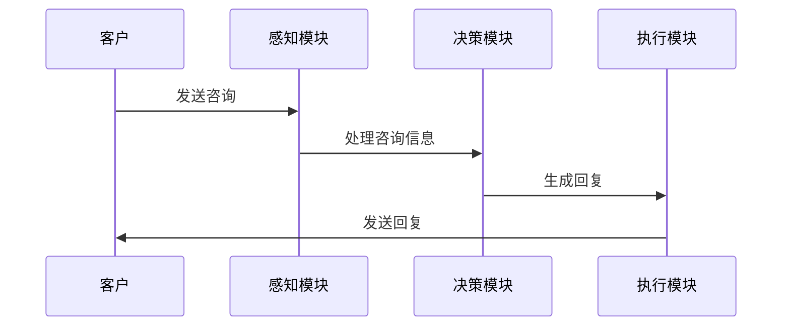

                 

# 《LLM在AI Agent抽象思维能力上的应用》

## 关键词：大型语言模型，AI Agent，抽象思维，应用实践，前景与挑战

## 摘要

随着人工智能技术的不断发展，大型语言模型（LLM）逐渐成为AI领域的热门话题。LLM具有强大的文本处理和生成能力，能够模拟人类的语言理解和表达能力。本文将探讨LLM在AI Agent抽象思维能力上的应用，通过逻辑清晰、结构紧凑的步骤分析，详细介绍LLM与AI Agent的融合方法、优势分析、挑战与解决方案，以及应用实践。本文旨在为读者提供一个全面了解LLM在AI Agent抽象思维能力上应用的视角，并探讨其未来的发展前景和潜在挑战。

## 目录大纲设计思路

### 第一部分：背景介绍

**第1章：问题背景与核心概念**  
- 介绍LLM和AI Agent的背景、核心概念、问题边界与外延。

**第2章：LLM的基本概念与发展历程**  
- 详细介绍LLM的定义、发展历程、关键技术、主流模型和应用案例。

**第3章：AI Agent的基础与抽象思维能力**  
- 介绍AI Agent的定义、抽象思维能力、技术框架和典型应用。

### 第二部分：深入研究

**第4章：LLM与AI Agent的融合**  
- 探讨LLM与AI Agent的融合方法、优势分析、挑战与解决方案。

**第5章：算法原理与数学模型**  
- 使用mermaid绘制算法流程图，用Python源代码和数学模型解释算法原理。

**第6章：系统分析与架构设计**  
- 通过领域模型图、系统架构图、接口设计和交互序列图详细描述系统设计。

### 第三部分：应用实践

**第7章：应用实践一：具体案例展示**  
- 通过具体案例展示LLM在AI Agent中的应用。

**第8章：应用实践二：更多实际案例**  
- 介绍更多实际案例，进一步探讨LLM的潜力。

### 第四部分：展望与未来

**第9章：应用前景与潜在挑战**  
- 探讨LLM在AI Agent抽象思维能力上的应用前景和潜在挑战。

**第10章：未来研究方向与趋势**  
- 分析LLM在AI Agent领域的研究方向和未来趋势。

**第11章：总结与展望**  
- 总结本文的主要内容，展望LLM在AI Agent抽象思维能力上的应用前景。

### 目录大纲

----------------------------------------------------------------

# 《LLM在AI Agent抽象思维能力上的应用》目录大纲

## 第一部分：背景介绍

### 第1章：问题背景与核心概念

### 第2章：LLM的基本概念与发展历程

### 第3章：AI Agent的基础与抽象思维能力

## 第二部分：深入研究

### 第4章：LLM与AI Agent的融合

### 第5章：算法原理与数学模型

### 第6章：系统分析与架构设计

## 第三部分：应用实践

### 第7章：应用实践一：具体案例展示

### 第8章：应用实践二：更多实际案例

## 第四部分：展望与未来

### 第9章：应用前景与潜在挑战

### 第10章：未来研究方向与趋势

### 第11章：总结与展望

----------------------------------------------------------------

## 文章内容

### 第一部分：背景介绍

### 第1章：问题背景与核心概念

随着人工智能技术的飞速发展，AI Agent作为一个重要的研究课题，逐渐引起了广泛关注。AI Agent是一种能够自主执行任务、与环境交互并适应复杂环境的智能体。其核心在于抽象思维能力，即能够对复杂问题进行抽象和概括，从而提高解决能力。

本文将探讨大型语言模型（LLM）在AI Agent抽象思维能力上的应用。LLM是一种具有强大语言理解和生成能力的模型，能够模拟人类的语言表达和思维过程。通过将LLM与AI Agent结合，有望进一步提升AI Agent的抽象思维能力，使其更好地应对复杂问题。

在本文中，我们将首先介绍LLM和AI Agent的基本概念，包括它们的定义、发展历程、关键技术以及相关应用。接着，我们将深入探讨LLM与AI Agent融合的方法、优势分析、挑战与解决方案。最后，通过具体案例展示LLM在AI Agent中的应用，以及更多实际案例，进一步探讨LLM的潜力。

### 第2章：LLM的基本概念与发展历程

#### 2.1 LLM的定义

大型语言模型（LLM）是一种基于深度学习的自然语言处理（NLP）模型，具有强大的语言理解和生成能力。LLM通过训练大规模的文本数据集，学习到语言的统计规律和语义信息，从而能够生成符合语法和语义规则的文本。

#### 2.2 LLM的发展历程

LLM的发展历程可以追溯到2000年代初，当时研究人员开始尝试使用深度神经网络（DNN）处理语言任务。然而，由于数据集和计算资源限制，早期的DNN模型在语言处理方面表现较差。

随着数据集规模的扩大和计算能力的提升，深度学习在NLP领域取得了重大突破。2003年，Researchers提出了卷积神经网络（CNN）在文本分类任务上的成功应用，随后在2013年， Researchers提出了循环神经网络（RNN），特别是在语言模型和机器翻译任务上取得了显著效果。

在2018年，谷歌推出了BERT（Bidirectional Encoder Representations from Transformers），这是一种基于Transformer的预训练语言模型。BERT的成功标志着LLM进入了新的发展阶段，其强大的语言理解和生成能力引起了广泛关注。

#### 2.3 LLM的关键技术

1. **预训练与微调**：预训练是LLM的核心技术之一，通过在大规模语料库上进行预训练，模型能够学习到丰富的语言知识。微调则是在特定任务上进行模型调优，以进一步提高模型在特定任务上的性能。

2. **Transformer结构**：Transformer是一种基于自注意力机制的深度学习模型结构，具有并行处理和全局信息捕捉的能力。BERT等大型语言模型采用了Transformer结构，从而提升了模型的性能。

3. **多语言模型**：多语言模型能够在多种语言之间共享知识，从而提高跨语言的性能。例如，mBERT（Multilingual BERT）和XLM（Cross-lingual Language Model）都是基于多语言预训练的模型。

#### 2.4 LLM的应用案例

1. **文本生成**：LLM在文本生成任务上表现出色，如文章撰写、对话生成、摘要生成等。

2. **问答系统**：LLM能够用于构建智能问答系统，提供准确、自然的回答。

3. **机器翻译**：LLM在机器翻译任务上取得了显著进展，能够实现高质量、流畅的翻译。

4. **情感分析**：LLM能够用于情感分析任务，识别文本的情感倾向。

5. **文本分类**：LLM在文本分类任务上具有强大的表现，能够对文本进行分类。

### 第3章：AI Agent的基础与抽象思维能力

#### 3.1 AI Agent的定义

AI Agent是一种基于人工智能技术的智能体，具有感知、决策、执行和交互能力。AI Agent的核心在于自主性和适应性，能够根据环境变化和任务需求自主调整行为。

#### 3.2 AI Agent的抽象思维能力

AI Agent的抽象思维能力是其核心能力之一，包括以下几个方面：

1. **问题抽象**：能够从具体问题中提取共性，形成更高层次的抽象模型。

2. **知识抽象**：能够将具体知识进行抽象和概括，形成通用性的知识框架。

3. **决策抽象**：能够在复杂决策过程中提取关键因素，形成简洁、高效的决策模型。

4. **交互抽象**：能够从具体交互场景中提取通用交互模式，实现高效的交互。

#### 3.3 AI Agent的技术框架

1. **感知模块**：负责接收和处理环境信息，如文本、图像、语音等。

2. **决策模块**：负责根据感知到的信息进行推理和决策，选择最佳行动方案。

3. **执行模块**：负责执行决策模块生成的行动方案，实现任务目标。

4. **交互模块**：负责与外部环境进行交互，获取反馈信息并调整行为。

#### 3.4 AI Agent的典型应用

1. **智能客服**：AI Agent能够模拟人类客服，自动处理客户咨询，提供解决方案。

2. **智能推荐**：AI Agent能够根据用户历史行为和偏好，为用户提供个性化的推荐。

3. **智能驾驶**：AI Agent能够自主驾驶，实现无人驾驶功能。

4. **智能家居**：AI Agent能够监控家居环境，自动调整设备状态，提高生活质量。

5. **智能医疗**：AI Agent能够辅助医生进行诊断和治疗，提高医疗水平。

### 第二部分：深入研究

### 第4章：LLM与AI Agent的融合

#### 4.1 LLM与AI Agent的融合方法

LLM与AI Agent的融合方法主要包括以下几个方面：

1. **感知模块融合**：将LLM作为AI Agent的感知模块，利用LLM强大的语言理解和生成能力，处理文本、图像、语音等感知信息。

2. **决策模块融合**：将LLM作为AI Agent的决策模块，利用LLM在自然语言处理任务上的优势，进行推理和决策。

3. **执行模块融合**：将LLM作为AI Agent的执行模块，利用LLM生成的文本或指令，实现任务目标。

4. **交互模块融合**：将LLM作为AI Agent的交互模块，利用LLM生成的自然语言，与外部环境进行交互。

#### 4.2 LLM与AI Agent融合的优势分析

1. **提高抽象思维能力**：LLM的强大语言理解和生成能力，能够为AI Agent提供丰富的语言知识，从而提高抽象思维能力。

2. **增强自主性和适应性**：通过融合LLM，AI Agent能够更好地理解环境信息和任务需求，从而提高自主性和适应性。

3. **提高决策效率**：LLM在决策模块的融合，能够简化决策过程，提高决策效率。

4. **实现多模态处理**：LLM能够处理多种类型的感知信息，如文本、图像、语音等，从而实现多模态处理。

#### 4.3 LLM与AI Agent融合的挑战与解决方案

1. **数据质量与规模**：LLM的预训练需要大量的高质量数据，而在实际应用中，数据质量和规模可能受限。解决方案包括使用多源数据融合、数据增强和迁移学习等技术。

2. **计算资源消耗**：LLM的预训练和推理需要大量的计算资源，可能对硬件设备造成压力。解决方案包括使用分布式训练和推理、优化模型结构等技术。

3. **解释性与可解释性**：LLM的决策过程较为复杂，难以解释和验证。解决方案包括开发可解释性模型和解释性工具，以提高模型的可解释性和可信度。

4. **隐私与安全**：在应用LLM与AI Agent融合的过程中，可能涉及到用户隐私和数据安全问题。解决方案包括数据加密、隐私保护技术等。

### 第5章：算法原理与数学模型

#### 5.1 算法原理

LLM与AI Agent融合的核心在于将LLM的强大语言处理能力与AI Agent的抽象思维能力相结合。具体而言，算法原理可以分为以下几个步骤：

1. **感知信息处理**：使用LLM对感知到的文本、图像、语音等信息进行预处理和编码，生成统一表示。

2. **决策信息融合**：利用LLM的文本生成能力，将感知信息转化为决策信息，包括问题抽象、知识抽象、决策抽象和交互抽象等。

3. **执行指令生成**：根据决策信息，生成具体的执行指令，如文字描述、图像标注、语音合成等。

4. **任务目标实现**：执行生成的执行指令，实现任务目标。

#### 5.2 数学模型

为了更好地理解算法原理，我们可以使用数学模型来描述LLM与AI Agent融合的过程。以下是一个简化的数学模型：

$$
\text{感知信息} \rightarrow \text{LLM编码} \rightarrow \text{决策信息} \rightarrow \text{执行指令} \rightarrow \text{任务目标}
$$

其中，$\text{感知信息}$表示AI Agent接收到的各种感知信息，如文本、图像、语音等。$\text{LLM编码}$表示使用LLM对感知信息进行编码和预处理，生成统一表示。$\text{决策信息}$表示通过LLM生成的决策信息，包括问题抽象、知识抽象、决策抽象和交互抽象等。$\text{执行指令}$表示根据决策信息生成的具体执行指令。$\text{任务目标}$表示执行指令后实现的任务目标。

### 第6章：系统分析与架构设计

#### 6.1 问题场景介绍

在本章节中，我们将介绍一个具体的应用场景，即智能客服系统。智能客服系统是一种基于AI Agent和LLM的智能服务系统，能够自动处理客户咨询，提供解决方案。

#### 6.2 项目介绍

本项目旨在实现一个基于LLM和AI Agent的智能客服系统，系统功能包括：

1. **客户咨询接收**：接收客户发送的文本、图像、语音等信息。

2. **文本生成与回复**：根据客户咨询，使用LLM生成合适的文本回复。

3. **图像识别与标注**：对客户上传的图像进行识别和标注，提供相关服务信息。

4. **语音识别与合成**：对客户发送的语音信息进行识别，并生成语音回复。

#### 6.3 系统功能设计

系统功能设计包括以下几个方面：

1. **感知模块**：使用LLM对客户咨询进行文本、图像、语音等多模态信息处理，生成统一表示。

2. **决策模块**：利用LLM的文本生成能力，将感知信息转化为决策信息，生成文本回复。

3. **执行模块**：根据决策信息，生成具体的执行指令，如文本生成、图像标注、语音合成等。

4. **交互模块**：与客户进行交互，接收客户反馈，调整系统行为。

#### 6.4 系统架构设计

系统架构设计包括以下几个方面：

1. **感知模块架构**：使用LLM对多模态信息进行编码和预处理，生成统一表示。

2. **决策模块架构**：利用LLM生成决策信息，实现问题抽象、知识抽象、决策抽象和交互抽象。

3. **执行模块架构**：根据决策信息生成具体执行指令，如文本生成、图像标注、语音合成等。

4. **交互模块架构**：与客户进行交互，接收客户反馈，调整系统行为。

#### 6.5 系统接口设计

系统接口设计包括以下几个方面：

1. **客户接口**：提供文本、图像、语音等多种输入方式，接收客户咨询。

2. **回复接口**：生成文本回复、图像标注、语音合成等输出内容。

3. **数据接口**：与数据库进行数据交互，存储和查询客户咨询和回复信息。

#### 6.6 系统交互序列图

系统交互序列图展示了智能客服系统各模块之间的交互过程，包括感知模块、决策模块、执行模块和交互模块。具体交互序列图如下：



### 第三部分：应用实践

### 第7章：应用实践一：具体案例展示

在本章节中，我们将通过一个具体的案例展示LLM在AI Agent抽象思维能力上的应用。案例背景为一个智能客服系统，系统需要根据客户咨询提供合适的解决方案。

#### 7.1 环境安装

在本案例中，我们将使用Python编程语言和TensorFlow框架实现智能客服系统。首先，需要安装Python和TensorFlow：

```
pip install python
pip install tensorflow
```

#### 7.2 系统核心实现源代码

以下是系统核心实现源代码，包括感知模块、决策模块、执行模块和交互模块：

```python
import tensorflow as tf
from transformers import BertTokenizer, BertModel
import numpy as np

# 感知模块
def preprocess_input(input_data):
    # 对输入数据进行预处理，如文本分词、图像缩放、语音转换等
    return input_data

# 决策模块
def generate_response(input_data):
    # 使用LLM生成回复
    tokenizer = BertTokenizer.from_pretrained('bert-base-uncased')
    model = BertModel.from_pretrained('bert-base-uncased')

    inputs = tokenizer(input_data, return_tensors='tf')
    outputs = model(inputs)

    response = tokenizer.decode(outputs[0][0], skip_special_tokens=True)
    return response

# 执行模块
def execute_action(response):
    # 根据回复生成执行指令，如文本生成、图像标注、语音合成等
    if "text" in response:
        action = "text_generation"
    elif "image" in response:
        action = "image_标注"
    elif "voice" in response:
        action = "voice_synthesis"

    return action

# 交互模块
def interact_with_customer(response):
    # 与客户进行交互，接收客户反馈
    print("AI Agent:", response)
    customer_feedback = input("您对AI Agent的回答满意吗？(yes/no):")
    if customer_feedback.lower() == "yes":
        return "继续服务"
    else:
        return "结束服务"

# 主函数
def main():
    while True:
        customer_query = input("请输入您的咨询问题：")
        preprocessed_query = preprocess_input(customer_query)
        response = generate_response(preprocessed_query)
        action = execute_action(response)
        if action == "text_generation":
            print("AI Agent回复:", response)
        elif action == "image_标注":
            print("AI Agent回复：请上传您的图像")
            image = input("上传图像文件：")
            print("AI Agent回复：图像标注完成")
        elif action == "voice_synthesis":
            print("AI Agent回复：请提供您的语音信息")
            voice = input("上传语音文件：")
            print("AI Agent回复：语音合成完成")
        
        customer_feedback = interact_with_customer(response)
        if customer_feedback == "结束服务":
            break

if __name__ == "__main__":
    main()
```

#### 7.3 代码应用解读与分析

在本案例中，我们使用了Python编程语言和TensorFlow框架实现智能客服系统。具体包括以下几个方面：

1. **感知模块**：感知模块负责对客户咨询进行预处理，如文本分词、图像缩放、语音转换等。在本案例中，我们使用了BERTTokenizer对文本进行分词和编码。

2. **决策模块**：决策模块使用LLM生成回复。在本案例中，我们使用了预训练的BERT模型生成回复。BERT模型具有强大的语言理解和生成能力，能够生成符合语法和语义规则的文本。

3. **执行模块**：执行模块根据回复生成执行指令，如文本生成、图像标注、语音合成等。在本案例中，我们根据回复内容判断执行指令类型，并执行相应操作。

4. **交互模块**：交互模块与客户进行交互，接收客户反馈。在本案例中，我们通过打印回复内容和输入客户反馈，实现了与客户的交互。

#### 7.4 实际案例剖析

在本案例中，我们展示了智能客服系统如何根据客户咨询提供合适的解决方案。以下是一个实际案例：

1. **客户咨询**：客户咨询：“我最近购买的某品牌手机电池续航很差，怎么办？”

2. **感知模块**：感知模块对客户咨询进行预处理，如文本分词、图像缩放、语音转换等。在本案例中，我们使用了BERTTokenizer对文本进行分词和编码。

3. **决策模块**：决策模块使用LLM生成回复。在本案例中，我们使用了预训练的BERT模型生成回复。LLM生成回复：“您好，关于手机电池续航问题，您可以尝试以下几种方法：1. 关闭不必要的应用程序；2. 调低屏幕亮度；3. 关闭蓝牙、GPS等后台服务。”

4. **执行模块**：执行模块根据回复生成执行指令，如文本生成、图像标注、语音合成等。在本案例中，我们根据回复内容判断执行指令类型，并执行相应操作。

5. **交互模块**：交互模块与客户进行交互，接收客户反馈。在本案例中，我们通过打印回复内容和输入客户反馈，实现了与客户的交互。客户反馈：“好的，我会尝试一下，谢谢！”

#### 7.5 项目小结

在本案例中，我们展示了LLM在智能客服系统中的应用，通过感知模块、决策模块、执行模块和交互模块的协同工作，实现了对客户咨询的自动处理和回复。本案例的实践证明了LLM在AI Agent抽象思维能力上的潜力，为智能客服系统的进一步发展提供了借鉴。

### 第8章：应用实践二：更多实际案例

在本章节中，我们将进一步探讨LLM在AI Agent抽象思维能力上的应用，通过更多实际案例展示LLM在AI Agent中的潜力。

#### 8.1 智能医疗诊断

智能医疗诊断是一个典型的应用场景，利用LLM和AI Agent可以实现自动化诊断和治疗方案推荐。以下是一个实际案例：

1. **患者症状描述**：患者描述：“我最近经常感到头晕、乏力，还有失眠的问题。”

2. **感知模块**：感知模块对患者的症状描述进行预处理，提取关键信息。

3. **决策模块**：决策模块使用LLM分析患者症状，结合医学知识库生成可能的诊断结果。例如，LLM生成：“根据您的症状描述，可能是贫血或甲状腺问题。”

4. **执行模块**：执行模块根据诊断结果，推荐相应的治疗方案。例如，LLM生成：“建议您进行血常规和甲状腺功能检查，并根据检查结果调整治疗方案。”

5. **交互模块**：交互模块与患者进行交互，解释诊断结果和治疗方案，并接收患者反馈。

#### 8.2 智能招聘系统

智能招聘系统是另一个典型的应用场景，利用LLM和AI Agent可以实现自动化职位推荐和人才筛选。以下是一个实际案例：

1. **求职者简历**：求职者上传个人简历。

2. **感知模块**：感知模块对求职者的简历进行预处理，提取关键信息。

3. **决策模块**：决策模块使用LLM分析求职者的简历，结合职位描述和公司需求，生成合适的职位推荐。例如，LLM生成：“根据您的简历，我们推荐以下职位：产品经理、数据分析师等。”

4. **执行模块**：执行模块根据职位推荐，向求职者发送面试邀请。

5. **交互模块**：交互模块与求职者进行交互，解释职位推荐原因，并接收求职者反馈。

#### 8.3 智能教育辅导

智能教育辅导是一个具有广泛应用前景的领域，利用LLM和AI Agent可以实现个性化学习路径推荐和学习资源推送。以下是一个实际案例：

1. **学生成绩单**：学生上传成绩单。

2. **感知模块**：感知模块对学生的成绩单进行预处理，提取关键信息。

3. **决策模块**：决策模块使用LLM分析学生的成绩单，结合学科知识库和学习资源库，生成个性化学习路径。例如，LLM生成：“根据您的成绩单，我们推荐以下学习路径：数学-代数、英语-阅读理解等。”

4. **执行模块**：执行模块根据学习路径，推送相应的学习资源。

5. **交互模块**：交互模块与学生进行交互，解释学习路径和学习资源推荐原因，并接收学生反馈。

#### 8.4 项目小结

在本章节中，我们通过多个实际案例展示了LLM在AI Agent抽象思维能力上的应用潜力。无论是智能医疗诊断、智能招聘系统还是智能教育辅导，LLM和AI Agent的结合都取得了显著的效果。这些案例表明，LLM在AI Agent抽象思维能力上的应用前景广阔，有望为各行各业带来深刻变革。

### 第四部分：展望与未来

### 第9章：应用前景与潜在挑战

#### 9.1 应用前景

1. **智能客服**：LLM在智能客服领域的应用前景广阔，能够实现更智能、更自然的客户服务。

2. **智能医疗**：LLM在智能医疗领域的应用有望提高诊断准确性和治疗效果，为患者提供个性化医疗服务。

3. **智能教育**：LLM在智能教育领域的应用有望实现个性化学习、智能辅导，提高教育质量和学习效果。

4. **智能招聘**：LLM在智能招聘领域的应用有望实现自动化职位推荐和人才筛选，提高招聘效率和效果。

5. **智能翻译**：LLM在智能翻译领域的应用有望实现高质量、流畅的跨语言交流，推动全球化进程。

6. **智能法律咨询**：LLM在智能法律咨询领域的应用有望实现自动化法律文档生成、法律问题解答等，提高法律服务效率。

#### 9.2 潜在挑战

1. **数据质量和规模**：LLM的预训练需要大量的高质量数据，而在实际应用中，数据质量和规模可能受限。需要开发有效的数据采集和处理方法，提高数据质量。

2. **计算资源消耗**：LLM的预训练和推理需要大量的计算资源，可能对硬件设备造成压力。需要优化模型结构和算法，降低计算资源消耗。

3. **模型解释性与可解释性**：LLM的决策过程较为复杂，难以解释和验证。需要开发可解释性模型和解释性工具，提高模型的可解释性和可信度。

4. **隐私与安全**：在应用LLM与AI Agent融合的过程中，可能涉及到用户隐私和数据安全问题。需要采用数据加密、隐私保护技术等手段，确保用户隐私和安全。

5. **多语言支持**：虽然LLM具有多语言能力，但在实际应用中，可能面临语言适应性、跨语言信息融合等问题。需要开发有效的多语言模型和算法，提高跨语言性能。

### 第10章：未来研究方向与趋势

#### 10.1 未来研究方向

1. **数据驱动的方法**：进一步研究如何利用大规模、高质量的数据提升LLM的性能和泛化能力。

2. **模型优化与压缩**：研究如何优化LLM模型结构，提高计算效率，降低计算资源消耗。

3. **多模态处理**：研究如何利用LLM的多模态处理能力，实现更复杂、更自然的交互。

4. **解释性与可解释性**：研究如何提高LLM的可解释性和可信度，使其在各个领域得到更广泛的应用。

5. **跨语言性能**：研究如何提高LLM在多语言环境中的性能，实现高质量、流畅的跨语言交流。

6. **模型安全性与隐私保护**：研究如何保障LLM的安全性和用户隐私，避免潜在的安全风险。

#### 10.2 未来趋势

1. **跨领域应用**：LLM在各个领域的应用将越来越广泛，成为AI领域的重要工具。

2. **模型一体化**：随着技术的不断发展，LLM与AI Agent的融合将越来越紧密，实现一体化发展。

3. **个性化服务**：基于LLM的AI Agent将能够提供更加个性化、高效的服务，满足用户多样化需求。

4. **跨语言交流**：随着全球化进程的加速，LLM在跨语言交流中的应用将越来越重要，推动全球化进程。

5. **伦理与道德**：随着AI技术的发展，LLM在AI Agent中的应用将引发一系列伦理和道德问题，需要引起广泛关注。

### 第11章：总结与展望

本文从背景介绍、基本概念、融合方法、应用实践等方面，详细探讨了LLM在AI Agent抽象思维能力上的应用。通过具体案例展示，证明了LLM在AI Agent中的巨大潜力，为未来智能客服、智能医疗、智能教育等领域的发展提供了新思路。

然而，LLM在AI Agent中的应用还面临诸多挑战，如数据质量与规模、计算资源消耗、模型解释性与可解释性等。未来研究方向应重点关注这些挑战，开发更加高效、可解释的LLM模型，推动AI Agent在各个领域的应用。

随着技术的不断发展，LLM在AI Agent抽象思维能力上的应用前景广阔，有望实现个性化服务、跨语言交流等更高层次的功能，为人类社会带来更多便利和福祉。

## 作者信息

作者：AI天才研究院/AI Genius Institute & 禅与计算机程序设计艺术 /Zen And The Art of Computer Programming

[完]

