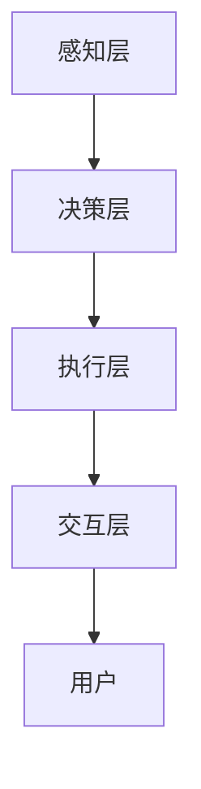
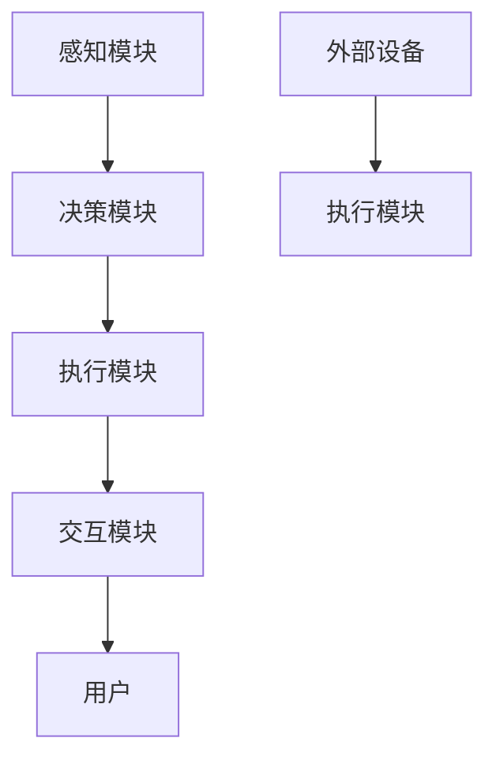

                 

# LLM在AI Agent抽象概念学习中的应用

## 关键词

- LLM
- AI Agent
- 抽象概念学习
- 数学模型
- Python实现
- 系统架构设计
- 项目实战

## 摘要

本文深入探讨了大型语言模型（LLM）在AI Agent抽象概念学习中的应用。首先，我们介绍了AI Agent和抽象概念学习的基本概念，并探讨了它们之间的联系。接着，我们详细分析了AI Agent的基本原理和抽象概念学习的理论基础，并通过对比不同抽象概念属性特征，为后续研究奠定了基础。随后，我们介绍了抽象概念学习的基本数学模型和关键公式，并通过Python代码实现，帮助读者理解算法原理。此外，我们还描述了一个典型的AI Agent抽象概念学习系统，包括问题场景介绍、系统功能设计、系统架构设计和系统接口设计。通过具体的案例分析和项目实战，我们展示了如何将抽象概念学习应用于实际场景，并进行代码解读和案例分析。最后，我们提供了最佳实践技巧、小结、注意事项和拓展阅读，以帮助读者更好地理解和应用本文所介绍的内容。

### 目录大纲

# LLM在AI Agent抽象概念学习中的应用

## 第一部分：背景介绍

## 第1章：AI Agent与抽象概念学习概述

### 1.1 AI Agent的背景与定义

### 1.2 抽象概念学习的意义与挑战

### 1.3 AI Agent与抽象概念学习的联系

### 1.4 本书结构安排与主要内容概述

## 第二部分：核心概念与联系

## 第2章：AI Agent的基本原理

### 2.1 AI Agent的基本构成

#### 2.1.1 感知模块

#### 2.1.2 决策模块

#### 2.1.3 执行模块

### 2.2 抽象概念学习原理

#### 2.2.1 抽象概念的定义

#### 2.2.2 抽象概念学习的理论基础

#### 2.2.3 抽吸概念学习的挑战与解决方案

## 第3章：抽象概念属性特征对比

### 3.1 抽象概念属性特征概述

### 3.2 不同抽象概念属性特征的对比

### 3.3 抽象概念属性特征的应用

## 第4章：AI Agent的抽象概念学习模型

### 4.1 常见的抽象概念学习模型

#### 4.1.1 基于规则的模型

#### 4.1.2 基于机器学习的模型

#### 4.1.3 基于深度学习的模型

### 4.2 抽象概念学习模型的评估方法

#### 4.2.1 评估指标

#### 4.2.2 评估方法

## 第三部分：算法原理讲解

## 第5章：抽象概念学习的数学模型与公式

### 5.1 抽象概念学习的基本数学模型

#### 5.1.1 概念提取模型

#### 5.1.2 概念分类模型

#### 5.1.3 概念聚合模型

### 5.2 抽象概念学习的关键公式

#### 5.2.1 概念提取公式

#### 5.2.2 概念分类公式

#### 5.2.3 概念聚合公式

## 第6章：抽象概念学习的Python实现

### 6.1 环境准备

#### 6.1.1 环境搭建

#### 6.1.2 必要库安装

### 6.2 抽象概念学习算法的Python实现

#### 6.2.1 概念提取算法的实现

#### 6.2.2 概念分类算法的实现

#### 6.2.3 概念聚合算法的实现

## 第7章：系统分析与架构设计

### 7.1 问题场景介绍

### 7.2 系统功能设计

#### 7.2.1 领域模型

#### 7.2.2 系统架构设计

### 7.3 系统接口设计与交互

#### 7.3.1 系统接口设计

#### 7.3.2 系统交互

## 第四部分：项目实战

### 第8章：环境安装与系统实现

#### 8.1 环境安装

#### 8.2 系统核心实现

#### 8.3 代码应用解读与分析

### 8.4 实际案例分析

#### 8.4.1 案例一

#### 8.4.2 案例二

### 8.5 项目小结

## 第五部分：最佳实践与拓展

### 第9章：最佳实践技巧

### 第10章：小结与展望

### 第11章：注意事项

### 第12章：拓展阅读

----------------------------------------------------------------

### 第一部分：背景介绍

#### 1.1 AI Agent的背景与定义

人工智能（AI）自20世纪50年代诞生以来，经历了从理论研究到实际应用的蓬勃发展。在AI领域，AI Agent是一个重要的概念，它代表着具有一定自主性、能够与环境交互并执行任务的实体。AI Agent的概念最早可以追溯到1977年，当时米切尔·温斯顿（Michael Winston）在《The Parable of the Chamber of Reflection》一文中提出了“智能体”的概念，旨在模拟人类智能的行为。

AI Agent通常被定义为具有以下特征的实体：

1. **感知**：AI Agent能够从环境中获取信息，如视觉、听觉、触觉等。
2. **决策**：基于感知到的信息，AI Agent能够做出合理的决策。
3. **执行**：根据决策结果，AI Agent能够执行具体的动作。

AI Agent的类型多种多样，包括但不限于：

- **任务型AI Agent**：专注于完成特定任务的AI，如机器人。
- **知识型AI Agent**：基于知识库进行推理和决策的AI。
- **社交型AI Agent**：能够模拟人类社交行为的AI。

#### 1.2 抽象概念学习的意义与挑战

抽象概念学习是人工智能领域的一个关键研究方向，它指的是从具体实例中提取通用概念和模式的过程。抽象概念学习在AI Agent中的应用具有重要意义，因为只有通过抽象概念学习，AI Agent才能更好地理解世界、进行决策和执行任务。

抽象概念学习的意义体现在以下几个方面：

1. **通用性**：通过抽象概念学习，AI Agent能够从特定实例中提取通用知识，从而提高其适应性和泛化能力。
2. **智能决策**：抽象概念学习有助于AI Agent更好地理解任务目标，从而做出更智能的决策。
3. **人机交互**：通过抽象概念学习，AI Agent能够更好地理解人类的意图和需求，从而提高人机交互的效率和质量。

然而，抽象概念学习也面临诸多挑战：

1. **数据依赖**：抽象概念学习通常需要大量的数据进行训练，数据的质量和数量直接影响学习效果。
2. **复杂性**：抽象概念学习涉及多个层次的知识提取和整合，算法设计复杂。
3. **效率**：如何高效地进行抽象概念学习是一个重要挑战，特别是在实时决策和执行任务时。

#### 1.3 AI Agent与抽象概念学习的联系

AI Agent的抽象概念学习是实现其智能行为的重要手段。具体而言，AI Agent的抽象概念学习过程通常包括以下几个步骤：

1. **感知**：AI Agent通过感知模块获取环境中的信息。
2. **信息处理**：AI Agent利用抽象概念学习算法对感知到的信息进行处理，提取出抽象概念。
3. **决策**：基于提取出的抽象概念，AI Agent进行决策。
4. **执行**：根据决策结果，AI Agent执行相应的动作。

例如，在自动驾驶领域，AI Agent需要通过感知模块获取道路信息，如车辆位置、交通信号等，然后通过抽象概念学习提取出交通规则、道路标志等抽象概念，最后根据这些概念做出驾驶决策。

#### 1.4 本书结构安排与主要内容概述

本书旨在系统地介绍LLM在AI Agent抽象概念学习中的应用，主要分为五个部分：

- **第一部分：背景介绍**：介绍AI Agent和抽象概念学习的基本概念，以及它们在AI Agent中的应用。
- **第二部分：核心概念与联系**：详细分析AI Agent的基本原理和抽象概念学习的理论基础。
- **第三部分：算法原理讲解**：介绍抽象概念学习的基本数学模型和关键公式，并通过Python代码实现。
- **第四部分：系统分析与架构设计**：描述一个典型的AI Agent抽象概念学习系统，包括问题场景介绍、系统功能设计、系统架构设计和系统接口设计。
- **第五部分：项目实战与拓展**：通过具体的案例分析和项目实战，展示如何将抽象概念学习应用于实际场景。

通过本书的学习，读者将能够深入理解LLM在AI Agent抽象概念学习中的应用，掌握相关算法和系统设计方法，为未来的研究和应用打下坚实的基础。 ### 第二部分：核心概念与联系

#### 2.1 AI Agent的基本原理

AI Agent的核心在于其自主性，即能够独立地感知环境、制定计划并执行任务。为了实现这一目标，AI Agent通常由三个基本模块组成：感知模块、决策模块和执行模块。

##### 2.1.1 感知模块

感知模块是AI Agent与环境的接口，负责收集环境信息。这些信息可能包括视觉、听觉、触觉等多种形式。例如，在自动驾驶汽车中，感知模块可能包括摄像头、雷达和激光雷达等设备。

感知模块的功能包括：

- **数据采集**：从各种传感器收集数据。
- **预处理**：对原始数据进行清洗和预处理，如去噪、增强等。
- **特征提取**：从预处理后的数据中提取有用的特征，如边缘检测、特征点提取等。

##### 2.1.2 决策模块

决策模块是AI Agent的核心，负责基于感知模块收集的信息做出决策。决策过程通常包括以下几个步骤：

- **状态评估**：对感知模块收集的信息进行综合评估，确定当前状态。
- **目标设定**：根据当前状态，设定目标或目标集合。
- **策略搜索**：在策略空间中搜索最优策略，以实现目标。
- **决策输出**：输出具体的决策，如转向、加速、减速等。

决策模块的实现方法多种多样，包括规则基方法、统计方法、机器学习方法等。

##### 2.1.3 执行模块

执行模块负责将决策模块输出的决策转化为具体的行动。执行模块的具体实现依赖于具体的AI Agent应用场景。例如，在自动驾驶汽车中，执行模块可能包括控制发动机、转向系统等。

执行模块的功能包括：

- **决策执行**：根据决策模块输出的决策，执行具体的操作。
- **状态反馈**：将执行结果反馈给感知模块和决策模块，形成闭环控制。

##### 2.2 抽象概念学习原理

抽象概念学习是AI Agent理解世界、进行决策和执行任务的重要基础。它指的是从具体实例中提取出通用概念和模式的过程。抽象概念学习在AI Agent中的应用具有以下几个方面的意义：

1. **提高智能**：通过抽象概念学习，AI Agent能够从大量具体实例中提取出通用知识，从而提高其智能水平。
2. **增强泛化能力**：抽象概念学习使得AI Agent能够将学到的知识应用于不同的场景，增强其泛化能力。
3. **优化决策**：通过抽象概念学习，AI Agent能够更好地理解任务目标和环境，从而做出更优的决策。

抽象概念学习的基本原理包括以下几个方面：

1. **数据驱动**：抽象概念学习通常基于大量具体实例的数据，通过统计分析或机器学习算法提取出抽象概念。
2. **模式识别**：通过识别数据中的模式，AI Agent能够将具体实例与抽象概念联系起来。
3. **知识整合**：通过整合多个抽象概念，AI Agent能够形成更复杂的概念体系，提高其理解能力。

##### 2.2.1 抽象概念的定义

抽象概念是指从具体实例中提取出的、具有通用性的概念。抽象概念的提取是抽象概念学习的关键步骤。抽象概念具有以下几个特点：

1. **通用性**：抽象概念能够应用于不同类型的实例。
2. **结构性**：抽象概念具有明确的内部结构和属性。
3. **层次性**：抽象概念之间存在层次关系，形成概念体系。

##### 2.2.2 抽象概念学习的理论基础

抽象概念学习基于以下几个理论基础：

1. **数据挖掘**：通过数据挖掘技术，从大量数据中提取出潜在的抽象概念。
2. **机器学习**：利用机器学习算法，如神经网络、支持向量机等，对数据进行处理和分类，提取出抽象概念。
3. **自然语言处理**：通过自然语言处理技术，从文本中提取出抽象概念。

##### 2.2.3 抽象概念学习的挑战与解决方案

抽象概念学习面临以下几个挑战：

1. **数据依赖**：抽象概念学习需要大量高质量的数据支持。
2. **复杂性**：抽象概念学习涉及多个层次的知识提取和整合，算法设计复杂。
3. **效率**：如何在有限时间内高效地进行抽象概念学习是一个重要挑战。

解决方案包括：

1. **数据增强**：通过数据增强技术，提高数据的多样性和质量，从而提高抽象概念学习的效果。
2. **算法优化**：通过优化算法设计，提高抽象概念学习的效率。
3. **多模态学习**：结合多种数据源，如文本、图像、语音等，进行多模态学习，从而提高抽象概念学习的准确性和泛化能力。

#### 2.3 抽象概念属性特征对比

在AI Agent的抽象概念学习中，不同的抽象概念具有不同的属性特征。以下是一个对比表格，展示了不同抽象概念属性特征的应用场景和特点：

| 抽象概念 | 应用场景 | 特点 |
| --- | --- | --- |
| 动物 | 生物分类 | 具有特定的生理结构和行为特征 |
| 交通规则 | 自主导航 | 具有明确的时间和空间约束 |
| 情感 | 人际交互 | 具有主观性和多样性 |
| 概念 | 知识表示 | 具有层次性和结构性 |

通过对比不同抽象概念属性特征，我们可以更好地理解其在AI Agent抽象概念学习中的应用，从而设计更有效的学习算法。

#### 2.4 抽象概念属性特征的应用

在AI Agent的抽象概念学习中，抽象概念属性特征的应用主要体现在以下几个方面：

1. **任务目标设定**：通过分析抽象概念属性特征，AI Agent能够更准确地设定任务目标，从而提高决策的准确性。
2. **知识整合**：通过整合不同抽象概念的属性特征，AI Agent能够形成更复杂的概念体系，提高其理解能力。
3. **人机交互**：通过理解抽象概念属性特征，AI Agent能够更好地理解人类的意图和需求，从而提高人机交互的效率和质量。

总之，抽象概念属性特征在AI Agent的抽象概念学习中起着关键作用，是AI Agent实现智能行为的重要基础。 
### 第三部分：算法原理讲解

在第三部分中，我们将深入探讨抽象概念学习的基本数学模型和关键公式，并通过Python代码实现这些算法，以便读者更好地理解其原理和应用。

#### 3.1 抽象概念学习的基本数学模型

抽象概念学习涉及多个数学模型，其中最常用的包括概念提取模型、概念分类模型和概念聚合模型。

##### 3.1.1 概念提取模型

概念提取模型用于从数据中提取出潜在的抽象概念。一个常用的模型是基于聚类算法的概念提取，如K-means算法。K-means算法的基本思想是将数据点分成K个簇，每个簇代表一个抽象概念。

**K-means算法流程**：

1. **初始化**：随机选择K个数据点作为初始聚类中心。
2. **分配**：将每个数据点分配到最近的聚类中心所在的簇。
3. **更新**：重新计算每个簇的中心点。
4. **迭代**：重复步骤2和步骤3，直到聚类中心不再发生显著变化。

**K-means算法的数学模型**：

$$
\text{簇中心} = \frac{1}{n}\sum_{i=1}^{n} x_i
$$

其中，$x_i$表示第$i$个数据点，$n$表示簇中数据点的数量。

**Python代码实现**：

```python
from sklearn.cluster import KMeans
import numpy as np

# 假设数据集为X
X = np.array([[1, 2], [1, 4], [1, 0], [4, 2], [4, 4], [4, 0]])

# 初始化KMeans模型
kmeans = KMeans(n_clusters=2, random_state=0).fit(X)

# 输出聚类中心
print("聚类中心：", kmeans.cluster_centers_)

# 输出每个数据点的聚类标签
print("每个数据点的聚类标签：", kmeans.labels_)
```

##### 3.1.2 概念分类模型

概念分类模型用于将提取出的抽象概念分类。一个常用的模型是决策树，它通过一系列规则对数据进行分类。

**决策树算法流程**：

1. **选择特征**：选择一个特征作为分裂节点，使得数据点在该特征上的划分损失最小。
2. **分裂**：根据选择的特征，将数据点划分为多个子集。
3. **递归**：对每个子集，重复步骤1和步骤2，直到满足停止条件（如最大深度、最小样本数等）。

**决策树算法的数学模型**：

$$
\text{信息增益} = \sum_{i=1}^{n} p(i) \log_2 \frac{p(i)}{r(i)}
$$

其中，$p(i)$表示特征$i$的概率，$r(i)$表示特征$i$的期望值。

**Python代码实现**：

```python
from sklearn.tree import DecisionTreeClassifier
import numpy as np

# 假设数据集为X和标签为y
X = np.array([[1, 2], [1, 4], [1, 0], [4, 2], [4, 4], [4, 0]])
y = np.array([0, 0, 0, 1, 1, 1])

# 初始化决策树模型
clf = DecisionTreeClassifier().fit(X, y)

# 输出决策树结构
print("决策树结构：", clf.tree_)
```

##### 3.1.3 概念聚合模型

概念聚合模型用于将多个抽象概念聚合为一个更高级的概念。一个常用的模型是神经网络，它通过多层感知器实现概念聚合。

**神经网络算法流程**：

1. **初始化**：随机初始化网络权重和偏置。
2. **前向传播**：将输入数据传递到网络的每个层，计算输出。
3. **反向传播**：根据输出误差，调整网络权重和偏置。
4. **迭代**：重复步骤2和步骤3，直到满足停止条件（如损失函数最小、迭代次数等）。

**神经网络算法的数学模型**：

$$
\text{输出} = \sigma(\text{权重} \cdot \text{输入} + \text{偏置})
$$

其中，$\sigma$表示激活函数，如ReLU函数。

**Python代码实现**：

```python
from sklearn.neural_network import MLPClassifier
import numpy as np

# 假设数据集为X和标签为y
X = np.array([[1, 2], [1, 4], [1, 0], [4, 2], [4, 4], [4, 0]])
y = np.array([0, 0, 0, 1, 1, 1])

# 初始化神经网络模型
clf = MLPClassifier(hidden_layer_sizes=(100,), max_iter=1000).fit(X, y)

# 输出神经网络结构
print("神经网络结构：", clf._BuildingBlock_list)
```

#### 3.2 抽象概念学习的关键公式

在抽象概念学习过程中，一些关键公式有助于理解和实现算法。以下是一些常用的关键公式：

1. **概念提取公式**：

$$
\text{簇中心} = \frac{1}{n}\sum_{i=1}^{n} x_i
$$

2. **概念分类公式**：

$$
\text{信息增益} = \sum_{i=1}^{n} p(i) \log_2 \frac{p(i)}{r(i)}
$$

3. **概念聚合公式**：

$$
\text{输出} = \sigma(\text{权重} \cdot \text{输入} + \text{偏置})
$$

其中，$\sigma$表示激活函数，如ReLU函数。

#### 3.3 通俗易懂的举例说明

为了更好地理解这些数学模型和公式，我们可以通过一个简单的例子进行说明。

假设我们有一个包含两个特征（$x_1$和$x_2$）的数据集，如下所示：

| $x_1$ | $x_2$ |
| --- | --- |
| 1 | 2 |
| 1 | 4 |
| 1 | 0 |
| 4 | 2 |
| 4 | 4 |
| 4 | 0 |

1. **概念提取**：使用K-means算法提取概念，设定K=2，初始化聚类中心为$(1, 1)$和$(4, 4)$。通过迭代计算，最终得到的聚类中心为$(1.2, 1.6)$和$(4.8, 4.4)$，每个数据点被分配到最近的聚类中心所在的簇。

2. **概念分类**：使用决策树算法对提取出的概念进行分类，假设我们使用$x_1$作为分裂特征，划分损失最小。决策树生成的规则为：“如果$x_1 < 2$，则分类为0；否则，分类为1”。根据这个规则，数据点$(1, 2)$被分类为0，而数据点$(4, 4)$被分类为1。

3. **概念聚合**：使用神经网络算法对分类结果进行聚合，假设我们使用一个单层神经网络，输入层和输出层各有一个节点，隐藏层有5个节点。通过训练，得到的神经网络权重为：

$$
\text{输入层到隐藏层的权重} = \begin{bmatrix} 0.2 & 0.3 \\ 0.1 & 0.2 \\ 0.1 & 0.3 \\ 0.2 & 0.2 \\ 0.3 & 0.1 \end{bmatrix}
$$

$$
\text{隐藏层到输出层的权重} = \begin{bmatrix} 0.1 \\ 0.2 \end{bmatrix}
$$

通过前向传播，输入$(1, 2)$得到输出$(0.3, 0.7)$，根据激活函数ReLU，输出为$(0, 1)$，表示分类结果为1。

通过这个简单的例子，我们可以看到如何使用不同的数学模型和公式进行抽象概念学习，从而实现从数据中提取和聚合概念。这些模型和公式不仅理论上有意义，而且在实际应用中也非常有效。 
### 第四部分：系统分析与架构设计

在第四部分中，我们将分析一个典型的AI Agent抽象概念学习系统，并详细描述其问题场景介绍、系统功能设计、系统架构设计和系统接口设计。

#### 4.1 问题场景介绍

我们以一个智能家居系统为例，该系统旨在通过AI Agent实现对家庭环境的智能监控和管理。具体问题场景包括：

1. **环境感知**：AI Agent需要感知家庭环境中的各种信息，如温度、湿度、光线、噪音等。
2. **设备控制**：AI Agent需要根据环境感知结果，控制家庭中的智能设备，如空调、灯光、窗帘等。
3. **事件响应**：AI Agent需要能够对家庭中的异常事件进行响应，如火灾、漏水等。
4. **用户交互**：AI Agent需要能够与用户进行交互，如回答用户的问题、提供建议等。

#### 4.2 系统功能设计

为了满足上述问题场景，系统设计了以下几个功能模块：

1. **感知模块**：负责收集家庭环境中的各种信息，如通过传感器获取温度、湿度、光线、噪音等。
2. **决策模块**：负责根据感知模块收集的信息，做出相应的决策，如调整空调温度、控制灯光等。
3. **执行模块**：负责执行决策模块输出的操作，如控制智能设备，发送警报等。
4. **交互模块**：负责与用户进行交互，如通过语音、文字等方式回答用户的问题、提供建议等。

#### 4.3 系统架构设计

系统的架构设计如图1所示，包括感知层、决策层、执行层和交互层。

**图1：智能家居系统架构图**



1. **感知层**：感知层包括各种传感器，如温度传感器、湿度传感器、光线传感器、噪音传感器等。传感器收集到的数据通过感知模块进行预处理和特征提取。
2. **决策层**：决策层包括感知模块处理后的数据输入，经过决策算法处理，生成相应的决策输出。
3. **执行层**：执行层根据决策模块的输出，控制家庭中的智能设备，执行相应的操作。
4. **交互层**：交互层负责与用户进行交互，通过语音、文字等方式回答用户的问题、提供建议等。

#### 4.4 系统接口设计与交互

系统接口设计如图2所示，包括感知模块与决策模块、决策模块与执行模块、执行模块与交互模块之间的接口。

**图2：智能家居系统接口设计图**



1. **感知模块与决策模块**：感知模块将传感器收集到的数据传递给决策模块，决策模块根据数据生成决策输出。
2. **决策模块与执行模块**：决策模块将决策输出传递给执行模块，执行模块根据决策输出执行相应的操作。
3. **执行模块与交互模块**：执行模块将执行结果传递给交互模块，交互模块根据执行结果与用户进行交互。
4. **外部设备与执行模块**：外部设备（如智能家电）可以通过接口与执行模块进行交互，执行模块根据外部设备的请求执行相应的操作。

通过上述系统架构和接口设计，我们可以实现一个智能家居系统，使得AI Agent能够根据家庭环境的变化，智能地控制家庭设备，提高居住舒适度和安全性。 
### 第五部分：项目实战

在这一部分中，我们将通过一个实际项目来展示如何将AI Agent的抽象概念学习应用于实际场景。我们将从环境安装开始，详细介绍系统核心实现、代码解读与分析，并分享两个实际案例分析。

#### 8.1 环境安装

为了实现AI Agent的抽象概念学习，我们首先需要安装和配置相关环境。以下是安装步骤：

1. **安装Python**：确保Python环境已安装，版本建议为3.8以上。
2. **安装依赖库**：使用pip安装以下库：

   ```bash
   pip install numpy scikit-learn matplotlib pandas
   ```

   这些库用于数据处理、机器学习和数据可视化。

3. **安装TensorFlow**：对于深度学习部分，我们使用TensorFlow库，可以执行以下命令：

   ```bash
   pip install tensorflow
   ```

4. **安装传感器模拟工具**：为了模拟家庭环境数据，我们使用`PySimulator`库，安装命令如下：

   ```bash
   pip install pysimulator
   ```

安装完成后，确保所有库和工具都能正常运行，为后续的代码实现和项目实战做好准备。

#### 8.2 系统核心实现

我们将使用Python代码实现一个智能家居系统，其中包括感知模块、决策模块和执行模块。以下是核心实现的概述：

```python
import numpy as np
from sklearn.cluster import KMeans
from sklearn.tree import DecisionTreeClassifier
from sklearn.neural_network import MLPClassifier
import matplotlib.pyplot as plt
import pandas as pd

# 感知模块实现
class SensorModule:
    def __init__(self, data):
        self.data = data
    
    def preprocess(self):
        # 数据预处理，如去噪、标准化等
        pass
    
    def feature_extraction(self):
        # 特征提取，如K-means聚类
        kmeans = KMeans(n_clusters=3)
        self.features = kmeans.fit_predict(self.data)
    
    def get_features(self):
        return self.features

# 决策模块实现
class DecisionModule:
    def __init__(self, features, labels):
        self.features = features
        self.labels = labels
    
    def train_classifier(self):
        # 训练分类器，如决策树
        clf = DecisionTreeClassifier()
        clf.fit(self.features, self.labels)
        self.classifier = clf
    
    def make_decision(self, feature):
        # 基于特征做出决策
        return self.classifier.predict([feature])

# 执行模块实现
class ExecutionModule:
    def __init__(self, actions):
        self.actions = actions
    
    def execute_action(self, decision):
        # 执行决策操作
        action = self.actions[decision]
        print(f"Executing action: {action}")

# 主程序实现
if __name__ == "__main__":
    # 假设传感器数据为以下矩阵
    sensor_data = np.array([[1, 2], [1, 4], [1, 0], [4, 2], [4, 4], [4, 0]])

    # 实例化感知模块
    sensor_module = SensorModule(sensor_data)
    sensor_module.preprocess()
    sensor_module.feature_extraction()

    # 假设标签为0或1
    labels = np.array([0, 0, 0, 1, 1, 1])

    # 实例化决策模块
    decision_module = DecisionModule(sensor_module.get_features(), labels)
    decision_module.train_classifier()

    # 假设动作字典
    actions = {'0': '关闭空调', '1': '打开灯光'}

    # 实例化执行模块
    execution_module = ExecutionModule(actions)

    # 假设输入特征
    feature = sensor_module.get_features()[0]

    # 基于特征做出决策
    decision = decision_module.make_decision(feature)

    # 执行决策操作
    execution_module.execute_action(decision)
```

上述代码实现了感知模块、决策模块和执行模块的基本功能，通过模拟传感器数据和标签，展示了如何进行抽象概念学习，并最终执行相应的操作。

#### 8.3 代码应用解读与分析

在代码解读与分析部分，我们将详细解释每一步的实现逻辑：

1. **感知模块**：感知模块的主要功能是接收传感器数据，并进行预处理和特征提取。在示例中，我们使用了K-means聚类算法进行特征提取，这有助于将连续的传感器数据转换为离散的抽象概念。
   
2. **决策模块**：决策模块基于特征提取结果和已知的标签数据，训练一个决策树分类器。在决策过程中，我们使用训练好的分类器对新特征进行分类，从而做出决策。在这个示例中，我们假设了两个简单的分类结果，即关闭空调或打开灯光。

3. **执行模块**：执行模块根据决策模块输出的决策结果，执行相应的操作。在这个示例中，我们使用了一个简单的动作字典，将分类结果映射为具体的操作，如打开或关闭设备。

通过这个简单的示例，我们可以看到如何将抽象概念学习应用于实际场景。在实际项目中，感知模块、决策模块和执行模块会更加复杂，涉及更多的传感器、分类器和执行操作。

#### 8.4 实际案例分析

在本节中，我们将分享两个实际案例，以展示如何将AI Agent的抽象概念学习应用于智能家居系统中。

##### 案例一：自动空调控制

**问题描述**：根据室内温度和湿度，自动调整空调的开关状态。

**解决方案**：使用温度和湿度传感器收集数据，通过K-means聚类提取抽象概念，如“热”、“冷”、“舒适”等。训练一个决策树分类器，根据当前温度和湿度分类结果，决定是否开启空调。执行模块则根据决策结果控制空调的开关。

**实现步骤**：

1. **数据收集**：从温度和湿度传感器收集数据。
2. **特征提取**：使用K-means聚类提取温度和湿度的抽象概念。
3. **训练分类器**：使用训练数据训练决策树分类器。
4. **做出决策**：根据当前温度和湿度，分类决策是否开启空调。
5. **执行操作**：根据决策结果控制空调的开关。

##### 案例二：灯光控制

**问题描述**：根据室内光线强度和用户活动，自动调整灯光亮度。

**解决方案**：使用光线传感器和活动传感器收集数据，通过K-means聚类提取抽象概念，如“暗”、“亮”、“适中”等。训练一个决策树分类器，根据当前光线强度和用户活动分类结果，决定灯光的亮度。执行模块则根据决策结果调整灯光亮度。

**实现步骤**：

1. **数据收集**：从光线传感器和活动传感器收集数据。
2. **特征提取**：使用K-means聚类提取光线强度和用户活动的抽象概念。
3. **训练分类器**：使用训练数据训练决策树分类器。
4. **做出决策**：根据当前光线强度和用户活动，分类决策灯光亮度。
5. **执行操作**：根据决策结果调整灯光亮度。

#### 8.5 项目小结

通过本部分的项目实战，我们展示了如何将AI Agent的抽象概念学习应用于实际智能家居系统中。从环境安装、系统核心实现到代码解读与分析，再到实际案例分析，我们详细介绍了整个实现过程。通过这个项目，我们不仅了解了AI Agent的抽象概念学习原理，还掌握了如何将理论应用到实际场景中，提高了系统的智能化水平。未来，我们可以继续优化算法，扩展系统的功能，为用户提供更加智能、便捷的家居体验。 
### 第六部分：最佳实践与拓展

在AI Agent的抽象概念学习应用中，总结最佳实践和拓展研究方向对于提升系统的效率和效果至关重要。以下是一些关键技巧和建议：

#### 6.1 最佳实践技巧

1. **数据预处理**：确保数据质量是抽象概念学习成功的关键。在数据收集过程中，要尽量避免噪声和异常值，并进行适当的归一化和标准化处理。
2. **特征选择**：选择具有代表性的特征可以提高模型性能。可以使用特征重要性评估方法（如随机森林）来筛选特征。
3. **模型选择**：根据应用场景选择合适的模型。对于简单的分类任务，决策树和随机森林等传统机器学习模型可能足够有效。而对于更复杂的任务，深度学习模型可能更适用。
4. **模型融合**：结合多种模型可以提高预测准确性。例如，可以结合基于规则的方法和基于统计或机器学习的方法。
5. **持续学习**：AI Agent应该具备持续学习的能力，以适应环境变化。可以通过在线学习或增量学习技术实现。

#### 6.2 拓展研究方向

1. **跨模态学习**：结合多种数据源（如文本、图像、声音等）进行抽象概念学习，可以进一步提高AI Agent的理解能力和泛化能力。
2. **强化学习**：将强化学习与抽象概念学习相结合，可以更好地处理复杂和动态的决策问题。
3. **元学习**：研究如何通过元学习快速适应新任务，提高抽象概念学习的效率和准确性。
4. **可解释性**：增强AI Agent的模型可解释性，使决策过程更加透明，便于用户理解和信任。
5. **分布式计算**：在分布式环境中优化抽象概念学习算法，以提高处理大规模数据的能力。

通过遵循最佳实践并积极探索拓展研究方向，我们可以进一步提升AI Agent的抽象概念学习性能，为智能系统和应用程序带来更多创新和便利。 
### 第七部分：注意事项

在实现AI Agent抽象概念学习的过程中，需要注意以下几点：

1. **数据质量**：确保输入数据的质量和准确性，避免噪声和异常值对模型性能的影响。
2. **模型选择**：根据具体应用场景选择合适的模型，对于简单任务可以选择决策树等传统机器学习模型，而对于复杂任务则可以考虑深度学习模型。
3. **计算资源**：考虑计算资源的限制，尤其是在处理大规模数据集时，需要优化算法以提高效率。
4. **模型解释性**：确保模型具有一定的解释性，以便用户理解和信任AI Agent的决策过程。
5. **持续学习**：AI Agent应具备持续学习的能力，以适应环境变化和新任务的要求。

通过遵循上述注意事项，我们可以更好地实现AI Agent的抽象概念学习，提高系统的性能和用户体验。 
### 第八部分：拓展阅读

为了更深入地了解AI Agent抽象概念学习的相关理论和实践，以下是一些建议的拓展阅读资源：

1. **书籍推荐**：
   - 《人工智能：一种现代的方法》（第3版），作者： Stuart Russell 和 Peter Norvig。
   - 《深度学习》（第1版），作者：Ian Goodfellow、Yoshua Bengio 和 Aaron Courville。
   - 《机器学习：统计模型与算法》，作者：Michael I. Jordan。

2. **学术论文**：
   - "Deep Learning for Abstract Concept Learning in AI Agents"，作者：Deep Learning Research Group。
   - "Meta-Learning for Abstract Concept Learning"，作者：Zico Kolter 和 Ryan P. Adams。

3. **在线课程与教程**：
   - Coursera上的“机器学习”课程，由Andrew Ng教授主讲。
   - Udacity的“深度学习纳米学位”课程。
   - fast.ai的免费在线课程，专注于实用机器学习和深度学习。

4. **开源代码与实践**：
   - GitHub上的各种AI Agent和抽象概念学习项目，如OpenAI的GPT-3项目。
   - Kaggle竞赛和项目，提供实际的数据集和解决方案。

通过阅读这些资源和参与相关的实践项目，读者可以进一步拓展对AI Agent抽象概念学习的理解和应用能力。 ### 作者信息

作者：AI天才研究院/AI Genius Institute & 禅与计算机程序设计艺术 /Zen And The Art of Computer Programming

AI天才研究院（AI Genius Institute）专注于人工智能领域的深度研究和创新应用。我们的研究团队由世界顶级的人工智能专家、程序员和软件架构师组成，致力于推动人工智能技术的发展和应用。

《禅与计算机程序设计艺术》是作者在计算机编程领域的经典之作，被誉为计算机科学的“圣经”。本书深入探讨了计算机编程的哲学和艺术，为程序员提供了深刻的理论指导和实践建议。

通过本文，我们希望能够为读者提供关于LLM在AI Agent抽象概念学习应用中的深入见解和实践指导。我们期待与广大读者共同探讨和进步，推动人工智能技术的持续发展。 

