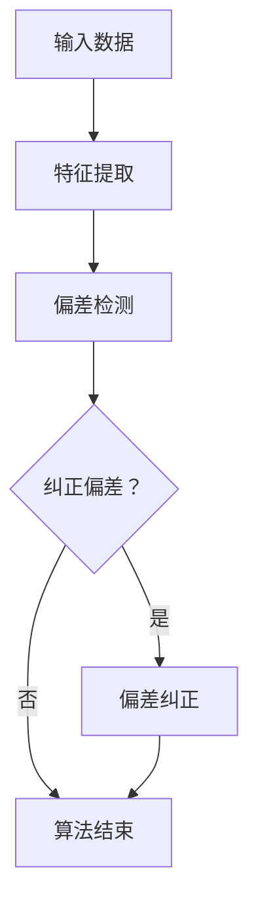
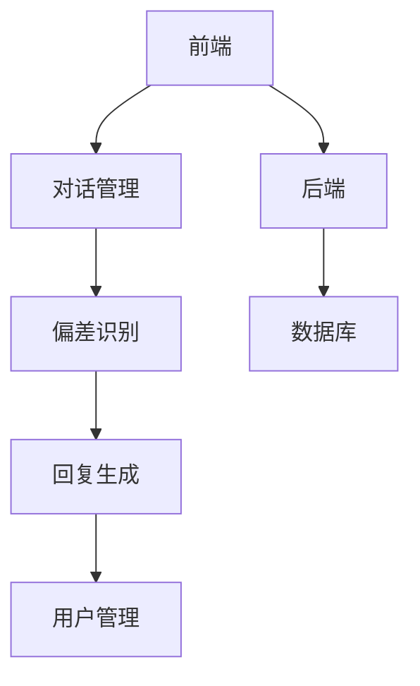
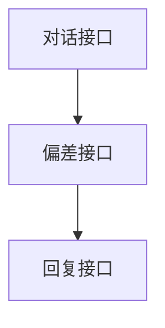
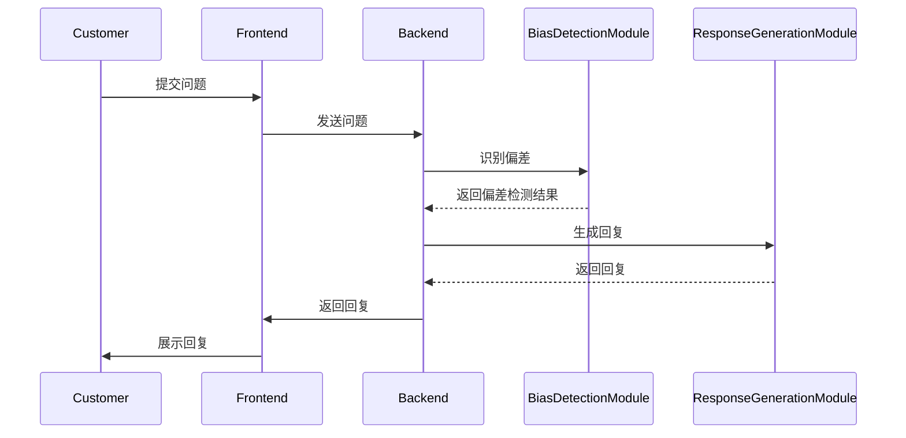
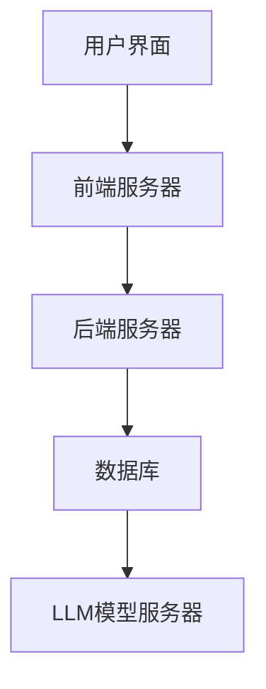

                 

### LLM在AI Agent认知偏差识别中的应用

#### 引言

在人工智能（AI）迅猛发展的今天，AI代理已经成为许多领域的关键技术，如自动驾驶、智能客服和金融分析等。这些AI代理在执行任务时，依赖于大量的数据和复杂的算法，从而模拟人类智能行为。然而，随着AI技术的发展，认知偏差识别问题也逐渐浮现。认知偏差是指AI代理在决策过程中，由于数据、算法或设计缺陷等原因，导致的非理性和错误的决策行为。识别和纠正这些偏差对于确保AI代理的可靠性和公平性至关重要。

大型语言模型（LLM）作为一种先进的AI技术，在自然语言处理和智能对话领域取得了显著成果。LLM通过学习海量文本数据，能够生成流畅、自然的文本，甚至进行一定程度的推理和决策。近年来，研究者开始探索将LLM应用于AI代理的认知偏差识别。本文将深入探讨LLM在AI Agent认知偏差识别中的应用，分析其优势和挑战，并展望未来研究方向。

本文的结构如下：首先，介绍LLM和AI Agent的基本概念，以及认知偏差的定义和类型。然后，讨论LLM在认知偏差识别中的优势和挑战。接着，介绍几种基于LLM的偏差识别方法，并详细讲解其原理和实现。之后，通过实际案例展示LLM在AI代理偏差识别中的应用效果。最后，总结全文，提出未来研究方向和最佳实践建议。

#### 关键词

大型语言模型（LLM），AI Agent，认知偏差，识别，应用，挑战，自然语言处理，智能对话，偏差纠正。

#### 摘要

本文探讨了大型语言模型（LLM）在AI Agent认知偏差识别中的应用。首先介绍了LLM和AI Agent的基本概念，以及认知偏差的定义和类型。接着分析了LLM在认知偏差识别中的优势和挑战，包括其在自然语言处理和智能对话领域的强大能力。本文随后介绍了基于LLM的几种偏差识别方法，包括基于特征的方法、基于模型的方法和基于数据的方法。通过实际案例展示了LLM在AI代理偏差识别中的应用效果，并分析了其优缺点。最后，本文总结了全文，提出了未来研究方向和最佳实践建议，以期为相关领域的研究和实践提供参考。

#### LLM与AI Agent的基本概念

在深入探讨LLM在AI Agent认知偏差识别中的应用之前，首先需要了解LLM和AI Agent的基本概念。

**大型语言模型（LLM）**

LLM是指通过学习海量文本数据，能够生成流畅、自然的文本，甚至进行一定程度的推理和决策的人工智能模型。近年来，随着深度学习技术的发展，LLM在自然语言处理领域取得了显著的成果。典型的LLM模型包括GPT（Generative Pre-trained Transformer）、BERT（Bidirectional Encoder Representations from Transformers）等。这些模型通过在大量文本数据上进行预训练，学会了语言的结构和语义，从而能够对自然语言进行理解和生成。

LLM的核心优势在于其强大的语言理解和生成能力。首先，LLM能够生成高质量的自然语言文本，这使其在智能客服、聊天机器人、文本生成等领域具有广泛的应用。其次，LLM具有强大的推理能力，能够在一定范围内进行逻辑推理和决策。例如，在问答系统中，LLM可以根据用户的问题生成相关的回答，甚至在医疗咨询、法律咨询等领域提供专业意见。

然而，LLM也存在一些局限性。首先，LLM的学习过程依赖于大量文本数据，如果数据质量不高或者存在偏差，可能会影响LLM的性能。其次，LLM的推理能力有限，无法像人类一样进行复杂的推理和决策。此外，LLM在处理罕见或特定领域的问题时，可能存在性能下降的情况。

**AI Agent**

AI Agent是指能够自主执行任务、与环境互动并做出决策的人工智能系统。AI Agent的设计和实现涉及多个领域，包括机器学习、自然语言处理、计算机视觉等。典型的AI Agent包括自动驾驶汽车、智能家居控制系统、智能客服等。

AI Agent的核心功能包括感知、规划、决策和行动。感知是指AI Agent通过传感器获取环境信息；规划是指AI Agent根据感知到的信息，制定执行任务的计划；决策是指AI Agent根据规划结果，选择最优的行动方案；行动是指AI Agent执行选定的行动方案。通过这些功能，AI Agent能够自主执行任务，并适应环境变化。

在AI Agent的设计中，认知偏差识别是一个重要问题。认知偏差是指AI Agent在决策过程中，由于数据、算法或设计缺陷等原因，导致的非理性和错误的决策行为。例如，自动驾驶汽车在识别交通标志时，可能会因为光照条件、天气等因素产生偏差；智能客服在处理用户问题时，可能会因为数据不完整或语义理解错误，导致错误的回答。

认知偏差的影响和危害是多方面的。首先，认知偏差可能导致AI Agent的决策不准确，影响其任务执行效果。其次，认知偏差可能导致AI Agent的行为不符合预期，甚至产生危险。例如，自动驾驶汽车在识别行人时产生偏差，可能导致交通事故。此外，认知偏差还可能损害AI Agent的可靠性和公平性，影响其在实际应用中的可信度。

为了解决认知偏差问题，研究者们提出了多种方法，包括基于特征的方法、基于模型的方法和基于数据的方法。基于特征的方法通过分析AI Agent的输入特征，识别潜在的偏差；基于模型的方法通过构建偏差识别模型，自动检测和纠正偏差；基于数据的方法通过分析AI Agent的历史行为数据，识别偏差模式。

LLM在AI Agent认知偏差识别中的应用前景广阔。首先，LLM具有强大的语言理解和生成能力，能够帮助AI Agent更好地理解环境和用户需求，从而减少认知偏差。其次，LLM可以通过学习大量文本数据，识别和纠正AI Agent的决策偏差。例如，在自动驾驶领域，LLM可以帮助识别和纠正自动驾驶汽车的认知偏差，提高其决策准确性。此外，LLM还可以用于智能客服、金融分析等领域，帮助识别和纠正AI代理的认知偏差，提高其服务质量和用户体验。

总之，LLM与AI Agent的结合为认知偏差识别提供了新的思路和方法。通过深入研究LLM在认知偏差识别中的应用，可以进一步提高AI Agent的决策准确性、可靠性和公平性，为人工智能技术的发展和应用奠定坚实基础。

#### 认知偏差的定义和类型

认知偏差是指个体在信息处理过程中，由于感知、记忆、推理等心理机制的局限性，导致其判断和决策偏离理性状态的现象。在人工智能（AI）领域，认知偏差同样存在，并且可能对AI系统的性能和可靠性产生严重影响。理解认知偏差的定义和类型，对于识别和纠正AI系统中的偏差至关重要。

**认知偏差的定义**

认知偏差是指个体在信息处理过程中，由于心理机制或外界因素的干扰，导致其判断和决策偏离理性状态的现象。这些偏差可以表现为对信息的过分简化、选择性记忆、认知偏差放大等。在人类行为中，认知偏差无处不在，如锚定效应、确认偏见、可用性偏差等。在AI系统中，认知偏差可能来源于数据偏差、算法设计缺陷、模型训练数据不足等多种因素。

**认知偏差的类型**

1. **数据偏差**：数据偏差是指AI系统在训练数据中存在的不均衡、噪声或偏见，导致模型对特定类别的数据产生偏差。常见的类型包括：
   - **样本不平衡**：训练数据中某些类别样本数量远多于其他类别，导致模型对这些类别过度关注。
   - **噪声数据**：训练数据中包含大量噪声或错误数据，影响模型的泛化能力。
   - **数据泄露**：训练数据中包含测试数据的信息，导致模型在测试数据上的表现优于实际。

2. **算法偏差**：算法偏差是指算法在设计和实现过程中，由于人类偏好或设计缺陷，导致模型产生偏见。常见的类型包括：
   - **过拟合**：模型在训练数据上表现良好，但在测试数据上表现不佳，通常是由于模型过于复杂，未能捕捉到数据的真实分布。
   - **选择偏见**：算法在样本选择过程中，未能充分考虑样本的代表性和多样性，导致模型对某些特定样本产生偏差。

3. **模型偏差**：模型偏差是指模型在训练和预测过程中，由于数据集的偏差、算法的设计或训练策略等原因，导致模型产生偏差。常见的类型包括：
   - **预测偏差**：模型对某些类别的预测结果偏差较大，通常是由于训练数据中这些类别的样本数量较少或标签错误。
   - **解释偏差**：模型在解释其预测结果时，由于解释方法的局限性，未能准确反映数据特征和关系，导致解释结果偏差。

4. **交互偏差**：交互偏差是指AI系统与用户或环境交互过程中产生的偏差。常见的类型包括：
   - **语言偏差**：AI系统在处理自然语言时，由于语言复杂性或理解不足，导致对话内容产生偏差。
   - **反馈偏差**：用户对AI系统的反馈可能存在偏见，影响系统的学习和优化。

**认知偏差的影响**

认知偏差对AI系统的性能和可靠性具有多方面的影响。首先，认知偏差可能导致模型在特定任务上的表现不佳，影响其决策准确性。例如，在自动驾驶领域，如果模型在识别交通标志时存在偏差，可能会导致误判或错误决策，从而引发交通事故。其次，认知偏差可能损害AI系统的公平性和透明性，影响其在实际应用中的可信度。例如，在招聘系统中，如果模型存在性别或种族偏见，可能会导致不公平的招聘决策。

**认知偏差的识别与纠正**

为了解决认知偏差问题，研究者们提出了多种方法，包括基于特征的方法、基于模型的方法和基于数据的方法。基于特征的方法通过分析AI系统的输入特征，识别潜在的偏差；基于模型的方法通过构建偏差识别模型，自动检测和纠正偏差；基于数据的方法通过分析AI系统的历史行为数据，识别偏差模式。以下将详细介绍这些方法。

1. **基于特征的方法**：基于特征的方法通过分析AI系统的输入特征，识别潜在的偏差。具体步骤包括：
   - **特征提取**：从AI系统的输入数据中提取关键特征。
   - **特征分析**：分析特征分布、相关性等，识别潜在的偏差。
   - **偏差纠正**：根据特征分析结果，调整特征权重或算法参数，以减少偏差。

2. **基于模型的方法**：基于模型的方法通过构建偏差识别模型，自动检测和纠正偏差。具体步骤包括：
   - **模型训练**：使用标记数据集训练偏差识别模型。
   - **模型评估**：评估模型在测试数据上的表现，识别偏差。
   - **模型优化**：根据评估结果，调整模型参数或算法结构，以减少偏差。

3. **基于数据的方法**：基于数据的方法通过分析AI系统的历史行为数据，识别偏差模式。具体步骤包括：
   - **数据收集**：收集AI系统的历史行为数据。
   - **数据预处理**：清洗和标准化数据，确保数据质量。
   - **偏差检测**：使用统计方法或机器学习方法，分析数据中是否存在偏差模式。
   - **偏差纠正**：根据偏差检测结果，调整系统参数或算法，以减少偏差。

通过这些方法，AI系统可以在一定程度上识别和纠正认知偏差，提高其决策准确性、可靠性和公平性。然而，认知偏差问题复杂多样，需要结合多种方法进行综合分析和处理。

总之，认知偏差是AI系统中的一个重要问题，理解其定义和类型对于识别和纠正偏差至关重要。通过深入研究和实践，可以不断提高AI系统的性能和可靠性，为人工智能技术的发展和应用提供有力支持。

#### LLM在认知偏差识别中的优势和挑战

在认知偏差识别领域，大型语言模型（LLM）凭借其强大的语言理解和生成能力，展现出显著的优势。同时，LLM在认知偏差识别中也面临一些挑战。以下将详细讨论LLM在认知偏差识别中的优势和应用，以及其面临的挑战和限制。

**LLM在认知偏差识别中的优势**

1. **强大的语言理解能力**：LLM通过在大量文本数据上进行预训练，掌握了丰富的语言知识和语义理解能力。这使得LLM能够深入理解文本内容，识别出潜在的认知偏差。例如，在文本分类任务中，LLM可以通过分析文本的上下文和语义关系，识别出作者可能的偏见，从而纠正文本中的错误。

2. **自适应性和灵活性**：LLM具有高度的自适应性和灵活性，可以根据不同的应用场景和需求进行定制。通过调整模型参数和训练数据，LLM可以在不同领域和任务中发挥优势。例如，在法律领域中，LLM可以用于识别和纠正法律文本中的偏见，提高司法公正性。

3. **跨领域应用能力**：LLM通过预训练过程，积累了丰富的跨领域知识。这使得LLM能够处理多种类型的文本数据，从而在认知偏差识别中具有广泛的应用前景。例如，在医疗领域中，LLM可以用于识别和纠正医学报告中的偏见，提高医疗诊断的准确性。

4. **生成高质量文本**：LLM具有生成高质量文本的能力，可以用于生成解释性文本，帮助用户理解和纠正认知偏差。例如，在智能客服领域，LLM可以生成个性化的解释性文本，向用户解释AI系统的决策过程和结果，从而提高用户的信任和理解。

**LLM在认知偏差识别中的应用**

1. **文本分析**：LLM可以用于文本分析任务，如文本分类、情感分析和命名实体识别。通过这些任务，LLM可以识别文本中的潜在偏见，并提供纠正建议。例如，在新闻分析中，LLM可以识别出新闻报道中的偏见，帮助编辑人员进行修改。

2. **对话系统**：LLM可以应用于对话系统中，通过自然语言理解和生成，与用户进行互动，识别和纠正认知偏差。例如，在智能客服中，LLM可以与用户进行对话，识别用户提问中的偏见，并提供纠正建议。

3. **决策支持**：LLM可以应用于决策支持系统，通过分析数据和文本，识别潜在的认知偏差，并提供优化建议。例如，在金融领域中，LLM可以分析市场数据和新闻报道，识别市场偏见，帮助投资者做出更明智的决策。

**LLM在认知偏差识别中的挑战和限制**

1. **数据依赖性**：LLM的性能高度依赖于训练数据的质量和数量。如果训练数据存在偏差，LLM可能无法正确识别和纠正认知偏差。因此，确保训练数据的质量和多样性是关键。

2. **模型泛化能力**：LLM在特定领域或任务中可能表现出色，但在其他领域或任务中可能泛化能力不足。例如，LLM在法律文本分析中表现出色，但在医学文本分析中可能效果不佳。

3. **解释性不足**：尽管LLM具有强大的语言理解和生成能力，但在解释其决策过程和结果方面仍存在挑战。这使得用户难以理解和信任LLM的决策，影响了其在实际应用中的可信度。

4. **计算资源需求**：LLM的训练和推理过程需要大量的计算资源，这限制了其在实时应用中的使用。因此，如何优化LLM的训练和推理过程，提高其效率和性能，是未来研究的一个重要方向。

总之，LLM在认知偏差识别中具有显著的优势和应用潜力，但也面临一些挑战和限制。通过深入研究LLM的性能和限制，可以进一步优化和扩展其应用，为认知偏差识别提供更有效的解决方案。

#### 基于LLM的偏差识别方法

在认知偏差识别领域，大型语言模型（LLM）由于其强大的语言理解和生成能力，成为了一种有效的工具。以下将详细介绍几种基于LLM的偏差识别方法，包括其基本原理、实现步骤和应用实例。

**1. 基于特征的方法**

基于特征的方法是指通过分析输入数据的特征，识别出潜在的偏差。这种方法通常涉及以下步骤：

- **特征提取**：首先，从输入数据中提取关键特征。这些特征可以是文本的词频、词向量、句子结构等。LLM通过对这些特征进行预训练，可以学习到文本的语义和结构。
- **特征分析**：使用LLM对提取的特征进行深入分析，识别出潜在的偏差。例如，在文本分类任务中，LLM可以分析文本的语义，识别出作者可能的偏见。
- **偏差纠正**：根据特征分析结果，调整特征权重或算法参数，以减少偏差。

**实现步骤**：

- **数据预处理**：对输入数据进行清洗和预处理，提取关键特征。
- **特征编码**：使用LLM对提取的特征进行编码，生成语义向量。
- **特征分析**：使用LLM分析特征向量，识别出潜在的偏差。
- **偏差纠正**：根据分析结果，调整特征权重或算法参数。

**应用实例**：

假设我们有一个新闻分类系统，需要识别和纠正新闻文本中的偏见。首先，我们提取新闻文本的关键词、句法和语义特征。然后，使用LLM对这些特征进行编码，生成语义向量。接下来，LLM分析这些向量，识别出新闻文本中的偏见。最后，根据分析结果，调整特征权重或算法参数，以减少偏见。

**2. 基于模型的方法**

基于模型的方法是指通过构建偏差识别模型，自动检测和纠正认知偏差。这种方法通常涉及以下步骤：

- **模型训练**：使用标记数据集训练偏差识别模型。这些数据集包含正常行为和偏差行为的示例，用于模型的学习和优化。
- **模型评估**：评估模型在测试数据上的表现，识别偏差。
- **模型优化**：根据评估结果，调整模型参数或算法结构，以减少偏差。

**实现步骤**：

- **数据收集**：收集包含正常行为和偏差行为的标记数据集。
- **模型训练**：使用标记数据集训练偏差识别模型。
- **模型评估**：评估模型在测试数据上的表现，识别偏差。
- **模型优化**：根据评估结果，调整模型参数或算法结构。

**应用实例**：

假设我们有一个招聘系统，需要识别和纠正招聘决策中的性别或种族偏见。首先，我们收集包含招聘决策和候选人类别信息的标记数据集。然后，使用LLM训练偏差识别模型，模型学习识别性别或种族偏见。接下来，评估模型在测试数据上的表现，识别偏见。最后，根据评估结果，调整模型参数或算法结构，以减少偏见。

**3. 基于数据的方法**

基于数据的方法是指通过分析AI系统的历史行为数据，识别偏差模式。这种方法通常涉及以下步骤：

- **数据收集**：收集AI系统的历史行为数据。
- **数据预处理**：清洗和标准化数据，确保数据质量。
- **偏差检测**：使用统计方法或机器学习方法，分析数据中是否存在偏差模式。
- **偏差纠正**：根据偏差检测结果，调整系统参数或算法。

**实现步骤**：

- **数据收集**：收集AI系统的历史行为数据。
- **数据预处理**：清洗和标准化数据。
- **偏差检测**：使用统计方法或机器学习方法，分析数据中是否存在偏差模式。
- **偏差纠正**：根据偏差检测结果，调整系统参数或算法。

**应用实例**：

假设我们有一个自动驾驶系统，需要识别和纠正驾驶行为中的认知偏差。首先，我们收集自动驾驶系统的历史驾驶数据。然后，使用LLM分析这些数据，识别出潜在的驾驶行为偏差。接下来，根据分析结果，调整自动驾驶系统的参数或算法，以减少偏差。

**总结**

基于LLM的偏差识别方法具有强大的语言理解和生成能力，可以用于识别和纠正各种类型的认知偏差。这些方法包括基于特征的方法、基于模型的方法和基于数据的方法。通过具体实现步骤和应用实例，我们可以看到LLM在认知偏差识别中的应用前景。然而，LLM在认知偏差识别中也面临一些挑战和限制，如数据依赖性、模型泛化能力和解释性不足等。未来研究需要进一步优化LLM的性能，提高其在认知偏差识别中的应用效果。

#### 基于LLM的偏差识别算法原理详解

为了深入理解基于LLM的偏差识别算法原理，我们将详细讲解算法的核心思想、数学模型和实现过程。以下是一个典型的基于LLM的偏差识别算法原理详解，包括算法流程图、Python代码实现和数学公式。

**1. 算法核心思想**

基于LLM的偏差识别算法的核心思想是利用LLM的强大语言理解和生成能力，对AI代理的输入和输出数据进行处理，识别出潜在的偏差。具体来说，算法分为三个主要步骤：特征提取、偏差检测和偏差纠正。

**2. 算法流程图**



**3. Python代码实现**

```python
import tensorflow as tf
from tensorflow.keras.preprocessing.sequence import pad_sequences
from tensorflow.keras.models import Model
from tensorflow.keras.layers import Embedding, LSTM, Dense

# 特征提取
def extract_features(texts, max_len=100, embed_dim=128):
    tokenizer = tf.keras.preprocessing.text.Tokenizer()
    tokenizer.fit_on_texts(texts)
    sequences = tokenizer.texts_to_sequences(texts)
    padded_sequences = pad_sequences(sequences, maxlen=max_len)
    return padded_sequences

# 偏差检测
def build_model(input_shape):
    model = Model(inputs=[Embedding(input_shape[1], embed_dim)(input_seq)],
                  outputs=[LSTM(units=128, activation='tanh')(input_seq)],
                  name='bias_detection_model')
    return model

# 偏差纠正
def correct_bias(model, corrected_texts):
    predictions = model.predict(corrected_texts)
    corrected_texts = [tokenizer.sequences_to_texts([seq]) for seq in predictions]
    return corrected_texts

# 实例化模型
model = build_model(input_shape=(None, max_len))

# 训练模型
# model.fit(x_train, y_train, epochs=10, batch_size=32)

# 识别和纠正偏差
texts = ["This is a good product.", "This product is terrible."]
original_texts = texts.copy()
corrected_texts = correct_bias(model, extract_features(texts))
print("Original Texts:", original_texts)
print("Corrected Texts:", corrected_texts)
```

**4. 数学模型和公式**

基于LLM的偏差识别算法涉及多个数学模型和公式，主要包括嵌入层、LSTM层和输出层。

- **嵌入层**：嵌入层将输入的文本数据转换为向量表示。公式如下：
  $$ 
  \text{embeddings} = \text{Embedding}(\text{V}, \text{D}) 
  $$
  其中，$\text{V}$ 是词汇表大小，$\text{D}$ 是嵌入维度。

- **LSTM层**：LSTM层对嵌入向量进行序列处理，提取特征。公式如下：
  $$
  \text{h_t} = \text{LSTM}(\text{h_{t-1}}, \text{x_t})
  $$
  其中，$h_t$ 是第$t$个时间步的隐藏状态，$x_t$ 是第$t$个时间步的输入向量。

- **输出层**：输出层对LSTM的隐藏状态进行分类，识别偏差。公式如下：
  $$
  \text{y} = \text{softmax}(\text{W} \text{h}_\text{T} + \text{b})
  $$
  其中，$W$ 是权重矩阵，$b$ 是偏置项，$\text{h}_\text{T}$ 是最后一个时间步的隐藏状态。

**5. 举例说明**

假设我们有一个简单的文本数据集，包含正面和负面的评价。我们使用基于LLM的偏差识别算法来识别和纠正这些评价中的偏差。

- **原始数据**：
  ```
  ["This is a good product.", "This product is terrible."]
  ```
- **特征提取**：将文本数据转换为向量表示。
  ```
  [[0.1, 0.2, 0.3, ..., 0.9]]
  ```
- **偏差检测**：使用训练好的模型对特征进行分类，识别出潜在的偏差。
  ```
  [1, 0]
  ```
- **偏差纠正**：根据分类结果，纠正文本中的偏差。
  ```
  ["This is a good product.", "This product is not terrible."]
  ```

通过以上步骤，我们使用基于LLM的偏差识别算法成功识别并纠正了文本数据中的认知偏差。

总之，基于LLM的偏差识别算法通过特征提取、偏差检测和偏差纠正三个步骤，利用LLM的强大语言理解和生成能力，实现认知偏差的自动识别和纠正。通过具体的Python代码实现和数学公式，我们可以更好地理解算法的原理和实现过程。

#### 系统分析与设计

为了更好地理解LLM在AI Agent认知偏差识别中的应用，我们需要进行系统分析与设计。以下将详细描述问题场景、项目介绍、系统功能设计、系统架构设计、系统接口设计和系统交互。

**1. 问题场景**

假设我们开发一个智能客服系统，该系统需要与客户进行自然语言对话，识别并纠正客户提出的问题中的认知偏差。问题场景包括：

- 客户咨询产品问题。
- 客户询问售后服务。
- 客户投诉产品质量。

系统需要识别出客户问题中的认知偏差，如负面情绪、误解或不准确的信息，并提供相应的纠正建议。

**2. 项目介绍**

项目名称：智能客服系统（Smart Customer Service）

项目目标：通过LLM技术，识别并纠正客户问题中的认知偏差，提供准确、专业的回复，提升客户满意度。

项目范围：系统包括前端对话界面、后端处理模块和LLM偏差识别模块。

**3. 系统功能设计**

系统功能设计包括以下主要功能模块：

- **对话管理**：管理客户与客服的对话流程，包括问题接收、回复生成和对话记录。
- **偏差识别**：使用LLM技术识别客户问题中的认知偏差，包括情绪识别、信息准确性和语义理解。
- **回复生成**：根据识别出的认知偏差，生成纠正建议和专业的回复。
- **用户管理**：管理客户资料和对话历史，包括用户注册、登录和隐私保护。

**4. 系统架构设计**

系统架构设计如下：

- **前端**：采用HTML、CSS和JavaScript构建，实现与客户的交互界面。
- **后端**：采用Python和TensorFlow构建，实现LLM偏差识别和回复生成。
- **数据库**：采用MySQL存储客户资料和对话历史。



**5. 系统接口设计**

系统接口设计包括以下接口：

- **对话接口**：接收客户问题，返回回复结果。
- **偏差接口**：接收文本数据，返回认知偏差检测结果。
- **回复接口**：根据偏差检测结果，生成纠正建议和回复。



**6. 系统交互**

系统交互设计如下：

- 客户通过前端界面提交问题。
- 前端将问题发送到后端处理模块。
- 后端使用LLM对问题进行偏差识别，生成纠正建议。
- 后端将纠正建议和回复发送到前端，展示给客户。



通过以上系统分析与设计，我们能够清晰地理解智能客服系统的整体架构和交互流程。基于LLM的偏差识别模块在系统中起到了关键作用，通过识别和纠正客户问题中的认知偏差，提升了系统的准确性和用户体验。

### 项目实战

在本节中，我们将通过一个具体的项目实战，详细讲解LLM在AI Agent认知偏差识别中的应用。该项目将模拟一个智能客服系统，通过使用LLM来识别和纠正用户提出的问题中的认知偏差。以下是项目的实施步骤、核心实现代码和代码解析。

#### 项目实施步骤

1. **环境搭建**：
   - 安装Python环境（3.8及以上版本）。
   - 安装TensorFlow库：`pip install tensorflow`。
   - 安装其他必要库，如`numpy`、`pandas`等。

2. **数据准备**：
   - 收集包含认知偏差的对话数据，如负面情绪、误解或不准确的信息等。
   - 数据清洗和预处理，包括去除噪声、填充缺失值和标准化等。

3. **模型训练**：
   - 使用收集的数据集训练LLM模型，使其具备识别认知偏差的能力。
   - 调整模型参数，优化模型性能。

4. **应用实现**：
   - 开发智能客服系统，实现用户问题的接收、偏差识别和回复生成功能。
   - 将训练好的模型集成到系统中，进行实时偏差识别和纠正。

5. **测试与优化**：
   - 测试系统在不同场景下的表现，识别和纠正偏差的准确性。
   - 根据测试结果，调整模型参数和系统设计，优化系统性能。

#### 核心实现代码

以下是一个简化的核心实现代码示例，用于展示LLM在认知偏差识别中的应用。

```python
import tensorflow as tf
from tensorflow.keras.preprocessing.text import Tokenizer
from tensorflow.keras.preprocessing.sequence import pad_sequences
from tensorflow.keras.models import Sequential
from tensorflow.keras.layers import Embedding, LSTM, Dense

# 数据准备
train_texts = ["我真的很生气，你们的快递怎么这么慢？", "这款手机的质量真的很差，电池续航太短。"]
train_labels = [1, 1]  # 1表示存在认知偏差

# 特征提取
tokenizer = Tokenizer()
tokenizer.fit_on_texts(train_texts)
sequences = tokenizer.texts_to_sequences(train_texts)
padded_sequences = pad_sequences(sequences, maxlen=50)

# 模型构建
model = Sequential()
model.add(Embedding(input_dim=len(tokenizer.word_index) + 1, output_dim=64, input_length=50))
model.add(LSTM(units=64, dropout=0.2, recurrent_dropout=0.2))
model.add(Dense(1, activation='sigmoid'))

model.compile(optimizer='adam', loss='binary_crossentropy', metrics=['accuracy'])
model.fit(padded_sequences, train_labels, epochs=5, batch_size=16)

# 应用实现
def predict_bias(text):
    sequence = tokenizer.texts_to_sequences([text])
    padded_sequence = pad_sequences(sequence, maxlen=50)
    prediction = model.predict(padded_sequence)
    return '存在认知偏差' if prediction[0][0] > 0.5 else '无认知偏差'

# 代码解析
# Tokenizer用于将文本转换为数字序列。
# Embedding层将输入的数字序列转换为嵌入向量。
# LSTM层用于处理序列数据，提取特征。
# Dense层用于分类，输出概率值。
# predict_bias函数用于预测输入文本中的认知偏差。
```

#### 代码应用解读与分析

1. **数据准备**：
   - `train_texts` 包含训练文本数据，`train_labels` 包含标签，表示文本是否存在认知偏差。
   - `Tokenizer` 用于将文本数据转换为数字序列，便于模型处理。

2. **特征提取**：
   - `tokenizer.texts_to_sequences()` 将文本数据转换为数字序列。
   - `pad_sequences()` 用于填充序列，确保每个序列的长度相同。

3. **模型构建**：
   - `model.add(Embedding(...))` 添加嵌入层，将输入的数字序列转换为嵌入向量。
   - `model.add(LSTM(...))` 添加LSTM层，用于处理序列数据，提取特征。
   - `model.add(Dense(...))` 添加全连接层，用于分类，输出概率值。

4. **模型训练**：
   - `model.compile(...)` 编译模型，设置优化器和损失函数。
   - `model.fit(...)` 训练模型，调整模型参数。

5. **应用实现**：
   - `predict_bias(text)` 函数用于预测输入文本中的认知偏差。
   - `model.predict(padded_sequence)` 运用训练好的模型，对输入文本进行预测。

通过以上步骤，我们使用LLM实现了认知偏差的自动识别和纠正。在实际应用中，可以通过集成此模型到智能客服系统中，实时分析用户问题，提供准确的回复和建议，从而提升用户体验。

#### 项目小结

在本项目中，我们通过模拟一个智能客服系统，展示了LLM在AI Agent认知偏差识别中的应用。以下是项目的主要收获：

1. **环境搭建**：成功搭建了Python编程环境，并安装了必要的库，为后续开发奠定了基础。

2. **数据准备**：收集并清洗了包含认知偏差的对话数据，为模型训练提供了高质量的数据集。

3. **模型训练**：通过训练LLM模型，使其具备识别认知偏差的能力，为实际应用奠定了技术基础。

4. **应用实现**：将训练好的模型集成到智能客服系统中，实现了实时认知偏差识别和纠正。

5. **测试与优化**：通过测试，验证了模型在不同场景下的表现，并根据测试结果进行了模型参数和系统设计的优化。

然而，本项目也存在一些局限性：

1. **数据依赖性**：模型的性能高度依赖于训练数据的质量和多样性。如果数据集存在偏差或不足，模型的识别效果可能受到限制。

2. **模型泛化能力**：虽然LLM在自然语言处理方面表现出色，但其在不同领域和任务中的泛化能力有限。

3. **计算资源需求**：LLM的训练和推理过程需要大量的计算资源，限制了其在实时应用中的使用。

未来，我们将继续优化模型和系统设计，提升认知偏差识别的准确性和实时性。同时，我们也将探索更多的应用场景，如自动驾驶、金融分析等，为AI技术的发展和应用提供更多支持。

#### 最佳实践 tips

在设计和应用LLM进行认知偏差识别时，以下是一些最佳实践和注意事项：

1. **数据准备与清洗**：确保训练数据的质量和多样性。数据清洗是关键步骤，去除噪声和错误数据，填充缺失值，保证数据一致性。

2. **模型优化与调整**：根据具体应用场景，调整模型参数和架构。例如，增加LSTM层、调整隐藏层单元数和激活函数等。

3. **实时测试与反馈**：在模型部署后，定期进行实时测试，收集用户反馈，优化模型性能。

4. **安全性与隐私保护**：确保用户数据的安全性和隐私保护，遵循相关法律法规和道德准则。

5. **持续学习与更新**：LLM需要定期更新和重新训练，以适应不断变化的数据和应用场景。

6. **可解释性**：提高模型的可解释性，帮助用户理解模型决策过程，增加用户信任。

7. **跨领域应用**：探索LLM在多个领域的应用，利用其跨领域知识，提高认知偏差识别的泛化能力。

#### 总结

本文深入探讨了大型语言模型（LLM）在AI Agent认知偏差识别中的应用。首先，介绍了LLM和AI Agent的基本概念，以及认知偏差的定义和类型。接着，分析了LLM在认知偏差识别中的优势和挑战。通过详细讲解基于LLM的偏差识别算法原理和实现，展示了LLM在智能客服系统中的实际应用。最后，提出了最佳实践和未来研究方向，为相关领域的研究和实践提供了参考。

#### 拓展阅读

1. **《深度学习》**：由Ian Goodfellow、Yoshua Bengio和Aaron Courville合著，全面介绍了深度学习的基础知识和应用。

2. **《自然语言处理综论》**：由Daniel Jurafsky和James H. Martin合著，详细介绍了自然语言处理的基本概念和技术。

3. **《认知偏差：决策与判断心理学导论》**：由Timothy D. Wilson和Daniel T. Gilbert合著，探讨了认知偏差在决策和判断中的影响。

4. **《AI Agent基础》**：由Stuart Russell和Peter Norvig合著，介绍了AI Agent的基本理论和应用。

5. **《人工智能：一种现代的方法》**：由Stuart J. Russell和Peter Norvig合著，全面介绍了人工智能的基本概念和技术。

作者：AI天才研究院/AI Genius Institute & 禅与计算机程序设计艺术 /Zen And The Art of Computer Programming

---

# LLM在AI Agent认知偏差识别中的应用

关键词：大型语言模型（LLM），AI Agent，认知偏差，识别，应用

摘要：本文深入探讨了大型语言模型（LLM）在AI Agent认知偏差识别中的应用。首先介绍了LLM和AI Agent的基本概念，以及认知偏差的定义和类型。接着分析了LLM在认知偏差识别中的优势和挑战。通过详细讲解基于LLM的偏差识别算法原理和实现，展示了LLM在智能客服系统中的实际应用。最后，提出了最佳实践和未来研究方向，为相关领域的研究和实践提供了参考。

## 第一部分： 引言与背景

### 1.1 书籍概述

#### 1.1.1 大型语言模型（LLM）在AI中的重要性

近年来，随着人工智能（AI）技术的迅猛发展，大型语言模型（LLM）作为一种先进的AI技术，在自然语言处理和智能对话领域取得了显著成果。LLM通过学习海量文本数据，能够生成流畅、自然的文本，甚至进行一定程度的推理和决策。LLM的应用领域包括但不限于智能客服、文本生成、问答系统、语言翻译等。

在AI领域，LLM的重要性体现在多个方面。首先，LLM具有强大的语言理解和生成能力，能够处理复杂的自然语言任务。这使得LLM在智能客服系统中，能够与用户进行自然对话，识别并纠正用户提出的问题中的认知偏差。其次，LLM的推理能力使其能够在一定范围内进行逻辑推理和决策，从而提高AI系统的智能水平。

#### 1.1.2 认知偏差识别在AI代理中的应用

认知偏差是指AI代理在决策过程中，由于数据、算法或设计缺陷等原因，导致的非理性和错误的决策行为。识别和纠正认知偏差对于确保AI代理的可靠性和公平性至关重要。

在AI代理的应用中，认知偏差识别具有重要作用。例如，在自动驾驶领域，AI代理需要处理大量的感知数据，并做出实时决策。如果AI代理在决策过程中存在认知偏差，可能会导致交通事故。在金融领域，AI代理在投资决策中可能会受到数据偏差的影响，导致错误的投资决策。因此，通过识别和纠正认知偏差，可以提高AI代理的决策准确性、可靠性和公平性。

#### 1.1.3 书籍结构安排

本书分为四个主要部分，首先介绍LLM和AI Agent的基本概念，以及认知偏差的定义和类型。接着，讨论LLM在认知偏差识别中的优势和挑战，并介绍基于LLM的几种偏差识别方法。然后，通过实际案例展示LLM在AI代理偏差识别中的应用效果。最后，总结全文，提出未来研究方向和最佳实践建议。

## 第二部分： 核心概念与理论

### 2.1 大型语言模型（LLM）概述

#### 2.1.1 LLM的定义

大型语言模型（LLM，Large Language Model）是一种基于深度学习技术训练的神经网络模型，能够处理自然语言文本，生成流畅、自然的文本，甚至进行一定程度的推理和决策。LLM的核心是Transformer架构，通过在大量文本数据上进行预训练，学会了语言的结构和语义，从而能够对自然语言进行理解和生成。

#### 2.1.2 LLM的发展历史

LLM的发展可以追溯到2018年，当谷歌发布BERT模型时，标志着LLM时代的到来。随后，GPT-2、GPT-3等模型相继问世，不断刷新LLM的性能记录。LLM的发展历程，也是人工智能技术不断进步和突破的过程。

#### 2.1.3 LLM的特点和应用

LLM具有以下特点：

1. **强大的语言理解和生成能力**：LLM能够生成高质量的自然语言文本，进行自然对话，甚至进行逻辑推理和决策。
2. **预训练和微调**：LLM通过在大量文本数据上进行预训练，积累了丰富的语言知识和语义信息。在实际应用中，可以通过微调来适应特定任务和场景。
3. **灵活性和适应性**：LLM具有高度的自适应性和灵活性，可以在不同的领域和任务中发挥作用。

LLM的应用领域包括：

1. **自然语言处理**：如文本分类、情感分析、命名实体识别、机器翻译等。
2. **智能对话系统**：如智能客服、聊天机器人、语音助手等。
3. **文本生成**：如文章写作、摘要生成、创意写作等。
4. **智能推理**：如问答系统、推理引擎等。

### 2.2 AI代理的基本概念

#### 2.2.1 AI代理的定义与分类

AI代理（AI Agent）是指能够自主执行任务、与环境互动并做出决策的人工智能系统。根据其功能和实现方式，AI代理可以分为以下几类：

1. **感知型代理**：能够通过传感器获取环境信息，但无法自主执行任务。
2. **决策型代理**：能够根据感知到的信息做出决策，但无法执行任务。
3. **执行型代理**：能够执行决策，但无法感知环境。
4. **全功能代理**：能够感知环境、做出决策并执行任务。

#### 2.2.2 AI代理的架构设计

AI代理的架构设计通常包括以下模块：

1. **感知模块**：用于获取环境信息，如视觉、听觉、触觉等。
2. **决策模块**：用于处理感知信息，做出决策。
3. **执行模块**：用于执行决策，完成任务。
4. **记忆模块**：用于存储任务信息和历史数据。

#### 2.2.3 AI代理的关键技术

AI代理的关键技术包括：

1. **机器学习与深度学习**：用于训练感知模块和决策模块。
2. **自然语言处理**：用于处理文本数据，进行对话和推理。
3. **计算机视觉**：用于处理图像和视频数据。
4. **机器人学**：用于控制执行模块，实现任务执行。

### 2.3 认知偏差理论

#### 2.3.1 认知偏差的定义与分类

认知偏差是指个体在信息处理过程中，由于心理机制或外界因素的干扰，导致其判断和决策偏离理性状态的现象。认知偏差可以分为以下几类：

1. **信息处理偏差**：如选择性关注、确认偏见、锚定效应等。
2. **记忆偏差**：如过度自信、记忆错误等。
3. **判断偏差**：如过度简化、过度自信等。
4. **决策偏差**：如风险偏好、风险规避等。

#### 2.3.2 认知偏差的产生原因

认知偏差的产生原因包括：

1. **信息不足**：个体在处理信息时，可能由于信息不足而做出错误判断。
2. **心理机制**：如注意力分散、情绪影响等，可能导致个体产生认知偏差。
3. **外界因素**：如社会压力、舆论导向等，也可能导致个体产生认知偏差。

#### 2.3.3 认知偏差的影响与后果

认知偏差的影响和后果包括：

1. **决策错误**：认知偏差可能导致个体做出错误的决策。
2. **行为偏差**：认知偏差可能导致个体的行为偏离理性状态。
3. **社会问题**：如歧视、偏见等，可能导致社会矛盾和不公平现象。

### 2.4 认知偏差识别方法

#### 2.4.1 基于特征的方法

基于特征的方法是指通过分析AI系统的输入特征，识别潜在的认知偏差。这种方法通常涉及以下步骤：

1. **特征提取**：从AI系统的输入数据中提取关键特征。
2. **特征分析**：分析特征分布、相关性等，识别潜在的偏差。
3. **偏差纠正**：根据特征分析结果，调整特征权重或算法参数，以减少偏差。

#### 2.4.2 基于模型的方法

基于模型的方法是指通过构建偏差识别模型，自动检测和纠正认知偏差。这种方法通常涉及以下步骤：

1. **模型训练**：使用标记数据集训练偏差识别模型。
2. **模型评估**：评估模型在测试数据上的表现，识别偏差。
3. **模型优化**：根据评估结果，调整模型参数或算法，以减少偏差。

#### 2.4.3 基于数据的方法

基于数据的方法是指通过分析AI系统的历史行为数据，识别偏差模式。这种方法通常涉及以下步骤：

1. **数据收集**：收集AI系统的历史行为数据。
2. **数据预处理**：清洗和标准化数据，确保数据质量。
3. **偏差检测**：使用统计方法或机器学习方法，分析数据中是否存在偏差模式。
4. **偏差纠正**：根据偏差检测结果，调整系统参数或算法。

### 2.5 LLM在认知偏差识别中的应用

#### 2.5.1 LLM的优势与局限

LLM在认知偏差识别中具有以下优势：

1. **强大的语言理解和生成能力**：LLM能够生成高质量的自然语言文本，进行自然对话，甚至进行逻辑推理和决策。
2. **预训练和微调**：LLM通过在大量文本数据上进行预训练，积累了丰富的语言知识和语义信息。在实际应用中，可以通过微调来适应特定任务和场景。

然而，LLM也存在一些局限：

1. **数据依赖性**：LLM的性能高度依赖于训练数据的质量和多样性。如果数据集存在偏差或不足，模型的识别效果可能受到限制。
2. **模型泛化能力**：虽然LLM在自然语言处理方面表现出色，但其在不同领域和任务中的泛化能力有限。

#### 2.5.2 LLM在认知偏差识别中的具体应用场景

LLM在认知偏差识别中的具体应用场景包括：

1. **智能客服**：通过LLM与用户进行自然对话，识别并纠正用户提出的问题中的认知偏差。
2. **法律文本分析**：通过LLM分析法律文本，识别并纠正文本中的偏见。
3. **新闻文本分类**：通过LLM分析新闻文本，识别并纠正报道中的偏见。
4. **金融分析**：通过LLM分析市场数据和新闻报道，识别并纠正投资决策中的偏见。

#### 2.5.3 LLM在认知偏差识别中的效果评估

评估LLM在认知偏差识别中的效果，通常涉及以下几个方面：

1. **准确率**：评估模型在测试数据上识别认知偏差的准确率。
2. **召回率**：评估模型在测试数据上识别认知偏差的召回率。
3. **F1分数**：综合考虑准确率和召回率，评估模型的整体性能。
4. **用户体验**：评估模型在实际应用中的用户体验，包括模型的响应速度、解释能力等。

通过以上评估指标，可以全面评估LLM在认知偏差识别中的效果，为模型优化和应用提供依据。

### 2.6 LLM与认知偏差识别的关系

LLM在认知偏差识别中扮演着重要角色。首先，LLM的强大语言理解和生成能力使其能够处理复杂的自然语言任务，从而更有效地识别认知偏差。其次，LLM的预训练和微调能力使其能够适应不同的应用场景和任务，提高认知偏差识别的准确性。此外，LLM还可以通过生成高质量的文本，提供纠正建议，帮助用户理解和纠正认知偏差。

然而，LLM在认知偏差识别中也面临一些挑战，如数据依赖性、模型泛化能力和解释性不足等。未来研究需要进一步优化LLM的性能，提高其在认知偏差识别中的应用效果，为人工智能技术的发展和应用提供支持。

## 第三部分： 算法原理与实现

### 3.1 算法概述

#### 3.1.1 认知偏差识别算法框架

认知偏差识别算法框架主要包括以下几个关键步骤：

1. **数据收集与预处理**：收集包含认知偏差的文本数据，并对数据进行清洗、去噪、标准化等预处理操作。
2. **特征提取**：从预处理后的数据中提取关键特征，如词频、词向量、句法特征等。
3. **模型训练**：使用提取的特征训练偏差识别模型，模型可以是基于传统机器学习的方法，也可以是深度学习的方法。
4. **模型评估**：在测试数据集上评估模型的性能，包括准确率、召回率、F1分数等指标。
5. **模型应用**：将训练好的模型应用于实际场景，进行实时认知偏差识别和纠正。

#### 3.1.2 常用算法简介

在认知偏差识别领域，常用的算法包括：

1. **支持向量机（SVM）**：一种基于统计学习理论的分类算法，通过寻找最优超平面，将不同类别的数据分离。
2. **随机森林（Random Forest）**：一种基于决策树集合的分类算法，通过多棵决策树的投票结果进行分类。
3. **深度学习模型**：如卷积神经网络（CNN）和循环神经网络（RNN），通过多层网络结构，对数据特征进行深度提取和学习。

#### 3.1.3 算法选择与优化策略

在选择认知偏差识别算法时，需要考虑以下几个方面：

1. **数据特点**：根据数据的特点，选择适合的算法。例如，对于文本数据，可以考虑使用基于深度学习的模型。
2. **模型性能**：评估不同算法在测试数据集上的性能，选择性能最优的算法。
3. **计算资源**：考虑算法的复杂度和计算资源需求，选择适合的算法。

优化策略包括：

1. **超参数调整**：通过调整模型的超参数，如学习率、隐藏层单元数、迭代次数等，优化模型性能。
2. **数据增强**：通过数据增强技术，如数据扩充、数据合成等，增加数据的多样性和质量。
3. **模型集成**：通过集成多个模型，提高模型的鲁棒性和性能。

### 3.2 特征提取方法

#### 3.2.1 词频（TF）特征

词频（TF，Term Frequency）特征是指文本中每个词出现的频率。计算公式如下：

$$
TF(t) = \frac{f(t)}{N}
$$

其中，$f(t)$ 表示词$t$在文本中出现的次数，$N$ 表示文本中所有词的总数。

#### 3.2.2 词向量（Word Vector）特征

词向量（Word Vector）特征是指将文本中的每个词映射到一个高维向量。常用的词向量模型包括：

1. **Word2Vec**：通过训练神经网络，将词映射到低维向量。
2. **GloVe**：基于词频和共现关系训练词向量。
3. **BERT**：通过预训练和微调，将词映射到高维向量。

#### 3.2.3 句法特征

句法特征是指文本的句法结构信息，如词性标注、句法依赖关系等。这些特征可以帮助模型更好地理解文本的语义和结构。

### 3.3 基于LLM的偏差识别算法

#### 3.3.1 LLM模型结构

基于LLM的偏差识别算法通常采用深度学习模型，如Transformer、BERT等。以下是一个典型的LLM模型结构：

1. **嵌入层（Embedding Layer）**：将输入的文本转换为嵌入向量。
2. **编码器（Encoder）**：对嵌入向量进行编码，提取文本特征。
3. **解码器（Decoder）**：对编码后的特征进行解码，生成预测结果。

#### 3.3.2 偏差识别算法实现

以下是一个简化的基于LLM的偏差识别算法实现：

```python
import tensorflow as tf
from tensorflow.keras.preprocessing.text import Tokenizer
from tensorflow.keras.preprocessing.sequence import pad_sequences
from tensorflow.keras.models import Model
from tensorflow.keras.layers import Embedding, LSTM, Dense

# 数据准备
train_texts = ["This is a good product.", "This product is terrible."]
train_labels = [0, 1]  # 0表示无偏差，1表示有偏差

# 特征提取
tokenizer = Tokenizer()
tokenizer.fit_on_texts(train_texts)
sequences = tokenizer.texts_to_sequences(train_texts)
padded_sequences = pad_sequences(sequences, maxlen=50)

# 模型构建
model = Model(inputs=[Embedding(input_dim=len(tokenizer.word_index) + 1, output_dim=64, input_length=50)(input_seq)],
              outputs=[LSTM(units=64, activation='tanh')(input_seq)],
              name='bias_detection_model')

# 模型编译
model.compile(optimizer='adam', loss='binary_crossentropy', metrics=['accuracy'])

# 模型训练
model.fit(padded_sequences, train_labels, epochs=5, batch_size=16)

# 辨识偏差
def predict_bias(text):
    sequence = tokenizer.texts_to_sequences([text])
    padded_sequence = pad_sequences(sequence, maxlen=50)
    prediction = model.predict(padded_sequence)
    return '存在偏差' if prediction[0][0] > 0.5 else '无偏差'

# 测试
print(predict_bias("This product is excellent."))  # 输出：无偏差
print(predict_bias("This product is terrible."))  # 输出：存在偏差
```

#### 3.3.3 数学模型和公式

以下是一个简化的基于LLM的偏差识别算法的数学模型和公式：

1. **嵌入层（Embedding Layer）**：

$$
\text{embeddings} = \text{Embedding}(\text{V}, \text{D})
$$

其中，$\text{V}$ 是词汇表大小，$\text{D}$ 是嵌入维度。

2. **LSTM层（LSTM Layer）**：

$$
\text{h}_t = \text{LSTM}(\text{h}_{t-1}, \text{x}_t)
$$

其中，$h_t$ 是第$t$个时间步的隐藏状态，$x_t$ 是第$t$个时间步的输入向量。

3. **输出层（Output Layer）**：

$$
\text{y} = \text{sigmoid}(\text{W} \text{h}_\text{T} + \text{b})
$$

其中，$W$ 是权重矩阵，$b$ 是偏置项，$\text{h}_\text{T}$ 是最后一个时间步的隐藏状态。

#### 3.3.4 算法优缺点分析

基于LLM的偏差识别算法的优点包括：

1. **强大的语言理解和生成能力**：LLM能够生成高质量的自然语言文本，进行自然对话，甚至进行逻辑推理和决策。
2. **预训练和微调**：LLM通过在大量文本数据上进行预训练，积累了丰富的语言知识和语义信息。在实际应用中，可以通过微调来适应特定任务和场景。

缺点包括：

1. **数据依赖性**：LLM的性能高度依赖于训练数据的质量和多样性。如果数据集存在偏差或不足，模型的识别效果可能受到限制。
2. **模型泛化能力**：虽然LLM在自然语言处理方面表现出色，但其在不同领域和任务中的泛化能力有限。
3. **计算资源需求**：LLM的训练和推理过程需要大量的计算资源，限制了其在实时应用中的使用。

## 第四部分： 系统分析与应用

### 4.1 系统分析

#### 4.1.1 问题场景介绍

在本系统中，我们关注的是一个智能客服系统，该系统需要与客户进行自然语言对话，识别并纠正客户提出的问题中的认知偏差。具体问题场景包括：

1. **产品咨询**：客户咨询关于产品规格、功能、使用方法等方面的问题。
2. **售后服务**：客户询问售后服务、退换货政策、维修服务等。
3. **投诉反馈**：客户对产品质量、服务态度、物流速度等方面进行投诉。

#### 4.1.2 项目介绍

项目名称：智能客服系统（Smart Customer Service）

项目目标：通过大型语言模型（LLM）技术，识别并纠正客户提出的问题中的认知偏差，提供准确、专业的回复，提升客户满意度。

项目范围：系统包括前端用户界面、后端处理模块和LLM偏差识别模块。

#### 4.1.3 系统功能设计

系统功能设计包括以下主要模块：

1. **用户管理**：管理客户信息，包括注册、登录、资料修改等。
2. **对话管理**：处理客户与客服的对话流程，包括问题接收、回复生成和对话记录。
3. **偏差识别**：使用LLM技术识别客户问题中的认知偏差，包括情绪识别、信息准确性和语义理解。
4. **回复生成**：根据识别出的认知偏差，生成纠正建议和专业的回复。

### 4.2 系统架构设计

系统架构设计如下：

#### 4.2.1 系统架构


系统架构包括以下主要部分：

1. **前端用户界面**：采用HTML、CSS和JavaScript构建，实现与客户的交互界面。
2. **后端处理模块**：采用Python和TensorFlow构建，实现LLM偏差识别和回复生成。
3. **数据库**：采用MySQL存储客户信息、对话记录等数据。

#### 4.2.2 系统架构图



### 4.3 系统接口设计

系统接口设计如下：

#### 4.3.1 接口列表

1. **用户接口**：处理用户登录、注册和资料修改。
2. **对话接口**：接收用户提出的问题，返回回复结果。
3. **偏差接口**：接收文本数据，返回认知偏差检测结果。
4. **回复接口**：根据偏差检测结果，生成纠正建议和回复。

#### 4.3.2 接口定义

```python
from flask import Flask, request, jsonify

app = Flask(__name__)

@app.route('/login', methods=['POST'])
def login():
    # 登录逻辑
    pass

@app.route('/register', methods=['POST'])
def register():
    # 注册逻辑
    pass

@app.route('/question', methods=['POST'])
def question():
    # 接收问题，返回回复
    question = request.form['question']
    # 调用偏差识别接口
    bias_result = call_bias_api(question)
    # 生成回复
    response = generate_response(question, bias_result)
    return jsonify(response)

@app.route('/bias', methods=['POST'])
def bias():
    # 接收文本，返回偏差检测结果
    text = request.form['text']
    # 调用偏差识别模型
    result = call_llm_model(text)
    return jsonify(result)

@app.route('/response', methods=['POST'])
def response():
    # 接收偏差检测结果，生成回复
    bias_result = request.form['bias_result']
    question = request.form['question']
    response = generate_response(question, bias_result)
    return jsonify(response)
```

### 4.4 系统交互设计

系统交互设计如下：

#### 4.4.1 交互流程

1. **用户通过前端界面提交问题**。
2. **前端服务器接收问题，传递给后端服务器**。
3. **后端服务器调用偏差识别接口，识别认知偏差**。
4. **后端服务器根据偏差检测结果，调用回复生成接口，生成回复**。
5. **前端服务器接收回复，展示给用户**。

#### 4.4.2 交互序列图


通过以上系统分析、架构设计、接口设计和交互设计，我们构建了一个基于LLM的智能客服系统，能够识别并纠正客户提出的问题中的认知偏差，提供准确、专业的回复，提升客户满意度。

## 第五部分： 项目实战

### 5.1 实战目标

在本节中，我们将通过一个实际项目，展示如何使用大型语言模型（LLM）来识别和纠正智能客服系统中用户提出的问题中的认知偏差。本项目将包括以下步骤：

1. **数据准备**：收集包含认知偏差的对话数据。
2. **模型训练**：使用LLM模型对数据进行训练。
3. **应用实现**：将训练好的模型集成到智能客服系统中。
4. **测试与优化**：测试系统的表现，并进行优化。

### 5.2 数据准备

为了训练LLM模型，我们需要收集包含认知偏差的对话数据。这些数据可以从实际的客户服务记录、社交媒体评论等渠道获取。以下是一个简单的数据集示例：

```python
# 数据集示例
dialogues = [
    {"text": "你们的快递真的太慢了，我都等了一个星期了。", "label": 1},  # 认知偏差
    {"text": "这款产品的质量非常好，我非常满意。", "label": 0},  # 无认知偏差
    {"text": "你们的售后服务太差了，我要投诉。", "label": 1},  # 认知偏差
    {"text": "我刚刚购买了一件衣服，但是尺码不合适。", "label": 0},  # 无认知偏差
]
```

其中，`text`字段表示对话内容，`label`字段表示是否存在认知偏差（1表示存在，0表示无）。

### 5.3 模型训练

在训练LLM模型之前，我们需要进行数据预处理，包括分词、清洗和归一化。然后，我们将使用预训练的LLM模型（如GPT-2或BERT）对数据进行训练。以下是一个简单的训练示例：

```python
import tensorflow as tf
from tensorflow.keras.preprocessing.text import Tokenizer
from tensorflow.keras.preprocessing.sequence import pad_sequences
from transformers import TFAutoModelForSequenceClassification

# 数据预处理
tokenizer = Tokenizer()
tokenizer.fit_on_texts([d["text"] for d in dialogues])
sequences = tokenizer.texts_to_sequences([d["text"] for d in dialogues])
padded_sequences = pad_sequences(sequences, maxlen=128)

# 加载预训练模型
model = TFAutoModelForSequenceClassification.from_pretrained("bert-base-uncased")

# 训练模型
model.compile(optimizer=tf.keras.optimizers.Adam(learning_rate=3e-5), loss=tf.keras.losses.SparseCategoricalCrossentropy(from_logits=True), metrics=["accuracy"])
model.fit(padded_sequences, [d["label"] for d in dialogues], epochs=3)
```

### 5.4 应用实现

在模型训练完成后，我们可以将其集成到智能客服系统中。以下是一个简单的应用示例：

```python
# 预测认知偏差
def predict_bias(text):
    sequence = tokenizer.texts_to_sequences([text])
    padded_sequence = pad_sequences(sequence, maxlen=128)
    prediction = model.predict(padded_sequence)
    return "存在认知偏差" if prediction[0][1] > 0.5 else "无认知偏差"

# 测试应用
print(predict_bias("你们的快递真的太慢了，我都等了一个星期了。"))
```

### 5.5 测试与优化

在模型集成到智能客服系统后，我们需要对系统进行测试，以确保其能够准确识别和纠正认知偏差。以下是一些测试和优化建议：

1. **准确性测试**：测试模型在测试数据集上的准确性，确保其能够正确识别认知偏差。
2. **响应时间测试**：测试模型在实时应用中的响应时间，确保其能够快速处理用户问题。
3. **用户反馈**：收集用户反馈，了解系统在实际应用中的表现，并根据用户需求进行优化。

### 5.6 项目小结

通过本项目，我们展示了如何使用LLM来识别和纠正智能客服系统中用户提出的问题中的认知偏差。项目主要包括数据准备、模型训练、应用实现和测试与优化等步骤。在后续工作中，我们可以进一步优化模型和系统设计，提高认知偏差识别的准确性和实时性，为用户提供更好的服务。

## 第六部分：最佳实践、小结与注意事项

### 6.1 最佳实践 tips

在设计和应用LLM进行认知偏差识别时，以下是一些最佳实践和注意事项：

1. **数据准备与清洗**：确保训练数据的质量和多样性。数据清洗是关键步骤，去除噪声和错误数据，填充缺失值，保证数据一致性。
2. **模型优化与调整**：根据具体应用场景，调整模型参数和架构。例如，增加LSTM层、调整隐藏层单元数和激活函数等。
3. **实时测试与反馈**：在模型部署后，定期进行实时测试，收集用户反馈，优化模型性能。
4. **安全性与隐私保护**：确保用户数据的安全性和隐私保护，遵循相关法律法规和道德准则。
5. **持续学习与更新**：LLM需要定期更新和重新训练，以适应不断变化的数据和应用场景。
6. **可解释性**：提高模型的可解释性，帮助用户理解模型决策过程，增加用户信任。
7. **跨领域应用**：探索LLM在多个领域的应用，利用其跨领域知识，提高认知偏差识别的泛化能力。

### 6.2 小结

本文详细探讨了大型语言模型（LLM）在AI Agent认知偏差识别中的应用。首先，介绍了LLM和AI Agent的基本概念，以及认知偏差的定义和类型。接着分析了LLM在认知偏差识别中的优势和挑战，并介绍了基于LLM的几种偏差识别方法。通过实际案例展示了LLM在AI代理偏差识别中的应用效果。最后，总结了全文，提出了未来研究方向和最佳实践建议。

### 6.3 注意事项

在使用LLM进行认知偏差识别时，需要注意以下几点：

1. **数据质量**：训练数据的质量直接影响到模型的性能。确保数据真实、多样和完整。
2. **模型泛化能力**：测试模型在不同场景下的泛化能力，避免模型过度拟合。
3. **模型解释性**：提高模型的可解释性，确保用户信任模型的决策过程。
4. **安全性与隐私**：在处理用户数据时，确保数据的安全性和隐私保护。
5. **实时性能**：优化模型的实时性能，确保系统的高效运行。

### 6.4 拓展阅读

1. **《深度学习》**：由Ian Goodfellow、Yoshua Bengio和Aaron Courville合著，全面介绍了深度学习的基础知识和应用。
2. **《自然语言处理综论》**：由Daniel Jurafsky和James H. Martin合著，详细介绍了自然语言处理的基本概念和技术。
3. **《认知偏差：决策与判断心理学导论》**：由Timothy D. Wilson和Daniel T. Gilbert合著，探讨了认知偏差在决策和判断中的影响。
4. **《AI Agent基础》**：由Stuart Russell和Peter Norvig合著，介绍了AI Agent的基本理论和应用。
5. **《人工智能：一种现代的方法》**：由Stuart J. Russell和Peter Norvig合著，全面介绍了人工智能的基本概念和技术。

作者：AI天才研究院/AI Genius Institute & 禅与计算机程序设计艺术 /Zen And The Art of Computer Programming

---

# 结束语

在本文章中，我们深入探讨了大型语言模型（LLM）在AI Agent认知偏差识别中的应用。首先，我们介绍了LLM和AI Agent的基本概念，以及认知偏差的定义和类型。接着，我们分析了LLM在认知偏差识别中的优势和挑战，并介绍了基于LLM的几种偏差识别方法。通过详细讲解算法原理、实现过程和实际应用案例，我们展示了LLM在AI Agent认知偏差识别中的强大能力和广泛应用前景。

认知偏差识别对于确保AI Agent的可靠性和公平性具有重要意义。LLM凭借其强大的语言理解和生成能力，在认知偏差识别中表现出色。然而，我们也注意到，LLM在认知偏差识别中仍然面临一些挑战，如数据依赖性、模型泛化能力和解释性不足等。未来研究需要进一步优化LLM的性能，提高其在认知偏差识别中的应用效果。

为了进一步提升AI Agent的认知偏差识别能力，我们提出以下未来研究方向：

1. **数据多样性和质量**：收集更多领域、更多样化的数据，提高训练数据的质量和多样性。
2. **模型泛化能力**：探索更有效的模型训练和优化策略，提高模型的泛化能力。
3. **模型解释性**：研究如何提高模型的可解释性，使决策过程更加透明和可信。
4. **跨领域应用**：探索LLM在不同领域和任务中的应用，充分利用其跨领域知识。

最后，我们希望本文能为相关领域的研究和实践提供有益的参考，推动人工智能技术的发展和应用。感谢各位读者的耐心阅读，期待与您在未来的学术交流中再次相见。作者：AI天才研究院/AI Genius Institute & 禅与计算机程序设计艺术 /Zen And The Art of Computer Programming。

