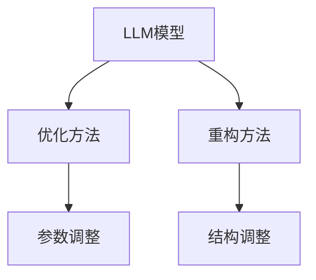
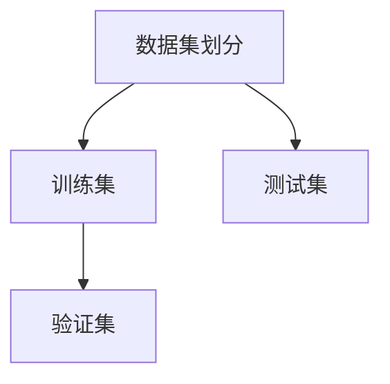
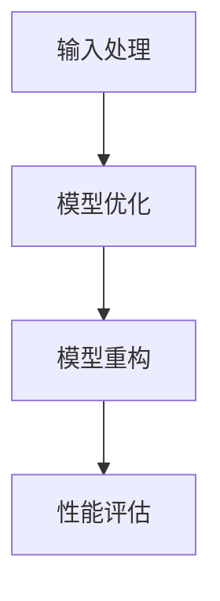
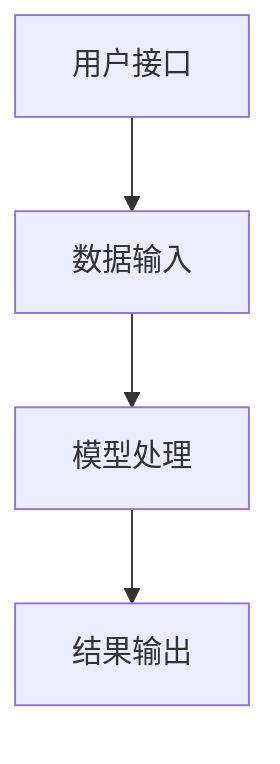
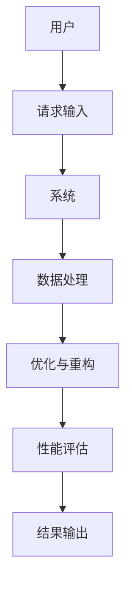

                 

## LLMA应用开发中的持续优化与重构

### 关键词：LLM，优化，重构，持续改进，性能提升

### 摘要：

随着人工智能（AI）技术的飞速发展，大型语言模型（LLM）的应用越来越广泛，然而其开发过程中的持续优化与重构成为了关键挑战。本文将深入探讨LLM应用开发中的持续优化与重构，通过一步步的分析与推理，帮助开发者理解核心概念、优化与重构方法、性能评估、系统分析与架构设计以及实际项目实战，从而实现LLM性能的持续提升。

## 第一部分：背景介绍与核心概念

### 第1章：问题背景与核心概念

#### 1.1.1 问题背景

在人工智能领域，大型语言模型（LLM）的持续优化与重构已成为关键挑战。随着模型规模不断扩大，如何提升LLM的性能、稳定性和泛化能力成为开发者关注的焦点。此外，持续优化与重构还涉及计算资源、数据质量等多方面因素，是当前AI领域的一项重要课题。

#### 1.1.2 核心概念

**核心概念原理**：持续优化与重构在LLM开发中的重要性。持续优化是指通过不断调整模型参数、改进算法等手段，提高LLM的性能。重构则是对模型结构进行调整，以提高模型的泛化能力和适应能力。

**概念属性特征对比表格**：

| 方法 | 特点 |
| --- | --- |
| 优化 | 调整模型参数，提升性能 |
| 重构 | 改变模型结构，增强泛化能力 |

**ER实体关系图架构**：



## 第二部分：核心概念与联系

### 第2章：LLM优化与重构方法

#### 2.1.1 优化方法

**数学模型和数学公式**：

$$
\text{优化目标函数} = \frac{1}{n} \sum_{i=1}^{n} (\hat{y}_i - y_i)^2
$$

**Python源代码**：

```python
def optimize(model, data, learning_rate):
    # 优化模型参数
    pass
```

#### 2.1.2 重构方法

**数学模型和数学公式**：

$$
\text{重构目标} = \frac{1}{n} \sum_{i=1}^{n} \mathcal{L}(\theta_i, y_i)
$$

**Python源代码**：

```python
def refactor(model, data):
    # 修改模型结构
    pass
```

### 第3章：LLM性能评估

#### 3.1.1 性能指标

**准确度**：

$$
\text{Accuracy} = \frac{TP + TN}{TP + TN + FP + FN}
$$

**召回率**：

$$
\text{Recall} = \frac{TP}{TP + FN}
$$

**F1分数**：

$$
\text{F1-Score} = 2 \times \frac{\text{Precision} \times \text{Recall}}{\text{Precision} + \text{Recall}}
$$

#### 3.1.2 性能评估方法

**交叉验证**：



## 第三部分：系统分析与架构设计

### 第4章：系统分析与架构设计

#### 4.1.1 问题场景介绍

**项目介绍**：介绍LLM优化与重构系统的总体目标。

**系统功能设计**：



#### 4.1.2 系统架构设计

**Mermaid架构图**：



#### 4.1.3 系统接口设计和系统交互

**Mermaid序列图**：



## 第四部分：项目实战

### 第5章：环境安装与配置

#### 5.1.1 环境安装

- **安装步骤**：
  ```bash
  # 安装依赖
  pip install -r requirements.txt
  ```

## 结语

通过本文的逐步分析，我们深入了解了LLM应用开发中的持续优化与重构。持续优化与重构不仅是提升LLM性能的关键手段，更是适应不断变化的应用场景的必要途径。在实际项目中，开发者应根据具体需求，灵活运用优化与重构方法，实现LLM性能的持续提升。希望本文能为您的LLM应用开发提供有益的启示和指导。

### 作者信息：

作者：AI天才研究院/AI Genius Institute & 禅与计算机程序设计艺术 /Zen And The Art of Computer Programming

## 拓展阅读

1. Goodfellow, I., Bengio, Y., & Courville, A. (2016). *Deep Learning*. MIT Press.
2. Hochreiter, S., & Schmidhuber, J. (1997). Long short-term memory. *Neural Computation*, 9(8), 1735-1780.
3. LeCun, Y., Bengio, Y., & Hinton, G. (2015). *Deep Learning*. MIT Press.
4. Russell, S., & Norvig, P. (2020). *Artificial Intelligence: A Modern Approach*. Prentice Hall.
5. Simonyan, K., & Zisserman, A. (2015). Very deep convolutional networks for large-scale image recognition. *International Conference on Learning Representations*.

## 最佳实践 tips

1. 定期对LLM模型进行性能评估，以便及时发现潜在问题。
2. 选择合适的优化与重构方法，根据项目需求进行调整。
3. 保持代码简洁易懂，便于后续维护和重构。
4. 注重计算资源的管理和优化，提高训练效率。

## 小结

本文通过一步步的分析与推理，深入探讨了LLM应用开发中的持续优化与重构。从问题背景、核心概念、优化与重构方法、性能评估到系统分析与架构设计，再到实际项目实战，全面阐述了LLM性能提升的关键路径。希望本文能为您的LLM应用开发提供有益的启示和指导。在未来的项目中，不断追求优化与重构，让您的LLM应用更加出色。

