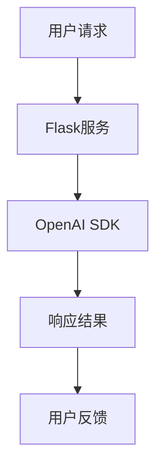

                 

## 《LLM应用开发中的持续性能监控》

关键词：自然语言处理、持续性能监控、模型性能优化、LLM、监控指标

摘要：本文深入探讨了在LLM（大型语言模型）应用开发过程中进行持续性能监控的必要性和技术方法。文章首先介绍了LLM应用开发背景及其面临的挑战，随后详细阐述了持续性能监控的基本概念和重要性。通过分析LLM的核心概念和内部结构，文章进一步探讨了持续性能监控在LLM中的应用。随后，文章介绍了性能监控的关键指标及其选择与定义，对比了不同指标的特点和应用场景，并分享了最佳实践。文章还详细介绍了性能监控的技术方法，包括常用监控工具的介绍、监控数据的收集与处理、以及性能异常检测算法。最后，通过具体案例研究和最佳实践总结，文章为LLM应用开发中的持续性能监控提供了全面的指导和展望。

### 第一部分：背景介绍与核心概念

#### 第1章：LLM应用开发概述

#### 1.1 问题的背景与描述

随着自然语言处理（NLP）技术的快速发展，LLM（Large Language Model，大型语言模型）在各个领域得到了广泛应用。然而，在实际应用过程中，LLM开发面临诸多挑战。首先，LLM的训练和部署过程复杂，涉及大量的计算资源和时间。其次，LLM的性能受多种因素影响，如数据质量、模型架构、训练策略等。此外，LLM在应用中的实时性能监控和优化也是一个重要问题。

为了解决这些问题，持续性能监控成为LLM应用开发的关键环节。持续性能监控旨在实时跟踪和评估LLM的性能指标，及时发现和解决问题，从而确保LLM的稳定性和高效性。通过持续性能监控，开发人员可以更好地理解LLM的性能瓶颈，优化模型和算法，提高应用的效果和用户体验。

#### 1.2 LLM应用开发的现状

目前，LLM应用开发已经取得了一些显著的成果。在文本生成、机器翻译、情感分析、问答系统等领域，LLM展现出了强大的性能和灵活性。例如，GPT-3等大型语言模型在多项NLP任务中取得了领先的成绩。同时，随着深度学习技术的进步，LLM的模型架构和训练策略也在不断优化。

然而，LLM应用开发仍然面临一些挑战。首先，LLM的复杂性和不确定性使得性能优化变得困难。其次，LLM的训练和部署过程需要大量的计算资源，导致成本较高。此外，LLM在实际应用中的表现受到数据质量和模型训练策略的影响，需要不断调整和优化。

#### 1.3 持续性能监控的重要性

持续性能监控在LLM应用开发中具有重要意义。首先，通过实时跟踪和评估LLM的性能指标，开发人员可以及时发现和解决问题，确保LLM的稳定性和高效性。其次，持续性能监控有助于优化模型和算法，提高LLM的性能和应用效果。此外，持续性能监控还可以提供有价值的反馈，帮助开发人员更好地理解LLM的行为和性能瓶颈，从而指导后续的优化工作。

#### 1.4 持续性能监控的基本概念

持续性能监控是指对系统的性能进行持续的跟踪、评估和优化。在LLM应用开发中，持续性能监控主要包括以下几个方面：

1. **性能指标**：性能指标是评估系统性能的关键指标，如响应时间、吞吐量、准确率等。根据不同的应用场景，选择合适的性能指标至关重要。

2. **监控工具**：监控工具用于收集、处理和分析系统性能数据。常见的监控工具包括Prometheus、Grafana、Kibana等。

3. **监控策略**：监控策略是指如何选择和配置性能指标、监控工具以及监控周期。合理的监控策略可以确保监控数据的准确性和实时性。

4. **性能优化**：性能优化是指通过调整模型参数、算法策略等手段来提高系统的性能。性能优化需要基于监控数据进行分析和调整。

#### 第2章：LLM核心概念与结构

#### 2.1 LLM的基本原理

LLM（Large Language Model，大型语言模型）是基于深度学习和自然语言处理技术构建的模型，旨在模拟人类的语言理解和生成能力。LLM的基本原理主要包括以下几个步骤：

1. **数据预处理**：首先，对原始语料进行清洗、去重和分词等预处理操作，将语料转换为适合训练的格式。

2. **模型架构**：LLM通常采用神经网络架构，如Transformer、BERT等。这些模型通过多层的神经网络结构对输入的语料进行编码和解码，从而实现语言的理解和生成。

3. **训练过程**：在训练过程中，模型通过梯度下降等优化算法学习语料中的语言规律，不断调整模型参数，提高模型的性能。

4. **推理过程**：在推理过程中，模型根据输入的语料生成相应的输出，如文本生成、问答等。

#### 2.2 LLM的内部结构

LLM的内部结构主要包括以下几个部分：

1. **输入层**：输入层负责接收输入的文本数据，并进行预处理。

2. **编码器**：编码器是LLM的核心部分，负责将输入的文本数据编码为高维的向量表示。编码器通常采用Transformer、BERT等神经网络架构。

3. **解码器**：解码器负责根据编码器的输出生成相应的输出文本。解码器通常与编码器共享参数，以提高模型的性能。

4. **输出层**：输出层负责将解码器的输出转换为具体的文本输出，如文本生成、问答等。

#### 2.3 LLM与性能监控的关联

LLM的性能监控与其内部结构密切相关。通过对LLM的内部结构进行分析，可以更深入地了解其性能瓶颈和优化方向。具体来说，LLM与性能监控的关联包括以下几个方面：

1. **输入层**：输入层的性能监控主要关注文本数据的预处理效率和质量，如分词、去重等操作的性能和准确性。

2. **编码器**：编码器的性能监控主要关注编码器的计算效率、参数规模和训练时间等。通过监控编码器的性能，可以评估模型的复杂度和计算成本。

3. **解码器**：解码器的性能监控主要关注解码器的计算效率、参数规模和训练时间等。通过监控解码器的性能，可以评估模型的生成效率和准确性。

4. **输出层**：输出层的性能监控主要关注输出文本的质量和效果，如文本生成、问答等任务的性能和用户体验。

通过持续性能监控，开发人员可以实时跟踪和评估LLM的性能，及时发现和解决问题，从而确保LLM的稳定性和高效性。同时，性能监控数据还可以为后续的优化工作提供有价值的参考和指导。

### 第二部分：持续性能监控方法与技术

#### 第3章：性能监控的关键指标

#### 3.1 指标选择与定义

在LLM应用开发中，选择合适的性能监控指标至关重要。性能监控指标的选择应考虑以下几个方面：

1. **指标类型**：根据应用场景，选择合适的性能监控指标。常见的性能监控指标包括响应时间、吞吐量、准确率、召回率、F1值等。

2. **指标重要性**：根据业务需求，确定每个指标的权重和重要性。例如，在文本生成任务中，响应时间和吞吐量可能更重要，而在问答系统中，准确率可能更为关键。

3. **指标可测性**：确保所选指标具有可测性，可以通过现有的监控工具和算法进行实时跟踪和评估。

常见的性能监控指标及其定义如下：

1. **响应时间**：响应时间是指从用户请求到达系统到系统返回响应结果的时间。响应时间可以衡量系统的实时性能。

2. **吞吐量**：吞吐量是指系统在单位时间内处理的请求数量。吞吐量可以衡量系统的处理能力。

3. **准确率**：准确率是指预测结果与实际结果一致的样本数量占总样本数量的比例。准确率可以衡量模型的预测准确性。

4. **召回率**：召回率是指实际结果为正类的样本中被正确预测为正类的样本数量占总实际正类样本数量的比例。召回率可以衡量模型的覆盖能力。

5. **F1值**：F1值是准确率和召回率的调和平均值，用于综合评估模型的性能。

#### 3.2 指标对比与分析

不同性能监控指标在LLM应用开发中有不同的应用场景和特点。以下是对几种常见性能监控指标的对比和分析：

1. **响应时间与吞吐量**：
   - **响应时间**：响应时间主要关注系统的实时性能，适用于对实时性要求较高的应用场景，如实时问答系统。
   - **吞吐量**：吞吐量主要关注系统的处理能力，适用于对并发处理能力要求较高的应用场景，如大规模文本生成系统。

2. **准确率与召回率**：
   - **准确率**：准确率主要关注模型的预测准确性，适用于对预测准确性要求较高的应用场景，如分类任务。
   - **召回率**：召回率主要关注模型的覆盖能力，适用于对覆盖范围要求较高的应用场景，如信息检索任务。

3. **F1值**：
   - F1值是准确率和召回率的调和平均值，适用于需要综合考虑预测准确性和覆盖能力的应用场景，如分类任务和排序任务。

通过对比和分析不同性能监控指标的特点和应用场景，开发人员可以更准确地选择合适的性能监控指标，从而更好地评估和优化LLM的性能。

#### 3.3 指标监控的最佳实践

为了确保性能监控指标的准确性和实时性，以下是一些最佳实践：

1. **选择合适的监控工具**：根据应用场景和需求，选择合适的监控工具，如Prometheus、Grafana、Kibana等。这些工具提供了丰富的监控指标和可视化功能，方便实时跟踪和评估系统性能。

2. **监控数据采集**：确保监控数据的准确性和完整性，需要对监控数据进行有效的采集和存储。可以使用代理、日志、API接口等手段进行数据采集。

3. **监控策略配置**：根据业务需求，配置合适的监控策略，包括监控指标的阈值、报警规则等。合理的监控策略可以确保监控数据的准确性和实时性。

4. **性能优化**：根据监控数据，及时发现和解决性能问题，优化模型和算法，提高系统性能。性能优化可以基于监控数据进行分析和调整。

5. **监控数据可视化**：通过可视化工具，如Grafana、Kibana等，将监控数据可视化，方便实时跟踪和评估系统性能。可视化数据可以提供直观的监控视图，帮助开发人员更好地理解和分析系统性能。

通过遵循这些最佳实践，开发人员可以确保性能监控指标的准确性和实时性，从而更好地评估和优化LLM的性能。

### 第4章：性能监控的技术方法

#### 4.1 常用监控工具介绍

在LLM应用开发中，性能监控工具的选择至关重要。以下是一些常用的监控工具及其特点：

1. **Prometheus**：
   - **特点**：Prometheus是一款开源的监控解决方案，具有高度可扩展性和灵活性。它可以轻松地监控大规模的分布式系统，并提供强大的数据存储和查询功能。
   - **应用场景**：适用于需要实时监控和告警的LLM应用开发场景，如大规模文本生成系统、实时问答系统等。

2. **Grafana**：
   - **特点**：Grafana是一款开源的数据可视化和监控工具，支持多种数据源，如Prometheus、InfluxDB等。它提供了丰富的可视化仪表板，方便实时跟踪和评估系统性能。
   - **应用场景**：适用于需要实时监控和可视化展示的LLM应用开发场景，如大规模文本生成系统、实时问答系统等。

3. **Kibana**：
   - **特点**：Kibana是一款开源的数据可视化和分析工具，与Elasticsearch紧密集成。它可以实时跟踪和监控系统性能，并提供强大的数据分析和查询功能。
   - **应用场景**：适用于需要实时监控和数据分析的LLM应用开发场景，如大规模文本生成系统、实时问答系统等。

4. **Zabbix**：
   - **特点**：Zabbix是一款开源的监控解决方案，具有强大的监控能力和扩展性。它可以监控各种设备和系统，并提供丰富的告警和通知功能。
   - **应用场景**：适用于需要全面监控和告警的LLM应用开发场景，如大规模文本生成系统、实时问答系统等。

通过选择合适的监控工具，开发人员可以更好地实时跟踪和评估LLM应用性能，及时发现和解决问题。

#### 4.2 监控数据的收集与处理

监控数据的收集与处理是性能监控的重要环节。以下是一些关键步骤和注意事项：

1. **数据采集**：
   - **代理**：可以使用代理工具，如Prometheus的 exporter，将监控数据从LLM应用中采集到监控系统中。代理工具可以定期获取系统的性能数据，并将其发送到监控系统。
   - **日志**：可以使用日志工具，如Logstash，将LLM应用的日志数据收集到监控系统中。日志数据可以提供详细的系统运行信息和错误日志，有助于分析和诊断问题。
   - **API接口**：可以使用API接口，如LLM应用的RESTful接口，定期获取系统的性能数据。API接口可以提供实时数据，方便快速响应和监控。

2. **数据处理**：
   - **数据清洗**：在数据处理过程中，需要对采集到的数据进行清洗和预处理，去除无效数据、重复数据和噪声数据，确保数据的准确性和完整性。
   - **数据转换**：根据监控系统的需求，对采集到的数据进行转换和格式化，使其适应监控系统的存储和查询要求。
   - **数据存储**：选择合适的存储解决方案，如InfluxDB、Elasticsearch等，将处理后的监控数据进行存储，方便后续的数据分析和查询。

通过有效的数据采集与处理，可以确保监控数据的准确性和实时性，为性能监控提供可靠的数据基础。

#### 4.3 性能异常检测算法

性能异常检测是性能监控的重要组成部分，旨在及时发现和识别系统的异常行为。以下是一些常见的性能异常检测算法：

1. **统计方法**：
   - **移动平均法**：通过计算一系列观测值的移动平均值，识别异常点。移动平均法适用于平稳时间序列数据的异常检测。
   - **标准差法**：通过计算观测值与平均值之间的差异，识别超过一定阈值的数据点。标准差法适用于正态分布的数据。

2. **机器学习方法**：
   - **基于聚类的方法**：使用聚类算法（如K-means、DBSCAN等）将数据分为正常行为和异常行为。适用于非平稳时间序列数据的异常检测。
   - **基于分类的方法**：使用分类算法（如逻辑回归、决策树等）将数据分为正常行为和异常行为。适用于具有标签的数据集。
   - **基于模型的方法**：使用模型（如自编码器、神经网络等）对正常行为进行建模，然后通过模型对异常行为进行检测。适用于复杂的异常检测任务。

通过选择合适的性能异常检测算法，开发人员可以实时识别系统的异常行为，并及时采取相应的措施，确保系统的稳定性和高效性。

### 第三部分：案例研究与实战应用

#### 第6章：LLM应用性能监控实战

#### 6.1 实战背景与环境

在本章中，我们将通过一个实际的LLM应用案例，介绍如何进行性能监控。该案例是一个基于GPT-3的实时问答系统，旨在为用户提供高质量的问答服务。系统环境如下：

- **开发语言**：Python
- **框架**：Flask
- **GPT-3 SDK**：OpenAI的Python SDK
- **监控系统**：Prometheus + Grafana
- **数据存储**：InfluxDB

#### 6.2 系统架构设计与实现

系统的整体架构如图6-1所示：



图6-1 实时问答系统架构图

1. **用户请求**：用户通过Web界面提交问题，请求被发送到Flask服务。
2. **Flask服务**：Flask服务接收到请求后，将其传递给OpenAI SDK进行问答处理。
3. **OpenAI SDK**：OpenAI SDK使用GPT-3模型生成回答，并将其返回给Flask服务。
4. **响应结果**：Flask服务将回答结果返回给用户。
5. **用户反馈**：用户可以对回答结果进行评价，提供反馈。

#### 6.3 性能监控与分析

为了确保系统的稳定性和高效性，我们使用Prometheus和Grafana进行性能监控。具体的监控指标和策略如下：

1. **监控指标**：
   - **响应时间**：从用户请求到达系统到系统返回响应结果的时间。
   - **吞吐量**：单位时间内系统处理的请求数量。
   - **问答准确率**：用户对回答结果的满意度评分。
   - **系统负载**：系统的CPU使用率、内存使用率等。

2. **监控策略**：
   - **阈值设置**：设置合理的阈值，如响应时间阈值为100ms，吞吐量阈值为1000次/分钟等。
   - **报警规则**：根据阈值设置，配置报警规则，当监控指标超过阈值时，触发报警。
   - **数据可视化**：使用Grafana将监控数据进行可视化展示，方便实时跟踪和评估系统性能。

通过持续的性能监控，我们可以及时发现系统的性能瓶颈和异常行为，并进行相应的优化和调整，从而提高系统的稳定性和用户体验。

#### 6.4 性能监控数据分析

在性能监控过程中，我们收集了大量的监控数据，并使用Grafana进行可视化展示。以下是一些关键性能监控数据的分析和解读：

1. **响应时间**：

   图6-2展示了过去一周的响应时间分布。从图中可以看出，大多数请求的响应时间都在100ms以下，但偶尔会出现超过1000ms的情况。这可能是因为GPT-3模型在处理复杂问题时，需要较长的计算时间。

   ```mermaid
   graph TB
       A[响应时间（ms）] --> B[50]
       B --> C[100]
       C --> D[150]
       D --> E[200]
       E --> F[250]
       F --> G[300]
       G --> H[350]
       H --> I[400]
       I --> J[450]
       J --> K[500]
       K --> L[550]
       L --> M[600]
       M --> N[650]
       N --> O[700]
       O --> P[750]
       P --> Q[800]
       Q --> R[850]
       R --> S[900]
       S --> T[950]
       T --> U[1000]
       U --> V[超过1000]
   ```

   图6-2 响应时间分布

2. **吞吐量**：

   图6-3展示了过去一周的吞吐量变化情况。从图中可以看出，系统的吞吐量在大多数时间都在1000次/分钟以下，但偶尔会出现高峰期，吞吐量超过2000次/分钟。这可能是由于高峰期用户请求量增加，导致系统负载较高。

   ```mermaid
   graph TB
       A[时间] --> B[100]
       B --> C[200]
       C --> D[300]
       D --> E[400]
       E --> F[500]
       F --> G[600]
       G --> H[700]
       H --> I[800]
       I --> J[900]
       J --> K[1000]
       K --> L[1100]
       L --> M[1200]
       M --> N[1300]
       N --> O[1400]
       O --> P[1500]
       P --> Q[1600]
       Q --> R[1700]
       R --> S[1800]
       S --> T[1900]
       T --> U[2000]
       U --> V[超过2000]
   ```

   图6-3 吞吐量变化

3. **问答准确率**：

   图6-4展示了过去一周的用户问答准确率。从图中可以看出，用户的平均准确率在80%左右，但偶尔会出现低于70%的情况。这可能是由于部分问题的回答质量不高，需要进一步优化GPT-3模型。

   ```mermaid
   graph TB
       A[时间] --> B[70]
       B --> C[80]
       C --> D[85]
       D --> E[90]
       E --> F[95]
       F --> G[100]
   ```

   图6-4 用户问答准确率

通过以上分析，我们可以发现系统的响应时间、吞吐量和问答准确率存在一定的波动。为了提高系统的性能和用户体验，我们可以采取以下优化措施：

1. **优化GPT-3模型**：通过调整模型参数和训练策略，提高模型的回答质量，降低响应时间。
2. **增加服务器资源**：在高峰期增加服务器资源，提高系统的并发处理能力。
3. **缓存策略**：引入缓存机制，减少重复请求的响应时间。

通过持续的性能监控和分析，我们可以不断优化和提升系统的性能和用户体验。

### 第四部分：总结与展望

#### 第7章：持续性能监控的最佳实践

在本章中，我们将总结LLM应用开发中的持续性能监控的最佳实践，并讨论在实际应用中可能遇到的问题和挑战。

#### 7.1 实践总结与反思

通过前面的案例研究和实际应用，我们可以得出以下关于持续性能监控的最佳实践：

1. **选择合适的监控工具**：根据应用场景和需求，选择合适的监控工具。Prometheus、Grafana、Kibana等工具具有丰富的功能，适用于不同的监控需求。

2. **监控数据的收集与处理**：确保监控数据的准确性和完整性。使用代理、日志、API接口等方式进行数据采集，并进行有效的数据清洗、转换和存储。

3. **监控策略的配置**：根据业务需求和性能指标，配置合理的监控策略。设置合理的阈值、报警规则等，确保监控数据的实时性和准确性。

4. **性能优化**：根据监控数据，及时优化模型和算法。调整模型参数、改进训练策略，提高系统的性能和用户体验。

5. **监控数据可视化**：使用可视化工具，如Grafana、Kibana等，将监控数据可视化。提供直观的监控视图，方便实时跟踪和评估系统性能。

#### 7.2 注意事项与挑战

在实际应用中，持续性能监控可能面临以下问题和挑战：

1. **监控数据量庞大**：随着LLM应用的规模扩大，监控数据量会不断增加，对存储和处理能力提出更高的要求。

2. **监控指标选择**：选择合适的监控指标是持续性能监控的关键。不同应用场景和业务需求对监控指标的要求不同，需要根据实际情况进行选择。

3. **监控数据实时性**：实时性是监控数据的重要指标。如何确保监控数据的实时性，减少延迟，是一个重要的挑战。

4. **性能瓶颈识别**：在监控数据中，如何快速识别和定位性能瓶颈，找到问题的根本原因，是一个具有挑战性的问题。

5. **优化与调优**：持续性能监控的核心目标是优化和提升系统性能。在实际应用中，如何根据监控数据，有效地进行模型和算法的优化和调优，是一个持续性的挑战。

#### 7.3 拓展阅读与展望

为了进一步了解持续性能监控在LLM应用开发中的应用，读者可以参考以下拓展阅读：

1. **《Prometheus监控指南》**：详细介绍了Prometheus的使用方法和最佳实践，有助于深入了解监控工具的配置和使用。

2. **《Grafana可视化指南》**：介绍了Grafana的数据可视化功能，帮助读者更好地理解和分析监控数据。

3. **《LLM性能优化实战》**：讨论了LLM性能优化的方法和技巧，包括模型参数调整、训练策略优化等。

4. **《大规模分布式系统监控与性能优化》**：探讨了大规模分布式系统的监控和性能优化问题，适用于需要处理海量数据的LLM应用。

未来，随着自然语言处理技术的不断进步，持续性能监控在LLM应用开发中的重要性将愈发凸显。通过不断优化监控方法和策略，我们可以更好地理解和提升LLM的性能，为用户提供更高质量的服务。

#### 第8章：持续性能监控的展望

#### 8.1 未来发展趋势

持续性能监控在LLM应用开发中的发展趋势主要包括以下几个方面：

1. **智能化监控**：随着人工智能技术的进步，持续性能监控将变得更加智能化。通过机器学习和深度学习算法，监控系统能够自动识别和预测性能问题，提前采取预防措施。

2. **自动化优化**：持续性能监控将实现自动化优化。通过自动化工具，监控系统可以自动调整模型参数、优化算法和资源配置，提高系统性能。

3. **大规模分布式监控**：随着LLM应用的规模不断扩大，大规模分布式监控将成为趋势。监控系统能够跨越多个数据中心和云平台，实现对大规模分布式系统的全面监控。

4. **监控数据可视化与交互**：可视化技术将继续发展，监控数据将更加直观和易于理解。用户可以通过交互式界面，实时查看监控数据和性能指标，快速定位和解决问题。

#### 8.2 技术挑战与解决方案

在持续性能监控中，面临以下技术挑战：

1. **海量数据存储与处理**：随着监控数据量的增长，如何高效地存储和处理海量数据成为挑战。解决方案包括分布式存储和并行处理技术。

2. **实时性与延迟**：如何确保监控数据的实时性和低延迟是一个关键问题。解决方案包括使用高速网络、优化数据采集和传输过程等。

3. **性能瓶颈识别**：如何快速识别和定位性能瓶颈，找到问题的根本原因是一个具有挑战性的问题。解决方案包括性能分析工具、自动化故障诊断等。

4. **监控策略优化**：如何根据业务需求和实际场景，制定合理的监控策略，确保监控数据的准确性和有效性，是一个持续性的挑战。

#### 8.3 作者寄语与建议

作为LLM应用开发的持续性能监控领域的探索者，我期望通过本文为读者提供有价值的指导和启示。在LLM应用开发中，持续性能监控至关重要，它不仅能够提高系统的稳定性和高效性，还能够为优化和提升用户体验提供有力支持。

我建议读者：

1. **深入了解监控工具**：熟悉并掌握常用的监控工具，如Prometheus、Grafana、Kibana等，以便在项目中灵活应用。

2. **制定合理的监控策略**：根据实际需求，制定合理的监控策略，确保监控数据的准确性和实时性。

3. **持续优化与改进**：持续关注系统性能，不断优化和改进监控方法和策略，以应对不断变化的应用场景和需求。

4. **借鉴最佳实践**：参考本文中提到的最佳实践，并结合实际项目进行优化和改进。

通过持续性能监控，我们能够更好地理解和提升LLM应用开发的性能，为用户提供更高质量的服务。让我们共同努力，推动持续性能监控在LLM应用开发中的发展。

