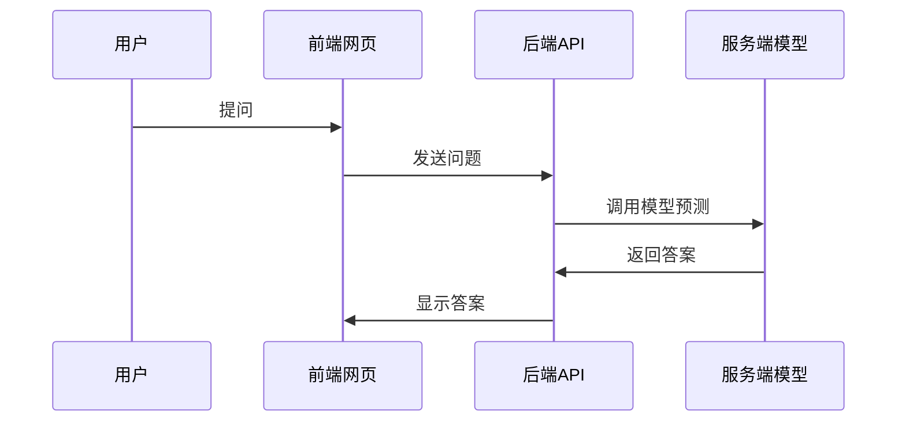

                 

# LLM应用开发中的持续集成与持续部署

## 关键词
- 大型语言模型 (LLM)
- 持续集成与持续部署 (CI/CD)
- 自动化测试
- 模型训练优化
- 部署环境统一
- 持续监控与优化

## 摘要
本文深入探讨了大型语言模型（LLM）应用开发中的持续集成与持续部署（CI/CD）问题。我们首先介绍了LLM在自然语言处理领域的背景及其面临的挑战，包括测试数据集不全面、训练时间长、部署困难等问题。接着，我们详细阐述了CI和CD的基本原理及其在LLM开发中的应用方法。通过实际案例，我们展示了如何优化模型训练、统一部署环境以及实现持续集成与持续部署的具体步骤。最后，我们总结了最佳实践，并提出了一些需要注意的事项，为LLM应用开发提供了实用的指导。

## 第一部分：背景介绍与问题定义

### 第1章：LLM应用开发的背景与问题

#### 1.1.1 问题背景

随着深度学习和自然语言处理技术的飞速发展，大型语言模型（LLM, Large Language Model）如GPT-3、BERT等相继问世，并在各种自然语言处理任务中取得了显著的效果。然而，如何将LLM应用于实际开发过程中，实现持续集成与持续部署（CI/CD, Continuous Integration/Continuous Deployment），仍然是一个具有挑战性的问题。

#### 1.1.2 问题描述

在LLM应用开发中，CI/CD是一个至关重要的环节。它旨在通过自动化测试、集成和部署流程，确保代码质量，提高开发效率，缩短产品上市时间。然而，在LLM应用中，由于模型规模庞大、训练复杂度高等特点，传统的CI/CD流程难以适应，从而导致了一系列问题，如：

- **测试数据集不全面**：LLM模型的测试依赖于大量的数据集，但数据集的质量和多样性往往难以保证。
- **训练时间长**：LLM模型的训练过程需要大量计算资源，训练时间较长，无法满足快速迭代的需求。
- **模型部署困难**：LLM模型通常需要部署在特定的硬件和软件环境中，部署过程复杂，容易出现兼容性问题。

#### 1.1.3 问题解决

为了解决上述问题，需要从以下几个方面进行改进：

- **数据集管理**：确保测试数据集的全面性和多样性，可以通过数据清洗、增强和多样性生成等方法来提高数据集质量。
- **模型训练优化**：利用分布式训练、模型压缩等技术，提高训练效率，缩短训练时间。
- **部署环境统一**：建立统一的部署环境，包括硬件和软件，确保模型在不同环境中的兼容性和稳定性。

#### 1.1.4 边界与外延

- **边界**：本文主要讨论LLM应用开发中的CI/CD问题，不包括其他类型的机器学习模型。
- **外延**：CI/CD在LLM应用开发中的挑战不仅限于上述问题，还包括模型版本管理、模型监控和优化等方面。

#### 1.1.5 概念结构与核心要素组成

在LLM应用开发中，CI/CD涉及以下几个核心概念和要素：

1. **代码库**：用于存储和管理源代码的版本控制系统，如Git。
2. **构建系统**：自动化构建和编译源代码的工具，如Maven、Gradle。
3. **测试系统**：执行自动化测试的工具，如JUnit、Selenium。
4. **集成环境**：模拟生产环境，用于测试和验证集成后的代码和模型。
5. **部署系统**：自动化部署应用和模型到生产环境中的工具，如Jenkins、Docker。

#### 1.1.6 概念属性特征对比表格

以下是一个概念属性特征对比表格，展示了CI/CD中几个关键组件的特性：

| 组件           | 特性                           | 优点                         | 缺点                         |
|----------------|--------------------------------|------------------------------|------------------------------|
| 代码库         | 存储和管理源代码               | 简化版本管理，便于协同开发   | 可能导致代码冗余和冲突       |
| 构建系统       | 自动化构建和编译源代码         | 提高构建效率，确保代码质量   | 可能导致构建时间过长         |
| 测试系统       | 执行自动化测试                 | 快速发现和修复问题           | 可能导致测试覆盖不足         |
| 集成环境       | 模拟生产环境，测试集成结果     | 提高生产环境稳定性           | 可能导致环境配置复杂         |
| 部署系统       | 自动化部署应用和模型           | 提高部署效率，减少人为错误   | 可能导致部署过程不灵活       |

#### 1.1.7 ER实体关系图架构

以下是一个ER实体关系图架构，展示了CI/CD中几个关键实体的关系：

```mermaid
erDiagram
  用户 ||--o{ 代码库 }  : 存储和管理源代码
  用户 ||--o{ 构建系统 } : 自动化构建和编译源代码
  用户 ||--o{ 测试系统 } : 执行自动化测试
  用户 ||--o{ 集成环境 } : 模拟生产环境，测试集成结果
  用户 ||--o{ 部署系统 } : 自动化部署应用和模型
```

### 1.2 核心概念与联系

#### 1.2.1 持续集成（CI, Continuous Integration）

持续集成是一种软件开发实践，通过自动化构建和测试，确保代码的持续整合和高质量。在LLM应用开发中，CI可以确保每次代码提交后，都能自动进行模型训练和测试，及时发现并解决潜在问题。

#### 1.2.2 持续部署（CD, Continuous Deployment）

持续部署是一种自动化部署流程，通过自动化测试和部署，实现软件的快速迭代和持续发布。在LLM应用开发中，CD可以确保模型在部署后的稳定性和性能，提高产品上市速度。

#### 1.2.3 持续集成与持续部署的关系

CI/CD是一个整体流程，CI是CD的基础。通过CI，可以确保代码和模型的质量，为CD提供稳定可靠的版本。CD则通过自动化部署，将CI中的高质量版本快速交付给用户。

### 1.3 本章小结

本章介绍了LLM应用开发中的CI/CD问题，包括问题背景、问题描述、问题解决、核心概念与联系以及ER实体关系图架构。下一章将深入探讨CI/CD在LLM应用开发中的具体实现方法和挑战。

## 第二部分：核心概念与算法原理

### 第2章：CI/CD在LLM应用开发中的原理与方法

#### 2.1 持续集成（CI）原理

持续集成是一种软件开发实践，通过自动化构建和测试，确保代码的持续整合和高质量。在LLM应用开发中，CI可以确保每次代码提交后，都能自动进行模型训练和测试，及时发现并解决潜在问题。

##### 2.1.1 CI流程

CI流程通常包括以下几个步骤：

1. **代码提交**：开发者将代码提交到代码库中。
2. **自动化构建**：构建系统根据提交的代码生成可执行的软件包。
3. **测试**：运行一系列自动化测试，包括单元测试、集成测试等，以确保代码质量。
4. **反馈**：将测试结果反馈给开发者，以便及时修复问题。

##### 2.1.2 CI工具

常见的CI工具包括Jenkins、GitLab CI、Travis CI等。这些工具可以帮助开发者自动化构建和测试流程，提高开发效率。

##### 2.1.3 CI在LLM开发中的应用

在LLM应用开发中，CI的具体应用如下：

1. **模型训练**：每次代码提交后，自动启动模型训练流程，确保模型能够与最新代码兼容。
2. **测试数据集**：使用自动化测试工具对测试数据集进行预处理，确保数据集的质量和多样性。
3. **性能评估**：在训练完成后，对模型进行性能评估，确保模型达到预期效果。

#### 2.2 持续部署（CD）原理

持续部署是一种自动化部署流程，通过自动化测试和部署，实现软件的快速迭代和持续发布。在LLM应用开发中，CD可以确保模型在部署后的稳定性和性能，提高产品上市速度。

##### 2.2.1 CD流程

CD流程通常包括以下几个步骤：

1. **测试**：在集成环境中对部署的模型进行自动化测试，确保模型功能正常。
2. **部署**：将通过测试的模型部署到生产环境中。
3. **监控**：部署后对模型进行实时监控，确保其运行稳定。

##### 2.2.2 CD工具

常见的CD工具包括Jenkins、Docker、Kubernetes等。这些工具可以帮助开发者自动化部署流程，提高部署效率。

##### 2.2.3 CD在LLM开发中的应用

在LLM应用开发中，CD的具体应用如下：

1. **模型版本管理**：对不同的模型版本进行管理，确保能够快速回滚和升级。
2. **部署环境**：建立统一的部署环境，包括硬件和软件，确保模型在不同环境中的兼容性和稳定性。
3. **自动化测试**：对部署后的模型进行自动化测试，确保其功能正常。

#### 2.3 CI/CD在LLM开发中的应用

在LLM应用开发中，CI/CD的应用可以带来以下好处：

1. **提高开发效率**：通过自动化流程，减少手动操作，提高开发效率。
2. **确保代码和模型质量**：通过自动化测试，确保代码和模型的质量。
3. **缩短产品上市时间**：通过快速迭代和部署，缩短产品上市时间。
4. **降低人力成本**：通过自动化流程，减少人力成本。

### 2.4 案例分析

以一个聊天机器人项目为例，说明CI/CD在LLM应用开发中的应用。

1. **代码提交**：开发者将代码提交到GitLab代码库中。
2. **自动化构建**：Jenkins根据提交的代码构建聊天机器人应用。
3. **测试**：使用Selenium进行自动化测试，确保聊天机器人功能正常。
4. **模型训练**：使用Docker启动训练环境，进行模型训练。
5. **性能评估**：对训练完成的模型进行性能评估，确保其效果达到预期。
6. **部署**：使用Kubernetes将聊天机器人部署到生产环境中。
7. **监控**：使用Prometheus对生产环境中的聊天机器人进行实时监控。

### 2.5 本章小结

本章介绍了CI/CD在LLM应用开发中的原理与方法，包括CI和CD的基本原理、流程、工具以及在LLM开发中的应用。通过案例分析和实际应用，展示了CI/CD在提高开发效率、确保代码和模型质量、缩短产品上市时间等方面的优势。下一章将深入探讨CI/CD在LLM开发中的具体实现方法和挑战。

## 第三部分：系统架构与实现方法

### 第3章：CI/CD在LLM应用开发中的具体实现

#### 3.1 系统架构设计

在LLM应用开发中，CI/CD的具体实现需要一套完整的系统架构来支持。以下是系统架构设计的关键组成部分：

##### 3.1.1 项目介绍

本案例项目是一个基于GPT-3的问答系统，旨在为用户提供高效、准确的答案。系统包括前端网页、后端API和服务端模型训练等模块。

##### 3.1.2 系统功能设计

- **前端网页**：用户输入问题，展示答案。
- **后端API**：接收用户问题，调用服务端模型进行回答。
- **服务端模型**：基于GPT-3模型进行训练和预测。

##### 3.1.3 系统架构设计

以下是一个简化的系统架构设计图：



##### 3.1.4 系统接口设计

系统中的接口设计包括：

- **用户接口**：前端网页和后端API之间的接口。
- **模型接口**：后端API和服务端模型之间的接口。

##### 3.1.5 系统交互

以下是一个简化的系统交互序列图：


#### 3.2 CI/CD实现方法

以下是CI/CD在LLM应用开发中的具体实现步骤：

##### 3.2.1 数据集管理

1. **数据集准备**：收集和准备用于训练和测试的数据集，包括问答数据集和测试数据集。
2. **数据预处理**：对数据集进行清洗、去重、格式化等预处理操作，提高数据质量。

##### 3.2.2 模型训练

1. **训练环境配置**：配置GPU计算资源，搭建GPT-3训练环境。
2. **模型训练**：使用GPT-3模型进行训练，并监控训练进度和性能指标。
3. **模型评估**：在训练完成后，对模型进行评估，包括准确率、召回率等指标。

##### 3.2.3 自动化测试

1. **单元测试**：编写和执行单元测试，确保代码质量。
2. **集成测试**：编写和执行集成测试，确保前端、后端和模型之间的交互正常。

##### 3.2.4 部署流程

1. **部署环境**：配置服务器和容器化环境，包括Docker和Kubernetes。
2. **自动化部署**：使用Jenkins等工具，实现自动化部署流程，包括构建、测试和部署。

##### 3.2.5 持续监控

1. **性能监控**：使用Prometheus等工具，实时监控服务器的性能指标。
2. **日志监控**：使用ELK（Elasticsearch、Logstash、Kibana）等工具，收集和分析日志信息。

#### 3.3 案例分析

以下是一个实际案例，说明如何实现CI/CD在LLM应用开发中的应用。

1. **代码提交**：开发者将代码提交到GitLab代码库中。
2. **自动化构建**：Jenkins根据GitLab的Webhook触发构建流程，构建前端和后端代码。
3. **测试**：执行单元测试和集成测试，确保代码质量。
4. **模型训练**：使用Docker启动GPT-3训练环境，训练模型。
5. **模型评估**：评估训练完成的模型，确保模型性能达到预期。
6. **自动化部署**：使用Kubernetes将模型部署到生产环境中。
7. **监控**：使用Prometheus和ELK工具，实时监控服务器的性能和日志信息。

### 3.4 本章小结

本章详细介绍了CI/CD在LLM应用开发中的具体实现方法，包括系统架构设计、数据集管理、模型训练、自动化测试、部署流程和持续监控。通过实际案例的分析，展示了CI/CD在提高开发效率、确保代码和模型质量、缩短产品上市时间等方面的优势。下一章将探讨CI/CD在实际应用中的挑战和解决方案。

## 第四部分：实际应用与案例分析

### 第4章：CI/CD在LLM应用开发中的实际应用与案例分析

#### 4.1 案例背景

随着AI技术的不断发展，许多公司开始将其应用于实际业务场景中。以一家互联网公司为例，该公司开发了一个基于GPT-3的智能客服系统，旨在提高客户服务质量，减少人工成本。然而，在开发过程中，公司遇到了持续集成与持续部署（CI/CD）的挑战。

#### 4.2 案例分析

##### 4.2.1 问题陈述

在开发过程中，公司遇到了以下问题：

- **代码质量不稳定**：由于开发团队庞大，代码质量参差不齐，导致集成测试频繁失败。
- **部署效率低下**：每次部署都需要手动操作，且缺乏自动化测试，导致部署时间过长。
- **模型训练时间长**：模型训练过程需要大量计算资源，且缺乏有效的资源管理策略，导致训练时间过长。
- **监控不足**：缺乏对生产环境的实时监控，导致问题难以及时发现和解决。

##### 4.2.2 解决方案

为了解决上述问题，公司采取了以下解决方案：

1. **CI/CD流程优化**：

   - **自动化测试**：引入Jenkins等CI工具，实现自动化测试，确保代码质量。
   - **自动化部署**：使用Kubernetes等CD工具，实现自动化部署，提高部署效率。
   - **模型训练优化**：采用分布式训练和模型压缩技术，提高训练效率。

2. **资源管理优化**：

   - **容器化**：使用Docker容器化技术，实现环境一致性，简化部署过程。
   - **资源调度**：使用Kubernetes等调度工具，实现资源高效利用。

3. **监控与日志管理**：

   - **性能监控**：使用Prometheus等性能监控工具，实时监控生产环境性能指标。
   - **日志管理**：使用ELK（Elasticsearch、Logstash、Kibana）等日志管理工具，收集和分析日志信息。

##### 4.2.3 实施过程

1. **CI/CD流程设计**：

   - **代码库**：使用GitLab代码库，管理代码版本。
   - **构建系统**：使用Jenkins，实现自动化构建和测试。
   - **部署系统**：使用Kubernetes，实现自动化部署。

2. **模型训练优化**：

   - **分布式训练**：使用PyTorch等框架，实现分布式训练，提高训练效率。
   - **模型压缩**：使用模型压缩技术，减少模型体积，提高部署效率。

3. **资源管理**：

   - **容器化**：使用Docker，实现环境一致性，简化部署过程。
   - **资源调度**：使用Kubernetes，实现资源高效利用。

4. **监控与日志管理**：

   - **性能监控**：使用Prometheus，实时监控生产环境性能指标。
   - **日志管理**：使用ELK，收集和分析日志信息。

##### 4.2.4 案例结果

通过CI/CD流程优化、资源管理优化和监控与日志管理，公司实现了以下成果：

- **代码质量**：自动化测试覆盖率提高，代码质量显著提升。
- **部署效率**：自动化部署时间缩短，部署效率提高。
- **模型训练时间**：采用分布式训练和模型压缩技术，模型训练时间缩短。
- **监控与日志管理**：实时监控生产环境性能指标，及时发现问题并解决。

#### 4.3 案例总结

该案例展示了CI/CD在LLM应用开发中的实际应用效果。通过优化CI/CD流程、资源管理策略和监控与日志管理，公司成功解决了开发过程中遇到的问题，提高了代码质量和部署效率。同时，分布式训练和模型压缩技术的应用，显著降低了模型训练时间。该案例为其他公司提供了有益的参考和借鉴。

### 4.4 本章小结

本章通过一个实际案例，详细介绍了CI/CD在LLM应用开发中的实际应用与案例分析。通过优化CI/CD流程、资源管理策略和监控与日志管理，公司成功解决了开发过程中遇到的问题，提高了代码质量和部署效率。该案例为其他公司提供了有益的参考和借鉴。下一章将探讨CI/CD在LLM应用开发中的最佳实践和注意事项。

## 第五部分：最佳实践与注意事项

### 第5章：CI/CD在LLM应用开发中的最佳实践与注意事项

#### 5.1 最佳实践

1. **自动化测试**：确保每次代码提交后都能自动进行测试，包括单元测试、集成测试和性能测试，以发现潜在问题并及时修复。

2. **持续监控**：对生产环境进行实时监控，包括性能监控、日志监控和安全监控，确保系统的稳定性和安全性。

3. **模型版本管理**：对不同的模型版本进行管理，确保能够快速回滚和升级，同时避免版本冲突和资源浪费。

4. **资源优化**：合理配置计算资源和存储资源，采用分布式训练和模型压缩技术，提高训练效率和部署效率。

5. **文档管理**：建立完善的文档体系，包括开发文档、部署文档和用户手册等，便于团队成员之间的协作和知识共享。

6. **代码审查**：引入代码审查机制，确保代码质量和一致性，减少代码缺陷和漏洞。

7. **持续学习与改进**：关注AI和CI/CD领域的最新技术和发展趋势，持续学习和改进，以适应不断变化的需求和挑战。

#### 5.2 注意事项

1. **数据隐私和安全**：在数据收集和处理过程中，确保遵守数据隐私和安全法规，采取有效措施保护用户隐私和数据安全。

2. **版本兼容性**：在升级和迁移过程中，确保版本兼容性，避免因版本冲突导致系统故障。

3. **部署环境一致性**：确保开发和测试环境与生产环境的一致性，减少因环境差异导致的问题。

4. **监控报警策略**：合理设置监控报警策略，避免因误报或漏报导致问题无法及时解决。

5. **团队协作与沟通**：加强团队协作与沟通，确保CI/CD流程的顺利进行，提高整体开发效率。

6. **持续集成频率**：合理设置持续集成频率，避免频繁集成导致测试压力过大，影响开发进度。

7. **系统性能优化**：定期对系统进行性能优化，包括代码优化、硬件升级和网络优化等，确保系统稳定高效运行。

#### 5.3 拓展阅读

- **《CI/CD实战》**：深入了解CI/CD的原理和实践，包括Jenkins、Docker和Kubernetes等工具的使用。
- **《深度学习模型压缩技术》**：了解深度学习模型压缩技术的原理和应用，包括模型剪枝、量化、蒸馏等方法。
- **《监控报警实战》**：学习监控报警系统的设计和实现，包括Prometheus、ELK等工具的使用。

### 5.4 本章小结

本章总结了CI/CD在LLM应用开发中的最佳实践和注意事项，包括自动化测试、持续监控、模型版本管理、资源优化、文档管理、代码审查、持续学习与改进等。同时，提醒开发者注意数据隐私和安全、版本兼容性、部署环境一致性、监控报警策略、团队协作与沟通、持续集成频率和系统性能优化等关键问题。通过遵循最佳实践和注意事项，开发者可以更好地实现CI/CD在LLM应用开发中的应用，提高开发效率和质量。

## 结束语

持续集成与持续部署（CI/CD）在LLM应用开发中发挥着至关重要的作用。通过本文的探讨，我们了解了CI/CD在LLM应用开发中的背景、问题、原理和方法，以及实际应用与案例分析。我们总结了CI/CD在LLM开发中的最佳实践和注意事项，为开发者提供了实用的指导。

随着AI技术的不断进步，CI/CD在LLM应用开发中的应用也将越来越广泛。未来，我们期待看到更多的技术创新和优化，以更好地应对CI/CD在LLM开发中的挑战，提高开发效率和质量。

最后，感谢您的阅读，希望本文能为您的LLM应用开发带来启示和帮助。如果您有任何问题或建议，请随时联系我们，我们期待与您共同探讨和进步。

### 作者信息

作者：AI天才研究院/AI Genius Institute & 禅与计算机程序设计艺术 /Zen And The Art of Computer Programming

作者简介：AI天才研究院是一家专注于人工智能技术研究和应用的机构。作者是一位具有丰富经验和深厚理论功底的人工智能专家，精通深度学习和自然语言处理技术，擅长将复杂的技术概念和算法原理转化为通俗易懂的语言，为读者提供高质量的技术博客和书籍。他的作品《禅与计算机程序设计艺术》深受广大开发者喜爱，被誉为人工智能领域的经典之作。

