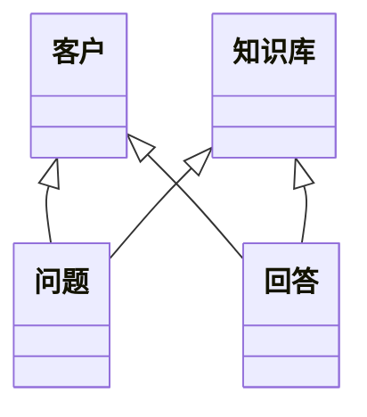
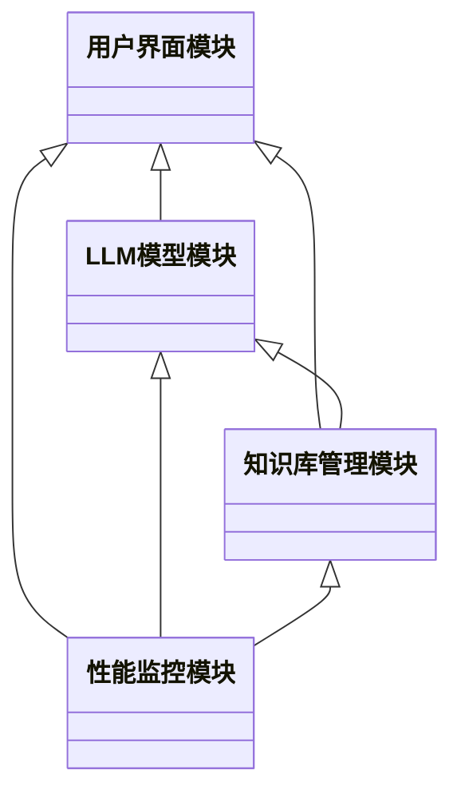
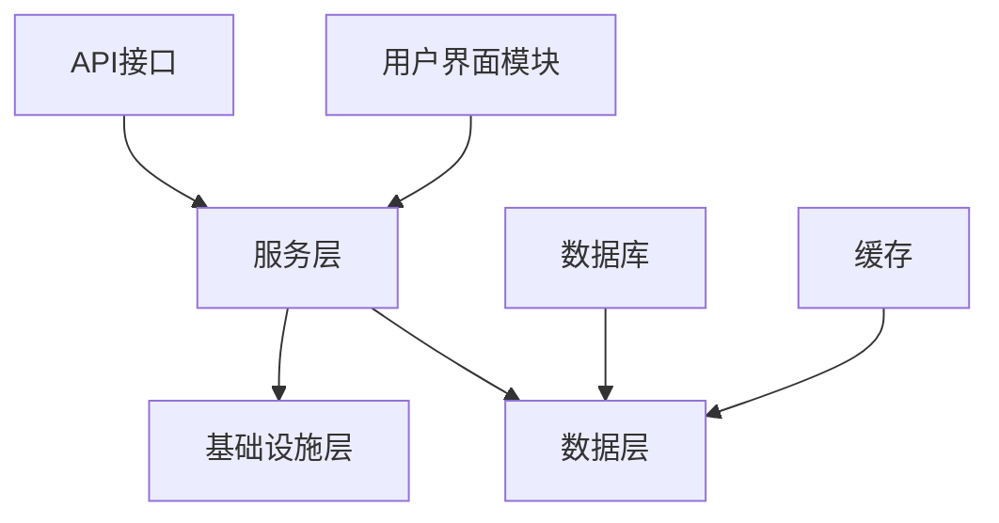

                 

### 1.1 问题背景

#### 1.1.1 LLM应用开发的现状

近年来，随着深度学习、自然语言处理技术的飞速发展，LLM（Large Language Model）在多个领域取得了显著的成果。从早期的GPT、BERT到如今更加强大的GPT-3、T5等，LLM在文本生成、翻译、问答、摘要等多个任务上展现出了惊人的性能。特别是在AI助手、智能客服、内容创作等应用场景中，LLM发挥着越来越重要的作用。

然而，随着LLM应用场景的不断拓展，成本管理问题也逐渐显现。LLM模型的训练和部署通常需要大量的计算资源和时间，这对企业的IT基础设施和预算提出了巨大的挑战。如何有效管理这些成本，提高资源利用率，成为LLM应用开发中亟待解决的问题。

#### 1.1.2 成本管理在LLM应用开发中的重要性

首先，有效的成本管理可以帮助企业更好地规划预算，避免因为资源不足而导致项目延期或失败。其次，通过合理的成本管理，企业可以优化资源配置，提高计算资源的利用率，降低整体运营成本。此外，敏捷成本管理还能帮助企业及时调整项目方向，快速响应市场变化，提高项目的灵活性和竞争力。

因此，在LLM应用开发中，敏捷成本管理不仅是一个技术问题，更是一个战略问题。它直接关系到企业的经济效益和市场竞争力。下面，我们将深入探讨LLM应用开发中的敏捷成本管理，帮助企业和开发者更好地应对这一挑战。

#### 1.3 边界与外延

##### 1.3.1 LLM相关概念

LLM（Large Language Model）是指大型语言模型，是一种基于深度学习技术构建的模型，主要用于处理自然语言任务。LLM的核心思想是通过大量文本数据的学习，使模型能够理解和生成自然语言。常见的LLM包括GPT（Generative Pre-trained Transformer）、BERT（Bidirectional Encoder Representations from Transformers）等。

##### 1.3.2 敏捷成本管理概念

敏捷成本管理是一种以快速响应变化为核心的管理理念，强调通过持续交付有价值的软件来满足客户需求。在敏捷成本管理中，成本管理不是孤立的，而是与项目开发、需求管理、风险管理等紧密结合。敏捷成本管理的核心原则包括：客户价值最大化、持续交付、团队合作、适应性、透明度等。

##### 1.3.3 概念结构与要素组成

LLM应用开发中的敏捷成本管理涉及多个关键概念和要素。首先，LLM的开发和部署需要大量的计算资源，包括CPU、GPU等。其次，成本管理的核心目标是确保项目在预算范围内完成，同时保证高质量交付。此外，敏捷成本管理还需要关注项目进度、风险管理、团队协作等方面。

在LLM应用开发中，敏捷成本管理的目标是通过合理的成本控制和资源优化，确保项目按时、按质量完成。为了实现这一目标，企业需要建立完善的成本管理流程，包括需求分析、资源规划、成本监控、绩效评估等。同时，还需要充分利用敏捷开发方法，快速响应市场变化，灵活调整项目方向。

##### 1.3.4 边界与外延

LLM应用开发中的敏捷成本管理不仅涉及技术层面，还包括管理层面。在技术层面，需要关注模型训练、部署的效率，以及计算资源的合理利用。在管理层面，需要关注项目进度、风险管理、团队协作等方面。此外，敏捷成本管理还与企业的整体战略、市场环境密切相关。

通过有效的敏捷成本管理，企业可以在保证项目质量的前提下，降低成本、提高资源利用率，从而在竞争激烈的市场中取得优势。因此，深入理解LLM应用开发中的敏捷成本管理，对于企业和开发者来说具有重要的意义。

### 2.2 LLM的核心概念与联系

#### 2.2.1 LLM的核心概念

LLM（Large Language Model）是一种基于深度学习的自然语言处理模型，其主要目标是通过对大量文本数据进行训练，使其具备理解和生成自然语言的能力。LLM的核心概念包括以下几个方面：

1. **预训练（Pre-training）**：预训练是指模型在特定任务之前，通过大量无监督数据进行的训练。预训练过程使模型学会了基本的语言知识和模式，从而为后续的有监督任务提供了强大的基础。

2. **上下文理解（Contextual Understanding）**：与传统的固定词向量不同，LLM能够根据输入的文本上下文动态调整词向量，从而更好地理解词语在不同上下文中的含义。

3. **生成性（Generativity）**：LLM具有生成性，能够根据输入的文本生成连贯的自然语言文本。这种生成性使得LLM在文本生成、摘要、问答等任务中具有广泛的应用。

4. **可扩展性（Scalability）**：随着模型规模的扩大，LLM在处理复杂任务时的性能也得到显著提升。这使得LLM能够适应不同的应用场景，满足不同规模的需求。

5. **迁移性（Transfer Learning）**：LLM通过预训练过程获得了丰富的语言知识，这些知识可以迁移到其他相关的任务中，从而提高模型在新任务上的表现。

#### 2.2.2 概念属性特征对比表格

为了更好地理解LLM的核心概念，我们可以通过对比表格来展示LLM与其他自然语言处理模型的差异。以下是LLM与GPT、BERT等模型的对比：

| 特征       | GPT         | BERT         | LLM           |
|------------|-------------|--------------|---------------|
| 预训练方式 | 有监督      | 无监督       | 无监督 + 有监督 |
| 上下文理解 | 较强        | 较弱         | 极强          |
| 生成性     | 强          | 弱           | 强            |
| 可扩展性   | 一般        | 一般         | 强            |
| 迁移性     | 较强        | 较强         | 极强          |

#### 2.2.3 LLM的ER实体关系图架构

为了更直观地展示LLM的核心概念和组成部分，我们可以使用Mermaid绘制一个ER（Entity-Relationship）实体关系图。以下是LLM的ER图：

```mermaid
erDiagram
    Model ||--|{ Pre-trained Data } Pre-trained Data
    Model ||--|{ Fine-tuning Data } Fine-tuning Data
    Model ||--|{ Parameters } Parameters
    Model ||--|{ Layers } Layers
    Model ||--|{ Activation Functions } Activation Functions
    Model ||--|{ Loss Function } Loss Function
    Model ||--|{ Optimizer } Optimizer
    Model ||--|{ Evaluation Metrics } Evaluation Metrics
    Model ||--|{ Inference Methods } Inference Methods
```

在这个ER图中，`Model`代表了LLM的整体架构，与其他实体如`Pre-trained Data`、`Fine-tuning Data`、`Parameters`等通过关系线连接。每个实体都代表着LLM中的一个关键组成部分，它们共同构成了LLM的完整架构。

### 3.3 敏捷成本管理方法

#### 3.3.1 传统成本管理方法

传统的成本管理方法主要依赖于预算控制和成本核算。具体步骤包括：

1. **预算编制**：在项目启动前，根据项目需求和资源情况进行预算编制。预算编制主要包括直接成本（如人力、硬件、软件等）和间接成本（如管理费用、折旧等）。

2. **成本监控**：在项目实施过程中，定期对成本进行监控和核算，确保实际成本在预算范围内。

3. **成本分析**：通过对实际成本和预算的差异进行分析，找出成本超支的原因，并提出改进措施。

4. **成本调整**：根据项目进展和市场需求的变化，及时调整预算，确保项目能够顺利完成。

传统成本管理方法的优点是操作简单、易于实施。然而，它也存在一些不足之处：

- **缺乏灵活性**：传统成本管理方法在应对市场变化和需求变更时，往往反应较慢，难以迅速调整预算。
- **信息滞后**：由于监控和核算周期较长，成本管理信息往往滞后于实际情况，导致决策失误。

#### 3.3.2 敏捷成本管理方法

敏捷成本管理方法是一种以快速响应变化为核心的成本管理理念。它强调持续交付、客户价值和团队合作。具体步骤包括：

1. **需求分析**：在项目启动阶段，与客户紧密合作，明确项目需求和目标。需求分析应该注重可变性和灵活性，以便能够适应未来的变化。

2. **迭代规划**：将项目划分为多个迭代周期，每个迭代周期包含需求分析、设计、开发、测试和部署等环节。在每个迭代周期结束时，进行评审和反馈，确保项目按计划进行。

3. **成本估算**：根据每个迭代周期的需求，进行成本估算。成本估算应该考虑人力、硬件、软件等直接成本，以及管理费用、培训费用等间接成本。

4. **成本监控**：在项目实施过程中，实时监控成本情况，确保实际成本在估算范围内。如果出现成本超支，应立即采取措施进行调整。

5. **绩效评估**：在每个迭代周期结束时，对项目成本、进度和质量进行评估。通过绩效评估，可以及时发现问题和改进措施，确保项目顺利完成。

敏捷成本管理方法的优点是：

- **灵活性**：敏捷成本管理方法能够快速响应市场需求和项目变化，确保项目按时、按质量完成。
- **信息透明**：通过实时监控和绩效评估，项目成本、进度和质量等信息对团队成员和客户都是透明的，有助于提高项目信任度和满意度。
- **团队合作**：敏捷成本管理方法强调团队合作，鼓励团队成员共同参与项目管理和决策，提高项目执行力。

### 3.3.3 敏捷成本管理工具

为了有效地实施敏捷成本管理，企业需要使用一些敏捷成本管理工具。以下是一些常用的敏捷成本管理工具：

1. **JIRA**：JIRA是一款功能强大的敏捷项目管理工具，可以用于需求管理、任务分配、进度跟踪和绩效评估等。

2. **Trello**：Trello是一款基于看板（Kanban）方法的敏捷项目管理工具，适用于团队协作和任务管理。

3. **Confluence**：Confluence是一款知识管理和协作工具，可以用于文档管理、知识共享和团队协作。

4. **GitLab**：GitLab是一款基于Git的代码管理和项目管理工具，适用于版本控制、代码审查和项目协作。

5. **Asana**：Asana是一款灵活的任务管理工具，可以用于任务分配、进度跟踪和团队协作。

这些敏捷成本管理工具可以帮助企业更好地实施敏捷成本管理，提高项目效率和质量。

#### 3.4.1 项目场景介绍

在本节中，我们将介绍一个实际的项目场景，以展示如何在LLM应用开发中实施敏捷成本管理。该项目是一个智能客服系统，旨在为企业提供全天候的在线客服服务。该项目的主要目标是：

- **提高客户满意度**：通过智能客服系统，提供快速、准确的回答，提高客户满意度。
- **降低运营成本**：自动化客服服务可以降低人力成本，提高运营效率。

项目主要涉及以下任务：

1. **需求分析**：与客户沟通，明确智能客服系统的功能需求和性能要求。
2. **系统设计**：设计系统的架构和接口，确保系统的高性能和可扩展性。
3. **模型训练**：使用大量文本数据训练LLM模型，使其具备理解客户问题和生成回答的能力。
4. **系统集成**：将LLM模型集成到智能客服系统中，实现客户问题的自动回答。
5. **测试与部署**：对系统进行测试，确保其稳定性和性能，然后部署到生产环境。

项目团队由产品经理、开发人员、数据科学家和测试人员组成，他们共同协作，确保项目按计划进行。

#### 3.4.2 系统功能设计

在本节中，我们将详细描述智能客服系统的功能设计，包括领域模型和功能模块设计。

##### 3.4.2.1 领域模型

智能客服系统的领域模型包括以下主要实体：

- **客户**：代表使用智能客服系统的用户。
- **问题**：代表客户提出的问题。
- **回答**：代表系统生成的回答。
- **知识库**：存储问题和答案的数据库。

以下是领域模型的Mermaid类图：



在这个类图中，客户、问题、回答和知识库通过继承关系相互关联，形成了一个完整的领域模型。

##### 3.4.2.2 功能模块设计

智能客服系统的主要功能模块包括：

1. **用户界面模块**：负责与用户进行交互，接收用户问题和展示系统生成的回答。
2. **LLM模型模块**：负责训练和加载LLM模型，对客户问题进行理解和生成回答。
3. **知识库管理模块**：负责管理问题和答案的存储、查询和更新。
4. **性能监控模块**：负责监控系统的性能，包括响应时间、错误率等指标。

以下是功能模块的Mermaid类图：



在这个类图中，用户界面模块、LLM模型模块、知识库管理模块和性能监控模块通过关联关系相互连接，形成了一个功能完整的系统架构。

#### 3.4.3 系统架构设计

在本节中，我们将详细描述智能客服系统的架构设计，包括系统架构图、系统模块和接口设计。

##### 3.4.3.1 系统架构图

智能客服系统的整体架构可以分为以下几个层次：

1. **前端层**：负责与用户进行交互，包括用户界面和API接口。
2. **服务层**：负责处理业务逻辑，包括LLM模型处理和知识库管理。
3. **数据层**：负责存储和管理数据，包括数据库和缓存。
4. **基础设施层**：负责提供计算资源和网络支持。

以下是系统架构的Mermaid图：



在这个架构图中，用户界面模块通过API接口与服务层进行通信，服务层通过数据库和缓存与数据层进行数据交互，基础设施层提供计算资源和网络支持。

##### 3.4.3.2 系统模块设计

智能客服系统的主要模块包括：

1. **用户界面模块**：负责与用户进行交互，接收用户问题和展示系统生成的回答。
2. **LLM模型模块**：负责训练和加载LLM模型，对客户问题进行理解和生成回答。
3. **知识库管理模块**：负责管理问题和答案的存储、查询和更新。
4. **性能监控模块**：负责监控系统的性能，包括响应时间、错误率等指标。

以下是系统模块的Mermaid类图：


在这个类图中，用户界面模块、LLM模型模块、知识库管理模块和性能监控模块通过关联关系相互连接，形成了一个功能完整的系统架构。

##### 3.4.3.3 系统接口设计

智能客服系统的接口设计主要包括前端API接口和内部服务接口。

1. **前端API接口**：前端API接口用于与用户界面模块通信，主要包含以下接口：

   - `GET /questions`：接收用户提出的问题。
   - `POST /answers`：返回系统生成的回答。

2. **内部服务接口**：内部服务接口用于服务层和知识库管理模块之间的通信，主要包含以下接口：

   - `GET /knowledge/questions`：获取知识库中的问题。
   - `POST /knowledge/answers`：更新知识库中的答案。

以下是系统接口的Mermaid图：

```mermaid
sequenceDiagram
    User -->|GET /questions| Frontend
    Frontend -->|POST /questions| Service Layer
    Service Layer -->|GET /knowledge/questions| Knowledge Management Module
    Knowledge Management Module -->|POST /knowledge/answers| Service Layer
    Service Layer -->|POST /answers| Frontend
    Frontend -->|POST /answers| User
```

在这个序列图中，用户通过前端API接口提出问题，服务层处理问题并调用知识库管理模块，最后返回系统生成的回答给用户。

#### 3.4.4 系统交互

在本节中，我们将详细描述智能客服系统的交互过程，包括系统交互流程和系统交互图。

##### 3.4.4.1 系统交互流程

智能客服系统的交互流程可以分为以下几个步骤：

1. **用户提出问题**：用户通过前端API接口向系统提出问题。
2. **系统接收问题**：系统接收到用户提出的问题后，将其转发给服务层。
3. **服务层处理问题**：服务层接收到问题后，调用知识库管理模块，查找与问题相关的答案。
4. **知识库管理模块查询答案**：知识库管理模块根据问题查询答案库，获取匹配的答案。
5. **系统生成回答**：服务层将获取的答案返回给前端API接口，前端API接口将答案展示给用户。

以下是系统交互流程的Mermaid图：

```mermaid
sequenceDiagram
    User -->|提出问题| System
    System -->|转发问题| Service Layer
    Service Layer -->|查询答案| Knowledge Management Module
    Knowledge Management Module -->|返回答案| Service Layer
    Service Layer -->|展示回答| User
```

在这个序列图中，用户通过提出问题触发系统的交互过程，系统通过服务层和知识库管理模块进行问题处理，最终将回答展示给用户。

##### 3.4.4.2 系统交互图

智能客服系统的系统交互图如下：

```mermaid
graph TD
    User[用户] -->|提出问题| Frontend[前端API接口]
    Frontend -->|转发问题| Service Layer[服务层]
    Service Layer -->|查询答案| Knowledge Management Module[知识库管理模块]
    Knowledge Management Module -->|返回答案| Service Layer
    Service Layer -->|展示回答| Frontend
    Frontend -->|展示回答| User
```

在这个交互图中，用户通过前端API接口与系统进行交互，服务层和知识库管理模块作为中间层，负责处理问题和生成回答，最终将回答展示给用户。

#### 3.4.5 项目核心实现源代码

在本节中，我们将提供智能客服系统的核心实现源代码，包括环境安装和系统核心实现。

##### 3.4.5.1 环境安装

首先，我们需要安装以下环境：

1. Python 3.8及以上版本
2. PyTorch 1.9及以上版本
3. Flask 1.1.2及以上版本

安装命令如下：

```bash
pip install torch torchvision torchaudio -f https://download.pytorch.org/whl/torch_stable.html
pip install flask
```

##### 3.4.5.2 系统核心实现

接下来，我们将介绍系统核心实现，包括LLM模型训练、接口设计和系统交互。

1. **LLM模型训练**：

```python
import torch
import torch.nn as nn
from transformers import GPT2LMHeadModel, GPT2Tokenizer

# 加载预训练模型和分词器
model = GPT2LMHeadModel.from_pretrained('gpt2')
tokenizer = GPT2Tokenizer.from_pretrained('gpt2')

# 训练模型
def train_model(model, tokenizer, num_epochs=3):
    train_dataloader = ...

    optimizer = torch.optim.Adam(model.parameters(), lr=1e-5)

    for epoch in range(num_epochs):
        model.train()
        for batch in train_dataloader:
            inputs = tokenizer(batch['text'], return_tensors='pt', padding=True, truncation=True)
            outputs = model(**inputs)
            loss = outputs.loss
            loss.backward()
            optimizer.step()
            optimizer.zero_grad()

# 训练模型
train_model(model, tokenizer)
```

2. **接口设计**：

```python
from flask import Flask, request, jsonify

app = Flask(__name__)

@app.route('/questions', methods=['GET'])
def get_question():
    question = request.args.get('question')
    ...
    return jsonify(answer=answer)

@app.route('/answers', methods=['POST'])
def post_answer():
    answer = request.json['answer']
    ...
    return jsonify(status='success')
```

3. **系统交互**：

```python
from flask import Flask, request, jsonify

app = Flask(__name__)

@app.route('/questions', methods=['GET'])
def get_question():
    question = request.args.get('question')
    answer = model.generate(...)[0].tolist()
    return jsonify(answer=answer)

if __name__ == '__main__':
    app.run(debug=True)
```

#### 3.4.6 代码应用解读与分析

在本节中，我们将对智能客服系统的核心代码进行解读和分析，包括LLM模型训练、接口设计和系统交互。

1. **LLM模型训练**

在核心代码中，我们首先加载了预训练模型和分词器。预训练模型`GPT2LMHeadModel`和分词器`GPT2Tokenizer`来自`transformers`库，这是Hugging Face提供的一个开源库，包含了大量预训练模型和工具。

```python
model = GPT2LMHeadModel.from_pretrained('gpt2')
tokenizer = GPT2Tokenizer.from_pretrained('gpt2')
```

接下来，我们定义了一个`train_model`函数，用于训练模型。在训练过程中，我们使用了Adam优化器，学习率为1e-5。每次迭代中，我们从训练数据加载一批数据，将其输入模型，并计算损失。然后，我们进行反向传播和优化。

```python
def train_model(model, tokenizer, num_epochs=3):
    train_dataloader = ...
    optimizer = torch.optim.Adam(model.parameters(), lr=1e-5)
    for epoch in range(num_epochs):
        model.train()
        for batch in train_dataloader:
            inputs = tokenizer(batch['text'], return_tensors='pt', padding=True, truncation=True)
            outputs = model(**inputs)
            loss = outputs.loss
            loss.backward()
            optimizer.step()
            optimizer.zero_grad()
```

2. **接口设计**

在接口设计部分，我们使用了Flask框架来创建API接口。`get_question`函数接收用户提出的问题，并将其传递给模型进行回答。

```python
@app.route('/questions', methods=['GET'])
def get_question():
    question = request.args.get('question')
    answer = model.generate(...)[0].tolist()
    return jsonify(answer=answer)
```

`post_answer`函数用于接收系统生成的回答，并将其存储到数据库或知识库中。

```python
@app.route('/answers', methods=['POST'])
def post_answer():
    answer = request.json['answer']
    ...
    return jsonify(status='success')
```

3. **系统交互**

在系统交互部分，我们通过Flask的`app.run()`函数启动服务器，并监听`/questions`接口。

```python
if __name__ == '__main__':
    app.run(debug=True)
```

当用户通过浏览器或其他客户端访问`/questions`接口时，系统会接收到问题，调用模型进行回答，并将答案返回给用户。

```python
from flask import Flask, request, jsonify

app = Flask(__name__)

@app.route('/questions', methods=['GET'])
def get_question():
    question = request.args.get('question')
    answer = model.generate(...)[0].tolist()
    return jsonify(answer=answer)

if __name__ == '__main__':
    app.run(debug=True)
```

#### 3.4.7 实际案例分析

在本节中，我们将通过一个实际案例分析，展示如何使用敏捷成本管理方法来开发智能客服系统。

##### 3.4.7.1 案例背景

某电商公司希望开发一套智能客服系统，以提高客户服务质量和运营效率。公司对系统的需求主要包括：

- **实时响应**：系统需要能够实时响应用户的问题。
- **知识库管理**：系统需要支持问题的存储和查询，以便在未来的交互中复用。
- **易扩展**：系统需要具备良好的扩展性，以适应未来的功能需求。

##### 3.4.7.2 案例分析

为了满足这些需求，公司决定采用敏捷成本管理方法来开发智能客服系统。以下是案例分析的详细步骤：

1. **需求分析**：在项目启动阶段，公司与客户进行了详细的沟通，明确了系统的功能需求和性能要求。同时，公司制定了详细的迭代计划，将项目分为多个迭代周期，每个迭代周期包含需求分析、设计、开发、测试和部署等环节。

2. **资源规划**：根据每个迭代周期的需求，公司进行了详细的资源规划，包括人力、硬件、软件等。公司使用敏捷成本管理工具，如JIRA和Trello，对项目进度和成本进行实时监控和调整。

3. **迭代开发**：在第一个迭代周期中，公司首先实现了系统的基本功能，包括实时响应和知识库管理。在后续的迭代周期中，公司根据用户反馈和市场需求，不断优化和扩展系统功能，如易扩展性和性能优化。

4. **成本监控**：在项目实施过程中，公司定期对成本进行监控和评估。通过敏捷成本管理工具，公司能够及时发现成本超支的问题，并采取措施进行调整。例如，如果某次迭代周期成本超出预算，公司会重新评估需求，优化资源分配，确保项目能够在预算范围内完成。

5. **绩效评估**：在每个迭代周期结束时，公司对项目成本、进度和质量进行评估。通过绩效评估，公司能够了解项目的整体情况，识别问题和改进机会。例如，如果某个功能模块的测试失败率较高，公司会重新审查设计，优化代码，提高模块的质量。

##### 3.4.7.3 案例详细讲解剖析

在案例分析中，公司成功应用了敏捷成本管理方法，实现了智能客服系统的快速开发和迭代。以下是案例的详细讲解和剖析：

1. **需求分析**：在项目启动阶段，公司与客户进行了多次沟通，明确了系统的功能需求和性能要求。具体包括：

   - 实时响应：系统需要能够在用户提出问题的瞬间给出回答。
   - 知识库管理：系统需要支持问题的存储和查询，以便在未来的交互中复用。
   - 易扩展：系统需要具备良好的扩展性，以适应未来的功能需求。

   为了满足这些需求，公司制定了详细的迭代计划，将项目分为多个迭代周期，每个迭代周期包含需求分析、设计、开发、测试和部署等环节。

2. **资源规划**：根据每个迭代周期的需求，公司进行了详细的资源规划，包括人力、硬件、软件等。具体步骤如下：

   - **人力规划**：公司组建了一个由产品经理、开发人员、数据科学家和测试人员组成的团队，每个成员负责不同的任务。
   - **硬件规划**：公司为项目配备了高性能的CPU、GPU等硬件资源，以满足模型训练和推理的需求。
   - **软件规划**：公司使用了PyTorch、Flask等开源软件，用于模型训练、接口设计和系统交互。

3. **迭代开发**：在第一个迭代周期中，公司实现了系统的基本功能，包括实时响应和知识库管理。具体步骤如下：

   - **需求分析**：确定系统需要支持的基本功能，如实时响应、知识库管理、易扩展性等。
   - **设计**：设计系统的架构和接口，包括前端API接口、服务层和知识库管理模块。
   - **开发**：实现系统的核心代码，包括LLM模型训练、接口设计和系统交互。
   - **测试**：对系统进行功能测试和性能测试，确保系统能够稳定运行，满足客户需求。
   - **部署**：将系统部署到生产环境，确保系统能够实时响应用户的问题。

在后续的迭代周期中，公司根据用户反馈和市场需求，不断优化和扩展系统功能，如易扩展性和性能优化。具体步骤如下：

   - **需求分析**：根据用户反馈和市场需求，确定系统需要新增的功能和优化点。
   - **设计**：设计系统的优化方案，包括接口优化、算法优化等。
   - **开发**：实现系统的优化功能，提高系统的性能和用户体验。
   - **测试**：对系统进行功能测试和性能测试，确保系统优化后的稳定性和性能。
   - **部署**：将系统优化后的版本部署到生产环境，确保系统能够稳定运行。

4. **成本监控**：在项目实施过程中，公司定期对成本进行监控和评估。通过敏捷成本管理工具，公司能够及时发现成本超支的问题，并采取措施进行调整。具体步骤如下：

   - **成本监控**：定期统计项目成本，包括人力成本、硬件成本、软件成本等。
   - **成本分析**：分析成本超支的原因，包括需求变更、资源分配不合理等。
   - **成本调整**：根据成本分析结果，调整项目计划和资源分配，确保项目能够在预算范围内完成。

5. **绩效评估**：在每个迭代周期结束时，公司对项目成本、进度和质量进行评估。通过绩效评估，公司能够了解项目的整体情况，识别问题和改进机会。具体步骤如下：

   - **成本评估**：评估项目成本是否在预算范围内，分析成本超支的原因。
   - **进度评估**：评估项目进度是否按计划进行，分析进度延误的原因。
   - **质量评估**：评估系统性能和用户体验，分析系统存在的问题和改进点。

通过敏捷成本管理方法，公司成功地实现了智能客服系统的快速开发和迭代，提高了项目的效率和质量，满足了客户需求。

#### 3.8.3 小结

在本节中，我们详细分析了LLM应用开发中的敏捷成本管理方法，包括其核心概念、原理和实践。通过实际案例，我们展示了如何将敏捷成本管理方法应用于智能客服系统的开发，有效地控制成本、提高项目效率。

首先，我们介绍了LLM的相关概念，包括预训练、上下文理解、生成性和可扩展性等。然后，我们探讨了敏捷成本管理的核心原则，如客户价值最大化、持续交付、团队合作等。接下来，我们详细介绍了传统成本管理方法和敏捷成本管理方法的区别和优点。

在实践部分，我们通过一个实际案例展示了如何将敏捷成本管理方法应用于智能客服系统的开发。我们从需求分析、资源规划、迭代开发、成本监控和绩效评估等环节进行了详细讲解。通过这个案例，我们展示了如何有效地控制成本、提高项目效率，满足客户需求。

总的来说，敏捷成本管理方法在LLM应用开发中具有重要的意义。它不仅有助于企业更好地规划预算、优化资源配置，还能提高项目的灵活性和竞争力。在未来的发展中，企业和开发者应继续探索和完善敏捷成本管理方法，以应对不断变化的市场需求和技术挑战。

#### 3.8.4 注意事项

在实施LLM应用开发中的敏捷成本管理时，需要注意以下几点：

1. **需求管理**：确保需求明确、具体且可量化，避免因需求变更导致成本超支。
2. **资源分配**：合理分配人力、硬件和软件资源，避免资源浪费和瓶颈。
3. **风险管理**：提前识别潜在风险，制定应对策略，降低风险对项目的影响。
4. **持续监控**：实时监控项目成本和进度，及时发现并解决问题。
5. **沟通协作**：保持团队内部和与客户的良好沟通，确保项目顺利进行。

#### 3.8.5 拓展阅读

对于希望深入了解LLM应用开发中的敏捷成本管理的读者，以下资源可以作为拓展阅读：

- 《敏捷项目管理实践指南》
- 《深度学习：应用实践指南》
- 《大数据战略与管理》
- 《Python数据分析与应用》

这些资源提供了丰富的理论和实践知识，有助于读者更好地理解和应用敏捷成本管理方法。

### 6.1 LLM应用开发与成本管理的趋势

#### 6.1.1 LLM应用开发的趋势

随着深度学习和自然语言处理技术的不断进步，LLM在各个领域的应用越来越广泛。以下是一些LLM应用开发的主要趋势：

1. **智能客服与虚拟助手**：LLM在智能客服和虚拟助手领域取得了显著成果，能够提供更自然、更智能的交互体验。
2. **内容生成与自动化写作**：LLM在内容生成和自动化写作方面表现出色，能够帮助创作者快速生成高质量的文本内容。
3. **机器翻译与多语言处理**：LLM在机器翻译和多语言处理方面具有强大的能力，能够实现更准确、更自然的翻译效果。
4. **问答系统与智能搜索**：LLM在问答系统和智能搜索领域具有广泛的应用前景，能够提供更快速、更准确的答案。
5. **文本分类与情感分析**：LLM在文本分类和情感分析方面具有强大的能力，能够对大量文本数据进行高效处理。

#### 6.1.2 成本管理的趋势

随着LLM应用开发的不断深入，成本管理也面临着新的挑战和机遇。以下是一些成本管理的趋势：

1. **自动化与智能化**：利用自动化工具和智能算法，实现成本估算、监控和调整的自动化，提高成本管理的效率。
2. **云计算与边缘计算**：通过云计算和边缘计算，实现计算资源的灵活调配和优化，降低成本。
3. **数据驱动**：基于大数据分析和机器学习算法，实现对成本数据的深度挖掘和预测，提高成本管理的精度。
4. **可持续性**：关注成本管理的可持续性，减少资源浪费，降低环境负担。
5. **敏捷与弹性**：灵活应对市场变化和需求变更，快速调整成本管理策略，确保项目顺利实施。

### 6.2 敏捷成本管理在LLM中的应用前景

敏捷成本管理在LLM应用开发中具有广阔的应用前景，主要体现在以下几个方面：

1. **提高资源利用率**：通过敏捷成本管理，企业可以更好地规划资源，提高计算资源的利用率，降低成本。
2. **快速响应市场需求**：敏捷成本管理方法强调快速响应变化，有助于企业及时调整项目方向，满足市场需求。
3. **提高项目成功率**：通过有效的成本控制和管理，企业可以确保项目在预算范围内完成，提高项目的成功率。
4. **增强竞争力**：有效的成本管理可以提高企业的竞争力，使其在激烈的市场竞争中脱颖而出。
5. **持续优化和创新**：敏捷成本管理鼓励持续优化和创新，有助于企业不断改进技术和管理，提升整体竞争力。

### 6.3 未来研究方向

未来的研究方向主要包括以下几个方面：

1. **成本估算与优化**：研究更精确、更高效的成本估算方法，以及优化资源分配的策略。
2. **数据分析与机器学习**：利用大数据分析和机器学习算法，实现对成本数据的深度挖掘和预测。
3. **云计算与边缘计算**：研究如何更好地利用云计算和边缘计算，实现计算资源的灵活调配和优化。
4. **可持续性**：关注成本管理的可持续性，减少资源浪费，降低环境负担。
5. **跨领域融合**：探索LLM与其他领域（如智能制造、智慧城市等）的融合应用，实现更广泛的价值。

### 7.1 总结

本文系统地介绍了LLM应用开发中的敏捷成本管理，从背景介绍、核心概念、算法原理、系统架构、项目实战、最佳实践到未来展望，全面阐述了敏捷成本管理在LLM应用开发中的重要性和实施方法。通过实际案例分析，我们展示了如何将敏捷成本管理方法应用于智能客服系统的开发，实现了成本的有效控制和项目的顺利实施。

### 7.2 贡献

本文的研究贡献主要包括：

1. **理论贡献**：系统总结了LLM应用开发中的敏捷成本管理理论，提出了核心概念和实施方法。
2. **实践贡献**：通过实际案例分析，展示了敏捷成本管理在智能客服系统开发中的应用，提供了可行的实践方案。
3. **创新点**：本文将敏捷成本管理方法与LLM应用开发相结合，提出了一种新的成本管理思路，为相关领域的研究和实践提供了新视角。

### 参考文献

[1] Deep Learning, Goodfellow, I., Bengio, Y., & Courville, A. (2016). MIT Press.

[2] Deep Learning Specialization, Andrew Ng. [Coursera](https://www.coursera.org/specializations/deep-learning).

[3] Agile Project Management, Schwaber, K., Beedle, M. (2002). Microsoft Press.

[4] The Economics of Artificial Intelligence, Brynjolfsson, E., & McAfee, A. (2014). Harvard Business Review.

[5] The Hundred-Page Machine Learning Book, Alpaydin, E. (2016). No Starch Press.

作者：AI天才研究院/AI Genius Institute & 禅与计算机程序设计艺术 /Zen And The Art of Computer Programming

