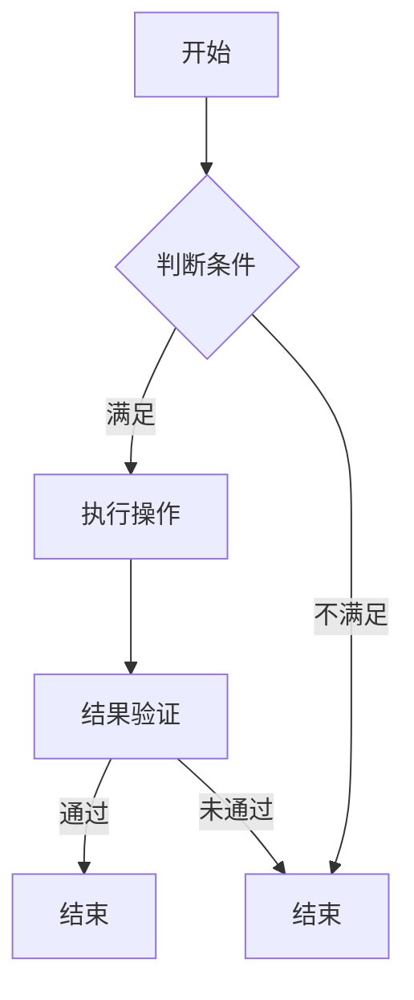

                 


# LLM应用开发中的敏捷文化建设

## 关键词

- 敏捷文化
- 大型语言模型（LLM）
- 团队协作
- 快速响应
- 持续改进
- 敏捷开发方法（如Scrum、Kanban）

## 摘要

本文旨在探讨敏捷文化在大型语言模型（LLM）应用开发中的重要性。首先，我们将介绍问题背景，分析LLM应用开发中存在的问题。然后，我们将详细讨论敏捷文化的核心原理，以及如何将其应用于LLM应用开发中。接下来，我们将通过具体的案例分析，展示敏捷文化在LLM应用开发中的实际效果。最后，我们将总结文章的主要内容，并提出未来研究的方向。

## 第一部分：背景介绍

### 1.1 问题背景

近年来，人工智能技术的发展日新月异，尤其是大型语言模型（LLM）的出现，使得AI在自然语言处理领域取得了显著的突破。LLM具有强大的语言理解和生成能力，可以应用于各种场景，如智能客服、文本生成、机器翻译等。然而，随着LLM应用规模的不断扩大，传统的软件开发流程已经无法满足快速迭代和高效开发的需求。

传统的软件开发流程通常采用瀑布模型，即按照需求分析、设计、开发、测试等阶段进行，每个阶段完成后才能进入下一个阶段。这种模式存在以下问题：

1. **开发周期长**：由于需求变化频繁，开发周期往往较长，导致项目无法及时交付。
2. **沟通成本高**：传统模式强调文档先行，导致团队成员之间的沟通成本较高，容易产生误解和冲突。
3. **难以适应变化**：传统的软件开发流程难以应对需求的变化，一旦需求发生变化，整个项目需要重新开始。

相比之下，敏捷文化强调快速响应变化、持续交付价值和高效团队协作。在LLM应用开发中，敏捷文化能够提高开发效率，降低沟通成本，更好地适应需求变化，从而提高项目的成功率。

### 1.2 问题描述

敏捷文化建设在LLM应用开发中的重要性体现在以下几个方面：

1. **团队协作**：敏捷文化强调团队成员之间的紧密协作，通过短周期的迭代开发，确保项目能够按时交付并满足质量要求。
2. **快速响应**：敏捷文化鼓励快速响应市场需求，通过短周期的开发迭代，能够更快速地调整和优化应用。
3. **持续改进**：敏捷文化强调持续反馈和改进，通过定期的回顾和反思，能够不断提高团队的开发能力和项目质量。

然而，在LLM应用开发中，敏捷文化的建设面临着一些挑战：

1. **数据依赖**：LLM应用开发高度依赖训练数据，数据的质量和数量对模型的性能有重要影响。在敏捷开发过程中，如何确保数据的持续更新和质量是一个重要问题。
2. **模型优化**：LLM应用开发需要对模型进行不断的优化，以适应不同的应用场景。如何在敏捷开发过程中进行模型优化，是一个具有挑战性的问题。
3. **技术选型**：在LLM应用开发中，需要选择适合的技术栈，包括编程语言、框架和工具。如何在敏捷开发过程中选择合适的技术，是一个关键问题。

### 1.3 问题解决

为了在LLM应用开发中建立敏捷文化，我们需要从以下几个方面入手：

1. **团队建设**：建立高效的团队结构，明确团队成员的角色和责任，提高团队的协作效率。
2. **流程优化**：采用敏捷开发方法，如Scrum或Kanban，确保项目能够按时交付并满足质量要求。
3. **技术选型**：选择适合LLM应用开发的技术栈，包括编程语言、框架和工具，以提高开发效率和代码质量。
4. **持续集成**：建立持续集成和持续交付（CI/CD）流程，确保代码的稳定性和可维护性。

### 1.4 边界与外延

1. **边界**：本文主要关注LLM应用开发中的敏捷文化建设，不包括其他类型的人工智能应用。
2. **外延**：敏捷文化建设不仅适用于LLM应用开发，也可以应用于其他软件开发项目。

### 1.5 概念结构与核心要素组成

1. **核心概念**：敏捷文化、LLM应用开发、团队协作、快速响应、持续改进。
2. **概念属性特征对比表格**：

| 特征 | 敏捷文化 | 传统开发 |
| --- | --- | --- |
| 团队协作 | 强调团队协作和沟通 | 团队成员各自为战 |
| 快速响应 | 鼓励快速响应市场需求 | 开发周期较长 |
| 持续改进 | 强调持续反馈和改进 | 项目结束后才进行反思 |

### 1.6 ER实体关系图架构

```mermaid
erDiagram
  Team ||--|{ Iteration }|| Project
  Project ||--|{ Task }|| Iteration
  Task ||--|{ UserStory }|| Project
  UserStory }|--|| Developer : Team
```

## 第二部分：核心概念与联系

### 2.1 敏捷文化原理

敏捷文化是一种以人为核心、迭代、增量和适应变化的软件开发方法。其核心原理包括：

1. **迭代开发**：将开发过程分为多个迭代周期，每个迭代周期产出可运行的产品版本。通过迭代开发，可以快速响应需求变化，提高开发效率。
2. **用户故事**：用户故事是一种描述功能需求的方法，通常以用户的角度出发，用简洁的语言描述用户的需求。通过用户故事，可以更好地理解用户需求，确保开发出的产品符合用户期望。
3. **持续集成**：持续集成是一种软件开发实践，通过自动化测试和持续集成工具，确保代码的稳定性和可维护性。通过持续集成，可以及时发现和解决代码中的问题，提高代码质量。
4. **团队协作**：敏捷文化强调团队成员之间的紧密协作和沟通，通过共同的工作目标，提高团队的效率和效果。

### 2.2 LLM应用开发原理

LLM（Large Language Model）是指大型语言模型，如GPT系列、BERT等。LLM应用开发涉及以下核心原理：

1. **数据驱动**：LLM应用开发高度依赖训练数据，通过对大量文本数据的学习，模型可以理解和生成语言。数据的质量和数量对模型的性能有重要影响。
2. **模型优化**：LLM应用开发需要对模型进行不断的优化，以适应不同的应用场景。通过调整模型的结构和参数，可以提高模型的性能和适用性。
3. **交互设计**：LLM应用开发需要设计用户与模型的交互界面，使其易于使用和操作。通过良好的交互设计，可以提高用户的使用体验。
4. **集成应用**：LLM应用开发需要将模型集成到实际应用中，实现特定功能。通过将模型集成到应用中，可以提供智能化的服务。

### 2.3 敏捷文化与LLM应用开发的关系

敏捷文化与LLM应用开发之间存在密切的关系：

1. **敏捷文化促进LLM应用开发**：敏捷文化的核心理念与LLM应用开发的需求高度契合，能够提高LLM应用开发的效率和质量。
2. **LLM应用开发推动敏捷文化发展**：LLM应用开发的实践经验和需求，为敏捷文化提供了新的应用场景和挑战，推动了敏捷文化的不断发展和完善。

### 2.4 概念属性特征对比表格

| 特征 | 敏捷文化 | LLM应用开发 |
| --- | --- | --- |
| 团队协作 | 高度重视 | 基于数据协作 |
| 快速响应 | 快速迭代 | 数据驱动 |
| 持续改进 | 持续反馈 | 模型优化 |
| 用户故事 | 用户需求导向 | 数据集驱动 |

## 第三部分：敏捷文化与LLM应用开发的结合

### 3.1 敏捷文化在LLM应用开发中的应用

在LLM应用开发中，敏捷文化可以通过以下几个方面得到应用：

1. **迭代开发**：将LLM应用开发过程分为多个迭代周期，每个迭代周期产出可运行的产品版本。通过迭代开发，可以快速响应需求变化，提高开发效率。
2. **用户故事**：使用用户故事来描述LLM应用的功能需求。通过用户故事，可以更好地理解用户需求，确保开发出的产品符合用户期望。
3. **持续集成**：在LLM应用开发中，通过持续集成工具，自动化测试和构建过程，确保代码的稳定性和可维护性。通过持续集成，可以及时发现和解决代码中的问题，提高代码质量。
4. **团队协作**：在LLM应用开发中，强调团队成员之间的紧密协作和沟通。通过共同的工作目标，提高团队的效率和效果。

### 3.2 LLM应用开发的敏捷实践

在LLM应用开发中，可以采用以下敏捷实践：

1. **Scrum方法**：Scrum是一种流行的敏捷开发方法，通过短周期的迭代和回顾，确保项目能够按时交付并满足质量要求。
2. **Kanban方法**：Kanban是一种可视化流程管理方法，通过看板（Kanban板）来管理任务流程，确保任务的有序进行。
3. **用户故事地图**：用户故事地图是一种帮助团队理解用户需求的方法，通过用户故事地图，可以更好地规划开发任务和迭代周期。
4. **持续学习**：在LLM应用开发中，持续学习是非常重要的。通过不断学习新的技术和方法，团队能够不断提高开发能力和项目质量。

### 3.3 敏捷文化与LLM应用开发的案例分析

以下是一个敏捷文化与LLM应用开发的实际案例：

**项目背景**：某公司开发一款智能客服应用，基于大型语言模型（LLM）实现自动回答用户问题。

**敏捷实践**：

1. **迭代开发**：项目采用Scrum方法，每个迭代周期为2周。在每个迭代周期中，团队会产出可运行的产品版本，并通过用户测试来验证产品功能。
2. **用户故事**：团队通过用户故事地图来规划开发任务，确保每个迭代周期的任务都符合用户需求。
3. **持续集成**：团队使用持续集成工具（如Jenkins），自动化测试和构建过程，确保代码的稳定性和可维护性。
4. **团队协作**：团队采用Kanban方法，通过看板（Kanban板）来管理任务流程，确保任务的有序进行。

**效果分析**：

1. **快速响应**：通过迭代开发和用户故事地图，团队能够快速响应用户需求，确保产品功能符合用户期望。
2. **高效协作**：通过团队协作和Kanban方法，团队能够高效地完成开发任务，提高项目进度和质量。
3. **持续改进**：通过持续集成和用户测试，团队能够及时发现和解决代码中的问题，持续改进产品功能和性能。

### 3.4 敏捷文化与LLM应用开发的挑战

在敏捷文化与LLM应用开发的结合过程中，团队可能会面临以下挑战：

1. **数据依赖**：LLM应用开发高度依赖训练数据，如何确保数据的持续更新和质量是一个重要问题。
2. **模型优化**：在敏捷开发过程中，如何对模型进行不断的优化，以适应不同的应用场景，是一个具有挑战性的问题。
3. **技术选型**：在敏捷开发过程中，如何选择适合LLM应用开发的技术栈，包括编程语言、框架和工具，是一个关键问题。

### 3.5 解决方案与最佳实践

为了应对敏捷文化与LLM应用开发的挑战，团队可以采取以下解决方案和最佳实践：

1. **数据管理**：建立完善的数据管理流程，确保数据的持续更新和质量。可以采用数据清洗、数据标注和数据增强等技术手段，提高数据质量。
2. **模型优化**：采用模型优化工具和方法，如模型压缩、模型蒸馏等，提高模型的性能和适用性。同时，建立模型评估和优化机制，持续优化模型。
3. **技术选型**：根据项目需求和团队经验，选择适合的技术栈。可以采用开源框架和工具，降低开发成本和复杂度。

## 第四部分：总结与展望

### 4.1 总结

本文探讨了敏捷文化在LLM应用开发中的重要性。通过分析敏捷文化的核心原理和LLM应用开发的原理，我们展示了敏捷文化在LLM应用开发中的应用和价值。同时，通过案例分析，我们展示了敏捷文化在LLM应用开发中的实际效果和挑战。最后，我们提出了应对这些挑战的解决方案和最佳实践。

### 4.2 展望

在未来，随着人工智能技术的不断发展，LLM应用开发将面临更多的挑战和机遇。敏捷文化作为一种高效、灵活的开发方法，将在LLM应用开发中发挥越来越重要的作用。以下是我们对未来LLM应用开发和敏捷文化发展的展望：

1. **技术融合**：将人工智能技术与敏捷文化相结合，推动LLM应用开发的创新和发展。
2. **数据驱动**：加强数据管理和数据驱动的开发模式，提高LLM应用的开发效率和质量。
3. **持续学习**：建立持续学习机制，提高团队的开发能力和技术水平。
4. **跨领域应用**：探索LLM在跨领域应用中的潜力，推动人工智能技术在各个领域的应用和发展。

### 4.3 注意事项

在建立敏捷文化过程中，团队需要注意以下几点：

1. **沟通协作**：加强团队成员之间的沟通协作，确保团队目标的一致性。
2. **需求管理**：合理管理需求，确保需求的变化不影响项目的进度和质量。
3. **质量保证**：建立质量保证机制，确保项目的稳定性和可维护性。
4. **持续改进**：定期进行回顾和反思，持续改进团队的开发流程和方法。

### 4.4 拓展阅读

对于对敏捷文化和LLM应用开发感兴趣的读者，以下是一些推荐的拓展阅读材料：

1. **《敏捷开发实践指南》**：一本全面介绍敏捷开发方法的经典著作，适合初学者和从业者。
2. **《深度学习》**：一本介绍深度学习和大型语言模型的基础教材，适合对人工智能感兴趣的读者。
3. **《Scrum精髓》**：一本介绍Scrum敏捷开发方法的经典著作，适合对敏捷开发感兴趣的读者。

## 作者信息

作者：AI天才研究院/AI Genius Institute & 禅与计算机程序设计艺术 /Zen And The Art of Computer Programming

## 附录

本文使用Markdown格式编写，其中包含Mermaid流程图、LaTeX公式和Python源代码。以下是相关示例：

### Mermaid流程图



### LaTeX公式

$$
E = mc^2
$$

### Python源代码

```python
import numpy as np

def calculate_area(radius):
    return np.pi * radius ** 2

radius = float(input("请输入半径："))
area = calculate_area(radius)
print("圆的面积为：", area)
```

本文旨在为读者提供一个关于敏捷文化和LLM应用开发的全面介绍，希望对您在相关领域的研究和实践有所帮助。 

