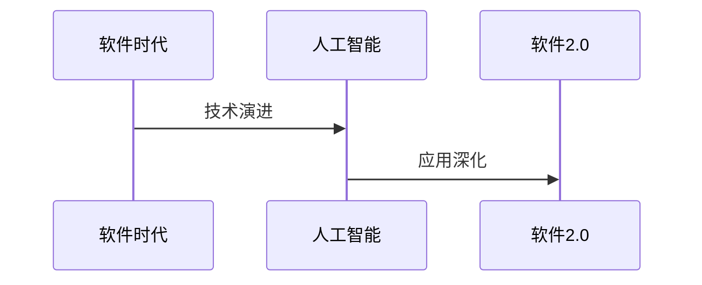
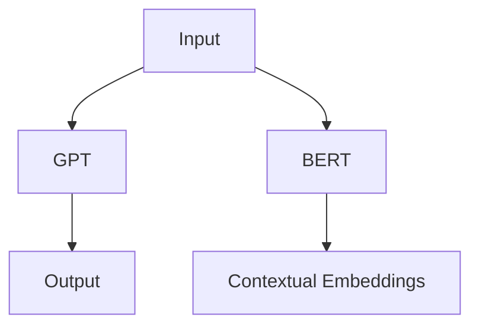
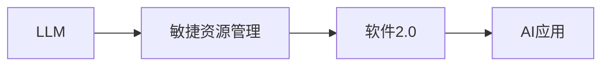

                 

### 第一部分: 背景介绍

#### 1.1.1 问题背景与核心概念

##### 1.1.1.1 问题背景

在当今快速发展的信息技术时代，人工智能（AI）已经成为驱动技术创新和产业变革的重要力量。从早期的专家系统到深度学习，再到如今的大型语言模型（LLM），人工智能技术不断突破，应用领域也日益广泛。软件2.0作为继传统软件1.0之后的理念，其核心在于将软件从单纯的工具变为智能体，能够自主学习和适应。

**描述**：人工智能技术的发展历程和当前的应用场景，以及软件2.0的概念和特点。

从早期的简单算法到复杂的神经网络，再到如今的Transformer架构，人工智能技术经历了巨大的变革。当前，人工智能已经渗透到生活的方方面面，从语音助手、智能家居到自动驾驶、医疗诊断，AI的应用场景越来越丰富。

软件2.0的概念则是在此背景下提出的，它强调软件应该像生物一样具有自主进化和学习的能力，能够不断适应和优化自身。与传统的软件1.0相比，软件2.0具有以下特点：

- **智能化**：软件能够自主学习，优化自身性能。
- **动态性**：软件能够根据环境和需求的变化动态调整功能和行为。
- **适应性**：软件能够适应不同的使用场景和用户需求。

**图表**：使用 Mermaid 画出人工智能技术发展历程的简单流程图。



##### 1.1.1.2 敏捷资源管理的重要性

在人工智能特别是大型语言模型（LLM）的开发中，敏捷资源管理的重要性愈发凸显。LLM模型的开发不仅涉及庞大的计算资源，还涉及到复杂的算法优化、数据预处理和模型训练等环节。传统的资源管理方法往往难以应对这些挑战，而敏捷资源管理则能够通过灵活的调整和优化，提高开发效率和项目成功率。

**描述**：解释敏捷资源管理在人工智能尤其是大型语言模型（LLM）开发中的应用，以及它如何影响开发效率和项目成功。

敏捷资源管理是一种基于敏捷开发原则的资源管理方法，它强调快速响应变化、持续交付价值、团队合作和客户参与。在LLM开发中，敏捷资源管理主要体现在以下几个方面：

- **迭代开发**：将整个开发过程划分为多个迭代周期，每个迭代周期都有明确的目标和交付物。
- **灵活调整**：根据项目的进展和反馈，及时调整资源分配和任务优先级。
- **持续集成**：持续集成和部署，确保开发过程中的每个版本都是可用的。
- **高度协作**：鼓励团队成员之间的沟通和协作，提高整体开发效率。

**表格**：核心概念属性特征对比表格。

| 特征               | 传统资源管理            | 敏捷资源管理                  |
|-------------------|-----------------------|---------------------------|
| 项目管理方法       | 线性、瀑布模型           | 基于迭代和增量的敏捷开发方法      |
| 适应变化能力       | 弹性小，难以快速响应变化   | 弹性大，能够快速适应需求变化      |
| 团队协作           | 分工明确，沟通较少         | 高度协作，频繁沟通和反馈         |
| 客户参与           | 后期参与，需求变化影响大   | 早期参与，需求明确，影响小        |

**图表**：使用 Mermaid 画出敏捷资源管理与传统资源管理的 ER 实体关系图。

```mermaid
erDiagram
    ResourceManagement ||--|{ AgileResourceManagement }
    ResourceManagement {
        :ID
        :Start
        :End
    }
    AgileResourceManagement {
        :ID
        :Iteration
        :Goal
    }
```

##### 1.1.2 核心概念

在本文中，我们将重点讨论大型语言模型（LLM）的开发和应用。LLM是一种基于深度学习技术的自然语言处理模型，能够对自然语言进行理解和生成。LLM的发展经历了多个阶段，从早期的GPT到BERT，再到如今的各种改进模型，如RoBERTa和T5，每个模型都有其独特的特点和应用场景。

**描述**：简要介绍LLM的基本原理和分类，如GPT、BERT等。

**表格**：核心概念属性特征对比表格。

| 模型         | 特点                                   | 应用领域                           |
|-------------|--------------------------------------|----------------------------------|
| GPT         | 自回归语言模型，生成能力强               | 自然语言生成、文本生成和翻译等       |
| BERT        | 双向编码表示，上下文理解能力强           | 问答系统、文本分类和情感分析等       |
| RoBERTa     | 基于BERT的改进模型，性能更优             | 广泛的NLP任务                     |
| T5          | 任务特定的统一Transformer模型           | 任务描述到文本转换的任务             |

**图表**：使用 Mermaid 画出几种常见LLM的 Mermaid 流程图。



#### 1.1.3 核心概念的联系与整合

LLM的原理、敏捷资源管理的方法，以及软件2.0的发展趋势，这三者之间存在紧密的联系。LLM的开发和应用，需要敏捷资源管理的支持，而敏捷资源管理的实践，又促进了软件2.0理念的落地。通过整合这些核心概念，我们可以更全面地理解LLM应用开发中的敏捷资源管理，为其在人工智能领域的广泛应用提供理论依据和实践指导。

**图表**：使用 Mermaid 画出核心概念之间的联系图。



通过上述分析，我们可以看到，LLM的应用开发不仅仅是技术问题，更是一个涉及资源管理、开发方法和应用场景的综合挑战。在下一部分中，我们将深入探讨LLM应用开发中的敏捷资源管理方法，分析其在实际项目中的应用和实践效果。

