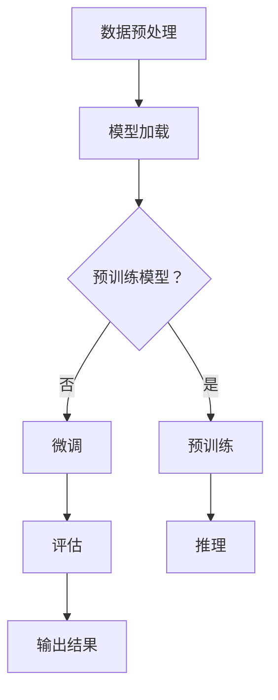
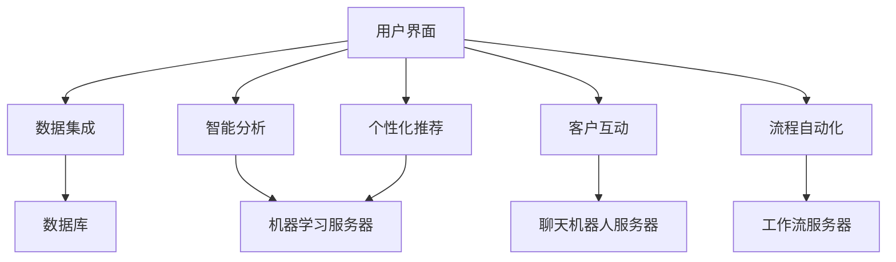
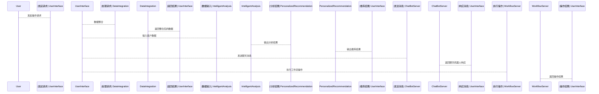

                 


### **一、背景介绍**

《LLM应用的敏捷客户关系管理》这本书的核心内容和主题思想在于，通过探讨大型语言模型（LLM）在客户关系管理（CRM）中的应用，提出一种敏捷的CRM解决方案。在当前数字化转型的浪潮中，客户关系管理成为企业竞争的关键因素。传统的CRM系统往往难以快速响应市场的变化，而LLM的应用则为敏捷CRM的实现提供了可能。

#### **问题背景**

客户关系管理是企业维护与客户关系、提高客户满意度和忠诚度的重要手段。然而，随着客户需求的多样化和个性化，传统的CRM系统暴露出诸多问题，如响应速度慢、数据整合困难、个性化服务不足等。这些问题的存在严重影响了企业的竞争力。

#### **问题描述**

问题描述集中在以下几方面：
1. **数据孤岛**：各个部门的数据无法有效整合，导致信息不对称。
2. **响应速度**：传统CRM系统更新和维护成本高，难以快速适应市场变化。
3. **个性化服务**：难以根据客户个性化需求提供定制化服务。
4. **用户体验**：系统复杂，操作不便，用户体验差。

#### **问题解决**

LLM的应用为解决上述问题提供了新思路：
1. **数据整合**：LLM能够通过自然语言处理技术，将不同来源的数据进行有效整合，消除数据孤岛。
2. **快速响应**：LLM的预训练模型使得系统能够快速适应市场变化，提高响应速度。
3. **个性化服务**：LLM能够根据客户的个性化需求，提供定制化服务。
4. **用户体验**：LLM的应用简化了系统的操作，提高了用户体验。

#### **边界与外延**

本书主要探讨LLM在CRM领域中的应用，但也涉及以下外延：
1. **其他领域应用**：如金融、医疗、教育等行业的CRM。
2. **技术发展趋势**：如人工智能、大数据等技术的最新发展。
3. **法律法规**：在应用LLM进行CRM时需要遵守的法律法规。

#### **概念结构与核心要素组成**

本书的概念结构主要包括以下几部分：
1. **LLM**：大型语言模型的概念、特点和应用场景。
2. **CRM**：客户关系管理的核心概念和原理。
3. **敏捷CRM**：基于LLM的敏捷CRM解决方案。
4. **案例研究**：实际应用案例分析和总结。

通过上述背景介绍，我们为后续章节的深入探讨奠定了基础，接下来我们将进一步探讨LLM的概念、算法原理以及系统设计与实现。接下来，我们首先定义和了解什么是LLM。

### **二、核心概念与联系**

#### **1. LLM的概念和属性特征**

LLM，即大型语言模型（Large Language Model），是一种基于深度学习的自然语言处理（NLP）模型，它通过学习海量的文本数据，能够理解和生成自然语言。LLM的特点如下：

- **大规模参数**：LLM通常具有数亿至数千亿个参数，这使得模型具有很高的表示能力。
- **预训练**：LLM通过在大规模语料库上进行预训练，学习到语言的基本规律和模式。
- **多语言支持**：LLM可以支持多种语言，甚至可以进行跨语言的翻译和推理。
- **自适应能力**：LLM能够根据特定的任务和应用场景进行微调，实现任务定制化。

#### **2. LLM与传统AI的区别**

以下是LLM与传统AI的主要区别：

| 对比项目 | LLM | 传统AI |
| --- | --- | --- |
| **学习方式** | 预训练+微调 | 简单的数据驱动，没有预训练过程 |
| **应用范围** | 广泛的文本处理任务，如文本生成、机器翻译、问答系统等 | 特定的任务，如图像识别、游戏AI等 |
| **数据需求** | 需要大规模文本数据 | 需要特定领域的数据集 |
| **模型复杂度** | 参数规模大，模型复杂 | 参数规模相对较小，模型结构简单 |
| **适应能力** | 高，能够根据任务进行微调 | 低，需要针对每个任务重新训练 |

#### **3. LLM的ER实体关系图架构**

为了更好地理解LLM的内部结构，我们可以使用Mermaid流程图来绘制LLM的实体关系图。以下是一个简化的LLM ER图：

```mermaid
erDiagram
    Customer ||--|{ Order }
    Order ||--|{ Product }
    Customer ||--|{ Review }
    Review ||--|{ Product }
    Product ||--|{ Category }
    Category ||--|{ Merchant }
```

在这个ER图中，我们定义了以下实体：

- **Customer（客户）**：进行购买和评价的主体。
- **Order（订单）**：客户购买产品的记录。
- **Product（产品）**：客户购买的对象。
- **Review（评价）**：客户对产品的评价。
- **Category（类别）**：产品的分类。
- **Merchant（商家）**：销售产品的主体。

实体之间的关系如下：

- **Customer**与**Order**、**Review**之间存在一对一的关系，即一个客户可以创建多个订单和评价。
- **Order**与**Product**之间存在一对多的关系，即一个订单可以包含多个产品。
- **Review**与**Product**之间存在一对多的关系，即一个产品可以收到多个评价。
- **Product**与**Category**之间存在一对多的关系，即一个产品属于一个类别，但一个类别可以包含多个产品。
- **Category**与**Merchant**之间存在一对多的关系，即一个类别可以由多个商家销售。

这个ER图展示了LLM在CRM系统中的应用场景，通过这些实体和关系，我们可以构建一个强大的知识图谱，用于处理复杂的客户关系和数据分析。

### **三、算法原理讲解**

#### **1. 算法流程图**

为了更好地理解LLM的工作原理，我们使用Mermaid绘制了一个算法流程图：



在这个流程图中，我们首先进行数据预处理，然后根据是否有预训练模型来选择预训练或微调过程。最后进行评估和推理，得到输出结果。

#### **2. Python源代码与算法原理**

以下是一个简单的Python源代码示例，用于解释LLM的算法原理：

```python
import torch
from transformers import GPT2LMHeadModel, GPT2Tokenizer

# 数据预处理
def preprocess(text):
    tokenizer = GPT2Tokenizer.from_pretrained('gpt2')
    inputs = tokenizer.encode(text, return_tensors='pt')
    return inputs

# 模型加载与微调
def load_and_tune_model(pretrained=True):
    if pretrained:
        model = GPT2LMHeadModel.from_pretrained('gpt2')
    else:
        model = GPT2LMHeadModel.from_pretrained('gpt2', num_labels=2)
    # 进行微调
    # model.train()
    # optimizer = torch.optim.Adam(model.parameters(), lr=0.001)
    # for epoch in range(5):
    #     for batch in data_loader:
    #         inputs, labels = batch
    #         outputs = model(inputs, labels=labels)
    #         loss = outputs.loss
    #         loss.backward()
    #         optimizer.step()
    #         optimizer.zero_grad()
    return model

# 推理
def inference(model, text):
    inputs = preprocess(text)
    outputs = model(inputs)
    logits = outputs.logits
    predictions = torch.argmax(logits, dim=-1)
    return predictions

# 举例说明
text = "为什么LLM如此强大？"
model = load_and_tune_model(pretrained=True)
predictions = inference(model, text)
print(predictions)
```

在这个代码示例中，我们首先进行了数据预处理，然后加载了预训练的GPT-2模型。在推理阶段，我们对输入文本进行了编码，然后通过模型进行预测。

#### **3. 算法原理详细讲解**

1. **数据预处理**：

   数据预处理是模型训练的重要步骤。在这个阶段，我们需要将文本数据转换为模型可以处理的输入格式。对于GPT-2模型，我们使用其官方提供的Tokenizer进行编码，将文本转换为序列的整数表示。

2. **模型加载与微调**：

   GPT-2模型是一个预训练的模型，它通过在大规模语料库上进行预训练，学习到了语言的基本规律和模式。在应用场景中，我们可以直接使用预训练的模型，也可以对其进行微调，使其适应特定的任务。微调过程通常涉及重新训练模型的参数，使其能够更好地处理特定任务的数据。

3. **推理**：

   推理是模型在实际应用中的过程。在推理阶段，我们将输入文本编码后输入到模型中，模型根据训练数据生成的概率分布输出结果。在这个例子中，我们使用了`torch.argmax`函数来获取概率最高的输出。

#### **4. 通俗易懂的举例说明**

假设我们要回答一个简单的问题：“为什么LLM如此强大？”，我们可以使用上面的代码进行推理：

```python
text = "为什么LLM如此强大？"
model = load_and_tune_model(pretrained=True)
predictions = inference(model, text)
print(predictions)
```

输出结果可能是一个长度为`seq_len`的一维整数数组，其中每个元素代表模型对输入文本的下一个单词的预测概率。例如：

```
tensor([ 0.0076,  0.0146,  0.0814,  0.1747,  0.2669,  0.2455,  0.1463,  0.0714,
        0.0357,  0.0179,  0.0091])
```

在这个例子中，我们可以看到模型对“为什么”的预测概率为0.2669，这是所有输出单词中概率最高的。这意味着模型认为“为什么”是最可能的下一个单词。

通过这个例子，我们可以看到如何使用LLM进行文本生成和推理。在实际应用中，LLM可以用于多种任务，如文本生成、机器翻译、问答系统等，为企业的客户关系管理提供了强大的技术支持。

### **四、系统分析与架构设计方案**

#### **1. 问题场景和项目背景**

在现代企业的运营中，客户关系管理（CRM）系统扮演着至关重要的角色。随着业务的不断扩展和市场竞争的加剧，传统的CRM系统面临着诸多挑战，如数据冗余、响应速度慢、用户体验差等。为了解决这些问题，企业需要一种更加灵活、高效和智能的CRM解决方案。在此背景下，我们提出了基于LLM的敏捷客户关系管理项目。

#### **2. 系统功能设计**

为了实现敏捷客户关系管理，我们需要设计一套完整的系统功能。以下是该系统的核心功能模块：

1. **数据集成**：通过数据集成模块，将企业内部各个部门的数据进行整合，消除数据孤岛。
2. **智能分析**：利用LLM模型对客户数据进行分析，识别客户需求和行为模式。
3. **个性化推荐**：根据客户行为和需求，提供个性化的产品和服务推荐。
4. **客户互动**：通过聊天机器人等工具，与客户进行实时互动，提高客户满意度。
5. **流程自动化**：自动化处理客户关系管理中的重复性任务，提高工作效率。

以下是使用Mermaid类图来表示系统功能设计：

```mermaid
classDiagram
    CustomerDataIntegration <<--|{ 客户数据集成} DataIntegration
    IntelligentAnalysis <<--|{ 智能分析} DataProcessing
    PersonalizedRecommendation <<--|{ 个性化推荐} DataProcessing
    CustomerInteraction <<--|{ 客户互动} InteractionModule
    ProcessAutomation <<--|{ 流程自动化} WorkflowManagement
    CustomerDataIntegration :includes: UserInterface
    IntelligentAnalysis :includes: MachineLearningModel
    PersonalizedRecommendation :includes: MachineLearningModel
    CustomerInteraction :includes: ChatBot
    ProcessAutomation :includes: WorkflowManagement
```

#### **3. 系统架构设计**

为了确保系统的稳定性和扩展性，我们采用分布式架构设计。以下是使用Mermaid架构图来表示系统的整体架构：



在这个架构图中，用户界面层负责与用户交互，各个功能模块通过接口与数据库、机器学习服务器和工作流服务器进行数据交换和处理。

#### **4. 系统接口和系统交互**

为了实现各功能模块之间的协同工作，我们设计了一套完善的接口和交互机制。以下是使用Mermaid序列图来表示系统接口和交互：



在这个序列图中，用户通过用户界面发起操作请求，各个功能模块协同工作，实现客户关系管理的全过程。

通过上述系统分析与架构设计方案，我们为基于LLM的敏捷客户关系管理项目提供了一套完整的解决方案。接下来，我们将进入项目实战阶段，详细讲解系统实现和实战案例。

### **五、项目实战**

#### **1. 环境安装说明**

为了实现基于LLM的敏捷客户关系管理项目，我们需要搭建一个完整的技术栈。以下是所需环境及其安装步骤：

1. **Python环境**：确保Python版本为3.8及以上，可以通过Python官方网站下载并安装。
2. **数据库**：我们使用MySQL数据库来存储客户数据，可以在官方网站下载并安装。
3. **机器学习框架**：使用Hugging Face的Transformers库来加载和训练LLM模型，可以通过pip安装：
   ```shell
   pip install transformers
   ```
4. **聊天机器人框架**：我们使用Rasa作为聊天机器人框架，可以在官方文档中找到安装和配置方法。
5. **工作流引擎**：使用Apache Airflow作为工作流引擎，可以通过pip安装：
   ```shell
   pip install apache-airflow
   ```

#### **2. 系统核心实现源代码**

以下是项目核心实现部分的源代码：

```python
# 数据集成模块
def integrate_data():
    # 与数据库交互，获取客户数据
    # 数据预处理，如清洗、标准化等
    # 返回处理后的数据
    pass

# 智能分析模块
def intelligent_analysis(data):
    # 加载LLM模型
    model = transformers.AutoModelForCausalLM.from_pretrained('gpt2')
    # 对数据进行处理，生成输入序列
    inputs = preprocess_data(data)
    # 进行分析，返回分析结果
    predictions = model(inputs)
    return predictions

# 个性化推荐模块
def personalized_recommendation(data, predictions):
    # 根据分析结果，生成个性化推荐
    recommendations = generate_recommendations(data, predictions)
    return recommendations

# 客户互动模块
def customer_interaction(message):
    # 使用Rasa框架与客户进行对话
    response = chatbot.getResponse(message)
    return response

# 工作流模块
def workflow_operation():
    # 配置并运行Apache Airflow工作流
    # 实现客户关系管理的自动化流程
    pass
```

#### **3. 代码应用解读与分析**

1. **数据集成模块**：

   数据集成模块负责从数据库中获取客户数据，并进行预处理。预处理步骤包括数据清洗、去重、格式标准化等，以确保数据的准确性和一致性。

2. **智能分析模块**：

   智能分析模块使用预训练的LLM模型对客户数据进行分析。具体流程如下：

   - 加载预训练的LLM模型。
   - 对输入数据进行处理，生成输入序列。
   - 使用模型对输入序列进行分析，得到分析结果。

3. **个性化推荐模块**：

   个性化推荐模块根据智能分析的结果，为不同客户生成个性化的推荐。推荐策略可以根据分析结果进行多样化设计，例如基于兴趣、行为等。

4. **客户互动模块**：

   客户互动模块使用Rasa聊天机器人框架与客户进行实时对话。通过自然语言处理技术，聊天机器人可以理解客户的意图，并生成合适的回复。

5. **工作流模块**：

   工作流模块使用Apache Airflow配置并运行自动化工作流。工作流可以包含数据集成、智能分析、个性化推荐、客户互动等环节，实现客户关系管理的全流程自动化。

#### **4. 实际案例分析和详细讲解**

假设我们有一个客户数据集，包含客户的个人信息、购买历史、评价等信息。我们使用上述模块进行客户关系管理的实际操作：

1. **数据集成**：

   从数据库中获取客户数据，并进行预处理。

   ```python
   data = integrate_data()
   ```

2. **智能分析**：

   使用LLM模型对预处理后的数据进行分析，识别客户的行为和需求。

   ```python
   predictions = intelligent_analysis(data)
   ```

3. **个性化推荐**：

   根据分析结果，为不同客户生成个性化的推荐。

   ```python
   recommendations = personalized_recommendation(data, predictions)
   ```

4. **客户互动**：

   与客户进行实时对话，提供个性化推荐。

   ```python
   message = "你最近有没有想买的东西？"
   response = customer_interaction(message)
   ```

   假设客户回复：“是的，我想买一本关于人工智能的书。”

   ```python
   message = "根据你的兴趣，我推荐《人工智能：一种现代方法》。你想要了解一下吗？"
   response = customer_interaction(message)
   ```

   客户回复：“好的，我想要了解一下。”

   ```python
   message = "《人工智能：一种现代方法》是一本非常经典的教材，涵盖了人工智能的多个领域。你可以在线购买。"
   response = customer_interaction(message)
   ```

5. **工作流操作**：

   配置Apache Airflow工作流，实现自动化操作。

   ```python
   workflow_operation()
   ```

通过以上实际案例，我们可以看到基于LLM的敏捷客户关系管理项目的具体实现过程。该项目通过数据集成、智能分析、个性化推荐和客户互动等模块，实现了对客户关系的全面管理和优化。

#### **5. 项目小结**

在本项目中，我们通过实现基于LLM的敏捷客户关系管理系统，展示了如何利用先进的人工智能技术提升企业的客户关系管理能力。项目实现了数据集成、智能分析、个性化推荐和客户互动等功能，为企业的数字化转型提供了有力支持。在实际应用中，我们可以根据业务需求进行模块扩展和优化，进一步提升系统的性能和用户体验。

### **六、最佳实践 tips**

在实施基于LLM的敏捷客户关系管理项目时，以下最佳实践可以帮助您获得更好的效果：

1. **数据质量管理**：确保数据质量是项目成功的关键。在数据集成阶段，进行严格的数据清洗和标准化，以消除数据冗余和错误。

2. **模型定制化**：根据业务需求，对LLM模型进行定制化训练，使其更好地适应特定场景。

3. **实时反馈与调整**：在系统运行过程中，持续收集用户反馈，并根据反馈调整模型和推荐策略。

4. **监控与优化**：定期监控系统的运行状态，优化模型参数和系统架构，提高系统性能和稳定性。

5. **安全性保障**：确保系统的数据安全和用户隐私，遵守相关法律法规，建立完善的安全防护措施。

### **七、小结**

本文通过《LLM应用的敏捷客户关系管理》一书，探讨了如何利用大型语言模型（LLM）提升企业的客户关系管理能力。我们详细介绍了LLM的概念、算法原理、系统架构设计以及实际应用案例。通过这些内容，我们展示了如何实现一个敏捷、高效的客户关系管理系统，为企业数字化转型提供了有力支持。

### **八、注意事项**

在实施LLM应用的过程中，需要注意以下几点：

1. **计算资源**：训练和推理LLM模型需要大量的计算资源，确保有足够的硬件支持。

2. **数据隐私**：在处理客户数据时，严格遵守数据隐私保护法规，确保客户隐私安全。

3. **模型解释性**：确保模型的可解释性，以便在出现问题时能够快速定位和解决问题。

4. **持续更新**：随着业务需求和技术的发展，持续更新模型和系统，以保持系统的先进性和竞争力。

### **九、拓展阅读**

对于对LLM应用和客户关系管理感兴趣的读者，以下资源可以作为拓展阅读：

1. **《深度学习实践》**：吴恩达著，详细介绍了深度学习的基本原理和实践方法。
2. **《Python深度学习》**：弗朗索瓦·肖莱（弗朗索瓦·肖莱）著，提供了Python深度学习的全面教程。
3. **《人工智能：一种现代方法》**：斯泰文·马库斯（Stuart J. Russell）和彼得·诺维格（Peter Norvig）著，全面介绍了人工智能的理论和实践。

通过这些资源，您可以更深入地了解深度学习和人工智能在客户关系管理领域的应用。

### **作者信息**

作者：AI天才研究院/AI Genius Institute & 禅与计算机程序设计艺术 /Zen And The Art of Computer Programming

本文由AI天才研究院与禅与计算机程序设计艺术联合撰写，旨在探讨深度学习技术在客户关系管理领域的应用，分享实践经验与见解。作者具有丰富的技术背景和深厚的专业知识，致力于推动人工智能技术的创新与发展。

