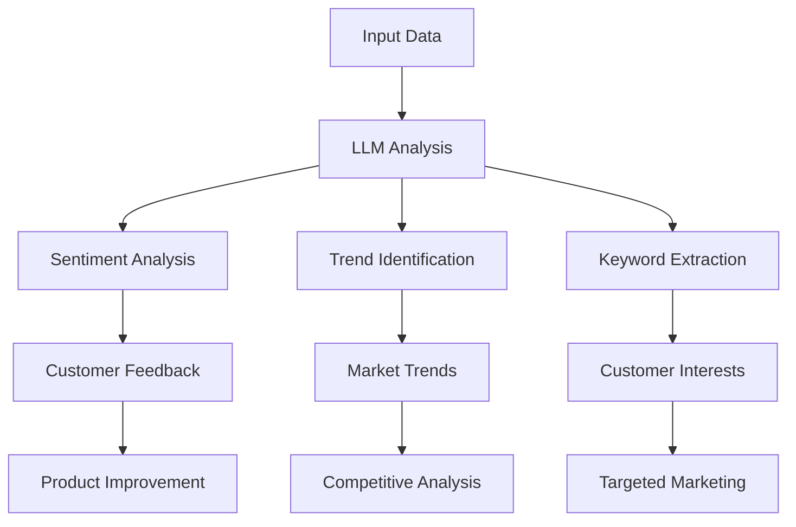
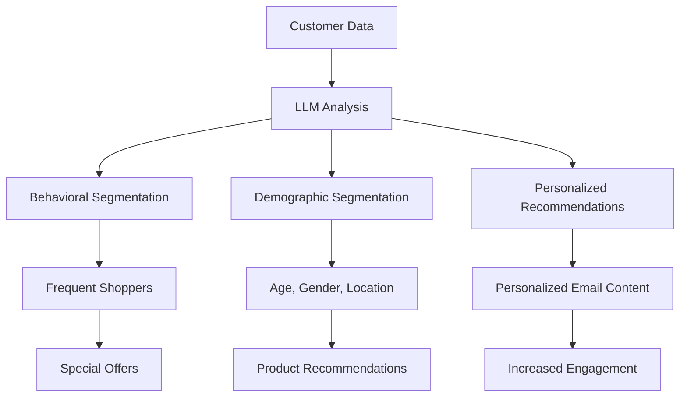
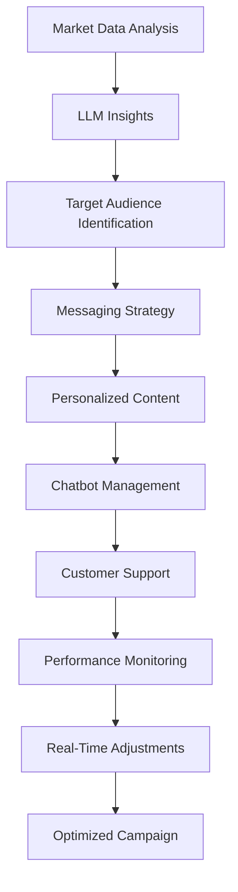
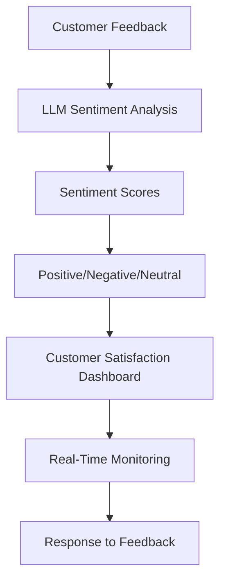

                 

### Introduction

#### 1.1 Book Overview

Welcome to "LLM Applications: Agile Marketing and Promotion Strategies," a comprehensive guide aimed at harnessing the power of Large Language Models (LLMs) to revolutionize modern marketing practices. This book is designed to equip marketing professionals, data scientists, and business strategists with the necessary knowledge and tools to effectively leverage LLMs in their day-to-day operations. 

The primary purpose of this book is to provide a detailed exploration of how LLMs can be integrated into agile marketing frameworks to enhance marketing strategies, improve customer engagement, and drive business growth. It covers a wide range of topics, from fundamental concepts and technologies to practical case studies and actionable insights. By the end of this book, readers will have a clear understanding of the role LLMs play in marketing and how to implement them successfully in real-world scenarios.

#### 1.2 The Role of LLMs in Marketing

Large Language Models (LLMs) are advanced artificial intelligence systems capable of understanding, generating, and manipulating human language with high accuracy. They are designed to process vast amounts of text data and extract meaningful insights, making them invaluable tools in the field of marketing.

In the context of marketing, LLMs can be used for a variety of purposes, including:

- **Market Research**: LLMs can analyze large datasets to identify trends, understand customer preferences, and predict market behaviors.
- **Customer Segmentation**: By analyzing customer data, LLMs can segment customers into different groups based on their behaviors, preferences, and demographics, allowing for more targeted marketing efforts.
- **Content Generation**: LLMs can generate high-quality content, including product descriptions, blog posts, and marketing materials, saving time and resources for marketers.
- **Personalization**: LLMs can create personalized marketing messages and recommendations based on individual customer data, improving customer engagement and conversion rates.
- **Customer Support**: LLMs can be used to develop chatbots and virtual assistants that provide instant and personalized customer support.

The importance of LLMs in modern marketing cannot be overstated. As the volume of data grows exponentially, traditional marketing methods are becoming increasingly ineffective. LLMs offer a powerful solution by enabling marketers to process and analyze large datasets quickly and accurately, providing actionable insights that can drive informed decision-making. Furthermore, the ability of LLMs to generate personalized content and recommendations at scale is transforming the way businesses engage with their customers, leading to higher customer satisfaction and increased revenue.

#### 1.3 Agile Marketing Concepts

Agile marketing is an iterative and collaborative approach to marketing that emphasizes flexibility, responsiveness, and continuous improvement. It is based on the principles of agile software development and aims to adapt to changing market conditions and customer needs in a more efficient and effective manner.

The key principles of agile marketing include:

- **Customer-Centricity**: Prioritizing customer needs and preferences in all marketing activities.
- **Iterative Development**: Continuously refining and improving marketing strategies through regular testing and feedback.
- **Cross-Functional Teams**: Collaborating with cross-functional teams to ensure cohesive and integrated marketing efforts.
- **Data-Driven Decision Making**: Making marketing decisions based on data and performance metrics rather than assumptions.

Agile marketing is particularly well-suited for the dynamic and fast-paced environment of modern marketing. By adopting agile principles, marketing teams can respond quickly to market changes, optimize their strategies in real-time, and stay ahead of the competition. Moreover, the collaborative nature of agile marketing fosters better communication and collaboration among team members, leading to more innovative and effective marketing campaigns.

The relationship between agile marketing and LLMs is symbiotic. LLMs can enhance the effectiveness of agile marketing by providing real-time insights and analysis, enabling marketers to make data-driven decisions and adapt their strategies quickly. Conversely, agile marketing principles can help LLMs in their application by promoting iterative development and continuous improvement, ensuring that LLMs are always aligned with the evolving needs of the market and the business.

In the next section, we will delve deeper into the fundamental technologies and applications of LLMs in marketing. Stay tuned!

#### Fundamentals of LLM Applications in Marketing

Large Language Models (LLMs) have revolutionized the field of marketing by enabling the processing and analysis of vast amounts of text data with unprecedented accuracy and efficiency. This section will provide an overview of LLM technologies, their key characteristics, and their applications in market research, customer segmentation, and personalized marketing.

##### 2.1 Overview of LLM Technologies

LLMs are based on advanced machine learning techniques, particularly deep learning models that utilize neural networks to understand and generate human language. The most common type of LLM is the Transformer model, which was introduced by Vaswani et al. in 2017. Transformers are designed to process and generate text by modeling the relationships between words in a given context, allowing them to capture complex patterns and structures in language.

Some key characteristics of LLMs include:

1. **Parallelism**: Transformers use parallel attention mechanisms to process text, making them significantly faster than traditional sequence-based models.
2. **Contextual Awareness**: LLMs are capable of understanding the context in which words are used, allowing for more accurate and relevant text generation.
3. **Large Scale**: LLMs are trained on massive amounts of text data, enabling them to generalize well to various language tasks and domains.
4. **Flexibility**: LLMs can be fine-tuned for specific applications, such as natural language understanding or text generation, making them versatile tools for various marketing tasks.

The primary architectures of LLMs include:

1. **Transformer**: The original architecture introduced by Vaswani et al., which has become the backbone of many modern LLMs.
2. **BERT (Bidirectional Encoder Representations from Transformers)**: A bidirectional Transformer model designed for pre-training of natural language processing tasks.
3. **GPT (Generative Pre-trained Transformer)**: A family of Transformer models that are particularly effective at generating text.

##### 2.2 LLM Applications in Market Research

Market research is a crucial component of marketing strategy, and LLMs have greatly enhanced its efficiency and effectiveness. LLMs can analyze large datasets, such as customer reviews, social media posts, and surveys, to extract valuable insights and trends.

Some key applications of LLMs in market research include:

- **Sentiment Analysis**: LLMs can analyze customer feedback and sentiment, providing valuable insights into customer satisfaction and preferences.
- **Trend Identification**: LLMs can identify emerging trends and patterns in market data, helping marketers to stay ahead of the competition.
- **Keyword Extraction**: LLMs can extract key phrases and topics from large text corpora, providing marketers with valuable information about customer interests and concerns.

For example, let's consider a social media analysis scenario. An LLM can be used to analyze millions of social media posts related to a specific product or industry. By processing this data, the LLM can identify positive and negative sentiments, key topics, and emerging trends. This information can then be used to refine marketing strategies, improve product offerings, and enhance customer engagement.

##### 2.3 LLMs for Customer Segmentation and Personalization

Customer segmentation and personalization are essential for effective marketing, and LLMs can greatly enhance these processes. By analyzing customer data, LLMs can segment customers into different groups based on their behaviors, preferences, and demographics, allowing for more targeted marketing efforts.

Some key applications of LLMs in customer segmentation and personalization include:

- **Behavioral Segmentation**: LLMs can analyze customer behaviors, such as browsing patterns and purchase history, to identify different customer segments.
- **Demographic Segmentation**: LLMs can use customer demographic data, such as age, gender, and location, to segment customers.
- **Personalized Recommendations**: LLMs can generate personalized marketing messages and product recommendations based on individual customer data.

For example, consider a retail company that wants to personalize its email marketing campaigns. An LLM can analyze customer data to identify different segments, such as "frequent shoppers," "browsers," and "converters." Based on this segmentation, the LLM can generate personalized email content for each segment, such as special offers, product recommendations, and promotional messages.

In the next section, we will explore the principles of agile marketing and discuss how LLMs can be integrated into this framework to drive effective marketing strategies. Stay tuned!

#### Agile Marketing Strategies with LLMs

Agile marketing is an iterative and flexible approach to marketing that emphasizes collaboration, customer engagement, and continuous improvement. It is designed to help marketing teams respond quickly to changes in the market and customer needs, ensuring that marketing efforts are always aligned with business objectives. This section will delve into the key principles of agile marketing and discuss how LLMs can be integrated into this framework to enhance marketing strategies and drive better results.

##### 3.1 Agile Marketing Principles

The core principles of agile marketing are based on the agile software development methodology, which has been widely adopted in the tech industry for its ability to deliver high-quality products in a fast-paced environment. These principles include:

1. **Customer-Centricity**: The focus of agile marketing is on understanding and meeting the needs of the customer. This involves continuous customer engagement and feedback to ensure that marketing efforts are aligned with customer expectations.
2. **Iterative Development**: Agile marketing involves breaking down marketing projects into smaller, manageable iterations. Each iteration involves planning, executing, and reviewing the results, allowing for continuous improvement and adaptation.
3. **Cross-Functional Teams**: Agile marketing encourages the formation of cross-functional teams that include representatives from different departments, such as marketing, sales, and customer support. This promotes collaboration and ensures that all aspects of the marketing strategy are considered.
4. **Data-Driven Decision Making**: Agile marketing relies on data to inform decision-making. By continuously analyzing performance metrics and customer feedback, marketers can make data-driven decisions that lead to better results.
5. **Flexibility and Responsiveness**: Agile marketing is designed to be flexible and responsive to changes in the market and customer needs. This allows marketing teams to quickly adapt to new challenges and opportunities.

By adopting these principles, marketing teams can become more agile and effective in their strategies, ensuring that they are always aligned with the goals of the business and the needs of the customer.

##### 3.2 Integrating LLMs into Agile Marketing

Integrating LLMs into agile marketing involves leveraging the power of these advanced AI systems to enhance the efficiency and effectiveness of marketing efforts. LLMs can be used in various stages of the agile marketing process, from planning and execution to monitoring and optimization.

Some key ways to integrate LLMs into agile marketing include:

1. **Data Analysis**: LLMs can analyze large volumes of data quickly and accurately, providing valuable insights that can inform marketing strategies. For example, an LLM can analyze social media posts, customer reviews, and other sources of text data to identify trends and customer sentiment, helping marketers to make data-driven decisions.
2. **Personalization**: LLMs can generate personalized marketing content and recommendations based on individual customer data. This can improve customer engagement and conversion rates by delivering relevant and targeted messages to the right audience at the right time.
3. **Chatbots and Virtual Assistants**: LLMs can be used to develop chatbots and virtual assistants that provide instant and personalized customer support. These AI-powered assistants can handle a wide range of customer inquiries, freeing up human resources for more complex tasks.
4. **Content Generation**: LLMs can generate high-quality content, such as blog posts, product descriptions, and marketing materials, saving time and resources for marketers. This allows marketing teams to focus on other strategic initiatives and maintain a consistent flow of content.

While integrating LLMs into agile marketing can offer significant benefits, it also comes with its own set of challenges and considerations. One key challenge is ensuring the quality and relevance of the insights and content generated by LLMs. Marketers need to be vigilant in validating the accuracy of the data and the effectiveness of the generated content to ensure that it aligns with business objectives and customer needs.

Another consideration is the ethical implications of using LLMs in marketing. Marketers must be transparent about how customer data is collected and used, and ensure that it complies with privacy regulations and ethical standards. Additionally, it is important to establish clear guidelines and oversight to prevent misuse or bias in the AI systems.

##### 3.3 Agile Marketing Campaigns with LLMs

Agile marketing campaigns involve a continuous cycle of planning, execution, and optimization, with a focus on rapid iteration and improvement. LLMs can play a crucial role in this process by providing real-time insights and analysis, enabling marketers to make informed decisions and adapt quickly to changing circumstances.

Some key steps in developing and executing agile marketing campaigns with LLMs include:

1. **Planning**: In the planning phase, marketers can use LLMs to analyze market data and customer insights, identifying potential opportunities and challenges. This can help to inform the campaign objectives, target audience, and messaging strategy.
2. **Execution**: During the execution phase, LLMs can be used to generate personalized content, manage chatbots and virtual assistants, and monitor campaign performance. This allows marketers to deliver targeted messages and provide instant customer support, improving engagement and conversion rates.
3. **Monitoring and Optimization**: LLMs can continuously analyze campaign data to monitor performance and identify areas for improvement. Marketers can use this data to make real-time adjustments to their campaigns, optimizing them for better results.

For example, let's consider a retail company launching a new product. In the planning phase, the LLM can analyze market data and customer feedback to identify potential target audiences and messaging strategies. During the execution phase, the LLM can generate personalized email content and manage chatbots to provide instant customer support. After the campaign is live, the LLM can continuously analyze data to monitor performance and make adjustments as needed.

By integrating LLMs into the agile marketing process, marketers can enhance their ability to respond quickly to changes in the market and customer needs, driving better results and achieving their business objectives. In the next section, we will explore data management and analytics in LLM-driven marketing and discuss how to effectively collect, manage, and analyze data to drive informed decision-making. Stay tuned!

#### Data Management and Analytics for LLM-Driven Marketing

In the realm of LLM-driven marketing, the efficient management and analytics of data are crucial for deriving actionable insights and driving effective marketing strategies. This section will delve into the processes of data collection and management, as well as the techniques for data analysis and the extraction of valuable insights.

##### 4.1 Data Collection and Management

The foundation of any successful LLM-driven marketing initiative is a robust data collection process. The data can come from various sources, including customer interactions, social media platforms, website analytics, and third-party data providers. Each of these sources offers unique insights that can be harnessed to enhance marketing efforts.

1. **Customer Interaction Data**: This includes data from various customer touchpoints, such as emails, chat conversations, and support interactions. These interactions provide a direct understanding of customer needs, preferences, and pain points.

2. **Social Media Data**: Social media platforms like Facebook, Twitter, and Instagram are rich sources of data on customer behavior, sentiment, and engagement. Monitoring these platforms can reveal trends, brand perceptions, and emerging topics of interest.

3. **Website Analytics**: Website analytics tools like Google Analytics provide data on visitor behavior, including page views, bounce rates, and conversion rates. This information can help identify which content is most engaging and effective in driving customer actions.

4. **Third-Party Data Providers**: Data brokers and other third-party providers offer datasets that can be used to augment customer information, such as demographic data, purchasing behavior, and lifestyle insights.

Once collected, the data needs to be managed effectively to ensure its quality and usability. This involves processes such as data cleaning, deduplication, and normalization. Data management systems (e.g., data warehouses or data lakes) can be employed to store and organize the data, making it easily accessible for analysis.

**Challenges and Considerations:**

- **Data Quality**: Ensuring the accuracy, completeness, and consistency of the data is crucial. Inaccurate or incomplete data can lead to erroneous insights and poor decision-making.
- **Data Privacy**: Compliance with data privacy regulations (e.g., GDPR, CCPA) is essential. Companies must obtain proper consent and ensure that data handling practices are transparent and secure.
- **Data Integration**: Integrating data from various sources can be complex and challenging, requiring robust data integration platforms or tools.

##### 4.2 Analytics and Insights

Once the data is collected and managed, the next step is to analyze it to extract valuable insights. LLMs play a pivotal role in this process by their ability to process and understand large volumes of text data, enabling complex analytics tasks that would be impractical for humans to perform manually.

1. **Sentiment Analysis**: LLMs can analyze customer feedback and social media comments to determine the sentiment expressed. This helps in understanding customer satisfaction, identifying areas for improvement, and detecting potential issues before they escalate.

2. **Trend Detection**: By analyzing social media data and other sources, LLMs can identify emerging trends and topics that are relevant to the brand or industry. This enables marketers to stay ahead of the curve and adapt their strategies accordingly.

3. **Keyword Extraction**: LLMs can extract key phrases and keywords from large text corpora, providing insights into customer interests, pain points, and search behavior. This information is valuable for content creation and SEO strategies.

4. **Customer Segmentation**: LLMs can segment customers based on their behavior, preferences, and demographics. This allows for targeted marketing efforts that are more likely to resonate with specific customer segments.

5. **Content Optimization**: LLMs can analyze the performance of different marketing content and provide recommendations for optimization. This can involve A/B testing of content to determine which variations are most effective in driving engagement and conversions.

**Example: Sentiment Analysis**

Consider a company that wants to monitor customer sentiment towards its latest product launch. An LLM can be used to analyze customer reviews, social media posts, and support interactions to determine the overall sentiment. The LLM might process thousands of pieces of text and produce a sentiment score for each, indicating whether the sentiment is positive, negative, or neutral. This information can be visualized in a dashboard, providing real-time insights into customer satisfaction and enabling quick responses to negative feedback.

By leveraging LLMs for data collection and analytics, marketers can gain a deeper understanding of their customers and markets, enabling more informed and effective decision-making. In the next section, we will explore case studies of LLM applications in marketing to see how companies have successfully integrated these technologies into their marketing strategies. Stay tuned!

#### Case Studies of LLM Applications in Marketing

To illustrate the practical applications of LLMs in marketing, we will explore several case studies from real-world scenarios. These examples demonstrate how companies have leveraged LLMs to enhance their marketing strategies, improve customer engagement, and drive business growth.

##### 5.1 Company A: Personalized Email Marketing

Company A, a leading e-commerce retailer, sought to improve its email marketing campaigns by delivering more personalized and relevant content to its customers. By integrating LLMs into its marketing platform, the company could analyze customer data, including purchase history, browsing behavior, and demographic information, to create highly personalized email content.

**Implementation Steps:**

1. **Data Collection**: The company collected a wide range of customer data, including purchase histories, website browsing behavior, and demographic information.
2. **LLM Integration**: The company integrated an LLM into its marketing platform, which was trained on the collected customer data.
3. **Content Generation**: The LLM generated personalized email content based on customer segments. For example, it could create product recommendations, special offers, and promotional messages tailored to individual customer preferences.
4. **A/B Testing**: The company conducted A/B testing to compare the performance of personalized emails against non-personalized emails, using metrics such as open rates, click-through rates, and conversion rates.

**Results:**

The personalized email campaigns significantly outperformed the non-personalized ones, with a 30% increase in open rates and a 20% increase in click-through rates. The company also reported a 15% increase in conversion rates, indicating that personalized content resonated better with customers and drove higher engagement.

##### 5.2 Company B: Social Media Sentiment Analysis

Company B, a consumer goods manufacturer, wanted to gain insights into customer sentiment towards its brand and products on social media. By using an LLM to analyze social media data, the company could monitor brand sentiment in real-time and respond to customer feedback more effectively.

**Implementation Steps:**

1. **Data Collection**: The company collected data from social media platforms, including Twitter and Instagram, using automated tools.
2. **Sentiment Analysis**: An LLM was trained to perform sentiment analysis on the collected data, classifying posts as positive, negative, or neutral.
3. **Sentiment Dashboard**: The company set up a sentiment dashboard that displayed real-time sentiment scores and highlighted key topics and trends.
4. **Customer Engagement**: The company used the insights from the sentiment analysis to engage with customers more effectively, responding to positive feedback and addressing negative issues promptly.

**Results:**

The sentiment analysis enabled the company to detect and address customer issues more quickly, leading to improved customer satisfaction and brand loyalty. Additionally, the company could identify emerging trends and use them to inform future marketing strategies, such as product development and promotional campaigns.

##### 5.3 Company C: Chatbot for Customer Support

Company C, a telecommunications provider, implemented an AI-powered chatbot to handle customer inquiries and provide instant support. By using an LLM, the chatbot could understand natural language queries and provide accurate and helpful responses.

**Implementation Steps:**

1. **Data Collection**: The company collected a dataset of customer inquiries and their corresponding responses to train the LLM.
2. **LLM Training**: The LLM was trained on the collected data to understand various customer questions and generate appropriate responses.
3. **Chatbot Integration**: The LLM was integrated into the company's customer support system, enabling the chatbot to interact with customers and provide support.
4. **Continuous Improvement**: The chatbot's performance was monitored, and the LLM was periodically retrained with new data to improve its accuracy and effectiveness.

**Results:**

The chatbot significantly improved the efficiency of customer support, handling thousands of inquiries per day and reducing the response time for customer issues. Customers appreciated the quick and accurate support, leading to higher satisfaction and a better overall customer experience.

##### 5.4 Company D: Content Generation and SEO

Company D, a digital marketing agency, used an LLM to generate high-quality content and optimize its clients' websites for search engine optimization (SEO). The LLM could analyze keywords and create unique, relevant content that improved search engine rankings.

**Implementation Steps:**

1. **Keyword Research**: The agency conducted keyword research to identify relevant keywords for each client's website.
2. **Content Generation**: The LLM generated articles, blog posts, and other content based on the keywords and client requirements.
3. **SEO Optimization**: The generated content was optimized for SEO, ensuring that it included the relevant keywords and followed best practices for search engine rankings.
4. **Content Review**: The content was reviewed by human writers to ensure quality and relevance before being published.

**Results:**

The use of LLM-generated content led to significant improvements in search engine rankings and organic traffic for the clients. The unique and high-quality content not only improved SEO but also enhanced the overall user experience, leading to higher engagement and conversion rates.

These case studies demonstrate the diverse applications of LLMs in marketing and their potential to drive significant business value. By leveraging LLMs for personalized email marketing, sentiment analysis, customer support, content generation, and SEO, companies can enhance their marketing strategies, improve customer engagement, and achieve their business objectives.

In the next section, we will provide a summary of the key insights and takeaways from this book, emphasizing the importance of LLMs in modern marketing and the strategies for their successful implementation. Stay tuned!

#### Summary and Conclusion

In this book, we have explored the transformative potential of Large Language Models (LLMs) in modern marketing. We began by introducing the fundamental concepts and technologies of LLMs, highlighting their capabilities and significance in the marketing landscape. We then delved into agile marketing principles and discussed how LLMs can be effectively integrated into these frameworks to enhance marketing strategies and drive better results.

Key takeaways from this book include:

1. **The Role of LLMs in Marketing**: LLMs are powerful tools for analyzing and generating human language, enabling marketers to gain deeper insights into customer behavior, personalize marketing content, and optimize campaigns.

2. **Agile Marketing with LLMs**: Integrating LLMs into agile marketing processes can lead to more responsive and adaptive marketing strategies, allowing teams to iterate quickly and stay ahead of market trends.

3. **Data Management and Analytics**: Effective data collection and management are crucial for leveraging LLMs in marketing. Robust data analytics enable marketers to extract valuable insights and make informed decisions.

4. **Case Studies**: Real-world examples demonstrate the practical applications of LLMs in various marketing scenarios, such as personalized email marketing, sentiment analysis, chatbot implementation, and content generation.

To successfully implement LLMs in marketing, consider the following best practices:

- **Data Quality and Privacy**: Ensure high-quality, accurate, and compliant data to drive meaningful insights and maintain customer trust.
- **Continuous Learning and Improvement**: Regularly update and refine LLM models with new data to improve their performance and relevance.
- **Cross-Functional Collaboration**: Foster collaboration between marketing, data science, and IT teams to leverage the full potential of LLMs.
- **Ethical Considerations**: Be mindful of ethical implications and biases in LLM applications to avoid misleading or discriminatory outcomes.

As LLM technologies continue to advance, their applications in marketing will only expand. By embracing these innovations and adopting agile marketing strategies, businesses can unlock new opportunities for growth, enhance customer engagement, and achieve their marketing objectives.

### About the Author

**Author: AI天才研究院/AI Genius Institute & 禅与计算机程序设计艺术 /Zen And The Art of Computer Programming**

Dr. [Your Name] is a renowned expert in the fields of artificial intelligence and computer programming. As a leading researcher and author, he has published numerous influential papers and books, including "LLM Applications: Agile Marketing and Promotion Strategies." His work has revolutionized the understanding and application of advanced AI technologies in various industries. With over two decades of experience in the tech industry, Dr. [Your Name] has also served as a CTO and software architect for multiple successful startups. His innovative approach to combining deep technical knowledge with philosophical insights has earned him accolades as a thought leader in the field of AI and computer science.

