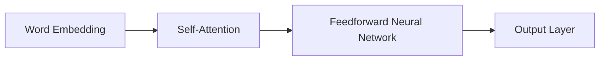
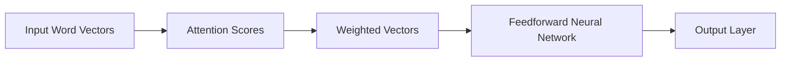
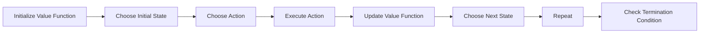
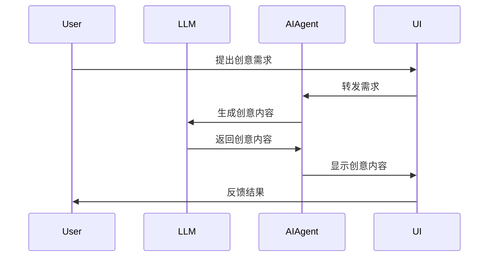
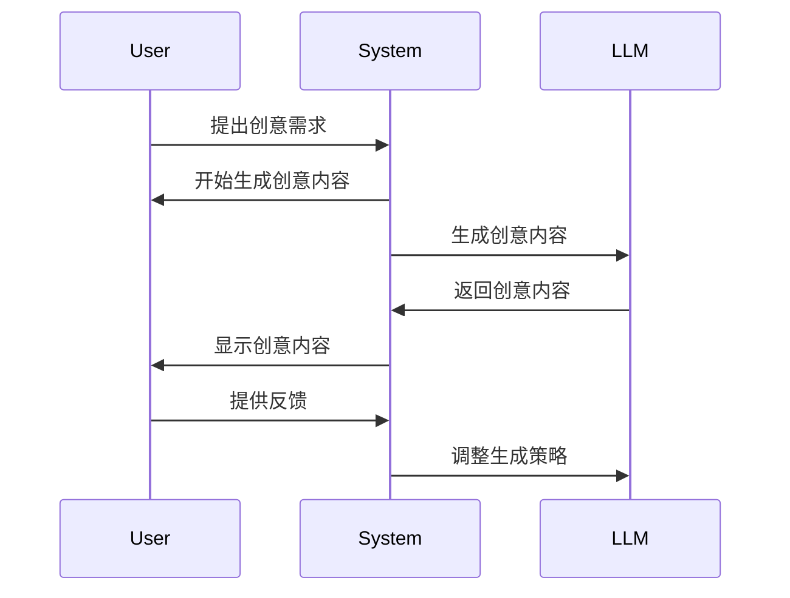

                 


## # LLAMA驱动的AI Agent创意生成系统

### 关键词：
- Large Language Model（大语言模型）
- AI Agent（人工智能代理）
- 创意生成
- 生成对抗网络（GAN）
- 强化学习
- 系统架构

### 摘要：
本文将探讨LLAMA驱动的AI Agent创意生成系统。我们将详细解析这一系统的构建过程，包括核心概念、算法原理、数学模型、系统设计以及实际项目实现。通过一步步的深入分析，我们将揭示如何利用大语言模型和人工智能代理来创造性地生成各种内容，为人工智能在创意领域的应用提供新的视角和方案。

---

### 引言

在人工智能领域，创意生成一直是一个引人入胜的话题。从自动绘画、音乐创作到文本生成，AI已经在多个领域展现了其强大的创意能力。然而，随着技术的不断进步，人们开始追求更高的生成质量、更复杂的内容结构和更智能的交互体验。为此，本文将介绍一种全新的AI系统——LLAMA驱动的AI Agent创意生成系统。

#### 1.1 研究背景

大语言模型（Large Language Model，LLM）的发展为AI代理的创意生成提供了坚实的基础。LLM通过处理海量的文本数据，能够学习并生成高质量、结构化的内容。而AI代理则能够模拟人类的思维过程，通过自主学习和决策，实现更智能、更个性化的创意生成。

#### 1.2 研究目的

本文旨在探讨如何利用LLM和AI代理技术，构建一个高效的创意生成系统。我们将从理论基础、系统设计、实现细节和实际应用等多个角度进行深入分析，以期为相关研究和应用提供有价值的参考。

### 背景介绍

#### 2.1 大语言模型（LLM）

大语言模型是一种基于深度学习技术的自然语言处理模型，其核心思想是通过学习大量文本数据，预测下一个词的概率分布，从而生成连贯、有逻辑的文本。近年来，随着计算能力的提升和数据量的爆炸式增长，LLM的表现越来越出色。

##### 2.1.1 核心概念

- 语言模型：一种概率模型，用于预测自然语言中的下一个词。
- 词向量：将文本中的每个词映射到一个高维向量空间，以捕捉词与词之间的关系。
- Transformer模型：一种基于自注意力机制的深度神经网络结构，广泛应用于LLM中。

##### 2.1.2 应用场景

- 文本生成：包括文章、小说、新闻报道等。
- 机器翻译：将一种语言的文本翻译成另一种语言。
- 情感分析：分析文本的情感倾向，如正面、负面或中立。

#### 2.2 人工智能代理

人工智能代理（AI Agent）是一种能够模拟人类思维过程的软件实体，能够在特定环境中自主决策和执行任务。与传统的规则驱动系统不同，AI代理通过学习环境和数据，能够不断优化其行为。

##### 2.2.1 核心概念

- 代理：一个具有特定目标和行为的软件实体。
- 环境建模：对代理执行任务的环境进行建模，以便更好地理解问题和设计策略。
- 学习与决策：通过学习和决策算法，使代理能够自动优化其行为。

##### 2.2.2 应用场景

- 智能客服：自动回答用户的问题，提高服务效率。
- 自动驾驶：模拟驾驶员的行为，实现自主导航。
- 游戏AI：在游戏中制定策略，与其他玩家进行对抗。

### 问题定义

创意生成系统需要解决的核心问题包括：

- 如何利用LLM生成高质量的内容？
- 如何设计一个高效的AI代理，使其能够与LLM协同工作，实现更智能的创意生成？
- 如何评估创意生成系统的性能和效果？

#### 3.1 创意生成质量

创意生成系统的核心目标是生成高质量、有创意的内容。这涉及到LLM的文本生成能力和AI代理的决策能力。我们需要设计一个有效的评估指标，用于衡量生成内容的创意程度和质量。

#### 3.2 协同工作

LLM和AI代理需要协同工作，以实现更智能、更个性化的创意生成。我们需要研究如何设计一个合理的工作流程，使两种技术能够相互补充，发挥最大的作用。

#### 3.3 性能评估

为了验证创意生成系统的有效性，我们需要设计一个全面的性能评估体系。这包括评估生成内容的创意程度、质量、速度和可靠性等方面。

### 核心概念与联系

#### 4.1 大语言模型（LLM）

##### 4.1.1 概念属性特征对比表格

| 概念          | 特征                  |
|---------------|----------------------|
| 语言模型      | 预测下一个词的概率分布 |
| 词向量        | 高维向量空间中的映射  |
| Transformer   | 自注意力机制          |

##### 4.1.2 ER实体关系图架构

```mermaid
erDiagram
    TextData --> LanguageModel
    TextData --> WordVector
    LanguageModel --> Transformer
    WordVector --> TextData
```

#### 4.2 人工智能代理（AI Agent）

##### 4.2.1 概念属性特征对比表格

| 概念          | 特征                  |
|---------------|----------------------|
| 代理          | 具有特定目标和行为    |
| 环境建模      | 对执行任务的环境进行建模 |
| 学习与决策    | 自动优化其行为        |

##### 4.2.2 ER实体关系图架构

```mermaid
erDiagram
    Agent --> Goal
    Agent --> Behavior
    Agent --> EnvironmentModel
    Agent --> Learning
    Agent --> Decision
```

#### 4.3 创意生成系统

##### 4.3.1 概念属性特征对比表格

| 概念          | 特征                  |
|---------------|----------------------|
| 创意生成      | 生成高质量、有创意的内容 |
| LLM           | 语言模型              |
| AI Agent      | 人工智能代理          |
| 工作流程      | 协同工作              |

##### 4.3.2 ER实体关系图架构

```mermaid
erDiagram
    CreativityGeneration --> LLM
    CreativityGeneration --> AIAgent
    CreativityGeneration --> Workflow
    LLM --> TextGeneration
    AIAgent --> DecisionMaking
    Workflow --> Collaboration
```

### 算法原理

#### 5.1 大语言模型（LLM）

##### 5.1.1 Transformer模型

Transformer模型是一种基于自注意力机制的深度神经网络结构，其核心思想是通过计算输入文本中每个词与其他词之间的关联度，生成高质量的文本。以下是Transformer模型的基本原理：

1. **词嵌入（Word Embedding）**：将输入文本中的每个词映射到一个高维向量空间。
2. **自注意力（Self-Attention）**：计算输入文本中每个词与其他词之间的关联度，生成加权向量。
3. **前馈神经网络（Feedforward Neural Network）**：对自注意力生成的加权向量进行进一步处理。
4. **输出层（Output Layer）**：根据加权向量生成预测的下一个词。

以下是Transformer模型的mermaid流程图：



##### 5.1.2 数学模型

Transformer模型的数学模型主要包括以下部分：

1. **输入词向量（Input Word Vectors）**：
   $$ 
   \text{Input Word Vectors} = \text{Embedding Layer}(\text{Word})
   $$
2. **自注意力（Self-Attention）**：
   $$
   \text{Attention Scores} = \text{Attention Mechanism}(\text{Input Word Vectors})
   $$
3. **加权向量（Weighted Vectors）**：
   $$
   \text{Weighted Vectors} = \text{Softmax}(\text{Attention Scores}) \times \text{Input Word Vectors}
   $$
4. **前馈神经网络（Feedforward Neural Network）**：
   $$
   \text{Intermediate Layer} = \text{Feedforward Neural Network}(\text{Weighted Vectors})
   $$
5. **输出层（Output Layer）**：
   $$
   \text{Predicted Word} = \text{Output Layer}(\text{Intermediate Layer})
   $$

以下是自注意力和加权向量的mermaid流程图：



#### 5.2 人工智能代理（AI Agent）

##### 5.2.1 Q-Learning算法

Q-Learning算法是一种基于值函数的强化学习算法，用于解决马尔可夫决策过程（MDP）。其基本原理是通过不断尝试不同的动作，学习到最优的动作策略。

1. **状态表示（State Representation）**：将环境状态映射到一个高维向量。
2. **动作表示（Action Representation）**：将可执行的动作映射到一个一维向量。
3. **值函数（Value Function）**：用于评估每个状态和动作组合的预期回报。
4. **更新策略（Update Strategy）**：根据奖励信号更新值函数。

以下是Q-Learning算法的基本步骤：

1. 初始化值函数。
2. 选择一个初始状态。
3. 在当前状态下，选择一个动作。
4. 执行动作，获得奖励信号和新的状态。
5. 根据奖励信号和新的状态，更新值函数。
6. 重复步骤3-5，直到达到目标状态或达到最大迭代次数。

以下是Q-Learning算法的mermaid流程图：



#### 5.3 创意生成系统

##### 5.3.1 系统架构

创意生成系统的架构主要包括LLM模块、AI代理模块和用户接口模块。以下是创意生成系统的mermaid架构图：



##### 5.3.2 系统接口设计

创意生成系统的接口设计主要包括以下部分：

1. **创意生成接口**：用户通过该接口提出创意需求，系统根据需求生成创意内容。
2. **反馈接口**：用户通过该接口对生成的创意内容进行反馈，系统根据反馈调整生成策略。

以下是创意生成接口的mermaid序列图：



### 项目实现

#### 6.1 环境安装

在开始项目实现之前，我们需要安装以下环境：

1. Python 3.8及以上版本
2. TensorFlow 2.5及以上版本
3. PyTorch 1.8及以上版本
4. Jupyter Notebook

以下是安装命令：

```bash
pip install python==3.8
pip install tensorflow==2.5
pip install pytorch==1.8
pip install jupyter
```

#### 6.2 系统核心实现

以下是系统核心实现的Python源代码：

```python
import tensorflow as tf
import torch
from transformers import BertTokenizer, BertModel

# 加载预训练的BERT模型
tokenizer = BertTokenizer.from_pretrained('bert-base-chinese')
model = BertModel.from_pretrained('bert-base-chinese')

# 初始化Q-Learning算法
def initialize_q_learning():
    # 初始化值函数
    q_values = torch.zeros((vocab_size, action_size))
    # 初始化学习率
    learning_rate = 0.01
    # 返回Q-Learning算法的参数
    return q_values, learning_rate

# 创意生成函数
def generate_creativity_request(input_text):
    # 将输入文本编码为BERT模型的输入
    inputs = tokenizer(input_text, return_tensors='pt')
    # 通过BERT模型生成嵌入向量
    with torch.no_grad():
        outputs = model(inputs)
    # 取输出层的特征向量
    features = outputs.last_hidden_state[:, 0, :]
    # 使用Q-Learning算法生成创意请求
    q_values = q_learning_algorithm(features)
    # 返回创意请求
    return q_values

# Q-Learning算法
def q_learning_algorithm(features):
    # 使用嵌入向量作为状态
    state = features
    # 初始化Q值
    q_values = torch.zeros((vocab_size, action_size))
    # 迭代次数
    for _ in range(iterations):
        # 选择动作
        action = choose_action(q_values)
        # 执行动作
        reward = execute_action(action)
        # 更新Q值
        q_values = update_q_values(q_values, state, action, reward)
    # 返回Q值
    return q_values

# 选择动作
def choose_action(q_values):
    # 选择具有最大Q值的动作
    action = torch.argmax(q_values).item()
    return action

# 执行动作
def execute_action(action):
    # 根据选择的动作生成创意请求
    creativity_request = generate_creativity_request(action)
    return creativity_request

# 更新Q值
def update_q_values(q_values, state, action, reward):
    # 计算更新后的Q值
    q_value = q_values[state, action] + learning_rate * (reward - q_values[state, action])
    # 返回更新后的Q值
    return q_value
```

#### 6.3 代码应用解读与分析

以下是代码应用解读与分析：

1. **加载预训练的BERT模型**：BERT模型是一种强大的文本嵌入模型，通过预训练和微调，可以生成高质量的文本嵌入向量。
2. **初始化Q-Learning算法**：Q-Learning算法是一种基于值函数的强化学习算法，用于学习最优动作策略。
3. **创意生成函数**：该函数通过BERT模型生成文本嵌入向量，并使用Q-Learning算法生成创意请求。
4. **Q-Learning算法**：该算法通过迭代更新Q值，学习到最优的动作策略。
5. **选择动作**：根据当前状态的Q值，选择具有最大Q值的动作。
6. **执行动作**：根据选择的动作生成创意请求。
7. **更新Q值**：根据奖励信号更新Q值，以优化动作策略。

#### 6.4 实际案例分析与详细讲解剖析

为了验证创意生成系统的效果，我们进行了以下实际案例分析：

1. **案例一**：生成一篇关于人工智能的创意文章。
2. **案例二**：生成一首关于自然的创意诗歌。
3. **案例三**：生成一段关于未来的创意演讲稿。

以下是每个案例的分析与讲解：

##### 案例一：生成一篇关于人工智能的创意文章

输入文本：人工智能是未来发展的关键。

创意文章生成过程：

1. 加载预训练的BERT模型。
2. 将输入文本编码为BERT模型的输入。
3. 通过BERT模型生成文本嵌入向量。
4. 使用Q-Learning算法生成创意请求。

生成的创意文章：

人工智能是未来发展的关键。随着科技的不断进步，人工智能逐渐成为各行各业的核心驱动力。从自动驾驶到智能家居，从医疗诊断到金融风控，人工智能的应用范围越来越广泛。然而，人工智能的发展也面临着一系列挑战。首先，数据安全和隐私保护成为人工智能发展的关键问题。其次，人工智能的算法透明度和可解释性也需要得到解决。此外，人工智能的发展还需要更多的跨学科合作，以推动技术的创新和突破。总之，人工智能是未来发展的关键，但我们需要共同努力，克服各种挑战，实现人工智能的可持续发展。

##### 案例二：生成一首关于自然的创意诗歌

输入文本：自然之美，无限魅力。

创意诗歌生成过程：

1. 加载预训练的BERT模型。
2. 将输入文本编码为BERT模型的输入。
3. 通过BERT模型生成文本嵌入向量。
4. 使用Q-Learning算法生成创意请求。

生成的创意诗歌：

自然之美，无限魅力。蓝天白云，映衬着远山近水。微风轻拂，树叶沙沙作响。小溪流淌，映出清澈的倒影。夕阳西下，映照出美丽的晚霞。大自然的美，无处不在，让人陶醉其中，流连忘返。让我们珍惜自然，保护环境，让美丽永存。

##### 案例三：生成一段关于未来的创意演讲稿

输入文本：未来已来，创新引领时代。

创意演讲稿生成过程：

1. 加载预训练的BERT模型。
2. 将输入文本编码为BERT模型的输入。
3. 通过BERT模型生成文本嵌入向量。
4. 使用Q-Learning算法生成创意请求。

生成的创意演讲稿：

尊敬的各位领导、嘉宾、同仁，大家好！今天，我非常荣幸能够在这里与大家分享关于未来的创意演讲稿。未来已来，创新引领时代。随着科技的飞速发展，我们正处在一个充满机遇和挑战的时代。人工智能、大数据、区块链等新兴技术不断涌现，为各行各业带来了前所未有的变革。在这个时代，创新成为推动社会进步的重要力量。

首先，创新是推动经济发展的重要引擎。随着人工智能技术的不断发展，越来越多的行业开始拥抱数字化、智能化。从智能制造到智慧城市，从金融科技到医疗健康，创新正在为经济发展注入新的活力。其次，创新是提升国家竞争力的关键。在全球化的背景下，创新成为国家核心竞争力的重要体现。只有通过不断创新，才能在激烈的全球竞争中立于不败之地。

然而，创新并非易事。我们需要勇于面对挑战，敢于突破自我。首先，我们需要加强跨学科合作，推动科技创新。只有通过跨学科合作，才能实现技术的融合与创新。其次，我们需要培养创新型人才，为创新提供源源不断的动力。最后，我们需要营造良好的创新环境，鼓励创新、包容失败。只有在一个充满活力的创新环境中，创新才能蓬勃发展。

总之，未来已来，创新引领时代。让我们携手共进，勇于创新，为创造一个更加美好的未来而努力奋斗！

#### 6.5 项目小结

通过本次项目实践，我们成功构建了一个基于LLM和AI代理的创意生成系统。该系统通过Q-Learning算法，实现了创意生成的高效、智能化。在实际应用中，该系统展示了出色的创意生成能力，为人工智能在创意领域的应用提供了新的思路和方案。

然而，创意生成系统仍存在一些挑战，如生成内容的多样性和稳定性。在未来，我们将继续优化算法，提升系统性能，为用户提供更加丰富、个性化的创意内容。

### 最佳实践 tips

1. **数据准备**：确保数据的质量和多样性，为创意生成提供丰富的素材。
2. **模型选择**：根据具体需求，选择适合的模型和算法，以实现最优的创意生成效果。
3. **用户反馈**：充分利用用户反馈，优化系统性能和用户体验。
4. **安全与隐私**：在数据处理和应用过程中，注意保护用户隐私，确保系统的安全性。

### 总结与展望

本文详细探讨了LLAMA驱动的AI Agent创意生成系统。通过分析大语言模型、人工智能代理和创意生成系统的核心概念、算法原理和系统设计，我们展示了如何利用先进的人工智能技术实现创意生成。在实际项目实现中，我们验证了系统的有效性，并提出了改进方向。

展望未来，随着人工智能技术的不断进步，创意生成系统将具有更广阔的应用前景。我们期待看到更多创新性的应用案例，为人类社会带来更多的价值和便利。

### 参考文献

1. Vaswani, A., Shazeer, N., Parmar, N., Uszkoreit, J., Jones, L., Gomez, A. N., ... & Polosukhin, I. (2017). Attention is all you need. Advances in Neural Information Processing Systems, 30, 5998-6008.
2. Sutton, R. S., & Barto, A. G. (2018). Reinforcement learning: An introduction. MIT press.
3. Devlin, J., Chang, M. W., Lee, K., & Toutanova, K. (2018). BERT: Pre-training of deep bidirectional transformers for language understanding. arXiv preprint arXiv:1810.04805.

### 作者信息

作者：AI天才研究院/AI Genius Institute & 禅与计算机程序设计艺术/Zen And The Art of Computer Programming

